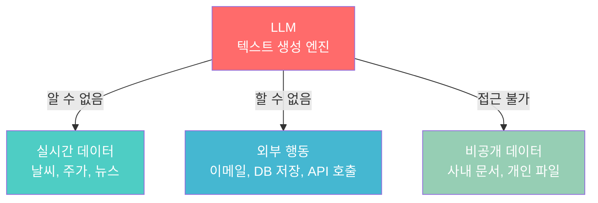
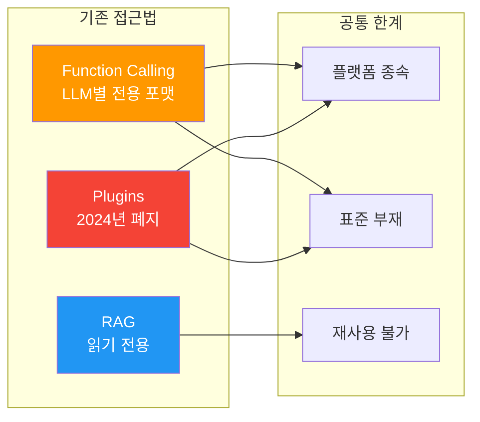
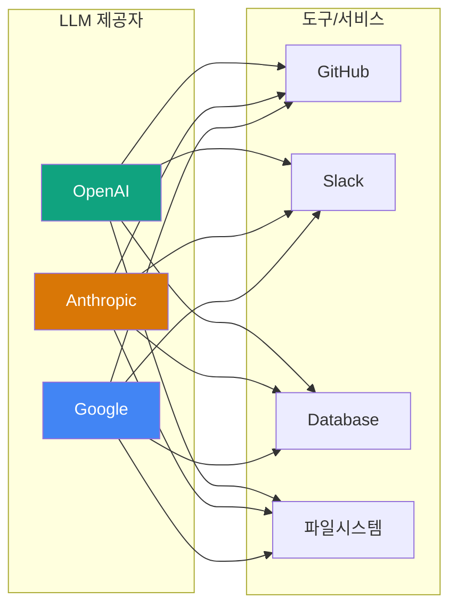
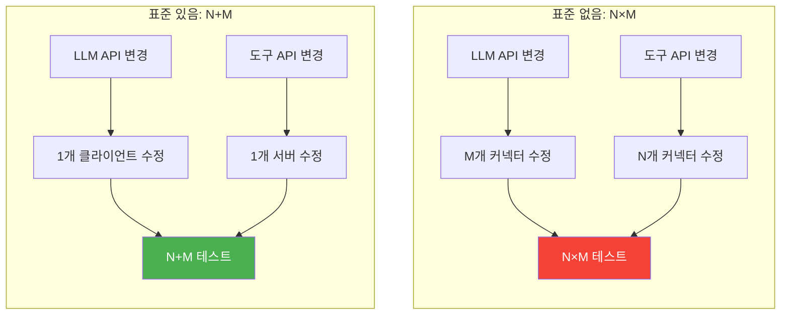

# LLM의 도구 연결 문제

> LLM이 외부 세계와 만나야 하는 이유, 그리고 기존 방식이 왜 한계에 부딪혔는지 알아봅니다.

## 개요

이 섹션에서는 LLM(대규모 언어 모델)이 왜 외부 도구와 데이터에 접근해야 하는지, 그리고 기존의 Function Calling, Plugin, RAG 같은 접근법이 어떤 구조적 한계를 가지는지 살펴봅니다. 특히 **N개의 LLM × M개의 도구 = N×M개의 커넥터**라는 조합 폭발 문제를 이해하고, 이것이 왜 MCP라는 표준 프로토콜의 탄생으로 이어졌는지 맥락을 잡습니다.

**선수 지식**: Python 기본 문법, LLM API 호출 경험 (OpenAI 또는 Anthropic API 사용 경험이 있으면 좋습니다)
**학습 목표**:
- LLM이 외부 도구와 데이터에 접근해야 하는 이유를 설명할 수 있다
- Function Calling, Plugin, RAG 등 기존 도구 연결 방식의 작동 원리와 한계를 이해한다
- N×M 통합 문제가 왜 발생하는지, 그 비용이 어떻게 증가하는지 계산할 수 있다

## 왜 알아야 할까?

여러분이 만든 AI 챗봇이 "오늘 서울 날씨 알려줘"라는 질문을 받았다고 상상해 보세요. LLM은 훈련 데이터에 기반해 답하기 때문에, **오늘** 날씨는 알 수 없습니다. 회사 데이터베이스의 매출 현황도, GitHub의 최신 이슈 목록도, 사내 Confluence 문서도 마찬가지죠.

이 문제는 단순한 불편이 아닙니다. LLM을 실제 업무에 쓰려면 **반드시** 외부 시스템과 연결해야 하는데, 지금까지 그 연결 방식이 모두 제각각이었거든요. OpenAI의 Function Calling, Anthropic의 Tool Use, Google의 Extensions — 각 플랫폼마다 다른 방식으로 도구를 붙여야 했습니다.

이 섹션을 이해하면, 다음 섹션에서 배울 MCP가 **왜** 필요한지, **어떤** 문제를 해결하는지 명확하게 알 수 있습니다.

## 핵심 개념

### 개념 1: LLM의 "정보 감옥" — 왜 도구가 필요한가

> 💡 **비유**: LLM은 백과사전을 통째로 암기한 천재와 같습니다. 무엇이든 물어보면 막힘없이 답하지만, 창문 없는 방에 갇혀 있어요. 밖에서 무슨 일이 벌어지고 있는지, 냉장고에 뭐가 있는지, 오늘 주가가 어떤지는 전혀 모릅니다. 이 천재에게 **전화기**(Tool)나 **신문**(Resource)을 건네줘야 비로소 현실 세계와 소통할 수 있죠.

LLM의 근본적인 한계는 세 가지로 나눌 수 있습니다:

| 한계 | 설명 | 예시 |
|------|------|------|
| **지식 단절** | 훈련 데이터 이후의 정보를 모름 | "오늘 환율", "최신 SDK 버전" |
| **실행 불가** | 텍스트 생성만 가능, 행동 불가 | "이메일 보내줘", "DB에 저장해" |
| **데이터 격리** | 사내/개인 데이터에 접근 불가 | "우리 회사 매출", "내 일정" |

Anthropic은 이 상태를 **"정보 사일로에 갇힌 AI"**라고 표현했습니다. 아무리 똑똑한 모델이라도, 데이터와 도구 없이는 실질적인 업무를 수행할 수 없거든요.

> 📊 **그림 1**: LLM의 세 가지 근본 한계



이 한계를 극복하기 위해 등장한 것이 바로 **도구 연결(Tool Integration)** 개념입니다. LLM에게 외부 함수를 호출할 수 있는 능력을 부여하는 거죠. 모델이 "이 질문에 답하려면 날씨 API를 호출해야겠다"고 판단하면, 적절한 함수를 선택하고 인자를 생성해서 실행을 요청합니다. 결과를 받아 다시 자연어로 사용자에게 전달하는 흐름이에요.

그런데 문제는, 이 도구 연결을 **어떤 방식으로** 하느냐에 따라 개발자의 삶이 천국과 지옥을 오간다는 점입니다.

### 개념 2: 기존 접근법들 — Function Calling, Plugin, RAG

> 💡 **비유**: 외국에 나가면 각 나라마다 콘센트 모양이 다릅니다. 한국은 둥근 2핀, 미국은 납작한 2핀, 영국은 네모난 3핀이죠. 여행할 때마다 해당 나라 어댑터를 사야 하는 것처럼, LLM마다 도구를 연결하는 "어댑터"가 전부 다릅니다.

업계는 LLM과 외부 도구를 연결하기 위해 여러 방식을 시도해왔습니다:

**1) OpenAI Function Calling (2023년 6월~)**

OpenAI가 GPT-4에 도입한 방식으로, JSON Schema로 함수를 정의하면 LLM이 적절한 함수를 선택하고 인자를 생성합니다.

```python
# OpenAI Function Calling 방식
import openai

tools = [
    {
        "type": "function",
        "function": {
            "name": "get_weather",          # 함수 이름
            "description": "도시의 현재 날씨를 조회합니다",
            "parameters": {
                "type": "object",
                "properties": {
                    "city": {
                        "type": "string",
                        "description": "도시명 (예: Seoul)"
                    }
                },
                "required": ["city"]
            }
        }
    }
]

# OpenAI 전용 API 호출
response = openai.chat.completions.create(
    model="gpt-4",
    messages=[{"role": "user", "content": "서울 날씨 알려줘"}],
    tools=tools  # OpenAI 전용 포맷
)
```

**2) Anthropic Tool Use**

Anthropic의 Claude도 비슷하지만 **다른** 포맷을 사용합니다:

```python
# Anthropic Tool Use 방식
import anthropic

tools = [
    {
        "name": "get_weather",
        "description": "도시의 현재 날씨를 조회합니다",
        "input_schema": {       # OpenAI는 "parameters", Anthropic은 "input_schema"
            "type": "object",
            "properties": {
                "city": {
                    "type": "string",
                    "description": "도시명"
                }
            },
            "required": ["city"]
        }
    }
]

# Anthropic 전용 API 호출
response = anthropic.Anthropic().messages.create(
    model="claude-sonnet-4-20250514",
    max_tokens=1024,
    tools=tools,  # Anthropic 전용 포맷
    messages=[{"role": "user", "content": "서울 날씨 알려줘"}]
)
```

**3) ChatGPT Plugins (2023년 3월 ~ 2024년 4월 폐지)**

OpenAI가 시도했던 플러그인 시스템은 `openapi.json` 매니페스트를 작성하면 ChatGPT가 외부 API를 호출하는 방식이었습니다. 하지만 보안 문제와 유지보수 부담으로 **2024년 4월에 완전히 폐지**되었습니다.

**4) RAG (Retrieval-Augmented Generation)**

외부 문서를 벡터 DB에 저장하고, 질문과 관련된 문서를 검색해서 프롬프트에 주입하는 방식입니다. 데이터 접근 문제는 해결하지만, **행동 실행**(이메일 전송, DB 쓰기 등)은 불가능합니다.

> 📊 **그림 2**: 기존 도구 연결 방식들의 비교



이 모든 접근법의 공통 문제는 명확합니다: **표준이 없다는 것.** 각 LLM 제공자마다 도구를 연결하는 프로토콜이 달라서, 도구 하나를 만들면 각 LLM에 맞게 따로따로 어댑터를 작성해야 합니다.

### 개념 3: N×M 문제 — 조합 폭발의 늪

> 💡 **비유**: 5개 국어를 사용하는 국제회의에서, 통역사 없이 모든 참석자가 직접 소통하려면 어떻게 될까요? 한국어↔영어, 한국어↔일본어, 영어↔프랑스어... 가능한 언어 쌍의 수는 $\frac{N(N-1)}{2}$ 로 폭발합니다. 하지만 **공용어(영어)**를 하나 정하면? 각자 영어만 배우면 되니까 N개로 줄어들죠. MCP는 AI 세계의 공용어입니다.

현실 세계의 LLM 도구 통합 상황을 숫자로 봅시다:

- **LLM 제공자 (N)**: OpenAI, Anthropic, Google, Meta, Mistral, Cohere...
- **도구/서비스 (M)**: GitHub, Slack, DB, 파일시스템, 날씨 API, 메일...

표준 없이 각 LLM에 각 도구를 연결하려면 **N × M개**의 커넥터가 필요합니다.

> 📊 **그림 3**: N×M 문제 — 표준 없는 도구 연결



3개 LLM × 4개 도구 = **12개 커넥터**. 하지만 현실에서는 LLM이 6개 이상, 도구가 수십~수백 개이므로:

```run:python
# N×M 문제의 규모를 직접 계산해 봅시다
llm_providers = ["OpenAI", "Anthropic", "Google", "Meta", "Mistral", "Cohere"]
tools = ["GitHub", "Slack", "PostgreSQL", "MongoDB", "S3", "Gmail",
         "Calendar", "Jira", "Confluence", "Notion"]

n = len(llm_providers)  # LLM 수
m = len(tools)           # 도구 수

connectors_without_standard = n * m       # 표준 없이: N×M
connectors_with_standard = n + m          # 표준 있으면: N+M

print(f"LLM 제공자: {n}개")
print(f"도구/서비스: {m}개")
print(f"")
print(f"[표준 없음] 필요한 커넥터: {n} × {m} = {connectors_without_standard}개")
print(f"[표준 있음] 필요한 커넥터: {n} + {m} = {connectors_with_standard}개")
print(f"")
print(f"절감률: {(1 - connectors_with_standard / connectors_without_standard) * 100:.1f}%")
```

```output
LLM 제공자: 6개
도구/서비스: 10개

[표준 없음] 필요한 커넥터: 6 × 10 = 60개
[표준 있음] 필요한 커넥터: 6 + 10 = 16개

절감률: 73.3%
```

60개의 커넥터를 16개로 줄일 수 있다니, 숫자가 커질수록 그 차이는 더 극적입니다. 도구가 100개로 늘어나면? **600개 vs 106개** — 약 82%의 절감입니다.

> ⚠️ **흔한 오해**: "Function Calling만 있으면 도구 연결 문제가 해결된 거 아닌가요?"
> 
> Function Calling은 LLM이 함수를 **호출하는 능력**을 부여하지만, 호출 **방식**(프로토콜)은 각 제공자마다 다릅니다. OpenAI의 `tools` 파라미터와 Anthropic의 `tools` 파라미터는 비슷해 보이지만 스키마 구조, 응답 형식, 에러 처리가 모두 다릅니다. Function Calling은 **능력**이고, MCP는 **표준**입니다. 마치 "전화를 걸 수 있는 능력"과 "전화번호 체계(국번+번호)"가 다른 것처럼요.

### 개념 4: N×M의 숨겨진 비용 — 유지보수 지옥

단순히 커넥터 수만 문제가 아닙니다. 각 커넥터에는 **지속적인 유지보수 비용**이 따라옵니다:

| 비용 항목 | 설명 |
|-----------|------|
| **API 변경 추적** | 각 LLM 제공자가 API를 업데이트할 때마다 M개의 커넥터를 수정 |
| **인증 방식 차이** | OAuth, API Key, Session Token 등 서비스마다 다른 인증 |
| **에러 처리 분기** | 각 조합별로 다른 에러 코드와 재시도 전략 |
| **테스트 매트릭스** | N×M개의 조합을 모두 테스트해야 함 |
| **문서화** | 각 조합별 통합 가이드 작성 |

> 📊 **그림 4**: 유지보수 비용의 증가 — N×M vs N+M



한 LLM 제공자가 API를 바꾸면, 표준 없이는 해당 LLM에 연결된 **M개의 커넥터를 모두** 수정해야 합니다. 표준이 있으면? **클라이언트 어댑터 1개**만 고치면 됩니다.

## 실습: 직접 해보기

N×M 문제가 실제 코드에서 어떤 모습인지, 그리고 표준 프로토콜이 있으면 어떻게 바뀌는지 직접 비교해 봅시다.

```python
# ========================================
# 시나리오: 날씨 도구를 여러 LLM에 연결하기
# ========================================
from abc import ABC, abstractmethod
from dataclasses import dataclass


# ── 1. 표준 없는 세계: 각 LLM별 커넥터를 따로 작성 ──

class OpenAIWeatherConnector:
    """OpenAI 전용 날씨 커넥터"""
    
    def get_tool_definition(self) -> dict:
        return {
            "type": "function",              # OpenAI 전용 포맷
            "function": {
                "name": "get_weather",
                "description": "도시의 현재 날씨를 조회합니다",
                "parameters": {              # OpenAI는 "parameters"
                    "type": "object",
                    "properties": {
                        "city": {"type": "string", "description": "도시명"}
                    },
                    "required": ["city"]
                }
            }
        }
    
    def handle_response(self, response) -> str:
        # OpenAI 전용 응답 파싱 로직
        tool_call = response.choices[0].message.tool_calls[0]
        return tool_call.function.arguments


class AnthropicWeatherConnector:
    """Anthropic 전용 날씨 커넥터"""
    
    def get_tool_definition(self) -> dict:
        return {
            "name": "get_weather",
            "description": "도시의 현재 날씨를 조회합니다",
            "input_schema": {                # Anthropic은 "input_schema"
                "type": "object",
                "properties": {
                    "city": {"type": "string", "description": "도시명"}
                },
                "required": ["city"]
            }
        }
    
    def handle_response(self, response) -> str:
        # Anthropic 전용 응답 파싱 로직
        for block in response.content:
            if block.type == "tool_use":
                return block.input


class GoogleWeatherConnector:
    """Google Gemini 전용 날씨 커넥터"""
    
    def get_tool_definition(self) -> dict:
        return {
            "function_declarations": [{      # Google은 또 다른 포맷
                "name": "get_weather",
                "description": "도시의 현재 날씨를 조회합니다",
                "parameters": {
                    "type": "OBJECT",        # Google은 대문자 타입
                    "properties": {
                        "city": {"type": "STRING", "description": "도시명"}
                    },
                    "required": ["city"]
                }
            }]
        }


# ── 2. 표준 있는 세계: 하나의 인터페이스로 통일 ──

class StandardToolProtocol(ABC):
    """표준 프로토콜 인터페이스 (MCP가 하는 일의 개념적 모델)"""
    
    @abstractmethod
    def list_tools(self) -> list[dict]:
        """서버가 제공하는 도구 목록 반환"""
        ...
    
    @abstractmethod
    def call_tool(self, name: str, arguments: dict) -> dict:
        """도구를 실행하고 표준 형식으로 결과 반환"""
        ...


class WeatherServer(StandardToolProtocol):
    """표준 프로토콜을 따르는 날씨 서버 — 한 번만 작성!"""
    
    def list_tools(self) -> list[dict]:
        return [{
            "name": "get_weather",
            "description": "도시의 현재 날씨를 조회합니다",
            "inputSchema": {                 # 표준 스키마 — 모든 LLM이 동일
                "type": "object",
                "properties": {
                    "city": {"type": "string", "description": "도시명"}
                },
                "required": ["city"]
            }
        }]
    
    def call_tool(self, name: str, arguments: dict) -> dict:
        # 실제로는 날씨 API를 호출하겠지만, 여기서는 시뮬레이션
        city = arguments.get("city", "Unknown")
        return {
            "content": [
                {"type": "text", "text": f"{city}의 현재 기온: 18°C, 맑음"}
            ]
        }
```

이제 이 차이를 눈으로 확인해 봅시다:

```run:python
# N×M 비용 시뮬레이터
def calculate_integration_cost(n_llms: int, m_tools: int) -> None:
    """N×M vs N+M 비용을 비교합니다"""
    
    # 표준 없는 세계
    no_std_connectors = n_llms * m_tools
    no_std_dev_hours = no_std_connectors * 40        # 커넥터당 40시간
    no_std_maintenance = no_std_connectors * 8       # 월 유지보수 8시간
    
    # 표준 있는 세계
    std_connectors = n_llms + m_tools
    std_dev_hours = n_llms * 16 + m_tools * 24       # 클라이언트 16h, 서버 24h
    std_maintenance = std_connectors * 4             # 월 유지보수 4시간
    
    print(f"=== {n_llms}개 LLM × {m_tools}개 도구 ===")
    print(f"")
    print(f"[표준 없음 - N×M]")
    print(f"  커넥터 수:     {no_std_connectors}개")
    print(f"  개발 시간:     {no_std_dev_hours:,}시간")
    print(f"  월 유지보수:   {no_std_maintenance:,}시간")
    print(f"")
    print(f"[표준 있음 - N+M]")
    print(f"  커넥터 수:     {std_connectors}개")
    print(f"  개발 시간:     {std_dev_hours:,}시간")
    print(f"  월 유지보수:   {std_maintenance:,}시간")
    print(f"")
    print(f"  개발 시간 절감: {(1 - std_dev_hours/no_std_dev_hours)*100:.0f}%")
    print(f"  유지보수 절감:  {(1 - std_maintenance/no_std_maintenance)*100:.0f}%")

# 현실적인 시나리오
calculate_integration_cost(n_llms=5, m_tools=20)
```

```output
=== 5개 LLM × 20개 도구 ===

[표준 없음 - N×M]
  커넥터 수:     100개
  개발 시간:     4,000시간
  월 유지보수:   800시간

[표준 있음 - N+M]
  커넥터 수:     25개
  개발 시간:     560시간
  월 유지보수:   100시간

  개발 시간 절감: 86%
  유지보수 절감:  88%
```

4,000시간 vs 560시간 — 약 **86%의 개발 시간 절감**. 월 유지보수도 800시간에서 100시간으로 줄어듭니다. 이것이 바로 표준 프로토콜의 힘입니다.

## 더 깊이 알아보기

### USB의 탄생 — 역사가 반복되다

사실 N×M 문제는 AI 분야에서 처음 등장한 것이 아닙니다. 1990년대 컴퓨터 주변기기 세계가 정확히 같은 문제를 겪었거든요.

프린터는 패럴렐 포트, 마우스는 PS/2, 모뎀은 시리얼 포트, 키보드는 DIN 커넥터... 새 기기를 연결할 때마다 전용 포트와 드라이버가 필요했습니다. 1996년, Intel, Microsoft, Compaq 등 7개 회사가 모여 **USB(Universal Serial Bus)**를 만들었습니다. "하나의 포트로 모든 기기를 연결한다"는 단순한 아이디어가 세상을 바꿨죠.

MCP의 탄생도 같은 패턴입니다. 2024년 11월, Anthropic이 MCP를 오픈소스로 공개했을 때 사용한 표현이 바로 **"AI의 USB-C"**였습니다. 그리고 불과 1년 만에:

- **월 9,700만 회** 이상의 SDK 다운로드
- **10,000개** 이상의 활성 MCP 서버
- OpenAI, Google, Microsoft, Amazon 등 주요 기업의 채택
- 2025년 12월, **Linux Foundation 산하 Agentic AI Foundation(AAIF)**에 기증

ChatGPT, Claude, Gemini, Cursor, VS Code — 이 모든 플랫폼이 MCP를 지원하게 되었습니다. 표준의 힘이 다시 한번 증명된 순간이었죠.

### ChatGPT Plugins의 교훈

OpenAI는 2023년 3월 ChatGPT Plugins를 야심차게 발표했습니다. 외부 서비스를 ChatGPT에 연결하는 "앱스토어"를 만들겠다는 구상이었죠. 하지만 이 시스템은 여러 문제에 부딪혔습니다:

- **보안 취약점**: 악의적인 도구 출력이 모델을 조작할 수 있는 프롬프트 인젝션 위험
- **ChatGPT 전용**: 다른 LLM에서는 사용 불가능한 폐쇄적 생태계
- **유지보수 부담**: 플러그인 개발자와 OpenAI 양쪽 모두 관리 비용이 과도

결국 2024년 3월 19일부터 신규 플러그인 대화가 차단되고, 4월 9일에 완전히 폐지되었습니다. Plugins의 실패는 **플랫폼 종속적 도구 연결**의 한계를 명확히 보여준 사례입니다.

> 💡 **알고 계셨나요?**: MCP를 처음 제안한 것은 Anthropic의 엔지니어들이었지만, 2025년 12월에 Anthropic은 MCP를 Linux Foundation에 기증했습니다. 경쟁사인 OpenAI와 Google까지 **공동 창립 멤버**로 참여한 Agentic AI Foundation(AAIF)이 MCP를 관리하게 되었죠. AI 업계의 경쟁자들이 표준화를 위해 손잡은 것은 마치 1996년 Intel과 Microsoft가 USB를 위해 협력한 것과 놀랍도록 닮아있습니다.

## 흔한 오해와 팁

> ⚠️ **흔한 오해**: "RAG가 있으니 MCP는 필요 없다"
> 
> RAG는 **데이터 검색**에 특화된 패턴입니다. 외부 문서를 벡터화하여 유사도 검색 후 컨텍스트에 주입하죠. 하지만 "GitHub에 이슈 등록해줘", "Slack에 메시지 보내줘" 같은 **행동 실행**은 RAG로 할 수 없습니다. MCP는 읽기(Resources)와 쓰기(Tools)를 **모두** 표준화합니다. RAG는 MCP의 Resource 프리미티브로 자연스럽게 통합될 수 있어요.

> 🔥 **실무 팁**: 기존에 OpenAI Function Calling으로 구축한 도구가 있다면, MCP로 전환할 때 **도구의 비즈니스 로직은 그대로** 재사용할 수 있습니다. 바뀌는 것은 도구를 노출하고 호출하는 **프로토콜 레이어**뿐이에요. 기존 `get_weather()` 함수 본체를 MCP 서버의 `@tool` 데코레이터로 감싸면 됩니다.

> 💡 **알고 계셨나요?**: Function Calling이라는 용어는 OpenAI가 2023년 6월에 대중화했지만, LLM이 구조화된 출력을 생성하도록 유도하는 아이디어 자체는 더 오래되었습니다. 초기에는 "JSON mode"나 "structured output"이라 불렸고, 점차 도구 호출이라는 개념으로 발전했습니다. MCP는 이 진화의 최신 단계 — **도구 호출의 표준화** — 에 해당합니다.

## 핵심 정리

| 개념 | 설명 |
|------|------|
| **LLM의 한계** | 실시간 데이터 접근 불가, 외부 행동 실행 불가, 비공개 데이터 격리 |
| **Function Calling** | LLM이 함수를 호출하는 능력. 단, LLM 제공자마다 포맷이 다름 |
| **ChatGPT Plugins** | OpenAI의 플러그인 시스템. 플랫폼 종속성과 보안 문제로 2024년 폐지 |
| **RAG** | 외부 문서 검색 → 컨텍스트 주입. 읽기 전용, 행동 실행 불가 |
| **N×M 문제** | N개 LLM × M개 도구 = N×M개 커넥터. 표준 없이는 조합이 폭발적으로 증가 |
| **N+M 해결** | 표준 프로토콜(MCP)을 도입하면 N+M개의 구현으로 모든 조합을 커버 |
| **유지보수 비용** | N×M은 하나의 API 변경이 M개의 커넥터에 영향. 표준 있으면 1개만 수정 |

## 다음 섹션 미리보기

N×M 문제가 왜 심각한지 이해했으니, 다음 섹션 [02. MCP — AI의 USB-C](01-ch1-mcp의-탄생과-설계-철학/02-02-mcp-ai의-usb-c.md)에서는 이 문제를 해결하기 위해 Anthropic이 설계한 **MCP(Model Context Protocol)**의 핵심 아이디어를 본격적으로 파헤칩니다. USB-C가 모든 기기를 하나의 포트로 연결했듯, MCP가 Host-Client-Server 아키텍처로 LLM과 도구를 어떻게 표준화하는지 살펴보겠습니다.

## 참고 자료

- [Introducing the Model Context Protocol — Anthropic Blog](https://www.anthropic.com/news/model-context-protocol) - MCP의 공식 발표 블로그. 탄생 배경과 설계 의도를 Anthropic이 직접 설명합니다
- [What Is the Model Context Protocol (MCP) and How It Works — Descope](https://www.descope.com/learn/post/mcp) - N×M 문제와 MCP 아키텍처를 다이어그램과 함께 명확하게 설명하는 가이드
- [Model Context Protocol — Official Documentation](https://modelcontextprotocol.io/) - MCP 공식 문서. 스펙, 튜토리얼, SDK 레퍼런스를 모두 제공합니다
- [Donating MCP and Establishing the Agentic AI Foundation — Anthropic](https://www.anthropic.com/news/donating-the-model-context-protocol-and-establishing-of-the-agentic-ai-foundation) - MCP를 Linux Foundation에 기증한 배경과 AAIF 설립 발표
- [Function Calling and Other API Updates — OpenAI](https://openai.com/index/function-calling-and-other-api-updates/) - 2023년 6월 Function Calling 최초 발표. MCP 이전의 도구 연결 방식을 이해하는 데 도움됩니다
- [Model Context Protocol — Wikipedia](https://en.wikipedia.org/wiki/Model_Context_Protocol) - MCP의 역사, 채택 현황, 기술적 개요를 종합적으로 정리