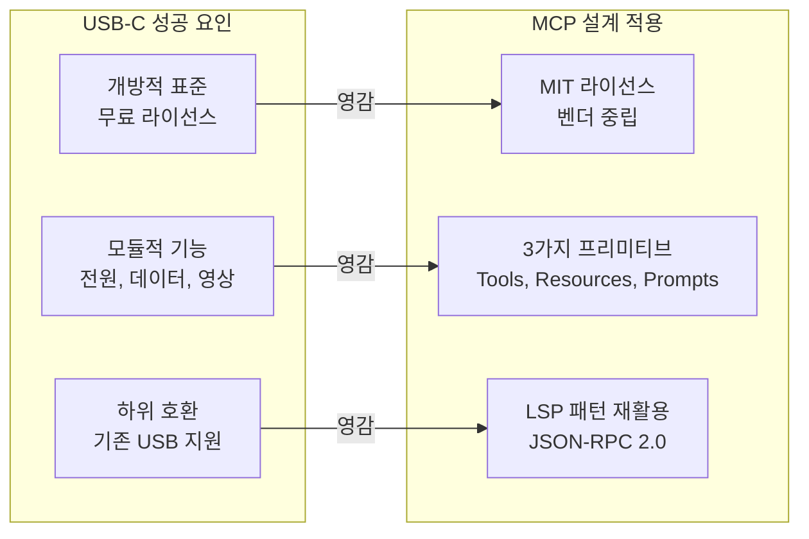
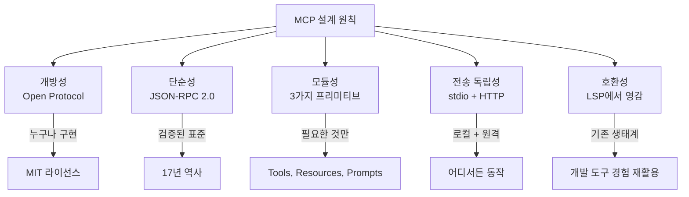
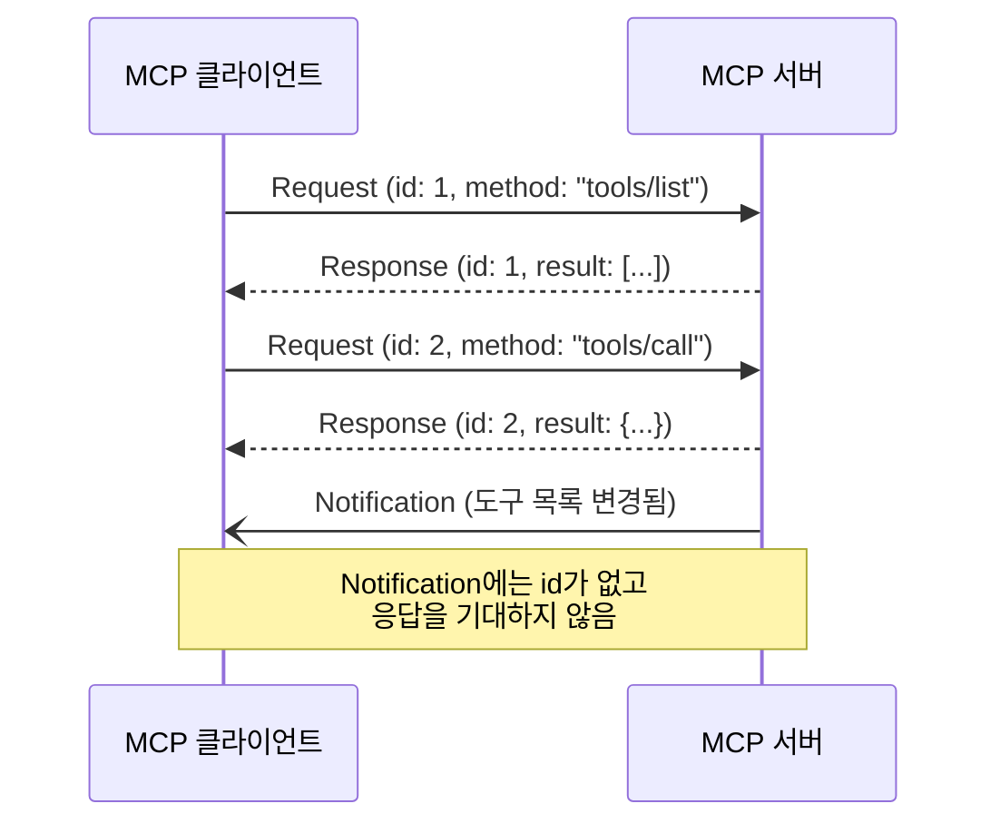
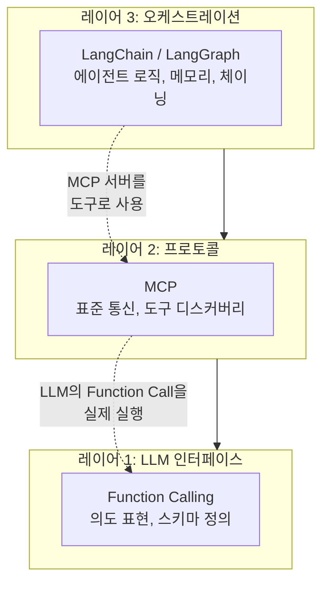
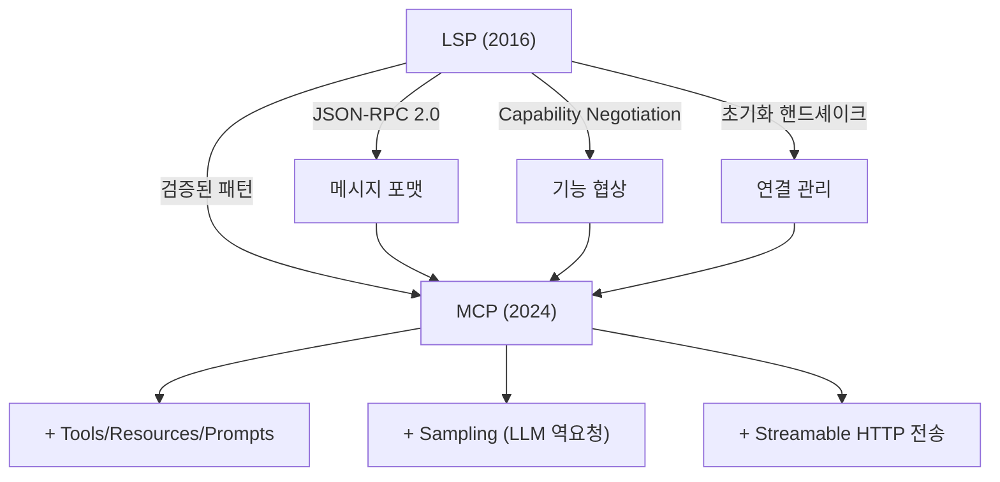

# MCP — AI의 USB-C

> 표준 프로토콜 하나로 LLM과 외부 세계를 연결하는 MCP의 핵심 설계 철학을 이해합니다.

## 개요

이 섹션에서는 MCP(Model Context Protocol)가 **어떤 설계 철학** 위에 만들어졌는지, 그리고 그 철학이 **프로토콜의 구체적 선택**으로 어떻게 이어졌는지를 깊이 있게 살펴봅니다. [이전 섹션](01-ch1-mcp의-탄생과-설계-철학/01-01-llm의-도구-연결-문제.md)에서 커스텀 통합의 한계와 N×M 문제를 확인했으니, 이번에는 MCP가 그 문제를 **어떤 원칙과 기술적 선택으로** 풀어냈는지에 집중합니다.

**선수 지식**: [01. LLM의 도구 연결 문제](01-ch1-mcp의-탄생과-설계-철학/01-01-llm의-도구-연결-문제.md)에서 배운 N×M 통합 문제, Function Calling의 벤더 종속성

**학습 목표**:
- MCP의 오픈 프로토콜 설계 원칙 5가지(개방성, 단순성, 모듈성, 전송 독립성, 호환성)를 이해한다
- JSON-RPC 2.0을 선택한 기술적 이유를 설명할 수 있다
- LSP에서 MCP로 이어지는 프로토콜 설계의 계보를 설명할 수 있다
- MCP vs Function Calling vs LangChain Tools의 역할 차이를 구분할 수 있다

## 왜 알아야 할까?

이전 섹션에서 N×M 통합 문제가 얼마나 고통스러운지 확인했습니다. 그런데 "표준 프로토콜을 만들자"는 아이디어 자체는 어렵지 않죠 — 진짜 어려운 건 **어떤 표준을 어떻게 설계하느냐**입니다.

역사적으로 표준 프로토콜 시도는 수없이 많았지만, 실패한 것도 셀 수 없이 많습니다. CORBA, SOAP, XML-RPC... 좋은 의도로 시작했지만 과도한 복잡성이나 벤더 종속성 때문에 사라진 프로토콜들이죠. MCP가 이들과 달리 빠르게 채택되고 있는 건 **설계 철학** 때문입니다.

이 섹션을 마치면, MCP의 기술적 선택 하나하나에 담긴 의도를 이해하고, "왜 MCP가 다른 표준화 시도와 달리 성공하고 있는가"라는 질문에 답할 수 있게 됩니다.

## 핵심 개념

### 개념 1: 프로토콜 설계의 교훈 — USB-C가 성공한 이유

> 💡 **비유**: USB-C가 성공한 건 단순히 "하나의 포트"였기 때문이 아닙니다. 이전에도 통합 포트 시도는 있었거든요. USB-C가 달랐던 건 세 가지 설계 원칙 때문이었습니다 — **개방적 표준**(어떤 제조사든 무료로 사용), **하위 호환성**(기존 USB 장치 지원), **모듈적 기능**(전원·데이터·영상을 필요한 것만 선택). MCP는 이 교훈을 AI 프로토콜에 정확히 적용했습니다.

[이전 섹션](01-ch1-mcp의-탄생과-설계-철학/01-01-llm의-도구-연결-문제.md)에서 본 것처럼, 커스텀 통합의 N×M 문제를 N+M으로 줄이려면 "중간 표준"이 필요합니다. 하지만 아무 표준이나 되는 게 아닙니다. MCP 공식 문서에서 USB-C 비유를 쓰는 건 연결의 **단순화**뿐 아니라, 성공하는 표준의 **설계 철학**까지 함께 빗대기 위해서입니다.

> 📊 **그림 1**: USB-C 성공 원칙과 MCP 설계의 대응



핵심은 **"한 번 만들면, 어디서든 쓴다(Build once, use everywhere)"**입니다. MCP 서버를 한 번 만들면 Claude Desktop, VS Code, Cursor, ChatGPT 등 어떤 MCP 호환 클라이언트에서든 바로 사용할 수 있습니다. 그리고 이것이 가능한 건 다음에 다룰 5가지 설계 원칙 덕분입니다.

### 개념 2: MCP의 5가지 설계 원칙

Anthropic이 MCP를 설계할 때 세운 핵심 원칙들이 있습니다. 이 원칙들을 알면 "왜 이렇게 만들었는가"가 명확해지고, 수많은 실패한 표준과 MCP의 차이도 보입니다.

> 📊 **그림 2**: MCP 설계 원칙



**1. 개방성(Openness)**: MCP는 MIT 라이선스의 오픈소스 프로토콜입니다. Anthropic이 만들었지만, 특정 벤더에 종속되지 않아요. OpenAI도 ChatGPT에 MCP 지원을 추가했고, Microsoft도 VS Code에 통합했습니다. SOAP 같은 과거 표준이 특정 벤더의 이해관계에 묶여 실패한 것과 대조적이죠.

**2. 단순성(Simplicity)**: 메시지 포맷으로 JSON-RPC 2.0을 채택했습니다. 새로운 프로토콜을 발명하지 않고, 17년간 검증된 표준을 골랐죠. 메시지 타입은 Request, Response, Notification 단 세 가지뿐이어서, 어떤 언어로든 빠르게 SDK를 구현할 수 있습니다. CORBA의 IDL이나 SOAP의 WSDL처럼 복잡한 설정이 필요 없습니다.

**3. 모듈성(Modularity)**: Tools, Resources, Prompts 세 가지 프리미티브를 독립적으로 조합할 수 있습니다. 서버가 세 가지를 모두 구현할 필요 없이, 필요한 것만 골라 노출하면 됩니다. 예를 들어 날씨 서버는 Tools만, 문서 저장소는 Resources만 제공해도 완전히 유효한 MCP 서버입니다.

**4. 전송 독립성(Transport Agnosticism)**: 메시지 포맷과 전송 계층을 분리했습니다. 로컬에서는 stdio, 원격에서는 Streamable HTTP를 쓰지만, 프로토콜 메시지 자체는 동일합니다. 전송 방식이 바뀌어도 서버 로직을 수정할 필요가 없죠.

**5. 호환성(Compatibility)**: LSP(Language Server Protocol)의 아키텍처를 참고했습니다. VS Code 생태계에서 검증된 패턴 — JSON-RPC 메시지, Capability Negotiation, 초기화 핸드셰이크 등 — 을 AI 영역에 적용한 것이죠. 이미 LSP 경험이 있는 개발자라면 MCP의 구조가 매우 익숙하게 느껴질 겁니다.

> ⚠️ **흔한 오해**: "오픈 프로토콜이면 누구나 마음대로 바꿀 수 있다"고 생각하는 분이 있습니다. MCP는 오픈소스지만, 프로토콜 스펙 자체의 변경은 공식 프로세스를 통해 관리됩니다. "사용은 자유, 구현은 자유, 하지만 호환성을 깨는 변경은 합의가 필요"한 구조입니다.

### 개념 3: JSON-RPC 2.0 — 왜 이 프로토콜인가?

> 💡 **비유**: 편지를 보내는 방법에 비유해볼까요? REST API가 "편지를 보낼 때 봉투 크기, 우표 종류, 주소 형식까지 세세하게 정하는 국제 우편 규약"이라면, JSON-RPC는 "보낸 사람, 받는 사람, 내용"만 적으면 되는 **엽서**에 가깝습니다. 단순하지만 필요한 건 다 담겨 있죠.

JSON-RPC 2.0은 2010년에 공개된 경량 RPC 프로토콜입니다. MCP가 이를 선택한 이유는 세 가지입니다:

**첫째, 입증된 안정성.** LSP(Language Server Protocol)가 이미 JSON-RPC 2.0을 사용하여 VS Code와 수십 개 언어 서버를 성공적으로 연결하고 있었습니다. "바퀴를 다시 발명하지 않겠다"는 실용적 결정이었죠.

**둘째, 극단적 단순성.** 메시지 타입이 딱 세 가지뿐입니다:

```python
# 1. Request — 응답을 기대하는 요청
request = {
    "jsonrpc": "2.0",
    "id": 1,                          # 요청 식별자
    "method": "tools/call",           # 호출할 메서드
    "params": {                       # 매개변수
        "name": "get_weather",
        "arguments": {"city": "Seoul"}
    }
}

# 2. Response — 요청에 대한 응답
response = {
    "jsonrpc": "2.0",
    "id": 1,                          # 어떤 요청의 응답인지
    "result": {                       # 성공 결과
        "content": [{"type": "text", "text": "서울: 맑음, 18°C"}]
    }
}

# 3. Notification — 응답이 필요 없는 단방향 알림
notification = {
    "jsonrpc": "2.0",
    "method": "notifications/tools/list_changed",
    # id 필드 없음 = 응답 불필요
}
```

**셋째, 전송 독립성.** JSON-RPC는 메시지 포맷만 정의하고, 어떻게 전달할지는 관여하지 않습니다. 덕분에 MCP는 같은 메시지를 stdin/stdout으로도, HTTP POST로도 보낼 수 있습니다.

> 📊 **그림 3**: JSON-RPC 2.0 메시지 흐름



### 개념 4: MCP vs Function Calling vs LangChain Tools

이 세 가지는 자주 비교되지만, 사실 **서로 다른 계층**에서 작동합니다. 축구팀에 비유하면 이해가 쉬워요:

- **Function Calling** = 감독의 전술 지시 ("공을 오른쪽으로 패스해!") → LLM이 어떤 함수를 호출할지 **결정**하는 단계
- **MCP** = 경기장의 규격과 규칙 (FIFA 표준) → 호출을 **실행**하는 표준화된 프로토콜
- **LangChain Tools** = 팀의 훈련 프로그램 → 에이전트 **오케스트레이션** 프레임워크

> 📊 **그림 4**: 세 가지 접근법의 레이어 비교



구체적인 차이를 표로 정리하면:

| 기준 | Function Calling | MCP | LangChain Tools |
|------|-----------------|-----|-----------------|
| **계층** | LLM 인터페이스 | 통신 프로토콜 | 오케스트레이션 |
| **역할** | "무엇을 호출할지" 결정 | "어떻게 호출하고 응답할지" 표준화 | 에이전트 로직 구성 |
| **표준화** | 벤더별 상이 | 오픈 표준 (JSON-RPC) | 프레임워크 API |
| **도구 디스커버리** | 없음 (사전 정의) | 있음 (동적 조회) | 프레임워크 내부 |
| **스케일링** | LLM별 개별 구현 | 서버 1개 → 모든 클라이언트 | 프레임워크 종속 |
| **관계** | MCP와 보완적 | FC 위에서 작동 | MCP를 도구로 통합 가능 |

중요한 건 이 세 가지가 **경쟁이 아니라 협력** 관계라는 점입니다. LangChain은 이미 MCP 서버를 도구로 통합하는 어댑터를 제공하고 있고, Function Calling의 결과를 MCP 프로토콜로 전달하는 것이 자연스러운 아키텍처입니다.

## 실습: 직접 해보기

MCP의 메시지 구조를 Python 코드로 직접 만들어보겠습니다. 아직 MCP SDK를 설치하기 전이므로, JSON-RPC 2.0 메시지를 수동으로 구성하면서 프로토콜의 뼈대를 체감해봅시다.

```python
import json
from dataclasses import dataclass, field, asdict
from typing import Any, Optional


# --- JSON-RPC 2.0 메시지 빌더 ---

@dataclass
class JsonRpcRequest:
    """JSON-RPC 2.0 요청 메시지"""
    method: str
    id: int
    params: dict = field(default_factory=dict)
    jsonrpc: str = "2.0"

    def to_json(self) -> str:
        return json.dumps(asdict(self), ensure_ascii=False, indent=2)


@dataclass
class JsonRpcResponse:
    """JSON-RPC 2.0 응답 메시지"""
    id: int
    result: Optional[Any] = None
    error: Optional[dict] = None
    jsonrpc: str = "2.0"

    def to_json(self) -> str:
        data = {"jsonrpc": self.jsonrpc, "id": self.id}
        if self.error:
            data["error"] = self.error
        else:
            data["result"] = self.result
        return json.dumps(data, ensure_ascii=False, indent=2)


@dataclass
class JsonRpcNotification:
    """JSON-RPC 2.0 알림 (id 없음 = 응답 불필요)"""
    method: str
    params: dict = field(default_factory=dict)
    jsonrpc: str = "2.0"

    def to_json(self) -> str:
        return json.dumps(asdict(self), ensure_ascii=False, indent=2)
```

이제 MCP에서 실제로 주고받는 메시지를 시뮬레이션해보겠습니다:

```run:python
import json

# 1. 클라이언트 → 서버: 사용 가능한 도구 목록 요청
tools_list_request = {
    "jsonrpc": "2.0",
    "id": 1,
    "method": "tools/list",
    "params": {}
}
print("📤 [클라이언트 → 서버] 도구 목록 요청:")
print(json.dumps(tools_list_request, ensure_ascii=False, indent=2))

# 2. 서버 → 클라이언트: 도구 목록 응답
tools_list_response = {
    "jsonrpc": "2.0",
    "id": 1,
    "result": {
        "tools": [
            {
                "name": "get_weather",
                "description": "지정된 도시의 현재 날씨를 조회합니다",
                "inputSchema": {
                    "type": "object",
                    "properties": {
                        "city": {"type": "string", "description": "도시 이름"}
                    },
                    "required": ["city"]
                }
            }
        ]
    }
}
print("\n📥 [서버 → 클라이언트] 도구 목록 응답:")
print(json.dumps(tools_list_response, ensure_ascii=False, indent=2))

# 3. 클라이언트 → 서버: 도구 호출
tool_call_request = {
    "jsonrpc": "2.0",
    "id": 2,
    "method": "tools/call",
    "params": {
        "name": "get_weather",
        "arguments": {"city": "서울"}
    }
}
print("\n📤 [클라이언트 → 서버] 도구 호출:")
print(json.dumps(tool_call_request, ensure_ascii=False, indent=2))

# 4. 서버 → 클라이언트: 도구 호출 결과
tool_call_response = {
    "jsonrpc": "2.0",
    "id": 2,
    "result": {
        "content": [
            {"type": "text", "text": "서울: 맑음, 18°C, 습도 45%"}
        ]
    }
}
print("\n📥 [서버 → 클라이언트] 도구 호출 결과:")
print(json.dumps(tool_call_response, ensure_ascii=False, indent=2))
```

```output
📤 [클라이언트 → 서버] 도구 목록 요청:
{
  "jsonrpc": "2.0",
  "id": 1,
  "method": "tools/list",
  "params": {}
}

📥 [서버 → 클라이언트] 도구 목록 응답:
{
  "jsonrpc": "2.0",
  "id": 1,
  "result": {
    "tools": [
      {
        "name": "get_weather",
        "description": "지정된 도시의 현재 날씨를 조회합니다",
        "inputSchema": {
          "type": "object",
          "properties": {
            "city": {
              "type": "string",
              "description": "도시 이름"
            }
          },
          "required": [
            "city"
          ]
        }
      }
    ]
  }
}

📤 [클라이언트 → 서버] 도구 호출:
{
  "jsonrpc": "2.0",
  "id": 2,
  "method": "tools/call",
  "params": {
    "name": "get_weather",
    "arguments": {
      "city": "서울"
    }
  }
}

📥 [서버 → 클라이언트] 도구 호출 결과:
{
  "jsonrpc": "2.0",
  "id": 2,
  "result": {
    "content": [
      {
        "type": "text",
        "text": "서울: 맑음, 18°C, 습도 45%"
      }
    ]
  }
}
```

이 네 단계가 MCP의 핵심 통신 흐름입니다. `tools/list`로 어떤 도구가 있는지 **디스커버리**하고, `tools/call`로 실제 도구를 **호출**하는 것이죠. Function Calling과의 결정적 차이가 바로 이 **동적 디스커버리**에 있습니다 — Function Calling은 호출 가능한 함수 목록을 LLM에게 미리 알려줘야 하지만, MCP는 서버에 접속한 후 런타임에 사용 가능한 도구를 조회합니다.

다음으로, Function Calling과 MCP의 역할 차이를 코드로 비교해봅시다:

```run:python
# Function Calling: 벤더마다 다른 포맷
# ─────────────────────────────────────

# OpenAI 방식
openai_tools = [{
    "type": "function",
    "function": {
        "name": "get_weather",
        "parameters": {
            "type": "object",
            "properties": {"city": {"type": "string"}},
            "required": ["city"]
        }
    }
}]

# Anthropic 방식
anthropic_tools = [{
    "name": "get_weather",
    "input_schema": {
        "type": "object",
        "properties": {"city": {"type": "string"}},
        "required": ["city"]
    }
}]

# MCP 방식: 어떤 LLM이든 동일
# ─────────────────────────────
mcp_tool_schema = {
    "name": "get_weather",
    "description": "도시의 현재 날씨를 조회합니다",
    "inputSchema": {
        "type": "object",
        "properties": {"city": {"type": "string", "description": "도시 이름"}},
        "required": ["city"]
    }
}

print("🔴 OpenAI 키:  ", list(openai_tools[0].keys()))
print("🟡 Anthropic 키:", list(anthropic_tools[0].keys()))
print("🟢 MCP 키:     ", list(mcp_tool_schema.keys()))
print()
print("→ Function Calling은 벤더마다 포맷이 다름")
print("→ MCP는 하나의 표준 스키마로 통일")
```

```output
🔴 OpenAI 키:   ['type', 'function']
🟡 Anthropic 키: ['name', 'input_schema']
🟢 MCP 키:      ['name', 'description', 'inputSchema']

→ Function Calling은 벤더마다 포맷이 다름
→ MCP는 하나의 표준 스키마로 통일
```

## 더 깊이 알아보기

### LSP에서 MCP로 — 성공한 프로토콜의 DNA

MCP의 설계는 허공에서 나온 것이 아닙니다. **LSP(Language Server Protocol)**라는 선배가 이미 같은 문제를 같은 방식으로 해결한 경험이 있었거든요.

2016년, Microsoft는 VS Code를 만들면서 고민에 빠졌습니다. 에디터가 Python, JavaScript, Go, Rust 등 수십 개 언어를 지원하려면, 각 언어의 자동완성, 문법 검사, 리팩토링 기능을 모두 직접 구현해야 했습니다. 에디터 M개 × 언어 N개 = M×N개의 구현이 필요한 상황 — [이전 섹션](01-ch1-mcp의-탄생과-설계-철학/01-01-llm의-도구-연결-문제.md)에서 다룬 그 문제와 똑같죠?

Microsoft의 해결책은 LSP라는 표준 프로토콜이었습니다. 언어별로 "Language Server"를 만들고, 에디터는 이 표준 프로토콜만 구현하면 되는 구조. JSON-RPC 2.0을 메시지 포맷으로 채택했고, 결과는 대성공이었습니다. VS Code뿐 아니라 Vim, Emacs, Sublime Text까지 LSP를 채택했죠.

> 📊 **그림 5**: LSP에서 MCP로 — 프로토콜 설계의 계보



Anthropic의 엔지니어들은 이 성공 사례를 직접 참고했습니다. 2024년 11월 MCP를 발표하면서, 공식적으로 LSP에서 영감을 받았다고 밝혔고, JSON-RPC 2.0과 Capability Negotiation 같은 핵심 메커니즘을 그대로 가져왔습니다.

### 오픈 프로토콜의 전략적 선택

흥미로운 점은 Anthropic이 MCP를 자사 독점 기술로 만들지 않았다는 것입니다. MIT 라이선스로 공개한 건 순수한 선의가 아니라 전략적 판단이었습니다 — USB-C가 Apple 독점이었다면 지금처럼 보편적으로 채택되었을까요? 프로토콜의 가치는 얼마나 많은 참여자가 사용하느냐에서 나옵니다. 네트워크 효과를 극대화하려면 개방이 필수였던 거죠.

이 전략은 적중했습니다. 2025년 3월 OpenAI가 ChatGPT에 MCP 지원을 추가했고, Google, Microsoft, Block, Replit 등이 잇따라 참여하면서 MCP는 사실상의(de facto) 표준이 되어가고 있습니다.

> 💡 **알고 계셨나요?**: MCP의 초기 개발은 Anthropic 내부에서 불과 수 개월 만에 이루어졌습니다. David Soria Parra를 중심으로 한 팀이 LSP의 아키텍처를 AI 도메인에 맞게 재해석했는데, 초기에는 Claude Desktop의 내부 프로토콜로 시작했다가 그 잠재력을 확인하고 오픈소스로 전환한 것입니다.

## 흔한 오해와 팁

> ⚠️ **흔한 오해**: "MCP를 쓰면 Function Calling이 필요 없다" — 아닙니다! Function Calling은 LLM이 "이 도구를 쓰겠다"고 결정하는 **의사결정 메커니즘**이고, MCP는 그 결정을 실행하는 **통신 프로토콜**입니다. MCP Host 애플리케이션 내부에서 LLM의 Function Calling 결과를 MCP 메시지로 변환하는 것이 자연스러운 아키텍처입니다.

> 💡 **알고 계셨나요?**: JSON-RPC 2.0 스펙은 놀라울 정도로 짧습니다. 전체 스펙 문서가 A4 3~4페이지 분량밖에 안 됩니다. 이 극단적 단순함이 MCP의 빠른 SDK 개발(Python, TypeScript, Java, Kotlin, C# 등)을 가능하게 한 핵심 요인입니다.

> 🔥 **실무 팁**: MCP 서버를 처음 설계할 때, "이 서버가 Tools만 제공할지, Resources도 제공할지, Prompts도 필요한지"를 먼저 결정하세요. 모듈성 원칙 덕분에 세 가지 프리미티브를 독립적으로 선택할 수 있습니다. 대부분의 서버는 Tools로 시작하면 충분하고, 필요에 따라 Resources나 Prompts를 나중에 추가하면 됩니다.

## 핵심 정리

| 개념 | 설명 |
|------|------|
| 설계 원칙 5가지 | 개방성, 단순성, 모듈성, 전송 독립성, 호환성 — 성공하는 표준의 조건 |
| 오픈 프로토콜 | MIT 라이선스, 벤더 중립. 네트워크 효과를 위한 전략적 개방 |
| JSON-RPC 2.0 | Request, Response, Notification 세 가지 메시지 타입. LSP에서 검증된 선택 |
| LSP → MCP | LSP의 JSON-RPC, Capability Negotiation 패턴을 AI 도메인에 적용 |
| FC vs MCP vs LangChain | 서로 다른 레이어 — 의사결정(FC), 통신(MCP), 오케스트레이션(LC) |
| 동적 디스커버리 | Function Calling과 달리 MCP는 런타임에 도구 목록을 조회 |
| 모듈성 | Tools, Resources, Prompts를 독립적으로 선택하여 구현 |

## 다음 섹션 미리보기

MCP의 설계 철학과 프로토콜 구조를 이해했으니, 다음 섹션 [03. MCP 생태계 둘러보기](01-ch1-mcp의-탄생과-설계-철학/03-03-mcp-생태계-둘러보기.md)에서는 이 프로토콜 위에 어떤 생태계가 만들어지고 있는지 살펴봅니다. 공식 레퍼런스 서버(GitHub, Slack, Postgres 등), 주요 MCP 클라이언트(Claude Desktop, VS Code, Cursor), 그리고 커뮤니티가 만든 서버들까지 — MCP 생태계의 현재 지형도를 한눈에 파악하게 됩니다.

## 참고 자료

- [Introducing the Model Context Protocol — Anthropic Blog](https://www.anthropic.com/news/model-context-protocol) - MCP 최초 발표 블로그. 탄생 배경과 비전을 직접 확인
- [Model Context Protocol — 공식 문서](https://modelcontextprotocol.io/) - USB-C 비유를 포함한 공식 개요 문서. 아키텍처와 생태계 현황
- [MCP vs Before-MCP 비교 — Descope](https://www.descope.com/learn/post/mcp) - N×M → N+M 전환을 시각적으로 설명한 기술 블로그
- [LLM Function-Calling vs. MCP — Gentoro](https://www.gentoro.com/blog/function-calling-vs-model-context-protocol-mcp) - Function Calling과 MCP의 보완 관계를 심층 분석
- [Why MCP uses JSON-RPC — Daniel Avila](https://medium.com/@dan.avila7/why-model-context-protocol-uses-json-rpc-64d466112338) - JSON-RPC 2.0 채택의 기술적 이유 분석
- [MCP Specification (2025-11-25)](https://modelcontextprotocol.io/specification/2025-11-25) - 공식 프로토콜 스펙. JSON-RPC 메시지 포맷 상세

---
### 🔗 Related Sessions
- [n×m 통합 문제](01-ch1-mcp의-탄생과-설계-철학/01-01-llm의-도구-연결-문제.md) (prerequisite)
- [도구 연결(tool integration)](01-ch1-mcp의-탄생과-설계-철학/01-01-llm의-도구-연결-문제.md) (prerequisite)
- [정보 사일로](01-ch1-mcp의-탄생과-설계-철학/01-01-llm의-도구-연결-문제.md) (prerequisite)
- [커넥터 조합 폭발](01-ch1-mcp의-탄생과-설계-철학/01-01-llm의-도구-연결-문제.md) (prerequisite)
