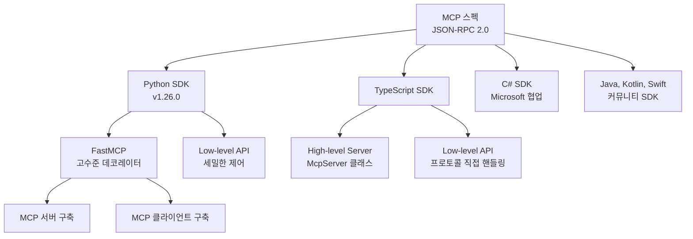
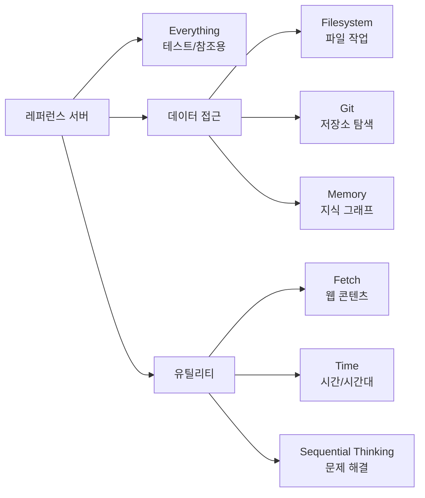
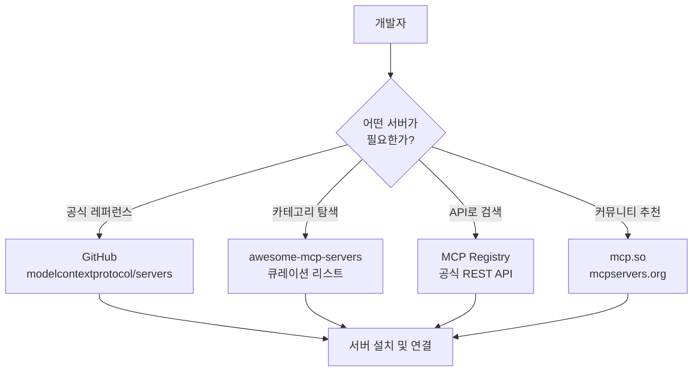
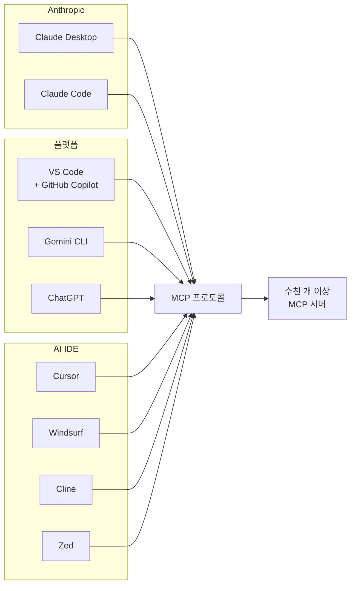

# MCP 생태계 둘러보기

> MCP 공식 SDK, 레퍼런스 서버, 커뮤니티 서버, 그리고 주요 호스트 애플리케이션까지 — MCP 생태계의 전체 지도를 펼쳐봅니다.

## 개요

앞선 두 섹션에서 MCP가 왜 필요하고 어떤 구조인지를 배웠습니다. 이번 섹션에서는 "그래서 실제로 뭐가 있는데?"라는 질문에 답합니다. MCP 생태계를 구성하는 SDK, 서버, 클라이언트, 호스트를 직접 둘러보겠습니다.

**선수 지식**: MCP의 기본 개념(Host, Client, Server 역할), JSON-RPC 2.0 메시지 구조
**학습 목표**:
- MCP 공식 SDK(Python, TypeScript)의 구조와 설치 방법을 이해한다
- 레퍼런스 서버와 커뮤니티 서버의 차이를 구분하고 탐색할 수 있다
- 주요 MCP 호스트 애플리케이션의 특징을 비교할 수 있다
- awesome-mcp-servers와 MCP Registry를 활용하여 필요한 서버를 찾을 수 있다

## 왜 알아야 할까?

여러분이 새로운 도시에 이사했다고 상상해보세요. 지도 없이 마트, 병원, 학교를 하나하나 찾아다닐 수도 있지만, 동네 지도를 한 장 펼쳐보면 모든 것이 달라집니다. MCP 생태계도 마찬가지입니다. 어떤 SDK가 있고, 어떤 서버가 이미 만들어져 있으며, 어떤 앱에서 바로 쓸 수 있는지 — 이 전체 지도를 머릿속에 갖고 있느냐 없느냐가 개발 속도를 결정합니다.

2026년 3월 기준으로 MCP 생태계는 수천만 건 이상의 월간 SDK 다운로드, 수천 개 이상의 활성 서버, 그리고 Claude Desktop부터 VS Code, Cursor, Gemini CLI까지 수십 개의 호스트 앱이 지원하는 거대한 생태계로 성장했습니다(npm 다운로드 통계 및 awesome-mcp-servers 집계 기준). 바퀴를 다시 발명하지 않으려면, 먼저 이 생태계를 제대로 둘러봐야 합니다.

## 핵심 개념

### 개념 1: 공식 SDK — Python과 TypeScript

> 💡 **비유**: SDK는 레고 브릭 세트와 같습니다. 레고 없이 나무를 깎아서 블록을 만들 수도 있지만, 규격화된 레고 브릭이 있으면 누구나 빠르게 원하는 구조물을 만들 수 있죠. MCP SDK는 프로토콜의 복잡한 메시지 파싱, 전송 관리, 세션 라이프사이클을 이미 구현해둔 "레고 세트"입니다.

MCP는 공식적으로 두 가지 주요 SDK를 제공합니다.

**Python SDK** (`mcp` 패키지)는 v1.26.0이 최신 안정 버전이며, v2가 프리알파 단계로 개발 중입니다. 내부에 **FastMCP**라는 고수준 프레임워크가 통합되어 있어, 데코레이터 기반으로 서버를 손쉽게 만들 수 있습니다.

먼저 SDK를 설치합니다:

```bash
# uv 사용 시 (권장)
uv add "mcp[cli]"

# pip 사용 시
pip install "mcp[cli]"
```

설치가 끝나면, 아래처럼 바로 서버를 작성할 수 있습니다:

```python
from mcp.server.fastmcp import FastMCP

# FastMCP 인스턴스 생성 — 이것이 MCP 서버의 진입점
mcp = FastMCP("MyServer")

@mcp.tool()
def add(a: int, b: int) -> int:
    """두 수를 더합니다"""  # docstring이 LLM에게 도구 설명으로 전달됨
    return a + b

# URI 스킴은 자유롭게 정의할 수 있습니다
# 여기서는 커스텀 스킴 'greeting://'을 사용하지만,
# 'resource://users/{user_id}' 같은 형식도 가능합니다
@mcp.resource("greeting://{name}")
def get_greeting(name: str) -> str:
    """개인화된 인사말을 반환합니다"""
    return f"안녕하세요, {name}님!"

@mcp.prompt()
def review_code(code: str) -> str:
    """코드 리뷰 프롬프트 템플릿"""
    return f"다음 코드를 리뷰해주세요:\n\n{code}"
```

**TypeScript SDK** (`@modelcontextprotocol/sdk` 패키지)는 npm에서 수천만 건 이상 다운로드되었습니다. Zod를 스키마 검증에 사용하며, v2 안정 릴리스가 2026년 Q1에 예정되어 있습니다. 최신 버전은 [GitHub 릴리스 페이지](https://github.com/modelcontextprotocol/typescript-sdk/releases)에서 확인할 수 있습니다.

> 📊 **그림 1**: MCP SDK 생태계 구조



두 SDK 모두 **서버와 클라이언트 양쪽**을 지원합니다. 서버만 만드는 도구가 아니라, 클라이언트를 개발하여 MCP 서버에 연결하는 것도 가능합니다. 이 부분은 [MCP 클라이언트 개발](09-ch9-mcp-클라이언트-개발/01-01-clientsession과-서버-연결.md) 챕터에서 자세히 다룹니다.

| 항목 | Python SDK | TypeScript SDK |
|------|-----------|---------------|
| 패키지명 | `mcp` | `@modelcontextprotocol/sdk` |
| 최신 버전 | v1.26.0 (PyPI) | GitHub Releases 확인 |
| 고수준 API | FastMCP (데코레이터) | McpServer 클래스 |
| 스키마 검증 | Pydantic v2 | Zod |
| 전송 지원 | stdio, SSE, Streamable HTTP | stdio, Streamable HTTP |
| v2 상태 | 프리알파 (메인 브랜치) | Q1 2026 안정 릴리스 예정 |

> ⚠️ **흔한 오해**: "FastMCP는 별도의 서드파티 라이브러리다?" — 아닙니다. FastMCP v1은 2024년에 공식 Python SDK에 통합되었습니다. `from mcp.server.fastmcp import FastMCP`로 바로 쓸 수 있습니다. 다만, 독립 FastMCP 프로젝트(Prefect 유지보수)도 별도로 존재하며 v2 이상의 고급 기능(서버 합성, OpenAPI 프로바이더 등)을 제공합니다.

### 개념 2: 레퍼런스 서버 — 공식이 보증하는 구현체

> 💡 **비유**: 레퍼런스 서버는 요리 교실의 "시범 요리"와 같습니다. 셰프가 직접 만들어 보여주는 요리를 보면 레시피를 훨씬 빠르게 이해할 수 있죠. MCP 레퍼런스 서버도 마찬가지로, "이렇게 만들면 됩니다"라는 공식 시범입니다.

MCP 팀이 직접 유지보수하는 레퍼런스 서버는 `modelcontextprotocol/servers` 리포지토리에 있습니다. 2026년 3월 기준으로 7개의 활성 레퍼런스 서버가 있습니다.

> 📊 **그림 2**: MCP 레퍼런스 서버 카테고리



각 서버의 역할을 살펴보겠습니다:

| 서버 | 역할 | 주요 활용 |
|------|------|----------|
| **Everything** | 모든 MCP 기능을 구현한 테스트 서버 | SDK 테스트, 클라이언트 검증 |
| **Fetch** | 웹 페이지를 가져와 LLM 친화적으로 변환 | 웹 크롤링, 문서 수집 |
| **Filesystem** | 설정된 디렉토리 내 파일 읽기/쓰기/검색 | 로컬 파일 작업 |
| **Git** | Git 리포지토리 탐색, 커밋 히스토리 조회 | 코드 분석, 변경 추적 |
| **Memory** | 지식 그래프 기반 영속 메모리 | 대화 간 정보 유지 |
| **Sequential Thinking** | 단계적 사고 체인으로 문제 해결 | 복잡한 추론 작업 |
| **Time** | 시간대 변환, 현재 시간 조회 | 시간 관련 계산 |

과거에는 SQLite, PostgreSQL, GitHub, Slack, Google Drive 등도 레퍼런스 서버였지만, 현재는 `servers-archived` 리포지토리로 이관되어 커뮤니티가 관리합니다. 이는 MCP 팀이 핵심 레퍼런스에 집중하고, 특정 서비스 연동은 해당 기업이나 커뮤니티가 직접 관리하도록 전략을 바꿨기 때문입니다.

레퍼런스 서버는 설치 없이 바로 실행할 수 있습니다:

```bash
# Python 레퍼런스 서버 — uvx로 설치 없이 바로 실행
uvx mcp-server-fetch

# TypeScript 레퍼런스 서버 — npx로 실행
npx -y @modelcontextprotocol/server-filesystem /path/to/allowed/dir
```

### 개념 3: 커뮤니티 서버와 서버 디스커버리

> 💡 **비유**: 레퍼런스 서버가 "공식 앱스토어의 기본 앱"이라면, 커뮤니티 서버는 수만 개의 서드파티 앱입니다. 스마트폰의 진짜 가치는 기본 앱이 아니라 앱스토어의 풍부한 생태계에서 나오죠. MCP도 마찬가지입니다.

2026년 3월 기준, MCP 생태계에는 수천 개 이상의 활성 서버가 존재합니다(awesome-mcp-servers 큐레이션 리스트 및 MCP Registry 집계 기준). 이 서버들을 어떻게 찾을까요?

**1. awesome-mcp-servers (GitHub)**

가장 유명한 큐레이션 리스트입니다. punkpeye/awesome-mcp-servers와 wong2/awesome-mcp-servers 두 개의 주요 리포지토리가 있으며, 카테고리별로 정리되어 있습니다.

**2. MCP Registry (공식)**

MCP 공식 레지스트리는 서버 검색을 위한 REST API를 제공합니다. GitHub MCP Registry가 대표적이며, 파트너사와 오픈소스 커뮤니티의 서버를 한곳에서 탐색할 수 있습니다.

**3. 커뮤니티 디렉토리**

mcpservers.org, mcp.so 같은 커뮤니티 플랫폼이 메타데이터와 함께 서버 목록을 제공합니다.

> 📊 **그림 3**: MCP 서버 디스커버리 경로



커뮤니티 서버의 주요 카테고리를 살펴보면:

| 카테고리 | 대표 서버 예시 | 설명 |
|----------|-------------|------|
| 데이터베이스 | PostgreSQL, MySQL, MongoDB | DB 조회/조작 |
| 클라우드 | AWS, Azure, GCP | 클라우드 리소스 관리 |
| 개발 도구 | GitHub, GitLab, Jira, Linear | 이슈/PR/프로젝트 관리 |
| 커뮤니케이션 | Slack, Discord, Email | 메시지 전송/조회 |
| 데이터 분석 | Amplitude, Mixpanel | 분석 데이터 조회 |
| 웹/검색 | Brave Search, Firecrawl, Apify | 웹 크롤링/검색 |
| 스토리지 | Google Drive, Box, S3 | 파일 관리 |

2026년 1월 26일에는 Amplitude, Asana, Box, Clay, Hex, Salesforce가 한꺼번에 공식 원격 서버로 합류하며 — MCP 역사상 가장 큰 단일 확장이 이루어졌습니다.

> 🔥 **실무 팁**: 서버를 직접 만들기 전에 반드시 awesome-mcp-servers를 확인하세요. GitHub API 래핑? 이미 GitHub 공식 MCP 서버가 있습니다. Slack 연동? 역시 있습니다. 기존 서버를 포크하거나 조합하는 것이 처음부터 만드는 것보다 훨씬 효율적입니다.

### 개념 4: MCP 호스트 — 사용자와 만나는 접점

> 💡 **비유**: MCP 서버가 음식 재료라면, 호스트 앱은 그 재료로 요리를 해주는 레스토랑입니다. 아무리 좋은 재료가 있어도 요리할 곳이 없으면 먹을 수 없죠. 호스트 앱이 MCP 서버들을 연결하고, LLM과 조합하여 사용자에게 실제 가치를 전달합니다.

[이전 섹션](01-ch1-mcp의-탄생과-설계-철학/02-02-mcp-ai의-usb-c.md)에서 배운 3계층 아키텍처에서 **호스트(Host)** 는 최종 사용자와 직접 만나는 애플리케이션입니다. 주요 MCP 호스트를 살펴보겠습니다.

> 📊 **그림 4**: 주요 MCP 호스트 앱과 지원 범위



| 호스트 앱 | 개발사 | MCP 지원 방식 | 특장점 |
|----------|--------|-------------|--------|
| **Claude Desktop** | Anthropic | 네이티브 | MCP 창시사의 앱, 가장 깊은 통합 |
| **Claude Code** | Anthropic | 네이티브 | CLI 기반, 개발 워크플로 최적화 |
| **Cursor** | Cursor Inc. | v0.48.6+ | AI IDE, MCP 마켓플레이스 |
| **Windsurf** | Codeium | 네이티브 | 엔터프라이즈 관리 MCP 설정 |
| **VS Code** | Microsoft | v1.101+ | GitHub Copilot과 통합 |
| **Gemini CLI** | Google | 네이티브 | Google 생태계 연동 |
| **ChatGPT** | OpenAI | 2025~ | GPT 모델과 MCP 서버 연결 |

MCP가 오픈 프로토콜이기 때문에, **하나의 MCP 서버는 모든 호스트에서 동작합니다**. Cursor에서 설정한 서버를 Claude Desktop이나 VS Code에서도 설정 파일만 바꾸면 바로 사용할 수 있거든요. 이것이 표준 프로토콜의 실제 위력입니다 — 서버 개발자는 하나만 만들면 되고, 호스트 개발자도 프로토콜 하나만 구현하면 모든 서버를 쓸 수 있죠.

> 💡 **알고 계셨나요?**: 2024년 11월 Anthropic이 MCP를 처음 공개했을 때, Claude Desktop이 유일한 호스트였습니다. 불과 1년 반 만에 OpenAI의 ChatGPT, Google의 Gemini CLI, Microsoft의 VS Code까지 — AI 업계의 경쟁사들이 모두 MCP를 채택했습니다. AI 역사상 경쟁사들이 이렇게 빠르게 하나의 프로토콜에 합류한 것은 매우 이례적입니다.

## 실습: 직접 해보기

이번 실습에서는 Python SDK를 설치하고, 간단한 MCP 서버를 만들어 어떤 기능이 노출되는지 프로그래밍적으로 확인하는 코드를 작성해봅니다.

**1단계: SDK 설치**

```bash
# uv 사용 (권장)
uv init mcp-ecosystem-lab
cd mcp-ecosystem-lab
uv add "mcp[cli]"

# 또는 pip 사용
pip install "mcp[cli]"
```

**2단계: 미니 서버 작성**

```python
# server.py — MCP 서버 진입점
from mcp.server.fastmcp import FastMCP

# 서버 인스턴스 생성
mcp = FastMCP("EcosystemLab")

# Tool 프리미티브 — LLM이 호출하는 함수
@mcp.tool()
def search_servers(keyword: str) -> str:
    """MCP 서버를 키워드로 검색합니다 (데모용)"""
    # 실제로는 MCP Registry API를 호출할 수 있음
    catalog = {
        "database": ["PostgreSQL MCP", "SQLite MCP", "MongoDB MCP"],
        "cloud": ["AWS MCP", "Azure MCP", "GCP MCP"],
        "dev": ["GitHub MCP", "GitLab MCP", "Jira MCP"],
    }
    results = catalog.get(keyword.lower(), [])
    if results:
        return f"'{keyword}' 관련 서버: {', '.join(results)}"
    return f"'{keyword}'에 해당하는 서버를 찾지 못했습니다."

# Resource 프리미티브 — 읽기 전용 데이터
# URI 스킴은 자유롭게 정의할 수 있습니다 (ecosystem://, myapp://, resource:// 등)
@mcp.resource("ecosystem://stats")
def get_ecosystem_stats() -> str:
    """MCP 생태계 통계를 반환합니다"""
    return (
        "MCP 생태계 현황 (2026년 3월)\n"
        "- 공식 SDK: Python, TypeScript\n"
        "- 공식 레퍼런스 서버: 7개\n"
        "- 커뮤니티 서버: 수천 개 이상\n"
        "- 지원 호스트 앱: 10+\n"
    )

# Prompt 프리미티브 — 재사용 가능한 템플릿
@mcp.prompt()
def recommend_server(use_case: str) -> str:
    """사용 사례에 맞는 MCP 서버를 추천하는 프롬프트"""
    return (
        f"다음 사용 사례에 적합한 MCP 서버를 추천해주세요:\n"
        f"사용 사례: {use_case}\n\n"
        f"추천 시 고려사항:\n"
        f"1. 공식 레퍼런스 서버 우선\n"
        f"2. GitHub 스타 수와 유지보수 활성도\n"
        f"3. 보안 및 권한 설정 지원 여부"
    )

if __name__ == "__main__":
    mcp.run()
```

**3단계: 서버 기능 확인 스크립트**

```run:python
# inspect_server.py — 서버가 노출하는 기능을 프로그래밍적으로 확인
# (실제 MCP 연결 없이 FastMCP 내부 구조를 탐색하는 예시)

from dataclasses import dataclass

@dataclass
class ToolInfo:
    name: str
    description: str
    parameters: list[str]

@dataclass
class ResourceInfo:
    uri: str
    description: str

@dataclass
class PromptInfo:
    name: str
    description: str
    arguments: list[str]

# 서버가 노출하는 기능을 시뮬레이션
tools = [
    ToolInfo("search_servers", "MCP 서버를 키워드로 검색합니다", ["keyword: str"]),
]
resources = [
    ResourceInfo("ecosystem://stats", "MCP 생태계 통계를 반환합니다"),
]
prompts = [
    PromptInfo("recommend_server", "사용 사례에 맞는 MCP 서버를 추천", ["use_case: str"]),
]

print("=== MCP 서버 'EcosystemLab' 기능 목록 ===\n")

print(f"[Tools] ({len(tools)}개)")
for t in tools:
    print(f"  - {t.name}: {t.description}")
    print(f"    파라미터: {', '.join(t.parameters)}")

print(f"\n[Resources] ({len(resources)}개)")
for r in resources:
    print(f"  - {r.uri}: {r.description}")

print(f"\n[Prompts] ({len(prompts)}개)")
for p in prompts:
    print(f"  - {p.name}: {p.description}")
    print(f"    인자: {', '.join(p.arguments)}")

print(f"\n총 {len(tools) + len(resources) + len(prompts)}개의 기능이 등록되었습니다.")
```

```output
=== MCP 서버 'EcosystemLab' 기능 목록 ===

[Tools] (1개)
  - search_servers: MCP 서버를 키워드로 검색합니다
    파라미터: keyword: str

[Resources] (1개)
  - ecosystem://stats: MCP 생태계 통계를 반환합니다

[Prompts] (1개)
  - recommend_server: 사용 사례에 맞는 MCP 서버를 추천
    인자: use_case: str

총 3개의 기능이 등록되었습니다.
```

**4단계: Claude Desktop에서 연결하기**

서버를 만들었으면 호스트 앱에 등록해야 합니다. Claude Desktop의 설정 파일(`claude_desktop_config.json`)에 다음을 추가합니다:

```json
{
  "mcpServers": {
    "ecosystem-lab": {
      "command": "uv",
      "args": ["run", "--directory", "/path/to/mcp-ecosystem-lab", "server.py"]
    }
  }
}
```

이 설정만으로 Claude Desktop이 우리 서버를 자동으로 시작하고, `search_servers` 도구를 호출할 수 있게 됩니다. 다른 호스트(Cursor, VS Code 등)에서도 유사한 JSON 설정으로 같은 서버를 연결할 수 있습니다 — MCP의 "한 번 만들면 어디서든" 원칙이 여기서 빛을 발합니다.

## 더 깊이 알아보기

### MCP의 폭발적 성장 — 리눅스 재단과 거버넌스

MCP의 성장 스토리는 AI 업계에서도 이례적입니다. 2024년 11월 Anthropic이 오픈소스로 공개한 후, 처음에는 "Anthropic만의 프로토콜"이라는 시선이 있었습니다. 하지만 2025년 초 Microsoft와 OpenAI가 지원을 발표하면서 분위기가 완전히 바뀌었습니다.

결정적 전환점은 MCP가 **리눅스 재단(Linux Foundation)** 산하로 들어간 것입니다. 단일 기업의 프로토콜에서 멀티 컴퍼니 오픈 스탠다드로 전환되면서, 기업들이 안심하고 채택할 수 있게 되었거든요. HTTP, TCP/IP처럼 어떤 한 회사가 통제하지 않는 표준이 되는 것이 장기적 생존의 핵심입니다.

이는 과거 웹 기술의 역사와 닮아있습니다. JavaScript도 처음에는 Netscape의 독점 기술이었지만, ECMA 인터내셔널에 표준화를 맡긴 후에야 진정한 웹 표준이 되었죠. MCP가 걸어가는 길도 비슷합니다.

### 독립 FastMCP의 탄생

공식 SDK에 통합된 FastMCP v1과 별도로, Prefect(워크플로 오케스트레이션 회사)의 Jeremiah Lowin이 유지보수하는 **독립 FastMCP** 프로젝트가 있습니다. 이 프로젝트는 v2 이상에서 서버 합성(Composition), OpenAPI/FastAPI 자동 변환, 프록시 서버 기능 등을 제공합니다. "FastMCP의 어떤 버전이 전체 MCP 서버의 70%를 구동한다"는 통계는 공식 SDK 내장 버전과 독립 버전을 합산한 수치입니다.

## 흔한 오해와 팁

> ⚠️ **흔한 오해**: "MCP 서버를 만들려면 반드시 Python이나 TypeScript를 써야 한다?" — MCP는 JSON-RPC 2.0 기반의 프로토콜이므로, 어떤 언어든 스펙을 구현하면 서버를 만들 수 있습니다. 실제로 C#(Microsoft 공식), Java, Kotlin, Go, Rust, Swift 등의 커뮤니티 SDK가 존재합니다. 다만 공식 SDK가 가장 빠르게 스펙을 반영하므로, 프로덕션에서는 Python이나 TypeScript SDK를 권장합니다.

> 💡 **알고 계셨나요?**: MCP Inspector라는 공식 디버깅 도구가 있습니다. 브라우저에서 MCP 서버에 연결하여 도구를 호출하고, 리소스를 읽고, 프롬프트를 테스트할 수 있습니다. 서버 개발 중 호스트 앱 없이도 기능을 바로 확인할 수 있어서, 개발 생산성이 크게 올라갑니다. [MCP Inspector와 디버깅](03-ch3-개발-환경-설정과-첫-mcp-서버/04-04-mcp-inspector와-디버깅.md)에서 자세히 다룹니다.

> 🔥 **실무 팁**: 커뮤니티 서버를 선택할 때는 반드시 다음 세 가지를 확인하세요: (1) **마지막 커밋 날짜** — 6개월 이상 업데이트가 없으면 스펙 호환성 문제가 있을 수 있습니다. (2) **이슈/PR 응답률** — 유지보수 의지를 보여줍니다. (3) **보안 정책** — 특히 데이터베이스나 파일시스템 서버는 권한 설정이 중요합니다. awesome-mcp-servers의 별 수만 보고 선택하면 안 됩니다.

## 핵심 정리

| 개념 | 설명 |
|------|------|
| **Python SDK** | `mcp` 패키지 v1.26.0, FastMCP 내장, Pydantic v2 스키마 검증 |
| **TypeScript SDK** | `@modelcontextprotocol/sdk`, Zod 스키마, npm 수천만+ 다운로드 |
| **FastMCP** | 데코레이터 기반 고수준 API. `@mcp.tool()`, `@mcp.resource()`, `@mcp.prompt()` |
| **레퍼런스 서버** | 공식 7개 — Everything, Fetch, Filesystem, Git, Memory, Sequential Thinking, Time |
| **커뮤니티 서버** | 수천 개 이상 활성 서버. awesome-mcp-servers, MCP Registry로 탐색 |
| **MCP Registry** | 공식 서버 카탈로그. REST API로 프로그래밍적 검색 가능 |
| **호스트 앱** | Claude Desktop, VS Code, Cursor, Windsurf, Gemini CLI 등 10+ 앱 지원 |
| **서버 이식성** | 하나의 MCP 서버는 설정만 바꾸면 모든 호스트에서 동작 |
| **URI 스킴** | Resource URI의 스킴은 자유롭게 정의 가능 (`greeting://`, `ecosystem://`, `resource://` 등) |

## 다음 섹션 미리보기

이번 섹션에서 MCP 생태계의 현재를 둘러보았다면, 다음 [MCP 스펙 변천사와 2026 로드맵](01-ch1-mcp의-탄생과-설계-철학/04-04-mcp-스펙-변천사와-2026-로드맵.md)에서는 MCP의 **미래**를 들여다봅니다. 2024년 11월 첫 공개부터 2025-11-25 스펙 리비전까지 어떤 변화가 있었는지, 그리고 2026년 로드맵에서 엔터프라이즈 인증, 감사 추적, 관찰 가능성(Observability) 같은 핵심 기능이 어떻게 추가될 예정인지 알아보겠습니다.

## 참고 자료

- [MCP Python SDK — GitHub 공식 리포지토리](https://github.com/modelcontextprotocol/python-sdk) - Python SDK 소스 코드, 설치 가이드, API 레퍼런스
- [MCP Official Reference Servers](https://github.com/modelcontextprotocol/servers) - 공식 레퍼런스 서버 7종의 소스 코드와 사용법
- [awesome-mcp-servers — punkpeye](https://github.com/punkpeye/awesome-mcp-servers) - 커뮤니티 MCP 서버 큐레이션 리스트 (카테고리별 정리)
- [MCP TypeScript SDK — GitHub](https://github.com/modelcontextprotocol/typescript-sdk) - TypeScript SDK 소스 코드와 v2 마이그레이션 가이드
- [FastMCP — Pythonic MCP Framework](https://github.com/jlowin/fastmcp) - 독립 FastMCP 프로젝트 (서버 합성, OpenAPI 프로바이더 등 고급 기능)
- [Model Context Protocol 공식 문서](https://modelcontextprotocol.io/) - 스펙, 아키텍처, 가이드 전체
- [GitHub MCP Registry — 서버 디스커버리](https://github.blog/ai-and-ml/github-copilot/meet-the-github-mcp-registry-the-fastest-way-to-discover-mcp-servers/) - GitHub 공식 MCP 레지스트리 소개

---
### 🔗 Related Sessions
- [host](02-ch2-mcp-아키텍처와-프로토콜-구조/01-01-hostclientserver-3계층.md) (prerequisite)
- [client](02-ch2-mcp-아키텍처와-프로토콜-구조/01-01-hostclientserver-3계층.md) (prerequisite)
- [server](02-ch2-mcp-아키텍처와-프로토콜-구조/01-01-hostclientserver-3계층.md) (prerequisite)
- [3계층 아키텍처](02-ch2-mcp-아키텍처와-프로토콜-구조/01-01-hostclientserver-3계층.md) (prerequisite)
- [n×m 통합 문제](01-ch1-mcp의-탄생과-설계-철학/01-01-llm의-도구-연결-문제.md) (prerequisite)
- [오픈 프로토콜 설계 원칙](01-ch1-mcp의-탄생과-설계-철학/02-02-mcp-ai의-usb-c.md) (prerequisite)
- [json-rpc 2.0 메시지 타입](01-ch1-mcp의-탄생과-설계-철학/02-02-mcp-ai의-usb-c.md) (prerequisite)
