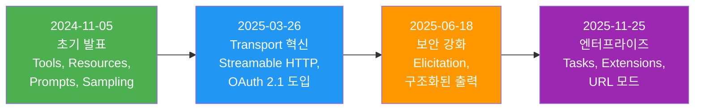
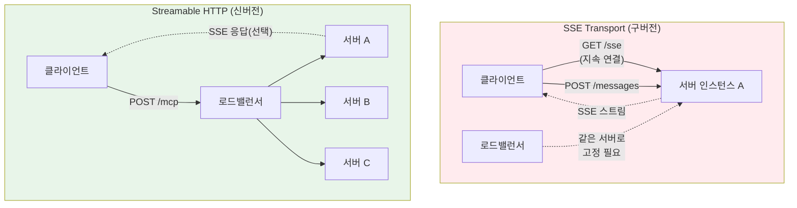
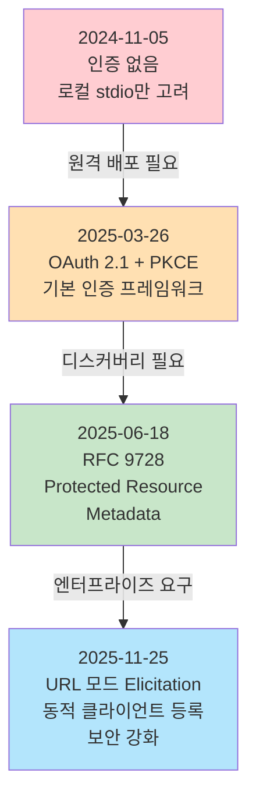
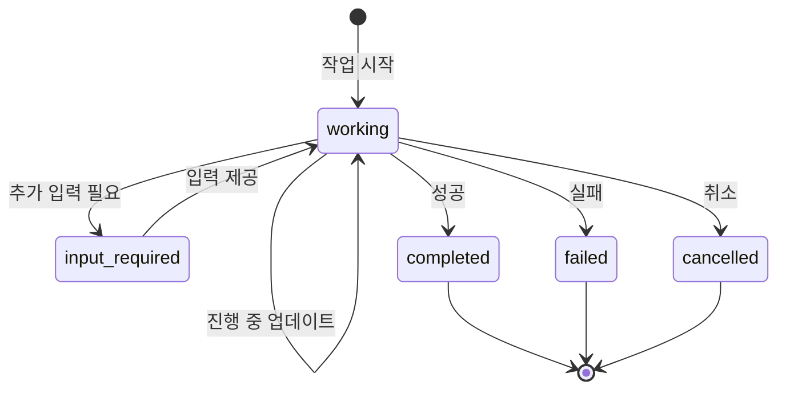
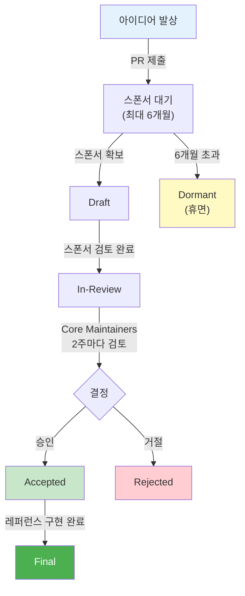
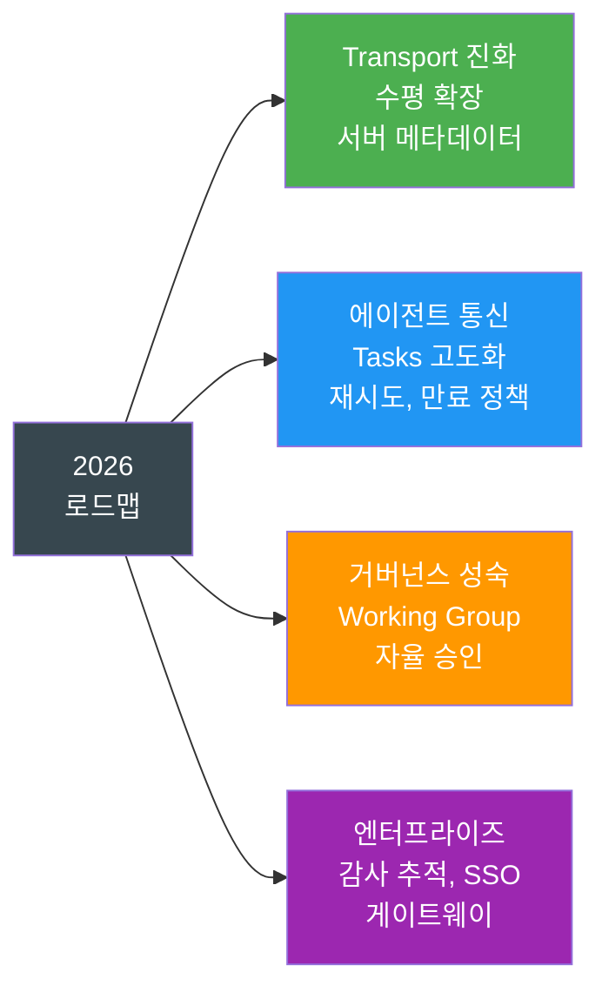

# MCP 스펙 변천사와 2026 로드맵

> 2024년 11월 첫 발표부터 2025-11-25 스펙까지, MCP가 걸어온 길과 앞으로 나아갈 방향을 한눈에 조망합니다.

## 개요

이 섹션에서는 MCP 프로토콜 스펙이 어떻게 진화해 왔는지, 그리고 2026년에 어떤 방향으로 나아가는지를 살펴봅니다. [앞선 세션](01-ch1-mcp의-탄생과-설계-철학/03-03-mcp-생태계-둘러보기.md)에서 MCP 생태계의 현재 모습을 확인했다면, 이번에는 **시간 축**을 따라 MCP의 과거와 미래를 함께 그려봅니다.

**선수 지식**: [MCP의 기본 개념과 JSON-RPC 2.0 메시지 구조](01-ch1-mcp의-탄생과-설계-철학/02-02-mcp-ai의-usb-c.md), [MCP 생태계 구성 요소](01-ch1-mcp의-탄생과-설계-철학/03-03-mcp-생태계-둘러보기.md)

**학습 목표**:
- MCP 스펙의 네 가지 주요 리비전(2024-11-05, 2025-03-26, 2025-06-18, 2025-11-25)의 핵심 변경점을 설명할 수 있다
- SSE에서 Streamable HTTP로의 Transport 전환 이유와 그 의미를 이해한다
- SEP(Specification Enhancement Proposal) 프로세스의 작동 방식을 파악한다
- 2026 로드맵의 네 가지 우선순위 영역을 설명할 수 있다

## 왜 알아야 할까?

소프트웨어 프로토콜을 채택할 때, 가장 두려운 것은 무엇일까요? 바로 **"이 프로토콜이 내일 사라지면 어쩌지?"** 하는 걱정이죠. MCP의 스펙 변천사를 알면 이 프로토콜이 단발성 실험이 아니라 **체계적으로 진화하는 표준**임을 확신할 수 있습니다.

또한 실무에서 MCP 서버를 개발하다 보면 "이 기능은 어느 스펙 버전부터 지원하지?", "SSE를 아직 써도 되나?", "Tasks가 뭐야?" 같은 질문을 마주하게 됩니다. 스펙의 맥락을 알면 **올바른 버전을 선택**하고, **다가올 변화에 미리 대비**할 수 있습니다.

## 핵심 개념

### 개념 1: MCP 스펙 타임라인 — 1년간의 대장정

> 💡 **비유**: MCP의 스펙 진화는 스마트폰 OS 업데이트와 비슷합니다. iOS 1.0이 전화와 웹만 지원했듯, MCP도 처음엔 기본 기능만 있었죠. 매 리비전마다 앱스토어(Tools), FaceTime(Sampling), 보안 기능(OAuth) 같은 핵심 기능이 추가되었습니다.

MCP는 2024년 11월 Anthropic이 처음 공개한 이후, 약 1년간 네 번의 주요 스펙 리비전을 거쳤습니다. 각 리비전은 날짜 기반 버전명(예: `2025-11-25`)을 사용하며, 이전 버전과의 하위 호환성을 최대한 유지하면서도 중요한 기능을 꾸준히 추가해 왔습니다.

> 📊 **그림 1**: MCP 스펙 리비전 타임라인



각 리비전의 핵심 변경점을 표로 정리하면 다음과 같습니다:

| 리비전 | 주요 변경점 | 키워드 |
|--------|------------|--------|
| **2024-11-05** | MCP 최초 공개. Tools, Resources, Prompts, Sampling **4대 프리미티브** 정의. stdio + HTTP/SSE Transport 지원. JSON-RPC 2.0 기반 메시지 포맷 확정 | 탄생 |
| **2025-03-26** | **Streamable HTTP** Transport 도입 (SSE 대체). OAuth 2.1 인증 프레임워크 추가. Tool annotations으로 도구 메타데이터 표현 가능 | 전환 |
| **2025-06-18** | **Elicitation** (서버→사용자 직접 질의) 도입. 구조화된 도구 출력(Structured Tool Outputs)으로 타입 안전한 결과 반환. RFC 9728 Protected Resource Metadata로 보안 강화 | 상호작용 |
| **2025-11-25** | **Tasks** 프리미티브 (장기 실행 작업 관리). **Extensions** 프레임워크로 핵심 스펙 외 확장 표준화. URL 모드 Elicitation으로 민감 정보 브라우저 직접 처리. Sampling with Tools로 LLM 호출 시 도구 사용 허용 | 확장 |

4대 프리미티브에 대해 조금 더 풀어보면, 이들은 MCP의 **기본 빌딩 블록**입니다:

- **Tools**: AI가 실행할 수 있는 함수 (예: 파일 읽기, API 호출, DB 쿼리)
- **Resources**: AI가 읽을 수 있는 데이터 소스 (예: 파일 내용, 설정값, 로그)
- **Prompts**: 서버가 제공하는 재사용 가능한 프롬프트 템플릿
- **Sampling**: 서버가 클라이언트의 LLM을 역으로 호출하는 메커니즘

이 타임라인에서 눈여겨볼 점은, 매 리비전이 **약 3~5개월 간격**으로 출시되었다는 것입니다. 급하게 밀어붙이지도, 느긋하게 방치하지도 않는 꾸준한 리듬이죠.

```run:python
# MCP 스펙 리비전 간격 계산
from datetime import date

revisions = [
    ("2024-11-05", "초기 발표"),
    ("2025-03-26", "Streamable HTTP"),
    ("2025-06-18", "Elicitation"),
    ("2025-11-25", "Tasks & Extensions"),
]

print("=== MCP 스펙 리비전 간격 ===")
for i in range(1, len(revisions)):
    prev_date = date.fromisoformat(revisions[i-1][0])
    curr_date = date.fromisoformat(revisions[i][0])
    delta = (curr_date - prev_date).days
    print(f"{revisions[i-1][0]} → {revisions[i][0]}: "
          f"{delta}일 ({delta // 30}개월) — {revisions[i][1]}")

print(f"\n총 기간: {(date(2025, 11, 25) - date(2024, 11, 5)).days}일")
print(f"평균 리비전 간격: {(date(2025, 11, 25) - date(2024, 11, 5)).days // 3}일")
```

```output
=== MCP 스펙 리비전 간격 ===
2024-11-05 → 2025-03-26: 141일 (4개월) — Streamable HTTP
2025-03-26 → 2025-06-18: 84일 (2개월) — Elicitation
2025-06-18 → 2025-11-25: 160일 (5개월) — Tasks & Extensions

총 기간: 385일
평균 리비전 간격: 128일
```

### 개념 2: SSE에서 Streamable HTTP로 — 왜 바꿨을까?

> 💡 **비유**: SSE(Server-Sent Events) 방식은 카페에서 한 자리에 앉아 주문을 계속 받는 것과 비슷합니다. 손님(클라이언트)이 그 자리를 떠나면 대화가 끊기죠. Streamable HTTP는 **번호표** 시스템입니다. 어느 카운터에서든 번호표만 보여주면 주문 상태를 확인할 수 있어요. 카운터(서버)를 여러 개 놓을 수 있으니 손님이 몰려도 문제없습니다.

2024-11-05 스펙의 HTTP/SSE Transport는 다음과 같은 구조였습니다:

1. 클라이언트가 `/sse` 엔드포인트에 접속 → 서버가 SSE 스트림을 열어 메시지를 푸시
2. 클라이언트가 `/messages` 엔드포인트로 JSON-RPC 요청을 POST

문제는 이 SSE 연결이 **상태를 가진(stateful)** 지속 연결이라는 점이었습니다.

> 📊 **그림 2**: SSE vs Streamable HTTP Transport 비교



**SSE의 문제점 세 가지**:

1. **수평 확장 불가**: SSE 연결은 특정 서버 인스턴스에 고정(sticky session)되어야 합니다. 로드밸런서 뒤에 서버를 여러 대 놓아도 SSE 연결은 하나의 서버에만 붙어 있어야 하죠.
2. **보안 취약점**: SSE의 초기 핸드셰이크에서 브라우저 API로는 Authorization 헤더를 보낼 수 없어, 토큰을 URL 쿼리 파라미터(`?token=xyz`)에 넣어야 했습니다. 서버 로그와 브라우저 히스토리에 토큰이 남는 심각한 보안 문제였습니다.
3. **재연결 복잡성**: 네트워크 끊김 시 SSE 연결을 복원하고 누락된 메시지를 재전송하는 로직이 복잡했습니다.

**Streamable HTTP의 해결책**:

```python
# Streamable HTTP의 핵심 — 단일 엔드포인트, 유연한 응답
# 서버는 하나의 HTTP 엔드포인트만 제공하면 됩니다

# 요청: 항상 POST
# POST /mcp HTTP/1.1
# Content-Type: application/json
# Authorization: Bearer <token>   ← 표준 헤더로 인증!
#
# {"jsonrpc": "2.0", "method": "tools/call", "id": 1, ...}

# 응답 옵션 1: 일반 JSON (단순 요청-응답)
# HTTP/1.1 200 OK
# Content-Type: application/json
#
# {"jsonrpc": "2.0", "result": {...}, "id": 1}

# 응답 옵션 2: SSE 스트림 (스트리밍이 필요한 경우)
# HTTP/1.1 200 OK
# Content-Type: text/event-stream
#
# data: {"jsonrpc": "2.0", "result": {...}, "id": 1}
```

Streamable HTTP에서 서버는 단일 MCP 엔드포인트를 제공하고, 요청에 따라 **일반 JSON 응답** 또는 **SSE 스트림**을 선택적으로 반환합니다. 상태를 서버 메모리에 저장할 필요가 없으므로 로드밸런서 뒤에 여러 서버 인스턴스를 자유롭게 배치할 수 있습니다.

> ⚠️ **흔한 오해**: "Streamable HTTP이면 SSE를 아예 안 쓰는 거 아닌가요?" — 아닙니다! Streamable HTTP는 SSE를 **응답 형식의 하나로** 활용합니다. 차이점은 SSE가 Transport 자체가 아니라, HTTP 응답의 선택적 스트리밍 형식이 되었다는 것입니다.

### 개념 3: 인증 스펙의 진화 — OAuth 2.1과 RFC 9728

> 💡 **비유**: 초기 MCP의 인증은 열쇠 하나로 모든 문을 여는 마스터키 방식이었습니다. 2025-03-26부터는 호텔의 카드키 시스템으로 바뀌었죠 — 체크인(OAuth 인증) → 카드키 발급(토큰) → 각 방에 맞는 권한 확인(Protected Resource Metadata).

MCP의 인증 스펙은 세 단계로 진화했습니다:

> 📊 **그림 3**: MCP 인증 스펙 진화



**2025-03-26**: OAuth 2.1 + PKCE(Proof Key for Code Exchange) 도입. MCP 서버가 원격으로 배포되기 시작하면서, 표준 인증 프레임워크가 필수가 되었습니다.

**2025-06-18**: RFC 9728(Protected Resource Metadata) 채택. MCP 서버가 자신의 인증 요구사항을 `/.well-known/oauth-protected-resource` 엔드포인트를 통해 공개합니다. 클라이언트는 이를 자동으로 발견(discovery)하여 올바른 인증 서버에 연결할 수 있습니다.

```python
# RFC 9728 — Protected Resource Metadata 디스커버리 흐름
import httpx
import json

async def discover_auth_server(mcp_server_url: str) -> dict:
    """MCP 서버의 인증 요구사항을 자동 발견합니다."""
    # 1단계: Well-known 엔드포인트에서 메타데이터 조회
    well_known_url = f"{mcp_server_url}/.well-known/oauth-protected-resource"

    async with httpx.AsyncClient() as client:
        response = await client.get(well_known_url)
        metadata = response.json()

    # 메타데이터 예시:
    # {
    #   "resource": "https://mcp.example.com",
    #   "authorization_servers": ["https://auth.example.com"],
    #   "scopes_supported": ["tools:read", "tools:execute"],
    #   "bearer_methods_supported": ["header"]
    # }

    return metadata

# 2단계: 인증 서버 정보로 OAuth 2.1 + PKCE 플로우 시작
# (상세 구현은 Ch11 인증과 보안에서 다룹니다)
```

**2025-11-25**: URL 모드 Elicitation 추가. 민감한 정보(API 키, 결제 정보 등)는 MCP 클라이언트를 통하지 않고 브라우저에서 직접 처리하여 보안을 한층 강화했습니다.

### 개념 4: Tasks 프리미티브 — 장기 실행 작업의 해결사

> 💡 **비유**: 기존 MCP의 도구 호출은 편의점 결제처럼 즉석이었습니다. Tasks는 택배 시스템입니다 — 주문(요청)하면 운송장 번호(Task ID)를 받고, 언제든 배송 상태를 조회할 수 있고, 도착하면 수령하면 됩니다.

2025-11-25 스펙에서 가장 주목할 만한 추가 기능은 **Tasks 프리미티브**(SEP-1686)입니다. 기존 MCP에서 도구를 호출하면 응답이 올 때까지 연결을 유지해야 했습니다. 데이터 분석이나 코드 마이그레이션처럼 **수 분~수 시간이 걸리는 작업**에서는 이 모델이 현실적이지 않았죠.

> 📊 **그림 4**: Tasks 프리미티브의 상태 머신



Tasks의 핵심은 **"call-now, fetch-later"** 패턴입니다:

```run:python
# Tasks 프리미티브 — 상태 모델 시뮬레이션
from enum import Enum
from dataclasses import dataclass, field
from datetime import datetime

class TaskState(Enum):
    WORKING = "working"           # 작업 진행 중
    INPUT_REQUIRED = "input_required"  # 추가 입력 대기
    COMPLETED = "completed"       # 성공 완료
    FAILED = "failed"             # 실패
    CANCELLED = "cancelled"       # 취소됨

@dataclass
class Task:
    id: str
    state: TaskState = TaskState.WORKING
    progress: float = 0.0         # 0.0 ~ 1.0
    result: dict | None = None
    history: list = field(default_factory=list)

    def transition(self, new_state: TaskState, message: str = ""):
        old = self.state
        self.state = new_state
        self.history.append({
            "from": old.value,
            "to": new_state.value,
            "message": message,
            "at": datetime.now().isoformat()
        })

# 시나리오: 대규모 데이터 분석 작업
task = Task(id="task-abc-123")
print(f"1. 작업 생성: state={task.state.value}")

task.progress = 0.5
print(f"2. 진행 중:   state={task.state.value}, progress={task.progress:.0%}")

task.transition(TaskState.INPUT_REQUIRED, "분석 범위를 지정해주세요")
print(f"3. 입력 대기: state={task.state.value}")

task.transition(TaskState.WORKING, "범위 확인, 재개")
task.progress = 0.9
print(f"4. 재개:      state={task.state.value}, progress={task.progress:.0%}")

task.transition(TaskState.COMPLETED, "분석 완료")
task.result = {"rows_analyzed": 1_000_000, "anomalies_found": 42}
print(f"5. 완료:      state={task.state.value}")
print(f"   결과:      {task.result}")
```

```output
1. 작업 생성: state=working
2. 진행 중:   state=working, progress=50%
3. 입력 대기: state=input_required
4. 재개:      state=working, progress=90%
5. 완료:      state=completed
   결과:      {'rows_analyzed': 1000000, 'anomalies_found': 42}
```

Tasks가 기존 도구 호출과 다른 핵심적인 차이는 **비동기성**과 **상태 조회**입니다. 클라이언트는 작업을 시작한 뒤 연결을 끊었다가, 나중에 Task ID로 상태를 조회할 수 있습니다. 서버는 `notifications/tasks/progress`를 통해 진행률을 실시간으로 알릴 수도 있고, 클라이언트가 `tasks/get`으로 폴링할 수도 있죠. 이 유연성 덕분에 CI/CD 파이프라인 실행, 대규모 데이터 처리, 멀티스텝 에이전트 워크플로 같은 시나리오가 MCP 위에서 자연스럽게 작동합니다.

### 개념 5: SEP 프로세스 — MCP의 민주적 진화 방식

> 💡 **비유**: SEP는 국회의 법안 발의 과정과 비슷합니다. 누구나 법안(SEP)을 작성할 수 있지만, 국회의원(Sponsor)의 후원이 필요하고, 위원회(Working Group) 검토를 거쳐, 본회의(Core Maintainers)에서 표결합니다. 프로토타입(시범 시행)까지 완료해야 최종 시행됩니다.

SEP(Specification Enhancement Proposal)는 MCP 스펙에 새로운 기능을 제안하는 공식 프로세스입니다. Python의 PEP, Rust의 RFC와 같은 역할이죠.

> 📊 **그림 5**: SEP 워크플로



**SEP의 세 가지 유형**:
1. **Standards Track**: 프로토콜 자체의 새 기능 (예: SEP-1686 Tasks)
2. **Informational**: 설계 가이드라인이나 정보 제공
3. **Process**: SEP 프로세스 자체의 변경 (예: SEP-001 거버넌스)

SEP가 승인되려면 세 가지 조건을 만족해야 합니다:
- **프로토타입 구현**: "작동하는 코드"가 있어야 합니다. 설계 문서만으로는 부족합니다.
- **커뮤니티 합의**: Discord나 GitHub에서의 충분한 논의.
- **MCP 생태계에 대한 명확한 이점**.

### 개념 6: 2026 로드맵 — 네 가지 우선순위

2026 MCP 로드맵은 네 가지 핵심 영역으로 구성됩니다:

> 📊 **그림 6**: 2026 MCP 로드맵 우선순위



**1. Transport 진화와 확장성**
현재의 상태 기반 세션 모델을 발전시켜, 로드밸런서 뒤에서 상태 지속 없이 수평 확장이 가능하도록 합니다. `.well-known` 형식의 서버 메타데이터로 자동 발견(discovery)도 개선합니다. 주목할 점은 **새로운 Transport를 추가하지 않고** 기존 Transport를 개선한다는 것입니다.

**2. 에이전트 통신**
Tasks 프리미티브가 실험적으로 출시된 후, 실제 운영에서 드러난 문제들을 해결합니다. 핵심은 일시적 실패 시 **재시도(retry) 시맨틱스**와, 완료된 결과의 **만료(expiry) 정책**입니다.

**3. 거버넌스 성숙**
현재 모든 SEP는 Core Maintainer 전원 검토가 필요한데, 이것이 병목이 되고 있습니다. Working Group이 자기 도메인의 SEP를 독립적으로 승인할 수 있는 위임 모델로 전환합니다.

**4. 엔터프라이즈 준비**
감사 추적(audit trail), SSO 통합 인증, 게이트웨이 동작, 설정 이식성(configuration portability) 등을 다룹니다. 핵심 프로토콜 변경이 아닌 **확장(extension)** 형태로 제공될 예정입니다.

## 실습: 직접 해보기

MCP 스펙 버전 정보를 프로그래밍적으로 다루는 유틸리티를 만들어봅시다. 실제 MCP 서버 개발 시 버전 호환성 체크에 활용할 수 있는 코드입니다.

```python
"""MCP 스펙 버전 호환성 체커"""
from dataclasses import dataclass, field
from datetime import date
from enum import Enum


class Feature(Enum):
    """MCP 스펙에서 도입된 주요 기능"""
    TOOLS = "tools"
    RESOURCES = "resources"
    PROMPTS = "prompts"
    SAMPLING = "sampling"
    STREAMABLE_HTTP = "streamable_http"
    OAUTH_21 = "oauth_2.1"
    ELICITATION = "elicitation"
    STRUCTURED_OUTPUT = "structured_output"
    TASKS = "tasks"
    EXTENSIONS = "extensions"
    URL_ELICITATION = "url_elicitation"
    SAMPLING_WITH_TOOLS = "sampling_with_tools"


@dataclass
class SpecRevision:
    """MCP 스펙 리비전 정보"""
    version: str              # "2025-11-25"
    release_date: date
    features_added: list[Feature]
    transport: str            # "stdio+SSE" 또는 "stdio+StreamableHTTP"
    breaking_changes: list[str] = field(default_factory=list)
    deprecated: list[str] = field(default_factory=list)

    @property
    def all_features(self) -> set[Feature]:
        """이 리비전까지 누적된 모든 기능"""
        return set(self.features_added)


# MCP 스펙 리비전 레지스트리
MCP_REVISIONS: dict[str, SpecRevision] = {
    "2024-11-05": SpecRevision(
        version="2024-11-05",
        release_date=date(2024, 11, 5),
        features_added=[
            Feature.TOOLS, Feature.RESOURCES,
            Feature.PROMPTS, Feature.SAMPLING,
        ],
        transport="stdio + HTTP/SSE",
    ),
    "2025-03-26": SpecRevision(
        version="2025-03-26",
        release_date=date(2025, 3, 26),
        features_added=[Feature.STREAMABLE_HTTP, Feature.OAUTH_21],
        transport="stdio + Streamable HTTP",
        breaking_changes=["HTTP/SSE → Streamable HTTP 전환"],
        deprecated=["HTTP/SSE Transport"],
    ),
    "2025-06-18": SpecRevision(
        version="2025-06-18",
        release_date=date(2025, 6, 18),
        features_added=[Feature.ELICITATION, Feature.STRUCTURED_OUTPUT],
        transport="stdio + Streamable HTTP",
    ),
    "2025-11-25": SpecRevision(
        version="2025-11-25",
        release_date=date(2025, 11, 25),
        features_added=[
            Feature.TASKS, Feature.EXTENSIONS,
            Feature.URL_ELICITATION, Feature.SAMPLING_WITH_TOOLS,
        ],
        transport="stdio + Streamable HTTP",
    ),
}


def check_feature_support(feature: Feature, version: str) -> bool:
    """특정 기능이 해당 버전에서 지원되는지 확인"""
    # 모든 리비전을 날짜순으로 정렬
    sorted_versions = sorted(MCP_REVISIONS.keys())
    cumulative_features: set[Feature] = set()

    for v in sorted_versions:
        revision = MCP_REVISIONS[v]
        cumulative_features.update(revision.features_added)
        if v == version:
            return feature in cumulative_features

    return False


def get_minimum_version(feature: Feature) -> str | None:
    """특정 기능을 사용하려면 최소 어떤 버전이 필요한지 반환"""
    for version in sorted(MCP_REVISIONS.keys()):
        if feature in MCP_REVISIONS[version].features_added:
            return version
    return None


def migration_guide(from_ver: str, to_ver: str) -> list[str]:
    """두 버전 사이의 마이그레이션 가이드 생성"""
    sorted_versions = sorted(MCP_REVISIONS.keys())
    changes = []

    in_range = False
    for v in sorted_versions:
        if v == from_ver:
            in_range = True
            continue
        if in_range:
            rev = MCP_REVISIONS[v]
            new_features = [f.value for f in rev.features_added]
            changes.append(f"[{v}] 새 기능: {', '.join(new_features)}")
            for bc in rev.breaking_changes:
                changes.append(f"  ⚠️ Breaking: {bc}")
            for dep in rev.deprecated:
                changes.append(f"  ⛔ Deprecated: {dep}")
            if v == to_ver:
                break

    return changes
```

```run:python
# 위 코드를 활용한 실전 예시
from dataclasses import dataclass, field
from datetime import date
from enum import Enum

# --- (위의 클래스/함수 정의 생략, 실행 시 포함) ---

class Feature(Enum):
    TOOLS = "tools"
    RESOURCES = "resources"
    PROMPTS = "prompts"
    SAMPLING = "sampling"
    STREAMABLE_HTTP = "streamable_http"
    OAUTH_21 = "oauth_2.1"
    ELICITATION = "elicitation"
    STRUCTURED_OUTPUT = "structured_output"
    TASKS = "tasks"
    EXTENSIONS = "extensions"
    URL_ELICITATION = "url_elicitation"
    SAMPLING_WITH_TOOLS = "sampling_with_tools"

# 간소화된 버전 매핑
feature_versions = {
    Feature.TOOLS: "2024-11-05",
    Feature.RESOURCES: "2024-11-05",
    Feature.STREAMABLE_HTTP: "2025-03-26",
    Feature.OAUTH_21: "2025-03-26",
    Feature.ELICITATION: "2025-06-18",
    Feature.TASKS: "2025-11-25",
    Feature.EXTENSIONS: "2025-11-25",
}

# 시나리오 1: Tasks를 쓰려면 어떤 버전이 필요한가?
min_ver = feature_versions[Feature.TASKS]
print(f"Tasks 최소 버전: {min_ver}")

# 시나리오 2: 2024-11-05에서 Elicitation을 쓸 수 있는가?
elicit_ver = feature_versions[Feature.ELICITATION]
can_use = "2024-11-05" >= elicit_ver
print(f"2024-11-05에서 Elicitation 사용 가능? {can_use}")

# 시나리오 3: 마이그레이션 가이드
print("\n=== 2024-11-05 → 2025-11-25 마이그레이션 ===")
migrations = {
    "2025-03-26": {
        "features": ["Streamable HTTP", "OAuth 2.1"],
        "breaking": ["HTTP/SSE → Streamable HTTP 전환"],
    },
    "2025-06-18": {
        "features": ["Elicitation", "Structured Output"],
        "breaking": [],
    },
    "2025-11-25": {
        "features": ["Tasks", "Extensions", "URL Elicitation"],
        "breaking": [],
    },
}
for ver, info in migrations.items():
    print(f"[{ver}] 새 기능: {', '.join(info['features'])}")
    for bc in info["breaking"]:
        print(f"  ⚠️ Breaking: {bc}")
```

```output
Tasks 최소 버전: 2025-11-25
2024-11-05에서 Elicitation 사용 가능? False

=== 2024-11-05 → 2025-11-25 마이그레이션 ===
[2025-03-26] 새 기능: Streamable HTTP, OAuth 2.1
  ⚠️ Breaking: HTTP/SSE → Streamable HTTP 전환
[2025-06-18] 새 기능: Elicitation, Structured Output
[2025-11-25] 새 기능: Tasks, Extensions, URL Elicitation
```

## 더 깊이 알아보기

### Linux Foundation으로의 이전 — 오픈 거버넌스의 시작

2025년 12월, Anthropic은 MCP를 **Agentic AI Foundation(AAIF)**에 기증했습니다. AAIF는 Linux Foundation 산하의 디렉티드 펀드로, Anthropic, Block, OpenAI가 공동 설립했죠. 이 결정은 MCP 커뮤니티에 큰 안도감을 주었습니다 — 하나의 회사가 프로토콜을 독점하지 않겠다는 강력한 신호였거든요.

이 이전은 실리콘밸리에서 드문 일이 아닙니다. Kubernetes가 Google에서 CNCF로, 그리고 GraphQL이 Facebook에서 GraphQL Foundation으로 옮겨간 것과 같은 맥락입니다. 창시자가 프로토콜을 재단에 넘기는 것은 "이제 이 기술은 한 회사의 것이 아니라 업계의 것"이라는 선언이죠.

놀라운 점은 MCP가 공개된 지 **겨우 1년** 만에 이 단계에 도달했다는 것입니다. Kubernetes는 약 1.5년, GraphQL은 약 3년이 걸렸습니다. MCP 생태계의 폭발적 성장(1년 만에 2,900+ 기여자, 2,000+ 레지스트리 서버)이 이 속도를 가능하게 했습니다.

### SSE 폐기의 배경 — 보안이 결정적이었다

SSE에서 Streamable HTTP로의 전환이 단순히 확장성 때문만은 아니었습니다. Auth0의 분석에 따르면, SSE의 가장 심각한 문제는 **토큰 노출 위험**이었습니다. EventSource API가 커스텀 헤더를 지원하지 않아, 많은 구현체가 URL에 토큰을 포함시켰는데, 이는 서버 로그, 프록시 로그, 브라우저 히스토리 등 여러 곳에 민감한 정보를 남기는 "디지털 문에 열쇠를 테이프로 붙이는" 행위였습니다.

## 흔한 오해와 팁

> ⚠️ **흔한 오해**: "SSE Transport가 폐기(deprecated)되었으니 당장 마이그레이션해야 한다" — SSE Transport의 공식 폐기 시점은 **2026년 4월 1일**입니다. 그 전까지는 하위 호환성이 유지되므로, 계획적으로 마이그레이션하면 됩니다. 다만 신규 프로젝트는 처음부터 Streamable HTTP를 사용하세요.

> 💡 **알고 계셨나요?**: MCP의 프로토콜 버전 형식이 날짜(`2025-11-25`)인 이유가 있습니다. 의미적 버전(semantic versioning, 1.0.0)은 "어떤 변경이 breaking인가"에 대한 주관적 판단이 필요한 반면, 날짜 기반 버전은 **시간 순서만으로 신/구를 판단**할 수 있어 더 객관적입니다. 이 방식은 MCP가 영감을 받은 LSP(Language Server Protocol)에서도 사용하는 관행입니다.

> 🔥 **실무 팁**: MCP 서버를 개발할 때, `initialize` 핸드셰이크에서 교환하는 `protocolVersion` 필드를 반드시 확인하세요. 클라이언트와 서버가 지원하는 버전이 다르면 기능 불일치가 발생할 수 있습니다. Python SDK에서는 `mcp.types.LATEST_PROTOCOL_VERSION`을 사용하여 현재 SDK가 지원하는 최신 프로토콜 버전을 확인할 수 있습니다.

## 핵심 정리

| 개념 | 설명 |
|------|------|
| **스펙 리비전 4단계** | 2024-11-05(탄생) → 2025-03-26(Transport) → 2025-06-18(보안) → 2025-11-25(확장) |
| **4대 프리미티브** | Tools(도구 실행), Resources(데이터 읽기), Prompts(템플릿), Sampling(역방향 LLM 호출) — 초기 스펙부터 MCP의 기본 빌딩 블록 |
| **SSE → Streamable HTTP** | 상태 기반 지속 연결에서, 무상태 HTTP 요청/응답으로 전환. 수평 확장과 보안 개선 |
| **OAuth 2.1 + RFC 9728** | 표준 인증 프레임워크 + 자동 디스커버리로 엔터프라이즈 수준의 보안 확보 |
| **Tasks 프리미티브** | 장기 실행 작업을 위한 "call-now, fetch-later" 패턴. 5가지 상태(working, input_required, completed, failed, cancelled) |
| **SEP 프로세스** | 스펙 변경 제안 → 스폰서 확보 → 검토 → 승인 → 레퍼런스 구현의 민주적 프로세스 |
| **2026 로드맵** | Transport 진화, 에이전트 통신(Tasks 고도화), 거버넌스 성숙, 엔터프라이즈 준비 4대 축 |
| **AAIF 이전** | 2025.12 Linux Foundation 산하 Agentic AI Foundation으로 거버넌스 이전 |

## 다음 섹션 미리보기

Chapter 1에서 MCP의 탄생 배경, 설계 철학, 생태계, 그리고 스펙 변천사까지 전체 그림을 완성했습니다. 다음 [Ch2. MCP 아키텍처와 프로토콜 구조](02-ch2-mcp-아키텍처와-프로토콜-구조/01-01-hostclientserver-3계층.md)에서는 이 프로토콜이 **실제로 어떻게 작동하는지** — Host, Client, Server 3계층 아키텍처의 구체적인 역할과 `initialize` 핸드셰이크에서 시작되는 메시지 흐름을 코드와 함께 파헤칩니다.

## 참고 자료

- [The 2026 MCP Roadmap — MCP 공식 블로그](https://blog.modelcontextprotocol.io/posts/2026-mcp-roadmap/) - 2026년 네 가지 우선순위 영역의 원문. 로드맵의 맥락과 의사결정 배경을 이해하는 필수 자료
- [MCP Specification 2025-11-25 — 공식 스펙](https://modelcontextprotocol.io/specification/2025-11-25) - 현재 최신 스펙의 전문. Tasks, Extensions, Elicitation URL 모드 등 상세 사양 참조
- [One Year of MCP: November 2025 Spec Release — MCP 블로그](https://blog.modelcontextprotocol.io/posts/2025-11-25-first-mcp-anniversary/) - 1주년 기념 포스트. 생태계 성장 통계(2,900+ 기여자, 2,000+ 서버)와 각 리비전의 핵심 변경점 요약
- [SEP Guidelines — MCP 공식 문서](https://modelcontextprotocol.io/community/sep-guidelines) - SEP 작성법, 워크플로, 상태 정의, 스폰서 역할 등 프로세스 전문
- [MCP Spec Updates: All About Auth — Auth0 블로그](https://auth0.com/blog/mcp-specs-update-all-about-auth/) - OAuth 2.1, RFC 9728, SSE 보안 문제 등 인증 관련 스펙 변경의 심층 분석
- [Why MCP Deprecated SSE and Went with Streamable HTTP — fka.dev](https://blog.fka.dev/blog/2025-06-06-why-mcp-deprecated-sse-and-go-with-streamable-http/) - SSE에서 Streamable HTTP 전환의 기술적 근거를 상세히 다룬 분석글
- [SEP-1686: Tasks — GitHub Issue](https://github.com/modelcontextprotocol/modelcontextprotocol/issues/1686) - Tasks 프리미티브 제안 원문. 설계 동기, 상태 모델, 커뮤니티 논의 기록

---
### 🔗 Related Sessions
- [n×m 통합 문제](01-ch1-mcp의-탄생과-설계-철학/01-01-llm의-도구-연결-문제.md) (prerequisite)
- [도구 연결(tool integration)](01-ch1-mcp의-탄생과-설계-철학/01-01-llm의-도구-연결-문제.md) (prerequisite)
- [오픈 프로토콜 설계 원칙](01-ch1-mcp의-탄생과-설계-철학/02-02-mcp-ai의-usb-c.md) (prerequisite)
- [json-rpc 2.0 메시지 타입](01-ch1-mcp의-탄생과-설계-철학/02-02-mcp-ai의-usb-c.md) (prerequisite)
