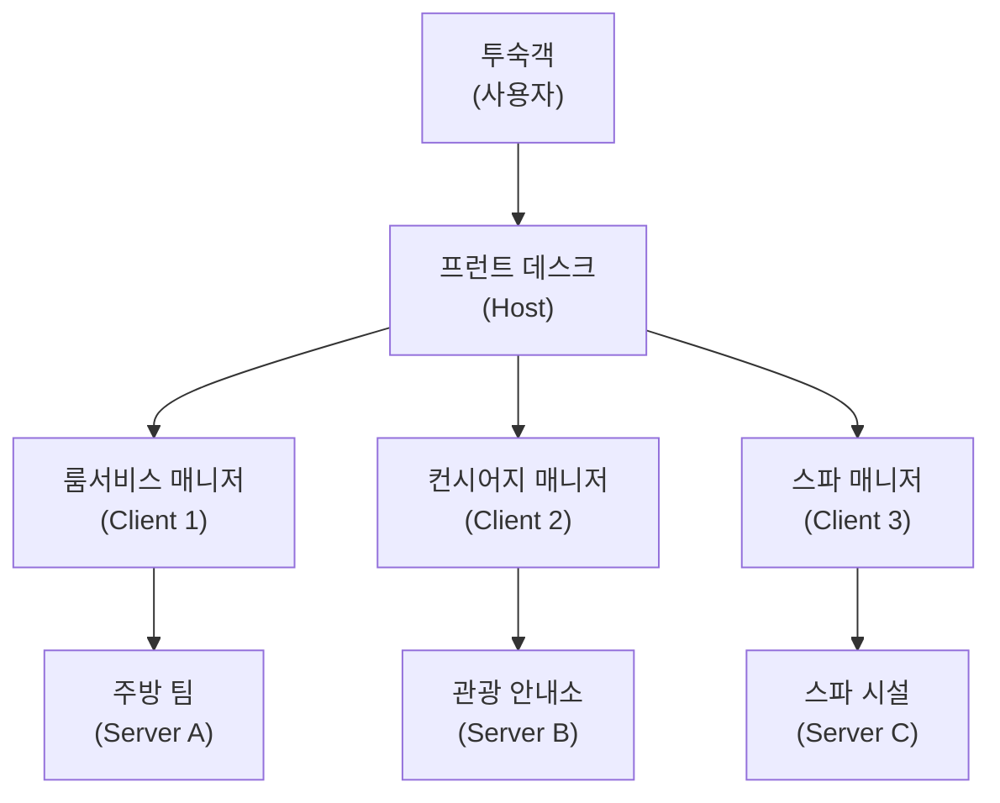
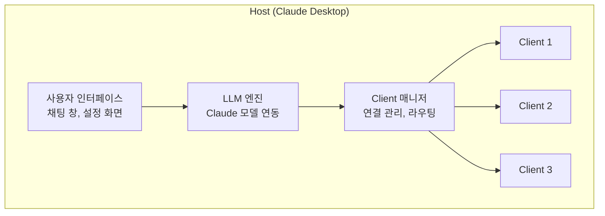
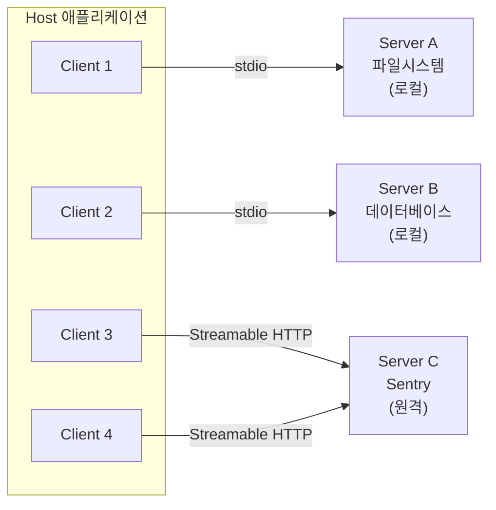
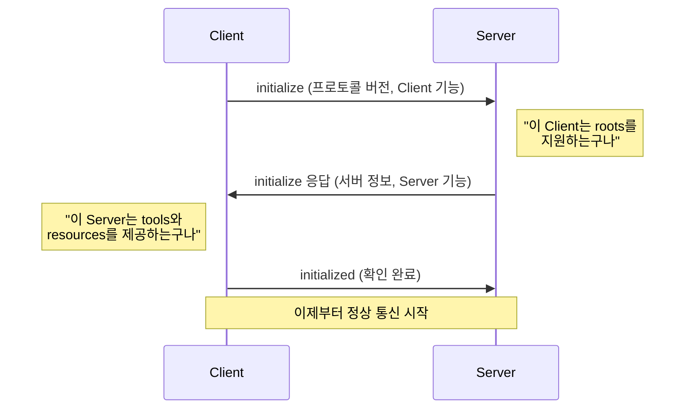
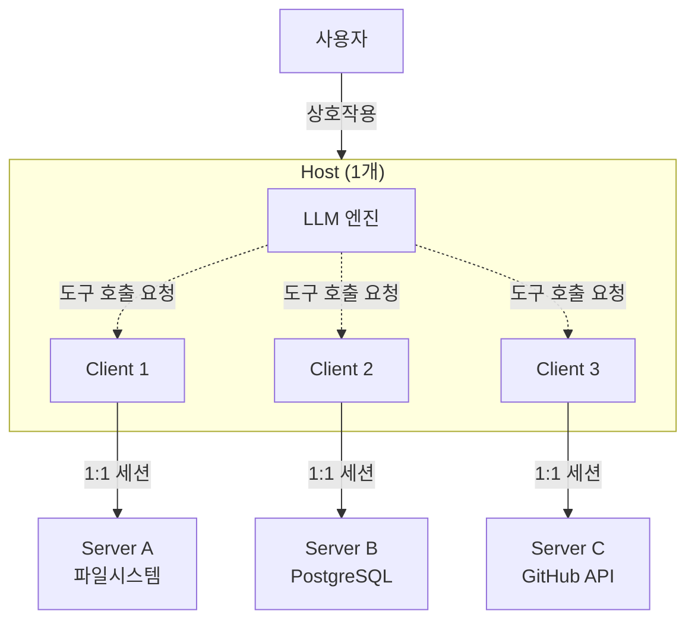
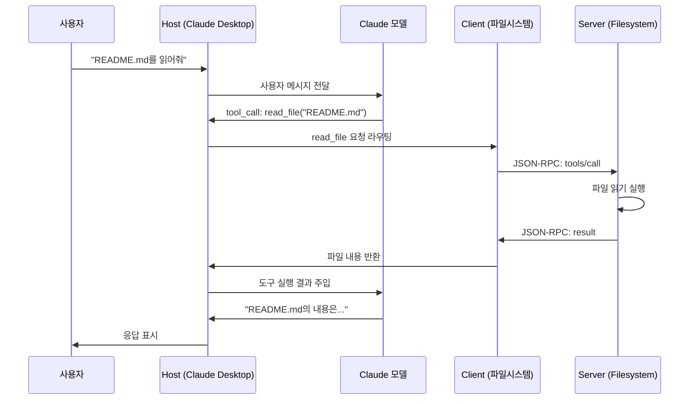

# Host/Client/Server 3계층

> MCP의 핵심 아키텍처 — Host, Client, Server 세 계층의 역할과 관계를 파헤칩니다

## 개요

이 섹션에서는 MCP(Model Context Protocol)의 근간을 이루는 3계층 아키텍처를 깊이 있게 살펴봅니다. Host, Client, Server 각각이 무엇을 책임지고, 어떻게 연결되며, 왜 이런 구조가 필요한지를 이해하면 이후 모든 MCP 개발의 기초가 잡힙니다.

**선수 지식**: [Ch1. MCP의 탄생과 설계 철학](01-ch1-mcp의-탄생과-설계-철학/01-01-llm의-도구-연결-문제.md)에서 배운 MCP의 필요성과 "AI의 USB-C" 비유
**학습 목표**:
- Host, Client, Server 각 계층의 역할과 책임을 명확히 구분할 수 있다
- Host와 Client의 1:N 관계, Client와 Server의 1:1 관계를 설명할 수 있다
- 실제 AI 애플리케이션(Claude Desktop, VS Code)에서 3계층이 어떻게 동작하는지 설명할 수 있다

## 왜 알아야 할까?

LLM이 아무리 똑똑해도, 혼자서는 파일을 읽거나 데이터베이스를 조회할 수 없습니다. 외부 세계와 연결해주는 "구조"가 필요하죠. 이때 "아무렇게나 연결하면 되지 않나?"라고 생각할 수 있지만, 현실은 다릅니다.

하나의 AI 앱이 파일시스템, 데이터베이스, GitHub API, Slack 등 수십 개의 외부 도구와 동시에 소통해야 합니다. 각 연결마다 인증 방식도, 통신 프로토콜도, 에러 처리도 다르다면? 코드가 스파게티가 되는 건 시간 문제입니다.

MCP의 3계층 아키텍처는 이 문제를 깔끔하게 해결합니다. **Host가 전체를 지휘하고, Client가 개별 연결을 관리하며, Server가 기능을 제공하는** — 이 구조를 이해하면 어떤 MCP 서버를 만들든, 어떤 클라이언트를 개발하든 자신 있게 설계할 수 있습니다.

## 핵심 개념

### 개념 1: 호텔 비유로 이해하는 3계층

> 💡 **비유**: MCP 아키텍처를 **호텔**에 비유해볼까요? **Host**는 호텔 프런트 데스크입니다. 투숙객(사용자)과 직접 대면하며, 모든 요청을 접수합니다. **Client**는 각 전문 부서의 담당 매니저입니다 — 룸서비스 매니저, 컨시어지 매니저, 스파 매니저가 각각 하나의 서비스를 전담합니다. **Server**는 실제 서비스를 제공하는 팀입니다 — 주방, 관광 안내소, 스파 시설 등이죠.

투숙객이 "오늘 저녁 레스토랑 예약해주세요"라고 프런트(Host)에 요청하면, 프런트는 레스토랑 담당 매니저(Client)에게 전달하고, 매니저는 실제 레스토랑(Server)과 소통하여 예약을 잡아줍니다. 프런트는 여러 매니저를 관리하지만(1:N), 각 매니저는 자기 담당 서비스와만 대화합니다(1:1).

> 📊 **그림 1**: 호텔 비유로 본 MCP 3계층 구조



이 비유를 기술 용어로 바꾸면 바로 MCP 아키텍처가 됩니다.

| 호텔 비유 | MCP 계층 | 실제 예시 |
|-----------|----------|----------|
| 프런트 데스크 | Host | Claude Desktop, VS Code, 커스텀 AI 앱 |
| 각 부서 매니저 | Client | Host 내부의 프로토콜 핸들러 |
| 서비스 제공 팀 | Server | 파일시스템 서버, DB 서버, GitHub 서버 |

### 개념 2: Host — 사용자와 만나는 접점

Host는 MCP 아키텍처의 **최상위 계층**입니다. 사용자와 직접 상호작용하는 AI 애플리케이션 자체를 가리킵니다.

Host의 핵심 책임은 세 가지입니다:

1. **사용자 인터페이스 관리**: 채팅 창, 코드 에디터 등 사용자가 보고 상호작용하는 화면
2. **LLM 통합**: 언어 모델과의 대화를 관리하고, 모델의 도구 호출 요청을 처리
3. **Client 인스턴스 관리**: 필요한 만큼의 MCP Client를 생성하고, 각 Client의 생명주기를 관리

> 📊 **그림 2**: Host의 내부 구조와 책임



실제 Host 역할을 하는 애플리케이션들을 살펴보면:

- **Claude Desktop**: Anthropic의 공식 데스크톱 앱. 설정 파일로 MCP 서버들을 등록하면, 앱이 각 서버에 대한 Client를 자동 생성
- **VS Code (Copilot)**: 코드 에디터가 Host 역할. 확장 프로그램 설정에서 MCP 서버를 등록
- **Claude Code**: CLI 도구가 Host 역할. 터미널에서 MCP 서버들을 오케스트레이션
- **커스텀 AI 에이전트**: 개발자가 직접 만든 애플리케이션이 Host 역할

> ⚠️ **흔한 오해**: "Host가 곧 LLM이다"라고 혼동하기 쉽습니다. 하지만 Host는 LLM을 *포함하는* 애플리케이션이지, LLM 자체가 아닙니다. Claude 모델은 Host 안에서 동작하는 하나의 컴포넌트일 뿐이에요.

### 개념 3: Client — 프로토콜 핸들러

Client는 Host 내부에 살면서, **특정 Server 하나와 전용 통신 채널을 유지하는** 프로토콜 핸들러입니다. "핸들러"라는 표현이 중요한데, Client는 독립 프로그램이 아니라 Host 프로세스 안의 객체(인스턴스)입니다.

Client의 핵심 책임:

1. **세션 관리**: Server와의 연결 초기화, 유지, 종료
2. **Capability Negotiation**: 연결 시 "나는 이런 기능을 지원해, 너는 뭘 지원하니?"를 협상
3. **메시지 라우팅**: Host가 보낸 요청을 JSON-RPC 포맷으로 변환하여 Server에 전달
4. **응답 수집**: Server 응답을 받아 Host에 전달

> 📊 **그림 3**: Client의 1:1 연결 패턴



여기서 핵심 포인트가 있습니다. Client와 Server의 관계는 **1:1**이지만, **여러 Client가 같은 Server에 연결될 수 있습니다**. 위 그림에서 Client 3과 Client 4가 모두 Sentry Server에 연결된 것처럼요. 이것은 원격 서버(Streamable HTTP)에서 주로 나타나는 패턴입니다.

Client가 Server에 연결하는 구체적인 코드 — `StdioServerParameters`로 전송 방식을 설정하고, `ClientSession`으로 세션을 열고, `initialize()`로 Capability Negotiation을 수행하는 전체 흐름은 다음 섹션인 [02. Transport 계층 — stdio](02-ch2-mcp-아키텍처와-프로토콜-구조/02-02-transport-계층-stdio.md)에서 본격적으로 다룹니다. 지금은 Client가 **Host 내부에서 Server와의 1:1 통신을 전담하는 객체**라는 역할에 집중해주세요.

### 개념 4: Server — 기능 제공자

Server는 MCP 아키텍처에서 **실제 기능과 데이터를 제공하는** 계층입니다. 외부 시스템(파일시스템, DB, API 등)을 감싸서 MCP 프로토콜로 노출합니다.

Server가 노출할 수 있는 세 가지 프리미티브:

| 프리미티브 | 설명 | 제어 주체 | 예시 |
|-----------|------|----------|------|
| **Tools** | LLM이 호출하는 실행 가능한 함수 | Model-controlled | DB 쿼리, API 호출, 계산 |
| **Resources** | 읽기 전용 데이터 | Application-controlled | 파일 내용, DB 스키마, 설정 |
| **Prompts** | 재사용 가능한 프롬프트 템플릿 | User-controlled | SQL 작성 가이드, 코드 리뷰 템플릿 |

"제어 주체"가 다르다는 점이 중요합니다. **Tools**는 LLM이 스스로 판단해서 호출합니다. **Resources**는 애플리케이션(Host)이 필요할 때 가져옵니다. **Prompts**는 사용자가 명시적으로 선택합니다. 같은 Server에서 나오지만, 누가 주도하느냐가 다른 것이죠.

> 💡 **비유**: Server를 **전문 레스토랑의 메뉴판**이라고 생각해보세요. 메뉴(Tool/Resource/Prompt)를 정의하고 공개하면, 손님(Client)이 메뉴를 보고 주문할 수 있습니다. 레스토랑은 어떤 손님이 오든 같은 메뉴를 제공하죠 — 이것이 바로 표준화된 프로토콜의 힘입니다.

Python SDK로 간단한 Server를 만들어볼까요?

```python
from mcp.server.fastmcp import FastMCP

# Server 인스턴스 생성
mcp = FastMCP("WeatherServer")

# Tool 노출 — LLM이 호출할 수 있는 함수
@mcp.tool()
def get_weather(city: str) -> str:
    """지정된 도시의 현재 날씨를 조회합니다."""
    # 실제로는 외부 API 호출
    return f"{city}의 날씨: 맑음, 22°C"

# Resource 노출 — 읽기 전용 데이터
@mcp.resource("weather://supported-cities")
def list_cities() -> str:
    """지원하는 도시 목록을 반환합니다."""
    return "서울, 부산, 제주, 뉴욕, 런던, 도쿄"

# Prompt 노출 — 재사용 가능한 템플릿
@mcp.prompt()
def travel_advisor(destination: str) -> str:
    """여행지 날씨 기반 조언을 위한 프롬프트 템플릿"""
    return f"{destination}의 현재 날씨를 확인하고, 적절한 옷차림과 준비물을 추천해주세요."
```

이 Server는 세 가지 프리미티브를 모두 노출합니다. Client가 연결하면 `tools/list`, `resources/list`, `prompts/list`를 호출해서 사용 가능한 기능을 발견(discover)할 수 있습니다.

### 개념 5: Capability Negotiation — 첫 만남의 악수

Client와 Server가 처음 연결될 때, 바로 요청을 주고받는 게 아닙니다. 먼저 **"나는 이런 기능을 지원해, 너는 뭘 지원하니?"**를 서로 협상합니다. 이 과정을 **Capability Negotiation**이라고 합니다.

> 💡 **비유**: 해외여행을 가서 현지 가이드를 만난다고 상상해보세요. 가이드가 "저는 영어, 일본어, 중국어 가능합니다. 어떤 언어로 안내할까요?"라고 묻고, 여러분이 "영어로 해주세요"라고 답하죠. 이렇게 서로의 능력을 확인하고 합의하는 과정이 바로 Capability Negotiation입니다.

> 📊 **그림 6**: Capability Negotiation 흐름



협상 결과에 따라 Client는 해당 Server에 어떤 요청을 보낼 수 있는지 알게 됩니다. 예를 들어 Server가 "나는 Tools만 제공해"라고 하면, Client는 `resources/list`를 호출하지 않습니다. 이렇게 불필요한 요청을 줄이고, 양쪽의 기대를 맞추는 것이죠.

### 개념 6: 1:N 관계 — Host가 여러 Client를 관리

MCP 아키텍처의 핵심적인 관계 패턴을 정리해보겠습니다.

> 📊 **그림 4**: MCP 계층 간 관계 — 1:N과 1:1



관계를 정리하면:

- **Host : Client = 1 : N** — 하나의 Host가 여러 Client를 생성·관리
- **Client : Server = 1 : 1** — 각 Client는 정확히 하나의 Server와 세션을 유지
- **Server : Client = 1 : N** — 하나의 (원격) Server에 여러 Client가 연결 가능

왜 이런 구조일까요? 각 Client가 독립적인 세션을 유지하면:

1. **격리(Isolation)**: 한 Server의 장애가 다른 연결에 영향 없음
2. **독립적 Capability**: 각 Server마다 다른 기능 세트를 협상
3. **보안**: Server별 인증 정보를 격리하여 관리
4. **생명주기 독립**: Server를 개별적으로 시작/중지 가능

### 개념 7: 실제 동작 흐름 — Claude Desktop 예시

Claude Desktop에서 사용자가 "프로젝트의 README.md를 읽어줘"라고 요청했을 때, 3계층이 어떻게 협력하는지 시퀀스로 살펴봅시다.

> 📊 **그림 5**: Claude Desktop에서의 실제 요청 흐름



이 흐름에서 각 계층의 역할이 명확히 보이죠?

1. **Host**: 사용자 메시지를 LLM에 전달하고, LLM의 도구 호출 요청을 적절한 Client로 라우팅
2. **Client**: Host의 요청을 JSON-RPC 포맷으로 변환하여 Server에 전송
3. **Server**: 실제 파일시스템 접근을 수행하고 결과를 반환

## 실습: 직접 해보기

3계층 구조를 코드로 직접 확인해봅시다. 이 실습에서는 **Server 만들기**에 집중합니다. Client 연결과 Transport 설정은 [다음 섹션](02-ch2-mcp-아키텍처와-프로토콜-구조/02-02-transport-계층-stdio.md)에서 다룹니다.

**Step 1: MCP Server 만들기** — `demo_server.py`

```python
from mcp.server.fastmcp import FastMCP

# 1. Server 인스턴스 생성 — 이름은 Client가 식별할 때 사용됨
mcp = FastMCP("DemoServer")

# 2. Tool 정의 — LLM이 호출할 수 있는 함수
@mcp.tool()
def greet(name: str) -> str:
    """사용자에게 인사합니다."""
    return f"안녕하세요, {name}님! MCP Server에서 보내는 인사입니다."

@mcp.tool()
def add_numbers(a: int, b: int) -> int:
    """두 수를 더합니다."""
    return a + b

# 3. Resource 정의 — 읽기 전용 데이터
@mcp.resource("demo://info")
def server_info() -> str:
    """이 서버의 정보를 제공합니다."""
    return "DemoServer v1.0 — MCP 3계층 학습용 서버"

# 4. Prompt 정의 — 재사용 가능한 템플릿
@mcp.prompt()
def greeting_style(style: str) -> str:
    """인사 스타일을 지정하는 프롬프트 템플릿"""
    return f"{style} 스타일로 사용자에게 인사해주세요. greet 도구를 활용하세요."

if __name__ == "__main__":
    mcp.run()  # 기본 stdio transport로 실행
```

`FastMCP` 한 줄이면 Server가 만들어집니다. `@mcp.tool()`, `@mcp.resource()`, `@mcp.prompt()` 데코레이터로 기능을 등록하면, Client가 연결했을 때 자동으로 발견할 수 있게 됩니다.

**Step 2: 3대 프리미티브 구조 확인**

위에서 만든 Server가 노출하는 기능을 정리하면:

```run:python
# Server가 노출하는 프리미티브 시뮬레이션
primitives = {
    "tools": [
        {"name": "greet", "description": "사용자에게 인사합니다.", "control": "Model"},
        {"name": "add_numbers", "description": "두 수를 더합니다.", "control": "Model"},
    ],
    "resources": [
        {"uri": "demo://info", "description": "서버 정보", "control": "Application"},
    ],
    "prompts": [
        {"name": "greeting_style", "description": "인사 스타일 템플릿", "control": "User"},
    ],
}

for category, items in primitives.items():
    print(f"\n[{category.upper()}] ({len(items)}개)")
    for item in items:
        name = item.get("name") or item.get("uri")
        print(f"  - {name}: {item['description']} (제어: {item['control']})")
```

```output

[TOOLS] (2개)
  - greet: 사용자에게 인사합니다. (제어: Model)
  - add_numbers: 두 수를 더합니다. (제어: Model)

[RESOURCES] (1개)
  - demo://info: 서버 정보 (제어: Application)

[PROMPTS] (1개)
  - greeting_style: 인사 스타일 템플릿 (제어: User)
```

**Step 3: Host가 여러 Server를 관리하는 패턴 (의사 코드)**

실제 Host 애플리케이션은 여러 Server에 대한 Client를 관리합니다. 개념적으로 이런 구조입니다:

```python
class SimpleHost:
    """간단한 MCP Host 시뮬레이션 — 여러 Client를 관리"""
    
    def __init__(self):
        # Host는 Server 이름 → Client 세션의 딕셔너리를 유지
        self.sessions: dict[str, "ClientSession"] = {}
    
    async def connect_server(self, name: str, server_config: dict):
        """새로운 Server에 Client를 생성하여 연결 (1:N 관계)"""
        # 각 Server마다 별도의 Client 세션 생성
        session = await self._create_client_session(server_config)
        await session.initialize()  # Capability Negotiation
        self.sessions[name] = session
        print(f"[Host] '{name}' 서버에 Client 연결 완료")
    
    async def list_all_tools(self):
        """모든 Server의 Tool을 통합 조회"""
        all_tools = []
        for name, session in self.sessions.items():
            tools = await session.list_tools()
            for tool in tools.tools:
                all_tools.append((name, tool))
                print(f"  [{name}] {tool.name}: {tool.description}")
        return all_tools
    
    async def route_tool_call(self, server_name: str, tool_name: str, args: dict):
        """LLM의 도구 호출을 적절한 Client로 라우팅"""
        session = self.sessions[server_name]
        result = await session.call_tool(tool_name, args)
        return result

# Host 사용 흐름:
# host = SimpleHost()
# await host.connect_server("files", file_server_config)
# await host.connect_server("db", db_server_config)
# await host.list_all_tools()  # 모든 서버의 도구를 한 번에 조회
```

이 코드에서 `SimpleHost`가 `sessions` 딕셔너리로 여러 Client를 관리하는 것이 보이시죠? 이것이 바로 Host : Client = 1 : N 관계의 실제 구현입니다. `connect_server`에서 사용하는 구체적인 연결 코드(`StdioServerParameters`, `stdio_client` 등)는 [다음 섹션](02-ch2-mcp-아키텍처와-프로토콜-구조/02-02-transport-계층-stdio.md)에서 상세히 다룹니다.

## 더 깊이 알아보기

### MCP의 탄생 — LSP에서 영감을 받다

MCP의 3계층 구조가 어디에서 왔는지 아시나요? 이야기는 2016년 Microsoft가 만든 **LSP(Language Server Protocol)**로 거슬러 올라갑니다.

LSP 이전에는 각 IDE(VS Code, IntelliJ, Vim 등)가 각 프로그래밍 언어(Python, Java, Go 등)를 지원하려면 **N×M개의 플러그인**이 필요했습니다. IDE 10개 × 언어 20개 = 200개의 플러그인이요! LSP는 중간에 표준 프로토콜을 두어 이 문제를 **N+M**으로 줄였습니다.

2024년 7월, Anthropic의 엔지니어 **David Soria Parra**는 Claude Desktop과 외부 도구를 연결하는 내부 개발 도구를 만들고 있었습니다. 매번 Claude와 IDE 사이에서 코드를 복사-붙여넣기하는 것에 지친 그는, LSP의 아이디어를 AI 도구 연결에 적용하면 어떨까 생각했죠. 동료 **Justin Spahr-Summers**와 함께 프로토콜을 설계하기 시작했고, 2024년 11월 25일 MCP가 공개되었습니다.

LSP와 MCP의 구조적 유사성은 우연이 아닙니다:

| | LSP | MCP |
|---|-----|-----|
| 해결한 문제 | IDE × 언어 = N×M | AI 앱 × 도구 = N×M |
| Host 역할 | VS Code, IntelliJ | Claude Desktop, VS Code |
| Server 역할 | 언어 서버 (pylsp, gopls) | MCP 서버 (파일, DB, API) |
| 프로토콜 | JSON-RPC 2.0 | JSON-RPC 2.0 |
| 연결 방식 | stdio, TCP | stdio, Streamable HTTP |

MCP가 JSON-RPC 2.0을 메시지 포맷으로 채택한 것도 LSP의 영향입니다. 검증된 기술 위에 새로운 의미(semantics)를 얹은 것이죠.

> 💡 **알고 계셨나요?**: MCP는 공개 4개월 만에 수백 개의 서버가 등장하며 폭발적으로 성장했습니다. 2026년 현재 500개 이상의 공개 MCP 서버가 존재하며, Google Cloud, Elastic, Sentry 등 대형 기업들도 공식 MCP 서버를 제공하고 있습니다.

## 흔한 오해와 팁

> ⚠️ **흔한 오해**: "Client와 Server는 항상 다른 컴퓨터에 있다." — 아닙니다! stdio Transport를 사용하는 로컬 Server는 Host와 **같은 머신**에서 실행됩니다. Client와 Server가 같은 프로세스 내에 있을 수도 있어요. "Server"라는 이름에 속지 마세요 — MCP에서 Server는 위치가 아니라 **역할**을 의미합니다.

> 💡 **알고 계셨나요?**: Claude Desktop의 설정 파일(`claude_desktop_config.json`)에서 MCP 서버를 등록하면, 앱이 각 서버에 대한 Client를 자동으로 생성합니다. 사용자는 Client의 존재를 의식할 필요가 없습니다 — 그것이 좋은 추상화의 힘이죠.

> 🔥 **실무 팁**: MCP 서버를 개발할 때 가장 먼저 할 일은 **Tool, Resource, Prompt 중 무엇을 노출할지** 결정하는 것입니다. 규칙은 간단합니다 — LLM이 직접 실행해야 하면 Tool, 읽기 전용 데이터면 Resource, 사용자가 선택하는 템플릿이면 Prompt입니다. 이 결정이 서버 설계의 80%를 좌우합니다.

## 핵심 정리

| 개념 | 설명 |
|------|------|
| **Host** | 사용자 대면 AI 애플리케이션. 여러 Client를 생성·관리 (Claude Desktop, VS Code 등) |
| **Client** | Host 내부의 프로토콜 핸들러. 특정 Server와 1:1 세션 유지 |
| **Server** | Tool/Resource/Prompt를 MCP 프로토콜로 노출하는 서비스 |
| **Host:Client** | 1:N 관계 — 하나의 Host가 여러 Client를 관리 |
| **Client:Server** | 1:1 관계 — 각 Client는 하나의 Server와만 세션 유지 |
| **Capability Negotiation** | 연결 초기화 시 지원 기능을 상호 협상하는 과정 |
| **3대 프리미티브** | Tools(실행, Model-controlled), Resources(데이터, App-controlled), Prompts(템플릿, User-controlled) |
| **Transport** | 통신 방식. stdio(로컬)와 Streamable HTTP(원격) 지원 |

## 다음 섹션 미리보기

3계층의 역할을 이해했으니, 이제 이들이 **어떻게 통신하는지**가 궁금할 겁니다. 다음 섹션 [02. Transport 계층 — stdio](02-ch2-mcp-아키텍처와-프로토콜-구조/02-02-transport-계층-stdio.md)에서는 Client와 Server 사이의 첫 번째 통신 방식인 **stdio Transport**를 파헤칩니다. `StdioServerParameters`로 서버를 설정하고, `ClientSession`으로 실제 연결을 수립하는 전체 코드를 직접 작성해봅니다.

## 참고 자료

- [Architecture overview — MCP 공식 문서](https://modelcontextprotocol.io/docs/learn/architecture) - Host/Client/Server 3계층의 공식 정의와 다이어그램. 이 섹션의 핵심 출처
- [MCP Specification (2025-11-25)](https://modelcontextprotocol.io/specification/2025-11-25) - 프로토콜의 공식 스펙 문서. Host, Client, Server의 정규 정의와 보안 원칙
- [MCP Architecture, Components & Workflow — Kubiya](https://www.kubiya.ai/blog/model-context-protocol-mcp-architecture-components-and-workflow) - 3계층 아키텍처의 컴포넌트별 워크플로 설명과 실제 활용 사례
- [MCP Python SDK — GitHub](https://github.com/modelcontextprotocol/python-sdk) - Python으로 Server/Client를 구현하는 공식 SDK. 실습 코드의 기반
- [Introducing the Model Context Protocol — Anthropic Blog](https://www.anthropic.com/news/model-context-protocol) - MCP의 탄생 배경과 설계 철학을 설명하는 공식 블로그 포스트
- [MCP History: From Anthropic's Fragmentation Fix to AI Standard](https://www.mcpserverspot.com/learn/fundamentals/mcp-history) - David Soria Parra와 Justin Spahr-Summers의 MCP 개발 스토리