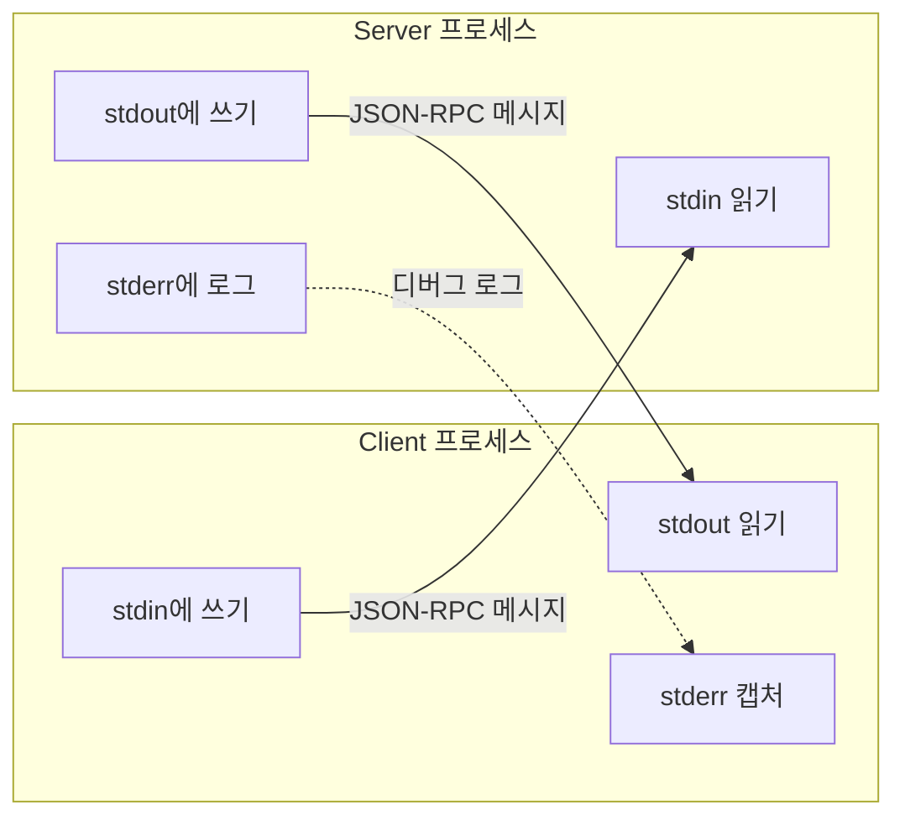
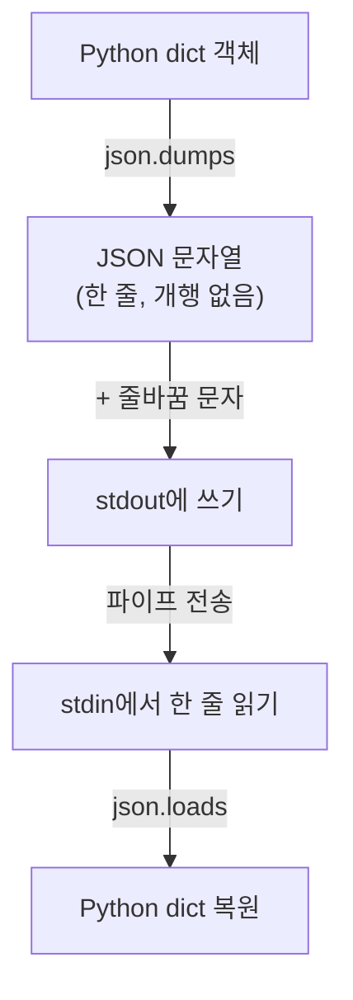
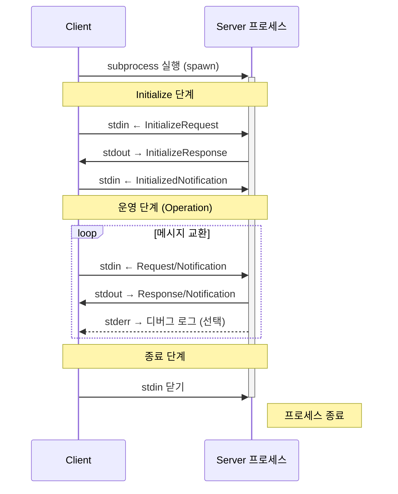
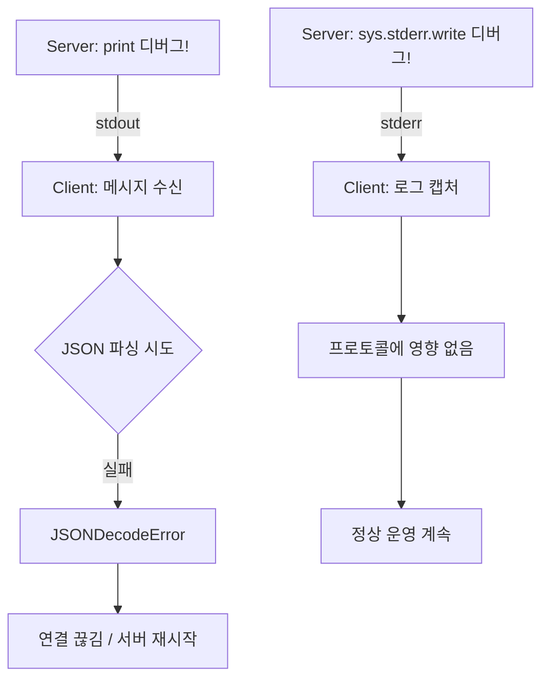
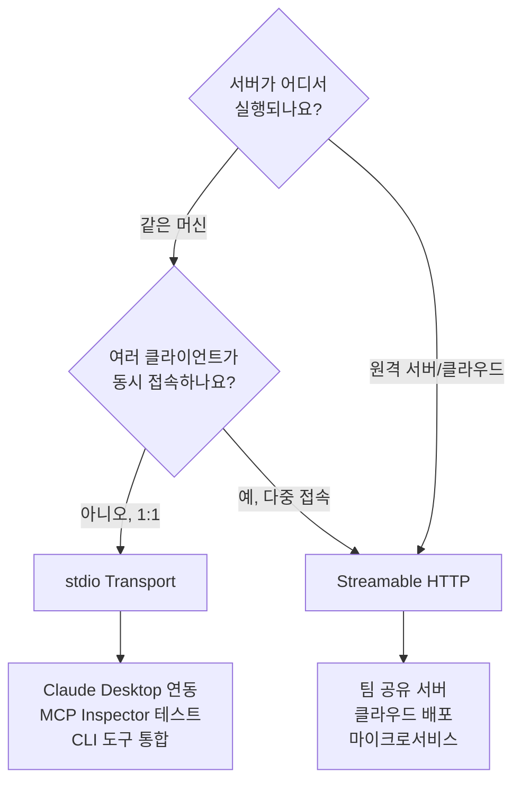

# Transport 계층 — stdio

> MCP의 첫 번째 통신 방식, stdin/stdout을 통한 JSON-RPC 메시지 교환의 원리와 실전 활용

## 개요

이 섹션에서는 MCP의 두 가지 표준 Transport 중 첫 번째인 **stdio Transport**를 깊이 있게 살펴봅니다. [이전 섹션](02-ch2-mcp-아키텍처와-프로토콜-구조/01-01-hostclientserver-3계층.md)에서 배운 Host/Client/Server 3계층이 **어떻게 실제로 통신하는지**, 그 물리적 파이프라인을 들여다보는 시간입니다.

**선수 지식**: Host, Client, Server 3계층 아키텍처의 역할과 관계 (세션 2.1)
**학습 목표**:
- stdio Transport의 동작 원리(stdin/stdout/stderr 역할 분담)를 설명할 수 있다
- 개행 구분 JSON(Newline-Delimited JSON) 메시지 프레이밍을 이해한다
- 프로세스 기반 통신의 장단점과 로컬 서버에 최적인 이유를 판단할 수 있다
- Python SDK의 `stdio_server()`와 `stdio_client()`를 사용해 통신을 구현할 수 있다

## 왜 알아야 할까?

MCP 서버를 처음 만들면 거의 100% stdio Transport로 시작합니다. Claude Desktop에 로컬 MCP 서버를 연결할 때, MCP Inspector로 디버깅할 때, 그리고 개발 중 빠르게 테스트할 때 — 모두 stdio입니다.

그런데 "stdout에 `print()`를 하나 찍었을 뿐인데 서버가 죽었다"는 경험, 해보신 적 있으신가요? stdio Transport의 동작 원리를 모르면 이런 버그에 몇 시간을 허비하게 됩니다. 반대로 원리를 이해하면, 디버깅이 극적으로 쉬워지고 안정적인 서버를 빠르게 만들 수 있죠.

## 핵심 개념

### 개념 1: stdio Transport란 무엇인가?

> 💡 **비유**: 편지함을 떠올려 보세요. 건물 입구에 "수신함(stdin)"과 "발신함(stdout)"이 있고, 옆에 "메모판(stderr)"이 걸려 있습니다. 편지(JSON-RPC 메시지)는 반드시 수신함/발신함으로만 오가야 하고, 메모판에는 "오늘 우체부가 3시에 옴" 같은 부가 정보만 적습니다. 만약 누군가 발신함에 편지가 아닌 낙서를 넣으면? 수신자는 혼란에 빠지겠죠.

stdio Transport는 **운영체제의 표준 입출력 스트림**(stdin, stdout, stderr)을 통신 채널로 사용하는 방식입니다. MCP 스펙에서 정의한 핵심 규칙은 다음과 같습니다:

1. **Client가 Server를 자식 프로세스(subprocess)로 실행**한다
2. Server는 **stdin에서 JSON-RPC 메시지를 읽고**, **stdout으로 메시지를 보낸다**
3. 메시지는 **개행(newline)으로 구분**되며, 메시지 내부에 개행을 포함해서는 안 된다
4. Server는 **stderr로 로그를 출력**할 수 있다 (MAY)
5. **stdout에는 유효한 MCP 메시지 외 아무것도 쓰면 안 된다** (MUST NOT)

> 📊 **그림 1**: stdio Transport의 3개 스트림 역할



이 구조의 핵심을 한마디로 정리하면: **stdout은 프로토콜 전용 채널, stderr은 사람이 읽는 로그 채널**입니다.

### 개념 2: 메시지 프레이밍 — 개행 구분 JSON

> 💡 **비유**: 카카오톡에서 메시지를 보낼 때, "전송" 버튼을 눌러야 하나의 메시지가 완성되잖아요? stdio Transport에서는 **줄바꿈(`\n`)**이 곧 "전송" 버튼입니다. 한 줄 = 한 메시지.

MCP의 stdio Transport는 **Newline-Delimited JSON (NDJSON)** 형식을 사용합니다. 모든 JSON-RPC 메시지는 UTF-8로 인코딩되어야 하며, 각 메시지는 하나의 줄로 표현됩니다.

> 📊 **그림 2**: 메시지 프레이밍 과정



실제 stdin/stdout을 흐르는 바이트를 보면 이런 모습입니다:

```run:python
import json

# Client → Server: 도구 목록 요청
request = {
    "jsonrpc": "2.0",
    "id": 1,
    "method": "tools/list",
    "params": {}
}

# 메시지를 한 줄 JSON으로 직렬화 (개행 없이)
line = json.dumps(request, ensure_ascii=False)
print(f"전송될 바이트: {line}")
print(f"메시지 길이: {len(line.encode('utf-8'))} bytes")
print(f"개행 포함 여부: {'\\n' in line}")
```

```output
전송될 바이트: {"jsonrpc": "2.0", "id": 1, "method": "tools/list", "params": {}}
메시지 길이: 62 bytes
개행 포함 여부: False
```

MCP 스펙이 **"메시지에 내장 개행(embedded newlines)을 포함해서는 안 된다(MUST NOT)"**고 명시한 이유가 여기 있습니다. 만약 JSON 안에 `\n`이 들어가면, 수신 측이 하나의 메시지를 두 줄로 착각하고 파싱에 실패합니다.

### 개념 3: 프로세스 라이프사이클

> 💡 **비유**: 어떤 전문가에게 일을 맡긴다고 생각해보세요. 전화를 걸어(프로세스 시작) → 질문을 주고받고(메시지 교환) → "다 끝났으니 끊을게요"(stdin 닫기) → 통화 종료(프로세스 종료). 이것이 stdio Transport의 전체 라이프사이클입니다.

Client가 Server의 라이프사이클을 **완전히 통제**합니다:

> 📊 **그림 3**: stdio 프로세스 라이프사이클



이 라이프사이클에서 중요한 점은:

1. **Server는 Client가 실행한 자식 프로세스**이므로, Client가 종료하면 Server도 함께 종료됩니다
2. **연결 = 프로세스 수명**: TCP 소켓처럼 "연결이 끊어졌다가 재연결"하는 개념이 없습니다
3. Client가 stdin을 닫으면, Server는 EOF를 감지하고 깨끗하게 종료해야 합니다

### 개념 4: stderr — 디버깅의 생명줄

MCP stdio Transport에서 **가장 많은 버그를 유발하는 부분**이 바로 stdout/stderr 혼동입니다. 스펙의 원문을 직접 보겠습니다:

> *"The server MUST NOT write anything to its stdout that is not a valid MCP message."*
> *"The server MAY write UTF-8 strings to its standard error (stderr) for logging purposes."*

즉, `print("디버그!")` 한 줄이면 서버가 즉사합니다. stdout에 유효하지 않은 JSON-RPC가 아닌 문자열이 출력되면, Client는 이를 파싱하려다 실패하고 연결을 끊어버리거든요.

> 📊 **그림 4**: stdout 오염 시 장애 흐름



Python에서 안전하게 로깅하는 방법은 다음과 같습니다:

```python
import sys
import logging

# ✅ 올바른 방법: stderr로 로깅 설정
logging.basicConfig(
    level=logging.DEBUG,
    format="%(asctime)s [%(levelname)s] %(name)s: %(message)s",
    stream=sys.stderr  # 핵심! stderr로 보내야 프로토콜을 오염시키지 않음
)
logger = logging.getLogger("my-mcp-server")

# ✅ 안전: stderr로 출력
logger.info("서버가 시작되었습니다")
logger.debug("도구 호출: calculate_sum")

# ❌ 위험: stdout으로 출력 → 프로토콜 깨짐!
# print("디버그 메시지")           # 절대 금지
# sys.stdout.write("hello\n")     # 절대 금지
```

### 개념 5: stdio vs Streamable HTTP — 언제 무엇을 쓸까?

stdio Transport가 **로컬 서버에 최적인 이유**는 명확합니다:

| 특성 | stdio | Streamable HTTP |
|------|-------|-----------------|
| 배포 위치 | 로컬(같은 머신) | 로컬 또는 원격 |
| 연결 방식 | 프로세스 파이프 | HTTP 요청/응답 |
| 네트워크 노출 | 없음 (프로세스 간 통신) | 있음 (포트 오픈) |
| 보안 모델 | OS 프로세스 격리 | TLS, OAuth 필요 |
| 다중 클라이언트 | 1:1 (한 프로세스 = 한 세션) | N:1 (여러 클라이언트) |
| 설정 복잡도 | 매우 낮음 | 중간~높음 |
| 서버 상태 | Client 종료 시 함께 종료 | 독립적 실행 |

> 📊 **그림 5**: Transport 선택 가이드



정리하면: **개발 중에는 stdio, 프로덕션 공유 서버에는 Streamable HTTP**가 일반적인 선택입니다.

## 실습: 직접 해보기

stdio Transport를 사용하는 서버와 클라이언트를 직접 구현해 봅시다. 먼저 Python MCP SDK를 설치합니다:

```console
pip install mcp
```

### Step 1: stdio 서버 만들기

```python
# echo_server.py — 입력을 그대로 돌려주는 MCP 서버
import asyncio
from mcp.server.fastmcp import FastMCP

# FastMCP 인스턴스 생성 — stdio가 기본 Transport
mcp = FastMCP("echo-server")

@mcp.tool()
def echo(message: str) -> str:
    """입력받은 메시지를 그대로 돌려줍니다."""
    return f"Echo: {message}"

@mcp.tool()
def add(a: int, b: int) -> int:
    """두 수를 더합니다."""
    return a + b

if __name__ == "__main__":
    # stdio Transport로 서버 실행
    # 내부적으로 stdin에서 읽고 stdout으로 응답
    mcp.run(transport="stdio")
```

### Step 2: stdio 클라이언트로 연결하기

```python
# echo_client.py — 서버를 subprocess로 실행하고 통신
import asyncio
from mcp import ClientSession, StdioServerParameters
from mcp.client.stdio import stdio_client

async def main():
    # 서버를 자식 프로세스로 실행할 파라미터 설정
    server_params = StdioServerParameters(
        command="python",           # 실행할 명령어
        args=["echo_server.py"],    # 명령어 인자
        env=None                    # 환경 변수 (None이면 현재 환경 상속)
    )

    # stdio Transport로 연결 — 서버 프로세스가 자동 실행됨
    async with stdio_client(server_params) as (read_stream, write_stream):
        # ClientSession으로 MCP 세션 시작
        async with ClientSession(read_stream, write_stream) as session:
            # 1. 초기화 (Initialize 핸드셰이크)
            await session.initialize()
            print("✅ 서버 연결 성공!", file=__import__('sys').stderr)

            # 2. 사용 가능한 도구 목록 조회
            tools = await session.list_tools()
            for tool in tools.tools:
                print(f"  도구: {tool.name} — {tool.description}",
                      file=__import__('sys').stderr)

            # 3. 도구 호출
            result = await session.call_tool("echo", {"message": "Hello MCP!"})
            print(f"  결과: {result.content[0].text}",
                  file=__import__('sys').stderr)

            result = await session.call_tool("add", {"a": 3, "b": 7})
            print(f"  합계: {result.content[0].text}",
                  file=__import__('sys').stderr)

if __name__ == "__main__":
    asyncio.run(main())
```

실행하면 다음과 같은 결과를 볼 수 있습니다:

```console
$ python echo_client.py
✅ 서버 연결 성공!
  도구: echo — 입력받은 메시지를 그대로 돌려줍니다.
  도구: add — 두 수를 더합니다.
  결과: Echo: Hello MCP!
  합계: 10
```

### Step 3: 내부에서 무슨 일이 일어나는지 확인

실제로 stdin/stdout을 흐르는 메시지를 직접 들여다보겠습니다:

```run:python
import json

# Client → Server로 보내는 실제 메시지들을 재현
messages = [
    # 1. 초기화 요청
    {
        "jsonrpc": "2.0", "id": 0,
        "method": "initialize",
        "params": {
            "protocolVersion": "2025-11-25",
            "clientInfo": {"name": "echo-client", "version": "1.0.0"},
            "capabilities": {}
        }
    },
    # 2. 초기화 완료 알림 (Notification — id 없음)
    {
        "jsonrpc": "2.0",
        "method": "notifications/initialized"
    },
    # 3. 도구 호출 요청
    {
        "jsonrpc": "2.0", "id": 1,
        "method": "tools/call",
        "params": {"name": "echo", "arguments": {"message": "Hello MCP!"}}
    }
]

print("=== stdin을 통해 전송되는 메시지 ===")
for i, msg in enumerate(messages):
    line = json.dumps(msg, ensure_ascii=False)
    print(f"\n[메시지 {i+1}] ({len(line)} bytes)")
    print(line)
```

```output
=== stdin을 통해 전송되는 메시지 ===

[메시지 1] (167 bytes)
{"jsonrpc": "2.0", "id": 0, "method": "initialize", "params": {"protocolVersion": "2025-11-25", "clientInfo": {"name": "echo-client", "version": "1.0.0"}, "capabilities": {}}}

[메시지 2] (52 bytes)
{"jsonrpc": "2.0", "method": "notifications/initialized"}

[메시지 3] (107 bytes)
{"jsonrpc": "2.0", "id": 1, "method": "tools/call", "params": {"name": "echo", "arguments": {"message": "Hello MCP!"}}}
```

각 메시지가 **정확히 한 줄**이고, 개행 없이 깔끔하게 직렬화된 것이 보이시죠? 이것이 바로 stdio Transport의 메시지 프레이밍입니다.

## 더 깊이 알아보기

### Unix 파이프의 유산

stdio Transport의 뿌리는 1973년 **Ken Thompson과 Dennis Ritchie**가 만든 Unix 파이프까지 거슬러 올라갑니다. "하나의 프로그램이 하나의 일을 잘 하고, 프로그램 간에는 텍스트 스트림으로 통신한다" — 이것이 Unix 철학의 핵심이었죠.

`cat file.txt | grep "error" | wc -l` 같은 파이프 체인에서 각 프로그램은 stdin으로 읽고 stdout으로 쓰며 협업합니다. MCP의 stdio Transport는 이 50년된 아이디어를 JSON-RPC로 현대화한 것입니다.

### LSP에서 물려받은 설계

MCP가 영감을 받은 **LSP(Language Server Protocol)** 역시 stdio Transport를 기본으로 사용합니다. VS Code가 Python 언어 서버를 실행할 때, 정확히 MCP와 같은 방식으로 서버 프로세스를 spawn하고 stdin/stdout으로 JSON-RPC 메시지를 교환하죠. 다만 LSP는 `Content-Length` 헤더를 사용하는 반면, MCP는 더 단순한 **개행 구분 방식**을 채택했습니다. 이 결정 덕분에 MCP 구현이 LSP보다 훨씬 간단해졌습니다.

### SSE Transport의 퇴장

재미있는 역사가 하나 있습니다. MCP의 초기 스펙(2024-11-05)에는 원격 Transport로 **HTTP+SSE**가 있었는데, 2025-11-25 스펙에서 **Streamable HTTP**로 교체되었습니다. SSE Transport의 양방향 통신 한계(서버→클라이언트만 스트리밍 가능)가 문제였거든요. 반면 stdio는 처음부터 지금까지 변하지 않았습니다 — 그만큼 단순하고 안정적인 설계라는 증거입니다.

## 흔한 오해와 팁

> ⚠️ **흔한 오해**: "stdout에 `print()` 하나쯤은 괜찮겠지?" — **절대 아닙니다.** stdout에 유효한 JSON-RPC가 아닌 어떤 문자열이든 출력하면, Client가 즉시 파싱 에러를 일으킵니다. 서드파티 라이브러리가 내부적으로 `print()`를 호출하는 경우도 있으니, `sys.stdout`을 `os.devnull`로 리다이렉트하거나 라이브러리 설정을 확인하세요.

> 💡 **알고 계셨나요?**: MCP 스펙은 Client가 Server의 stderr 출력을 "캡처하거나, 전달하거나, 무시할 수 있다(MAY)"고 명시합니다. 즉, stderr 출력이 반드시 사용자에게 보이리라는 보장이 없습니다. Claude Desktop은 stderr 로그를 `~/Library/Logs/Claude/` (macOS 기준)에 저장하므로, 디버깅 시 이 경로를 확인하면 됩니다.

> 🔥 **실무 팁**: FastMCP을 사용하면 `get_logger()` 유틸리티가 자동으로 stderr 기반 로거를 제공합니다. 별도 설정 없이 `from mcp.server.fastmcp.utilities.logging import get_logger` 한 줄이면 안전한 로깅이 준비됩니다. Python의 `logging` 모듈도 기본적으로 stderr를 사용하지만, 명시적으로 `stream=sys.stderr`를 지정하는 습관을 들이세요.

## 핵심 정리

| 개념 | 설명 |
|------|------|
| stdio Transport | stdin/stdout 파이프를 통해 JSON-RPC 메시지를 교환하는 로컬 통신 방식 |
| 메시지 프레이밍 | 개행(newline) 구분 JSON — 한 줄 = 한 메시지, 내부 개행 금지 |
| stdout 규칙 | 유효한 MCP 메시지(JSON-RPC)만 허용, 그 외 출력 절대 금지 |
| stderr 역할 | 로깅·디버깅 전용 채널, Client가 캡처/무시 가능 |
| 프로세스 모델 | Client가 Server를 subprocess로 실행, 종료도 Client가 제어 |
| 1:1 제약 | 하나의 프로세스 = 하나의 세션, 다중 클라이언트 불가 |
| 인코딩 | UTF-8 필수 |
| 보안 장점 | 네트워크 노출 없음, OS 프로세스 격리만으로 충분 |

## 다음 섹션 미리보기

stdio가 로컬 1:1 통신의 왕이라면, 원격 환경과 다중 클라이언트를 위한 Transport도 필요하겠죠? 다음 섹션 [03. Transport 계층 — Streamable HTTP](02-ch2-mcp-아키텍처와-프로토콜-구조/03-03-transport-계층-streamable-http.md)에서는 HTTP POST와 Server-Sent Events를 결합한 Streamable HTTP Transport를 살펴봅니다. 세션 관리, 재연결, 다중 클라이언트 지원 등 stdio에서는 불가능했던 기능들을 어떻게 구현하는지 알아보겠습니다.

## 참고 자료

- [MCP Specification — Transports (2025-11-25)](https://modelcontextprotocol.io/specification/2025-11-25/basic/transports) - 공식 스펙의 Transport 섹션. stdio와 Streamable HTTP의 MUST/SHOULD 규칙 원문
- [MCP Python SDK (GitHub)](https://github.com/modelcontextprotocol/python-sdk) - `stdio_client()`와 `stdio_server()` 구현체를 포함한 공식 Python SDK
- [Transports — MCP Info](https://modelcontextprotocol.info/docs/concepts/transports/) - stdio vs HTTP Transport의 장단점 비교와 코드 예제
- [Understanding MCP Stdio Transport — Laurent Kubaski](https://medium.com/@laurentkubaski/understanding-mcp-stdio-transport-protocol-ae3d5daf64db) - stdio Transport의 내부 동작을 심층 분석한 블로그 포스트
- [Debugging MCP Servers: Tips and Best Practices](https://www.mcpevals.io/blog/debugging-mcp-servers-tips-and-best-practices) - stderr 로깅, MCP Inspector 활용 등 실전 디버깅 가이드
- [Build an MCP Client — Model Context Protocol](https://modelcontextprotocol.io/docs/develop/build-client) - 공식 문서의 클라이언트 구현 가이드, StdioServerParameters 사용법 포함

---
### 🔗 Related Sessions
- [host](02-ch2-mcp-아키텍처와-프로토콜-구조/01-01-hostclientserver-3계층.md) (prerequisite)
- [client](02-ch2-mcp-아키텍처와-프로토콜-구조/01-01-hostclientserver-3계층.md) (prerequisite)
- [server](02-ch2-mcp-아키텍처와-프로토콜-구조/01-01-hostclientserver-3계층.md) (prerequisite)
- [3계층 아키텍처](02-ch2-mcp-아키텍처와-프로토콜-구조/01-01-hostclientserver-3계층.md) (prerequisite)
