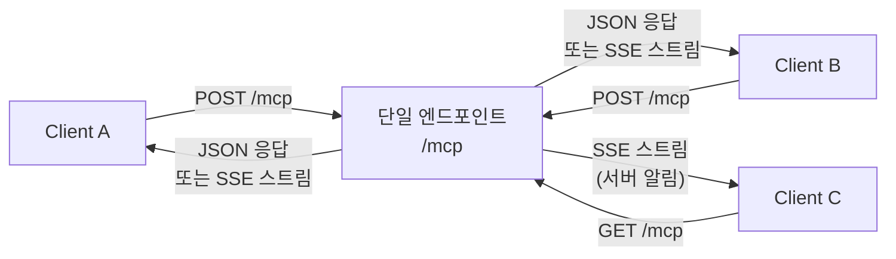
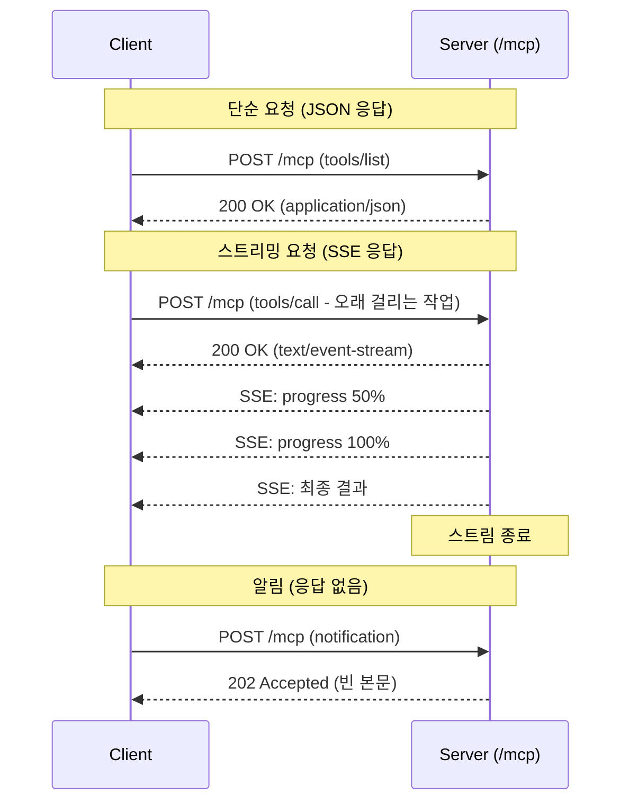
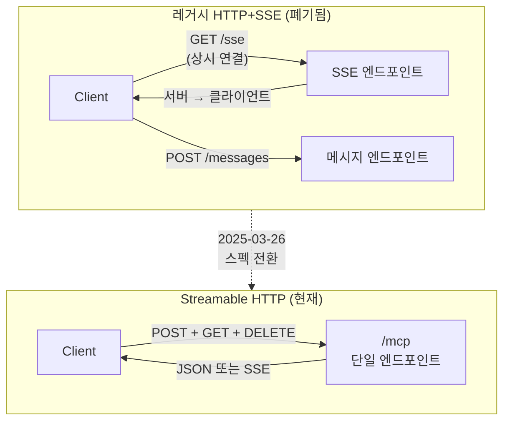
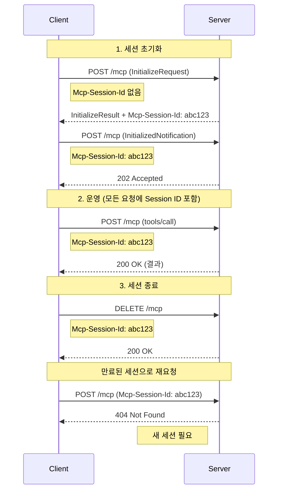
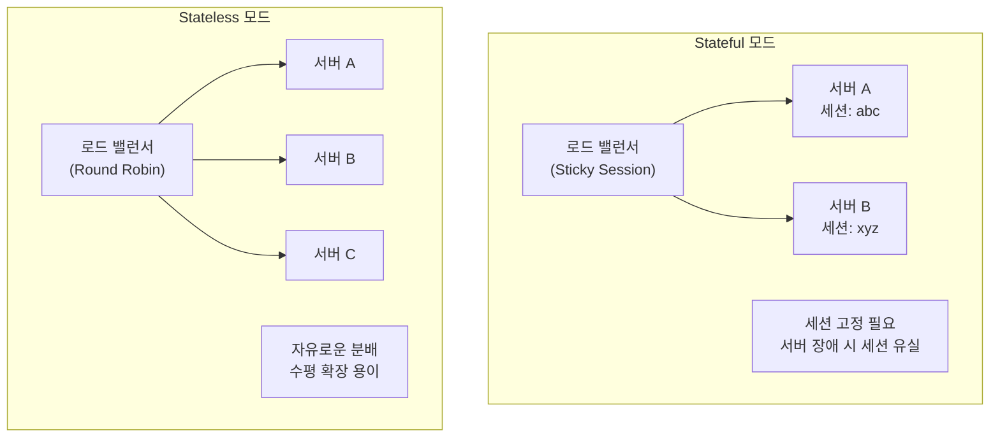

# Transport 계층 — Streamable HTTP

> MCP의 원격 통신 표준인 Streamable HTTP Transport의 구조, 세션 관리, 그리고 기존 SSE 방식에서 전환된 배경을 학습합니다.

## 개요

이 섹션에서는 MCP의 두 번째 공식 Transport인 **Streamable HTTP**를 깊이 있게 다룹니다. [이전 섹션](02-ch2-mcp-아키텍처와-프로토콜-구조/02-02-transport-계층-stdio.md)에서 배운 stdio Transport가 로컬 프로세스 간 통신이었다면, Streamable HTTP는 **네트워크를 넘어 원격 서버와 통신**하기 위한 Transport입니다.

**선수 지식**: [Host/Client/Server 3계층](02-ch2-mcp-아키텍처와-프로토콜-구조/01-01-hostclientserver-3계층.md)의 역할 구분, [stdio Transport](02-ch2-mcp-아키텍처와-프로토콜-구조/02-02-transport-계층-stdio.md)의 동작 원리와 한계

**학습 목표**:
- Streamable HTTP Transport의 통신 구조(POST 요청 + SSE 스트리밍 응답)를 설명할 수 있다
- 기존 HTTP+SSE Transport에서 Streamable HTTP로 전환된 이유를 이해한다
- `Mcp-Session-Id` 헤더를 활용한 세션 관리 메커니즘을 설명할 수 있다
- Python SDK로 Streamable HTTP 서버를 구현하고 실행할 수 있다

## 왜 알아야 할까?

stdio Transport는 강력하지만, **같은 머신에서 프로세스를 직접 실행**해야 한다는 근본적인 제약이 있었죠. 만약 여러분이 만든 MCP 서버를 클라우드에 배포하고, 수백 명의 사용자가 동시에 접속하게 하려면 어떻게 해야 할까요?

바로 이때 필요한 것이 **Streamable HTTP Transport**입니다:

- **클라우드 배포**: AWS, GCP, Cloudflare 등에 MCP 서버를 배포하고 원격 접속
- **다중 클라이언트**: 하나의 서버가 여러 클라이언트의 요청을 동시에 처리
- **인프라 친화적**: 로드 밸런서, CDN, 리버스 프록시와 자연스럽게 통합
- **수평 확장**: 트래픽 증가에 따라 서버 인스턴스를 늘리는 스케일아웃 가능

MCP가 개인 도구를 넘어 **프로덕션 서비스**로 성장하려면, Streamable HTTP는 반드시 이해해야 하는 핵심 Transport입니다.

## 핵심 개념

### 개념 1: 단일 엔드포인트 아키텍처 — "하나의 문으로 모든 소통을"

> 💡 **비유**: stdio가 "내 방 안에서 대화하는 것"이었다면, Streamable HTTP는 **호텔 프론트 데스크**와 같습니다. 투숙객(Client)은 항상 프론트 데스크(하나의 엔드포인트)에 요청을 하고, 프론트 데스크가 객실(Server 로직)에 전달하여 결과를 돌려줍니다. 각 투숙객은 체크인 시 받은 방 키(Session ID)로 자신을 식별하죠.

Streamable HTTP Transport의 가장 큰 특징은 **단일 HTTP 엔드포인트**(`/mcp`)로 모든 통신을 처리한다는 점입니다. 클라이언트와 서버 사이의 모든 대화가 이 하나의 문을 통해 이루어집니다.

> 📊 **그림 1**: Streamable HTTP의 단일 엔드포인트 구조



이 엔드포인트는 세 가지 HTTP 메서드를 지원합니다:

| HTTP 메서드 | 용도 | 응답 |
|------------|------|------|
| **POST** | Client → Server 메시지 전송 (요청, 알림, 응답) | JSON 또는 SSE 스트림 |
| **GET** | Server → Client 스트림 열기 (서버 발 알림 수신) | SSE 스트림 또는 405 |
| **DELETE** | 세션 종료 | 성공 또는 405 |

핵심은 **POST 요청에 대한 응답이 두 가지 형태**가 가능하다는 것입니다:

```python
# 서버가 선택할 수 있는 두 가지 응답 형태

# 1. 단순 JSON 응답 (빠르고 간결)
# Content-Type: application/json
{"jsonrpc": "2.0", "id": 1, "result": {"tools": [...]}}

# 2. SSE 스트리밍 응답 (진행 상황 전달 가능)
# Content-Type: text/event-stream
# data: {"jsonrpc": "2.0", "method": "notifications/progress", ...}
# data: {"jsonrpc": "2.0", "id": 1, "result": {"content": [...]}}
```

클라이언트는 POST 요청 시 반드시 두 형태를 모두 수용할 수 있음을 알려야 합니다:

```python
# 클라이언트가 반드시 포함해야 하는 헤더
headers = {
    "Accept": "application/json, text/event-stream",
    "Content-Type": "application/json",
}
```

### 개념 2: 통신 흐름 — 요청과 응답의 여정

> 💡 **비유**: 식당에서 주문하는 두 가지 방식을 떠올려보세요. 간단한 음료 주문은 "콜라 하나요" → "여기 있습니다"로 끝나지만(JSON 응답), 코스 요리는 전채 → 메인 → 디저트가 순서대로 나오죠(SSE 스트리밍). Streamable HTTP는 서버가 요청의 성격에 따라 둘 중 하나를 선택합니다.

> 📊 **그림 2**: Streamable HTTP 통신 흐름 — POST 요청과 두 가지 응답



**알림(Notification)과 응답(Response)을 POST할 때**는 서버가 `202 Accepted`만 반환합니다. 처리할 "요청"이 아니므로, 별도 응답 본문이 필요 없거든요.

**서버가 먼저 클라이언트에게 메시지를 보내야 할 때**는 어떻게 할까요? 클라이언트가 GET 요청으로 SSE 스트림을 열어두면, 서버가 이 채널을 통해 알림이나 요청을 보낼 수 있습니다:

```python
# 서버 발 메시지를 위한 GET 스트림 (선택적)
# Client → GET /mcp
# Server → text/event-stream (서버가 보내야 할 알림을 이 채널로 전송)

# 서버가 리소스 변경 알림을 보내는 경우:
# event: message
# data: {"jsonrpc": "2.0", "method": "notifications/resources/updated", ...}
```

### 개념 3: SSE에서 Streamable HTTP로 — 왜 바뀌었을까?

> 💡 **비유**: 초기 MCP의 HTTP+SSE 방식은 **전화 한 통을 켜둔 채 다른 전화로 따로 용건을 전달하는 것**과 같았습니다. 한 회선(SSE 연결)은 항상 열어둬야 하고, 실제 요청은 별도 회선(POST)으로 보내야 했죠. Streamable HTTP는 이것을 **하나의 스마트폰 통화**로 바꿨습니다 — 필요할 때만 연결하고, 한 채널로 양방향 소통이 됩니다.

MCP 스펙 2024-11-05에서 사용하던 **HTTP+SSE Transport**는 두 개의 별도 엔드포인트가 필요했습니다:

> 📊 **그림 3**: 레거시 HTTP+SSE vs Streamable HTTP 비교



레거시 방식의 문제점을 구체적으로 살펴보면:

| 문제 | 레거시 HTTP+SSE | Streamable HTTP |
|------|----------------|-----------------|
| **엔드포인트** | 2개 (`/sse` + `/messages`) | 1개 (`/mcp`) |
| **연결 유지** | SSE 상시 연결 필수 | 필요할 때만 연결 |
| **연결 끊김** | 응답 유실 위험 | Resumability로 복구 |
| **로드 밸런서** | 세션 고정(sticky) 필요 | Stateless 모드 지원 |
| **수평 확장** | 어려움 (커넥션 고정) | 용이 (요청 기반) |
| **인증** | 연결 시 1회만 검증 | 매 요청마다 검증 가능 |

스펙 `2025-03-26`에서 Streamable HTTP가 도입되었고, 기존 HTTP+SSE는 **deprecated** 상태입니다.

### 개념 4: 세션 관리 — Mcp-Session-Id

> 💡 **비유**: 은행 창구를 생각해보세요. 처음 방문하면 번호표(Session ID)를 받습니다. 이후 모든 업무에서 이 번호표를 제시해야 하고, 업무가 끝나면 번호표를 반납합니다. 만약 잘못된 번호표를 제시하면 "해당 번호는 없습니다"라고 거부당하죠.

MCP의 세션 관리는 `Mcp-Session-Id` HTTP 헤더를 중심으로 동작합니다:

> 📊 **그림 4**: 세션 라이프사이클 — 초기화부터 종료까지



세션 ID의 핵심 규칙을 정리하면:

```python
# Session ID 규칙
session_rules = {
    "형식": "가시적 ASCII 문자만 (0x21-0x7E)",
    "생성": "서버가 InitializeResult에 포함하여 발급",
    "고유성": "전역적으로 유일, 암호학적으로 안전 (UUID, JWT 등)",
    "필수": "초기화 이후 모든 요청에 포함 필수",
    "누락 시": "서버는 400 Bad Request 반환",
    "만료 시": "서버는 404 Not Found → 클라이언트가 새 세션 시작",
}
```

또한 클라이언트는 세션 내 모든 요청에 **프로토콜 버전 헤더**도 포함해야 합니다:

```python
# 세션 운영 중 필수 헤더
headers = {
    "Mcp-Session-Id": "abc123-def456",
    "MCP-Protocol-Version": "2025-11-25",  # 협상된 버전
    "Accept": "application/json, text/event-stream",
    "Content-Type": "application/json",
}
```

### 개념 5: Stateful vs Stateless — 확장 전략의 갈림길

> 💡 **비유**: 동네 단골 가게(Stateful)는 여러분의 취향을 기억하지만 주인이 바뀌면 처음부터 다시 알아야 합니다. 반면 패스트푸드 체인(Stateless)은 매번 주문서를 새로 작성하지만, 어느 지점을 가든 같은 서비스를 받을 수 있죠.

> 📊 **그림 5**: Stateful vs Stateless 배포 비교



| 항목 | Stateful | Stateless |
|------|----------|-----------|
| **Session ID** | 서버가 발급·관리 | 발급하지 않음 |
| **로드 밸런서** | Sticky Session 필요 | Round Robin 가능 |
| **수평 확장** | 세션 공유 저장소 필요 | 인스턴스 자유 추가 |
| **장애 복구** | 세션 유실 위험 | 영향 없음 |
| **적합한 경우** | 대화형 세션, 복잡한 상태 | API 게이트웨이, 단순 조회 |

Python SDK에서는 이 선택이 매우 간단합니다:

```python
from mcp.server.fastmcp import FastMCP

# Stateful (기본값) — 세션 추적, 상태 유지
mcp_stateful = FastMCP("MyServer")

# Stateless — 요청 간 상태 없음, 수평 확장에 최적
mcp_stateless = FastMCP("MyServer", stateless_http=True, json_response=True)
```

`json_response=True`를 함께 설정하면 SSE 대신 항상 JSON으로 응답하므로, 인프라 호환성이 더 높아집니다.

## 실습: 직접 해보기

Streamable HTTP Transport로 MCP 서버를 만들고 실행해봅시다.

### Step 1: 프로젝트 구조 생성

```python
# 프로젝트 디렉토리 구조
# streamable-http-demo/
# ├── server.py          # MCP 서버
# └── requirements.txt   # 의존성
```

```
# requirements.txt
mcp>=1.26.0
uvicorn
httpx
```

### Step 2: Streamable HTTP 서버 구현

```python
# server.py — Streamable HTTP MCP 서버
from mcp.server.fastmcp import FastMCP
import datetime

# Streamable HTTP Transport로 서버 생성
mcp = FastMCP(
    "WeatherDemo",
    host="127.0.0.1",  # 로컬 바인딩 (보안)
    port=8000,
)

@mcp.tool()
def get_weather(city: str) -> str:
    """특정 도시의 현재 날씨를 조회합니다.

    Args:
        city: 날씨를 조회할 도시명 (예: Seoul, Tokyo)
    """
    # 데모용 더미 데이터
    weather_data = {
        "Seoul": "맑음, 22°C",
        "Tokyo": "흐림, 18°C",
        "New York": "비, 15°C",
    }
    result = weather_data.get(city, f"{city}의 날씨 정보를 찾을 수 없습니다")
    return f"🌤 {city} 날씨: {result}"


@mcp.tool()
def get_server_time() -> str:
    """서버의 현재 시간을 반환합니다."""
    now = datetime.datetime.now().isoformat()
    return f"서버 시간: {now}"


@mcp.resource("info://server/status")
def server_status() -> str:
    """서버의 상태 정보를 제공합니다."""
    return "Status: Running | Transport: Streamable HTTP | Port: 8000"


if __name__ == "__main__":
    # Streamable HTTP Transport로 실행
    # http://127.0.0.1:8000/mcp 에서 접근 가능
    mcp.run(transport="streamable-http")
```

### Step 3: 서버 실행과 테스트

터미널에서 서버를 실행합니다:

```terminal
$ cd streamable-http-demo
$ python server.py
INFO:     Started server process
INFO:     Uvicorn running on http://127.0.0.1:8000
INFO:     MCP endpoint: http://127.0.0.1:8000/mcp
```

별도 터미널에서 `curl`로 직접 테스트해볼 수 있습니다:

```terminal
$ curl -X POST http://127.0.0.1:8000/mcp \
  -H "Content-Type: application/json" \
  -H "Accept: application/json, text/event-stream" \
  -d '{"jsonrpc":"2.0","id":1,"method":"initialize","params":{"protocolVersion":"2025-11-25","capabilities":{},"clientInfo":{"name":"curl-test","version":"1.0"}}}'
```

### Step 4: Python 클라이언트로 연결

```python
# client.py — Streamable HTTP 클라이언트
import asyncio
from mcp.client.streamable_http import streamablehttp_client
from mcp import ClientSession

async def main():
    # Streamable HTTP 서버에 연결
    async with streamablehttp_client("http://127.0.0.1:8000/mcp") as (
        read_stream,
        write_stream,
        _,
    ):
        async with ClientSession(read_stream, write_stream) as session:
            # 1. 세션 초기화 (내부적으로 Mcp-Session-Id 수신)
            await session.initialize()
            print("세션 초기화 완료!")

            # 2. 사용 가능한 도구 목록 조회
            tools = await session.list_tools()
            print(f"\n사용 가능한 도구: {len(tools.tools)}개")
            for tool in tools.tools:
                print(f"  - {tool.name}: {tool.description}")

            # 3. 도구 호출
            result = await session.call_tool(
                "get_weather", {"city": "Seoul"}
            )
            print(f"\n도구 호출 결과: {result.content[0].text}")

            # 4. 리소스 읽기
            resource = await session.read_resource("info://server/status")
            print(f"서버 상태: {resource.contents[0].text}")

if __name__ == "__main__":
    asyncio.run(main())
```

```run:python
# 실행 결과 시뮬레이션 (서버가 실행 중일 때)
print("세션 초기화 완료!")
print()
print("사용 가능한 도구: 2개")
print("  - get_weather: 특정 도시의 현재 날씨를 조회합니다.")
print("  - get_server_time: 서버의 현재 시간을 반환합니다.")
print()
print("도구 호출 결과: 🌤 Seoul 날씨: 맑음, 22°C")
print("서버 상태: Status: Running | Transport: Streamable HTTP | Port: 8000")
```

```output
세션 초기화 완료!

사용 가능한 도구: 2개
  - get_weather: 특정 도시의 현재 날씨를 조회합니다.
  - get_server_time: 서버의 현재 시간을 반환합니다.

도구 호출 결과: 🌤 Seoul 날씨: 맑음, 22°C
서버 상태: Status: Running | Transport: Streamable HTTP | Port: 8000
```

### Step 5: Stateless 모드로 전환

프로덕션 환경에서 수평 확장이 필요하다면 Stateless 모드로 전환합니다:

```python
# server_stateless.py — Stateless Streamable HTTP 서버
from mcp.server.fastmcp import FastMCP

mcp = FastMCP(
    "WeatherDemo-Stateless",
    stateless_http=True,    # 세션 상태 없음
    json_response=True,     # 항상 JSON 응답 (SSE 비활성화)
    host="0.0.0.0",         # 외부 접근 허용 (프로덕션)
    port=8000,
)

@mcp.tool()
def get_weather(city: str) -> str:
    """특정 도시의 현재 날씨를 조회합니다."""
    return f"{city}: 맑음, 22°C"

if __name__ == "__main__":
    mcp.run(transport="streamable-http")
```

```run:python
# Stateful vs Stateless 설정 차이
print("[ Stateful (기본) ]")
print('  FastMCP("Server")')
print('  → Mcp-Session-Id 발급, 세션 추적')
print()
print("[ Stateless ]")
print('  FastMCP("Server", stateless_http=True, json_response=True)')
print('  → Session ID 없음, 매 요청 독립, 수평 확장 용이')
```

```output
[ Stateful (기본) ]
  FastMCP("Server")
  → Mcp-Session-Id 발급, 세션 추적

[ Stateless ]
  FastMCP("Server", stateless_http=True, json_response=True)
  → Session ID 없음, 매 요청 독립, 수평 확장 용이
```

## 더 깊이 알아보기

### SSE에서 Streamable HTTP로: 전환의 역사

MCP의 Transport 역사는 짧지만 급격한 전환을 경험했습니다.

2024년 11월, Anthropic이 MCP를 오픈소스로 공개했을 때 원격 통신은 **HTTP+SSE** 방식이었습니다. 이 방식은 Server-Sent Events(SSE)라는 웹 표준을 차용한 것으로, 서버가 클라이언트에게 실시간으로 데이터를 보내는 데 최적화된 기술이었죠. 하지만 MCP처럼 **양방향 통신**이 필요한 프로토콜에서는 SSE만으로는 부족했습니다.

문제의 핵심은 **이중 채널 아키텍처**였습니다. 클라이언트가 `/sse` 엔드포인트로 SSE 연결을 상시 유지하면서, 별도의 `/messages` 엔드포인트로 HTTP POST를 보내야 했거든요. 이 두 채널을 연결하는 내부 로직이 복잡했고, SSE 연결이 끊기면 진행 중이던 응답을 유실할 위험이 있었습니다.

2025년 3월 26일, MCP 스펙 2025-03-26이 발표되면서 **Streamable HTTP**가 새로운 표준 Transport로 등장했습니다. 이 전환을 주도한 핵심 인물 중 하나는 MCP 스펙 팀의 핵심 기여자들로, 그들은 Microsoft의 LSP(Language Server Protocol) 경험에서 "단일 채널 통신의 단순함"이 장기적으로 더 안정적이라는 교훈을 가져왔습니다.

흥미로운 것은 **Streamable HTTP라는 이름** 자체입니다. "HTTP"가 아닌 "Streamable HTTP"인 이유는, 일반 HTTP의 요청-응답 모델을 확장하여 SSE 스트리밍을 **선택적으로** 사용할 수 있기 때문입니다. HTTP의 단순함은 유지하되, 필요할 때만 스트리밍의 이점을 취하는 하이브리드 접근이죠.

### Resumability — 끊김에도 견디는 설계

Streamable HTTP의 가장 정교한 기능 중 하나는 **재연결 시 메시지 복구(Resumability)** 입니다. SSE 표준의 `id` 필드와 `Last-Event-ID` 헤더를 활용합니다:

1. 서버가 SSE 이벤트마다 고유 `id`를 부여
2. 연결이 끊기면, 클라이언트가 마지막으로 받은 `id`를 `Last-Event-ID` 헤더에 담아 GET 요청
3. 서버가 해당 ID 이후의 이벤트를 재전송

이 기능은 스펙 2025-11-25에서 **프라이밍 이벤트(priming event)** 가 추가되면서 더 견고해졌습니다. 서버가 스트림 시작 시 빈 SSE 이벤트에 ID를 부여해두면, 실제 메시지가 오기 전에도 재연결 지점이 확보됩니다.

## 흔한 오해와 팁

> ⚠️ **흔한 오해**: "Streamable HTTP는 SSE를 완전히 제거한 것이다"
>
> 아닙니다! Streamable HTTP는 SSE를 **제거**한 것이 아니라, SSE를 **선택적**으로 사용합니다. POST 응답에서 서버가 `text/event-stream`을 선택할 수 있고, GET 요청으로 서버 발 알림을 SSE로 받을 수도 있습니다. 변한 것은 "SSE 상시 연결 필수"에서 "필요할 때만 SSE"로의 전환입니다.

> 💡 **알고 계셨나요?**: Streamable HTTP는 **하위 호환성**까지 고려했습니다. 클라이언트가 새 방식으로 초기화 요청을 보냈는데 서버가 400/404/405로 응답하면, 자동으로 레거시 HTTP+SSE 모드로 폴백할 수 있습니다. 서버도 `/mcp`(새 방식)과 `/sse` + `/messages`(레거시)를 동시에 운영하며 점진적 마이그레이션이 가능합니다.

> 🔥 **실무 팁**: 프로덕션 Streamable HTTP 서버는 반드시 **Origin 헤더를 검증**하세요. MCP 스펙은 DNS 리바인딩 공격 방지를 위해 모든 요청의 `Origin` 헤더를 검사하도록 **MUST** 수준으로 요구합니다. 유효하지 않은 Origin에는 `403 Forbidden`을 반환해야 합니다. 로컬 서버라면 반드시 `127.0.0.1`에 바인딩하세요(`0.0.0.0`은 외부 노출 위험).

> 🔥 **실무 팁**: `stateless_http=True`와 `json_response=True`를 함께 사용하면 Streamable HTTP 서버가 일반 REST API처럼 동작합니다. 로드 밸런서 뒤에서 여러 인스턴스를 Sticky Session 없이 운영할 수 있어, Kubernetes나 Cloud Run 환경에 특히 적합합니다.

## 핵심 정리

| 개념 | 설명 |
|------|------|
| **Streamable HTTP** | MCP의 원격 통신 Transport. 단일 `/mcp` 엔드포인트, POST/GET/DELETE 지원 |
| **단일 엔드포인트** | 모든 통신이 하나의 HTTP 경로(`/mcp`)를 통해 이루어짐 |
| **이중 응답** | 서버가 JSON(`application/json`) 또는 SSE(`text/event-stream`) 중 선택 |
| **Mcp-Session-Id** | 서버가 초기화 시 발급하는 세션 식별자. 이후 모든 요청에 포함 필수 |
| **Stateful 모드** | 세션 추적 활성. 대화형 상호작용에 적합 |
| **Stateless 모드** | 세션 없이 매 요청 독립 처리. 수평 확장에 최적 (`stateless_http=True`) |
| **Resumability** | SSE 이벤트 ID + `Last-Event-ID`로 끊긴 스트림 복구 |
| **레거시 전환** | HTTP+SSE(2024-11-05) → Streamable HTTP(2025-03-26)로 대체. 하위 호환 지원 |
| **보안 필수** | Origin 헤더 검증 필수, 로컬은 `127.0.0.1` 바인딩 |

## 다음 섹션 미리보기

지금까지 stdio와 Streamable HTTP라는 두 가지 Transport를 통해 **메시지가 어떻게 전달되는지** 배웠습니다. 하지만 그 메시지 안에는 정확히 무엇이 담겨 있을까요? 다음 섹션 [JSON-RPC 2.0 메시지 포맷](02-ch2-mcp-아키텍처와-프로토콜-구조/04-04-json-rpc-20-메시지-포맷.md)에서는 MCP 메시지의 **내부 구조** — Request, Response, Notification 세 가지 메시지 타입과 그 JSON-RPC 2.0 포맷을 상세히 분석합니다.

## 참고 자료

- [MCP Specification 2025-11-25 — Transports](https://modelcontextprotocol.io/specification/2025-11-25/basic/transports#streamable-http) - Streamable HTTP Transport의 공식 스펙. 프로토콜 동작, 세션 관리, 보안 요구사항의 원본
- [MCP Transport Concepts](https://modelcontextprotocol.info/docs/concepts/transports/) - stdio와 Streamable HTTP를 비교하며 개념적으로 설명하는 가이드
- [Why MCP Deprecated SSE](https://blog.fka.dev/blog/2025-06-06-why-mcp-deprecated-sse-and-go-with-streamable-http/) - SSE에서 Streamable HTTP로 전환된 기술적 배경을 상세히 분석한 포스트
- [MCP Transport Scalability: Production Migration Guide](https://www.elegantsoftwaresolutions.com/blog/mcp-transport-scalability-production-migration-guide-2026) - 프로덕션 환경에서의 Streamable HTTP 마이그레이션 전략
- [MCP Python SDK (GitHub)](https://github.com/modelcontextprotocol/python-sdk) - `StreamableHTTPServerTransport`, `streamablehttp_client` 등 구현체의 소스 코드
- [Cloudflare — Streamable HTTP MCP Servers in Python](https://blog.cloudflare.com/streamable-http-mcp-servers-python/) - Cloudflare Workers에서 Python MCP 서버를 Streamable HTTP로 배포하는 실전 사례

---
### 🔗 Related Sessions
- [stdio transport](02-ch2-mcp-아키텍처와-프로토콜-구조/02-02-transport-계층-stdio.md) (prerequisite)
