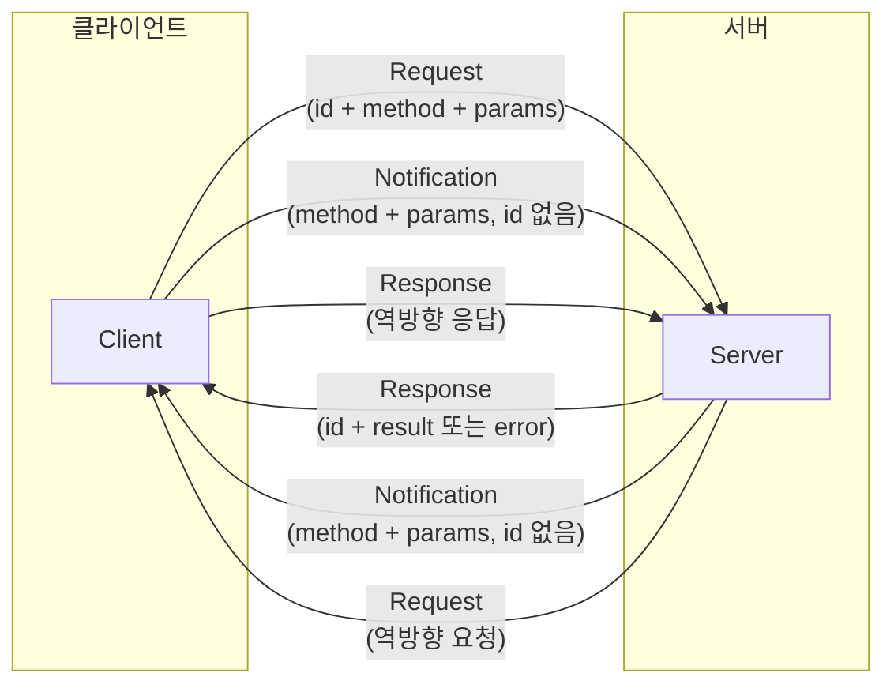
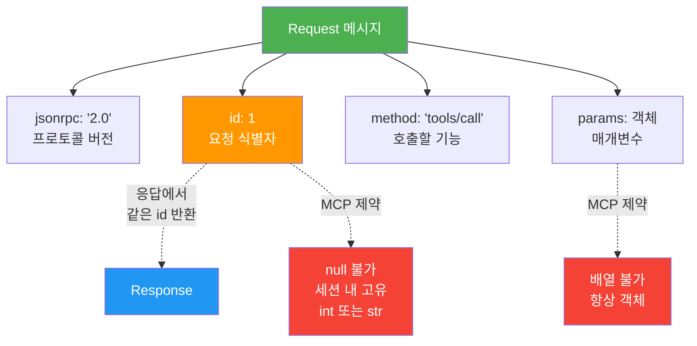
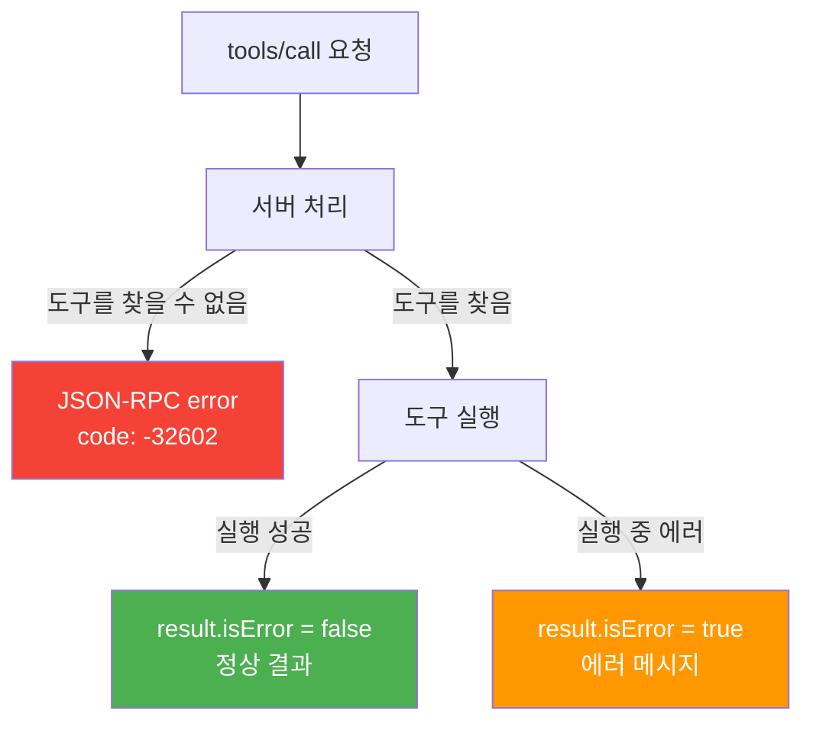
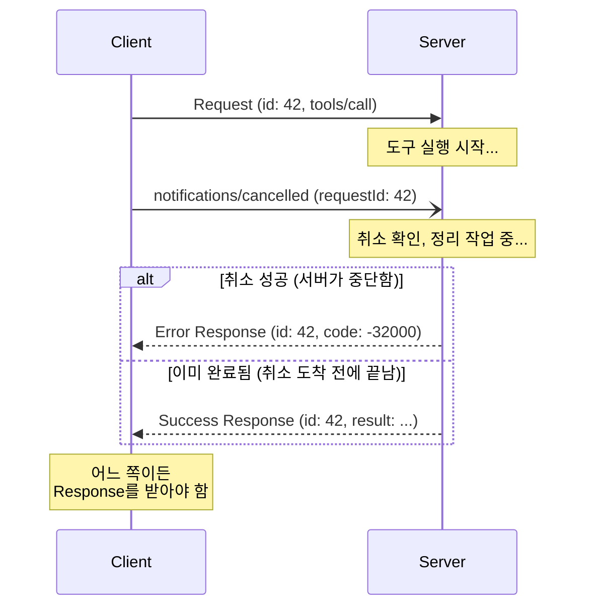
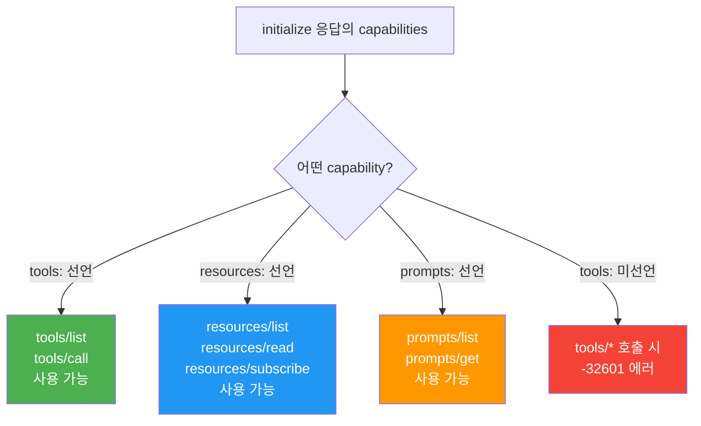
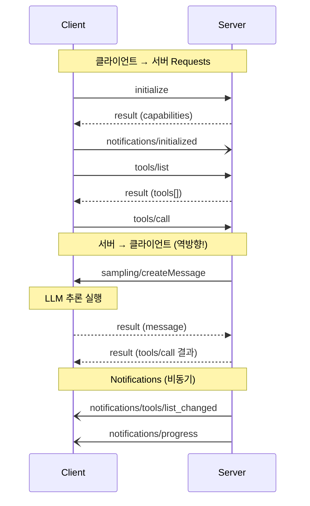
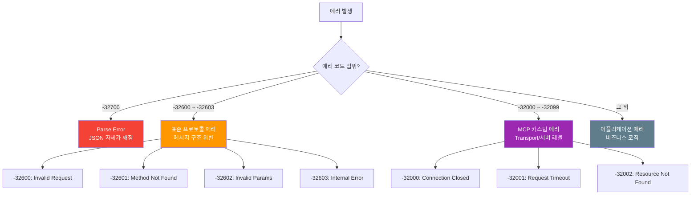

# JSON-RPC 2.0 메시지 포맷

> MCP의 모든 통신을 구성하는 메시지 봉투 — Request, Response, Notification의 구조, 에러 코드 체계, 그리고 실전 디버깅 패턴까지 완전히 이해합니다.

## 개요

이 섹션에서는 [Transport 계층 — stdio](02-ch2-mcp-아키텍처와-프로토콜-구조/02-02-transport-계층-stdio.md)와 [Transport 계층 — Streamable HTTP](02-ch2-mcp-아키텍처와-프로토콜-구조/03-03-transport-계층-streamable-http.md)에서 배운 "파이프"를 통해 실제로 **어떤 모양의 메시지**가 오가는지 살펴봅니다. 단순히 메시지 구조를 나열하는 데서 그치지 않고, MCP가 JSON-RPC 2.0 위에 **어떤 추가 제약과 확장**을 두었는지, 실전에서 **에러를 어떻게 분류하고 처리**하는지까지 깊이 다룹니다.

**선수 지식**: 이전 섹션에서 배운 stdio Transport와 Streamable HTTP Transport의 동작 원리, 그리고 [Host/Client/Server 3계층](02-ch2-mcp-아키텍처와-프로토콜-구조/01-01-hostclientserver-3계층.md)의 역할 구분

**학습 목표**:
- JSON-RPC 2.0의 세 가지 메시지 타입(Request, Response, Notification)의 구조와 MCP 추가 제약을 정확히 설명할 수 있다
- MCP의 method 네이밍 규칙(`resource/action`)과 Capability 기반 메서드 가용성을 이해한다
- `id` 필드의 생성 전략, 요청-응답 매칭 원리, 동시성 문제를 다룰 수 있다
- 표준 에러 코드(-32700~-32603)와 MCP 커스텀 에러 코드를 구분하고, 에러 전파 패턴을 설계할 수 있다
- JSON-RPC Batch 요청의 원리를 이해하고, MCP가 이를 사용하지 않는 이유를 설명할 수 있다

## 왜 알아야 할까?

앞선 두 섹션에서 우리는 **파이프의 종류**를 배웠습니다. stdio는 표준 입출력 파이프, Streamable HTTP는 네트워크 파이프였죠. 하지만 파이프 안에 **어떤 형태의 편지**를 넣어야 하는지는 아직 다루지 않았습니다.

JSON-RPC 2.0은 바로 그 **편지 봉투의 규격**입니다. MCP의 모든 기능 — 도구 호출, 리소스 읽기, 프롬프트 가져오기 — 이 전부 이 봉투 안에 담겨서 전달됩니다. 메시지 포맷을 모르면 디버깅할 때 MCP Inspector의 로그가 외계어처럼 보일 것이고, 커스텀 클라이언트를 만들 때 어디서 막히는지 감을 잡기 어렵습니다.

특히 **에러가 발생했을 때** 진가가 드러납니다. `-32601`이라는 숫자 코드를 보고 "아, 서버가 이 메서드를 지원하지 않는구나"라고 바로 파악할 수 있다면, 디버깅 시간이 몇 시간에서 몇 분으로 줄어듭니다. 더 나아가, MCP 커스텀 에러 코드(`-32000` ~ `-32099`)를 이해하면 **Transport 레벨의 문제**(연결 끊김, 타임아웃)와 **프로토콜 레벨의 문제**(잘못된 메서드, 파라미터 오류)를 즉시 구분할 수 있습니다.

Streamable HTTP에서 배운 SSE 스트리밍과 세션 관리가 "어떻게 연결하느냐"의 문제였다면, JSON-RPC 메시지 포맷은 "연결된 후 무엇을 말하느냐"의 문제입니다. 이 둘을 함께 이해해야 MCP 통신의 전체 그림이 완성됩니다.

## 핵심 개념

### 개념 1: JSON-RPC 2.0 — 메시지 봉투의 규격

> 💡 **비유**: 회사 내부 메모를 생각해 보세요. 모든 메모에는 **발신번호(id)**, **제목(method)**, **본문(params)**이 있죠. 답장에는 같은 발신번호를 적어서 "이 메모에 대한 답변"임을 표시합니다. 그리고 "전체 공지"처럼 답장이 필요 없는 일방향 메모도 있습니다. JSON-RPC 2.0은 정확히 이런 규칙을 JSON으로 정리한 것입니다.

JSON-RPC 2.0은 **JSON 기반의 원격 프로시저 호출(Remote Procedure Call) 프로토콜**입니다. 2009년에 확정된 스펙인데, 놀라울 정도로 단순합니다. 메시지 타입이 딱 세 가지뿐이거든요.

> 📊 **그림 1**: JSON-RPC 2.0의 세 가지 메시지 타입과 MCP 추가 제약



| 메시지 타입 | 방향 | `id` 필드 | 응답 필요? | MCP 추가 제약 |
|-------------|------|-----------|-----------|---------------|
| **Request** | 양방향 | 필수 | 예 | id는 null 불가, 세션 내 고유 |
| **Response** | 양방향 | 필수 (요청과 동일) | — | result는 반드시 객체 |
| **Notification** | 양방향 | **없음** | 아니오 | 특정 알림은 처리 필수 |

세 메시지 모두 반드시 `"jsonrpc": "2.0"` 필드를 포함합니다. 이 필드가 있으면 2.0, 없으면 레거시 1.0이라는 뜻이므로 버전 판별이 한눈에 가능합니다.

여기서 중요한 점은 MCP가 **표준 JSON-RPC 2.0에 몇 가지 제약을 추가**한다는 것입니다. 표준만 읽고 MCP 클라이언트를 만들면 미묘한 호환성 문제가 생길 수 있어요. 이 추가 제약들을 각 메시지 타입별로 하나씩 짚어보겠습니다.

### 개념 2: Request — "이것 좀 해주세요"와 MCP의 추가 규칙

> 💡 **비유**: 카페에서 주문표를 생각해 보세요. 주문 번호(id)가 있고, 메뉴 이름(method)이 있고, 옵션(params)이 있습니다. 주문표를 내면 반드시 음료(result)를 받거나, "재료가 떨어졌습니다" 같은 거절(error)을 받게 되죠. 다만, 이 카페에는 특별한 규칙이 있습니다 — 주문 번호에 "없음"이라고 적으면 접수를 거부합니다.

Request는 **응답을 기대하는** 메시지입니다. 구조를 보겠습니다:

```python
# JSON-RPC 2.0 Request의 구조
request = {
    "jsonrpc": "2.0",   # 항상 "2.0" (필수)
    "id": 1,            # 요청 식별자 (필수) — 정수 또는 문자열
    "method": "tools/call",  # 호출할 메서드 이름 (필수)
    "params": {          # 매개변수 (선택) — MCP에서는 반드시 객체
        "name": "get_weather",
        "arguments": {"location": "Seoul"}
    }
}
```

핵심 필드를 하나씩 살펴보겠습니다:

**`id` 필드** — 이게 Request와 Notification을 구분하는 결정적 차이입니다. `id`가 있으면 Request, 없으면 Notification입니다. MCP는 JSON-RPC 2.0보다 **세 가지 추가 제약**을 둡니다:

- `id`는 **`null`이 될 수 없습니다** (표준 JSON-RPC는 null 허용)
- `id`는 **같은 세션 내에서 재사용할 수 없습니다** (고유해야 함)
- 타입은 정수(`int`) 또는 문자열(`str`)

**`method` 필드** — 호출할 기능의 이름입니다. MCP는 `"리소스/액션"` 형태의 네이밍 규칙을 사용합니다. 여기서 중요한 점: 메서드를 호출하려면 상대방이 해당 **Capability를 선언**했어야 합니다. `tools/call`을 보내려면 서버가 `initialize` 응답에서 `"capabilities": {"tools": {}}`를 포함해야 하죠.

**`params` 필드** — 선택 사항입니다. MCP에서는 항상 **객체(Object)** 형태로 전달합니다. 배열 형태의 위치 기반 파라미터는 MCP에서 사용하지 않습니다. 이 제약 덕분에 파라미터 추가 시 하위 호환성이 자연스럽게 보장됩니다.

> 📊 **그림 2**: Request 메시지의 필드 구조와 MCP 제약



#### id 생성 전략 — 동시 요청이 많을 때

단순히 1, 2, 3으로 증가시키는 것도 작동하지만, 실전에서는 **동시 요청(concurrent requests)**이 많아지면 고려할 사항이 늘어납니다:

```python
import uuid
import threading

class IdGenerator:
    """스레드 안전한 MCP 요청 id 생성기"""
    
    def __init__(self, strategy: str = "incremental"):
        self._counter = 0
        self._lock = threading.Lock()
        self._strategy = strategy
    
    def next_id(self) -> int | str:
        if self._strategy == "incremental":
            # 단순 증가 — 단일 스레드 환경에 적합
            with self._lock:
                self._counter += 1
                return self._counter
        elif self._strategy == "uuid":
            # UUID — 분산 환경, 세션 병합 시 충돌 방지
            return str(uuid.uuid4())
        elif self._strategy == "prefixed":
            # 접두사 — 디버깅 시 요청 출처 추적에 유용
            with self._lock:
                self._counter += 1
                return f"client-a-{self._counter}"
```

MCP Python SDK는 내부적으로 incremental 방식을 사용하지만, 커스텀 클라이언트를 만들 때는 디버깅 편의를 위해 `prefixed` 전략이 유용합니다. 로그에서 `"id": "claude-desktop-42"`를 보면 어떤 클라이언트에서 온 요청인지 바로 알 수 있으니까요.

### 개념 3: Response — "결과를 알려드립니다"

> 💡 **비유**: 주문 번호를 불러주며 음료를 건네는 것과 같습니다. "3번 손님, 아메리카노 나왔습니다(result)"이거나 "3번 손님, 죄송합니다 원두가 떨어졌어요(error)"이거나 — 둘 중 하나입니다. **절대로** 음료와 거절을 동시에 주지 않습니다.

Response는 Request에 대한 **답변**입니다. 반드시 `result` 또는 `error` 중 **정확히 하나만** 포함합니다. 이건 XOR(배타적 논리합) 관계예요 — 둘 다 있거나 둘 다 없는 경우는 프로토콜 위반입니다.

```python
# 성공 Response
success_response = {
    "jsonrpc": "2.0",
    "id": 1,               # 원래 Request의 id와 동일
    "result": {             # 성공 결과 (MCP에서는 항상 객체)
        "content": [
            {"type": "text", "text": "서울 현재 기온: 22°C, 맑음"}
        ],
        "isError": False
    }
}

# 에러 Response
error_response = {
    "jsonrpc": "2.0",
    "id": 1,
    "error": {              # 에러 정보
        "code": -32601,     # 표준 에러 코드
        "message": "Method not found",
        "data": "Server does not support 'tools/execute'"  # 선택
    }
}
```

MCP가 추가하는 제약이 하나 더 있습니다: `result`는 반드시 **JSON 객체**여야 합니다. 표준 JSON-RPC에서는 `"result": 42`처럼 단순 값도 허용하지만, MCP에서는 `"result": {"value": 42}`처럼 항상 객체로 감싸야 합니다. 이렇게 하면 나중에 필드를 추가할 때 하위 호환성이 보장되거든요.

#### tools/call의 특수한 에러 처리

여기서 주의할 점이 있습니다. MCP의 `tools/call`은 **두 가지 에러 경로**를 가집니다:

```python
# 경로 1: 프로토콜 레벨 에러 — JSON-RPC error 객체
protocol_error = {
    "jsonrpc": "2.0",
    "id": 5,
    "error": {
        "code": -32602,
        "message": "Invalid params",
        "data": "Unknown tool: 'nonexistent_tool'"
    }
}

# 경로 2: 도구 실행 에러 — result 안에 isError: true
tool_execution_error = {
    "jsonrpc": "2.0",
    "id": 5,
    "result": {
        "content": [
            {"type": "text", "text": "API rate limit exceeded. Retry after 60s."}
        ],
        "isError": True  # 도구는 찾았지만 실행 중 에러 발생
    }
}
```

> 📊 **그림 3**: tools/call의 두 가지 에러 경로



이 구분이 중요한 이유가 있습니다. **프로토콜 에러**(JSON-RPC `error`)는 "요청 자체가 잘못됐다"는 의미이고, **도구 실행 에러**(`isError: true`)는 "요청은 맞았지만 도구가 원하는 결과를 못 냈다"는 의미입니다. LLM에게 에러를 전달할 때 이 둘을 다르게 처리해야 합니다 — 전자는 클라이언트 코드의 버그일 가능성이 높고, 후자는 LLM이 다른 접근법을 시도할 수 있는 상황이거든요.

### 개념 4: Notification — "알려만 드립니다"

> 💡 **비유**: 회사 전체 공지 이메일과 같습니다. "내일부터 구내식당 메뉴가 바뀝니다"라고 보내면 끝이지, 각 직원의 답장을 기다리지 않죠. 답장할 필요도 없고, 답장하면 안 됩니다. 하지만 **공지를 무시하면 곤란합니다** — 다음 날 구식 메뉴를 주문하면 거절당하니까요.

Notification은 `id`가 없는 단방향 메시지입니다. **응답을 보내면 안 됩니다.**

```python
# Notification — id 필드가 없다!
notification = {
    "jsonrpc": "2.0",
    "method": "notifications/tools/list_changed",
    # params 생략 가능
}

# 진행 상태 보고 — params 포함
progress = {
    "jsonrpc": "2.0",
    "method": "notifications/progress",
    "params": {
        "progressToken": "task-abc-123",
        "progress": 75,
        "total": 100
    }
}

# 요청 취소 — 진행 중인 Request를 중단
cancel = {
    "jsonrpc": "2.0",
    "method": "notifications/cancelled",
    "params": {
        "requestId": 42,              # 취소할 요청의 id
        "reason": "User cancelled"    # 취소 사유 (선택)
    }
}
```

Notification이 MCP에서 담당하는 역할을 유형별로 정리하면:

| 알림 | 방향 | 언제 | 무시하면? |
|------|------|------|----------|
| `notifications/initialized` | C→S | 핸드셰이크 직후 | 서버가 요청을 거부할 수 있음 |
| `notifications/cancelled` | 양방향 | 요청 취소 시 | 서버가 불필요한 작업을 계속 수행 |
| `notifications/progress` | 양방향 | 장시간 작업 중 | UI에 진행 상태 미표시 |
| `notifications/tools/list_changed` | S→C | 도구 추가/제거 시 | 클라이언트가 새 도구를 모름 |
| `notifications/resources/list_changed` | S→C | 리소스 변경 시 | 클라이언트가 오래된 목록 사용 |
| `notifications/resources/updated` | S→C | 구독 리소스 갱신 시 | 캐시된 데이터가 stale |

#### 취소 프로토콜의 비동기 특성

`notifications/cancelled`는 특히 주의가 필요합니다. 취소 알림을 보냈다고 **즉시 취소되는 것이 아닙니다**:

> 📊 **그림 4**: 취소 알림의 비동기 처리 흐름



서버는 취소 알림을 **최선의 노력(best effort)**으로 처리합니다. 이미 결과가 준비됐다면 정상 응답을 보낼 수도 있고, 중단에 성공했다면 에러 응답을 보낼 수도 있습니다. 클라이언트는 **어느 쪽이든 Response를 받아서 pending에서 제거**해야 합니다.

### 개념 5: MCP Method 네이밍 규칙과 Capability 연동

MCP는 `"리소스/액션"` 패턴으로 메서드 이름을 짓습니다. 이 규칙 덕분에 메서드 이름만 봐도 어떤 기능인지 직관적으로 알 수 있죠. 하지만 단순한 네이밍 규칙 이상의 의미가 있습니다 — 메서드 호출 가능 여부가 **Capability Negotiation**에 의해 결정되거든요.

> 📊 **그림 5**: MCP 메서드와 Capability의 관계



**클라이언트 → 서버 메서드** (가장 자주 사용):

| 메서드 | 필요한 Capability | 용도 |
|--------|------------------|------|
| `initialize` | — (항상 가능) | 세션 시작, 능력 협상 |
| `ping` | — (항상 가능) | 연결 상태 확인 |
| `tools/list` | `tools` | 사용 가능한 도구 목록 조회 |
| `tools/call` | `tools` | 도구 실행 |
| `resources/list` | `resources` | 리소스 목록 조회 |
| `resources/read` | `resources` | 리소스 내용 읽기 |
| `resources/subscribe` | `resources` + `subscribe` | 리소스 변경 구독 |
| `prompts/list` | `prompts` | 프롬프트 템플릿 목록 조회 |
| `prompts/get` | `prompts` | 프롬프트 템플릿 가져오기 |
| `completion/complete` | — | 자동완성 제안 요청 |

**서버 → 클라이언트 메서드** (역방향 요청):

| 메서드 | 필요한 Client Capability | 용도 |
|--------|-------------------------|------|
| `sampling/createMessage` | `sampling` | LLM에게 추론 요청 |
| `roots/list` | `roots` | 클라이언트의 파일 시스템 루트 조회 |
| `elicitation/create` | `elicitation` | 사용자에게 입력 요청 |

> 📊 **그림 6**: 클라이언트-서버 간 메서드 호출 흐름 (양방향)



여기서 흥미로운 점은 `tools/call` 처리 **중에** 서버가 클라이언트에게 `sampling/createMessage`를 역요청할 수 있다는 겁니다. 이런 중첩 호출(nested call)이 가능하려면, 클라이언트와 서버 모두 **동시에 여러 요청을 추적**할 수 있어야 합니다. 이것이 `id` 기반 매칭이 중요한 또 다른 이유입니다.

### 개념 6: 에러 코드 체계 — 세 계층으로 나누기

> 💡 **비유**: 병원의 에러 분류 체계를 생각해 보세요. "접수 오류"(잘못된 보험 번호)와 "진료 오류"(잘못된 처방)와 "시스템 오류"(전산 마비)는 해결 방법이 완전히 다릅니다. JSON-RPC의 에러 코드도 마찬가지로, **어느 계층에서 문제가 생겼는지**를 숫자 범위로 구분합니다.

에러 객체는 세 필드로 구성됩니다:

```python
error_object = {
    "code": -32601,          # 정수 에러 코드 (필수)
    "message": "Method not found",  # 사람이 읽을 수 있는 설명 (필수)
    "data": {                 # 추가 정보 (선택, 하지만 실전에서는 거의 필수)
        "requested_method": "tools/execute",
        "available_methods": ["tools/list", "tools/call"],
        "hint": "Did you mean 'tools/call'?"
    }
}
```

에러 코드는 세 계층으로 나뉩니다:

**계층 1: 표준 JSON-RPC 에러 코드** (모든 JSON-RPC 구현이 공유):

| 코드 | 이름 | 의미 | MCP에서 발생하는 상황 |
|------|------|------|----------------------|
| `-32700` | Parse Error | JSON 파싱 실패 | 깨진 JSON이 전송됨 (UTF-8 인코딩 오류 포함) |
| `-32600` | Invalid Request | 유효한 Request가 아님 | `jsonrpc` 필드 누락, `id`가 null 등 |
| `-32601` | Method Not Found | 메서드 없음 | Capability에 없는 메서드 호출, 오타 |
| `-32602` | Invalid Params | 매개변수 오류 | 필수 인자 누락, 타입 불일치 |
| `-32603` | Internal Error | 내부 에러 | 서버 측 예외 발생 (catch되지 않은 exception) |

**계층 2: MCP 커스텀 에러 코드** (`-32000` ~ `-32099` 범위, 서버 구현 레벨):

| 코드 | 이름 | 의미 | 발생 상황 |
|------|------|------|----------|
| `-32000` | Connection Closed | 연결이 닫힘 | Transport 레벨 연결 끊김 |
| `-32001` | Request Timeout | 요청 시간 초과 | 도구 실행이 타임아웃 초과 |
| `-32002` | Resource Not Found | 리소스 없음 | `resources/read`에서 URI에 해당하는 리소스 없음 |

**계층 3: 어플리케이션 에러 코드** (`-32000` 미만 또는 양수):

JSON-RPC 스펙은 `-32000` ~ `-32099`을 "서버 에러"로 예약하고, 나머지 범위는 어플리케이션이 자유롭게 사용할 수 있도록 열어둡니다. MCP 서버 구현체에서 자체 에러 코드를 정의할 때 이 범위를 활용합니다.

```python
# 어플리케이션 레벨 커스텀 에러 예시
app_errors = {
    1001: "Rate limit exceeded",
    1002: "Authentication required",
    1003: "Insufficient permissions",
    2001: "Database connection failed",
    2002: "External API unavailable",
}
```

> 📊 **그림 7**: 에러 코드 범위와 3계층 분류



#### 에러 전파 패턴 — 클라이언트는 어떻게 처리해야 할까?

에러 코드를 아는 것과 **적절히 처리하는 것**은 다른 문제입니다. 에러 계층별로 처리 전략이 달라야 합니다:

```python
def handle_mcp_error(error: dict, request_method: str) -> str:
    """에러 코드에 따른 처리 전략 분기"""
    code = error["code"]
    message = error["message"]
    
    # 계층 1: 프로토콜 에러 — 클라이언트 코드 버그일 가능성 높음
    if code == -32700:
        # Parse Error — 보내는 쪽의 직렬화 문제
        return "FATAL: JSON 직렬화를 점검하세요"
    elif code == -32600:
        # Invalid Request — 메시지 구조 오류
        return "FATAL: 메시지 빌더를 점검하세요"
    elif code == -32601:
        # Method Not Found — Capability 확인 필요
        return f"서버가 '{request_method}'을 지원하지 않습니다. Capability를 확인하세요"
    elif code == -32602:
        # Invalid Params — 파라미터 스키마 확인
        data = error.get("data", "")
        return f"파라미터 오류: {data}"
    elif code == -32603:
        # Internal Error — 서버 로그 확인
        return "서버 내부 에러. stderr 로그를 확인하세요"
    
    # 계층 2: MCP 커스텀 에러 — 재시도 가능할 수 있음
    elif code == -32000:
        return "RECONNECT: 연결이 끊어졌습니다. Transport를 재설정하세요"
    elif code == -32001:
        return "RETRY: 타임아웃. 재시도하거나 타임아웃을 늘리세요"
    elif code == -32002:
        return f"리소스를 찾을 수 없습니다: {error.get('data', '')}"
    
    # 계층 3: 어플리케이션 에러 — 비즈니스 로직 처리
    else:
        return f"어플리케이션 에러 ({code}): {message}"
```

### 개념 7: Batch 요청 — MCP가 사용하지 않는 이유

JSON-RPC 2.0은 **Batch 요청**을 지원합니다. 여러 Request를 배열로 묶어서 한 번에 보내는 기능이죠:

```python
# JSON-RPC 2.0 Batch 요청 (표준 스펙)
batch_request = [
    {"jsonrpc": "2.0", "id": 1, "method": "tools/list"},
    {"jsonrpc": "2.0", "id": 2, "method": "resources/list"},
    {"jsonrpc": "2.0", "id": 3, "method": "prompts/list"},
]

# Batch 응답 — 순서가 요청과 다를 수 있음!
batch_response = [
    {"jsonrpc": "2.0", "id": 2, "result": {"resources": []}},
    {"jsonrpc": "2.0", "id": 1, "result": {"tools": [...]}},
    {"jsonrpc": "2.0", "id": 3, "result": {"prompts": [...]}},
]
```

성능 최적화에 유용해 보이는데, MCP는 왜 이걸 사용하지 않을까요? 몇 가지 이유가 있습니다:

1. **Transport 특성과의 충돌**: stdio Transport에서는 줄바꿈(`\n`)으로 메시지를 구분하는데, 배열을 하나의 줄로 직렬화하면 매우 긴 줄이 생길 수 있습니다. SSE에서도 각 이벤트가 독립적이므로 Batch의 이점이 줄어듭니다.

2. **스트리밍과의 비호환**: `notifications/progress`로 진행 상태를 보고하려면 각 요청을 독립적으로 처리해야 합니다. Batch로 묶으면 개별 요청의 진행 상태 추적이 복잡해집니다.

3. **에러 격리**: Batch에서 하나가 Parse Error(-32700)이면 전체 Batch에 영향을 줄 수 있습니다. 개별 전송은 에러 격리가 자연스럽습니다.

4. **단순성**: MCP의 설계 철학은 "구현하기 쉬운 프로토콜"입니다. Batch 처리를 넣으면 서버 구현의 복잡도가 크게 올라갑니다.

> 🔥 **실무 팁**: Batch가 없어도 성능 문제는 거의 없습니다. MCP 클라이언트는 여러 Request를 **동시에(concurrently)** 보낼 수 있고, 서버는 순서에 관계없이 응답할 수 있습니다. `id`로 매칭하니까요. Batch의 "한 번에 보내기" 이점은 HTTP/1.1의 파이프라이닝 문제에서 나온 것인데, Streamable HTTP의 SSE나 stdio의 양방향 파이프에서는 이미 해결된 문제입니다.

## 실습: 직접 해보기

실제 MCP 통신에서 주고받는 메시지를 Python으로 직접 만들고 검증해 봅시다. 단순한 메시지 생성을 넘어서, **동시 요청 추적**과 **에러 분류** 로직까지 구현합니다.

```python
# 선행 설치: pip install mcp pydantic
from mcp.types import (
    JSONRPCRequest,
    JSONRPCResponse,
    JSONRPCNotification,
    JSONRPCError,
    JSONRPCMessage,
    ErrorData,
)
import json


def pretty(obj: dict) -> str:
    """JSON을 보기 좋게 출력하는 헬퍼"""
    return json.dumps(obj, indent=2, ensure_ascii=False)
```

### 1단계: Request 메시지 만들기

```run:python
from mcp.types import JSONRPCRequest
import json

# tools/list 요청 — 서버의 도구 목록을 조회
list_request = JSONRPCRequest(
    jsonrpc="2.0",
    id=1,
    method="tools/list",
    params=None  # 파라미터 없음
)

# tools/call 요청 — 특정 도구를 실행
call_request = JSONRPCRequest(
    jsonrpc="2.0",
    id=2,
    method="tools/call",
    params={
        "name": "get_weather",
        "arguments": {"location": "서울", "unit": "celsius"}
    }
)

print("=== tools/list 요청 ===")
print(json.dumps(list_request.model_dump(exclude_none=True), indent=2, ensure_ascii=False))
print()
print("=== tools/call 요청 ===")
print(json.dumps(call_request.model_dump(exclude_none=True), indent=2, ensure_ascii=False))
```

```output
=== tools/list 요청 ===
{
  "jsonrpc": "2.0",
  "id": 1,
  "method": "tools/list"
}

=== tools/call 요청 ===
{
  "jsonrpc": "2.0",
  "id": 2,
  "method": "tools/call",
  "params": {
    "name": "get_weather",
    "arguments": {
      "location": "서울",
      "unit": "celsius"
    }
  }
}
```

### 2단계: Response와 Error 메시지 — 두 가지 에러 경로 비교

```run:python
from mcp.types import JSONRPCResponse, JSONRPCError, ErrorData
import json

# 성공 응답 — tools/call의 결과
success = JSONRPCResponse(
    jsonrpc="2.0",
    id=2,
    result={
        "content": [
            {"type": "text", "text": "서울 현재 기온: 22°C, 맑음, 습도 45%"}
        ],
        "isError": False
    }
)

# 프로토콜 에러 — 존재하지 않는 메서드 호출
protocol_err = JSONRPCError(
    jsonrpc="2.0",
    id=3,
    error=ErrorData(
        code=-32601,
        message="Method not found",
        data="Server does not support 'tools/execute'. Did you mean 'tools/call'?"
    )
)

# 도구 실행 에러 — result 안에 isError: true
tool_err = JSONRPCResponse(
    jsonrpc="2.0",
    id=4,
    result={
        "content": [
            {"type": "text", "text": "API rate limit exceeded. Retry after 60s."}
        ],
        "isError": True
    }
)

print("=== 성공 응답 ===")
print(json.dumps(success.model_dump(), indent=2, ensure_ascii=False))
print()
print("=== 프로토콜 에러 (JSON-RPC error) ===")
print(json.dumps(protocol_err.model_dump(), indent=2, ensure_ascii=False))
print()
print("=== 도구 실행 에러 (isError: true) ===")
print(json.dumps(tool_err.model_dump(), indent=2, ensure_ascii=False))
```

```output
=== 성공 응답 ===
{
  "jsonrpc": "2.0",
  "id": 2,
  "result": {
    "content": [
      {
        "type": "text",
        "text": "서울 현재 기온: 22°C, 맑음, 습도 45%"
      }
    ],
    "isError": false
  }
}

=== 프로토콜 에러 (JSON-RPC error) ===
{
  "jsonrpc": "2.0",
  "id": 3,
  "error": {
    "code": -32601,
    "message": "Method not found",
    "data": "Server does not support 'tools/execute'. Did you mean 'tools/call'?"
  }
}

=== 도구 실행 에러 (isError: true) ===
{
  "jsonrpc": "2.0",
  "id": 4,
  "result": {
    "content": [
      {
        "type": "text",
        "text": "API rate limit exceeded. Retry after 60s."
      }
    ],
    "isError": true
  }
}
```

### 3단계: 메시지 분류기와 에러 처리기

```run:python
import json

def classify_message(raw: dict) -> str:
    """JSON-RPC 메시지 타입을 분류하는 함수"""
    has_id = "id" in raw
    has_method = "method" in raw
    has_result = "result" in raw
    has_error = "error" in raw
    
    if has_method and has_id:
        return "Request"
    elif has_method and not has_id:
        return "Notification"
    elif has_id and has_result:
        return "Success Response"
    elif has_id and has_error:
        return "Error Response"
    else:
        return "Unknown (프로토콜 위반)"

def classify_error_tier(code: int) -> str:
    """에러 코드를 3계층으로 분류"""
    if code == -32700:
        return "Tier 1: Parse Error"
    elif -32603 <= code <= -32600:
        return "Tier 1: Standard Protocol"
    elif -32099 <= code <= -32000:
        return "Tier 2: MCP Custom"
    else:
        return "Tier 3: Application"

# 테스트용 메시지들
messages = [
    {"jsonrpc": "2.0", "id": 1, "method": "tools/list"},
    {"jsonrpc": "2.0", "id": 1, "result": {"tools": []}},
    {"jsonrpc": "2.0", "method": "notifications/initialized"},
    {"jsonrpc": "2.0", "id": 2, "error": {"code": -32601, "message": "Method not found"}},
    {"jsonrpc": "2.0", "id": 3, "error": {"code": -32001, "message": "Request Timeout"}},
    {"jsonrpc": "2.0", "id": 4, "error": {"code": 1001, "message": "Rate limit"}},
]

for msg in messages:
    msg_type = classify_message(msg)
    label = msg.get("method", "")
    if "error" in msg:
        code = msg["error"]["code"]
        tier = classify_error_tier(code)
        label = f"{msg['error']['message']} → {tier}"
    elif "result" in msg:
        label = "success"
    print(f"[{msg_type:>18}] {label}")
```

```output
[           Request] tools/list
[  Success Response] success
[      Notification] notifications/initialized
[    Error Response] Method not found → Tier 1: Standard Protocol
[    Error Response] Request Timeout → Tier 2: MCP Custom
[    Error Response] Rate limit → Tier 3: Application
```

### 4단계: 동시 요청 추적기 — 실전 MCP 세션 시뮬레이션

```python
import json
from dataclasses import dataclass, field

@dataclass
class MCPSessionTracker:
    """요청-응답 매칭을 추적하는 실전 클래스
    
    동시에 여러 Request가 진행될 수 있으므로,
    pending dict으로 id → method 매핑을 관리합니다.
    """
    next_id: int = 1
    pending: dict = field(default_factory=dict)   # id -> (method, params)
    log: list = field(default_factory=list)
    errors: list = field(default_factory=list)
    
    def send_request(self, method: str, params: dict | None = None) -> dict:
        """Request를 생성하고 pending에 등록"""
        msg = {"jsonrpc": "2.0", "id": self.next_id, "method": method}
        if params:
            msg["params"] = params
        self.pending[self.next_id] = (method, params)
        self.log.append(("→ REQ", self.next_id, method))
        self.next_id += 1
        return msg
    
    def send_notification(self, method: str, params: dict | None = None) -> dict:
        """Notification을 생성 (id 없음, pending 등록 안 함)"""
        msg = {"jsonrpc": "2.0", "method": method}
        if params:
            msg["params"] = params
        self.log.append(("→ NTF", "-", method))
        return msg
    
    def receive_response(self, response: dict) -> tuple[str | None, bool]:
        """Response를 받아서 pending에서 매칭
        Returns: (matched_method, is_error)
        """
        rid = response.get("id")
        matched = self.pending.pop(rid, None)
        is_error = "error" in response
        
        if is_error:
            err = response["error"]
            self.errors.append({
                "id": rid,
                "method": matched[0] if matched else "unknown",
                "code": err["code"],
                "message": err["message"]
            })
            self.log.append(("← ERR", rid, f"{err['code']}: {err['message']}"))
        else:
            self.log.append(("← RES", rid, matched[0] if matched else "???"))
        
        return (matched[0] if matched else None, is_error)
    
    def print_session(self):
        """세션 로그를 보기 좋게 출력"""
        print("=" * 55)
        for direction, rid, info in self.log:
            print(f"  {direction}  id={str(rid):>5}  {info}")
        print(f"\n  Pending: {len(self.pending)}건")
        if self.errors:
            print(f"  Errors:  {len(self.errors)}건")
            for e in self.errors:
                print(f"    [{e['code']}] {e['method']}: {e['message']}")
        print("=" * 55)


# ── 시뮬레이션: 전형적인 MCP 세션 ──
session = MCPSessionTracker()

# Phase 1: 핸드셰이크
session.send_request("initialize", {
    "protocolVersion": "2025-11-25",
    "capabilities": {"sampling": {}},
    "clientInfo": {"name": "my-client", "version": "1.0.0"}
})
session.receive_response({
    "jsonrpc": "2.0", "id": 1,
    "result": {
        "protocolVersion": "2025-11-25",
        "capabilities": {"tools": {}, "resources": {}},
        "serverInfo": {"name": "weather-server", "version": "0.1.0"}
    }
})
session.send_notification("notifications/initialized")

# Phase 2: Discovery — 동시 요청!
session.send_request("tools/list")           # id=2
session.send_request("resources/list")       # id=3

# 응답은 순서가 보장되지 않음 — id=3이 먼저 올 수 있음
session.receive_response({
    "jsonrpc": "2.0", "id": 3,
    "result": {"resources": [{"uri": "file:///logs/app.log", "name": "App Logs"}]}
})
session.receive_response({
    "jsonrpc": "2.0", "id": 2,
    "result": {"tools": [{"name": "get_weather", "description": "날씨 조회"}]}
})

# Phase 3: 도구 호출 + 에러 시나리오
session.send_request("tools/call", {
    "name": "get_weather",
    "arguments": {"location": "서울"}
})
session.send_request("tools/call", {
    "name": "nonexistent_tool",  # 없는 도구!
    "arguments": {}
})

session.receive_response({
    "jsonrpc": "2.0", "id": 4,
    "result": {
        "content": [{"type": "text", "text": "서울: 22°C, 맑음"}],
        "isError": False
    }
})
session.receive_response({
    "jsonrpc": "2.0", "id": 5,
    "error": {"code": -32602, "message": "Invalid params", "data": "Unknown tool"}
})

session.print_session()
```

## 더 깊이 알아보기

### JSON-RPC의 탄생 — "XML은 너무 무겁다"

2000년대 초반, 원격 프로시저 호출의 표준은 **XML-RPC**와 그 후속인 **SOAP**이었습니다. 하지만 XML의 복잡한 태그 구조와 WSDL 스키마 정의가 너무 무거웠죠. 2005년, 이 불만에서 **JSON-RPC 1.0**이 탄생합니다. "XML 대신 JSON을 쓰면 되잖아?"라는 단순한 아이디어였습니다.

하지만 1.0에는 문제가 있었습니다. 위치 기반 파라미터(배열)만 지원하고, 에러 형식도 표준화되지 않았으며, 버전 필드가 없어서 1.0과 2.0을 구분할 방법이 없었죠. 2006년 **Atif Aziz**와 **Jan-Klaas Kollhof**가 1.1 초안을 작성했지만 HTTP에 종속되는 설계로 비판을 받았습니다.

결국 **Matt Morley**가 이끄는 JSON-RPC Working Group이 2009년 5월, 모든 문제를 해결한 **2.0 스펙**을 확정합니다. 핵심 개선 사항은:

1. **`"jsonrpc": "2.0"` 필드 추가** — 버전 판별이 가능해짐
2. **명명된 파라미터(Object)** 지원 — 위치 기반 배열만 쓰던 제약 해소
3. **표준 에러 코드** 정의 — `-32700` ~ `-32603` 범위
4. **Transport 독립성** — HTTP, WebSocket, TCP, stdio 어디에서든 사용 가능
5. **Batch 요청** — 여러 요청을 배열로 한번에 전송

의도적으로 1.0과 **호환되지 않게** 설계한 것이 핵심 결정이었습니다. 하위 호환성을 포기한 덕분에 깔끔한 스펙이 나올 수 있었죠.

### 왜 MCP는 JSON-RPC를 선택했을까?

Anthropic이 MCP를 설계할 때 여러 프로토콜을 검토했을 것입니다. gRPC(Protocol Buffers), GraphQL, 순수 REST 등 선택지가 많았는데, JSON-RPC 2.0을 선택한 이유가 있습니다:

- **양방향 통신**: REST는 클라이언트→서버만 가능하지만, JSON-RPC는 양쪽 모두 Request를 보낼 수 있습니다. MCP에서 서버가 `sampling/createMessage`로 클라이언트에게 역요청하는 것이 가능한 이유죠.
- **Transport 독립성**: stdio 파이프, HTTP, WebSocket 어디에서든 같은 메시지 포맷을 씁니다.
- **Notification 지원**: 답장이 필요 없는 일방향 알림을 프로토콜 수준에서 깔끔하게 지원합니다.
- **LSP의 선례**: MCP의 영감이 된 Language Server Protocol(LSP)도 JSON-RPC 2.0을 사용합니다. 검증된 조합이었던 셈이죠.

> 💡 **알고 계셨나요?**: JSON-RPC 2.0 스펙 전문은 A4 용지 약 3-4장 분량밖에 안 됩니다. HTTP/2 스펙이 100페이지가 넘는 것과 비교하면 놀라울 정도로 간결하죠. 이 단순함이 MCP처럼 다양한 환경(로컬 프로세스, 클라우드 서버, 브라우저)에서 동작해야 하는 프로토콜에 최적인 이유입니다.

### MCP와 LSP의 JSON-RPC 사용 비교

MCP가 LSP에서 영감을 받았다고 했는데, 같은 JSON-RPC 2.0을 쓰면서도 차이점이 있습니다:

| 항목 | LSP | MCP |
|------|-----|-----|
| **id 타입** | 정수 또는 문자열 | 동일, 단 null 금지 |
| **params 타입** | 객체 또는 배열 | 객체만 허용 |
| **result 타입** | 모든 JSON 값 | 객체만 허용 |
| **Batch 지원** | 아니오 | 아니오 |
| **커스텀 에러 범위** | `-32899` ~ `-32800` | `-32099` ~ `-32000` |
| **Progress** | `$/progress` | `notifications/progress` |
| **취소** | `$/cancelRequest` | `notifications/cancelled` |

이 비교에서 흥미로운 점은 LSP도 Batch를 사용하지 않는다는 겁니다. JSON-RPC 2.0의 Batch 기능은 스펙에는 있지만, 실제 대규모 프로토콜에서는 잘 채택되지 않는 기능인 셈이죠.

## 흔한 오해와 팁

> ⚠️ **흔한 오해**: "Notification은 중요하지 않은 메시지다"라고 생각하기 쉽지만, 전혀 그렇지 않습니다. `notifications/initialized`를 보내지 않으면 서버가 클라이언트를 "아직 준비 안 됨" 상태로 간주할 수 있고, `notifications/tools/list_changed`를 무시하면 클라이언트가 새로 추가된 도구를 영영 모르게 됩니다. Notification은 "답장 불필요"일 뿐, "무시해도 되는" 메시지가 아닙니다.

> ⚠️ **흔한 오해**: "`error` 필드가 있으면 항상 문제다"라고 단순하게 생각할 수 있지만, `tools/call`의 경우 **에러 경로가 두 개**입니다. JSON-RPC `error` 객체는 프로토콜 레벨 문제(도구를 찾을 수 없음 등)이고, `result.isError = true`는 도구 실행 레벨 문제(API 한도 초과 등)입니다. 전자는 클라이언트 코드를 고쳐야 하고, 후자는 LLM이 다른 전략을 시도할 수 있는 상황입니다. 이 둘을 혼동하면 에러 처리 로직이 엉망이 됩니다.

> ⚠️ **흔한 오해**: "`id`에 아무 숫자나 넣어도 된다"고 생각할 수 있지만, MCP에서는 **같은 세션 내에서 id를 재사용하면 안 됩니다**. 또한 표준 JSON-RPC는 `"id": null`을 허용하지만, MCP에서는 **null을 금지**합니다. SDK가 자동 관리해주므로 직접 다룰 일은 드물지만, 커스텀 클라이언트를 만들 때 주의해야 합니다.

> 💡 **알고 계셨나요?**: JSON-RPC 2.0 Batch에서 **모든 요소가 Notification**이면 (id가 하나도 없으면), 서버는 **아무것도 응답하지 않습니다**. 빈 배열조차 보내면 안 됩니다. 이 규칙은 직관과 다르기 때문에 Batch를 구현하는 서버에서 가장 자주 실수하는 부분이기도 합니다. MCP가 Batch를 사용하지 않는 이유 중 하나일 수 있겠죠.

> 🔥 **실무 팁**: MCP Inspector로 디버깅할 때 에러 코드 **계층**을 먼저 파악하세요:
> - `-32700` (Parse Error) → **보내는 쪽** 문제. JSON 직렬화를 점검
> - `-32601` (Method Not Found) → **Capability 불일치**. `initialize` 응답의 capabilities를 재확인
> - `-32602` (Invalid Params) → **스키마 불일치**. `error.data`에 힌트가 있을 확률이 높음
> - `-32603` (Internal Error) → **서버 코드** 문제. `stderr` 로그 확인
> - `-32001` (Timeout) → **Transport 또는 도구** 문제. 네트워크 상태와 도구 실행 시간 확인

> 🔥 **실무 팁**: 동시에 여러 요청을 보낼 때, **응답 순서는 요청 순서와 다를 수 있습니다**. `id=1`을 먼저 보냈어도 `id=2`의 응답이 먼저 올 수 있습니다. 반드시 `id`로 매칭하세요. "방금 보낸 요청의 응답이겠지"라고 가정하면 데이터가 뒤섞입니다.

## 핵심 정리

| 개념 | 설명 |
|------|------|
| JSON-RPC 2.0 | JSON 기반 원격 프로시저 호출 프로토콜. MCP의 메시지 포맷 |
| Request | `id` + `method` + `params`를 가진 메시지. 반드시 Response를 받음 |
| Response | Request에 대한 답변. `result`(성공) 또는 `error`(실패) 중 정확히 하나 포함 (XOR) |
| Notification | `id`가 없는 단방향 메시지. 응답 금지, 하지만 처리는 필수 |
| `id` 필드 | 요청-응답 매칭 키. MCP에서는 null 금지, 세션 내 고유, 생성 전략 선택 중요 |
| Method 네이밍 | `리소스/액션` 패턴. Capability 선언과 연동 |
| tools/call 이중 에러 | 프로토콜 에러(JSON-RPC `error`)와 도구 에러(`isError: true`)를 구분 |
| 에러 3계층 | 표준(-32700~-32603) → MCP 커스텀(-32000~-32099) → 어플리케이션(나머지) |
| Batch 요청 | JSON-RPC 표준 지원, MCP 미사용 (Transport 특성, 스트리밍, 단순성 이유) |
| 동시 요청 | 여러 Request 동시 전송 가능, 응답 순서 비보장, id로 매칭 필수 |

## 다음 섹션 미리보기

메시지 봉투의 규격을 이해했으니, 이제 이 메시지들이 **어떤 순서로** 오가는지 볼 차례입니다. 다음 섹션 [세션 라이프사이클과 Capability Negotiation](02-ch2-mcp-아키텍처와-프로토콜-구조/05-05-세션-라이프사이클과-capability-negotiation.md)에서는 MCP 연결이 시작(`initialize`)부터 종료까지 거치는 전체 생명주기, 그리고 서버와 클라이언트가 "나는 이런 기능을 지원해"라고 서로 알려주는 **Capability Negotiation** 과정을 다룹니다. 이번 섹션에서 다룬 Request-Response-Notification이 **어떤 시간 순서로 조합**되어 하나의 세션을 이루는지, 전체 그림이 완성될 것입니다.

## 참고 자료

- [JSON-RPC 2.0 Specification](https://www.jsonrpc.org/specification) — 공식 스펙 원문. A4 3-4장 분량이므로 전문 읽기를 강력 추천
- [MCP Specification 2025-11-25 — Base Protocol](https://modelcontextprotocol.io/specification/2025-11-25/basic) — MCP가 JSON-RPC 2.0을 어떻게 사용하는지 정의한 공식 문서
- [MCP Python SDK (GitHub)](https://github.com/modelcontextprotocol/python-sdk) — `JSONRPCRequest`, `JSONRPCResponse` 등 Pydantic 모델 소스 코드
- [MCP Message Types: Complete JSON-RPC Reference Guide — Portkey](https://portkey.ai/blog/mcp-message-types-complete-json-rpc-reference-guide/) — MCP의 JSON-RPC 메시지 타입을 체계적으로 정리한 가이드
- [Introducing the Model Context Protocol — Anthropic Blog](https://www.anthropic.com/news/model-context-protocol) — MCP의 설계 동기와 JSON-RPC 2.0 선택 배경
- [Language Server Protocol Specification](https://microsoft.github.io/language-server-protocol/specifications/lsp/3.17/specification/) — LSP의 JSON-RPC 사용 방식 비교 참고

---
### 🔗 Related Sessions
- [stdio transport](02-ch2-mcp-아키텍처와-프로토콜-구조/02-02-transport-계층-stdio.md) (prerequisite)
- [streamable http transport](01-ch1-mcp의-탄생과-설계-철학/04-04-mcp-스펙-변천사와-2026-로드맵.md) (prerequisite)
