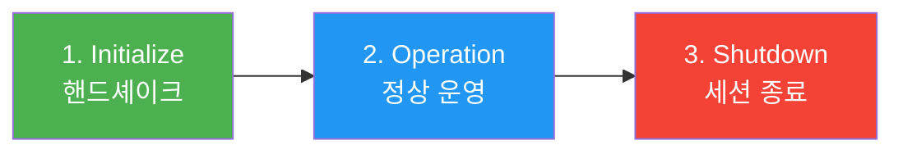
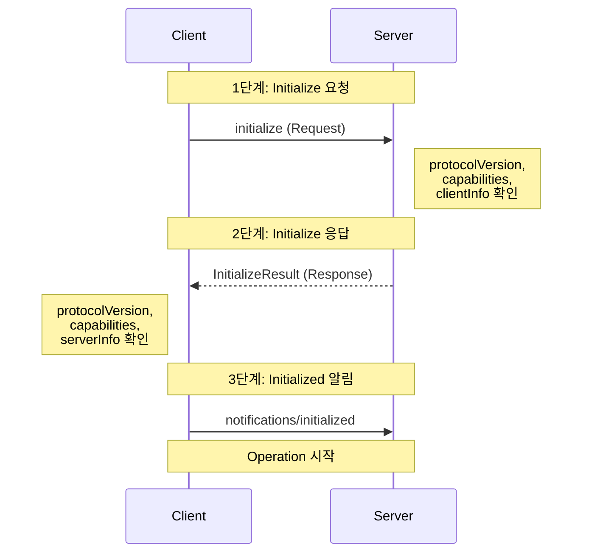
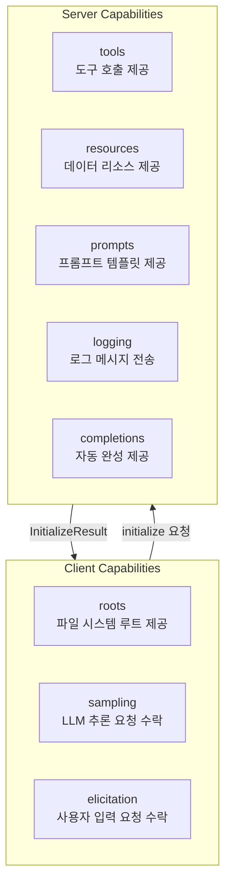
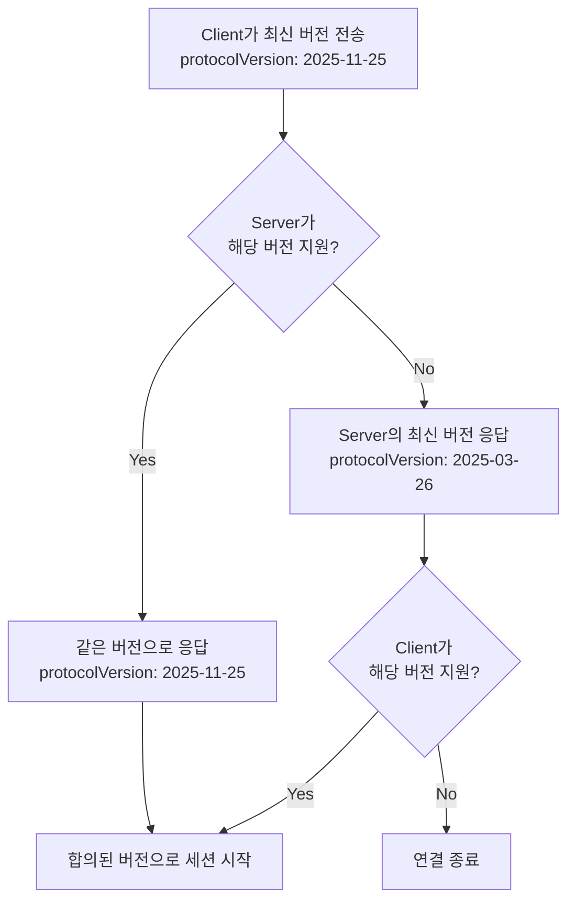
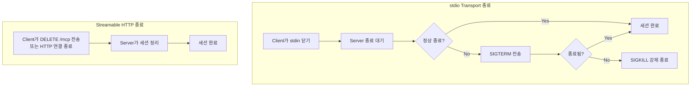

# 세션 라이프사이클과 Capability Negotiation

> MCP 세션의 탄생부터 종료까지 — Initialize 핸드셰이크, Capability 협상, ping/pong, 그리고 우아한 종료

## 개요

이 섹션에서는 MCP 세션이 어떻게 시작되고, 어떤 과정을 거쳐 운영되며, 어떻게 종료되는지 전체 생명주기를 학습합니다. [이전 섹션](02-ch2-mcp-아키텍처와-프로토콜-구조/04-04-json-rpc-20-메시지-포맷.md)에서 배운 JSON-RPC 2.0 메시지 포맷이 실제로 어떤 순서로 오가는지, 그 위에서 Client와 Server가 서로의 능력을 어떻게 협상하는지 살펴봅니다.

**선수 지식**: [Host/Client/Server 3계층 아키텍처](02-ch2-mcp-아키텍처와-프로토콜-구조/01-01-hostclientserver-3계층.md), [Transport 계층](02-ch2-mcp-아키텍처와-프로토콜-구조/02-02-transport-계층-stdio.md), [JSON-RPC 2.0 메시지 포맷](02-ch2-mcp-아키텍처와-프로토콜-구조/04-04-json-rpc-20-메시지-포맷.md)

**학습 목표**:
- MCP 세션의 3단계 라이프사이클(Initialize → Operation → Shutdown)을 설명할 수 있다
- Initialize 핸드셰이크의 3단계(요청 → 응답 → 알림)를 구현할 수 있다
- Client와 Server가 선언하는 Capability의 종류와 협상 메커니즘을 이해한다
- 프로토콜 버전 협상, ping/pong, 정상/비정상 종료 처리를 구현할 수 있다

## 왜 알아야 할까?

전화를 걸 때를 떠올려보세요. 상대가 전화를 받으면 "여보세요?"라고 인사하고, 서로 누구인지 확인한 뒤에야 본론으로 들어가죠. 통화가 끝나면 "끊을게요"라고 하고 전화를 내려놓습니다. 만약 이 과정 없이 갑자기 말을 시작하면? 상대방은 혼란에 빠질 겁니다.

MCP 세션도 마찬가지입니다. Client가 Server에 연결한 뒤 곧바로 `tools/call`을 보내면 Server는 이 요청을 처리할 수 없습니다. **초기화 핸드셰이크 없이는 아무것도 할 수 없거든요.** 세션 라이프사이클은 MCP의 모든 통신의 전제 조건입니다. 이걸 모르면 "왜 도구 호출이 안 되지?"라는 문제를 디버깅할 수조차 없습니다.

또한 Capability Negotiation은 MCP의 확장성을 가능하게 하는 핵심 메커니즘입니다. Server가 Resources를 지원하지 않는데 Client가 `resources/list`를 보내는 건 시간 낭비이니까요. 서로의 능력을 미리 합의하면 불필요한 에러를 방지하고, 프로토콜이 진화해도 하위 호환성을 유지할 수 있습니다.

## 핵심 개념

### 개념 1: 세션 라이프사이클 — 3막 구조

> 💡 **비유**: MCP 세션은 연극의 3막 구조와 같습니다. **1막(Initialize)**: 배우들이 무대에 올라 서로를 소개하고 오늘 공연할 레퍼토리를 확인합니다. **2막(Operation)**: 본격적인 공연이 시작됩니다. 도구를 호출하고, 리소스를 읽고, 프롬프트를 활용합니다. **3막(Shutdown)**: 커튼콜 후 무대를 정리하고 퇴장합니다.

MCP 세션은 정확히 3단계를 거칩니다:

> 📊 **그림 1**: MCP 세션의 3단계 라이프사이클



| 단계 | 메시지 | 역할 |
|------|--------|------|
| **Initialize** | `initialize` 요청 → 응답 → `initialized` 알림 | 프로토콜 버전 합의, Capability 교환 |
| **Operation** | `tools/call`, `resources/read`, `ping` 등 | 실제 비즈니스 로직 수행 |
| **Shutdown** | Transport 수준 연결 종료 | 리소스 정리, 프로세스 종료 |

여기서 중요한 규칙이 있습니다. **Initialize가 완료되기 전에는 Operation 단계의 메시지를 보내면 안 됩니다.** 유일한 예외는 `ping`과 서버의 `logging` 알림뿐이에요. 이 제약은 양쪽 모두에게 적용됩니다:

- **Client**: `initialize` 응답을 받기 전에는 `ping` 외의 요청을 보내면 안 됨
- **Server**: `initialized` 알림을 받기 전에는 `ping`과 `logging` 외의 요청을 보내면 안 됨

### 개념 2: Initialize 핸드셰이크 — 3단계 악수

> 💡 **비유**: 외교관이 처음 만날 때를 생각해보세요. 먼저 한쪽이 명함을 내밀며 자기소개를 합니다(initialize 요청). 상대도 명함을 건네며 "이런 이런 것들을 함께 할 수 있습니다"라고 답합니다(initialize 응답). 마지막으로 "좋습니다, 시작하죠!"라고 확인합니다(initialized 알림). 이 세 단계가 모두 끝나야 실제 업무가 시작됩니다.

Initialize 핸드셰이크는 정확히 3개의 메시지로 구성됩니다:

> 📊 **그림 2**: Initialize 핸드셰이크 시퀀스



**1단계 — Client → Server: `initialize` 요청**

Client가 자신의 정보와 지원하는 기능을 서버에 알립니다:

```python
# initialize 요청의 구조 (JSON-RPC)
{
    "jsonrpc": "2.0",
    "id": 1,
    "method": "initialize",
    "params": {
        "protocolVersion": "2025-11-25",      # 지원하는 최신 프로토콜 버전
        "capabilities": {                      # 클라이언트가 지원하는 기능
            "roots": { "listChanged": True },  # 파일 시스템 루트 변경 알림
            "sampling": {},                    # LLM 추론 요청 지원
        },
        "clientInfo": {                        # 클라이언트 식별 정보
            "name": "my-ai-app",
            "version": "1.0.0"
        }
    }
}
```

**2단계 — Server → Client: `InitializeResult` 응답**

Server도 자신의 정보와 지원 기능으로 응답합니다:

```python
# initialize 응답의 구조
{
    "jsonrpc": "2.0",
    "id": 1,
    "result": {
        "protocolVersion": "2025-11-25",      # 합의된 프로토콜 버전
        "capabilities": {                      # 서버가 지원하는 기능
            "tools": { "listChanged": True },
            "resources": { "subscribe": True, "listChanged": True },
            "prompts": { "listChanged": True },
            "logging": {}
        },
        "serverInfo": {                        # 서버 식별 정보
            "name": "weather-server",
            "version": "2.1.0"
        },
        "instructions": "이 서버는 날씨 데이터를 제공합니다."  # 선택적 안내 문구
    }
}
```

여기서 `instructions` 필드가 흥미로운데요, 이건 Server가 Client(또는 LLM)에게 "나를 이렇게 사용하세요"라고 알려주는 자연어 안내문입니다. LLM이 도구를 더 잘 활용할 수 있도록 힌트를 줄 수 있죠.

**3단계 — Client → Server: `initialized` 알림**

Client가 Server의 응답을 확인하고, 세션을 시작할 준비가 되었음을 알립니다:

```python
# initialized 알림 — 가장 간결한 메시지
{
    "jsonrpc": "2.0",
    "method": "notifications/initialized"
}
```

이건 Notification이기 때문에 `id`가 없고, 응답도 기대하지 않습니다. 이 메시지가 전송되는 순간 세션은 Operation 단계로 진입합니다.

### 개념 3: Capability Negotiation — 서로의 능력 선언

> 💡 **비유**: 여행을 떠나기 전에 친구와 역할을 나누는 것과 같습니다. "나는 운전할 수 있어"(Client: sampling 지원), "나는 길 안내를 할 수 있어"(Server: tools 지원), "나는 맛집 검색이 가능해"(Server: resources 지원). 서로 뭘 할 수 있는지 미리 확인해두면, 여행 중에 "너 이거 할 수 있어?"라고 물어볼 필요가 없죠.

Capability Negotiation은 "이 기능 쓸 수 있어?"를 세션 시작 시 한 번에 정리하는 메커니즘입니다. Client와 Server가 각각 다른 종류의 Capability를 선언합니다.

> 📊 **그림 3**: Client와 Server의 Capability 매핑



**Client Capabilities** — Client가 Server에게 제공할 수 있는 기능:

| Capability | 설명 | 예시 |
|-----------|------|------|
| `roots` | 파일 시스템 루트 목록 제공 | IDE가 프로젝트 디렉토리를 알려줌 |
| `sampling` | LLM 추론 요청 수락 | Server가 Client를 통해 LLM에게 질문 가능 |
| `elicitation` | 사용자 입력 요청 수락 | Server가 사용자에게 폼이나 확인 요청 가능 |

**Server Capabilities** — Server가 Client에게 제공하는 기능:

| Capability | 설명 | 하위 옵션 |
|-----------|------|----------|
| `tools` | 도구 호출 지원 | `listChanged`: 도구 목록 변경 알림 |
| `resources` | 데이터 리소스 지원 | `subscribe`, `listChanged` |
| `prompts` | 프롬프트 템플릿 지원 | `listChanged` |
| `logging` | 서버 로그 메시지 전송 | — |
| `completions` | 인자 자동 완성 | — |

Capability의 핵심 규칙은 간단합니다: **선언하지 않은 기능은 사용할 수 없습니다.** Server가 `tools` capability를 선언하지 않았다면, Client가 `tools/list`를 보내도 Server는 이를 처리할 의무가 없습니다.

`listChanged` 옵션은 특히 중요한데요, 이것이 `true`이면 "내 도구/리소스/프롬프트 목록이 런타임에 바뀔 수 있으니, 변경 시 알림을 보내겠다"는 뜻입니다. Client는 이 알림을 받으면 목록을 다시 조회해야 합니다.

### 개념 4: 프로토콜 버전 협상

> 💡 **비유**: 외국인 친구와 대화할 때 "영어 할 줄 알아?" → "응, 근데 나는 영어보다 스페인어가 편해" → "나도 스페인어 가능해! 스페인어로 하자"라고 합의하는 과정과 같습니다.

MCP 프로토콜 버전은 날짜 기반 문자열입니다 (예: `"2025-11-25"`). 현재 Python SDK v1.26.0이 지원하는 버전 목록은 다음과 같습니다:

```python
# Python SDK의 버전 상수
LATEST_PROTOCOL_VERSION = "2025-11-25"
SUPPORTED_PROTOCOL_VERSIONS = [
    "2024-11-05",   # 초기 릴리스
    "2025-03-26",   # 중간 업데이트
    "2025-06-18",   # 인증 스펙 추가
    "2025-11-25",   # 최신 — Tasks, Elicitation 등 추가
]
```

버전 협상 흐름은 이렇습니다:

> 📊 **그림 4**: 프로토콜 버전 협상 흐름



Python SDK에서는 이 협상이 자동으로 처리됩니다. Client는 항상 `LATEST_PROTOCOL_VERSION`을 보내고, Server는 지원 가능한 버전으로 응답합니다. Client가 응답된 버전을 지원하지 않으면 `RuntimeError`를 발생시킵니다.

Streamable HTTP Transport를 사용할 때는 추가 규칙이 하나 있는데요, 초기화 이후 모든 HTTP 요청에 `MCP-Protocol-Version` 헤더를 포함해야 합니다. 이 헤더가 없으면 Server는 기본값인 `"2025-03-26"`으로 처리합니다.

### 개념 5: ping/pong과 연결 상태 확인

> 💡 **비유**: 오래 통화하다 보면 "여보세요? 듣고 있어?"라고 확인하죠. `ping`은 바로 그 "여보세요?"입니다. 상대가 "응!"이라고 답하면(`pong`) 연결이 살아있는 겁니다.

`ping`은 MCP에서 가장 단순한 메시지입니다. Client와 Server 양쪽 모두 보낼 수 있으며, **초기화 전에도 사용 가능**한 유일한 Request입니다.

```python
# ping 요청
{"jsonrpc": "2.0", "id": "abc-123", "method": "ping"}

# pong 응답 — 반드시 빈 객체
{"jsonrpc": "2.0", "id": "abc-123", "result": {}}
```

핵심 규칙:
- 수신 측은 **즉시** 빈 `result: {}`로 응답해야 함
- 타임아웃 내에 응답이 없으면 → 연결이 끊어진 것으로 간주
- 재연결 또는 세션 종료를 결정

### 개념 6: 세션 종료 — 정상과 비정상

MCP에는 별도의 "shutdown" 메서드가 없습니다. 종료는 Transport 수준에서 처리됩니다.

> 📊 **그림 5**: Transport별 세션 종료 흐름



**stdio Transport 종료 절차**:

1. Client가 Server 프로세스의 stdin을 닫음
2. Server가 정상적으로 종료할 시간을 줌
3. 응답이 없으면 `SIGTERM` 시그널 전송
4. 그래도 종료되지 않으면 `SIGKILL`로 강제 종료

**Streamable HTTP Transport 종료 절차**:

- Client가 `DELETE /mcp` 요청 전송 (세션 ID 헤더 포함)
- 또는 단순히 HTTP 연결을 닫음
- Server는 해당 세션 리소스를 정리

> ⚠️ **흔한 오해**: "MCP에는 `shutdown` 메서드가 있을 것이다" — 없습니다! LSP(Language Server Protocol)에는 `shutdown` 요청과 `exit` 알림이 있지만, MCP는 Transport 수준 종료로 단순화했습니다. 별도의 종료 핸드셰이크가 없으므로, Server는 항상 연결이 갑자기 끊길 수 있다는 가정 하에 리소스를 관리해야 합니다.

## 실습: 직접 해보기

실제로 Python SDK를 사용하여 Initialize 핸드셰이크와 Capability Negotiation이 어떻게 동작하는지 확인해봅시다. 먼저 Server를 정의하고, Client에서 연결하여 전체 라이프사이클을 관찰합니다.

### Step 1: Capability를 선언하는 MCP 서버

```python
# lifecycle_server.py
"""
MCP 세션 라이프사이클 실습 — 서버 측
Tools, Resources, Prompts를 모두 지원하는 서버입니다.
"""
from mcp.server.fastmcp import FastMCP

# FastMCP로 서버 생성 — instructions로 LLM에게 힌트 제공
mcp = FastMCP(
    "lifecycle-demo",
    instructions="이 서버는 세션 라이프사이클 데모용입니다. greet 도구와 info 리소스를 제공합니다.",
)

# Tool capability → 서버가 tools capability를 자동으로 선언
@mcp.tool()
def greet(name: str) -> str:
    """사용자에게 인사합니다."""
    return f"안녕하세요, {name}님! MCP 세션이 정상 작동 중입니다."

# Resource capability → 서버가 resources capability를 자동으로 선언
@mcp.resource("info://server/status")
def server_status() -> str:
    """서버 상태 정보를 반환합니다."""
    return "서버 상태: 정상 운영 중"

# Prompt capability → 서버가 prompts capability를 자동으로 선언
@mcp.prompt()
def analyze_prompt(topic: str) -> str:
    """주어진 주제를 분석하는 프롬프트를 생성합니다."""
    return f"{topic}에 대해 핵심 포인트 3가지를 분석해주세요."

if __name__ == "__main__":
    mcp.run(transport="stdio")
```

### Step 2: Initialize 과정을 관찰하는 Client

```python
# lifecycle_client.py
"""
MCP 세션 라이프사이클 실습 — 클라이언트 측
Initialize 핸드셰이크 과정을 단계별로 관찰합니다.
"""
import asyncio
from mcp import ClientSession, StdioServerParameters
from mcp.client.stdio import stdio_client

async def main():
    # Server 프로세스를 subprocess로 시작할 파라미터
    server_params = StdioServerParameters(
        command="python",
        args=["lifecycle_server.py"],
    )

    # Transport 연결 — stdio 파이프 생성
    async with stdio_client(server_params) as (read_stream, write_stream):
        # ClientSession 생성 — 아직 초기화 전!
        async with ClientSession(read_stream, write_stream) as session:
            # ── Initialize 핸드셰이크 실행 ──
            # 내부적으로 3단계가 자동 수행됩니다:
            # 1. initialize 요청 전송 (protocolVersion + capabilities + clientInfo)
            # 2. InitializeResult 수신 (서버의 protocolVersion + capabilities + serverInfo)
            # 3. initialized 알림 전송
            result = await session.initialize()

            # ── 협상 결과 확인 ──
            print("=== Initialize 결과 ===")
            print(f"프로토콜 버전: {result.protocol_version}")
            print(f"서버 이름: {result.server_info.name}")
            print(f"서버 버전: {result.server_info.version}")

            if result.instructions:
                print(f"서버 안내: {result.instructions}")

            # ── Server Capabilities 확인 ──
            caps = result.capabilities
            print("\n=== Server Capabilities ===")
            print(f"Tools: {'지원' if caps.tools else '미지원'}")
            print(f"Resources: {'지원' if caps.resources else '미지원'}")
            print(f"Prompts: {'지원' if caps.prompts else '미지원'}")
            print(f"Logging: {'지원' if caps.logging else '미지원'}")

            # tools의 listChanged 확인
            if caps.tools and caps.tools.list_changed:
                print("  → 도구 목록 변경 알림 지원")

            # resources의 subscribe 확인
            if caps.resources and caps.resources.subscribe:
                print("  → 리소스 구독 지원")

            # ── Operation 단계: 실제 기능 사용 ──
            print("\n=== Operation 단계 ===")

            # Capability에 따라 안전하게 기능 호출
            if caps.tools:
                tools = await session.list_tools()
                print(f"사용 가능한 도구: {[t.name for t in tools.tools]}")

                # 도구 호출
                call_result = await session.call_tool("greet", {"name": "MCP 학습자"})
                print(f"도구 응답: {call_result.content[0].text}")

            if caps.resources:
                resources = await session.list_resources()
                print(f"사용 가능한 리소스: {[r.name for r in resources.resources]}")

            if caps.prompts:
                prompts = await session.list_prompts()
                print(f"사용 가능한 프롬프트: {[p.name for p in prompts.prompts]}")

            # ── ping으로 연결 확인 ──
            await session.send_ping()
            print("\nping/pong 성공 — 연결 정상")

            print("\n세션 종료 중...")
        # async with 블록을 빠져나가면 자동으로 Transport 종료

asyncio.run(main())
```

```run:python
# 실행 결과를 시뮬레이션합니다 (실제로는 위 두 파일이 필요)
print("=== Initialize 결과 ===")
print("프로토콜 버전: 2025-11-25")
print("서버 이름: lifecycle-demo")
print("서버 버전: 1.0.0")
print("서버 안내: 이 서버는 세션 라이프사이클 데모용입니다. greet 도구와 info 리소스를 제공합니다.")
print()
print("=== Server Capabilities ===")
print("Tools: 지원")
print("Resources: 지원")
print("Prompts: 지원")
print("Logging: 미지원")
print("  → 도구 목록 변경 알림 지원")
print()
print("=== Operation 단계 ===")
print("사용 가능한 도구: ['greet']")
print("도구 응답: 안녕하세요, MCP 학습자님! MCP 세션이 정상 작동 중입니다.")
print("사용 가능한 리소스: ['info://server/status']")
print("사용 가능한 프롬프트: ['analyze_prompt']")
print()
print("ping/pong 성공 — 연결 정상")
print()
print("세션 종료 중...")
```

```output
=== Initialize 결과 ===
프로토콜 버전: 2025-11-25
서버 이름: lifecycle-demo
서버 버전: 1.0.0
서버 안내: 이 서버는 세션 라이프사이클 데모용입니다. greet 도구와 info 리소스를 제공합니다.

=== Server Capabilities ===
Tools: 지원
Resources: 지원
Prompts: 지원
Logging: 미지원
  → 도구 목록 변경 알림 지원

=== Operation 단계 ===
사용 가능한 도구: ['greet']
도구 응답: 안녕하세요, MCP 학습자님! MCP 세션이 정상 작동 중입니다.
사용 가능한 리소스: ['info://server/status']
사용 가능한 프롬프트: ['analyze_prompt']

ping/pong 성공 — 연결 정상

세션 종료 중...
```

### Step 3: Capability 기반 방어적 프로그래밍

실무에서는 Server의 Capability에 따라 분기하는 패턴이 필수입니다:

```python
async def safe_operation(session: ClientSession):
    """
    Capability를 확인한 후에만 기능을 호출하는 방어적 패턴.
    초기화 결과를 캐시해두고 반복적으로 활용합니다.
    """
    result = await session.initialize()
    caps = result.capabilities

    # Tools capability가 있을 때만 도구 호출
    if caps.tools:
        tools = await session.list_tools()
        for tool in tools.tools:
            print(f"도구 발견: {tool.name} — {tool.description}")
    else:
        print("이 서버는 도구를 제공하지 않습니다.")

    # Resources에서 subscribe 지원 여부 확인
    if caps.resources and caps.resources.subscribe:
        # 리소스 변경 구독 가능
        await session.subscribe_resource("data://metrics")
        print("리소스 구독 완료")
    elif caps.resources:
        # 구독은 안 되지만 읽기는 가능
        print("리소스 읽기만 가능 (구독 미지원)")
    else:
        print("이 서버는 리소스를 제공하지 않습니다.")

    # Prompts capability 확인
    if caps.prompts:
        prompts_list = await session.list_prompts()
        print(f"프롬프트 {len(prompts_list.prompts)}개 사용 가능")
```

## 더 깊이 알아보기

### LSP에서 MCP로 — 초기화 프로토콜의 계보

MCP의 세션 라이프사이클은 LSP(Language Server Protocol)에서 직접 영감을 받았습니다. LSP를 만든 사람은 Microsoft의 에릭 감마(Erich Gamma)인데, 그는 GoF(Gang of Four) 디자인 패턴 책의 공동 저자이기도 합니다. LSP는 2016년에 VS Code의 언어 지원을 표준화하기 위해 만들어졌는데, 이때 도입한 "initialize → initialized → shutdown → exit" 4단계 라이프사이클이 에디터와 언어 서버 생태계를 혁신했습니다.

MCP를 설계한 Anthropic 팀은 이 패턴을 가져오면서도 한 가지를 단순화했습니다. LSP의 `shutdown` 요청 + `exit` 알림 2단계 종료를 **Transport 수준 종료**로 줄인 거죠. 왜냐하면 MCP의 사용 환경은 LSP보다 다양하고(로컬 프로세스뿐 아니라 원격 HTTP도 포함), Transport마다 종료 방식이 다르기 때문입니다. "종료 프로토콜까지 표준화하면 오히려 복잡해진다"는 실용적 판단이었습니다.

### Capability의 "빈 객체" 철학

MCP Capability 디자인에서 흥미로운 점은 `logging: {}`, `sampling: {}` 같은 "빈 객체"의 의미입니다. 왜 `logging: true`가 아니라 `logging: {}`일까요?

이건 미래 확장성을 위한 의도적 설계입니다. 지금은 빈 객체지만, 나중에 `logging: {"level": "debug", "format": "structured"}`처럼 하위 옵션을 추가할 수 있습니다. `true/false` 불리언이었다면 하위 호환성을 깨지 않고는 옵션을 추가할 수 없었겠죠. 이런 패턴을 **"확장 가능한 마커(extensible marker)"**라고 부릅니다.

### 날짜 기반 버전 관리 — CalVer 선택의 이유

MCP가 `"1.0.0"` 같은 시맨틱 버전 대신 `"2025-11-25"` 같은 날짜 기반 버전(CalVer)을 사용하는 이유도 흥미롭습니다. 시맨틱 버전은 "breaking change인가 아닌가"를 판단해야 하는데, 프로토콜 스펙에서는 그 경계가 모호할 때가 많습니다. 반면 날짜 기반 버전은 "이 날짜의 스펙을 기준으로 동작한다"는 명확한 기준점을 제공합니다. Ubuntu(예: 24.04), Rust Edition(2021, 2024) 등도 비슷한 이유로 CalVer를 채택하고 있죠.

## 흔한 오해와 팁

> ⚠️ **흔한 오해**: "initialize를 두 번 보내면 세션이 리셋된다" — 아닙니다! `initialize`는 세션당 **단 한 번**만 보낼 수 있습니다. Python SDK의 `ServerSession`은 내부 상태를 `NotInitialized → Initializing → Initialized`로 관리하며, 이미 초기화된 세션에 `initialize`를 다시 보내면 에러가 발생합니다. 세션을 리셋하려면 Transport를 닫고 새로 연결해야 합니다.

> 💡 **알고 계셨나요?**: `instructions` 필드는 2025-11-25 스펙에서 추가된 기능입니다. Server가 LLM에게 "이 서버의 도구를 이런 순서로 사용하면 좋습니다"라는 자연어 힌트를 줄 수 있어요. 이건 도구의 `description`과는 다른 **서버 전체에 대한 안내**입니다. Claude Desktop 같은 Host는 이 instructions를 시스템 프롬프트에 포함시켜 LLM의 도구 선택을 개선합니다.

> 🔥 **실무 팁**: Capability 협상 결과를 **변수에 캐시**해두세요. 매번 `result.capabilities.tools`를 확인하는 대신, 초기화 시 `has_tools = bool(caps.tools)` 같은 플래그를 만들어두면 코드가 훨씬 깔끔해집니다. 특히 멀티 서버 환경에서 서버별로 Capability가 다를 때, 이 캐시 패턴이 필수입니다.

> 🔥 **실무 팁**: `ping`을 주기적으로 보내는 킵얼라이브 패턴을 구현하세요. 특히 Streamable HTTP Transport에서 서버가 유휴 세션을 정리할 수 있으므로, 30~60초 간격의 ping으로 세션을 유지하는 것이 좋습니다:

```python
import asyncio

async def keepalive(session: ClientSession, interval: int = 30):
    """주기적으로 ping을 보내 세션을 유지합니다."""
    while True:
        try:
            await asyncio.wait_for(session.send_ping(), timeout=5.0)
        except (asyncio.TimeoutError, Exception):
            print("서버 응답 없음 — 재연결 필요")
            break
        await asyncio.sleep(interval)
```

## 핵심 정리

| 개념 | 설명 |
|------|------|
| 세션 라이프사이클 | Initialize → Operation → Shutdown 3단계 |
| Initialize 핸드셰이크 | `initialize` 요청 → `InitializeResult` 응답 → `initialized` 알림 |
| Client Capabilities | `roots`, `sampling`, `elicitation` — Client가 Server에게 제공하는 기능 |
| Server Capabilities | `tools`, `resources`, `prompts`, `logging`, `completions` — Server가 제공하는 기능 |
| 프로토콜 버전 협상 | 날짜 기반 CalVer (`"2025-11-25"`), Client 제안 → Server 합의 |
| `listChanged` | 도구/리소스/프롬프트 목록이 런타임에 변경될 수 있음을 선언 |
| `instructions` | Server가 Client/LLM에게 제공하는 자연어 사용 안내 |
| ping/pong | 연결 상태 확인, 양쪽 모두 전송 가능, 초기화 전에도 사용 가능 |
| 세션 종료 | Transport 수준에서 처리 (stdio: stdin 닫기, HTTP: DELETE 또는 연결 종료) |
| Capability 기반 분기 | 선언되지 않은 기능은 호출하지 않는 방어적 프로그래밍 필수 |

## 다음 섹션 미리보기

이것으로 Chapter 2 "MCP 아키텍처와 프로토콜 구조" 전체를 마쳤습니다. [3계층 아키텍처](02-ch2-mcp-아키텍처와-프로토콜-구조/01-01-hostclientserver-3계층.md)에서 시작하여, [stdio](02-ch2-mcp-아키텍처와-프로토콜-구조/02-02-transport-계층-stdio.md)와 [Streamable HTTP](02-ch2-mcp-아키텍처와-프로토콜-구조/03-03-transport-계층-streamable-http.md) Transport, [JSON-RPC 메시지 포맷](02-ch2-mcp-아키텍처와-프로토콜-구조/04-04-json-rpc-20-메시지-포맷.md), 그리고 세션 라이프사이클까지 — MCP 프로토콜의 내부 구조를 완전히 이해했습니다.

다음 챕터 [Ch3. 개발 환경 설정과 첫 MCP 서버](03-ch3-개발-환경-설정과-첫-mcp-서버/01-01-python-sdk-설치와-프로젝트-구조.md)에서는 이론을 벗어나 **실제로 코드를 작성**합니다. Python SDK를 설치하고, 프로젝트 구조를 잡고, "Hello, MCP!" 서버를 만들어 Claude Desktop에 연결하는 것까지 직접 경험합니다.

## 참고 자료

- [MCP Specification — Lifecycle](https://modelcontextprotocol.io/specification/2025-11-25/basic/lifecycle) - 세션 라이프사이클, Initialize 핸드셰이크, Capability 구조의 공식 스펙
- [MCP Specification — Ping](https://modelcontextprotocol.io/specification/2025-11-25/basic/utilities/ping) - ping/pong 메커니즘의 공식 명세
- [MCP Python SDK (GitHub)](https://github.com/modelcontextprotocol/python-sdk) - ClientSession.initialize()와 ServerSession의 실제 구현 코드 (v1.26.0)
- [Model Context Protocol Explained — CodiLime](https://codilime.com/blog/model-context-protocol-explained/) - 세션 라이프사이클 다이어그램과 아키텍처 개관
- [MCP Server Development Guide — cyanheads](https://github.com/cyanheads/model-context-protocol-resources/blob/main/guides/mcp-server-development-guide.md) - 서버 개발 시 라이프사이클 처리 패턴과 베스트 프랙티스

---
### 🔗 Related Sessions
- [json-rpc 2.0 메시지 포맷](02-ch2-mcp-아키텍처와-프로토콜-구조/04-04-json-rpc-20-메시지-포맷.md) (prerequisite)
- [stdio transport](02-ch2-mcp-아키텍처와-프로토콜-구조/02-02-transport-계층-stdio.md) (prerequisite)
- [streamable http transport](01-ch1-mcp의-탄생과-설계-철학/04-04-mcp-스펙-변천사와-2026-로드맵.md) (prerequisite)
- [request/response/notification 구조](02-ch2-mcp-아키텍처와-프로토콜-구조/04-04-json-rpc-20-메시지-포맷.md) (prerequisite)
