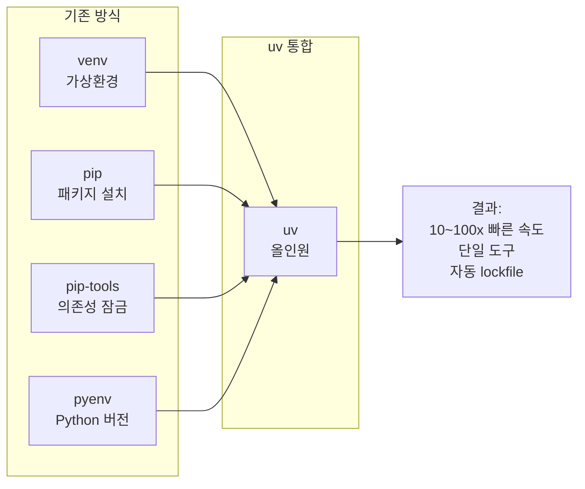
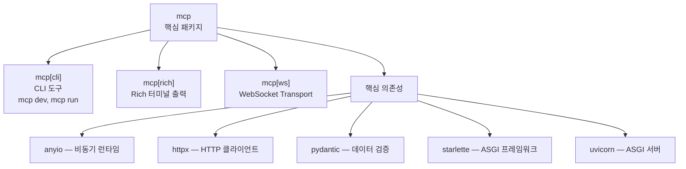
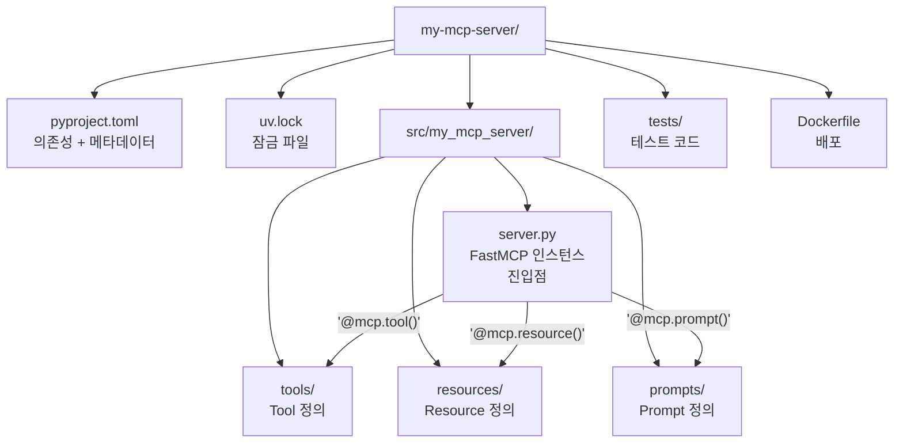
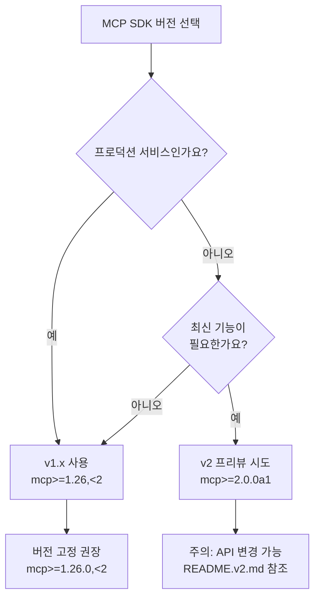

# Python SDK 설치와 프로젝트 구조

> MCP 서버 개발의 첫걸음 — Python SDK 설치부터 프로젝트 뼈대 잡기까지

## 개요

이 섹션에서는 MCP 서버를 개발하기 위한 Python 환경을 처음부터 구성합니다. 패키지 매니저 `uv`로 프로젝트를 초기화하고, `mcp` 패키지를 설치한 뒤, 실전에서 바로 쓸 수 있는 프로젝트 디렉토리 구조를 설계합니다.

**선수 지식**: [Ch1](01-ch1-mcp의-탄생과-설계-철학/01-01-llm의-도구-연결-문제.md)과 [Ch2](02-ch2-mcp-아키텍처와-프로토콜-구조/01-01-hostclientserver-3계층.md)에서 배운 MCP 아키텍처(Host/Client/Server 3계층)와 프로토콜 구조에 대한 이해가 필요합니다.

**학습 목표**:
- `uv` 패키지 매니저로 MCP 프로젝트를 초기화할 수 있다
- `mcp` 패키지의 구조와 extras(cli, rich, ws)를 이해하고 설치할 수 있다
- 실전에서 통하는 MCP 서버 프로젝트 디렉토리 구조를 설계할 수 있다
- `pyproject.toml`을 올바르게 구성할 수 있다
- SDK 버전 체계(v1.x vs v2)를 이해하고 적절한 버전을 선택할 수 있다

## 왜 알아야 할까?

"코드 한 줄 쓰기 전에 삽질부터 했다"는 이야기, 개발자라면 한 번쯤 공감하실 겁니다. 특히 MCP처럼 비교적 새로운 프로토콜은 SDK 버전이 빠르게 바뀌고, 설치 방법도 문서마다 다르게 적혀 있어서 혼란스러울 수 있거든요.

제대로 된 프로젝트 구조를 처음부터 잡아두면 나중에 도구(Tool)를 추가하거나, 테스트를 작성하거나, Docker로 배포할 때 훨씬 수월합니다. 반대로 대충 시작하면? 파일이 10개만 넘어가도 "이 import가 어디서 오는 거지?" 하는 상황에 빠지죠.

이 섹션에서 한 번만 제대로 세팅해두면, 이후 Ch4~Ch8까지의 모든 실습을 그 위에서 빌드할 수 있습니다.

## 핵심 개념

### 개념 1: uv — Python 프로젝트의 만능 도구

> 💡 **비유**: `uv`는 Python 세계의 **스위스 아미 나이프**입니다. 예전에는 가상환경 만들려면 `venv`, 패키지 설치하려면 `pip`, 의존성 잠금하려면 `pip-tools`, 프로젝트 관리하려면 `poetry`... 도구를 4~5개 써야 했죠. `uv`는 이 모든 걸 하나로 통합한 도구입니다. 게다가 Rust로 작성되어 `pip`보다 10~100배 빠릅니다.

`uv`는 Astral에서 개발한 차세대 Python 패키지 매니저로, MCP 공식 문서에서도 **권장하는 설치 방법**입니다. 프로젝트 초기화부터 의존성 관리, 가상환경, 심지어 Python 버전 관리까지 한 번에 처리합니다.

> 📊 **그림 1**: uv가 대체하는 기존 도구들



`uv`를 설치하는 방법은 간단합니다:

```bash
# macOS / Linux
curl -LsSf https://astral.sh/uv/install.sh | sh

# Windows (PowerShell)
powershell -ExecutionPolicy ByPass -c "irm https://astral.sh/uv/install.ps1 | iex"
```

설치 후 터미널을 재시작하고, 버전을 확인해봅시다:

```run:python
import subprocess
result = subprocess.run(["uv", "--version"], capture_output=True, text=True)
print(result.stdout.strip())
```

```output
uv 0.6.11
```

> ⚠️ **흔한 오해**: "`pip`만 있으면 되는 거 아닌가요?"라고 생각하실 수 있습니다. `pip install mcp`로도 설치는 되지만, `uv`는 의존성 충돌을 자동 해결하고 `uv.lock` 파일로 재현 가능한 환경을 보장합니다. MCP 서버는 `httpx`, `starlette`, `uvicorn` 등 의존성이 많아서 이 잠금 기능이 특히 중요합니다.

### 개념 2: mcp 패키지 — SDK의 구조와 extras

> 💡 **비유**: `mcp` 패키지를 레고 세트에 비유해볼까요? 기본 박스(`mcp`)에는 서버/클라이언트 핵심 블록이 들어있고, 확장팩(`[cli]`, `[rich]`, `[ws]`)을 추가하면 디버깅 도구, 예쁜 콘솔 출력, WebSocket 지원이 붙습니다. 대부분의 개발자에게는 `mcp[cli]` 확장팩이면 충분합니다.

MCP Python SDK는 PyPI에서 `mcp`라는 이름으로 배포됩니다. 현재 안정 버전은 **v1.26.0**이며, Python **3.10 이상**을 요구합니다.

> 📊 **그림 2**: mcp 패키지의 extras 구조



설치 명령어는 다음과 같습니다:

```bash
# uv로 설치 (권장)
uv add "mcp[cli]"

# pip으로 설치
pip install "mcp[cli]"

# 여러 extras를 함께 설치
pip install "mcp[cli,rich]"
```

| Extra | 설치 명령 | 포함 내용 | 용도 |
|-------|-----------|----------|------|
| (없음) | `uv add mcp` | 서버/클라이언트 핵심 | 최소 설치 |
| `cli` | `uv add "mcp[cli]"` | `mcp dev`, `mcp run` 명령 | **개발 시 권장** |
| `rich` | `uv add "mcp[rich]"` | Rich 터미널 출력 | 디버깅 강화 |
| `ws` | `uv add "mcp[ws]"` | WebSocket 지원 | WS Transport 사용 시 |

`mcp[cli]`를 설치하면 MCP Inspector 연동에 필요한 `mcp dev` 명령과, 서버를 직접 실행하는 `mcp run` 명령이 함께 설치됩니다. 개발 단계에서는 사실상 필수입니다.

### 개념 3: 프로젝트 디렉토리 구조 설계

> 💡 **비유**: 프로젝트 구조는 건물의 **설계 도면**과 같습니다. 원룸(파일 1개)으로 시작할 수도 있지만, 방이 늘어나면 복도(패키지)와 층(모듈)이 필요하죠. MCP 서버도 마찬가지입니다 — 도구가 1~2개일 때는 파일 하나로 충분하지만, 실전에서는 10개 이상의 도구와 리소스를 관리해야 합니다.

MCP 서버 프로젝트는 규모에 따라 두 가지 구조를 추천합니다:

**미니멀 구조** — 도구 1~3개, 빠른 프로토타이핑:

```
my-mcp-server/
├── pyproject.toml       # 프로젝트 메타데이터 + 의존성
├── server.py            # 서버 진입점 (도구 정의 포함)
└── README.md
```

**실전 구조** — 도구 4개 이상, 테스트/배포 고려:

```
my-mcp-server/
├── pyproject.toml           # 프로젝트 메타데이터 + 의존성
├── uv.lock                  # 의존성 잠금 (자동 생성)
├── .python-version          # Python 버전 고정
├── src/
│   └── my_mcp_server/
│       ├── __init__.py
│       ├── server.py        # FastMCP 인스턴스 + 진입점
│       ├── tools/           # 도구 모듈
│       │   ├── __init__.py
│       │   ├── search.py
│       │   └── analytics.py
│       ├── resources/       # 리소스 모듈
│       │   ├── __init__.py
│       │   └── database.py
│       └── prompts/         # 프롬프트 모듈
│           ├── __init__.py
│           └── templates.py
├── tests/
│   ├── __init__.py
│   ├── test_tools.py
│   └── test_resources.py
├── Dockerfile               # 컨테이너 배포용
└── README.md
```

> 📊 **그림 3**: MCP 서버 프로젝트 구조와 각 디렉토리의 역할



왜 `src/` 레이아웃을 쓸까요? `src/` 레이아웃은 "설치하지 않은 패키지를 실수로 import하는" 문제를 방지합니다. 프로젝트 루트에서 `import my_mcp_server`를 했을 때, 로컬 디렉토리가 아닌 실제 설치된 패키지를 참조하도록 보장하거든요. MCP 공식 레퍼런스 서버들도 이 구조를 따릅니다.

### 개념 4: pyproject.toml 구성

> 💡 **비유**: `pyproject.toml`은 프로젝트의 **신분증 + 쇼핑 리스트**입니다. "나는 누구고(메타데이터), 뭐가 필요하고(의존성), 어떻게 실행하면 되는지(스크립트)"를 한 곳에 정리한 파일이죠.

MCP 서버 프로젝트의 `pyproject.toml`을 하나씩 살펴봅시다:

```python
# pyproject.toml — MCP 서버 프로젝트 설정

[project]
name = "my-mcp-server"                    # 프로젝트 이름
version = "0.1.0"                          # 시맨틱 버전
description = "나의 첫 MCP 서버"            # 한 줄 설명
requires-python = ">=3.10"                 # Python 최소 버전
dependencies = [
    "mcp[cli]>=1.26.0",                   # MCP SDK + CLI 도구
    "httpx>=0.27.0",                       # HTTP 클라이언트 (API 호출용)
]

[project.optional-dependencies]
dev = [
    "pytest>=8.0.0",                       # 테스트 프레임워크
    "pytest-asyncio>=0.24.0",              # 비동기 테스트 지원
]

[build-system]
requires = ["hatchling"]
build-backend = "hatchling.build"

[project.scripts]
my-mcp-server = "my_mcp_server.server:main"  # CLI 진입점
```

핵심 포인트를 짚어보면:

- **`requires-python = ">=3.10"`**: MCP SDK가 Python 3.10+ 기능(match문, Union 타입 `X | Y` 등)에 의존합니다
- **`mcp[cli]>=1.26.0`**: `[cli]` extras로 `mcp dev`와 `mcp run` 명령어를 포함합니다
- **`[project.scripts]`**: `uv run my-mcp-server`로 서버를 바로 실행할 수 있게 합니다

### 개념 5: SDK 버전 — v1.x vs v2 프리뷰

> 💡 **비유**: v1.x와 v2는 마치 **4G와 5G** 같은 관계입니다. 4G(v1.x)는 안정적이고 전국 커버리지가 완벽하지만, 5G(v2)는 더 빠르고 새로운 기능이 있는 대신 아직 모든 곳에서 쓸 수 있는 건 아닙니다.

MCP Python SDK는 현재 두 가지 버전 트랙이 존재합니다:

| 항목 | v1.x (안정) | v2 (프리뷰) |
|------|------------|------------|
| 최신 릴리스 | **v1.26.0** (2026-01-24) | pre-alpha (main 브랜치) |
| 프로덕션 사용 | ✅ 권장 | ❌ 아직 |
| FastMCP | `mcp.server.fastmcp` | 개편 예정 |
| Transport | stdio, SSE, Streamable HTTP | 확장 예정 |
| 설치 | `uv add "mcp[cli]>=1.26"` | `uv add "mcp>=2.0.0a1"` |
| 문서 | README.md | README.v2.md |

> 📊 **그림 4**: MCP SDK 버전 선택 가이드



이 코스에서는 **v1.x 안정 버전**을 사용합니다. v2로의 마이그레이션은 [Ch13 마지막 섹션](13-ch13-배포와-운영/05-05-sdk-v2-마이그레이션과-미래-대비.md)에서 다룹니다.

v1.x를 유지하면서 v2 출시 후에도 깨지지 않으려면, `pyproject.toml`에 상한을 걸어두는 것이 좋습니다:

```python
dependencies = [
    "mcp[cli]>=1.26.0,<2",    # v1.x 범위 내에서만 업데이트
]
```

## 실습: 직접 해보기

이제 처음부터 MCP 서버 프로젝트를 생성해봅시다. 터미널을 열고 한 단계씩 따라오세요.

> 📊 **그림 5**: 실습 전체 흐름 — 7단계로 완성하는 MCP 프로젝트


### Step 1: 프로젝트 초기화

```bash
# 프로젝트 디렉토리 생성 + 초기화
uv init my-mcp-server
cd my-mcp-server

# 가상환경 생성 + 활성화
uv venv
source .venv/bin/activate   # macOS/Linux
# .venv\Scripts\activate    # Windows
```

### Step 2: 의존성 설치

```bash
# MCP SDK (CLI 도구 포함) + httpx 설치
uv add "mcp[cli]" httpx

# 개발용 의존성 추가
uv add --dev pytest pytest-asyncio
```

이 명령을 실행하면 `uv`가 자동으로:
1. `pyproject.toml`에 의존성을 추가하고
2. `uv.lock` 파일을 생성(또는 갱신)하고
3. 가상환경에 패키지를 설치합니다

### Step 3: pyproject.toml 다듬기

`uv init`이 생성한 `pyproject.toml`을 MCP 서버에 맞게 수정합니다:

```python
[project]
name = "my-mcp-server"
version = "0.1.0"
description = "MCP 실전 코스 — 나의 첫 MCP 서버"
requires-python = ">=3.10"
dependencies = [
    "mcp[cli]>=1.26.0,<2",
    "httpx>=0.27.0",
]

[project.optional-dependencies]
dev = [
    "pytest>=8.0.0",
    "pytest-asyncio>=0.24.0",
]

[build-system]
requires = ["hatchling"]
build-backend = "hatchling.build"

[project.scripts]
my-mcp-server = "my_mcp_server.server:main"
```

### Step 4: 디렉토리 구조 생성

```bash
# src 레이아웃 생성
mkdir -p src/my_mcp_server/tools
mkdir -p src/my_mcp_server/resources
mkdir -p tests

# __init__.py 파일 생성
touch src/my_mcp_server/__init__.py
touch src/my_mcp_server/tools/__init__.py
touch src/my_mcp_server/resources/__init__.py
touch tests/__init__.py

# 서버 진입점 생성
touch src/my_mcp_server/server.py
```

### Step 5: 최소 서버 코드 작성

`src/my_mcp_server/server.py`에 다음 코드를 작성합니다. 이 코드는 다음 섹션 [Hello MCP: 첫 번째 서버 만들기](03-ch3-개발-환경-설정과-첫-mcp-서버/02-02-hello-mcp-첫-번째-서버-만들기.md)에서 확장할 기반이 됩니다:

```python
"""MCP 서버 진입점 — FastMCP를 사용한 최소 구현."""
from mcp.server.fastmcp import FastMCP

# FastMCP 인스턴스 생성
# 이름은 클라이언트가 서버를 식별하는 데 사용됩니다
mcp = FastMCP("my-mcp-server")


@mcp.tool()
def ping() -> str:
    """서버가 살아있는지 확인하는 도구입니다."""
    return "pong! MCP 서버가 정상 동작 중입니다."


def main():
    """서버를 stdio transport로 실행합니다."""
    mcp.run(transport="stdio")


if __name__ == "__main__":
    main()
```

이 세 줄의 패턴 — `FastMCP("name")`, `@mcp.tool()`, `mcp.run()` — 이 MCP 서버의 핵심 골격입니다. 어떤 복잡한 서버든 이 구조 위에 도구와 리소스를 추가하는 방식으로 확장됩니다.

### Step 6: 설치 확인

```run:python
# SDK 버전과 주요 모듈 확인
import mcp
print(f"MCP SDK 버전: {mcp.__version__}")

from mcp.server.fastmcp import FastMCP
print(f"FastMCP 클래스: {FastMCP}")

# extras 확인 — cli가 설치되었는지
import shutil
mcp_cli = shutil.which("mcp")
print(f"mcp CLI 경로: {mcp_cli or '미설치 — mcp[cli] 설치 필요'}")
```

```output
MCP SDK 버전: 1.26.0
FastMCP 클래스: <class 'mcp.server.fastmcp.FastMCP'>
mcp CLI 경로: /Users/dev/.venv/bin/mcp
```

### Step 7: 서버 실행 테스트

```bash
# 방법 1: uv run으로 직접 실행
uv run python src/my_mcp_server/server.py

# 방법 2: mcp dev로 Inspector 연동 (다음 섹션에서 자세히)
uv run mcp dev src/my_mcp_server/server.py
```

> 🔥 **실무 팁**: `mcp dev` 명령은 서버를 MCP Inspector와 자동 연결합니다. 브라우저에서 도구 목록을 확인하고, 직접 호출해볼 수 있어서 초기 개발 시 매우 유용합니다. 이 내용은 [MCP Inspector와 디버깅](03-ch3-개발-환경-설정과-첫-mcp-서버/04-04-mcp-inspector와-디버깅.md)에서 상세히 다룹니다.

## 더 깊이 알아보기

### uv의 탄생 — Ruff 팀이 만든 이유

`uv`를 만든 Astral은 원래 Python 린터 **Ruff**로 유명한 회사입니다. Ruff가 `flake8`+`isort`+`pyflakes`를 Rust로 재작성해서 100배 빠르게 만든 것처럼, `uv`도 같은 철학으로 `pip`+`venv`+`pip-tools`를 Rust로 재작성했습니다.

Charlie Marsh(Astral 창업자)가 2024년 초 `uv`를 공개했을 때, Python 커뮤니티의 반응은 폭발적이었습니다. "패키지 매니저가 느려서 짜증나는데 참고 쓴다"는 게 파이썬 개발자들의 오래된 불만이었거든요. `uv`는 출시 6개월 만에 GitHub 스타 25,000개를 돌파했고, 2026년 현재 MCP, LangChain 등 주요 AI 프레임워크의 공식 문서에서 기본 패키지 매니저로 채택되었습니다.

### MCP Python SDK의 역사

MCP Python SDK는 Anthropic이 2024년 11월 MCP를 공개하면서 함께 릴리스했습니다. 초기에는 저수준 API만 있어서 서버를 만들려면 JSON-RPC 메시지를 직접 다뤄야 했죠. 그러다 **FastMCP**가 등장합니다.

FastMCP는 원래 Jared Lowin이 만든 서드파티 라이브러리였습니다. 데코레이터 한 줄로 도구를 정의하는 직관적인 API가 너무 좋아서, Anthropic이 공식 SDK에 통합해버렸습니다. "커뮤니티가 만든 래퍼가 너무 좋아서 공식이 흡수한" 드문 사례이죠. 현재 `mcp.server.fastmcp.FastMCP`로 import하는 그 클래스가 바로 그 결과물입니다.

> 💡 **알고 계셨나요?**: PyPI에는 `mcp`와 별도로 `fastmcp`라는 패키지도 존재합니다(v3.1.1+). 이것은 Jared Lowin이 계속 독립적으로 발전시킨 버전으로, 공식 SDK의 FastMCP보다 더 많은 고급 기능(컴포넌트 버전 관리, OpenTelemetry 등)을 제공합니다. 하지만 이 코스에서는 공식 SDK에 포함된 `mcp.server.fastmcp`를 사용합니다.

## 흔한 오해와 팁

> ⚠️ **흔한 오해**: "Python 3.9에서도 돌아가겠지?" — 안 됩니다. MCP SDK는 Python 3.10에서 도입된 `match` 문, `X | Y` 유니온 타입 문법, 그리고 `ParamSpec` 등을 내부적으로 사용합니다. 3.9 이하에서 설치하면 `SyntaxError`가 발생합니다. `python --version`으로 반드시 확인하세요.

> 🔥 **실무 팁**: `uv.lock` 파일은 반드시 Git에 커밋하세요! 이 파일이 있어야 다른 개발자가 `uv sync`만으로 정확히 같은 환경을 재현할 수 있습니다. `.gitignore`에 `.venv/`는 넣되, `uv.lock`은 빼두세요.

> ⚠️ **흔한 오해**: "MCP 서버는 `print()`로 로그를 찍으면 되겠지?" — **절대 안 됩니다**. stdio Transport를 사용하는 MCP 서버에서 `print()`는 stdout으로 출력되는데, stdout은 JSON-RPC 메시지 채널입니다. `print()`를 쓰면 JSON-RPC 메시지가 깨져서 클라이언트와의 통신이 끊어집니다. 로그는 반드시 `logging` 모듈(stderr로 출력)이나 `print(..., file=sys.stderr)`을 사용하세요.

> 💡 **알고 계셨나요?**: MCP SDK의 핵심 의존성인 `anyio`는 `asyncio`와 `trio` 두 비동기 런타임을 모두 지원하는 호환 레이어입니다. 덕분에 MCP 서버는 `asyncio` 기반으로 동작하면서도, 필요시 `trio`의 구조화된 동시성(Structured Concurrency) 위에서도 실행할 수 있습니다.

> 🔥 **실무 팁**: `uv add` 대신 `uv pip install`을 쓰는 실수를 많이 합니다. `uv pip install`은 `pyproject.toml`과 `uv.lock`을 갱신하지 않으므로, 팀원이 `uv sync`를 해도 해당 패키지가 설치되지 않습니다. **항상 `uv add`를 사용하세요.**

## 핵심 정리

| 개념 | 설명 |
|------|------|
| `uv` | Rust 기반 올인원 Python 패키지 매니저. `pip`+`venv`+`pip-tools` 대체 |
| `mcp[cli]` | MCP Python SDK + CLI 도구(`mcp dev`, `mcp run`). 개발 시 권장 |
| Python 버전 | 3.10 이상 필수 (match문, 유니온 타입 등 사용) |
| SDK 버전 | v1.26.0 안정판 사용, v2는 pre-alpha (프로덕션 비권장) |
| `pyproject.toml` | 프로젝트 메타데이터 + 의존성 + 스크립트 정의 |
| `uv.lock` | 의존성 잠금 파일 — Git에 반드시 커밋 |
| src 레이아웃 | `src/패키지명/` 구조 — import 충돌 방지, 실전 권장 |
| `server.py` | FastMCP 인스턴스와 `main()` 진입점이 위치하는 파일 |
| stdout 금지 | stdio Transport에서 `print()` 사용 시 JSON-RPC 메시지 깨짐 |
| FastMCP | 공식 SDK 내장 고수준 프레임워크 — 데코레이터 기반 도구 정의 |

## 다음 섹션 미리보기

프로젝트 뼈대를 완성했으니, 다음 섹션 [Hello MCP: 첫 번째 서버 만들기](03-ch3-개발-환경-설정과-첫-mcp-서버/02-02-hello-mcp-첫-번째-서버-만들기.md)에서는 이 구조 위에서 실제로 동작하는 MCP 서버를 처음부터 끝까지 만들어봅니다. `@mcp.tool()` 데코레이터로 도구를 정의하고, stdio Transport를 통해 클라이언트와 메시지를 주고받는 과정을 직접 체험합니다.

## 참고 자료

- [MCP Python SDK — GitHub 리포지토리](https://github.com/modelcontextprotocol/python-sdk) - 공식 소스 코드, README에 설치/사용법 상세 안내
- [mcp 패키지 — PyPI](https://pypi.org/project/mcp/) - 최신 버전, 의존성 목록, extras 정보 확인
- [Build an MCP Server — 공식 튜토리얼](https://modelcontextprotocol.io/docs/develop/build-server) - 프로젝트 생성부터 Claude Desktop 연결까지 단계별 가이드
- [Python MCP Server: Connect LLMs to Your Data — Real Python](https://realpython.com/python-mcp/) - MCP 서버 구축에 대한 포괄적 튜토리얼
- [uv: Managing Python Projects — 공식 문서](https://docs.astral.sh/uv/guides/projects/) - uv 프로젝트 관리 가이드
- [FastMCP — GitHub 리포지토리](https://github.com/jlowin/fastmcp) - 독립 FastMCP 프레임워크 (v3.1.1+)