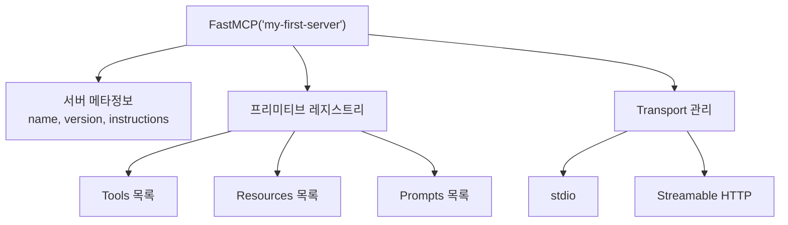
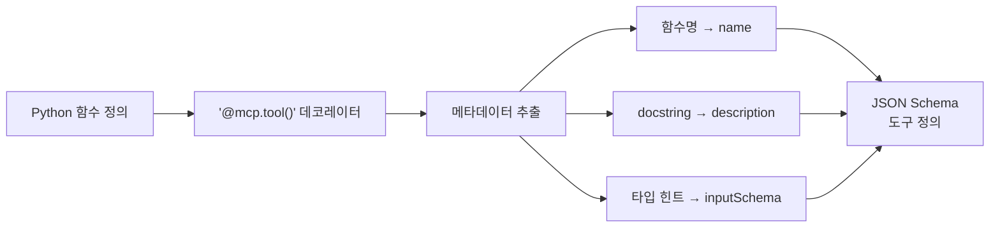
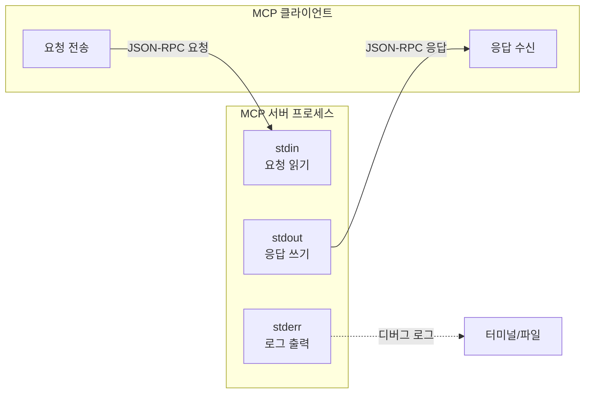
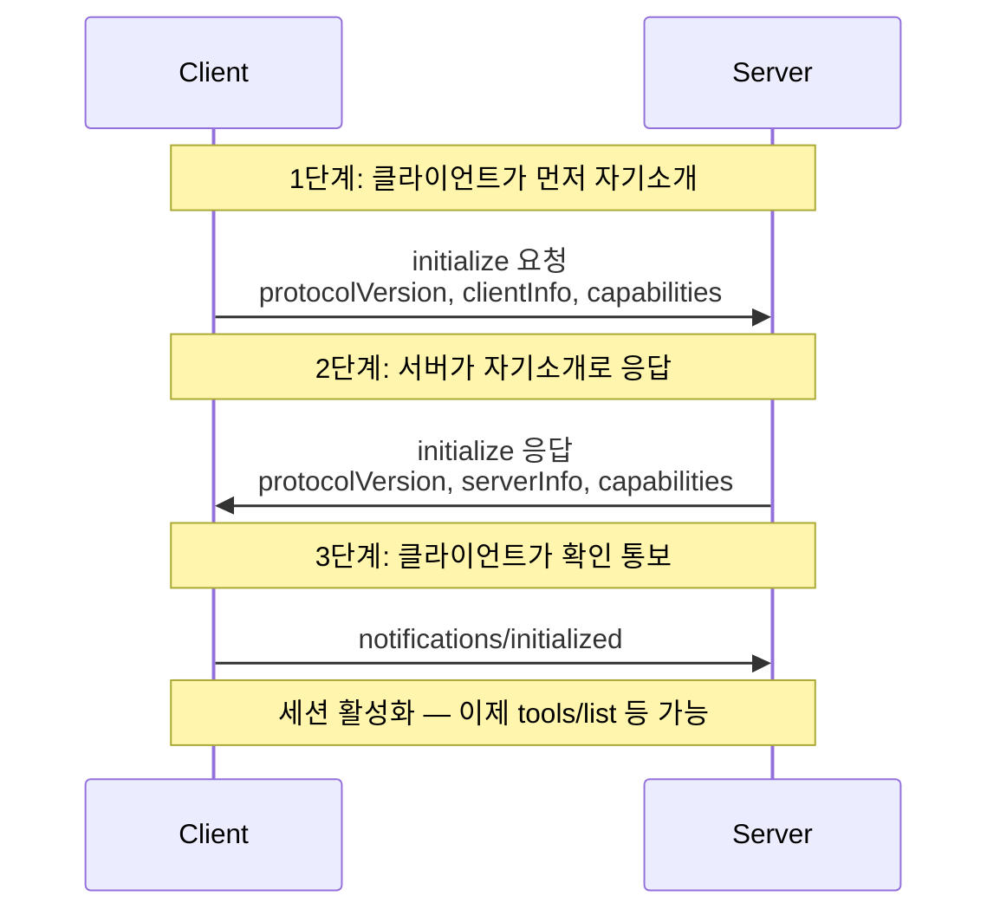
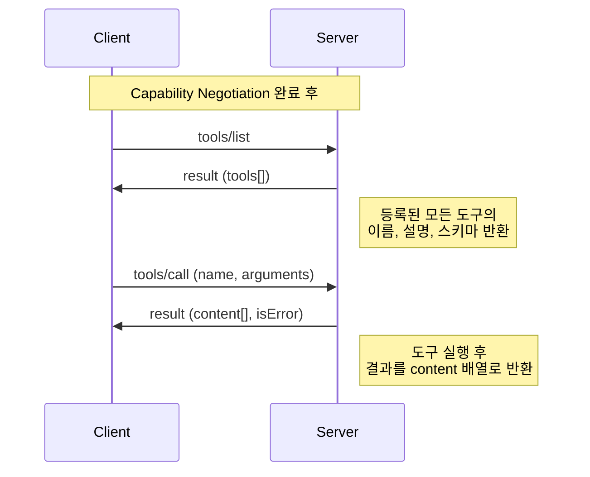
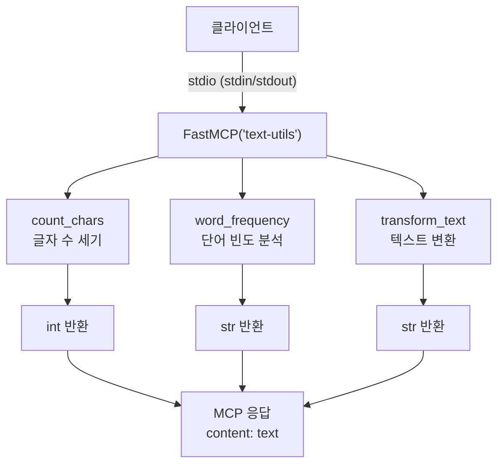

# 02. Hello MCP — 첫 번째 서버 만들기

> FastMCP로 첫 MCP 서버를 작성하고, 도구를 등록하고, stdio Transport로 동작을 확인합니다.

## 개요

이 섹션에서는 [이전 섹션](03-ch3-개발-환경-설정과-첫-mcp-서버/01-01-python-sdk-설치와-프로젝트-구조.md)에서 구성한 프로젝트 위에서 실제로 동작하는 MCP 서버를 처음부터 만들어봅니다. 코드 한 줄 한 줄이 어떤 역할을 하는지 분석하고, 서버가 클라이언트와 주고받는 JSON-RPC 메시지까지 직접 들여다봅니다.

**선수 지식**: [Python SDK 설치와 프로젝트 구조](03-ch3-개발-환경-설정과-첫-mcp-서버/01-01-python-sdk-설치와-프로젝트-구조.md)에서 다룬 uv 프로젝트 초기화, `mcp[cli]` 설치, FastMCP 임포트 경로

**학습 목표**:
- FastMCP 인스턴스를 생성하고 서버 이름과 설정을 구성할 수 있다
- `@mcp.tool()` 데코레이터로 도구를 등록하고, 타입 힌트가 JSON Schema로 변환되는 원리를 이해한다
- `mcp.run(transport="stdio")`로 서버를 실행하고 stdin/stdout 통신 구조를 파악한다
- 초기화(initialize) → Capability Negotiation → 도구 호출(tools/call) 흐름을 JSON-RPC 메시지 수준에서 이해한다

## 왜 알아야 할까?

MCP 서버 개발의 모든 것은 "첫 번째 서버"에서 시작됩니다. 데이터베이스를 연결하든, REST API를 래핑하든, 파일시스템을 노출하든 — 결국 `FastMCP` 인스턴스를 만들고, 데코레이터로 기능을 등록하고, `run()`으로 실행하는 패턴은 동일하거든요.

이 섹션에서 작성하는 서버는 단 20줄 남짓이지만, 이 안에 MCP의 핵심 메커니즘이 모두 들어 있습니다. 타입 힌트가 어떻게 LLM이 읽을 수 있는 스키마가 되는지, docstring이 왜 중요한지, stdio Transport가 어떻게 메시지를 주고받는지를 한 번 이해하면, 이후 챕터에서 다루는 Resources, Prompts, Sampling 같은 고급 기능도 같은 패턴 위에서 자연스럽게 확장할 수 있습니다.

## 핵심 개념

### 개념 1: FastMCP 인스턴스 — 서버의 심장

> 💡 **비유**: FastMCP 인스턴스는 **레스토랑의 주방장**과 같습니다. 주방장이 레스토랑 이름을 걸고, 메뉴(도구)를 결정하고, 주문(요청)이 들어오면 요리(실행)해서 내보내죠. FastMCP도 서버 이름을 선언하고, 등록된 도구들을 관리하며, 클라이언트의 요청을 처리합니다.

[이전 섹션](03-ch3-개발-환경-설정과-첫-mcp-서버/01-01-python-sdk-설치와-프로젝트-구조.md)에서 `from mcp.server.fastmcp import FastMCP` 임포트 경로와 패키지 설치를 이미 완료했으니, 여기서는 바로 인스턴스 생성과 설정에 집중하겠습니다.

```python
from mcp.server.fastmcp import FastMCP

# 서버 인스턴스 생성 — 이름은 클라이언트에게 전달됩니다
mcp = FastMCP("my-first-server")
```

이 한 줄이 하는 일이 의외로 많습니다:

1. **서버 이름 등록**: `"my-first-server"`는 초기화 응답의 `serverInfo.name`으로 전달됩니다
2. **프리미티브 레지스트리 생성**: 도구(Tool), 리소스(Resource), 프롬프트(Prompt)를 저장할 내부 컨테이너를 준비합니다
3. **Capability 자동 선언**: 등록된 프리미티브에 따라 `tools`, `resources`, `prompts` 등 서버가 지원하는 기능 목록을 자동 구성합니다 — 이것이 [Ch2.5에서 배운 Capability Negotiation](02-ch2-mcp-아키텍처와-프로토콜-구조/05-05-세션-라이프사이클과-capability-negotiation.md)의 시작점이죠

> 📊 **그림 1**: FastMCP 인스턴스의 내부 구조



FastMCP 생성자에는 여러 선택적 매개변수가 있는데, 자주 쓰는 것들을 정리하면 이렇습니다:

```python
mcp = FastMCP(
    "my-server",
    instructions="이 서버는 날씨 정보를 제공합니다",  # LLM에게 전달되는 서버 설명
    log_level="DEBUG",     # 로그 레벨 설정
)
```

`instructions` 매개변수는 특히 중요한데, 이 문자열이 초기화 응답에 포함되어 LLM이 "이 서버가 무엇을 하는 서버인지" 파악하는 데 사용되거든요.

### 개념 2: @mcp.tool() — 함수를 도구로 변환하기

> 💡 **비유**: `@mcp.tool()` 데코레이터는 **메뉴판에 요리를 등록**하는 것과 같습니다. 주방장(FastMCP)에게 "이 함수는 손님(LLM)이 주문할 수 있는 요리입니다"라고 알려주는 거죠. 메뉴판에는 요리 이름, 설명, 필요한 재료(매개변수)가 적혀 있어야 합니다.

`@mcp.tool()` 데코레이터는 일반 Python 함수를 MCP 도구로 변환합니다. 이 과정에서 세 가지 정보가 자동으로 추출됩니다:

```python
@mcp.tool()
def add(a: int, b: int) -> int:
    """두 정수를 더합니다.

    Args:
        a: 첫 번째 정수
        b: 두 번째 정수
    """
    return a + b
```

| 소스 | 추출 정보 | JSON Schema 필드 |
|------|----------|-----------------|
| 함수 이름 `add` | 도구 이름 | `name` |
| docstring | 도구 설명 | `description` |
| 타입 힌트 `a: int, b: int` | 입력 스키마 | `inputSchema` |

> 📊 **그림 2**: 함수 정의에서 MCP 도구 스키마로의 변환 과정



이 함수가 생성하는 도구 정의(JSON Schema)는 다음과 같습니다:

```json
{
  "name": "add",
  "description": "두 정수를 더합니다.\n\nArgs:\n    a: 첫 번째 정수\n    b: 두 번째 정수",
  "inputSchema": {
    "type": "object",
    "properties": {
      "a": { "type": "integer" },
      "b": { "type": "integer" }
    },
    "required": ["a", "b"]
  }
}
```

타입 힌트가 JSON Schema 타입으로 매핑되는 규칙을 알아두면 유용합니다:

| Python 타입 | JSON Schema 타입 |
|------------|-----------------|
| `str` | `"string"` |
| `int` | `"integer"` |
| `float` | `"number"` |
| `bool` | `"boolean"` |
| `list[str]` | `{"type": "array", "items": {"type": "string"}}` |
| `Optional[str]` | `"string"` (required에서 제외) |

> ⚠️ **흔한 오해**: "docstring은 개발자용 주석이니까 대충 써도 된다" — 아닙니다! MCP에서 docstring은 **LLM이 읽는 도구 설명**입니다. LLM은 이 설명을 보고 언제, 어떻게 이 도구를 호출할지 결정하므로, 명확하고 구체적으로 작성해야 합니다.

동기 함수와 비동기 함수 모두 도구로 등록할 수 있습니다:

```python
# 동기 함수 — 간단한 계산에 적합
@mcp.tool()
def multiply(a: int, b: int) -> int:
    """두 정수를 곱합니다."""
    return a * b

# 비동기 함수 — I/O 작업에 적합
@mcp.tool()
async def fetch_data(url: str) -> str:
    """URL에서 데이터를 가져옵니다."""
    async with httpx.AsyncClient() as client:
        response = await client.get(url)
        return response.text
```

### 개념 3: mcp.run() — 서버 실행과 stdio Transport

> 💡 **비유**: `mcp.run()`은 레스토랑의 **영업 개시**입니다. 주방장(FastMCP)이 메뉴(도구)를 등록하고, 이제 문을 열어 손님(클라이언트)의 주문을 받기 시작합니다. stdio Transport는 **전화 주문**과 같아서, 전용 회선(stdin/stdout)으로 1:1 소통하는 방식입니다.

```python
if __name__ == "__main__":
    mcp.run(transport="stdio")
```

`transport="stdio"`를 지정하면 서버는 **표준 입출력**을 통해 통신합니다:

- **stdin**: 클라이언트의 JSON-RPC 요청을 읽어들입니다
- **stdout**: JSON-RPC 응답을 내보냅니다
- **stderr**: 로그 메시지 전용 (절대 stdout에 로그를 쓰면 안 됩니다!)

> 📊 **그림 3**: stdio Transport의 통신 구조



클라이언트는 서버를 **자식 프로세스(subprocess)**로 실행합니다. 예를 들어 Claude Desktop이 `python server.py`를 실행하면, 그 프로세스의 stdin/stdout이 통신 채널이 되는 거죠. 이것이 [Ch2에서 배운 stdio Transport](02-ch2-mcp-아키텍처와-프로토콜-구조/02-02-transport-계층-stdio.md)의 실제 동작 방식입니다.

> ⚠️ **stdout 오염 문제**: stdio Transport에서 가장 흔한 실수가 바로 **stdout 오염**입니다. `print()`를 쓰면 출력이 stdout으로 가서 JSON-RPC 메시지 스트림에 의도치 않은 텍스트가 섞이게 됩니다. 클라이언트는 이 텍스트를 JSON으로 파싱하려다 실패하고, 연결이 끊어지죠.

당장의 응급 처방은 `print("debug info", file=sys.stderr)`처럼 stderr로 출력을 돌리는 것입니다. 하지만 이것만으로는 부족합니다 — 서드파티 라이브러리가 내부적으로 `print()`를 호출하는 경우도 있거든요. 이 문제를 체계적으로 해결하는 방법(stderr 리다이렉트, MCP Context의 `ctx.info()`/`ctx.debug()` 활용)은 [로깅과 디버깅 전략](03-ch3-개발-환경-설정과-첫-mcp-서버/04-04-로깅과-디버깅-전략.md)에서 자세히 다룹니다.

### 개념 4: Capability Negotiation 실전 — initialize 핸드셰이크의 실체

[Ch2.5에서 Capability Negotiation의 개념](02-ch2-mcp-아키텍처와-프로토콜-구조/05-05-세션-라이프사이클과-capability-negotiation.md)을 배웠는데, 우리가 방금 만든 서버에서 이것이 실제로 어떻게 일어나는지 JSON-RPC 메시지 수준에서 확인해봅시다.

> 💡 **비유**: Capability Negotiation은 **명함 교환**과 같습니다. 비즈니스 미팅에서 만나자마자 "저는 A회사의 김대리입니다, 저희는 마케팅과 디자인을 담당합니다"라고 소개하면, 상대방도 "저는 B회사의 박과장입니다, 저희는 개발과 인프라를 담당합니다"라고 응답하죠. 이 교환이 끝나야 비로소 "그럼 디자인 건으로 협업하시죠"라는 실질적 대화가 시작됩니다.

> 📊 **그림 4**: Capability Negotiation의 3단계 핸드셰이크



우리의 `text-utils` 서버가 실행되면, 클라이언트(예: Claude Desktop)가 보내는 첫 메시지는 이렇습니다:

```json
{
  "jsonrpc": "2.0",
  "id": 1,
  "method": "initialize",
  "params": {
    "protocolVersion": "2025-03-26",
    "capabilities": {
      "roots": { "listChanged": true },
      "sampling": {}
    },
    "clientInfo": {
      "name": "Claude Desktop",
      "version": "1.5.0"
    }
  }
}
```

여기서 `capabilities` 필드가 핵심입니다. 클라이언트가 "나는 `roots`(작업 디렉토리 알림)와 `sampling`(LLM 요청)을 지원한다"고 선언하는 거죠. 서버는 이 정보를 보고 클라이언트가 어떤 기능을 사용할 수 있는지 파악합니다.

서버의 응답은 이렇게 나갑니다:

```json
{
  "jsonrpc": "2.0",
  "id": 1,
  "result": {
    "protocolVersion": "2025-03-26",
    "capabilities": {
      "tools": { "listChanged": true }
    },
    "serverInfo": {
      "name": "text-utils",
      "version": "1.0.0"
    },
    "instructions": "텍스트 처리 유틸리티를 제공하는 MCP 서버입니다."
  }
}
```

여기서 서버가 선언한 `capabilities`를 자세히 살펴보면:

| 서버 Capability | 의미 | FastMCP 자동 설정 조건 |
|----------------|------|----------------------|
| `tools` | 도구 호출 가능 | `@mcp.tool()`로 등록된 함수가 1개 이상 |
| `tools.listChanged` | 도구 목록 변경 시 알림 가능 | 기본 `true` |
| `resources` | 리소스 읽기 가능 | `@mcp.resource()`가 1개 이상일 때만 포함 |
| `prompts` | 프롬프트 템플릿 사용 가능 | `@mcp.prompt()`가 1개 이상일 때만 포함 |

우리 서버는 `@mcp.tool()`만 사용했으니 `tools`만 선언됩니다. 만약 `@mcp.resource()`를 추가하면 `capabilities`에 `resources`가 자동으로 추가되죠 — FastMCP가 이 매핑을 자동으로 처리해줍니다.

> 🔥 **실무 팁**: `protocolVersion`이 서로 다르면 어떻게 될까요? 스펙에 따르면 서버는 자신이 지원하는 가장 높은 버전을 응답하고, 클라이언트가 이를 수용할 수 없으면 연결을 끊습니다. 현재는 대부분의 SDK가 `"2025-03-26"` 버전을 사용하므로 문제가 드물지만, SDK 버전이 크게 다른 경우 이 불일치가 연결 실패의 원인이 될 수 있습니다.

마지막으로 클라이언트가 `notifications/initialized` 알림을 보내면 핸드셰이크가 완료됩니다:

```json
{
  "jsonrpc": "2.0",
  "method": "notifications/initialized"
}
```

이 알림에는 `id`가 없습니다 — [Ch2.4에서 배운 것처럼](02-ch2-mcp-아키텍처와-프로토콜-구조/04-04-json-rpc-20-메시지-포맷.md) Notification은 응답을 기대하지 않는 단방향 메시지이기 때문이죠. 이 세 단계가 끝나야 비로소 `tools/list`나 `tools/call` 같은 실질적인 요청이 가능해집니다.

### 개념 5: 도구 탐색과 호출 — JSON-RPC 메시지 흐름

Capability Negotiation이 완료되면 클라이언트는 서버가 선언한 capability에 따라 요청을 보낼 수 있습니다. 우리 서버는 `tools`를 선언했으니, 도구 관련 메시지 흐름을 살펴봅시다.

> 📊 **그림 5**: 초기화 이후 도구 탐색과 호출 흐름



**도구 목록 조회 (tools/list)**

```json
// 요청
{ "jsonrpc": "2.0", "id": 2, "method": "tools/list" }

// 응답
{
  "jsonrpc": "2.0", "id": 2,
  "result": {
    "tools": [{
      "name": "add",
      "description": "두 정수를 더합니다.\n\nArgs:\n    a: 첫 번째 정수\n    b: 두 번째 정수",
      "inputSchema": {
        "type": "object",
        "properties": {
          "a": { "type": "integer" },
          "b": { "type": "integer" }
        },
        "required": ["a", "b"]
      }
    }]
  }
}
```

**도구 호출 (tools/call)**

```json
// 요청
{
  "jsonrpc": "2.0", "id": 3,
  "method": "tools/call",
  "params": { "name": "add", "arguments": { "a": 3, "b": 5 } }
}

// 응답
{
  "jsonrpc": "2.0", "id": 3,
  "result": {
    "content": [{ "type": "text", "text": "8" }],
    "isError": false
  }
}
```

도구의 반환값이 `content` 배열의 `text` 필드로 감싸지는 점에 주목하세요. FastMCP가 Python 반환값을 MCP 응답 포맷으로 자동 변환해줍니다.

## 실습: 직접 해보기

이전 섹션에서 만든 프로젝트 구조 위에 실제 동작하는 MCP 서버를 작성해봅시다. 단순한 "Hello World"가 아니라, 실용적인 도구 몇 가지를 등록하여 MCP의 핵심 메커니즘을 체험합니다.

### Step 1: 서버 코드 작성

`src/my_mcp_server/server.py` 파일을 작성합니다:

```python
# src/my_mcp_server/server.py
"""나의 첫 MCP 서버 — 텍스트 유틸리티 도구 모음"""

from mcp.server.fastmcp import FastMCP

# 1. FastMCP 인스턴스 생성
mcp = FastMCP(
    "text-utils",
    instructions="텍스트 처리 유틸리티를 제공하는 MCP 서버입니다."
)

# 2. 도구 등록 — 글자 수 세기
@mcp.tool()
def count_chars(text: str) -> int:
    """입력 텍스트의 글자 수를 셉니다.

    Args:
        text: 글자 수를 셀 텍스트
    """
    return len(text)

# 3. 도구 등록 — 단어 빈도 분석
@mcp.tool()
def word_frequency(text: str, top_n: int = 5) -> str:
    """텍스트에서 가장 많이 등장하는 단어를 분석합니다.

    Args:
        text: 분석할 텍스트
        top_n: 상위 몇 개를 반환할지 (기본값: 5)
    """
    words = text.lower().split()
    freq: dict[str, int] = {}
    for word in words:
        # 구두점 제거
        cleaned = word.strip(".,!?;:'\"")
        if cleaned:
            freq[cleaned] = freq.get(cleaned, 0) + 1

    # 빈도순 정렬
    sorted_words = sorted(freq.items(), key=lambda x: x[1], reverse=True)
    results = sorted_words[:top_n]

    lines = [f"{rank+1}. '{word}': {count}회" for rank, (word, count) in enumerate(results)]
    return "\n".join(lines)

# 4. 도구 등록 — 텍스트 변환
@mcp.tool()
def transform_text(text: str, style: str) -> str:
    """텍스트를 지정된 스타일로 변환합니다.

    Args:
        text: 변환할 텍스트
        style: 변환 스타일 ('upper', 'lower', 'title', 'reverse')
    """
    match style:
        case "upper":
            return text.upper()
        case "lower":
            return text.lower()
        case "title":
            return text.title()
        case "reverse":
            return text[::-1]
        case _:
            return f"알 수 없는 스타일: {style}. 'upper', 'lower', 'title', 'reverse' 중 선택하세요."

# 5. 서버 실행
if __name__ == "__main__":
    mcp.run(transport="stdio")
```

### Step 2: 서버 실행 테스트

터미널에서 서버를 직접 실행할 수 있습니다:

```console
$ uv run python src/my_mcp_server/server.py
```

서버가 시작되면 stdin에서 JSON-RPC 메시지를 기다립니다. 아직 클라이언트가 없으니 아무 출력도 보이지 않을 겁니다 — 이것이 정상입니다! stdio 서버는 클라이언트가 메시지를 보내기 전까지 조용히 대기합니다.

`Ctrl+C`로 종료합니다.

### Step 3: MCP CLI로 테스트

`mcp[cli]`를 설치했다면 `mcp dev` 명령으로 간편하게 테스트할 수 있습니다:

```console
$ uv run mcp dev src/my_mcp_server/server.py
```

이 명령은 MCP Inspector를 실행하여 브라우저에서 서버와 대화형으로 소통할 수 있게 해줍니다. Inspector에서 도구 목록을 조회하고, 인자를 넣어 직접 호출해볼 수 있습니다.

### Step 4: 파이프라인으로 JSON-RPC 직접 전송

서버의 동작을 더 깊이 이해하려면 stdin에 JSON-RPC 메시지를 직접 보내볼 수 있습니다:

```console
$ echo '{"jsonrpc":"2.0","id":1,"method":"initialize","params":{"protocolVersion":"2025-03-26","capabilities":{},"clientInfo":{"name":"test","version":"0.1"}}}' | uv run python src/my_mcp_server/server.py
```

서버가 초기화 응답을 stdout으로 출력하는 것을 확인할 수 있습니다. 응답의 `capabilities` 필드에 `"tools": {"listChanged": true}`가 포함되어 있는지 확인해보세요 — 우리가 도구를 3개 등록했으니 서버가 자동으로 `tools` capability를 선언한 것입니다.

### Step 5: 동작 확인

코드를 직접 임포트하여 도구 함수를 테스트해봅시다:

```run:python
# 도구 함수를 직접 호출하여 로직 검증
def count_chars(text: str) -> int:
    return len(text)

def word_frequency(text: str, top_n: int = 5) -> str:
    words = text.lower().split()
    freq = {}
    for word in words:
        cleaned = word.strip(".,!?;:'\"")
        if cleaned:
            freq[cleaned] = freq.get(cleaned, 0) + 1
    sorted_words = sorted(freq.items(), key=lambda x: x[1], reverse=True)
    results = sorted_words[:top_n]
    lines = [f"{rank+1}. '{word}': {count}회" for rank, (word, count) in enumerate(results)]
    return "\n".join(lines)

# 테스트
sample = "MCP는 정말 편리합니다. MCP 서버를 만들면 MCP 클라이언트가 자동으로 연결됩니다."
print(f"글자 수: {count_chars(sample)}")
print()
print(word_frequency(sample, top_n=3))
```

```output
글자 수: 47
1. 'mcp': 3회
2. 'mcp는': 1회
3. '정말': 1회
```

> 📊 **그림 6**: 실습 서버의 전체 구조



## 더 깊이 알아보기

### FastMCP의 탄생 — "MCP를 Flask처럼"

FastMCP는 원래 Jared Lowin이 만든 **독립 프로젝트**였습니다. MCP Python SDK의 저수준 API(`Server` 클래스, 핸들러 등록, 프로토콜 직접 구현)가 너무 번거롭다는 커뮤니티의 피드백에서 탄생했죠.

Flask가 WSGI의 복잡함을 데코레이터 하나로 감추었듯, FastMCP는 MCP 프로토콜의 복잡함을 `@mcp.tool()` 데코레이터 하나로 감추겠다는 철학으로 시작되었습니다. 이 접근이 너무 잘 맞아떨어져서, Anthropic이 공식적으로 FastMCP를 **Python SDK에 통합**(v1.2.0+)했습니다. 덕분에 지금은 별도 패키지 설치 없이 바로 사용할 수 있게 되었죠.

재미있는 건, FastMCP의 독립 버전([github.com/jlowin/fastmcp](https://github.com/jlowin/fastmcp))도 여전히 활발하게 개발되고 있다는 점입니다. SDK 내장 버전이 "코어" 기능(도구·리소스·프롬프트 등록, Transport 실행)에 집중한다면, 독립 버전(v3.x)은 프록시 서버, OpenAPI 자동 래핑, 서버 컴포지션 같은 고급 기능을 제공합니다. 헷갈릴 수 있으니 정리하면:

| 구분 | SDK 내장 FastMCP | 독립 FastMCP (jlowin/fastmcp) |
|------|-----------------|------------------------------|
| 설치 | `pip install mcp` | `pip install fastmcp` |
| 임포트 | `from mcp.server.fastmcp import FastMCP` | `from fastmcp import FastMCP` |
| 주요 기능 | 코어 (도구, 리소스, 프롬프트) | 코어 + 프록시, OpenAPI, 컴포지션 |
| 이 코스에서 | **사용** | 필요 시 언급 |

이 코스에서는 공식 SDK 내장 버전(`mcp.server.fastmcp`)만 사용합니다.

### 왜 "도구"가 함수형인가?

MCP가 도구를 **함수 호출(function call)** 패턴으로 설계한 데에는 이유가 있습니다. OpenAI의 Function Calling(2023년 6월)이 증명했듯, LLM은 "이름 + 설명 + 매개변수 스키마"라는 구조화된 인터페이스를 매우 잘 이해하거든요. MCP는 이 검증된 패턴을 프로토콜 수준으로 표준화한 것입니다.

## 흔한 오해와 팁

> ⚠️ **흔한 오해**: "`@mcp.tool()` 데코레이터를 붙이면 함수가 자동으로 비동기가 된다" — 아닙니다. `def`로 정의한 동기 함수는 동기로 실행되고, `async def`로 정의한 비동기 함수는 비동기로 실행됩니다. FastMCP가 내부적으로 양쪽 모두 처리해주지만, I/O 바운드 작업(HTTP 요청, DB 쿼리)은 `async def`로 작성하는 것이 성능에 유리합니다.

> 💡 **알고 계셨나요?**: `@mcp.tool(name="custom_name")`처럼 `name` 매개변수를 지정하면 함수 이름 대신 커스텀 이름을 사용할 수 있습니다. Python에서는 `calculate_sum`이라고 이름 지었지만 LLM에게는 `add`라는 간결한 이름으로 노출하고 싶을 때 유용하죠.

> 🔥 **실무 팁**: 도구 함수의 반환 타입에 주의하세요. FastMCP는 반환값을 자동으로 `str`로 변환하여 `content[0].text`에 넣습니다. 복잡한 데이터를 반환할 때는 `json.dumps()`로 직접 JSON 문자열을 만들어 반환하면 LLM이 파싱하기 편합니다:
> ```python
> import json
>
> @mcp.tool()
> def get_stats(text: str) -> str:
>     """텍스트 통계를 JSON으로 반환합니다."""
>     stats = {"chars": len(text), "words": len(text.split())}
>     return json.dumps(stats, ensure_ascii=False)
> ```

> 🔥 **실무 팁**: `Optional` 타입은 JSON Schema에서 `required` 목록에서 빠지게 됩니다. 즉, LLM이 해당 인자를 생략할 수 있다는 뜻이에요. 기본값이 있는 매개변수(`top_n: int = 5`)도 마찬가지입니다. 필수 입력과 선택 입력을 타입 힌트로 명확히 구분하세요.

## 핵심 정리

| 개념 | 설명 |
|------|------|
| `FastMCP("name")` | MCP 서버 인스턴스 생성. 이름은 `serverInfo`로 클라이언트에 전달 |
| SDK 내장 FastMCP | `from mcp.server.fastmcp import FastMCP` — 독립 프로젝트(jlowin)가 공식 SDK에 통합된 버전 |
| `@mcp.tool()` | 함수를 MCP 도구로 등록. 함수명 → `name`, docstring → `description`, 타입 힌트 → `inputSchema` |
| 타입 힌트 → JSON Schema | `str` → `"string"`, `int` → `"integer"`, `Optional[T]` → required에서 제외 |
| `mcp.run(transport="stdio")` | stdin/stdout으로 JSON-RPC 메시지를 주고받는 서버 실행 |
| Capability Negotiation | `initialize`에서 서버/클라이언트가 지원 기능을 교환. FastMCP는 등록된 프리미티브에 따라 자동 선언 |
| 초기화 흐름 | `initialize` → 응답(capabilities 포함) → `notifications/initialized` → 세션 활성화 |
| `tools/list` | 등록된 도구 목록과 스키마를 반환 |
| `tools/call` | 도구를 실행하고 `content[]` 형태로 결과 반환 |
| stdout 오염 금지 | stdio 서버에서 `print()`는 금물. 체계적 해결은 [3.4 로깅과 디버깅](03-ch3-개발-환경-설정과-첫-mcp-서버/04-04-로깅과-디버깅-전략.md) 참조 |

## 다음 섹션 미리보기

서버를 만들었으니, 이제 실제 사용자가 체험할 차례입니다. [다음 섹션](03-ch3-개발-환경-설정과-첫-mcp-서버/03-03-claude-desktop-연결과-테스트.md)에서는 이 서버를 **Claude Desktop에 등록**하여 Claude가 우리가 만든 도구를 직접 호출하는 모습을 확인합니다. `claude_desktop_config.json` 설정 방법과 연결 문제 트러블슈팅도 다룹니다.

## 참고 자료

- [MCP Python SDK — GitHub](https://github.com/modelcontextprotocol/python-sdk) - FastMCP 소스 코드와 최신 API 레퍼런스
- [Build a MCP Server — 공식 가이드](https://modelcontextprotocol.io/docs/develop/build-server) - FastMCP를 사용한 서버 구축 공식 튜토리얼
- [Python MCP Server: Connect LLMs to Your Data — Real Python](https://realpython.com/python-mcp/) - 실전 예제와 함께하는 단계별 가이드
- [MCP 스펙 — Tools](https://modelcontextprotocol.io/specification/2025-11-25) - 도구 프리미티브의 공식 스펙 정의
- [FastMCP 독립 프로젝트 — GitHub](https://github.com/jlowin/fastmcp) - 고급 기능을 포함한 FastMCP 독립 버전 (v3.x)

---
### 🔗 Related Sessions
- [json-rpc 2.0 메시지 포맷](02-ch2-mcp-아키텍처와-프로토콜-구조/04-04-json-rpc-20-메시지-포맷.md) (prerequisite)
- [uv](03-ch3-개발-환경-설정과-첫-mcp-서버/01-01-python-sdk-설치와-프로젝트-구조.md) (prerequisite)
- [mcp[cli]](03-ch3-개발-환경-설정과-첫-mcp-서버/01-01-python-sdk-설치와-프로젝트-구조.md) (prerequisite)
- [src 레이아웃](03-ch3-개발-환경-설정과-첫-mcp-서버/01-01-python-sdk-설치와-프로젝트-구조.md) (prerequisite)
- [pyproject.toml 구성법](03-ch3-개발-환경-설정과-첫-mcp-서버/01-01-python-sdk-설치와-프로젝트-구조.md) (prerequisite)
- [fastmcp import 경로](03-ch3-개발-환경-설정과-첫-mcp-서버/01-01-python-sdk-설치와-프로젝트-구조.md) (prerequisite)
- [stdio transport](02-ch2-mcp-아키텍처와-프로토콜-구조/02-02-transport-계층-stdio.md) (prerequisite)
