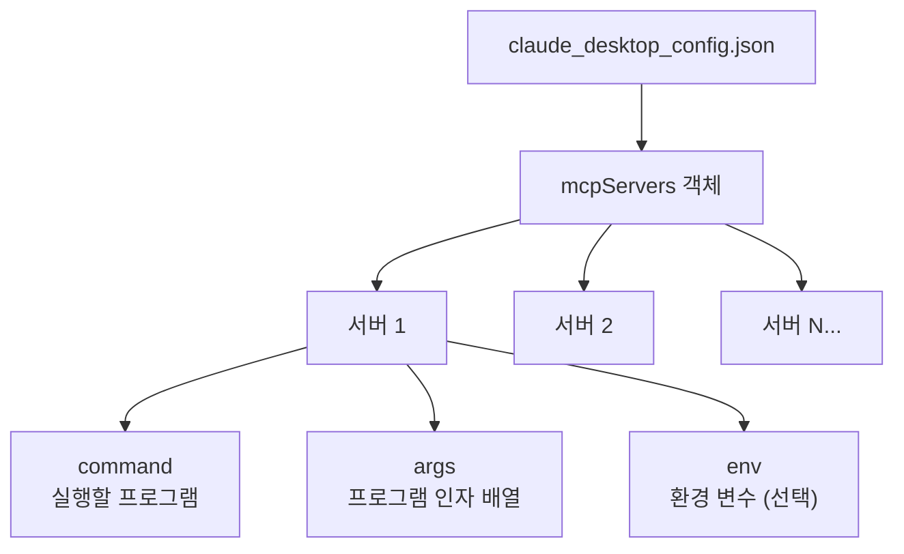
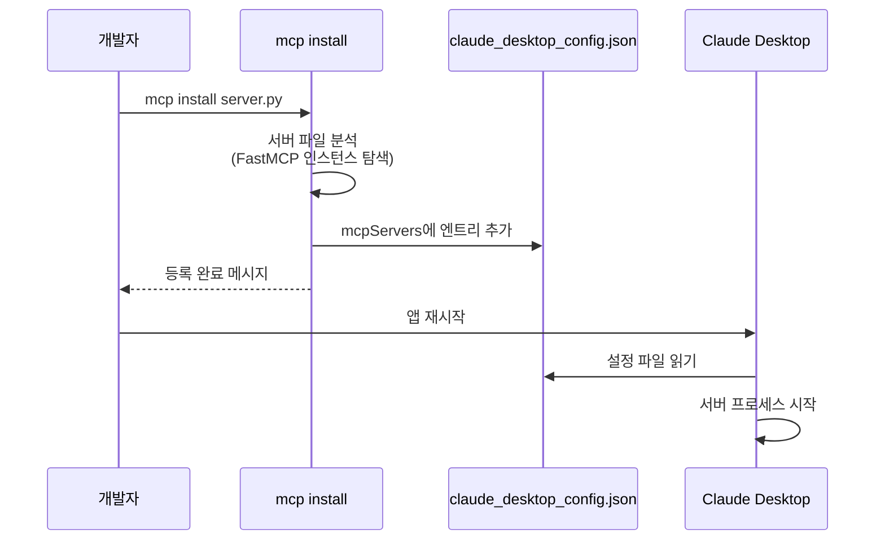
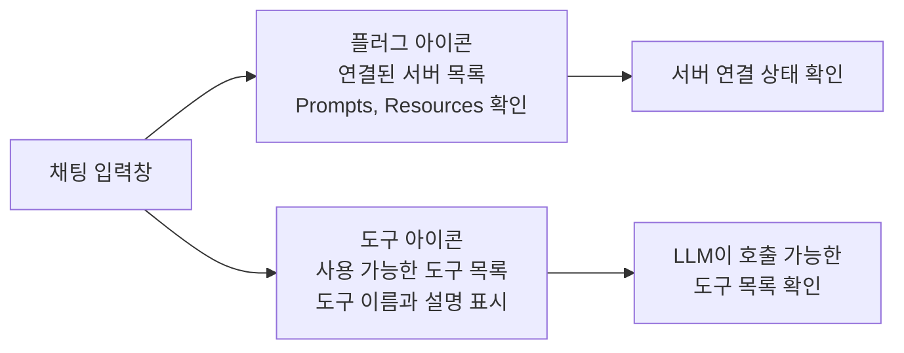
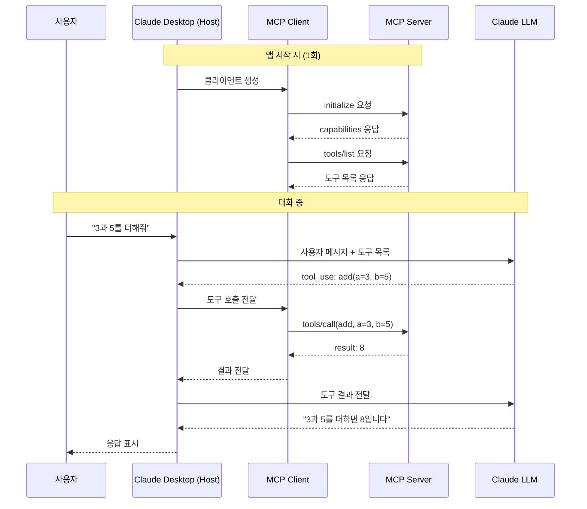
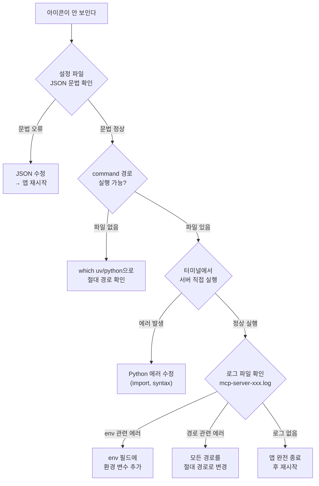

# 03. Claude Desktop 연결과 테스트

> MCP 서버를 Claude Desktop에 등록하고, 실제 LLM이 도구를 호출하는 전체 과정을 확인합니다.

## 개요

이 섹션에서는 [이전 섹션](03-ch3-개발-환경-설정과-첫-mcp-서버/02-02-hello-mcp-첫-번째-서버-만들기.md)에서 만든 MCP 서버를 Claude Desktop에 등록하여 실제 LLM과 연동해봅니다. 지금까지 JSON-RPC 메시지를 직접 보내며 확인했던 동작이, 이제 Claude가 자연어 대화 속에서 자동으로 수행하는 모습을 직접 체험합니다.

**선수 지식**: [Hello MCP — 첫 번째 서버 만들기](03-ch3-개발-환경-설정과-첫-mcp-서버/02-02-hello-mcp-첫-번째-서버-만들기.md)에서 다룬 FastMCP 서버 작성, `@mcp.tool()` 데코레이터, `mcp.run(transport="stdio")` 실행

**학습 목표**:
- `claude_desktop_config.json`의 구조와 역할을 이해한다
- MCP 서버를 Claude Desktop에 등록하고 연결 상태를 확인할 수 있다
- Claude가 MCP 도구를 발견하고 호출하는 전체 흐름을 파악한다
- 연결 문제가 발생했을 때 로그를 분석하고 트러블슈팅할 수 있다

## 왜 알아야 할까?

MCP 서버를 만드는 것과 실제로 LLM에 연결하는 것은 완전히 다른 문제입니다. 아무리 훌륭한 도구를 정의해도 Claude Desktop이 서버를 찾지 못하면 소용이 없거든요.

실무에서 MCP 서버를 팀에 배포할 때 가장 많이 겪는 문제가 바로 **연결 설정**입니다. "로컬에서는 되는데 동료 컴퓨터에서는 안 돼요"라는 상황의 90%는 경로 문제, Python 환경 문제, 환경 변수 누락 중 하나입니다. 이 섹션에서 이런 문제들을 체계적으로 다루면, 나중에 [Ch7](07-ch7-실전-서버-데이터베이스-연동/01-01-db-서버-설계-전략.md)이나 [Ch8](08-ch8-실전-서버-rest-api-래핑과-파일시스템/01-01-rest-apimcp-매핑-전략.md)에서 실전 서버를 만들 때 연결 문제로 시간을 낭비하지 않을 수 있습니다.

## 핵심 개념

### 개념 1: claude_desktop_config.json — 서버 등록부

> 💡 **비유**: `claude_desktop_config.json`은 **스마트폰의 연락처**와 같습니다. 전화를 걸려면 상대방의 번호(command), 국가 코드(args), 통화 방식(transport)을 연락처에 저장해두어야 하죠. Claude Desktop도 마찬가지로, 어떤 서버가 있고 어떻게 실행하는지를 이 파일에 기록해둡니다.

Claude Desktop은 MCP 서버 정보를 하나의 JSON 설정 파일에서 관리합니다. 이 파일의 위치는 운영체제에 따라 다릅니다:

| 운영체제 | 설정 파일 경로 |
|----------|---------------|
| **macOS** | `~/Library/Application Support/Claude/claude_desktop_config.json` |
| **Windows** | `%APPDATA%\Claude\claude_desktop_config.json` |

Claude Desktop에서 직접 열 수도 있습니다: **Claude 메뉴 → Settings → Developer 탭 → Edit Config** 버튼을 클릭하면 됩니다.

> 📊 **그림 1**: claude_desktop_config.json의 구조



설정 파일의 기본 구조는 이렇습니다:

```json
{
  "mcpServers": {
    "서버-이름": {
      "command": "실행할 프로그램",
      "args": ["인자1", "인자2"],
      "env": {
        "환경변수": "값"
      }
    }
  }
}
```

각 필드의 역할을 정리하면:

| 필드 | 필수 | 설명 |
|------|------|------|
| `command` | O | 실행할 프로그램 경로 (예: `"uv"`, `"python"`) |
| `args` | O | command에 전달할 인자 배열 |
| `env` | X | 서버 프로세스에 전달할 환경 변수 |

여기서 중요한 점이 하나 있습니다. Claude Desktop은 서버를 **자식 프로세스(child process)**로 실행하는데, 이 프로세스는 터미널에서 실행할 때와 **환경 변수가 다릅니다**. `PATH`, `HOME`, `USER` 같은 기본 변수만 상속되고, 터미널의 `.zshrc`나 `.bashrc`에서 설정한 변수들은 전달되지 않거든요. API 키나 데이터베이스 URL 같은 값은 반드시 `env` 필드에 명시해야 합니다.

### 개념 2: 서버 등록 — 세 가지 방식

> 💡 **비유**: 서버를 등록하는 것은 **내비게이션에 목적지를 입력하는 것**과 같습니다. "서울역"이라고만 입력해도 되지만(자동 등록), 정확한 주소를 직접 입력할 수도 있고(수동 등록), 즐겨찾기에서 고를 수도 있죠(패키지 설치). 어떤 방식이든 결과는 같지만, 상황에 따라 편한 방법이 다릅니다.

#### 방식 1: `mcp install` 자동 등록

MCP CLI의 `mcp install` 명령은 Python 서버를 Claude Desktop에 자동으로 등록합니다:

```console
$ uv run mcp install src/my_mcp_server/server.py
```

이 명령은 `claude_desktop_config.json`을 자동으로 수정하여 서버를 추가합니다. 환경 변수나 추가 패키지가 필요한 경우:

```console
# 환경 변수 전달
$ uv run mcp install server.py -v API_KEY=sk-xxxxx -v DB_URL=postgres://localhost/mydb

# .env 파일에서 환경 변수 로드
$ uv run mcp install server.py -f .env

# 커스텀 서버 이름 지정
$ uv run mcp install server.py --name "날씨 서버"

# 추가 패키지 함께 설치
$ uv run mcp install server.py --with httpx --with pandas
```

> 📊 **그림 2**: `mcp install` 명령의 동작 흐름



`mcp install`은 서버 파일에서 `mcp`, `server`, 또는 `app`이라는 이름의 FastMCP 인스턴스를 자동으로 찾습니다. 다른 변수명을 사용했다면 `server.py:my_variable` 형식으로 명시해야 합니다.

#### 방식 2: 수동 설정 (가장 확실한 방법)

설정 파일을 직접 편집하는 방식입니다. 자동 등록이 실패하거나, 정확한 제어가 필요할 때 사용합니다.

**uv 프로젝트 기반 설정 (권장)**:

```json
{
  "mcpServers": {
    "my-mcp-server": {
      "command": "/Users/username/.local/bin/uv",
      "args": [
        "--directory",
        "/Users/username/projects/my-mcp-server",
        "run",
        "src/my_mcp_server/server.py"
      ]
    }
  }
}
```

**venv/pip 기반 설정**:

```json
{
  "mcpServers": {
    "my-mcp-server": {
      "command": "/Users/username/projects/my-mcp-server/.venv/bin/python",
      "args": [
        "/Users/username/projects/my-mcp-server/src/my_mcp_server/server.py"
      ]
    }
  }
}
```

> ⚠️ **흔한 오해**: "command에 `uv`나 `python`이라고만 쓰면 되지 않나요?" — **아닙니다**. Claude Desktop이 서버를 실행하는 환경은 터미널과 다릅니다. `which uv`나 `which python`으로 확인한 **절대 경로**를 사용하는 것이 가장 안전합니다. 상대 경로나 `~`(틸드)는 예상대로 동작하지 않을 수 있습니다.

#### 방식 3: 환경 변수가 필요한 서버

API 키나 시크릿이 필요한 서버는 `env` 필드를 활용합니다:

```json
{
  "mcpServers": {
    "weather-server": {
      "command": "/Users/username/.local/bin/uv",
      "args": [
        "--directory",
        "/Users/username/projects/weather-server",
        "run",
        "server.py"
      ],
      "env": {
        "OPENWEATHER_API_KEY": "your-api-key-here",
        "DEFAULT_CITY": "Seoul"
      }
    }
  }
}
```

> 🔥 **실무 팁**: 환경 변수에 API 키를 직접 넣는 건 보안상 좋지 않습니다. 실무에서는 `.env` 파일로 관리하고 `mcp install -f .env`로 등록하거나, macOS Keychain이나 1Password CLI와 연동하는 패턴을 사용합니다.

### 개념 3: 연결 상태 확인과 UI 인터페이스

> 💡 **비유**: Claude Desktop의 MCP 연결 인터페이스는 **자동차 대시보드의 경고등**과 같습니다. 엔진(서버)이 정상이면 아이콘이 표시되고, 문제가 있으면 아이콘이 사라지거나 에러가 표시되죠.

서버를 등록하고 Claude Desktop을 재시작하면, 채팅 입력창 하단에 두 가지 아이콘이 나타납니다:

> 📊 **그림 3**: Claude Desktop MCP 인터페이스



| 아이콘 | 이름 | 역할 |
|--------|------|------|
| 플러그 | 서버 연결 | 연결된 MCP 서버, Prompts, Resources 목록 확인 |
| 도구 (Search and tools) | 도구 목록 | 모든 연결된 서버에서 사용 가능한 도구 목록 표시 |

이 아이콘들이 **보이지 않는다면** 서버가 연결되지 않은 것입니다. 이때는 다음 순서로 확인합니다:

1. `claude_desktop_config.json`의 JSON 문법이 올바른지 (쉼표, 따옴표)
2. `command` 경로가 실제로 존재하는 실행 파일인지
3. Claude Desktop을 완전히 종료(`Cmd+Q`)하고 다시 실행했는지

> 💡 **알고 계셨나요?**: Claude Desktop에서 설정 파일만 수정했을 때는 앱을 **완전히 재시작**해야 새 설정이 반영됩니다. 하지만 서버의 **Python 코드**만 수정한 경우에는 `Cmd+R`(macOS)로 현재 세션을 리로드하면 서버가 재시작됩니다. 매번 앱을 껐다 켤 필요가 없어요! 그래도 개발 중에 매번 리로드하는 것조차 번거롭다면? 다음 섹션에서 소개하는 **MCP Inspector**가 이 문제를 해결해줍니다. 브라우저에서 바로 도구를 호출하고 응답을 확인할 수 있거든요.

### 개념 4: 도구 호출 흐름 — 사용자 → Claude → MCP

사용자가 Claude Desktop에서 자연어로 요청하면, Claude가 알아서 적절한 MCP 도구를 선택하고 호출합니다. 이 과정을 단계별로 살펴보겠습니다.

> 📊 **그림 4**: Claude Desktop의 MCP 도구 호출 전체 흐름



핵심 포인트는 이렇습니다:

1. **도구 발견은 앱 시작 시** 일어납니다. Claude Desktop이 실행되면 설정 파일의 모든 서버를 기동하고 `tools/list`로 도구 목록을 가져옵니다.
2. **도구 선택은 LLM이** 합니다. 사용자가 "더해줘"라고 말하면 Claude가 도구 목록에서 `add`를 찾아 호출합니다. 사용자가 도구 이름을 직접 말할 필요가 없습니다.
3. **사용자 승인이 필요합니다.** Claude가 도구를 호출하기 전에 "이 작업을 실행할까요?" 같은 확인 팝업이 표시됩니다. 보안을 위해 사용자가 명시적으로 허용해야 합니다.

### 개념 5: 트러블슈팅 — 로그 분석

서버가 연결되지 않을 때 가장 먼저 봐야 할 것은 **로그 파일**입니다.

| 운영체제 | 로그 위치 |
|----------|----------|
| **macOS** | `~/Library/Logs/Claude/` |
| **Windows** | `%APPDATA%\Claude\logs\` |

이 디렉토리에 두 종류의 로그가 있습니다:

| 파일 | 내용 |
|------|------|
| `mcp.log` | MCP 연결/해제 이벤트, 전반적인 프로토콜 오류 |
| `mcp-server-{서버이름}.log` | 특정 서버의 stderr 출력 (Python의 `print(file=sys.stderr)`이나 `logging` 출력) |

실시간 로그 모니터링:

```console
$ tail -n 20 -F ~/Library/Logs/Claude/mcp*.log
```

> 📊 **그림 5**: 트러블슈팅 의사결정 트리



가장 흔한 오류 패턴과 해결법을 정리하면:

| 증상 | 원인 | 해결 |
|------|------|------|
| 아이콘 자체가 안 보임 | JSON 문법 오류 | 쉼표, 따옴표, 중괄호 확인 |
| "Server disconnected" | command 경로 잘못됨 | `which uv` → 절대 경로 사용 |
| "Module not found" | Python 환경 불일치 | venv 경로 직접 지정 |
| "Permission denied" | 실행 권한 없음 | `chmod +x` 또는 경로 확인 |
| 도구는 보이는데 호출 실패 | 런타임 에러 | `mcp-server-xxx.log` 확인 |

### 개념 6: 개발 워크플로 — Claude Desktop vs Inspector

MCP 서버 개발에서는 **테스트 루프의 속도**가 생산성을 결정합니다. Claude Desktop에서의 개발 과정을 정리해보면:

> 📊 **그림 6**: Claude Desktop 기반 개발 사이클


이 사이클은 **최종 사용자 경험을 확인**하기에는 최고지만, 개발 중 반복하기에는 단계가 많습니다. 특히 설정 파일을 변경할 때마다 앱을 완전히 재시작해야 한다는 점이 병목이 되죠. 도구 하나를 수정하고 결과를 보기까지 30초~1분이 걸리는 셈입니다.

그래서 MCP 생태계에는 **MCP Inspector**라는 전용 개발 도구가 있습니다. Inspector는 브라우저 기반으로, 앱 재시작 없이 도구를 즉시 호출하고 JSON-RPC 메시지를 직접 확인할 수 있습니다. 개발 중에는 Inspector로 빠르게 반복하고, 완성 후 Claude Desktop에서 최종 검증하는 것이 가장 효율적인 워크플로입니다. [다음 섹션](03-ch3-개발-환경-설정과-첫-mcp-서버/04-04-mcp-inspector와-디버깅.md)에서 Inspector의 사용법을 자세히 다룹니다.

## 실습: 직접 해보기

이전 섹션에서 만든 서버를 Claude Desktop에 등록하고, 실제로 도구를 호출해봅시다.

### Step 1: 서버 코드 준비

[이전 섹션](03-ch3-개발-환경-설정과-첫-mcp-서버/02-02-hello-mcp-첫-번째-서버-만들기.md)에서 작성한 서버가 있다면 그대로 사용합니다. 없다면 아래 코드를 `src/my_mcp_server/server.py`에 저장합니다:

```python
# src/my_mcp_server/server.py
from mcp.server.fastmcp import FastMCP

# 서버 인스턴스 생성
mcp = FastMCP(
    "my-first-server",
    instructions="기본 산술 연산과 인사를 제공하는 학습용 서버입니다",
)

@mcp.tool()
def add(a: int, b: int) -> int:
    """두 정수를 더합니다.

    Args:
        a: 첫 번째 정수
        b: 두 번째 정수
    """
    return a + b

@mcp.tool()
def greet(name: str, language: str = "ko") -> str:
    """이름을 받아 인사말을 생성합니다.

    Args:
        name: 인사할 대상의 이름
        language: 인사 언어 ('ko' 또는 'en', 기본값: 'ko')
    """
    if language == "en":
        return f"Hello, {name}! Welcome to MCP."
    return f"안녕하세요, {name}님! MCP 세계에 오신 것을 환영합니다."

if __name__ == "__main__":
    mcp.run(transport="stdio")
```

### Step 2: 서버가 동작하는지 먼저 확인

Claude Desktop에 등록하기 전에, 터미널에서 서버가 정상적으로 실행되는지 반드시 확인합니다:

```console
$ cd /Users/username/projects/my-mcp-server
$ uv run src/my_mcp_server/server.py
```

아무 출력 없이 대기 상태가 되면 정상입니다. `Ctrl+C`로 종료합니다. 만약 `ImportError`나 `SyntaxError`가 발생하면 서버 코드를 수정한 뒤 다시 시도합니다.

### Step 3: 절대 경로 확인

```run:python
import shutil
import os

# uv 경로 확인
uv_path = shutil.which("uv")
print(f"uv 경로: {uv_path}")

# 프로젝트 절대 경로 (실제 경로로 바꿔주세요)
project_dir = os.path.expanduser("~/projects/my-mcp-server")
print(f"프로젝트 경로: {project_dir}")
print(f"프로젝트 존재 여부: {os.path.isdir(project_dir)}")
```

```output
uv 경로: /Users/username/.local/bin/uv
프로젝트 경로: /Users/username/projects/my-mcp-server
프로젝트 존재 여부: True
```

### Step 4: Claude Desktop 설정 파일 편집

터미널에서 설정 파일을 엽니다:

```console
# macOS
$ open ~/Library/Application\ Support/Claude/claude_desktop_config.json

# 또는 Claude Desktop에서: Claude 메뉴 → Settings → Developer → Edit Config
```

파일이 없으면 새로 만듭니다. 기존 내용이 있으면 `mcpServers` 안에 서버를 추가합니다:

```json
{
  "mcpServers": {
    "my-first-server": {
      "command": "/Users/username/.local/bin/uv",
      "args": [
        "--directory",
        "/Users/username/projects/my-mcp-server",
        "run",
        "src/my_mcp_server/server.py"
      ]
    }
  }
}
```

> ⚠️ **주의**: `/Users/username/` 부분을 자신의 실제 홈 디렉토리로 바꿔야 합니다. `~`나 `$HOME`은 사용하지 마세요.

### Step 5: Claude Desktop 재시작

설정 파일을 저장한 후, Claude Desktop을 **완전히 종료**하고 다시 실행합니다:

```console
# macOS에서 완전 종료 (Dock에서 우클릭 → 종료도 가능)
$ osascript -e 'quit app "Claude"'
# 잠시 후 다시 실행
$ open -a "Claude"
```

### Step 6: 연결 확인 및 도구 호출

1. 새 대화를 시작합니다
2. 입력창 하단의 **도구 아이콘**을 클릭하여 `add`와 `greet` 도구가 표시되는지 확인합니다
3. 다음과 같이 자연어로 요청해봅니다:

```
"3과 7을 더해줘"
→ Claude가 add(a=3, b=7) 호출 → "3과 7을 더하면 10입니다"

"Jason에게 영어로 인사해줘"
→ Claude가 greet(name="Jason", language="en") 호출 → "Hello, Jason! Welcome to MCP."
```

Claude는 도구를 호출하기 전에 승인 확인을 요청합니다. **Allow**를 클릭하면 도구가 실행됩니다.

### Step 7: 문제 발생 시 로그 확인

도구가 보이지 않거나 호출이 실패하면:

```console
# 실시간 로그 모니터링
$ tail -n 50 -F ~/Library/Logs/Claude/mcp.log

# 특정 서버의 에러 로그
$ cat ~/Library/Logs/Claude/mcp-server-my-first-server.log
```

### 보너스: 고급 디버깅 — Chrome DevTools

Claude Desktop은 Electron 기반이므로 Chrome DevTools를 활성화할 수 있습니다:

```console
# DevTools 활성화 설정 생성
$ echo '{"allowDevTools": true}' > ~/Library/Application\ Support/Claude/developer_settings.json
```

Claude Desktop 재시작 후 `Cmd+Option+Shift+I`로 DevTools를 열 수 있습니다. Console 탭에서 에러를 확인하고, Network 탭에서 메시지 흐름을 분석할 수 있습니다.

## 더 깊이 알아보기

### claude_desktop_config.json의 탄생 배경

MCP의 서버 등록 방식은 처음부터 JSON 설정 파일이었던 것은 아닙니다. Anthropic이 2024년 11월 MCP를 처음 공개했을 때, 초기 프로토타입에서는 서버를 코드 안에서 직접 연결하는 방식이었습니다. 하지만 이 방식은 비개발자에게 너무 어려웠죠.

VS Code의 `settings.json`이나 Docker의 `docker-compose.yml`에서 영감을 받아, **선언적 설정 파일** 방식이 채택되었습니다. "어떤 서버가 있고, 어떻게 실행하면 되는지"만 적으면 앱이 나머지를 처리하는 거죠. 이 접근 방식은 IDE 플러그인 생태계에서 수십 년간 검증된 패턴이기도 합니다.

재미있는 점은, MCP 스펙 자체에는 `claude_desktop_config.json`에 대한 정의가 **없다**는 것입니다. 이 파일은 Claude Desktop이라는 **Host 애플리케이션**의 구현 세부사항입니다. 다른 MCP Host(예: VS Code의 Copilot, Cursor)는 자체적인 등록 방식을 사용합니다. [Host/Client/Server 3계층](02-ch2-mcp-아키텍처와-프로토콜-구조/01-01-hostclientserver-3계층.md)에서 배운 것처럼, Host는 사용자와 직접 상호작용하는 계층이고, 서버 등록은 Host의 책임이기 때문입니다.

### stdio Transport의 보안 모델

Claude Desktop이 stdio Transport를 사용하는 이유는 **보안**입니다. 서버가 자식 프로세스로 실행되므로, 네트워크를 열지 않고 stdin/stdout 파이프만으로 통신합니다. 외부에서 접근할 수 없고, 서버가 예기치 않게 네트워크 포트를 점유하는 일도 없습니다. [Ch2의 stdio Transport](02-ch2-mcp-아키텍처와-프로토콜-구조/02-02-transport-계층-stdio.md)에서 다룬 것처럼, 이 단순함이 로컬 개발에서 stdio가 기본 Transport인 이유입니다.

## 흔한 오해와 팁

> ⚠️ **흔한 오해**: "서버 코드를 수정하면 매번 Claude Desktop을 완전히 재시작해야 한다" — **아닙니다**. 서버 코드만 수정한 경우 `Cmd+R`로 리로드하면 서버가 재시작됩니다. 완전 재시작이 필요한 건 `claude_desktop_config.json` 자체를 변경했을 때뿐입니다.

> 💡 **알고 계셨나요?**: Claude Desktop의 `mcpServers`에는 서버를 여러 개 등록할 수 있습니다. 각 서버는 독립적인 프로세스로 실행되고, 별도의 MCP Client가 할당됩니다. Claude는 모든 서버의 도구를 한 번에 볼 수 있어서, 날씨 서버 + 데이터베이스 서버 + 파일 서버를 동시에 연결하는 것도 가능합니다. 이 패턴은 [Ch10 멀티 서버 오케스트레이션](10-ch10-mcp-호스트와-멀티-서버-오케스트레이션/02-02-멀티-서버-연결과-관리.md)에서 자세히 다룹니다.

> 🔥 **실무 팁**: 서버 개발 중에는 Claude Desktop 대신 **MCP Inspector**를 사용하세요. 매번 앱을 재시작하지 않아도 도구를 테스트할 수 있고, 요청/응답 메시지를 직접 볼 수 있어 디버깅이 훨씬 빠릅니다. Inspector 사용법은 [다음 섹션](03-ch3-개발-환경-설정과-첫-mcp-서버/04-04-mcp-inspector와-디버깅.md)에서 다룹니다.

> 🔥 **실무 팁**: Windows에서 `ENOENT` 에러가 나면 `env` 필드에 `"APPDATA": "C:\\Users\\{username}\\AppData\\Roaming"` 을 추가해보세요. Claude Desktop이 환경 변수를 최소한으로만 상속하기 때문에 Windows 특유의 경로 변수가 누락되는 경우가 있습니다.

## 핵심 정리

| 개념 | 설명 |
|------|------|
| `claude_desktop_config.json` | Claude Desktop이 MCP 서버 정보를 관리하는 설정 파일. `mcpServers` 객체에 서버를 등록 |
| `command` / `args` / `env` | 서버 실행 프로그램, 인자 배열, 환경 변수. 반드시 절대 경로 사용 |
| `mcp install` | MCP CLI가 자동으로 설정 파일에 서버를 등록하는 명령 |
| 도구 아이콘 | 입력창 하단의 도구 아이콘으로 연결된 도구 목록 확인 가능 |
| 로그 위치 | macOS: `~/Library/Logs/Claude/`, Windows: `%APPDATA%\Claude\logs\` |
| 설정 변경 시 | 앱 완전 재시작 필요. 코드만 변경 시 `Cmd+R` 리로드 가능 |
| 환경 변수 | 터미널 환경이 자동 상속되지 않으므로 `env` 필드에 명시 필수 |
| 개발 워크플로 | Claude Desktop은 최종 검증용, 개발 중에는 MCP Inspector가 더 빠름 |

## 다음 섹션 미리보기

서버를 Claude Desktop에 연결하는 방법을 배웠습니다. 하지만 개발 과정에서 매번 앱을 재시작하거나 리로드하는 건 솔직히 번거롭죠. [MCP Inspector와 디버깅](03-ch3-개발-환경-설정과-첫-mcp-서버/04-04-mcp-inspector와-디버깅.md)에서는 이 문제를 해결하는 공식 도구인 MCP Inspector를 다룹니다. 브라우저에서 도구를 즉시 호출하고, JSON-RPC 요청/응답 메시지를 실시간으로 확인하면서 빠른 피드백 루프를 구축하는 방법을 배웁니다.

## 참고 자료

- [MCP Quickstart — Claude Desktop 연결 가이드](https://modelcontextprotocol.io/quickstart/user) - 공식 문서의 Claude Desktop 설정 시작 가이드
- [Build an MCP Server — Python](https://modelcontextprotocol.io/docs/develop/build-server) - 공식 문서의 서버 빌드 및 Claude Desktop 연결 가이드
- [MCP Debugging Guide](https://modelcontextprotocol.io/docs/tools/debugging) - 공식 문서의 디버깅 가이드, 로그 위치와 DevTools 활성화 방법
- [Python MCP Server: Connect LLMs to Your Data — Real Python](https://realpython.com/python-mcp/) - Claude Desktop 설정을 포함한 종합 튜토리얼
- [Introduction to Model Context Protocol — Anthropic Academy](https://anthropic.skilljar.com/introduction-to-model-context-protocol) - Anthropic 공식 교육 과정
- [FastMCP JSON Configuration](https://gofastmcp.com/integrations/mcp-json-configuration) - FastMCP의 JSON 설정 상세 가이드

---
### 🔗 Related Sessions
- [stdio transport](02-ch2-mcp-아키텍처와-프로토콜-구조/02-02-transport-계층-stdio.md) (prerequisite)
- [mcp.run(transport='stdio')](03-ch3-개발-환경-설정과-첫-mcp-서버/02-02-hello-mcp-첫-번째-서버-만들기.md) (prerequisite)
