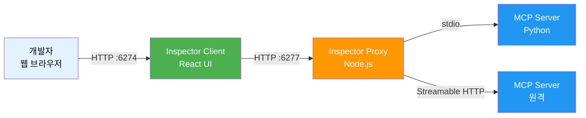
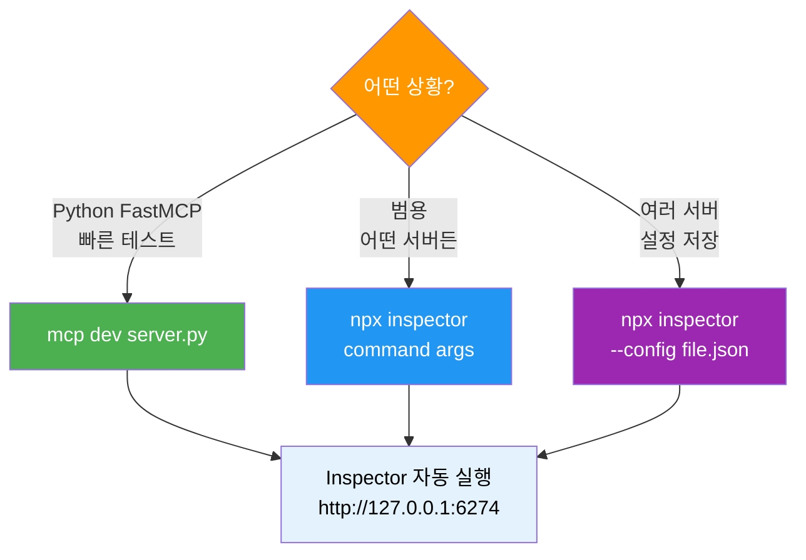
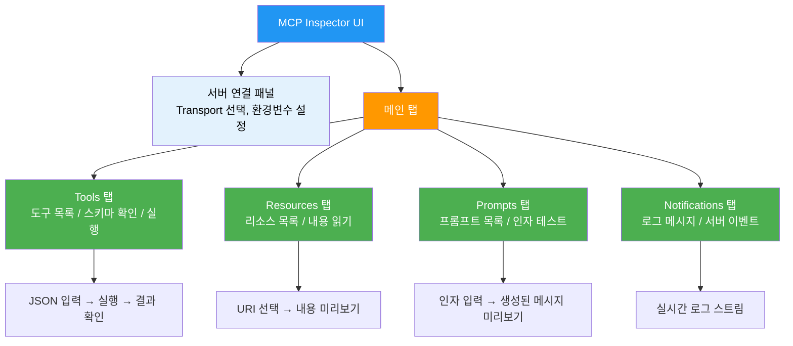
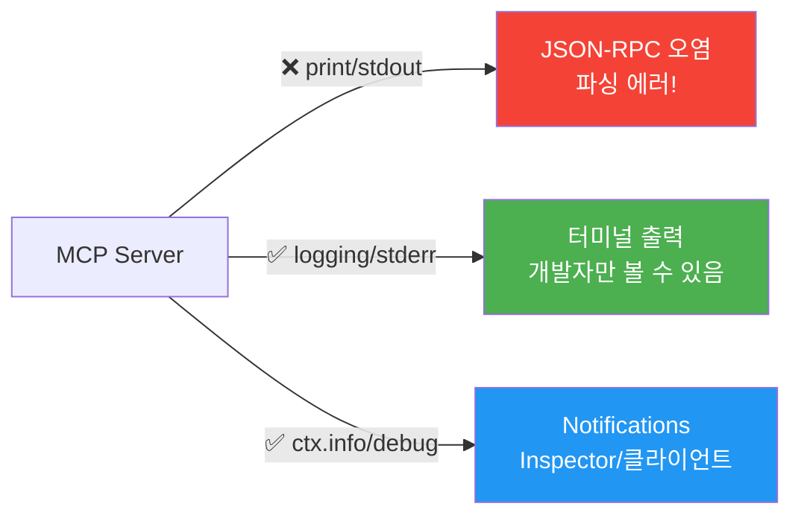
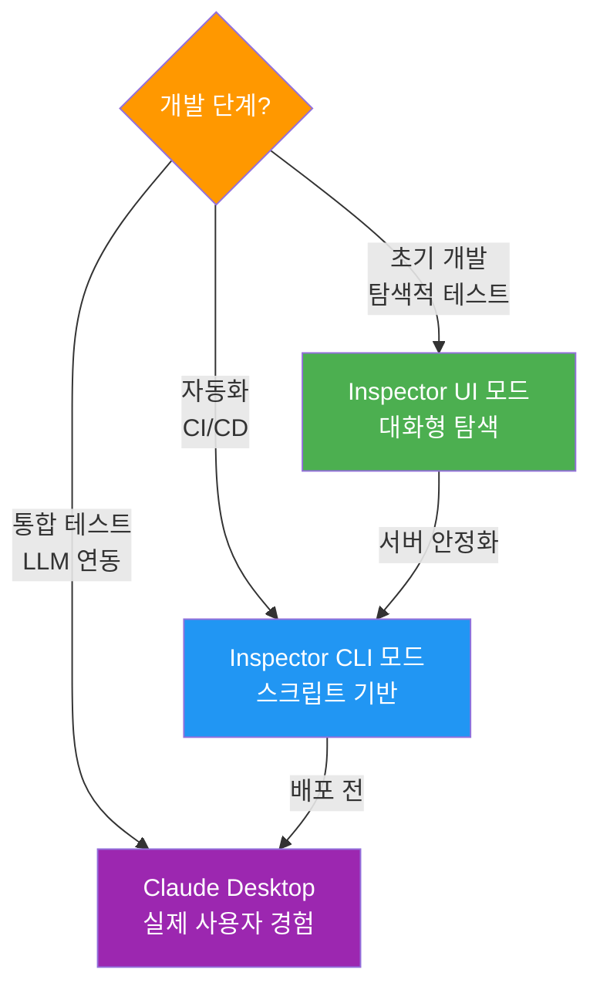
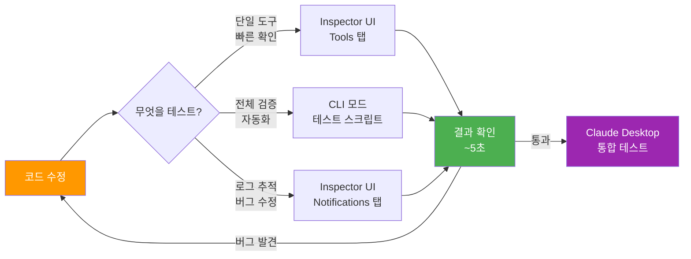
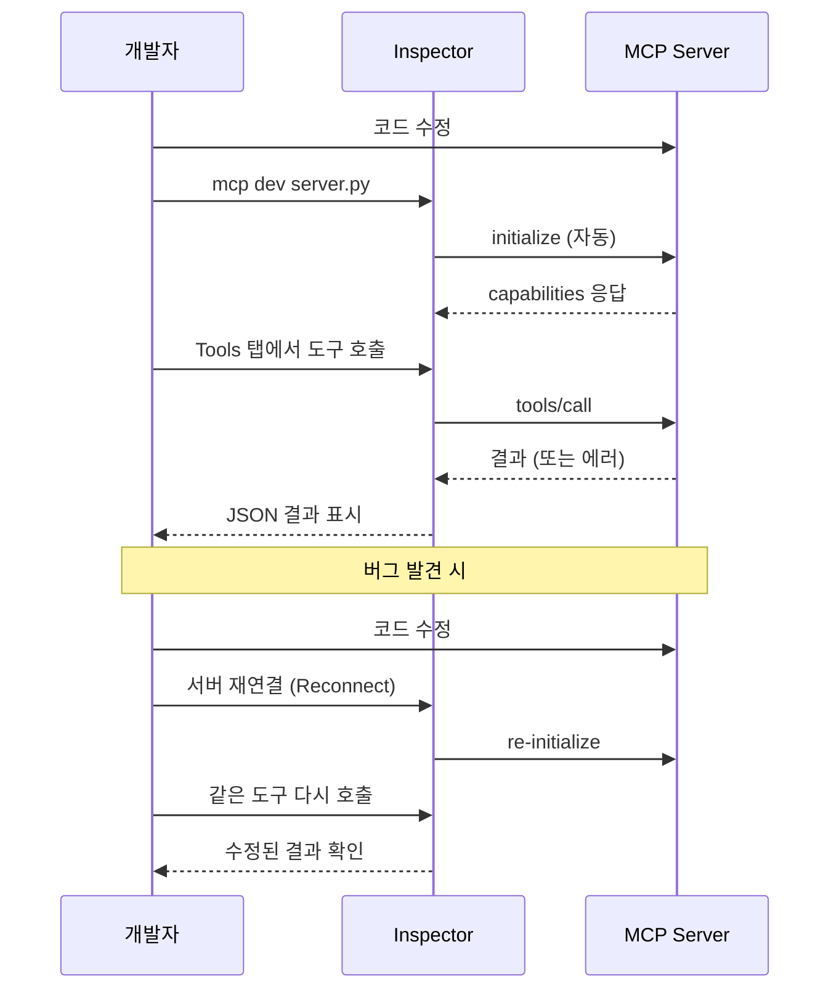

# 04. MCP Inspector와 디버깅

> MCP 서버를 Claude Desktop 없이 빠르게 테스트하고, 실시간으로 메시지를 추적하며, 버그를 잡아내는 디버깅 워크플로를 마스터합니다.

## 개요

이 섹션에서는 MCP 공식 디버깅 도구인 **MCP Inspector**를 설치하고, 서버의 도구·리소스·프롬프트를 대화형으로 테스트하는 방법을 배웁니다. 또한 Python MCP 서버의 로깅 전략, 에러 추적, 그리고 개발 피드백 루프를 최적화하는 기법을 다룹니다.

**선수 지식**: [03. Claude Desktop 연결과 테스트](03-ch3-개발-환경-설정과-첫-mcp-서버/03-03-claude-desktop-연결과-테스트.md)에서 배운 서버 등록과 로그 확인 방법
**학습 목표**:
- MCP Inspector를 설치하고 Python 서버에 연결할 수 있다
- Inspector UI에서 도구 호출, 리소스 조회, 프롬프트 테스트를 수행할 수 있다
- JSON-RPC 메시지를 실시간으로 모니터링하고 에러를 추적할 수 있다
- `mcp dev` 명령으로 빠른 개발-테스트 루프를 구축할 수 있다
- CLI 모드를 활용하여 자동화된 서버 검증을 수행할 수 있다

## 왜 알아야 할까?

[이전 섹션](03-ch3-개발-환경-설정과-첫-mcp-서버/03-03-claude-desktop-연결과-테스트.md)에서 Claude Desktop으로 서버를 테스트했는데요, 솔직히 불편한 점이 있었죠? 코드를 한 줄 고칠 때마다 Claude Desktop을 재시작하거나, LLM이 도구를 호출할 **때까지 기다려야** 하는 답답함. 도구에 버그가 있는 건지, LLM이 도구를 잘못 호출한 건지 구분하기도 어렵습니다.

MCP Inspector는 이 문제를 정확히 해결합니다. 마치 웹 개발에서 브라우저 DevTools가 없이는 개발할 수 없듯이, MCP 서버 개발에서 Inspector는 **필수 도구**입니다. LLM을 거치지 않고 직접 도구를 호출하고, JSON-RPC 메시지를 한 줄 한 줄 추적하며, 서버의 응답을 즉시 확인할 수 있거든요.

실제로 MCP 서버 개발의 반복 주기는 이렇게 달라집니다:

- **Inspector 없이**: 코드 수정 → Claude Desktop 재시작 → 프롬프트 입력 → LLM 응답 대기 → 결과 확인 (~1-2분)
- **Inspector 사용**: 코드 수정 → Inspector에서 바로 호출 → 결과 확인 (~5초)

## 핵심 개념

### 개념 1: MCP Inspector의 아키텍처

> 💡 **비유**: MCP Inspector는 **공항 관제탑**과 같습니다. 비행기(메시지)가 이착륙(송수신)하는 모든 과정을 실시간으로 모니터링하고, 직접 비행기에 지시(도구 호출)를 내릴 수도 있죠. Claude Desktop이 "비행기를 타고 여행하는 승객 경험"이라면, Inspector는 "관제탑에서 전체 시스템을 조망하는 관제사 경험"입니다.

MCP Inspector는 두 개의 컴포넌트로 구성됩니다:

1. **Inspector Client**: React 기반 웹 UI — 기본 포트 `6274`
2. **Inspector Proxy**: Node.js 프록시 서버 — 기본 포트 `6277`

Proxy가 중간에서 MCP 서버와 통신하고, 웹 UI(Client)가 그 내용을 시각적으로 보여주는 구조입니다. 이 2단 구조 덕분에 stdio, SSE, Streamable HTTP 등 어떤 Transport든 동일한 UI로 디버깅할 수 있습니다.

> 📊 **그림 1**: MCP Inspector의 2컴포넌트 아키텍처



Inspector Proxy는 MCP 클라이언트 역할을 수행하면서 서버와의 모든 JSON-RPC 메시지를 가로채 UI로 전달합니다. 그래서 `initialize`, `tools/list`, `tools/call` 같은 프로토콜 메시지를 날것 그대로 확인할 수 있는 거죠.

### 개념 2: 설치와 실행 — 세 가지 방법

> 💡 **비유**: 레스토랑 예약을 전화(npx 직접 실행), 앱(mcp dev), 또는 웹사이트(config 파일)로 할 수 있듯이, Inspector도 상황에 따라 세 가지 방법으로 실행할 수 있습니다.

**방법 A — npx로 직접 실행 (범용)**

별도 설치 없이 Node.js만 있으면 됩니다 (Node.js 22.7.5 이상 필요):

```bash
# Inspector만 실행 (UI에서 서버 설정)
npx @modelcontextprotocol/inspector

# Python 서버를 stdio로 바로 연결
npx @modelcontextprotocol/inspector uv --directory /path/to/project run my-server
```

**방법 B — `mcp dev` 명령 (Python 추천)**

[01. Python SDK 설치와 프로젝트 구조](03-ch3-개발-환경-설정과-첫-mcp-서버/01-01-python-sdk-설치와-프로젝트-구조.md)에서 설치한 `mcp[cli]`에 포함된 명령입니다:

```bash
# 가장 간단한 방법 — FastMCP 서버 파일 하나로 실행
uv run mcp dev server.py

# 추가 의존성이 필요한 경우
uv run mcp dev server.py --with pandas --with numpy

# 로컬 패키지를 editable 모드로 포함
uv run mcp dev server.py --with-editable .
```

`mcp dev`는 내부적으로 Inspector를 자동 실행하고 서버를 연결해줍니다. Python 개발자에게 가장 편한 방법이죠.

**방법 C — 설정 파일로 실행 (멀티 서버)**

```bash
npx @modelcontextprotocol/inspector --config mcp-servers.json --server my-server
```

> 📊 **그림 2**: 세 가지 실행 방법 비교



포트를 변경해야 한다면 환경 변수를 사용합니다:

```bash
CLIENT_PORT=8080 SERVER_PORT=9000 npx @modelcontextprotocol/inspector uv run server.py
```

### 개념 3: Inspector UI 탐색 — 네 개의 탭

> 💡 **비유**: Inspector UI는 자동차 **계기판**과 같습니다. 속도계(Tools), 연료계(Resources), 내비게이션(Prompts), 그리고 경고등(Notifications)이 한 화면에 모여 있어서 서버 상태를 한눈에 파악할 수 있죠.

Inspector를 열면 왼쪽에 **서버 연결 패널**, 오른쪽에 **네 개의 메인 탭**이 표시됩니다.

> 📊 **그림 3**: Inspector UI의 주요 구성 요소



**Tools 탭** — 가장 자주 사용하는 탭입니다:
- 서버가 노출한 모든 도구 목록과 JSON Schema를 보여줍니다
- 각 도구의 매개변수를 입력하고 **바로 실행**할 수 있습니다
- 실행 결과가 raw JSON으로 표시되어, LLM의 해석 없이 순수한 서버 응답을 확인합니다

**Resources 탭** — Ch5에서 리소스를 배우면 활용도가 높아집니다:
- 등록된 리소스 URI 목록과 메타데이터(MIME 타입, 설명) 확인
- 리소스 내용을 직접 읽어 미리보기

**Prompts 탭** — Ch6에서 프롬프트를 배우면 사용하게 됩니다:
- 프롬프트 템플릿 목록과 인자(arguments) 확인
- 인자를 입력하면 생성되는 메시지를 미리보기

**Notifications 탭** — 디버깅의 핵심:
- 서버에서 보내는 `notifications/message/log` 등의 로그 메시지
- 도구 변경(`notifications/tools/list_changed`), 리소스 업데이트 등 실시간 이벤트

### 개념 4: 서버 로깅 전략 — stdout을 오염시키지 마라

> 💡 **비유**: stdio Transport를 사용하는 MCP 서버에서 `print()`를 쓰는 것은, **전화 통화 중에 옆 사람에게 말을 거는 것**과 같습니다. 상대방(클라이언트)은 당신의 모든 소리(stdout)를 듣고 있는데, 디버그 메시지가 JSON-RPC 응답 사이에 끼어들면 대화(프로토콜)가 완전히 깨져버립니다.

이것은 MCP 서버 개발에서 가장 흔한 실수이자, 가장 디버깅하기 어려운 문제입니다. [02. Hello MCP — 첫 번째 서버 만들기](03-ch3-개발-환경-설정과-첫-mcp-서버/02-02-hello-mcp-첫-번째-서버-만들기.md)에서도 언급했지만, 여기서 체계적으로 정리하겠습니다.

**규칙: MCP 서버에서 `print()` 금지. 모든 디버그 출력은 stderr로.**

```python
import sys
import logging

# ✅ 올바른 로깅 설정 — stderr로 출력
logging.basicConfig(
    level=logging.DEBUG,
    stream=sys.stderr,  # stdout이 아닌 stderr!
    format="%(asctime)s [%(levelname)s] %(name)s: %(message)s"
)
logger = logging.getLogger("my-mcp-server")

# ✅ 디버그 메시지는 항상 logger 사용
logger.info("서버 시작됨")
logger.debug(f"도구 호출 매개변수: {params}")

# ❌ 절대 금지 — stdout을 오염시킴
print("디버그:", some_value)  # JSON-RPC 파싱 에러 유발!
```

MCP SDK는 클라이언트로 로그를 전송하는 공식 방법도 제공합니다. Inspector의 Notifications 탭에서 이 로그가 표시됩니다:

```python
from mcp.server.fastmcp import FastMCP, Context

mcp = FastMCP("debug-demo")

@mcp.tool()
async def process_data(data: str, ctx: Context) -> str:
    """데이터를 처리하고 결과를 반환합니다."""
    # Context를 통한 공식 로깅 — Inspector Notifications에 표시됨
    await ctx.info("데이터 처리 시작")
    await ctx.debug(f"입력 데이터 길이: {len(data)}")
    
    result = data.upper()
    
    await ctx.info("데이터 처리 완료")
    return result
```

> 📊 **그림 4**: MCP 서버 로깅 경로 — 어디로 로그를 보내야 하나?



### 개념 5: CLI 모드 — 자동화와 CI/CD

Inspector는 웹 UI 없이 커맨드라인에서 직접 서버를 테스트하는 CLI 모드도 지원합니다. CI/CD 파이프라인이나 스크립트에서 서버 상태를 자동 검증할 때 유용하죠.

```bash
# 도구 목록 조회
npx @modelcontextprotocol/inspector --cli \
  uv --directory . run python server.py \
  --method tools/list

# 특정 도구 호출
npx @modelcontextprotocol/inspector --cli \
  uv --directory . run python server.py \
  --method tools/call \
  --tool-name add \
  --tool-arg a=3 \
  --tool-arg b=5

# 리소스 목록 조회
npx @modelcontextprotocol/inspector --cli \
  uv --directory . run python server.py \
  --method resources/list
```

> 📊 **그림 5**: Inspector UI 모드 vs CLI 모드 활용 시점



### 개념 6: 개발 피드백 루프 최적화

> 💡 **비유**: 피드백 루프 최적화는 **요리사의 동선 설계**와 같습니다. 냉장고에서 재료를 꺼내고(코드 수정), 조리대에서 손질하고(서버 재시작), 맛을 보는(테스트) 과정이 매끄러울수록 더 빠르게 좋은 요리를 만들 수 있죠. Inspector를 중심으로 동선을 최적화하면 개발 속도가 극적으로 빨라집니다.

MCP 서버 개발에서 가장 중요한 것은 **코드 수정 → 테스트 → 확인** 사이클을 최대한 짧게 만드는 것입니다. Inspector를 활용한 최적 워크플로를 단계별로 정리해볼게요.

**단계 1 — 터미널 레이아웃 설정**

터미널을 분할하여 세 영역을 동시에 볼 수 있도록 합니다:

```bash
# 패널 1: 코드 편집 (에디터)
code debug_server.py

# 패널 2: Inspector 실행 (서버 로그가 stderr로 여기에 표시됨)
uv run mcp dev debug_server.py --with-editable .

# 패널 3: CLI 테스트용 (반복 호출 스크립트)
npx @modelcontextprotocol/inspector --cli \
  uv run python debug_server.py \
  --method tools/call --tool-name calculate --tool-arg expression="1+1"
```

**단계 2 — 반복 테스트 스크립트 작성**

자주 호출하는 도구 조합을 셸 스크립트로 만들면 클릭 한 번으로 전체 검증이 가능합니다:

```bash
#!/bin/bash
# test_server.sh — 서버 기본 검증 스크립트

INSPECTOR="npx @modelcontextprotocol/inspector --cli"
SERVER="uv run python debug_server.py"

echo "=== 도구 목록 확인 ==="
$INSPECTOR $SERVER --method tools/list

echo "=== 정상 케이스 ==="
$INSPECTOR $SERVER --method tools/call \
  --tool-name calculate --tool-arg expression="2+3*4"

echo "=== 에러 케이스 ==="
$INSPECTOR $SERVER --method tools/call \
  --tool-name calculate --tool-arg expression="import os"

echo "=== 리소스 확인 ==="
$INSPECTOR $SERVER --method resources/list
```

**단계 3 — 개발 도구별 최적 조합**

| 개발 단계 | 도구 | 피드백 시간 |
|-----------|------|------------|
| 초기 프로토타이핑 | Inspector UI + `mcp dev` | ~5초 |
| 기능 구현 | Inspector UI + `--with-editable .` | ~3초 (재시작 불필요) |
| 버그 수정 | Inspector UI + Notifications 탭 + stderr 로그 | ~5초 |
| 회귀 테스트 | CLI 모드 + 테스트 스크립트 | ~10초 (전체 검증) |
| 배포 전 검증 | Claude Desktop + 실제 프롬프트 | ~1분 |

> 📊 **그림 6**: 피드백 루프 최적화 — 개발 단계별 도구 전환



핵심은 **"가능한 한 늦게 Claude Desktop을 사용하라"**는 것입니다. Inspector에서 모든 도구가 정상 동작하는 것을 확인한 후, 마지막에 Claude Desktop으로 LLM 통합만 검증하면 됩니다. LLM 응답을 기다리는 시간은 피드백 루프에서 가장 비싼 비용이니까요.

## 실습: 직접 해보기

이전 섹션들에서 만든 서버를 확장하여, Inspector로 디버깅하기 좋은 예제 서버를 작성하겠습니다. 도구, 리소스, 프롬프트를 모두 포함하고, Context 기반 로깅까지 적용합니다.

### 1단계: 디버깅 실습용 서버 작성

```python
# debug_server.py
"""MCP Inspector 디버깅 실습용 서버."""

import logging
import sys
from datetime import datetime

from mcp.server.fastmcp import FastMCP, Context

# stderr 로깅 설정
logging.basicConfig(
    level=logging.DEBUG,
    stream=sys.stderr,
    format="%(asctime)s [%(levelname)s] %(name)s: %(message)s",
)
logger = logging.getLogger("debug-server")

# FastMCP 서버 인스턴스 생성
mcp = FastMCP("debug-server")

# ── Tools ──

@mcp.tool()
async def calculate(expression: str, ctx: Context) -> str:
    """수학 표현식을 계산합니다.

    Args:
        expression: 계산할 수학 표현식 (예: "2 + 3 * 4")
    """
    await ctx.info(f"계산 요청: {expression}")
    logger.debug(f"calculate 호출됨: expression={expression!r}")

    # 안전한 수학 연산만 허용
    allowed = set("0123456789+-*/.(). ")
    if not all(c in allowed for c in expression):
        await ctx.warning(f"허용되지 않는 문자 감지: {expression}")
        return f"오류: 허용되지 않는 문자가 포함되어 있습니다."

    try:
        result = eval(expression, {"__builtins__": {}})  # 내장 함수 차단
        await ctx.info(f"계산 결과: {result}")
        return f"{expression} = {result}"
    except Exception as e:
        await ctx.error(f"계산 오류: {e}")
        return f"계산 오류: {e}"


@mcp.tool()
async def get_server_time(format: str = "%Y-%m-%d %H:%M:%S") -> str:
    """서버의 현재 시간을 반환합니다.

    Args:
        format: 시간 출력 형식 (strftime 포맷)
    """
    now = datetime.now()
    return now.strftime(format)


# ── Resources ──

@mcp.resource("config://server-info")
async def server_info() -> str:
    """서버의 기본 정보를 반환합니다."""
    return (
        "서버 이름: debug-server\n"
        "MCP SDK 버전: 1.x\n"
        f"시작 시간: {datetime.now().isoformat()}\n"
        "프리미티브: tools(2), resources(1), prompts(1)"
    )


# ── Prompts ──

@mcp.prompt()
async def analysis_prompt(topic: str) -> str:
    """주어진 주제를 분석하는 프롬프트를 생성합니다.

    Args:
        topic: 분석할 주제
    """
    return f"""다음 주제를 체계적으로 분석해주세요: {topic}

분석 구조:
1. 정의: {topic}이(가) 무엇인지 설명
2. 장점: 핵심 장점 3가지
3. 단점: 주요 한계점 2가지
4. 결론: 종합 평가"""


if __name__ == "__main__":
    mcp.run(transport="stdio")
```

### 2단계: Inspector로 서버 실행

```bash
# 방법 A — mcp dev (추천)
uv run mcp dev debug_server.py

# 방법 B — npx 직접 실행
npx @modelcontextprotocol/inspector uv run python debug_server.py
```

브라우저에서 `http://127.0.0.1:6274`가 자동으로 열립니다.

### 3단계: Tools 탭에서 도구 테스트

1. **Tools 탭** 클릭 → `calculate`와 `get_server_time` 두 도구가 목록에 표시됩니다
2. `calculate` 선택 → JSON Schema 확인 (expression이 필수 매개변수)
3. `expression` 필드에 `"2 + 3 * 4"` 입력 → 실행
4. 결과 확인: `"2 + 3 * 4 = 14"`

이때 JSON-RPC 메시지가 어떻게 오가는지 살펴보면:

```json
// → 클라이언트 → 서버 (tools/call 요청)
{
  "jsonrpc": "2.0",
  "id": 3,
  "method": "tools/call",
  "params": {
    "name": "calculate",
    "arguments": {
      "expression": "2 + 3 * 4"
    }
  }
}

// ← 서버 → 클라이언트 (응답)
{
  "jsonrpc": "2.0",
  "id": 3,
  "result": {
    "content": [
      {
        "type": "text",
        "text": "2 + 3 * 4 = 14"
      }
    ]
  }
}
```

### 4단계: 에러 케이스 테스트

의도적으로 잘못된 입력을 넣어봅시다:

- `expression`에 `"import os"` → "허용되지 않는 문자" 오류 메시지 반환
- `expression`에 `"1/0"` → "계산 오류: division by zero" 반환

**Notifications 탭**을 확인하면 `ctx.warning()`과 `ctx.error()` 메시지가 실시간으로 표시됩니다.

### 5단계: Resources와 Prompts 테스트

- **Resources 탭** → `config://server-info` 선택 → 서버 정보 텍스트 미리보기
- **Prompts 탭** → `analysis_prompt` 선택 → `topic`에 "MCP"  입력 → 생성되는 메시지 미리보기

### 6단계: CLI 모드로 자동화 테스트

```bash
# 도구 목록 조회
npx @modelcontextprotocol/inspector --cli \
  uv run python debug_server.py \
  --method tools/list

# calculate 도구 호출
npx @modelcontextprotocol/inspector --cli \
  uv run python debug_server.py \
  --method tools/call \
  --tool-name calculate \
  --tool-arg expression="10 * 20 + 5"
```

```run:python
# CLI 모드 출력 예시 (tools/list의 결과 구조)
import json

tools_list_response = {
    "tools": [
        {
            "name": "calculate",
            "description": "수학 표현식을 계산합니다.",
            "inputSchema": {
                "type": "object",
                "properties": {
                    "expression": {
                        "type": "string",
                        "description": "계산할 수학 표현식 (예: \"2 + 3 * 4\")"
                    }
                },
                "required": ["expression"]
            }
        },
        {
            "name": "get_server_time",
            "description": "서버의 현재 시간을 반환합니다.",
            "inputSchema": {
                "type": "object",
                "properties": {
                    "format": {
                        "type": "string",
                        "default": "%Y-%m-%d %H:%M:%S",
                        "description": "시간 출력 형식 (strftime 포맷)"
                    }
                }
            }
        }
    ]
}

print(f"등록된 도구 수: {len(tools_list_response['tools'])}")
for tool in tools_list_response["tools"]:
    required = tool["inputSchema"].get("required", [])
    print(f"  - {tool['name']}: {tool['description']}")
    print(f"    필수 매개변수: {required if required else '없음'}")
```

```output
등록된 도구 수: 2
  - calculate: 수학 표현식을 계산합니다.
    필수 매개변수: ['expression']
  - get_server_time: 서버의 현재 시간을 반환합니다.
    필수 매개변수: 없음
```

### 7단계: 개발 워크플로 정리

> 📊 **그림 7**: MCP 서버 개발 사이클 — Inspector 중심 워크플로



## 더 깊이 알아보기

### Inspector의 탄생 — "Dog-fooding"의 산물

MCP Inspector는 Anthropic 내부에서 MCP 프로토콜을 설계하는 과정에서 탄생했습니다. 프로토콜 스펙을 작성하면서 자연스럽게 "이걸 테스트할 도구가 필요하다"는 인식이 생겼죠. 소프트웨어 개발에서 **dog-fooding**(자기 제품을 자기가 사용하기)이라는 관행이 있는데, Inspector는 MCP 스펙 팀이 자신들의 프로토콜을 직접 테스트하기 위해 만든 전형적인 dog-fooding 도구입니다.

흥미로운 점은, Inspector 자체가 MCP 클라이언트이기도 하다는 것입니다. Inspector를 만들면서 발견한 프로토콜 설계 문제가 스펙에 반영되고, 스펙이 변경되면 Inspector도 업데이트되는 선순환 구조를 이루고 있죠.

이런 패턴은 소프트웨어 역사에서 반복적으로 등장합니다. HTTP를 테스트하기 위해 만든 도구가 curl이 되었고, REST API를 테스트하기 위한 도구가 Postman이 되었듯이, MCP의 Inspector도 같은 맥락에 있습니다.

### 설정 파일 내보내기 기능

Inspector에서 서버 연결 설정을 완료한 후, **Export as JSON** 버튼으로 설정을 내보낼 수 있습니다. 이 JSON은 `claude_desktop_config.json`의 `mcpServers` 항목과 동일한 형식이어서, Inspector에서 테스트한 설정을 그대로 Claude Desktop에 붙여넣기할 수 있습니다. 개발(Inspector) → 운영(Claude Desktop) 전환이 매끄러운 이유이기도 하죠.

## 흔한 오해와 팁

> ⚠️ **흔한 오해**: "Inspector는 MCP 서버를 대신 만들어주는 도구다" — 아닙니다. Inspector는 **테스트/디버깅** 도구입니다. 서버 코드는 직접 작성해야 하고, Inspector는 그 코드가 제대로 동작하는지 확인하는 용도입니다. 브라우저 DevTools가 웹사이트를 만들어주지 않듯이요.

> 💡 **알고 계셨나요?**: MCP Inspector는 처음에 Anthropic 내부 도구였다가, MCP를 오픈소스로 공개하면서 함께 공개되었습니다. GitHub 리포지토리(`modelcontextprotocol/inspector`)에서 소스코드를 볼 수 있으며, 이슈를 제출하거나 PR을 보낼 수도 있습니다.

> 🔥 **실무 팁**: Inspector에서 도구를 테스트할 때, **정상 케이스보다 비정상 케이스를 먼저 테스트**하세요. 빈 문자열, 매우 긴 입력, 특수 문자, null 값 등을 넣어보면 서버의 견고함을 빠르게 평가할 수 있습니다. LLM은 예상치 못한 값을 보내는 데 탁월하거든요(…).

> 🔥 **실무 팁**: `mcp dev` 실행 시 `--with-editable .` 옵션을 습관적으로 붙이세요. 로컬 패키지의 변경사항이 즉시 반영되어, 서버 재시작 없이 코드 변경을 테스트할 수 있는 경우가 많습니다.

> ⚠️ **흔한 오해**: "`print()`로 디버깅해도 간단한 테스트에서는 괜찮다" — stdio Transport에서는 **절대** 괜찮지 않습니다. `print()`의 출력은 JSON-RPC 응답 스트림에 섞여 들어가 `Unexpected token` 에러를 유발합니다. "한 번만" 쓰겠다는 유혹에 빠지지 마세요. 처음부터 `logging` + `stderr`을 쓰는 습관이 중요합니다.

## 핵심 정리

| 개념 | 설명 |
|------|------|
| MCP Inspector | MCP 서버를 대화형으로 테스트하고 디버깅하는 공식 웹 기반 도구 |
| Inspector 아키텍처 | Inspector Client(React UI, :6274) + Inspector Proxy(Node.js, :6277) 2컴포넌트 구조 |
| `mcp dev` | Python MCP SDK에 포함된 명령. Inspector를 자동 실행하고 서버를 연결 |
| `npx @modelcontextprotocol/inspector` | 범용 실행 방법. 어떤 MCP 서버든 연결 가능 |
| Tools 탭 | 도구 목록 확인, JSON Schema 조회, 직접 호출 및 결과 확인 |
| Resources 탭 | 리소스 URI 목록, 내용 미리보기, 구독 테스트 |
| Prompts 탭 | 프롬프트 템플릿 조회, 인자 입력, 생성 메시지 미리보기 |
| Notifications 탭 | 서버 로그 메시지, 실시간 이벤트 모니터링 |
| `ctx.info()`/`ctx.debug()` | Context를 통한 공식 로깅 — Inspector Notifications에 표시 |
| stderr 로깅 | `logging.basicConfig(stream=sys.stderr)` — stdout 오염 방지 |
| CLI 모드 (`--cli`) | 웹 UI 없이 커맨드라인에서 서버 테스트. CI/CD 자동화에 활용 |
| 피드백 루프 최적화 | Inspector UI → CLI 스크립트 → Claude Desktop 순서로 단계적 검증 |
| 설정 파일 내보내기 | Inspector 설정을 JSON으로 내보내 Claude Desktop 설정에 바로 활용 |

## 다음 섹션 미리보기

Chapter 3의 모든 내용을 마쳤습니다! 프로젝트 구조 설정부터 첫 서버 작성, Claude Desktop 연결, 그리고 Inspector 디버깅까지 — MCP 서버 개발의 기본 인프라를 완성했습니다.

다음 [Ch4. Tools — 함수 호출 프리미티브](04-ch4-tools-함수-호출-프리미티브/01-01-tool-프리미티브-이해.md)에서는 MCP의 가장 핵심적인 프리미티브인 **Tool**을 본격적으로 파고듭니다. `@mcp.tool()` 데코레이터의 모든 옵션, JSON Schema 자동 생성의 내부 동작, Pydantic 모델을 활용한 복잡한 입력 검증, 에러 처리 패턴, 그리고 비동기 도구와 Context 활용법까지 — 지금까지 "Hello World" 수준으로 만져봤던 도구를 실전 수준으로 끌어올립니다. Inspector가 이제부터 매일 쓰는 동반자가 될 겁니다.

## 참고 자료

- [MCP Inspector 공식 문서](https://modelcontextprotocol.io/docs/tools/inspector) - Inspector 설치, 설정, 사용법을 다루는 공식 가이드
- [MCP Inspector GitHub 리포지토리](https://github.com/modelcontextprotocol/inspector) - 소스 코드, 이슈 트래커, 릴리스 노트
- [MCP Debugging Guide (공식)](https://modelcontextprotocol.io/docs/tools/debugging) - 로깅 전략, 에러 추적, Claude Desktop 디버깅을 다루는 공식 문서
- [MCP Python SDK — GitHub](https://github.com/modelcontextprotocol/python-sdk) - `mcp dev` 명령 및 FastMCP Context 로깅 API 참고
- [MCP Server Development Guide — cyanheads](https://github.com/cyanheads/model-context-protocol-resources/blob/main/guides/mcp-server-development-guide.md) - 서버 개발 모범 사례와 디버깅 팁 정리

---
### 🔗 Related Sessions
- [json-rpc 2.0 메시지 포맷](02-ch2-mcp-아키텍처와-프로토콜-구조/04-04-json-rpc-20-메시지-포맷.md) (prerequisite)
- [stdio transport](02-ch2-mcp-아키텍처와-프로토콜-구조/02-02-transport-계층-stdio.md) (prerequisite)
- [tools/list](04-ch4-tools-함수-호출-프리미티브/01-01-tool-프리미티브-이해.md) (prerequisite)
- [tools/call](04-ch4-tools-함수-호출-프리미티브/01-01-tool-프리미티브-이해.md) (prerequisite)
