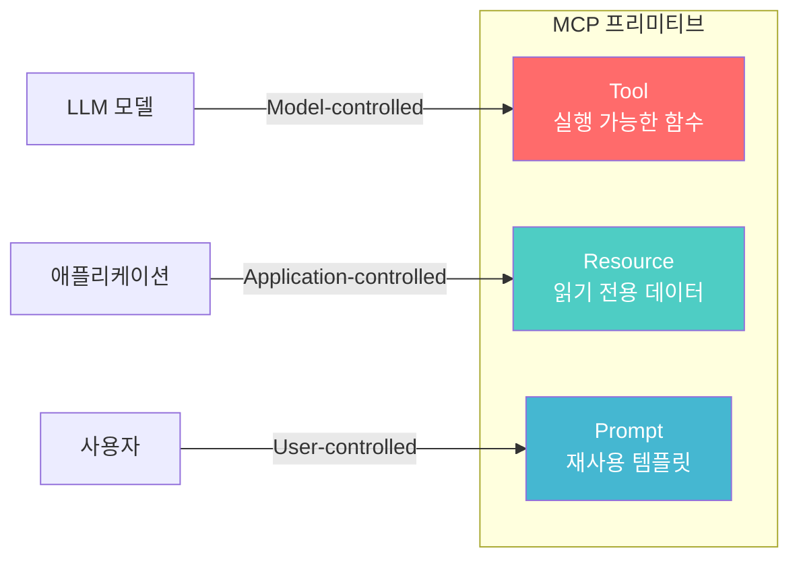
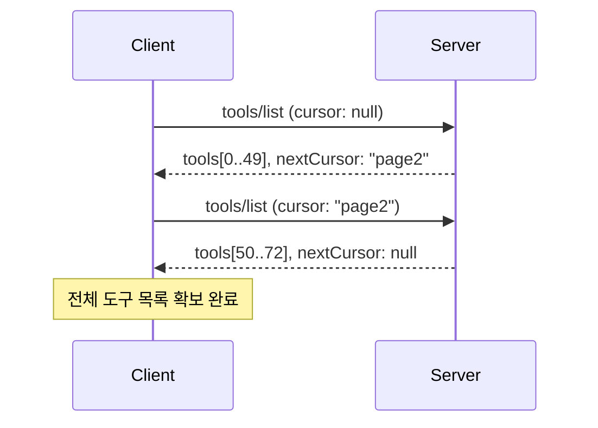
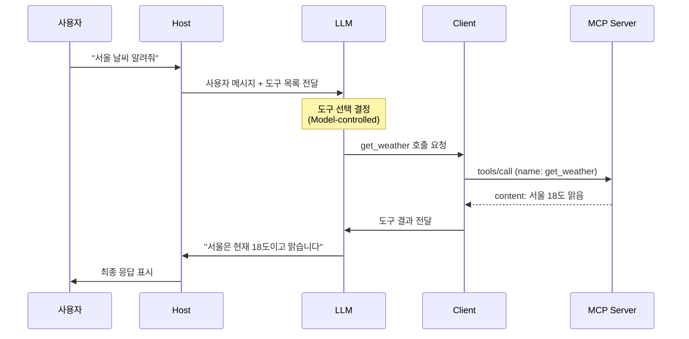
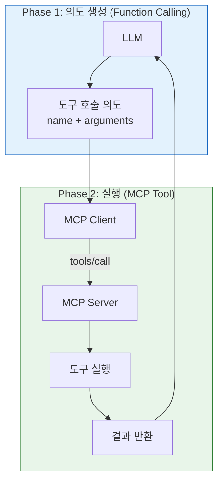
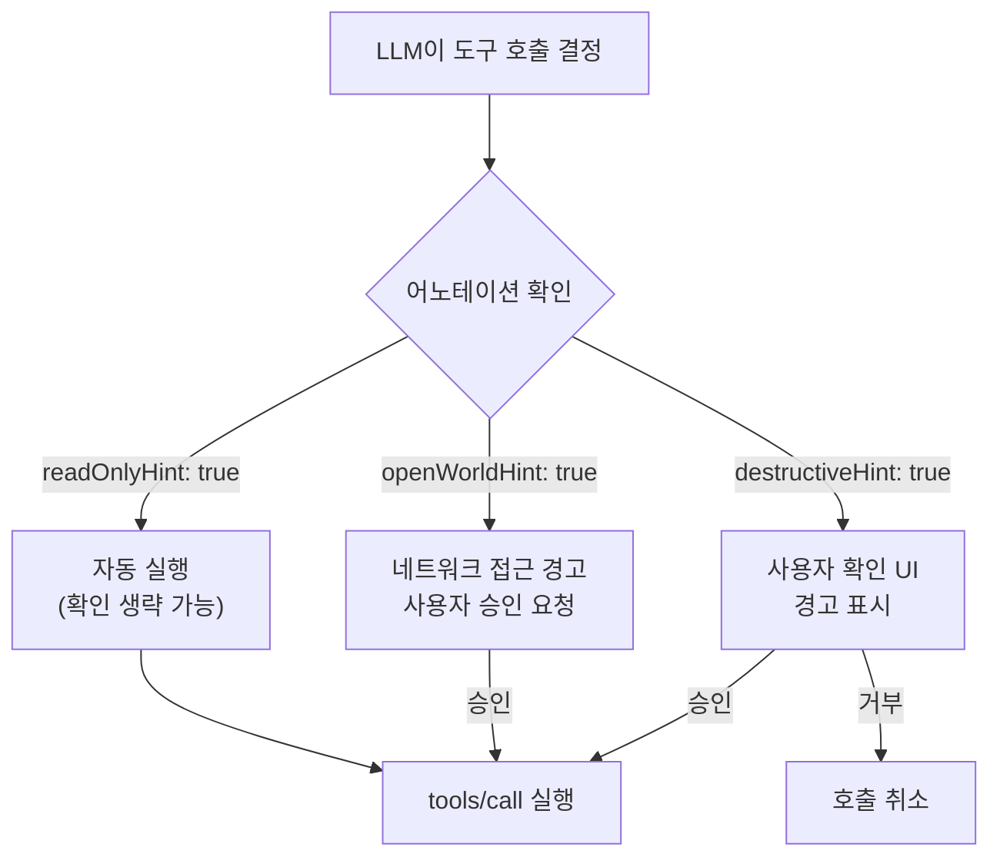

# Tool 프리미티브 이해

> MCP의 핵심 프리미티브인 Tool이 무엇이고, LLM이 어떻게 서버 측 함수를 발견하고 호출하는지 이해합니다.

## 개요

이 섹션에서는 MCP의 세 가지 프리미티브(Tools, Resources, Prompts) 중 가장 핵심인 **Tool**의 개념과 프로토콜 흐름을 다룹니다. Tool은 LLM이 외부 세계와 상호작용하는 "손"에 해당하는 프리미티브입니다.

**선수 지식**: [Host/Client/Server 3계층](02-ch2-mcp-아키텍처와-프로토콜-구조/01-01-hostclientserver-3계층.md)과 [JSON-RPC 2.0 메시지 포맷](02-ch2-mcp-아키텍처와-프로토콜-구조/04-04-json-rpc-20-메시지-포맷.md)을 이해하고 있어야 합니다. [Hello MCP 서버](03-ch3-개발-환경-설정과-첫-mcp-서버/02-02-hello-mcp-첫-번째-서버-만들기.md)를 만들어본 경험이 있으면 더욱 좋습니다.

**학습 목표**:
- Tool 프리미티브가 MCP 아키텍처에서 어떤 역할을 하는지 설명할 수 있다
- `tools/list`와 `tools/call` 프로토콜 메시지의 구조를 이해한다
- Tool과 LLM Function Calling의 관계와 차이를 명확히 구분할 수 있다
- Model-controlled 실행 흐름이 왜 중요한지 설명할 수 있다

## 왜 알아야 할까?

LLM은 아무리 똑똑해도 혼자서는 데이터베이스를 조회하거나, API를 호출하거나, 파일을 생성할 수 없습니다. 텍스트를 주고받는 것이 전부죠. 이 한계를 극복하기 위해 등장한 것이 바로 **Tool**입니다.

여러분이 만드는 MCP 서버의 대부분은 Tool을 노출하는 것이 핵심 목적입니다. Tool을 제대로 이해하면 "LLM에게 어떤 능력을 줄 것인가"를 설계할 수 있게 됩니다. 이 챕터의 나머지 섹션 — 스키마 자동 생성, 입력 검증, 에러 처리, 비동기 도구 — 모두 이 기초 위에 쌓이는 거죠.

## 핵심 개념

### 개념 1: Tool이란 무엇인가 — LLM의 "손"

> 💡 **비유**: Tool은 레스토랑의 **메뉴판과 주방**이라고 생각해보세요. 메뉴판(`tools/list`)에는 요리 이름, 설명, 필요한 재료(파라미터)가 적혀 있습니다. 손님(LLM)이 메뉴를 보고 주문(`tools/call`)하면, 주방(서버)이 요리를 만들어 결과를 내놓습니다. 손님은 주방에 직접 들어갈 필요 없이, 메뉴판만 보고 원하는 것을 주문할 수 있죠.

MCP 스펙에서 Tool은 다음과 같이 정의됩니다:

> **서버가 노출하고, LLM이 호출할 수 있는 실행 가능한 함수**

Tool의 핵심 속성은 **Model-controlled**라는 점입니다. 즉, 사람이 일일이 "이 도구를 써"라고 지시하는 게 아니라, LLM이 사용자의 요청을 이해하고 **스스로** 적절한 도구를 선택해서 호출합니다. 물론 보안을 위해 사람이 승인하는 단계가 있어야 하지만, 도구 선택의 주체는 모델이에요.

> 📊 **그림 1**: MCP의 세 가지 프리미티브와 제어 주체



이 세 가지 프리미티브의 제어 주체가 다르다는 점이 중요합니다. Tool은 LLM이 언제 호출할지 결정하고, Resource는 애플리케이션이 언제 읽을지 결정하며, Prompt는 사용자가 직접 선택합니다.

Tool 하나는 다음 정보를 포함합니다:

| 필드 | 설명 | 필수 |
|------|------|------|
| `name` | 도구의 고유 식별자 | O |
| `title` | 사람이 읽을 수 있는 표시 이름 | X |
| `description` | 기능 설명 (LLM이 도구 선택 시 참고) | O (권장) |
| `inputSchema` | 입력 파라미터의 JSON Schema | O |
| `outputSchema` | 출력 구조의 JSON Schema | X |
| `annotations` | 도구 행동 힌트 (읽기 전용, 파괴적 등) | X |

### 개념 2: tools/list — 도구 발견 프로토콜

> 💡 **비유**: 새 레스토랑에 가면 제일 먼저 메뉴판을 달라고 하죠? `tools/list`가 바로 그 "메뉴판 주세요"에 해당합니다. 클라이언트가 서버에 접속하면 가장 먼저 "어떤 도구가 있나요?"라고 묻는 겁니다.

클라이언트가 서버에 연결한 뒤, 사용 가능한 도구를 발견하려면 `tools/list` 요청을 보냅니다. JSON-RPC 2.0 형식을 따르죠:

```json
{
  "jsonrpc": "2.0",
  "id": 1,
  "method": "tools/list",
  "params": {
    "cursor": "optional-cursor-value"
  }
}
```

서버는 등록된 모든 도구 정보를 담아 응답합니다:

```json
{
  "jsonrpc": "2.0",
  "id": 1,
  "result": {
    "tools": [
      {
        "name": "get_weather",
        "title": "Weather Information Provider",
        "description": "Get current weather information for a location",
        "inputSchema": {
          "type": "object",
          "properties": {
            "location": {
              "type": "string",
              "description": "City name or zip code"
            }
          },
          "required": ["location"]
        }
      }
    ],
    "nextCursor": "next-page-cursor"
  }
}
```

여기서 눈여겨볼 점이 있습니다. `inputSchema`가 [JSON Schema](https://json-schema.org/) 표준을 따른다는 거예요. LLM은 이 스키마를 읽고 "아, 이 도구에는 `location`이라는 문자열 파라미터가 필수구나"라고 이해합니다. 도구가 많을 때는 `cursor` 기반 **페이지네이션**도 지원합니다.

> 📊 **그림 2**: tools/list 요청-응답 흐름



도구 목록은 세션 중 변경될 수 있습니다. 서버가 `listChanged` capability를 선언했다면, 도구가 추가·삭제될 때 `notifications/tools/list_changed` 알림을 보냅니다. 클라이언트는 이 알림을 받으면 `tools/list`를 다시 호출하여 목록을 갱신하죠.

### 개념 3: tools/call — 도구 실행 프로토콜

> 💡 **비유**: 메뉴를 골랐으면 이제 주문할 차례입니다. `tools/call`은 "이 요리를 이 재료로 만들어주세요"라는 주문서예요. 도구 이름과 인자(arguments)를 함께 보내면, 서버가 실행하고 결과를 돌려줍니다.

```json
{
  "jsonrpc": "2.0",
  "id": 2,
  "method": "tools/call",
  "params": {
    "name": "get_weather",
    "arguments": {
      "location": "Seoul"
    }
  }
}
```

서버의 응답은 `content` 배열에 하나 이상의 콘텐츠 블록을 담습니다:

```json
{
  "jsonrpc": "2.0",
  "id": 2,
  "result": {
    "content": [
      {
        "type": "text",
        "text": "서울 현재 날씨:\n온도: 18°C\n상태: 맑음"
      }
    ],
    "isError": false
  }
}
```

`content` 배열에는 다양한 타입이 들어갈 수 있습니다:

| content type | 용도 |
|-------------|------|
| `text` | 텍스트 결과 |
| `image` | Base64 인코딩 이미지 |
| `audio` | Base64 인코딩 오디오 |
| `resource_link` | 리소스 URI 참조 |
| `resource` | 임베디드 리소스 |

실행 중 에러가 발생하면 `isError: true`와 함께 에러 메시지가 `content`에 담깁니다. 프로토콜 레벨 에러(존재하지 않는 도구 호출 등)와 도구 실행 에러를 구분한다는 점도 기억해두세요.

> 📊 **그림 3**: Tool 실행의 전체 흐름 — Discovery부터 Invocation까지



이 시퀀스 다이어그램이 MCP Tool의 핵심 흐름입니다. 사용자는 자연어로 질문하고, LLM이 적절한 도구를 선택하고, Client가 Server에 실행을 요청하고, 결과가 다시 LLM을 거쳐 사용자에게 돌아갑니다.

### 개념 4: Tool vs Function Calling — 같은 듯 다른 관계

> 💡 **비유**: Function Calling이 각 레스토랑마다 다른 형식의 주문서(OpenAI식, Anthropic식...)라면, MCP Tool은 **만국 공통 주문 시스템**입니다. 어느 레스토랑에 가든 같은 양식으로 주문할 수 있죠.

MCP를 처음 접하면 "이거 OpenAI Function Calling이랑 뭐가 다르지?"라고 생각하기 쉬운데요, 핵심적인 차이가 있습니다.

**Function Calling**은 LLM이 "이 함수를 이 인자로 호출해달라"는 **의도(intent)**를 생성하는 메커니즘입니다. 실제 실행은 여러분의 애플리케이션 코드가 담당하죠. 그리고 각 LLM 제공자(OpenAI, Anthropic, Google)마다 스키마와 API가 다릅니다.

**MCP Tool**은 그 실행을 담당하는 **표준화된 프로토콜 계층**입니다. 어떤 LLM이 의도를 생성하든, MCP 호환 클라이언트라면 동일한 `tools/call` 메시지로 동일한 서버를 호출할 수 있습니다.

> 📊 **그림 4**: Function Calling과 MCP Tool의 관계



정리하면 이렇습니다:

| 비교 항목 | Function Calling | MCP Tool |
|-----------|-----------------|----------|
| **역할** | 의도 생성 (Phase 1) | 실행 (Phase 2) |
| **벤더 의존** | 제공자마다 다름 | 표준 프로토콜 |
| **도구 위치** | 앱 내부에 하드코딩 | 독립 서버로 분리 |
| **재사용** | 앱마다 재구현 | 한 번 만들면 어디서든 사용 |
| **동적 발견** | 불가 (코드에 고정) | `tools/list`로 런타임 발견 |

가장 큰 차이는 **재사용성**입니다. MCP Tool로 만든 날씨 서버는 Claude Desktop, VS Code Copilot, 커스텀 에이전트 어디서든 같은 프로토콜로 호출할 수 있습니다. Function Calling만 쓰면 각 앱마다 같은 로직을 다시 구현해야 하죠.

### 개념 5: Model-controlled 실행 흐름과 안전장치

Tool이 Model-controlled라는 것은 LLM이 **자율적으로** 도구를 선택한다는 뜻입니다. 하지만 이건 "LLM에게 모든 것을 맡긴다"는 의미가 아닙니다. MCP 스펙은 명확히 말합니다:

> **Trust & Safety를 위해, 도구 호출을 거부할 수 있는 human-in-the-loop가 반드시 있어야 합니다.**

서버는 도구에 **annotations**을 달아 행동 힌트를 줄 수 있습니다:

```json
{
  "name": "delete_user",
  "description": "사용자 계정을 영구 삭제합니다",
  "annotations": {
    "destructiveHint": true,
    "readOnlyHint": false,
    "idempotentHint": false,
    "openWorldHint": false
  }
}
```

| 어노테이션 | 의미 |
|-----------|------|
| `readOnlyHint` | 외부 상태를 변경하지 않음 |
| `destructiveHint` | 되돌릴 수 없는 작업을 수행 |
| `idempotentHint` | 같은 인자로 여러 번 호출해도 결과가 같음 |
| `openWorldHint` | 외부 시스템과 통신함 |

> ⚠️ **흔한 오해**: annotations은 클라이언트에 대한 **힌트**일 뿐, 강제 규칙이 아닙니다. MCP 스펙은 "annotations은 신뢰할 수 있는 서버에서 온 것이 아니면 신뢰하지 말라"고 명시합니다. 실제 보안은 클라이언트(Host)가 사용자에게 확인 UI를 보여주는 것으로 구현합니다.

> 📊 **그림 5**: Tool 어노테이션 기반 UI 분기 흐름



## 실습: 직접 해보기

MCP Python SDK(FastMCP)를 사용해 간단한 도구를 정의하고, 도구 목록을 확인해보겠습니다.

```python
# server.py — 날씨 정보 도구를 제공하는 MCP 서버
from fastmcp import FastMCP

# 서버 인스턴스 생성
mcp = FastMCP(name="WeatherServer")


# @mcp.tool 데코레이터로 도구 정의
# 함수명 → 도구 이름, docstring → 설명, 타입 힌트 → inputSchema
@mcp.tool
def get_weather(location: str, unit: str = "celsius") -> str:
    """지정된 위치의 현재 날씨 정보를 반환합니다.

    Args:
        location: 도시 이름 또는 우편번호
        unit: 온도 단위 (celsius 또는 fahrenheit)
    """
    # 실제로는 외부 API를 호출하겠지만, 여기서는 더미 데이터 반환
    weather_data = {
        "Seoul": {"temp": 18, "condition": "맑음"},
        "Tokyo": {"temp": 22, "condition": "흐림"},
        "New York": {"temp": 15, "condition": "비"},
    }

    data = weather_data.get(location, {"temp": 20, "condition": "알 수 없음"})

    if unit == "fahrenheit":
        data["temp"] = round(data["temp"] * 9 / 5 + 32)
        unit_symbol = "°F"
    else:
        unit_symbol = "°C"

    return f"{location}: {data['temp']}{unit_symbol}, {data['condition']}"


@mcp.tool(
    annotations={
        "readOnlyHint": True,       # 읽기 전용 — 상태 변경 없음
        "openWorldHint": False,     # 외부 통신 없음
    }
)
def list_supported_cities() -> str:
    """지원하는 도시 목록을 반환합니다."""
    cities = ["Seoul", "Tokyo", "New York"]
    return ", ".join(cities)


if __name__ == "__main__":
    mcp.run()  # stdio Transport로 서버 실행
```

이 서버가 내부적으로 어떤 JSON-RPC 메시지를 주고받는지 확인해봅시다. MCP Inspector나 Python 클라이언트로 `tools/list`를 호출하면 다음과 같은 응답을 받습니다:

```run:python
# tools_list_demo.py — 서버의 도구 목록이 어떻게 보이는지 시뮬레이션
import json

# FastMCP가 자동 생성하는 tools/list 응답 구조
tools_response = {
    "tools": [
        {
            "name": "get_weather",
            "description": "지정된 위치의 현재 날씨 정보를 반환합니다.",
            "inputSchema": {
                "type": "object",
                "properties": {
                    "location": {
                        "type": "string",
                        "description": "도시 이름 또는 우편번호"
                    },
                    "unit": {
                        "type": "string",
                        "description": "온도 단위 (celsius 또는 fahrenheit)",
                        "default": "celsius"
                    }
                },
                "required": ["location"]
            },
            "annotations": {}
        },
        {
            "name": "list_supported_cities",
            "description": "지원하는 도시 목록을 반환합니다.",
            "inputSchema": {
                "type": "object",
                "properties": {},
                "required": []
            },
            "annotations": {
                "readOnlyHint": True,
                "openWorldHint": False
            }
        }
    ]
}

print("=== tools/list 응답 ===")
print(json.dumps(tools_response, indent=2, ensure_ascii=False))
print(f"\n등록된 도구 수: {len(tools_response['tools'])}")
for tool in tools_response["tools"]:
    required = tool["inputSchema"].get("required", [])
    print(f"  - {tool['name']}: 필수 파라미터 {required}")
```

```output
=== tools/list 응답 ===
{
  "tools": [
    {
      "name": "get_weather",
      "description": "지정된 위치의 현재 날씨 정보를 반환합니다.",
      "inputSchema": {
        "type": "object",
        "properties": {
          "location": {
            "type": "string",
            "description": "도시 이름 또는 우편번호"
          },
          "unit": {
            "type": "string",
            "description": "온도 단위 (celsius 또는 fahrenheit)",
            "default": "celsius"
          }
        },
        "required": [
          "location"
        ]
      },
      "annotations": {}
    },
    {
      "name": "list_supported_cities",
      "description": "지원하는 도시 목록을 반환합니다.",
      "inputSchema": {
        "type": "object",
        "properties": {},
        "required": []
      },
      "annotations": {
        "readOnlyHint": true,
        "openWorldHint": false
      }
    }
  ]
}

등록된 도구 수: 2
  - get_weather: 필수 파라미터 ['location']
  - list_supported_cities: 필수 파라미터 []
```

핵심을 보셨나요? `@mcp.tool` 데코레이터 하나만 붙이면, FastMCP가 함수의 타입 힌트와 docstring에서 `name`, `description`, `inputSchema`를 **자동으로** 생성합니다. 이 자동 생성 메커니즘은 [다음 섹션](04-ch4-tools-함수-호출-프리미티브/02-02-도구-정의와-스키마-자동-생성.md)에서 깊이 다룹니다.

## 더 깊이 알아보기

### MCP의 탄생과 Tool 프리미티브의 설계 결정

MCP가 처음 공개된 것은 2024년 11월, Anthropic의 블로그 포스트를 통해서였습니다. 당시 AI 도구 연동의 가장 큰 문제는 **N×M 통합 문제**였어요. LLM 제공자 N개와 외부 도구 M개가 있으면, N×M개의 커스텀 통합을 만들어야 했죠.

Anthropic 엔지니어들은 이 문제를 USB-C에서 영감을 받아 풀었습니다. USB-C가 수십 가지 커넥터를 하나로 통일한 것처럼, MCP는 LLM-도구 연결을 하나의 프로토콜로 통일하자는 아이디어였죠. 이 이야기는 [MCP: AI의 USB-C](01-ch1-mcp의-탄생과-설계-철학/02-02-mcp-ai의-usb-c.md)에서 자세히 다뤘습니다.

Tool을 "Model-controlled"로 설계한 것도 의미심장한 결정이었습니다. 초기에는 사용자가 직접 도구를 선택하는 방식도 검토되었지만, 에이전트 워크플로에서 LLM이 자율적으로 도구를 조합해야 하는 시나리오가 더 중요하다고 판단한 거죠. 대신 MCP 스펙은 **Language Server Protocol(LSP)**에서 영감을 받아, IDE가 언어 서버의 기능을 동적으로 발견하는 것처럼 LLM이 도구를 런타임에 발견하는 구조를 채택했습니다.

> 💡 **알고 계셨나요?**: MCP 스펙의 첫 번째 revision은 2024-11-05이었고, 1년 뒤인 2025-11-25에 대규모 업데이트가 이루어졌습니다. 이 업데이트에서 Tool `annotations`(행동 힌트), `outputSchema`(구조화된 출력), `title`(표시 이름) 등이 추가되었습니다. 프로토콜이 불과 1년 만에 얼마나 빠르게 성숙했는지 보여주는 사례죠.

## 흔한 오해와 팁

> ⚠️ **흔한 오해**: "MCP Tool은 Function Calling을 대체한다" — 아닙니다! MCP Tool과 Function Calling은 **보완 관계**입니다. Function Calling은 LLM이 "이 도구를 써야겠다"는 의도를 생성하는 메커니즘이고, MCP Tool은 그 의도를 표준화된 방식으로 실행하는 프로토콜입니다. Claude, GPT, Gemini 모두 자체 Function Calling으로 MCP Tool 호출 의도를 생성할 수 있습니다.

> 🔥 **실무 팁**: Tool의 `description`은 LLM이 도구를 선택할 때 가장 중요하게 참고하는 정보입니다. "날씨 조회"보다 "지정된 도시의 현재 기온, 습도, 날씨 상태를 반환합니다"처럼 구체적으로 작성하세요. 설명이 모호하면 LLM이 엉뚱한 도구를 선택하거나, 적절한 도구가 있는데도 선택하지 않을 수 있습니다.

> 💡 **알고 계셨나요?**: MCP는 이제 Anthropic만의 프로토콜이 아닙니다. OpenAI Agents SDK, Google의 ADK, Microsoft Copilot Studio 등 주요 AI 플랫폼이 MCP를 지원합니다. 한 번 만든 MCP Tool 서버가 이 모든 플랫폼에서 작동한다는 뜻이죠.

## 핵심 정리

| 개념 | 설명 |
|------|------|
| Tool | 서버가 노출하고 LLM이 호출하는 실행 가능한 함수 |
| Model-controlled | LLM이 자율적으로 도구 선택 (human-in-the-loop 필수) |
| `tools/list` | 클라이언트가 서버의 사용 가능한 도구 목록을 조회하는 JSON-RPC 메서드 |
| `tools/call` | 도구 이름과 인자를 보내 실행을 요청하는 JSON-RPC 메서드 |
| `inputSchema` | JSON Schema로 도구의 입력 파라미터를 정의 |
| `annotations` | 도구의 행동 힌트 (readOnly, destructive, idempotent, openWorld) |
| Tool vs Function Calling | Function Calling은 의도 생성, MCP Tool은 표준화된 실행 계층 |
| `notifications/tools/list_changed` | 도구 목록 변경 시 서버가 클라이언트에 보내는 알림 |

## 다음 섹션 미리보기

이번 섹션에서 Tool의 개념과 프로토콜 흐름을 이해했습니다. 그런데 `inputSchema`는 누가 어떻게 만드는 걸까요? 다음 섹션 [도구 정의와 스키마 자동 생성](04-ch4-tools-함수-호출-프리미티브/02-02-도구-정의와-스키마-자동-생성.md)에서는 `@mcp.tool` 데코레이터가 Python 타입 힌트와 docstring에서 JSON Schema를 자동으로 생성하는 마법의 내부 동작을 파헤칩니다. 직접 커스텀 스키마를 지정하는 방법도 다룹니다.

## 참고 자료

- [MCP Tools Specification (2025-06-18)](https://modelcontextprotocol.io/specification/2025-06-18/server/tools) - Tool 프리미티브의 공식 프로토콜 스펙. tools/list, tools/call, 에러 처리, 보안 등 모든 것이 여기에
- [MCP Specification Overview (2025-11-25)](https://modelcontextprotocol.io/specification/2025-11-25) - MCP 전체 프로토콜의 최신 스펙. Tool, Resource, Prompt의 관계와 아키텍처 개요
- [FastMCP Tools Documentation](https://gofastmcp.com/servers/tools) - Python FastMCP에서 도구를 정의하는 모든 방법. 데코레이터, 타입 힌트, 어노테이션, Context 활용
- [Introducing the Model Context Protocol — Anthropic Blog](https://www.anthropic.com/news/model-context-protocol) - MCP의 탄생 배경과 설계 철학을 소개하는 Anthropic 공식 블로그
- [MCP vs Function Calling: How They Differ and Which to Use](https://www.descope.com/blog/post/mcp-vs-function-calling) - Tool과 Function Calling의 차이를 상세하게 비교 분석
- [Python MCP Server: Connect LLMs to Your Data — Real Python](https://realpython.com/python-mcp/) - Python으로 MCP 서버를 만드는 실전 튜토리얼