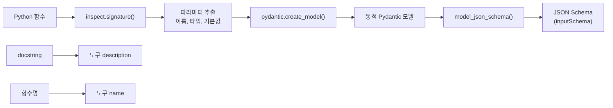
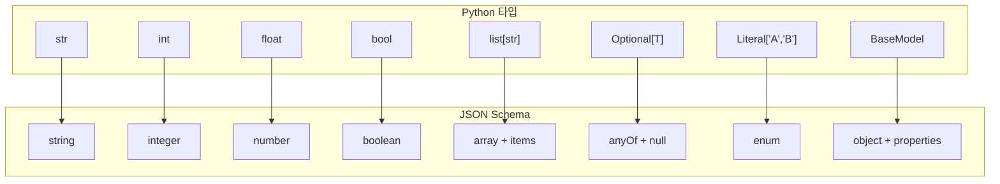
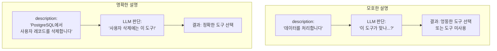
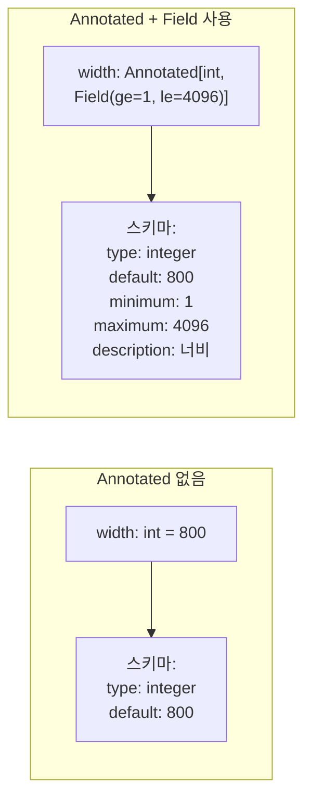
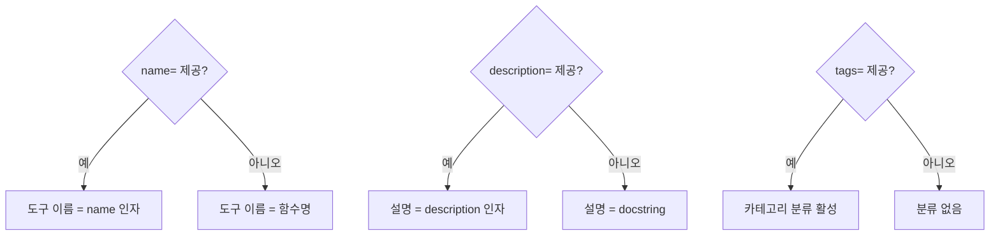
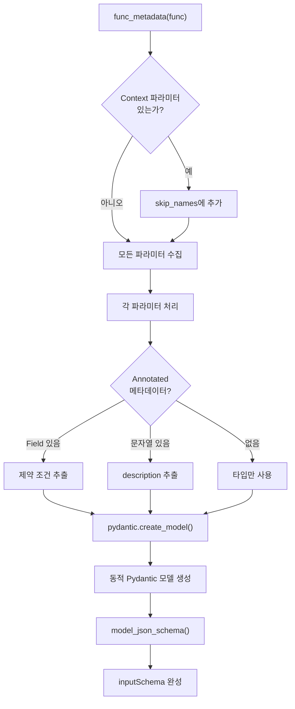

# 도구 정의와 스키마 자동 생성

> `@mcp.tool()` 데코레이터가 Python 함수를 MCP 도구로 변환하고, 타입 힌트에서 JSON Schema를 자동 생성하는 원리를 마스터합니다.

## 개요

이 섹션에서는 MCP 도구의 **정의 메커니즘**을 깊이 파고듭니다. [이전 섹션](04-ch4-tools-함수-호출-프리미티브/01-01-tool-프리미티브-이해.md)에서 Tool 프리미티브의 개념과 프로토콜 흐름을 배웠죠. 이번에는 관점을 바꿔, **서버 개발자**로서 도구를 어떻게 정의하는지 — `@mcp.tool()` 데코레이터 한 줄이 내부적으로 어떤 변환을 수행하는지 낱낱이 살펴봅니다.

**선수 지식**: [Tool 프리미티브 이해](04-ch4-tools-함수-호출-프리미티브/01-01-tool-프리미티브-이해.md)에서 배운 `inputSchema` 개념과 도구 호출 흐름

**학습 목표**:
- `@mcp.tool()` 데코레이터의 동작 원리와 옵션을 이해한다
- Python 타입 힌트가 JSON Schema로 변환되는 매핑 규칙을 파악한다
- docstring과 `Annotated`를 활용해 LLM이 도구를 정확히 이해하도록 설명을 작성할 수 있다
- `name`, `description`, `tags` 등 도구 메타데이터를 커스터마이징할 수 있다

## 왜 알아야 할까?

MCP 도구를 만드는 건 간단합니다 — `@mcp.tool()` 붙이고 함수 하나 쓰면 끝이니까요. 하지만 여기서 끝이라면 이 섹션이 필요 없겠죠?

문제는 **LLM이 당신의 도구를 제대로 이해하느냐**에 있습니다. 도구의 `inputSchema`가 부정확하면 LLM은 잘못된 인자를 보내고, 설명이 모호하면 엉뚱한 도구를 선택합니다. 실무에서 "도구가 있는데 LLM이 안 쓴다"는 문제의 80%는 **스키마와 설명이 부실해서**입니다.

`@mcp.tool()` 데코레이터는 단순한 등록기가 아닙니다. Python 함수의 시그니처, 타입 힌트, docstring, 기본값을 전부 분석해서 LLM이 읽을 JSON Schema를 자동 생성하는 **정교한 변환 엔진**입니다. 이 엔진의 동작 원리를 알아야 의도한 대로 스키마를 만들 수 있고, 결국 LLM이 도구를 정확하게 호출하게 됩니다.

## 핵심 개념

### 개념 1: 데코레이터의 마법 — 함수에서 도구로

> 💡 **비유**: API 문서 자동생성기를 떠올려보세요. Swagger(OpenAPI)가 코드의 어노테이션을 분석해서 API 명세서를 자동으로 만들어주듯, `@mcp.tool()` 데코레이터는 Python 함수의 시그니처와 타입 힌트를 분석해서 LLM이 읽을 수 있는 JSON Schema 명세서를 자동으로 만들어줍니다. 개발자가 코드를 한 번 작성하면, 문서(스키마)가 저절로 따라오는 거죠.

`@mcp.tool()` 데코레이터는 일반 Python 함수를 MCP 서버가 관리하는 도구 레지스트리에 등록합니다. 등록 시점에 함수의 모든 메타데이터가 추출되어 스키마로 변환되는데, 이 과정은 **서버 시작 시 한 번만** 수행됩니다.

> 📊 **그림 1**: `@mcp.tool()` 데코레이터의 변환 파이프라인



가장 기본적인 형태부터 보겠습니다:

```python
from mcp.server.fastmcp import FastMCP

mcp = FastMCP("demo")

@mcp.tool()
def add(a: int, b: int) -> int:
    """두 정수를 더합니다."""
    return a + b
```

이 세 줄의 데코레이터 + 함수가 내부적으로 만들어내는 도구 스키마는 이렇습니다:

```json
{
  "name": "add",
  "description": "두 정수를 더합니다.",
  "inputSchema": {
    "type": "object",
    "properties": {
      "a": {"type": "integer"},
      "b": {"type": "integer"}
    },
    "required": ["a", "b"]
  }
}
```

함수명이 도구 이름으로, docstring이 설명으로, 타입 힌트가 스키마로 자동 변환됐습니다. Swagger가 `@api.route()`에서 API 문서를 뽑아내듯, MCP SDK는 `@mcp.tool()`에서 도구 스키마를 뽑아내는 겁니다.

여기서 중요한 규칙 하나 — **`@mcp.tool()`에서 괄호`()`를 반드시 붙여야** 합니다. `@mcp.tool`처럼 괄호 없이 쓰면 `TypeError`가 발생하거든요.

### 개념 2: 타입 힌트 → JSON Schema 매핑 규칙

> 💡 **비유**: 타입 힌트는 택배 송장의 "내용물 표시"와 같습니다. "깨지기 쉬운 물건"(fragile)이라고 적혀 있으면 택배 기사가 조심히 다루듯, `int`라고 적혀 있으면 LLM이 정수를 보내줍니다. 표시가 없으면? 택배 기사가 알아서 판단해야 하고, 종종 실수하죠.

Python 타입 힌트는 일대일로 JSON Schema 타입에 대응합니다. 이 매핑 테이블은 MCP 도구를 설계할 때 항상 참조하게 될 핵심 레퍼런스입니다.

> 📊 **그림 2**: Python 타입에서 JSON Schema로의 매핑



각 매핑을 코드로 확인해볼까요?

```run:python
# 타입 매핑 시뮬레이션 — 실제 SDK 내부에서 일어나는 변환
type_mapping = {
    "str": '{"type": "string"}',
    "int": '{"type": "integer"}',
    "float": '{"type": "number"}',
    "bool": '{"type": "boolean"}',
    "list[str]": '{"type": "array", "items": {"type": "string"}}',
    "dict[str, int]": '{"type": "object", "additionalProperties": {"type": "integer"}}',
    "Optional[str]": '{"anyOf": [{"type": "string"}, {"type": "null"}]}',
    'Literal["csv", "json"]': '{"enum": ["csv", "json"]}',
}

for python_type, json_schema in type_mapping.items():
    print(f"{python_type:25s} → {json_schema}")
```

```output
str                       → {"type": "string"}
int                       → {"type": "integer"}
float                     → {"type": "number"}
bool                      → {"type": "boolean"}
list[str]                 → {"type": "array", "items": {"type": "string"}}
dict[str, int]            → {"type": "object", "additionalProperties": {"type": "integer"}}
Optional[str]             → {"anyOf": [{"type": "string"}, {"type": "null"}]}
Literal["csv", "json"]    → {"enum": ["csv", "json"]}
```

**필수 vs 선택 파라미터**: Python의 기본값 규칙이 그대로 적용됩니다.

```python
@mcp.tool()
def search(
    query: str,                    # 기본값 없음 → required
    max_results: int = 10,         # 기본값 있음 → optional
    category: str | None = None    # None 기본값 → optional, nullable
) -> list[dict]:
    """제품을 검색합니다."""
    ...
```

생성되는 `inputSchema`:
```json
{
  "type": "object",
  "properties": {
    "query": {"type": "string"},
    "max_results": {"type": "integer", "default": 10},
    "category": {"anyOf": [{"type": "string"}, {"type": "null"}], "default": null}
  },
  "required": ["query"]
}
```

`required` 배열에는 `query`만 들어가고, 나머지는 빠져 있죠. **기본값이 있으면 선택, 없으면 필수** — 단순하지만 강력한 규칙입니다.

> ⚠️ **흔한 오해**: `*args`나 `**kwargs`를 사용할 수 있다고 생각하는 분이 계시는데, MCP 도구에서는 **지원되지 않습니다**. 모든 파라미터는 명시적으로 이름과 타입을 선언해야 합니다. JSON Schema에는 "아무 인자나 받는다"는 개념이 없으니까요.

### 개념 3: docstring — LLM이 읽는 사용 설명서

> 💡 **비유**: API 문서를 읽어본 적 있으시죠? 설명이 "데이터를 처리합니다"라고만 적혀 있으면 어떤 데이터를 어떻게 처리하는지 알 수 없습니다. LLM도 마찬가지예요. docstring이 곧 LLM에게 보여주는 API 문서입니다.

`@mcp.tool()` 데코레이터는 함수의 docstring을 도구 설명(`description`)으로 사용합니다. 이 설명은 LLM이 "이 도구를 사용할지 말지"를 판단하는 **가장 중요한 정보**입니다.

그렇다면 LLM의 도구 선택 품질은 어디에서 결정될까요? 바로 **스키마 품질**입니다. 같은 기능이라도 설명이 다르면 LLM의 선택이 달라집니다.

> 📊 **그림 3**: docstring 품질에 따른 LLM 도구 선택 정확도 차이



좋은 docstring과 나쁜 docstring을 비교해보겠습니다:

```python
# ❌ 나쁜 예: LLM이 언제 이 도구를 써야 할지 알 수 없음
@mcp.tool()
def process(data: str) -> str:
    """데이터를 처리합니다."""
    ...

# ✅ 좋은 예: 용도, 입력, 출력이 명확함
@mcp.tool()
def translate_text(
    text: str,
    target_lang: str,
    source_lang: str = "auto"
) -> str:
    """텍스트를 지정된 언어로 번역합니다.
    
    Google Translate API를 사용하며, 100자 이상의 텍스트에 적합합니다.
    source_lang을 생략하면 원문 언어를 자동 감지합니다.
    지원 언어: ko, en, ja, zh, es, fr, de 등.
    """
    ...
```

docstring 작성 시 기억할 세 가지:

1. **첫 줄에 핵심 기능** — LLM은 첫 줄을 가장 중요하게 봅니다
2. **입력 조건 명시** — 어떤 값이 유효한지 (범위, 포맷, 지원 옵션)
3. **결과 설명** — 무엇을 반환하는지, 어떤 부작용이 있는지

### 개념 4: Annotated로 파라미터 설명 추가하기

docstring이 도구 전체의 설명이라면, `Annotated`는 **개별 파라미터의 설명**입니다. 이것 없이는 LLM이 `query`라는 파라미터에 뭘 넣어야 하는지 이름만 보고 추측해야 합니다.

두 가지 방식이 있습니다.

**방식 A: 문자열 약식 설명**

```python
from typing import Annotated

@mcp.tool()
def search_products(
    query: Annotated[str, "검색할 제품명 또는 키워드"],
    max_results: Annotated[int, "반환할 최대 결과 수"] = 10
) -> list[dict]:
    """제품 카탈로그를 검색합니다."""
    ...
```

**방식 B: Pydantic `Field`로 제약 조건 추가**

```python
from typing import Annotated
from pydantic import Field

@mcp.tool()
def resize_image(
    url: Annotated[str, Field(description="이미지 URL (https:// 형식)")],
    width: Annotated[int, Field(description="너비 (픽셀)", ge=1, le=4096)] = 800,
    format: Annotated[
        str, 
        Field(description="출력 포맷", pattern="^(jpeg|png|webp)$")
    ] = "jpeg"
) -> dict:
    """이미지를 지정된 크기로 리사이즈합니다."""
    ...
```

`Field`를 사용하면 `description` 외에도 `ge`(이상), `le`(이하), `min_length`, `max_length`, `pattern`(정규식) 같은 **검증 규칙**을 스키마에 포함시킬 수 있습니다. 이 제약 조건들은 JSON Schema에 그대로 반영되어 LLM이 유효한 값을 보내도록 유도하죠.

> 📊 **그림 4**: Annotated 없이 vs 있을 때 생성되는 스키마 비교



### 개념 5: name, description, tags 커스터마이징

함수명이 곧 도구 이름이 되는 게 기본이지만, 내부 함수명과 LLM에 노출할 이름을 분리하고 싶을 때가 있습니다. `@mcp.tool()`의 `name`과 `description` 인자로 오버라이드할 수 있습니다.

```python
@mcp.tool(
    name="find_products",
    description="제품 카탈로그에서 조건에 맞는 제품을 검색합니다. "
                "가격 범위, 카테고리, 브랜드로 필터링 가능합니다."
)
def _internal_product_search(
    query: Annotated[str, "검색 키워드"],
    category: Annotated[str | None, "제품 카테고리"] = None,
    min_price: Annotated[float | None, "최소 가격 (원)"] = None,
    max_price: Annotated[float | None, "최대 가격 (원)"] = None,
) -> list[dict]:
    """내부 구현용 docstring — description이 제공되면 무시됩니다."""
    ...
```

이렇게 하면 LLM은 `find_products`라는 이름과 커스텀 설명을 보게 되고, 코드 내부에서는 `_internal_product_search`라는 이름으로 관리할 수 있습니다.

> 📊 **그림 5**: 데코레이터 인자에 따른 메타데이터 우선순위



`tags` 파라미터로 도구를 분류할 수도 있습니다:

```python
@mcp.tool(tags={"database", "read"})
def get_user(user_id: str) -> dict:
    """사용자 정보를 조회합니다."""
    ...

@mcp.tool(tags={"database", "write"})
def update_user(user_id: str, name: str) -> dict:
    """사용자 이름을 변경합니다."""
    ...
```

태그를 사용하면 MCP 클라이언트가 도구를 카테고리별로 필터링할 수 있어서, 수십 개의 도구가 있는 서버에서 유용합니다.

### 개념 6: Enum과 Literal — 선택지 제한하기

LLM에게 "아무 문자열이나 보내라"고 하면 예상치 못한 값이 올 수 있습니다. `Enum`이나 `Literal`로 선택지를 제한하면 LLM이 유효한 값만 보내도록 유도할 수 있죠.

```python
from enum import Enum
from typing import Literal, Annotated
from pydantic import Field

# 방법 1: Enum 클래스
class SortOrder(str, Enum):
    ascending = "asc"
    descending = "desc"
    relevance = "relevance"

@mcp.tool()
def search_documents(
    query: str,
    sort: SortOrder = SortOrder.relevance
) -> list[dict]:
    """문서를 검색하고 정렬합니다."""
    ...

# 방법 2: Literal 타입
@mcp.tool()
def export_data(
    format: Annotated[
        Literal["csv", "json", "parquet"],
        Field(description="출력 파일 포맷")
    ] = "json"
) -> str:
    """데이터를 파일로 내보냅니다."""
    ...
```

Enum을 사용할 때 한 가지 주의할 점이 있습니다. LLM은 Enum의 **name**(`ascending`)이 아니라 **value**(`"asc"`)를 보내야 합니다. 그래서 `str, Enum`을 상속받아 값이 문자열이 되도록 하는 게 안전합니다.

## 실습: 직접 해보기

이제 배운 내용을 모두 적용해서, 파라미터 설명과 제약 조건이 풍부한 도서 관리 도구 서버를 만들어보겠습니다.

```python
# book_tools.py — 도서 관리 MCP 서버
from typing import Annotated, Literal
from enum import Enum
from pydantic import BaseModel, Field
from mcp.server.fastmcp import FastMCP

mcp = FastMCP("book-manager")


# --- Enum 정의 ---
class Genre(str, Enum):
    fiction = "fiction"
    non_fiction = "non-fiction"
    science = "science"
    history = "history"
    technology = "technology"


# --- Pydantic 모델 정의 ---
class BookCreate(BaseModel):
    """새 도서 등록 요청"""
    title: str = Field(description="도서 제목")
    author: str = Field(description="저자 이름")
    genre: Genre = Field(description="장르 분류")
    year: int = Field(description="출판 연도", ge=1450, le=2030)
    isbn: str | None = Field(default=None, description="ISBN-13 코드")


# --- 도구 정의 ---
# 1. 기본 도구: 함수명/docstring 자동 사용
@mcp.tool()
def list_books(
    genre: Annotated[Genre | None, "장르로 필터링"] = None,
    limit: Annotated[int, Field(description="최대 반환 수", ge=1, le=100)] = 20
) -> list[dict]:
    """등록된 도서 목록을 조회합니다.
    
    장르별 필터링이 가능하며, 최대 100권까지 반환합니다.
    결과는 등록일 기준 최신순으로 정렬됩니다.
    """
    # 실제 구현에서는 DB 조회
    return [{"title": "예제 도서", "genre": genre or "all", "limit": limit}]


# 2. 커스텀 이름/설명 도구
@mcp.tool(
    name="find_book",
    description="제목, 저자, ISBN으로 특정 도서를 검색합니다. "
                "부분 일치 검색을 지원합니다.",
    tags={"books", "search"}
)
def _search_book_internal(
    query: Annotated[str, Field(description="검색어 (제목/저자/ISBN)", min_length=2)],
    search_in: Annotated[
        Literal["title", "author", "isbn", "all"],
        Field(description="검색 대상 필드")
    ] = "all"
) -> list[dict]:
    """내부 구현 — description 인자가 우선합니다."""
    return [{"query": query, "field": search_in}]


# 3. Pydantic 모델을 파라미터로 받는 도구
@mcp.tool(tags={"books", "write"})
def add_book(book: BookCreate) -> dict:
    """새 도서를 컬렉션에 등록합니다.
    
    같은 ISBN의 도서가 이미 존재하면 에러를 반환합니다.
    """
    return {
        "status": "created",
        "title": book.title,
        "author": book.author,
        "genre": book.genre.value
    }


# 4. 여러 Annotated 제약 조건이 있는 도구
@mcp.tool(tags={"books", "analytics"})
def get_statistics(
    genre: Annotated[Genre | None, "특정 장르의 통계만 조회"] = None,
    year_from: Annotated[int | None, Field(description="시작 연도", ge=1900)] = None,
    year_to: Annotated[int | None, Field(description="종료 연도", le=2030)] = None,
    include_details: Annotated[bool, "상세 통계 포함 여부"] = False
) -> dict:
    """도서 컬렉션의 통계를 반환합니다.
    
    전체 또는 특정 장르/연도 범위의 도서 수, 저자 수,
    장르 분포 등의 통계 정보를 제공합니다.
    """
    return {
        "total_books": 142,
        "genre_filter": genre.value if genre else "all",
        "period": f"{year_from or '전체'}-{year_to or '현재'}"
    }


if __name__ == "__main__":
    mcp.run()
```

이 서버를 MCP Inspector로 테스트하면, 각 도구의 스키마가 어떻게 생성되었는지 확인할 수 있습니다:

```run:python
# 생성될 스키마를 시뮬레이션으로 확인
import json

schemas = {
    "list_books": {
        "name": "list_books",
        "description": "등록된 도서 목록을 조회합니다.\n\n"
                       "장르별 필터링이 가능하며, 최대 100권까지 반환합니다.\n"
                       "결과는 등록일 기준 최신순으로 정렬됩니다.",
        "inputSchema": {
            "type": "object",
            "properties": {
                "genre": {
                    "anyOf": [
                        {"enum": ["fiction", "non-fiction", "science", "history", "technology"]},
                        {"type": "null"}
                    ],
                    "description": "장르로 필터링",
                    "default": None
                },
                "limit": {
                    "type": "integer",
                    "description": "최대 반환 수",
                    "minimum": 1,
                    "maximum": 100,
                    "default": 20
                }
            },
            "required": []
        }
    },
    "find_book": {
        "name": "find_book",
        "description": "제목, 저자, ISBN으로 특정 도서를 검색합니다. "
                       "부분 일치 검색을 지원합니다.",
        "inputSchema": {
            "type": "object",
            "properties": {
                "query": {
                    "type": "string",
                    "description": "검색어 (제목/저자/ISBN)",
                    "minLength": 2
                },
                "search_in": {
                    "enum": ["title", "author", "isbn", "all"],
                    "description": "검색 대상 필드",
                    "default": "all"
                }
            },
            "required": ["query"]
        }
    }
}

for name, schema in schemas.items():
    print(f"=== {name} ===")
    print(f"Description: {schema['description'][:50]}...")
    print(f"Required: {schema['inputSchema']['required']}")
    print(f"Properties: {list(schema['inputSchema']['properties'].keys())}")
    print()
```

```output
=== list_books ===
Description: 등록된 도서 목록을 조회합니다.

장르별 필터링이 가능하며, 최대 100...
Required: []
Properties: ['genre', 'limit']

=== find_book ===
Description: 제목, 저자, ISBN으로 특정 도서를 검색합니다. 부분 일치 검색을 지...
Required: ['query']
Properties: ['query', 'search_in']
```

서버를 실행하고 Inspector로 확인하려면:

```console
$ mcp dev book_tools.py
```

Inspector에서 각 도구를 클릭하면 스키마 전체를 JSON으로 확인할 수 있습니다. `genre`에 Enum 값 목록이, `limit`에 `minimum`/`maximum` 제약이, `query`에 `minLength`가 반영된 것을 볼 수 있죠.

## 더 깊이 알아보기

### SDK 내부 동작: func_metadata() 파이프라인

> 💡 **참고**: 이 섹션은 SDK의 내부 구현을 설명합니다. 도구를 만들고 사용하는 데 꼭 필요한 지식은 아니지만, 디버깅이나 고급 커스터마이징 시 유용합니다.

`@mcp.tool()` 데코레이터가 호출하는 핵심 함수는 Python SDK의 `func_metadata()` 유틸리티입니다 (`mcp/server/fastmcp/utilities/func_metadata.py`에 위치). 이 함수는 `inspect.signature()`로 파라미터를 추출한 뒤, `pydantic.create_model()`로 동적 Pydantic 모델(내부적으로 `ArgModelBase`의 서브클래스)을 생성합니다. 최종적으로 이 모델의 `model_json_schema()`를 호출하면 `inputSchema`가 완성되는 거죠.

> 📊 **그림 6**: SDK 내부 스키마 생성 흐름



특히 주목할 부분은 `Context` 타입의 처리입니다. [비동기 도구와 Context 활용](04-ch4-tools-함수-호출-프리미티브/05-05-비동기-도구와-context-활용.md)에서 자세히 다루겠지만, `Context` 타입 파라미터는 `skip_names`에 추가되어 **inputSchema에서 완전히 제외**됩니다. 런타임에 서버가 자동으로 주입하기 때문에 LLM이 알 필요가 없는 거죠.

### JSON Schema 자동 생성의 역사

JSON Schema 자동 생성이라는 아이디어는 MCP에서 처음 나온 게 아닙니다. 사실 이 접근법의 뿌리는 2017년 출시된 **Pydantic**에 있습니다. Pydantic의 창시자 Samuel Colvin은 "Python 타입 힌트가 이미 데이터의 형태를 설명하고 있는데, 왜 이걸 두 번 작성해야 하는가?"라는 질문에서 출발했습니다. Pydantic v2에서 `model_json_schema()` 메서드가 추가되면서 Python 클래스에서 JSON Schema를 뽑아내는 것이 표준적 패턴이 되었고, FastMCP는 이 위에 한 단계 더 올라가 **함수 시그니처**에서도 같은 변환을 수행합니다.

OpenAI의 Function Calling(2023년 6월)이 "LLM이 JSON Schema를 읽고 함수를 호출한다"는 패턴을 대중화했고, MCP는 이를 **특정 LLM 벤더에 종속되지 않는 표준 프로토콜**로 확장했습니다. `@mcp.tool()` 데코레이터는 이 모든 역사의 결정체라고 할 수 있습니다.

## 흔한 오해와 팁

> ⚠️ **흔한 오해**: "타입 힌트를 안 붙여도 동작한다"고 생각하는 분이 많습니다. 실제로 SDK는 타입 힌트가 없는 파라미터를 `str`로 간주하여 에러 없이 동작합니다. 하지만 LLM 입장에서는 **모든 파라미터가 문자열**로 보이게 됩니다. `count`라는 파라미터에 `"열다섯"`이 들어올 수도 있는 거죠. 반드시 정확한 타입 힌트를 붙이세요.

> 💡 **알고 계셨나요?**: MCP Python SDK는 일부 클라이언트가 구조화된 데이터를 JSON 문자열로 보내는 경우를 대비한 자동 파싱 기능을 내장하고 있습니다. 예를 들어 `{"items": "[1, 2, 3]"}`처럼 리스트를 문자열로 보내면, SDK가 자동으로 `[1, 2, 3]`으로 파싱해줍니다. 단, `str` 타입이나 `Union`에 `str`이 포함된 경우에는 의도치 않은 변환을 방지하기 위해 이 자동 파싱을 건너뜁니다. 이 동작의 구체적인 구현은 [입력 검증과 Pydantic 모델](04-ch4-tools-함수-호출-프리미티브/03-03-입력-검증과-pydantic-모델.md)에서 더 자세히 다룹니다.

> 🔥 **실무 팁**: 도구가 10개를 넘어가면 LLM의 도구 선택 정확도가 떨어집니다. `tags`를 활용해서 도구를 분류하고, docstring 첫 줄에 **가장 핵심적인 동작**을 명시하세요. "데이터를 관리합니다" 같은 모호한 설명 대신 "PostgreSQL 데이터베이스에서 사용자 레코드를 삭제합니다"처럼 구체적으로 작성해야 LLM이 정확한 도구를 골라냅니다.

> 🔥 **실무 팁**: Pydantic `BaseModel`을 도구 파라미터로 사용하면 중첩된 객체 구조를 깔끔하게 정의할 수 있습니다. 다만 SDK는 기본적으로 `$ref`를 인라인으로 풀어서(dereference) 스키마를 생성합니다. 복잡한 모델이 여러 곳에서 재사용되면 스키마가 커질 수 있으니, 도구당 파라미터 모델은 **하나의 플랫한 구조**로 유지하는 게 좋습니다.

## 핵심 정리

| 개념 | 설명 |
|------|------|
| `@mcp.tool()` | Python 함수를 MCP 도구로 등록하는 데코레이터. 괄호 필수 |
| 함수명 → `name` | 함수명이 도구 이름이 됨. `name=`으로 오버라이드 가능 |
| docstring → `description` | 첫 번째 줄이 핵심. `description=`으로 오버라이드 가능 |
| 타입 힌트 → `inputSchema` | `str`→`string`, `int`→`integer` 등 자동 매핑 |
| 기본값 유무 → `required` | 기본값 없으면 필수, 있으면 선택 |
| `Annotated[T, "설명"]` | 개별 파라미터에 설명 추가 |
| `Annotated[T, Field(...)]` | 설명 + 제약 조건(`ge`, `le`, `pattern` 등) 추가 |
| `Enum` / `Literal` | 파라미터 값을 고정된 선택지로 제한 |
| `tags` | 도구를 카테고리로 분류하여 필터링 지원 |
| `BaseModel` 파라미터 | 복잡한 구조체를 단일 파라미터로 전달 |

## 다음 섹션 미리보기

이번 섹션에서 도구의 **입력 스키마**를 자동 생성하는 방법을 배웠다면, 다음 [입력 검증과 Pydantic 모델](04-ch4-tools-함수-호출-프리미티브/03-03-입력-검증과-pydantic-모델.md)에서는 그 스키마를 **실제로 검증**하는 방법을 다룹니다. LLM이 잘못된 값을 보냈을 때 Pydantic이 어떻게 에러를 잡는지, 커스텀 Validator를 어떻게 추가하는지, 그리고 복잡한 비즈니스 로직 검증을 어떻게 구현하는지 살펴볼 예정입니다.

## 참고 자료

- [MCP Python SDK (GitHub)](https://github.com/modelcontextprotocol/python-sdk) - 공식 SDK 소스 코드. `src/mcp/server/fastmcp/utilities/func_metadata.py`에서 스키마 생성 로직을 직접 확인할 수 있습니다
- [Python MCP Server: Connect LLMs to Your Data — Real Python](https://realpython.com/python-mcp/) - docstring과 타입 힌트의 중요성을 강조하는 실습 중심 튜토리얼
- [FastMCP Tools Documentation](https://gofastmcp.com/servers/tools) - `@mcp.tool()` 데코레이터의 모든 옵션(name, description, tags, annotations 등)에 대한 공식 레퍼런스
- [Building a Simple MCP Server in Python — Machine Learning Mastery](https://machinelearningmastery.com/building-a-simple-mcp-server-in-python/) - 기초부터 단계별로 MCP 서버를 구축하는 가이드
- [MCP Specification — Tool Definition](https://modelcontextprotocol.io/specification/2025-11-25) - 공식 스펙에서 Tool 프리미티브의 inputSchema 정의 확인

---
### 🔗 Related Sessions
- [tool](04-ch4-tools-함수-호출-프리미티브/01-01-tool-프리미티브-이해.md) (prerequisite)
- [tools/list](04-ch4-tools-함수-호출-프리미티브/01-01-tool-프리미티브-이해.md) (prerequisite)
- [tools/call](04-ch4-tools-함수-호출-프리미티브/01-01-tool-프리미티브-이해.md) (prerequisite)
