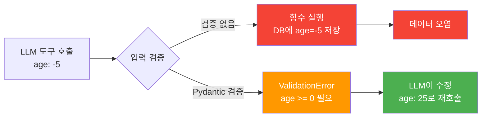
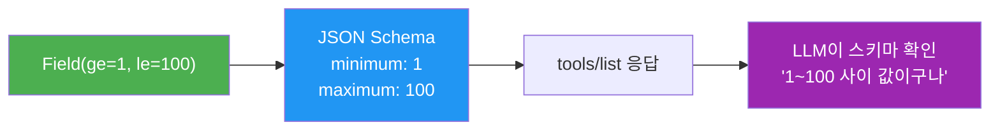
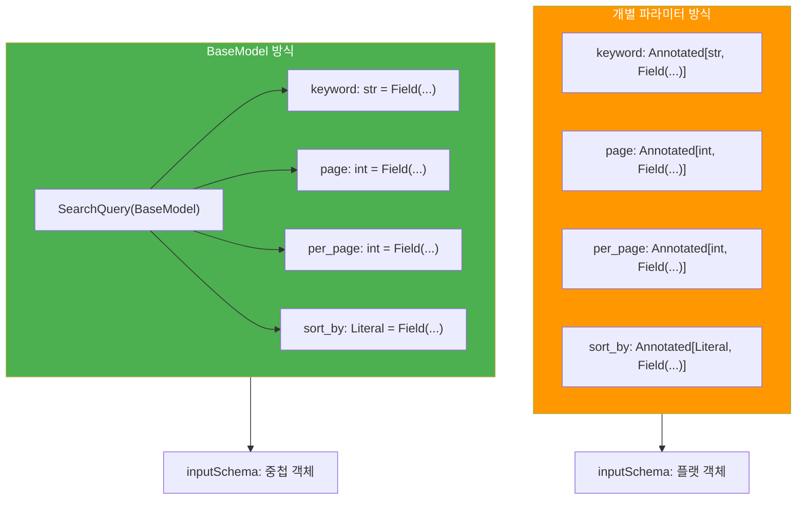
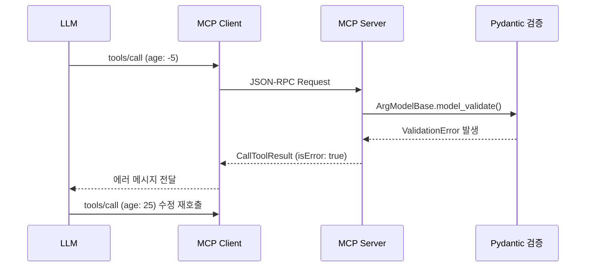
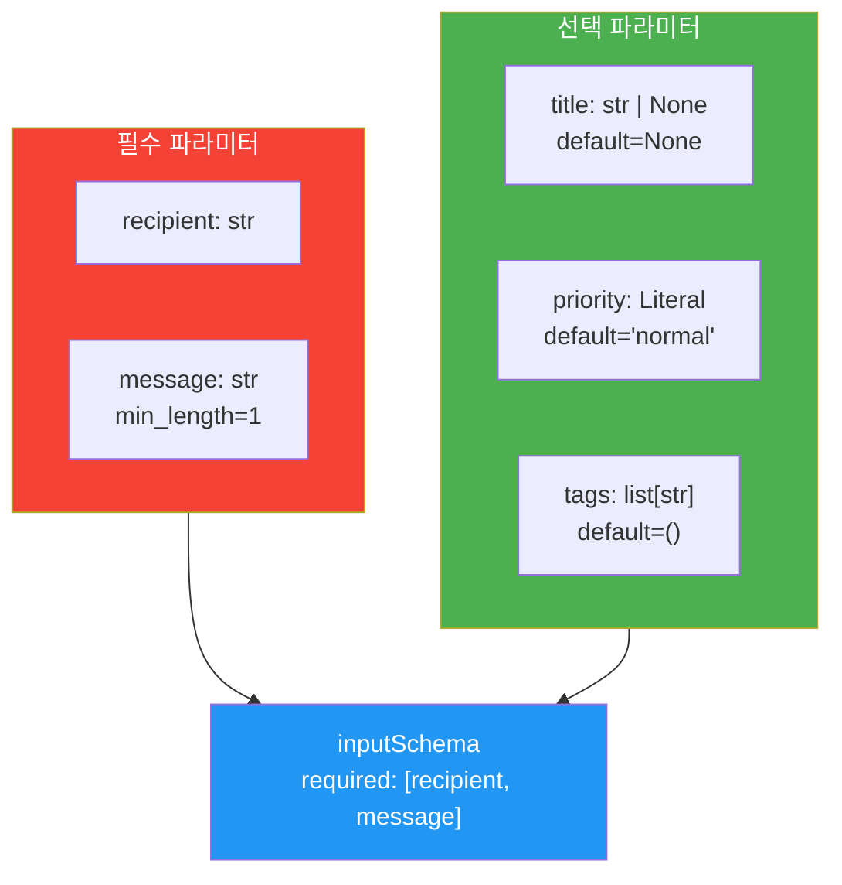
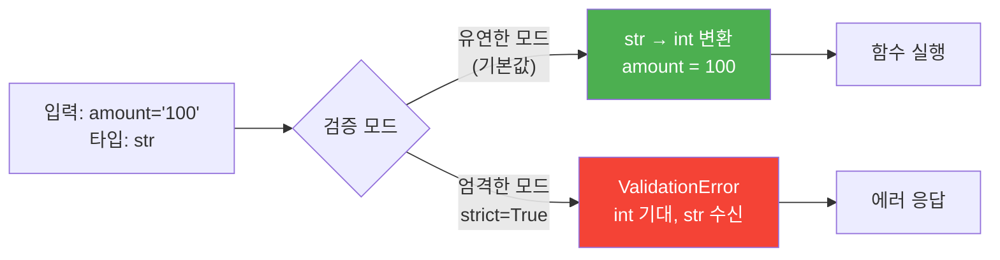

# 03. 입력 검증과 Pydantic 모델

> MCP 도구의 입력을 Pydantic으로 철벽 방어하기 — 잘못된 입력은 LLM에게 돌아가기 전에 잡아야 합니다

## 개요

이 섹션에서는 MCP 도구의 입력 검증을 Pydantic `Field` 제약 조건과 `BaseModel`로 강화하는 방법을 다룹니다. [이전 섹션](04-ch4-tools-함수-호출-프리미티브/02-02-도구-정의와-스키마-자동-생성.md)에서 `@mcp.tool()` 데코레이터가 타입 힌트로부터 JSON Schema를 자동 생성하는 메커니즘을 배웠는데요, 이번에는 그 스키마에 **실질적인 검증 로직**을 입히는 단계입니다.

이전 섹션에서 `Annotated[str, Field(description=...)]`로 설명을 추가하는 것까지 해봤죠? 이번에는 그 `Field()`에 **제약 조건**을 추가하는 것부터 시작해서, 파라미터가 많아졌을 때 `BaseModel`로 묶는 방법까지 자연스럽게 확장해 나갑니다.

**선수 지식**: `@mcp.tool()` 데코레이터 사용법, 타입 힌트-JSON Schema 매핑, `Annotated`와 `Field` 기초 ([세션 4.2](04-ch4-tools-함수-호출-프리미티브/02-02-도구-정의와-스키마-자동-생성.md))

**학습 목표**:
- `Field()` 제약 조건(`ge`, `le`, `min_length`, `pattern` 등)으로 개별 파라미터의 값 범위를 제한할 수 있다
- 제약 조건이 많아질 때 Pydantic `BaseModel`로 관련 필드를 하나의 모델로 묶을 수 있다
- 검증 실패 시 `ValidationError`가 클라이언트에 전달되는 흐름을 이해한다
- `Optional`, `Union`, `Literal` 타입을 활용한 유연한 입력 처리를 구현할 수 있다

## 왜 알아야 할까?

LLM은 똑똑하지만 완벽하지 않습니다. 도구를 호출할 때 잘못된 값을 보낼 수 있거든요. 나이에 음수를 넣는다든지, 이메일 형식이 아닌 문자열을 보낸다든지, 범위를 벗어난 숫자를 전달한다든지요. 이런 잘못된 입력이 도구 함수 내부까지 들어오면 어떻게 될까요? 데이터베이스에 쓰레기 값이 저장되거나, 외부 API 호출이 실패하거나, 심하면 서버가 크래시할 수 있습니다.

입력 검증은 **문지기** 역할입니다. 도구 함수의 비즈니스 로직이 실행되기 **전에** 잘못된 입력을 걸러내고, LLM에게 "이 값은 안 돼, 다시 보내"라고 명확하게 알려주는 거죠. Pydantic은 이 문지기를 **선언적으로** 만들어주는 최고의 도구입니다 — `if` 문 수십 줄 대신, 타입 힌트 한 줄로 검증 규칙을 표현할 수 있으니까요.

> 📊 **그림 1**: 입력 검증이 없을 때 vs 있을 때의 차이



## 핵심 개념

### 개념 1: Field() 제약 조건 — 이미 아는 것에서 한 걸음 더

> 💡 **비유**: 놀이공원 롤러코스터 앞에 "키 120cm 이상만 탑승 가능"이라는 안내판이 있죠? `Field(ge=120)`이 바로 그 안내판입니다. 규칙을 한 번 선언해두면, 매번 `if height < 120` 같은 조건문을 쓸 필요가 없어요.

[세션 4.2](04-ch4-tools-함수-호출-프리미티브/02-02-도구-정의와-스키마-자동-생성.md)에서 `Annotated[int, Field(description="나이")]`처럼 파라미터에 설명을 추가하는 법을 배웠습니다. 사실 `Field()`는 `description` 말고도 **값의 범위를 제한**하는 강력한 옵션들을 가지고 있어요. 이미 익숙한 `Field()`에 옵션 하나만 더 추가하면 됩니다.

이전 섹션에서 만든 `greet` 도구를 떠올려보세요:

```python
# 세션 4.2에서 했던 것 — description만 추가
@mcp.tool()
def greet(name: Annotated[str, Field(description="인사할 대상 이름")]) -> str:
    return f"안녕하세요, {name}님!"
```

이제 여기에 **제약 조건**을 하나 더 추가해봅시다:

```python
# 이번 섹션 — description + 길이 제한 추가
@mcp.tool()
def greet(
    name: Annotated[str, Field(description="인사할 대상 이름", min_length=1, max_length=50)]
) -> str:
    """사용자에게 인사합니다."""
    return f"안녕하세요, {name}님!"
```

차이점은 딱 `min_length=1, max_length=50` 두 개뿐이에요. 이것만으로 빈 문자열이나 비정상적으로 긴 이름을 자동으로 거부합니다. `if len(name) < 1` 같은 코드를 함수 안에 쓸 필요가 없는 거죠.

> 📊 **그림 2**: Field() 제약 조건이 JSON Schema로 매핑되는 과정



이 제약 조건들은 JSON Schema의 validation keywords로 자동 매핑됩니다. LLM이 `tools/list`에서 스키마를 읽을 때부터 어떤 값이 허용되는지 **사전에** 파악할 수 있다는 뜻이에요.

아래는 자주 쓰는 제약 조건들을 정리한 표입니다:

| 제약 조건 | 적용 대상 | JSON Schema | 설명 |
|-----------|----------|-------------|------|
| `ge` (greater or equal) | 숫자 | `minimum` | 최솟값 이상 |
| `gt` (greater than) | 숫자 | `exclusiveMinimum` | 최솟값 초과 |
| `le` (less or equal) | 숫자 | `maximum` | 최댓값 이하 |
| `lt` (less than) | 숫자 | `exclusiveMaximum` | 최댓값 미만 |
| `min_length` | 문자열/리스트 | `minLength`/`minItems` | 최소 길이 |
| `max_length` | 문자열/리스트 | `maxLength`/`maxItems` | 최대 길이 |
| `pattern` | 문자열 | `pattern` | 정규식 패턴 |

개별 파라미터에 제약 조건을 추가하는 예제를 좀 더 살펴볼까요?

```python
from typing import Annotated, Literal
from pydantic import Field
from mcp.server.fastmcp import FastMCP

mcp = FastMCP("validated-server")

@mcp.tool()
def search_items(
    keyword: Annotated[str, Field(description="검색 키워드", min_length=1, max_length=200)],
    page: Annotated[int, Field(description="페이지 번호", ge=1)] = 1,
    per_page: Annotated[int, Field(description="페이지당 결과 수", ge=1, le=100)] = 20,
    sort_by: Annotated[
        Literal["relevance", "date", "popularity"],
        Field(description="정렬 기준")
    ] = "relevance"
) -> dict:
    """항목을 검색합니다."""
    return {"keyword": keyword, "page": page, "results": f"정렬: {sort_by}"}
```

여기서 `Literal["relevance", "date", "popularity"]`도 일종의 제약 조건이에요. JSON Schema에서 `enum`으로 변환되어, LLM은 이 세 값 중 하나만 선택할 수 있습니다.

이 방식은 파라미터가 3~4개일 때까지는 잘 작동합니다. 하지만 파라미터가 더 많아지면 어떨까요? 함수 시그니처가 점점 길어지고, 관련 파라미터끼리 그룹핑하기가 어려워집니다. 그때 등장하는 것이 **BaseModel**입니다.

### 개념 2: BaseModel로 파라미터 묶기

> 💡 **비유**: 택배를 보낼 때 송장(이름, 주소, 전화번호)을 한 장에 적는 것과 비슷합니다. 개별 파라미터를 하나씩 나열하는 대신, 관련 필드를 하나의 "양식"으로 묶는 거죠. 양식이 있으면 빈 칸이 없는지, 형식이 맞는지 한 번에 확인할 수 있습니다.

방금 만든 `search_items` 도구를 BaseModel로 리팩토링해봅시다. 변경 전과 후를 나란히 보면 어떻게 "같은 것을 다른 형태로 표현"하는지 이해하기 쉬워요.

```python
from pydantic import BaseModel, Field
from typing import Literal
from mcp.server.fastmcp import FastMCP

mcp = FastMCP("validated-server")

# ── 변경 전: 개별 Annotated 파라미터 (세션 4.2 스타일) ──
# @mcp.tool()
# def search_items(
#     keyword: Annotated[str, Field(description="검색 키워드", min_length=1)],
#     page: Annotated[int, Field(description="페이지 번호", ge=1)] = 1,
#     per_page: Annotated[int, Field(description="페이지당 결과 수", ge=1, le=100)] = 20,
#     sort_by: Annotated[Literal[...], Field(description="정렬 기준")] = "relevance"
# ) -> dict: ...

# ── 변경 후: BaseModel로 묶기 ──
class SearchQuery(BaseModel):
    """검색 요청을 정의하는 모델"""
    
    keyword: str = Field(
        description="검색 키워드",
        min_length=1,
        max_length=200
    )
    page: int = Field(
        default=1,
        description="페이지 번호",
        ge=1
    )
    per_page: int = Field(
        default=20,
        description="페이지당 결과 수",
        ge=1,
        le=100
    )
    sort_by: Literal["relevance", "date", "popularity"] = Field(
        default="relevance",
        description="정렬 기준"
    )

@mcp.tool()
def search_documents(query: SearchQuery) -> dict:
    """문서를 검색합니다."""
    return {
        "keyword": query.keyword,
        "page": query.page,
        "results": f"검색 결과 (정렬: {query.sort_by})"
    }
```

주목할 점이 있어요. BaseModel 안에서 `Field()`를 쓰는 문법이 `Annotated`와 약간 다릅니다:

| 방식 | 문법 | 기본값 지정 |
|------|------|-----------|
| Annotated (개별) | `Annotated[int, Field(ge=1)]` | `= 1` (함수 시그니처에서) |
| BaseModel (클래스) | `page: int = Field(ge=1)` | `default=1` (Field 안에서) |

문법만 조금 다를 뿐, 똑같은 `Field()`를 사용하고 똑같은 제약 조건이 적용됩니다. 어렵지 않죠?

> 📊 **그림 3**: 개별 파라미터 vs BaseModel — 같은 검증, 다른 구조



**그럼 언제 BaseModel을 쓸까요?** 기준은 간단합니다:

- **파라미터 1~3개** → 개별 `Annotated` + `Field()`로 충분
- **파라미터 4개 이상** → BaseModel로 묶는 것이 가독성 좋음
- **관련 필드 그룹이 있을 때** → BaseModel로 논리적 그룹핑 (예: "주소" 관련 필드들)
- **같은 구조를 여러 도구에서 재사용할 때** → BaseModel이 압도적으로 편리

SDK 내부에서는 `func_metadata()` 함수가 `inspect.signature()`로 함수 시그니처를 분석한 뒤, `pydantic.create_model()`로 `ArgModelBase`라는 동적 모델을 생성합니다. `BaseModel` 파라미터는 `$ref`를 통해 중첩 스키마로 포함되므로, 필드 구조가 그대로 보존됩니다.

**중요한 점**: LLM 클라이언트는 `BaseModel` 파라미터를 반드시 JSON 객체(dict)로 전달해야 합니다. 문자열화된 JSON(`'{"name": "Alice"}'`)은 안 됩니다 — `{"name": "Alice"}`처럼 실제 객체여야 합니다.

### 개념 3: 검증 실패 시 에러 흐름 — ValidationError

> 💡 **비유**: 은행 ATM에서 비밀번호를 틀리면 "비밀번호가 일치하지 않습니다"라는 메시지가 나오죠. 기계가 멈추거나 폭발하지 않습니다. MCP 도구의 입력 검증도 마찬가지예요 — 잘못된 입력을 받으면 함수를 실행하지 않고, 정확히 **무엇이 잘못됐는지** 에러 메시지로 알려줍니다.

개별 파라미터든 BaseModel이든, 제약 조건을 위반하면 어떻게 될까요? Pydantic이 `ValidationError`를 발생시키고, FastMCP가 이를 잡아서 MCP 에러 응답으로 변환합니다.

> 📊 **그림 4**: ValidationError 발생 및 전달 흐름



내부적으로 일어나는 일을 단계별로 살펴보면:

1. **LLM이 `tools/call` 요청** — `{"name": "create_user", "arguments": {"age": -5}}`
2. **FastMCP가 `call_fn_with_arg_validation()` 호출** — 동적 생성된 `ArgModelBase`로 인자를 검증
3. **Pydantic `ValidationError` 발생** — `age` 필드가 `ge=0` 제약 조건 위반
4. **에러가 `CallToolResult`로 변환** — `isError: true`와 함께 검증 실패 상세 메시지 포함
5. **LLM이 에러 메시지를 읽고 수정** — 대부분의 LLM은 에러를 이해하고 올바른 값으로 재호출

이 과정에서 도구 함수 자체는 **한 번도 실행되지 않습니다**. 검증이 함수 실행 전에 이루어지기 때문에, 잘못된 입력이 비즈니스 로직이나 데이터베이스까지 도달하는 것을 완전히 차단합니다.

```python
@mcp.tool()
def transfer_money(
    amount: Annotated[float, Field(gt=0, le=1_000_000, description="이체 금액")],
    to_account: Annotated[str, Field(pattern=r"^\d{3}-\d{2}-\d{6}$", description="계좌번호")]
) -> dict:
    """계좌 이체를 수행합니다."""
    # Pydantic 검증을 통과한 후에만 이 코드가 실행됩니다
    return {"status": "success", "amount": amount}
```

여기서 `pattern` 제약 조건은 계좌번호 형식(예: `123-45-678901`)을 정규식으로 검증합니다. 형식이 맞지 않으면 Pydantic이 `ValidationError`를 발생시켜 즉시 거부합니다.

> ⚠️ **ValidationError vs ToolError — 두 계층의 검증**: Pydantic의 `ValidationError`는 **타입/형식** 수준의 자동 검증입니다. 반면 `ToolError`는 검증을 통과한 **이후** 비즈니스 로직에서 발생하는 에러를 표현합니다 (예: 계좌가 존재하지 않음). `ToolError`의 발생 시점, 처리 방식, `mask_error_details` 옵션 등은 [다음 섹션 — 도구 실행 결과와 에러 처리](04-ch4-tools-함수-호출-프리미티브/04-04-도구-실행-결과와-에러-처리.md)에서 자세히 다룹니다.

### 개념 4: Optional, Union, 그리고 유연한 타입 처리

> 💡 **비유**: 레스토랑 주문서에서 "메인 디시"는 필수지만 "디저트"는 선택(Optional)이죠. 그리고 음료는 "커피 또는 주스"(Union) 중에서 고를 수 있고요. MCP 도구의 파라미터도 이렇게 필수/선택/다중 타입을 선언할 수 있습니다.

이 패턴은 개별 파라미터에서도, BaseModel 안에서도 동일하게 작동합니다. 먼저 개별 파라미터 방식으로 감을 잡아볼게요:

```python
@mcp.tool()
def send_message(
    recipient: Annotated[str, Field(description="수신자 ID")],
    message: Annotated[str, Field(description="메시지 내용", min_length=1)],
    title: Annotated[str | None, Field(description="제목 (선택)")] = None,
    priority: Annotated[
        Literal["low", "normal", "high"],
        Field(description="우선순위")
    ] = "normal"
) -> dict:
    """메시지를 전송합니다."""
    return {"sent_to": recipient, "title": title or "제목 없음"}
```

이제 이걸 BaseModel로 묶으면 이렇게 됩니다:

```python
from typing import Literal

class NotificationRequest(BaseModel):
    """알림 전송 요청"""
    
    # 필수 필드 — 기본값 없음
    recipient: str = Field(description="수신자 ID")
    message: str = Field(description="알림 내용", min_length=1)
    
    # 선택 필드 — None 허용
    title: str | None = Field(default=None, description="알림 제목 (선택)")
    
    # 선택 필드 — 기본값 있음
    priority: Literal["low", "normal", "high", "urgent"] = Field(
        default="normal",
        description="알림 우선순위"
    )
    
    # 선택 필드 — 복잡한 타입
    tags: list[str] = Field(
        default_factory=list,
        description="태그 목록",
        max_length=10  # 최대 10개 태그
    )

@mcp.tool()
def send_notification(request: NotificationRequest) -> dict:
    """알림을 전송합니다."""
    return {
        "sent_to": request.recipient,
        "title": request.title or "제목 없음",
        "priority": request.priority,
        "tag_count": len(request.tags)
    }
```

> 📊 **그림 5**: 파라미터 필수/선택 구분과 타입 매핑



**`Optional` vs 기본값의 차이를 정확히 이해하세요:**

| 선언 | 필수? | None 허용? | JSON Schema |
|------|-------|-----------|-------------|
| `name: str` | 필수 | 불가 | `required`에 포함 |
| `name: str = "default"` | 선택 | 불가 | `default: "default"` |
| `name: str \| None` | 필수 | 가능 | `required` + `anyOf` |
| `name: str \| None = None` | 선택 | 가능 | `default: null` + `anyOf` |

### 개념 5: 엄격한 검증 모드 (strict_input_validation)

지금까지 배운 `Field()` 제약 조건과 `BaseModel`은 **값의 범위**를 검증했습니다. 하지만 **타입 자체의 엄격함**은 어떨까요?

FastMCP는 기본적으로 **유연한 검증 모드**를 사용합니다. 문자열 `"10"`이 `int` 타입 필드로 들어오면, 자동으로 정수 `10`으로 변환(coercion)해주는 거죠. LLM 클라이언트 중에는 모든 값을 문자열로 보내는 경우가 있어서, 이런 유연성이 호환성을 높여줍니다.

하지만 보안이 중요한 상황에서는 **엄격한 검증 모드**가 필요할 수 있습니다.

```python
# 엄격한 검증 모드 활성화
mcp = FastMCP("strict-server", strict_input_validation=True)

@mcp.tool()
def process_payment(amount: int, currency: str) -> dict:
    """결제를 처리합니다."""
    return {"amount": amount, "currency": currency}

# 유연한 모드(기본값): {"amount": "100"} → OK, 100으로 변환
# 엄격한 모드:        {"amount": "100"} → ValidationError!
```

> 📊 **그림 6**: 유연한 검증 vs 엄격한 검증



| 입력 | 기대 타입 | 유연한 모드 | 엄격한 모드 |
|------|----------|-----------|-----------|
| `"42"` | `int` | `42`로 변환 | 에러 |
| `"3.14"` | `float` | `3.14`로 변환 | 에러 |
| `["1", "2"]` | `list[int]` | `[1, 2]`로 변환 | 에러 |
| `"true"` | `bool` | `True`로 변환 | 에러 |
| `"abc"` | `int` | 에러 | 에러 |

일반적으로는 기본 유연한 모드를 사용하되, 금융 거래나 의료 데이터처럼 **타입 정확성이 중요한 도메인**에서는 엄격한 모드를 고려하세요.

## 실습: 직접 해보기

이제 배운 개념들을 종합해서, 프로젝트 관리 도구 서버를 만들어보겠습니다. 이 실습에서는 개별 파라미터 방식과 BaseModel 방식을 **모두** 사용해서, 상황에 따라 적절한 방식을 선택하는 감각을 익혀봅니다.

```python
# project_manager_server.py
from datetime import date
from enum import Enum
from typing import Annotated, Literal

from pydantic import BaseModel, Field, field_validator
from mcp.server.fastmcp import FastMCP

mcp = FastMCP("project-manager")


# --- Pydantic 모델 정의 (파라미터가 많은 경우) ---

class Priority(str, Enum):
    """작업 우선순위"""
    LOW = "low"
    MEDIUM = "medium"
    HIGH = "high"
    CRITICAL = "critical"


class TaskCreate(BaseModel):
    """새 작업 생성 요청 — 필드가 7개라 BaseModel로 묶었습니다"""
    
    title: str = Field(
        description="작업 제목",
        min_length=1,
        max_length=200
    )
    description: str = Field(
        default="",
        description="작업 상세 설명",
        max_length=2000
    )
    assignee: str | None = Field(
        default=None,
        description="담당자 이름 (선택)"
    )
    priority: Priority = Field(
        default=Priority.MEDIUM,
        description="우선순위: low, medium, high, critical"
    )
    tags: list[str] = Field(
        default_factory=list,
        description="태그 목록 (최대 5개, 각 태그 30자 이내)",
        max_length=5
    )
    due_date: date | None = Field(
        default=None,
        description="마감일 (YYYY-MM-DD 형식)"
    )
    estimated_hours: float | None = Field(
        default=None,
        description="예상 소요 시간",
        ge=0.5,
        le=1000
    )

    # 커스텀 검증: 각 태그의 길이 제한
    @field_validator("tags")
    @classmethod
    def validate_tags(cls, v: list[str]) -> list[str]:
        for tag in v:
            if len(tag) > 30:
                raise ValueError(f"태그 '{tag[:20]}...'가 30자를 초과합니다")
            if not tag.strip():
                raise ValueError("빈 태그는 허용되지 않습니다")
        return [tag.strip().lower() for tag in v]  # 정규화


class TaskFilter(BaseModel):
    """작업 검색 필터"""
    
    assignee: str | None = Field(default=None, description="담당자로 필터링")
    priority: Priority | None = Field(default=None, description="우선순위로 필터링")
    tag: str | None = Field(default=None, description="태그로 필터링")
    include_completed: bool = Field(default=False, description="완료된 작업 포함 여부")
    limit: int = Field(default=20, description="최대 결과 수", ge=1, le=100)


# --- 간단한 인메모리 저장소 ---
tasks_db: list[dict] = []
next_id = 1


# --- MCP 도구 정의 ---

@mcp.tool()
def create_task(task: TaskCreate) -> dict:
    """프로젝트에 새 작업을 생성합니다.
    
    제목은 필수이며, 우선순위·태그·마감일 등은 선택입니다.
    태그는 자동으로 소문자로 정규화됩니다.
    """
    global next_id
    
    task_data = {
        "id": next_id,
        "status": "open",
        **task.model_dump()
    }
    # date 객체를 문자열로 변환
    if task_data["due_date"]:
        task_data["due_date"] = task_data["due_date"].isoformat()
    
    tasks_db.append(task_data)
    next_id += 1
    
    return {
        "message": f"작업 '{task.title}' 생성 완료",
        "task": task_data
    }


@mcp.tool()
def list_tasks(filter: TaskFilter) -> dict:
    """조건에 맞는 작업 목록을 조회합니다.
    
    담당자, 우선순위, 태그로 필터링할 수 있습니다.
    """
    results = tasks_db.copy()
    
    if filter.assignee:
        results = [t for t in results if t.get("assignee") == filter.assignee]
    if filter.priority:
        results = [t for t in results if t.get("priority") == filter.priority.value]
    if filter.tag:
        results = [t for t in results if filter.tag in t.get("tags", [])]
    if not filter.include_completed:
        results = [t for t in results if t.get("status") != "completed"]
    
    return {
        "total": len(results),
        "tasks": results[:filter.limit]
    }


# --- 개별 파라미터 방식 (파라미터가 적은 경우) ---

@mcp.tool()
def update_task_status(
    task_id: Annotated[int, Field(description="작업 ID", ge=1)],
    new_status: Annotated[
        Literal["open", "in_progress", "review", "completed"],
        Field(description="새로운 상태")
    ]
) -> dict:
    """작업의 상태를 변경합니다."""
    for task in tasks_db:
        if task["id"] == task_id:
            old_status = task["status"]
            task["status"] = new_status
            return {
                "message": f"작업 #{task_id} 상태 변경: {old_status} → {new_status}",
                "task": task
            }
    
    # 비즈니스 로직 에러 — ToolError는 다음 섹션에서 상세히 다룹니다
    return {"error": f"작업 #{task_id}를 찾을 수 없습니다."}


if __name__ == "__main__":
    mcp.run()
```

이 서버를 MCP Inspector로 테스트해볼 수 있습니다.

```run:python
# 검증 동작 확인 — Pydantic 모델 직접 테스트
from pydantic import BaseModel, Field, ValidationError
from typing import Literal

class TaskCreate(BaseModel):
    title: str = Field(min_length=1, max_length=200)
    priority: Literal["low", "medium", "high"] = "medium"
    estimated_hours: float | None = Field(default=None, ge=0.5, le=1000)

# 1. 정상 입력
task = TaskCreate(title="MCP 서버 구현", priority="high", estimated_hours=8.0)
print(f"정상: {task.model_dump()}")

# 2. 선택 필드 생략
task2 = TaskCreate(title="버그 수정")
print(f"기본값: {task2.model_dump()}")

# 3. 검증 실패 케이스들
errors = []
try:
    TaskCreate(title="")  # min_length=1 위반
except ValidationError as e:
    errors.append(f"빈 제목: {e.error_count()}개 에러")

try:
    TaskCreate(title="OK", estimated_hours=0.1)  # ge=0.5 위반
except ValidationError as e:
    errors.append(f"시간 범위: {e.error_count()}개 에러")

try:
    TaskCreate(title="OK", priority="urgent")  # Literal 위반
except ValidationError as e:
    errors.append(f"잘못된 우선순위: {e.error_count()}개 에러")

for err in errors:
    print(f"검증 실패 → {err}")
```

```output
정상: {'title': 'MCP 서버 구현', 'priority': 'high', 'estimated_hours': 8.0}
기본값: {'title': '버그 수정', 'priority': 'medium', 'estimated_hours': None}
검증 실패 → 빈 제목: 1개 에러
검증 실패 → 시간 범위: 1개 에러
검증 실패 → 잘못된 우선순위: 1개 에러
```

```run:python
# ValidationError의 상세 메시지 확인
from pydantic import BaseModel, Field, ValidationError

class UserInput(BaseModel):
    name: str = Field(min_length=2)
    age: int = Field(ge=0, le=150)
    email: str = Field(pattern=r"^[\w.-]+@[\w.-]+\.\w+$")

try:
    UserInput(name="A", age=-1, email="not-an-email")
except ValidationError as e:
    print("=== LLM이 받게 되는 에러 메시지 ===")
    for error in e.errors():
        field = " → ".join(str(loc) for loc in error["loc"])
        print(f"  [{field}] {error['msg']} (type: {error['type']})")
```

```output
=== LLM이 받게 되는 에러 메시지 ===
  [name] String should have at least 2 characters (type: string_too_short)
  [age] Input should be greater than or equal to 0 (type: greater_than_equal)
  [email] String should match pattern '^[\w.-]+@[\w.-]+\.\w+$' (type: string_pattern_mismatch)
```

에러 메시지가 매우 구체적이라는 점에 주목하세요. 필드 이름, 위반 사항, 에러 타입이 모두 포함되어 있기 때문에 LLM이 무엇을 고쳐야 하는지 정확히 파악할 수 있습니다.

## 더 깊이 알아보기

### pre_parse_json — 클라이언트 호환성의 숨은 영웅

FastMCP 내부에는 `pre_parse_json()`이라는 흥미로운 함수가 있습니다. 이 함수가 필요한 이유는 현실적인 문제 때문인데요 — Claude Desktop 같은 일부 MCP 클라이언트가 복잡한 파라미터를 JSON 객체가 아닌 **JSON 문자열**로 보내는 경우가 있거든요.

예를 들어, `tags` 파라미터에 `["python", "mcp"]`라는 리스트를 보내야 하는데, 클라이언트가 `'["python", "mcp"]'`라는 문자열로 보내버리는 거죠. `pre_parse_json()`은 이런 문자열을 받아서 실제 Python 객체로 파싱합니다. 단, 단순 문자열(`"hello"`)은 그대로 문자열로 유지합니다 — `'"hello"'`로 이중 래핑하면 안 되니까요.

이 동작은 SDK의 `src/mcp/server/fastmcp/utilities/func_metadata.py`에 구현되어 있으며, 개발자가 직접 호출할 일은 거의 없지만 "왜 문자열로 보냈는데 작동하지?"라는 의문이 생겼을 때 알아두면 좋습니다.

### Pydantic의 탄생 이야기

Pydantic은 2017년 Samuel Colvin이 만들었습니다. 그는 당시 Django REST Framework에서 시리얼라이저(Serializer)를 작성하면서, Python 타입 힌트로 검증 로직을 자동 생성할 수 없을까 고민했다고 해요. "코드에 이미 `name: str`이라고 적어놨는데, 왜 또 별도로 검증 코드를 작성해야 하지?"라는 의문이 출발점이었죠. Pydantic V2(2023)에서는 핵심 검증 엔진을 Rust로 재작성하여 성능이 5~50배 향상되었고, 이것이 MCP SDK가 Pydantic을 기반으로 채택한 중요한 이유 중 하나입니다.

## 흔한 오해와 팁

> ⚠️ **흔한 오해**: "BaseModel 파라미터를 사용하면 LLM이 중첩 JSON을 못 만들 거야"
> 
> 실제로 GPT-4, Claude 3.5 이상의 모델은 중첩 JSON 구조를 매우 잘 생성합니다. `inputSchema`에 객체 구조가 명확히 정의되어 있으면, LLM은 그 구조를 따라 정확한 JSON을 만들어냅니다. 오히려 필드가 많을수록 BaseModel로 묶는 것이 LLM의 정확도를 높여주는데, 플랫한 파라미터 10개보다 구조화된 객체 1개가 더 이해하기 쉽기 때문이에요.

> 💡 **알고 계셨나요?**: `@field_validator`는 JSON Schema에 반영되지 않습니다
> 
> Pydantic의 `@field_validator`로 추가한 커스텀 검증 로직은 **런타임에만** 작동하고, `tools/list`가 반환하는 inputSchema에는 포함되지 않습니다. 즉, LLM은 이 규칙의 존재를 모릅니다. 이런 규칙은 `description` 필드에 자연어로 설명해주는 것이 좋습니다: `Field(description="태그는 30자 이내, 소문자만 허용")`.

> 🔥 **실무 팁**: description을 LLM의 눈높이로 작성하세요
> 
> `Field(description=...)` 과 도구의 docstring은 LLM이 **직접 읽는** 텍스트입니다. 개발자용 주석이 아니라 LLM용 사용 설명서라고 생각하세요. "사용자 ID"보다는 "사용자를 고유하게 식별하는 숫자 ID. users 테이블에서 조회 가능"이 LLM에게 훨씬 도움이 됩니다.

> 🔥 **실무 팁**: `model_config`로 추가 필드를 차단하세요
> 
> ```python
> class StrictInput(BaseModel):
>     model_config = {"extra": "forbid"}  # 정의하지 않은 필드 거부
>     name: str
>     age: int
> ```
> `extra="forbid"`를 설정하면 스키마에 정의되지 않은 필드가 들어왔을 때 에러를 발생시킵니다. LLM이 할루시네이션으로 존재하지 않는 필드를 추가하는 것을 방지할 수 있어요.

## 핵심 정리

| 개념 | 설명 |
|------|------|
| Field() 제약 조건 | `ge`, `le`, `min_length`, `max_length`, `pattern` 등으로 값 범위 제한 — 이전 섹션의 `Field(description=...)`에 옵션만 추가 |
| BaseModel 파라미터 | 파라미터가 많을 때 관련 필드를 하나의 모델로 묶어 복잡한 입력 구조를 선언적으로 정의 |
| ValidationError 흐름 | Pydantic `ValidationError` → FastMCP가 `CallToolResult(isError=true)`로 변환 → LLM에 전달 |
| Optional/Union | `str \| None = None`으로 선택 필드, `Literal`로 허용 값 제한 |
| strict_input_validation | `True`면 타입 강제 변환 비활성화, 정확한 타입만 허용 |
| pre_parse_json | 클라이언트가 JSON 문자열로 보낸 복합 값을 자동 파싱하는 내부 메커니즘 |
| field_validator | 런타임 커스텀 검증, JSON Schema에 미반영 → description으로 보완 필요 |

## 다음 섹션 미리보기

입력 검증으로 잘못된 값을 막는 법을 배웠으니, 다음은 도구가 **올바른 입력**을 받았을 때의 이야기입니다. [다음 섹션 — 도구 실행 결과와 에러 처리](04-ch4-tools-함수-호출-프리미티브/04-04-도구-실행-결과와-에러-처리.md)에서는 `CallToolResult`의 다양한 반환 형식(텍스트, 이미지, 임베딩 리소스), `isError` 플래그의 의미, 그리고 `ToolError`와 일반 예외의 차이를 상세히 다룹니다. 검증을 통과한 뒤에도 비즈니스 로직에서 실패할 수 있는데요 — 그때 `ToolError`를 어떻게 활용하고, `mask_error_details` 옵션으로 보안을 유지하면서 디버깅 정보를 제공하는 방법까지 실습합니다.

## 참고 자료

- [FastMCP Tools 공식 문서](https://gofastmcp.com/servers/tools) - Field 제약 조건, strict_input_validation, Pydantic 모델 파라미터 사용법의 공식 레퍼런스
- [MCP Python SDK GitHub](https://github.com/modelcontextprotocol/python-sdk) - `func_metadata.py` 소스 코드에서 ArgModelBase, pre_parse_json 등 내부 구현 확인 가능
- [Build a Python MCP Server — Real Python](https://realpython.com/python-mcp/) - MCP 서버 구축 튜토리얼, 도구 정의와 검증 실전 예제 포함
- [Pydantic V2 공식 문서 — Field Validators](https://docs.pydantic.dev/latest/concepts/validators/) - field_validator, model_validator 등 커스텀 검증 로직 작성법
- [MCP Specification — Tools](https://modelcontextprotocol.io/specification/2025-11-25/server/tools) - tools/list, tools/call의 프로토콜 스펙과 inputSchema 구조

---

---
### 🔗 Related Sessions
- [tools/list](04-ch4-tools-함수-호출-프리미티브/01-01-tool-프리미티브-이해.md) (prerequisite)
- [tools/call](04-ch4-tools-함수-호출-프리미티브/01-01-tool-프리미티브-이해.md) (prerequisite)
- [func_metadata](04-ch4-tools-함수-호출-프리미티브/02-02-도구-정의와-스키마-자동-생성.md) (prerequisite)
- [argmodelbase](04-ch4-tools-함수-호출-프리미티브/02-02-도구-정의와-스키마-자동-생성.md) (prerequisite)
- [calltoolresult](04-ch4-tools-함수-호출-프리미티브/04-04-도구-실행-결과와-에러-처리.md) (prerequisite)
- [iserror](04-ch4-tools-함수-호출-프리미티브/01-01-tool-프리미티브-이해.md) (prerequisite)
