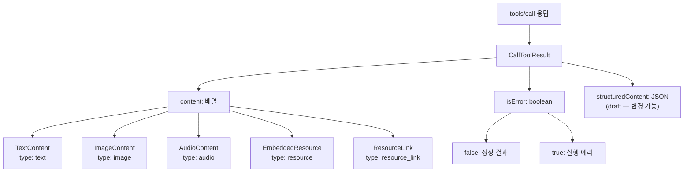
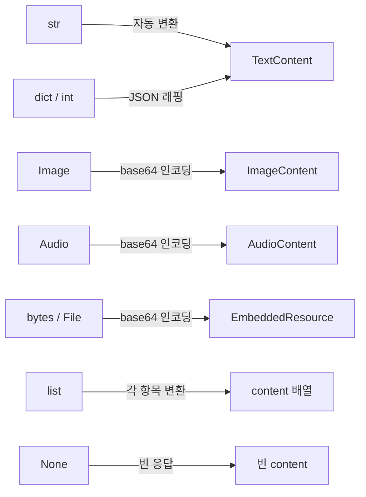
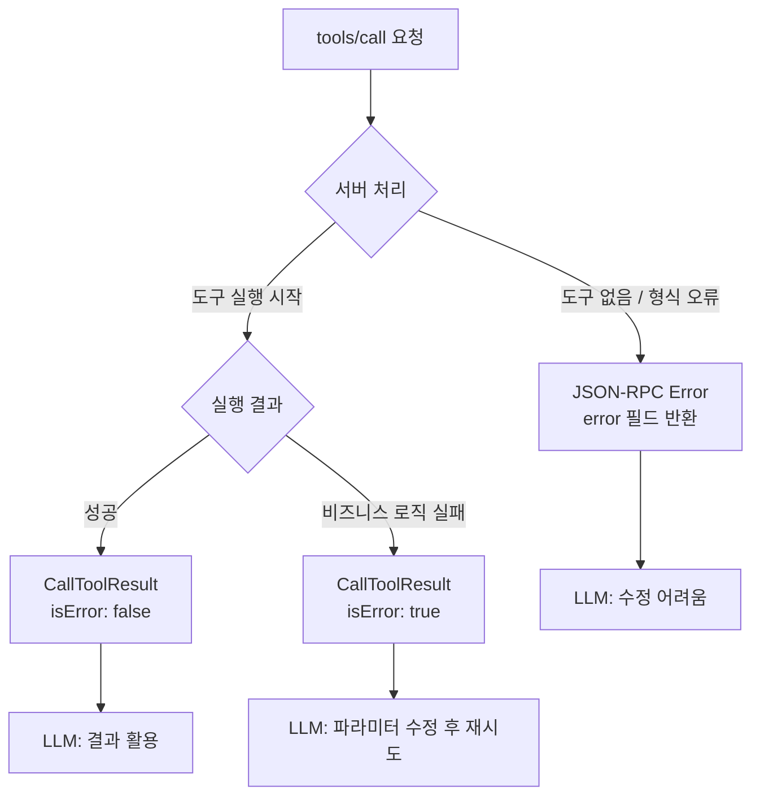
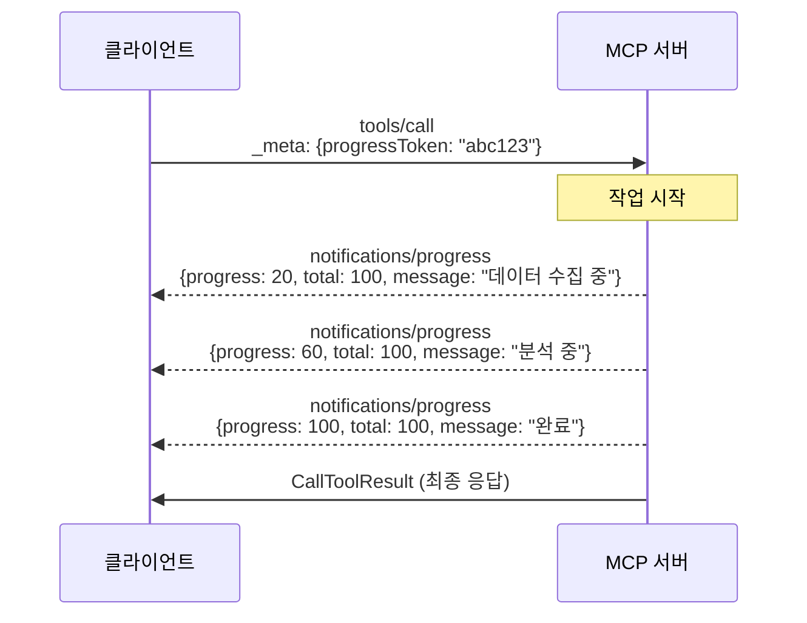
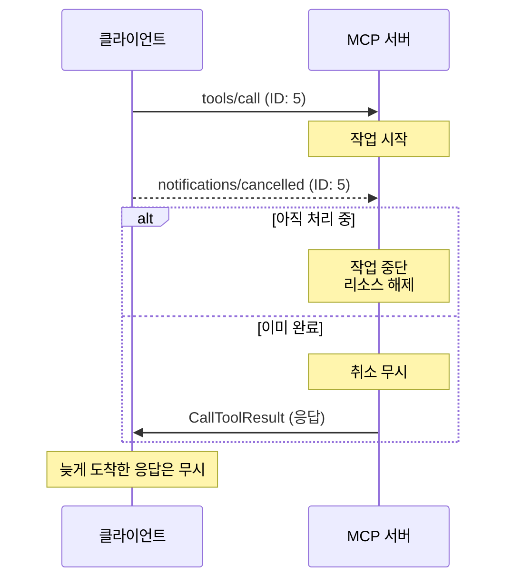

# 도구 실행 결과와 에러 처리

> MCP 도구가 반환하는 다양한 콘텐츠 타입과 에러 시그널링, 진행 상황 보고, 취소 처리까지 — 도구의 "출력 언어"를 마스터합니다.

## 개요

이 섹션에서는 MCP 도구가 실행된 후 클라이언트에게 결과를 돌려보내는 **모든 방법**을 다룹니다. 텍스트뿐 아니라 이미지, 오디오, 리소스까지 반환할 수 있고, 실행 중 에러가 발생했을 때 LLM이 스스로 수정할 수 있도록 시그널을 보내는 메커니즘을 배웁니다. 나아가 오래 걸리는 작업의 진행률 보고와 취소 처리까지 구현합니다.

**선수 지식**: [도구 정의와 스키마 자동 생성](04-ch4-tools-함수-호출-프리미티브/02-02-도구-정의와-스키마-자동-생성.md)의 `@mcp.tool()` 데코레이터 사용법, [입력 검증과 Pydantic 모델](04-ch4-tools-함수-호출-프리미티브/03-03-입력-검증과-pydantic-모델.md)의 ValidationError 흐름

**학습 목표**:
- `CallToolResult`의 구조와 `content` 배열의 다양한 콘텐츠 타입(TextContent, ImageContent, AudioContent, EmbeddedResource)을 이해한다
- `isError` 플래그와 `ToolError`를 사용하여 LLM이 자기 수정할 수 있는 에러 응답을 설계할 수 있다
- `notifications/progress` 프로토콜의 구조와 `Context.report_progress()`를 이해한다
- 요청 취소(`notifications/cancelled`)의 프로토콜 흐름과 타이밍 이슈를 이해한다

## 왜 알아야 할까?

도구를 정의하고 입력을 검증하는 것까지는 "도구의 입구"를 만든 것이죠. 하지만 실제 사용자 경험은 **도구의 출구** — 즉, 결과를 어떻게 돌려보내느냐에 달려 있습니다.

생각해 보세요. 여러분이 레스토랑에서 주문을 했다면, 주문이 잘 접수되는 것(입력 검증)도 중요하지만 정말 중요한 건 **음식이 어떻게 나오느냐**입니다. 텍스트로 "카르보나라 완성"이라고 말만 하는 것과, 실제 요리 사진을 보여주고, 조리 진행률을 알려주고, 재료가 떨어졌을 때 "파스타를 리조또로 바꾸시겠어요?"라고 제안하는 것은 완전히 다른 경험이거든요.

MCP 도구도 마찬가지입니다:
- **텍스트만 반환**하면 LLM은 텍스트로만 사고합니다
- **이미지를 함께 반환**하면 차트나 스크린샷으로 시각적 판단이 가능합니다
- **에러를 올바르게 시그널링**하면 LLM이 파라미터를 고쳐서 재시도합니다
- **진행률을 보고**하면 사용자가 "아직 돌고 있구나"를 알 수 있습니다

이번 섹션은 이 모든 "출력 언어"를 마스터하는 시간입니다.

## 핵심 개념

### 개념 1: CallToolResult의 구조

> 💡 **비유**: 택배 상자를 생각해 보세요. 상자 안에는 물건(content)이 여러 개 들어있을 수 있고, 상자 겉면에는 "파손 주의" 같은 스티커(isError)가 붙어 있습니다. MCP의 `CallToolResult`가 바로 이 택배 상자입니다.

`tools/call` 요청의 응답으로 서버가 반환하는 `CallToolResult`는 크게 두 부분으로 구성됩니다:

1. **`content`**: 콘텐츠 블록의 배열 — 텍스트, 이미지, 오디오, 리소스를 조합하여 반환
2. **`isError`**: 불리언 플래그 — `true`이면 도구 실행이 실패했음을 LLM에게 알림
3. **`structuredContent`** *(2025-11-25 스펙 기준 draft)*: JSON 스키마에 맞는 구조화된 결과를 별도로 반환

> 📊 **그림 1**: CallToolResult의 내부 구조



실제 JSON-RPC 응답을 보면 이 구조가 명확해집니다:

```json
{
  "jsonrpc": "2.0",
  "id": 2,
  "result": {
    "content": [
      {
        "type": "text",
        "text": "서울의 현재 날씨:\n온도: 18°C\n상태: 맑음"
      }
    ],
    "isError": false
  }
}
```

핵심은 `content`가 **배열**이라는 점입니다. 하나의 도구 호출에서 텍스트와 이미지를 동시에 반환할 수 있고, 여러 텍스트 블록을 나눠 보낼 수도 있습니다.

### 개념 2: 콘텐츠 타입별 반환 — TextContent, ImageContent, EmbeddedResource

> 💡 **비유**: 보고서를 제출할 때 본문(텍스트), 차트(이미지), 첨부 파일(리소스)을 함께 넣는 것처럼, MCP 도구도 다양한 형식을 한 번에 반환할 수 있습니다.

#### TextContent — 가장 기본적인 반환

대부분의 도구는 텍스트를 반환합니다. FastMCP에서는 문자열을 반환하면 자동으로 `TextContent`로 변환됩니다:

```python
from fastmcp import FastMCP

mcp = FastMCP("demo")

@mcp.tool()
def get_weather(city: str) -> str:
    """도시의 현재 날씨를 조회합니다."""
    # 실제로는 API 호출
    return f"{city}의 현재 날씨: 18°C, 맑음"
```

`dict`나 `int` 같은 비문자열 타입도 자동 변환됩니다. `dict`는 JSON 문자열로, `int`는 `{"result": 42}` 형태로 래핑됩니다.

#### ImageContent — 시각적 결과 반환

차트, 스크린샷, 생성된 이미지를 반환할 때 사용합니다. FastMCP는 `Image` 헬퍼 클래스를 제공합니다:

```python
from fastmcp import FastMCP
from fastmcp.utilities.types import Image

mcp = FastMCP("chart-server")

@mcp.tool()
def generate_chart(data: list[float]) -> Image:
    """데이터로 차트 이미지를 생성합니다."""
    import matplotlib.pyplot as plt
    import io

    fig, ax = plt.subplots()
    ax.bar(range(len(data)), data)
    
    buf = io.BytesIO()
    fig.savefig(buf, format="png")
    buf.seek(0)
    plt.close(fig)
    
    # data= 로 바이트 전달, format 지정
    return Image(data=buf.read(), format="png")
```

`Image` 클래스는 세 가지 방식으로 생성할 수 있습니다:

| 파라미터 | 설명 | 예시 |
|----------|------|------|
| `path=` | 파일 경로 (MIME 자동 감지) | `Image(path="chart.png")` |
| `data=` | 원시 바이트 + format 필수 | `Image(data=bytes, format="png")` |
| `url=` | URL에서 다운로드 | `Image(url="https://...")` |

와이어 프로토콜에서 `ImageContent`는 base64 인코딩된 형태로 전송됩니다:

```json
{
  "type": "image",
  "data": "iVBORw0KGgoAAAANSUhEUgAA...",
  "mimeType": "image/png"
}
```

#### EmbeddedResource — 파일과 데이터 첨부

도구 결과에 파일이나 구조화된 데이터를 첨부할 때 `EmbeddedResource`를 사용합니다. FastMCP에서는 `bytes`를 반환하면 자동으로 `EmbeddedResource`로 변환되고, `File` 헬퍼도 사용할 수 있습니다:

```python
from fastmcp.utilities.types import File

@mcp.tool()
def export_csv(table_name: str) -> File:
    """테이블 데이터를 CSV로 내보냅니다."""
    csv_content = "id,name,score\n1,Alice,95\n2,Bob,87"
    return File(data=csv_content.encode(), format="csv", name=f"{table_name}.csv")
```

#### 복합 반환 — 여러 콘텐츠를 한 번에

리스트를 반환하면 여러 콘텐츠 블록을 조합할 수 있습니다:

```python
@mcp.tool()
def analyze_sales(month: str) -> list:
    """월별 매출을 분석하고 차트와 함께 반환합니다."""
    summary = f"{month} 매출 분석:\n총 매출: 1,250만원\n전월 대비: +12%"
    chart = Image(path=f"charts/{month}_sales.png")
    return [summary, chart]
```

> 📊 **그림 2**: FastMCP의 반환 타입 자동 변환 흐름



### 개념 3: isError와 ToolError — LLM이 자기 수정하는 에러

> 💡 **비유**: 내비게이션에서 "이 도로는 통행 불가입니다. 우회 경로를 안내합니다"라고 알려주면 운전자가 경로를 수정하듯, `isError: true`는 LLM에게 "이 방법은 안 됩니다, 다시 시도해 보세요"라는 시그널을 보내는 것입니다.

MCP의 에러 처리에는 두 가지 레벨이 있습니다:

**1) 프로토콜 에러 (JSON-RPC Error)**: 존재하지 않는 도구 호출, 잘못된 요청 형식 등 — LLM이 고치기 어려운 구조적 문제

```json
{
  "jsonrpc": "2.0",
  "id": 3,
  "error": {
    "code": -32602,
    "message": "Unknown tool: invalid_tool_name"
  }
}
```

**2) 도구 실행 에러 (Tool Execution Error)**: API 실패, 비즈니스 로직 에러 등 — LLM이 파라미터를 수정해서 재시도할 수 있는 문제

```json
{
  "jsonrpc": "2.0",
  "id": 4,
  "result": {
    "content": [
      {
        "type": "text",
        "text": "출발 날짜가 과거입니다. 2026-03-24 이후의 날짜를 지정해주세요."
      }
    ],
    "isError": true
  }
}
```

> 📊 **그림 3**: 프로토콜 에러 vs 도구 실행 에러 비교



핵심 차이는 이겁니다: **도구 실행 에러(`isError: true`)는 LLM에게 반드시 전달되어야 하고**, LLM은 이 피드백을 보고 파라미터를 조정하여 재시도합니다. 프로토콜 에러는 LLM에게 전달해도 자체 수정이 어렵습니다.

#### FastMCP에서 ToolError 사용하기

FastMCP는 `ToolError` 예외 클래스를 제공하여 의도적인 에러 시그널링을 쉽게 만듭니다:

```python
from fastmcp import FastMCP
from fastmcp.exceptions import ToolError

mcp = FastMCP("booking-server")

@mcp.tool()
def book_flight(departure: str, destination: str, date: str) -> str:
    """항공편을 예약합니다."""
    from datetime import datetime
    
    try:
        travel_date = datetime.strptime(date, "%Y-%m-%d")
    except ValueError:
        raise ToolError(f"날짜 형식이 잘못되었습니다: '{date}'. YYYY-MM-DD 형식을 사용하세요.")
    
    if travel_date.date() < datetime.now().date():
        raise ToolError(
            f"출발 날짜({date})가 과거입니다. "
            f"{datetime.now().strftime('%Y-%m-%d')} 이후의 날짜를 지정하세요."
        )
    
    return f"{departure} → {destination} {date} 항공편 예약이 완료되었습니다."
```

`ToolError`를 `raise`하면 FastMCP가 자동으로 `isError: true`인 `CallToolResult`를 생성합니다.

#### ToolError vs 일반 예외의 차이

```run:python
# ToolError와 일반 예외의 동작 차이를 시뮬레이션
class ToolError(Exception):
    """MCP 도구 실행 에러"""
    pass

def simulate_error_handling(error, mask_error_details=False):
    """FastMCP의 에러 처리 로직 시뮬레이션"""
    if isinstance(error, ToolError):
        # ToolError: 항상 메시지가 LLM에게 전달됨
        return {"isError": True, "text": str(error)}
    elif mask_error_details:
        # 일반 예외 + mask_error_details=True: 메시지 숨김
        return {"isError": True, "text": "Internal error occurred"}
    else:
        # 일반 예외 + mask_error_details=False: 전체 메시지 노출
        return {"isError": True, "text": str(error)}

# 시나리오 1: ToolError — 항상 메시지 전달
result1 = simulate_error_handling(ToolError("날짜가 과거입니다"), mask_error_details=True)
print(f"ToolError (masked):   {result1['text']}")

# 시나리오 2: 일반 예외 + mask=True — 메시지 숨김
result2 = simulate_error_handling(ValueError("DB connection: pwd=secret123"), mask_error_details=True)
print(f"ValueError (masked):  {result2['text']}")

# 시나리오 3: 일반 예외 + mask=False — 전체 노출
result3 = simulate_error_handling(ValueError("DB connection: pwd=secret123"), mask_error_details=False)
print(f"ValueError (no mask): {result3['text']}")
```

```output
ToolError (masked):   날짜가 과거입니다
ValueError (masked):  Internal error occurred
ValueError (no mask): DB connection: pwd=secret123
```

#### mask_error_details로 보안 강화

프로덕션 환경에서는 내부 에러 메시지에 DB 연결 정보나 파일 경로 같은 민감한 정보가 포함될 수 있습니다. `mask_error_details=True`를 설정하면 `ToolError`만 원본 메시지를 전달하고, 나머지 예외는 일반적인 메시지로 마스킹됩니다:

```python
# 프로덕션 환경: 민감한 에러 정보 보호
mcp = FastMCP("secure-server", mask_error_details=True)

@mcp.tool()
def query_database(sql: str) -> str:
    """데이터베이스를 조회합니다."""
    if "DROP" in sql.upper():
        # ToolError: LLM에게 명확한 안내 → 메시지 전달됨
        raise ToolError("DROP 문은 허용되지 않습니다. SELECT만 사용하세요.")
    
    # 만약 DB 연결 실패 시 → ValueError 발생
    # mask_error_details=True이므로 "Internal error occurred"로 마스킹
    import sqlite3
    conn = sqlite3.connect("app.db")
    cursor = conn.execute(sql)
    return str(cursor.fetchall())
```

### 개념 4: 진행 상황 보고 — notifications/progress

> 💡 **비유**: 대용량 파일을 다운로드할 때 프로그레스 바가 없으면 "멈춘 건가?" 불안해지죠. MCP의 진행률 보고는 도구 실행 중에 "지금 여기까지 했어요"를 실시간으로 알려주는 프로그레스 바입니다.

MCP 스펙은 `notifications/progress` 알림을 통해 장시간 작업의 진행률을 보고하는 메커니즘을 정의합니다.

#### 프로토콜 흐름

1. 클라이언트가 `tools/call` 요청 시 `_meta.progressToken`을 포함합니다
2. 서버는 작업 중 `notifications/progress`를 보내 진행 상황을 알립니다
3. 작업이 완료되면 최종 응답을 반환합니다

> 📊 **그림 4**: 진행 상황 보고의 프로토콜 흐름



요청에 포함되는 `progressToken`의 JSON 구조:

```json
{
  "jsonrpc": "2.0",
  "id": 5,
  "method": "tools/call",
  "params": {
    "name": "analyze_large_dataset",
    "arguments": {"dataset_id": "sales_2025"},
    "_meta": {
      "progressToken": "abc123"
    }
  }
}
```

서버가 보내는 진행률 알림:

```json
{
  "jsonrpc": "2.0",
  "method": "notifications/progress",
  "params": {
    "progressToken": "abc123",
    "progress": 60,
    "total": 100,
    "message": "1,200건 중 720건 분석 완료"
  }
}
```

스펙에 따르면 `progress` 값은 **알림마다 반드시 증가**해야 하고, `total`은 알 수 없는 경우 생략할 수 있으며, `progress`와 `total` 모두 부동소수점을 허용합니다.

#### FastMCP에서 Context로 진행률 보고

FastMCP는 `Context` 객체의 `report_progress()` 메서드로 이 복잡한 프로토콜을 추상화합니다:

```python
from fastmcp import FastMCP, Context

mcp = FastMCP("data-processor")

@mcp.tool()
async def analyze_large_dataset(dataset_id: str, ctx: Context) -> str:
    """대용량 데이터셋을 분석합니다."""
    # 1단계: 데이터 수집
    await ctx.report_progress(0, 100, "데이터 수집 시작")
    records = await fetch_records(dataset_id)
    
    # 2단계: 레코드별 분석
    results = []
    total = len(records)
    for i, record in enumerate(records):
        result = await process_record(record)
        results.append(result)
        
        # 10건마다 진행률 보고 (과도한 알림 방지)
        if (i + 1) % 10 == 0 or i == total - 1:
            await ctx.report_progress(
                progress=i + 1,
                total=total,
                message=f"{total}건 중 {i + 1}건 처리 완료"
            )
    
    # 3단계: 요약
    await ctx.report_progress(total, total, "분석 완료")
    return f"총 {total}건 분석 완료. 평균 점수: {sum(results) / total:.1f}"
```

`report_progress(progress, total, message)`의 시그니처에서:
- `progress`: 현재 진행 값 (반드시 이전보다 커야 함)
- `total`: 전체 값 (모르면 `None`)
- `message`: 사람이 읽을 수 있는 상태 메시지

#### Context의 로깅 기능 — 맛보기

`Context`는 진행률 외에도 서버에서 클라이언트로 **로그 메시지**를 보내는 `info()`, `debug()`, `warning()`, `error()` 메서드를 제공합니다. 여기서는 간단히 소개만 하고, 구체적인 활용법과 로그 레벨별 전략은 다음 섹션 [비동기 도구와 Context 활용](04-ch4-tools-함수-호출-프리미티브/05-05-비동기-도구와-context-활용.md)에서 자세히 다룹니다.

```python
@mcp.tool()
async def complex_operation(query: str, ctx: Context) -> str:
    """복잡한 작업을 수행합니다."""
    await ctx.info(f"쿼리 수신: {query}")   # 작업 상태 알림
    data = await fetch_data(query)
    await ctx.debug(f"데이터 {len(data)}건 조회됨")  # 디버깅 정보
    return format_results(data)
```

> `Context`의 로깅, 리소스 접근(`read_resource`), LLM 역질문(`sampling`) 등 더 강력한 기능들은 [비동기 도구와 Context 활용](04-ch4-tools-함수-호출-프리미티브/05-05-비동기-도구와-context-활용.md)에서 심화 학습합니다.

### 개념 5: 요청 취소 — notifications/cancelled

> 💡 **비유**: 레스토랑에서 음식을 주문한 뒤 "아, 취소할게요"라고 하면, 주방이 이미 조리를 시작했을 수도 있죠. MCP의 취소도 마찬가지입니다 — "취소해주세요"라는 알림을 보내지만, 이미 작업이 끝났을 수도 있는 비동기적 상황을 다뤄야 합니다.

클라이언트는 진행 중인 `tools/call` 요청을 취소하기 위해 `notifications/cancelled`를 보낼 수 있습니다:

```json
{
  "jsonrpc": "2.0",
  "method": "notifications/cancelled",
  "params": {
    "requestId": "5",
    "reason": "User requested cancellation"
  }
}
```

> 📊 **그림 5**: 취소 요청의 레이스 컨디션



취소 처리의 핵심 규칙:
- 취소 알림은 **이미 발행된 활성 요청**에 대해서만 보낼 수 있음
- `initialize` 요청은 취소 불가
- 수신 측은 취소를 **무시할 수 있음** (이미 완료, 취소 불가 등)
- 네트워크 지연으로 인한 **레이스 컨디션**을 양쪽 모두 우아하게 처리해야 함

## 실습: 직접 해보기

다양한 반환 타입과 에러 처리, 진행률 보고를 모두 포함하는 **파일 분석 MCP 서버**를 만들어 봅시다:

```python
"""
file_analyzer_server.py
파일을 분석하여 텍스트 요약, 이미지 미리보기, 에러를 반환하는 MCP 서버
"""
import os
import json
import asyncio
from pathlib import Path
from fastmcp import FastMCP, Context
from fastmcp.exceptions import ToolError
from fastmcp.utilities.types import Image

# 프로덕션: 에러 마스킹 활성화
mcp = FastMCP("file-analyzer", mask_error_details=True)


@mcp.tool()
async def analyze_file(file_path: str, ctx: Context) -> list:
    """파일을 분석하여 요약 정보와 미리보기를 반환합니다."""
    path = Path(file_path)
    
    # 1) 파일 존재 여부 검증 — ToolError로 명확한 안내
    if not path.exists():
        raise ToolError(
            f"파일을 찾을 수 없습니다: '{file_path}'. "
            f"경로를 확인하세요."
        )
    
    if not path.is_file():
        raise ToolError(f"'{file_path}'는 파일이 아닙니다. 파일 경로를 지정하세요.")
    
    # 2) 파일 정보 수집 — 진행률 보고
    await ctx.report_progress(0, 3, "파일 정보 수집 중")
    await ctx.info(f"분석 시작: {file_path}")
    
    stat = path.stat()
    file_info = {
        "name": path.name,
        "size_bytes": stat.st_size,
        "extension": path.suffix,
    }
    
    # 3) 내용 분석
    await ctx.report_progress(1, 3, "내용 분석 중")
    
    results = []
    
    # 텍스트 파일: 내용 요약 반환 (TextContent)
    if path.suffix in (".txt", ".md", ".py", ".json", ".csv"):
        content = path.read_text(encoding="utf-8", errors="replace")
        line_count = content.count("\n") + 1
        word_count = len(content.split())
        
        summary = (
            f"📄 파일 분석 결과: {path.name}\n"
            f"크기: {stat.st_size:,} bytes\n"
            f"줄 수: {line_count:,}\n"
            f"단어 수: {word_count:,}\n"
            f"\n--- 처음 500자 미리보기 ---\n"
            f"{content[:500]}"
        )
        results.append(summary)
    
    # 이미지 파일: 썸네일 반환 (ImageContent)
    elif path.suffix.lower() in (".png", ".jpg", ".jpeg", ".gif"):
        results.append(f"🖼️ 이미지 파일: {path.name} ({stat.st_size:,} bytes)")
        results.append(Image(path=str(path)))
    
    # 지원하지 않는 형식
    else:
        results.append(
            f"⚠️ '{path.suffix}' 형식은 미리보기를 지원하지 않습니다.\n"
            f"파일 크기: {stat.st_size:,} bytes"
        )
    
    # 4) 완료
    await ctx.report_progress(3, 3, "분석 완료")
    await ctx.info(f"분석 완료: {file_path}")
    
    return results


@mcp.tool()
async def batch_analyze(
    directory: str,
    extensions: list[str],
    ctx: Context,
) -> str:
    """디렉토리 내 특정 확장자 파일들을 일괄 분석합니다."""
    dir_path = Path(directory)
    
    if not dir_path.is_dir():
        raise ToolError(f"디렉토리를 찾을 수 없습니다: '{directory}'")
    
    # 대상 파일 수집
    files = [
        f for f in dir_path.iterdir()
        if f.is_file() and f.suffix in extensions
    ]
    
    if not files:
        raise ToolError(
            f"'{directory}'에서 {extensions} 확장자 파일을 찾을 수 없습니다."
        )
    
    await ctx.info(f"{len(files)}개 파일 분석 시작")
    
    # 파일별 분석 + 진행률 보고
    summaries = []
    for i, file in enumerate(files):
        await ctx.report_progress(i, len(files), f"분석 중: {file.name}")
        
        stat = file.stat()
        summaries.append(f"- {file.name}: {stat.st_size:,} bytes")
    
    await ctx.report_progress(len(files), len(files), "일괄 분석 완료")
    
    header = f"📁 {directory} 분석 결과 ({len(files)}개 파일)\n\n"
    return header + "\n".join(summaries)


if __name__ == "__main__":
    mcp.run()
```

이 서버를 MCP Inspector로 테스트해 봅시다:

```console
$ mcp dev file_analyzer_server.py
```

Inspector에서 `analyze_file`을 호출하면:
- 정상 경로 → 텍스트 요약 + 이미지 미리보기가 `content` 배열로 반환됩니다
- 존재하지 않는 파일 → `isError: true`와 함께 수정 안내가 반환됩니다
- 진행률 → Inspector의 로그 패널에서 `notifications/progress`를 확인할 수 있습니다

## 더 깊이 알아보기

### isError의 탄생 배경 — "LLM은 에러에서 배운다"

MCP 설계팀이 `isError` 플래그를 도입한 배경에는 LLM의 흥미로운 특성이 있습니다. LLM 에이전트 연구에서 반복적으로 관찰된 패턴이 있는데, LLM은 도구 호출이 실패했을 때 **에러 메시지를 분석하여 파라미터를 수정하고 재시도하는 능력**이 뛰어나다는 것입니다.

2023년 ReAct 패턴이 등장한 이후, "Observation"(도구 결과)을 받아 "Thought"(추론)을 거쳐 다음 "Action"(재시도)을 결정하는 루프가 에이전트의 핵심이 되었습니다. MCP는 이 패턴을 프로토콜 레벨에서 지원하기 위해, 도구 실행 에러를 JSON-RPC의 `error` 필드가 아닌 `result.isError`로 반환하도록 설계했습니다.

왜 이 구분이 중요할까요? JSON-RPC `error`는 "요청 자체가 잘못됨"을 의미하지만, `isError: true`인 `result`는 "요청은 유효했지만 실행 결과가 에러"를 의미합니다. 후자는 LLM에게 **반드시 전달되어야 하는 피드백**이고, 전자는 대부분 클라이언트 레벨에서 처리됩니다.

MCP 스펙에서도 이를 명확히 구분합니다: *"Tool Execution Errors contain actionable feedback that language models can use to self-correct and retry with adjusted parameters."*

### Content 배열 설계 — MIME과 웹의 유산

`CallToolResult`의 `content`가 배열인 이유도 흥미롭니다. 이는 이메일의 MIME multipart에서 영감을 받은 설계입니다. 1990년대 Nathaniel Borenstein이 MIME 표준을 설계할 때, 하나의 메시지에 텍스트·이미지·첨부파일을 함께 담을 수 있도록 multipart 구조를 만들었습니다. MCP의 `content` 배열도 같은 철학 — "하나의 응답에 다양한 형식의 결과를 조합할 수 있어야 한다" — 을 따릅니다.

## 흔한 오해와 팁

> ⚠️ **흔한 오해**: "에러가 발생하면 그냥 `raise Exception`을 하면 되는 거 아닌가요?"
> 
> 아닙니다. 일반 `Exception`은 `mask_error_details=True` 환경에서 메시지가 마스킹되어 LLM에게 "Internal error occurred"만 전달됩니다. LLM이 자기 수정할 수 있으려면 **의도적인 에러는 반드시 `ToolError`로 발생시켜야** 합니다. `ToolError`는 마스킹을 우회하여 원본 메시지를 전달합니다.

> 💡 **알고 계셨나요?**: MCP 2025-11-25 스펙에는 `structuredContent`와 `outputSchema`가 추가되었습니다 *(2025-11-25 스펙 기준 draft — 향후 변경될 수 있음)*. `content` 배열의 비정형 데이터와 별도로, JSON 스키마에 맞는 구조화된 결과를 `structuredContent` 필드로 반환할 수 있습니다. 하위 호환성을 위해 `structuredContent`를 사용할 때는 `content`에도 JSON 직렬화된 `TextContent`를 함께 포함하도록 권장됩니다. 이 기능은 아직 확정 전이므로, 프로덕션에서는 `content` 배열 기반 반환을 우선 사용하세요.

> 🔥 **실무 팁**: `report_progress()`를 호출할 때 **모든 반복마다** 보내지 마세요. 네트워크 부하가 커집니다. 10건 또는 전체의 5% 단위로 보고하는 것이 적절합니다. 또한 `progress` 값은 반드시 이전 값보다 커야 합니다 — 스펙에서 명시적으로 요구하는 사항입니다.

> 🔥 **실무 팁**: 프로덕션에서는 **항상 `mask_error_details=True`를 설정**하세요. 개발 중에는 `False`(기본값)로 두어 디버깅 편의를 높이고, 배포 시에는 `True`로 전환하여 DB 연결 문자열이나 파일 경로 같은 민감 정보가 LLM을 통해 노출되는 것을 방지합니다.

## 핵심 정리

| 개념 | 설명 |
|------|------|
| `CallToolResult` | `tools/call` 응답의 본체. `content`(배열) + `isError`(불리언) + `structuredContent`(선택, draft) |
| `TextContent` | `{"type": "text", "text": "..."}` — 문자열 반환 시 자동 생성 |
| `ImageContent` | `{"type": "image", "data": "base64...", "mimeType": "..."}` — `Image` 헬퍼로 생성 |
| `EmbeddedResource` | `{"type": "resource", "resource": {...}}` — `bytes`/`File` 반환 시 자동 생성 |
| `isError: true` | 도구 실행 에러 시그널. LLM에게 전달되어 자기 수정 유도 |
| `ToolError` | FastMCP의 의도적 에러 클래스. `mask_error_details=True`에서도 메시지 전달 |
| `mask_error_details` | `True`면 일반 예외 메시지 마스킹, `ToolError`만 통과 |
| `Context.report_progress()` | `notifications/progress` 알림 전송. `(progress, total, message)` |
| `Context.info/debug/...()` | 서버→클라이언트 로그 전송 (4.5에서 심화) |
| `notifications/cancelled` | 진행 중인 요청 취소 알림. `requestId` + `reason` |
| 프로토콜 에러 vs 도구 에러 | JSON-RPC `error`(구조 문제) vs `isError: true`(실행 실패, LLM 자기 수정 가능) |

## 다음 섹션 미리보기

이번 섹션에서 도구의 "출력"과 "에러"를 다뤘다면, 다음 섹션 [비동기 도구와 Context 활용](04-ch4-tools-함수-호출-프리미티브/05-05-비동기-도구와-context-활용.md)에서는 `Context`의 더 강력한 기능들을 본격적으로 파헤칩니다. 여기서 맛보기로 소개한 로깅 메서드(`info`, `debug`, `warning`, `error`)의 레벨별 전략부터, 도구 안에서 다른 리소스를 읽거나 LLM에게 역으로 질문하는 `sampling`, 그리고 `async def`를 활용한 비동기 도구 패턴까지 — `Context`를 완전히 활용하면 도구가 단순한 함수가 아니라 하나의 "에이전트"처럼 동작할 수 있게 됩니다.

## 참고 자료

- [MCP Specification — Server: Tools (2025-11-25)](https://modelcontextprotocol.io/specification/2025-11-25/server/tools) - 공식 스펙. CallToolResult, Content types, Error handling 정의
- [MCP Specification — Progress Notifications](https://modelcontextprotocol.io/specification/2025-11-25/basic/utilities/progress) - progressToken, notifications/progress 프로토콜 상세
- [MCP Specification — Cancellation](https://modelcontextprotocol.io/specification/2025-11-25/basic/utilities/cancellation) - notifications/cancelled 흐름과 레이스 컨디션 처리
- [FastMCP — Tools](https://gofastmcp.com/servers/tools) - @mcp.tool() 반환 타입 변환 규칙, ToolError, mask_error_details 문서
- [FastMCP — Context](https://gofastmcp.com/python-sdk/fastmcp-server-context) - Context 객체의 report_progress, 로깅, read_resource, sample 메서드
- [MCP Server Development Guide — cyanheads](https://github.com/cyanheads/model-context-protocol-resources/blob/main/guides/mcp-server-development-guide.md) - 서버 개발 실전 가이드

---
### 🔗 Related Sessions
- [tools/call](04-ch4-tools-함수-호출-프리미티브/01-01-tool-프리미티브-이해.md) (prerequisite)
