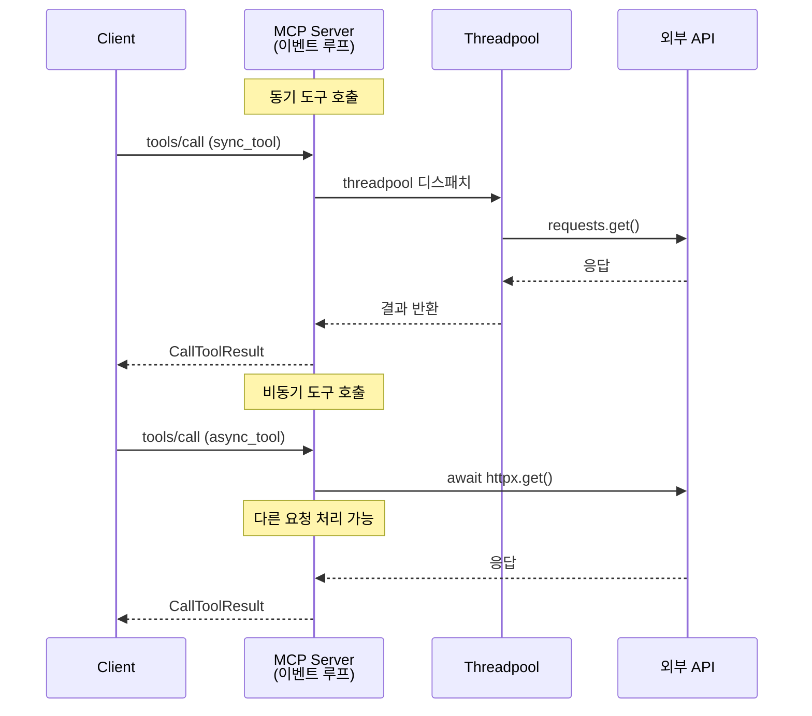
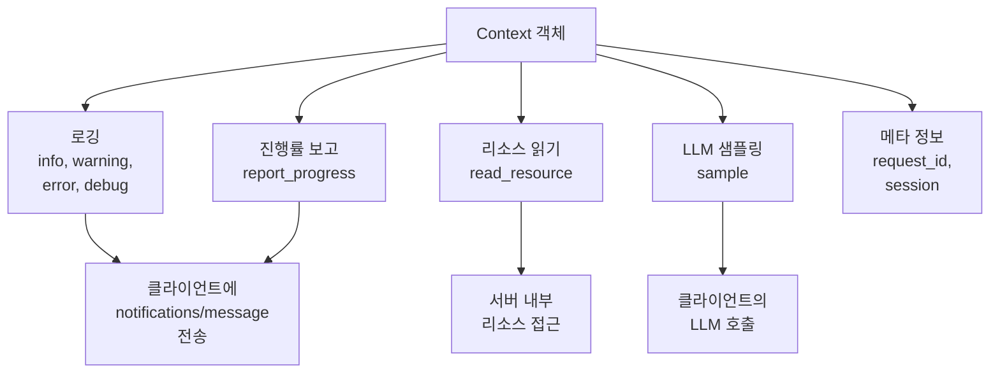
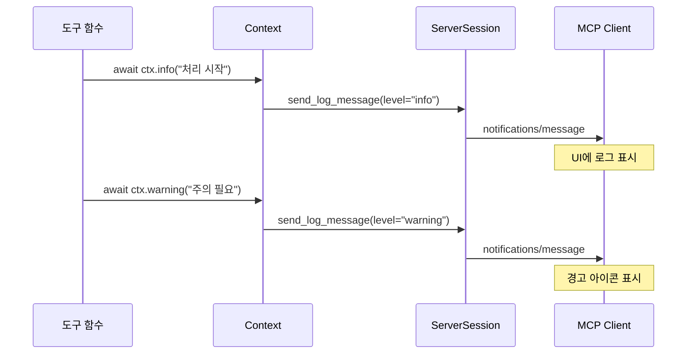
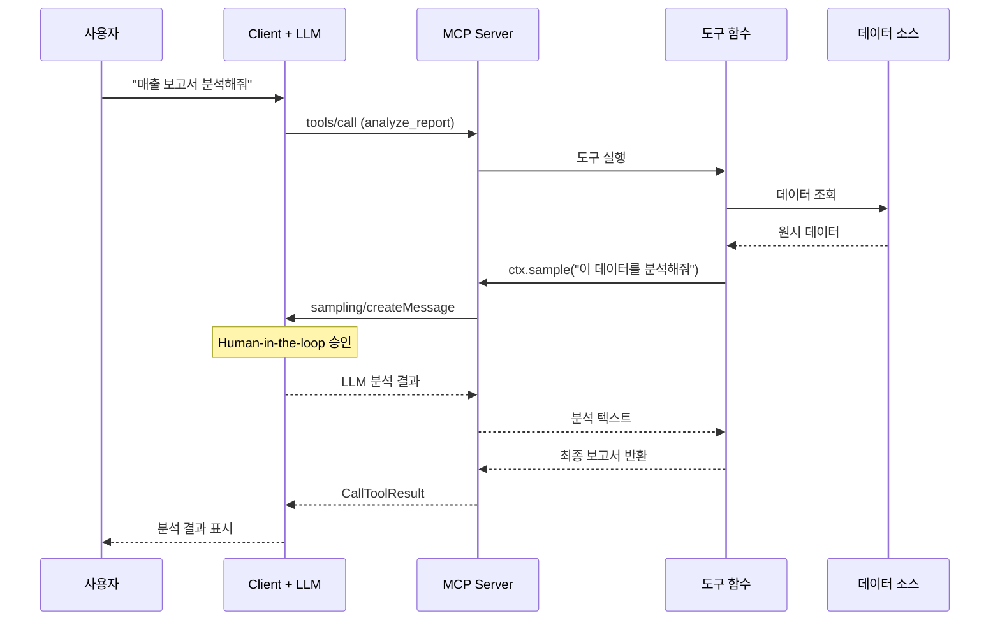
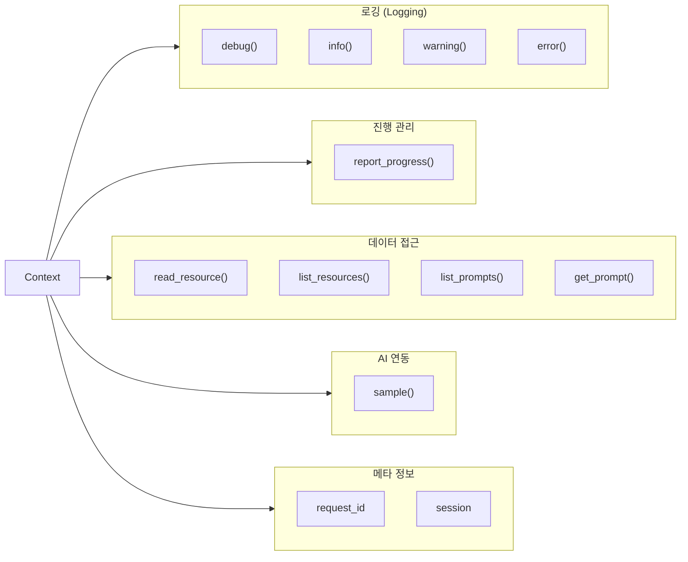

# 비동기 도구와 Context 활용

> MCP 도구의 비동기 실행 패턴과 Context 객체를 활용한 로깅, 진행률 보고, 리소스 읽기, 샘플링까지 — 도구를 "똑똑하게" 만드는 모든 기법

## 개요

이 섹션에서는 MCP 도구를 `async def`로 정의하는 비동기 패턴과, 도구 함수 안에서 사용할 수 있는 `Context` 객체의 다양한 기능을 학습합니다. Context는 도구가 바깥 세계와 소통하는 유일한 창구로, 로깅·진행률 보고·리소스 읽기·LLM 샘플링까지 지원합니다.

**선수 지식**: [04. 도구 실행 결과와 에러 처리](04-ch4-tools-함수-호출-프리미티브/04-04-도구-실행-결과와-에러-처리.md)에서 배운 CallToolResult, ToolError, `ctx.report_progress()` 기초 개념

**학습 목표**:
- `async def` 도구와 동기 도구의 실행 메커니즘 차이를 이해한다
- Context 객체의 로깅 메서드(`info`, `warning`, `error`, `debug`)를 활용할 수 있다
- `ctx.read_resource()`로 도구 내에서 서버의 리소스를 읽을 수 있다
- `ctx.sample()`로 도구 안에서 LLM에게 추론을 요청하는 에이전트형 도구를 만들 수 있다
- 장시간 실행 도구의 진행률 보고와 타임아웃 처리를 구현할 수 있다

## 왜 알아야 할까?

지금까지 만든 도구들은 입력을 받아 결과를 반환하는 단순한 함수였습니다. 하지만 실전에서 도구는 훨씬 복잡한 일을 해야 합니다. 데이터베이스에서 대량의 레코드를 처리하면서 진행률을 보고하고, 에러가 발생하면 클라이언트에 경고를 보내고, 다른 리소스의 데이터를 참조하고, 심지어 LLM에게 "이 결과를 요약해줘"라고 역으로 요청해야 할 수도 있습니다.

`Context`는 이 모든 것을 가능하게 하는 도구의 "만능 리모컨"입니다. Context 없이는 도구가 고립된 함수에 불과하지만, Context와 함께라면 MCP 서버의 전체 생태계와 연결된 지능형 에이전트가 됩니다.

## 핵심 개념

### 개념 1: async def 도구 — 왜 비동기인가?

> 💡 **비유**: 식당의 웨이터를 떠올려보세요. 동기(sync) 웨이터는 한 테이블에 음식을 주문하면 주방에서 요리가 끝날 때까지 그 자리에서 기다립니다. 비동기(async) 웨이터는 주문을 주방에 넘기고 바로 다른 테이블로 가서 주문을 받습니다. 주방에서 "요리 완료" 신호가 오면 그때 가져다 주죠. MCP 서버의 이벤트 루프가 바로 이 비동기 웨이터입니다.

MCP Python SDK는 `asyncio` 기반으로 동작합니다. 서버 자체가 하나의 이벤트 루프 위에서 돌아가기 때문에, 도구 함수의 동기/비동기 여부가 서버 전체의 성능에 직접적인 영향을 미칩니다.

> 📊 **그림 1**: 동기 도구 vs 비동기 도구의 실행 흐름



**동기 도구(`def`)**: FastMCP가 자동으로 스레드풀(threadpool)에 디스패치합니다. 내부적으로 `asyncio.to_thread()`를 사용해 동기 함수를 별도 스레드에서 실행하므로, 이벤트 루프를 블로킹하지 않습니다. 다만 스레드 간 전환 오버헤드가 발생하고, 기본 스레드풀 크기(CPython 기본 `min(32, os.cpu_count() + 4)`)에 의해 동시 실행 수가 제한됩니다. 동기 도구가 다수 동시 호출되면 대기열이 형성될 수 있다는 점을 기억하세요.

**비동기 도구(`async def`)**: 이벤트 루프에서 직접 실행됩니다. I/O 대기 시간에 다른 요청을 처리할 수 있어 훨씬 효율적입니다.

```python
import httpx
from mcp.server.fastmcp import FastMCP

mcp = FastMCP("async-demo")

# ❌ 동기 도구 — 작동하지만 스레드풀 오버헤드
@mcp.tool()
def fetch_sync(url: str) -> str:
    """URL의 내용을 가져옵니다 (동기 방식)."""
    import requests
    return requests.get(url).text[:500]

# ✅ 비동기 도구 — 이벤트 루프에서 직접 실행, 더 효율적
@mcp.tool()
async def fetch_async(url: str) -> str:
    """URL의 내용을 가져옵니다 (비동기 방식)."""
    async with httpx.AsyncClient() as client:
        response = await client.get(url)
        return response.text[:500]
```

> ⚠️ **흔한 오해**: "동기 도구를 쓰면 서버가 멈춘다"고 생각하기 쉽지만, FastMCP는 동기 함수를 자동으로 스레드풀에 위임합니다. 서버가 완전히 멈추지는 않습니다. 다만 비동기 도구가 리소스 효율 면에서 더 우수하므로, I/O 작업이 포함된 도구는 `async def`로 작성하는 것이 권장됩니다.

핵심 규칙은 간단합니다:

| 상황 | 권장 방식 | 이유 |
|------|----------|------|
| HTTP 호출, DB 쿼리 등 I/O 작업 | `async def` + `await` | 이벤트 루프 효율 극대화 |
| CPU 집약적 계산 (수학, 암호화) | `def` (동기) | 스레드풀에서 실행, 루프 미블로킹 |
| 단순 연산 (문자열 조합 등) | 둘 다 OK | 차이 미미 |

### 개념 2: Context 객체 — 도구의 만능 리모컨

> 💡 **비유**: 영화 촬영장에서 배우(도구)는 대사만 칩니다. 하지만 무전기(Context)를 가지고 있으면 감독에게 진행 상황을 보고하고, 소품팀에게 필요한 소품(리소스)을 요청하고, 다른 배우(LLM)에게 즉석 대사를 부탁할 수도 있죠. Context가 바로 그 무전기입니다.

`Context` 객체는 도구 함수의 파라미터에 타입 힌트로 추가하면 FastMCP가 자동으로 주입해줍니다. LLM에게는 보이지 않으며, `inputSchema`에도 포함되지 않습니다.

> 📊 **그림 2**: Context 객체의 기능 맵



Context를 주입하는 방법은 간단합니다:

```python
from mcp.server.fastmcp import FastMCP, Context

mcp = FastMCP("context-demo")

@mcp.tool()
async def smart_tool(query: str, ctx: Context) -> str:
    """Context를 활용하는 똑똑한 도구."""
    # ctx는 LLM에게 보이지 않음 — inputSchema에 미포함
    await ctx.info(f"쿼리 처리 중: {query}")
    return f"결과: {query}"
```

`ctx: Context` 파라미터는 도구 시그니처의 어디에든 넣을 수 있고, 이름도 자유입니다(`ctx`, `context`, `c` 등). FastMCP는 타입이 `Context`인 파라미터를 감지하면 자동으로 주입하고 스키마에서 제외합니다.

### 개념 3: 구조화된 로깅 — 도구가 말을 걸다

> 💡 **비유**: 도구의 로깅은 수술실의 모니터와 같습니다. 환자(도구 실행)가 어떤 상태인지 의사(클라이언트/사용자)에게 실시간으로 보여주죠. 심박수가 정상이면 녹색(info), 조금 불안정하면 노란색(warning), 위험하면 빨간색(error)으로 표시됩니다.

Context의 로깅 메서드는 JSON-RPC의 `notifications/message`를 통해 클라이언트에 실시간으로 전달됩니다. Python의 `logging` 모듈과 비슷한 4단계 레벨을 제공합니다:

```python
@mcp.tool()
async def process_data(file_path: str, ctx: Context) -> str:
    """파일을 처리하고 로그를 남기는 도구."""
    
    # DEBUG: 개발 시 상세 추적용 (클라이언트가 debug 레벨을 구독해야 표시)
    await ctx.debug(f"파일 경로 수신: {file_path}")
    
    # INFO: 정상 진행 상황
    await ctx.info("파일 읽기 시작")
    
    try:
        # 파일 처리 로직...
        data = "processed_content"
        await ctx.info(f"처리 완료: {len(data)}자")
        return data
    except FileNotFoundError:
        # WARNING: 계속 진행 가능하지만 주의 필요
        await ctx.warning(f"파일을 찾을 수 없어 기본값 사용: {file_path}")
        return "default_content"
    except Exception as e:
        # ERROR: 심각한 문제 발생
        await ctx.error(f"파일 처리 실패: {e}")
        raise
```

> 📊 **그림 3**: 로깅 메시지의 전달 흐름



로깅의 핵심 포인트:

- 모든 로깅 메서드는 **비동기**(`await` 필수)
- 클라이언트가 수신하는 JSON-RPC 알림 형태:
  ```json
  {
    "jsonrpc": "2.0",
    "method": "notifications/message",
    "params": {
      "level": "info",
      "data": "파일 읽기 시작",
      "logger": "context-demo"
    }
  }
  ```
- `logger_name` 파라미터로 로거를 구분할 수 있어 멀티 도구 환경에서 유용합니다

### 개념 4: 리소스 읽기 — 도구가 서버의 데이터에 접근하다

> 💡 **비유**: 회사 직원(도구)이 업무 중 사내 위키(리소스)를 참조하는 것과 같습니다. 직접 외부에 요청하지 않고, 이미 회사 내부에 정리된 데이터를 가져오는 거죠.

도구 안에서 `ctx.read_resource()`를 사용하면 같은 서버에 등록된 리소스를 읽을 수 있습니다. 이를 통해 도구가 서버의 설정이나 데이터를 참조하여 더 풍부한 결과를 만들어낼 수 있습니다.

여기서는 **도구 입장에서 리소스를 "소비하는" 방법**에 집중합니다. 아래 예제에서 `@mcp.resource()` 데코레이터로 리소스를 정의하는 코드가 등장하는데, 이는 `ctx.read_resource()`가 읽을 대상이 필요하기에 간단히 보여드리는 것입니다. 리소스의 정의 방법 — URI 스킴 설계, 정적/동적 리소스, 템플릿, MIME 타입 처리 등 — 은 [Ch5. Resources — 데이터 노출 프리미티브](05-ch5-resources-데이터-노출-프리미티브/01-01-resource-프리미티브-이해.md)에서 본격적으로 다룹니다. 지금은 "도구가 리소스를 읽을 수 있다"는 점만 기억하면 충분합니다.

```python
mcp = FastMCP("resource-tool-demo")

# 리소스 정의 (간단한 예시 — 리소스의 상세한 정의 방법은 Ch5에서 학습)
@mcp.resource("config://app")
def get_app_config() -> str:
    """애플리케이션 설정을 반환합니다."""
    return '{"max_results": 10, "language": "ko", "debug": false}'

# 도구에서 리소스 읽기 — 이 섹션의 핵심
@mcp.tool()
async def search_with_config(query: str, ctx: Context) -> str:
    """서버 설정을 참조하여 검색합니다."""
    # 같은 서버의 리소스를 URI로 읽기
    config_contents = await ctx.read_resource("config://app")
    
    import json
    config = json.loads(config_contents[0].content)
    max_results = config["max_results"]
    
    await ctx.info(f"설정 로드 완료: max_results={max_results}")
    
    # 설정을 활용한 검색 로직
    results = [f"결과 {i}: {query}" for i in range(1, max_results + 1)]
    return "\n".join(results)
```

`ctx.read_resource()`는 URI 문자열을 받아 `list[ReadResourceContents]`를 반환합니다. 각 항목의 `.content` 속성에 실제 데이터가 담겨 있습니다. 리소스 목록 조회도 가능합니다:

```python
# 사용 가능한 리소스 목록 확인
resources = await ctx.list_resources()
for r in resources:
    await ctx.debug(f"리소스 발견: {r.uri} - {r.name}")
```

> 📊 **그림 F**: ctx.read_resource()의 동작 — 도구가 리소스를 소비하는 흐름


### 개념 5: LLM 샘플링 — 도구가 LLM에게 역으로 질문하다

> 💡 **비유**: 탐정(도구)이 수사 중 전문가(LLM)에게 자문을 구하는 것과 같습니다. "이 증거를 어떻게 해석해야 할까요?"라고 물어보고, 전문가의 의견을 받아 수사에 반영하죠. 단, 반드시 의뢰인(사용자)의 승인을 거쳐야 합니다 — Human-in-the-loop 원칙이죠.

[Sampling](06-ch6-prompts와-sampling/03-03-sampling-서버llm-역요청.md)은 MCP에서 가장 강력하면서도 독특한 기능입니다. 도구가 실행 중에 클라이언트의 LLM에게 "이것 좀 처리해줘"라고 역으로 요청할 수 있습니다. 이를 통해 데이터 수집 → LLM 분석 → 결과 반환의 에이전트형 워크플로를 도구 하나로 구현할 수 있습니다. 여기서는 `ctx.sample()`의 도구 내 활용법에 집중하고, Sampling 프리미티브의 전체 그림 — 프로토콜 흐름, 클라이언트 측 구현, Human-in-the-loop 정책, `createMessage` 스펙 등 — 은 [Ch6. Sampling — 서버→LLM 역요청](06-ch6-prompts와-sampling/03-03-sampling-서버llm-역요청.md)에서 본격적으로 다룹니다.

> 📊 **그림 4**: Sampling을 활용한 에이전트형 도구 흐름



```python
@mcp.tool()
async def analyze_data(dataset_name: str, ctx: Context) -> str:
    """데이터를 조회하고 LLM에게 분석을 요청합니다."""
    
    # 1단계: 데이터 수집
    await ctx.info(f"데이터셋 '{dataset_name}' 조회 중...")
    raw_data = await fetch_dataset(dataset_name)  # 외부 데이터 소스
    
    # 2단계: LLM에게 분석 요청 (Sampling)
    await ctx.info("LLM에게 분석 요청 중...")
    result = await ctx.sample(
        f"다음 데이터를 분석하고 핵심 인사이트를 3가지로 요약해주세요:\n\n{raw_data}",
        system_prompt="당신은 데이터 분석 전문가입니다. 한국어로 답변하세요.",
        max_tokens=1024
    )
    
    # 3단계: 결과 조합
    return f"## 데이터 분석 결과\n\n**데이터셋**: {dataset_name}\n\n{result.text}"
```

**중요**: `ctx.sample()`은 서버의 LLM이 아니라 **클라이언트의 LLM**에게 요청을 보냅니다. 서버는 가볍게 유지되고, 실제 추론은 클라이언트 측에서 일어납니다. 클라이언트가 `sampling` capability를 지원해야 동작하며, Human-in-the-loop 승인이 필요할 수 있습니다.

## 실습: 직접 해보기

모든 Context 기능을 종합한 실전 도구를 만들어봅시다. 여러 URL의 콘텐츠를 비동기로 수집하고, 진행률을 보고하며, 서버 설정을 참조하는 "웹 수집기" 도구입니다.

```python
# server.py — Context 종합 활용 MCP 서버
import asyncio
import json
from datetime import datetime

import httpx
from mcp.server.fastmcp import FastMCP, Context

mcp = FastMCP("web-collector")

# ── 리소스: 수집기 설정 (리소스 정의 문법은 Ch5에서 자세히 다룹니다) ──
@mcp.resource("config://collector")
def collector_config() -> str:
    """웹 수집기의 설정을 반환합니다."""
    return json.dumps({
        "timeout_seconds": 10,
        "max_content_length": 2000,
        "user_agent": "MCP-WebCollector/1.0",
        "retry_count": 2
    })

# ── 도구: 웹 수집기 ──
@mcp.tool()
async def collect_web_pages(
    urls: list[str],
    ctx: Context,
) -> str:
    """여러 URL의 콘텐츠를 비동기로 수집합니다.

    Args:
        urls: 수집할 URL 목록 (최대 10개)
    """
    # 1단계: 설정 로드 (리소스 읽기)
    await ctx.info("설정 로드 중...")
    config_data = await ctx.read_resource("config://collector")
    config = json.loads(config_data[0].content)
    timeout = config["timeout_seconds"]
    max_length = config["max_content_length"]

    await ctx.info(f"수집 시작: {len(urls)}개 URL, 타임아웃: {timeout}s")

    # 2단계: 비동기 병렬 수집 + 진행률 보고
    results: dict[str, str] = {}
    errors: list[str] = []

    async with httpx.AsyncClient(
        timeout=timeout,
        headers={"User-Agent": config["user_agent"]},
        follow_redirects=True,
    ) as client:
        for i, url in enumerate(urls):
            # 진행률 보고
            await ctx.report_progress(i, len(urls))

            try:
                await ctx.debug(f"요청 중: {url}")
                response = await client.get(url)
                response.raise_for_status()
                content = response.text[:max_length]
                results[url] = content
                await ctx.info(f"수집 완료: {url} ({len(content)}자)")
            except httpx.TimeoutException:
                await ctx.warning(f"타임아웃: {url}")
                errors.append(f"타임아웃: {url}")
            except httpx.HTTPStatusError as e:
                await ctx.warning(f"HTTP 에러 {e.response.status_code}: {url}")
                errors.append(f"HTTP {e.response.status_code}: {url}")
            except Exception as e:
                await ctx.error(f"수집 실패: {url} — {e}")
                errors.append(f"실패: {url} — {str(e)}")

    # 최종 진행률 100%
    await ctx.report_progress(len(urls), len(urls))

    # 3단계: 결과 조합
    output_parts = [f"# 웹 수집 결과\n"]
    output_parts.append(f"- 수집 시각: {datetime.now().isoformat()}")
    output_parts.append(f"- 성공: {len(results)}건 / 실패: {len(errors)}건\n")

    for url, content in results.items():
        output_parts.append(f"## {url}\n```\n{content[:500]}\n```\n")

    if errors:
        output_parts.append("## 에러 목록\n")
        for err in errors:
            output_parts.append(f"- {err}")

    return "\n".join(output_parts)


if __name__ == "__main__":
    mcp.run()
```

이 서버를 MCP Inspector로 테스트해봅시다:

```run:python
# 테스트 시뮬레이션 — 도구의 동작 흐름을 확인
steps = [
    ("INFO",    "설정 로드 중..."),
    ("INFO",    "수집 시작: 3개 URL, 타임아웃: 10s"),
    ("DEBUG",   "요청 중: https://example.com"),
    ("PROGRESS", "1/3 (33%)"),
    ("INFO",    "수집 완료: https://example.com (1256자)"),
    ("DEBUG",   "요청 중: https://httpbin.org/json"),
    ("PROGRESS", "2/3 (66%)"),
    ("INFO",    "수집 완료: https://httpbin.org/json (487자)"),
    ("WARNING", "타임아웃: https://slow-server.example.com"),
    ("PROGRESS", "3/3 (100%)"),
]

print("=== collect_web_pages 실행 흐름 ===\n")
for level, msg in steps:
    prefix = {"INFO": "ℹ️", "DEBUG": "🔍", "WARNING": "⚠️", "PROGRESS": "📊"}.get(level, "  ")
    print(f"  {prefix} [{level:8s}] {msg}")

print("\n=== CallToolResult ===")
print("  성공: 2건 / 실패: 1건")
```

```output
=== collect_web_pages 실행 흐름 ===

  ℹ️ [INFO    ] 설정 로드 중...
  ℹ️ [INFO    ] 수집 시작: 3개 URL, 타임아웃: 10s
  🔍 [DEBUG   ] 요청 중: https://example.com
  📊 [PROGRESS] 1/3 (33%)
  ℹ️ [INFO    ] 수집 완료: https://example.com (1256자)
  🔍 [DEBUG   ] 요청 중: https://httpbin.org/json
  📊 [PROGRESS] 2/3 (66%)
  ℹ️ [INFO    ] 수집 완료: https://httpbin.org/json (487자)
  ⚠️ [WARNING ] 타임아웃: https://slow-server.example.com
  📊 [PROGRESS] 3/3 (100%)

=== CallToolResult ===
  성공: 2건 / 실패: 1건
```

실제 실행은 터미널에서 MCP Inspector를 사용합니다:

```console
$ npx @modelcontextprotocol/inspector python server.py
```

Inspector의 Tools 탭에서 `collect_web_pages`를 선택하고, `urls` 파라미터에 JSON 배열을 입력하면 로깅 메시지와 진행률이 실시간으로 표시됩니다.

### 장시간 실행 도구 — 타임아웃과 graceful 처리

실전에서 도구가 수분 이상 걸리는 작업을 수행할 때는 타임아웃 관리가 중요합니다:

```python
from mcp.server.fastmcp import FastMCP, Context
from mcp.shared.exceptions import ToolError

mcp = FastMCP("long-running-demo")

@mcp.tool()
async def batch_process(
    items: list[str],
    ctx: Context,
) -> str:
    """대량 아이템을 배치 처리합니다.

    Args:
        items: 처리할 아이템 목록
    """
    total = len(items)
    processed = []
    failed = []

    await ctx.info(f"배치 처리 시작: {total}건")

    for i, item in enumerate(items):
        # 진행률 보고 — 클라이언트 UI가 프로그레스바를 표시
        await ctx.report_progress(i, total, f"처리 중: {item}")

        try:
            # 개별 아이템 처리 (비동기)
            result = await process_single_item(item)
            processed.append(result)
        except asyncio.CancelledError:
            # 클라이언트가 요청을 취소한 경우
            await ctx.warning(f"취소됨 — {i}/{total} 처리 완료")
            break
        except Exception as e:
            await ctx.warning(f"아이템 '{item}' 처리 실패: {e}")
            failed.append(item)

    # 최종 보고
    await ctx.report_progress(total, total, "완료")
    
    summary = f"처리 완료: 성공 {len(processed)}건, 실패 {len(failed)}건"
    await ctx.info(summary)
    
    if failed:
        await ctx.warning(f"실패 아이템: {', '.join(failed)}")
    
    return summary


async def process_single_item(item: str) -> str:
    """개별 아이템을 처리하는 헬퍼 (시뮬레이션)."""
    await asyncio.sleep(0.5)  # 실제로는 API 호출, DB 쿼리 등
    return f"processed_{item}"
```

> 🔥 **실무 팁**: `report_progress`의 세 번째 인자 `message`는 선택 사항이지만, 사용자에게 현재 무엇을 처리 중인지 알려주면 UX가 크게 좋아집니다. Claude Desktop은 이 메시지를 진행률 표시 옆에 렌더링합니다.

## 더 깊이 알아보기

### Context의 탄생 — "도구에 자아를 부여하다"

MCP의 Context 개념은 웹 프레임워크의 요청 컨텍스트(Flask의 `request`, Express의 `req`)에서 영감을 받았습니다. 초기 MCP 스펙(2024년 11월)에서 도구는 순수 함수에 가까웠지만, 개발자들이 "도구 안에서 로그를 남기고 싶다", "진행률을 보고하고 싶다"는 요구를 계속 제기했습니다.

Python SDK의 주요 기여자들이 웹 프레임워크의 DI(Dependency Injection) 패턴을 도입하여 Context를 설계했습니다. 타입 힌트 기반 자동 주입은 FastAPI의 `Depends()`에서 직접 영향을 받은 패턴이죠. 실제로 FastMCP의 이름 자체가 Fast**API** + **MCP**의 합성어라는 점에서 그 계보가 명확합니다.

Sampling 기능은 더 흥미로운 배경을 갖고 있습니다. 기존 도구 시스템(LangChain, OpenAI Function Calling)에서는 도구가 LLM에게 역으로 요청하는 것이 불가능했습니다. MCP 팀은 "서버가 클라이언트의 LLM을 빌려 쓸 수 있다면?"이라는 발상으로 Sampling을 설계했는데, 이는 기존 클라이언트-서버 모델에서는 파격적인 역방향 요청 패턴입니다. Human-in-the-loop 요건이 붙은 것도 바로 이 "역방향" 특성 때문입니다 — 서버가 무한정 LLM을 호출하는 것을 사용자가 통제할 수 있어야 하니까요.

### Context 메서드 전체 맵

참고로, Context가 제공하는 주요 기능을 정리하면 다음과 같습니다:

> 📊 **그림 5**: Context 메서드 카테고리별 분류



## 흔한 오해와 팁

> ⚠️ **흔한 오해**: "동기 도구(`def`)를 쓰면 서버가 완전히 블로킹된다." — 아닙니다. FastMCP는 동기 함수를 `asyncio.to_thread()`를 통해 스레드풀에서 실행합니다. 이벤트 루프 자체는 블로킹되지 않습니다. 하지만 스레드풀 크기에 제한이 있으므로, 동시에 많은 동기 도구가 호출되면 대기열이 생길 수 있습니다. I/O 바운드 작업은 `async def`가 확실히 유리합니다.

> ⚠️ **흔한 오해**: "`ctx.sample()`은 서버에서 LLM을 직접 실행한다." — 아닙니다. Sampling 요청은 클라이언트로 전달되고, 클라이언트가 자신의 LLM을 사용해 응답합니다. 서버는 어떤 LLM 모델도 로드하지 않습니다. 클라이언트가 `sampling` capability를 지원하지 않으면 에러가 발생합니다.

> ⚠️ **흔한 오해**: "`ctx.read_resource()`를 쓰려면 Resource 개념을 완벽히 알아야 한다." — 도구 입장에서 리소스를 읽는 것은 URI만 알면 됩니다. `await ctx.read_resource("config://app")`처럼 URI를 전달하고 결과를 받는 것이 전부죠. 리소스를 **정의하고 설계하는** 방법(URI 스킴, 정적/동적 리소스, 템플릿 등)은 [Ch5. Resources](05-ch5-resources-데이터-노출-프리미티브/01-01-resource-프리미티브-이해.md)에서 다루니, 지금은 "도구가 URI로 데이터를 읽을 수 있다"는 사실만 기억하면 됩니다.

> 💡 **알고 계셨나요?**: Context의 `request_id` 속성은 각 도구 호출마다 고유합니다. 이를 활용하면 분산 트레이싱 시스템과 연동하여 "이 도구 호출이 전체 대화에서 어디에 해당하는지" 추적할 수 있습니다. 대규모 MCP 배포에서 디버깅할 때 매우 유용합니다.

> 🔥 **실무 팁**: `ctx.read_resource()`로 서버 설정을 읽는 패턴은 하드코딩을 피하면서도 도구의 동작을 유연하게 제어할 수 있어 강력합니다. 설정 리소스를 별도로 정의하고, 도구가 실행 시 읽어가게 하면 서버 재시작 없이 동작을 바꿀 수 있습니다.

> 🔥 **실무 팁**: 비동기 도구에서 `time.sleep()` 같은 동기 블로킹 호출을 실수로 사용하면 이벤트 루프 전체가 멈춥니다. 반드시 `await asyncio.sleep()`을 사용하세요. HTTP 요청도 `requests` 대신 `httpx.AsyncClient`를 사용하는 것이 핵심입니다.

## 핵심 정리

| 개념 | 설명 |
|------|------|
| `async def` 도구 | 이벤트 루프에서 직접 실행. I/O 바운드 작업에 최적. `await` 사용 |
| `def` 동기 도구 | 자동으로 스레드풀 디스패치. CPU 바운드 작업에 적합 |
| `Context` 주입 | `ctx: Context` 파라미터 추가 시 자동 주입, 스키마에서 제외 |
| `ctx.info/warning/error/debug` | `notifications/message`로 클라이언트에 실시간 로그 전송 |
| `ctx.report_progress(i, total)` | `notifications/progress`로 진행률 전송. UI 프로그레스바 연동 |
| `ctx.read_resource(uri)` | 같은 서버의 리소스를 도구 내에서 읽기. 리소스 정의는 Ch5에서 학습 |
| `ctx.sample(message)` | 클라이언트 LLM에 역방향 추론 요청. 에이전트형 도구의 핵심 |
| `ctx.request_id` | 도구 호출별 고유 ID. 트레이싱·디버깅에 활용 |

## 다음 섹션 미리보기

Ch4의 Tools 여정이 여기서 마무리됩니다. 다음 [Ch5. Resources — 데이터 노출 프리미티브](05-ch5-resources-데이터-노출-프리미티브/01-01-resource-프리미티브-이해.md)에서는 도구와 쌍을 이루는 두 번째 프리미티브인 **Resource**를 다룹니다. 이 섹션에서 `ctx.read_resource()`로 살짝 맛본 리소스의 정의 방법, URI 설계, 정적/동적 리소스, MIME 타입 처리까지 본격적으로 학습합니다. Tools가 "행동"이라면 Resources는 "지식" — 이 둘을 조합하면 진정한 MCP 서버가 완성됩니다.

## 참고 자료

- [MCP Python SDK — GitHub 리포지토리](https://github.com/modelcontextprotocol/python-sdk) — 공식 SDK 소스코드. Context 클래스 구현과 예제 확인
- [FastMCP — Context 공식 문서](https://gofastmcp.com/servers/context) — Context 객체의 모든 메서드와 사용법을 상세히 설명
- [FastMCP — Tools 공식 문서](https://gofastmcp.com/servers/tools) — async/sync 도구 정의, 타임아웃, 백그라운드 태스크 패턴
- [FastMCP — Sampling 공식 문서](https://gofastmcp.com/servers/sampling) — ctx.sample(), sample_step() 활용법과 에이전트형 워크플로
- [MCP 공식 사양 — Sampling](https://modelcontextprotocol.io/specification/2025-11-25) — Sampling 프로토콜의 공식 스펙 정의
- [Real Python — Build a Python MCP Server](https://realpython.com/python-mcp/) — Python으로 MCP 서버를 구축하는 실전 튜토리얼

---
### 🔗 Related Sessions
- [calltoolresult](04-ch4-tools-함수-호출-프리미티브/04-04-도구-실행-결과와-에러-처리.md) (prerequisite)
- [iserror](04-ch4-tools-함수-호출-프리미티브/01-01-tool-프리미티브-이해.md) (prerequisite)
- [toolerror](04-ch4-tools-함수-호출-프리미티브/03-03-입력-검증과-pydantic-모델.md) (prerequisite)
- [notifications/progress](04-ch4-tools-함수-호출-프리미티브/04-04-도구-실행-결과와-에러-처리.md) (prerequisite)
