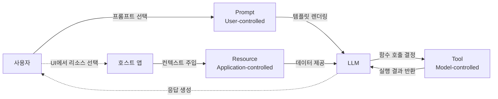
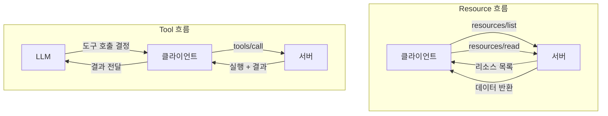
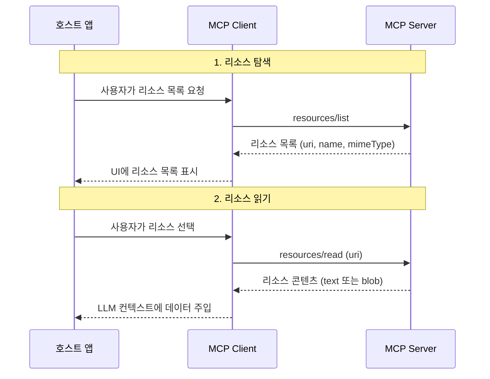
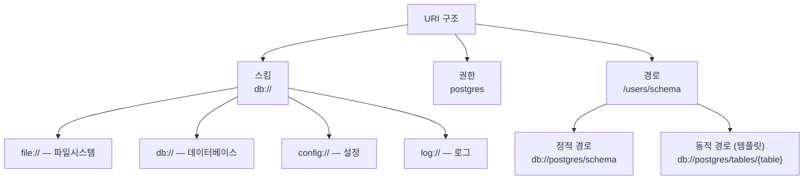
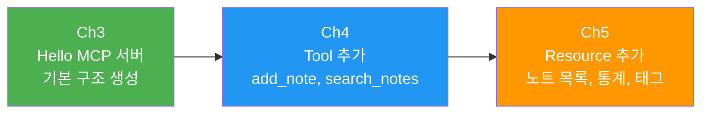

# Resource 프리미티브 이해

> MCP 서버가 클라이언트에게 데이터를 노출하는 Resource 프리미티브의 개념, 프로토콜, URI 설계를 이해합니다

## 개요

이 섹션에서는 MCP의 세 가지 핵심 프리미티브 중 하나인 **Resource**를 깊이 있게 살펴봅니다. 앞서 [Ch4. Tools](04-ch4-tools-함수-호출-프리미티브/01-01-tool-프리미티브-이해.md)에서 LLM이 "행위"를 수행하는 Tool을 배웠다면, 이번에는 LLM에게 "데이터"를 제공하는 Resource의 세계로 들어갑니다.

우리는 Ch3에서 [Hello MCP 서버](03-ch3-개발-환경-설정과-첫-mcp-서버/02-02-hello-mcp-첫-번째-서버-만들기.md)를 만들었고, Ch4에서 그 서버에 [노트 추가·검색 Tool](04-ch4-tools-함수-호출-프리미티브/02-02-tool-스키마-정의와-입력-검증.md)을 붙여 기능을 확장했습니다. 이번 Ch5에서는 같은 서버에 **Resource를 추가**하여 노트 목록이나 통계 같은 데이터를 LLM 컨텍스트에 자연스럽게 노출하는 방법을 배웁니다. Tool이 "노트를 추가해줘"라는 **행위**를 처리했다면, Resource는 "현재 노트가 몇 개야?", "어떤 태그가 있어?"처럼 **데이터를 읽는** 요청에 최적화된 프리미티브입니다.

**선수 지식**: [Host/Client/Server 3계층](02-ch2-mcp-아키텍처와-프로토콜-구조/01-01-hostclientserver-3계층.md) 아키텍처와 [JSON-RPC 2.0 메시지 포맷](02-ch2-mcp-아키텍처와-프로토콜-구조/04-04-json-rpc-20-메시지-포맷.md)의 기본 이해, [FastMCP로 서버 만들기](03-ch3-개발-환경-설정과-첫-mcp-서버/02-02-hello-mcp-첫-번째-서버-만들기.md) 경험

**학습 목표**:
- Resource 프리미티브가 무엇이고, Tool과 어떻게 다른지 설명할 수 있다
- `resources/list`와 `resources/read` 프로토콜 흐름을 이해한다
- URI 스킴을 설계하고, FastMCP `@mcp.resource()` 데코레이터로 리소스를 정의할 수 있다
- Application-controlled와 Model-controlled의 차이를 구분할 수 있다

## 왜 알아야 할까?

LLM은 아무리 똑똑해도 **볼 수 없는 데이터에 대해서는 답할 수 없습니다**. 여러분의 프로젝트 설정 파일, 데이터베이스 스키마, 로그 파일 — 이런 것들이 LLM의 컨텍스트에 들어가야 비로소 의미 있는 답변이 나오거든요.

Ch4에서 우리가 만든 노트 관리 서버를 떠올려 보세요. `add_note`, `search_notes` 같은 Tool을 통해 LLM이 노트를 추가하고 검색할 수 있게 했죠. 하지만 "지금 노트가 총 몇 개야?", "어떤 태그를 쓰고 있어?", "최근에 추가된 노트 5개를 보여줘"처럼 **현재 상태를 파악**하는 요청에는 Tool이 적합하지 않습니다. Tool은 "실행"을 위한 것이지 "조회"를 위한 것이 아니거든요. 데이터를 읽기만 하는데 Tool을 쓰면 불필요한 사용자 승인 단계를 거치게 되고, 보안 모델도 복잡해집니다.

Resource를 제대로 이해하면, MCP 서버를 설계할 때 "이건 Tool로 할까, Resource로 할까?"라는 판단을 자신 있게 내릴 수 있습니다.

## 핵심 개념

### 개념 1: Resource란 무엇인가 — 도서관의 서가

> 💡 **비유**: Resource는 **도서관의 서가**와 같습니다. 서가에 꽂힌 책(데이터)은 누구나 꺼내 읽을 수 있지만, 책의 내용을 바꾸거나 새 책을 쓰는 건 사서(Tool)의 일이죠. Resource는 서버가 클라이언트에게 "여기 이런 데이터가 있어요, 읽어가세요"라고 노출하는 **읽기 전용 데이터**입니다.

MCP에서 Resource는 서버가 클라이언트에게 제공하는 **구조화된 데이터 단위**입니다. 파일, 데이터베이스 스키마, 설정값, 로그, 이미지 — 거의 모든 종류의 데이터가 Resource가 될 수 있어요. 핵심 특징은 세 가지입니다:

1. **URI로 식별**: 모든 리소스는 고유한 URI(Uniform Resource Identifier)로 식별됩니다
2. **읽기 전용**: 리소스를 통해 데이터를 변경할 수 없습니다
3. **Application-controlled**: 리소스를 언제, 어떻게 사용할지는 호스트 애플리케이션이 결정합니다

> 📊 **그림 1**: MCP 프리미티브의 제어 주체와 데이터 흐름



여기서 **Application-controlled**라는 말이 중요합니다. [Ch4에서 배운 Model-controlled Tool](04-ch4-tools-함수-호출-프리미티브/01-01-tool-프리미티브-이해.md)과 달리, Resource는 호스트 애플리케이션(예: Claude Desktop, VS Code)이 "이 데이터를 LLM 컨텍스트에 넣을지 말지"를 결정합니다. Tool은 LLM이 "이 함수를 호출하겠다"고 스스로 결정하는 Model-controlled인 반면, Resource는 사용자가 UI에서 리소스를 선택하거나, 애플리케이션이 자동으로 관련 리소스를 포함시키는 식이죠. 그림 1을 보면 각 프리미티브의 제어 흐름이 명확히 다른 것을 확인할 수 있습니다 — 사용자가 Prompt를, 호스트 앱이 Resource를, LLM이 Tool을 각각 주도합니다.

### 개념 2: Resource vs Tool — 읽기와 행위의 구분

> 💡 **비유**: 식당에서 **메뉴판**(Resource)과 **주문**(Tool)을 생각해보세요. 메뉴판을 보는 건 아무런 부작용이 없지만, 주문을 하면 요리가 시작되고 돈이 나갑니다. Resource는 메뉴판처럼 읽기만 하고, Tool은 주문처럼 실제 작업을 수행합니다.

이 구분은 단순한 카테고리 분류가 아닙니다. **보안**과 직결되거든요.

| 구분 | Resource | Tool |
|------|----------|------|
| **목적** | 데이터 제공 (읽기) | 작업 수행 (실행) |
| **제어 주체** | 호스트 앱 (Application-controlled) | LLM (Model-controlled) |
| **부작용** | 없음 (읽기 전용) | 있음 (파일 변경, API 호출 등) |
| **사용자 동의** | 보통 자동 또는 묵시적 | 명시적 승인 필요 |
| **호출 방법** | `resources/read` | `tools/call` |
| **결과 형태** | 텍스트 또는 바이너리 콘텐츠 | 구조화된 실행 결과 |

> 📊 **그림 2**: Resource와 Tool의 데이터 흐름 비교



**우리 노트 관리 서버를 예로 들어볼까요?** Ch4에서 `add_note`(노트 추가), `search_notes`(노트 검색) Tool을 만들었습니다. 이제 Ch5에서 Resource를 추가한다면:

- **Resource로 만들 것**: 전체 노트 목록, 태그별 통계, 서버 설정 정보 → 읽기만 하면 됨
- **Tool로 유지할 것**: 노트 추가, 노트 삭제, 노트 수정 → 데이터를 변경하는 행위

판단 기준은 간단합니다:

- "데이터를 **보여주기**만 하면 되나?" → **Resource**
- "서버에서 무언가를 **실행해야** 하나?" → **Tool**
- "호출 시 **부작용**(side effect)이 있나?" → **Tool**
- "LLM이 매번 **스스로 결정**해서 호출해야 하나?" → **Tool**

### 개념 3: resources/list와 resources/read 프로토콜

> 💡 **비유**: 온라인 쇼핑몰을 떠올려보세요. 먼저 **상품 목록 페이지**(resources/list)에서 어떤 상품이 있는지 훑어보고, 마음에 드는 상품을 클릭하면 **상세 페이지**(resources/read)에서 자세한 정보를 읽습니다.

Resource 프로토콜은 두 단계로 동작합니다:

**1단계: 리소스 탐색 — `resources/list`**

클라이언트가 서버에 "어떤 리소스가 있나요?"라고 묻습니다. 서버는 자신이 제공할 수 있는 리소스 목록을 반환하죠.

```json
// 요청
{
  "jsonrpc": "2.0",
  "id": 1,
  "method": "resources/list",
  "params": { "cursor": "optional-cursor-value" }
}

// 응답
{
  "jsonrpc": "2.0",
  "id": 1,
  "result": {
    "resources": [
      {
        "uri": "config://app/settings",
        "name": "앱 설정",
        "description": "현재 애플리케이션 설정값",
        "mimeType": "application/json"
      },
      {
        "uri": "file:///project/schema.sql",
        "name": "DB 스키마",
        "description": "데이터베이스 테이블 정의",
        "mimeType": "text/plain"
      }
    ]
  }
}
```

**2단계: 리소스 읽기 — `resources/read`**

목록에서 원하는 리소스의 URI를 지정하여 실제 콘텐츠를 요청합니다.

```json
// 요청
{
  "jsonrpc": "2.0",
  "id": 2,
  "method": "resources/read",
  "params": { "uri": "config://app/settings" }
}

// 응답
{
  "jsonrpc": "2.0",
  "id": 2,
  "result": {
    "contents": [
      {
        "uri": "config://app/settings",
        "mimeType": "application/json",
        "text": "{\"debug\": false, \"max_connections\": 100}"
      }
    ]
  }
}
```

> 📊 **그림 3**: Resource 프로토콜 시퀀스 다이어그램



응답의 `contents` 배열이 눈에 띄시나요? 하나의 `resources/read` 요청이 **여러 개의 콘텐츠**를 반환할 수 있습니다. 예를 들어, 디렉토리 리소스를 읽으면 여러 파일의 내용을 한번에 반환할 수 있죠.

콘텐츠는 두 가지 형태입니다:
- **TextResourceContents**: `text` 필드에 문자열 데이터 (텍스트, JSON, SQL 등)
- **BlobResourceContents**: `blob` 필드에 base64 인코딩된 바이너리 데이터 (이미지, PDF 등)

### 개념 4: URI 스킴 설계

> 💡 **비유**: 도서관에서 책을 찾으려면 **청구기호**(call number)가 있어야 하듯, MCP에서 리소스를 찾으려면 **URI**가 있어야 합니다. URI 스킴은 도서관의 분류 체계와 같아서, 잘 설계하면 어떤 리소스가 어디에 있는지 직관적으로 알 수 있죠.

MCP에서 모든 리소스는 [RFC 3986](https://datatracker.ietf.org/doc/html/rfc3986) 표준을 따르는 URI로 식별됩니다. MCP 스펙은 몇 가지 표준 URI 스킴을 정의하고 있습니다:

| URI 스킴 | 용도 | 예시 |
|-----------|------|------|
| `file://` | 파일시스템 리소스 | `file:///project/src/main.py` |
| `https://` | 웹에서 직접 접근 가능한 리소스 | `https://api.example.com/schema` |
| `git://` | Git 버전 관리 리소스 | `git://repo/branch/file.py` |
| 커스텀 스킴 | 도메인 특화 리소스 | `db://postgres/users`, `config://app/settings` |

커스텀 URI 스킴을 설계할 때의 좋은 패턴은 이렇습니다:

```
{도메인}://{카테고리}/{리소스_식별자}
```

> 📊 **그림 4**: URI 스킴 설계 패턴



> ⚠️ **흔한 오해**: `https://` 스킴은 "서버가 웹에서 다운로드하는 데이터"에 쓰는 게 아닙니다. **클라이언트가 직접 웹에서 가져올 수 있는** 리소스에만 써야 합니다. 서버가 내부적으로 웹 API를 호출해서 데이터를 가져오는 경우에는 커스텀 스킴(예: `api://github/repos`)을 사용하세요.

### 개념 5: FastMCP로 Resource 정의하기

이론을 충분히 이해했으니, Python으로 직접 만들어 봅시다. FastMCP의 `@mcp.resource()` 데코레이터를 사용하면 함수 하나로 리소스를 정의할 수 있습니다.

```python
from mcp.server.fastmcp import FastMCP

mcp = FastMCP("demo-server")

# 정적 리소스: 고정된 URI, 항상 같은 데이터
@mcp.resource("config://app/settings")
def get_app_settings() -> str:
    """애플리케이션의 현재 설정값을 반환합니다."""
    return '{"debug": false, "version": "2.1.0", "max_connections": 100}'

# 딕셔너리를 반환하면 자동으로 JSON 직렬화
@mcp.resource("config://app/database")
def get_db_config() -> dict:
    """데이터베이스 연결 설정을 반환합니다."""
    return {
        "host": "localhost",
        "port": 5432,
        "database": "myapp",
        "pool_size": 10
    }
```

데코레이터에 전달하는 문자열이 바로 리소스의 **URI**입니다. 함수의 **docstring**은 `resources/list` 응답의 `description` 필드가 됩니다. 반환 타입에 따라 MCP SDK가 자동으로 적절한 MIME 타입을 추론하죠.

리소스 템플릿(동적 리소스)도 간단합니다 — URI에 `{변수명}`을 넣으면 됩니다:

```python
# 동적 리소스: URI 템플릿으로 매개변수 매핑
@mcp.resource("users://{user_id}/profile")
def get_user_profile(user_id: str) -> dict:
    """특정 사용자의 프로필 정보를 반환합니다."""
    # 실제로는 DB에서 조회
    profiles = {
        "alice": {"name": "Alice", "role": "admin"},
        "bob": {"name": "Bob", "role": "user"}
    }
    return profiles.get(user_id, {"error": "사용자를 찾을 수 없습니다"})
```

URI에 `{user_id}`를 넣으면 FastMCP가 이를 **ResourceTemplate**으로 등록하고, 클라이언트가 `users://alice/profile`로 요청하면 `user_id="alice"`를 인자로 함수를 호출합니다. RFC 6570 URI 템플릿 표준을 따르는 거죠.

## 실습: 노트 관리 서버에 Resource 추가하기

Ch3에서 만들고 Ch4에서 Tool을 붙인 노트 관리 서버를 기억하시죠? 이제 이 서버에 **Resource를 추가**해서 노트 데이터를 LLM 컨텍스트에 자연스럽게 노출해봅시다. Tool은 "노트를 추가/삭제해줘"라는 행위에, Resource는 "현재 노트 현황을 알려줘"라는 조회에 각각 쓰이는 겁니다.

> 📊 **그림 5**: 노트 관리 서버의 진화 — Ch3 → Ch4 → Ch5



```python
# note_server.py — 노트 관리 MCP 서버 (Ch5: Resource 추가)
from mcp.server.fastmcp import FastMCP
from datetime import datetime

mcp = FastMCP("note-manager")

# --- 노트 저장소 (Ch3에서 생성, Ch4에서 Tool로 조작) ---
notes = {
    "1": {"title": "MCP 학습 계획", "content": "Ch1~Ch5까지 순서대로 학습", "tags": ["mcp", "학습"], "created": "2026-03-20"},
    "2": {"title": "FastMCP 데코레이터 정리", "content": "@mcp.tool, @mcp.resource 사용법", "tags": ["mcp", "python"], "created": "2026-03-21"},
    "3": {"title": "URI 설계 패턴", "content": "커스텀 스킴 네이밍 규칙", "tags": ["mcp", "설계"], "created": "2026-03-22"},
}

# ============================================
# Ch4에서 만든 Tool (행위 — 데이터 변경)
# ============================================
@mcp.tool()
def add_note(title: str, content: str, tags: list[str] = []) -> str:
    """새 노트를 추가합니다."""
    note_id = str(len(notes) + 1)
    notes[note_id] = {
        "title": title, "content": content,
        "tags": tags, "created": datetime.now().strftime("%Y-%m-%d")
    }
    return f"노트 '{title}' 추가 완료 (ID: {note_id})"

@mcp.tool()
def search_notes(query: str) -> list[dict]:
    """키워드로 노트를 검색합니다."""
    results = []
    for nid, note in notes.items():
        if query.lower() in note["title"].lower() or query.lower() in note["content"].lower():
            results.append({"id": nid, **note})
    return results

# ============================================
# Ch5에서 새로 추가하는 Resource (조회 — 읽기 전용)
# ============================================

# 정적 리소스: 전체 노트 목록
@mcp.resource("notes://all")
def all_notes() -> dict:
    """저장된 모든 노트의 목록을 제공합니다."""
    return {
        "notes": [{"id": nid, **note} for nid, note in notes.items()],
        "total": len(notes)
    }

# 동적 리소스: 특정 노트 상세
@mcp.resource("notes://{note_id}")
def get_note(note_id: str) -> dict:
    """특정 노트의 상세 내용을 제공합니다."""
    if note_id in notes:
        return {"id": note_id, **notes[note_id]}
    return {"error": f"노트 ID '{note_id}'를 찾을 수 없습니다"}

# 정적 리소스: 태그별 통계
@mcp.resource("notes://stats/tags")
def tag_stats() -> dict:
    """태그별 노트 수 통계를 제공합니다."""
    tag_count = {}
    for note in notes.values():
        for tag in note.get("tags", []):
            tag_count[tag] = tag_count.get(tag, 0) + 1
    return {"tag_statistics": tag_count, "total_tags": len(tag_count)}

# 정적 리소스: 서버 상태 요약 (마크다운)
@mcp.resource("notes://status")
def server_status() -> str:
    """노트 서버의 현재 상태를 마크다운 형식으로 제공합니다."""
    all_tags = set()
    for note in notes.values():
        all_tags.update(note.get("tags", []))
    return f"""# 노트 서버 상태
- 총 노트 수: {len(notes)}개
- 사용 중인 태그: {', '.join(sorted(all_tags))}
- 최종 확인: {datetime.now().strftime('%Y-%m-%d %H:%M')}
"""

if __name__ == "__main__":
    mcp.run()
```

핵심을 정리하면: **같은 `mcp` 인스턴스**에 `@mcp.tool()`과 `@mcp.resource()`를 함께 등록합니다. 클라이언트가 `resources/list`를 호출하면 Resource만 나오고, `tools/list`를 호출하면 Tool만 나옵니다. 서버 하나에 Tool과 Resource가 자연스럽게 공존하는 거죠.

이 서버가 등록하는 리소스를 확인해봅시다:

```run:python
# 노트 서버의 리소스 등록 현황 시뮬레이션
resources = [
    {"uri": "notes://all", "name": "all_notes", "description": "저장된 모든 노트의 목록을 제공합니다."},
    {"uri": "notes://{note_id}", "name": "get_note", "description": "특정 노트의 상세 내용을 제공합니다."},
    {"uri": "notes://stats/tags", "name": "tag_stats", "description": "태그별 노트 수 통계를 제공합니다."},
    {"uri": "notes://status", "name": "server_status", "description": "노트 서버의 현재 상태를 마크다운 형식으로 제공합니다."},
]

tools = [
    {"name": "add_note", "description": "새 노트를 추가합니다."},
    {"name": "search_notes", "description": "키워드로 노트를 검색합니다."},
]

print("=== 노트 관리 서버 — 프리미티브 현황 ===\n")
print(f"[Tool] {len(tools)}개 — LLM이 호출 (행위)")
for t in tools:
    print(f"  • {t['name']}: {t['description']}")

print(f"\n[Resource] {len(resources)}개 — 호스트 앱이 주입 (조회)")
for r in resources:
    is_template = "{" in r["uri"]
    marker = "템플릿" if is_template else "정적"
    print(f"  • [{marker}] {r['uri']}")
    print(f"           {r['description']}")
```

```output
=== 노트 관리 서버 — 프리미티브 현황 ===

[Tool] 2개 — LLM이 호출 (행위)
  • add_note: 새 노트를 추가합니다.
  • search_notes: 키워드로 노트를 검색합니다.

[Resource] 4개 — 호스트 앱이 주입 (조회)
  • [정적] notes://all
           저장된 모든 노트의 목록을 제공합니다.
  • [템플릿] notes://{note_id}
           특정 노트의 상세 내용을 제공합니다.
  • [정적] notes://stats/tags
           태그별 노트 수 통계를 제공합니다.
  • [정적] notes://status
           노트 서버의 현재 상태를 마크다운 형식으로 제공합니다.
```

실제로 서버를 실행하고 MCP Inspector로 테스트하려면:

```bash
# 서버 실행 (MCP Inspector가 자동으로 stdio 연결)
npx @modelcontextprotocol/inspector python note_server.py
```

Inspector에서 **Resources** 탭을 클릭하면 등록된 리소스 목록이 표시되고, 각 리소스를 선택하면 `resources/read` 결과를 확인할 수 있습니다. 동적 리소스(템플릿)의 경우 URI 변수 값을 입력하는 필드가 나타납니다. **Tools** 탭에서는 Ch4에서 만든 `add_note`와 `search_notes`도 그대로 동작하는 걸 확인할 수 있죠.

## 더 깊이 알아보기

### Resource 프리미티브의 탄생 배경

MCP의 Resource 설계는 사실 웹의 **REST 아키텍처**에서 깊은 영감을 받았습니다. REST의 창시자 Roy Fielding이 2000년 박사 논문에서 제시한 핵심 아이디어가 바로 "모든 것은 리소스이고, URI로 식별된다"는 것이었죠.

하지만 MCP 팀은 REST를 그대로 가져오지 않았습니다. REST의 CRUD(Create, Read, Update, Delete) 중 **Read만 남기고** 나머지는 Tool의 영역으로 돌린 거예요. 왜였을까요? LLM과 웹 브라우저의 근본적인 차이 때문입니다.

웹 브라우저는 사용자가 직접 조작하기 때문에 "삭제" 버튼을 눌러도 큰 문제가 없습니다. 하지만 LLM이 자율적으로 리소스를 변경하게 하면? 예상치 못한 데이터 손실이 일어날 수 있죠. 그래서 MCP는 "데이터 읽기는 Resource로, 데이터 변경은 Tool로" 명확히 분리하고, Tool에는 반드시 사용자 동의를 요구하는 안전장치를 넣었습니다.

이 설계 결정 덕분에 호스트 앱은 리소스를 LLM 컨텍스트에 자유롭게 넣을 수 있습니다 — 읽기만 하니까 위험이 없거든요.

### Annotations: 리소스에 메타 힌트 달기

MCP 2025-11-25 스펙에서는 Resource에 **annotations**(어노테이션)을 추가할 수 있습니다:

```json
{
  "uri": "file:///project/README.md",
  "name": "README.md",
  "mimeType": "text/markdown",
  "annotations": {
    "audience": ["user", "assistant"],
    "priority": 0.8,
    "lastModified": "2025-01-12T15:00:58Z"
  }
}
```

- **`audience`**: `"user"` (사람에게 보여줄 데이터), `"assistant"` (LLM 컨텍스트용), 또는 둘 다
- **`priority`**: 0.0(선택적)~1.0(필수적) 사이의 중요도
- **`lastModified`**: 마지막 수정 시각 (ISO 8601)

호스트 앱은 이 어노테이션을 활용해서 어떤 리소스를 먼저 보여줄지, LLM 컨텍스트에 자동으로 포함할지 등을 결정할 수 있습니다.

## 흔한 오해와 팁

> ⚠️ **흔한 오해**: "Resource는 LLM이 알아서 골라서 읽는 거 아닌가요?" — 아닙니다! Resource는 **Application-controlled**입니다. LLM이 직접 `resources/read`를 호출하는 게 아니라, 호스트 앱이 리소스를 선택해서 LLM의 컨텍스트 윈도우에 주입합니다. LLM이 자율적으로 호출하는 건 [Ch4에서 배운 Tool](04-ch4-tools-함수-호출-프리미티브/01-01-tool-프리미티브-이해.md)이에요.

> 💡 **알고 계셨나요?**: MCP의 URI 스킴 설계는 [Language Server Protocol (LSP)](https://microsoft.github.io/language-server-protocol/)에서도 영감을 받았습니다. LSP가 프로그래밍 언어 지원을 IDE 생태계 전체에 표준화한 것처럼, MCP는 AI 애플리케이션의 컨텍스트 통합을 표준화하려는 겁니다. Anthropic의 MCP 스펙 서문에서도 이 유사성을 직접 언급하고 있죠.

> 🔥 **실무 팁**: 커스텀 URI 스킴을 설계할 때는 **도메인별로 스킴을 분리**하세요. `db://`, `config://`, `log://`, `metrics://` 등으로 나누면, 호스트 앱에서 스킴별로 리소스를 필터링하거나 권한을 제어하기 쉬워집니다. 하나의 스킴에 모든 걸 몰아넣으면 나중에 관리가 어려워져요.

> 🔥 **실무 팁**: Resource의 docstring은 반드시 **명확하고 구체적으로** 작성하세요. 이 docstring이 `resources/list`의 `description`이 되어 호스트 앱과 사용자가 리소스의 용도를 판단하는 유일한 단서가 됩니다. "설정을 반환합니다"보다 "Redis 캐시 연결 설정과 TTL 정책을 JSON으로 반환합니다"가 훨씬 유용합니다.

## 핵심 정리

| 개념 | 설명 |
|------|------|
| **Resource** | 서버가 클라이언트에게 노출하는 읽기 전용 데이터. URI로 식별 |
| **Application-controlled** | Resource의 선택과 사용은 호스트 앱이 결정 (Tool은 Model-controlled) |
| **resources/list** | 사용 가능한 리소스 목록을 탐색하는 JSON-RPC 메서드 |
| **resources/read** | URI로 특정 리소스의 콘텐츠를 읽는 JSON-RPC 메서드 |
| **URI 스킴** | `file://`, `https://`, `git://`, 커스텀 스킴 등으로 리소스를 분류 |
| **ResourceTemplate** | `{변수}`가 포함된 URI 패턴. RFC 6570 기반의 동적 리소스 |
| **TextResourceContents** | 문자열 데이터를 `text` 필드로 반환 |
| **BlobResourceContents** | 바이너리 데이터를 `blob` 필드로 base64 인코딩하여 반환 |
| **Annotations** | `audience`, `priority`, `lastModified` 등 리소스 메타 힌트 |
| **@mcp.resource()** | FastMCP 데코레이터. URI와 함수를 매핑하여 리소스 등록 |

## 다음 섹션 미리보기

이번 섹션에서 Resource의 기본 개념과 프로토콜을 이해하고, 노트 관리 서버에 첫 번째 리소스를 추가해봤습니다. 다음 [02. 정적 리소스와 동적 리소스](05-ch5-resources-데이터-노출-프리미티브/02-02-정적-리소스와-동적-리소스.md)에서는 정적 리소스와 URI 템플릿 기반 동적 리소스를 본격적으로 구현합니다. `resources/templates/list` 프로토콜과 RFC 6570 URI 템플릿의 다양한 패턴, 그리고 자동 완성(completion) API 연동까지 다룰 예정이에요.

## 참고 자료

- [MCP Resources Specification (2025-11-25)](https://modelcontextprotocol.io/specification/2025-11-25/server/resources) - Resource 프리미티브의 공식 스펙. 프로토콜 메시지, 데이터 타입, URI 스킴 규격을 정의합니다
- [MCP 공식 문서 — Resources 개념](https://modelcontextprotocol.io/docs/concepts/resources) - Resource의 동작 모델, 어노테이션, 보안 고려사항을 설명하는 공식 가이드
- [FastMCP Tutorial — Create MCP Server](https://gofastmcp.com/tutorials/create-mcp-server) - `@mcp.resource()` 데코레이터 사용법과 리소스 템플릿 패턴을 설명하는 FastMCP 튜토리얼
- [MCP Python SDK (GitHub)](https://github.com/modelcontextprotocol/python-sdk) - Resource 구현 예제가 포함된 공식 Python SDK 저장소
- [Introducing the Model Context Protocol — Anthropic Blog](https://www.anthropic.com/news/model-context-protocol) - MCP의 탄생 배경과 설계 철학을 설명하는 Anthropic 공식 블로그 포스트

---
### 🔗 Related Sessions
- [json-rpc 2.0 메시지 포맷](02-ch2-mcp-아키텍처와-프로토콜-구조/04-04-json-rpc-20-메시지-포맷.md) (prerequisite)
