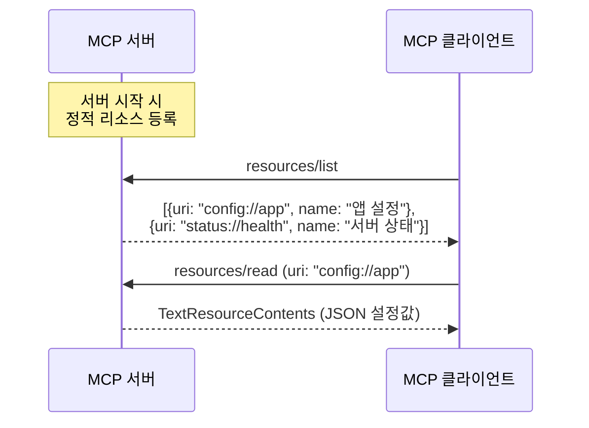
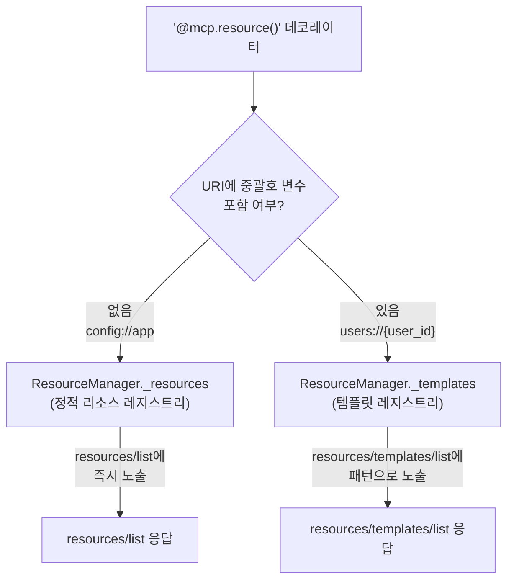
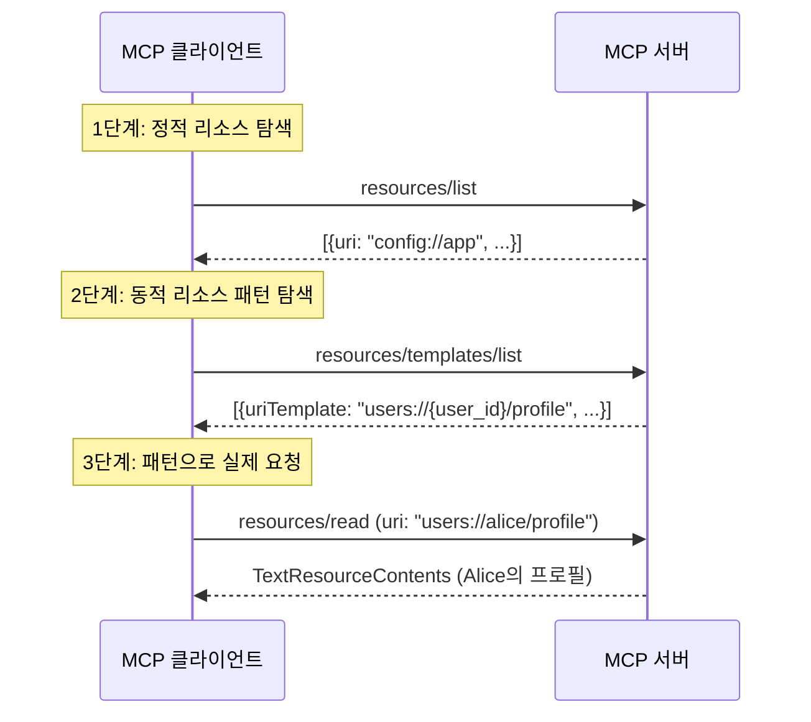
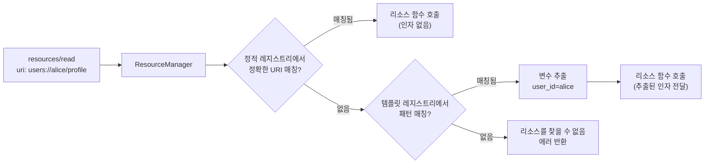
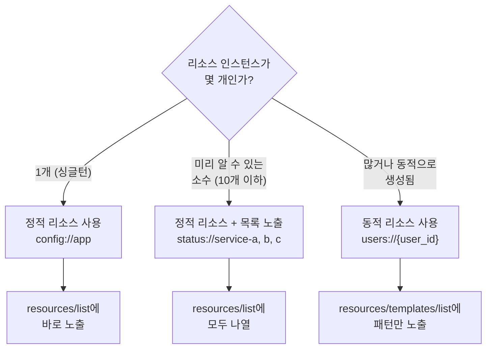

# 정적 리소스와 동적 리소스

> `@mcp.resource()`로 고정 URI 리소스를 등록하고, URI 템플릿으로 무한한 동적 리소스를 만드는 방법을 배웁니다.

## 개요

이 섹션에서는 MCP Resource의 두 가지 등록 방식 — **정적 리소스**와 **동적 리소스(URI 템플릿)** — 을 실전 코드와 함께 학습합니다. [이전 섹션](05-ch5-resources-데이터-노출-프리미티브/01-01-resource-프리미티브-이해.md)에서 Resource 프리미티브의 개념과 `@mcp.resource()` 데코레이터의 기본 사용법을 배웠다면, 이번에는 그 데코레이터 하나로 정적·동적 리소스를 어떻게 나눠서 다루는지 깊이 들어갑니다.

**선수 지식**:
- Resource 프리미티브의 역할과 Tool과의 차이 (5.1에서 학습)
- `@mcp.resource()` 데코레이터 기본 문법
- `resources/list`, `resources/read` 프로토콜 메서드

**학습 목표**:
- 정적 리소스를 등록하고 `resources/list`로 조회할 수 있다
- URI 템플릿(RFC 6570)을 사용해 동적 리소스를 정의할 수 있다
- `resources/templates/list` 프로토콜 메서드의 역할을 이해한다
- 정적 리소스와 동적 리소스의 사용 시나리오를 구분할 수 있다

## 왜 알아야 할까?

실제 서비스를 운영하다 보면 리소스가 딱 정해져 있는 경우와 동적으로 생성되는 경우가 섞여 있습니다. 예를 들어 "서버 설정 파일"은 하나밖에 없지만, "사용자 프로필"은 수천 명의 사용자만큼 존재하죠.

정적 리소스만으로는 수천 개의 사용자 프로필을 일일이 등록할 수 없고, 동적 리소스만으로는 "이 서버에 어떤 설정이 있는지" 바로 알려줄 수가 없습니다. 두 방식을 적재적소에 쓸 줄 알아야 MCP 서버가 유연하면서도 탐색 가능(discoverable)한 데이터를 제공할 수 있습니다.

특히 LLM 기반 에이전트가 `resources/list`로 "지금 뭐가 있지?"를 확인한 뒤, `resources/templates/list`로 "어떤 패턴의 데이터를 더 요청할 수 있지?"를 파악하는 이 2단계 탐색 과정을 이해하면, 훨씬 스마트한 MCP 서버를 설계할 수 있습니다.

## 핵심 개념

### 개념 1: 정적 리소스 — 고정된 URI, 고정된 데이터

> 💡 **비유**: 정적 리소스는 도서관의 **안내 데스크**와 같습니다. "이 도서관의 이용 규칙은 뭔가요?"라고 물으면 항상 같은 안내문을 꺼내주죠. 주소(URI)가 고정되어 있고, 누가 물어봐도 같은 내용을 돌려줍니다.

정적 리소스는 URI에 변수가 없는 리소스입니다. `@mcp.resource()`에 고정된 URI 문자열을 전달하면 정적 리소스가 됩니다. 등록 즉시 `resources/list` 응답에 포함되어 클라이언트가 "이 서버에 이런 데이터가 있구나"를 바로 알 수 있거든요.

> 📊 **그림 1**: 정적 리소스의 등록과 조회 흐름



정적 리소스의 핵심은 **목록에 바로 노출**된다는 점입니다. 클라이언트가 서버에 처음 연결하면 `resources/list`를 호출해서 어떤 리소스가 있는지 확인하는데, 정적 리소스는 이 목록에 즉시 나타납니다.

가장 기본적인 정적 리소스 등록 예제를 살펴봅시다:

```python
import json
from mcp.server.fastmcp import FastMCP

mcp = FastMCP("config-server")

# 정적 리소스: URI에 변수가 없음
@mcp.resource("config://app/settings")
def get_app_settings() -> str:
    """애플리케이션 전체 설정을 반환합니다."""
    return json.dumps({
        "theme": "dark",
        "language": "ko",
        "max_results": 50
    })

@mcp.resource(
    "status://server/health",
    name="서버 헬스체크",
    description="서버의 현재 상태를 확인합니다",
    mime_type="application/json"
)
def get_health() -> str:
    """서버 상태를 반환합니다."""
    return json.dumps({
        "status": "healthy",
        "uptime_seconds": 3600,
        "version": "1.2.0"
    })

if __name__ == "__main__":
    mcp.run()
```

`@mcp.resource()` 데코레이터에 전달할 수 있는 주요 옵션을 정리하면:

| 파라미터 | 설명 | 기본값 |
|----------|------|--------|
| `uri` | 리소스 식별 URI (첫 번째 위치 인자) | 필수 |
| `name` | 리소스 표시 이름 | 함수명 |
| `description` | 리소스 설명 (LLM이 참고) | docstring |
| `mime_type` | MIME 타입 | `text/plain` |
| `tags` | 태그 집합 | `set()` |

### 개념 2: 동적 리소스 — URI 템플릿으로 무한 확장

> 💡 **비유**: 동적 리소스는 도서관의 **검색 시스템**과 같습니다. "ISBN 978-89-xxx-xxx로 된 책을 찾아주세요"처럼 패턴을 알려주면, 해당하는 책을 찾아서 줍니다. 모든 책을 미리 목록에 올려두지 않아도, 어떤 패턴으로 요청하면 되는지만 알려주면 되죠.

동적 리소스는 URI에 `{변수}`가 포함된 리소스입니다. 같은 `@mcp.resource()` 데코레이터를 쓰지만 URI에 중괄호 변수를 넣는 순간 자동으로 동적 리소스(리소스 템플릿)로 분류됩니다. FastMCP 내부 구현(v1.26 기준)을 보면, `ResourceManager`가 `_resources`(정적)와 `_templates`(동적) 두 개의 레지스트리를 따로 관리하거든요.

> ⚠️ **주의**: `ResourceManager._resources`와 `_templates` 분리 구조는 **FastMCP v1.26 기준**의 내부 구현 상세입니다. SDK 버전이 올라가면 내부 구조가 변경될 수 있으므로, 이 구현에 직접 의존하는 코드를 작성하지 마세요. 공개 API(`@mcp.resource()` 데코레이터)만 사용하면 내부 변경의 영향을 받지 않습니다.

> 📊 **그림 2**: 정적 리소스 vs 동적 리소스의 내부 등록 구조 (FastMCP v1.26 기준)



동적 리소스를 정의하는 방법은 간단합니다. URI에 `{파라미터명}`을 넣고, 함수 인자에 같은 이름의 파라미터를 선언하면 됩니다:

```python
import json
from mcp.server.fastmcp import FastMCP

mcp = FastMCP("user-server")

# 동적 리소스: URI에 {user_id} 변수 포함
@mcp.resource("users://{user_id}/profile")
def get_user_profile(user_id: str) -> str:
    """특정 사용자의 프로필을 반환합니다."""
    # 실제로는 DB 조회
    profiles = {
        "alice": {"name": "Alice Kim", "role": "engineer"},
        "bob": {"name": "Bob Park", "role": "designer"},
    }
    profile = profiles.get(user_id, {"error": "User not found"})
    return json.dumps(profile, ensure_ascii=False)
```

클라이언트가 `resources/read`로 `users://alice/profile`을 요청하면, FastMCP가 URI 패턴을 매칭해서 `user_id="alice"`를 추출하고 함수에 전달합니다.

여러 변수를 조합할 수도 있습니다:

```run:python
# 복수 파라미터 예시 (개념 설명용)
uri_template = "repos://{owner}/{repo}/readme"
# 실제 요청: repos://anthropic/mcp-sdk/readme
# 추출 결과:
owner = "anthropic"
repo = "mcp-sdk"
print(f"소유자: {owner}, 저장소: {repo}")
```

```output
소유자: anthropic, 저장소: mcp-sdk
```

```python
@mcp.resource("repos://{owner}/{repo}/readme")
def get_repo_readme(owner: str, repo: str) -> str:
    """GitHub 저장소의 README를 반환합니다."""
    return f"# {owner}/{repo}\n\nREADME 내용..."
```

핵심은 **URI 변수명과 함수 인자명이 정확히 일치**해야 한다는 점입니다. FastMCP는 내부적으로 `func_metadata()`를 호출해서 함수 시그니처를 분석하고, URI 템플릿의 변수와 함수 인자를 자동으로 매핑합니다.

### 개념 3: `resources/templates/list` — 템플릿 탐색 프로토콜

> 💡 **비유**: 정적 리소스가 "메뉴판에 적힌 음식"이라면, `resources/templates/list`는 "주문 가능한 커스텀 메뉴의 규칙"을 알려주는 겁니다. "파스타 종류는 {토마토|크림|오일}, 면 종류는 {스파게티|펜네|링귀네}로 조합할 수 있어요"처럼요.

클라이언트가 동적 리소스의 존재를 알려면 `resources/templates/list` 메서드를 호출해야 합니다. 이 메서드는 서버에 등록된 URI 템플릿 목록을 반환합니다.

> 📊 **그림 3**: 클라이언트의 2단계 리소스 탐색 과정



프로토콜 수준에서 `resources/templates/list`의 요청/응답을 살펴보면:

```python
# 요청 (JSON-RPC 2.0)
{
    "jsonrpc": "2.0",
    "id": 3,
    "method": "resources/templates/list",
    "params": {}  # cursor 기반 페이지네이션 가능
}

# 응답
{
    "jsonrpc": "2.0",
    "id": 3,
    "result": {
        "resourceTemplates": [
            {
                "uriTemplate": "users://{user_id}/profile",
                "name": "사용자 프로필",
                "description": "특정 사용자의 프로필 정보",
                "mimeType": "application/json"
            },
            {
                "uriTemplate": "repos://{owner}/{repo}/readme",
                "name": "저장소 README",
                "description": "GitHub 저장소의 README 파일"
            }
        ]
    }
}
```

`resourceTemplates` 배열의 각 항목에는 다음 필드가 포함됩니다:

| 필드 | 설명 | 필수 여부 |
|------|------|-----------|
| `uriTemplate` | RFC 6570 URI 템플릿 문자열 | 필수 |
| `name` | 템플릿 표시 이름 | 필수 |
| `description` | 설명 (LLM이 참고) | 선택 |
| `mimeType` | 기본 MIME 타입 | 선택 |

### 개념 4: 패턴 매칭과 파라미터 추출의 내부 동작

> 💡 **비유**: URI 템플릿의 패턴 매칭은 우편 주소의 **우편번호 체계**와 비슷합니다. "서울시 {구} {동} {번지}"라는 패턴이 있으면, "서울시 강남구 역삼동 123"에서 구=강남구, 동=역삼동, 번지=123을 자동으로 추출하는 거죠.

FastMCP가 URI 매칭을 처리하는 과정을 단계별로 살펴보겠습니다:

> 📊 **그림 4**: URI 템플릿 매칭 내부 프로세스



매칭 순서가 중요합니다. 정적 리소스를 먼저 확인하고, 매칭되는 것이 없을 때 템플릿 레지스트리를 순회합니다. 만약 정적 리소스와 템플릿이 충돌할 수 있는 URI가 있다면, **정적 리소스가 우선**합니다.

```run:python
# 패턴 매칭의 직관적 이해
import re

# URI 템플릿을 정규식으로 변환하는 개념적 예시
template = "users://{user_id}/posts/{post_id}"
# 내부적으로 이런 식의 정규식으로 변환됨
pattern = re.compile(r"users://(?P<user_id>[^/]+)/posts/(?P<post_id>[^/]+)")

# 실제 URI 매칭
uri = "users://alice/posts/42"
match = pattern.match(uri)
if match:
    print(f"user_id = {match.group('user_id')}")
    print(f"post_id = {match.group('post_id')}")
```

```output
user_id = alice
post_id = 42
```

기본 `{변수}`는 슬래시(`/`)를 포함하지 않는 단일 경로 세그먼트만 매칭합니다. 파일 경로처럼 슬래시가 포함된 값을 캡처하려면 FastMCP의 와일드카드 문법 `{변수*}`를 사용할 수 있습니다:

```python
# 와일드카드: 슬래시를 포함한 다중 세그먼트 매칭
@mcp.resource("files://{filepath*}")
def read_file(filepath: str) -> str:
    """파일 경로의 내용을 반환합니다."""
    # files://src/main/app.py → filepath = "src/main/app.py"
    return f"파일 내용: {filepath}"
```

> ⚠️ **흔한 오해**: URI 템플릿 변수와 함수 인자의 이름이 달라도 된다고 생각하는 분이 있는데, **반드시 같아야 합니다**. `{user_id}`로 선언했으면 함수 인자도 `user_id`여야 합니다. 이름이 다르면 FastMCP가 매핑에 실패하여 에러가 발생합니다.

## 실습: 직접 해보기

정적 리소스와 동적 리소스를 혼합한 실전 MCP 서버를 만들어봅시다. "도서 관리 시스템"을 주제로 두 가지 방식을 모두 활용합니다.

```python
# book_server.py
import json
from datetime import datetime
from mcp.server.fastmcp import FastMCP

mcp = FastMCP("book-server")

# ── 샘플 데이터 ──────────────────────────────────────
BOOKS = {
    "978-89-01": {
        "title": "파이썬 완전 정복",
        "author": "김파이",
        "year": 2025,
        "genre": "programming",
        "available": True,
    },
    "978-89-02": {
        "title": "MCP 실전 가이드",
        "author": "이엠씨",
        "year": 2026,
        "genre": "ai",
        "available": False,
    },
    "978-89-03": {
        "title": "딥러닝 첫걸음",
        "author": "박딥러",
        "year": 2025,
        "genre": "ai",
        "available": True,
    },
}

# ── 정적 리소스 ──────────────────────────────────────
# 1) 도서관 운영 정보: 항상 동일한 내용
@mcp.resource(
    "library://info",
    name="도서관 정보",
    description="도서관의 기본 운영 정보를 제공합니다",
    mime_type="application/json",
)
def get_library_info() -> str:
    """도서관 기본 정보를 반환합니다."""
    return json.dumps({
        "name": "MCP 중앙 도서관",
        "hours": "09:00-21:00",
        "total_books": len(BOOKS),
        "last_updated": datetime.now().isoformat(),
    }, ensure_ascii=False)


# 2) 전체 장르 목록: 장르가 추가되지 않는 한 고정
@mcp.resource(
    "library://genres",
    name="장르 목록",
    description="도서관에서 분류하는 장르 목록",
)
def get_genres() -> str:
    """사용 가능한 장르 목록을 반환합니다."""
    genres = list({b["genre"] for b in BOOKS.values()})
    return json.dumps(genres, ensure_ascii=False)


# ── 동적 리소스 ──────────────────────────────────────
# 3) 특정 도서 조회: ISBN에 따라 다른 결과
@mcp.resource(
    "books://{isbn}",
    name="도서 상세 정보",
    description="ISBN으로 특정 도서의 상세 정보를 조회합니다",
    mime_type="application/json",
)
def get_book(isbn: str) -> str:
    """ISBN으로 도서 정보를 반환합니다."""
    book = BOOKS.get(isbn)
    if book is None:
        return json.dumps(
            {"error": f"ISBN '{isbn}'에 해당하는 도서를 찾을 수 없습니다"},
            ensure_ascii=False,
        )
    return json.dumps(book, ensure_ascii=False)


# 4) 장르별 도서 목록: 장르 파라미터에 따라 필터링
@mcp.resource(
    "books://genre/{genre_name}",
    name="장르별 도서 목록",
    description="특정 장르의 도서 목록을 반환합니다",
    mime_type="application/json",
)
def get_books_by_genre(genre_name: str) -> str:
    """해당 장르의 도서 목록을 반환합니다."""
    filtered = {
        isbn: info
        for isbn, info in BOOKS.items()
        if info["genre"] == genre_name
    }
    return json.dumps(filtered, ensure_ascii=False)


if __name__ == "__main__":
    mcp.run()
```

이 서버를 실행하면 클라이언트는 다음과 같은 흐름으로 리소스를 탐색합니다:

```run:python
# 클라이언트 시점의 탐색 시뮬레이션
print("=== 1단계: resources/list (정적 리소스 조회) ===")
static_resources = [
    {"uri": "library://info", "name": "도서관 정보"},
    {"uri": "library://genres", "name": "장르 목록"},
]
for r in static_resources:
    print(f"  - {r['name']}: {r['uri']}")

print("\n=== 2단계: resources/templates/list (동적 리소스 패턴 조회) ===")
templates = [
    {"uriTemplate": "books://{isbn}", "name": "도서 상세 정보"},
    {"uriTemplate": "books://genre/{genre_name}", "name": "장르별 도서 목록"},
]
for t in templates:
    print(f"  - {t['name']}: {t['uriTemplate']}")

print("\n=== 3단계: resources/read (실제 데이터 요청) ===")
print("  요청: books://978-89-02")
print("  응답: {title: 'MCP 실전 가이드', author: '이엠씨', ...}")
```

```output
=== 1단계: resources/list (정적 리소스 조회) ===
  - 도서관 정보: library://info
  - 장르 목록: library://genres

=== 2단계: resources/templates/list (동적 리소스 패턴 조회) ===
  - 도서 상세 정보: books://{isbn}
  - 장르별 도서 목록: books://genre/{genre_name}

=== 3단계: resources/read (실제 데이터 요청) ===
  요청: books://978-89-02
  응답: {title: 'MCP 실전 가이드', author: '이엠씨', ...}
```

MCP Inspector로 테스트하려면 터미널에서 다음을 실행하세요:

```terminal
npx @modelcontextprotocol/inspector python book_server.py
```

Inspector의 "Resources" 탭에서 정적 리소스 목록을, "Resource Templates" 탭에서 동적 리소스 패턴을 각각 확인할 수 있습니다.

## 더 깊이 알아보기

### RFC 6570의 탄생 — 웹의 주소 체계를 표준화하다

MCP의 URI 템플릿은 갑자기 만들어진 것이 아닙니다. **RFC 6570 "URI Template"**이라는 IETF 표준에 기반하는데, 이 표준의 탄생에는 흥미로운 배경이 있습니다.

2000년대 초반, REST API가 폭발적으로 성장하면서 "API 엔드포인트 URL을 어떻게 표현할 것인가"가 큰 문제였습니다. 각 회사마다 `/users/:id`, `/users/{id}`, `/users/<id>` 등 제각각의 문법을 사용했거든요. 이 혼란을 정리하기 위해 **Roy Fielding**(REST 개념의 창시자이자 HTTP 공동 저자)을 포함한 5명의 저자가 2012년에 RFC 6570을 발표했습니다.

RFC 6570은 4단계의 복잡도 레벨을 정의합니다:

| 레벨 | 문법 | 예시 | 설명 |
|------|------|------|------|
| Level 1 | `{var}` | `users/{id}` | 단순 문자열 치환 |
| Level 2 | `{+var}`, `{#var}` | `{+path}`, `{#section}` | 예약 문자 유지, 프래그먼트 |
| Level 3 | `{.var}`, `{/var}`, `{?var}` | `{?page,size}` | 경로·쿼리 확장 |
| Level 4 | `{var:3}`, `{list*}` | `{name:5}`, `{tags*}` | 접두사 제한, 목록 분해 |

MCP는 주로 **Level 1** 문법을 사용합니다. `{user_id}`, `{isbn}` 같은 단순 치환이면 대부분의 리소스 패턴을 충분히 표현할 수 있기 때문이죠. 단순함을 유지하면서도 표준을 따른다는 점이 MCP 설계 철학의 핵심입니다.

> 💡 **알고 계셨나요?**: RFC 6570의 공동 저자인 **Roy T. Fielding**은 HTTP/1.1 명세(RFC 2616)의 주요 저자이자, 2000년 박사 논문에서 REST(Representational State Transfer) 아키텍처 스타일을 처음으로 정의한 인물입니다. URI 템플릿 표준이 REST 창시자의 손에서 나온 것은 우연이 아닙니다.

### 정적과 동적의 경계 — 설계 판단 기준

실무에서 "이 리소스를 정적으로 할까, 동적으로 할까?"를 결정할 때 유용한 판단 기준이 있습니다:

> 📊 **그림 5**: 정적/동적 리소스 설계 판단 트리



## 흔한 오해와 팁

> ⚠️ **흔한 오해**: "동적 리소스는 `resources/list`에 나오지 않으니까, 클라이언트가 어떤 값을 넣어야 하는지 알 수 없다"고 생각할 수 있습니다. 하지만 MCP에는 **completion API**가 있어서, 클라이언트가 `completion/complete`를 호출하면 서버가 가능한 값 목록을 제안할 수 있습니다. 이건 [다음 섹션](05-ch5-resources-데이터-노출-프리미티브/03-03-mime-타입과-바이너리-리소스.md) 이후 챕터에서 더 자세히 다룹니다.

> 🔥 **실무 팁**: 정적 리소스와 동적 리소스를 함께 쓸 때, **정적 리소스로 "메타데이터"를 노출하고 동적 리소스로 "실제 데이터"를 제공**하는 패턴이 매우 효과적입니다. 예를 들어 `schema://tables`(정적)로 테이블 목록을 먼저 보여주고, `data://tables/{table_name}/rows`(동적)로 실제 데이터를 제공하는 식이죠. 이렇게 하면 LLM이 먼저 정적 리소스로 "뭐가 있는지" 파악한 뒤, 동적 리소스에 적절한 파라미터를 넣어서 요청할 수 있습니다.

> 💡 **알고 계셨나요?**: FastMCP 내부에서는 동적 리소스의 URI 템플릿 파라미터로부터 **JSON Schema를 자동 생성**합니다. 이것은 [Ch4에서 배운](04-ch4-tools-함수-호출-프리미티브/02-02-도구-정의와-스키마-자동-생성.md) Tool의 입력 스키마 자동 생성과 동일한 `func_metadata()` 메커니즘을 사용합니다. 함수의 타입 힌트와 docstring을 분석해서 스키마를 만들어주니까, Tool과 Resource의 정의 경험이 일관적인 거예요.

## 핵심 정리

| 개념 | 설명 |
|------|------|
| 정적 리소스 | URI에 변수 없음. `resources/list`에 즉시 노출. 싱글턴 데이터에 적합 |
| 동적 리소스 (URI 템플릿) | URI에 `{변수}` 포함. `resources/templates/list`로 패턴 노출. 무한 확장 가능 |
| `resources/templates/list` | 서버의 동적 리소스 패턴을 조회하는 프로토콜 메서드 |
| RFC 6570 | URI 템플릿 표준. MCP는 Level 1(`{var}`) 문법 주로 사용 |
| 패턴 매칭 우선순위 | 정적 리소스 먼저 매칭 → 없으면 템플릿 레지스트리 순회 |
| 변수명 일치 규칙 | URI 템플릿의 `{변수명}`과 함수 인자명이 반드시 동일해야 함 |
| 와일드카드 `{var*}` | 슬래시 포함 다중 세그먼트 캡처 (파일 경로 등) |
| `ResourceManager` | FastMCP 내부 구현(v1.26 기준)에서 `_resources`(정적)와 `_templates`(동적) 분리 관리. 공개 API가 아니므로 버전에 따라 변경될 수 있음 |

## 다음 섹션 미리보기

정적 리소스와 동적 리소스를 만들 수 있게 되었으니, 다음은 이 리소스들이 **어떤 형태의 데이터**를 담을 수 있는지가 중요합니다. [다음 섹션: MIME 타입과 바이너리 리소스](05-ch5-resources-데이터-노출-프리미티브/03-03-mime-타입과-바이너리-리소스.md)에서는 텍스트뿐 아니라 JSON, CSV, 이미지, PDF 같은 다양한 MIME 타입의 리소스를 제공하는 방법과 `TextResourceContents` vs `BlobResourceContents`의 차이를 다룹니다.

## 참고 자료

- [MCP Specification — Resources (2025-11-25)](https://modelcontextprotocol.io/specification/2025-06-18/server/resources) - Resource와 ResourceTemplate의 공식 프로토콜 명세. `resources/list`, `resources/templates/list`, `resources/read`의 정확한 스키마를 확인할 수 있습니다
- [FastMCP — Resources & Templates](https://gofastmcp.com/servers/resources) - `@mcp.resource()` 데코레이터의 정적/동적 리소스 등록 방법, 와일드카드 문법, 반환 타입별 처리를 상세히 설명합니다
- [RFC 6570 — URI Template (IETF)](https://datatracker.ietf.org/doc/html/rfc6570) - MCP URI 템플릿의 기반이 되는 IETF 표준. Level 1~4 문법과 변수 확장 규칙의 원본 명세입니다
- [MCP Python SDK — GitHub](https://github.com/modelcontextprotocol/python-sdk) - Python SDK의 `ResourceManager` 구현 코드를 직접 확인할 수 있습니다. `_resources`와 `_templates` 레지스트리 분리 구조를 코드로 이해하는 데 유용합니다
- [Build a Python MCP Server — Real Python](https://realpython.com/python-mcp/) - 정적/동적 리소스를 포함한 MCP 서버 구축의 실전 튜토리얼

---
### 🔗 Related Sessions
- [resource 프리미티브](05-ch5-resources-데이터-노출-프리미티브/01-01-resource-프리미티브-이해.md) (prerequisite)
- [application-controlled](05-ch5-resources-데이터-노출-프리미티브/01-01-resource-프리미티브-이해.md) (prerequisite)
- [resources/list](05-ch5-resources-데이터-노출-프리미티브/01-01-resource-프리미티브-이해.md) (prerequisite)
- [resources/read](05-ch5-resources-데이터-노출-프리미티브/01-01-resource-프리미티브-이해.md) (prerequisite)
- [uri 스킴](05-ch5-resources-데이터-노출-프리미티브/01-01-resource-프리미티브-이해.md) (prerequisite)
- [textresourcecontents](05-ch5-resources-데이터-노출-프리미티브/01-01-resource-프리미티브-이해.md) (prerequisite)
