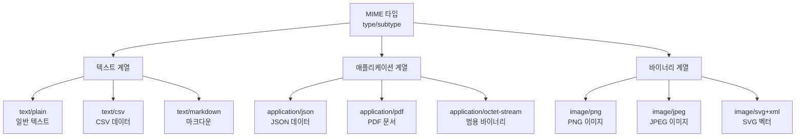
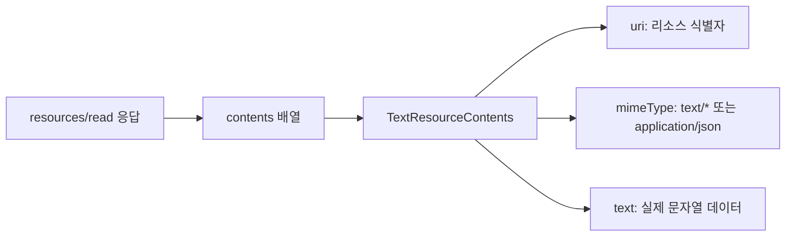
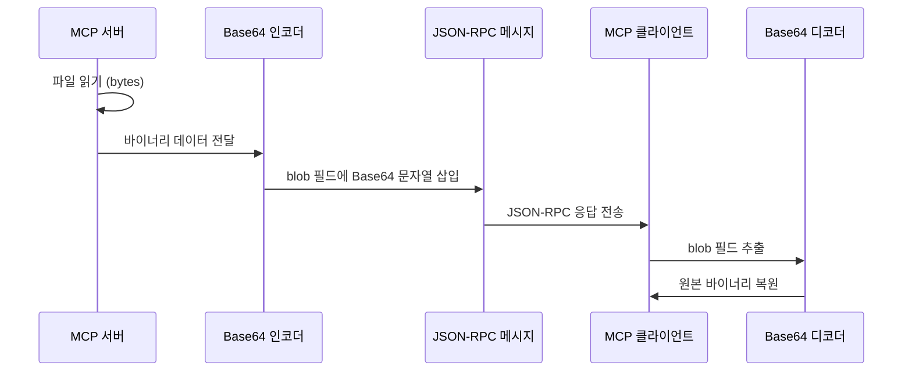
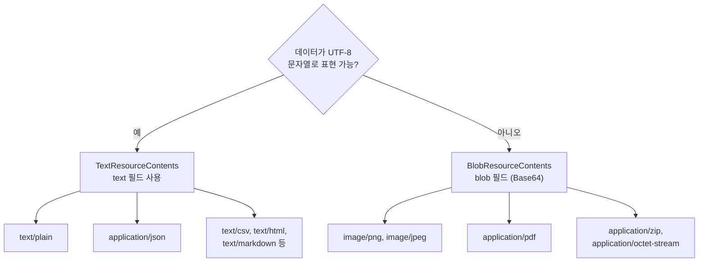
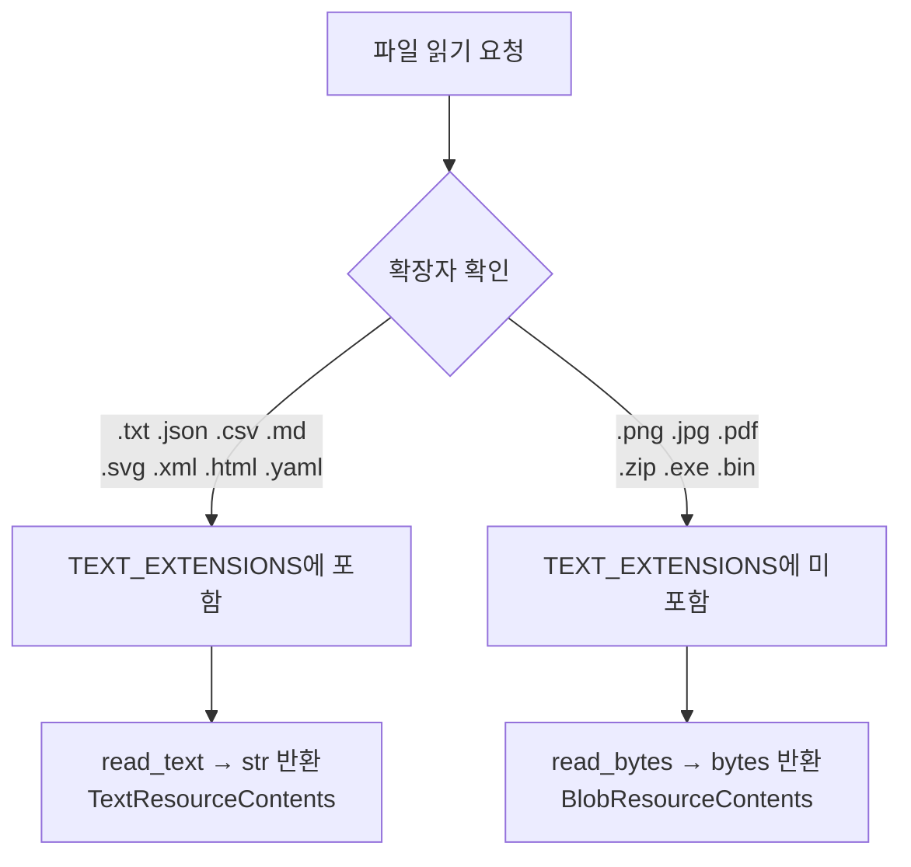
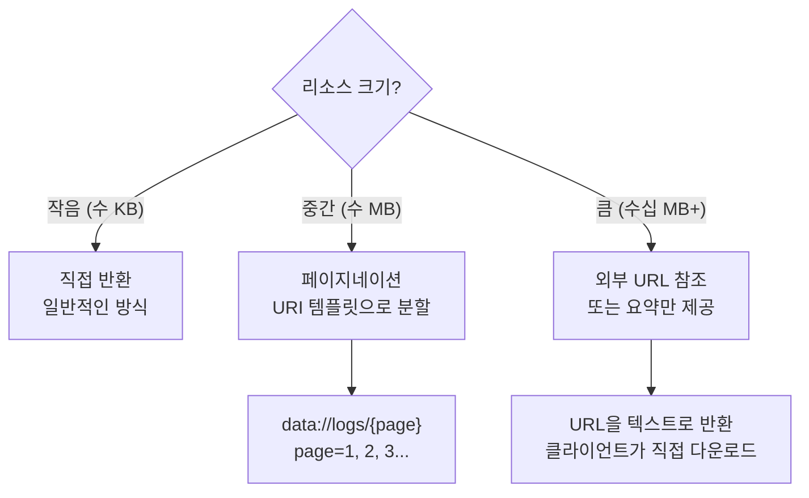

# MIME 타입과 바이너리 리소스

> MCP 리소스에서 텍스트와 바이너리 데이터를 MIME 타입으로 구분하여 제공하는 방법을 배웁니다

## 개요

이 섹션에서는 MCP 리소스가 데이터를 반환할 때 **어떤 형식인지 선언하고**, **바이너리 데이터를 안전하게 전달하는 방법**을 다룹니다. 앞서 [Resource 프리미티브 이해](05-ch5-resources-데이터-노출-프리미티브/01-01-resource-프리미티브-이해.md)에서 TextResourceContents와 BlobResourceContents라는 두 가지 콘텐츠 타입을 언급했는데, 이번에는 이 둘의 차이와 실전 활용법을 깊이 파고듭니다.

**선수 지식**: [정적 리소스와 동적 리소스](05-ch5-resources-데이터-노출-프리미티브/02-02-정적-리소스와-동적-리소스.md)에서 배운 `@mcp.resource()` 데코레이터 사용법, URI 템플릿 패턴

**학습 목표**:
- MIME 타입의 역할과 MCP에서의 선언 방법을 이해한다
- TextResourceContents와 BlobResourceContents의 차이를 구분하고 적절히 사용할 수 있다
- 바이너리 리소스(이미지, PDF 등)를 Base64 인코딩으로 제공할 수 있다
- 대용량 리소스의 한계와 처리 전략을 설명할 수 있다

## 왜 알아야 할까?

LLM에게 텍스트만 전달할 수 있다면, 세상의 절반밖에 보여줄 수 없습니다. 실무에서 MCP 서버는 JSON 설정 파일, CSV 데이터, PDF 보고서, 로고 이미지, 바이너리 로그 파일 등 **다양한 형식의 데이터**를 다루어야 합니다. 클라이언트가 이 데이터를 올바르게 해석하려면, 서버가 "이건 JSON이에요", "이건 PNG 이미지예요"라고 **형식을 명확히 알려주어야** 합니다.

MIME 타입 없이 데이터를 전달하면 어떻게 될까요? 클라이언트는 바이너리 이미지 데이터를 텍스트로 해석하려 하거나, JSON 데이터를 단순 문자열로 취급할 수 있습니다. MCP가 MIME 타입과 Base64 인코딩이라는 웹의 검증된 표준을 채택한 이유가 바로 여기에 있습니다.

## 핵심 개념

### 개념 1: MIME 타입 — 데이터의 신분증

> 💡 **비유**: 택배 상자에 붙은 라벨을 떠올려 보세요. "깨지기 쉬움", "냉동 보관", "이 면이 위" 같은 라벨이 없으면 배송 기사는 유리잔을 던져버릴 수도 있습니다. MIME 타입은 데이터에 붙이는 라벨입니다 — "나는 JSON이야", "나는 PNG 이미지야"라고 알려주는 거죠.

MIME 타입(Media Type)은 `type/subtype` 형식으로, 데이터의 종류를 표준화된 방식으로 선언합니다. MCP에서는 리소스 등록 시 `mime_type` 파라미터로 지정하거나, 응답의 `mimeType` 필드에 포함합니다.

> 📊 **그림 1**: MCP에서 자주 사용되는 MIME 타입 분류



MCP 스펙에서 `mimeType`은 **선택(optional)** 필드입니다. 생략하면 클라이언트가 자체적으로 콘텐츠 타입을 추론해야 하는데, 이때 동작은 클라이언트 구현에 따라 달라집니다. 대부분의 클라이언트는 TextResourceContents의 경우 `text/plain`으로 가정하고, BlobResourceContents의 경우 `application/octet-stream`으로 처리합니다. 일부 클라이언트는 **콘텐츠 스니핑(content sniffing)** — 데이터의 앞부분 바이트를 검사하여 형식을 추측하는 방식 — 을 시도하기도 하지만, 이는 보안 위험(MIME confusion attack)이 있고 정확도도 보장할 수 없습니다. 실무에서는 항상 명시적으로 선언하는 것이 좋습니다.

```python
from mcp.server.fastmcp import FastMCP

mcp = FastMCP("mime-demo")

# mime_type을 명시적으로 선언
@mcp.resource("config://settings", mime_type="application/json")
def get_settings() -> str:
    """애플리케이션 설정을 JSON으로 반환합니다."""
    import json
    return json.dumps({
        "theme": "dark",
        "language": "ko",
        "max_tokens": 4096
    }, ensure_ascii=False)

# mime_type 생략 시 str 반환은 기본값 text/plain
@mcp.resource("docs://readme")
def get_readme() -> str:
    """README 텍스트를 반환합니다."""
    return "# MCP Demo Server\n이 서버는 MIME 타입 데모입니다."
```

FastMCP는 반환 타입에 따라 기본 MIME 타입을 자동 결정합니다:

| 반환 타입 | 기본 MIME 타입 | 콘텐츠 클래스 |
|-----------|---------------|--------------|
| `str` | `text/plain` | TextResourceContents |
| `bytes` | `application/octet-stream` | BlobResourceContents |

### 개념 2: TextResourceContents — 텍스트 데이터의 표준 경로

> 💡 **비유**: 편지를 보낼 때 봉투에 "한국어 편지"라고 쓰면, 받는 사람은 열어보기도 전에 읽을 준비를 할 수 있죠. TextResourceContents는 "이건 사람이 읽을 수 있는 텍스트예요"라는 봉투입니다.

TextResourceContents는 MCP에서 텍스트 기반 데이터를 전달하는 구조체입니다. `text` 필드에 문자열을 담아 전송합니다.

> 📊 **그림 2**: TextResourceContents의 JSON 구조



프로토콜 레벨에서 TextResourceContents의 JSON 형태는 다음과 같습니다:

```json
{
  "contents": [
    {
      "uri": "config://app-settings",
      "mimeType": "application/json",
      "text": "{\"theme\": \"dark\", \"language\": \"ko\"}"
    }
  ]
}
```

`text` 계열뿐 아니라 `application/json`, `application/xml` 같은 **텍스트로 표현 가능한** 데이터도 TextResourceContents로 전달할 수 있습니다. 핵심은 데이터가 문자열로 표현되느냐 아니냐입니다.

```python
import json
import csv
import io

mcp = FastMCP("text-resources")

# 1. 일반 텍스트
@mcp.resource("logs://latest", mime_type="text/plain")
def get_latest_log() -> str:
    """최근 서버 로그를 반환합니다."""
    return "2026-03-23 10:00:01 INFO  서버 시작\n2026-03-23 10:00:02 INFO  포트 8080 리스닝"

# 2. JSON 데이터
@mcp.resource("api://users", mime_type="application/json")
def get_users() -> str:
    """사용자 목록을 JSON으로 반환합니다."""
    users = [
        {"id": 1, "name": "김개발", "role": "backend"},
        {"id": 2, "name": "이엔지", "role": "frontend"}
    ]
    return json.dumps(users, ensure_ascii=False, indent=2)

# 3. CSV 데이터
@mcp.resource("data://sales", mime_type="text/csv")
def get_sales_csv() -> str:
    """월별 매출 데이터를 CSV로 반환합니다."""
    output = io.StringIO()
    writer = csv.writer(output)
    writer.writerow(["월", "매출", "성장률"])
    writer.writerow(["2026-01", 1500000, "12%"])
    writer.writerow(["2026-02", 1680000, "12%"])
    writer.writerow(["2026-03", 1900000, "13%"])
    return output.getvalue()

# 4. 마크다운 문서
@mcp.resource("docs://api-guide", mime_type="text/markdown")
def get_api_guide() -> str:
    """API 가이드 문서를 마크다운으로 반환합니다."""
    return """# API 가이드
## 인증
모든 요청에 Bearer 토큰을 포함하세요.

## 엔드포인트
- `GET /users` — 사용자 목록
- `POST /users` — 사용자 생성
"""
```

### 개념 3: BlobResourceContents — 바이너리 데이터와 Base64

> 💡 **비유**: 외국에 유리 공예품을 보내야 한다고 상상해 보세요. 유리를 그냥 박스에 넣으면 깨지겠죠? 뽁뽁이(에어캡)로 꼼꼼히 감싸야 합니다. Base64 인코딩은 바이너리 데이터를 텍스트라는 뽁뽁이로 감싸는 과정입니다 — JSON 같은 텍스트 프로토콜 안에서도 바이너리가 깨지지 않고 안전하게 전달됩니다.

MCP는 JSON-RPC 2.0 기반이므로 모든 메시지가 JSON 텍스트입니다. 이미지, PDF 같은 바이너리 데이터는 JSON에 직접 넣을 수 없어서, **Base64로 인코딩**하여 문자열로 변환한 뒤 `blob` 필드에 담습니다.

> 📊 **그림 3**: 바이너리 리소스의 인코딩과 전달 과정



프로토콜 레벨에서 BlobResourceContents의 JSON 형태:

```json
{
  "contents": [
    {
      "uri": "data://logo.png",
      "mimeType": "image/png",
      "blob": "iVBORw0KGgoAAAANSUhEUgAAAAEAAAABCAYAAAAfFcSJAAAADUlEQVR42mP8/5+hHgAHggJ/PchI7wAAAABJRU5ErkJggg=="
    }
  ]
}
```

FastMCP에서는 함수가 `bytes`를 반환하면 자동으로 Base64 인코딩하여 BlobResourceContents로 변환합니다. 개발자가 직접 인코딩할 필요가 없습니다:

```python
import base64
from pathlib import Path

mcp = FastMCP("binary-resources")

# bytes를 반환하면 FastMCP가 자동으로 Base64 인코딩
@mcp.resource("images://logo", mime_type="image/png")
async def get_logo() -> bytes:
    """회사 로고 이미지를 반환합니다."""
    logo_path = Path("assets/logo.png")
    return logo_path.read_bytes()

# PDF 문서
@mcp.resource("docs://report/{year}", mime_type="application/pdf")
async def get_annual_report(year: str) -> bytes:
    """연간 보고서 PDF를 반환합니다."""
    report_path = Path(f"reports/{year}_annual.pdf")
    if not report_path.exists():
        raise FileNotFoundError(f"{year}년 보고서를 찾을 수 없습니다")
    return report_path.read_bytes()

# ZIP 아카이브
@mcp.resource("archive://exports/{name}", mime_type="application/zip")
async def get_export(name: str) -> bytes:
    """내보내기 ZIP 파일을 반환합니다."""
    archive_path = Path(f"exports/{name}.zip")
    return archive_path.read_bytes()
```

> ⚠️ **흔한 오해**: "Base64로 인코딩하면 데이터 크기가 변하지 않는다"고 생각하기 쉽지만, 실제로는 **약 33% 커집니다**. 3바이트의 바이너리가 4글자의 ASCII 텍스트로 변환되기 때문이죠. 1MB 이미지는 JSON 메시지에서 약 1.37MB를 차지합니다. 이 오버헤드를 고려해야 합니다.

### 개념 4: TextResourceContents vs BlobResourceContents 선택 기준

두 콘텐츠 타입은 상호 배타적입니다 — 하나의 콘텐츠 항목은 `text` 또는 `blob` 중 하나만 가집니다. 어떤 것을 쓸지는 **데이터의 본질**에 따라 결정합니다.

> 📊 **그림 4**: 콘텐츠 타입 선택 흐름도



| 기준 | TextResourceContents | BlobResourceContents |
|------|---------------------|---------------------|
| **데이터 형태** | 문자열 | 바이너리 (이미지, PDF 등) |
| **전송 필드** | `text` | `blob` (Base64 인코딩) |
| **크기 오버헤드** | 없음 | ~33% 증가 |
| **LLM 직접 해석** | 가능 | 일부만 가능 (멀티모달) |
| **FastMCP 반환 타입** | `str` | `bytes` |
| **기본 mime_type** | `text/plain` | `application/octet-stream` |

흥미로운 경계 사례가 있습니다. `application/json`은 IANA 분류상 `application` 계열이지만 **텍스트로 표현 가능**하므로 TextResourceContents를 사용합니다. 반면 `application/pdf`는 바이너리이므로 BlobResourceContents를 씁니다. SVG(`image/svg+xml`)도 XML 텍스트이므로 TextResourceContents가 적합합니다.

```python
# SVG는 텍스트 기반 이미지 → str 반환 (TextResourceContents)
@mcp.resource("images://chart", mime_type="image/svg+xml")
def get_chart_svg() -> str:
    """매출 차트를 SVG로 반환합니다."""
    return """<svg xmlns="http://www.w3.org/2000/svg" width="200" height="100">
  <rect x="10" y="20" width="40" height="80" fill="#4CAF50"/>
  <rect x="60" y="40" width="40" height="60" fill="#2196F3"/>
  <rect x="110" y="10" width="40" height="90" fill="#FF9800"/>
</svg>"""

# PNG는 바이너리 이미지 → bytes 반환 (BlobResourceContents)
@mcp.resource("images://chart-png", mime_type="image/png")
async def get_chart_png() -> bytes:
    """매출 차트를 PNG로 반환합니다."""
    return Path("charts/sales.png").read_bytes()
```

### 개념 5: TEXT_EXTENSIONS — FastMCP의 텍스트 판별 기준

파일 시스템에서 리소스를 제공할 때, "이 파일은 텍스트인가 바이너리인가?"를 판별해야 합니다. FastMCP 내부에서는 `TEXT_EXTENSIONS`라는 상수를 정의하여, 파일 확장자 기반으로 텍스트 여부를 결정합니다.

> 📊 **그림 5**: TEXT_EXTENSIONS 기반 콘텐츠 타입 분기



이 패턴은 범용 파일 서빙 리소스를 구현할 때 핵심적입니다:

```python
# FastMCP가 텍스트로 판별하는 확장자 집합
TEXT_EXTENSIONS = {
    ".txt", ".json", ".csv", ".md", ".markdown",
    ".svg", ".xml", ".html", ".htm",
    ".yaml", ".yml", ".toml", ".ini", ".cfg",
    ".py", ".js", ".ts", ".java", ".go", ".rs",
    ".sh", ".bash", ".zsh",
    ".css", ".scss", ".less",
    ".sql", ".graphql",
    ".env", ".gitignore", ".dockerfile",
}
```

```run:python
# TEXT_EXTENSIONS의 활용 예시
TEXT_EXTENSIONS = {".txt", ".json", ".csv", ".md", ".svg", ".xml", ".html", ".yaml", ".py", ".js"}

test_files = [
    "config.json", "report.pdf", "chart.svg", "logo.png",
    "data.csv", "script.py", "archive.zip", "readme.md"
]

print("파일명            | 확장자  | 텍스트? | 콘텐츠 타입")
print("-" * 70)
for f in test_files:
    ext = "." + f.rsplit(".", 1)[-1]
    is_text = ext in TEXT_EXTENSIONS
    content_type = "TextResourceContents" if is_text else "BlobResourceContents"
    print(f"{f:<18} | {ext:<7} | {'예':^6} | {content_type}" if is_text
          else f"{f:<18} | {ext:<7} | {'아니오':^6} | {content_type}")
```

```output
파일명            | 확장자  | 텍스트? | 콘텐츠 타입
----------------------------------------------------------------------
config.json        | .json   |   예   | TextResourceContents
report.pdf         | .pdf    | 아니오  | BlobResourceContents
chart.svg          | .svg    |   예   | TextResourceContents
logo.png           | .png    | 아니오  | BlobResourceContents
data.csv           | .csv    |   예   | TextResourceContents
script.py          | .py     |   예   | TextResourceContents
archive.zip        | .zip    | 아니오  | BlobResourceContents
readme.md          | .md     |   예   | TextResourceContents
```

> 🔥 **실무 팁**: TEXT_EXTENSIONS에 없는 확장자의 파일은 모두 바이너리로 취급됩니다. 새로운 텍스트 형식(예: `.toml`, `.graphql`)을 서빙해야 한다면, 이 집합에 해당 확장자를 추가하거나 `mime_type`을 명시적으로 지정하세요. 확장자 판별은 빠르고 간단하지만, 파일 내용과 확장자가 불일치하는 경우(예: `.txt` 확장자의 바이너리 파일)에는 제대로 동작하지 않으므로 주의가 필요합니다.

### 개념 6: 대용량 리소스 처리 전략

MCP 스펙은 리소스 크기에 **명시적인 상한선을 정하지 않습니다**. 하지만 현실적인 제약이 있습니다:

1. **LLM 컨텍스트 윈도우**: 리소스가 LLM에게 전달된다면, 컨텍스트 한계를 고려해야 합니다
2. **Base64 오버헤드**: 바이너리는 33% 크기가 증가합니다
3. **메모리**: 서버와 클라이언트 양쪽에서 전체 데이터를 메모리에 올려야 합니다
4. **네트워크**: JSON-RPC 메시지 하나에 모든 데이터가 담기므로, 대용량은 전송 시간이 깁니다

MCP 스펙의 `Resource` 타입에는 `size` 필드가 있어 **인코딩 전 원본 바이트 수**를 미리 알려줄 수 있습니다. 호스트는 이 정보로 "이 리소스를 정말 읽을까?"를 판단합니다:

```python
from mcp.types import Resource

# size 필드를 활용한 리소스 등록 (저수준 API)
resource = Resource(
    uri="data://large-dataset.csv",
    name="대규모 데이터셋",
    description="2026년 1분기 거래 데이터 (15MB)",
    mime_type="text/csv",
    size=15_728_640  # 15MB (인코딩 전 바이트)
)
```

> 📊 **그림 6**: 대용량 리소스 처리 전략 비교



대용량 데이터를 다루는 실전 패턴:

```python
import json

mcp = FastMCP("large-data")

# 패턴 1: 페이지네이션 — URI 템플릿으로 분할 제공
@mcp.resource("data://transactions/{page}", mime_type="application/json")
def get_transactions(page: str) -> str:
    """거래 내역을 페이지별로 반환합니다 (페이지당 100건)."""
    page_num = int(page)
    page_size = 100
    offset = (page_num - 1) * page_size

    # 실제로는 DB 쿼리
    transactions = [
        {"id": i, "amount": 1000 * i, "date": "2026-03-23"}
        for i in range(offset + 1, offset + page_size + 1)
    ]

    return json.dumps({
        "page": page_num,
        "page_size": page_size,
        "total_pages": 50,
        "data": transactions
    }, ensure_ascii=False)

# 패턴 2: 요약 + 원본 참조
@mcp.resource("reports://annual-summary", mime_type="application/json")
def get_report_summary() -> str:
    """연간 보고서의 요약과 원본 다운로드 경로를 제공합니다."""
    return json.dumps({
        "title": "2025 연간 보고서",
        "summary": "매출 전년 대비 23% 성장, 신규 고객 1,200명 확보",
        "total_pages": 48,
        "file_size_mb": 12.5,
        "download_url": "https://internal.example.com/reports/2025_annual.pdf",
        "key_metrics": {
            "revenue": "₩15.2B",
            "growth": "23%",
            "customers": 4800
        }
    }, ensure_ascii=False, indent=2)

# 패턴 3: 썸네일 제공 (이미지)
@mcp.resource("images://photo/{photo_id}/thumbnail", mime_type="image/jpeg")
async def get_thumbnail(photo_id: str) -> bytes:
    """고해상도 이미지의 썸네일(300px)을 반환합니다."""
    from PIL import Image  # Pillow 라이브러리
    import io

    img = Image.open(f"photos/{photo_id}.jpg")
    img.thumbnail((300, 300))

    buffer = io.BytesIO()
    img.save(buffer, format="JPEG", quality=85)
    return buffer.getvalue()
```

## 실습: 직접 해보기

다양한 MIME 타입의 리소스를 제공하는 완전한 MCP 서버를 만들어 봅시다. 텍스트, JSON, CSV, 바이너리 이미지를 모두 다루는 실전 서버입니다.

```python
# server.py — 멀티 MIME 타입 리소스 서버
import json
import csv
import io
import base64
from pathlib import Path
from datetime import datetime

from mcp.server.fastmcp import FastMCP

mcp = FastMCP("multi-mime-server")

# ──────────────────────────────────────────
# 1. 텍스트 리소스 (text/plain)
# ──────────────────────────────────────────
@mcp.resource("system://status", mime_type="text/plain")
def get_system_status() -> str:
    """시스템 상태를 텍스트로 반환합니다."""
    now = datetime.now().isoformat()
    return f"서버 상태: 정상\n가동 시간: 72시간\n마지막 확인: {now}"

# ──────────────────────────────────────────
# 2. JSON 리소스 (application/json)
# ──────────────────────────────────────────
@mcp.resource("api://products", mime_type="application/json")
def get_products() -> str:
    """상품 목록을 JSON으로 반환합니다."""
    products = [
        {"id": "P001", "name": "무선 키보드", "price": 89000, "stock": 150},
        {"id": "P002", "name": "USB-C 허브", "price": 45000, "stock": 320},
        {"id": "P003", "name": "모니터 암", "price": 120000, "stock": 75},
    ]
    return json.dumps(products, ensure_ascii=False, indent=2)

# ──────────────────────────────────────────
# 3. CSV 리소스 (text/csv)
# ──────────────────────────────────────────
@mcp.resource("data://sales-report", mime_type="text/csv")
def get_sales_report() -> str:
    """월별 매출 보고서를 CSV로 반환합니다."""
    output = io.StringIO()
    writer = csv.writer(output)
    writer.writerow(["월", "매출(원)", "주문수", "평균단가"])
    writer.writerow(["2026-01", 45200000, 512, 88281])
    writer.writerow(["2026-02", 51800000, 589, 87944])
    writer.writerow(["2026-03", 62300000, 701, 88873])
    return output.getvalue()

# ──────────────────────────────────────────
# 4. 바이너리 리소스 — 프로그래밍으로 이미지 생성
# ──────────────────────────────────────────
@mcp.resource("images://placeholder/{width}/{height}", mime_type="image/png")
async def get_placeholder_image(width: str, height: str) -> bytes:
    """지정 크기의 플레이스홀더 PNG 이미지를 생성합니다."""
    # 최소한의 1x1 PNG (실제로는 Pillow 등으로 동적 생성)
    # 여기서는 유효한 PNG 바이트를 하드코딩하여 데모
    w, h = int(width), int(height)

    # 실무에서는 Pillow로 동적 생성:
    # from PIL import Image
    # img = Image.new('RGB', (w, h), color=(52, 152, 219))
    # buffer = io.BytesIO()
    # img.save(buffer, format='PNG')
    # return buffer.getvalue()

    # 데모용 최소 PNG (1x1 파란 픽셀)
    minimal_png = (
        b'\x89PNG\r\n\x1a\n'  # PNG 시그니처
        b'\x00\x00\x00\rIHDR\x00\x00\x00\x01\x00\x00\x00\x01'
        b'\x08\x02\x00\x00\x00\x90wS\xde\x00\x00\x00\x0cIDATx'
        b'\x9cc\xf8\x0f\x00\x00\x01\x01\x004\x818Y\x00\x00\x00'
        b'\x00IEND\xaeB`\x82'
    )
    return minimal_png

# ──────────────────────────────────────────
# 5. SVG 리소스 — 텍스트 기반 이미지
# ──────────────────────────────────────────
@mcp.resource("images://pie-chart", mime_type="image/svg+xml")
def get_pie_chart() -> str:
    """매출 비율 파이 차트를 SVG로 반환합니다."""
    return """<svg xmlns="http://www.w3.org/2000/svg" viewBox="0 0 200 200">
  <circle cx="100" cy="100" r="80" fill="#E0E0E0"/>
  <path d="M100,100 L100,20 A80,80 0 0,1 169,60 Z" fill="#4CAF50"/>
  <path d="M100,100 L169,60 A80,80 0 0,1 169,140 Z" fill="#2196F3"/>
  <path d="M100,100 L169,140 A80,80 0 0,1 100,180 Z" fill="#FF9800"/>
  <text x="130" y="50" font-size="10" fill="white">1월</text>
  <text x="155" y="105" font-size="10" fill="white">2월</text>
  <text x="130" y="155" font-size="10" fill="white">3월</text>
</svg>"""

# ──────────────────────────────────────────
# 6. 동적 바이너리 리소스 — 파일 시스템
# ──────────────────────────────────────────
MIME_MAP = {
    ".txt": "text/plain",
    ".json": "application/json",
    ".csv": "text/csv",
    ".md": "text/markdown",
    ".png": "image/png",
    ".jpg": "image/jpeg",
    ".jpeg": "image/jpeg",
    ".pdf": "application/pdf",
    ".svg": "image/svg+xml",
}

# 텍스트로 처리할 확장자 집합
TEXT_EXTENSIONS = {".txt", ".json", ".csv", ".md", ".svg", ".xml", ".html"}

@mcp.resource("file://docs/{filename}", mime_type="application/octet-stream")
async def get_file(filename: str) -> str | bytes:
    """파일을 읽어 적절한 형식으로 반환합니다."""
    filepath = Path("docs") / filename
    if not filepath.exists():
        raise FileNotFoundError(f"파일을 찾을 수 없습니다: {filename}")

    suffix = filepath.suffix.lower()

    # 텍스트 파일은 str로 반환
    if suffix in TEXT_EXTENSIONS:
        return filepath.read_text(encoding="utf-8")

    # 바이너리 파일은 bytes로 반환
    return filepath.read_bytes()

if __name__ == "__main__":
    mcp.run()
```

이 서버를 MCP Inspector로 테스트해 봅시다:

```run:python
# 각 리소스의 MIME 타입과 반환 타입 확인
resources = {
    "system://status": ("text/plain", "str → TextResourceContents"),
    "api://products": ("application/json", "str → TextResourceContents"),
    "data://sales-report": ("text/csv", "str → TextResourceContents"),
    "images://placeholder/100/100": ("image/png", "bytes → BlobResourceContents"),
    "images://pie-chart": ("image/svg+xml", "str → TextResourceContents"),
    "file://docs/report.pdf": ("application/pdf", "bytes → BlobResourceContents"),
}

print("리소스 URI                         | MIME 타입           | 콘텐츠 타입")
print("-" * 85)
for uri, (mime, content) in resources.items():
    print(f"{uri:<35} | {mime:<20} | {content}")
```

```output
리소스 URI                         | MIME 타입           | 콘텐츠 타입
-------------------------------------------------------------------------------------
system://status                     | text/plain           | str → TextResourceContents
api://products                      | application/json     | str → TextResourceContents
data://sales-report                 | text/csv             | str → TextResourceContents
images://placeholder/100/100        | image/png            | bytes → BlobResourceContents
images://pie-chart                  | image/svg+xml        | str → TextResourceContents
file://docs/report.pdf              | application/pdf      | bytes → BlobResourceContents
```

Base64 인코딩의 크기 오버헤드를 직접 확인해 봅시다:

```run:python
import base64

# 원본 바이너리 데이터 (시뮬레이션)
original_sizes = [1024, 10240, 102400, 1048576]  # 1KB, 10KB, 100KB, 1MB

print("원본 크기     | Base64 크기    | 오버헤드  | 증가율")
print("-" * 60)
for size in original_sizes:
    # 임의 바이너리 데이터
    data = bytes(range(256)) * (size // 256 + 1)
    data = data[:size]

    # Base64 인코딩
    encoded = base64.b64encode(data)
    encoded_size = len(encoded)

    overhead = encoded_size - size
    ratio = (encoded_size / size - 1) * 100

    # 읽기 쉬운 크기 표시
    def fmt(n):
        if n >= 1048576:
            return f"{n/1048576:.1f} MB"
        elif n >= 1024:
            return f"{n/1024:.1f} KB"
        return f"{n} B"

    print(f"{fmt(size):<13} | {fmt(encoded_size):<14} | {fmt(overhead):<9} | +{ratio:.1f}%")
```

```output
원본 크기     | Base64 크기    | 오버헤드  | 증가율
------------------------------------------------------------
1.0 KB        | 1.4 KB         | 0.3 KB    | +33.3%
10.0 KB       | 13.4 KB        | 3.4 KB    | +33.3%
100.0 KB      | 136.5 KB       | 36.5 KB   | +36.5%
1.0 MB        | 1.3 MB         | 0.3 MB    | +33.3%
```

## 더 깊이 알아보기

### MIME의 탄생 — 이메일에 사진을 보내고 싶었던 남자

1990년, Bell Communications Research(Bellcore)의 연구원 **Nathaniel Borenstein**에게는 소원이 하나 있었습니다. "언젠가 손주가 태어나면, 이메일로 사진을 받아보고 싶다"는 것이었죠. 당시 이메일은 RFC 822가 규정한 7비트 ASCII 텍스트만 전송할 수 있었습니다. 영어 알파벳 외의 문자도, 이미지도, 첨부 파일도 보낼 수 없었습니다.

Borenstein은 Innosoft의 **Ned Freed**와 협력하여 1991년 IETF 회의에서 MIME(Multipurpose Internet Mail Extensions)을 발표합니다. `type/subtype` 형식의 미디어 타입 체계, Base64 인코딩, 멀티파트 메시지 구조 — 이 모든 것이 이때 탄생했습니다.

1992년 3월 11일, 역사적인 첫 MIME 이메일이 전송됩니다. Bellcore의 바버숍 콰르텟 "Telephone Chords"의 녹음 파일, 가사, 멤버 사진이 하나의 이메일에 담겼습니다. 이메일이 텍스트를 넘어 **멀티미디어 통신 수단**이 되는 순간이었죠.

MIME은 이메일(SMTP)을 위해 만들어졌지만, HTTP의 `Content-Type` 헤더에 채택되면서 웹의 근간이 되었습니다. Borenstein은 이렇게 회고합니다: "웹 페이지를 열 때마다, 최소한 MIME 타입으로 표시된 객체들을 받게 됩니다." 오늘날 MIME 타입은 하루에 수조 번 사용됩니다.

MCP가 리소스에 `mimeType` 필드를 도입한 것도 이 30년 넘은 표준 위에 서 있는 셈입니다. 그리고 Borenstein의 소원은? 2009년, 실제로 손주의 사진을 이메일로 받았다고 합니다.

### Python SDK의 Base64 버그 에피소드

MCP Python SDK에는 흥미로운 버그가 있었습니다 (GitHub Issue #342). 서버 측에서 `base64.urlsafe_b64encode()`를 사용하여 바이너리를 인코딩했는데, 이 함수는 `+`를 `-`로, `/`를 `_`로 치환합니다. 하지만 클라이언트의 유효성 검사기는 표준 Base64(`+`, `/` 사용)를 기대했습니다.

결과적으로 PDF 같은 바이너리 리소스를 읽으면 클라이언트에서 유효성 검사 실패가 발생했습니다. PR #343에서 `base64.b64encode()`(표준 Base64)로 수정되어 해결되었습니다. 이 사례는 "URL-safe Base64"와 "표준 Base64"가 호환되지 않는다는 교훈을 줍니다.

## 흔한 오해와 팁

> ⚠️ **흔한 오해**: "application/json은 application 계열이니까 BlobResourceContents를 써야 한다." — 아닙니다. JSON은 텍스트로 표현 가능하므로 `str`을 반환하여 TextResourceContents로 전달합니다. MIME 타입의 `type/` 접두사가 아니라, **데이터가 문자열로 표현 가능한가**가 기준입니다. 같은 이유로 `image/svg+xml`도 TextResourceContents가 적합합니다.

> 💡 **알고 계셨나요?**: IANA에 등록된 공식 MIME 타입은 2,400개가 넘습니다. 하지만 MCP 서버에서 실제로 자주 쓰이는 것은 10개 미만입니다: `text/plain`, `application/json`, `text/csv`, `text/markdown`, `image/png`, `image/jpeg`, `application/pdf`, `application/octet-stream` 정도면 대부분의 상황을 커버합니다.

> 🔥 **실무 팁**: `mime_type`을 명시하지 않으면 FastMCP가 `str` → `text/plain`, `bytes` → `application/octet-stream`으로 기본 설정합니다. 하지만 JSON 데이터를 `text/plain`으로 전달하면 클라이언트가 구문 강조나 파싱 최적화를 할 수 없습니다. **항상 가장 구체적인 MIME 타입을 명시하세요** — `application/json`이 `text/plain`보다 낫고, `image/png`가 `application/octet-stream`보다 낫습니다.

## 핵심 정리

| 개념 | 설명 |
|------|------|
| **MIME 타입** | `type/subtype` 형식으로 데이터 종류를 선언. MCP에서는 `mime_type` 파라미터로 지정 |
| **TextResourceContents** | 텍스트 기반 데이터용. `text` 필드에 문자열을 담아 전송. `str` 반환 시 자동 적용 |
| **BlobResourceContents** | 바이너리 데이터용. `blob` 필드에 Base64 인코딩된 문자열. `bytes` 반환 시 자동 적용 |
| **Base64 인코딩** | 바이너리를 텍스트로 변환. 크기 약 33% 증가. FastMCP가 자동 처리 |
| **TEXT_EXTENSIONS** | 파일 확장자로 텍스트/바이너리를 판별하는 상수 집합. 파일 서빙 리소스 구현 시 활용 |
| **mime_type 선언** | 선택 사항이지만, 항상 구체적으로 명시하는 것이 모범 사례 |
| **mimeType 생략 시** | 클라이언트가 `text/plain` 또는 `application/octet-stream`으로 추정하거나 콘텐츠 스니핑 시도 |
| **대용량 처리** | 페이지네이션(URI 템플릿), 요약+참조, 썸네일 등의 전략 활용 |
| **size 필드** | `Resource` 메타데이터에서 인코딩 전 원본 바이트 수를 미리 공개 |

## 다음 섹션 미리보기

지금까지 리소스를 **정의하고 제공하는 방법**을 배웠습니다. 하지만 리소스의 데이터는 시시각각 변합니다 — 설정이 바뀌고, 새 로그가 쌓이고, 파일이 업데이트됩니다. 다음 [리소스 구독과 변경 알림](05-ch5-resources-데이터-노출-프리미티브/04-04-리소스-구독과-변경-알림.md)에서는 클라이언트가 리소스 변경을 **실시간으로 감지**하는 구독(Subscription) 메커니즘과, 서버가 `notifications/resources/updated` 알림을 보내는 방법을 다룹니다.

## 참고 자료

- [MCP Specification — Resources](https://modelcontextprotocol.io/specification/2025-11-25/server/resources) — TextResourceContents, BlobResourceContents의 공식 스키마 정의
- [FastMCP Resources Documentation](https://gofastmcp.com/servers/resources) — `@mcp.resource()` 데코레이터의 `mime_type` 파라미터와 반환 타입 처리 가이드
- [MCP Python SDK (GitHub)](https://github.com/modelcontextprotocol/python-sdk) — Python SDK의 리소스 타입 정의와 Base64 인코딩 구현 소스코드
- [MDN Web Docs — MIME Types](https://developer.mozilla.org/en-US/docs/Web/HTTP/Guides/MIME_types) — MIME 타입 체계의 포괄적 레퍼런스와 주요 타입 목록
- [IANA Media Types Registry](https://www.iana.org/assignments/media-types/) — 공식 등록된 전체 MIME 타입 목록
- [RFC 2045 — MIME Part One](https://tools.ietf.org/html/rfc2045) — Base64 인코딩을 포함한 MIME 원본 스펙

---
### 🔗 Related Sessions
- [resource 프리미티브](05-ch5-resources-데이터-노출-프리미티브/01-01-resource-프리미티브-이해.md) (prerequisite)
- [application-controlled](05-ch5-resources-데이터-노출-프리미티브/01-01-resource-프리미티브-이해.md) (prerequisite)
- [정적 리소스](05-ch5-resources-데이터-노출-프리미티브/01-01-resource-프리미티브-이해.md) (prerequisite)
- [동적 리소스](05-ch5-resources-데이터-노출-프리미티브/01-01-resource-프리미티브-이해.md) (prerequisite)
