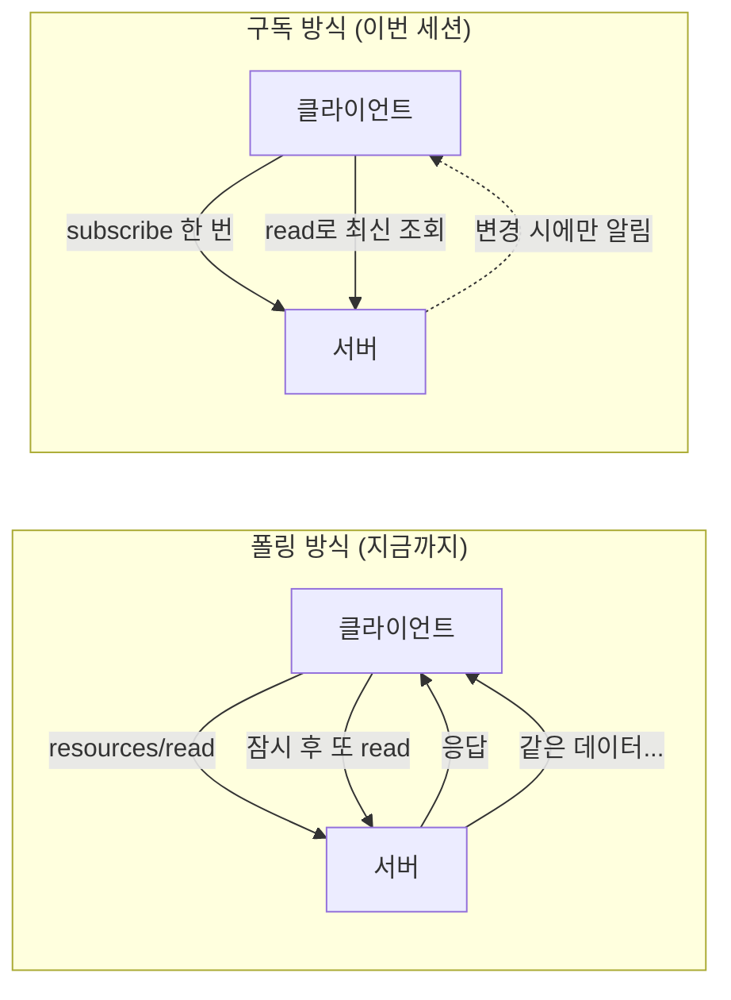
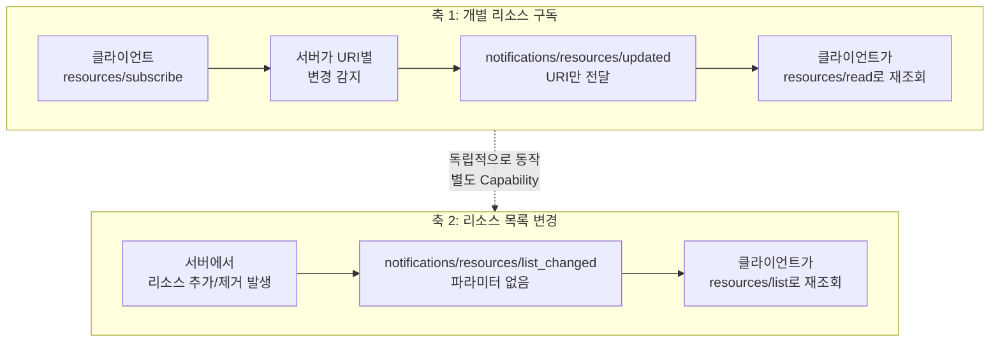
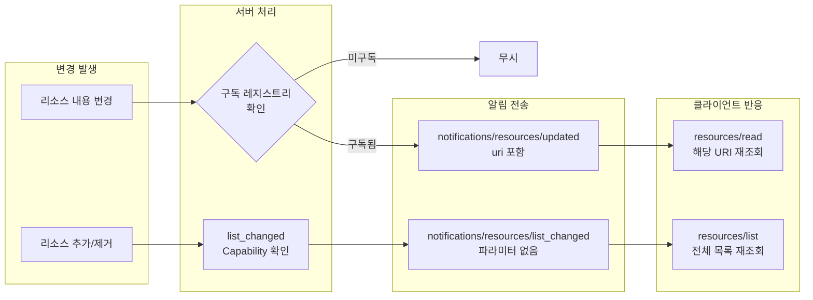
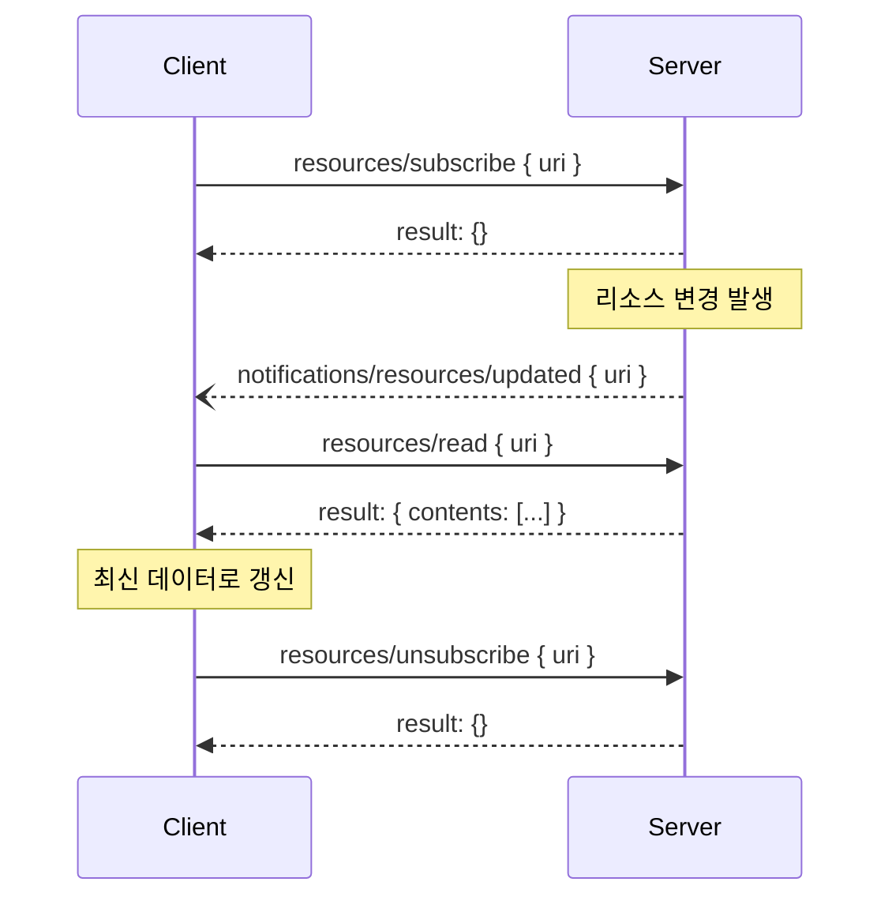
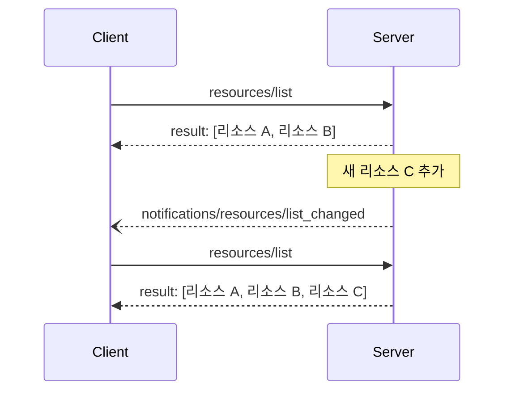
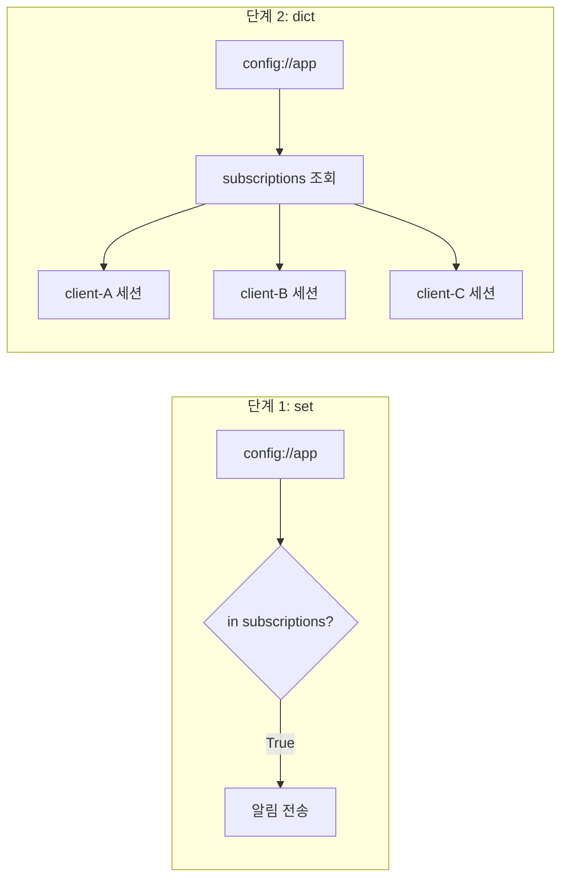
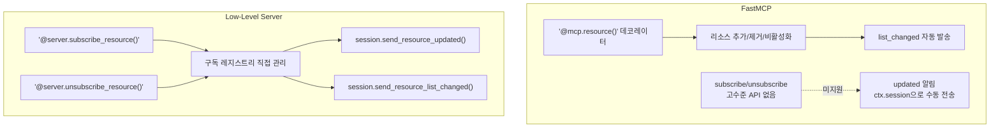

# 리소스 구독과 변경 알림

> MCP 리소스의 실시간 변경 감지 — 구독(Subscribe)과 알림(Notification)으로 살아있는 데이터를 다룹니다

## 개요

이 섹션에서는 MCP 리소스의 마지막 퍼즐 조각인 **구독(Subscription)**과 **변경 알림(Notification)** 메커니즘을 학습합니다. 앞선 세션에서 리소스를 정의하고, URI 템플릿으로 동적 데이터를 다루고, MIME 타입으로 다양한 포맷을 처리하는 방법을 배웠는데요 — 이 모든 것이 "요청 시점의 스냅샷"이었다면, 이번 세션은 **데이터가 바뀔 때 능동적으로 알려주는** 방법입니다.

**선수 지식**:
- [Resource 프리미티브 이해](05-ch5-resources-데이터-노출-프리미티브/01-01-resource-프리미티브-이해.md)의 `resources/list`, `resources/read` 프로토콜
- [정적 리소스와 동적 리소스](05-ch5-resources-데이터-노출-프리미티브/02-02-정적-리소스와-동적-리소스.md)의 URI 기반 리소스 구조
- [JSON-RPC 2.0 메시지 포맷](02-ch2-mcp-아키텍처와-프로토콜-구조/04-04-json-rpc-20-메시지-포맷.md)의 Request, Response, Notification 구분
- [세션 라이프사이클과 Capability Negotiation](02-ch2-mcp-아키텍처와-프로토콜-구조/05-05-세션-라이프사이클과-capability-negotiation.md)의 초기화 흐름

**학습 목표**:
- `resources/subscribe`와 `resources/unsubscribe` 메서드의 역할과 흐름을 이해한다
- `notifications/resources/updated` 알림의 동작 방식을 이해하고 구현할 수 있다
- `notifications/resources/list_changed` 알림으로 리소스 목록 변경을 감지할 수 있다
- 구독 레지스트리를 **단계별로**(단일 → 다중 → 목록 변경) 설계할 수 있다

## 왜 알아야 할까?

지금까지 우리가 만든 MCP 리소스 서버는 **질문해야 답하는** 구조였습니다. 클라이언트가 `resources/read`를 호출해야만 데이터를 받을 수 있죠. 하지만 실전에서는 데이터가 끊임없이 변합니다:

- 데이터베이스에 새 레코드가 추가될 때
- 설정 파일이 수정될 때
- 모니터링 대시보드의 메트릭이 갱신될 때
- 외부 API에서 새 데이터가 도착할 때

클라이언트가 매번 "혹시 바뀌었나요?" 하고 폴링(polling)하는 것은 비효율적입니다. MCP의 구독 메커니즘은 **"바뀌면 내가 알려줄게"**라는 서버 주도의 알림 패턴을 제공합니다. 이것은 단순한 편의 기능이 아니라, LLM이 **항상 최신 정보**로 응답하게 하는 핵심 인프라입니다.

> 📊 **그림 1**: 폴링(Polling)과 구독(Subscription)의 차이 — 이전 세션의 `resources/read`에서 한 단계 진화



이전 세션에서 `resources/read`로 리소스를 조회하는 것은 **풀(Pull)** 방식이었습니다. 구독은 이것을 **푸시(Push)** 방식으로 보완합니다. 풀과 푸시를 조합하면 — "변경을 알림으로 받고, 필요할 때만 데이터를 가져오는" — 효율적이고 최신성이 보장되는 리소스 시스템이 완성되는 거죠.

## 핵심 개념

### 개념 1: 폴링에서 구독으로 — 왜 전환이 필요한가

> 💡 **비유**: 좋아하는 유튜브 채널이 있다고 해봅시다. 매시간 채널 페이지에 들어가서 "새 영상 올라왔나?" 확인하는 것이 폴링입니다. 구독 버튼을 누르면 새 영상이 올라올 때 알림이 오죠 — 그게 바로 구독 메커니즘입니다.

이전 세션에서 `resources/read`를 배울 때, 우리는 한 가지 암묵적 가정을 했습니다 — **클라이언트가 데이터가 필요한 시점을 안다**는 것이죠. 하지만 "설정이 언제 바뀔지", "새 로그가 언제 추가될지"는 서버만 알 수 있습니다.

이 문제를 해결하는 가장 단순한 방법은 **폴링(Polling)** — 주기적으로 `resources/read`를 반복 호출하는 것입니다. 하지만 폴링에는 명확한 한계가 있습니다:

| 문제 | 설명 |
|------|------|
| **불필요한 트래픽** | 데이터가 변경되지 않아도 매번 전체 데이터를 주고받음 |
| **지연 시간** | 폴링 간격만큼 변경 감지가 늦어짐 (5초 간격이면 최대 5초 지연) |
| **확장성** | 10개 리소스 × 100 클라이언트 = 초당 수천 건의 불필요한 요청 |

MCP의 구독 메커니즘은 이 문제를 깔끔하게 해결합니다:

```run:python
# 폴링 vs 구독의 네트워크 비용 비교
polling_interval = 5     # 5초마다 폴링
resources = 10           # 감시 대상 리소스 10개
actual_changes = 3       # 1시간 동안 실제 변경 3번

# 폴링: 변경 여부와 무관하게 계속 요청
polling_requests = (3600 / polling_interval) * resources
print(f"[폴링] 1시간 동안 총 요청: {int(polling_requests)}건")
print(f"[폴링] 이 중 유의미한 변경: {actual_changes}건")
print(f"[폴링] 낭비된 요청: {int(polling_requests - actual_changes)}건")

# 구독: 구독 등록 + 변경 시에만 알림 + 재조회
subscription_requests = resources + actual_changes * 2  # subscribe + (알림→read) 쌍
print(f"\n[구독] 1시간 동안 총 메시지: {subscription_requests}건")
print(f"  └ 구독 등록: {resources}건 (최초 1회)")
print(f"  └ 알림+재조회: {actual_changes * 2}건")
print(f"\n효율 향상: {int(polling_requests / subscription_requests)}배")
```

```output
[폴링] 1시간 동안 총 요청: 7200건
[폴링] 이 중 유의미한 변경: 3건
[폴링] 낭비된 요청: 7197건

[구독] 1시간 동안 총 메시지: 16건
  └ 구독 등록: 10건 (최초 1회)
  └ 알림+재조회: 6건

효율 향상: 450배
```

450배 차이 — 실제 환경에서는 이보다 더 극적일 수 있습니다. 구독 메커니즘이 왜 필요한지 체감이 되시죠?

### 개념 2: 구독 메커니즘의 전체 그림

> 💡 **비유**: 구독 메커니즘은 신문 구독과 같습니다. 매일 아침 신문 가판대에 가서 "오늘 신문 나왔나요?" 하고 묻는 대신(폴링), 구독 신청을 해두면 배달부가 새 신문이 나올 때마다 문 앞에 놓아줍니다(알림). 그리고 구독을 해지하면 배달이 멈추죠.

MCP 리소스 구독은 두 가지 독립적인 메커니즘으로 구성됩니다:

1. **개별 리소스 구독** (`resources/subscribe`): 특정 URI의 리소스가 변경되면 `notifications/resources/updated`를 받음
2. **리소스 목록 변경 알림** (`notifications/resources/list_changed`): 리소스가 추가/제거되면 알림을 받음

> 📊 **그림 2**: MCP 리소스 구독 메커니즘의 두 축



두 메커니즘은 별개의 Capability로 선언됩니다. 서버가 초기화 응답에서 선언하는 구조를 보면:

```python
# 서버 Capability 선언 구조
{
    "capabilities": {
        "resources": {
            "subscribe": True,    # 개별 리소스 구독 지원
            "listChanged": True   # 리소스 목록 변경 알림 지원
        }
    }
}
```

서버는 둘 중 하나만 지원할 수도 있고, 둘 다 지원할 수도 있습니다. 클라이언트는 초기화 시 서버의 Capability를 확인한 뒤 지원되는 기능만 사용해야 합니다. [세션 라이프사이클과 Capability Negotiation](02-ch2-mcp-아키텍처와-프로토콜-구조/05-05-세션-라이프사이클과-capability-negotiation.md)에서 배운 초기화 흐름의 연장선이죠.

> 📊 **그림 3**: 두 알림 경로의 비교 — 트리거부터 클라이언트 반응까지



### 개념 3: `resources/subscribe`와 `notifications/resources/updated`

> 💡 **비유**: 주식 종목을 관심 종목에 등록하면 가격이 바뀔 때마다 알림이 오는 것과 같습니다. 알림은 "가격이 바뀌었어요!"라고만 알려주고, 실제 가격을 보려면 종목 상세를 다시 열어야 하죠.

개별 리소스 구독은 3단계로 동작합니다:

**1단계 — 구독 요청**: 클라이언트가 관심 있는 리소스 URI를 구독합니다.

```json
{
    "jsonrpc": "2.0",
    "id": 4,
    "method": "resources/subscribe",
    "params": {
        "uri": "config://app/settings"
    }
}
```

서버는 빈 결과로 구독 수락을 응답합니다:

```json
{
    "jsonrpc": "2.0",
    "id": 4,
    "result": {}
}
```

**2단계 — 변경 알림**: 서버가 해당 리소스의 변경을 감지하면 Notification을 보냅니다.

```json
{
    "jsonrpc": "2.0",
    "method": "notifications/resources/updated",
    "params": {
        "uri": "config://app/settings"
    }
}
```

핵심 포인트는 이 알림에 **변경된 데이터가 포함되지 않는다**는 것입니다. "바뀌었다"는 사실만 알려줍니다.

**3단계 — 재조회**: 클라이언트가 `resources/read`로 최신 데이터를 다시 읽습니다.

> 📊 **그림 4**: 리소스 구독의 전체 메시지 흐름



왜 알림에 데이터를 포함하지 않을까요? 이것은 의도적인 설계입니다:

- **대역폭 절약**: 대용량 리소스가 빈번히 변경되면 알림마다 전체 데이터를 보내는 것은 낭비입니다
- **클라이언트 제어권**: 알림을 받더라도 지금 당장 데이터가 필요 없을 수 있습니다. 클라이언트가 **언제 읽을지** 결정합니다
- **일관성 보장**: 알림 전송과 데이터 읽기 사이에 추가 변경이 있을 수 있는데, 항상 `resources/read` 시점의 최신 데이터를 받습니다

구독 해제도 간단합니다:

```json
{
    "jsonrpc": "2.0",
    "id": 5,
    "method": "resources/unsubscribe",
    "params": {
        "uri": "config://app/settings"
    }
}
```

### 개념 4: `notifications/resources/list_changed`

> 💡 **비유**: 도서관의 신착 도서 알림과 비슷합니다. 특정 책의 내용이 바뀌는 것(resources/updated)이 아니라, 도서관에 **새 책이 들어오거나 기존 책이 폐기**되었을 때 "서가 목록이 바뀌었으니 다시 확인하세요"라고 알려주는 거죠.

`notifications/resources/list_changed`는 서버에서 노출하는 **리소스의 집합 자체**가 변경되었음을 알립니다.

```json
{
    "jsonrpc": "2.0",
    "method": "notifications/resources/list_changed"
}
```

이 알림은 파라미터가 없습니다 — 단순히 "목록이 바뀌었다"는 사실만 전달합니다. 클라이언트는 `resources/list`를 다시 호출하여 최신 목록을 받아야 합니다.

> 📊 **그림 5**: 리소스 목록 변경 알림 흐름



두 알림의 차이를 정리하면:

| 구분 | `resources/updated` | `resources/list_changed` |
|------|-------------------|------------------------|
| **대상** | 특정 URI의 리소스 **내용** 변경 | 리소스 **집합** 변경 (추가/제거) |
| **구독 필요** | `resources/subscribe` 필수 | 구독 불필요 (Capability만 있으면 자동) |
| **파라미터** | `{ uri: string }` | 없음 |
| **후속 동작** | `resources/read` | `resources/list` |
| **Capability** | `subscribe: true` | `listChanged: true` |

### 개념 5: 구독 레지스트리 — 단계별 구현

지금까지 프로토콜(메시지 포맷, 흐름)을 이해했으니, 이제 **서버 내부에서 구독 상태를 어떻게 관리하는지** 구현해보겠습니다. SDK가 자동으로 관리하지 않기 때문에 직접 만들어야 하는 부분인데요, 처음부터 복잡한 구조를 만들 필요 없이 **단계적으로 확장**해 나가겠습니다.

#### 단계 1: 단일 구독 — `set[str]`로 시작하기

가장 단순한 형태부터 시작합시다. 서버에 클라이언트가 하나만 접속하는 경우(MCP의 stdio 전송에서는 이것이 일반적), "어떤 URI가 구독 중인지"만 추적하면 됩니다.

```run:python
# 단계 1: 가장 단순한 구독 레지스트리 — set[str]
subscriptions: set[str] = set()

# 구독 등록
def subscribe(uri: str):
    subscriptions.add(uri)
    print(f"  [구독] {uri}")

# 구독 해제
def unsubscribe(uri: str):
    subscriptions.discard(uri)
    print(f"  [해제] {uri}")

# 변경 시 알림 여부 판단
def should_notify(uri: str) -> bool:
    return uri in subscriptions

# 시나리오
print("=== 단계 1: 단일 클라이언트 구독 ===")
subscribe("config://app")
subscribe("config://db")

print(f"\nconfig://app 변경 → 알림 필요? {should_notify('config://app')}")
print(f"config://cache 변경 → 알림 필요? {should_notify('config://cache')}")

unsubscribe("config://app")
print(f"\nconfig://app 해제 후 → 알림 필요? {should_notify('config://app')}")
print(f"현재 구독 목록: {subscriptions}")
```

```output
=== 단계 1: 단일 클라이언트 구독 ===
  [구독] config://app
  [구독] config://db

config://app 변경 → 알림 필요? True
config://cache 변경 → 알림 필요? False

config://app 해제 후 → 알림 필요? False
현재 구독 목록: {'config://db'}
```

이것만으로도 stdio 기반 단일 클라이언트 MCP 서버에서는 완벽하게 작동합니다. 대부분의 MCP 사용 사례가 여기에 해당하므로, **처음에는 이 정도로 충분**합니다.

#### 단계 2: 다중 구독 — `dict[str, set[str]]`로 확장

> 💡 **비유**: 단일 `set`은 "이 신문이 구독 중인가?" 만 알 수 있는 명부입니다. 하지만 배달부가 여러 집에 배달해야 한다면, "이 신문을 어느 집들이 구독하는가?"를 알아야 하죠. `dict[str, set[str]]`은 바로 그 **신문→구독 가구 목록** 매핑입니다.

HTTP SSE 전송으로 여러 클라이언트가 동시에 접속하는 경우, "누가 어떤 URI를 구독하는지"를 추적해야 합니다. 단계 1의 `set`을 `dict`로 한 단계만 확장하면 됩니다:

> 📊 **그림 6**: 단일 클라이언트 vs 멀티 클라이언트 구독 레지스트리



```run:python
# 단계 2: 멀티 클라이언트 구독 레지스트리 — dict[str, set[str]]
registry: dict[str, set[str]] = {}  # URI → set of session_ids

def subscribe(uri: str, session_id: str):
    if uri not in registry:
        registry[uri] = set()
    registry[uri].add(session_id)

def unsubscribe(uri: str, session_id: str):
    if uri in registry:
        registry[uri].discard(session_id)
        if not registry[uri]:
            del registry[uri]

def get_subscribers(uri: str) -> set[str]:
    return registry.get(uri, set())

def remove_session(session_id: str):
    """세션 종료 시 해당 세션의 모든 구독 정리 (메모리 누수 방지)"""
    empty = []
    for uri, sessions in registry.items():
        sessions.discard(session_id)
        if not sessions:
            empty.append(uri)
    for uri in empty:
        del registry[uri]

# 시나리오 실행
print("=== 단계 2: 멀티 클라이언트 구독 ===")
subscribe("config://app", "client-A")
subscribe("config://app", "client-B")
subscribe("config://db", "client-A")
subscribe("config://cache", "client-C")

print("\n[초기 상태]")
for uri, clients in sorted(registry.items()):
    print(f"  {uri}: {sorted(clients)}")

print(f"\n[알림] config://app 변경 → 대상: {sorted(get_subscribers('config://app'))}")
print(f"[알림] config://db 변경 → 대상: {sorted(get_subscribers('config://db'))}")

# client-A 연결 종료
print("\n[client-A 연결 종료 후]")
remove_session("client-A")
for uri, clients in sorted(registry.items()):
    print(f"  {uri}: {sorted(clients)}")
print(f"구독 중인 URI: {len(registry)}개")
```

```output
=== 단계 2: 멀티 클라이언트 구독 ===

[초기 상태]
  config://app: ['client-A', 'client-B']
  config://cache: ['client-C']
  config://db: ['client-A']

[알림] config://app 변경 → 대상: ['client-A', 'client-B']
[알림] config://db 변경 → 대상: ['client-A']

[client-A 연결 종료 후]
  config://app: ['client-B']
  config://cache: ['client-C']
구독 중인 URI: 2개
```

`remove_session()`이 핵심입니다 — 클라이언트가 연결을 끊을 때 해당 세션의 모든 구독을 자동 정리합니다. 이걸 빠뜨리면 **좀비 구독**이 쌓여서 메모리 누수가 발생하고, 끊어진 세션에 알림을 보내려다 에러가 터지죠.

#### 단계 3: 완전한 구독 레지스트리 — 알림 전송까지

이제 단계 2의 구조에 **실제 알림 전송 로직**(`send_resource_updated`, `send_resource_list_changed`)과 **비동기 안전성**(`asyncio.Lock`)을 추가하면 프로덕션 수준의 레지스트리가 됩니다:

```python
"""
멀티 클라이언트 구독 레지스트리 — 완전한 구현
단계 2의 dict[str, set[str]]에 세션 매핑 + 비동기 락 + 알림 전송을 추가
"""
import asyncio
from dataclasses import dataclass, field
from mcp.server.session import ServerSession


@dataclass
class SubscriptionRegistry:
    """URI → 구독 세션 매핑을 관리하는 레지스트리"""

    # [단계 2에서 가져온 핵심 구조]
    # URI별 구독 세션 ID 집합
    _uri_to_sessions: dict[str, set[str]] = field(default_factory=dict)

    # [단계 3에서 추가]
    # 세션 ID → ServerSession 인스턴스 매핑 (알림 전송용)
    _session_map: dict[str, ServerSession] = field(default_factory=dict)
    # 동시 접근 보호 (여러 비동기 태스크에서 동시 수정 방지)
    _lock: asyncio.Lock = field(default_factory=asyncio.Lock)

    async def register_session(
        self, session_id: str, session: ServerSession
    ) -> None:
        """새 클라이언트 세션을 등록"""
        async with self._lock:
            self._session_map[session_id] = session

    async def subscribe(self, uri: str, session_id: str) -> None:
        """특정 URI에 대한 구독 등록"""
        async with self._lock:
            if uri not in self._uri_to_sessions:
                self._uri_to_sessions[uri] = set()
            self._uri_to_sessions[uri].add(session_id)

    async def unsubscribe(self, uri: str, session_id: str) -> None:
        """특정 URI에 대한 구독 해제"""
        async with self._lock:
            if uri in self._uri_to_sessions:
                self._uri_to_sessions[uri].discard(session_id)
                # 구독자가 없으면 URI 항목 정리
                if not self._uri_to_sessions[uri]:
                    del self._uri_to_sessions[uri]

    async def remove_session(self, session_id: str) -> None:
        """세션 종료 시 해당 세션의 모든 구독 정리 (메모리 누수 방지)"""
        async with self._lock:
            empty_uris = []
            for uri, sessions in self._uri_to_sessions.items():
                sessions.discard(session_id)
                if not sessions:
                    empty_uris.append(uri)
            for uri in empty_uris:
                del self._uri_to_sessions[uri]
            self._session_map.pop(session_id, None)

    async def notify_updated(self, uri: str) -> int:
        """URI 변경 시 모든 구독 세션에 알림 전송. 전송 수 반환."""
        async with self._lock:
            session_ids = self._uri_to_sessions.get(uri, set()).copy()
            sessions = [
                self._session_map[sid]
                for sid in session_ids
                if sid in self._session_map
            ]

        # 락 해제 후 알림 전송 (I/O 작업이므로 락 밖에서)
        sent = 0
        for session in sessions:
            try:
                await session.send_resource_updated(uri)
                sent += 1
            except Exception:
                pass  # 끊어진 세션은 무시
        return sent

    async def notify_list_changed(self) -> int:
        """모든 활성 세션에 리소스 목록 변경 알림 전송"""
        async with self._lock:
            sessions = list(self._session_map.values())

        sent = 0
        for session in sessions:
            try:
                await session.send_resource_list_changed()
                sent += 1
            except Exception:
                pass
        return sent

    @property
    def stats(self) -> dict:
        """현재 구독 상태 요약"""
        return {
            "active_sessions": len(self._session_map),
            "subscribed_uris": len(self._uri_to_sessions),
            "total_subscriptions": sum(
                len(s) for s in self._uri_to_sessions.values()
            ),
        }
```

> 📊 **그림 7**: 구독 레지스트리 3단계 진화 요약


어떤 단계를 선택할지는 상황에 따라 다릅니다:

| 상황 | 권장 단계 |
|------|-----------|
| stdio 전송, 단일 클라이언트 | **단계 1** — `set[str]`이면 충분 |
| HTTP SSE, 소수 클라이언트 | **단계 2** — `dict[str, set[str]]` |
| 프로덕션, 다수 동시 접속 | **단계 3** — `SubscriptionRegistry` 클래스 |

### 개념 6: FastMCP vs Low-Level Server — 구독 지원의 차이

MCP Python SDK에서 서버를 구현하는 두 가지 방법 — FastMCP와 Low-Level Server — 은 구독 지원 수준이 **크게 다릅니다**. 이 차이를 정확히 이해하지 못하면 "구독이 동작하지 않는" 상황에 빠지기 쉽습니다.

> 📊 **그림 8**: FastMCP와 Low-Level Server의 구독 지원 비교



| 기능 | FastMCP | Low-Level Server |
|------|---------|-----------------|
| `list_changed` 알림 | 자동 (리소스 추가/제거 시) | `session.send_resource_list_changed()` 수동 호출 |
| `subscribe`/`unsubscribe` 핸들러 | 고수준 API 없음 | `@server.subscribe_resource()` 데코레이터 |
| `updated` 알림 | `ctx.session.send_resource_updated()` 수동 | `session.send_resource_updated()` 수동 |
| 구독 레지스트리 | 직접 구현 필요 | 직접 구현 필요 |
| Capability 자동 선언 | `listChanged: true` 자동 | `subscribe` 핸들러 등록 시 `subscribe: true` 자동 |

**핵심 포인트**: FastMCP를 사용하면 `list_changed`는 신경 쓸 필요 없지만, 개별 리소스 구독(`subscribe`/`unsubscribe`/`updated`)이 필요하다면 두 가지 선택지가 있습니다:

1. **Low-Level Server 사용**: `subscribe_resource()` 데코레이터로 완전한 구독 흐름 구현
2. **FastMCP + 수동 구현**: FastMCP의 `Context.session`을 통해 `send_resource_updated()`를 호출하되, 구독 레지스트리와 트리거 로직은 직접 작성

> ⚠️ **흔한 오해**: FastMCP에 `@mcp.subscribe_resource()` 같은 데코레이터가 있을 것이라고 기대하기 쉽습니다. Python SDK v1.x 기준으로 이 데코레이터는 **Low-Level Server에만** 존재합니다. FastMCP는 편의성 래퍼이므로 모든 저수준 기능을 노출하지는 않습니다.

## 실습: 직접 해보기

실시간 설정 파일 모니터링 서버를 만들어보겠습니다. 설정이 바뀌면 구독 중인 클라이언트에게 알림을 보내는 패턴입니다.

### 1단계: 구독 지원 MCP 서버 (Low-Level)

Low-Level Server를 사용하면 `subscribe`/`unsubscribe` 핸들러를 데코레이터로 등록할 수 있습니다. SDK가 자동으로 Capability에 `subscribe: true`를 포함시킵니다. 여기서는 앞서 배운 **구독 레지스트리 단계 1(set)**을 사용합니다 — 단일 세션 서버이므로 충분합니다:

```python
"""
실시간 설정 모니터링 MCP 서버 (Low-Level Server)
- 설정 리소스 읽기 (resources/read)
- 설정 변경 구독 (resources/subscribe)
- 변경 시 알림 (notifications/resources/updated)
- 동적 리소스 추가 시 목록 변경 알림

구독 레지스트리: 단계 1 — set[str] (단일 세션에 적합)
"""
import asyncio
import json
from datetime import datetime
from mcp.server.lowlevel import Server, NotificationOptions
from mcp import types

# ── 서버 상태 ──
# 설정 데이터 저장소
config_store: dict[str, dict] = {
    "config://app/database": {
        "host": "localhost",
        "port": 5432,
        "pool_size": 10,
        "updated_at": "2026-03-23T09:00:00"
    },
    "config://app/cache": {
        "backend": "redis",
        "ttl": 300,
        "max_memory": "256mb",
        "updated_at": "2026-03-23T09:00:00"
    }
}

# 구독 레지스트리 — 단계 1: set[str]
# 단일 세션 서버에서는 이것으로 충분
# 멀티 세션이 필요하면 단계 2(dict) 또는 단계 3(SubscriptionRegistry)으로 전환
subscriptions: set[str] = set()

# 서버 생성
server = Server("config-monitor")


# ── 리소스 목록 ──
@server.list_resources()
async def list_resources() -> list[types.Resource]:
    """사용 가능한 설정 리소스 목록 반환"""
    resources = []
    for uri in config_store:
        resources.append(types.Resource(
            uri=uri,
            name=uri.split("/")[-1],
            description=f"{uri.split('/')[-1]} 설정",
            mimeType="application/json"
        ))
    return resources


# ── 리소스 읽기 ──
@server.read_resource()
async def read_resource(uri: str) -> types.ReadResourceResult:
    """URI에 해당하는 설정 데이터 반환"""
    if uri not in config_store:
        raise ValueError(f"알 수 없는 리소스: {uri}")

    content = json.dumps(config_store[uri], ensure_ascii=False, indent=2)
    return types.ReadResourceResult(
        contents=[
            types.TextResourceContents(
                uri=uri,
                mimeType="application/json",
                text=content
            )
        ]
    )


# ── 구독 관리 (Low-Level Server 전용 데코레이터) ──
@server.subscribe_resource()
async def handle_subscribe(uri: str) -> None:
    """리소스 구독 등록
    이 데코레이터를 등록하면 SDK가 자동으로
    Capability에 subscribe: true를 포함시킵니다.
    """
    subscriptions.add(uri)
    print(f"[구독] {uri} (현재 구독: {len(subscriptions)}개)")


@server.unsubscribe_resource()
async def handle_unsubscribe(uri: str) -> None:
    """리소스 구독 해제"""
    subscriptions.discard(uri)
    print(f"[해제] {uri} (현재 구독: {len(subscriptions)}개)")


# ── 설정 변경 함수 (외부에서 호출) ──
async def update_config(
    uri: str,
    changes: dict,
    session  # ServerSession 인스턴스
) -> None:
    """설정을 업데이트하고 구독자에게 알림"""
    if uri not in config_store:
        raise ValueError(f"알 수 없는 리소스: {uri}")

    # 설정 업데이트
    config_store[uri].update(changes)
    config_store[uri]["updated_at"] = datetime.now().isoformat()

    print(f"[변경] {uri}: {changes}")

    # 구독된 URI라면 알림 전송
    if uri in subscriptions:
        await session.send_resource_updated(uri)
        print(f"[알림] {uri} 변경 알림 전송 완료")


async def add_new_config(
    uri: str,
    data: dict,
    session  # ServerSession 인스턴스
) -> None:
    """새 설정 리소스를 추가하고 목록 변경 알림"""
    config_store[uri] = {
        **data,
        "updated_at": datetime.now().isoformat()
    }

    print(f"[추가] 새 리소스: {uri}")

    # 리소스 목록이 변경되었음을 알림
    await session.send_resource_list_changed()
    print("[알림] 리소스 목록 변경 알림 전송 완료")
```

### 2단계: FastMCP에서의 구독 통합 (현실적 접근)

FastMCP를 사용하면 `list_changed`는 자동이지만, 개별 리소스 구독은 직접 구현해야 합니다. `Context.session`을 통해 `send_resource_updated()`를 호출하는 패턴입니다:

```python
"""
FastMCP + 구독 알림 통합 서버
- list_changed: FastMCP가 자동 처리
- subscribe/updated: 수동 구현 (구독 레지스트리 + ctx.session)

주의: FastMCP에는 @mcp.subscribe_resource() 데코레이터가 없습니다.
개별 리소스 구독이 핵심이라면 Low-Level Server 사용을 권장합니다.
"""
import json
from datetime import datetime
from fastmcp import FastMCP, Context

mcp = FastMCP("config-live")

# 설정 저장소
_configs: dict[str, dict] = {
    "app": {"debug": False, "log_level": "INFO", "max_workers": 4},
    "db": {"host": "localhost", "port": 5432, "pool_size": 10},
}

# 구독 레지스트리 — 단계 1(set)로 시작
# FastMCP에서는 subscribe/unsubscribe 핸들러가 없으므로
# Tool을 통해 구독을 관리하거나, Low-Level Server로 전환해야 합니다
_subscribed_uris: set[str] = set()


# ── 정적 리소스: 각 설정 섹션 ──
@mcp.resource("config://app")
def get_app_config() -> str:
    """애플리케이션 기본 설정"""
    return json.dumps(_configs["app"], ensure_ascii=False, indent=2)


@mcp.resource("config://db")
def get_db_config() -> str:
    """데이터베이스 설정"""
    return json.dumps(_configs["db"], ensure_ascii=False, indent=2)


# ── 동적 리소스: 임의 키 조회 ──
@mcp.resource("config://{section}/{key}")
def get_config_value(section: str, key: str) -> str:
    """특정 설정 값 조회"""
    if section not in _configs:
        return json.dumps({"error": f"섹션 '{section}' 없음"})
    value = _configs[section].get(key, "NOT_FOUND")
    return json.dumps({"section": section, "key": key, "value": value})


# ── 도구: 설정 변경 + 알림 ──
@mcp.tool()
async def update_config(
    section: str,
    key: str,
    value: str,
    ctx: Context
) -> str:
    """설정 값을 변경합니다. 구독자에게 자동으로 변경 알림을 보냅니다.

    Args:
        section: 설정 섹션 (app, db)
        key: 설정 키
        value: 새 값 (JSON 파싱 시도, 실패 시 문자열)
    """
    if section not in _configs:
        return f"오류: 섹션 '{section}' 없음"

    # 값 파싱 (JSON 타입 보존)
    try:
        parsed_value = json.loads(value)
    except (json.JSONDecodeError, TypeError):
        parsed_value = value

    old_value = _configs[section].get(key)
    _configs[section][key] = parsed_value

    # 변경된 리소스의 구독자에게 알림
    uri = f"config://{section}"
    if uri in _subscribed_uris:
        # Context를 통해 세션에 접근하여 알림 전송
        await ctx.session.send_resource_updated(uri)

    return json.dumps({
        "status": "updated",
        "section": section,
        "key": key,
        "old_value": old_value,
        "new_value": parsed_value
    }, ensure_ascii=False)


# ── 도구: 새 설정 섹션 추가 ──
@mcp.tool()
async def add_config_section(
    section: str,
    initial_data: str,
    ctx: Context
) -> str:
    """새 설정 섹션을 추가합니다. 리소스 목록 변경 알림이 자동 발송됩니다.

    Args:
        section: 새 섹션 이름
        initial_data: 초기 데이터 (JSON 문자열)
    """
    if section in _configs:
        return f"오류: 섹션 '{section}' 이미 존재"

    _configs[section] = json.loads(initial_data)

    # FastMCP에서는 리소스 목록 변경 알림이 자동 발송됨
    # 명시적으로 보내려면 아래 호출도 가능:
    await ctx.session.send_resource_list_changed()

    return f"섹션 '{section}' 추가 완료. 리소스 목록 변경 알림 전송됨."
```

### 3단계: 구독을 테스트하는 클라이언트

MCP Inspector나 커스텀 클라이언트로 구독 흐름을 검증할 수 있습니다:

```run:python
# 구독 메시지 흐름 시뮬레이션
import json

def simulate_subscription_flow():
    """구독 프로토콜 메시지 흐름을 시뮬레이션"""
    messages = []

    # 1. 초기화 — 서버가 구독 지원 선언
    init_response = {
        "capabilities": {
            "resources": {
                "subscribe": True,
                "listChanged": True
            }
        }
    }
    messages.append(("서버→클라", "초기화 응답", init_response))

    # 2. 클라이언트가 리소스 목록 조회
    list_request = {"method": "resources/list", "id": 1}
    list_response = {
        "resources": [
            {"uri": "config://app", "name": "app", "mimeType": "application/json"},
            {"uri": "config://db", "name": "db", "mimeType": "application/json"}
        ]
    }
    messages.append(("클라→서버", "리소스 목록 요청", list_request))
    messages.append(("서버→클라", "리소스 목록 응답", list_response))

    # 3. 클라이언트가 config://app 구독
    sub_request = {"method": "resources/subscribe", "id": 2, "params": {"uri": "config://app"}}
    sub_response = {"result": {}}
    messages.append(("클라→서버", "구독 요청", sub_request))
    messages.append(("서버→클라", "구독 수락", sub_response))

    # 4. 서버에서 변경 발생 → 알림
    notification = {
        "method": "notifications/resources/updated",
        "params": {"uri": "config://app"}
    }
    messages.append(("서버→클라", "변경 알림 (Notification)", notification))

    # 5. 클라이언트가 최신 데이터 재조회
    read_request = {"method": "resources/read", "id": 3, "params": {"uri": "config://app"}}
    messages.append(("클라→서버", "최신 데이터 요청", read_request))

    # 출력
    print("=" * 60)
    print("MCP 리소스 구독 메시지 흐름")
    print("=" * 60)
    for direction, label, msg in messages:
        print(f"\n[{direction}] {label}")
        print(f"  {json.dumps(msg, ensure_ascii=False)}")
    print("\n" + "=" * 60)
    print(f"총 {len(messages)}개 메시지 교환")

simulate_subscription_flow()
```

```output
============================================================
MCP 리소스 구독 메시지 흐름
============================================================

[서버→클라] 초기화 응답
  {"capabilities": {"resources": {"subscribe": true, "listChanged": true}}}

[클라→서버] 리소스 목록 요청
  {"method": "resources/list", "id": 1}

[서버→클라] 리소스 목록 응답
  {"resources": [{"uri": "config://app", "name": "app", "mimeType": "application/json"}, {"uri": "config://db", "name": "db", "mimeType": "application/json"}]}

[클라→서버] 구독 요청
  {"method": "resources/subscribe", "id": 2, "params": {"uri": "config://app"}}

[서버→클라] 구독 수락
  {"result": {}}

[서버→클라] 변경 알림 (Notification)
  {"method": "notifications/resources/updated", "params": {"uri": "config://app"}}

[클라→서버] 최신 데이터 요청
  {"method": "resources/read", "id": 3, "params": {"uri": "config://app"}}

============================================================
총 7개 메시지 교환
```

### 4단계: 파일 감시 기반 리소스 서버 (실전 패턴)

실무에서 가장 흔한 패턴은 파일 시스템 변경을 감지하여 알림을 보내는 것입니다:

```python
"""
파일 감시 리소스 서버 — watchfiles를 사용한 실시간 변경 감지
pip install mcp watchfiles
"""
import asyncio
import json
from pathlib import Path
from mcp.server.lowlevel import Server, NotificationOptions
from mcp import types

# 감시 대상 디렉토리
WATCH_DIR = Path("./config")

server = Server("file-watcher")
subscriptions: set[str] = set()  # 단계 1 레지스트리 (단일 세션)


def uri_for_path(path: Path) -> str:
    """파일 경로를 리소스 URI로 변환"""
    return f"file://config/{path.name}"


def path_for_uri(uri: str) -> Path:
    """URI를 파일 경로로 변환"""
    name = uri.replace("file://config/", "")
    return WATCH_DIR / name


@server.list_resources()
async def list_resources() -> list[types.Resource]:
    if not WATCH_DIR.exists():
        return []
    return [
        types.Resource(
            uri=uri_for_path(f),
            name=f.name,
            description=f"{f.name} 설정 파일",
            mimeType="application/json" if f.suffix == ".json" else "text/plain"
        )
        for f in WATCH_DIR.iterdir() if f.is_file()
    ]


@server.read_resource()
async def read_resource(uri: str) -> types.ReadResourceResult:
    path = path_for_uri(uri)
    if not path.exists():
        raise ValueError(f"파일 없음: {path}")

    text = path.read_text(encoding="utf-8")
    mime = "application/json" if path.suffix == ".json" else "text/plain"

    return types.ReadResourceResult(
        contents=[types.TextResourceContents(uri=uri, mimeType=mime, text=text)]
    )


@server.subscribe_resource()
async def handle_subscribe(uri: str) -> None:
    subscriptions.add(uri)


@server.unsubscribe_resource()
async def handle_unsubscribe(uri: str) -> None:
    subscriptions.discard(uri)


async def watch_files(session) -> None:
    """파일 변경을 감시하고 구독자에게 알림 전송

    watchfiles 라이브러리 사용:
      pip install watchfiles
    """
    from watchfiles import awatch, Change

    # 이전 파일 목록 (리소스 추가/제거 감지용)
    prev_files = set(WATCH_DIR.iterdir()) if WATCH_DIR.exists() else set()

    async for changes in awatch(WATCH_DIR):
        current_files = set(WATCH_DIR.iterdir())

        for change_type, changed_path in changes:
            path = Path(changed_path)
            uri = uri_for_path(path)

            if change_type == Change.modified and uri in subscriptions:
                # 구독된 파일이 수정됨 → updated 알림
                await session.send_resource_updated(uri)

        # 파일 추가/삭제 감지 → list_changed 알림
        if current_files != prev_files:
            await session.send_resource_list_changed()
            prev_files = current_files
```

> 🔥 **실무 팁**: `watchfiles` 라이브러리는 Rust 기반 파일 감시 라이브러리로, `watchdog`보다 성능이 뛰어나고 asyncio와 자연스럽게 통합됩니다. 프로덕션에서는 이벤트 디바운싱(짧은 간격의 연속 변경을 묶어 처리)도 고려하세요.

## 더 깊이 알아보기

### 구독 패턴의 역사: Observer에서 Pub/Sub까지

리소스 구독 메커니즘은 소프트웨어 설계의 오래된 패턴 위에 서 있습니다. 1994년 GoF(Gang of Four)의 『Design Patterns』에서 소개된 **Observer 패턴**이 그 시초인데요, 한 객체(Subject)의 상태 변화를 여러 관찰자(Observer)에게 자동으로 통지하는 구조였습니다.

이 패턴은 이후 **Publish-Subscribe(Pub/Sub)** 패턴으로 발전합니다. Observer 패턴에서는 Subject와 Observer가 서로를 직접 알아야 했지만, Pub/Sub에서는 **메시지 브로커**가 중간에서 발행자와 구독자를 분리했죠. Redis Pub/Sub, Apache Kafka, RabbitMQ 등이 이 패턴의 대표적인 구현입니다.

MCP의 리소스 구독은 이 두 패턴의 **실용적 절충안**입니다. JSON-RPC Notification을 사용한 직접 통지(Observer처럼)이지만, URI를 토픽으로 사용하여 구독 대상을 지정하는 점(Pub/Sub처럼)이 결합되어 있습니다. 특히 "알림에 데이터를 포함하지 않고 재조회하게 하는" 설계는 **HTTP의 ETag/If-None-Match 패턴**과도 닮아 있어서, 웹 개발자에게 친숙한 멘탈 모델을 제공합니다.

### 왜 MCP는 WebSocket 대신 Notification을 택했을까?

MCP 설계팀이 실시간 데이터 전달 방식을 결정할 때, WebSocket이나 gRPC 스트리밍 같은 양방향 스트리밍도 고려 대상이었을 것입니다. 하지만 JSON-RPC Notification이라는 단방향 메시지를 선택한 데는 이유가 있습니다:

1. **Transport 독립성**: stdio에서도 HTTP SSE에서도 동일하게 동작
2. **단순성**: 연결 상태 관리, 재연결 로직 등의 복잡성 회피
3. **LLM 특성**: LLM 호출은 본질적으로 요청-응답 패턴이므로, 실시간 스트리밍보다 "변경 알림 → 필요시 조회"가 더 자연스러움

이것은 MCP 전체 설계 철학과도 일치합니다 — "충분히 좋은(good enough) 단순한 해법"을 선호하는 것이죠.

## 흔한 오해와 팁

> ⚠️ **흔한 오해**: `notifications/resources/updated` 알림을 받으면 변경된 데이터가 함께 온다고 생각하는 분이 많습니다. 실제로는 **URI만** 전달됩니다. 반드시 `resources/read`를 다시 호출해야 최신 데이터를 받을 수 있습니다. 이것은 대역폭 절약과 클라이언트 제어권을 위한 의도적 설계입니다.

> ⚠️ **흔한 오해**: FastMCP가 구독을 완전히 자동화한다고 오해하기 쉽습니다. FastMCP는 `notifications/resources/list_changed`만 자동 처리합니다. 개별 리소스의 `subscribe`/`unsubscribe`/`updated` 흐름은 Low-Level Server를 사용하거나, FastMCP에서 `ctx.session`을 통해 수동으로 구현해야 합니다. `@mcp.subscribe_resource()` 같은 데코레이터는 FastMCP에 **존재하지 않습니다** — Python SDK v1.x 기준으로 이 기능은 `mcp.server.lowlevel.Server`에만 있습니다.

> 💡 **알고 계셨나요?**: MCP의 `resources/subscribe`는 JSON-RPC 2.0의 **Notification** 메시지를 활용합니다. Notification은 `id` 필드가 없는 메시지로, 응답을 기대하지 않는 단방향 전달입니다. [JSON-RPC 2.0 메시지 포맷](02-ch2-mcp-아키텍처와-프로토콜-구조/04-04-json-rpc-20-메시지-포맷.md)에서 배운 세 가지 메시지 타입 중 하나가 바로 여기서 쓰이는 거죠.

> 🔥 **실무 팁**: 구독 레지스트리를 처음부터 복잡하게 만들지 마세요. stdio 기반 단일 클라이언트라면 **단계 1의 `set[str]`**이면 충분합니다. HTTP SSE로 멀티 클라이언트를 지원할 때 **단계 2의 `dict[str, set[str]]`**로 확장하고, 프로덕션 안정성이 필요할 때 **단계 3의 `SubscriptionRegistry` 클래스**로 발전시키세요. 과도한 설계는 오히려 버그의 원인입니다.

> 🔥 **실무 팁**: 파일 감시 기반 리소스 서버를 만들 때, 에디터가 파일을 저장하면 짧은 시간 내에 여러 이벤트가 발생할 수 있습니다(임시 파일 생성 → 원본 교체 등). **디바운싱(debouncing)** — 일정 시간(예: 100ms) 내 연속 이벤트를 하나로 묶기 — 을 적용하면 불필요한 알림 폭주를 방지할 수 있습니다.

## 핵심 정리

| 개념 | 설명 |
|------|------|
| `resources/subscribe` | 클라이언트가 특정 URI의 변경을 구독하는 요청. 서버가 `subscribe: true` Capability 선언 시 사용 가능 |
| `resources/unsubscribe` | 기존 구독을 해제하는 요청. 구독 레지스트리에서 URI 제거 |
| `notifications/resources/updated` | 구독된 리소스가 변경되었음을 알리는 서버→클라이언트 Notification. URI만 전달, 데이터 미포함 |
| `notifications/resources/list_changed` | 리소스 집합(목록) 자체가 변경되었음을 알리는 Notification. 구독 불필요, Capability만 있으면 자동 수신 |
| Capability 선언 | `resources.subscribe`와 `resources.listChanged`는 독립적 — 하나만 또는 둘 다 지원 가능 |
| 구독 레지스트리 3단계 | 단계 1: `set[str]` (단일 클라이언트) → 단계 2: `dict[str, set[str]]` (멀티 클라이언트) → 단계 3: `SubscriptionRegistry` (프로덕션) |
| 알림 후 재조회 | `updated` 알림은 "바뀌었다"는 신호일 뿐, 클라이언트가 `resources/read`로 최신 데이터를 직접 가져와야 함 |
| FastMCP 한계 | `list_changed`만 자동. `subscribe`/`unsubscribe` 핸들러는 Low-Level Server에만 존재. `updated` 알림은 `ctx.session`으로 수동 전송 |

## 다음 섹션 미리보기

이것으로 Ch5 Resources 프리미티브를 모두 다뤘습니다! 정적/동적 리소스 정의, MIME 타입 처리, 그리고 구독과 알림까지 — Resource의 모든 면을 살펴보았죠.

다음 챕터 [Ch6. Prompts와 Sampling](06-ch6-prompts와-sampling/01-01-prompts-재사용-가능한-템플릿.md)에서는 MCP의 나머지 두 프리미티브를 배웁니다. **Prompts**는 서버가 재사용 가능한 프롬프트 템플릿을 제공하는 User-controlled 프리미티브이고, **Sampling**은 서버가 클라이언트를 통해 LLM에게 역으로 추론을 요청하는 독특한 메커니즘입니다. Tool(Model-controlled), Resource(Application-controlled), Prompt(User-controlled), Sampling(Human-in-the-loop) — MCP의 네 프리미티브가 어떻게 역할을 분담하는지 전체 그림이 완성됩니다.

## 참고 자료

- [MCP Specification — Resources (2025-11-25)](https://modelcontextprotocol.io/specification/2025-11-25/server/resources) — 공식 스펙의 Resources 섹션. subscribe, unsubscribe, updated, list_changed의 정확한 정의와 JSON-RPC 메시지 포맷
- [MCP Python SDK — GitHub](https://github.com/modelcontextprotocol/python-sdk) — Low-level Server의 `subscribe_resource()`, `unsubscribe_resource()` 데코레이터와 `ServerSession.send_resource_updated()` 구현
- [FastMCP — Resources 문서](https://gofastmcp.com/servers/resources) — FastMCP의 리소스 관리와 자동 list_changed 알림, Context를 통한 수동 알림 전송
- [MCP Server Development Guide — cyanheads](https://github.com/cyanheads/model-context-protocol-resources/blob/main/guides/mcp-server-development-guide.md) — 리소스 구독 패턴과 서버 구현 가이드
- [MCP Architecture Overview](https://modelcontextprotocol.io/docs/learn/architecture) — Host/Client/Server 3계층에서의 알림 흐름 이해

---
### 🔗 Related Sessions
- [resource 프리미티브](05-ch5-resources-데이터-노출-프리미티브/01-01-resource-프리미티브-이해.md) (prerequisite)
- [capability negotiation](02-ch2-mcp-아키텍처와-프로토콜-구조/05-05-세션-라이프사이클과-capability-negotiation.md) (prerequisite)
- [resources/list](05-ch5-resources-데이터-노출-프리미티브/01-01-resource-프리미티브-이해.md) (prerequisite)
- [resources/read](05-ch5-resources-데이터-노출-프리미티브/01-01-resource-프리미티브-이해.md) (prerequisite)
- [uri 스킴](05-ch5-resources-데이터-노출-프리미티브/01-01-resource-프리미티브-이해.md) (prerequisite)
