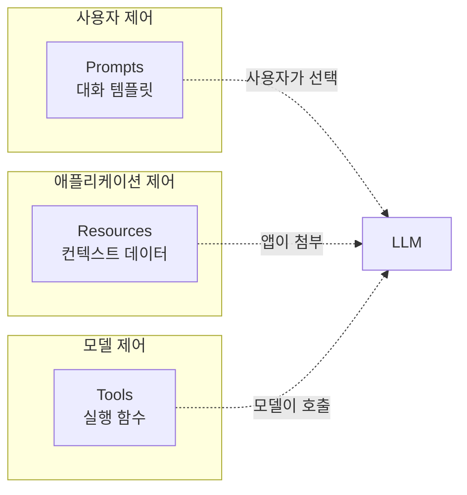
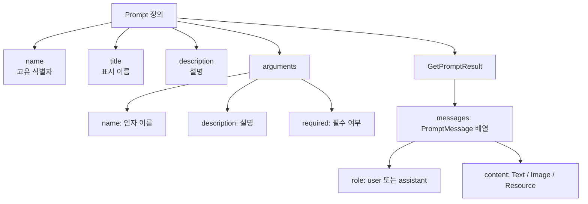
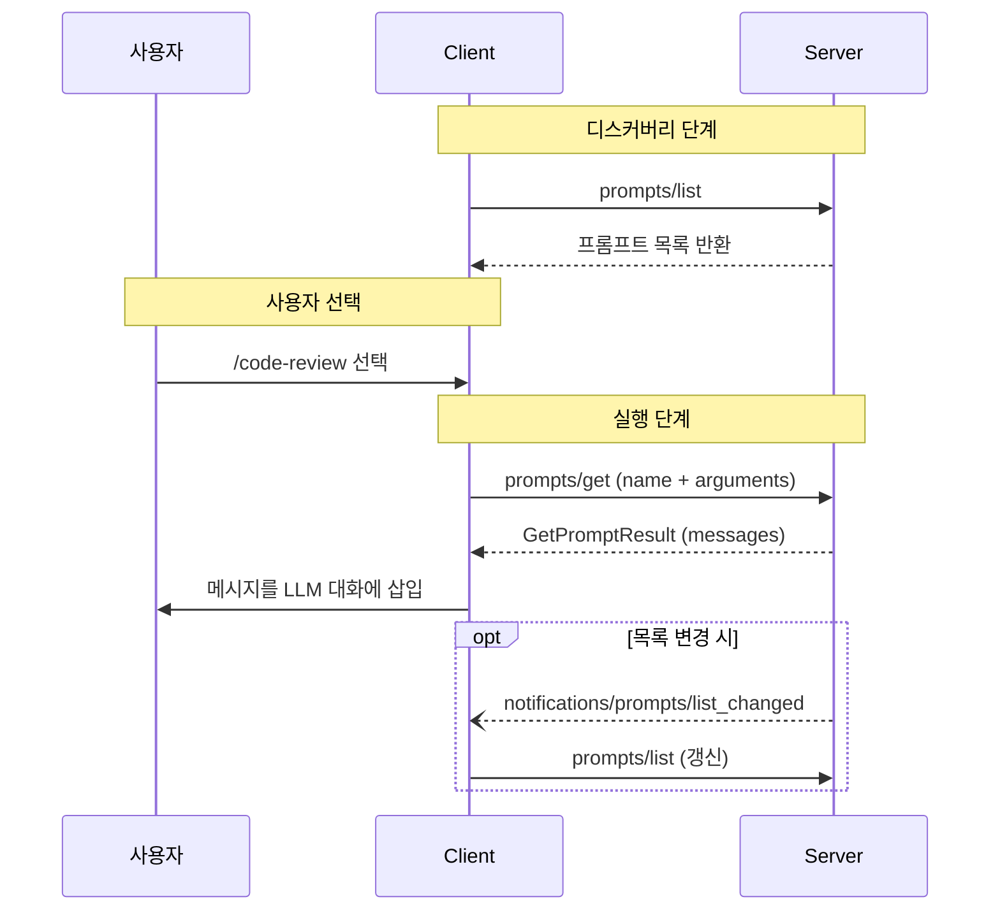
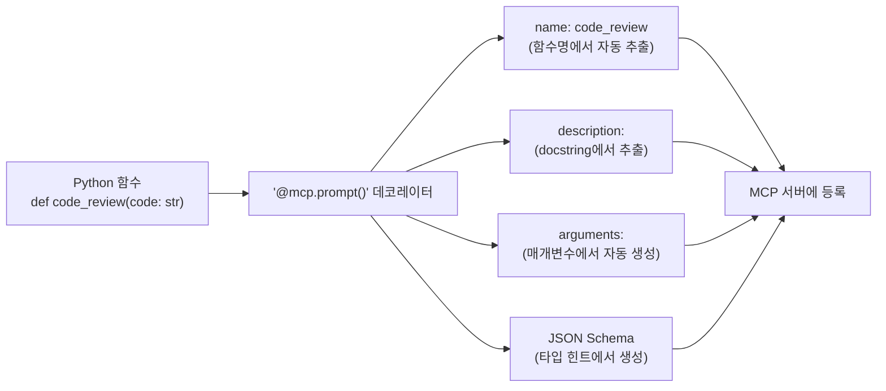
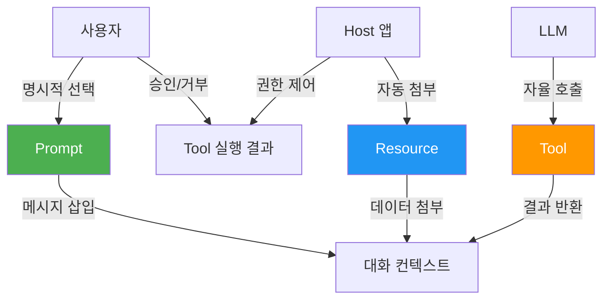

# 01. Prompts — 재사용 가능한 템플릿

> MCP 서버가 제공하는 사전 정의된 상호작용 패턴, Prompt 프리미티브를 마스터합니다.

## 개요

이 섹션에서는 MCP의 세 번째 핵심 프리미티브인 **Prompts**를 다룹니다. Tool이 LLM이 호출하는 함수였고, Resource가 클라이언트가 읽는 데이터였다면, Prompt는 **사용자가 선택하는 대화 템플릿**입니다. 서버가 미리 정의한 상호작용 패턴을 사용자가 골라 쓰는 구조죠.

**선수 지식**:
- [Tool 프리미티브](../04-ch4-tools-함수-호출-프리미티브/01-01-tool-프리미티브-이해.md)와 [Resource 프리미티브](../05-ch5-resources-데이터-노출-프리미티브/01-01-resource-프리미티브-이해.md)의 기본 개념
- `@mcp.tool()`, `@mcp.resource()` 데코레이터 사용 경험
- [JSON-RPC 2.0 메시지 포맷](../02-ch2-mcp-아키텍처와-프로토콜-구조/04-04-json-rpc-20-메시지-포맷.md) 이해

**학습 목표**:
- Prompt 프리미티브가 Tool, Resource와 어떻게 다른지 이해한다
- `prompts/list`와 `prompts/get` 프로토콜 메시지의 구조를 파악한다
- `@mcp.prompt()` 데코레이터로 다양한 형태의 프롬프트를 정의할 수 있다
- User-controlled 실행 모델의 의미와 설계 의도를 설명할 수 있다

## 왜 알아야 할까?

LLM을 사용하다 보면 같은 패턴의 질문을 반복하게 되는 경우가 많습니다. "이 코드를 리뷰해줘", "이 문서를 요약해줘", "이 에러 로그를 분석해줘" — 매번 프롬프트를 처음부터 작성하는 건 비효율적이죠.

MCP Prompt는 이런 반복되는 상호작용 패턴을 **서버 측에서 미리 정의**해두고, 사용자가 슬래시 커맨드(`/code-review`)나 메뉴 선택처럼 간편하게 꺼내 쓸 수 있게 합니다. 마치 이메일 앱의 **템플릿** 기능처럼, 자주 쓰는 대화 구조를 저장해두고 필요할 때 인자만 바꿔서 사용하는 거예요.

> 📊 **그림 1**: MCP 3대 프리미티브의 제어 주체 비교



이 제어 주체의 차이가 핵심입니다. Tool은 LLM이 "이 함수를 호출해야겠다"고 **자율적으로 판단**하고, Resource는 호스트 애플리케이션이 "이 데이터가 필요하겠다"고 **자동으로 첨부**하며, Prompt는 사용자가 "이 템플릿을 쓰겠다"고 **명시적으로 선택**합니다.

## 핵심 개념

### 개념 1: Prompt 프리미티브란?

> 💡 **비유**: Prompt를 **레스토랑 메뉴판**이라고 생각해보세요. 셰프(서버)가 미리 만들어둔 요리 목록(프롬프트 리스트)이 있고, 손님(사용자)이 메뉴를 골라 주문합니다. 어떤 메뉴는 "스테이크 굽기를 선택하세요"처럼 인자(argument)를 받기도 하죠. 반면 Tool은 셰프에게 "아무 재료로 요리해주세요"라고 맡기는 것이고, Resource는 테이블에 미리 놓여있는 물과 빵 같은 거예요.

MCP에서 **Prompt**는 서버가 클라이언트에게 제공하는 **사전 정의된 메시지 템플릿**입니다. 핵심 특성을 정리하면:

| 특성 | 설명 |
|------|------|
| **제어 주체** | User-controlled — 사용자가 명시적으로 선택 |
| **방향** | 서버 → 클라이언트로 템플릿 제공 |
| **반환값** | 메시지 목록 (`PromptMessage[]`) |
| **인자** | 선택적. 문자열 키-값 쌍으로 전달 |
| **용도** | 반복되는 대화 패턴의 표준화 |

Prompt의 프로토콜 수준 정의를 보면, 각 프롬프트는 다음 필드를 갖습니다:

- **`name`**: 고유 식별자 (예: `"code_review"`)
- **`title`**: 사람이 읽을 수 있는 표시 이름 (선택)
- **`description`**: 프롬프트 설명 (선택)
- **`arguments`**: 커스터마이징을 위한 인자 목록 (선택)

> 📊 **그림 2**: Prompt의 구성 요소



여기서 `prompts/get`의 응답 타입인 **GetPromptResult**(FastMCP에서는 `PromptResult`로도 사용)가 등장하는데요, 이 타입은 `description`과 `messages` 배열을 담고 있습니다. MCP 프로토콜 스펙에서는 `GetPromptResult`라고 명명하고, FastMCP 라이브러리에서는 편의상 `PromptResult`라는 래퍼 타입도 제공합니다. 이후 이 문서에서는 프로토콜 수준의 응답 구조를 말할 때 `GetPromptResult`, FastMCP 코드 수준의 반환 타입을 말할 때 `PromptResult`로 구분하겠습니다.

### 개념 2: prompts/list와 prompts/get 프로토콜

> 💡 **비유**: 온라인 쇼핑몰을 떠올려보세요. `prompts/list`는 **상품 목록 페이지**입니다 — 어떤 프롬프트가 있는지, 어떤 인자가 필요한지 미리 보여줍니다. `prompts/get`은 **장바구니에 담고 주문하기** — 특정 프롬프트를 골라 인자를 넣으면 실제 메시지가 돌아옵니다.

Prompt 프리미티브는 단 두 개의 JSON-RPC 메서드로 동작합니다.

**`prompts/list`** — 사용 가능한 프롬프트 목록 조회:

```python
# 요청
{
    "jsonrpc": "2.0",
    "id": 1,
    "method": "prompts/list",
    "params": {
        "cursor": "optional-cursor-value"  # 페이지네이션용
    }
}

# 응답
{
    "jsonrpc": "2.0",
    "id": 1,
    "result": {
        "prompts": [
            {
                "name": "code_review",
                "title": "코드 리뷰 요청",
                "description": "코드 품질을 분석하고 개선점을 제안합니다",
                "arguments": [
                    {
                        "name": "code",
                        "description": "리뷰할 코드",
                        "required": True
                    }
                ]
            }
        ],
        "nextCursor": "next-page-cursor"
    }
}
```

**`prompts/get`** — 특정 프롬프트의 실제 메시지 조회:

```python
# 요청
{
    "jsonrpc": "2.0",
    "id": 2,
    "method": "prompts/get",
    "params": {
        "name": "code_review",
        "arguments": {
            "code": "def hello():\n    print('world')"
        }
    }
}

# 응답 — GetPromptResult 구조
{
    "jsonrpc": "2.0",
    "id": 2,
    "result": {
        "description": "코드 리뷰 프롬프트",
        "messages": [
            {
                "role": "user",
                "content": {
                    "type": "text",
                    "text": "다음 Python 코드를 리뷰해주세요:\ndef hello():\n    print('world')"
                }
            }
        ]
    }
}
```

> 📊 **그림 3**: Prompt 프로토콜 메시지 흐름



주목할 점은 `prompts/get`의 응답인 `GetPromptResult`가 **메시지 배열**을 포함한다는 것입니다. 단순 텍스트가 아니라, `role`(user/assistant)과 `content`를 가진 구조화된 메시지를 반환하기 때문에, 다중 턴 대화 패턴도 템플릿으로 정의할 수 있습니다.

### 개념 3: `@mcp.prompt()` 데코레이터

> 💡 **비유**: `@mcp.prompt()` 데코레이터는 **요리 레시피를 메뉴판에 등록하는 것**과 같습니다. 함수를 작성하면 FastMCP가 자동으로 함수 이름을 프롬프트 `name`으로, docstring을 `description`으로, 함수 매개변수를 `arguments`로 변환해줍니다.

Python MCP SDK(FastMCP)에서 프롬프트를 정의하는 방법은 매우 간단합니다. `@mcp.prompt()` 데코레이터를 함수에 붙이기만 하면 됩니다.

**가장 간단한 형태 — 문자열 반환:**

```python
from fastmcp import FastMCP

mcp = FastMCP(name="CodeAssistant")

@mcp.prompt()
def code_review(code: str) -> str:
    """코드 품질을 분석하고 개선점을 제안합니다."""
    return f"다음 코드를 리뷰해주세요. 버그, 성능, 가독성 관점에서 분석해주세요:\n\n```\n{code}\n```"
```

문자열을 반환하면 자동으로 `role: "user"`인 단일 메시지로 변환됩니다.

**다중 메시지 반환 — 대화 패턴 정의:**

```python
from fastmcp import FastMCP
from fastmcp.prompts import Message

mcp = FastMCP(name="CodeAssistant")

@mcp.prompt()
def explain_code(code: str, language: str = "python") -> list[Message]:
    """코드를 단계별로 설명하는 대화 패턴입니다."""
    return [
        Message(
            f"다음 {language} 코드를 초보자도 이해할 수 있게 설명해주세요:\n\n```{language}\n{code}\n```"
        ),
        Message(
            "네, 코드를 한 줄씩 분석해드리겠습니다.",
            role="assistant"
        ),
        Message(
            "각 줄에 번호를 매기고, 핵심 개념도 함께 설명해주세요."
        ),
    ]
```

`Message` 클래스는 `role` 기본값이 `"user"`이므로, assistant 메시지만 명시적으로 `role="assistant"`를 지정하면 됩니다.

**데코레이터 옵션:**

```python
@mcp.prompt(
    name="analyze_logs",           # 프롬프트 이름 (기본: 함수명)
    description="서버 로그 분석",   # 설명 (기본: docstring)
    tags={"debugging", "ops"},     # 카테고리 태그
)
def log_analysis_prompt(
    logs: str,                                # 필수 인자
    severity: str = "all",                    # 선택 인자 (기본값 있음)
    include_recommendations: bool = True,     # 선택 인자
) -> str:
    """서버 로그를 분석하고 이상 패턴을 찾습니다."""
    prompt = f"다음 서버 로그에서 severity={severity} 수준의 이상 패턴을 분석해주세요:\n\n{logs}"
    if include_recommendations:
        prompt += "\n\n해결 방안도 함께 제안해주세요."
    return prompt
```

> ⚠️ **흔한 오해**: "Prompt도 Tool처럼 LLM이 자동으로 호출하는 건가요?" — 아닙니다! Prompt는 **User-controlled**입니다. LLM이 "이 프롬프트를 써야겠다"고 판단하는 게 아니라, 사용자가 UI에서 명시적으로 선택해야 실행됩니다. Claude Desktop에서 슬래시 커맨드(`/`)로 프롬프트를 고르는 것이 대표적인 예시죠.

> 📊 **그림 4**: `@mcp.prompt()` 데코레이터의 자동 변환 과정



### 개념 4: PromptMessage와 콘텐츠 타입

프롬프트가 반환하는 메시지(`PromptMessage`)는 단순 텍스트 외에도 다양한 콘텐츠 타입을 지원합니다.

**텍스트 콘텐츠** — 가장 일반적:

```json
{
  "role": "user",
  "content": {
    "type": "text",
    "text": "이 코드를 분석해주세요."
  }
}
```

**이미지 콘텐츠** — 멀티모달 상호작용:

```json
{
  "role": "user",
  "content": {
    "type": "image",
    "data": "base64-encoded-image-data",
    "mimeType": "image/png"
  }
}
```

**임베디드 리소스** — 서버의 Resource를 프롬프트에 직접 삽입:

```json
{
  "role": "user",
  "content": {
    "type": "resource",
    "resource": {
      "uri": "resource://docs/api-reference",
      "mimeType": "text/plain",
      "text": "API 레퍼런스 문서 내용..."
    }
  }
}
```

임베디드 리소스는 강력한 기능입니다. [Resource 프리미티브](../05-ch5-resources-데이터-노출-프리미티브/01-01-resource-프리미티브-이해.md)에서 배운 서버 관리 데이터를 프롬프트 메시지에 자연스럽게 끼워 넣을 수 있거든요. 예를 들어, "이 API 문서를 기반으로 코드를 작성해줘"라는 프롬프트에 실제 API 문서 리소스를 임베딩할 수 있습니다.

## 실습: 직접 해보기

실제로 동작하는 MCP 서버에 여러 가지 프롬프트를 정의해봅시다.

```python
# prompt_server.py
from fastmcp import FastMCP
from fastmcp.prompts import Message

# MCP 서버 생성
mcp = FastMCP(name="DevPrompts", instructions="개발자를 위한 프롬프트 템플릿 서버")


# === 1. 단순 문자열 반환 프롬프트 ===
@mcp.prompt()
def summarize(text: str, style: str = "bullet") -> str:
    """텍스트를 요약합니다. style은 'bullet', 'paragraph', 'oneliner' 중 선택."""
    style_instructions = {
        "bullet": "핵심 포인트를 불릿 리스트로 정리해주세요.",
        "paragraph": "한 문단으로 자연스럽게 요약해주세요.",
        "oneliner": "한 줄로 핵심만 요약해주세요.",
    }
    instruction = style_instructions.get(style, style_instructions["bullet"])
    return f"다음 텍스트를 요약해주세요. {instruction}\n\n{text}"


# === 2. 다중 메시지 프롬프트 — 코드 리뷰 ===
@mcp.prompt()
def code_review(code: str, language: str = "python") -> list[Message]:
    """코드 품질을 분석하고 개선점을 제안합니다."""
    return [
        Message(
            f"다음 {language} 코드를 리뷰해주세요. "
            f"버그, 성능, 가독성, 보안 관점에서 분석해주세요:\n\n"
            f"```{language}\n{code}\n```"
        ),
        Message(
            "코드를 분석하겠습니다. 다음 관점에서 리뷰합니다:\n"
            "1. 잠재적 버그\n2. 성능 이슈\n3. 가독성\n4. 보안 취약점",
            role="assistant",
        ),
        Message("각 항목에 대해 구체적인 코드 수정 예시도 포함해주세요."),
    ]


# === 3. 선택적 인자가 많은 프롬프트 ===
@mcp.prompt()
def debug_error(
    error_message: str,
    stack_trace: str = "",
    context: str = "",
) -> str:
    """에러 메시지를 분석하고 해결책을 제안합니다."""
    prompt = f"다음 에러를 분석하고 해결책을 제안해주세요:\n\n**에러**: {error_message}"
    if stack_trace:
        prompt += f"\n\n**스택 트레이스**:\n```\n{stack_trace}\n```"
    if context:
        prompt += f"\n\n**상황 설명**: {context}"
    prompt += "\n\n가능한 원인을 우선순위별로 나열하고, 각각의 해결 방법을 알려주세요."
    return prompt


# === 4. 인자 없는 프롬프트 ===
@mcp.prompt()
def daily_standup() -> list[Message]:
    """데일리 스탠드업 회의 형식으로 진행 상황을 정리합니다."""
    return [
        Message(
            "데일리 스탠드업 형식으로 오늘 업무를 정리하겠습니다. "
            "아래 세 가지를 알려주세요:\n\n"
            "1. 어제 완료한 작업\n"
            "2. 오늘 할 작업\n"
            "3. 블로커(방해 요소)"
        ),
    ]


if __name__ == "__main__":
    mcp.run()
```

서버를 실행하고 MCP Inspector로 테스트해봅시다:

```run:python
# 프롬프트 정의 확인 — 실제로는 MCP Inspector에서 테스트합니다
# 여기서는 프롬프트 함수의 동작을 직접 확인합니다

# 1. 단순 요약 프롬프트
result = "다음 텍스트를 요약해주세요. 핵심 포인트를 불릿 리스트로 정리해주세요.\n\nMCP는 LLM과 외부 시스템을 연결하는 표준 프로토콜입니다."
print("=== summarize 프롬프트 ===")
print(result)
print()

# 2. 코드 리뷰 프롬프트 — 3개 메시지 반환
messages = [
    {"role": "user", "content": "다음 python 코드를 리뷰해주세요..."},
    {"role": "assistant", "content": "코드를 분석하겠습니다..."},
    {"role": "user", "content": "각 항목에 대해 구체적인 코드 수정 예시도 포함해주세요."},
]
print("=== code_review 프롬프트 ===")
for msg in messages:
    print(f"[{msg['role']}] {msg['content'][:50]}...")
```

```output
=== summarize 프롬프트 ===
다음 텍스트를 요약해주세요. 핵심 포인트를 불릿 리스트로 정리해주세요.

MCP는 LLM과 외부 시스템을 연결하는 표준 프로토콜입니다.

=== code_review 프롬프트 ===
[user] 다음 python 코드를 리뷰해주세요......
[assistant] 코드를 분석하겠습니다......
[user] 각 항목에 대해 구체적인 코드 수정 예시도 포함해주세요....
```

MCP Inspector에서 테스트하려면 터미널에서 다음을 실행합니다:

```console
$ mcp dev prompt_server.py
```

Inspector UI에서 "Prompts" 탭을 선택하면 등록된 4개 프롬프트(`summarize`, `code_review`, `debug_error`, `daily_standup`)가 표시됩니다. 각 프롬프트를 클릭하면 인자 입력 폼이 나타나고, "Get Prompt"을 누르면 실제 메시지가 반환됩니다.

Claude Desktop에서 사용하려면 `claude_desktop_config.json`에 서버를 등록합니다:

```json
{
  "mcpServers": {
    "dev-prompts": {
      "command": "uv",
      "args": ["run", "prompt_server.py"]
    }
  }
}
```

이제 Claude Desktop 입력창에서 `/`를 입력하면 `summarize`, `code_review` 등의 프롬프트가 슬래시 커맨드로 나타납니다.

## 더 깊이 알아보기

### Prompt 프리미티브의 설계 배경

MCP의 세 프리미티브(Tool, Resource, Prompt)가 각각 다른 제어 주체를 갖게 된 건 우연이 아닙니다. 이 설계는 **Language Server Protocol(LSP)**에서 영감을 받았습니다.

LSP가 "코드 완성", "정의로 이동", "참조 찾기" 같은 IDE 기능을 표준화한 것처럼, MCP는 LLM 애플리케이션의 기능을 표준화했는데요. LSP에서도 일부 기능은 사용자가 직접 트리거하고(예: "정의로 이동"은 사용자가 클릭), 일부는 자동으로 동작합니다(예: 구문 오류 표시는 에디터가 자동 실행). MCP의 Prompt는 LSP에서 사용자가 명시적으로 실행하는 기능에 해당합니다.

Anthropic이 2024년 11월 MCP를 처음 공개할 때 블로그에서 "MCP를 AI의 USB-C"라고 비유했는데, Prompt 프리미티브는 USB-C 포트에 꽂는 **표준 충전 케이블**과 같습니다. 어떤 기기(LLM 호스트)에 꽂든 같은 방식으로 동작하는 재사용 가능한 인터페이스인 셈이죠.

### 왜 "User-controlled"인가?

Tool은 LLM이 자율적으로 호출할 수 있지만, Prompt는 반드시 사용자가 선택해야 합니다. 이 설계 결정의 배경에는 **안전성(Safety)** 고려가 있습니다.

프롬프트 템플릿은 LLM의 행동 방향을 크게 좌우합니다. "이 코드의 보안 취약점을 찾아줘"와 "이 코드의 보안 취약점을 악용하는 방법을 알려줘"는 의도가 완전히 다르죠. 이런 프롬프트 선택을 LLM 자체에 맡기면, 공격자가 교묘하게 조작된 컨텍스트를 통해 의도치 않은 프롬프트가 실행될 위험이 있습니다. 그래서 MCP 스펙은 프롬프트 선택을 **사용자의 명시적 의사 결정**으로 제한한 것입니다.

> 📊 **그림 5**: MCP 프리미티브별 제어 흐름과 보안 경계



## 흔한 오해와 팁

> ⚠️ **흔한 오해**: "Prompt는 시스템 프롬프트를 설정하는 건가요?" — 아닙니다. MCP Prompt는 시스템 프롬프트가 아니라, 대화에 삽입될 **메시지 시퀀스**를 반환합니다. `role: "user"`와 `role: "assistant"` 메시지의 조합으로, 다중 턴 대화 패턴을 정의할 수 있습니다.

> 💡 **알고 계셨나요?**: MCP 스펙에서 Prompt의 인자(argument)는 항상 **문자열**로 전달됩니다. `list[int]`나 `dict[str, str]` 같은 복잡한 타입을 매개변수로 선언해도, MCP 클라이언트는 문자열 `"[1, 2, 3]"`이나 `'{"key": "value"}'`로 보냅니다. FastMCP가 자동으로 파싱해주지만, 복잡한 중첩 타입은 신뢰성이 떨어질 수 있으니 단순한 타입을 권장합니다.

> 🔥 **실무 팁**: 프롬프트의 `description`(또는 docstring)은 사용자가 프롬프트를 선택할 때 보는 유일한 정보입니다. Tool의 description이 LLM을 위한 것이라면, Prompt의 description은 **사람을 위한 것**이니 직관적이고 명확하게 작성하세요. "코드 리뷰를 수행합니다"보다 "코드의 버그, 성능, 보안을 분석하고 수정 예시를 제안합니다"가 훨씬 낫습니다.

> 🔥 **실무 팁**: `*args`나 `**kwargs`는 프롬프트 함수에서 사용할 수 없습니다. MCP 프로토콜이 완전한 인자 스키마를 요구하기 때문입니다. 가변 인자가 필요하다면, `items: str` 같은 문자열 인자를 받아 내부에서 파싱하는 방식을 사용하세요.

## 핵심 정리

| 개념 | 설명 |
|------|------|
| **Prompt** | 서버가 제공하는 재사용 가능한 대화 템플릿. User-controlled |
| **prompts/list** | 사용 가능한 프롬프트 목록을 조회하는 JSON-RPC 메서드 |
| **prompts/get** | 특정 프롬프트의 메시지를 인자와 함께 조회하는 JSON-RPC 메서드 |
| **`@mcp.prompt()`** | FastMCP에서 함수를 프롬프트로 등록하는 데코레이터 |
| **PromptMessage** | role(user/assistant)과 content를 가진 구조화된 메시지 |
| **GetPromptResult** | `prompts/get` 응답 타입. FastMCP에서는 `PromptResult`로도 사용 |
| **반환 타입** | `str`, `Message`, `list[Message]`, `PromptResult` 지원 |
| **인자(Arguments)** | name, description, required 필드. 항상 문자열로 전달됨 |
| **list_changed** | 프롬프트 목록 변경 시 서버가 클라이언트에 보내는 알림 |
| **User-controlled** | Tool(모델 제어), Resource(앱 제어)와 달리 사용자가 명시적 선택 |

## 다음 섹션 미리보기

이번 섹션에서 Prompt의 기본 구조와 단순한 문자열/메시지 반환을 배웠습니다. 다음 섹션 [02. 동적 프롬프트와 인자 처리](06-ch6-prompts와-sampling/02-02-동적-프롬프트와-인자-처리.md)에서는 한 단계 더 나아가, 임베디드 리소스를 활용한 프롬프트, Context 객체를 통한 서버 상태 접근, 비동기 프롬프트, 그리고 복잡한 인자 검증 패턴을 다룹니다. 정적 템플릿을 넘어 **동적으로 데이터를 조합하는 프롬프트**를 만들어볼 거예요.

## 참고 자료

- [MCP Specification — Prompts (2025-11-25)](https://modelcontextprotocol.io/specification/2025-11-25/server/prompts) - MCP 공식 스펙의 Prompts 섹션. 프로토콜 메시지, 데이터 타입, 에러 처리 등 권위 있는 레퍼런스
- [FastMCP — Prompts](https://gofastmcp.com/servers/prompts) - FastMCP 프레임워크의 프롬프트 정의 가이드. `@mcp.prompt()` 데코레이터 옵션, 반환 타입, Context 활용법 등 실전 레퍼런스
- [Introducing the Model Context Protocol — Anthropic Blog](https://www.anthropic.com/news/model-context-protocol) - MCP의 탄생 배경과 설계 철학을 설명한 Anthropic 공식 발표 블로그
- [Python MCP Server: Connect LLMs to Your Data — Real Python](https://realpython.com/python-mcp/) - Python으로 MCP 서버를 구축하는 포괄적 튜토리얼. 프리미티브 개념 비교 설명 포함
- [MCP Python SDK (GitHub)](https://github.com/modelcontextprotocol/python-sdk) - Python SDK 소스 코드. 프롬프트 관련 타입 정의와 예제 확인 가능

---
### 🔗 Related Sessions
- [resource 프리미티브](05-ch5-resources-데이터-노출-프리미티브/01-01-resource-프리미티브-이해.md) (prerequisite)
