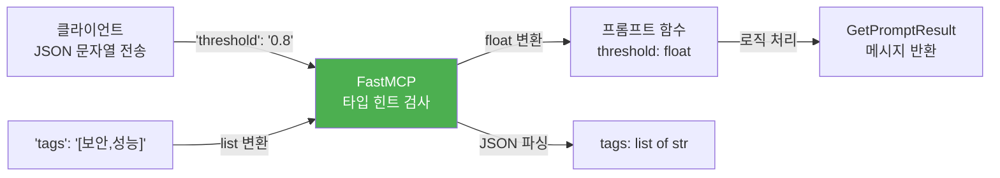
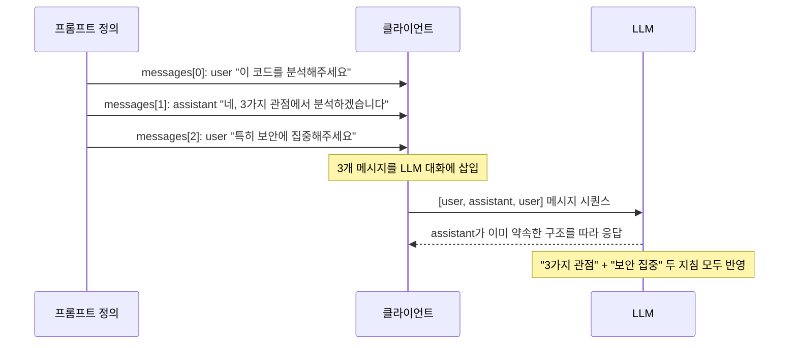
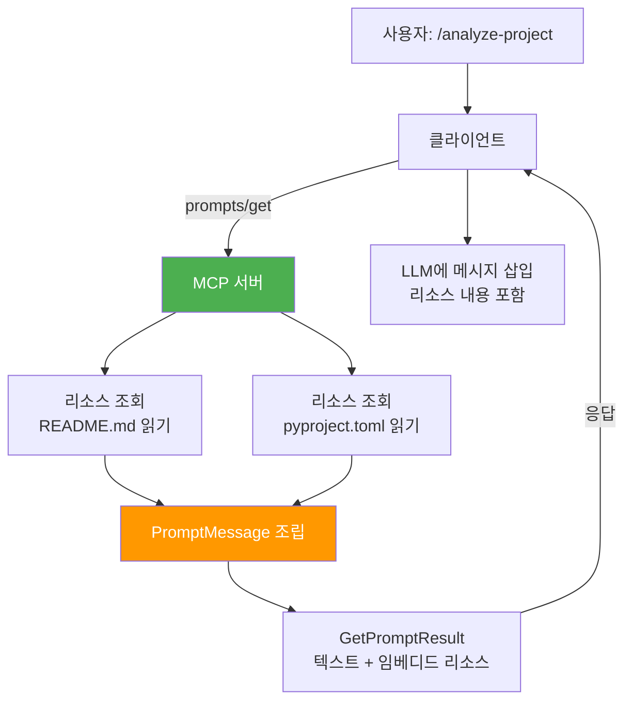
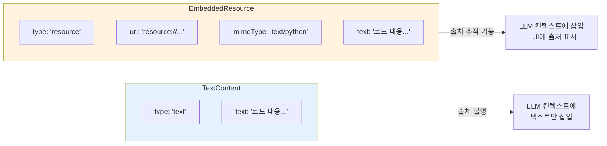
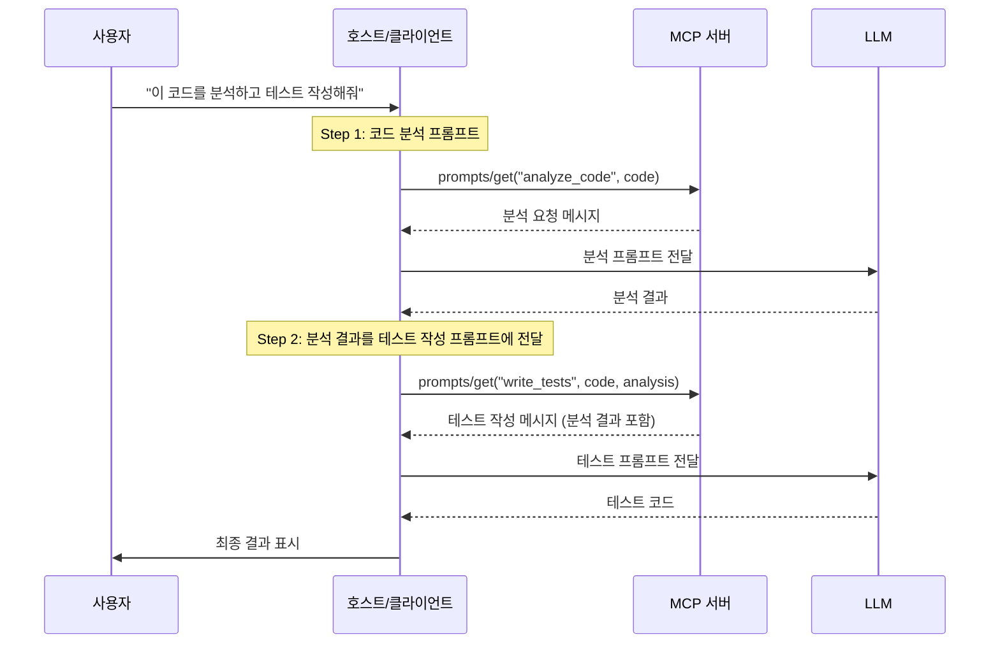

# 동적 프롬프트와 인자 처리

> 프롬프트에 동적 인자를 추가하고, 리소스를 임베딩하며, 다중 메시지와 체이닝 패턴으로 실전 워크플로를 구축하는 방법을 배웁니다.

## 개요

이 섹션에서는 [이전 섹션](06-ch6-prompts와-sampling/01-01-prompts-재사용-가능한-템플릿.md)에서 배운 `@mcp.prompt()` 데코레이터의 기본 사용법을 넘어, **동적 인자 검증**, **리소스 임베딩**, **비동기 데이터 로딩**, **프롬프트 체이닝**까지 다룹니다. 정적인 템플릿에서 벗어나 런타임 상태에 따라 메시지를 조립하는 고급 패턴을 익혀보겠습니다.

**선수 지식**:
- [01. Prompts — 재사용 가능한 템플릿](06-ch6-prompts와-sampling/01-01-prompts-재사용-가능한-템플릿.md)의 `@mcp.prompt()`, `Message`, `GetPromptResult` 사용법
- [Ch5. Resource 프리미티브](05-ch5-resources-데이터-노출-프리미티브/01-01-resource-프리미티브-이해.md)의 URI 기반 데이터 노출 개념
- [Ch4. 비동기 도구와 Context](04-ch4-tools-함수-호출-프리미티브/05-05-비동기-도구와-context-활용.md)의 `async def`와 `Context` 객체 기초

**학습 목표**:
- 복잡한 인자 타입(리스트, 딕셔너리, Enum)을 프롬프트에 적용할 수 있다
- 시스템 + 사용자 메시지를 조합한 멀티턴 프롬프트를 설계할 수 있다
- `EmbeddedResource`로 서버 데이터를 프롬프트에 자동 포함시킬 수 있다
- 프롬프트 체이닝으로 복잡한 워크플로를 구성할 수 있다

## 왜 알아야 할까?

이전 섹션에서 만든 프롬프트는 사용자가 입력한 텍스트를 그대로 템플릿에 끼워넣는 수준이었습니다. 하지만 실무에서는 더 복잡한 요구가 생기죠.

- **"코드 리뷰 프롬프트가 자동으로 관련 테스트 파일과 설정 파일을 가져왔으면 좋겠어"** → 리소스 임베딩
- **"분석 레벨을 '기본/심화/전문가'로 나누고, 각 레벨마다 다른 프롬프트를 생성하고 싶어"** → 인자 검증과 조건 분기
- **"먼저 코드를 분석하고, 그 결과를 바탕으로 테스트를 작성하는 2단계 워크플로를 만들고 싶어"** → 프롬프트 체이닝

이런 패턴들은 단순한 문자열 포맷팅으로는 한계가 있습니다. MCP 프롬프트의 동적 기능을 활용하면 **서버가 관리하는 데이터를 실시간으로 프롬프트에 주입**하고, **복잡한 인자를 타입 안전하게 처리**하며, **여러 프롬프트를 연결하여 워크플로를 자동화**할 수 있습니다.

## 핵심 개념

### 개념 1: 동적 인자와 타입 변환

> 💡 **비유**: 온라인 쇼핑몰의 주문 폼을 생각해보세요. 기본 폼에는 상품명과 수량만 있지만, 고급 폼에는 사이즈 선택(드롭다운), 색상 목록(멀티셀렉트), 배송 옵션(라디오) 같은 다양한 입력 타입이 있죠. MCP 프롬프트의 인자도 단순 문자열에서 시작하지만, 리스트, 열거형, 딕셔너리 같은 복잡한 타입으로 확장할 수 있습니다.

MCP 프로토콜에서 프롬프트 인자는 **항상 문자열로 전송**됩니다. 와이어(네트워크)를 통해 전달될 때는 JSON 문자열이니까요. 하지만 FastMCP는 Python 함수의 **타입 힌트를 분석하여 자동으로 변환**해줍니다.

> 📊 **그림 1**: 프롬프트 인자의 타입 변환 과정



핵심 패턴을 코드로 살펴보겠습니다:

```python
from mcp.server.fastmcp import FastMCP
from mcp.server.fastmcp.prompts.base import Message

mcp = FastMCP(name="DynamicPromptServer")


# 기본 타입 변환: str → int, float, bool
@mcp.prompt()
def analyze_metrics(
    metric_name: str,
    threshold: float = 0.8,  # 클라이언트는 "0.8" 문자열로 전송
    top_k: int = 5,          # 클라이언트는 "5" 문자열로 전송
    verbose: bool = False,   # 클라이언트는 "false" 문자열로 전송
) -> str:
    """메트릭을 분석하고 임계값 기반 알림을 생성합니다."""
    return (
        f"'{metric_name}' 메트릭을 분석해주세요.\n"
        f"- 임계값: {threshold} 이상이면 경고\n"
        f"- 상위 {top_k}개 이상치 표시\n"
        f"- {'상세 분석 포함' if verbose else '요약만'}"
    )
```

**선택지 기반 인자**도 자주 쓰이는 패턴입니다. MCP 프로토콜 자체에는 Enum 타입이 없지만, 함수 내부에서 검증하는 방식으로 구현합니다:

```python
REVIEW_LEVELS = {
    "basic": "코드 스타일, 네이밍, 포맷팅 중심으로 리뷰",
    "standard": "로직 오류, 엣지 케이스, 타입 안전성까지 분석",
    "deep": "아키텍처, 보안 취약점, 성능 병목, 테스트 커버리지까지 심층 분석",
}


@mcp.prompt()
def code_review(
    code: str,
    language: str = "python",
    level: str = "standard",  # basic | standard | deep
) -> list[Message]:
    """코드 리뷰 수준을 선택하여 맞춤형 분석을 요청합니다."""
    # 인자 검증
    if level not in REVIEW_LEVELS:
        valid = ", ".join(REVIEW_LEVELS.keys())
        raise ValueError(f"유효하지 않은 레벨: '{level}'. 선택지: {valid}")

    review_instruction = REVIEW_LEVELS[level]

    return [
        Message(
            f"다음 {language} 코드를 리뷰해주세요.\n"
            f"리뷰 수준: **{level}** — {review_instruction}\n\n"
            f"```{language}\n{code}\n```"
        ),
        Message(
            f"네, {level} 수준으로 리뷰하겠습니다. "
            f"{review_instruction}에 초점을 맞추겠습니다.",
            role="assistant",
        ),
    ]
```

> ⚠️ **흔한 오해**: "프롬프트 인자에 Pydantic 모델을 직접 쓸 수 있나요?" — MCP 프로토콜 수준에서 인자는 항상 `dict[str, str]`입니다. FastMCP가 기본 타입(`int`, `float`, `bool`) 변환은 자동으로 해주지만, 복잡한 Pydantic 모델은 JSON 문자열로 전송받아 함수 내부에서 직접 파싱해야 합니다. [Tool의 Pydantic 검증](04-ch4-tools-함수-호출-프리미티브/03-03-입력-검증과-pydantic-모델.md)과는 다른 점이죠.

### 개념 2: 다중 메시지와 역할 조합

> 💡 **비유**: 영화 대본을 쓴다고 생각해보세요. 좋은 대본에는 배우의 대사뿐 아니라, 연출 지시(무대 설정, 톤, 분위기)도 포함됩니다. MCP 프롬프트에서 `user` 메시지가 대사라면, `assistant` 메시지는 **연출 지시** — LLM이 어떤 방향으로 응답해야 하는지 미리 시범을 보여주는 것입니다.

이전 섹션에서 `role="assistant"` 메시지로 LLM의 응답 방향을 유도할 수 있다고 배웠는데요. 이를 더 정교하게 활용하면 **멀티턴 대화 시나리오**를 미리 구성할 수 있습니다.

> 📊 **그림 2**: 다중 메시지 프롬프트의 대화 구조



핵심은 **assistant 메시지가 LLM에게 "이미 약속한 것"**으로 인식된다는 점입니다. LLM은 자신이 이전에 한 약속을 지키려는 경향이 강하기 때문에, 이를 이용하면 응답 형식을 매우 효과적으로 제어할 수 있습니다.

```python
@mcp.prompt()
def data_analysis(
    dataset_description: str,
    analysis_type: str = "exploratory",
    output_format: str = "markdown",
) -> list[Message]:
    """데이터 분석 요청을 구조화된 형식으로 생성합니다."""
    # 분석 유형에 따라 지침 구성
    analysis_guides = {
        "exploratory": "기술 통계, 분포, 상관관계, 이상치를 순서대로 분석",
        "diagnostic": "원인-결과 관계 추적, 가설 수립 및 검증",
        "predictive": "트렌드 분석, 예측 모델 제안, 신뢰 구간 산출",
    }
    guide = analysis_guides.get(analysis_type, analysis_guides["exploratory"])

    return [
        # 1. 시스템 수준 지침 (user 메시지로 전달)
        Message(
            "당신은 시니어 데이터 사이언티스트입니다. "
            "분석 결과는 항상 근거 데이터와 함께 제시하고, "
            f"결과는 {output_format} 형식으로 출력합니다."
        ),
        # 2. assistant가 분석 방법을 미리 약속
        Message(
            f"네, {analysis_type} 분석을 수행하겠습니다. "
            f"다음 순서로 진행합니다:\n{guide}\n\n"
            f"결과는 {output_format} 형식으로 정리하겠습니다.",
            role="assistant",
        ),
        # 3. 실제 데이터 설명 전달
        Message(
            f"분석할 데이터셋:\n\n{dataset_description}\n\n"
            "위 데이터에 대해 분석을 시작해주세요."
        ),
    ]
```

```run:python
# 다중 메시지가 어떤 구조로 생성되는지 확인
messages = [
    {"role": "user", "content": "당신은 시니어 데이터 사이언티스트입니다..."},
    {"role": "assistant", "content": "네, exploratory 분석을 수행하겠습니다..."},
    {"role": "user", "content": "분석할 데이터셋:\n매출_2024.csv..."},
]

print("프롬프트가 생성하는 메시지 시퀀스:\n")
for i, msg in enumerate(messages):
    role_label = "[user]" if msg["role"] == "user" else "[assistant]"
    preview = msg["content"][:50] + "..."
    print(f"  [{i}] {role_label:12s} -> {preview}")
```

```output
프롬프트가 생성하는 메시지 시퀀스:

  [0] [user]       -> 당신은 시니어 데이터 사이언티스트입니다...
  [1] [assistant]  -> 네, exploratory 분석을 수행하겠습니다...
  [2] [user]       -> 분석할 데이터셋:
매출_2024.csv...
```

### 개념 3: 리소스 임베딩 (EmbeddedResource)

> 💡 **비유**: 이메일을 보낼 때 "첨부파일 참조"라고 쓰는 것과 실제로 파일을 본문에 인라인으로 붙여넣는 것은 다르죠. MCP의 `EmbeddedResource`는 **인라인 첨부** 방식입니다. 프롬프트가 실행될 때 서버가 관리하는 리소스(문서, 코드 파일, 설정 등)의 **실제 내용**을 메시지에 직접 포함시킵니다.

[이전 섹션](06-ch6-prompts와-sampling/01-01-prompts-재사용-가능한-템플릿.md)에서 `EmbeddedResource`의 JSON 구조를 간단히 살펴봤는데, 이제 Python 코드에서 실제로 구현해보겠습니다. 핵심은 `PromptMessage`의 `content` 필드에 `TextContent` 대신 `EmbeddedResource`를 넣는 것입니다.

> 📊 **그림 3**: EmbeddedResource의 동작 흐름



이 패턴은 [Ch5에서 배운 `@mcp.resource()`](05-ch5-resources-데이터-노출-프리미티브/01-01-resource-프리미티브-이해.md)로 등록한 리소스를 프롬프트 안에서 참조하는 방식입니다. 리소스가 서버에 먼저 정의되어 있어야 `EmbeddedResource`로 참조할 수 있다는 점을 기억하세요.

저수준 API(mcp.types)를 사용하면 `EmbeddedResource`를 직접 구성할 수 있습니다:

```python
from mcp import types


async def handle_get_prompt(
    name: str, arguments: dict[str, str] | None
) -> types.GetPromptResult:
    """저수준 API로 EmbeddedResource를 포함하는 프롬프트 구현"""
    if name != "analyze_project":
        raise ValueError(f"Unknown prompt: {name}")

    # 서버가 관리하는 리소스 내용을 가져온다고 가정
    readme_content = "# My Project\nA sample Python project..."
    config_content = "[project]\nname = 'my-project'\nversion = '1.0.0'"

    return types.GetPromptResult(
        description="프로젝트 구조 분석",
        messages=[
            # 일반 텍스트 메시지
            types.PromptMessage(
                role="user",
                content=types.TextContent(
                    type="text",
                    text="다음 프로젝트의 구조와 설정을 분석해주세요.",
                ),
            ),
            # README를 임베디드 리소스로 포함
            types.PromptMessage(
                role="user",
                content=types.EmbeddedResource(
                    type="resource",
                    resource=types.TextResourceContents(
                        uri="resource://project/README.md",
                        mimeType="text/markdown",
                        text=readme_content,
                    ),
                ),
            ),
            # 설정 파일을 임베디드 리소스로 포함
            types.PromptMessage(
                role="user",
                content=types.EmbeddedResource(
                    type="resource",
                    resource=types.TextResourceContents(
                        uri="resource://project/pyproject.toml",
                        mimeType="application/toml",
                        text=config_content,
                    ),
                ),
            ),
        ],
    )
```

FastMCP 고수준 API에서는 Context 객체를 통해 리소스를 읽어와 임베딩하는 것이 더 자연스럽습니다:

```python
from mcp.server.fastmcp import FastMCP, Context
from mcp.server.fastmcp.prompts.base import Message
from mcp import types

mcp = FastMCP(name="ProjectAnalyzer")


# 리소스 정의: 프로젝트 파일들을 노출
@mcp.resource("resource://project/{filename}")
async def get_project_file(filename: str) -> str:
    """프로젝트 파일을 읽어 반환합니다."""
    file_path = f"/workspace/{filename}"
    with open(file_path, "r") as f:
        return f.read()


# 프롬프트에서 리소스를 동적으로 임베딩
@mcp.prompt()
async def analyze_project(
    focus_area: str = "architecture",
    ctx: Context = None,
) -> list[Message]:
    """프로젝트의 핵심 파일을 분석하는 프롬프트입니다."""
    # 서버의 리소스를 직접 읽어서 내용을 가져옴
    try:
        readme = await ctx.read_resource("resource://project/README.md")
        readme_text = readme[0].text if readme else "README를 찾을 수 없습니다."
    except Exception:
        readme_text = "README를 찾을 수 없습니다."

    focus_guides = {
        "architecture": "전체 아키텍처, 모듈 구조, 의존성 관계",
        "security": "보안 취약점, 인증 로직, 데이터 검증",
        "performance": "병목 지점, 캐싱 전략, 비동기 처리",
    }
    guide = focus_guides.get(focus_area, focus_guides["architecture"])

    return [
        Message(
            f"다음 프로젝트를 **{focus_area}** 관점에서 분석해주세요.\n"
            f"분석 초점: {guide}\n\n"
            f"## 프로젝트 README\n\n{readme_text}"
        ),
        Message(
            f"네, {focus_area} 관점에서 분석하겠습니다. "
            "문서 내용을 검토한 후 구체적인 개선안을 제시하겠습니다.",
            role="assistant",
        ),
    ]
```

`EmbeddedResource`가 일반 `TextContent`와 다른 핵심적인 차이는 **URI를 통한 출처 추적**입니다. 클라이언트는 리소스의 `uri` 필드를 보고 데이터의 원본 위치를 파악할 수 있고, 사용자에게 "이 프롬프트가 README.md와 pyproject.toml을 참조했습니다"라고 표시할 수 있습니다.

> 📊 **그림 4**: TextContent vs EmbeddedResource 비교



### 개념 4: 비동기 프롬프트와 Context 활용

> 💡 **비유**: 레스토랑의 시그니처 메뉴 중에는 "오늘의 추천"처럼 **매일 바뀌는 메뉴**가 있죠. 재료 입고 상황, 시즌, 셰프의 컨디션에 따라 동적으로 결정됩니다. 비동기 프롬프트도 마찬가지로, 서버의 현재 상태, 외부 API 응답, 파일시스템 내용에 따라 **실행 시점에 메시지를 동적으로 구성**합니다.

`@mcp.prompt()` 함수를 `async def`로 정의하면 비동기 작업을 수행할 수 있고, `Context` 객체를 인자로 받으면 서버의 다양한 기능에 접근할 수 있습니다. Context는 [Tool에서의 Context](04-ch4-tools-함수-호출-프리미티브/05-05-비동기-도구와-context-활용.md)와 동일한 객체입니다.

```python
import httpx
from mcp.server.fastmcp import FastMCP, Context
from mcp.server.fastmcp.prompts.base import Message

mcp = FastMCP(name="SmartPromptServer")


@mcp.prompt()
async def debug_error(
    error_message: str,
    stack_trace: str = "",
    ctx: Context = None,
) -> list[Message]:
    """에러 메시지를 분석하고 해결 방안을 제시하는 프롬프트입니다."""
    # 1. Context를 통해 로깅
    await ctx.info(f"디버깅 프롬프트 요청: {error_message[:50]}...")

    # 2. 관련 리소스가 있으면 읽어오기
    related_docs = ""
    try:
        docs = await ctx.read_resource("resource://docs/troubleshooting.md")
        related_docs = f"\n\n## 관련 문서\n{docs[0].text}" if docs else ""
    except Exception:
        await ctx.warning("트러블슈팅 문서를 찾을 수 없습니다.")

    messages = [
        Message(
            f"다음 에러를 분석하고 해결 방안을 제시해주세요.\n\n"
            f"**에러 메시지:**\n```\n{error_message}\n```"
        ),
    ]

    # 3. 스택 트레이스가 있으면 추가 메시지
    if stack_trace:
        messages.append(
            Message(f"**스택 트레이스:**\n```\n{stack_trace}\n```")
        )

    # 4. 관련 문서가 있으면 포함
    if related_docs:
        messages.append(Message(related_docs))

    # 5. assistant가 분석 방법을 약속
    messages.append(
        Message(
            "네, 에러를 분석하겠습니다. 다음 순서로 진행합니다:\n"
            "1. 에러 원인 파악\n"
            "2. 관련 코드 위치 추정\n"
            "3. 해결 방안 (즉시 수정 + 근본 원인 해결)\n"
            "4. 재발 방지 방법",
            role="assistant",
        ),
    )

    return messages
```

Context 객체가 프롬프트에서 제공하는 주요 기능을 정리하면:

| Context 메서드 | 용도 | 예시 |
|---|---|---|
| `ctx.read_resource(uri)` | 서버 리소스 읽기 | 관련 문서, 설정 파일 임베딩 |
| `ctx.info()`, `ctx.warning()` | 로깅 | 프롬프트 사용 추적 |
| `ctx.request_id` | 요청 식별자 | 디버깅, 감사 로그 |
| `ctx.session` | 현재 세션 정보 | 클라이언트별 맞춤 프롬프트 |

### 개념 5: 프롬프트 체이닝 패턴

> 💡 **비유**: 요리 코스에서 전채(appetizer) → 메인(main) → 디저트(dessert)가 순서대로 나오듯, 프롬프트 체이닝은 **여러 프롬프트를 순서대로 연결**하여 복잡한 워크플로를 구성하는 패턴입니다. 각 프롬프트의 결과가 다음 프롬프트의 입력이 됩니다.

MCP 프로토콜 자체에는 "프롬프트 A의 결과를 프롬프트 B에 자동으로 전달하는" 내장 메커니즘이 없습니다. 체이닝은 **클라이언트(또는 호스트) 레벨에서 오케스트레이션**하는 패턴이죠. 하지만 서버 측에서 체이닝을 **의도하고 설계**할 수는 있습니다.

> 📊 **그림 5**: 프롬프트 체이닝의 오케스트레이션



서버 측에서 체이닝을 지원하는 설계 패턴은 **"이전 단계의 결과를 인자로 받는 프롬프트"**를 미리 준비하는 것입니다:

```python
from mcp.server.fastmcp import FastMCP
from mcp.server.fastmcp.prompts.base import Message

mcp = FastMCP(name="ChainablePrompts")


# Step 1: 코드 분석 프롬프트
@mcp.prompt()
def analyze_code(code: str, language: str = "python") -> list[Message]:
    """코드를 분석하여 구조, 품질, 개선점을 파악합니다. (체인 Step 1)"""
    return [
        Message(
            f"다음 {language} 코드를 분석해주세요.\n\n"
            f"```{language}\n{code}\n```\n\n"
            "다음 형식으로 분석 결과를 정리해주세요:\n"
            "1. **구조 요약**: 주요 함수/클래스와 역할\n"
            "2. **품질 이슈**: 발견된 문제점\n"
            "3. **개선 제안**: 구체적인 수정 방안"
        ),
    ]


# Step 2: 분석 결과를 바탕으로 테스트 작성
@mcp.prompt()
def write_tests_from_analysis(
    code: str,
    analysis_result: str,  # Step 1의 LLM 응답을 여기에 전달
    framework: str = "pytest",
) -> list[Message]:
    """코드 분석 결과를 바탕으로 테스트를 작성합니다. (체인 Step 2)"""
    return [
        Message(
            f"다음 코드에 대한 {framework} 테스트를 작성해주세요.\n\n"
            f"```python\n{code}\n```\n\n"
            f"## 이전 분석 결과\n{analysis_result}\n\n"
            "분석에서 발견된 품질 이슈와 엣지 케이스를 "
            "테스트 케이스로 반드시 포함해주세요."
        ),
        Message(
            f"네, 분석 결과를 참고하여 {framework} 테스트를 작성하겠습니다. "
            "발견된 이슈를 커버하는 테스트를 우선 작성하겠습니다.",
            role="assistant",
        ),
    ]


# Step 3: 테스트 결과를 바탕으로 리팩토링 제안
@mcp.prompt()
def suggest_refactoring(
    code: str,
    analysis_result: str,
    test_code: str,  # Step 2의 LLM 응답
) -> list[Message]:
    """분석과 테스트를 바탕으로 리팩토링을 제안합니다. (체인 Step 3)"""
    return [
        Message(
            f"다음 코드를 리팩토링해주세요.\n\n"
            f"## 원본 코드\n```python\n{code}\n```\n\n"
            f"## 분석 결과\n{analysis_result}\n\n"
            f"## 테스트 코드\n```python\n{test_code}\n```\n\n"
            "테스트가 모두 통과하도록 유지하면서 "
            "분석에서 발견된 이슈를 해결하는 리팩토링을 제안해주세요."
        ),
    ]
```

```run:python
# 체이닝 프롬프트의 설계 패턴을 시각화
chain_steps = [
    ("analyze_code", ["code"], "구조/품질 분석 결과"),
    ("write_tests_from_analysis", ["code", "analysis_result"], "테스트 코드"),
    ("suggest_refactoring", ["code", "analysis_result", "test_code"], "리팩토링 코드"),
]

print("프롬프트 체이닝 설계:\n")
for i, (name, inputs, output) in enumerate(chain_steps, 1):
    arrow = "  >> (결과를 다음 단계 인자로 전달)" if i < len(chain_steps) else ""
    print(f"  Step {i}: /{name}")
    print(f"          입력: {inputs}")
    print(f"          출력: {output}")
    if arrow:
        print(arrow)
    print()
```

```output
프롬프트 체이닝 설계:

  Step 1: /analyze_code
          입력: ['code']
          출력: 구조/품질 분석 결과
  >> (결과를 다음 단계 인자로 전달)

  Step 2: /write_tests_from_analysis
          입력: ['code', 'analysis_result']
          출력: 테스트 코드
  >> (결과를 다음 단계 인자로 전달)

  Step 3: /suggest_refactoring
          입력: ['code', 'analysis_result', 'test_code']
          출력: 리팩토링 코드

```

> 🔥 **실무 팁**: 체이닝에서 이전 단계의 결과를 **그대로** 다음 프롬프트에 넣으면 토큰이 급격히 늘어납니다. "분석 결과를 200단어 이내로 요약해주세요"처럼 Step 1의 프롬프트에서 **출력 형식과 길이를 제한**하면 체이닝의 효율이 크게 올라갑니다.

## 실습: 직접 해보기

동적 인자, 리소스 임베딩, 멀티 메시지를 모두 활용하는 **실전 코드 리뷰 서버**를 구축해보겠습니다.

```python
# review_server.py — 실전 코드 리뷰 프롬프트 서버
import json
from pathlib import Path
from mcp.server.fastmcp import FastMCP, Context
from mcp.server.fastmcp.prompts.base import Message

mcp = FastMCP(
    name="CodeReviewHub",
    instructions="코드 리뷰, 보안 감사, 문서 생성을 위한 프롬프트 서버입니다.",
)

# ━━━━━━━━━━━━━━━━━━━━━━━━━━━━━━━━━━━━━━━
# 리소스: 코딩 컨벤션 가이드
# ━━━━━━━━━━━━━━━━━━━━━━━━━━━━━━━━━━━━━━━
CONVENTIONS = {
    "python": (
        "- PEP 8 스타일 가이드 준수\n"
        "- 타입 힌트 필수 (Python 3.10+)\n"
        "- docstring은 Google 스타일\n"
        "- 변수명은 snake_case, 클래스명은 PascalCase\n"
        "- 비동기 I/O는 asyncio 사용"
    ),
    "typescript": (
        "- ESLint + Prettier 적용\n"
        "- strict 모드 활성화\n"
        "- interface 우선 (type alias는 유니온 타입에만)\n"
        "- 변수명은 camelCase, 컴포넌트는 PascalCase"
    ),
}


@mcp.resource("resource://conventions/{language}")
def get_conventions(language: str) -> str:
    """프로그래밍 언어별 코딩 컨벤션을 반환합니다."""
    return CONVENTIONS.get(language, "컨벤션 정보가 없습니다.")


# ━━━━━━━━━━━━━━━━━━━━━━━━━━━━━━━━━━━━━━━
# 프롬프트 1: 맞춤형 코드 리뷰 (동적 인자 + 리소스 임베딩)
# ━━━━━━━━━━━━━━━━━━━━━━━━━━━━━━━━━━━━━━━
REVIEW_ASPECTS = {
    "quality": "코드 품질, 가독성, 네이밍, 구조",
    "security": "보안 취약점, 입력 검증, 인증/인가",
    "performance": "시간/공간 복잡도, 메모리 누수, 캐싱",
    "testing": "테스트 용이성, 모킹 가능성, 엣지 케이스",
    "all": "품질 + 보안 + 성능 + 테스트 전체 분석",
}


@mcp.prompt()
async def review(
    code: str,
    language: str = "python",
    aspect: str = "all",
    severity_threshold: str = "medium",
    ctx: Context = None,
) -> list[Message]:
    """코드를 맞춤형으로 리뷰합니다. 언어별 컨벤션을 자동 적용합니다."""
    # 인자 검증
    if aspect not in REVIEW_ASPECTS:
        valid = ", ".join(REVIEW_ASPECTS.keys())
        raise ValueError(f"유효하지 않은 관점: '{aspect}'. 선택지: {valid}")

    severity_levels = ["low", "medium", "high", "critical"]
    if severity_threshold not in severity_levels:
        raise ValueError(
            f"유효하지 않은 심각도: '{severity_threshold}'. "
            f"선택지: {severity_levels}"
        )

    # 리소스에서 컨벤션 가져오기
    await ctx.info(f"코드 리뷰 요청: {language}, 관점={aspect}")

    convention_text = CONVENTIONS.get(language, "")
    convention_section = ""
    if convention_text:
        convention_section = (
            f"\n\n## 적용할 코딩 컨벤션 ({language})\n{convention_text}"
        )

    # 심각도 임계값 설명
    threshold_idx = severity_levels.index(severity_threshold)
    report_levels = severity_levels[threshold_idx:]
    severity_instruction = (
        f"심각도 '{severity_threshold}' 이상만 보고해주세요. "
        f"(보고 대상: {', '.join(report_levels)})"
    )

    return [
        Message(
            f"다음 {language} 코드를 리뷰해주세요.\n\n"
            f"**분석 관점**: {REVIEW_ASPECTS[aspect]}\n"
            f"**심각도 필터**: {severity_instruction}\n"
            f"{convention_section}\n\n"
            f"```{language}\n{code}\n```"
        ),
        Message(
            f"네, {aspect} 관점에서 {language} 코드를 리뷰하겠습니다. "
            f"{severity_threshold} 이상 심각도의 이슈만 보고합니다.\n\n"
            "## 리뷰 결과\n\n"
            "| # | 심각도 | 위치 | 이슈 | 개선안 |\n"
            "|---|--------|------|------|--------|\n",
            role="assistant",
        ),
    ]


# ━━━━━━━━━━━━━━━━━━━━━━━━━━━━━━━━━━━━━━━
# 프롬프트 2: 데이터 분석 보고서 (체이닝 지원)
# ━━━━━━━━━━━━━━━━━━━━━━━━━━━━━━━━━━━━━━━
@mcp.prompt()
def analyze_data(
    data_description: str,
    columns: str = "",
    question: str = "",
) -> list[Message]:
    """데이터셋을 분석하고 인사이트를 도출하는 프롬프트입니다."""
    column_section = ""
    if columns:
        column_section = f"\n\n**컬럼 정보**: {columns}"

    question_section = ""
    if question:
        question_section = f"\n\n**핵심 질문**: {question}"

    return [
        Message(
            f"다음 데이터셋을 분석해주세요.\n\n"
            f"**데이터 설명**: {data_description}"
            f"{column_section}"
            f"{question_section}\n\n"
            "분석 결과를 다음 구조로 정리해주세요:\n"
            "1. 데이터 요약 (행/열 수, 타입, 결측치)\n"
            "2. 주요 통계량\n"
            "3. 핵심 인사이트 (최소 3개)\n"
            "4. 추가 분석 제안"
        ),
        Message(
            "네, 데이터를 분석하겠습니다. "
            "Python(pandas, matplotlib)을 사용한 코드와 "
            "시각화 제안도 함께 드리겠습니다.",
            role="assistant",
        ),
    ]


# ━━━━━━━━━━━━━━━━━━━━━━━━━━━━━━━━━━━━━━━
# 프롬프트 3: 분석 결과 기반 대시보드 생성 (체이닝 Step 2)
# ━━━━━━━━━━━━━━━━━━━━━━━━━━━━━━━━━━━━━━━
@mcp.prompt()
def create_dashboard(
    analysis_result: str,
    dashboard_tool: str = "streamlit",
) -> list[Message]:
    """데이터 분석 결과를 바탕으로 대시보드 코드를 생성합니다. (체이닝 Step 2)"""
    return [
        Message(
            f"다음 분석 결과를 기반으로 "
            f"{dashboard_tool} 대시보드를 만들어주세요.\n\n"
            f"## 분석 결과\n{analysis_result}\n\n"
            "대시보드 요구사항:\n"
            "- 핵심 KPI 카드\n"
            "- 인사이트별 시각화 차트\n"
            "- 필터링/드릴다운 기능\n"
            "- 반응형 레이아웃"
        ),
    ]


if __name__ == "__main__":
    mcp.run()
```

이 서버를 테스트하려면:

```console
# MCP Inspector로 테스트
$ npx @modelcontextprotocol/inspector uv run review_server.py

# Claude Desktop 설정 (claude_desktop_config.json)
# {
#   "mcpServers": {
#     "code-review": {
#       "command": "uv",
#       "args": ["run", "review_server.py"]
#     }
#   }
# }
```

Inspector의 **Prompts** 탭에서 `review` 프롬프트를 선택하고 `aspect`를 "security"로, `severity_threshold`를 "high"로 설정하면, 보안 관점에서 high/critical 이슈만 보고하는 맞춤형 리뷰 프롬프트가 생성됩니다.

## 더 깊이 알아보기

### EmbeddedResource의 설계 논쟁

MCP 커뮤니티에서 흥미로운 설계 논쟁이 있었습니다. GitHub Discussion #90에서 "왜 `TextContent`와 `EmbeddedResource`가 별도로 존재하는가?"라는 질문이 제기되었죠. 겉보기에는 둘 다 텍스트를 담을 수 있으니 중복처럼 보입니다.

핵심 차이는 **의미론적 구분(semantic distinction)**에 있습니다. `TextContent`는 "LLM이 처리해야 할 내용"이고, `EmbeddedResource`는 "참조 데이터를 첨부한 것"입니다. 클라이언트는 이 구분을 활용해 UI를 다르게 렌더링할 수 있습니다. 예를 들어 Claude Desktop은 `EmbeddedResource`를 접을 수 있는 패널로 표시하고, 일반 텍스트는 인라인으로 표시하는 식이죠.

또한 `EmbeddedResource`의 `uri` 필드는 **감사(audit) 추적**에 중요합니다. 프롬프트가 어떤 데이터 소스를 참조했는지 기록으로 남길 수 있어, 규제가 중요한 금융/의료 분야에서 특히 가치 있습니다.

### 2025-06-18 스펙의 Annotations

MCP 스펙 2025-06-18에서 `PromptMessage`의 content에 **Annotations** 구조가 추가되었습니다. `audience` 필드로 "이 메시지는 사용자에게만 보여줘" 또는 "LLM에게만 전달해"라는 힌트를 줄 수 있고, `priority`(0.0~1.0)로 메시지의 중요도를 표시할 수 있습니다. 아직 모든 클라이언트가 지원하는 건 아니지만, 프롬프트의 표현력을 한 단계 높여주는 기능입니다.

> 💡 **알고 계셨나요?**: "프롬프트 체이닝"이라는 개념은 MCP에서 처음 등장한 게 아닙니다. 2022년 OpenAI의 GPT-3.5 시절부터 LangChain의 `SequentialChain`과 같은 패턴으로 사용되어 왔습니다. MCP의 차별점은 프롬프트가 **서버에서 정의되고 프로토콜로 전달**된다는 점입니다. LangChain에서는 클라이언트가 체인 로직을 직접 구현해야 했지만, MCP에서는 서버가 "이 프롬프트 다음에는 저 프롬프트를 쓰세요"라는 의도를 프롬프트 설명에 담아 전달할 수 있습니다.

## 흔한 오해와 팁

> ⚠️ **흔한 오해**: "`role='assistant'` 메시지를 넣으면 시스템 프롬프트처럼 작동하나요?" — 아닙니다. 시스템 프롬프트는 LLM의 전체 행동을 지배하지만, `assistant` 메시지는 "LLM이 이미 이렇게 답했다"는 **문맥을 조작**하는 것입니다. LLM은 자기 일관성을 유지하려 하기 때문에 이전 답변의 구조를 따르지만, 시스템 프롬프트만큼 강력하지는 않습니다. 중요한 지침은 `user` 메시지에서 명시적으로 요청하는 것이 더 신뢰할 수 있습니다.

> 💡 **알고 계셨나요?**: MCP 프롬프트 인자는 와이어에서 항상 `dict[str, str]`이지만, FastMCP v2.9.0부터 **복합 타입 자동 파싱**을 지원합니다. `list[int]` 타입의 인자를 선언하면, 클라이언트가 `"[1, 2, 3]"` 문자열을 보내도 FastMCP가 JSON 파싱하여 Python 리스트로 변환합니다. 단, 이 기능은 FastMCP의 편의 기능이지 MCP 프로토콜 표준은 아니므로, 다른 SDK에서는 동작하지 않을 수 있습니다.

> 🔥 **실무 팁**: 프롬프트 체이닝을 설계할 때 각 프롬프트의 `description`에 **"체인 Step N"**이라고 명시하고, 이전 단계의 출력을 받는 인자에 **명확한 설명**을 달아두세요. 예: `analysis_result: str` — "Step 1(analyze_code)의 LLM 응답 전문을 붙여넣으세요". 이렇게 하면 사용자가 수동으로 체이닝할 때도, 클라이언트가 자동 체이닝을 구현할 때도 혼란이 줄어듭니다.

## 핵심 정리

| 개념 | 설명 |
|------|------|
| **인자 타입 변환** | MCP 인자는 와이어에서 문자열이지만 FastMCP가 타입 힌트 기반으로 자동 변환 (int, float, bool, list) |
| **인자 검증** | 프로토콜에 Enum이 없으므로 함수 내부에서 `if level not in valid_values` 패턴으로 검증 |
| **다중 메시지** | `list[Message]`로 user/assistant 메시지를 조합. assistant 메시지로 응답 구조를 유도 |
| **EmbeddedResource** | 프롬프트에 서버 리소스를 URI 기반으로 직접 포함. 출처 추적과 UI 분리 렌더링 지원 |
| **비동기 프롬프트** | `async def` + `Context`로 런타임에 리소스 읽기, 로깅, 외부 API 호출 수행 |
| **프롬프트 체이닝** | 여러 프롬프트를 순서대로 연결하는 패턴. 클라이언트 레벨에서 오케스트레이션 |
| **GetPromptResult** | `prompts/get` 응답 타입. `description`과 `messages` 배열을 포함 |

## 다음 섹션 미리보기

지금까지 Prompt 프리미티브의 모든 패턴을 다뤘습니다. 프롬프트는 사용자가 명시적으로 선택하는 User-controlled 방식이었죠.

다음 섹션 [03. Sampling — 서버→LLM 역요청](06-ch6-prompts와-sampling/03-03-sampling-서버llm-역요청.md)에서는 정반대 방향의 프리미티브를 다룹니다. Prompt와 Sampling은 같은 챕터에 묶여 있지만 **전혀 다른 프리미티브**입니다. Prompt가 **사용자→LLM 방향의 템플릿** — 사용자가 슬래시 커맨드로 선택하고 클라이언트가 LLM에 전달하는 방식이라면, Sampling은 **서버→LLM 방향의 역요청** — 도구 실행 중에 서버가 클라이언트를 통해 LLM에게 추론을 요청하는 메커니즘입니다. "이 결과를 어떻게 해석해야 할까?" 같은 판단이 필요할 때 서버가 직접 LLM을 호출하는 패턴인데요, 여기에는 보안과 Human-in-the-loop 같은 중요한 고려사항이 따릅니다.

## 참고 자료

- [MCP Prompts Specification (2025-06-18)](https://modelcontextprotocol.io/specification/2025-06-18/server/prompts) - Prompt 프리미티브의 최신 공식 스펙. EmbeddedResource, Annotations, PromptArgument 스키마 정의
- [FastMCP Prompts Documentation](https://gofastmcp.com/servers/prompts) - `@mcp.prompt()` 데코레이터의 반환 타입별 사용법, GetPromptResult, 비동기 프롬프트 예제
- [MCP Python SDK (GitHub)](https://github.com/modelcontextprotocol/python-sdk) - 공식 Python SDK 소스 코드. `mcp.types.EmbeddedResource`, `TextResourceContents` 등 저수준 타입 구현
- [Introduction to Model Context Protocol — Anthropic Academy](https://anthropic.skilljar.com/introduction-to-model-context-protocol) - MCP의 3대 프리미티브(Tool/Resource/Prompt)의 제어 주체별 비교와 실전 활용 패턴
- [MCP Concepts: Prompts](https://modelcontextprotocol.io/docs/concepts/prompts) - Prompt의 개념적 설명, 동적 프롬프트, 멀티턴 메시지, EmbeddedResource 가이드

---
### 🔗 Related Sessions
- [resource 프리미티브](05-ch5-resources-데이터-노출-프리미티브/01-01-resource-프리미티브-이해.md) (prerequisite)
- [message](06-ch6-prompts와-sampling/01-01-prompts-재사용-가능한-템플릿.md) (prerequisite)
- [promptresult](06-ch6-prompts와-sampling/01-01-prompts-재사용-가능한-템플릿.md) (prerequisite)
