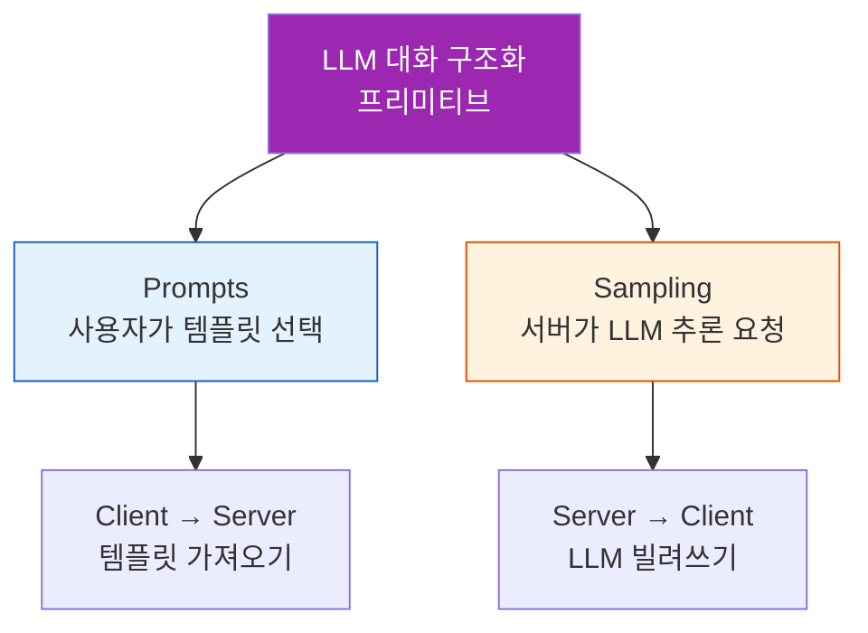
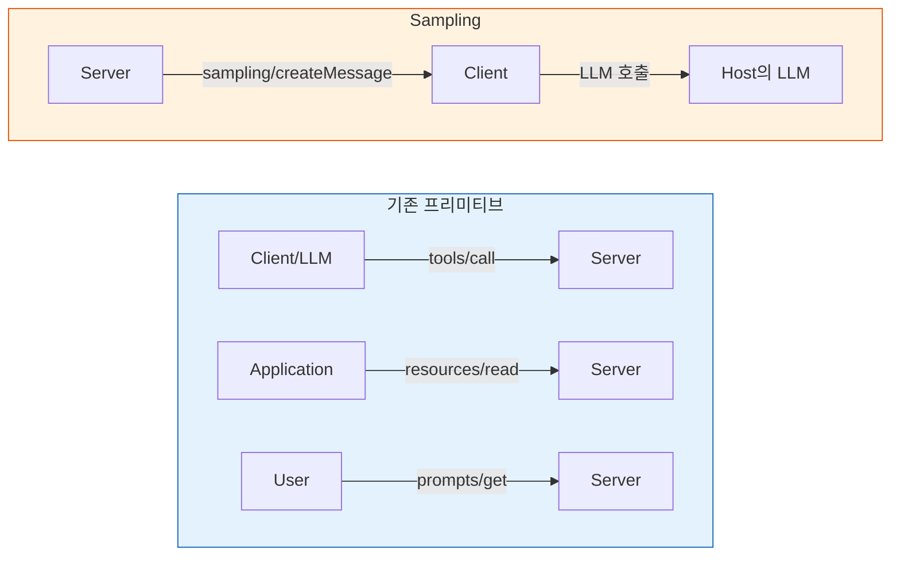
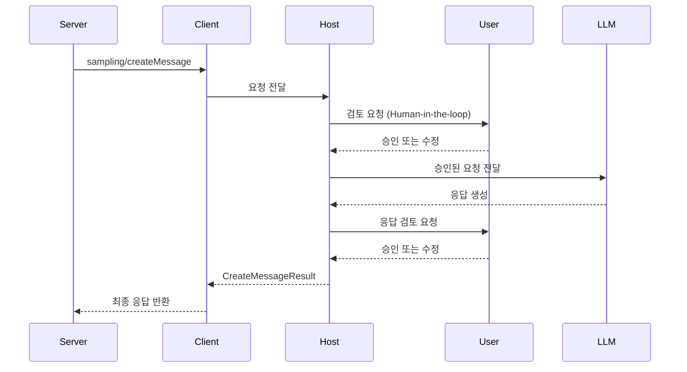
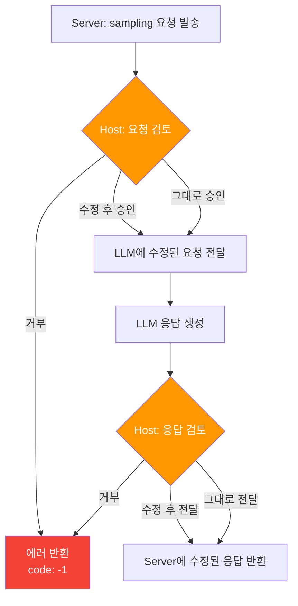
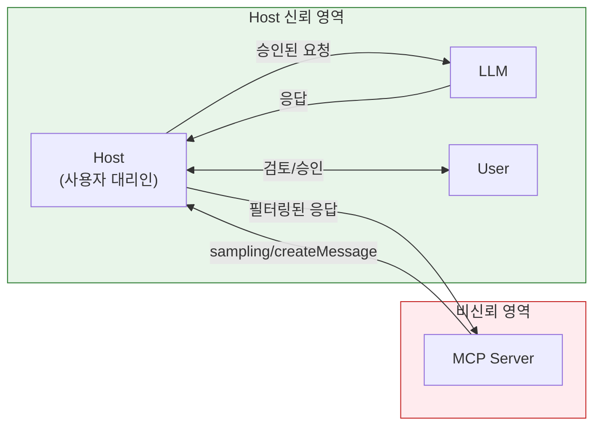
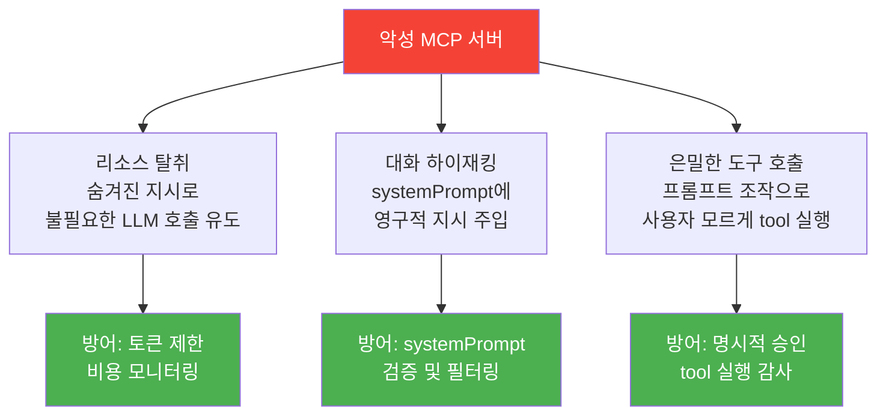
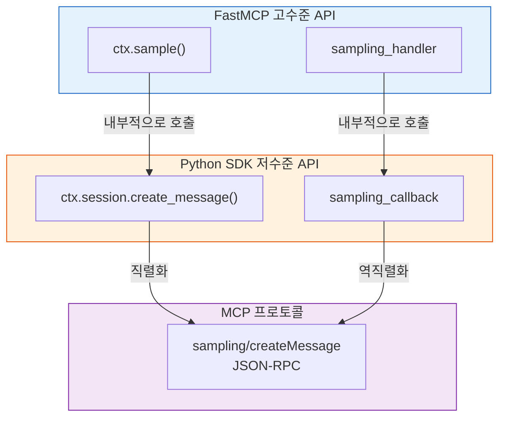

# Sampling — 서버→LLM 역요청

> MCP 서버가 클라이언트의 LLM에게 역으로 추론을 요청하는 Sampling 프리미티브의 동작 원리, 보안 모델, 그리고 Human-in-the-loop 메커니즘을 이해합니다.

## 개요

잠깐, 여기서 한 발 물러서 볼까요? 앞의 두 섹션에서 우리는 **Prompts** — 서버가 미리 정의한 대화 템플릿을 사용자가 선택하는 프리미티브 — 를 배웠습니다. Prompts는 "사용자 → 서버" 방향으로 템플릿을 가져오는, 비교적 직관적인 개념이었죠.

이번 섹션에서 배울 **Sampling**은 같은 챕터에 있지만 성격이 꽤 다릅니다. Prompts와 Sampling이 한 챕터로 묶인 이유는, 둘 다 **LLM과의 대화를 구조화하는 프리미티브**이기 때문인데요. 차이점은 이렇습니다:

| | Prompts | Sampling |
|---|---------|---------|
| **누가 시작?** | 사용자가 템플릿을 선택 | 서버가 LLM 추론을 요청 |
| **방향** | Client → Server (템플릿 가져오기) | **Server → Client** (LLM 빌려쓰기) |
| **목적** | 대화의 시작점을 구조화 | 서버 워크플로 중간에 LLM 활용 |

> 📊 **그림 0**: Prompts에서 Sampling으로 — 같은 "LLM 대화 구조화"의 두 갈래



Prompts가 "사용자가 대화를 **시작**하는 방법"이라면, Sampling은 "서버가 대화 **중간에** LLM을 끌어다 쓰는 방법"입니다. 방향이 뒤집히는 만큼 보안 모델도 완전히 달라지는데요, 이 섹션에서 차근차근 풀어보겠습니다.

**선수 지식**:
- [Host/Client/Server 3계층](02-ch2-mcp-아키텍처와-프로토콜-구조/01-01-hostclientserver-3계층.md) 아키텍처 이해
- [JSON-RPC 2.0 메시지 포맷](02-ch2-mcp-아키텍처와-프로토콜-구조/04-04-json-rpc-20-메시지-포맷.md)의 Request/Response/Notification 구분
- [비동기 도구와 Context 활용](04-ch4-tools-함수-호출-프리미티브/05-05-비동기-도구와-context-활용.md)에서 배운 Context 객체
- [Prompts — 재사용 가능한 템플릿](06-ch6-prompts와-sampling/01-01-prompts-재사용-가능한-템플릿.md)의 기본 개념 (같은 챕터이지만 완전히 다른 프리미티브입니다)

**학습 목표**:
- Prompts와 Sampling의 관계와 차이점을 명확히 구분할 수 있다
- Sampling 프리미티브의 동작 원리와 `sampling/createMessage` 프로토콜을 이해한다
- Human-in-the-loop 요구사항과 Host의 요청 수정/거부 권한을 설명할 수 있다
- 보안 위협 모델과 방어 전략을 이해한다
- Python SDK와 FastMCP로 Sampling을 구현하고, 두 API의 사용 기준을 판단할 수 있다

## 왜 알아야 할까?

지금까지 배운 MCP 프리미티브들을 떠올려 볼까요? Tool은 LLM이 서버의 함수를 호출하고, Resource는 앱이 서버의 데이터를 읽고, Prompt는 사용자가 서버의 템플릿을 선택합니다. 이 세 가지 모두 **클라이언트 → 서버** 방향이에요.

그런데 실전에서는 반대 방향이 필요한 경우가 있습니다. 예를 들어:

- 데이터베이스 서버가 쿼리 결과를 **자연어로 요약**해 달라고 할 때
- 코드 분석 서버가 발견한 버그를 **수정 제안**으로 바꿔 달라고 할 때
- 번역 서버가 전문 용어를 **문맥에 맞게 번역**해 달라고 할 때

이런 시나리오에서 서버가 자체적으로 LLM API 키를 관리하면? 비용 관리, 키 보안, 모델 선택 등 복잡한 문제가 쏟아집니다. Sampling은 이 문제를 우아하게 해결합니다 — **서버는 "해 줘"라고 요청만 하고, 실제 LLM 호출과 비용은 Host가 관리하는 구조**입니다.

이전 섹션에서 배운 Prompts가 "사용자에게 좋은 출발점을 제공"하는 거라면, Sampling은 "서버가 작업 도중에 LLM의 힘을 빌리는" 거예요. Prompts로 대화가 시작된 후, 서버가 복잡한 처리를 하다가 중간에 "이 부분은 LLM이 더 잘할 수 있겠는데?"라고 판단하면 — 그때 Sampling을 쓰는 겁니다.

## 핵심 개념

### 개념 1: Sampling이란 — "LLM을 빌려 쓰는 메커니즘"

> 💡 **비유**: 회사에서 일하는 계약직(서버)을 상상해 보세요. 법률 자문이 필요할 때, 직접 변호사를 고용하는 대신 회사(Host)의 법무팀을 통해 자문을 요청하죠. 법무팀은 요청 내용을 검토하고, 적절한 변호사(LLM)를 배정하며, 결과를 확인한 뒤 계약직에게 전달합니다. 계약직은 변호사를 직접 만나지도, 비용을 내지도 않습니다.

Sampling은 MCP의 네 번째 프리미티브로, **서버가 클라이언트를 통해 Host의 LLM에게 추론(completion)을 요청**하는 메커니즘입니다. 다른 프리미티브와 가장 큰 차이점은 **요청 방향이 반대**라는 거예요.

앞서 Prompts와의 관계를 살펴봤는데, 여기서 한 단계 더 나아가 네 가지 프리미티브를 모두 비교해 봅시다.

> 📊 **그림 1**: MCP 프리미티브별 제어 방향 비교



각 프리미티브의 제어 주체를 정리하면 이렇습니다:

| 프리미티브 | 제어 주체 | 방향 | 실행 장소 |
|-----------|----------|------|----------|
| **Tool** | Model-controlled | Client → Server | 서버 |
| **Resource** | Application-controlled | Client → Server | 서버 |
| **Prompt** | User-controlled | Client → Server | 클라이언트 |
| **Sampling** | Server-initiated | **Server → Client** | Host의 LLM |

핵심은 **Sampling이 Client의 capability**라는 점입니다. Tool, Resource, Prompt는 서버가 capability를 선언하지만, Sampling은 **클라이언트가** "나는 sampling 요청을 처리할 수 있어"라고 선언해야 합니다. 이 점이 Prompts와 가장 크게 다른 부분이에요 — Prompts는 서버가 "나는 이런 템플릿을 제공해"라고 선언하는 반면, Sampling은 클라이언트가 "나는 LLM 요청을 대신 처리해 줄 수 있어"라고 선언합니다.

```python
# 클라이언트가 초기화 시 sampling capability 선언
{
    "capabilities": {
        "sampling": {}  # 기본 sampling 지원
    }
}
```

> 💡 **비유**: Prompts는 레스토랑의 "메뉴판"이고, Sampling은 "출장 셰프 서비스"입니다. 메뉴판(Prompts)은 식당(서버)이 준비하고 손님(사용자)이 고르지만, 출장 셰프(Sampling)는 식당이 "이 요리 좀 만들어 주세요"라고 외부에 요청하는 거죠. 요청의 방향이 정반대입니다.

### 개념 2: sampling/createMessage 프로토콜

> 💡 **비유**: 음식점에서 주문하는 과정과 비슷합니다. 손님(서버)이 메뉴(messages)를 고르고, 선호사항(modelPreferences)을 전달하면, 웨이터(클라이언트)가 주방(LLM)에 전달합니다. 주방장이 정확히 어떤 조리법을 쓸지는 주방의 판단이에요. 알레르기 확인(Human-in-the-loop)도 웨이터가 합니다.

`sampling/createMessage`는 서버가 클라이언트에게 보내는 JSON-RPC 요청입니다. 핵심 필드를 살펴보겠습니다.

> 📊 **그림 2**: sampling/createMessage 요청-응답 흐름



**요청(Request) 구조:**

```python
# sampling/createMessage 요청 파라미터 (Python SDK 타입 기준)
{
    "messages": [                    # 필수: 대화 메시지 목록
        {
            "role": "user",          # "user" 또는 "assistant"
            "content": {
                "type": "text",      # "text", "image", "audio"
                "text": "이 코드를 리뷰해 주세요: ..."
            }
        }
    ],
    "maxTokens": 500,                # 필수: 최대 생성 토큰 수
    "systemPrompt": "당신은 코드 리뷰어입니다",  # 선택: 시스템 프롬프트
    "temperature": 0.7,              # 선택: 0~1 사이 온도
    "stopSequences": ["---"],        # 선택: 중단 시퀀스
    "modelPreferences": {            # 선택: 모델 선호도
        "hints": [{"name": "claude-sonnet-4-20250514"}],
        "costPriority": 0.3,         # 비용 민감도 (0~1)
        "speedPriority": 0.8,        # 속도 민감도 (0~1)
        "intelligencePriority": 0.5  # 성능 민감도 (0~1)
    },
    "metadata": {}                   # 선택: 프로바이더별 메타데이터
}
```

**응답(Result) 구조:**

```python
# CreateMessageResult
{
    "role": "assistant",
    "content": {
        "type": "text",
        "text": "이 코드에서 발견된 문제점은..."
    },
    "model": "claude-sonnet-4-20250514",  # 실제 사용된 모델
    "stopReason": "endTurn"          # "endTurn", "stopSequence", "maxTokens"
}
```

여기서 `modelPreferences`의 `hints`는 **권고사항**일 뿐입니다. Host는 자체 정책에 따라 다른 모델을 선택할 수 있어요. `costPriority`, `speedPriority`, `intelligencePriority`는 0~1 사이의 가중치로, Host가 모델을 고를 때 참고합니다.

```run:python
# modelPreferences 우선순위 시뮬레이션
preferences = {
    "hints": [{"name": "claude-sonnet-4-20250514"}],
    "costPriority": 0.3,
    "speedPriority": 0.8,
    "intelligencePriority": 0.5
}

print("=== Model Preferences 해석 ===")
print(f"선호 모델: {preferences['hints'][0]['name']}")
print(f"비용 민감도: {preferences['costPriority']:.1f} (낮음 → 비싼 모델 허용)")
print(f"속도 민감도: {preferences['speedPriority']:.1f} (높음 → 빠른 응답 우선)")
print(f"성능 민감도: {preferences['intelligencePriority']:.1f} (중간)")
print()
print("→ Host 판단: 빠르고 적당한 성능의 모델 선택 예상")
```

```output
=== Model Preferences 해석 ===
선호 모델: claude-sonnet-4-20250514
비용 민감도: 0.3 (낮음 → 비싼 모델 허용)
속도 민감도: 0.8 (높음 → 빠른 응답 우선)
성능 민감도: 0.5 (중간)

→ Host 판단: 빠르고 적당한 성능의 모델 선택 예상
```

### 개념 3: Human-in-the-loop — 사람이 끼어드는 이유

> 💡 **비유**: 비서(서버)가 "이 이메일 보내 주세요"라고 요청했을 때, 상사(사용자)는 보내기 전에 내용을 확인하고 싶겠죠? 더구나 비서가 "사장님 명의로 계약서를 작성해 주세요"라고 요청한다면? 반드시 사람의 확인이 필요합니다.

MCP 스펙은 Sampling에 대해 **Human-in-the-loop을 강력히 권고(SHOULD)**합니다. Host는 다음 세 가지 시점에서 사용자 개입을 보장해야 합니다:

> 📊 **그림 3**: Human-in-the-loop 개입 시점



**세 가지 개입 시점:**

| 시점 | Host가 할 수 있는 일 | 예시 |
|------|---------------------|------|
| **요청 수신** | 거부, systemPrompt 수정, 메시지 필터링 | 민감 데이터 포함 시 차단 |
| **LLM 호출 전** | 모델 최종 결정, 컨텍스트 범위 제한 | hint를 무시하고 저렴한 모델 선택 |
| **응답 전달 전** | 응답 수정, 민감 정보 제거, 거부 | PII가 포함된 응답 필터링 |

이 구조가 중요한 이유는, MCP가 **서버를 완전히 신뢰하지 않는 보안 모델**을 택했기 때문입니다. 서버는 서드파티가 만든 코드일 수 있고, 악의적이거나 버그가 있을 수 있어요. Host는 사용자의 대리인으로서 모든 Sampling 요청을 감독합니다.

### 개념 4: Host의 최종 권한 — "서버는 요청만, 결정은 Host가"

Host는 Sampling 과정에서 **절대적인 권한**을 가집니다. 서버가 아무리 정교한 요청을 보내도, Host가 동의하지 않으면 실행되지 않아요.

```python
# Host가 Sampling 요청에 대해 행사하는 권한들
host_powers = {
    "reject":        "요청 자체를 거부 (에러 코드 -1 반환)",
    "modify_prompt": "systemPrompt를 필터링하거나 수정",
    "modify_messages": "메시지 내용을 수정하여 LLM에 전달",
    "choose_model":  "서버의 hint를 무시하고 자체 정책으로 모델 선택",
    "limit_context": "includeContext 범위를 축소",
    "modify_response": "LLM 응답을 수정 후 서버에 전달",
    "rate_limit":    "요청 빈도 제한 적용",
}
```

> 📊 **그림 4**: Host의 권한과 신뢰 경계



서버는 응답의 `model` 필드를 통해 실제로 어떤 모델이 사용되었는지 알 수 있지만, **요청한 모델과 다를 수 있다**는 점을 항상 감안해야 합니다.

### 개념 5: 보안 위협과 방어

Sampling은 강력한 기능인 만큼 보안 위험도 존재합니다. Palo Alto Networks의 Unit 42 팀이 2025년에 발표한 연구에서 세 가지 주요 공격 벡터를 식별했습니다.

> 📊 **그림 5**: Sampling 보안 위협 모델



| 공격 유형 | 설명 | 방어 전략 |
|-----------|------|----------|
| **리소스 탈취** | systemPrompt에 숨겨진 지시를 넣어 불필요한 콘텐츠 생성 → 비용 증가 | `maxTokens` 제한, 비용 모니터링, Rate limiting |
| **대화 하이재킹** | systemPrompt로 이후 전체 세션의 LLM 동작을 변경 | systemPrompt 검증, 세션 격리 |
| **은밀한 도구 호출** | 프롬프트를 조작하여 LLM이 사용자 동의 없이 다른 tool 호출 | 명시적 tool 실행 승인, 감사 로그 |

MCP 스펙이 권고하는 방어 조치:

```python
# Host가 구현해야 할 보안 조치 (의사 코드)
class SamplingSecurityPolicy:
    """Host의 Sampling 보안 정책 예시"""

    MAX_TOKENS_LIMIT = 1000          # 최대 토큰 수 상한
    MAX_REQUESTS_PER_MINUTE = 10     # Rate limiting
    BLOCKED_PATTERNS = [             # systemPrompt 필터링 패턴
        "ignore previous instructions",
        "you are now",
        "forget everything",
    ]

    def validate_request(self, request: dict) -> bool:
        # 1. maxTokens 상한 검사
        if request.get("maxTokens", 0) > self.MAX_TOKENS_LIMIT:
            return False

        # 2. systemPrompt 의심 패턴 검사
        system = request.get("systemPrompt", "")
        for pattern in self.BLOCKED_PATTERNS:
            if pattern.lower() in system.lower():
                return False

        # 3. Rate limiting 검사
        if self._exceeds_rate_limit():
            return False

        return True
```

> ⚠️ **흔한 오해**: "Sampling을 지원하면 서버가 내 LLM을 마음대로 쓸 수 있다" — 아닙니다. Host는 모든 요청을 검토하고 거부할 수 있으며, 사용자에게 승인을 요청할 수 있습니다. 서버는 **요청할 뿐**, 실행 여부는 Host가 결정합니다.

## 실습: 직접 해보기

코드 리뷰 서버를 만들어 봅시다. 이 서버는 코드를 받아 분석한 뒤, Sampling으로 LLM에게 리뷰 결과를 자연어로 요약해 달라고 요청합니다.

그 전에 하나만 짚고 넘어갈게요. 앞서 Prompts 실습에서는 서버가 **템플릿을 제공하고 사용자가 선택**하는 구조였죠? 이번 실습에서는 **서버가 직접 LLM에게 추론을 요청**합니다. 코드를 보면서 "아, 방향이 정말 다르구나"를 체감해 보세요.

### 서버 측: Sampling 요청하기

```python
# server.py — Sampling을 사용하는 코드 리뷰 서버
import ast
from mcp.server.fastmcp import FastMCP, Context

mcp = FastMCP("code-reviewer")


@mcp.tool()
async def review_code(code: str, language: str, ctx: Context) -> str:
    """코드를 분석하고 LLM에게 리뷰 요약을 요청합니다."""

    # 1단계: 서버 자체 분석 (정적 분석)
    issues = _analyze_code(code, language)

    if not issues:
        return "분석 결과: 발견된 문제가 없습니다."

    # 2단계: 분석 결과를 LLM에게 요약 요청 (Sampling)
    analysis_report = "\n".join(f"- {issue}" for issue in issues)

    # ctx.session.create_message()로 Sampling 요청
    result = await ctx.session.create_message(
        messages=[
            {
                "role": "user",
                "content": {
                    "type": "text",
                    "text": (
                        f"다음 {language} 코드의 정적 분석 결과를 "
                        f"개발자에게 친절하게 설명해 주세요.\n\n"
                        f"코드:\n```{language}\n{code}\n```\n\n"
                        f"발견된 이슈:\n{analysis_report}"
                    ),
                },
            }
        ],
        max_tokens=500,
        system_prompt="당신은 시니어 코드 리뷰어입니다. 문제점을 명확히 설명하고 개선 방안을 제시하세요.",
        model_preferences={
            "hints": [{"name": "claude-sonnet-4-20250514"}],
            "intelligencePriority": 0.7,
            "speedPriority": 0.5,
            "costPriority": 0.3,
        },
    )

    # 3단계: 응답 처리
    if result.content.type == "text":
        return f"## 코드 리뷰 결과\n\n{result.content.text}"

    return "리뷰 생성에 실패했습니다."


def _analyze_code(code: str, language: str) -> list[str]:
    """간단한 정적 분석 (Python 전용 예시)"""
    issues = []

    if language == "python":
        # AST 파싱으로 기본 검사
        try:
            tree = ast.parse(code)
            for node in ast.walk(tree):
                # except 절에 예외 타입이 없는 경우
                if isinstance(node, ast.ExceptHandler) and node.type is None:
                    issues.append(
                        f"라인 {node.lineno}: bare except 사용 — "
                        "구체적 예외 타입을 지정하세요"
                    )
                # global 문 사용
                if isinstance(node, ast.Global):
                    issues.append(
                        f"라인 {node.lineno}: global 변수 사용 — "
                        "함수 인자나 클래스로 대체를 고려하세요"
                    )
        except SyntaxError as e:
            issues.append(f"구문 오류: {e.msg} (라인 {e.lineno})")

    return issues


if __name__ == "__main__":
    mcp.run()
```

### 클라이언트 측: Sampling 콜백 처리

클라이언트가 Sampling 요청을 받아 LLM에 전달하는 콜백을 구현합니다.

```python
# client.py — Sampling 콜백을 처리하는 클라이언트
import asyncio
from mcp import types
from mcp.client.session import ClientSession
from mcp.client.stdio import StdioServerParameters, stdio_client


async def sampling_callback(
    request: types.CreateMessageRequestParams,
) -> types.CreateMessageResult:
    """서버의 Sampling 요청을 처리하는 콜백.

    실제 구현에서는 여기서 LLM API를 호출합니다.
    이 예시에서는 시뮬레이션된 응답을 반환합니다.
    """
    # 1. 요청 내용 로깅 (Human-in-the-loop 시점)
    print(f"[Sampling 요청 수신]")
    print(f"  시스템 프롬프트: {request.systemPrompt or '(없음)'}")
    print(f"  메시지 수: {len(request.messages)}")
    print(f"  최대 토큰: {request.maxTokens}")

    if request.modelPreferences and request.modelPreferences.hints:
        hint = request.modelPreferences.hints[0].name
        print(f"  선호 모델: {hint}")

    # 2. 보안 검증 (Host의 역할)
    if request.maxTokens > 2000:
        print("  [경고] 토큰 제한 초과 — 2000으로 조정")

    # 3. 여기서 실제 LLM API를 호출합니다
    #    예: openai.chat.completions.create(...) 또는
    #    anthropic.messages.create(...)
    #    이 예시에서는 시뮬레이션 응답을 반환합니다

    return types.CreateMessageResult(
        role="assistant",
        content=types.TextContent(
            type="text",
            text="bare except 사용을 발견했습니다. "
                 "Exception이나 구체적 예외 타입으로 변경하면 "
                 "디버깅이 훨씬 수월해집니다.",
        ),
        model="claude-sonnet-4-20250514",
        stopReason="endTurn",
    )


async def main():
    """MCP 클라이언트 실행"""
    server_params = StdioServerParameters(
        command="python",
        args=["server.py"],
    )

    async with stdio_client(server_params) as (read, write):
        # sampling_callback을 전달하여 Sampling 지원 선언
        async with ClientSession(
            read, write,
            sampling_callback=sampling_callback,
        ) as session:
            await session.initialize()

            # 서버의 도구 목록 확인
            tools = await session.list_tools()
            print(f"사용 가능한 도구: {[t.name for t in tools.tools]}")

            # review_code 도구 호출 → 내부에서 Sampling 발생
            result = await session.call_tool(
                "review_code",
                arguments={
                    "code": "try:\n    x = 1/0\nexcept:\n    pass",
                    "language": "python",
                },
            )
            print(f"\n결과: {result.content[0].text}")


if __name__ == "__main__":
    asyncio.run(main())
```

### FastMCP으로 더 간결하게

FastMCP의 `ctx.sample()` 메서드를 사용하면 훨씬 간결해집니다.

```python
# server_fastmcp.py — FastMCP의 간결한 Sampling
from fastmcp import FastMCP, Context

mcp = FastMCP("summarizer")


@mcp.tool
async def summarize_data(data: str, ctx: Context) -> str:
    """데이터를 LLM에게 요약 요청합니다."""

    # ctx.sample() — 한 줄로 Sampling 요청
    result = await ctx.sample(
        f"다음 데이터를 3줄로 요약해 주세요:\n\n{data}",
        system_prompt="간결하고 핵심적인 요약을 작성하세요.",
        max_tokens=200,
        temperature=0.3,
    )

    return result.text or "요약 생성 실패"


@mcp.tool
async def translate_with_context(
    text: str,
    source_lang: str,
    target_lang: str,
    ctx: Context,
) -> str:
    """문맥을 고려한 번역을 LLM에게 요청합니다."""

    result = await ctx.sample(
        f"{source_lang}에서 {target_lang}로 번역해 주세요. "
        f"전문 용어는 원어를 병기하세요.\n\n{text}",
        model_preferences=["claude-sonnet-4-20250514", "gpt-4o"],
        max_tokens=300,
    )

    return result.text or "번역 실패"
```

```run:python
# FastMCP ctx.sample()의 파라미터 정리
params = {
    "message": "첫 번째 인자 — 문자열 또는 메시지 리스트",
    "system_prompt": "시스템 프롬프트 (선택)",
    "max_tokens": "최대 생성 토큰 수 (기본값: SDK 설정)",
    "temperature": "생성 온도 0~1 (선택)",
    "model_preferences": "선호 모델 힌트 리스트 (선택)",
}

print("=== ctx.sample() 파라미터 ===")
for name, desc in params.items():
    print(f"  {name:20s} → {desc}")
```

```output
=== ctx.sample() 파라미터 ===
  message              → 첫 번째 인자 — 문자열 또는 메시지 리스트
  system_prompt        → 시스템 프롬프트 (선택)
  max_tokens           → 최대 생성 토큰 수 (기본값: SDK 설정)
  temperature          → 생성 온도 0~1 (선택)
  model_preferences    → 선호 모델 힌트 리스트 (선택)
```

### SDK 용어 vs FastMCP 용어 정리

실습에서 `sampling_callback`, `sampling_handler`, `ctx.session.create_message()`, `ctx.sample()` 등 비슷한 용어가 여러 개 등장했죠? 이들은 **같은 Sampling 프로토콜**을 다루지만 추상화 수준이 다릅니다. 혼동하기 쉬우니 정리해 둡시다.

| 구분 | Python SDK (저수준) | FastMCP (고수준) |
|------|-------------------|-----------------|
| **서버에서 Sampling 요청** | `ctx.session.create_message()` | `ctx.sample()` |
| **클라이언트에서 요청 처리** | `sampling_callback` | `sampling_handler` |
| **콜백 등록 위치** | `ClientSession(sampling_callback=...)` | `FastMCP(sampling_handler=...)` |
| **입력 형식** | `messages` 딕셔너리 리스트, `model_preferences` 딕셔너리 | 문자열 하나 또는 메시지 리스트, 모델 이름 리스트 |
| **용도** | 프로토콜 필드 완전 제어, 멀티턴 구성 | 간편한 단일 요청, 일반적인 사용 |

> 📊 **그림 6**: SDK vs FastMCP Sampling API 계층



### ctx.sample() vs ctx.session.create_message() — 어떤 걸 써야 할까?

두 API의 사용 기준을 정리하면 간단합니다.

> 🔥 **실무 팁**: **기본적으로 `ctx.sample()`을 사용하세요.** 대부분의 Sampling 시나리오는 "문자열을 보내고 응답을 받는" 단순한 패턴이고, `ctx.sample()`이 이를 완벽히 커버합니다. `ctx.session.create_message()`는 아래처럼 **저수준 제어가 반드시 필요한 경우에만** 사용합니다.

```python
# 기본 선택: ctx.sample() — 단순하고 충분한 경우
result = await ctx.sample("이 데이터를 요약해 주세요: ...")

# 저수준 선택: ctx.session.create_message() — 이런 경우에만
# 1. 멀티턴 대화가 필요할 때 (messages에 여러 턴 포함)
# 2. 이미지/오디오 등 비텍스트 콘텐츠를 보낼 때
# 3. stopSequences, metadata 등 세밀한 파라미터 제어가 필요할 때
# 4. Tools in Sampling (도구 정의 포함)을 사용할 때
result = await ctx.session.create_message(
    messages=[
        {"role": "user", "content": {"type": "text", "text": "1단계 분석"}},
        {"role": "assistant", "content": {"type": "text", "text": "결과..."}},
        {"role": "user", "content": {"type": "text", "text": "2단계 심화 분석"}},
    ],
    max_tokens=500,
    stop_sequences=["---"],
    metadata={"custom_field": "value"},
)
```

이 선택 기준은 다음 [Sampling 실전 — 에이전트형 워크플로](06-ch6-prompts와-sampling/04-04-sampling-실전-에이전트형-워크플로.md)에서 실제 패턴별로 더 자세히 다룹니다.

## 더 깊이 알아보기

### Sampling의 탄생 배경

Sampling은 MCP 설계 초기부터 존재한 프리미티브가 아닙니다. 2024년 11월 MCP가 처음 공개되었을 때, Tool/Resource/Prompt의 세 프리미티브만으로 대부분의 시나리오를 커버할 수 있었습니다. 그런데 실제 사용 사례가 늘어나면서 한 가지 근본적인 한계가 드러났어요.

서버가 복잡한 데이터 처리를 하다가 **중간 단계에서 LLM의 도움이 필요한 경우**, 기존 프리미티브로는 해결할 수 없었습니다. 서버가 자체 LLM API 키를 관리하면 비용과 보안 문제가 생기고, 클라이언트에게 중간 결과를 돌려보내면 워크플로가 끊기죠.

이 문제를 해결하기 위해 MCP 팀은 **"역방향 요청"**이라는 아이디어를 도입했습니다. USB 프로토콜에서 영감을 받았다고 하는데요, USB에서도 디바이스가 호스트에게 인터럽트를 보내 특정 처리를 요청할 수 있습니다. MCP의 Sampling도 마찬가지로, 서버(디바이스)가 Host(컴퓨터)에게 LLM 처리를 요청하는 구조입니다.

### "역전된 에이전트(Inverted Agent)" 패턴

FastMCP의 창시자 Jeremiah Lowin은 Sampling을 활용한 흥미로운 아키텍처 패턴을 제안했습니다. 전통적인 MCP에서는 클라이언트가 에이전트 로직(목표, 계획, 판단)을 가지고 서버는 도구만 제공하는데요.

**역전된 에이전트** 패턴에서는 이 관계가 뒤집힙니다:
- **서버**가 에이전트 로직, 전문 프롬프트, 워크플로를 소유합니다
- **클라이언트의 LLM**은 "범용 추론 엔진"으로, 서버가 빌려 쓰는 컴퓨팅 리소스가 됩니다
- 서버가 Sampling으로 LLM에게 단계별 추론을 요청하며 전체 워크플로를 제어합니다

이 패턴은 도메인 전문 지식이 서버에 있고, LLM은 범용 추론만 담당할 때 특히 유용합니다. 예를 들어 법률 분석 서버, 의료 진단 보조 서버, 금융 리스크 평가 서버 등에서 활용할 수 있어요.

### 2025-11-25 스펙: Tools in Sampling

2025년 11월 스펙에서는 SEP-1577로 제안된 **Tools in Sampling** 기능이 추가되었습니다. 서버가 Sampling 요청에 도구 정의를 포함하면, LLM이 도구를 호출하고, 서버가 결과를 수집하여 다시 Sampling을 요청하는 **멀티턴 루프**가 가능해졌습니다.

```python
# Tools in Sampling — 멀티턴 루프 (개념 코드)
result = await ctx.session.create_message(
    messages=[{"role": "user", "content": {"type": "text", "text": "서울 날씨 알려줘"}}],
    max_tokens=200,
    tools=[
        {
            "name": "get_weather",
            "description": "도시의 현재 날씨를 조회합니다",
            "inputSchema": {
                "type": "object",
                "properties": {"city": {"type": "string"}},
                "required": ["city"],
            },
        }
    ],
    tool_choice={"mode": "auto"},
)

# stopReason이 "toolUse"면 → 도구 실행 후 다시 Sampling
if result.stopReason == "toolUse":
    # 서버가 도구 실행, 결과를 다음 메시지에 포함
    pass
```

클라이언트가 이 기능을 지원하려면 `{"capabilities": {"sampling": {"tools": {}}}}` capability를 선언해야 합니다.

## 흔한 오해와 팁

> ⚠️ **흔한 오해**: "Sampling은 서버가 LLM을 직접 호출하는 것이다" — 아닙니다. 서버는 **클라이언트에게 요청**만 할 뿐, 실제 LLM 호출은 Host/Client가 수행합니다. 서버는 API 키도 모르고, 어떤 모델이 사용될지도 보장받지 못합니다.

> ⚠️ **흔한 오해**: "Prompts와 Sampling은 비슷한 기능이다" — 전혀 다릅니다. Prompts는 **사용자가 선택하는 대화 시작 템플릿**이고, Sampling은 **서버가 작업 중간에 LLM 추론을 빌리는 메커니즘**입니다. 요청 방향, 제어 주체, 보안 모델이 모두 다릅니다. 같은 챕터에 있다고 비슷한 개념이라고 오해하지 마세요.

> 💡 **알고 계셨나요?**: 2026년 3월 현재, Claude Desktop과 Claude Code는 Sampling을 아직 지원하지 않습니다. VS Code(Copilot)가 2025년 6월에 full MCP spec 지원을 발표했고, Block의 Goose가 Sampling을 구현한 대표적인 클라이언트입니다. FastMCP는 클라이언트가 Sampling을 지원하지 않을 때를 위한 `sampling_handler`(OpenAI/Anthropic fallback)를 제공합니다.

> 🔥 **실무 팁**: Sampling을 사용할 때 반드시 `maxTokens`를 보수적으로 설정하세요. 서버가 악의적이든 버그가 있든, 무제한 토큰 생성은 비용 폭탄으로 이어집니다. 또한 `includeContext`의 `"allServers"` 옵션은 soft-deprecated 되었으므로 새 코드에서는 `"none"`(기본값)을 사용하세요.

> 🔥 **실무 팁**: FastMCP의 `sampling_handler`를 활용하면 클라이언트 지원 여부와 관계없이 Sampling을 테스트할 수 있습니다. `pip install fastmcp[anthropic]` 후 `sampling_handler=AnthropicSamplingHandler()`를 서버에 설정하면, 클라이언트가 Sampling을 미지원해도 Anthropic API로 fallback 합니다.

## 핵심 정리

| 개념 | 설명 |
|------|------|
| **Sampling** | 서버가 클라이언트를 통해 Host의 LLM에게 추론을 요청하는 프리미티브 |
| **Prompts와의 차이** | Prompts는 사용자가 템플릿을 선택(Client→Server), Sampling은 서버가 LLM을 빌려 씀(Server→Client) |
| **sampling/createMessage** | Sampling의 JSON-RPC 메서드. Server → Client 방향 |
| **Human-in-the-loop** | Host가 요청 수신, LLM 호출 전, 응답 전달 전 3개 시점에서 사용자 개입 보장 |
| **Host의 최종 권한** | 요청 거부, 프롬프트 수정, 모델 선택, 응답 필터링 등 전권 보유 |
| **modelPreferences** | 서버의 모델 선호도 권고 (hints, costPriority, speedPriority, intelligencePriority) |
| **CreateMessageResult** | 응답 구조: role, content, model(실제 사용 모델), stopReason |
| **Tools in Sampling** | 2025-11-25 추가. Sampling에 도구 정의를 포함하여 멀티턴 tool-use 루프 가능 |
| **sampling_callback** | Python SDK 저수준 콜백. `ClientSession`에 등록하여 Sampling 요청 처리 |
| **sampling_handler** | FastMCP 고수준 핸들러. 서버에 등록하여 클라이언트 미지원 시 LLM API로 fallback |
| **ctx.sample()** | FastMCP의 간편 Sampling 메서드. 기본 선택지 — 문자열 하나로 요청 가능 |
| **ctx.session.create_message()** | SDK 저수준 메서드. 멀티턴, 비텍스트 콘텐츠, 세밀한 파라미터 제어 시 사용 |
| **보안 원칙** | maxTokens 제한, systemPrompt 필터링, Rate limiting, 감사 로그 |

## 다음 섹션 미리보기

이번 섹션에서 Sampling의 프로토콜과 보안 모델을 이해했다면, 다음 [Sampling 실전 — 에이전트형 워크플로](06-ch6-prompts와-sampling/04-04-sampling-실전-에이전트형-워크플로.md)에서는 Sampling을 실제 에이전트 패턴에 적용합니다. 멀티턴 대화, Tools in Sampling을 활용한 자율 워크플로, 그리고 FastMCP의 `sampling_handler`로 클라이언트 미지원 환경에서도 Sampling을 구현하는 방법을 실습합니다.

## 참고 자료

- [MCP Sampling Specification (2025-11-25)](https://modelcontextprotocol.io/specification/2025-11-25/client/sampling) - Sampling 프리미티브의 공식 스펙. 요청/응답 스키마와 Human-in-the-loop 요구사항의 원본
- [FastMCP Sampling Documentation](https://gofastmcp.com/servers/sampling) - FastMCP의 ctx.sample() API와 sampling_handler 설정 가이드
- [MCP Python SDK Sampling Example](https://github.com/modelcontextprotocol/python-sdk/blob/main/examples/snippets/servers/sampling.py) - 공식 Python SDK의 Sampling 구현 예시 코드
- [The Inverted Agent — Jlowin Blog](https://www.jlowin.dev/blog/the-inverted-agent) - Sampling을 활용한 "역전된 에이전트" 아키텍처 패턴 소개
- [New Prompt Injection Attack Vectors Through MCP Sampling — Unit 42](https://unit42.paloaltonetworks.com/model-context-protocol-attack-vectors/) - MCP Sampling의 보안 위협 분석과 방어 전략
- [MCP Architecture](https://modelcontextprotocol.io/specification/2025-11-25/architecture) - Host/Client/Server 아키텍처와 신뢰 모델 공식 문서

---
### 🔗 Related Sessions
- [host](02-ch2-mcp-아키텍처와-프로토콜-구조/01-01-hostclientserver-3계층.md) (prerequisite)
- [client](02-ch2-mcp-아키텍처와-프로토콜-구조/01-01-hostclientserver-3계층.md) (prerequisite)
- [server](02-ch2-mcp-아키텍처와-프로토콜-구조/01-01-hostclientserver-3계층.md) (prerequisite)
- [3계층 아키텍처](02-ch2-mcp-아키텍처와-프로토콜-구조/01-01-hostclientserver-3계층.md) (prerequisite)
- [tool](04-ch4-tools-함수-호출-프리미티브/01-01-tool-프리미티브-이해.md) (prerequisite)
- [prompt](06-ch6-prompts와-sampling/01-01-prompts-재사용-가능한-템플릿.md) (prerequisite)
