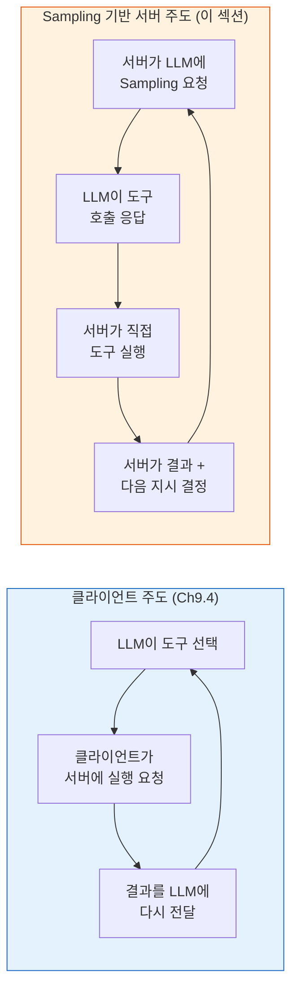
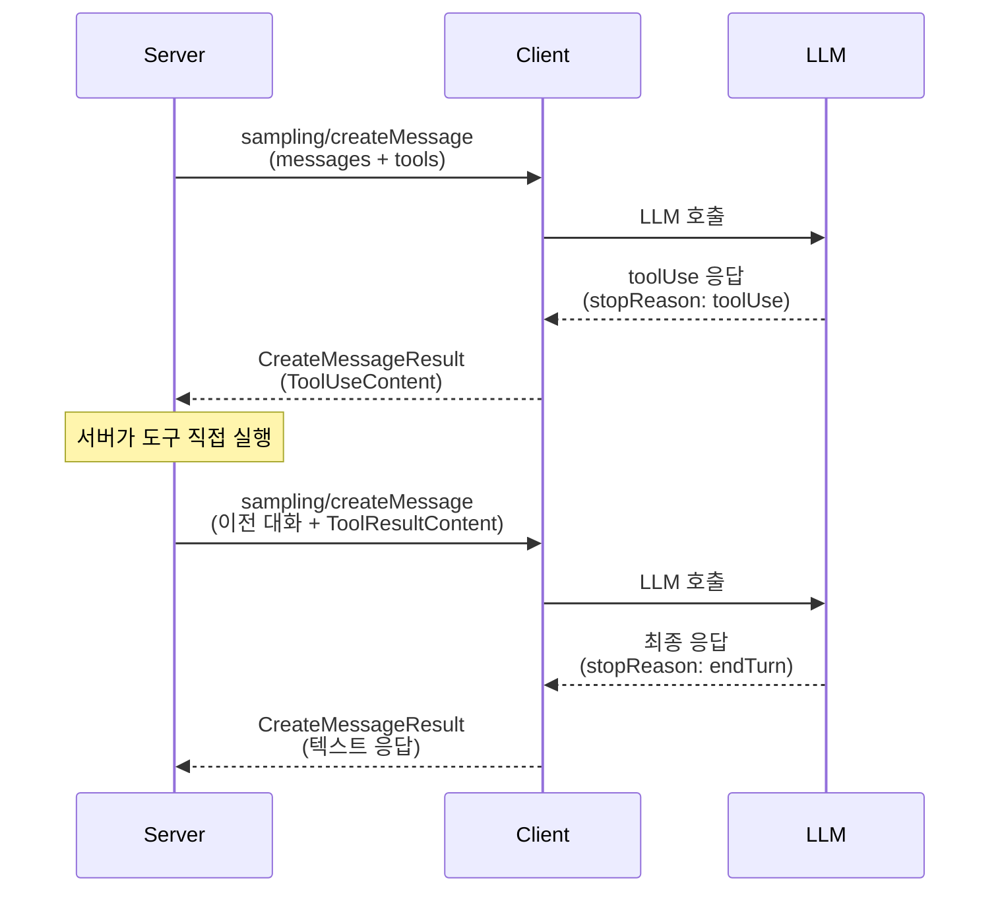
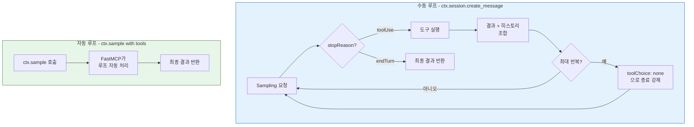
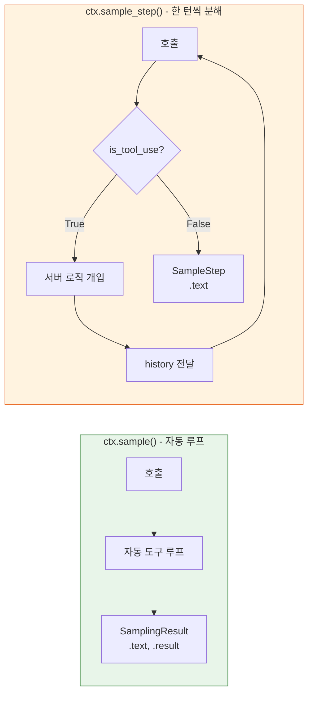
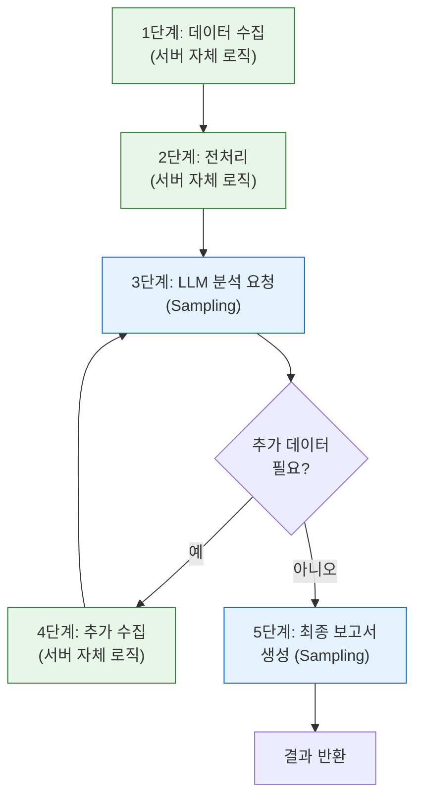
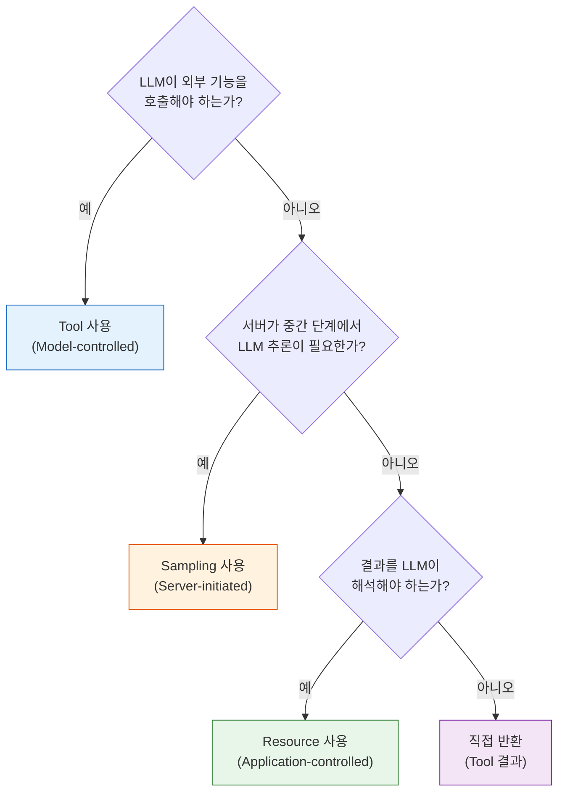

# Sampling 실전 — 에이전트형 워크플로

> Sampling 프리미티브를 활용하여 서버가 LLM 추론을 오케스트레이션하는 다단계 에이전트 패턴을 구현합니다.

## 개요

이 섹션에서는 앞서 [Sampling — 서버→LLM 역요청](06-ch6-prompts와-sampling/03-03-sampling-서버llm-역요청.md)에서 배운 Sampling 프리미티브를 **실전 에이전트 워크플로**에 적용합니다. 단일 Sampling 요청을 넘어, 서버가 LLM과 도구를 반복적으로 오케스트레이션하는 다단계 파이프라인을 구축하는 거죠.

> **에이전트 루프의 정규 설명**은 [에이전트 루프 아키텍처](09-ch9-클라이언트-개발-심화/04-04-에이전트-루프-아키텍처.md)에서 다룹니다. 이 섹션에서는 일반적인 에이전트 루프가 아닌, **Sampling 프리미티브가 에이전트 패턴에 가져오는 고유한 차이점** — 즉 "서버 주도"라는 역전된 제어 방향과 Tools in Sampling 메커니즘 — 에 집중합니다.

이전 섹션에서 `ctx.sample()`을 사용해 서버가 LLM에게 한 번의 추론을 요청하는 패턴을 배웠는데요. 이번 섹션에서는 그 `ctx.sample()`의 **내부 동작을 한 턴씩 분해한 것**이 `ctx.sample_step()`이라는 점을 이해하고, 두 API를 상황에 맞게 선택하는 방법을 다룹니다. `ctx.sample()`이 "목적지까지 자동 운전"이라면, `ctx.sample_step()`은 "매 교차로에서 직접 핸들을 잡는 것"이에요.

**선수 지식**:
- [Sampling — 서버→LLM 역요청](06-ch6-prompts와-sampling/03-03-sampling-서버llm-역요청.md)에서 배운 `sampling/createMessage`, Human-in-the-loop, `ctx.sample()`
- [비동기 도구와 Context 활용](04-ch4-tools-함수-호출-프리미티브/05-05-비동기-도구와-context-활용.md)의 Context 객체와 비동기 패턴
- [도구 실행 결과와 에러 처리](04-ch4-tools-함수-호출-프리미티브/04-04-도구-실행-결과와-에러-처리.md)의 에러 핸들링 전략

**학습 목표**:
- Tools in Sampling으로 서버 주도의 멀티턴 도구 호출 루프를 구현할 수 있다
- 서버 내 데이터 분석→LLM 요약의 다단계 파이프라인을 설계할 수 있다
- FastMCP의 `ctx.sample()`과 `ctx.sample_step()`의 차이를 이해하고 상황에 맞게 선택할 수 있다
- 클라이언트 주도 에이전트 루프와 Sampling 기반 서버 주도 루프의 차이를 설명할 수 있다

## 왜 알아야 할까?

이전 섹션에서 Sampling의 프로토콜과 보안 모델을 이해했습니다. 그런데 실전에서 Sampling이 진짜 빛나는 순간은 **단일 요청이 아니라 다단계 워크플로**에서 입니다.

예를 들어 볼까요?

- 로그 분석 서버가 이상 탐지 → LLM에게 원인 분석 요청 → 분석 결과로 추가 로그 조회 → 최종 보고서 생성
- 데이터베이스 서버가 쿼리 실행 → 결과를 LLM에게 자연어 요약 요청 → 후속 쿼리 제안
- 코드 리뷰 서버가 변경 사항 분석 → LLM에게 리뷰 요청 → 관련 테스트 코드 생성

이런 시나리오에서 서버는 **에이전트 로직**(어떤 순서로 무엇을 할지)을 소유하고, LLM은 **추론 엔진**으로만 활용됩니다. [에이전트 루프 아키텍처](09-ch9-클라이언트-개발-심화/04-04-에이전트-루프-아키텍처.md)에서 다루는 일반적인 에이전트 루프는 **클라이언트(LLM)가 주도**하지만, Sampling 기반 루프는 **서버가 주도**합니다. 이것이 이전 섹션에서 소개한 "역전된 에이전트(Inverted Agent)" 패턴의 실전 적용이에요.

이전 섹션의 `ctx.sample()`은 이 과정을 한 번의 호출로 자동 처리했습니다. 하지만 매 턴마다 로깅을 남기거나, 조건에 따라 조사 방향을 바꾸거나, 특정 턴에서 도구 사용을 제한해야 한다면요? 이때 `ctx.sample()`의 내부를 한 턴씩 분해한 `ctx.sample_step()`이 필요합니다. 이 섹션에서 두 API의 관계와 선택 기준을 명확히 잡아 보겠습니다.

## 핵심 개념

### 개념 1: Sampling 에이전트의 핵심 차이 — 제어 역전

> 💡 **비유**: 일반 에이전트 루프([Ch9.4](09-ch9-클라이언트-개발-심화/04-04-에이전트-루프-아키텍처.md)에서 상세히 다룸)는 **환자(LLM)가 의사(서버)에게 검사를 요청**하는 구조입니다. 환자가 "혈액검사 해주세요", "X-ray 찍어주세요"라고 하고 의사가 실행해 주죠. 반면 Sampling 에이전트는 **의사(서버)가 주도**합니다. 의사가 환자를 진찰하다가 "전문의(LLM) 소견 좀 들어보겠습니다"라고 컨설트를 요청하고, 전문의가 "추가 검사가 필요합니다"라고 하면 의사가 검사를 지시하는 거예요.

에이전트 루프 자체의 기본 구조(도구 호출→실행→결과 전달→반복)는 [에이전트 루프 아키텍처](09-ch9-클라이언트-개발-심화/04-04-에이전트-루프-아키텍처.md)에서 자세히 다룹니다. 여기서는 **Sampling이 그 루프에 가져오는 고유한 차이**에 집중하겠습니다.

> 📊 **그림 1**: 클라이언트 주도 에이전트 루프 vs Sampling 기반 서버 주도 루프



핵심 차이를 표로 정리하면 이렇습니다:

| 기준 | **클라이언트 주도 루프** (Ch9.4) | **Sampling 서버 주도 루프** (이 섹션) |
|------|------|------|
| **루프 소유자** | 클라이언트(Host) | MCP 서버 |
| **도구 선택 주체** | LLM이 자율 결정 | LLM이 제안하되 서버가 승인·실행 |
| **도구 실행 위치** | 클라이언트→서버 RPC | 서버 내부에서 직접 실행 |
| **중간 개입** | Host 정책에 따라 | 서버가 매 턴 개입 가능 (`sample_step`) |
| **도구 정의 범위** | 서버에 등록된 MCP Tool | Sampling 세션 내 임시 도구 |
| **적합한 경우** | LLM 자율성이 중요할 때 | 서버의 도메인 로직이 복잡할 때 |

2025-11-25 스펙에서 추가된 **Tools in Sampling**이 이 서버 주도 루프를 프로토콜 수준에서 공식화했습니다. `sampling/createMessage`에 `tools` 배열과 `toolChoice`를 포함할 수 있게 되면서, 서버가 도구를 직접 실행하고 결과를 다음 Sampling 요청에 포함시키는 루프가 가능해진 거죠.

> 📊 **그림 2**: Tools in Sampling 프로토콜 흐름



Tools in Sampling의 핵심 규칙:

| 규칙 | 설명 |
|------|------|
| **도구 실행 주체** | 서버가 직접 실행 (클라이언트/LLM이 아님) |
| **메시지 순서** | assistant(ToolUseContent) → user(ToolResultContent) 순서 필수 |
| **ToolResultContent 단독** | user 메시지에 ToolResultContent만 포함, 다른 콘텐츠와 혼합 금지 |
| **toolUseId 매칭** | 결과의 toolUseId가 요청의 toolUseId와 정확히 일치해야 함 |
| **루프 종료** | `stopReason: "endTurn"` 또는 서버가 `toolChoice: {"mode": "none"}`으로 강제 종료 |

```python
# Tools in Sampling — 서버 측 도구 정의와 실행 함수 (공식 SDK)
from mcp.server.fastmcp import FastMCP, Context
from mcp.types import (
    SamplingMessage,
    TextContent,
    ToolUseContent,
    ToolResultContent,
    CreateMessageRequestParams,
)

mcp = FastMCP("agent-server")

# 서버가 보유한 내부 도구들 (LLM에게 제공할 도구 정의)
TOOL_DEFINITIONS = [
    {
        "name": "query_logs",
        "description": "시스템 로그를 검색합니다",
        "inputSchema": {
            "type": "object",
            "properties": {
                "keyword": {"type": "string", "description": "검색 키워드"},
                "hours": {"type": "integer", "description": "최근 N시간"},
            },
            "required": ["keyword"],
        },
    },
    {
        "name": "get_metrics",
        "description": "시스템 메트릭을 조회합니다",
        "inputSchema": {
            "type": "object",
            "properties": {
                "metric_name": {"type": "string"},
            },
            "required": ["metric_name"],
        },
    },
]


def execute_tool(name: str, args: dict) -> str:
    """서버 내부에서 도구를 실행합니다."""
    if name == "query_logs":
        keyword = args.get("keyword", "")
        hours = args.get("hours", 1)
        # 실제로는 로그 시스템에 쿼리
        return f"[최근 {hours}시간] '{keyword}' 관련 로그 47건 발견. 에러 12건, 경고 35건."
    elif name == "get_metrics":
        metric = args.get("metric_name", "")
        return f"{metric}: 평균 응답시간 230ms, P99 1200ms, 에러율 2.3%"
    return f"알 수 없는 도구: {name}"
```

### 개념 2: 수동 Sampling 루프 — `ctx.session.create_message()`

> 💡 **비유**: 자동 세탁기(auto-loop) vs 수동 세탁기. 자동은 세제 투입부터 탈수까지 한 번에 돌아가지만, 수동은 각 단계를 직접 제어할 수 있어요. 세탁 중간에 옷을 빼거나, 헹굼 횟수를 조정하거나, 물 온도를 바꿀 수 있죠. Sampling 수동 루프에서 서버가 매 턴 개입할 수 있는 것도 같은 원리입니다.

공식 SDK의 `ctx.session.create_message()`를 사용하면 멀티턴 도구 호출 루프를 직접 제어할 수 있습니다. [클라이언트 주도 에이전트 루프](09-ch9-클라이언트-개발-심화/04-04-에이전트-루프-아키텍처.md)에서의 루프 관리는 클라이언트(Host) 책임이지만, 여기서는 **MCP 서버 코드 안에서** 루프를 직접 작성한다는 점이 다릅니다. 각 턴마다 로깅, 조건 분기, 횟수 제한 등 서버 도메인 로직을 끼워넣을 수 있어요.

> 📊 **그림 3**: 수동 루프 vs 자동 루프 구조 비교



```python
@mcp.tool()
async def diagnose_system(issue: str, ctx: Context) -> str:
    """시스템 문제를 진단합니다.
    서버가 LLM과 도구를 오케스트레이션하는 멀티턴 루프.
    """
    # 초기 메시지 구성
    messages = [
        SamplingMessage(
            role="user",
            content=TextContent(
                type="text",
                text=(
                    f"시스템 엔지니어로서 다음 문제를 진단하세요.\n"
                    f"문제: {issue}\n\n"
                    f"제공된 도구(query_logs, get_metrics)를 사용하여 "
                    f"데이터를 수집한 후 원인을 분석하세요."
                ),
            ),
        )
    ]

    max_iterations = 5  # 안전 장치: 최대 반복 횟수
    iteration = 0

    while iteration < max_iterations:
        iteration += 1

        # 마지막 반복이면 도구 사용 금지 → 응답 강제
        tool_choice = (
            {"mode": "none"} if iteration == max_iterations
            else {"mode": "auto"}
        )

        # Sampling 요청
        result = await ctx.session.create_message(
            messages=messages,
            max_tokens=500,
            tools=TOOL_DEFINITIONS,
            tool_choice=tool_choice,
            system_prompt="당신은 시스템 진단 전문가입니다. 도구를 활용하여 근거 기반으로 분석하세요.",
        )

        # endTurn이면 최종 응답 반환
        if result.stopReason == "endTurn":
            if result.content.type == "text":
                return result.content.text
            return str(result.content)

        # toolUse면 도구 실행 후 결과를 히스토리에 추가
        if result.stopReason == "toolUse":
            # assistant 메시지 (도구 호출 요청) 추가
            messages.append(
                SamplingMessage(
                    role="assistant",
                    content=result.content,  # ToolUseContent
                )
            )

            # 도구 실행
            tool_name = result.content.toolName
            tool_input = result.content.toolInput
            tool_result = execute_tool(tool_name, tool_input)

            await ctx.info(f"[턴 {iteration}] 도구 실행: {tool_name}")

            # user 메시지 (도구 결과) 추가
            messages.append(
                SamplingMessage(
                    role="user",
                    content=ToolResultContent(
                        type="toolResult",
                        toolUseId=result.content.toolUseId,
                        content=[TextContent(type="text", text=tool_result)],
                    ),
                )
            )

    return "진단 실패: 최대 반복 횟수에 도달했습니다."
```

### 개념 3: FastMCP 자동 루프 — `ctx.sample()`과 `ctx.sample_step()`

> 💡 **비유**: 내비게이션 앱을 생각해 보세요. `ctx.sample()`은 **목적지만 입력하면 경로 안내부터 도착까지 자동**인 모드입니다. `ctx.sample_step()`은 **한 구간씩 안내받고, 매 교차로에서 직접 결정**하는 모드예요. 대부분은 자동이 편하지만, 경유지를 추가하거나 특정 구간에서 우회하려면 수동이 필요합니다.

FastMCP는 멀티턴 Sampling을 획기적으로 간소화하는 두 가지 API를 제공합니다. 이전 섹션에서 `ctx.sample()`을 사용해 서버가 LLM에게 추론을 요청하는 기본 패턴을 배웠는데요, `ctx.sample_step()`은 그 `ctx.sample()`의 **내부 루프를 한 턴 단위로 분해한 API**입니다. `ctx.sample()`이 도구 호출→실행→결과 전달을 반복하는 전체 루프를 자동으로 처리한다면, `ctx.sample_step()`은 그 루프의 **한 반복(iteration)만 실행**하고 제어를 서버에게 돌려주는 거죠.

> 📊 **그림 4**: ctx.sample() vs ctx.sample_step() — 자동 루프와 단일 턴의 관계



쉽게 말해, `ctx.sample()` 안에서 일어나는 일을 의사코드로 표현하면 이렇습니다:

```python
# ctx.sample()의 내부 동작을 의사코드로 표현
async def sample(messages, tools, ...):
    while True:
        step = await sample_step(messages, tools, ...)  # 한 턴 실행
        if not step.is_tool_use:
            return step  # 도구 호출이 아니면 최종 결과
        messages = step.history  # 도구 결과 포함된 히스토리로 다음 턴
```

이처럼 `ctx.sample_step()`은 `ctx.sample()`의 구성 요소입니다. 자동 루프로 충분하면 `ctx.sample()`을, 매 턴마다 로깅·조건 분기·방향 전환이 필요하면 `ctx.sample_step()`을 선택하세요.

**`ctx.sample()` — 완전 자동 루프:**

```python
from fastmcp import FastMCP, Context
from pydantic import BaseModel

mcp = FastMCP("data-analyst")


# 서버 내부 도구 (Sampling 시 LLM에게 제공)
async def search_database(query: str) -> str:
    """데이터베이스에서 정보를 검색합니다."""
    # 실제로는 DB 쿼리 실행
    return f"검색 결과: '{query}'에 대한 레코드 23건 발견"


async def calculate_statistics(data: str) -> str:
    """통계를 계산합니다."""
    return f"통계: 평균 45.2, 중앙값 42.0, 표준편차 12.3"


class AnalysisReport(BaseModel):
    """분석 보고서 구조."""
    summary: str
    findings: list[str]
    recommendation: str


@mcp.tool
async def analyze_data(question: str, ctx: Context) -> str:
    """데이터를 분석하여 보고서를 생성합니다.
    ctx.sample()이 도구 루프를 자동으로 처리합니다.
    """
    # tools에 Python 함수를 직접 전달 — FastMCP가 스키마 자동 생성
    result = await ctx.sample(
        messages=f"다음 질문에 대해 데이터를 조사하고 분석하세요: {question}",
        system_prompt="데이터 분석가로서 도구를 활용하여 근거 기반 분석을 수행하세요.",
        tools=[search_database, calculate_statistics],  # Python 함수 직접 전달
        result_type=AnalysisReport,  # Pydantic 모델로 구조화된 출력
        max_tokens=1000,
        temperature=0.2,
    )

    # result.result는 AnalysisReport 인스턴스
    report = result.result
    return (
        f"## 분석 보고서\n\n"
        f"**요약**: {report.summary}\n\n"
        f"**발견 사항**:\n"
        + "\n".join(f"- {f}" for f in report.findings)
        + f"\n\n**권고**: {report.recommendation}"
    )
```

```run:python
# ctx.sample()과 ctx.sample_step()의 핵심 파라미터 비교
comparison = {
    "messages":         ("str | list", "str | list", "프롬프트 또는 메시지 히스토리"),
    "tools":            ("list[Callable]", "list[Callable]", "LLM에게 제공할 함수 목록"),
    "result_type":      ("type (Pydantic)", "지원 안 함", "구조화된 출력 타입"),
    "tool_concurrency": ("int", "지원 안 함", "병렬 도구 실행 수"),
    "tool_choice":      ("지원 안 함", '"auto"|"required"|"none"', "도구 사용 제어"),
    "execute_tools":    ("항상 True", "bool (기본 True)", "도구 자동 실행 여부"),
}

print(f"{'파라미터':<20} {'sample()':<18} {'sample_step()':<18} 설명")
print("-" * 80)
for param, (s, ss, desc) in comparison.items():
    print(f"{param:<20} {s:<18} {ss:<18} {desc}")
```

```output
파라미터              sample()           sample_step()      설명
--------------------------------------------------------------------------------
messages             str | list         str | list         프롬프트 또는 메시지 히스토리
tools                list[Callable]     list[Callable]     LLM에게 제공할 함수 목록
result_type          type (Pydantic)    지원 안 함           구조화된 출력 타입
tool_concurrency     int                지원 안 함           병렬 도구 실행 수
tool_choice          지원 안 함           "auto"|"required"|"none" 도구 사용 제어
execute_tools        항상 True           bool (기본 True)    도구 자동 실행 여부
```

**`ctx.sample_step()` — 한 턴씩 수동 제어:**

```python
@mcp.tool
async def investigate_incident(incident_id: str, ctx: Context) -> str:
    """인시던트를 단계별로 조사합니다.
    각 턴마다 서버가 개입하여 조사 방향을 결정합니다.
    """
    messages = [
        f"인시던트 #{incident_id}를 조사하세요. "
        f"먼저 로그를 검색하여 상황을 파악한 후, "
        f"메트릭을 확인하여 영향 범위를 분석하세요."
    ]

    findings = []  # 각 턴의 발견사항 누적

    for turn in range(5):  # 최대 5턴
        step = await ctx.sample_step(
            messages=messages,
            tools=[search_database, calculate_statistics],
            tool_choice="auto" if turn < 4 else "none",  # 마지막 턴에 종료 강제
        )

        if not step.is_tool_use:
            # LLM이 도구 없이 응답 → 최종 결과
            return step.text or "조사 완료"

        # 도구 호출 정보를 로깅하고 발견사항 기록
        for call in step.tool_calls:
            await ctx.info(f"[턴 {turn + 1}] {call.name}({call.arguments})")
            findings.append(f"턴 {turn + 1}: {call.name} 호출됨")

        # 히스토리를 다음 턴에 전달
        messages = step.history

    return "최대 조사 턴에 도달. 수집된 정보:\n" + "\n".join(findings)
```

### 개념 4: 다단계 파이프라인 — 데이터 수집→분석→요약

> 💡 **비유**: 신문사의 기사 작성 과정을 떠올려 보세요. 취재기자(도구)가 현장 데이터를 수집하고, 데스크(서버)가 취재 내용을 정리한 뒤, 편집국장(LLM)에게 기사 작성을 의뢰합니다. 편집국장이 추가 취재가 필요하다고 하면, 데스크가 기자를 다시 보내고, 그 결과를 편집국장에게 전달합니다. 최종 기사가 나오면 데스크가 독자에게 전달하죠.

실전에서 가장 흔한 패턴은 **서버가 자체 데이터를 수집·처리한 뒤, LLM에게 분석이나 요약을 요청**하는 파이프라인입니다. 이 패턴이 클라이언트 주도 에이전트와 근본적으로 다른 점은, **데이터 수집 단계가 서버 내부 로직**이라는 것입니다. 클라이언트 주도 루프에서는 LLM이 "어떤 데이터를 가져올지" 결정하지만, 여기서는 서버가 이미 **도메인 지식에 기반한 수집 전략**을 갖고 있어요.

> 📊 **그림 5**: 다단계 분석 파이프라인 — 서버 로직과 Sampling의 역할 구분



Sampling의 각 단계에서 `maxTokens`와 `temperature`를 목적에 맞게 조절하는 것이 핵심이에요.

```python
import json
import statistics
from datetime import datetime, timedelta
from fastmcp import FastMCP, Context

mcp = FastMCP("sales-analyst")


# ─── 서버 내부 로직: 데이터 수집 및 전처리 ───
def collect_sales_data(days: int = 7) -> list[dict]:
    """최근 N일간 매출 데이터를 수집합니다 (시뮬레이션)."""
    base = datetime.now()
    return [
        {
            "date": (base - timedelta(days=i)).strftime("%Y-%m-%d"),
            "revenue": 50000 + (i * 3000) + ((-1) ** i * 5000),
            "orders": 120 + i * 10,
            "returns": 5 + i,
        }
        for i in range(days)
    ]


def preprocess_data(raw: list[dict]) -> dict:
    """원시 데이터를 분석 가능한 형태로 전처리합니다."""
    revenues = [d["revenue"] for d in raw]
    orders = [d["orders"] for d in raw]
    return {
        "period": f"{raw[-1]['date']} ~ {raw[0]['date']}",
        "total_revenue": sum(revenues),
        "avg_revenue": statistics.mean(revenues),
        "revenue_trend": "상승" if revenues[0] > revenues[-1] else "하락",
        "total_orders": sum(orders),
        "return_rate": sum(d["returns"] for d in raw) / sum(orders) * 100,
        "daily_data": raw,
    }


@mcp.tool
async def weekly_sales_report(ctx: Context) -> str:
    """주간 매출 보고서를 생성합니다.
    서버가 데이터 수집 → 전처리 → LLM 분석의 파이프라인을 오케스트레이션합니다.
    """
    # 1단계: 데이터 수집 (서버 자체 로직)
    await ctx.info("1단계: 매출 데이터 수집 중...")
    raw_data = collect_sales_data(days=7)

    # 2단계: 전처리 (서버 자체 로직)
    await ctx.info("2단계: 데이터 전처리 중...")
    processed = preprocess_data(raw_data)

    # 3단계: LLM에게 분석 요청 (Sampling)
    await ctx.info("3단계: LLM 분석 요청...")
    analysis = await ctx.sample(
        messages=(
            f"다음 주간 매출 데이터를 분석하고 인사이트를 도출하세요.\n\n"
            f"기간: {processed['period']}\n"
            f"총 매출: {processed['total_revenue']:,}원\n"
            f"일 평균 매출: {processed['avg_revenue']:,.0f}원\n"
            f"매출 추세: {processed['revenue_trend']}\n"
            f"총 주문: {processed['total_orders']:,}건\n"
            f"반품률: {processed['return_rate']:.1f}%\n\n"
            f"일별 데이터:\n{json.dumps(raw_data, ensure_ascii=False, indent=2)}"
        ),
        system_prompt="데이터 분석가로서 핵심 인사이트 3가지와 개선 제안 2가지를 도출하세요.",
        max_tokens=800,       # 분석에는 충분한 토큰 할당
        temperature=0.3,      # 분석은 일관성 중시 → 낮은 temperature
    )

    # 4단계: 최종 보고서 생성 (Sampling — 다른 스타일)
    await ctx.info("4단계: 최종 보고서 작성...")
    report = await ctx.sample(
        messages=(
            f"다음 분석 결과를 경영진 보고서 형태로 정리하세요.\n\n"
            f"분석:\n{analysis.text}\n\n"
            f"핵심 수치: 총 매출 {processed['total_revenue']:,}원, "
            f"추세 {processed['revenue_trend']}"
        ),
        system_prompt="경영진을 위한 간결한 보고서를 작성하세요. 핵심만 전달하세요.",
        max_tokens=500,       # 보고서는 간결하게
        temperature=0.1,      # 보고서는 정확성 최우선
        model_preferences=["claude-sonnet-4-20250514"],  # 모델 힌트
    )

    return report.text or "보고서 생성 실패"
```

```run:python
# maxTokens와 temperature 선택 가이드
guide = [
    ("데이터 분석/요약", "500~1000", "0.1~0.3", "정확성, 일관성 중시"),
    ("코드 생성", "1000~2000", "0.0~0.2", "문법 정확성 필수"),
    ("창작/브레인스토밍", "500~1000", "0.7~0.9", "다양성 중시"),
    ("분류/판단", "100~200", "0.0", "결정적 응답 필요"),
    ("번역", "원문 x 1.5", "0.1~0.3", "정확성 + 자연스러움"),
]

print(f"{'용도':<20} {'maxTokens':<14} {'temperature':<14} 이유")
print("-" * 72)
for use, tokens, temp, reason in guide:
    print(f"{use:<20} {tokens:<14} {temp:<14} {reason}")
```

```output
용도                  maxTokens      temperature    이유
------------------------------------------------------------------------
데이터 분석/요약        500~1000       0.1~0.3        정확성, 일관성 중시
코드 생성              1000~2000      0.0~0.2        문법 정확성 필수
창작/브레인스토밍        500~1000       0.7~0.9        다양성 중시
분류/판단              100~200        0.0            결정적 응답 필요
번역                  원문 x 1.5      0.1~0.3        정확성 + 자연스러움
```

### 개념 5: Sampling vs Tool — 언제 무엇을 쓸까?

> 💡 **비유**: 레스토랑에서 손님(LLM)이 주방(서버)에 "스테이크 미디엄으로 구워 주세요"라고 주문하는 게 **Tool**이에요. 반대로 주방장이 "이 고기 어떤 소스가 어울릴지 의견 좀 주세요"라고 소믈리에(LLM)에게 자문을 구하는 게 **Sampling**이죠. 누가 주도권을 쥐고 있느냐가 핵심 차이입니다.

Sampling과 Tool은 언뜻 비슷해 보이지만, 제어 방향과 용도가 완전히 다릅니다. 잘못 선택하면 아키텍처가 꼬이거나 불필요하게 복잡해지니, 선택 기준을 명확히 해 두는 게 중요합니다.

> 📊 **그림 6**: Sampling vs Tool 의사결정 플로우



| 기준 | **Tool** | **Sampling** |
|------|----------|-------------|
| **제어 방향** | Client(LLM) → Server | Server → Client(LLM) |
| **주도권** | LLM이 "이 도구를 쓸까" 결정 | 서버가 "LLM에게 물어보자" 결정 |
| **LLM API 키** | 클라이언트/Host가 관리 | 클라이언트/Host가 관리 |
| **비용 부담** | Host | Host (양쪽 동일) |
| **대표 용도** | DB 쿼리, API 호출, 계산 | 요약, 번역, 분석, 판단 |
| **Human-in-the-loop** | 선택적 (Host 정책) | 필수 (스펙 요구) |
| **지원 현황** | 대부분의 클라이언트 지원 | 일부 클라이언트만 지원 |

실무에서의 선택 기준을 한마디로 정리하면: **"누가 시작하느냐"**입니다.

- LLM이 대화 중 필요에 따라 외부 기능을 호출 → **Tool**
- 서버가 자체 처리 중 LLM의 추론 능력이 필요 → **Sampling**
- 둘 다 필요한 복잡한 워크플로 → **Tool 안에서 Sampling** (이 섹션의 주요 패턴)

## 실습: 직접 해보기

서버가 로그를 수집·분석하고, LLM에게 원인 진단을 요청하며, 필요 시 추가 데이터를 수집하는 완전한 에이전트 워크플로를 구현합니다. 이 실습은 Sampling 특유의 "서버 주도" 패턴에 집중하며, 일반적인 에이전트 루프 구현은 [에이전트 루프 아키텍처 실습](09-ch9-클라이언트-개발-심화/04-04-에이전트-루프-아키텍처.md)에서 다룹니다.

```python
# server.py — 로그 분석 에이전트 서버
"""
실행 방법:
  1. pip install fastmcp pydantic
  2. 서버: python server.py
  3. MCP Inspector로 테스트: npx @modelcontextprotocol/inspector python server.py
"""
import json
import random
from datetime import datetime, timedelta
from pydantic import BaseModel
from fastmcp import FastMCP, Context

mcp = FastMCP("log-analyzer")


# ─── 시뮬레이션: 로그 데이터 소스 ───
def generate_logs(service: str, hours: int = 1) -> list[dict]:
    """시스템 로그를 생성합니다 (시뮬레이션)."""
    levels = ["INFO", "WARN", "ERROR"]
    weights = [0.7, 0.2, 0.1]
    messages_map = {
        "INFO": ["요청 처리 완료", "캐시 히트", "헬스체크 통과"],
        "WARN": ["응답 지연 감지", "메모리 사용률 높음", "재시도 발생"],
        "ERROR": ["타임아웃 발생", "연결 거부", "인증 실패"],
    }
    base = datetime.now()
    logs = []
    for i in range(min(hours * 20, 100)):
        level = random.choices(levels, weights=weights)[0]
        logs.append({
            "timestamp": (base - timedelta(minutes=i * 3)).isoformat(),
            "service": service,
            "level": level,
            "message": random.choice(messages_map[level]),
            "response_ms": random.randint(50, 2000) if level != "INFO" else random.randint(10, 200),
        })
    return logs


def get_service_metrics(service: str) -> dict:
    """서비스 메트릭을 조회합니다 (시뮬레이션)."""
    return {
        "service": service,
        "cpu_percent": round(random.uniform(20, 95), 1),
        "memory_percent": round(random.uniform(40, 90), 1),
        "active_connections": random.randint(10, 500),
        "error_rate_percent": round(random.uniform(0.5, 8.0), 2),
        "p99_latency_ms": random.randint(200, 3000),
    }


# ─── Sampling에서 LLM에게 제공할 도구 ───
async def fetch_logs(service: str, hours: int = 1) -> str:
    """특정 서비스의 최근 로그를 가져옵니다."""
    logs = generate_logs(service, hours)
    error_count = sum(1 for l in logs if l["level"] == "ERROR")
    warn_count = sum(1 for l in logs if l["level"] == "WARN")
    # LLM에게 요약된 형태로 전달 (토큰 절약)
    return json.dumps({
        "service": service,
        "total_logs": len(logs),
        "errors": error_count,
        "warnings": warn_count,
        "recent_errors": [l for l in logs if l["level"] == "ERROR"][:5],
        "recent_warnings": [l for l in logs if l["level"] == "WARN"][:3],
    }, ensure_ascii=False, indent=2)


async def fetch_metrics(service: str) -> str:
    """서비스의 현재 메트릭을 조회합니다."""
    metrics = get_service_metrics(service)
    return json.dumps(metrics, ensure_ascii=False, indent=2)


async def list_services() -> str:
    """사용 가능한 서비스 목록을 반환합니다."""
    services = ["api-gateway", "auth-service", "payment-service", "user-service"]
    return json.dumps(services)


# ─── 구조화된 출력 모델 ───
class DiagnosisReport(BaseModel):
    """진단 보고서 구조."""
    severity: str           # critical, high, medium, low
    root_cause: str         # 추정 원인
    affected_services: list[str]
    evidence: list[str]     # 근거 목록
    recommendations: list[str]


# ─── 메인 도구: Sampling 기반 서버 주도 진단 ───
@mcp.tool
async def diagnose_incident(
    description: str,
    ctx: Context,
) -> str:
    """시스템 인시던트를 자동으로 진단합니다.
    
    서버가 에이전트 로직을 소유하고, LLM은 추론 엔진으로 활용됩니다.
    핵심: ctx.sample()이 Tools in Sampling 루프를 자동 처리하므로,
    서버는 '무엇을 조사할지'의 프레이밍만 담당합니다.
    """
    await ctx.info(f"인시던트 접수: {description}")

    # ctx.sample()이 도구 루프를 자동으로 처리
    result = await ctx.sample(
        messages=(
            f"시스템 운영 엔지니어로서 다음 인시던트를 진단하세요.\n\n"
            f"인시던트 설명: {description}\n\n"
            f"제공된 도구를 사용하여:\n"
            f"1. 먼저 list_services로 서비스 목록을 확인하세요\n"
            f"2. 관련 서비스의 로그(fetch_logs)와 메트릭(fetch_metrics)을 수집하세요\n"
            f"3. 수집된 데이터를 기반으로 원인을 분석하세요\n\n"
            f"반드시 도구를 사용하여 실제 데이터를 수집한 후 판단하세요."
        ),
        system_prompt=(
            "당신은 시니어 SRE 엔지니어입니다. "
            "추측이 아닌 데이터 기반으로 진단하세요. "
            "진단 결과를 JSON 형식의 DiagnosisReport로 출력하세요."
        ),
        tools=[fetch_logs, fetch_metrics, list_services],
        result_type=DiagnosisReport,
        max_tokens=1500,
        temperature=0.1,          # 진단은 정확성 최우선
        tool_concurrency=2,       # 독립적인 도구는 병렬 실행
    )

    # 구조화된 결과 포맷팅
    report = result.result
    return (
        f"# 인시던트 진단 보고서\n\n"
        f"**심각도**: {report.severity}\n"
        f"**추정 원인**: {report.root_cause}\n"
        f"**영향 서비스**: {', '.join(report.affected_services)}\n\n"
        f"## 근거\n"
        + "\n".join(f"- {e}" for e in report.evidence)
        + f"\n\n## 권고 사항\n"
        + "\n".join(f"- {r}" for r in report.recommendations)
    )


# ─── 추가 도구: step-by-step 방식 예시 ───
@mcp.tool
async def interactive_analysis(
    service: str,
    ctx: Context,
) -> str:
    """서비스를 단계별로 분석합니다.
    ctx.sample_step()으로 각 턴을 직접 제어합니다.
    """
    messages = [
        f"{service} 서비스를 분석하세요. "
        f"fetch_logs와 fetch_metrics 도구를 사용하여 "
        f"상태를 점검하고 이상 징후를 보고하세요."
    ]

    analysis_log = []

    for turn in range(4):
        step = await ctx.sample_step(
            messages=messages,
            tools=[fetch_logs, fetch_metrics],
            tool_choice="auto" if turn < 3 else "none",
        )

        if not step.is_tool_use:
            # 최종 분석 결과
            analysis_log.append(f"[최종 분석] {step.text}")
            break

        # 각 턴의 도구 호출 기록
        for call in step.tool_calls:
            analysis_log.append(
                f"[턴 {turn + 1}] 도구: {call.name}, "
                f"인자: {call.arguments}"
            )

        messages = step.history

    return "\n".join(analysis_log)


if __name__ == "__main__":
    mcp.run()
```

> 🔥 **실무 팁**: 위 코드에서 `tool_concurrency=2`를 주목하세요. 독립적인 서비스의 로그와 메트릭을 병렬로 수집하면 응답 시간이 크게 단축됩니다. 단, 같은 리소스에 동시 접근하는 도구는 순차 실행(`tool_concurrency=None`)이 안전합니다.

## 더 깊이 알아보기

### Sampling의 발전사: 단순 요청에서 에이전트 루프까지

Sampling은 처음 공개될 때 매우 단순한 프리미티브였습니다. 2024년 11월 MCP 첫 공개 시점에서 Sampling은 "서버가 LLM에게 한 번 물어보고 답을 받는 것"이 전부였어요. 메시지를 보내고, 응답을 받고, 끝. 마치 계산기에 숫자를 넣고 결과를 받는 것처럼 단방향이었죠.

하지만 실제 사용 사례가 축적되면서, 한 번의 추론으로는 복잡한 문제를 해결할 수 없다는 것이 명확해졌습니다. 코드 분석 서버가 "이 파일의 버그를 찾아줘"라고 요청했을 때, LLM이 "관련 테스트 코드도 봐야 할 것 같은데요"라고 답하면? 기존 Sampling으로는 대화가 거기서 끊기는 거예요.

이 문제를 해결하기 위해 커뮤니티에서 SEP-1577(Specification Enhancement Proposal)이 제안되었고, 2025년 11월 스펙에 **Tools in Sampling**으로 반영되었습니다. 서버가 도구 정의를 Sampling 요청에 포함하면, LLM이 도구를 호출하고, 서버가 실행하여 결과를 돌려주는 **멀티턴 루프**가 가능해진 거죠. 이것이 오늘 배운 에이전트형 워크플로의 기초입니다.

흥미로운 점은 이 아키텍처가 전통적인 LLM 에이전트와 정반대라는 것입니다. 보통 에이전트에서는 LLM이 "뇌"이고 도구가 "손발"인데, MCP Sampling에서는 **서버가 뇌**(어떤 순서로 무엇을 조사할지 결정)이고 **LLM이 컨설턴트**(도메인 지식과 추론 능력 제공)입니다. FastMCP 창시자 Jeremiah Lowin이 명명한 "역전된 에이전트(Inverted Agent)" 패턴이 바로 이 구조입니다.

### 현실적 제약: 2026년 3월 현재의 Sampling 지원 현황

Sampling은 스펙상 강력하지만, 현실적으로 지원하는 클라이언트가 아직 제한적입니다. Claude Desktop과 Claude Code는 Sampling을 아직 지원하지 않고, Block의 Goose가 가장 적극적으로 구현한 클라이언트입니다. 이 때문에 FastMCP는 `sampling_handler`라는 우회 메커니즘을 제공합니다 — 클라이언트가 Sampling을 미지원하면, 서버가 직접 LLM API를 호출하는 fallback이죠. 프로토콜의 "Host가 LLM을 관리한다"는 원칙에는 어긋나지만, 현실적인 해결책으로 널리 쓰이고 있어요.

## 흔한 오해와 팁

> ⚠️ **흔한 오해**: "ctx.sample()에 tools를 전달하면 MCP Tool이 호출되는 것이다" — 아닙니다. Sampling의 tools는 **Sampling 세션 내에서만 유효한 임시 도구 정의**입니다. 서버의 `@mcp.tool`로 등록된 MCP Tool과는 완전히 별개이며, Sampling 요청이 끝나면 사라집니다. LLM이 이 도구를 호출하면 **서버가 직접 실행**합니다.

> ⚠️ **흔한 오해**: "Sampling 에이전트 루프는 클라이언트 에이전트 루프와 같은 것이다" — 구조는 비슷하지만 **제어 주체가 다릅니다**. 클라이언트 에이전트 루프([Ch9.4](09-ch9-클라이언트-개발-심화/04-04-에이전트-루프-아키텍처.md))에서는 Host/클라이언트가 루프를 소유하고 LLM이 도구 선택을 주도합니다. Sampling 루프에서는 **MCP 서버가 루프를 소유**하고, LLM은 서버가 제공한 임시 도구 안에서만 동작합니다. 멀티 서버 환경에서의 확장은 [멀티 서버 에이전트](10-ch10-멀티-서버와-게이트웨이/04-04-멀티-서버-에이전트-오케스트레이션.md)를 참고하세요.

> ⚠️ **흔한 오해**: "ctx.sample_step()은 ctx.sample()과 별개의 기능이다" — 아닙니다. `ctx.sample_step()`은 `ctx.sample()` 내부 루프의 **한 턴(iteration)을 분리한 것**입니다. `ctx.sample()`은 내부적으로 `sample_step()`을 반복 호출하면서 도구 실행→결과 전달→다음 호출을 자동 처리합니다. 단일 턴에서 개입이 필요 없다면 `ctx.sample()`을, 매 턴마다 로직을 끼워넣어야 한다면 `ctx.sample_step()`을 쓰세요.

> 💡 **알고 계셨나요?**: FastMCP의 `ctx.sample()`에 `result_type`으로 Pydantic 모델을 전달하면, 내부적으로 LLM에게 JSON 형식 응답을 요청하고 자동으로 파싱·검증합니다. 실패하면 재시도까지 해 주죠. 이 기능 덕분에 Sampling 결과를 구조화된 데이터로 바로 활용할 수 있어서, 파이프라인의 다음 단계에 안정적으로 전달할 수 있습니다.

> 🔥 **실무 팁**: Sampling 루프에는 **반드시 최대 반복 횟수를 설정**하세요. LLM이 도구 호출을 무한 반복하는 경우가 실제로 발생합니다. `ctx.sample_step()`을 쓸 때는 `for` 루프로 제한하고, 마지막 턴에서 `tool_choice="none"`으로 종료를 강제하세요. `ctx.sample()`은 내부적으로 이 안전장치가 내장되어 있지만, 기본 최대 턴 수를 확인하고 필요하면 조정하세요.

> 🔥 **실무 팁**: Sampling과 Tool을 하나의 서버에 결합할 때, **Tool의 결과를 Sampling의 입력으로 사용하는 패턴**이 가장 효과적입니다. 예를 들어 `@mcp.tool`로 데이터 수집 도구를 LLM에 노출하고, 그 도구 내부에서 `ctx.sample()`로 LLM에게 분석을 요청하는 것이죠. 이렇게 하면 LLM이 "언제 데이터를 수집할지" 결정하고, 서버가 "어떻게 분석할지" 제어하는 자연스러운 역할 분담이 됩니다.

## 핵심 정리

| 개념 | 설명 |
|------|------|
| **Tools in Sampling** | Sampling 요청에 도구 정의를 포함하여 LLM이 도구를 호출하는 멀티턴 루프 |
| **서버 주도 vs 클라이언트 주도** | Sampling 루프는 서버가 소유, 일반 에이전트 루프([Ch9.4](09-ch9-클라이언트-개발-심화/04-04-에이전트-루프-아키텍처.md))는 클라이언트가 소유 |
| **수동 루프** | `ctx.session.create_message()`로 각 턴을 직접 제어. 로깅, 조건 분기에 유용 |
| **ctx.sample()** | FastMCP의 자동 루프. 도구 실행, 재시도, 구조화된 출력까지 자동 처리 |
| **ctx.sample_step()** | `ctx.sample()` 내부 루프의 단일 턴 분해. `is_tool_use`로 분기, `history`로 연결 |
| **result_type** | Pydantic 모델을 전달하면 LLM 응답을 자동 파싱·검증 |
| **tool_concurrency** | 독립적인 도구의 병렬 실행 수 제어 (None=순차, 0=무제한, N=제한) |
| **toolChoice** | `"auto"` (기본), `"required"` (도구 필수), `"none"` (도구 금지, 루프 종료에 사용) |
| **maxTokens/temperature** | 용도별 차별화: 분석(낮은 temp), 창작(높은 temp), 분류(최소 토큰) |
| **Sampling vs Tool** | 누가 시작하느냐: LLM→서버 = Tool, 서버→LLM = Sampling |
| **역전된 에이전트** | 서버가 에이전트 로직, LLM이 추론 엔진. Sampling의 핵심 아키텍처 패턴 |

## 다음 섹션 미리보기

Ch6에서 Prompts와 Sampling을 완전히 마스터했습니다! 다음 [Ch7. 실전 서버 — 데이터베이스 연동](07-ch7-실전-서버-데이터베이스-연동/01-01-db-서버-설계-전략.md)에서는 지금까지 배운 Tool, Resource, Prompt, Sampling을 총동원하여 **실제 데이터베이스와 연동되는 MCP 서버**를 구축합니다. SQLite부터 시작하여 PostgreSQL까지, 쿼리 안전성과 권한 제어까지 실전 감각을 키우는 여정이 시작됩니다.

## 참고 자료

- [MCP Sampling Specification (2025-11-25)](https://modelcontextprotocol.io/specification/2025-11-25/client/sampling) - Tools in Sampling, toolChoice, 멀티턴 루프 스펙의 공식 원본
- [FastMCP Sampling Documentation](https://gofastmcp.com/servers/sampling) - ctx.sample(), ctx.sample_step(), result_type, tool_concurrency 등 고수준 API 가이드
- [MCP Python SDK — Sampling Example](https://github.com/modelcontextprotocol/python-sdk/blob/main/examples/snippets/servers/sampling.py) - 공식 SDK의 Sampling 구현 예시
- [The Inverted Agent — Jlowin Blog](https://www.jlowin.dev/blog/the-inverted-agent) - Sampling을 활용한 역전된 에이전트 아키텍처 패턴의 원본 소개
- [MCP Advanced Topics — Anthropic Academy](https://anthropic.skilljar.com/model-context-protocol-advanced-topics) - Sampling의 아키텍처적 의미와 비용 구조 설명
- [MCP Sampling Attack Vectors — Unit 42](https://unit42.paloaltonetworks.com/model-context-protocol-attack-vectors/) - 에이전트형 워크플로에서의 보안 위협과 방어 전략

---
### 🔗 Related Sessions
- [sampling](06-ch6-prompts와-sampling/03-03-sampling-서버llm-역요청.md) (prerequisite)
- [sampling/createmessage](06-ch6-prompts와-sampling/03-03-sampling-서버llm-역요청.md) (prerequisite)
- [createmessageresult](06-ch6-prompts와-sampling/03-03-sampling-서버llm-역요청.md) (prerequisite)
- [ctx.sample()](04-ch4-tools-함수-호출-프리미티브/05-05-비동기-도구와-context-활용.md) (prerequisite)
- [sampling_callback](06-ch6-prompts와-sampling/03-03-sampling-서버llm-역요청.md) (prerequisite)
- [tools in sampling](06-ch6-prompts와-sampling/03-03-sampling-서버llm-역요청.md) (prerequisite)
