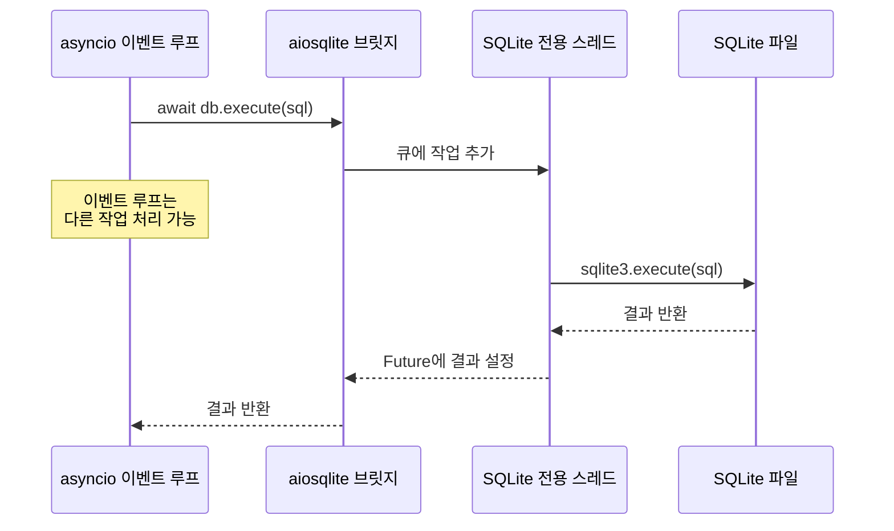
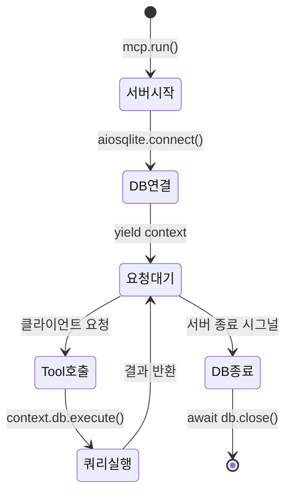
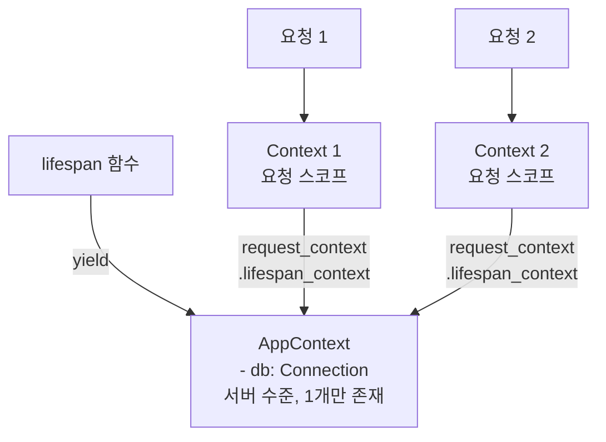
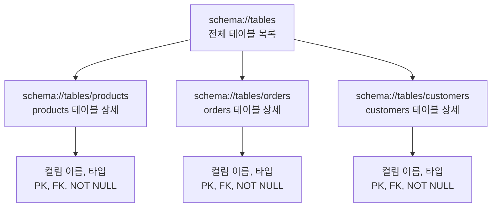
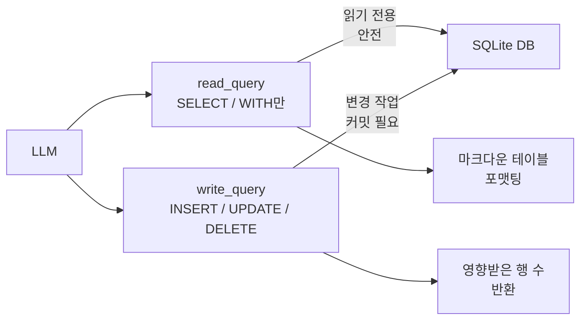
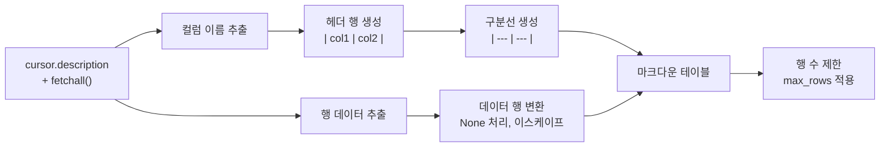

# SQLite MCP 서버 구축

> aiosqlite 기반 비동기 SQLite 서버를 FastMCP로 구축하고, 스키마를 Resource로, 쿼리를 Tool로 노출하는 완전한 구현

## 개요

이 섹션에서는 앞서 [DB 서버 설계 전략](07-ch7-실전-서버-데이터베이스-연동/01-01-db-서버-설계-전략.md)에서 설계한 패턴을 실제 코드로 구현합니다. aiosqlite로 비동기 SQLite 접근을 구성하고, FastMCP의 lifespan 패턴으로 DB 커넥션을 관리하며, 쿼리 결과를 마크다운 테이블로 포맷팅하는 완전한 MCP 서버를 만들어봅니다.

**선수 지식**: DB 서버 설계 전략([Resource-Tool 매핑, 허용목록 패턴](07-ch7-실전-서버-데이터베이스-연동/01-01-db-서버-설계-전략.md)), FastMCP 서버 기초([첫 번째 서버 만들기](03-ch3-개발-환경-설정과-첫-mcp-서버/02-02-hello-mcp-첫-번째-서버-만들기.md)), Tool과 Resource 데코레이터([도구 정의](04-ch4-tools-함수-호출-프리미티브/02-02-도구-정의와-스키마-자동-생성.md), [정적/동적 리소스](05-ch5-resources-데이터-노출-프리미티브/02-02-정적-리소스와-동적-리소스.md))

**학습 목표**:
- aiosqlite를 활용하여 비동기 SQLite 접근 계층을 구성할 수 있다
- FastMCP의 lifespan 패턴으로 DB 커넥션 라이프사이클을 관리할 수 있다
- 스키마 정보를 Resource로, 조회/실행을 Tool로 분리 구현할 수 있다
- 쿼리 결과를 LLM이 이해하기 쉬운 마크다운 테이블로 포맷팅할 수 있다

## 왜 알아야 할까?

지난 섹션에서 우리는 설계도를 그렸어요. Resource-Tool 매핑, 허용목록, 다층 방어 전략까지. 하지만 설계도만으로는 집을 지을 수 없죠. 이제 실제로 벽돌을 쌓을 차례입니다.

SQLite는 "세계에서 가장 많이 배포된 데이터베이스"입니다. 별도 서버 프로세스 없이 파일 하나로 동작하기 때문에, MCP 서버 학습용으로 완벽한 출발점이에요. 복잡한 DB 서버 설정 없이 `pip install aiosqlite` 한 줄이면 바로 시작할 수 있거든요.

이번 섹션에서 만드는 SQLite MCP 서버는 이후 [PostgreSQL 서버](07-ch7-실전-서버-데이터베이스-연동/04-04-postgresql-서버와-레퍼런스-분석.md)와 [E-commerce 실습](07-ch7-실전-서버-데이터베이스-연동/05-05-e-commerce-데이터-서버-실습.md)의 기반이 됩니다. 여기서 익힌 패턴 — lifespan 기반 커넥션 관리, query/execute 분리, 마크다운 포맷팅 — 은 어떤 데이터베이스를 래핑하든 그대로 재활용할 수 있어요.

## 핵심 개념

### 개념 1: aiosqlite — 비동기 SQLite 접근

> 💡 **비유**: 일반 sqlite3 모듈은 은행 창구가 하나뿐인 것과 같아요. 한 고객이 서류를 작성하는 동안 뒤의 모든 고객이 대기해야 하죠. aiosqlite는 "대기 번호표 시스템"을 추가한 겁니다. 서류 작성(디스크 I/O) 동안 다른 고객의 간단한 업무를 처리할 수 있게 해주는 거예요.

Python의 표준 `sqlite3` 모듈은 동기 방식이라, DB 작업 중 이벤트 루프가 블로킹됩니다. MCP 서버는 `asyncio` 기반이므로 이건 치명적이에요. aiosqlite는 별도의 전용 스레드에서 sqlite3를 실행하고, asyncio와 메시지 큐로 소통합니다.

> 📊 **그림 1**: aiosqlite의 동작 원리 — 전용 스레드와 asyncio 브릿지



aiosqlite의 핵심 API를 살펴보겠습니다:

```python
import aiosqlite

# 컨텍스트 매니저로 안전하게 연결
async with aiosqlite.connect("mydb.sqlite") as db:
    # Row 팩토리 설정 — 딕셔너리처럼 접근 가능
    db.row_factory = aiosqlite.Row
    
    # 단일 쿼리 실행 + 결과 순회
    async with db.execute("SELECT * FROM users WHERE age > ?", (18,)) as cursor:
        async for row in cursor:
            print(row["name"], row["age"])
    
    # 전체 결과를 한 번에 가져오기
    rows = await db.execute_fetchall("SELECT count(*) FROM users")
    
    # 데이터 변경 + 커밋
    await db.execute("INSERT INTO users (name, age) VALUES (?, ?)", ("Alice", 30))
    await db.commit()
```

여기서 주목할 점이 두 가지 있어요. 첫째, 파라미터 바인딩(`?` 플레이스홀더)은 SQL 인젝션 방지의 기본입니다. 둘째, `Row` 팩토리를 설정하면 `row["name"]` 같은 딕셔너리 접근이 가능해져서 코드 가독성이 크게 올라갑니다.

> ⚠️ **흔한 오해**: "aiosqlite가 진짜 비동기인가요?" — SQLite 자체는 동기 라이브러리입니다. aiosqlite는 별도 스레드에서 sqlite3를 실행하고 asyncio Future로 결과를 전달하는 "비동기 래퍼"예요. 진정한 비동기 I/O는 아니지만, asyncio 이벤트 루프를 블로킹하지 않는다는 점에서 MCP 서버에 충분합니다.

### 개념 2: lifespan 패턴으로 커넥션 관리

> 💡 **비유**: 식당을 운영한다고 생각해보세요. 매 손님이 올 때마다 냉장고를 새로 사고, 떠나면 버리는 식당은 없겠죠? 식당을 열 때 냉장고를 한 번 설치하고, 영업 시간 내내 쓰고, 문을 닫을 때 정리하는 게 당연합니다. DB 커넥션도 마찬가지예요.

FastMCP의 `lifespan` 패턴은 서버가 시작될 때 리소스를 초기화하고, 종료될 때 정리하는 메커니즘입니다. DB 커넥션을 매 요청마다 열고 닫는 대신, 서버 생애주기에 맞춰 한 번만 관리합니다.

> 📊 **그림 2**: lifespan 기반 DB 커넥션 라이프사이클



```python
from contextlib import asynccontextmanager
from collections.abc import AsyncIterator
from dataclasses import dataclass
from mcp.server.fastmcp import FastMCP

import aiosqlite


@dataclass
class AppContext:
    """서버 전체에서 공유할 애플리케이션 컨텍스트"""
    db: aiosqlite.Connection


@asynccontextmanager
async def app_lifespan(server: FastMCP) -> AsyncIterator[AppContext]:
    """서버 시작 시 DB 연결, 종료 시 정리"""
    db = await aiosqlite.connect("bookstore.db")
    db.row_factory = aiosqlite.Row  # 딕셔너리 스타일 접근
    try:
        yield AppContext(db=db)
    finally:
        await db.close()


mcp = FastMCP("sqlite-bookstore", lifespan=app_lifespan)
```

`@dataclass`로 정의한 `AppContext`에 DB 커넥션을 담고, 이를 `lifespan` 함수에서 `yield`합니다. `try/finally` 블록이 핵심인데, 서버가 어떻게 종료되든(정상 종료, 에러, 시그널) `finally`에서 커넥션을 반드시 닫아주거든요.

> ⚠️ **흔한 오해**: `AppContext`와 FastMCP의 `Context`를 혼동하기 쉬운데, 이 둘은 완전히 다른 역할입니다. **`AppContext`**는 우리가 직접 정의한 데이터클래스로, lifespan에서 생성한 서버 수준 리소스(DB 커넥션 등)를 담는 컨테이너예요. 반면 **`Context`**(`mcp.server.fastmcp.Context`)는 FastMCP가 매 요청마다 자동으로 생성하여 Tool/Resource 함수에 주입하는 요청 스코프 객체입니다. `Context` 안에는 로깅, 진행률 보고 등 요청별 기능이 포함되어 있고, `ctx.request_context.lifespan_context`를 통해 우리의 `AppContext`에 접근하는 구조예요. 쉽게 말해, `AppContext`는 "식당의 냉장고"이고, `Context`는 "각 손님에게 배정된 웨이터"인 셈이죠.

Tool이나 Resource 함수에서 이 컨텍스트에 접근하는 방법은 이렇습니다:

```python
from mcp.server.fastmcp import Context
from mcp.server.session import ServerSession


@mcp.tool()
async def query(sql: str, ctx: Context[ServerSession, AppContext]) -> str:
    """SQL 쿼리를 실행합니다."""
    # ctx: FastMCP가 요청마다 주입하는 Context (로깅, 진행률 등 제공)
    # ctx.request_context.lifespan_context: 우리가 만든 AppContext (DB 커넥션 보관)
    db = ctx.request_context.lifespan_context.db
    # db를 사용하여 쿼리 실행...
```

`ctx.request_context.lifespan_context`를 통해 lifespan에서 생성한 `AppContext` 인스턴스에 접근합니다. 경로가 좀 길죠? 하지만 이 패턴은 FastMCP의 표준이고, 타입 힌트 `Context[ServerSession, AppContext]`의 두 번째 제네릭 파라미터가 바로 lifespan이 반환하는 타입을 가리킵니다. 덕분에 IDE 자동완성도 잘 동작해요.

> 📊 **그림 3**: AppContext와 FastMCP Context의 관계



### 개념 3: 스키마 노출 — Resource로 DB 구조 제공

> 💡 **비유**: 새로운 도시에 도착했을 때 가장 먼저 필요한 게 뭘까요? 지도죠. LLM에게 데이터베이스의 "지도"를 먼저 보여주지 않으면, 쿼리를 작성할 수 없어요. 스키마 Resource는 LLM에게 건네주는 데이터베이스 지도입니다.

MCP의 Resource는 "읽기 전용 데이터"를 노출하는 프리미티브입니다. 데이터베이스 스키마 정보는 변경하는 것이 아니라 참조하는 것이므로 Resource에 딱 맞아요.

> 📊 **그림 4**: 스키마 Resource 계층 구조



두 가지 Resource를 정의합니다 — 전체 테이블 목록과 개별 테이블 상세 정보:

```python
@mcp.resource("schema://tables")
async def list_tables(ctx: Context[ServerSession, AppContext]) -> str:
    """데이터베이스의 모든 테이블 목록과 행 수를 반환합니다."""
    db = ctx.request_context.lifespan_context.db

    async with db.execute(
        "SELECT name FROM sqlite_master WHERE type='table' ORDER BY name"
    ) as cursor:
        tables = [row["name"] for row in await cursor.fetchall()]

    # 각 테이블의 행 수도 함께 제공
    result_lines = ["# 데이터베이스 테이블 목록\n"]
    for table in tables:
        async with db.execute(f"SELECT count(*) as cnt FROM [{table}]") as cur:
            row = await cur.fetchone()
            count = row["cnt"] if row else 0
        result_lines.append(f"- **{table}** ({count}행)")

    return "\n".join(result_lines)


@mcp.resource("schema://tables/{table_name}")
async def describe_table(
    table_name: str, ctx: Context[ServerSession, AppContext]
) -> str:
    """특정 테이블의 컬럼 정보(이름, 타입, 제약조건)를 반환합니다."""
    db = ctx.request_context.lifespan_context.db

    # 테이블 존재 여부 확인
    async with db.execute(
        "SELECT name FROM sqlite_master WHERE type='table' AND name=?",
        (table_name,),
    ) as cursor:
        if not await cursor.fetchone():
            return f"테이블 '{table_name}'을 찾을 수 없습니다."

    # PRAGMA로 컬럼 정보 조회
    async with db.execute(f"PRAGMA table_info([{table_name}])") as cursor:
        columns = await cursor.fetchall()

    lines = [f"# 테이블: {table_name}\n"]
    lines.append("| 컬럼명 | 타입 | NOT NULL | 기본값 | PK |")
    lines.append("|--------|------|----------|--------|----|")
    for col in columns:
        pk = "O" if col[5] else ""  # PRAGMA 결과는 튜플
        nn = "O" if col[3] else ""
        default = str(col[4]) if col[4] is not None else ""
        lines.append(f"| {col[1]} | {col[2]} | {nn} | {default} | {pk} |")

    return "\n".join(lines)
```

`schema://tables/{table_name}`은 URI 템플릿 패턴입니다. [동적 리소스](05-ch5-resources-데이터-노출-프리미티브/02-02-정적-리소스와-동적-리소스.md)에서 배운 것처럼, `{table_name}` 부분이 실제 테이블 이름으로 치환되어 각 테이블별 상세 정보를 제공하죠.

### 개념 4: query와 execute 도구 분리

> 💡 **비유**: 도서관에서 "책을 찾아보는 것"과 "책을 대출하는 것"은 완전히 다른 행위입니다. 찾아보는 건 도서관에 아무 변화가 없지만, 대출하면 재고가 줄어들죠. 마찬가지로 SELECT(조회)와 INSERT/UPDATE/DELETE(변경)는 위험도가 다르기 때문에 별도 도구로 분리해야 합니다.

[DB 서버 설계 전략](07-ch7-실전-서버-데이터베이스-연동/01-01-db-서버-설계-전략.md)에서 배운 "읽기-쓰기 분리 원칙"을 코드로 구현합니다:

> 📊 **그림 5**: query와 execute 도구의 역할 분리



```python
import re

# 허용할 읽기 전용 키워드
_READ_PATTERN = re.compile(r"^\s*(SELECT|WITH|PRAGMA|EXPLAIN)\b", re.IGNORECASE)
# 위험 키워드 차단
_DANGEROUS_PATTERN = re.compile(
    r"\b(DROP|ALTER|ATTACH|DETACH|VACUUM)\b", re.IGNORECASE
)
```

이 두 정규식은 SQL 검증의 "1차 방어선"입니다. `_READ_PATTERN`은 읽기 전용 명령어만 통과시키고, `_DANGEROUS_PATTERN`은 스키마 변경 명령을 차단하죠. 간단하고 빠르지만 한계도 있습니다 — 예를 들어 `SELECT * FROM users; DROP TABLE users`처럼 세미콜론으로 여러 문장을 이어 붙이는 공격이나, 주석 안에 키워드를 숨기는 패턴까지는 잡아내지 못해요.

> 💡 **알고 계셨나요?**: 다음 [쿼리 안전성과 권한 제어](07-ch7-실전-서버-데이터베이스-연동/03-03-쿼리-안전성과-권한-제어.md)에서는 이 단순한 정규식 패턴을 `sqlparse` 라이브러리 기반의 AST 파싱으로 대체합니다. `SecureQueryExecutor` 클래스가 SQL을 구문 트리로 분석하여 세미콜론 인젝션, 중첩 서브쿼리 공격 등 정규식으로는 잡을 수 없는 패턴까지 검증하게 됩니다. 지금 단계에서는 "기본 패턴의 동작 원리"를 이해하는 데 집중하고, 프로덕션 수준의 보안은 다음 섹션에서 다룹니다.

```python
@mcp.tool()
async def read_query(
    sql: str, ctx: Context[ServerSession, AppContext]
) -> str:
    """
    SELECT 쿼리를 실행하여 결과를 마크다운 테이블로 반환합니다.
    SELECT, WITH, PRAGMA, EXPLAIN 문만 허용됩니다.
    """
    db = ctx.request_context.lifespan_context.db

    # 1단계: 읽기 전용 검증
    if not _READ_PATTERN.match(sql):
        return "오류: SELECT, WITH, PRAGMA, EXPLAIN 문만 허용됩니다."

    # 2단계: 위험 키워드 차단
    if _DANGEROUS_PATTERN.search(sql):
        return "오류: DROP, ALTER 등 위험한 키워드가 포함되어 있습니다."

    try:
        async with db.execute(sql) as cursor:
            columns = [desc[0] for desc in cursor.description or []]
            rows = await cursor.fetchall()

        if not columns:
            return "결과가 없습니다."

        return _format_markdown_table(columns, rows)

    except Exception as e:
        return f"쿼리 실행 오류: {e}"


@mcp.tool()
async def write_query(
    sql: str, ctx: Context[ServerSession, AppContext]
) -> str:
    """
    INSERT, UPDATE, DELETE 쿼리를 실행합니다.
    변경된 행 수를 반환합니다. DROP, ALTER 등은 차단됩니다.
    """
    db = ctx.request_context.lifespan_context.db

    # 읽기 전용 쿼리는 read_query 사용 안내
    if _READ_PATTERN.match(sql):
        return "오류: SELECT 쿼리는 read_query 도구를 사용하세요."

    # 위험 키워드 차단
    if _DANGEROUS_PATTERN.search(sql):
        return "오류: DROP, ALTER 등 스키마 변경은 허용되지 않습니다."

    try:
        cursor = await db.execute(sql)
        await db.commit()
        return f"성공: {cursor.rowcount}개 행이 영향받았습니다."

    except Exception as e:
        await db.rollback()
        return f"쿼리 실행 오류: {e}"
```

도구의 **docstring**이 매우 중요합니다. LLM은 이 설명을 읽고 언제 `read_query`를 쓸지, 언제 `write_query`를 쓸지 판단하거든요. "SELECT 쿼리를 실행"과 "INSERT, UPDATE, DELETE 쿼리를 실행"이라는 명확한 구분이 LLM의 도구 선택 정확도를 높여줍니다.

### 개념 5: 마크다운 테이블 포맷팅

> 💡 **비유**: 같은 데이터라도 엑셀 표로 보여주는 것과 쉼표로 나열하는 것은 이해도가 전혀 다르죠? LLM도 마찬가지입니다. 정렬된 마크다운 테이블은 LLM이 데이터를 정확히 파싱하고 분석하는 데 큰 도움이 됩니다.

쿼리 결과를 LLM이 잘 해석할 수 있는 형태로 가공하는 것은 MCP 서버의 숨은 핵심 기능입니다:

```python
def _format_markdown_table(
    columns: list[str],
    rows: list[aiosqlite.Row],
    max_rows: int = 100,
) -> str:
    """쿼리 결과를 마크다운 테이블로 포맷팅합니다."""
    if not rows:
        return "결과: 0행 (빈 결과)"

    # 헤더
    header = "| " + " | ".join(columns) + " |"
    separator = "| " + " | ".join("---" for _ in columns) + " |"

    # 데이터 행 (최대 행 수 제한)
    data_lines = []
    for row in rows[:max_rows]:
        values = []
        for i, col in enumerate(columns):
            val = row[i] if isinstance(row, tuple) else row[col]
            # None은 빈 문자열, 나머지는 문자열 변환
            cell = "" if val is None else str(val)
            # 파이프 문자 이스케이프 (마크다운 테이블 깨짐 방지)
            cell = cell.replace("|", "\\|")
            values.append(cell)
        data_lines.append("| " + " | ".join(values) + " |")

    result = [header, separator] + data_lines

    # 결과 행 수 정보 추가
    total = len(rows)
    if total > max_rows:
        result.append(f"\n> 전체 {total}행 중 {max_rows}행만 표시합니다.")
    else:
        result.append(f"\n> 총 {total}행")

    return "\n".join(result)
```

```run:python
# 포맷팅 함수 테스트 (독립 실행 가능)
columns = ["id", "title", "price"]
rows = [
    (1, "파이썬 완전정복", 32000),
    (2, "MCP 실전 가이드", 28000),
    (3, "LLM 아키텍처", 45000),
]

header = "| " + " | ".join(columns) + " |"
separator = "| " + " | ".join("---" for _ in columns) + " |"
lines = [header, separator]
for row in rows:
    line = "| " + " | ".join(str(v) for v in row) + " |"
    lines.append(line)
print("\n".join(lines))
```

```output
| id | title | price |
| --- | --- | --- |
| 1 | 파이썬 완전정복 | 32000 |
| 2 | MCP 실전 가이드 | 28000 |
| 3 | LLM 아키텍처 | 45000 |
```

> 📊 **그림 6**: 쿼리 결과의 포맷팅 파이프라인



`max_rows` 제한은 중요한 안전장치입니다. LLM의 컨텍스트 윈도우는 무한하지 않으니까요. 10만 행짜리 결과를 통째로 반환하면 토큰 낭비는 물론이고 LLM의 응답 품질도 떨어집니다.

### 개념 6: 트랜잭션 관리

데이터 변경 작업에서 트랜잭션 관리는 데이터 무결성의 핵심입니다. aiosqlite에서의 트랜잭션 패턴을 살펴보겠습니다:

```python
@mcp.tool()
async def bulk_insert(
    table: str,
    records: list[dict],
    ctx: Context[ServerSession, AppContext],
) -> str:
    """여러 레코드를 한 번에 삽입합니다. 하나라도 실패하면 전체 롤백합니다."""
    db = ctx.request_context.lifespan_context.db

    if not records:
        return "오류: 삽입할 레코드가 없습니다."

    columns = list(records[0].keys())
    placeholders = ", ".join("?" for _ in columns)
    col_names = ", ".join(columns)
    sql = f"INSERT INTO [{table}] ({col_names}) VALUES ({placeholders})"

    try:
        # 트랜잭션 시작 — aiosqlite는 기본적으로 autocommit=False
        for record in records:
            values = tuple(record[col] for col in columns)
            await db.execute(sql, values)

        await db.commit()
        return f"성공: {len(records)}개 레코드가 삽입되었습니다."

    except Exception as e:
        await db.rollback()  # 실패 시 전체 롤백
        return f"오류: 삽입 실패 — {e}. 모든 변경이 롤백되었습니다."
```

> 🔥 **실무 팁**: aiosqlite는 기본적으로 `isolation_level=""`(autocommit off)로 동작합니다. 즉, `commit()`을 명시적으로 호출해야 변경이 반영되고, 에러 발생 시 `rollback()`으로 취소할 수 있어요. 이 동작을 이해하지 못하면 "데이터가 저장이 안 돼요!"라는 문제에 빠지기 쉽습니다.

## 실습: 직접 해보기

아래 코드는 서점 데이터베이스를 MCP 서버로 완전히 구현한 예제입니다. 파일 하나로 복사해서 바로 실행할 수 있습니다.

```python
# sqlite_bookstore_server.py
"""서점 데이터베이스 MCP 서버 — aiosqlite + FastMCP 완전 구현"""

import re
from collections.abc import AsyncIterator
from contextlib import asynccontextmanager
from dataclasses import dataclass

import aiosqlite
from mcp.server.fastmcp import Context, FastMCP
from mcp.server.session import ServerSession


# ──────────────────────────────────────────────
# 1. 애플리케이션 컨텍스트와 lifespan
# ──────────────────────────────────────────────

DB_PATH = "bookstore.db"

# 허용할 테이블 목록 (허용목록 패턴)
ALLOWED_TABLES = {"books", "authors", "categories"}


@dataclass
class AppContext:
    """서버 lifespan이 생성하는 애플리케이션 컨텍스트.
    
    FastMCP의 Context(요청 스코프)와 혼동하지 말 것:
    - AppContext: DB 커넥션 등 서버 수준 리소스 보관 (lifespan에서 1회 생성)
    - Context: 매 Tool/Resource 호출마다 FastMCP가 주입하는 요청별 객체
    """
    db: aiosqlite.Connection


async def _init_sample_data(db: aiosqlite.Connection) -> None:
    """샘플 데이터베이스 초기화 (첫 실행 시)"""
    await db.executescript("""
        CREATE TABLE IF NOT EXISTS authors (
            id INTEGER PRIMARY KEY AUTOINCREMENT,
            name TEXT NOT NULL,
            country TEXT
        );
        CREATE TABLE IF NOT EXISTS categories (
            id INTEGER PRIMARY KEY AUTOINCREMENT,
            name TEXT NOT NULL UNIQUE
        );
        CREATE TABLE IF NOT EXISTS books (
            id INTEGER PRIMARY KEY AUTOINCREMENT,
            title TEXT NOT NULL,
            author_id INTEGER REFERENCES authors(id),
            category_id INTEGER REFERENCES categories(id),
            price INTEGER NOT NULL,
            stock INTEGER DEFAULT 0,
            published_year INTEGER
        );
    """)
    # 샘플 데이터가 이미 있으면 건너뛰기
    async with db.execute("SELECT count(*) FROM authors") as cur:
        row = await cur.fetchone()
        if row and row[0] > 0:
            return

    await db.executemany(
        "INSERT INTO authors (name, country) VALUES (?, ?)",
        [
            ("김영하", "한국"),
            ("무라카미 하루키", "일본"),
            ("조앤 롤링", "영국"),
        ],
    )
    await db.executemany(
        "INSERT INTO categories (name) VALUES (?)",
        [("소설",), ("기술",), ("에세이",)],
    )
    await db.executemany(
        "INSERT INTO books (title, author_id, category_id, price, stock, published_year) VALUES (?, ?, ?, ?, ?, ?)",
        [
            ("살인자의 기억법", 1, 1, 13000, 25, 2013),
            ("상실의 시대", 2, 1, 12000, 30, 1987),
            ("해리 포터와 마법사의 돌", 3, 1, 15000, 50, 1997),
            ("파이썬 완전정복", 1, 2, 32000, 15, 2024),
            ("나는 나를 파괴할 권리가 있다", 1, 3, 11000, 20, 1996),
        ],
    )
    await db.commit()


@asynccontextmanager
async def app_lifespan(server: FastMCP) -> AsyncIterator[AppContext]:
    """서버 시작 시 DB 연결 + 샘플 데이터 초기화, 종료 시 정리"""
    db = await aiosqlite.connect(DB_PATH)
    db.row_factory = aiosqlite.Row
    await _init_sample_data(db)
    try:
        yield AppContext(db=db)
    finally:
        await db.close()


mcp = FastMCP(
    "sqlite-bookstore",
    lifespan=app_lifespan,
)


# ──────────────────────────────────────────────
# 2. 유틸리티 함수
# ──────────────────────────────────────────────

# SQL 검증용 정규식 — 간단한 1차 방어선
# (다음 섹션 7.3에서 sqlparse 기반 SecureQueryExecutor로 대체됩니다)
_READ_PATTERN = re.compile(r"^\s*(SELECT|WITH|PRAGMA|EXPLAIN)\b", re.IGNORECASE)
_DANGEROUS_PATTERN = re.compile(
    r"\b(DROP|ALTER|ATTACH|DETACH|VACUUM|REINDEX)\b", re.IGNORECASE
)


def _format_markdown_table(
    columns: list[str],
    rows: list,
    max_rows: int = 100,
) -> str:
    """쿼리 결과를 마크다운 테이블로 변환"""
    if not rows:
        return "결과: 0행 (빈 결과)"

    header = "| " + " | ".join(columns) + " |"
    separator = "| " + " | ".join("---" for _ in columns) + " |"

    data_lines = []
    for row in rows[:max_rows]:
        values = []
        for i in range(len(columns)):
            val = row[i]
            cell = "" if val is None else str(val).replace("|", "\\|")
            values.append(cell)
        data_lines.append("| " + " | ".join(values) + " |")

    result = [header, separator] + data_lines
    total = len(rows)
    if total > max_rows:
        result.append(f"\n> 전체 {total}행 중 {max_rows}행만 표시합니다.")
    else:
        result.append(f"\n> 총 {total}행")

    return "\n".join(result)


# ──────────────────────────────────────────────
# 3. Resource — 스키마 정보 노출
# ──────────────────────────────────────────────

@mcp.resource("schema://tables")
async def list_tables(ctx: Context[ServerSession, AppContext]) -> str:
    """허용된 테이블 목록과 각 테이블의 행 수를 반환합니다."""
    db = ctx.request_context.lifespan_context.db
    lines = ["# 서점 데이터베이스 테이블\n"]

    for table in sorted(ALLOWED_TABLES):
        async with db.execute(f"SELECT count(*) FROM [{table}]") as cur:
            row = await cur.fetchone()
            count = row[0] if row else 0
        lines.append(f"- **{table}** ({count}행)")

    return "\n".join(lines)


@mcp.resource("schema://tables/{table_name}")
async def describe_table(
    table_name: str, ctx: Context[ServerSession, AppContext]
) -> str:
    """특정 테이블의 컬럼 정보(이름, 타입, 제약조건)를 반환합니다."""
    if table_name not in ALLOWED_TABLES:
        return f"오류: '{table_name}'은 허용된 테이블이 아닙니다."

    db = ctx.request_context.lifespan_context.db

    async with db.execute(f"PRAGMA table_info([{table_name}])") as cursor:
        columns = await cursor.fetchall()

    lines = [f"# 테이블: {table_name}\n"]
    lines.append("| 컬럼명 | 타입 | NOT NULL | 기본값 | PK |")
    lines.append("|--------|------|----------|--------|----|")
    for col in columns:
        pk = "O" if col[5] else ""
        nn = "O" if col[3] else ""
        default = str(col[4]) if col[4] is not None else ""
        lines.append(f"| {col[1]} | {col[2]} | {nn} | {default} | {pk} |")

    return "\n".join(lines)


# ──────────────────────────────────────────────
# 4. Tool — 쿼리 실행
# ──────────────────────────────────────────────

@mcp.tool()
async def read_query(
    sql: str, ctx: Context[ServerSession, AppContext]
) -> str:
    """
    SELECT 쿼리를 실행하여 결과를 마크다운 테이블로 반환합니다.
    SELECT, WITH, PRAGMA, EXPLAIN 문만 허용됩니다.
    """
    db = ctx.request_context.lifespan_context.db

    if not _READ_PATTERN.match(sql):
        return "오류: SELECT, WITH, PRAGMA, EXPLAIN 문만 허용됩니다."
    if _DANGEROUS_PATTERN.search(sql):
        return "오류: 위험한 키워드가 포함되어 있습니다."

    try:
        async with db.execute(sql) as cursor:
            columns = [desc[0] for desc in cursor.description or []]
            rows = await cursor.fetchall()
        if not columns:
            return "결과가 없습니다."
        return _format_markdown_table(columns, rows)
    except Exception as e:
        return f"쿼리 오류: {e}"


@mcp.tool()
async def write_query(
    sql: str, ctx: Context[ServerSession, AppContext]
) -> str:
    """
    INSERT, UPDATE, DELETE 쿼리를 실행합니다.
    변경된 행 수를 반환합니다. DROP, ALTER 등은 차단됩니다.
    """
    db = ctx.request_context.lifespan_context.db

    if _READ_PATTERN.match(sql):
        return "오류: SELECT 쿼리는 read_query 도구를 사용하세요."
    if _DANGEROUS_PATTERN.search(sql):
        return "오류: 스키마 변경 명령은 허용되지 않습니다."

    try:
        cursor = await db.execute(sql)
        await db.commit()
        return f"성공: {cursor.rowcount}개 행이 영향받았습니다."
    except Exception as e:
        await db.rollback()
        return f"실행 오류: {e}"


# ──────────────────────────────────────────────
# 5. 서버 실행
# ──────────────────────────────────────────────

if __name__ == "__main__":
    mcp.run(transport="stdio")
```

**실행 방법**:

```terminal
# 1. 의존성 설치
pip install "mcp[cli]" aiosqlite

# 2. MCP Inspector로 테스트
mcp dev sqlite_bookstore_server.py
```

MCP Inspector가 열리면 다음 순서로 테스트해보세요:

1. **Resources 탭** → `schema://tables` 클릭 → 테이블 목록 확인
2. **Resources 탭** → `schema://tables/books` 클릭 → 컬럼 정보 확인
3. **Tools 탭** → `read_query` 선택 → `SELECT * FROM books` 입력 → 마크다운 테이블 확인
4. **Tools 탭** → `write_query` 선택 → `INSERT INTO books (title, author_id, category_id, price, stock) VALUES ('새 책', 1, 2, 25000, 10)` 입력 → 성공 메시지 확인

Claude Desktop에 연결하려면 `claude_desktop_config.json`에 아래를 추가합니다:

```json
{
  "mcpServers": {
    "bookstore": {
      "command": "python",
      "args": ["sqlite_bookstore_server.py"],
      "cwd": "/path/to/your/project"
    }
  }
}
```

연결 후 Claude에게 "서점 데이터베이스에 어떤 테이블이 있어?", "가격이 15000원 이상인 책 목록 보여줘" 같은 자연어 질문을 던져보세요.

## 더 깊이 알아보기

### SQLite의 탄생 — "인터넷이 끊겨도 동작하는 데이터베이스"

SQLite의 탄생 스토리는 꽤 독특합니다. 2000년, D. Richard Hipp는 미 해군의 유도 미사일 구축함 소프트웨어를 개발하고 있었어요. 시스템은 Informix 데이터베이스를 사용했는데, 서버가 다운되면 프로그램 전체가 먹통이 되는 문제가 있었습니다. "데이터베이스 서버 없이 동작하는 SQL 엔진이 있으면 좋겠다"는 생각에서 SQLite가 탄생했죠.

Hipp은 SQLite를 퍼블릭 도메인으로 공개했습니다. 라이선스조차 없어요 — 저작권을 완전히 포기한 것이죠. 이 결정 덕분에 SQLite는 모든 스마트폰(iOS와 Android 모두), 모든 주요 웹 브라우저, 심지어 비행기의 항공 전자장비에까지 들어가게 되었습니다. 2026년 현재 전 세계에 **1조 개 이상**의 SQLite 데이터베이스가 활성 상태로 추정됩니다.

### aiosqlite의 설계 결정 — "왜 진짜 비동기가 아닌가?"

aiosqlite를 만든 Amethyst Reese(현 Meta 소속)는 흥미로운 트레이드오프를 선택했습니다. SQLite의 C 라이브러리를 직접 비동기화하는 대신, 별도 스레드에서 동기 sqlite3를 실행하고 asyncio와 브릿지하는 방식을 택했어요. 이유는 간단합니다 — SQLite는 프로세스 내 임베디드 DB라서 네트워크 I/O가 없고, 디스크 I/O만 있거든요. 대부분의 SQLite 작업은 마이크로초 단위로 끝나기 때문에, 스레드 오버헤드가 거의 없으면서 asyncio 호환성을 확보하는 것이 최선의 선택이었습니다.

## 흔한 오해와 팁

> ⚠️ **흔한 오해**: "aiosqlite는 동시에 여러 쓰기를 처리할 수 있다" — 아닙니다. SQLite는 프로세스 수준에서 쓰기 잠금(writer lock)을 사용합니다. aiosqlite가 비동기 인터페이스를 제공하더라도, 동시 쓰기는 `sqlite3.OperationalError: database is locked` 에러를 발생시킵니다. WAL(Write-Ahead Logging) 모드(`PRAGMA journal_mode=WAL`)를 활성화하면 읽기와 쓰기가 동시에 가능해지지만, 동시 쓰기는 여전히 직렬화됩니다.

> 💡 **알고 계셨나요?**: MCP 공식 레퍼런스 서버 중 SQLite 서버(`@modelcontextprotocol/server-sqlite`)는 TypeScript로 작성되어 있습니다. Python용 공식 SQLite 서버는 없는데, 이번 섹션에서 만든 것이 사실상 Python 버전의 레퍼런스 구현에 해당하는 셈이에요. `hannesrudolph/sqlite-explorer-fastmcp-mcp-server`가 커뮤니티에서 가장 많이 참조되는 Python 구현입니다.

> 🔥 **실무 팁**: `cursor.description`이 `None`을 반환하는 경우를 꼭 처리하세요. INSERT, UPDATE, DELETE 같은 DML 문을 실행하면 `description`이 `None`입니다. `columns = [desc[0] for desc in cursor.description or []]`처럼 방어 코드를 넣지 않으면, 예상치 못한 `TypeError`에 서버가 죽을 수 있어요.

> 🔥 **실무 팁**: 테이블 이름에 대괄호 `[table_name]`을 사용하는 이유가 궁금하셨나요? SQLite에서 테이블 이름이 예약어와 겹치거나 특수문자를 포함할 때 안전하게 이스케이프하는 방법입니다. `SELECT * FROM [order]`는 동작하지만 `SELECT * FROM order`는 문법 오류가 됩니다.

## 핵심 정리

| 개념 | 설명 |
|------|------|
| aiosqlite | sqlite3의 비동기 래퍼. 전용 스레드에서 실행, asyncio 이벤트 루프 비블로킹 |
| lifespan 패턴 | FastMCP의 서버 생애주기 관리. DB 커넥션을 서버 시작 시 생성, 종료 시 정리 |
| AppContext | lifespan에서 생성한 서버 수준 리소스(DB 등)를 담는 사용자 정의 데이터클래스 |
| Context | FastMCP가 매 요청마다 주입하는 요청 스코프 객체. AppContext에는 `ctx.request_context.lifespan_context`로 접근 |
| schema:// Resource | 테이블 목록, 컬럼 정보를 읽기 전용 URI로 노출. LLM의 "데이터베이스 지도" |
| read_query / write_query | 조회와 변경을 별도 Tool로 분리. 각각 다른 검증 규칙 적용 |
| 정규식 SQL 검증 | `_READ_PATTERN`/`_DANGEROUS_PATTERN`으로 1차 방어. 7.3에서 sqlparse 기반으로 강화 |
| 마크다운 테이블 포맷팅 | cursor.description으로 컬럼명 추출 → 마크다운 테이블로 변환. max_rows 제한 |
| Row 팩토리 | `db.row_factory = aiosqlite.Row`로 딕셔너리 스타일 컬럼 접근 활성화 |
| 트랜잭션 관리 | commit()/rollback() 명시 호출. 에러 시 반드시 rollback |

## 다음 섹션 미리보기

지금까지 만든 서버는 기본적인 SQL 검증만 수행합니다. 하지만 실제 프로덕션에서는 훨씬 정교한 보안이 필요해요. 다음 [쿼리 안전성과 권한 제어](07-ch7-실전-서버-데이터베이스-연동/03-03-쿼리-안전성과-권한-제어.md)에서는 파라미터 바인딩 강제, SQL 파싱 기반 화이트리스트 검증, 사용자별 권한 매트릭스, 그리고 rate limiting까지 — 공식 PostgreSQL 레퍼런스 서버의 취약점 사례를 교훈삼아 견고한 방어 체계를 구축합니다. 이 섹션에서 사용한 `_READ_PATTERN`/`_DANGEROUS_PATTERN` 정규식은 `SecureQueryExecutor` 클래스의 `sqlparse` 기반 AST 검증으로 대체되어, 세미콜론 인젝션이나 서브쿼리 공격까지 방어할 수 있게 됩니다.

## 참고 자료

- [MCP Python SDK — GitHub](https://github.com/modelcontextprotocol/python-sdk) - FastMCP의 lifespan 패턴, Context 타입 힌트 등 공식 API 레퍼런스
- [Build a Python MCP Server — Real Python](https://realpython.com/python-mcp/) - Python으로 MCP 서버를 구축하는 단계별 가이드. 데이터베이스 도구 패턴 포함
- [aiosqlite — PyPI](https://pypi.org/project/aiosqlite/) - aiosqlite v0.22.1 공식 문서. 비동기 API와 Row 팩토리 사용법
- [sqlite-explorer-fastmcp-mcp-server — GitHub](https://github.com/hannesrudolph/sqlite-explorer-fastmcp-mcp-server) - FastMCP 기반 SQLite MCP 서버 커뮤니티 구현. read_query, list_tables, describe_table 패턴 참고
- [How to Build an MCP Server in Python — DigitalOcean](https://www.digitalocean.com/community/tutorials/mcp-server-python) - SQLite 기반 MCP 서버 실습 튜토리얼
- [MCP Official Documentation](https://modelcontextprotocol.io/) - MCP 프로토콜 공식 사양과 아키텍처 문서

---
### 🔗 Related Sessions
- [허용목록/차단목록 패턴](07-ch7-실전-서버-데이터베이스-연동/01-01-db-서버-설계-전략.md) (prerequisite)
- [다층 방어 전략](07-ch7-실전-서버-데이터베이스-연동/01-01-db-서버-설계-전략.md) (prerequisite)
- [dbserverconfig](07-ch7-실전-서버-데이터베이스-연동/01-01-db-서버-설계-전략.md) (prerequisite)
- [queryvalidator](07-ch7-실전-서버-데이터베이스-연동/01-01-db-서버-설계-전략.md) (prerequisite)
