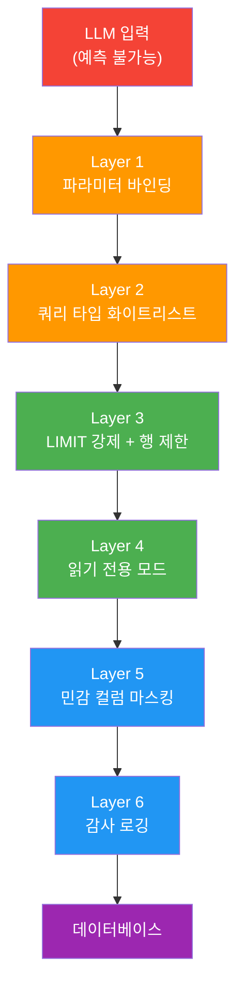
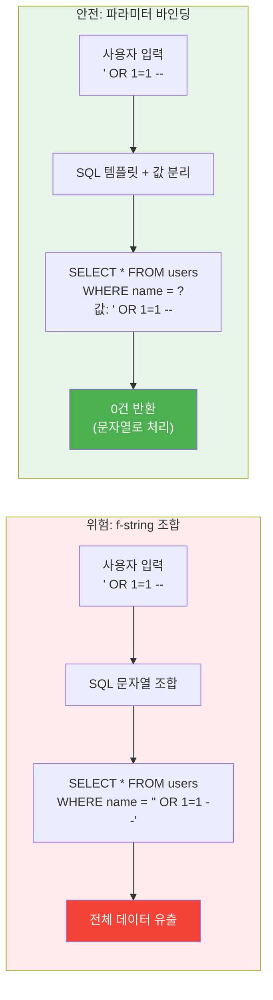
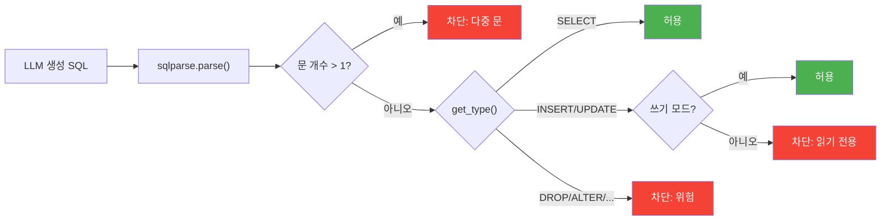
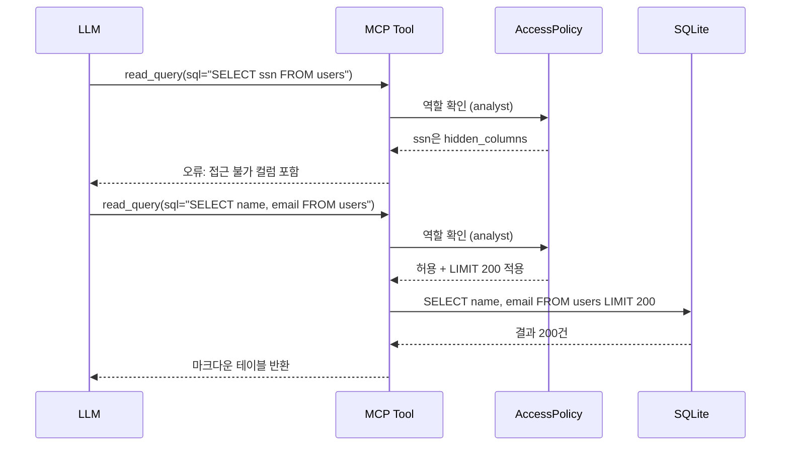
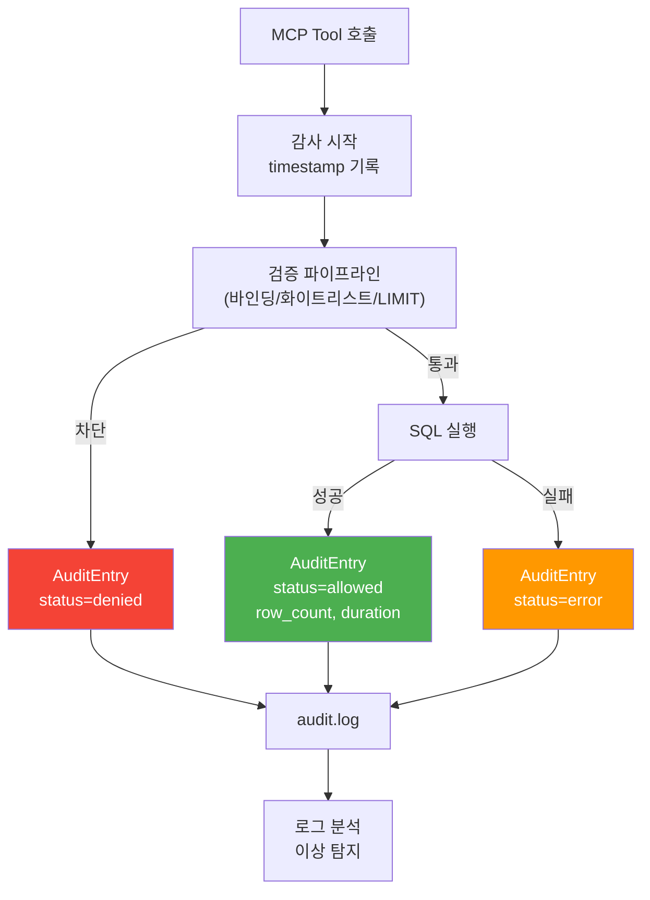

# 쿼리 안전성과 권한 제어

> 파라미터 바인딩, 쿼리 화이트리스트, 행 수 제한, 읽기 전용 모드, 민감 컬럼 마스킹, 감사 로깅으로 DB MCP 서버를 철벽 방어합니다.

## 개요

이 섹션에서는 [이전 섹션](07-ch7-실전-서버-데이터베이스-연동/02-02-sqlite-mcp-서버-구축.md)에서 구축한 SQLite MCP 서버에 **실전 수준의 보안 계층**을 덧입힙니다. 정규식 기반 검증만으로는 부족했던 부분을 파라미터 바인딩, SQL 파싱, 권한 제어, 감사 로깅으로 보강합니다.

**선수 지식**: [DB 서버 설계 전략](07-ch7-실전-서버-데이터베이스-연동/01-01-db-서버-설계-전략.md)의 다층 방어 전략, [SQLite MCP 서버 구축](07-ch7-실전-서버-데이터베이스-연동/02-02-sqlite-mcp-서버-구축.md)의 `read_query`/`write_query` Tool 분리 패턴

**학습 목표**:
- 파라미터 바인딩으로 SQL 인젝션을 원천 차단할 수 있다
- `sqlparse`를 활용한 쿼리 타입 화이트리스트를 구현할 수 있다
- LIMIT 강제, 읽기 전용 모드, 민감 컬럼 마스킹을 구현할 수 있다
- 구조화된 감사 로깅으로 모든 쿼리 실행을 추적할 수 있다

## 왜 알아야 할까?

[DB 서버 설계 전략](07-ch7-실전-서버-데이터베이스-연동/01-01-db-서버-설계-전략.md)에서 살펴본 PostgreSQL MCP 서버 취약점 사례를 기억하시죠? 스택 쿼리로 읽기 전용 트랜잭션을 탈출해 전체 스키마를 삭제할 수 있었던 그 사건 말입니다. 하지만 이것은 빙산의 일각이었습니다.

같은 시기, 보안 기업 Trend Micro는 **Anthropic 공식 SQLite MCP 서버**에서 더 기본적인 문제를 발견했습니다. 놀랍게도 이 서버는 사용자 입력을 **Python f-string으로 직접 SQL에 삽입**하고 있었습니다. `' OR 1=1 --` 같은 교과서적 공격에도 무방비였던 거죠. 문제의 코드는 대략 이런 형태였습니다:

```python
# ❌ 실제 공식 서버에서 사용된 패턴 (취약)
query = f"SELECT * FROM {table} WHERE {column} = '{user_input}'"
```

이 서버는 GitHub에서 **5,000회 이상 포크**되었고, 수많은 프로젝트의 기반이 된 뒤에야 2025년 5월 아카이브(deprecated) 처리되었습니다. 공식 레퍼런스 서버조차 이런 실수를 했다는 것은, MCP 환경에서 DB 보안이 얼마나 간과되기 쉬운지를 적나라하게 보여줍니다.

MCP 서버는 **LLM이 자연어로 데이터베이스를 조작**하는 관문입니다. LLM은 예측 불가능한 입력을 생성하고, 프롬프트 인젝션 공격을 통해 악의적 SQL을 시도할 수 있습니다. 전통적인 웹 애플리케이션보다 **공격 표면이 훨씬 넓다**는 뜻이죠. 그래서 정규식 한 줄로는 부족합니다 — 다층 방어(Defense in Depth)가 필수입니다.

> 📊 **그림 1**: MCP DB 서버의 공격 표면과 방어 계층



## 핵심 개념

### 개념 1: 파라미터 바인딩 — SQL 인젝션의 근본적 해결

> 💡 **비유**: 은행 창구를 떠올려보세요. 직원이 "이체할 금액을 말씀해주세요"라고 물으면, 고객은 숫자만 적을 수 있는 전용 양식을 받습니다. 양식 칸에 "10만원; 그리고 옆 계좌에서 100만원 인출"이라고 적어도, 시스템은 "10만원"이라는 **값**만 인식하고 나머지는 무시합니다. 파라미터 바인딩이 바로 이 "전용 양식"입니다. 은행 시스템이 양식의 구조(어떤 칸에 무엇을 적는지)를 미리 정해두고, 고객이 채우는 내용은 절대 양식의 구조 자체를 바꿀 수 없는 것과 같죠.

파라미터 바인딩(Parameterized Query)은 **SQL 구조와 데이터 값을 분리**하는 기법입니다. SQL 문의 골격은 미리 컴파일되고, 사용자 입력은 항상 "값"으로만 바인딩됩니다. 데이터베이스 엔진은 이 두 단계를 완전히 분리하여 처리하기 때문에, 아무리 악의적인 문자열을 넣어도 SQL 명령어로 해석될 수 없습니다.

> 📊 **그림 2**: f-string vs 파라미터 바인딩 비교



핵심 원칙은 간단합니다:

```python
# ❌ 절대 금지 — f-string/format으로 SQL 조립
query = f"SELECT * FROM users WHERE name = '{user_input}'"

# ✅ 안전 — 파라미터 바인딩
query = "SELECT * FROM users WHERE name = ?"
await db.execute(query, (user_input,))
```

하지만 MCP 서버의 도전은 여기에 있습니다 — **LLM이 SQL 문 자체를 생성**한다는 점이죠. 사용자가 "모든 고객 목록을 보여줘"라고 하면 LLM이 `SELECT * FROM customers`를 만들어 `read_query` Tool에 전달합니다. 이 경우 SQL 전체가 "사용자 입력"이므로, 단순 파라미터 바인딩만으로는 충분하지 않습니다.

그래서 우리는 **별도의 파라미터 바인딩 인터페이스**를 제공합니다:

```python
from mcp.server.fastmcp import FastMCP

mcp = FastMCP("secure-db")

@mcp.tool()
async def query_users(
    name: str | None = None,
    min_age: int | None = None,
    limit: int = 100,
) -> str:
    """사용자를 조건으로 검색합니다. name과 min_age 필터를 지원합니다."""
    conditions = []
    params: list = []

    if name is not None:
        conditions.append("name LIKE ?")
        params.append(f"%{name}%")
    if min_age is not None:
        conditions.append("age >= ?")
        params.append(min_age)

    where = f"WHERE {' AND '.join(conditions)}" if conditions else ""
    safe_limit = min(limit, 1000)  # 상한 강제
    sql = f"SELECT id, name, age FROM users {where} LIMIT {safe_limit}"

    cursor = await ctx.db.execute(sql, params)
    rows = await cursor.fetchall()
    return _format_rows(rows)
```

이 패턴에서 LLM은 SQL을 직접 작성하지 않습니다. 대신 **구조화된 인자**(name, min_age, limit)를 전달하고, 서버가 안전하게 SQL을 조립합니다.

> ⚠️ **흔한 오해**: "파라미터 바인딩은 테이블명이나 컬럼명에도 쓸 수 있다" — 아닙니다! `?` 플레이스홀더는 **값(value)**에만 사용할 수 있습니다. 테이블명이나 컬럼명 같은 **식별자(identifier)**는 화이트리스트로 검증해야 합니다.

### 개념 2: 쿼리 타입 화이트리스트 — sqlparse로 SQL 구조 검증

> 💡 **비유**: 공항 보안 검색대에서 X-ray 기계가 가방 내부 구조를 스캔하듯, `sqlparse`는 SQL 문의 내부 구조를 파싱하여 "이 쿼리가 SELECT인지 DROP인지" 판별합니다. 정규식이 겉모습만 보는 CCTV라면, sqlparse는 내부를 투시하는 X-ray입니다.

[이전 섹션](07-ch7-실전-서버-데이터베이스-연동/02-02-sqlite-mcp-서버-구축.md)에서는 정규식으로 `SELECT`만 허용하고 `DROP`, `DELETE` 등을 차단했습니다. 하지만 정규식은 우회가 쉽습니다:

```sql
-- 정규식 우회 예시
SeLeCt * FROM users; DROP TABLE users; --
/* 주석 */ DELETE FROM users
```

`sqlparse` 라이브러리는 SQL을 **토큰 트리**로 파싱하여 문의 타입을 정확히 판별합니다:

```python
import sqlparse

def validate_query_type(sql: str, allowed_types: set[str]) -> tuple[bool, str]:
    """SQL 문의 타입을 검증합니다.

    Args:
        sql: 검증할 SQL 문
        allowed_types: 허용할 쿼리 타입 집합 (예: {"SELECT"})

    Returns:
        (통과 여부, 사유 메시지) 튜플
    """
    statements = sqlparse.parse(sql)

    if len(statements) == 0:
        return False, "빈 쿼리입니다"

    # 다중 문(statement) 차단 — 스택 쿼리 공격 방지
    non_empty = [s for s in statements if s.get_type() is not None]
    if len(non_empty) > 1:
        return False, "다중 SQL 문은 허용되지 않습니다"

    stmt = non_empty[0]
    stmt_type = stmt.get_type()

    if stmt_type not in allowed_types:
        return False, f"허용되지 않는 쿼리 타입: {stmt_type} (허용: {allowed_types})"

    return True, "통과"
```

> 📊 **그림 3**: 쿼리 검증 파이프라인



여기에 **식별자 화이트리스트**까지 추가하면 더 강력해집니다:

```python
import sqlparse
from sqlparse.sql import IdentifierList, Identifier
from sqlparse.tokens import Keyword, DML

ALLOWED_TABLES = {"users", "products", "orders", "order_items"}

def extract_table_names(parsed) -> set[str]:
    """파싱된 SQL에서 참조된 테이블명을 추출합니다."""
    tables = set()
    from_seen = False

    for token in parsed.tokens:
        if token.ttype is Keyword and token.value.upper() in ("FROM", "JOIN", "INTO", "UPDATE"):
            from_seen = True
            continue
        if from_seen:
            if isinstance(token, IdentifierList):
                for identifier in token.get_identifiers():
                    tables.add(identifier.get_name())
            elif isinstance(token, Identifier):
                tables.add(token.get_name())
            from_seen = False

    return tables

def validate_tables(sql: str) -> tuple[bool, str]:
    """쿼리가 허용된 테이블만 참조하는지 검증합니다."""
    parsed = sqlparse.parse(sql)[0]
    tables = extract_table_names(parsed)
    unauthorized = tables - ALLOWED_TABLES
    if unauthorized:
        return False, f"허용되지 않은 테이블: {unauthorized}"
    return True, "통과"
```

### 개념 3: LIMIT 강제와 행 수 제한

> 💡 **비유**: 도서관에서 한 번에 빌릴 수 있는 책 수가 정해져 있는 것처럼, DB 쿼리도 한 번에 반환할 수 있는 행 수를 제한해야 합니다. LLM이 `SELECT * FROM logs`를 실행해서 100만 건을 가져오면, 토큰 비용 폭탄은 물론이고 서버 메모리도 터집니다.

```python
import re

MAX_ROWS = 500
DEFAULT_LIMIT = 100

def enforce_limit(sql: str, max_rows: int = MAX_ROWS) -> str:
    """SELECT 쿼리에 LIMIT이 없으면 자동 추가하고,
    있으면 max_rows 이하로 클램핑합니다."""
    parsed = sqlparse.parse(sql)[0]

    if parsed.get_type() != "SELECT":
        return sql

    # 기존 LIMIT 절 탐지
    sql_upper = sql.upper()
    limit_match = re.search(
        r"\bLIMIT\s+(\d+)\s*$", sql_upper.strip()
    )

    if limit_match:
        existing = int(limit_match.group(1))
        if existing > max_rows:
            # LIMIT 값을 max_rows로 클램핑
            start = limit_match.start(1) - (len(sql_upper) - len(sql))
            return sql[:limit_match.start(1)] + str(max_rows) + sql[limit_match.end(1):]
        return sql
    else:
        # LIMIT 절 추가
        return f"{sql.rstrip().rstrip(';')} LIMIT {max_rows}"
```

```run:python
import re

def enforce_limit(sql: str, max_rows: int = 500) -> str:
    sql_stripped = sql.rstrip().rstrip(";")
    limit_match = re.search(r"\bLIMIT\s+(\d+)\s*$", sql_stripped, re.IGNORECASE)
    if limit_match:
        existing = int(limit_match.group(1))
        if existing > max_rows:
            return sql_stripped[:limit_match.start(1)] + str(max_rows) + sql_stripped[limit_match.end(1):]
        return sql_stripped
    return f"{sql_stripped} LIMIT {max_rows}"

# 테스트
print(enforce_limit("SELECT * FROM users"))
print(enforce_limit("SELECT * FROM users LIMIT 10"))
print(enforce_limit("SELECT * FROM logs LIMIT 99999"))
```

```output
SELECT * FROM users LIMIT 500
SELECT * FROM users LIMIT 10
SELECT * FROM logs LIMIT 500
```

### 개념 4: 읽기 전용 모드와 권한 제어

> 💡 **비유**: 미술관에서 작품을 감상할 수 있지만 만질 수는 없죠. "관람 모드"와 "큐레이터 모드"가 다르듯, 데이터베이스 접근도 역할에 따라 **읽기 전용**과 **읽기-쓰기**로 분리해야 합니다.

가장 간단한 읽기 전용 모드는 **SQLite의 URI 파라미터**를 활용하는 것입니다:

```python
import aiosqlite

# 읽기 전용 연결 — DB 수준에서 쓰기 차단
db = await aiosqlite.connect("file:mydb.sqlite?mode=ro", uri=True)
```

하지만 실전에서는 **사용자 역할별 권한**이 필요합니다:

```python
from dataclasses import dataclass, field
from enum import Enum

class Permission(Enum):
    READ = "read"
    WRITE = "write"
    ADMIN = "admin"

@dataclass
class AccessPolicy:
    """테이블별 접근 권한 정책"""
    table: str
    allowed_ops: set[str] = field(default_factory=lambda: {"SELECT"})
    hidden_columns: set[str] = field(default_factory=set)
    row_limit: int = 500

@dataclass
class UserRole:
    """사용자 역할 정의"""
    name: str
    permission: Permission
    policies: dict[str, AccessPolicy] = field(default_factory=dict)

# 역할 정의 예시
ROLES = {
    "analyst": UserRole(
        name="analyst",
        permission=Permission.READ,
        policies={
            "users": AccessPolicy(
                table="users",
                allowed_ops={"SELECT"},
                hidden_columns={"password_hash", "ssn", "phone"},
                row_limit=200,
            ),
            "orders": AccessPolicy(
                table="orders",
                allowed_ops={"SELECT"},
                row_limit=500,
            ),
        },
    ),
    "manager": UserRole(
        name="manager",
        permission=Permission.WRITE,
        policies={
            "users": AccessPolicy(
                table="users",
                allowed_ops={"SELECT", "UPDATE"},
                hidden_columns={"password_hash", "ssn"},
                row_limit=1000,
            ),
            "orders": AccessPolicy(
                table="orders",
                allowed_ops={"SELECT", "INSERT", "UPDATE"},
                row_limit=1000,
            ),
        },
    ),
}
```

> 📊 **그림 4**: 역할 기반 접근 제어 흐름



### 개념 5: 민감 컬럼 마스킹

> 💡 **비유**: 서류에 검은 마커로 주민등록번호 뒷자리를 지우는 것처럼, 민감한 데이터는 원본을 보여주지 않고 **마스킹된 값**을 반환합니다.

```python
import re
from typing import Callable

# 마스킹 함수 정의
def mask_email(value: str) -> str:
    """이메일 마스킹: john@example.com → j***@example.com"""
    if not value or "@" not in value:
        return value
    local, domain = value.split("@", 1)
    return f"{local[0]}***@{domain}"

def mask_phone(value: str) -> str:
    """전화번호 마스킹: 010-1234-5678 → 010-****-5678"""
    digits = re.sub(r"[^0-9]", "", value)
    if len(digits) >= 8:
        return f"{digits[:3]}-****-{digits[-4:]}"
    return "***"

def mask_partial(value: str, visible: int = 3) -> str:
    """부분 마스킹: 뒤 N자리만 보여줌"""
    if len(value) <= visible:
        return "*" * len(value)
    return "*" * (len(value) - visible) + value[-visible:]

# 컬럼별 마스킹 정책
MASKING_RULES: dict[str, Callable[[str], str]] = {
    "email": mask_email,
    "phone": mask_phone,
    "phone_number": mask_phone,
    "ssn": lambda v: mask_partial(v, 0),  # 완전 마스킹
    "password_hash": lambda _: "[REDACTED]",
    "credit_card": lambda v: mask_partial(v, 4),
}

def apply_masking(
    rows: list[dict],
    columns: list[str],
    policy: AccessPolicy,
) -> list[dict]:
    """결과 행에 마스킹 정책을 적용합니다."""
    masked_rows = []
    for row in rows:
        masked_row = {}
        for col in columns:
            if col in policy.hidden_columns:
                continue  # 숨김 컬럼은 아예 제외
            value = row[col]
            if col in MASKING_RULES and value is not None:
                masked_row[col] = MASKING_RULES[col](str(value))
            else:
                masked_row[col] = value
        masked_rows.append(masked_row)
    return masked_rows
```

```run:python
def mask_email(value: str) -> str:
    if not value or "@" not in value:
        return value
    local, domain = value.split("@", 1)
    return f"{local[0]}***@{domain}"

def mask_phone(value: str) -> str:
    return f"{value[:3]}-****-{value[-4:]}"

# 테스트
print(mask_email("jason.lee@example.com"))
print(mask_phone("010-1234-5678"))
print(mask_email("a@test.io"))
```

```output
j***@example.com
010-****-5678
a***@test.io
```

### 개념 6: 감사 로깅 — 누가 무엇을 언제 했는가

> 💡 **비유**: CCTV가 건물 출입을 기록하듯, 감사 로깅(Audit Logging)은 DB 서버로 들어오는 **모든 쿼리 요청을 기록**합니다. 사고가 터졌을 때 "누가, 언제, 어떤 쿼리를 실행했는지" 역추적하는 유일한 방법이죠.

MCP 서버에서 감사 로깅은 특히 중요합니다. LLM이 자율적으로 도구를 호출하기 때문에, 예상치 못한 쿼리가 실행될 수 있거든요.

```python
import logging
import time
import json
from dataclasses import dataclass, asdict
from datetime import datetime, timezone

# 구조화된 감사 로거 설정
audit_logger = logging.getLogger("mcp.audit")
audit_logger.setLevel(logging.INFO)

handler = logging.FileHandler("audit.log")
handler.setFormatter(logging.Formatter("%(message)s"))
audit_logger.addHandler(handler)

@dataclass
class AuditEntry:
    """감사 로그 항목"""
    timestamp: str
    tool: str
    sql: str
    params: list | None
    role: str
    status: str  # "allowed", "denied", "error"
    reason: str
    duration_ms: float | None = None
    row_count: int | None = None

    def to_json(self) -> str:
        return json.dumps(asdict(self), ensure_ascii=False)

def log_audit(entry: AuditEntry) -> None:
    """감사 로그를 기록합니다."""
    audit_logger.info(entry.to_json())
    if entry.status == "denied":
        # 차단된 요청은 WARNING 레벨로도 기록
        logging.getLogger("mcp.security").warning(
            "Query denied: tool=%s role=%s reason=%s sql=%s",
            entry.tool, entry.role, entry.reason, entry.sql[:200],
        )
```

> 📊 **그림 5**: 감사 로깅 통합 아키텍처



## 실습: 직접 해보기

지금까지 배운 모든 보안 계층을 하나로 통합한 `SecureQueryExecutor`를 구현합니다. [이전 섹션](07-ch7-실전-서버-데이터베이스-연동/02-02-sqlite-mcp-서버-구축.md)의 SQLite MCP 서버에 이 클래스를 결합하면 실전 수준의 보안을 갖춘 서버가 됩니다.

```python
"""secure_executor.py — MCP DB 서버를 위한 다층 보안 쿼리 실행기"""

import re
import json
import time
import logging
from dataclasses import dataclass, field, asdict
from datetime import datetime, timezone
from enum import Enum
from typing import Any, Callable

import aiosqlite
import sqlparse

# ──────────────────────────────────────────────
# 1. 설정과 정책 정의
# ──────────────────────────────────────────────

class Permission(Enum):
    READ = "read"
    WRITE = "write"

@dataclass
class AccessPolicy:
    """테이블별 접근 정책"""
    table: str
    allowed_ops: set[str] = field(default_factory=lambda: {"SELECT"})
    hidden_columns: set[str] = field(default_factory=set)  # 완전 숨김
    masked_columns: set[str] = field(default_factory=set)  # 마스킹 표시
    row_limit: int = 500

@dataclass
class UserRole:
    """사용자 역할"""
    name: str
    permission: Permission
    policies: dict[str, AccessPolicy] = field(default_factory=dict)

# ──────────────────────────────────────────────
# 2. 마스킹 함수
# ──────────────────────────────────────────────

MASKING_RULES: dict[str, Callable[[str], str]] = {
    "email": lambda v: f"{v[0]}***@{v.split('@')[1]}" if "@" in v else v,
    "phone": lambda v: f"{v[:3]}-****-{v[-4:]}",
    "ssn": lambda _: "***-**-****",
    "password_hash": lambda _: "[REDACTED]",
}

# ──────────────────────────────────────────────
# 3. 감사 로깅
# ──────────────────────────────────────────────

audit_logger = logging.getLogger("mcp.audit")

@dataclass
class AuditEntry:
    timestamp: str
    tool: str
    sql: str
    role: str
    status: str
    reason: str
    duration_ms: float | None = None
    row_count: int | None = None

    def to_json(self) -> str:
        return json.dumps(asdict(self), ensure_ascii=False)

# ──────────────────────────────────────────────
# 4. SecureQueryExecutor — 핵심 클래스
# ──────────────────────────────────────────────

MAX_ROWS = 500

class QueryValidationError(Exception):
    """쿼리 검증 실패 시 발생"""
    pass

class SecureQueryExecutor:
    """다층 보안을 적용하는 쿼리 실행기.

    검증 순서:
    1. sqlparse로 쿼리 타입 화이트리스트 검증
    2. 다중 문(stacked query) 차단
    3. 테이블 화이트리스트 검증
    4. 숨김/마스킹 컬럼 검증
    5. LIMIT 강제
    6. 실행 + 결과 마스킹
    7. 감사 로그 기록
    """

    def __init__(self, db: aiosqlite.Connection, role: UserRole):
        self.db = db
        self.role = role

    # — 검증 메서드 —

    def _validate_query_type(self, sql: str) -> str:
        """쿼리 타입을 검증하고 반환합니다."""
        statements = sqlparse.parse(sql)
        non_empty = [s for s in statements if s.get_type() is not None]

        if len(non_empty) == 0:
            raise QueryValidationError("빈 쿼리입니다")
        if len(non_empty) > 1:
            raise QueryValidationError("다중 SQL 문은 허용되지 않습니다 (스택 쿼리 차단)")

        stmt_type = non_empty[0].get_type()
        return stmt_type

    def _validate_tables(self, sql: str, stmt_type: str) -> list[str]:
        """참조 테이블이 허용된 목록 내인지 검증합니다."""
        parsed = sqlparse.parse(sql)[0]
        tables = set()
        from_seen = False

        for token in parsed.tokens:
            if token.ttype is sqlparse.tokens.Keyword and \
               token.value.upper() in ("FROM", "JOIN", "INTO", "UPDATE"):
                from_seen = True
                continue
            if from_seen:
                if isinstance(token, sqlparse.sql.IdentifierList):
                    for ident in token.get_identifiers():
                        name = ident.get_name()
                        if name:
                            tables.add(name.lower())
                elif isinstance(token, sqlparse.sql.Identifier):
                    name = token.get_name()
                    if name:
                        tables.add(name.lower())
                from_seen = False

        # 역할에 정의된 테이블만 허용
        allowed = set(self.role.policies.keys())
        unauthorized = tables - allowed
        if unauthorized:
            raise QueryValidationError(
                f"허용되지 않은 테이블: {unauthorized}"
            )

        # 각 테이블에 대해 해당 쿼리 타입이 허용되는지 확인
        for table in tables:
            policy = self.role.policies[table]
            if stmt_type not in policy.allowed_ops:
                raise QueryValidationError(
                    f"테이블 '{table}'에 대한 {stmt_type} 권한이 없습니다"
                )

        return list(tables)

    def _check_hidden_columns(self, sql: str, tables: list[str]) -> None:
        """숨김 컬럼이 SELECT 대상에 포함되지 않았는지 검증합니다."""
        sql_upper = sql.upper()
        for table in tables:
            policy = self.role.policies.get(table)
            if not policy:
                continue
            for col in policy.hidden_columns:
                # 간단한 패턴 매칭 (SELECT 절에 컬럼명이 포함되면 차단)
                pattern = rf"\b{re.escape(col.upper())}\b"
                if re.search(pattern, sql_upper):
                    raise QueryValidationError(
                        f"접근 불가 컬럼: '{col}'"
                    )

    def _enforce_limit(self, sql: str, tables: list[str]) -> str:
        """LIMIT 절을 강제 적용합니다."""
        # 역할 정책에서 가장 작은 row_limit 적용
        max_rows = MAX_ROWS
        for table in tables:
            policy = self.role.policies.get(table)
            if policy:
                max_rows = min(max_rows, policy.row_limit)

        sql_stripped = sql.rstrip().rstrip(";")
        limit_match = re.search(
            r"\bLIMIT\s+(\d+)\s*$", sql_stripped, re.IGNORECASE
        )

        if limit_match:
            existing = int(limit_match.group(1))
            if existing > max_rows:
                return (
                    sql_stripped[:limit_match.start(1)]
                    + str(max_rows)
                    + sql_stripped[limit_match.end(1):]
                )
            return sql_stripped
        return f"{sql_stripped} LIMIT {max_rows}"

    def _apply_masking(
        self, rows: list[aiosqlite.Row], columns: list[str], tables: list[str]
    ) -> list[dict]:
        """결과에 컬럼 마스킹을 적용합니다."""
        # 모든 관련 테이블의 masked_columns 합산
        all_masked: set[str] = set()
        for table in tables:
            policy = self.role.policies.get(table)
            if policy:
                all_masked |= policy.masked_columns

        result = []
        for row in rows:
            masked_row = {}
            for i, col in enumerate(columns):
                value = row[i]
                if col in all_masked and col in MASKING_RULES and value is not None:
                    masked_row[col] = MASKING_RULES[col](str(value))
                else:
                    masked_row[col] = value
            result.append(masked_row)
        return result

    # — 메인 실행 메서드 —

    async def execute_read(self, sql: str, tool_name: str = "read_query") -> str:
        """안전한 읽기 쿼리를 실행합니다."""
        start = time.monotonic()
        try:
            # 1단계: 쿼리 타입 검증
            stmt_type = self._validate_query_type(sql)
            if stmt_type != "SELECT":
                raise QueryValidationError(
                    f"읽기 전용 도구에서 {stmt_type}은 허용되지 않습니다"
                )

            # 2단계: 테이블 검증
            tables = self._validate_tables(sql, stmt_type)

            # 3단계: 숨김 컬럼 검증
            self._check_hidden_columns(sql, tables)

            # 4단계: LIMIT 강제
            safe_sql = self._enforce_limit(sql, tables)

            # 5단계: 실행
            cursor = await self.db.execute(safe_sql)
            columns = [desc[0] for desc in cursor.description]
            rows = await cursor.fetchall()

            # 6단계: 마스킹
            masked = self._apply_masking(rows, columns, tables)

            duration = (time.monotonic() - start) * 1000

            # 7단계: 감사 로그
            self._log(tool_name, sql, "allowed", "통과", duration, len(masked))

            return self._format_table(columns, masked)

        except QueryValidationError as e:
            duration = (time.monotonic() - start) * 1000
            self._log(tool_name, sql, "denied", str(e), duration)
            raise
        except Exception as e:
            duration = (time.monotonic() - start) * 1000
            self._log(tool_name, sql, "error", str(e), duration)
            raise

    def _format_table(self, columns: list[str], rows: list[dict]) -> str:
        """마크다운 테이블 형식으로 포맷팅합니다."""
        if not rows:
            return "결과 없음 (0건)"

        # 숨김 컬럼이 제거된 실제 컬럼 목록
        visible_cols = list(rows[0].keys())
        header = "| " + " | ".join(visible_cols) + " |"
        sep = "| " + " | ".join("---" for _ in visible_cols) + " |"
        body = "\n".join(
            "| " + " | ".join(str(row.get(c, "")) for c in visible_cols) + " |"
            for row in rows
        )
        return f"{header}\n{sep}\n{body}\n\n({len(rows)}건)"

    def _log(
        self, tool: str, sql: str, status: str, reason: str,
        duration: float | None = None, row_count: int | None = None,
    ) -> None:
        entry = AuditEntry(
            timestamp=datetime.now(timezone.utc).isoformat(),
            tool=tool,
            sql=sql[:500],  # 로그 크기 제한
            role=self.role.name,
            status=status,
            reason=reason,
            duration_ms=round(duration, 2) if duration else None,
            row_count=row_count,
        )
        audit_logger.info(entry.to_json())
```

이 `SecureQueryExecutor`를 FastMCP 서버에 통합하는 방법입니다:

```python
"""server.py — 보안 강화된 SQLite MCP 서버"""

from contextlib import asynccontextmanager
from collections.abc import AsyncIterator
from dataclasses import dataclass

import aiosqlite
from mcp.server.fastmcp import FastMCP

# secure_executor.py에서 임포트
from secure_executor import (
    SecureQueryExecutor, UserRole, AccessPolicy,
    Permission, QueryValidationError,
)

ANALYST_ROLE = UserRole(
    name="analyst",
    permission=Permission.READ,
    policies={
        "users": AccessPolicy(
            table="users",
            allowed_ops={"SELECT"},
            hidden_columns={"password_hash"},
            masked_columns={"email", "phone"},
            row_limit=200,
        ),
        "orders": AccessPolicy(
            table="orders",
            allowed_ops={"SELECT"},
            row_limit=500,
        ),
    },
)

@dataclass
class AppContext:
    db: aiosqlite.Connection
    executor: SecureQueryExecutor

@asynccontextmanager
async def app_lifespan(server: FastMCP) -> AsyncIterator[AppContext]:
    """서버 생명주기: DB 연결 + 보안 실행기 초기화"""
    db = await aiosqlite.connect("shop.db")
    db.row_factory = aiosqlite.Row
    executor = SecureQueryExecutor(db, role=ANALYST_ROLE)
    try:
        yield AppContext(db=db, executor=executor)
    finally:
        await db.close()

mcp = FastMCP("secure-db-server", lifespan=app_lifespan)

@mcp.tool()
async def read_query(sql: str, ctx: AppContext) -> str:
    """데이터베이스에서 데이터를 조회합니다.
    SELECT 쿼리만 허용되며, 보안 정책이 자동 적용됩니다.
    민감 컬럼은 마스킹되어 반환됩니다."""
    try:
        return await ctx.executor.execute_read(sql, tool_name="read_query")
    except QueryValidationError as e:
        return f"⛔ 쿼리 거부: {e}"

@mcp.resource("schema://tables")
async def list_tables(ctx: AppContext) -> str:
    """접근 가능한 테이블 목록을 반환합니다 (권한 정보 포함)."""
    lines = []
    for table, policy in ctx.executor.role.policies.items():
        ops = ", ".join(sorted(policy.allowed_ops))
        hidden = f" (숨김: {', '.join(policy.hidden_columns)})" if policy.hidden_columns else ""
        masked = f" (마스킹: {', '.join(policy.masked_columns)})" if policy.masked_columns else ""
        lines.append(f"- **{table}** [{ops}] LIMIT {policy.row_limit}{hidden}{masked}")
    return "\n".join(lines)

if __name__ == "__main__":
    mcp.run()
```

```run:python
# SecureQueryExecutor 동작 시뮬레이션 (DB 없이)
import sqlparse

def validate_query_demo(sql: str) -> str:
    statements = sqlparse.parse(sql)
    non_empty = [s for s in statements if s.get_type() is not None]
    if len(non_empty) > 1:
        return f"차단: 다중 SQL 문 감지 ({len(non_empty)}개)"
    if len(non_empty) == 0:
        return "차단: 빈 쿼리"
    stmt_type = non_empty[0].get_type()
    if stmt_type != "SELECT":
        return f"차단: {stmt_type}은 읽기 전용 모드에서 불가"
    return f"통과: {stmt_type} 쿼리"

# 테스트 케이스
tests = [
    "SELECT * FROM users",
    "SELECT * FROM users; DROP TABLE users;",
    "DELETE FROM users WHERE id = 1",
    "INSERT INTO users VALUES (1, 'hack')",
]
for sql in tests:
    print(f"SQL: {sql[:50]:50s} → {validate_query_demo(sql)}")
```

```output
SQL: SELECT * FROM users                                → 통과: SELECT 쿼리
SQL: SELECT * FROM users; DROP TABLE users;             → 차단: 다중 SQL 문 감지 (2개)
SQL: DELETE FROM users WHERE id = 1                     → 차단: DELETE은 읽기 전용 모드에서 불가
SQL: INSERT INTO users VALUES (1, 'hack')               → 차단: INSERT은 읽기 전용 모드에서 불가
```

## 더 깊이 알아보기

### 공식 MCP 서버의 교훈 — 보안은 "나중에" 할 수 없다

2025년은 MCP 보안에 있어 뼈아픈 한 해였습니다. Anthropic이 직접 만든 **공식 레퍼런스 서버 두 개**에서 연달아 SQL 인젝션 취약점이 발견되었거든요.

**SQLite MCP 서버** (Trend Micro 발견): Python f-string으로 사용자 입력을 직접 SQL에 삽입했습니다. `' OR 1=1 --` 같은 고전적 공격에도 무방비였죠. 이 서버는 GitHub에서 5,000회 이상 포크되었고, 수많은 프로젝트의 기반이 되었습니다. 2025년 5월에야 아카이브(deprecated) 처리되었습니다.

**PostgreSQL MCP 서버** (Datadog Security Labs 발견): `SET TRANSACTION READ ONLY`로 읽기 전용을 강제했지만, `node-postgres`가 세미콜론으로 구분된 **스택 쿼리**를 허용한다는 것을 간과했습니다. `COMMIT; DROP SCHEMA public CASCADE;`로 읽기 전용 트랜잭션을 탈출해 임의의 DDL을 실행할 수 있었습니다.

이 사건들이 가르쳐 주는 것은 명확합니다: **보안은 애플리케이션 레이어에서 다층으로 구현해야 하며, DB 엔진의 보안 기능만 믿어서는 안 됩니다.** 그래서 우리가 이 세션에서 6개 레이어를 쌓은 것이죠.

> 💡 **알고 계셨나요?**: SQL 인젝션은 1998년 해커 잡지 *Phrack*에서 처음 공식 문서화되었습니다. 약 28년이 지난 지금도 OWASP Top 10에서 상위를 차지하고 있으며, LLM이 SQL을 생성하는 MCP 시대에 다시 한번 주요 위협으로 부상했습니다. OWASP는 2025년에 "A Practical Guide for Secure MCP Server Development"라는 별도 가이드까지 발행했습니다.

### Astrix 보안 보고서: MCP 서버 보안의 현실

보안 기업 Astrix의 2025년 보고서에 따르면, 공개된 MCP 서버의 **53%가 장기 유효 정적 시크릿**(API 키, PAT)에 의존하고 있으며, OAuth를 구현한 서버는 불과 **8.5%**에 그쳤습니다. 이는 하나의 토큰이 유출되면 해당 MCP 서버의 모든 기능에 무제한 접근이 가능하다는 뜻입니다.

## 흔한 오해와 팁

> ⚠️ **흔한 오해**: "DB를 읽기 전용으로 연결하면 SQL 인젝션은 걱정 없다" — 틀렸습니다! PostgreSQL MCP 서버 사례처럼, 읽기 전용 트랜잭션을 `COMMIT`으로 탈출할 수 있습니다. 또한 읽기 전용이라도 민감 데이터(개인정보, 비밀번호 해시)를 전부 읽을 수 있으므로 컬럼 수준의 보호가 별도로 필요합니다.

> 💡 **알고 계셨나요?**: `sqlparse`는 비검증(non-validating) 파서입니다. SQL 문법이 올바른지는 검증하지 않고 구조만 분석합니다. `SELECT * FROM dblink('host=evil.com ...')`처럼 SELECT 안에 부수 효과가 있는 함수 호출은 탐지하지 못합니다. SQLite는 `dblink`를 지원하지 않아 상대적으로 안전하지만, PostgreSQL이라면 추가 검증이 필요합니다.

> 🔥 **실무 팁**: 감사 로그에 SQL 전문을 저장할 때는 **길이 제한**을 반드시 두세요. LLM이 매우 긴 쿼리를 생성할 수 있고, 이것이 로그 스토리지를 빠르게 소진합니다. 본 실습에서는 500자로 잘랐지만, 프로덕션에서는 별도의 로그 로테이션과 보존 정책도 설정해야 합니다. 또한, MCP 에이전트가 재시도 루프에 빠지면 분당 1,000건 이상의 요청을 생성할 수 있으므로 **속도 제한(Rate Limiting)**도 함께 구현하는 것을 권장합니다.

## 핵심 정리

| 개념 | 설명 |
|------|------|
| **파라미터 바인딩** | SQL 구조와 데이터 값을 분리하여 인젝션 원천 차단. `?` 플레이스홀더 사용 |
| **sqlparse 화이트리스트** | SQL을 파싱하여 쿼리 타입(SELECT/INSERT 등)과 테이블을 검증 |
| **다중 문 차단** | 스택 쿼리(`; DROP TABLE`) 공격 방지. 문 개수 = 1 강제 |
| **LIMIT 강제** | 쿼리에 LIMIT이 없으면 자동 추가, 초과 시 클램핑 |
| **읽기 전용 모드** | `file:db.sqlite?mode=ro` + 앱 레벨 쿼리 타입 제한 |
| **민감 컬럼 마스킹** | `hidden_columns`는 완전 제거, `masked_columns`는 `j***@email.com` 형태 |
| **감사 로깅** | 모든 요청을 JSON으로 기록. tool, sql, role, status, duration 포함 |
| **SecureQueryExecutor** | 위 모든 레이어를 통합한 실행기 클래스 |

## 다음 섹션 미리보기

지금까지 SQLite 기반으로 보안 계층을 구축했습니다. 다음 섹션 [PostgreSQL 서버와 레퍼런스 분석](07-ch7-실전-서버-데이터베이스-연동/04-04-postgresql-서버와-레퍼런스-분석.md)에서는 PostgreSQL로 확장하면서, 공식 레퍼런스 서버의 구조를 분석하고, 커넥션 풀링, 트랜잭션 격리 수준, `psycopg`의 `sql.Identifier()` 안전 식별자 처리 등 관계형 DB 특화 패턴을 다룹니다.

## 참고 자료

- [Datadog: SQL Injection in PostgreSQL MCP Server](https://securitylabs.datadoghq.com/articles/mcp-vulnerability-case-study-SQL-injection-in-the-postgresql-mcp-server/) - 공식 PostgreSQL MCP 서버의 스택 쿼리 취약점 상세 분석
- [Trend Micro: SQLite MCP Server Vulnerability](https://www.trendmicro.com/en_us/research/25/f/why-a-classic-mcp-server-vulnerability-can-undermine-your-entire-ai-agent.html) - 공식 SQLite MCP 서버의 f-string SQL 인젝션 취약점 발견 보고
- [OWASP: A Practical Guide for Secure MCP Server Development](https://genai.owasp.org/resource/a-practical-guide-for-secure-mcp-server-development/) - MCP 서버 전용 보안 개발 가이드
- [MCP Official Specification: Security Best Practices](https://modelcontextprotocol.io/specification/draft/basic/security_best_practices) - 공식 MCP 스펙의 보안 모범 사례
- [Real Python: Prevent Python SQL Injection](https://realpython.com/prevent-python-sql-injection/) - Python에서 파라미터 바인딩과 안전한 SQL 작성법
- [sqlparse Documentation](https://sqlparse.readthedocs.io/) - SQL 파싱 라이브러리 공식 문서
- [Astrix: State of MCP Server Security 2025](https://astrix.security/learn/blog/state-of-mcp-server-security-2025/) - MCP 서버 보안 현황 보고서 (OAuth 채택률 8.5% 등)

---
### 🔗 Related Sessions
- [허용목록/차단목록 패턴](07-ch7-실전-서버-데이터베이스-연동/01-01-db-서버-설계-전략.md) (prerequisite)
- [다층 방어 전략](07-ch7-실전-서버-데이터베이스-연동/01-01-db-서버-설계-전략.md) (prerequisite)
- [dbserverconfig](07-ch7-실전-서버-데이터베이스-연동/01-01-db-서버-설계-전략.md) (prerequisite)
- [queryvalidator](07-ch7-실전-서버-데이터베이스-연동/01-01-db-서버-설계-전략.md) (prerequisite)
- [read_query tool](07-ch7-실전-서버-데이터베이스-연동/02-02-sqlite-mcp-서버-구축.md) (prerequisite)
- [write_query tool](07-ch7-실전-서버-데이터베이스-연동/02-02-sqlite-mcp-서버-구축.md) (prerequisite)
- [appcontext](07-ch7-실전-서버-데이터베이스-연동/02-02-sqlite-mcp-서버-구축.md) (prerequisite)
- [app_lifespan](07-ch7-실전-서버-데이터베이스-연동/02-02-sqlite-mcp-서버-구축.md) (prerequisite)
