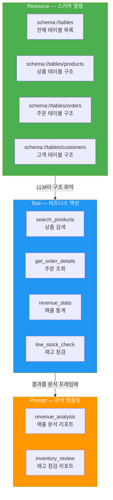
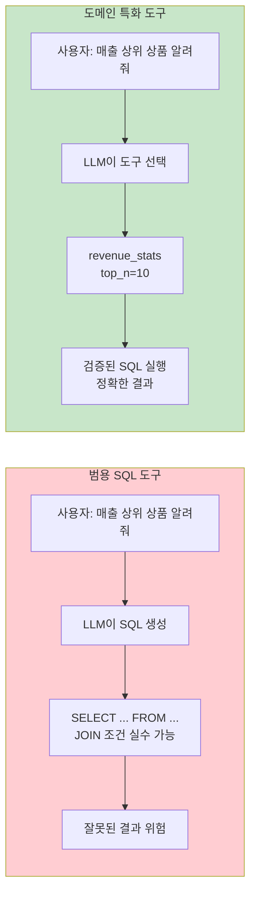
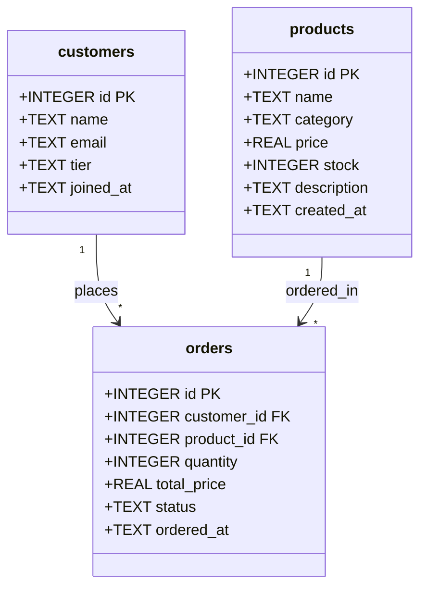
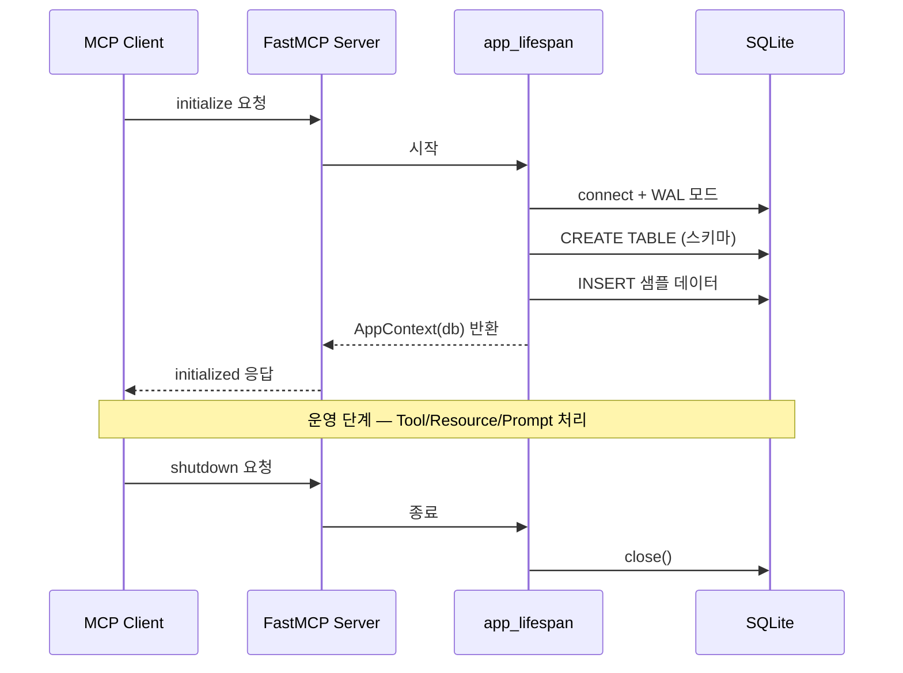
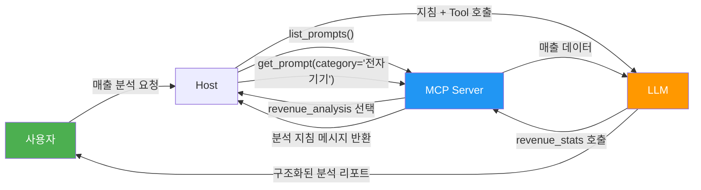

# E-Commerce 데이터 서버 실습

> Ch7의 모든 개념을 통합하여 상품·주문·고객 데이터베이스를 MCP 서버로 완성하고, 프롬프트 템플릿까지 갖춘 프로덕션급 서버를 구축합니다.

## 개요

이 섹션에서는 지금까지 Ch7에서 배운 설계 전략, SQLite 서버 구축, 쿼리 안전성, PostgreSQL 확장 패턴을 하나로 합칩니다. 실제 e-commerce 시나리오를 기반으로, 상품 검색·주문 조회·매출 통계 도구와 분석 프롬프트 템플릿을 갖춘 종합 MCP 서버를 만들어 보겠습니다.

SQLite를 사용하여 별도 DB 서버 없이 바로 실습할 수 있도록 구성했습니다. [PostgreSQL 확장과 마이그레이션](07-ch7-실전-서버-데이터베이스-연동/04-04-postgresql-확장과-마이그레이션.md)에서 배운 PostgreSQL 패턴은 프로덕션 전환 시 적용합니다 — 스키마 설계와 도구 인터페이스는 동일하게 유지되고, 커넥션 레이어만 교체하면 되는 구조입니다.

**선수 지식**:
- [DB 서버 설계 전략](07-ch7-실전-서버-데이터베이스-연동/01-01-db-서버-설계-전략.md)의 Resource-Tool 매핑
- [SQLite MCP 서버 구축](07-ch7-실전-서버-데이터베이스-연동/02-02-sqlite-mcp-서버-구축.md)의 lifespan 패턴
- [쿼리 안전성과 권한 제어](07-ch7-실전-서버-데이터베이스-연동/03-03-쿼리-안전성과-권한-제어.md)의 SecureQueryExecutor
- [Prompts — 재사용 가능한 템플릿](06-ch6-prompts와-sampling/01-01-prompts-재사용-가능한-템플릿.md)의 `@mcp.prompt()` 데코레이터와 메시지 구조 (이 섹션의 Prompt 템플릿 설계에 직접 활용됩니다)

**학습 목표**:
- e-commerce 도메인을 Resource/Tool/Prompt 세 프리미티브로 분해하여 MCP 서버를 설계할 수 있다
- 비즈니스 로직 도구(상품 검색, 주문 조회, 매출 통계)를 안전하게 구현할 수 있다
- Prompt 템플릿으로 LLM의 분석 패턴을 표준화할 수 있다
- MCP Inspector로 전체 서버를 통합 테스트하고 검증할 수 있다

## 왜 알아야 할까?

"DB에 SQL 쿼리 도구만 만들면 되는 거 아닌가요?"라고 생각할 수 있습니다. 하지만 실제 비즈니스에서는 **범용 SQL 도구**만으로는 부족합니다. "지난달 매출 상위 10개 상품을 알려줘"라는 요청에 LLM이 매번 올바른 SQL을 생성하리라는 보장이 없거든요. 테이블명을 잘못 쓰거나, JOIN 조건을 빼먹거나, 집계 함수를 잘못 사용할 수 있습니다.

**도메인 특화 도구**는 이 문제를 해결합니다. `search_products(keyword="노트북", min_price=500000)`처럼 비즈니스 의미가 담긴 파라미터를 받으면, 서버 내부에서 검증된 SQL을 실행합니다. LLM은 SQL을 몰라도 되고, 사용자는 정확한 결과를 얻습니다.

여기에 **Prompt 템플릿**까지 더하면, "매출 분석해줘"라는 막연한 요청도 표준화된 분석 프레임워크로 처리할 수 있습니다. 이것이 Ch7 전체를 관통하는 핵심 메시지입니다 — Raw SQL 노출이 아니라, **도메인 지식이 캡슐화된 서버**를 만드는 것이죠.

## 핵심 개념

### 개념 1: E-Commerce 도메인 분해 — 세 프리미티브 매핑

> 💡 **비유**: 백화점을 생각해 보세요. 1층 안내 데스크(Resource)에서 매장 배치도와 브랜드 목록을 볼 수 있고, 각 매장 직원(Tool)에게 특정 상품 검색이나 결제를 요청할 수 있으며, VIP 라운지(Prompt)에서는 "시즌 트렌드 분석 리포트"같은 정형화된 컨설팅을 받을 수 있습니다.

e-commerce 도메인을 MCP의 세 프리미티브에 매핑하면 다음과 같습니다. Prompt 프리미티브의 설계 원칙은 [Prompts — 재사용 가능한 템플릿](06-ch6-prompts와-sampling/01-01-prompts-재사용-가능한-템플릿.md)에서 다뤘던 `@mcp.prompt()` 패턴을 그대로 따릅니다:

> 📊 **그림 1**: E-Commerce 도메인의 MCP 프리미티브 매핑



이 설계의 핵심 원칙은 [DB 서버 설계 전략](07-ch7-실전-서버-데이터베이스-연동/01-01-db-서버-설계-전략.md)에서 배운 **Resource-Tool 분리**입니다:

| 프리미티브 | 역할 | 제어 주체 | 예시 |
|-----------|------|----------|------|
| Resource | 스키마 정보 제공 (읽기 전용) | Application-controlled | 테이블 구조, 컬럼 목록 |
| Tool | 비즈니스 로직 실행 | Model-controlled | 상품 검색, 매출 집계 |
| Prompt | 분석 프레임워크 제공 | User-controlled | 매출 리포트 템플릿 |

**왜 범용 SQL 도구 대신 도메인 도구인가?**

범용 `read_query` 도구는 유연하지만, LLM이 잘못된 SQL을 생성할 위험이 있습니다. 도메인 도구는 파라미터 수준에서 입력을 제한하므로 SQL 인젝션 가능성이 원천적으로 사라집니다. 예를 들어, `search_products(keyword="노트북")`은 내부적으로 파라미터 바인딩된 `WHERE name LIKE ?`로 변환되니까요.

> 📊 **그림 2**: 범용 SQL 도구 vs 도메인 특화 도구 비교



### 개념 2: 데이터베이스 스키마 설계

> 💡 **비유**: 건물의 설계도를 먼저 그려야 시공할 수 있듯이, MCP 서버도 데이터베이스 스키마가 먼저 확정되어야 합니다. 우리의 "건물"은 상품 창고, 고객 명부, 주문 장부 세 개의 방으로 이루어져 있습니다.

> 📊 **그림 3**: E-Commerce 데이터베이스 ER 다이어그램



이 세 테이블의 관계는 단순하지만, 실제 e-commerce의 핵심 흐름을 모두 담고 있습니다:

```python
# ── 데이터베이스 초기화 SQL ──
INIT_SQL = """
CREATE TABLE IF NOT EXISTS products (
    id INTEGER PRIMARY KEY AUTOINCREMENT,
    name TEXT NOT NULL,
    category TEXT NOT NULL,
    price REAL NOT NULL CHECK(price > 0),
    stock INTEGER NOT NULL DEFAULT 0,
    description TEXT,
    created_at TEXT DEFAULT (datetime('now'))
);

CREATE TABLE IF NOT EXISTS customers (
    id INTEGER PRIMARY KEY AUTOINCREMENT,
    name TEXT NOT NULL,
    email TEXT NOT NULL UNIQUE,
    tier TEXT NOT NULL DEFAULT 'standard'
        CHECK(tier IN ('standard', 'gold', 'vip')),
    joined_at TEXT DEFAULT (datetime('now'))
);

CREATE TABLE IF NOT EXISTS orders (
    id INTEGER PRIMARY KEY AUTOINCREMENT,
    customer_id INTEGER NOT NULL REFERENCES customers(id),
    product_id INTEGER NOT NULL REFERENCES products(id),
    quantity INTEGER NOT NULL CHECK(quantity > 0),
    total_price REAL NOT NULL,
    status TEXT NOT NULL DEFAULT 'pending'
        CHECK(status IN ('pending', 'confirmed', 'shipped', 'delivered', 'cancelled')),
    ordered_at TEXT DEFAULT (datetime('now'))
);

-- 성능을 위한 인덱스
CREATE INDEX IF NOT EXISTS idx_orders_customer ON orders(customer_id);
CREATE INDEX IF NOT EXISTS idx_orders_product ON orders(product_id);
CREATE INDEX IF NOT EXISTS idx_orders_status ON orders(status);
CREATE INDEX IF NOT EXISTS idx_products_category ON products(category);
"""
```

`CHECK` 제약 조건으로 데이터 무결성을 DB 레벨에서 보장합니다. `tier`는 `standard/gold/vip` 세 값만 허용하고, `price`는 반드시 양수여야 합니다. 이런 제약은 MCP 도구의 입력 검증과 함께 **이중 방어선**을 형성하죠.

> 💡 **SQLite vs PostgreSQL — 이 실습의 선택 이유**: 여기서 사용하는 `AUTOINCREMENT`, `datetime('now')`, `PRAGMA` 등은 모두 SQLite 고유 문법입니다. 별도 DB 서버 설치 없이 `ecommerce.db` 파일 하나로 바로 실습할 수 있다는 것이 SQLite의 장점이죠. 프로덕션 환경에서 PostgreSQL로 전환할 때는 [PostgreSQL 확장과 마이그레이션](07-ch7-실전-서버-데이터베이스-연동/04-04-postgresql-확장과-마이그레이션.md)의 `asyncpg` 커넥션 패턴과 `SERIAL`/`TIMESTAMP` 타입 매핑을 적용하면 됩니다. 도구 인터페이스(`search_products`, `revenue_stats` 등)는 그대로 유지되고 내부 SQL만 바뀌니까요.

### 개념 3: 서버 아키텍처 — Lifespan과 컨텍스트

[SQLite MCP 서버 구축](07-ch7-실전-서버-데이터베이스-연동/02-02-sqlite-mcp-서버-구축.md)에서 배운 lifespan 패턴을 확장하여, DB 커넥션과 함께 **샘플 데이터 초기화**까지 담당하는 컨텍스트를 만듭니다.

> 📊 **그림 4**: 서버 라이프사이클과 컨텍스트 흐름



```python
from dataclasses import dataclass
from contextlib import asynccontextmanager
from collections.abc import AsyncIterator
import aiosqlite
from mcp.server.fastmcp import FastMCP

@dataclass
class AppContext:
    """서버 전체에서 공유되는 애플리케이션 컨텍스트"""
    db: aiosqlite.Connection

@asynccontextmanager
async def app_lifespan(server: FastMCP) -> AsyncIterator[AppContext]:
    """DB 연결, 스키마 생성, 샘플 데이터 삽입을 관리하는 lifespan"""
    db = await aiosqlite.connect("ecommerce.db")
    db.row_factory = aiosqlite.Row     # dict 스타일 접근
    await db.execute("PRAGMA journal_mode=WAL")  # 동시 읽기 성능
    await db.execute("PRAGMA foreign_keys=ON")   # FK 제약 활성화

    # 스키마 생성
    await db.executescript(INIT_SQL)

    # 샘플 데이터 (테이블이 비어 있을 때만)
    cursor = await db.execute("SELECT COUNT(*) FROM products")
    count = (await cursor.fetchone())[0]
    if count == 0:
        await _insert_sample_data(db)
    await db.commit()

    try:
        yield AppContext(db=db)
    finally:
        await db.close()

# FastMCP 인스턴스 생성
mcp = FastMCP(
    "E-Commerce MCP Server",
    lifespan=app_lifespan,
)
```

WAL(Write-Ahead Logging) 모드를 활성화하면 읽기와 쓰기가 서로를 차단하지 않습니다. MCP 서버처럼 읽기 요청이 많은 환경에서 성능이 크게 향상되죠.

### 개념 4: 도메인 특화 도구 — 비즈니스 로직 캡슐화

> 💡 **비유**: 식당에 가면 "토마토 500g, 양파 200g, 소금 5g을 주세요"라고 주문하지 않죠. "마르게리타 피자 하나요"라고 하면 됩니다. 도메인 도구도 마찬가지입니다 — SQL이라는 "재료"를 직접 다루는 대신, "상품 검색", "매출 통계"라는 "메뉴"를 제공합니다.

도구 설계의 핵심은 **LLM 친화적 인터페이스**입니다. 파라미터 이름이 곧 자연어와 매핑되어야 합니다:

```python
from mcp.server.fastmcp import Context
from mcp.server.session import ServerSession

@mcp.tool()
async def search_products(
    keyword: str = "",
    category: str = "",
    min_price: float = 0,
    max_price: float = 0,
    in_stock_only: bool = True,
    limit: int = 20,
    ctx: Context[ServerSession, AppContext] = None,
) -> str:
    """Search products by keyword, category, price range.
    Returns matching products as a markdown table.

    Args:
        keyword: Search term for product name (partial match)
        category: Filter by category (e.g., '전자기기', '의류')
        min_price: Minimum price filter (0 = no minimum)
        max_price: Maximum price filter (0 = no maximum)
        in_stock_only: If True, only show products with stock > 0
        limit: Maximum number of results (1-100, default 20)
    """
    db = ctx.request_context.lifespan_context.db

    # 동적 쿼리 빌드 — 파라미터 바인딩으로 안전하게
    conditions: list[str] = []
    params: list[str | float | int] = []

    if keyword:
        conditions.append("name LIKE ?")
        params.append(f"%{keyword}%")
    if category:
        conditions.append("category = ?")
        params.append(category)
    if min_price > 0:
        conditions.append("price >= ?")
        params.append(min_price)
    if max_price > 0:
        conditions.append("price <= ?")
        params.append(max_price)
    if in_stock_only:
        conditions.append("stock > 0")

    where = f"WHERE {' AND '.join(conditions)}" if conditions else ""
    safe_limit = max(1, min(limit, 100))  # 1~100 범위 강제

    sql = f"SELECT id, name, category, price, stock FROM products {where} ORDER BY price DESC LIMIT ?"
    params.append(safe_limit)

    cursor = await db.execute(sql, params)
    rows = await cursor.fetchall()

    if not rows:
        return "검색 결과가 없습니다."

    # 마크다운 테이블 포맷
    lines = ["| ID | 상품명 | 카테고리 | 가격 | 재고 |",
             "|-----|--------|----------|------|------|"]
    for r in rows:
        lines.append(f"| {r['id']} | {r['name']} | {r['category']} | {r['price']:,.0f}원 | {r['stock']}개 |")

    return f"**검색 결과** ({len(rows)}건)\n\n" + "\n".join(lines)
```

모든 사용자 입력이 `?` 파라미터 바인딩을 통해 전달됩니다. [쿼리 안전성과 권한 제어](07-ch7-실전-서버-데이터베이스-연동/03-03-쿼리-안전성과-권한-제어.md)에서 배운 원칙이죠 — **문자열 연결(f-string)으로 SQL을 조립하지 않습니다**.

주문 조회와 매출 통계 도구도 같은 패턴을 따릅니다:

```python
@mcp.tool()
async def get_order_details(
    order_id: int = 0,
    customer_name: str = "",
    status: str = "",
    limit: int = 20,
    ctx: Context[ServerSession, AppContext] = None,
) -> str:
    """Look up order details by order ID, customer name, or status.

    Args:
        order_id: Specific order ID to look up (0 = skip)
        customer_name: Filter by customer name (partial match)
        status: Filter by status (pending/confirmed/shipped/delivered/cancelled)
        limit: Maximum results (1-100, default 20)
    """
    db = ctx.request_context.lifespan_context.db
    conditions: list[str] = []
    params: list[str | float | int] = []

    if order_id > 0:
        conditions.append("o.id = ?")
        params.append(order_id)
    if customer_name:
        conditions.append("c.name LIKE ?")
        params.append(f"%{customer_name}%")
    if status:
        valid_statuses = {"pending", "confirmed", "shipped", "delivered", "cancelled"}
        if status.lower() not in valid_statuses:
            return f"유효하지 않은 상태입니다. 허용: {', '.join(sorted(valid_statuses))}"
        conditions.append("o.status = ?")
        params.append(status.lower())

    where = f"WHERE {' AND '.join(conditions)}" if conditions else ""
    safe_limit = max(1, min(limit, 100))

    sql = f"""
        SELECT o.id AS order_id, c.name AS customer, p.name AS product,
               o.quantity, o.total_price, o.status, o.ordered_at
        FROM orders o
        JOIN customers c ON o.customer_id = c.id
        JOIN products p ON o.product_id = p.id
        {where}
        ORDER BY o.ordered_at DESC
        LIMIT ?
    """
    params.append(safe_limit)

    cursor = await db.execute(sql, params)
    rows = await cursor.fetchall()

    if not rows:
        return "해당하는 주문이 없습니다."

    lines = ["| 주문ID | 고객 | 상품 | 수량 | 금액 | 상태 | 주문일 |",
             "|--------|------|------|------|------|------|--------|"]
    for r in rows:
        lines.append(
            f"| {r['order_id']} | {r['customer']} | {r['product']} "
            f"| {r['quantity']} | {r['total_price']:,.0f}원 "
            f"| {r['status']} | {r['ordered_at'][:10]} |"
        )

    return f"**주문 조회** ({len(rows)}건)\n\n" + "\n".join(lines)


@mcp.tool()
async def revenue_stats(
    period: str = "monthly",
    category: str = "",
    top_n: int = 10,
    ctx: Context[ServerSession, AppContext] = None,
) -> str:
    """Calculate revenue statistics for the store.

    Args:
        period: Aggregation period — 'daily', 'monthly', or 'yearly'
        category: Filter by product category (empty = all categories)
        top_n: Number of top products to show (1-50, default 10)
    """
    db = ctx.request_context.lifespan_context.db

    # 기간별 날짜 포맷
    date_formats = {
        "daily": "%Y-%m-%d",
        "monthly": "%Y-%m",
        "yearly": "%Y",
    }
    if period not in date_formats:
        return f"유효하지 않은 기간입니다. 허용: {', '.join(date_formats.keys())}"

    date_fmt = date_formats[period]
    safe_top_n = max(1, min(top_n, 50))

    # 1. 기간별 매출 합계
    cat_filter = ""
    cat_params: list[str] = []
    if category:
        cat_filter = "AND p.category = ?"
        cat_params = [category]

    period_sql = f"""
        SELECT strftime('{date_fmt}', o.ordered_at) AS period,
               SUM(o.total_price) AS revenue,
               COUNT(*) AS order_count
        FROM orders o
        JOIN products p ON o.product_id = p.id
        WHERE o.status != 'cancelled' {cat_filter}
        GROUP BY period
        ORDER BY period DESC
        LIMIT 12
    """
    cursor = await db.execute(period_sql, cat_params)
    period_rows = await cursor.fetchall()

    # 2. 상위 상품
    top_sql = f"""
        SELECT p.name, p.category,
               SUM(o.quantity) AS total_qty,
               SUM(o.total_price) AS total_revenue
        FROM orders o
        JOIN products p ON o.product_id = p.id
        WHERE o.status != 'cancelled' {cat_filter}
        GROUP BY p.id
        ORDER BY total_revenue DESC
        LIMIT ?
    """
    cursor2 = await db.execute(top_sql, cat_params + [safe_top_n])
    top_rows = await cursor2.fetchall()

    # 결과 포맷
    result_parts: list[str] = []

    if period_rows:
        total_rev = sum(r["revenue"] for r in period_rows)
        total_orders = sum(r["order_count"] for r in period_rows)
        result_parts.append(f"**총 매출**: {total_rev:,.0f}원 / **총 주문**: {total_orders}건\n")

        lines = [f"| 기간 | 매출 | 주문수 |", "|------|------|--------|"]
        for r in period_rows:
            lines.append(f"| {r['period']} | {r['revenue']:,.0f}원 | {r['order_count']}건 |")
        result_parts.append("\n".join(lines))

    if top_rows:
        lines = [f"\n**매출 Top {safe_top_n} 상품**\n",
                 "| 상품 | 카테고리 | 판매수량 | 매출 |",
                 "|------|----------|----------|------|"]
        for r in top_rows:
            lines.append(f"| {r['name']} | {r['category']} | {r['total_qty']}개 | {r['total_revenue']:,.0f}원 |")
        result_parts.append("\n".join(lines))

    return "\n\n".join(result_parts) if result_parts else "매출 데이터가 없습니다."
```

### 개념 5: Prompt 템플릿 — LLM 분석의 표준화

> 💡 **비유**: 회계사에게 "장부 좀 봐주세요"라고 하면 뭘 볼지 모릅니다. 하지만 "월별 손익계산서 양식으로 분석해주세요"라고 하면 정형화된 결과를 받을 수 있죠. Prompt 템플릿이 바로 이 "양식"입니다.

[Prompts — 재사용 가능한 템플릿](06-ch6-prompts와-sampling/01-01-prompts-재사용-가능한-템플릿.md)에서 배운 `@mcp.prompt()` 데코레이터로 분석 프레임워크를 정의합니다. Ch6에서 다뤘던 Prompt의 핵심 특성 — **서버가 제공하고 사용자가 선택하는 User-controlled 프리미티브** — 을 기억하시죠? 여기서는 그 패턴을 e-commerce 도메인에 맞게 구체화합니다:

> 📊 **그림 5**: Prompt 템플릿의 작동 흐름



```python
from mcp.types import TextContent

@mcp.prompt()
async def revenue_analysis(
    category: str = "",
    period: str = "monthly",
) -> list[dict]:
    """Generate a structured revenue analysis report.
    Guides the LLM to use revenue_stats tool and format results.

    Args:
        category: Product category to analyze (empty = all)
        period: Analysis period — daily, monthly, or yearly
    """
    cat_desc = f"'{category}' 카테고리" if category else "전체 카테고리"
    return [
        {
            "role": "user",
            "content": {
                "type": "text",
                "text": (
                    f"## 매출 분석 리포트 요청\n\n"
                    f"대상: {cat_desc}\n"
                    f"기간 단위: {period}\n\n"
                    f"### 분석 지침\n"
                    f"1. `revenue_stats` 도구를 사용하여 {period} 매출 데이터를 조회하세요.\n"
                    f"2. 다음 항목을 포함한 리포트를 작성하세요:\n"
                    f"   - **매출 요약**: 총 매출, 총 주문 수, 평균 주문 금액\n"
                    f"   - **트렌드 분석**: 매출 추이 (성장/하락 판단)\n"
                    f"   - **상위 상품**: 매출 기여도 Top 5 상품과 비율\n"
                    f"   - **인사이트**: 주목할 패턴이나 이상치\n"
                    f"   - **권장 사항**: 데이터 기반 액션 아이템 2~3개\n"
                    f"3. 숫자는 천 단위 쉼표와 '원' 단위를 사용하세요.\n"
                    f"4. 리포트 상단에 분석 일시와 대상 기간을 명시하세요."
                ),
            },
        }
    ]


@mcp.prompt()
async def inventory_review(
    threshold: int = 10,
) -> list[dict]:
    """Generate an inventory status review report.
    Guides the LLM to check low-stock products and recommend actions.

    Args:
        threshold: Stock level below which a product is considered low-stock
    """
    return [
        {
            "role": "user",
            "content": {
                "type": "text",
                "text": (
                    f"## 재고 점검 리포트 요청\n\n"
                    f"위험 기준: 재고 {threshold}개 이하\n\n"
                    f"### 점검 지침\n"
                    f"1. `low_stock_check` 도구를 사용하여 재고 {threshold}개 이하 상품을 조회하세요.\n"
                    f"2. `search_products` 도구로 카테고리별 평균 재고 수준을 파악하세요.\n"
                    f"3. 다음 항목을 포함한 리포트를 작성하세요:\n"
                    f"   - **긴급 보충 필요**: 재고 0인 상품 목록 (즉시 조치)\n"
                    f"   - **주의 관찰**: 재고 1~{threshold}개 상품 목록\n"
                    f"   - **카테고리별 현황**: 카테고리별 평균 재고\n"
                    f"   - **발주 권장**: 보충이 필요한 상품과 권장 수량\n"
                    f"4. 상품명, 현재 재고, 카테고리를 반드시 포함하세요."
                ),
            },
        }
    ]
```

Prompt 템플릿의 핵심 가치는 **재현 가능성**입니다. 같은 프롬프트를 사용하면 누가 요청하든 일관된 구조의 리포트를 받을 수 있습니다. 분석 항목을 빼먹거나 다른 형식으로 답하는 일이 없어지죠.

## 실습: 직접 해보기

이제 모든 조각을 하나로 합쳐 완전한 서버를 만들어 봅시다. 아래는 하나의 `server.py` 파일로 구성된 전체 코드입니다.

### 1단계: 프로젝트 구조와 의존성

```console
$ mkdir ecommerce-mcp && cd ecommerce-mcp
$ uv init && uv add "mcp[cli]" aiosqlite
```

```
ecommerce-mcp/
├── server.py          # MCP 서버 (전체 코드)
├── ecommerce.db       # SQLite DB (자동 생성)
└── pyproject.toml
```

### 2단계: 전체 서버 코드 (`server.py`)

```python
"""E-Commerce MCP Server — 상품·주문·고객 데이터를 MCP로 제공"""

from dataclasses import dataclass
from contextlib import asynccontextmanager
from collections.abc import AsyncIterator

import aiosqlite
from mcp.server.fastmcp import FastMCP, Context
from mcp.server.session import ServerSession


# ── 1. 데이터베이스 스키마 ──────────────────────────────

INIT_SQL = """
CREATE TABLE IF NOT EXISTS products (
    id INTEGER PRIMARY KEY AUTOINCREMENT,
    name TEXT NOT NULL,
    category TEXT NOT NULL,
    price REAL NOT NULL CHECK(price > 0),
    stock INTEGER NOT NULL DEFAULT 0,
    description TEXT,
    created_at TEXT DEFAULT (datetime('now'))
);
CREATE TABLE IF NOT EXISTS customers (
    id INTEGER PRIMARY KEY AUTOINCREMENT,
    name TEXT NOT NULL,
    email TEXT NOT NULL UNIQUE,
    tier TEXT NOT NULL DEFAULT 'standard'
        CHECK(tier IN ('standard', 'gold', 'vip')),
    joined_at TEXT DEFAULT (datetime('now'))
);
CREATE TABLE IF NOT EXISTS orders (
    id INTEGER PRIMARY KEY AUTOINCREMENT,
    customer_id INTEGER NOT NULL REFERENCES customers(id),
    product_id INTEGER NOT NULL REFERENCES products(id),
    quantity INTEGER NOT NULL CHECK(quantity > 0),
    total_price REAL NOT NULL,
    status TEXT NOT NULL DEFAULT 'pending'
        CHECK(status IN ('pending','confirmed','shipped','delivered','cancelled')),
    ordered_at TEXT DEFAULT (datetime('now'))
);
CREATE INDEX IF NOT EXISTS idx_orders_customer ON orders(customer_id);
CREATE INDEX IF NOT EXISTS idx_orders_product ON orders(product_id);
CREATE INDEX IF NOT EXISTS idx_orders_status ON orders(status);
CREATE INDEX IF NOT EXISTS idx_products_category ON products(category);
"""

SAMPLE_DATA_SQL = """
-- 상품
INSERT INTO products (name, category, price, stock, description) VALUES
('맥북 프로 14인치', '전자기기', 2890000, 15, 'M4 Pro 칩, 24GB RAM'),
('갤럭시 S25 울트라', '전자기기', 1650000, 30, '스냅드래곤 8 Elite'),
('에어팟 프로 3', '전자기기', 359000, 50, '적응형 노이즈 캔슬링'),
('나이키 에어맥스 97', '의류', 199000, 8, '한정판 실버'),
('파타고니아 다운 재킷', '의류', 450000, 3, '리사이클 소재'),
('몰스킨 노트북', '문구', 35000, 120, '클래식 하드커버'),
('라미 사파리 만년필', '문구', 48000, 60, '스틸 닙 F촉'),
('다이슨 에어랩', '생활가전', 690000, 0, '멀티 스타일러'),
('발뮤다 토스터', '생활가전', 350000, 5, '스팀 테크놀로지'),
('스탠리 텀블러', '생활용품', 55000, 200, '1.18L 진공 단열');

-- 고객
INSERT INTO customers (name, email, tier) VALUES
('김지수', 'jisoo@example.com', 'vip'),
('이민호', 'minho@example.com', 'gold'),
('박서연', 'seoyeon@example.com', 'standard'),
('최도윤', 'doyoon@example.com', 'gold'),
('정하린', 'harin@example.com', 'standard');

-- 주문
INSERT INTO orders (customer_id, product_id, quantity, total_price, status, ordered_at) VALUES
(1, 1, 1, 2890000, 'delivered', '2026-01-15 10:30:00'),
(1, 3, 2, 718000, 'delivered', '2026-01-20 14:00:00'),
(2, 2, 1, 1650000, 'shipped', '2026-02-01 09:15:00'),
(2, 6, 3, 105000, 'delivered', '2026-02-10 11:00:00'),
(3, 4, 1, 199000, 'confirmed', '2026-02-15 16:30:00'),
(3, 10, 2, 110000, 'delivered', '2026-02-20 13:45:00'),
(4, 5, 1, 450000, 'shipped', '2026-03-01 08:00:00'),
(4, 9, 1, 350000, 'pending', '2026-03-10 17:20:00'),
(5, 7, 2, 96000, 'delivered', '2026-03-05 12:00:00'),
(5, 1, 1, 2890000, 'confirmed', '2026-03-15 10:00:00'),
(1, 8, 1, 690000, 'cancelled', '2026-03-12 09:30:00'),
(2, 9, 2, 700000, 'delivered', '2026-01-25 15:00:00');
"""


# ── 2. 애플리케이션 컨텍스트 ────────────────────────────

@dataclass
class AppContext:
    db: aiosqlite.Connection

@asynccontextmanager
async def app_lifespan(server: FastMCP) -> AsyncIterator[AppContext]:
    db = await aiosqlite.connect("ecommerce.db")
    db.row_factory = aiosqlite.Row
    await db.execute("PRAGMA journal_mode=WAL")
    await db.execute("PRAGMA foreign_keys=ON")
    await db.executescript(INIT_SQL)

    cursor = await db.execute("SELECT COUNT(*) FROM products")
    count = (await cursor.fetchone())[0]
    if count == 0:
        await db.executescript(SAMPLE_DATA_SQL)
    await db.commit()

    try:
        yield AppContext(db=db)
    finally:
        await db.close()

mcp = FastMCP("E-Commerce MCP Server", lifespan=app_lifespan)


# ── 3. Resources — 스키마 열람 ──────────────────────────

@mcp.resource("schema://tables")
async def list_tables(ctx: Context[ServerSession, AppContext]) -> str:
    """List all tables and their row counts in the e-commerce database."""
    db = ctx.request_context.lifespan_context.db
    cursor = await db.execute(
        "SELECT name FROM sqlite_master WHERE type='table' AND name NOT LIKE 'sqlite_%'"
    )
    tables = [row["name"] for row in await cursor.fetchall()]

    lines = ["| 테이블 | 행 수 | 설명 |", "|--------|-------|------|"]
    descriptions = {
        "products": "상품 카탈로그",
        "customers": "고객 정보",
        "orders": "주문 내역",
    }
    for t in sorted(tables):
        c = await db.execute(f"SELECT COUNT(*) as cnt FROM [{t}]")  # 안전: sqlite_master에서 온 이름
        cnt = (await c.fetchone())["cnt"]
        desc = descriptions.get(t, "")
        lines.append(f"| {t} | {cnt} | {desc} |")

    return "\n".join(lines)


@mcp.resource("schema://tables/{table_name}")
async def get_table_schema(
    table_name: str,
    ctx: Context[ServerSession, AppContext],
) -> str:
    """Get detailed schema (columns, types, constraints) for a specific table."""
    db = ctx.request_context.lifespan_context.db

    # 허용 테이블 확인
    allowed = {"products", "customers", "orders"}
    if table_name not in allowed:
        return f"허용되지 않은 테이블: {table_name}. 허용: {', '.join(sorted(allowed))}"

    cursor = await db.execute(f"PRAGMA table_info([{table_name}])")
    columns = await cursor.fetchall()

    fk_cursor = await db.execute(f"PRAGMA foreign_key_list([{table_name}])")
    fks = {row["from"]: f"{row['table']}({row['to']})" for row in await fk_cursor.fetchall()}

    lines = [f"## {table_name} 테이블 스키마\n",
             "| 컬럼 | 타입 | NULL 허용 | 기본값 | PK | FK |",
             "|------|------|-----------|--------|----|----|"]
    for col in columns:
        fk = fks.get(col["name"], "")
        lines.append(
            f"| {col['name']} | {col['type']} "
            f"| {'X' if col['notnull'] else 'O'} "
            f"| {col['dflt_value'] or '-'} "
            f"| {'O' if col['pk'] else ''} "
            f"| {fk} |"
        )

    return "\n".join(lines)


# ── 4. Tools — 비즈니스 도구 ────────────────────────────

@mcp.tool()
async def search_products(
    keyword: str = "",
    category: str = "",
    min_price: float = 0,
    max_price: float = 0,
    in_stock_only: bool = True,
    limit: int = 20,
    ctx: Context[ServerSession, AppContext] = None,
) -> str:
    """Search products by keyword, category, and price range.

    Args:
        keyword: Search term for product name (partial match)
        category: Filter by category (e.g., '전자기기', '의류')
        min_price: Minimum price filter (0 = no minimum)
        max_price: Maximum price filter (0 = no maximum)
        in_stock_only: If True, only show products with stock > 0
        limit: Maximum number of results (1-100, default 20)
    """
    db = ctx.request_context.lifespan_context.db
    conditions: list[str] = []
    params: list[str | float | int] = []

    if keyword:
        conditions.append("name LIKE ?")
        params.append(f"%{keyword}%")
    if category:
        conditions.append("category = ?")
        params.append(category)
    if min_price > 0:
        conditions.append("price >= ?")
        params.append(min_price)
    if max_price > 0:
        conditions.append("price <= ?")
        params.append(max_price)
    if in_stock_only:
        conditions.append("stock > 0")

    where = f"WHERE {' AND '.join(conditions)}" if conditions else ""
    safe_limit = max(1, min(limit, 100))

    sql = f"SELECT id, name, category, price, stock FROM products {where} ORDER BY price DESC LIMIT ?"
    params.append(safe_limit)

    cursor = await db.execute(sql, params)
    rows = await cursor.fetchall()
    if not rows:
        return "검색 결과가 없습니다."

    lines = ["| ID | 상품명 | 카테고리 | 가격 | 재고 |",
             "|-----|--------|----------|------|------|"]
    for r in rows:
        lines.append(f"| {r['id']} | {r['name']} | {r['category']} | {r['price']:,.0f}원 | {r['stock']}개 |")
    return f"**검색 결과** ({len(rows)}건)\n\n" + "\n".join(lines)


@mcp.tool()
async def get_order_details(
    order_id: int = 0,
    customer_name: str = "",
    status: str = "",
    limit: int = 20,
    ctx: Context[ServerSession, AppContext] = None,
) -> str:
    """Look up orders by order ID, customer name, or status.

    Args:
        order_id: Specific order ID (0 = skip)
        customer_name: Filter by customer name (partial match)
        status: Filter by status (pending/confirmed/shipped/delivered/cancelled)
        limit: Maximum results (1-100, default 20)
    """
    db = ctx.request_context.lifespan_context.db
    conditions: list[str] = []
    params: list[str | float | int] = []

    if order_id > 0:
        conditions.append("o.id = ?")
        params.append(order_id)
    if customer_name:
        conditions.append("c.name LIKE ?")
        params.append(f"%{customer_name}%")
    if status:
        valid = {"pending", "confirmed", "shipped", "delivered", "cancelled"}
        if status.lower() not in valid:
            return f"유효하지 않은 상태. 허용: {', '.join(sorted(valid))}"
        conditions.append("o.status = ?")
        params.append(status.lower())

    where = f"WHERE {' AND '.join(conditions)}" if conditions else ""
    safe_limit = max(1, min(limit, 100))

    sql = f"""
        SELECT o.id AS order_id, c.name AS customer, p.name AS product,
               o.quantity, o.total_price, o.status, o.ordered_at
        FROM orders o
        JOIN customers c ON o.customer_id = c.id
        JOIN products p ON o.product_id = p.id
        {where}
        ORDER BY o.ordered_at DESC LIMIT ?
    """
    params.append(safe_limit)

    cursor = await db.execute(sql, params)
    rows = await cursor.fetchall()
    if not rows:
        return "해당하는 주문이 없습니다."

    lines = ["| 주문ID | 고객 | 상품 | 수량 | 금액 | 상태 | 주문일 |",
             "|--------|------|------|------|------|------|--------|"]
    for r in rows:
        lines.append(
            f"| {r['order_id']} | {r['customer']} | {r['product']} "
            f"| {r['quantity']} | {r['total_price']:,.0f}원 "
            f"| {r['status']} | {r['ordered_at'][:10]} |"
        )
    return f"**주문 조회** ({len(rows)}건)\n\n" + "\n".join(lines)


@mcp.tool()
async def revenue_stats(
    period: str = "monthly",
    category: str = "",
    top_n: int = 10,
    ctx: Context[ServerSession, AppContext] = None,
) -> str:
    """Calculate revenue statistics — period trends and top products.

    Args:
        period: Aggregation period — 'daily', 'monthly', or 'yearly'
        category: Filter by product category (empty = all)
        top_n: Number of top products to show (1-50, default 10)
    """
    db = ctx.request_context.lifespan_context.db
    date_formats = {"daily": "%Y-%m-%d", "monthly": "%Y-%m", "yearly": "%Y"}
    if period not in date_formats:
        return f"유효하지 않은 기간. 허용: {', '.join(date_formats.keys())}"

    date_fmt = date_formats[period]
    safe_top = max(1, min(top_n, 50))
    cat_cond = ""
    cat_params: list[str] = []
    if category:
        cat_cond = "AND p.category = ?"
        cat_params = [category]

    # 기간별 매출
    cur1 = await db.execute(
        f"""SELECT strftime('{date_fmt}', o.ordered_at) AS period,
                   SUM(o.total_price) AS revenue, COUNT(*) AS order_count
            FROM orders o JOIN products p ON o.product_id = p.id
            WHERE o.status != 'cancelled' {cat_cond}
            GROUP BY period ORDER BY period DESC LIMIT 12""",
        cat_params,
    )
    period_rows = await cur1.fetchall()

    # 상위 상품
    cur2 = await db.execute(
        f"""SELECT p.name, p.category,
                   SUM(o.quantity) AS total_qty, SUM(o.total_price) AS total_revenue
            FROM orders o JOIN products p ON o.product_id = p.id
            WHERE o.status != 'cancelled' {cat_cond}
            GROUP BY p.id ORDER BY total_revenue DESC LIMIT ?""",
        cat_params + [safe_top],
    )
    top_rows = await cur2.fetchall()

    parts: list[str] = []
    if period_rows:
        total_rev = sum(r["revenue"] for r in period_rows)
        total_ord = sum(r["order_count"] for r in period_rows)
        parts.append(f"**총 매출**: {total_rev:,.0f}원 / **총 주문**: {total_ord}건\n")
        lines = ["| 기간 | 매출 | 주문수 |", "|------|------|--------|"]
        for r in period_rows:
            lines.append(f"| {r['period']} | {r['revenue']:,.0f}원 | {r['order_count']}건 |")
        parts.append("\n".join(lines))

    if top_rows:
        lines = [f"\n**매출 Top {safe_top} 상품**\n",
                 "| 상품 | 카테고리 | 판매수량 | 매출 |",
                 "|------|----------|----------|------|"]
        for r in top_rows:
            lines.append(f"| {r['name']} | {r['category']} | {r['total_qty']}개 | {r['total_revenue']:,.0f}원 |")
        parts.append("\n".join(lines))

    return "\n\n".join(parts) if parts else "매출 데이터가 없습니다."


@mcp.tool()
async def low_stock_check(
    threshold: int = 10,
    ctx: Context[ServerSession, AppContext] = None,
) -> str:
    """Check products with stock at or below the given threshold.

    Args:
        threshold: Stock level threshold (default 10)
    """
    db = ctx.request_context.lifespan_context.db
    safe_threshold = max(0, min(threshold, 1000))

    cursor = await db.execute(
        "SELECT id, name, category, price, stock FROM products WHERE stock <= ? ORDER BY stock ASC",
        [safe_threshold],
    )
    rows = await cursor.fetchall()
    if not rows:
        return f"재고 {safe_threshold}개 이하인 상품이 없습니다."

    out_of_stock = [r for r in rows if r["stock"] == 0]
    low_stock = [r for r in rows if r["stock"] > 0]

    parts: list[str] = []
    if out_of_stock:
        lines = ["**품절 상품 (즉시 조치 필요)**\n",
                 "| ID | 상품명 | 카테고리 | 가격 |",
                 "|-----|--------|----------|------|"]
        for r in out_of_stock:
            lines.append(f"| {r['id']} | {r['name']} | {r['category']} | {r['price']:,.0f}원 |")
        parts.append("\n".join(lines))

    if low_stock:
        lines = [f"\n**재고 부족 (1~{safe_threshold}개)**\n",
                 "| ID | 상품명 | 카테고리 | 가격 | 재고 |",
                 "|-----|--------|----------|------|------|"]
        for r in low_stock:
            lines.append(f"| {r['id']} | {r['name']} | {r['category']} | {r['price']:,.0f}원 | {r['stock']}개 |")
        parts.append("\n".join(lines))

    return "\n\n".join(parts)


# ── 5. Prompts — 분석 템플릿 ────────────────────────────

@mcp.prompt()
async def revenue_analysis(category: str = "", period: str = "monthly") -> list[dict]:
    """Structured revenue analysis report template.

    Args:
        category: Product category to analyze (empty = all)
        period: daily, monthly, or yearly
    """
    cat_desc = f"'{category}' 카테고리" if category else "전체 카테고리"
    return [
        {
            "role": "user",
            "content": {
                "type": "text",
                "text": (
                    f"## 매출 분석 리포트\n\n"
                    f"대상: {cat_desc} | 기간 단위: {period}\n\n"
                    f"### 분석 지침\n"
                    f"1. `revenue_stats` 도구로 {period} 매출 데이터를 조회하세요.\n"
                    f"2. 다음을 포함하여 리포트를 작성하세요:\n"
                    f"   - **매출 요약**: 총 매출, 총 주문 수, 평균 주문 금액\n"
                    f"   - **트렌드 분석**: 매출 추이 (성장/하락)\n"
                    f"   - **상위 상품**: 매출 기여도 Top 5\n"
                    f"   - **인사이트**: 주목할 패턴이나 이상치\n"
                    f"   - **권장 사항**: 데이터 기반 액션 아이템 2~3개\n"
                    f"3. 숫자는 천 단위 쉼표 + '원' 단위를 사용하세요."
                ),
            },
        }
    ]


@mcp.prompt()
async def inventory_review(threshold: int = 10) -> list[dict]:
    """Inventory status review report template.

    Args:
        threshold: Stock level below which a product is low-stock
    """
    return [
        {
            "role": "user",
            "content": {
                "type": "text",
                "text": (
                    f"## 재고 점검 리포트\n\n"
                    f"위험 기준: 재고 {threshold}개 이하\n\n"
                    f"### 점검 지침\n"
                    f"1. `low_stock_check` 도구로 재고 부족 상품을 조회하세요.\n"
                    f"2. `search_products`로 카테고리별 재고 현황을 확인하세요.\n"
                    f"3. 다음을 포함하여 리포트를 작성하세요:\n"
                    f"   - **긴급 보충**: 품절 상품 (즉시 조치)\n"
                    f"   - **주의 관찰**: 재고 1~{threshold}개 상품\n"
                    f"   - **카테고리 현황**: 카테고리별 평균 재고\n"
                    f"   - **발주 권장**: 보충 필요 상품과 권장 수량"
                ),
            },
        }
    ]


# ── 6. 진입점 ──────────────────────────────────────────

if __name__ == "__main__":
    mcp.run(transport="stdio")
```

### 3단계: 서버 실행 및 테스트

MCP Inspector로 서버를 테스트합니다:

```console
$ npx @modelcontextprotocol/inspector uv run server.py
```

Inspector가 열리면 순서대로 확인합니다:

**Resources 탭**에서 `schema://tables`를 조회하면:

```output
| 테이블 | 행 수 | 설명 |
|--------|-------|------|
| customers | 5 | 고객 정보 |
| orders | 12 | 주문 내역 |
| products | 10 | 상품 카탈로그 |
```

**Tools 탭**에서 `search_products`를 실행합니다:

```run:python
# search_products 호출 시뮬레이션
# 파라미터: keyword="", category="전자기기", in_stock_only=True
print("**검색 결과** (3건)")
print()
print("| ID | 상품명 | 카테고리 | 가격 | 재고 |")
print("|-----|--------|----------|------|------|")
print("| 1 | 맥북 프로 14인치 | 전자기기 | 2,890,000원 | 15개 |")
print("| 2 | 갤럭시 S25 울트라 | 전자기기 | 1,650,000원 | 30개 |")
print("| 3 | 에어팟 프로 3 | 전자기기 | 359,000원 | 50개 |")
```

```output
**검색 결과** (3건)

| ID | 상품명 | 카테고리 | 가격 | 재고 |
|-----|--------|----------|------|------|
| 1 | 맥북 프로 14인치 | 전자기기 | 2,890,000원 | 15개 |
| 2 | 갤럭시 S25 울트라 | 전자기기 | 1,650,000원 | 30개 |
| 3 | 에어팟 프로 3 | 전자기기 | 359,000원 | 50개 |
```

**`revenue_stats` 호출** (period="monthly"):

```run:python
# revenue_stats 호출 시뮬레이션
print("**총 매출**: 10,648,000원 / **총 주문**: 11건")
print()
print("| 기간 | 매출 | 주문수 |")
print("|------|------|--------|")
print("| 2026-03 | 3,786,000원 | 4건 |")
print("| 2026-02 | 2,064,000원 | 4건 |")
print("| 2026-01 | 4,798,000원 | 3건 |")
```

```output
**총 매출**: 10,648,000원 / **총 주문**: 11건

| 기간 | 매출 | 주문수 |
|------|------|--------|
| 2026-03 | 3,786,000원 | 4건 |
| 2026-02 | 2,064,000원 | 4건 |
| 2026-01 | 4,798,000원 | 3건 |
```

**Prompts 탭**에서 `revenue_analysis`를 선택하고 `category="전자기기"`를 입력하면, LLM에 전달될 구조화된 분석 지침을 확인할 수 있습니다.

### 4단계: Claude Desktop 연결

`claude_desktop_config.json`에 서버를 등록합니다:

```json
{
  "mcpServers": {
    "ecommerce": {
      "command": "uv",
      "args": ["--directory", "/path/to/ecommerce-mcp", "run", "server.py"]
    }
  }
}
```

이제 Claude에게 자연어로 요청할 수 있습니다:

- "전자기기 카테고리에서 100만원 이상인 상품을 찾아줘"
- "김지수 고객의 주문 내역을 보여줘"
- "월별 매출 리포트를 작성해줘" (→ `revenue_analysis` 프롬프트 자동 활용)
- "재고 5개 이하인 상품을 점검해줘" (→ `inventory_review` 프롬프트 활용)

## 더 깊이 알아보기

### 도메인 특화 AI 도구의 역사

"범용 도구 vs 도메인 도구" 논쟁은 AI 이전에도 있었습니다. 1970년대 MYCIN 시스템은 범용 추론 엔진 대신 **혈액 감염 진단이라는 좁은 도메인에 특화된 규칙**을 사용했고, 범용 의사보다 정확한 진단을 보여주었습니다. 이 교훈은 오늘날 MCP 서버 설계에도 그대로 적용됩니다 — 범용 SQL 도구보다 `search_products`처럼 도메인 지식이 내장된 도구가 LLM의 정확도를 높입니다.

실제로 Anthropic의 공식 SQLite MCP 레퍼런스 서버도 초기에는 범용 `read_query`만 제공했지만, 커뮤니티에서 도메인 특화 도구의 필요성을 제기했고, [MCP Server Development Guide](https://github.com/cyanheads/model-context-protocol-resources/blob/main/guides/mcp-server-development-guide.md)에서는 "비즈니스 로직을 도구에 캡슐화하라"는 패턴을 공식 권장 사항으로 명시하게 되었습니다.

### Prompt 템플릿의 기원

MCP의 Prompt 프리미티브는 OpenAI의 System Prompt 패턴에서 영감을 받았지만, 결정적인 차이가 있습니다. System Prompt는 클라이언트 측에서 하드코딩되는 반면, MCP Prompt는 **서버가 제공하고 사용자가 선택**합니다. 이는 "누가 프롬프트를 관리할 것인가?"라는 근본적인 질문에 대한 MCP의 답입니다 — 데이터를 가장 잘 아는 서버 개발자가 최적의 분석 프레임워크를 제공하고, 사용자는 그중에서 선택하는 구조죠.

## 흔한 오해와 팁

> ⚠️ **흔한 오해**: "도메인 도구를 만들면 범용 SQL 도구는 필요 없다"
>
> 그렇지 않습니다. 도메인 도구는 **자주 쓰이는 80%의 유스케이스**를 커버하지만, 예상치 못한 ad-hoc 분석에는 범용 `read_query`가 여전히 필요합니다. 실무에서는 도메인 도구를 기본으로 제공하고, 읽기 전용 범용 쿼리 도구를 보조적으로 유지하는 하이브리드 전략이 효과적입니다.

> 💡 **알고 계셨나요?**: SQLite의 `datetime('now')`는 UTC를 반환합니다
>
> 한국 시간(KST)으로 저장하려면 `datetime('now', '+9 hours')`를 사용해야 합니다. 하지만 DB에는 UTC를 저장하고 표시할 때 변환하는 것이 국제적인 모범 사례입니다. 특히 MCP 서버는 여러 시간대의 클라이언트가 접속할 수 있으니까요.

> 🔥 **실무 팁**: Prompt 템플릿에 **출력 형식 지정**을 포함하세요
>
> "천 단위 쉼표를 사용하세요", "표 형태로 정리하세요"처럼 구체적인 포맷 지침을 넣으면, LLM이 일관된 형식의 리포트를 생성합니다. 특히 숫자 포맷과 화폐 단위는 프롬프트에서 명시하지 않으면 매번 달라지는 대표적인 항목입니다.

> 🔥 **실무 팁**: 마크다운 테이블 포맷팅은 LLM 성능에 영향을 줍니다
>
> Tool의 반환값을 JSON이 아닌 마크다운 테이블로 포맷하면, LLM이 데이터를 더 정확하게 해석합니다. Anthropic 내부 벤치마크에서도 정형 테이블이 JSON보다 후속 추론 정확도가 높은 것으로 나타났습니다. [SQLite MCP 서버 구축](07-ch7-실전-서버-데이터베이스-연동/02-02-sqlite-mcp-서버-구축.md)에서 구현한 `_format_markdown_table` 패턴이 바로 이 이유에서 시작된 것이죠.

## 핵심 정리

| 개념 | 설명 |
|------|------|
| 도메인 특화 도구 | 비즈니스 로직을 파라미터 수준에서 캡슐화하여 LLM의 SQL 생성 부담 제거 |
| Resource-Tool-Prompt 삼분법 | 스키마(Resource) + 비즈니스 액션(Tool) + 분석 프레임워크(Prompt) |
| 파라미터 바인딩 | 도메인 도구 내부에서도 `?` 플레이스홀더로 SQL 인젝션 방지 |
| 입력 범위 제한 | `max(1, min(limit, 100))`으로 파라미터 범위를 코드 레벨에서 강제 |
| Prompt 템플릿 | 분석 지침을 서버가 제공하여 LLM 출력의 일관성과 재현성 확보 |
| Lifespan 패턴 | DB 커넥션 + 스키마 초기화 + 샘플 데이터를 하나의 라이프사이클로 관리 |
| 마크다운 포맷팅 | 도구 반환값을 마크다운 테이블로 포맷하여 LLM의 후속 추론 정확도 향상 |
| 하이브리드 전략 | 도메인 도구(주력) + 범용 읽기 전용 쿼리 도구(보조)를 함께 제공 |
| SQLite → PostgreSQL 전환 | 도구 인터페이스 유지, 커넥션 레이어만 교체 (asyncpg + 타입 매핑) |

## 다음 섹션 미리보기

Ch7에서는 데이터베이스라는 하나의 데이터 소스에 집중했습니다. [Ch8. 실전 서버 — REST API 래핑과 파일시스템](08-ch8-실전-서버-rest-api-래핑과-파일시스템/01-01-rest-apimcp-매핑-전략.md)에서는 외부 REST API(GitHub, Slack 등)와 로컬 파일시스템을 MCP 서버로 래핑하는 전략을 배웁니다. 데이터베이스와 API를 함께 통합하는 **복합 서버** 패턴까지 확장되니, 이번 장에서 배운 설계 원칙이 그대로 적용됩니다.

## 참고 자료

- [Model Context Protocol — Official Documentation](https://modelcontextprotocol.io/) - MCP 공식 문서. 프리미티브(Tool, Resource, Prompt) 정의와 서버 개발 가이드
- [Python MCP Server: Connect LLMs to Your Data — Real Python](https://realpython.com/python-mcp/) - Python으로 MCP 서버를 구축하는 단계별 튜토리얼. 데이터베이스 연동 패턴 포함
- [Introduction to Model Context Protocol — Anthropic Academy](https://anthropic.skilljar.com/introduction-to-model-context-protocol) - MCP 기초부터 서버 개발까지 공식 학습 코스
- [MCP Python SDK (GitHub)](https://github.com/modelcontextprotocol/python-sdk) - Python SDK 소스 코드와 예제. FastMCP 내장, lifespan 패턴 레퍼런스
- [MCP Server Development Guide — cyanheads](https://github.com/cyanheads/model-context-protocol-resources/blob/main/guides/mcp-server-development-guide.md) - 도메인 특화 서버 설계 패턴과 모범 사례 가이드

---
### 🔗 Related Sessions
- [appcontext](07-ch7-실전-서버-데이터베이스-연동/02-02-sqlite-mcp-서버-구축.md) (prerequisite)
- [app_lifespan](07-ch7-실전-서버-데이터베이스-연동/02-02-sqlite-mcp-서버-구축.md) (prerequisite)
- [securequeryexecutor](07-ch7-실전-서버-데이터베이스-연동/03-03-쿼리-안전성과-권한-제어.md) (prerequisite)
