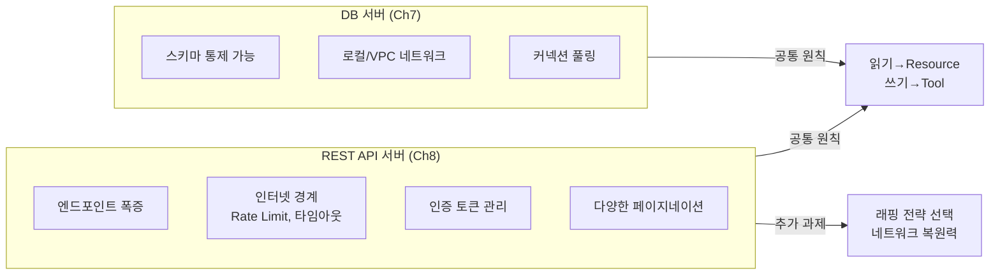
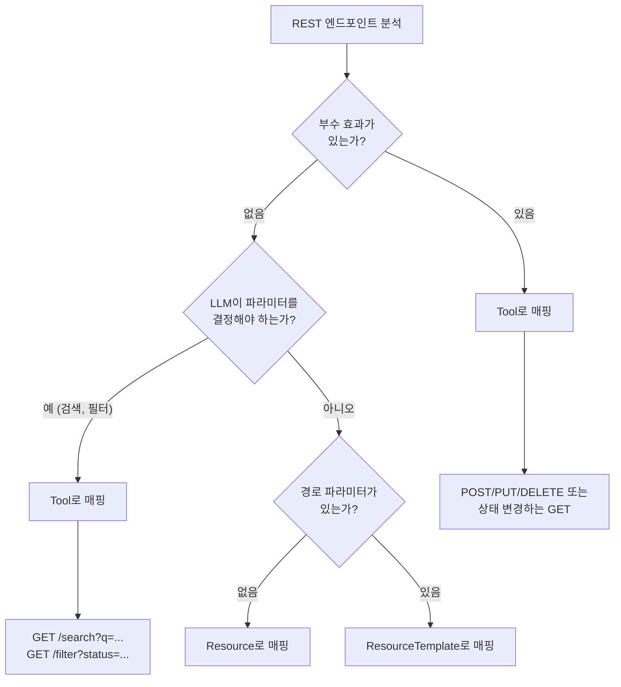
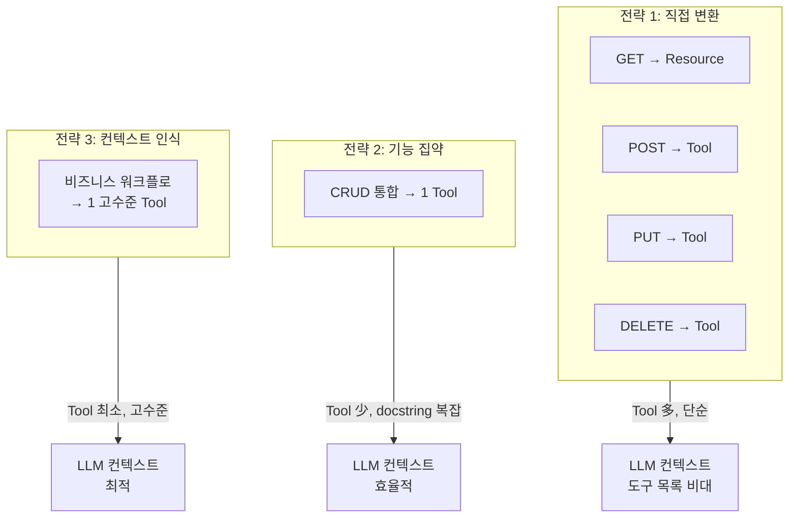
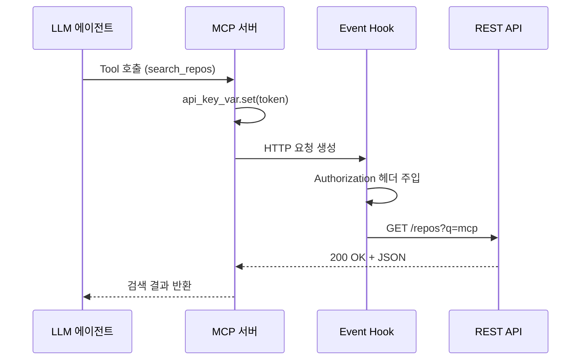
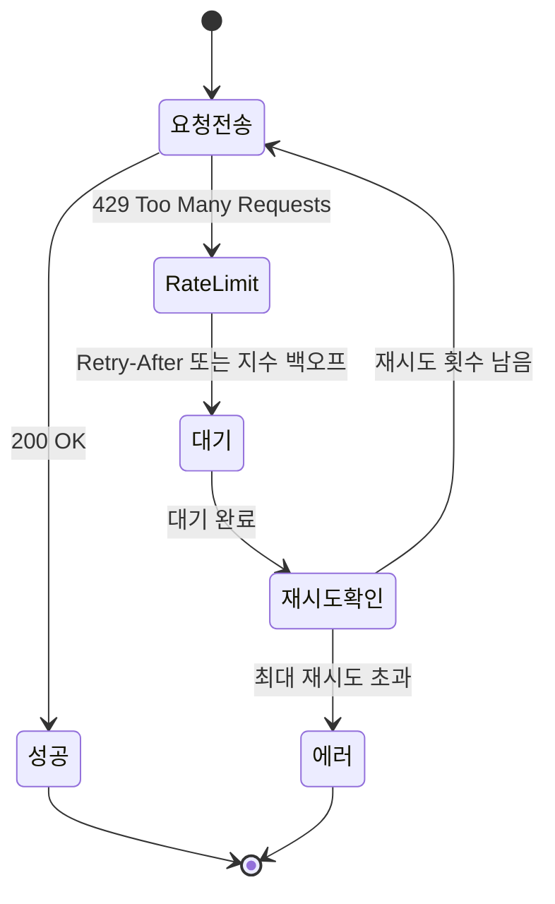

# REST API→MCP 매핑 전략

> REST 엔드포인트를 MCP 프리미티브로 변환할 때의 REST 특화 설계 전략 — 페이지네이션, Rate Limit, 인증, 래핑 패턴

## 개요

이 섹션에서는 기존 REST API를 MCP 서버로 래핑할 때 마주치는 **REST 고유의 문제**들을 다룹니다. HTTP 메서드를 Tool/Resource에 매핑하는 기본 원칙은 [DB 서버 설계 전략](07-ch7-실전-서버-데이터베이스-연동/01-01-db-서버-설계-전략.md)에서 이미 배웠으므로, 여기서는 REST API 래핑에서만 등장하는 페이지네이션, Rate Limit, 인증 토큰, 그리고 수십~수백 개 엔드포인트를 효율적으로 줄이는 래핑 전략에 집중합니다.

**선수 지식**: [Tool 프리미티브 이해](04-ch4-tools-함수-호출-프리미티브/01-01-tool-프리미티브-이해.md)와 [Resource 프리미티브 이해](05-ch5-resources-데이터-노출-프리미티브/01-01-resource-프리미티브-이해.md)에서 배운 Tool과 Resource의 차이, [DB 서버 설계 전략](07-ch7-실전-서버-데이터베이스-연동/01-01-db-서버-설계-전략.md)에서 다룬 읽기→Resource / 쓰기→Tool 매핑 원칙

**학습 목표**:
- REST API 래핑에서 발생하는 고유 문제(엔드포인트 폭증, 페이지네이션, Rate Limit)를 식별할 수 있다
- 세 가지 래핑 전략(직접 변환, 기능 집약, 컨텍스트 인식)의 트레이드오프를 판단할 수 있다
- httpx `AsyncClient`를 활용한 비동기 API 호출과 인증 토큰 관리를 구현할 수 있다
- 페이지네이션과 Rate Limit 대응 패턴을 적용할 수 있다

## 왜 알아야 할까?

현실 세계의 데이터와 기능은 대부분 REST API 뒤에 있습니다. GitHub, Slack, Notion, Stripe — 여러분이 쓰는 거의 모든 서비스가 REST API를 제공하죠. LLM이 이런 서비스와 상호작용하려면 누군가가 REST API를 MCP로 "번역"해야 합니다.

DB 서버를 만들 때는 우리가 스키마를 통제할 수 있었죠. 하지만 REST API 래핑은 상황이 다릅니다. **우리가 통제할 수 없는 외부 시스템**을 감싸야 하거든요. 여기서 DB와는 전혀 다른 문제들이 등장합니다:

- **엔드포인트 폭증**: REST API에는 보통 수십~수백 개의 엔드포인트가 있는데, 이걸 그대로 Tool로 변환하면 LLM 컨텍스트가 도구 목록으로 가득 찹니다
- **네트워크 경계**: DB는 로컬이나 VPC 안에 있지만, REST API는 인터넷을 넘어가므로 지연, 타임아웃, Rate Limit을 다뤄야 합니다
- **인증 복잡성**: API 키, OAuth 토큰, 토큰 갱신 — DB 커넥션 문자열보다 훨씬 복잡합니다
- **페이지네이션**: DB에서는 SQL `LIMIT/OFFSET`으로 끝나지만, REST API마다 페이지네이션 방식이 다릅니다

> 📊 **그림 1**: DB 서버 vs REST API 서버 — 래핑할 때 다뤄야 할 문제의 차이



## 핵심 개념

### 개념 1: REST 매핑의 출발점 — 기본 원칙 복습과 REST 특화 예외

[DB 서버 설계 전략](07-ch7-실전-서버-데이터베이스-연동/01-01-db-서버-설계-전략.md)에서 배운 핵심 원칙을 기억하시죠? **읽기(부수 효과 없음)는 Resource, 쓰기(부수 효과 있음)는 Tool**입니다. REST에 적용하면 GET→Resource, POST/PUT/DELETE→Tool이 되죠.

하지만 REST API에는 DB에서 만나지 못했던 **경계 사례**가 많습니다:

| REST 패턴 | 부수 효과 | 매핑 | 이유 |
|-----------|-----------|------|------|
| `GET /users` | 없음 | **Resource** | 고정 목록 조회 |
| `GET /users/{id}` | 없음 | **ResourceTemplate** | 경로 파라미터로 동적 조회 |
| `GET /users/search?q=...` | 없음 | **Tool** ⚠️ | LLM이 검색어를 결정해야 함 |
| `POST /users` | 생성 | **Tool** | 부수 효과 |
| `GET /reports/generate` | 있음 ⚠️ | **Tool** | GET이지만 서버에서 리포트 생성 |
| `POST /auth/check` | 없음 ⚠️ | **Resource** | POST지만 상태 변경 없음 |

> ⚠️ **흔한 오해**: "GET은 무조건 Resource, POST는 무조건 Tool" — 이렇게 기계적으로 매핑하면 안 됩니다. **핵심 기준은 HTTP 메서드가 아니라 "부수 효과의 유무"와 "누가 호출 파라미터를 결정하느냐"**입니다. REST API는 설계자마다 HTTP 메서드 사용 관례가 다르기 때문에, DB의 SELECT/INSERT보다 판단이 더 복잡합니다.

```python
from fastmcp import FastMCP

mcp = FastMCP("User API")

# GET /users/search?q=... → Tool (읽기지만 LLM이 검색어를 결정)
@mcp.tool()
async def search_users(query: str, limit: int = 10) -> list[dict]:
    """검색어로 사용자를 찾습니다. 이름, 이메일, 부서로 검색 가능합니다."""
    response = await http_client.get("/users/search", params={"q": query, "limit": limit})
    return response.json()

# GET /users → Resource (파라미터 없는 고정 목록)
@mcp.resource("users://list")
async def list_users() -> list[dict]:
    """전체 사용자 목록을 반환합니다."""
    response = await http_client.get("/users")
    return response.json()

# GET /users/{id} → ResourceTemplate (경로 파라미터로 동적 조회)
@mcp.resource("users://{user_id}")
async def get_user(user_id: str) -> dict:
    """특정 사용자의 상세 정보를 반환합니다."""
    response = await http_client.get(f"/users/{user_id}")
    return response.json()
```

> 📊 **그림 2**: REST 엔드포인트 매핑 의사결정 트리



### 개념 2: 세 가지 래핑 전략 — 엔드포인트 폭증 문제의 해법

> 💡 **비유**: 외국어 번역에도 세 가지 방식이 있죠. **직역**(단어 하나하나 변환), **의역**(문맥에 맞게 자연스럽게), **초월 번역**(원문보다 더 잘 전달). REST→MCP 매핑도 마찬가지입니다. DB에서는 테이블이 5~10개라 직역으로 충분했지만, REST API는 엔드포인트가 수십~수백 개라서 번역 전략이 핵심이 됩니다.

#### 전략 1: 직접 변환 (Direct Translation)

REST 엔드포인트를 1:1로 MCP Tool/Resource에 대응시킵니다.

```python
# 직접 변환 — REST 엔드포인트 1:1 매핑
@mcp.tool()
async def get_invoice(invoice_id: str) -> dict:
    """청구서를 조회합니다."""
    resp = await http_client.get(f"/invoices/{invoice_id}")
    return resp.json()

@mcp.tool()
async def create_invoice(customer_id: str, amount: float, description: str) -> dict:
    """청구서를 생성합니다."""
    resp = await http_client.post("/invoices", json={
        "customer_id": customer_id, "amount": amount, "description": description
    })
    return resp.json()

@mcp.tool()
async def update_invoice(invoice_id: str, status: str) -> dict:
    """청구서 상태를 변경합니다."""
    resp = await http_client.patch(f"/invoices/{invoice_id}", json={"status": status})
    return resp.json()

@mcp.tool()
async def delete_invoice(invoice_id: str) -> dict:
    """청구서를 삭제합니다."""
    resp = await http_client.delete(f"/invoices/{invoice_id}")
    return resp.json()
```

**장점**: 구현이 단순하고 REST API 문서와 1:1 대응되어 유지보수가 쉽습니다.
**단점**: 엔드포인트가 많아지면 LLM 컨텍스트가 Tool 목록으로 가득 찹니다.

#### 전략 2: 기능 집약 (Capability Aggregation)

관련된 CRUD 엔드포인트를 하나의 의미 있는 Tool로 묶습니다.

```python
from typing import Literal

@mcp.tool()
async def manage_invoice(
    action: Literal["create", "update", "delete", "get"],
    invoice_id: str | None = None,
    customer_id: str | None = None,
    amount: float | None = None,
    description: str | None = None,
    status: str | None = None,
) -> dict:
    """청구서를 관리합니다. action으로 수행할 작업을 지정하세요.
    
    - get: invoice_id 필수
    - create: customer_id, amount 필수
    - update: invoice_id, 변경할 필드 필수
    - delete: invoice_id 필수
    """
    if action == "get":
        resp = await http_client.get(f"/invoices/{invoice_id}")
    elif action == "create":
        resp = await http_client.post("/invoices", json={
            "customer_id": customer_id, "amount": amount, "description": description
        })
    elif action == "update":
        payload = {k: v for k, v in {"status": status, "amount": amount}.items() if v is not None}
        resp = await http_client.patch(f"/invoices/{invoice_id}", json=payload)
    elif action == "delete":
        resp = await http_client.delete(f"/invoices/{invoice_id}")
    
    resp.raise_for_status()
    return resp.json()
```

**장점**: Tool 개수가 줄어 LLM 컨텍스트 효율이 높습니다.
**단점**: docstring이 복잡해지고, LLM이 올바른 `action`과 파라미터 조합을 선택해야 합니다.

#### 전략 3: 컨텍스트 인식 (Context-Aware Wrapping)

여러 REST 호출을 조합해 에이전트의 워크플로에 맞는 고수준 Tool을 제공합니다.

```python
@mcp.tool()
async def process_overdue_invoices(days_overdue: int = 30, action: Literal["remind", "escalate"] = "remind") -> dict:
    """기한이 지난 청구서를 일괄 처리합니다.
    
    1. 미결 청구서 목록을 조회합니다
    2. 지정된 일수를 초과한 청구서를 필터링합니다
    3. 각 청구서에 대해 알림(remind) 또는 에스컬레이션(escalate)을 수행합니다
    """
    # 1단계: 미결 청구서 조회
    resp = await http_client.get("/invoices", params={"status": "pending"})
    invoices = resp.json()["data"]
    
    # 2단계: 기한 초과 필터링
    from datetime import datetime, timedelta
    cutoff = datetime.now() - timedelta(days=days_overdue)
    overdue = [inv for inv in invoices if datetime.fromisoformat(inv["due_date"]) < cutoff]
    
    # 3단계: 일괄 처리
    results = []
    for inv in overdue:
        if action == "remind":
            r = await http_client.post(f"/invoices/{inv['id']}/remind")
        else:
            r = await http_client.post(f"/invoices/{inv['id']}/escalate")
        results.append({"id": inv["id"], "status": r.status_code})
    
    return {"processed": len(results), "details": results}
```

**장점**: LLM이 한 번의 Tool 호출로 복잡한 비즈니스 로직을 실행할 수 있습니다.
**단점**: REST API 변경 시 MCP Tool도 함께 수정해야 합니다.

> 📊 **그림 3**: 세 가지 래핑 전략 비교 — Tool 수 vs 추상화 수준



실전에서는 세 전략을 혼합합니다. 핵심 CRUD는 직접 변환, 관련 작업 그룹은 기능 집약, 자주 쓰는 복합 워크플로는 컨텍스트 인식으로 제공하는 것이 일반적이죠.

### 개념 3: httpx AsyncClient와 인증 토큰 관리

> 💡 **비유**: MCP 서버가 REST API를 호출하는 건 통역사가 전화 통역을 하는 것과 같습니다. 통역사(MCP 서버)가 매번 전화를 새로 걸면(새 HTTP 연결) 느리지만, 전화를 켜놓고 계속 통역하면(커넥션 풀링) 훨씬 빠르죠. `httpx.AsyncClient`가 바로 이 "상시 연결 통역 라인"입니다.

DB 서버에서는 SQLAlchemy 엔진의 커넥션 풀을 썼다면, REST 래핑에서는 `httpx.AsyncClient`의 커넥션 풀을 씁니다. 원리는 같지만, REST에는 **인증 토큰 관리**라는 추가 과제가 있습니다.

```python
import os
import httpx
from fastmcp import FastMCP

mcp = FastMCP("GitHub MCP Server")

# 모듈 수준에서 한 번 생성 — 커넥션 풀링 활용
http_client = httpx.AsyncClient(
    base_url="https://api.github.com",
    headers={
        "Authorization": f"Bearer {os.environ['GITHUB_TOKEN']}",
        "Accept": "application/vnd.github.v3+json",
    },
    timeout=30.0,  # 전역 타임아웃
)
```

**동적 인증이 필요한 경우**(멀티 테넌트, 사용자별 토큰)에는 `contextvars`와 httpx 이벤트 훅을 조합합니다. 이건 DB의 단일 커넥션 문자열로는 필요 없던 패턴이죠.

```python
from contextvars import ContextVar
import httpx

# 요청별 API 키를 저장하는 컨텍스트 변수
api_key_var: ContextVar[str] = ContextVar("api_key", default="")

async def inject_auth(request: httpx.Request):
    """각 HTTP 요청에 동적으로 인증 헤더를 주입합니다."""
    token = api_key_var.get()
    if token:
        request.headers["Authorization"] = f"Bearer {token}"

# 이벤트 훅으로 매 요청마다 인증 헤더 자동 주입
http_client = httpx.AsyncClient(
    base_url="https://api.example.com",
    timeout=30.0,
    event_hooks={"request": [inject_auth]},
)
```

> 📊 **그림 4**: httpx AsyncClient의 인증 토큰 주입 흐름



### 개념 4: 페이지네이션 처리 전략

> 💡 **비유**: 도서관에서 "파이썬 책 전부 보여주세요"라고 하면 사서가 한 번에 모든 책을 가져다줄 수도 있고(투명 집약), "10권씩 가져올 테니 더 필요하면 말씀하세요"라고 할 수도 있습니다(커서 전달). 데이터가 100건이면 한 번에 가져오면 되지만, 10만 건이면 나눠 가져와야 하죠.

REST API마다 페이지네이션 방식이 다릅니다. `page` 파라미터, `offset/limit`, `cursor` 기반, `Link` 헤더 기반... DB의 SQL `LIMIT/OFFSET`처럼 일관되지 않죠. MCP에서 이를 처리하는 두 가지 패턴이 있습니다.

**패턴 A: 투명 집약** — 내부에서 모든 페이지를 순회하여 전체 결과를 반환합니다.

```python
@mcp.tool()
async def list_all_repos(org: str) -> list[dict]:
    """조직의 모든 저장소를 반환합니다. 내부적으로 페이지네이션을 처리합니다."""
    repos = []
    page = 1
    while True:
        resp = await http_client.get(
            f"/orgs/{org}/repos",
            params={"page": page, "per_page": 100}
        )
        data = resp.json()
        if not data:  # 빈 페이지 = 끝
            break
        repos.extend(data)
        page += 1
        if page > 50:  # 안전 장치: 최대 5000건
            break
    return repos
```

**패턴 B: 커서 전달** — 데이터가 너무 많을 때 LLM이 페이지를 넘기도록 합니다.

```python
@mcp.tool()
async def list_repos(org: str, cursor: str | None = None, limit: int = 30) -> dict:
    """조직의 저장소를 페이지 단위로 조회합니다.
    
    반환값의 next_cursor가 null이면 마지막 페이지입니다.
    더 많은 결과가 필요하면 next_cursor를 전달하여 다음 페이지를 요청하세요.
    """
    params = {"per_page": limit}
    if cursor:
        params["page"] = cursor
    
    resp = await http_client.get(f"/orgs/{org}/repos", params=params)
    data = resp.json()
    
    # Link 헤더에서 다음 페이지 정보 추출
    next_cursor = None
    link_header = resp.headers.get("Link", "")
    if 'rel="next"' in link_header:
        import re
        match = re.search(r'page=(\d+).*rel="next"', link_header)
        if match:
            next_cursor = match.group(1)
    
    return {"repos": data, "next_cursor": next_cursor, "count": len(data)}
```

선택 기준은 간단합니다:

| 조건 | 추천 패턴 |
|------|----------|
| 전체 데이터 < 1000건 | 투명 집약 |
| 전체 데이터 > 1000건 또는 가변적 | 커서 전달 |
| LLM이 전체 결과를 한번에 봐야 할 때 | 투명 집약 |
| LLM이 첫 몇 건만 보면 될 때 | 커서 전달 |

### 개념 5: Rate Limit 대응 전략

> 💡 **비유**: 고속도로 톨게이트를 생각해보세요. 차가 몰리면 통행이 제한되듯이, REST API도 요청이 몰리면 429 응답으로 "좀 천천히 와주세요"라고 말합니다. 좋은 드라이버(MCP 서버)는 제한 신호를 보면 잠시 쉬었다가 다시 출발합니다.

DB 연결에서는 커넥션 풀이 동시 접속 수를 알아서 조절해줬지만, REST API는 **서버가 일방적으로 요청을 거부**합니다. LLM 에이전트는 사람보다 훨씬 공격적으로 API를 호출할 수 있기 때문에, Rate Limit 대응이 특히 중요합니다.

```python
import asyncio
import httpx

async def api_call_with_retry(
    client: httpx.AsyncClient,
    method: str,
    url: str,
    max_retries: int = 5,
    **kwargs,
) -> httpx.Response:
    """Rate Limit(429)을 감지하고 지수 백오프로 재시도합니다."""
    for attempt in range(max_retries):
        response = await client.request(method, url, **kwargs)
        
        if response.status_code == 429:
            # Retry-After 헤더가 있으면 그 값을 사용
            retry_after = response.headers.get("Retry-After")
            if retry_after:
                wait_time = int(retry_after)
            else:
                # 지수 백오프: 1초, 2초, 4초, 8초, 16초
                wait_time = 2 ** attempt
            
            await asyncio.sleep(wait_time)
            continue
        
        response.raise_for_status()
        return response
    
    raise Exception(f"Rate limit: {max_retries}회 재시도 후에도 실패")

# Tool에서 사용
@mcp.tool()
async def search_repos(query: str) -> list[dict]:
    """GitHub에서 저장소를 검색합니다. Rate Limit을 자동으로 처리합니다."""
    resp = await api_call_with_retry(
        http_client, "GET", "/search/repositories",
        params={"q": query, "per_page": 10}
    )
    return resp.json()["items"]
```

> 📊 **그림 5**: Rate Limit 대응 흐름 — 지수 백오프



## 실습: 직접 해보기

실제로 JSONPlaceholder(무료 REST API)를 MCP 서버로 래핑해봅시다. 기본 매핑, 검색 Tool, 그리고 컨텍스트 인식 고수준 Tool까지 세 가지 전략을 모두 적용합니다.

```python
"""JSONPlaceholder REST API를 MCP 서버로 래핑하는 실습 예제.

실행 방법:
    pip install "mcp[cli]" fastmcp httpx
    python server.py  # stdio 모드
    또는
    fastmcp dev server.py  # MCP Inspector로 테스트
"""

import asyncio
import httpx
from fastmcp import FastMCP

# MCP 서버 생성
mcp = FastMCP(
    "JSONPlaceholder MCP",
    description="JSONPlaceholder REST API를 MCP로 래핑한 실습 서버",
)

# httpx AsyncClient — 모듈 수준에서 한 번 생성
http_client = httpx.AsyncClient(
    base_url="https://jsonplaceholder.typicode.com",
    timeout=15.0,
)


# ── Resource: 읽기 전용 데이터 ──────────────────────────

@mcp.resource("posts://list")
async def list_posts() -> list[dict]:
    """전체 게시글 목록을 반환합니다."""
    resp = await http_client.get("/posts")
    return resp.json()


@mcp.resource("posts://{post_id}")
async def get_post(post_id: int) -> dict:
    """특정 게시글의 상세 정보를 반환합니다."""
    resp = await http_client.get(f"/posts/{post_id}")
    return resp.json()


@mcp.resource("users://list")
async def list_users() -> list[dict]:
    """전체 사용자 목록을 반환합니다."""
    resp = await http_client.get("/users")
    return resp.json()


# ── Tool: 검색 (GET이지만 LLM이 파라미터를 결정) ────────

@mcp.tool()
async def search_posts(user_id: int | None = None, title_contains: str | None = None) -> list[dict]:
    """게시글을 검색합니다.

    user_id로 특정 사용자의 글을 필터링하거나,
    title_contains로 제목에 포함된 키워드로 검색합니다.
    """
    params = {}
    if user_id is not None:
        params["userId"] = user_id

    resp = await http_client.get("/posts", params=params)
    posts = resp.json()

    # 제목 필터링은 클라이언트 측에서 수행
    if title_contains:
        posts = [p for p in posts if title_contains.lower() in p["title"].lower()]

    return posts


# ── Tool: 생성/수정/삭제 (부수 효과) ─────────────────────

@mcp.tool()
async def create_post(title: str, body: str, user_id: int = 1) -> dict:
    """새 게시글을 작성합니다."""
    resp = await http_client.post("/posts", json={
        "title": title,
        "body": body,
        "userId": user_id,
    })
    resp.raise_for_status()
    return resp.json()


@mcp.tool()
async def update_post(post_id: int, title: str | None = None, body: str | None = None) -> dict:
    """기존 게시글을 수정합니다. 변경할 필드만 전달하세요."""
    payload = {k: v for k, v in {"title": title, "body": body}.items() if v is not None}
    resp = await http_client.patch(f"/posts/{post_id}", json=payload)
    resp.raise_for_status()
    return resp.json()


@mcp.tool()
async def delete_post(post_id: int) -> dict:
    """게시글을 삭제합니다."""
    resp = await http_client.delete(f"/posts/{post_id}")
    resp.raise_for_status()
    return {"deleted": True, "post_id": post_id}


# ── Tool: 컨텍스트 인식 고수준 도구 ──────────────────────

@mcp.tool()
async def get_user_activity_summary(user_id: int) -> dict:
    """사용자의 활동 요약을 반환합니다.
    
    내부적으로 게시글, 댓글, 할일 API를 조합하여
    한 번의 호출로 종합 정보를 제공합니다.
    """
    # 3개 API를 병렬 호출
    posts_task = http_client.get(f"/users/{user_id}/posts")
    comments_task = http_client.get(f"/users/{user_id}/comments")  
    todos_task = http_client.get(f"/users/{user_id}/todos")

    posts_resp, comments_resp, todos_resp = await asyncio.gather(
        posts_task, comments_task, todos_task
    )

    posts = posts_resp.json()
    comments = comments_resp.json()
    todos = todos_resp.json()

    completed_todos = [t for t in todos if t["completed"]]

    return {
        "user_id": user_id,
        "total_posts": len(posts),
        "total_comments": len(comments),
        "total_todos": len(todos),
        "completed_todos": len(completed_todos),
        "completion_rate": f"{len(completed_todos) / len(todos) * 100:.1f}%" if todos else "N/A",
        "recent_posts": [{"id": p["id"], "title": p["title"]} for p in posts[:3]],
    }


if __name__ == "__main__":
    mcp.run()
```

서버를 실행하고 MCP Inspector로 테스트해봅시다:

```run:python
# 서버 구조 확인 — 매핑 결과 요약
mapping_summary = {
    "Resources (읽기 전용)": [
        "posts://list     ← GET /posts",
        "posts://{post_id} ← GET /posts/:id (ResourceTemplate)",
        "users://list     ← GET /users",
    ],
    "Tools (LLM 제어)": [
        "search_posts     ← GET /posts?userId=&title= (검색)",
        "create_post       ← POST /posts",
        "update_post       ← PATCH /posts/:id",
        "delete_post       ← DELETE /posts/:id",
        "get_user_activity_summary ← GET /posts + /comments + /todos (고수준 집약)",
    ],
}

for category, items in mapping_summary.items():
    print(f"\n{'='*50}")
    print(f" {category}")
    print(f"{'='*50}")
    for item in items:
        print(f"  • {item}")
```

```output

==================================================
 Resources (읽기 전용)
==================================================
  • posts://list     ← GET /posts
  • posts://{post_id} ← GET /posts/:id (ResourceTemplate)
  • users://list     ← GET /users

==================================================
 Tools (LLM 제어)
==================================================
  • search_posts     ← GET /posts?userId=&title= (검색)
  • create_post       ← POST /posts
  • update_post       ← PATCH /posts/:id
  • delete_post       ← DELETE /posts/:id
  • get_user_activity_summary ← GET /posts + /comments + /todos (고수준 집약)
```

## 더 깊이 알아보기

### REST→MCP 래핑 논쟁: "그냥 감싸면 안 되나요?"

2025년 MCP가 빠르게 확산되면서, REST API를 자동으로 MCP로 변환하는 도구들이 우후죽순 등장했습니다. FastMCP의 `from_openapi()`도 그중 하나죠. 하지만 FastMCP의 창시자 Jeremiah Lowin은 자신의 블로그에서 의미심장한 글을 썼습니다: **"Stop Converting Your REST APIs to MCP"** (REST API를 MCP로 변환하지 마세요).

그의 핵심 주장은 세 가지였습니다:

1. **컨텍스트 비대화(Context Bloat)**: 모든 Tool의 이름, 설명, 파라미터 스키마가 LLM의 매 추론 단계마다 컨텍스트에 포함됩니다. 100개의 REST 엔드포인트를 100개의 Tool로 변환하면, LLM은 매번 100개의 도구 설명을 읽어야 합니다.

2. **원자성 불일치(Atomicity Mismatch)**: REST API는 "하나의 엔드포인트 = 하나의 작업"이라는 원칙으로 설계됩니다. 하지만 에이전트의 작업 단위는 "사용자의 의도 하나를 해결하는 것"이죠. "연체 청구서를 처리해줘"라는 요청에 대해 에이전트가 검색 → 필터 → 각각 알림이라는 3단계를 밟아야 한다면, 그건 REST의 원자성을 그대로 가져온 결과입니다.

3. **컨텍스트 오염(Context Pollution)**: 도구가 많을수록 LLM이 관련 없는 도구를 선택할 확률도 높아집니다.

그래서 Lowin이 제안한 방식이 바로 **"에이전트 퍼스트 설계"** — REST 엔드포인트를 번역하는 게 아니라, "에이전트가 어떤 작업을 해야 하는가?"부터 시작하여 필요한 Tool을 설계하고, 그 내부에서 여러 REST 호출을 조합하는 것입니다.

물론 `from_openapi()`를 완전히 부정한 건 아닙니다. **프로토타이핑과 탐색 단계**에서는 자동 변환이 매우 유용하고, 이를 기반으로 "어떤 Tool이 정말 필요한지" 파악한 뒤 프로덕션용으로 큐레이션하라는 것이 그의 결론이었습니다.

### FastMCP의 기본 동작 변경

흥미로운 점은 FastMCP v2.8.0부터 `from_openapi()`의 기본 매핑이 바뀌었다는 사실입니다. 원래는 GET→Resource, POST/PUT/DELETE→Tool이었는데, **모든 엔드포인트를 Tool로 매핑하는 것이 기본값**이 되었습니다. 이유는 간단했습니다 — 대부분의 MCP 클라이언트(Claude Desktop 포함)가 Resource 지원이 Tool만큼 완성되지 않았기 때문이죠. 실용적인 선택이었습니다.

## 흔한 오해와 팁

> ⚠️ **흔한 오해**: "REST API 엔드포인트가 50개면 MCP Tool도 50개 만들어야 한다" — 이건 가장 비효율적인 접근입니다. LLM의 컨텍스트 윈도우에 50개 Tool의 스키마가 모두 들어가면 추론 품질이 급격히 떨어집니다. 실전에서는 10~15개 이하의 잘 설계된 Tool이 50개의 1:1 매핑보다 훨씬 효과적입니다.

> 💡 **알고 계셨나요?**: MCP 스펙에는 Tool, Resource, Prompt 목록에 대한 **프로토콜 수준 페이지네이션**이 정의되어 있습니다. `tools/list` 응답에 `nextCursor`가 포함되면 클라이언트가 추가 페이지를 요청할 수 있죠. 이건 REST API의 데이터 페이지네이션과는 다른 개념입니다 — MCP 프리미티브 자체의 목록을 페이지네이션하는 것이거든요.

> 🔥 **실무 팁**: `httpx.AsyncClient`는 반드시 **모듈 수준에서 한 번만 생성**하세요. Tool 함수 안에서 `async with httpx.AsyncClient() as client:`를 쓰면 매 호출마다 TCP 연결을 새로 만들어 성능이 크게 저하됩니다. 커넥션 풀링은 MCP 서버 성능의 핵심입니다.

> 🔥 **실무 팁**: REST API를 MCP로 래핑할 때 **REST의 에러 코드를 그대로 전달하지 마세요**. `404 Not Found` 대신 "해당 ID의 사용자를 찾을 수 없습니다"처럼 LLM이 이해할 수 있는 메시지로 변환해야 합니다. LLM은 HTTP 상태 코드보다 자연어 에러 메시지를 훨씬 잘 처리합니다. 이 부분은 [MCP 에러 처리 체계](12-ch12-에러-처리-로깅-테스트/01-01-mcp-에러-처리-체계.md)에서 자세히 다룹니다.

## 핵심 정리

| 개념 | 설명 |
|------|------|
| 기본 매핑 원칙 | Ch7에서 배운 읽기→Resource / 쓰기→Tool 원칙을 REST에도 적용 |
| REST 특화 예외 | 검색 GET→Tool, 부수 효과 있는 GET→Tool 등 HTTP 메서드만으로 판단 불가 |
| 직접 변환 | 1:1 매핑, 단순하지만 엔드포인트 폭증 시 LLM 컨텍스트 비대화 |
| 기능 집약 | CRUD를 하나의 Tool로 통합, 컨텍스트 효율 향상 |
| 컨텍스트 인식 | 여러 API 조합한 고수준 Tool, 에이전트 워크플로에 최적화 |
| httpx AsyncClient | 모듈 수준에서 생성, 커넥션 풀링 활용, event_hooks로 동적 인증 |
| 페이지네이션 | 소량 → 투명 집약, 대량 → 커서 전달 |
| Rate Limit 대응 | 429 감지 → Retry-After 존중 → 지수 백오프 재시도 |

## 다음 섹션 미리보기

다음 [GitHub API 래핑 서버 구축](08-ch8-실전-서버-rest-api-래핑과-파일시스템/02-02-github-api-래핑-서버-구축.md)에서는 이번 섹션에서 배운 매핑 전략을 실제 GitHub REST API에 적용합니다. 인증 토큰 설정, 저장소/이슈/PR 관련 Tool과 Resource를 체계적으로 설계하고, httpx를 활용한 완전한 MCP 서버를 처음부터 끝까지 구축해볼 예정입니다.

## 참고 자료

- [MCP Official Documentation — Architecture](https://modelcontextprotocol.io/docs/learn/architecture) - Host/Client/Server 3계층 구조와 프리미티브 개념 공식 설명
- [Should You Wrap MCP Around Your Existing API? — Scalekit](https://www.scalekit.com/blog/wrap-mcp-around-existing-api) - REST→MCP 래핑의 세 가지 전략(직접 변환, 기능 집약, 컨텍스트 인식)을 비교 분석
- [Stop Converting Your REST APIs to MCP — Jlowin Blog](https://www.jlowin.dev/blog/stop-converting-rest-apis-to-mcp) - FastMCP 창시자의 에이전트 퍼스트 설계 철학과 자동 변환의 함정
- [FastMCP OpenAPI Integration](https://gofastmcp.com/integrations/openapi) - `from_openapi()` 사용법, RouteMap, MCPType 설정 공식 문서
- [MCP Python SDK — GitHub](https://github.com/modelcontextprotocol/python-sdk) - Python SDK v1.26.0 공식 저장소, Tool/Resource 정의 패턴
- [MCP Official Reference Servers — GitHub](https://github.com/modelcontextprotocol/servers) - GitHub, Slack, Filesystem 등 공식 레퍼런스 서버 구현 예시

---
### 🔗 Related Sessions
- [resource 프리미티브](05-ch5-resources-데이터-노출-프리미티브/01-01-resource-프리미티브-이해.md) (prerequisite)
- [resourcetemplate](05-ch5-resources-데이터-노출-프리미티브/01-01-resource-프리미티브-이해.md) (prerequisite)
