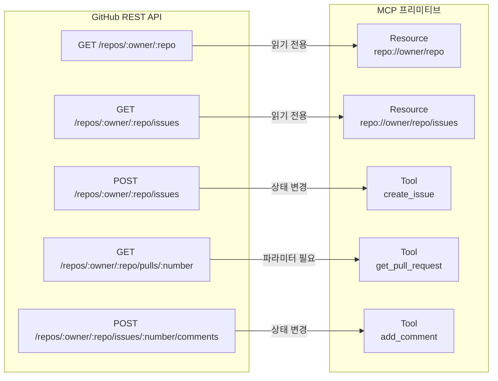
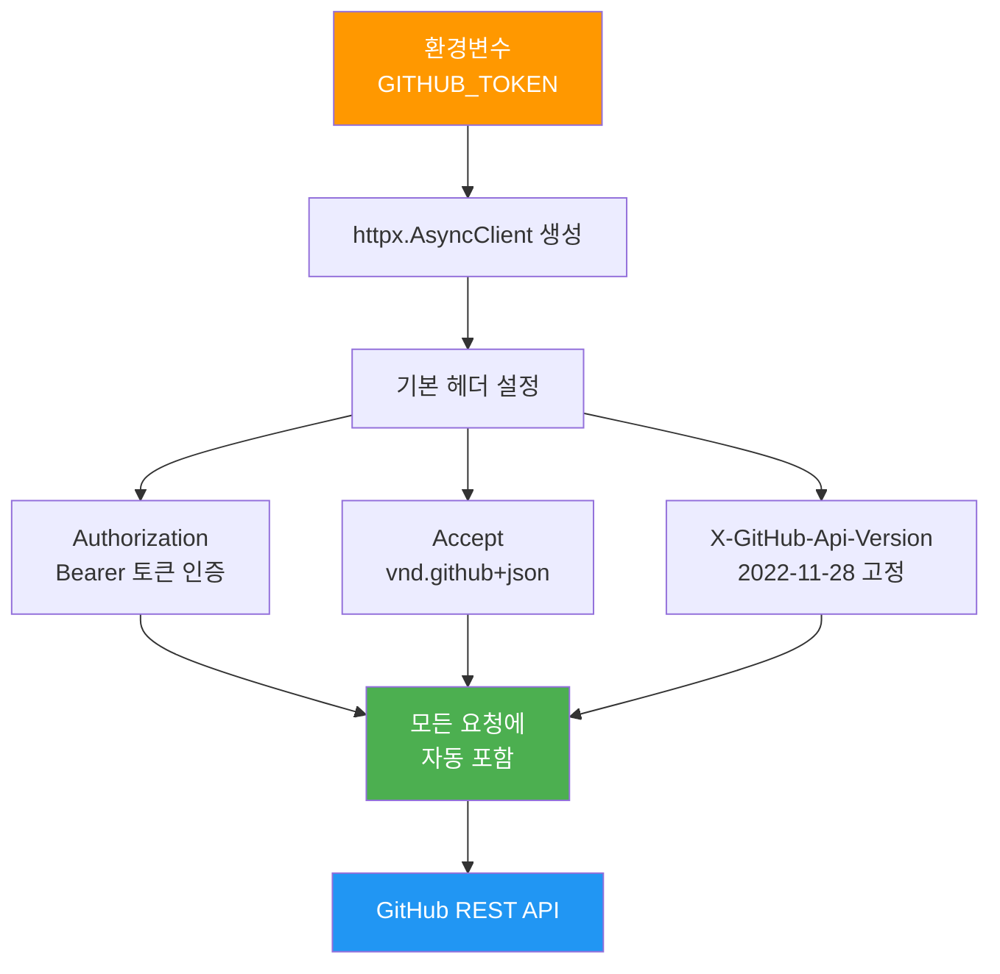
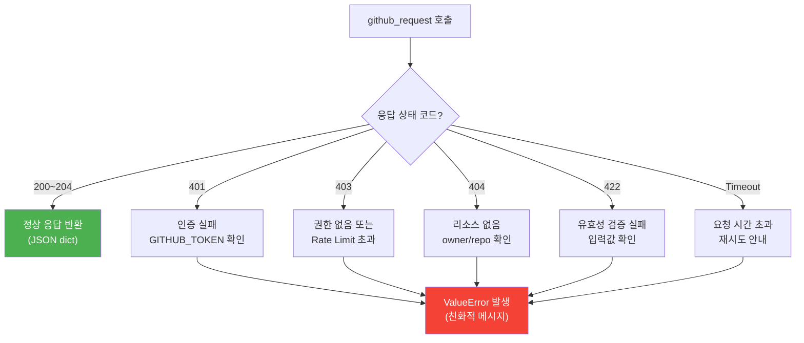

# GitHub API 래핑 서버 구축

> GitHub REST API를 MCP 서버로 래핑하여 LLM이 리포지토리를 조회하고, 이슈를 생성하며, PR을 관리할 수 있게 만듭니다.

## 개요

이 섹션에서는 [이전 섹션](08-ch8-실전-서버-rest-api-래핑과-파일시스템/01-01-rest-apimcp-매핑-전략.md)에서 배운 REST→MCP 매핑 전략을 GitHub REST API에 실제로 적용합니다. 리포지토리 정보는 Resource로, 이슈 생성이나 PR 조회 같은 액션은 Tool로 매핑하여 완전한 MCP 서버를 구축합니다.

**선수 지식**: REST→MCP 매핑 3가지 전략(직접 변환, 기능 집약, 컨텍스트 인식), httpx AsyncClient 기본 사용법, FastMCP 데코레이터(`@mcp.tool()`, `@mcp.resource()`), [lifespan 패턴](07-ch7-서버-개발-심화/01-01-lifespan과-서버-생명주기-관리.md)

**학습 목표**:
- GitHub REST API의 엔드포인트를 MCP Tool과 Resource로 분류하고 매핑할 수 있다
- Bearer 토큰 인증과 API 버전 고정을 httpx 클라이언트에 설정할 수 있다
- 응답 변환과 에러 매핑을 구현하여 LLM 친화적 인터페이스를 만들 수 있다
- 실제 동작하는 GitHub MCP 서버를 처음부터 끝까지 구축할 수 있다

## 왜 알아야 할까?

GitHub은 소프트웨어 개발의 중심 허브입니다. 만약 LLM이 GitHub에 직접 접근할 수 있다면 어떨까요? "이 리포의 오픈 이슈 중 버그 라벨이 붙은 것을 정리해줘", "이 에러에 대한 이슈를 만들어줘" 같은 요청을 자연어로 처리할 수 있게 됩니다.

실제로 MCP 공식 레퍼런스 서버에도 GitHub 서버가 포함되어 있었을 정도로, REST API 래핑의 대표적인 사례입니다. 이 실습을 통해 배우는 패턴은 GitHub뿐 아니라 Jira, Slack, Notion 등 어떤 REST API든 MCP 서버로 만드는 데 그대로 적용할 수 있거든요.

## 핵심 개념

### 개념 1: GitHub API 엔드포인트 매핑 설계

> 💡 **비유**: 도서관의 사서를 떠올려보세요. "이 책 어디 있어요?"라고 물으면 서가 위치를 알려주고(Resource — 읽기 전용 조회), "이 책 대출해주세요"라고 하면 대출 처리를 해줍니다(Tool — 상태를 변경하는 액션). GitHub API도 마찬가지로, **조회하는 것**과 **변경하는 것**을 나눠서 MCP 프리미티브에 매핑합니다.

GitHub REST API는 수백 개의 엔드포인트를 제공하지만, 이번 세션에서는 가장 많이 쓰이는 핵심 엔드포인트를 선별하여 매핑합니다. 원칙은 간단합니다:

- **GET → Resource**: 리포지토리 정보, 이슈 목록, PR 상세 등 읽기 전용 데이터
- **POST/PUT/PATCH/DELETE → Tool**: 이슈 생성, 코멘트 작성, PR 머지 등 상태 변경 액션

> 📊 **그림 1**: GitHub API 엔드포인트의 MCP 프리미티브 매핑



여기서 한 가지 주목할 점이 있습니다. `GET /repos/:owner/:repo/pulls/:number`는 읽기 전용이지만 Tool로 매핑했는데요. PR 번호라는 **동적 파라미터**가 필요하고, LLM이 문맥에 따라 특정 PR을 능동적으로 선택해야 하기 때문입니다. 이것이 바로 이전 섹션에서 배운 **컨텍스트 인식 전략**의 실제 적용입니다.

매핑 설계 시 실용적인 판단 기준을 정리하면:

| 기준 | Resource | Tool |
|------|----------|------|
| HTTP 메서드 | GET | POST, PUT, PATCH, DELETE |
| URI 패턴 가능 | `repo://{owner}/{repo}` 같은 패턴 | 파라미터가 복잡하거나 많음 |
| 데이터 성격 | 비교적 정적, 목록성 | 동적, 액션성 |
| LLM 제어 수준 | Application-controlled | Model-controlled |

### 개념 2: GitHub 전용 lifespan 설정 — 인증과 API 버전 고정

[Ch7에서 배운 lifespan 패턴](07-ch7-서버-개발-심화/01-01-lifespan과-서버-생명주기-관리.md)을 그대로 적용하되, GitHub API에 특화된 설정을 추가합니다. 핵심은 **Bearer 토큰 인증**과 **API 버전 고정** 두 가지입니다.

> 💡 **비유**: lifespan이 "가게 열고 닫기"라면, 이번에는 가게를 열 때 **GitHub 전용 유니폼을 입히는** 작업을 추가하는 거죠. 인증 배지(Bearer 토큰)를 달고, "2022-11-28 버전 메뉴판을 사용하겠다"고 선언하는 겁니다.

```python
from contextlib import asynccontextmanager
from collections.abc import AsyncIterator
from dataclasses import dataclass
import os
import httpx
from mcp.server.fastmcp import FastMCP, Context
from mcp.server.session import ServerSession

@dataclass
class GitHubContext:
    """서버 lifespan 동안 유지되는 공유 리소스"""
    client: httpx.AsyncClient

@asynccontextmanager
async def github_lifespan(server: FastMCP) -> AsyncIterator[GitHubContext]:
    """이전과 동일한 lifespan 패턴 + GitHub 전용 헤더 설정"""
    token = os.environ.get("GITHUB_TOKEN", "")
    async with httpx.AsyncClient(
        base_url="https://api.github.com",
        headers={
            # GitHub 인증: fine-grained PAT 또는 classic PAT
            "Authorization": f"Bearer {token}",
            # GitHub 권장: JSON 응답 형식 명시
            "Accept": "application/vnd.github+json",
            # API 버전 고정 — 응답 형식 변경으로 인한 서버 깨짐 방지
            "X-GitHub-Api-Version": "2022-11-28",
        },
        timeout=30.0,
    ) as client:
        yield GitHubContext(client=client)

mcp = FastMCP("GitHub MCP Server", lifespan=github_lifespan)
```

lifespan 패턴 자체의 동작 원리(서버 시작 시 리소스 생성, 종료 시 정리, `yield`를 기준으로 한 생명주기 분리)가 궁금하다면 [Ch7.1 lifespan과 서버 생명주기 관리](07-ch7-서버-개발-심화/01-01-lifespan과-서버-생명주기-관리.md)를 참고하세요.

여기서 GitHub에 고유한 설정 세 가지에 주목해야 합니다:

> 📊 **그림 2**: GitHub API 인증 흐름과 httpx 헤더 설정



| 헤더 | 역할 | 왜 중요한가 |
|------|------|-------------|
| `Authorization: Bearer {token}` | 인증 — Rate Limit 5,000/시간 (미인증 시 60/시간) | MCP 서버는 다량의 API 호출이 발생하므로 인증 필수 |
| `Accept: application/vnd.github+json` | JSON 응답 형식 명시 | GitHub의 다양한 미디어 타입 중 JSON으로 고정 |
| `X-GitHub-Api-Version: 2022-11-28` | API 버전 고정 | 향후 API 변경 시에도 응답 형식이 보장됨 |

Tool이나 Resource 함수 안에서 이 클라이언트에 접근하는 방법은 다음과 같습니다:

```python
@mcp.tool()
async def create_issue(
    owner: str, repo: str, title: str, body: str = "",
    ctx: Context[ServerSession, GitHubContext] = None,  # type: ignore
) -> str:
    """GitHub 리포지토리에 새 이슈를 생성합니다."""
    client = ctx.request_context.lifespan_context.client  # httpx 클라이언트 꺼내기
    response = await client.post(
        f"/repos/{owner}/{repo}/issues",
        json={"title": title, "body": body},
    )
    response.raise_for_status()
    data = response.json()
    return f"이슈 #{data['number']} 생성됨: {data['html_url']}"
```

`ctx.request_context.lifespan_context`라는 경로가 좀 길죠? 이건 MCP Python SDK의 공식 패턴입니다. dataclass로 정의한 `GitHubContext`의 속성에 타입 안전하게 접근할 수 있다는 장점이 있거든요.

### 개념 3: 응답 변환 — API 응답을 LLM 친화적으로

> 💡 **비유**: 외국어 통역사가 단어를 그대로 옮기지 않고 맥락에 맞게 의역하듯이, GitHub API 응답도 LLM이 이해하기 좋은 형태로 변환해야 합니다. 100개의 필드 중 LLM이 필요한 10개만 골라 구조화하는 거죠.

GitHub API는 하나의 리포지토리 정보에도 수십 개의 필드를 반환합니다. 이걸 그대로 LLM에 전달하면 토큰 낭비이고, 중요한 정보가 묻혀버립니다. **응답 변환(Response Transformation)**이 필요한 이유입니다.

```python
def transform_repo(raw: dict) -> dict:
    """GitHub 리포지토리 API 응답에서 핵심 정보만 추출"""
    return {
        "name": raw["full_name"],
        "description": raw.get("description", ""),
        "language": raw.get("language", "N/A"),
        "stars": raw["stargazers_count"],
        "forks": raw["forks_count"],
        "open_issues": raw["open_issues_count"],
        "default_branch": raw["default_branch"],
        "url": raw["html_url"],
        "updated_at": raw["updated_at"],
    }

def transform_issue(raw: dict) -> dict:
    """이슈 응답에서 핵심 정보만 추출"""
    return {
        "number": raw["number"],
        "title": raw["title"],
        "state": raw["state"],
        "author": raw["user"]["login"],
        "labels": [label["name"] for label in raw.get("labels", [])],
        "created_at": raw["created_at"],
        "body_preview": (raw.get("body") or "")[:200],  # 본문 미리보기 200자
        "url": raw["html_url"],
    }

def transform_pull_request(raw: dict) -> dict:
    """PR 응답에서 핵심 정보만 추출"""
    return {
        "number": raw["number"],
        "title": raw["title"],
        "state": raw["state"],
        "author": raw["user"]["login"],
        "base": raw["base"]["ref"],
        "head": raw["head"]["ref"],
        "mergeable": raw.get("mergeable"),
        "changed_files": raw.get("changed_files", 0),
        "additions": raw.get("additions", 0),
        "deletions": raw.get("deletions", 0),
        "url": raw["html_url"],
    }
```

> 📊 **그림 3**: 응답 변환 파이프라인


변환 함수를 분리하면 테스트도 쉬워지고, API 응답 형식이 바뀌어도 변환 함수만 수정하면 됩니다.

### 개념 4: GitHub API 에러를 MCP 에러로 매핑

> 💡 **비유**: 해외 직구를 하면 영어 에러 메시지가 뜨는데, 좋은 쇼핑몰은 이걸 한국어로 바꿔서 보여주죠. MCP 서버도 마찬가지로 GitHub의 HTTP 에러를 LLM이 이해하고 대응할 수 있는 메시지로 바꿔야 합니다.

GitHub API는 HTTP 상태 코드로 에러를 알려줍니다. 이걸 MCP 도구의 에러 응답으로 변환하는 헬퍼 함수를 만들겠습니다:

```python
import json
from mcp.types import TextContent

# GitHub HTTP 에러 → 사용자 친화적 메시지 매핑
ERROR_MESSAGES = {
    401: "GitHub 인증에 실패했습니다. GITHUB_TOKEN을 확인하세요.",
    403: "권한이 없거나 API Rate Limit에 도달했습니다.",
    404: "요청한 리소스를 찾을 수 없습니다. owner/repo를 확인하세요.",
    422: "요청 데이터가 올바르지 않습니다.",
}

async def github_request(
    client: httpx.AsyncClient,
    method: str,
    path: str,
    **kwargs,
) -> dict:
    """GitHub API 요청을 보내고, 에러를 MCP 친화적으로 변환"""
    try:
        response = await client.request(method, path, **kwargs)
        response.raise_for_status()
        if response.status_code == 204:
            return {"success": True}
        return response.json()
    except httpx.HTTPStatusError as e:
        status = e.response.status_code
        detail = ""
        try:
            detail = e.response.json().get("message", "")
        except Exception:
            detail = e.response.text[:200]
        friendly = ERROR_MESSAGES.get(status, f"HTTP {status} 에러가 발생했습니다.")
        raise ValueError(f"{friendly} (상세: {detail})")
    except httpx.TimeoutException:
        raise ValueError("GitHub API 요청 시간이 초과되었습니다. 잠시 후 다시 시도하세요.")
```

> 📊 **그림 4**: GitHub HTTP 에러의 MCP 에러 매핑 흐름



Rate Limit에 대해 좀 더 이야기하면, GitHub API는 인증된 요청에 대해 시간당 5,000회 제한을 두고 있습니다. 403 에러가 Rate Limit 때문인지 확인하려면 응답 헤더를 살펴봐야 합니다:

```python
async def github_request_with_rate_check(
    client: httpx.AsyncClient,
    method: str,
    path: str,
    **kwargs,
) -> dict:
    """Rate Limit 헤더를 확인하는 확장 버전"""
    try:
        response = await client.request(method, path, **kwargs)
        # Rate Limit 정보 로깅
        remaining = response.headers.get("X-RateLimit-Remaining", "?")
        limit = response.headers.get("X-RateLimit-Limit", "?")
        if remaining != "?" and int(remaining) < 100:
            print(f"⚠️ Rate Limit 잔여: {remaining}/{limit}")

        response.raise_for_status()
        if response.status_code == 204:
            return {"success": True}
        return response.json()
    except httpx.HTTPStatusError as e:
        if e.response.status_code == 403:
            reset_at = e.response.headers.get("X-RateLimit-Reset", "")
            if reset_at:
                from datetime import datetime
                reset_time = datetime.fromtimestamp(int(reset_at))
                raise ValueError(
                    f"Rate Limit 초과. 재설정 시각: {reset_time.strftime('%H:%M:%S')}"
                )
        # ... 나머지 에러 처리는 동일
        raise
```

## 실습: 직접 해보기

이제 모든 개념을 조합하여 완전한 GitHub MCP 서버를 만들어보겠습니다. 하나의 파일에 Resource 2개, Tool 5개를 구현합니다.

```python
"""
GitHub MCP Server — REST API를 MCP로 래핑하는 실전 예제
실행: GITHUB_TOKEN=ghp_xxx python github_server.py
"""
import os
import json
from contextlib import asynccontextmanager
from collections.abc import AsyncIterator
from dataclasses import dataclass

import httpx
from mcp.server.fastmcp import FastMCP, Context
from mcp.server.session import ServerSession


# ──────────────────────────────────────────────
# 1. Lifespan — Ch7.1과 동일한 패턴, GitHub 전용 헤더 추가
# ──────────────────────────────────────────────

@dataclass
class GitHubContext:
    """서버 수명 동안 공유되는 httpx 클라이언트"""
    client: httpx.AsyncClient


@asynccontextmanager
async def github_lifespan(server: FastMCP) -> AsyncIterator[GitHubContext]:
    token = os.environ.get("GITHUB_TOKEN", "")
    if not token:
        raise RuntimeError("GITHUB_TOKEN 환경변수가 설정되지 않았습니다.")
    async with httpx.AsyncClient(
        base_url="https://api.github.com",
        headers={
            "Authorization": f"Bearer {token}",
            "Accept": "application/vnd.github+json",
            "X-GitHub-Api-Version": "2022-11-28",
        },
        timeout=30.0,
    ) as client:
        yield GitHubContext(client=client)


mcp = FastMCP("GitHub MCP Server", lifespan=github_lifespan)


# ──────────────────────────────────────────────
# 2. 헬퍼 — API 호출, 응답 변환, 에러 매핑
# ──────────────────────────────────────────────

ERROR_MESSAGES = {
    401: "GitHub 인증 실패. GITHUB_TOKEN을 확인하세요.",
    403: "권한이 없거나 API Rate Limit 초과입니다.",
    404: "리소스를 찾을 수 없습니다. owner/repo 이름을 확인하세요.",
    422: "요청 데이터가 유효하지 않습니다.",
}


async def github_api(
    client: httpx.AsyncClient,
    method: str,
    path: str,
    **kwargs,
) -> dict:
    """GitHub API 호출 + 에러 매핑"""
    try:
        resp = await client.request(method, path, **kwargs)
        resp.raise_for_status()
        if resp.status_code == 204:
            return {"success": True}
        return resp.json()
    except httpx.HTTPStatusError as e:
        status = e.response.status_code
        detail = ""
        try:
            detail = e.response.json().get("message", "")
        except Exception:
            detail = e.response.text[:200]
        msg = ERROR_MESSAGES.get(status, f"HTTP {status} 에러")
        raise ValueError(f"{msg} (상세: {detail})")
    except httpx.TimeoutException:
        raise ValueError("GitHub API 요청 시간 초과. 잠시 후 재시도하세요.")


def _get_client(ctx: Context[ServerSession, GitHubContext]) -> httpx.AsyncClient:
    """Context에서 httpx 클라이언트를 꺼내는 단축 헬퍼"""
    return ctx.request_context.lifespan_context.client


def transform_repo(raw: dict) -> dict:
    return {
        "name": raw["full_name"],
        "description": raw.get("description", ""),
        "language": raw.get("language", "N/A"),
        "stars": raw["stargazers_count"],
        "forks": raw["forks_count"],
        "open_issues": raw["open_issues_count"],
        "default_branch": raw["default_branch"],
        "url": raw["html_url"],
    }


def transform_issue(raw: dict) -> dict:
    return {
        "number": raw["number"],
        "title": raw["title"],
        "state": raw["state"],
        "author": raw["user"]["login"],
        "labels": [l["name"] for l in raw.get("labels", [])],
        "created_at": raw["created_at"],
        "body_preview": (raw.get("body") or "")[:200],
        "url": raw["html_url"],
    }


def transform_pr(raw: dict) -> dict:
    return {
        "number": raw["number"],
        "title": raw["title"],
        "state": raw["state"],
        "author": raw["user"]["login"],
        "base": raw["base"]["ref"],
        "head": raw["head"]["ref"],
        "mergeable": raw.get("mergeable"),
        "changed_files": raw.get("changed_files", 0),
        "additions": raw.get("additions", 0),
        "deletions": raw.get("deletions", 0),
        "url": raw["html_url"],
    }


# ──────────────────────────────────────────────
# 3. Resources — 읽기 전용 데이터 노출
# ──────────────────────────────────────────────

@mcp.resource("repo://{owner}/{repo}")
async def get_repository(
    owner: str,
    repo: str,
    ctx: Context[ServerSession, GitHubContext] = None,  # type: ignore
) -> str:
    """GitHub 리포지토리의 기본 정보를 조회합니다.
    스타 수, 포크 수, 기본 브랜치, 주 언어 등을 반환합니다."""
    client = _get_client(ctx)
    raw = await github_api(client, "GET", f"/repos/{owner}/{repo}")
    return json.dumps(transform_repo(raw), ensure_ascii=False, indent=2)


@mcp.resource("repo://{owner}/{repo}/issues")
async def list_issues_resource(
    owner: str,
    repo: str,
    ctx: Context[ServerSession, GitHubContext] = None,  # type: ignore
) -> str:
    """리포지토리의 오픈 이슈 목록(최근 30개)을 조회합니다."""
    client = _get_client(ctx)
    raw_list = await github_api(
        client, "GET", f"/repos/{owner}/{repo}/issues",
        params={"state": "open", "per_page": 30},
    )
    # issues 엔드포인트는 PR도 포함하므로 필터링
    issues = [
        transform_issue(item) for item in raw_list
        if "pull_request" not in item
    ]
    return json.dumps(issues, ensure_ascii=False, indent=2)


# ──────────────────────────────────────────────
# 4. Tools — 상태 변경 및 동적 조회 액션
# ──────────────────────────────────────────────

@mcp.tool()
async def search_repositories(
    query: str,
    max_results: int = 5,
    ctx: Context[ServerSession, GitHubContext] = None,  # type: ignore
) -> str:
    """GitHub에서 리포지토리를 검색합니다.
    query에 키워드, 언어(language:python), 스타 수(stars:>1000) 등을 지정할 수 있습니다."""
    client = _get_client(ctx)
    raw = await github_api(
        client, "GET", "/search/repositories",
        params={"q": query, "per_page": min(max_results, 30), "sort": "stars"},
    )
    results = [transform_repo(item) for item in raw.get("items", [])]
    return json.dumps(results, ensure_ascii=False, indent=2)


@mcp.tool()
async def create_issue(
    owner: str,
    repo: str,
    title: str,
    body: str = "",
    labels: list[str] | None = None,
    ctx: Context[ServerSession, GitHubContext] = None,  # type: ignore
) -> str:
    """GitHub 리포지토리에 새 이슈를 생성합니다."""
    client = _get_client(ctx)
    payload: dict = {"title": title, "body": body}
    if labels:
        payload["labels"] = labels
    raw = await github_api(
        client, "POST", f"/repos/{owner}/{repo}/issues",
        json=payload,
    )
    return json.dumps({
        "number": raw["number"],
        "title": raw["title"],
        "url": raw["html_url"],
        "message": f"이슈 #{raw['number']} 생성 완료",
    }, ensure_ascii=False, indent=2)


@mcp.tool()
async def get_pull_request(
    owner: str,
    repo: str,
    pull_number: int,
    ctx: Context[ServerSession, GitHubContext] = None,  # type: ignore
) -> str:
    """특정 PR의 상세 정보를 조회합니다.
    변경 파일 수, 추가/삭제 라인, 머지 가능 여부 등을 확인할 수 있습니다."""
    client = _get_client(ctx)
    raw = await github_api(
        client, "GET", f"/repos/{owner}/{repo}/pulls/{pull_number}",
    )
    return json.dumps(transform_pr(raw), ensure_ascii=False, indent=2)


@mcp.tool()
async def add_issue_comment(
    owner: str,
    repo: str,
    issue_number: int,
    body: str,
    ctx: Context[ServerSession, GitHubContext] = None,  # type: ignore
) -> str:
    """이슈 또는 PR에 코멘트를 작성합니다."""
    client = _get_client(ctx)
    raw = await github_api(
        client, "POST",
        f"/repos/{owner}/{repo}/issues/{issue_number}/comments",
        json={"body": body},
    )
    return json.dumps({
        "id": raw["id"],
        "url": raw["html_url"],
        "message": f"코멘트 작성 완료 (이슈 #{issue_number})",
    }, ensure_ascii=False, indent=2)


@mcp.tool()
async def list_pull_requests(
    owner: str,
    repo: str,
    state: str = "open",
    max_results: int = 10,
    ctx: Context[ServerSession, GitHubContext] = None,  # type: ignore
) -> str:
    """리포지토리의 PR 목록을 조회합니다.
    state: 'open', 'closed', 'all' 중 선택"""
    client = _get_client(ctx)
    raw_list = await github_api(
        client, "GET", f"/repos/{owner}/{repo}/pulls",
        params={"state": state, "per_page": min(max_results, 30)},
    )
    results = [transform_pr(item) for item in raw_list]
    return json.dumps(results, ensure_ascii=False, indent=2)


# ──────────────────────────────────────────────
# 5. 서버 실행
# ──────────────────────────────────────────────

if __name__ == "__main__":
    mcp.run(transport="stdio")
```

서버를 MCP Inspector로 테스트해보겠습니다:

```run:python
# 서버가 노출하는 프리미티브 목록 확인 (시뮬레이션)
resources = [
    "repo://{owner}/{repo}         → 리포지토리 기본 정보",
    "repo://{owner}/{repo}/issues  → 오픈 이슈 목록",
]
tools = [
    "search_repositories  → 리포지토리 검색",
    "create_issue         → 이슈 생성",
    "get_pull_request     → PR 상세 조회",
    "add_issue_comment    → 코멘트 작성",
    "list_pull_requests   → PR 목록 조회",
]

print("📦 GitHub MCP Server")
print(f"   Resources: {len(resources)}개")
for r in resources:
    print(f"   • {r}")
print(f"   Tools: {len(tools)}개")
for t in tools:
    print(f"   • {t}")
```

```output
📦 GitHub MCP Server
   Resources: 2개
   • repo://{owner}/{repo}         → 리포지토리 기본 정보
   • repo://{owner}/{repo}/issues  → 오픈 이슈 목록
   Tools: 5개
   • search_repositories  → 리포지토리 검색
   • create_issue         → 이슈 생성
   • get_pull_request     → PR 상세 조회
   • add_issue_comment    → 코멘트 작성
   • list_pull_requests   → PR 목록 조회
```

Claude Desktop에서 연결하려면 설정 파일에 다음을 추가합니다:

```json
{
  "mcpServers": {
    "github": {
      "command": "python",
      "args": ["github_server.py"],
      "env": {
        "GITHUB_TOKEN": "ghp_여러분의_토큰"
      }
    }
  }
}
```

서버의 동작 흐름을 시뮬레이션으로 확인해보겠습니다:

```run:python
# create_issue 도구 호출 시뮬레이션
import json

# LLM이 보낼 요청 파라미터
request_params = {
    "owner": "octocat",
    "repo": "hello-world",
    "title": "README 오타 수정 필요",
    "body": "첫 번째 문단에 'Hello Wrold' 오타가 있습니다.",
    "labels": ["bug", "documentation"],
}

# 예상 API 호출
print(f"→ POST /repos/{request_params['owner']}/{request_params['repo']}/issues")
print(f"  Body: {json.dumps(request_params, ensure_ascii=False, indent=2)}")

# 예상 변환된 응답
mock_response = {
    "number": 42,
    "title": request_params["title"],
    "url": f"https://github.com/{request_params['owner']}/{request_params['repo']}/issues/42",
    "message": "이슈 #42 생성 완료",
}
print(f"\n← 응답:")
print(json.dumps(mock_response, ensure_ascii=False, indent=2))
```

```output
→ POST /repos/octocat/hello-world/issues
  Body: {
  "owner": "octocat",
  "repo": "hello-world",
  "title": "README 오타 수정 필요",
  "body": "첫 번째 문단에 'Hello Wrold' 오타가 있습니다.",
  "labels": ["bug", "documentation"]
}

← 응답:
{
  "number": 42,
  "title": "README 오타 수정 필요",
  "url": "https://github.com/octocat/hello-world/issues/42",
  "message": "이슈 #42 생성 완료"
}
```

## 더 깊이 알아보기

### MCP 공식 GitHub 서버의 역사

MCP가 2024년 11월에 공개되었을 때, Anthropic은 프로토콜의 가능성을 보여주기 위해 여러 **레퍼런스 서버**를 함께 공개했습니다. 그중 GitHub 서버는 가장 인기 있는 레퍼런스 서버 중 하나였는데요 — 무려 26개의 Tool을 노출하는 상당히 야심찬 구현이었습니다.

흥미로운 점은 이 공식 서버가 TypeScript로 작성되었고, Tool로만 구성되어 있다는 것입니다. Resource를 전혀 사용하지 않았는데요. 이는 GitHub의 데이터가 워낙 동적이고, LLM이 맥락에 따라 능동적으로 어떤 데이터를 가져올지 결정해야 하기 때문입니다.

하지만 우리가 이 세션에서 만든 서버처럼 Resource를 활용하는 것도 충분히 타당한 설계입니다. "이 리포의 현재 상태를 알려줘"라는 맥락에서 리포지토리 정보를 Resource로 제공하면, Host 애플리케이션이 자동으로 컨텍스트에 포함시킬 수 있거든요.

2025년에 이 레퍼런스 서버들은 `modelcontextprotocol/servers-archived`로 이전되었고, 커뮤니티 주도의 서버 생태계가 그 자리를 이어받았습니다. 현재 `awesome-mcp-servers` 목록에는 수백 개의 서버가 등록되어 있을 정도로 생태계가 폭발적으로 성장했습니다.

### httpx가 requests를 대체한 이유

Python에서 HTTP 클라이언트의 역사를 잠깐 살펴볼까요? `urllib` → `requests` → `httpx`로 이어지는 진화가 있었습니다. `requests`는 2011년에 등장하여 "HTTP for Humans"라는 슬로건으로 Python HTTP의 표준이 되었죠. 하지만 `requests`는 동기(synchronous) 전용이었습니다.

`httpx`는 2019년 Tom Christie(Django REST Framework 창시자)가 만들었는데, `requests`의 직관적인 API를 유지하면서 async/await를 네이티브로 지원합니다. MCP 서버는 `asyncio` 기반이므로 httpx가 자연스러운 선택이 된 것입니다. 공식 MCP Python SDK 문서에서도 httpx를 사용하는 예제를 제공하고 있습니다.

## 흔한 오해와 팁

> ⚠️ **흔한 오해**: "GitHub의 `/issues` 엔드포인트는 이슈만 반환한다"  
> 아닙니다! GitHub REST API에서 `/repos/{owner}/{repo}/issues`는 이슈**와** PR을 모두 반환합니다. PR도 내부적으로 이슈의 일종이기 때문이에요. 순수한 이슈만 얻으려면 `"pull_request"` 키가 없는 항목만 필터링해야 합니다. 위 실습 코드의 `list_issues_resource`에서 이 필터링을 적용했습니다.

> 💡 **알고 계셨나요?**: GitHub API의 `X-GitHub-Api-Version` 헤더는 2022년 11월에 도입되었습니다. 이 헤더를 명시하지 않으면 GitHub이 향후 API 변경 시 여러분의 서버가 갑자기 깨질 수 있습니다. 특정 버전(`2022-11-28`)을 명시하면, GitHub이 해당 버전의 응답 형식을 보장해주므로 안정적입니다.

> 🔥 **실무 팁**: GitHub Personal Access Token(PAT)은 classic과 fine-grained 두 종류가 있습니다. 프로덕션에서는 **fine-grained PAT**을 사용하세요. 특정 리포지토리에만 접근을 허용하고, 읽기/쓰기 권한을 세밀하게 제어할 수 있습니다. 예를 들어 이슈 읽기만 가능하고 코드 접근은 불가하게 설정할 수 있어, MCP 서버의 보안 표면을 최소화합니다.

> 🔥 **실무 팁**: `_get_client()` 같은 단축 헬퍼를 만들어두면 `ctx.request_context.lifespan_context.client`를 매번 타이핑하는 것을 피할 수 있습니다. 코드 가독성이 크게 좋아지고, 나중에 클라이언트 접근 방식이 바뀌어도 한 곳만 수정하면 됩니다.

## 핵심 정리

| 개념 | 설명 |
|------|------|
| GET → Resource 매핑 | 읽기 전용 데이터(리포 정보, 이슈 목록)는 URI 템플릿 기반 Resource로 노출 |
| POST/PATCH/DELETE → Tool 매핑 | 상태 변경 액션(이슈 생성, 코멘트 작성)은 Tool로 노출 |
| GitHub 전용 lifespan | Ch7.1의 lifespan 패턴에 Bearer 토큰 인증 + API 버전 고정 헤더 추가 |
| 응답 변환 (transform) | API 원본 응답에서 LLM에 필요한 핵심 필드만 추출하여 토큰 효율 극대화 |
| 에러 매핑 | HTTP 상태 코드를 사용자 친화적 메시지로 변환, Rate Limit 정보 포함 |
| issues 엔드포인트 필터링 | `/issues`는 PR도 포함하므로 `pull_request` 키 유무로 필터 필요 |

## 다음 섹션 미리보기

수동으로 엔드포인트를 하나하나 매핑하는 건 API가 커지면 번거로워집니다. 다음 섹션 [03. FastMCP OpenAPI 프로바이더](08-ch8-실전-서버-rest-api-래핑과-파일시스템/03-03-fastmcp-openapi-프로바이더.md)에서는 OpenAPI(Swagger) 스펙 파일을 읽어 **자동으로** MCP Tool을 생성하는 FastMCP의 OpenAPI 프로바이더를 다룹니다. 수백 개의 엔드포인트도 JSON 파일 하나로 MCP 서버로 변환할 수 있는 강력한 기능입니다.

## 참고 자료

- [MCP Python SDK — GitHub](https://github.com/modelcontextprotocol/python-sdk) - 공식 Python SDK 소스코드. FastMCP 패턴과 lifespan 구현의 기준 코드
- [MCP Official Reference Servers (Archived)](https://github.com/modelcontextprotocol/servers) - Anthropic이 공개한 레퍼런스 서버 모음. TypeScript GitHub 서버의 Tool 설계를 참고
- [Python MCP Server: Connect LLMs to Your Data — Real Python](https://realpython.com/python-mcp/) - REST API를 MCP 서버로 래핑하는 단계별 튜토리얼
- [How to Build Your Own MCP Server with Python — freeCodeCamp](https://www.freecodecamp.org/news/how-to-build-your-own-mcp-server-with-python/) - MCP 서버 구축 실습 가이드
- [GitHub REST API Documentation](https://docs.github.com/en/rest) - GitHub API 공식 문서. 엔드포인트, 인증, Rate Limit 등 상세 스펙
- [httpx — Async Support](https://www.python-httpx.org/async/) - httpx 비동기 클라이언트 공식 문서. AsyncClient 사용법과 커넥션 풀 관리

---
### 🔗 Related Sessions
- [직접 변환 전략](08-ch8-실전-서버-rest-api-래핑과-파일시스템/01-01-rest-apimcp-매핑-전략.md) (prerequisite)
- [기능 집약 전략](08-ch8-실전-서버-rest-api-래핑과-파일시스템/01-01-rest-apimcp-매핑-전략.md) (prerequisite)
- [컨텍스트 인식 전략](08-ch8-실전-서버-rest-api-래핑과-파일시스템/01-01-rest-apimcp-매핑-전략.md) (prerequisite)
