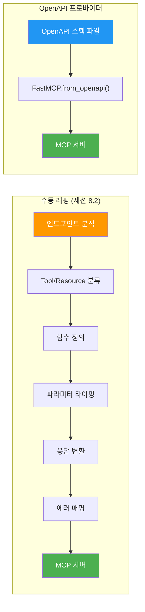
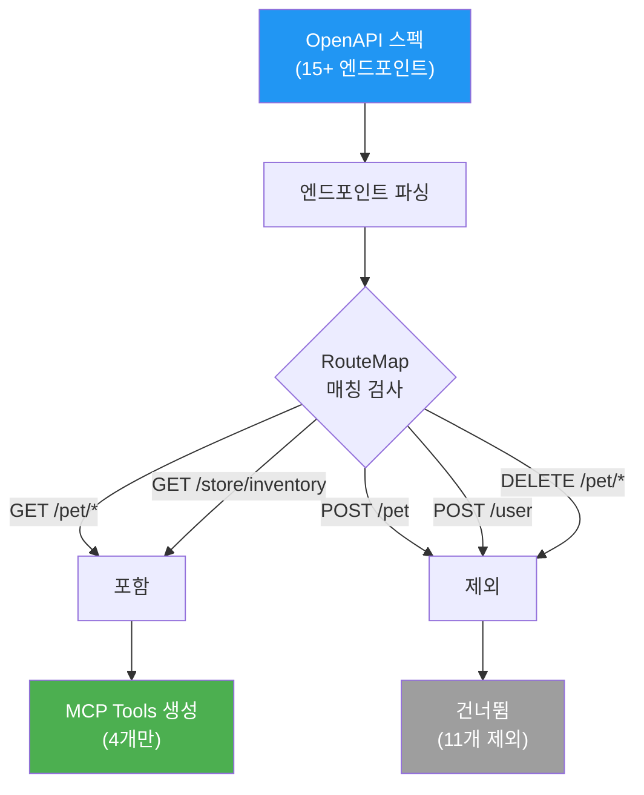
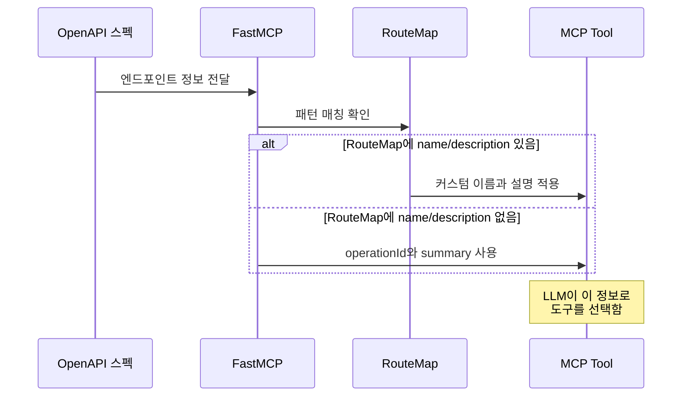
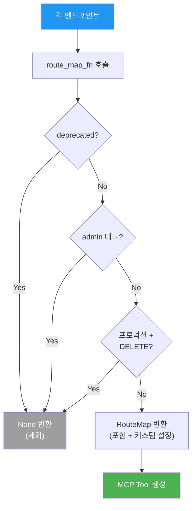
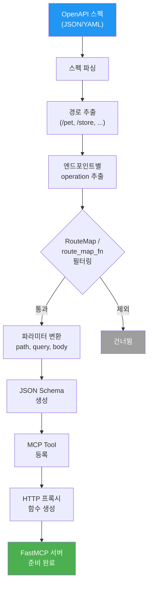

# FastMCP OpenAPI 프로바이더

> OpenAPI 스펙에서 MCP 도구를 자동으로 생성하는 FastMCP의 프로바이더 패턴을 학습합니다.

## 개요

[이전 섹션](08-ch8-실전-서버-rest-api-래핑과-파일시스템/02-02-github-api-래핑-서버-구축.md)에서 GitHub REST API를 MCP 서버로 래핑하는 과정을 직접 경험했습니다. 엔드포인트 하나하나에 대해 Tool이나 Resource를 정의하고, 응답 변환 함수를 작성하고, 에러 매핑을 구현했죠. GitHub API는 그나마 5~6개의 핵심 엔드포인트만 선별했기에 가능했습니다.

그런데 실무에서 마주치는 API들은 규모가 다릅니다. Slack API는 200개 이상, Stripe API는 300개 이상, Jira API는 500개 이상의 엔드포인트를 제공합니다. 이 모든 엔드포인트를 세션 8.2 방식으로 수동 래핑한다면? 코드만 수천 줄이 될 테고, API 버전이 올라갈 때마다 유지보수 지옥이 열릴 겁니다.

다행히 이런 대규모 API들에는 공통점이 하나 있습니다 — 거의 모든 API가 **OpenAPI(Swagger) 스펙**을 제공한다는 것이죠. FastMCP의 OpenAPI 프로바이더는 이 스펙 파일 하나만으로 MCP 도구를 자동 생성합니다. JSON이나 YAML 한 파일이 수백 개의 Tool 정의를 대체하는 셈입니다.

**선수 지식**: [REST→MCP 매핑 전략](08-ch8-실전-서버-rest-api-래핑과-파일시스템/01-01-rest-apimcp-매핑-전략.md)에서 배운 Tool/Resource 매핑 원칙, [GitHub API 래핑 서버 구축](08-ch8-실전-서버-rest-api-래핑과-파일시스템/02-02-github-api-래핑-서버-구축.md)에서 다룬 수동 래핑 패턴, FastMCP 기본 사용법

**학습 목표**:
- OpenAPI 스펙에서 MCP 도구가 자동 생성되는 내부 파이프라인을 설명할 수 있다
- RouteMap으로 노출할 엔드포인트를 선택적으로 필터링할 수 있다
- 자동 생성된 도구의 이름, 설명, 파라미터를 커스터마이징할 수 있다
- 자동 + 수동 하이브리드 패턴으로 유연한 서버를 구축할 수 있다

## 왜 알아야 할까?

세션 8.2에서 GitHub API 서버를 만들 때, 핵심 엔드포인트 5~6개를 래핑하는 데도 상당한 코드가 필요했습니다. `create_issue`, `list_issues`, `get_pull_request`, `add_comment` — 각각의 Tool에 대해 함수를 정의하고, 파라미터를 지정하고, 응답 변환을 구현했죠.

이제 시나리오를 바꿔보겠습니다. 회사에서 내부 마이크로서비스 10개를 LLM과 연동해야 합니다. 각 서비스마다 평균 20개의 엔드포인트가 있다면 총 200개의 Tool을 수동으로 작성해야 합니다. 게다가 서비스가 업데이트되면? 수동으로 동기화해야 하고, 빠뜨린 엔드포인트가 있으면 LLM은 해당 기능을 사용할 수 없습니다.

OpenAPI 프로바이더는 이 문제를 근본적으로 해결합니다. OpenAPI 스펙은 이미 엔드포인트의 경로, 메서드, 파라미터, 응답 형식을 **기계가 읽을 수 있는 형태**로 기술하고 있거든요. FastMCP는 이 스펙을 파싱하여 각 엔드포인트를 MCP Tool로 자동 변환합니다. API가 업데이트되면 스펙 파일만 교체하면 되고, 수백 개의 엔드포인트도 코드 몇 줄로 MCP 서버가 됩니다.

## 핵심 개념

### 개념 1: OpenAPI 프로바이더란 — "설계도만 주면 자동으로 만들어줍니다"

> 💡 **비유**: 건축가가 설계도(blueprint)를 그리면 시공사가 그대로 건물을 짓듯이, OpenAPI 스펙이라는 설계도를 FastMCP에 넘기면 MCP 도구가 자동으로 만들어집니다. 설계도에 "1층에 문 3개, 2층에 창문 5개"라고 적혀 있으면, 시공사는 일일이 물어보지 않고 정확히 그만큼 만들죠.

OpenAPI 스펙(구 Swagger 스펙)은 REST API의 구조를 기술하는 표준 형식입니다. 각 엔드포인트의 URL 경로, HTTP 메서드, 요청 파라미터, 응답 스키마를 JSON 또는 YAML로 정의합니다. 이 스펙 파일은 대부분의 REST API가 이미 제공하고 있거든요 — GitHub, Slack, Stripe, Petstore 등 거의 모든 주요 API에서 다운로드할 수 있습니다.

FastMCP의 OpenAPI 프로바이더는 이 스펙을 읽어서 각 엔드포인트를 MCP Tool로 자동 변환합니다. 핵심 매핑 규칙은 다음과 같습니다:

| OpenAPI 요소 | MCP 요소 | 변환 규칙 |
|-------------|----------|----------|
| 엔드포인트 (path + method) | Tool | `GET /pets/{id}` → `getPetById` Tool |
| operationId | Tool 이름 | operationId가 있으면 그대로 사용, 없으면 자동 생성 |
| summary / description | Tool 설명 | LLM이 도구의 용도를 파악하는 데 사용 |
| parameters (path, query) | Tool 파라미터 | 타입과 필수 여부가 그대로 반영 |
| requestBody | Tool 파라미터 | JSON 스키마가 Tool의 입력 스키마로 변환 |

세션 8.2에서 수동으로 작성한 GitHub 서버와 비교하면 차이가 극명합니다:

> 📊 **그림 1**: 수동 래핑 vs OpenAPI 프로바이더 자동 생성 비교



수동 래핑은 6단계를 거쳐야 하지만, OpenAPI 프로바이더는 스펙 파일 하나로 한 번에 완성됩니다. 물론 자동 생성에도 한계가 있고(이건 개념 5에서 다룹니다), 그래서 실무에서는 자동 + 수동을 섞는 하이브리드 패턴을 많이 쓰죠.

기본적인 사용 코드를 먼저 살펴보겠습니다:

```python
from fastmcp import FastMCP
import httpx

# OpenAPI 스펙 URL 또는 로컬 파일 경로
OPENAPI_SPEC_URL = "https://petstore3.swagger.io/api/v3/openapi.json"

# 스펙에서 MCP 서버 자동 생성
mcp = FastMCP.from_openapi(
    openapi_spec=OPENAPI_SPEC_URL,
    name="Petstore MCP Server",
)
```

이 세 줄의 코드가 Petstore API의 모든 엔드포인트를 MCP Tool로 변환합니다. `GET /pet/{petId}`는 `getPetById` Tool이 되고, `POST /pet`는 `addPet` Tool이 되며, 각 Tool의 파라미터와 설명이 스펙에서 자동으로 추출됩니다.

> 💡 **알고 계셨나요?**: OpenAPI 스펙은 URL로 직접 전달할 수도 있고, 로컬 JSON/YAML 파일 경로로 전달할 수도 있습니다. 기업 내부 API처럼 외부에서 접근할 수 없는 스펙은 파일로 다운로드한 후 경로를 전달하면 됩니다. `dict` 형태로 직접 전달하는 것도 가능합니다.

### 개념 2: RouteMap — 필요한 엔드포인트만 골라 노출하기

> 💡 **비유**: 뷔페에 50가지 요리가 있다고 전부 접시에 담을 필요는 없죠. 원하는 메뉴만 골라서 담듯이, RouteMap은 API의 수많은 엔드포인트 중 LLM에 노출할 것만 선택하는 필터입니다.

대부분의 API는 LLM이 사용해야 할 엔드포인트보다 훨씬 많은 엔드포인트를 가지고 있습니다. Petstore API만 해도 `addPet`, `updatePet`, `deletePet`, `findPetsByStatus`, `findPetsByTags`, `getPetById`, `uploadFile`, `getInventory`, `placeOrder`, `getOrderById`, `deleteOrder`, `createUser`, `loginUser`, `logoutUser`, `getUserByName` 등 15개가 넘는 엔드포인트가 있습니다.

하지만 실제로 LLM에 노출해야 할 것은 일부입니다. 예를 들어 펫 관리 시스템에서 사용자 관리(`createUser`, `loginUser`) 엔드포인트까지 LLM에 노출하면, 불필요한 도구가 LLM의 컨텍스트를 오염시키고, 보안 위험까지 생깁니다.

RouteMap은 이 문제를 해결합니다. 어떤 엔드포인트를 MCP Tool로 변환할지 **포함(include)**과 **제외(exclude)** 패턴으로 제어할 수 있거든요:

```python
from fastmcp import FastMCP
from fastmcp.server.openapi import RouteMap

mcp = FastMCP.from_openapi(
    openapi_spec="https://petstore3.swagger.io/api/v3/openapi.json",
    name="Petstore MCP Server",
    route_maps=[
        # /pet 경로 아래의 GET 요청만 Tool로 노출
        RouteMap(methods=["GET"], pattern="/pet*"),
        # /store/inventory도 포함
        RouteMap(methods=["GET"], pattern="/store/inventory"),
    ],
)
```

> 📊 **그림 2**: RouteMap 필터링 흐름 — 포함/제외 매칭



RouteMap의 주요 매개변수를 정리하면:

| 매개변수 | 타입 | 설명 | 예시 |
|---------|------|------|------|
| `pattern` | `str` | URL 경로 패턴 (glob 스타일) | `"/pet*"`, `"/store/*"` |
| `methods` | `list[str]` | HTTP 메서드 필터 | `["GET"]`, `["GET", "POST"]` |
| `name` | `str` | 생성될 Tool의 이름 커스터마이징 | `"list_pets"` |
| `description` | `str` | Tool 설명 커스터마이징 | `"펫 목록을 조회합니다"` |

RouteMap은 리스트로 전달되며, 리스트에 **포함된 패턴과 일치하는 엔드포인트만** Tool로 변환됩니다. 리스트에 없는 엔드포인트는 자동으로 제외되죠. 이 화이트리스트 방식은 보안 관점에서도 바람직합니다 — 명시적으로 허용한 것만 노출되니까요.

패턴 매칭에서 주의할 점이 하나 있습니다. `pattern="/pet*"`는 `/pet`, `/pet/{petId}`, `/pet/findByStatus`, `/pet/findByTags`를 모두 매칭합니다. 더 세밀한 제어가 필요하다면 정확한 경로를 지정하세요:

```python
route_maps=[
    # 정확히 이 두 경로만 매칭
    RouteMap(methods=["GET"], pattern="/pet/findByStatus"),
    RouteMap(methods=["GET"], pattern="/pet/{petId}"),
]
```

> ⚠️ **흔한 오해**: "RouteMap을 지정하지 않으면 아무 Tool도 생성되지 않는다"
> 아닙니다! `route_maps` 파라미터를 아예 생략하면 **모든 엔드포인트**가 Tool로 변환됩니다. RouteMap은 필터를 **추가**하는 것이지, 필수 조건이 아닙니다. 반대로 빈 리스트 `route_maps=[]`를 전달하면 아무 Tool도 생성되지 않죠.

### 개념 3: 도구 이름과 설명 커스터마이징

> 💡 **비유**: 외국에서 수입한 제품에 현지 언어 라벨을 붙이는 것과 같습니다. 원래 제품명이 `findPetsByStatus`라면, 한국 매장에서는 "상태별 펫 검색"이라는 라벨을 붙여야 고객이 쉽게 이해하겠죠. OpenAPI 프로바이더가 자동 생성한 Tool 이름과 설명도 마찬가지로 커스터마이징할 수 있습니다.

OpenAPI 스펙에서 자동 생성되는 Tool의 기본 이름은 `operationId` 필드에서 가져옵니다. Petstore API의 경우 `addPet`, `getPetById`, `findPetsByStatus` 같은 camelCase 이름이 됩니다. 영어권 LLM에는 나쁘지 않지만, 한국어 사용 환경이나 특수한 명명 규칙이 있는 프로젝트에서는 커스터마이징이 필요합니다.

RouteMap의 `name`과 `description` 파라미터로 이를 제어할 수 있습니다:

```python
route_maps=[
    RouteMap(
        methods=["GET"],
        pattern="/pet/findByStatus",
        name="search_pets_by_status",
        description="판매 상태(available, pending, sold)로 펫을 검색합니다. "
                    "status 파라미터에 상태값을 전달하세요.",
    ),
    RouteMap(
        methods=["GET"],
        pattern="/pet/{petId}",
        name="get_pet_detail",
        description="펫 ID로 상세 정보를 조회합니다. "
                    "이름, 카테고리, 사진 URL, 태그, 판매 상태를 반환합니다.",
    ),
    RouteMap(
        methods=["POST"],
        pattern="/pet",
        name="register_new_pet",
        description="새로운 펫을 등록합니다. "
                    "이름(name)과 사진 URL(photoUrls)이 필수입니다.",
    ),
]
```

커스터마이징이 중요한 이유는 LLM의 도구 선택 정확도에 직접적인 영향을 주기 때문입니다. LLM은 도구를 선택할 때 이름과 설명을 보고 판단하거든요. `findPetsByStatus`보다 `search_pets_by_status`가, 그리고 영어 설명보다 한국어 설명이 한국어로 대화하는 LLM에게 더 명확합니다.

> 📊 **그림 3**: Tool 이름/설명 커스터마이징의 내부 흐름



이름 커스터마이징 시 실용적인 가이드라인을 정리하면:

| 원칙 | 좋은 예 | 나쁜 예 | 이유 |
|------|---------|---------|------|
| 동사_목적어 형식 | `search_pets` | `pet_search_function` | LLM이 액션을 명확히 파악 |
| snake_case 사용 | `get_pet_detail` | `getPetDetail` | Python 컨벤션 일관성 |
| 20자 이내 | `list_orders` | `list_all_store_orders_by_date` | 너무 긴 이름은 오히려 혼란 |
| 중복 방지 | `get_pet`, `list_pets` | `pet1`, `pet2` | 의미 구분 불가 |

설명(description)은 더 중요합니다. LLM이 도구를 올바르게 사용하려면 **어떤 파라미터를 어떻게 전달해야 하는지**까지 설명에 포함해야 합니다. 특히 enum 값이 있는 파라미터(`status`가 `available`, `pending`, `sold` 중 하나)는 설명에 명시해주는 것이 좋습니다.

```python
RouteMap(
    methods=["GET"],
    pattern="/pet/findByStatus",
    name="search_pets_by_status",
    # 파라미터 값과 용도를 상세히 기술
    description=(
        "판매 상태로 펫을 검색합니다.\n"
        "- status: 'available'(판매중), 'pending'(예약중), 'sold'(판매완료)\n"
        "- 여러 상태를 동시에 검색하려면 쉼표로 구분하세요."
    ),
)
```

> 🔥 **실무 팁**: OpenAPI 스펙의 `summary`와 `description`이 이미 잘 작성되어 있다면 커스터마이징 없이 기본값을 쓰는 것도 좋습니다. 불필요한 커스터마이징은 유지보수 부담만 늘리니까요. 이름만 snake_case로 통일하고, 설명은 원본을 활용하는 **선택적 커스터마이징** 전략이 실무에서 자주 쓰입니다.

### 개념 4: route_map_fn — 동적 라우트 매핑

> 💡 **비유**: RouteMap이 "이 식당은 한식 메뉴만 제공합니다"라는 고정 안내문이라면, `route_map_fn`은 "지금 주문하신 분이 채식주의자시니까 채식 메뉴만 보여드리겠습니다"라는 맞춤형 응대입니다. 정적 규칙이 아니라 **상황에 따라 달라지는** 동적 필터링이 가능합니다.

RouteMap은 서버 시작 시 고정되는 정적 필터입니다. 하지만 실무에서는 요청의 컨텍스트에 따라 다른 엔드포인트를 노출해야 할 때가 있습니다. 예를 들어:

- **권한 기반**: 관리자에게는 CRUD 전체, 일반 사용자에게는 읽기만
- **테넌트 기반**: A 고객사에는 주문 API, B 고객사에는 재고 API
- **환경 기반**: 개발 환경에서는 디버그 엔드포인트 포함, 프로덕션에서는 제외

`route_map_fn`은 이런 동적 결정을 가능하게 하는 함수 기반 필터링입니다. OpenAPI 스펙의 각 엔드포인트에 대해 호출되며, `RouteMap`을 반환하면 포함, `None`을 반환하면 제외됩니다:

```python
from fastmcp import FastMCP
from fastmcp.server.openapi import RouteMap
import os

def dynamic_route_filter(method: str, path: str, operation: dict) -> RouteMap | None:
    """환경변수와 엔드포인트 속성에 따라 동적으로 필터링"""

    # 프로덕션 환경에서는 DELETE 메서드 비활성화
    env = os.environ.get("ENVIRONMENT", "development")
    if env == "production" and method == "DELETE":
        return None

    # deprecated 표시된 엔드포인트 제외
    if operation.get("deprecated", False):
        return None

    # 태그 기반 필터링: 'admin' 태그가 붙은 것은 제외
    tags = operation.get("tags", [])
    if "admin" in tags:
        return None

    # 나머지는 모두 포함 (기본 설정으로)
    return RouteMap(methods=[method], pattern=path)


mcp = FastMCP.from_openapi(
    openapi_spec="https://petstore3.swagger.io/api/v3/openapi.json",
    name="Petstore MCP Server",
    route_map_fn=dynamic_route_filter,
)
```

`route_map_fn`은 세 개의 인자를 받습니다:

| 인자 | 타입 | 설명 | 예시 |
|------|------|------|------|
| `method` | `str` | HTTP 메서드 (대문자) | `"GET"`, `"POST"` |
| `path` | `str` | 엔드포인트 경로 | `"/pet/{petId}"` |
| `operation` | `dict` | OpenAPI operation 객체 전체 | `{"operationId": "getPetById", "tags": ["pet"], ...}` |

반환값이 `RouteMap`이면 해당 엔드포인트가 Tool로 변환되고, `None`이면 건너뜁니다. 반환하는 `RouteMap`에 `name`과 `description`을 지정하면 커스터마이징도 동시에 할 수 있습니다:

```python
def custom_naming_filter(method: str, path: str, operation: dict) -> RouteMap | None:
    """동적 필터링 + 이름 커스터마이징을 동시에"""

    # pet 관련 엔드포인트만 포함
    if not path.startswith("/pet"):
        return None

    # operationId를 snake_case로 변환하여 이름 지정
    op_id = operation.get("operationId", "")
    snake_name = _camel_to_snake(op_id)  # getPetById → get_pet_by_id

    # 한국어 설명 추가
    summary = operation.get("summary", "")
    korean_desc = f"{summary} (Petstore API)"

    return RouteMap(
        methods=[method],
        pattern=path,
        name=snake_name,
        description=korean_desc,
    )

def _camel_to_snake(name: str) -> str:
    """camelCase를 snake_case로 변환"""
    import re
    s1 = re.sub(r"(.)([A-Z][a-z]+)", r"\1_\2", name)
    return re.sub(r"([a-z0-9])([A-Z])", r"\1_\2", s1).lower()
```

> 📊 **그림 4**: route_map_fn 동적 매핑 의사결정 흐름



`route_map_fn`과 `route_maps`를 동시에 전달할 수도 있습니다. 이 경우 `route_maps`가 먼저 적용되고, 매칭된 엔드포인트에 대해 `route_map_fn`이 추가로 실행됩니다. 하지만 두 가지를 섞으면 로직이 복잡해지므로, **하나만 선택**하는 것을 권장합니다.

> 🔥 **실무 팁**: `route_map_fn` 안에서 데이터베이스나 외부 API를 호출하는 것은 피하세요. 이 함수는 서버 시작 시 모든 엔드포인트에 대해 호출되므로, 느린 I/O가 포함되면 서버 시작이 크게 지연됩니다. 환경변수나 설정 파일 읽기 정도가 적절한 수준입니다.

### 개념 5: 파라미터 자동 처리와 한계

> 💡 **비유**: 자동 번역기가 대부분의 문장을 잘 번역하지만, 관용구나 문화적 맥락이 필요한 표현은 어색하게 번역하듯이, OpenAPI 프로바이더도 대부분의 파라미터를 잘 변환하지만 복잡한 구조에서는 한계가 있습니다.

OpenAPI 프로바이더는 스펙에 정의된 파라미터를 MCP Tool의 입력 스키마로 자동 변환합니다. 이 과정이 내부적으로 어떻게 동작하는지 이해하면, 한계를 만났을 때 적절한 대응 전략을 세울 수 있습니다.

**자동 변환이 잘 되는 경우**:

```python
# OpenAPI 스펙 정의 (YAML로 표현)
"""
/pet/findByStatus:
  get:
    parameters:
      - name: status
        in: query
        required: true
        schema:
          type: string
          enum: [available, pending, sold]
"""
# → 자동 생성되는 MCP Tool 파라미터:
# name="findPetsByStatus"
# parameters: {"status": {"type": "string", "enum": ["available", "pending", "sold"]}}
```

파라미터 위치별 변환 규칙을 정리하면:

| 파라미터 위치 | OpenAPI 정의 | MCP Tool 변환 | 내부 처리 |
|-------------|-------------|--------------|----------|
| path | `in: path` (`/pet/{petId}`) | 필수 파라미터 | URL 템플릿에 자동 삽입 |
| query | `in: query` | 선택/필수 파라미터 | 쿼리스트링으로 전달 |
| header | `in: header` | 보통 자동 처리 | 인증 등은 lifespan에서 처리 |
| requestBody | `content: application/json` | 객체형 파라미터 | JSON body로 전달 |

> 📊 **그림 5**: OpenAPI 프로바이더 내부 파이프라인 — 스펙에서 Tool까지



이제 **한계**를 살펴보겠습니다. 자동 변환이 어려운 경우들이 있거든요:

**1. 깊게 중첩된 객체 스키마**

```python
# OpenAPI에서 이렇게 정의된 requestBody는 변환이 가능하지만,
# LLM이 올바르게 사용하기 어려울 수 있습니다
"""
requestBody:
  content:
    application/json:
      schema:
        type: object
        properties:
          pet:
            type: object
            properties:
              category:
                type: object
                properties:
                  id: {type: integer}
                  name: {type: string}
              tags:
                type: array
                items:
                  type: object
                  properties:
                    id: {type: integer}
                    name: {type: string}
"""
# 3단계 이상 중첩되면 LLM이 파라미터 구조를 정확히 파악하기 어렵습니다.
# 이런 경우 수동 래핑으로 입력을 단순화하는 것이 낫습니다.
```

**2. 파일 업로드 (multipart/form-data)**

```python
# 파일 업로드 엔드포인트는 자동 변환의 대표적 한계
"""
/pet/{petId}/uploadImage:
  post:
    requestBody:
      content:
        multipart/form-data:
          schema:
            type: object
            properties:
              additionalMetadata: {type: string}
              file: {type: string, format: binary}
"""
# MCP Tool의 파라미터로 바이너리 파일을 전달하는 표준 방법이 없습니다.
# 이런 엔드포인트는 수동 래핑으로 별도 처리해야 합니다.
```

**3. 스트리밍 응답**

서버에서 SSE(Server-Sent Events)나 청크 응답을 반환하는 엔드포인트도 자동 변환이 어렵습니다. OpenAPI 프로바이더는 일반적인 요청-응답 패턴을 가정하기 때문이죠.

**4. 인증이 복잡한 경우**

OAuth2 flow, API Key + Secret 조합, 요청별 다른 인증 등은 자동으로 처리되지 않습니다. 이런 경우 lifespan에서 인증을 미리 설정하거나, 수동 래핑을 해야 합니다.

이런 한계를 만났을 때의 전략은 **하이브리드 패턴**입니다 — 자동 생성으로 대부분의 엔드포인트를 커버하고, 한계가 있는 부분만 수동으로 추가합니다. 실습 섹션의 5단계에서 이 패턴을 직접 구현해보겠습니다.

> ⚠️ **흔한 오해**: "OpenAPI 프로바이더가 응답도 자동으로 변환해준다"
> OpenAPI 프로바이더는 **요청 쪽**(파라미터 → HTTP 요청)은 자동 처리하지만, **응답 쪽**은 API가 반환하는 JSON을 그대로 전달합니다. 세션 8.2에서 구현한 `transform_repo()` 같은 응답 변환이 필요하다면, 수동 래핑이나 후처리 미들웨어를 추가해야 합니다.

## 실습: 직접 해보기

이번 실습에서는 Petstore OpenAPI 스펙을 활용하여 단계적으로 MCP 서버를 구축합니다. 기본 자동 생성부터 RouteMap 필터링, 커스터마이징, 그리고 하이브리드 패턴까지 5단계로 진행합니다.

### 1단계: 프로젝트 설정과 OpenAPI 스펙 준비

먼저 프로젝트를 생성하고 필요한 패키지를 설치합니다:

```console
mkdir petstore-mcp && cd petstore-mcp
python -m venv .venv && source .venv/bin/activate
pip install "fastmcp>=2.0" httpx
```

Petstore OpenAPI 스펙을 로컬에 다운로드하여 사용하겠습니다. URL을 직접 전달할 수도 있지만, 로컬 파일을 사용하면 네트워크 의존성 없이 작업할 수 있고, 스펙을 수정해볼 수도 있습니다:

```python
# download_spec.py — Petstore OpenAPI 스펙 다운로드
import httpx
import json
from pathlib import Path

def download_petstore_spec():
    """Petstore v3 OpenAPI 스펙을 로컬에 저장"""
    url = "https://petstore3.swagger.io/api/v3/openapi.json"
    response = httpx.get(url)
    response.raise_for_status()

    spec = response.json()
    spec_path = Path("petstore_openapi.json")
    spec_path.write_text(json.dumps(spec, indent=2))

    # 스펙 요약 출력
    paths = spec.get("paths", {})
    total_ops = sum(
        len(methods) for methods in paths.values()
    )
    print(f"스펙 다운로드 완료: {spec_path}")
    print(f"경로 수: {len(paths)}")
    print(f"총 엔드포인트 수: {total_ops}")

    # 엔드포인트 목록 출력
    for path, methods in sorted(paths.items()):
        for method in sorted(methods.keys()):
            if method in ("get", "post", "put", "delete", "patch"):
                op_id = methods[method].get("operationId", "N/A")
                print(f"  {method.upper():6s} {path:30s} → {op_id}")

if __name__ == "__main__":
    download_petstore_spec()
```

```run:python
# 스펙 다운로드 시뮬레이션 (실제 실행 시 네트워크 필요)
petstore_endpoints = [
    ("GET",    "/pet/findByStatus",     "findPetsByStatus"),
    ("GET",    "/pet/findByTags",       "findPetsByTags"),
    ("GET",    "/pet/{petId}",          "getPetById"),
    ("POST",   "/pet",                  "addPet"),
    ("PUT",    "/pet",                  "updatePet"),
    ("DELETE", "/pet/{petId}",          "deletePet"),
    ("POST",   "/pet/{petId}/uploadImage", "uploadFile"),
    ("GET",    "/store/inventory",      "getInventory"),
    ("POST",   "/store/order",          "placeOrder"),
    ("GET",    "/store/order/{orderId}","getOrderById"),
    ("DELETE", "/store/order/{orderId}","deleteOrder"),
    ("POST",   "/user",                "createUser"),
    ("POST",   "/user/createWithList",  "createUsersWithListInput"),
    ("GET",    "/user/login",           "loginUser"),
    ("GET",    "/user/logout",          "logoutUser"),
    ("GET",    "/user/{username}",      "getUserByName"),
    ("PUT",    "/user/{username}",      "updateUser"),
    ("DELETE", "/user/{username}",      "deleteUser"),
]

print(f"경로 수: 13")
print(f"총 엔드포인트 수: {len(petstore_endpoints)}")
print()
for method, path, op_id in petstore_endpoints:
    print(f"  {method:6s} {path:30s} -> {op_id}")
```

```output
경로 수: 13
총 엔드포인트 수: 18

  GET    /pet/findByStatus              -> findPetsByStatus
  GET    /pet/findByTags                -> findPetsByTags
  GET    /pet/{petId}                   -> getPetById
  POST   /pet                           -> addPet
  PUT    /pet                           -> updatePet
  DELETE /pet/{petId}                   -> deletePet
  POST   /pet/{petId}/uploadImage       -> uploadFile
  GET    /store/inventory               -> getInventory
  POST   /store/order                   -> placeOrder
  GET    /store/order/{orderId}         -> getOrderById
  DELETE /store/order/{orderId}         -> deleteOrder
  POST   /user                          -> createUser
  POST   /user/createWithList           -> createUsersWithListInput
  GET    /user/login                    -> loginUser
  GET    /user/logout                   -> logoutUser
  GET    /user/{username}               -> getUserByName
  PUT    /user/{username}               -> updateUser
  DELETE /user/{username}               -> deleteUser
```

18개의 엔드포인트가 있습니다. 이 중에서 LLM에 노출할 것과 숨길 것을 구분해야 하는데, 그 전에 먼저 전부 자동 생성해보겠습니다.

### 2단계: 기본 자동 생성 서버

가장 단순한 형태의 OpenAPI 프로바이더 서버입니다. 스펙의 모든 엔드포인트가 MCP Tool로 변환됩니다:

```python
# server_basic.py — 가장 기본적인 OpenAPI 프로바이더 서버
from fastmcp import FastMCP

# 로컬 스펙 파일 사용 (URL도 가능)
mcp = FastMCP.from_openapi(
    openapi_spec="petstore_openapi.json",
    name="Petstore MCP Server",
)

if __name__ == "__main__":
    mcp.run()
```

이 세 줄로 18개의 MCP Tool이 자동 생성됩니다. 하지만 실제로 이렇게 사용하면 문제가 있습니다:

- `deleteUser`, `deleteOrder` 같은 위험한 작업이 LLM에 노출됨
- `uploadFile`은 바이너리 파일 업로드라 MCP에서 제대로 작동하지 않음
- `loginUser`, `logoutUser`는 세션 관리가 필요해서 단독 Tool로는 의미 없음
- 18개의 Tool이 모두 노출되면 LLM의 컨텍스트 윈도우를 낭비함

이런 문제를 해결하기 위해 3단계에서 RouteMap 필터링을 적용합니다.

### 3단계: RouteMap으로 필터링 — 펫 관리에 집중

RouteMap을 사용하여 펫 관련 읽기 작업과 재고 확인만 노출하겠습니다. 사용자 관리와 위험한 삭제 작업은 제외합니다:

```python
# server_filtered.py — RouteMap으로 안전한 엔드포인트만 노출
from fastmcp import FastMCP
from fastmcp.server.openapi import RouteMap

mcp = FastMCP.from_openapi(
    openapi_spec="petstore_openapi.json",
    name="Petstore MCP Server (Filtered)",
    route_maps=[
        # 펫 검색 기능 (읽기 전용)
        RouteMap(methods=["GET"], pattern="/pet/findByStatus"),
        RouteMap(methods=["GET"], pattern="/pet/findByTags"),
        RouteMap(methods=["GET"], pattern="/pet/{petId}"),
        # 펫 등록 (쓰기, 하지만 안전)
        RouteMap(methods=["POST"], pattern="/pet"),
        # 재고 확인 (읽기 전용)
        RouteMap(methods=["GET"], pattern="/store/inventory"),
        RouteMap(methods=["GET"], pattern="/store/order/{orderId}"),
    ],
)

if __name__ == "__main__":
    mcp.run()
```

```run:python
# 필터링 결과 확인
included = [
    ("GET",  "/pet/findByStatus",     "findPetsByStatus"),
    ("GET",  "/pet/findByTags",       "findPetsByTags"),
    ("GET",  "/pet/{petId}",          "getPetById"),
    ("POST", "/pet",                  "addPet"),
    ("GET",  "/store/inventory",      "getInventory"),
    ("GET",  "/store/order/{orderId}","getOrderById"),
]

excluded = [
    ("PUT",    "/pet",                 "updatePet"),
    ("DELETE", "/pet/{petId}",         "deletePet"),
    ("POST",   "/pet/{petId}/uploadImage", "uploadFile"),
    ("POST",   "/store/order",         "placeOrder"),
    ("DELETE", "/store/order/{orderId}","deleteOrder"),
    ("POST",   "/user",               "createUser"),
    ("GET",    "/user/login",          "loginUser"),
    ("GET",    "/user/logout",         "logoutUser"),
    ("GET",    "/user/{username}",     "getUserByName"),
    ("PUT",    "/user/{username}",     "updateUser"),
    ("DELETE", "/user/{username}",     "deleteUser"),
    ("POST",   "/user/createWithList", "createUsersWithListInput"),
]

print(f"포함된 Tool ({len(included)}개):")
for method, path, op_id in included:
    print(f"  [v] {method:6s} {path:30s} -> {op_id}")

print(f"\n제외된 엔드포인트 ({len(excluded)}개):")
for method, path, op_id in excluded:
    print(f"  [x] {method:6s} {path:30s} -> {op_id}")

print(f"\n총 18개 중 {len(included)}개만 노출 -> 컨텍스트 효율 {len(included)/18*100:.0f}% 절감")
```

```output
포함된 Tool (6개):
  [v] GET    /pet/findByStatus              -> findPetsByStatus
  [v] GET    /pet/findByTags                -> findPetsByTags
  [v] GET    /pet/{petId}                   -> getPetById
  [v] POST   /pet                           -> addPet
  [v] GET    /store/inventory               -> getInventory
  [v] GET    /store/order/{orderId}         -> getOrderById

제외된 엔드포인트 (12개):
  [x] PUT    /pet                           -> updatePet
  [x] DELETE /pet/{petId}                   -> deletePet
  [x] POST   /pet/{petId}/uploadImage       -> uploadFile
  [x] POST   /store/order                   -> placeOrder
  [x] DELETE /store/order/{orderId}         -> deleteOrder
  [x] POST   /user                          -> createUser
  [x] GET    /user/login                    -> loginUser
  [x] GET    /user/logout                   -> logoutUser
  [x] GET    /user/{username}               -> getUserByName
  [x] PUT    /user/{username}               -> updateUser
  [x] DELETE /user/{username}               -> deleteUser
  [x] POST   /user/createWithList           -> createUsersWithListInput

총 18개 중 6개만 노출 -> 컨텍스트 효율 33% 절감
```

18개에서 6개로 줄었습니다. 위험한 삭제 작업과 불필요한 사용자 관리 엔드포인트가 모두 제거되었고, LLM은 펫 검색/등록과 재고 확인에만 집중할 수 있게 되었습니다.

### 4단계: Tool 커스터마이징 — 한국어 설명 추가

이제 자동 생성된 Tool의 이름을 snake_case로 통일하고, 한국어 설명을 추가합니다. `route_map_fn`을 사용하여 일괄 적용합니다:

```python
# server_customized.py — 커스터마이징된 OpenAPI 프로바이더 서버
import re
from fastmcp import FastMCP
from fastmcp.server.openapi import RouteMap

# 한국어 설명 매핑 테이블
TOOL_DESCRIPTIONS: dict[str, tuple[str, str]] = {
    # operationId → (커스텀 이름, 한국어 설명)
    "findPetsByStatus": (
        "search_pets_by_status",
        "판매 상태로 펫을 검색합니다. "
        "status: 'available'(판매중), 'pending'(예약중), 'sold'(판매완료)",
    ),
    "findPetsByTags": (
        "search_pets_by_tags",
        "태그로 펫을 검색합니다. 여러 태그를 쉼표로 구분하여 전달하세요.",
    ),
    "getPetById": (
        "get_pet_detail",
        "펫 ID로 상세 정보를 조회합니다. "
        "이름, 카테고리, 사진 URL, 태그, 판매 상태를 반환합니다.",
    ),
    "addPet": (
        "register_pet",
        "새로운 펫을 등록합니다. "
        "이름(name)과 사진 URL(photoUrls) 배열이 필수입니다.",
    ),
    "getInventory": (
        "get_store_inventory",
        "상태별 펫 재고 수를 조회합니다. "
        "{'available': 10, 'pending': 3, 'sold': 5} 형태로 반환합니다.",
    ),
    "getOrderById": (
        "get_order_detail",
        "주문 ID로 주문 상세를 조회합니다. "
        "펫 ID, 수량, 배송 상태 등을 반환합니다.",
    ),
}

# 허용할 엔드포인트 목록
ALLOWED_ENDPOINTS: set[str] = set(TOOL_DESCRIPTIONS.keys())


def camel_to_snake(name: str) -> str:
    """camelCase → snake_case 변환"""
    s1 = re.sub(r"(.)([A-Z][a-z]+)", r"\1_\2", name)
    return re.sub(r"([a-z0-9])([A-Z])", r"\1_\2", s1).lower()


def korean_route_mapper(
    method: str, path: str, operation: dict,
) -> RouteMap | None:
    """operationId 기반으로 허용 목록 필터링 + 한국어 커스터마이징"""
    op_id = operation.get("operationId", "")

    if op_id not in ALLOWED_ENDPOINTS:
        return None

    custom_name, korean_desc = TOOL_DESCRIPTIONS[op_id]

    return RouteMap(
        methods=[method],
        pattern=path,
        name=custom_name,
        description=korean_desc,
    )


mcp = FastMCP.from_openapi(
    openapi_spec="petstore_openapi.json",
    name="Petstore MCP Server (Korean)",
    route_map_fn=korean_route_mapper,
)

if __name__ == "__main__":
    mcp.run()
```

```run:python
# 커스터마이징 결과 비교
before_after = [
    ("findPetsByStatus", "search_pets_by_status",
     "Finds Pets by status", "판매 상태로 펫을 검색합니다. status: 'available'(판매중), 'pending'(예약중), 'sold'(판매완료)"),
    ("getPetById", "get_pet_detail",
     "Find pet by ID", "펫 ID로 상세 정보를 조회합니다. 이름, 카테고리, 사진 URL, 태그, 판매 상태를 반환합니다."),
    ("addPet", "register_pet",
     "Add a new pet to the store", "새로운 펫을 등록합니다. 이름(name)과 사진 URL(photoUrls) 배열이 필수입니다."),
    ("getInventory", "get_store_inventory",
     "Returns pet inventories by status", "상태별 펫 재고 수를 조회합니다. {'available': 10, 'pending': 3, 'sold': 5} 형태로 반환합니다."),
]

print("Tool 커스터마이징 전후 비교:")
print("=" * 70)
for orig_name, new_name, orig_desc, new_desc in before_after:
    print(f"\n기본: {orig_name}")
    print(f"변경: {new_name}")
    print(f"  설명(전): {orig_desc}")
    print(f"  설명(후): {new_desc}")
```

```output
Tool 커스터마이징 전후 비교:
======================================================================

기본: findPetsByStatus
변경: search_pets_by_status
  설명(전): Finds Pets by status
  설명(후): 판매 상태로 펫을 검색합니다. status: 'available'(판매중), 'pending'(예약중), 'sold'(판매완료)

기본: getPetById
변경: get_pet_detail
  설명(전): Find pet by ID
  설명(후): 펫 ID로 상세 정보를 조회합니다. 이름, 카테고리, 사진 URL, 태그, 판매 상태를 반환합니다.

기본: addPet
변경: register_pet
  설명(전): Add a new pet to the store
  설명(후): 새로운 펫을 등록합니다. 이름(name)과 사진 URL(photoUrls) 배열이 필수입니다.

기본: getInventory
변경: get_store_inventory
  설명(전): Returns pet inventories by status
  설명(후): 상태별 펫 재고 수를 조회합니다. {'available': 10, 'pending': 3, 'sold': 5} 형태로 반환합니다.
```

snake_case 이름과 한국어 설명이 적용되었습니다. 이렇게 커스터마이징하면 한국어로 대화하는 LLM이 도구의 용도를 훨씬 정확하게 파악할 수 있습니다.

### 5단계: 하이브리드 패턴 — 자동 생성 + 수동 도구

이것이 실무에서 가장 많이 쓰는 패턴입니다. OpenAPI 프로바이더로 기본 CRUD를 자동 생성하고, 복잡한 비즈니스 로직이 필요한 도구는 수동으로 추가합니다:

```python
# server_hybrid.py — 하이브리드 패턴: 자동 생성 + 수동 도구
from contextlib import asynccontextmanager
from collections.abc import AsyncIterator
from dataclasses import dataclass
import json

import httpx
from fastmcp import FastMCP, Context
from fastmcp.server.openapi import RouteMap


@dataclass
class PetstoreContext:
    """서버 lifespan 동안 유지되는 공유 리소스"""
    client: httpx.AsyncClient
    base_url: str


@asynccontextmanager
async def petstore_lifespan(server: FastMCP) -> AsyncIterator[PetstoreContext]:
    """Petstore API용 HTTP 클라이언트 lifespan"""
    base_url = "https://petstore3.swagger.io/api/v3"
    async with httpx.AsyncClient(
        base_url=base_url,
        timeout=30.0,
        headers={"Content-Type": "application/json"},
    ) as client:
        yield PetstoreContext(client=client, base_url=base_url)


# route_map_fn으로 자동 생성 Tool 필터링
def pet_only_mapper(
    method: str, path: str, operation: dict,
) -> RouteMap | None:
    """펫 조회 관련 엔드포인트만 자동 생성"""
    allowed = {
        "findPetsByStatus": "search_pets_by_status",
        "getPetById": "get_pet_detail",
        "getInventory": "get_store_inventory",
    }
    op_id = operation.get("operationId", "")
    if op_id not in allowed:
        return None

    return RouteMap(
        methods=[method],
        pattern=path,
        name=allowed[op_id],
    )


# OpenAPI 프로바이더로 기본 서버 생성
mcp = FastMCP.from_openapi(
    openapi_spec="petstore_openapi.json",
    name="Petstore Hybrid Server",
    route_map_fn=pet_only_mapper,
    lifespan=petstore_lifespan,
)


# === 수동 도구: 자동 생성으로는 처리할 수 없는 복잡한 로직 ===

@mcp.tool()
async def register_pet_with_validation(
    name: str,
    category: str = "일반",
    status: str = "available",
    tags: list[str] | None = None,
    ctx: Context = None,  # type: ignore
) -> str:
    """새로운 펫을 검증 후 등록합니다.

    자동 생성 Tool과 달리 입력 검증, 기본값 적용, 한국어 응답을 제공합니다.
    - name: 펫 이름 (2자 이상, 50자 이하)
    - category: 카테고리 (기본값: '일반')
    - status: 'available', 'pending', 'sold' 중 택 1
    - tags: 태그 목록 (선택)
    """
    # 입력 검증 — 자동 생성에서는 불가능한 커스텀 로직
    if len(name) < 2 or len(name) > 50:
        return "오류: 펫 이름은 2자 이상 50자 이하여야 합니다."

    valid_statuses = {"available", "pending", "sold"}
    if status not in valid_statuses:
        return f"오류: status는 {valid_statuses} 중 하나여야 합니다."

    lifespan_ctx = ctx.request_context.lifespan_context
    client = lifespan_ctx.client

    # API 요청 body 구성
    body = {
        "name": name,
        "category": {"id": 0, "name": category},
        "photoUrls": [],  # 기본값
        "status": status,
    }
    if tags:
        body["tags"] = [{"id": i, "name": t} for i, t in enumerate(tags)]

    response = await client.post("/pet", json=body)

    if response.status_code == 200:
        data = response.json()
        return (
            f"펫 등록 완료!\n"
            f"  ID: {data.get('id')}\n"
            f"  이름: {data.get('name')}\n"
            f"  카테고리: {category}\n"
            f"  상태: {status}\n"
            f"  태그: {', '.join(tags) if tags else '없음'}"
        )
    else:
        return f"등록 실패 (HTTP {response.status_code}): {response.text}"


@mcp.tool()
async def search_pets_summary(
    status: str = "available",
    max_results: int = 5,
    ctx: Context = None,  # type: ignore
) -> str:
    """펫 검색 결과를 한국어로 요약합니다.

    자동 생성 Tool은 API 응답을 그대로 반환하지만,
    이 도구는 핵심 정보만 추출하여 읽기 좋게 정리합니다.
    - status: 'available', 'pending', 'sold'
    - max_results: 최대 결과 수 (기본 5)
    """
    lifespan_ctx = ctx.request_context.lifespan_context
    client = lifespan_ctx.client

    response = await client.get(
        "/pet/findByStatus",
        params={"status": status},
    )

    if response.status_code != 200:
        return f"검색 실패 (HTTP {response.status_code})"

    pets = response.json()[:max_results]

    status_kr = {"available": "판매중", "pending": "예약중", "sold": "판매완료"}

    lines = [f"=== {status_kr.get(status, status)} 펫 목록 ({len(pets)}건) ===\n"]
    for pet in pets:
        name = pet.get("name", "이름 없음")
        pet_id = pet.get("id", "N/A")
        category = pet.get("category", {}).get("name", "미분류")
        tag_names = [t["name"] for t in pet.get("tags", []) if t.get("name")]

        lines.append(f"  [{pet_id}] {name}")
        lines.append(f"      카테고리: {category}")
        if tag_names:
            lines.append(f"      태그: {', '.join(tag_names)}")
        lines.append("")

    return "\n".join(lines)


@mcp.resource("petstore://stats")
async def get_store_stats(ctx: Context = None) -> str:  # type: ignore
    """Petstore 전체 통계를 Resource로 제공합니다.

    OpenAPI 프로바이더는 Tool만 생성하므로,
    Resource는 수동으로 추가해야 합니다.
    """
    lifespan_ctx = ctx.request_context.lifespan_context
    client = lifespan_ctx.client

    response = await client.get("/store/inventory")
    if response.status_code != 200:
        return json.dumps({"error": "통계 조회 실패"})

    inventory = response.json()
    total = sum(inventory.values())

    stats = {
        "총_펫_수": total,
        "상태별_현황": inventory,
        "서버": "Petstore v3",
    }
    return json.dumps(stats, ensure_ascii=False, indent=2)


if __name__ == "__main__":
    mcp.run()
```

이 하이브리드 서버의 도구 구성을 정리하면:

| 도구 | 타입 | 생성 방식 | 역할 |
|------|------|----------|------|
| `search_pets_by_status` | Tool | 자동 | 상태별 펫 검색 (원본 응답) |
| `get_pet_detail` | Tool | 자동 | 펫 상세 조회 (원본 응답) |
| `get_store_inventory` | Tool | 자동 | 재고 현황 (원본 응답) |
| `register_pet_with_validation` | Tool | 수동 | 입력 검증 + 한국어 응답 |
| `search_pets_summary` | Tool | 수동 | 검색 결과 한국어 요약 |
| `petstore://stats` | Resource | 수동 | 전체 통계 (컨텍스트용) |

자동 생성 3개 + 수동 Tool 2개 + 수동 Resource 1개로, 각각의 장점을 살린 구성입니다. 자동 생성은 빠른 구현과 스펙 동기화를, 수동 래핑은 커스텀 로직과 LLM 친화적 응답을 담당합니다.

> 🔥 **실무 팁**: 하이브리드 패턴에서 자동 생성과 수동 도구의 이름이 충돌하지 않도록 주의하세요. OpenAPI의 `addPet`을 `register_pet`으로 커스터마이징한 상태에서 수동으로도 `register_pet` Tool을 추가하면 충돌이 발생합니다. 수동 도구에는 `_with_validation`, `_summary` 같은 접미사를 붙여 구분하는 것이 안전합니다.

## 더 깊이 알아보기

### OpenAPI에서 MCP로 — API 표준화의 역사

API 표준화의 역사를 돌아보면, OpenAPI 프로바이더가 왜 자연스러운 진화인지 이해할 수 있습니다.

2010년, Tony Tam이 Wordnik이라는 온라인 사전 서비스에서 REST API를 문서화하기 위해 **Swagger**라는 도구를 만들었습니다. API 엔드포인트를 JSON으로 기술하면 문서가 자동 생성되는 획기적인 아이디어였죠. Swagger는 빠르게 인기를 얻었고, 2015년에 Linux Foundation 산하 OpenAPI Initiative에 기부되면서 **OpenAPI Specification**이라는 공식 이름을 갖게 됩니다.

OpenAPI가 가져온 핵심 변화는 "API가 기계도 읽을 수 있는 형식으로 자신을 설명한다"는 것이었습니다. 이 철학은 자동 코드 생성, 테스트 자동화, 문서 자동화 등 수많은 도구의 기반이 되었습니다. Swagger Codegen, OpenAPI Generator 같은 도구들이 스펙에서 클라이언트 코드를 자동 생성했죠.

2024년 11월, Anthropic이 **Model Context Protocol(MCP)**을 발표합니다. MCP의 핵심 사상 중 하나는 "외부 시스템의 기능을 LLM이 이해할 수 있는 표준 형식으로 기술한다"는 것인데요 — 이건 사실상 OpenAPI의 철학을 LLM 시대에 맞게 재해석한 것입니다. OpenAPI가 "개발자가 읽는 API 명세"였다면, MCP는 "LLM이 읽는 도구 명세"인 셈이죠.

FastMCP의 OpenAPI 프로바이더는 이 두 세계를 직접 연결합니다. "이미 OpenAPI 스펙으로 잘 문서화된 API가 있다면, 그걸 MCP 도구로 자동 변환하자"는 발상이죠. OpenAPI 스펙의 `operationId`가 MCP Tool의 이름이 되고, `summary`가 Tool의 설명이 되며, `parameters`가 Tool의 입력 스키마가 됩니다.

FastMCP v2에서 이 기능이 처음 도입되었고, v2.3 이후 `RouteMap`과 `route_map_fn`이 추가되면서 실무에서 사용할 수 있는 수준의 유연성을 갖추게 되었습니다. 현재 FastMCP는 OpenAPI 3.0과 3.1 스펙을 모두 지원하며, Swagger 2.0 형식도 내부적으로 변환하여 처리합니다.

### FastMCP Provider 아키텍처의 설계 철학

FastMCP의 OpenAPI 프로바이더는 더 넓은 **Provider 아키텍처**의 일부입니다. Provider는 "외부 시스템을 MCP 서버로 자동 변환하는 어댑터"라는 추상화인데요, OpenAPI 말고도 다양한 Provider가 존재하거나 개발 중입니다.

Provider 패턴의 핵심은 **관심사의 분리**입니다:

1. **스펙 파싱**: 외부 시스템의 메타데이터를 읽는다 (OpenAPI JSON, GraphQL 스키마 등)
2. **매핑 결정**: 어떤 기능을 어떤 MCP 프리미티브로 변환할지 결정한다 (RouteMap)
3. **프록시 생성**: 실제 MCP Tool이 호출되면 원본 시스템에 요청을 전달하는 프록시 함수를 생성한다
4. **등록**: 생성된 Tool/Resource를 FastMCP 서버에 등록한다

이 4단계가 깔끔하게 분리되어 있기 때문에, 새로운 Provider를 만들 때도 같은 패턴을 따르면 됩니다. 예를 들어 GraphQL API를 MCP 서버로 변환하는 Provider라면, 1단계만 GraphQL 스키마 파싱으로 바꾸고 나머지는 동일한 구조를 재사용할 수 있죠.

## 흔한 오해와 팁

> ⚠️ **흔한 오해**: "OpenAPI 프로바이더를 쓰면 수동 래핑은 필요 없다"
> 아닙니다! 프로바이더는 API 호출의 **중개(proxy)** 역할을 할 뿐, 비즈니스 로직은 추가할 수 없습니다. 입력 검증, 응답 변환, 여러 엔드포인트의 결과를 조합하는 기능 집약(세션 8.1에서 배운 Capability Aggregation) 등은 수동 래핑이 필요합니다. 실무에서는 자동 70% + 수동 30% 정도의 하이브리드가 일반적입니다.

> ⚠️ **흔한 오해**: "OpenAPI 스펙이 없는 API에는 사용할 수 없다"
> 스펙이 공식적으로 제공되지 않더라도, Postman이나 Insomnia 같은 도구로 API 요청을 기록한 후 OpenAPI 스펙을 역으로 생성할 수 있습니다. 또한 많은 웹 프레임워크(FastAPI, NestJS, Spring Boot)는 코드에서 OpenAPI 스펙을 자동 생성하는 기능을 내장하고 있죠. FastAPI의 경우 `/openapi.json` 엔드포인트가 기본 제공됩니다.

> 💡 **알고 계셨나요?**: FastAPI로 만든 서비스의 OpenAPI 스펙을 FastMCP의 OpenAPI 프로바이더에 전달하면, FastAPI 서비스를 MCP 서버로 자동 변환할 수 있습니다. 내부 마이크로서비스를 LLM과 연동할 때 아주 강력한 패턴이죠. FastAPI의 `app.openapi()` 메서드로 스펙을 추출하거나, 서버의 `/openapi.json` URL을 직접 전달하면 됩니다.

> 🔥 **실무 팁**: OpenAPI 프로바이더로 자동 생성한 서버는 반드시 **실제 호출 테스트**를 해보세요. 스펙에는 정의되어 있지만 실제로는 구현되지 않은 엔드포인트, 스펙과 다른 응답 형식, 인증 요구사항 누락 등의 문제가 생각보다 자주 발생합니다. `mcp dev` 명령어로 인터랙티브 테스트 환경을 열고, 각 Tool을 직접 호출해보는 것이 좋습니다.

> 🔥 **실무 팁**: API 엔드포인트 수가 100개를 넘으면, 목적별로 서버를 분리하는 것을 고려하세요. 하나의 MCP 서버에 200개의 Tool이 등록되면 LLM이 적절한 Tool을 선택하기 어려워집니다. Petstore라면 `petstore-pets-server`와 `petstore-store-server`로 나누고, 다음 세션(8.5)에서 배울 복합 서버 패턴으로 합치는 것이 더 효과적입니다.

## 핵심 정리

| 개념 | 설명 |
|------|------|
| OpenAPI 프로바이더 | `FastMCP.from_openapi()`로 OpenAPI 스펙에서 MCP Tool을 자동 생성. 수동 래핑 대비 코드량 90% 이상 감소 |
| RouteMap 필터링 | `route_maps` 리스트로 노출할 엔드포인트를 화이트리스트 방식으로 선택. 보안과 컨텍스트 효율 모두 향상 |
| 이름/설명 커스터마이징 | RouteMap의 `name`과 `description`으로 Tool 메타데이터 변경. snake_case + 한국어 설명으로 LLM 정확도 향상 |
| route_map_fn | 함수 기반 동적 필터링. 환경, 권한, 태그 등 런타임 조건에 따라 노출 엔드포인트 결정 |
| 파라미터 자동 변환 | path, query, body 파라미터를 자동 매핑. 단, 파일 업로드, 스트리밍, 깊은 중첩은 한계 |
| 하이브리드 패턴 | 자동 생성(기본 CRUD) + 수동 추가(검증, 변환, 집약)를 조합하는 실무 표준 패턴 |

## 다음 섹션 미리보기

지금까지 REST API를 MCP 서버로 변환하는 세 가지 방법(수동 래핑, OpenAPI 자동 생성, 하이브리드)을 모두 다뤘습니다. 다음 섹션 [04. 파일시스템 MCP 서버](08-ch8-실전-서버-rest-api-래핑과-파일시스템/04-04-파일시스템-mcp-서버.md)에서는 REST API가 아닌 **로컬 파일시스템**을 MCP로 래핑합니다. LLM이 파일을 읽고 쓸 수 있게 만들되, 샌드박스 설계와 심볼릭 링크 공격 방지 등 **보안이 핵심**인 완전히 다른 성격의 서버를 구축합니다.

## 참고 자료

- [FastMCP Documentation — OpenAPI Server](https://gofastmcp.com/servers/openapi) - FastMCP 공식 문서. OpenAPI 프로바이더의 사용법, RouteMap, route_map_fn 등 상세 가이드
- [FastMCP GitHub Repository](https://github.com/jlowin/fastmcp) - FastMCP 소스코드. OpenAPI 프로바이더의 내부 구현과 테스트 코드 참고
- [Introducing FastMCP v2 — Scalable MCP Server Framework](https://blog.jlowin.dev/fastmcp-v2/) - FastMCP v2 출시 블로그. Provider 아키텍처의 설계 철학과 로드맵
- [MCP Python SDK — GitHub](https://github.com/modelcontextprotocol/python-sdk) - 공식 MCP Python SDK. FastMCP가 기반으로 사용하는 저수준 프로토콜 구현
- [Real Python — Build a Python MCP Server](https://realpython.com/python-mcp/) - REST API를 MCP 서버로 래핑하는 실전 튜토리얼. OpenAPI 활용 사례 포함

---
### Related Sessions
- [REST→MCP 매핑 전략](08-ch8-실전-서버-rest-api-래핑과-파일시스템/01-01-rest-apimcp-매핑-전략.md) (prerequisite)
- [GitHub API 래핑 서버 구축](08-ch8-실전-서버-rest-api-래핑과-파일시스템/02-02-github-api-래핑-서버-구축.md) (prerequisite)
- [파일시스템 MCP 서버](08-ch8-실전-서버-rest-api-래핑과-파일시스템/04-04-파일시스템-mcp-서버.md) (next)
- [복합 서버 — 다중 소스 통합](08-ch8-실전-서버-rest-api-래핑과-파일시스템/05-05-복합-서버-다중-소스-통합.md) (related)
