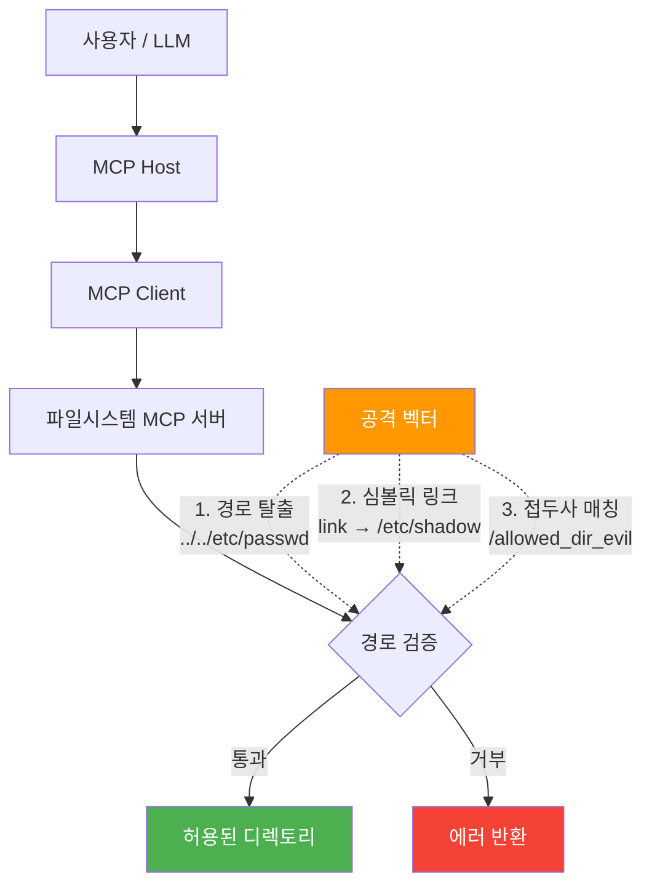
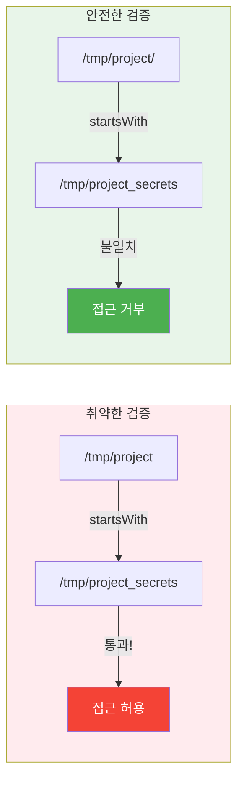
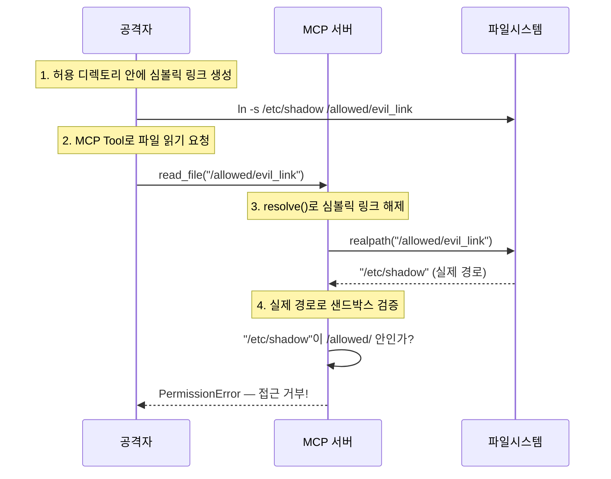
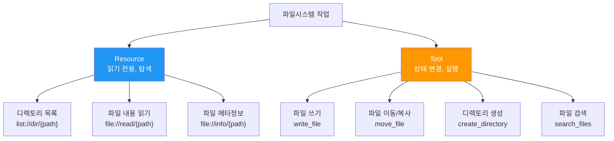
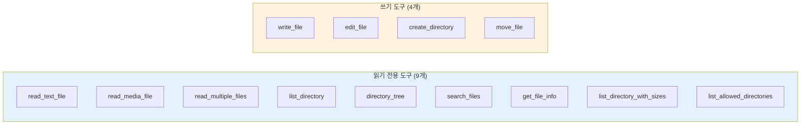

# 파일시스템 MCP 서버

> 안전한 파일시스템 접근 서버 구현 — 샌드박스 설계부터 심볼릭 링크 공격 방지까지

## 개요

이 섹션에서는 MCP 서버를 통해 LLM이 로컬 파일시스템에 접근하는 방법을 다룹니다. 파일 읽기/쓰기는 가장 강력하면서도 가장 위험한 기능이기에, **보안 설계가 곧 핵심 설계**입니다.

**선수 지식**: [REST→MCP 매핑 전략](08-ch8-실전-서버-rest-api-래핑과-파일시스템/01-01-rest-apimcp-매핑-전략.md)에서 배운 Tool/Resource 매핑 원칙, [FastMCP OpenAPI 프로바이더](08-ch8-실전-서버-rest-api-래핑과-파일시스템/03-03-fastmcp-openapi-프로바이더.md)에서 다룬 FastMCP 서버 패턴

**학습 목표**:
- 파일시스템 접근에서 샌드박스(allowed_directories) 패턴을 설계할 수 있다
- 심볼릭 링크 공격과 경로 탈출을 방지하는 검증 로직을 구현할 수 있다
- 디렉토리 탐색은 Resource로, 파일 읽기/쓰기는 Tool로 매핑하는 구조를 완성할 수 있다
- 공식 Filesystem 레퍼런스 서버의 보안 모델을 분석하고 Python으로 재현할 수 있다

## 왜 알아야 할까?

LLM이 코드를 읽고, 로그를 분석하고, 설정 파일을 수정하려면 파일시스템 접근이 필수입니다. 하지만 아무 제한 없이 파일 접근을 허용하면 어떻게 될까요? LLM이 `/etc/passwd`를 읽거나, `~/.ssh/id_rsa`를 외부로 유출하거나, 시스템 설정을 덮어쓸 수 있습니다.

실제로 2025년 7월, MCP 공식 파일시스템 서버에서 **심볼릭 링크를 이용한 샌드박스 탈출 취약점**(CVE-2025-53109)이 발견되었습니다. CVSS 8.4점의 심각한 취약점으로, 허용된 디렉토리 내에 심볼릭 링크를 만들어 시스템 전체 파일에 접근할 수 있었죠. 파일시스템 MCP 서버를 만든다면, 이런 공격을 반드시 이해하고 방어해야 합니다.

> 📊 **그림 1**: 파일시스템 MCP 서버의 위협 모델



## 핵심 개념

### 개념 1: 샌드박스 — 허용된 디렉토리 울타리

> 💡 **비유**: 놀이공원의 울타리를 떠올려 보세요. 아이들은 울타리 안에서 자유롭게 뛰어놀 수 있지만, 울타리 밖으로는 나갈 수 없습니다. 파일시스템 샌드박스도 마찬가지입니다. "이 디렉토리들 안에서만 활동해!" 라고 경계를 정해주는 거죠.

파일시스템 MCP 서버의 첫 번째 원칙은 **허용된 디렉토리 목록(allowed directories)**을 명시적으로 설정하는 것입니다. 서버가 시작될 때 이 목록을 받아서, 모든 파일 접근 요청이 이 경계 안에 있는지 검증합니다.

```python
from pathlib import Path

class FilesystemSandbox:
    """파일시스템 접근을 허용된 디렉토리로 제한하는 샌드박스."""
    
    def __init__(self, allowed_directories: list[str]):
        if not allowed_directories:
            raise ValueError("최소 하나의 허용 디렉토리가 필요합니다")
        
        # 모든 경로를 절대 경로 + 심볼릭 링크 해제로 정규화
        self.allowed: list[Path] = []
        for dir_path in allowed_directories:
            resolved = Path(dir_path).expanduser().resolve()  # resolve()가 realpath 역할
            if not resolved.is_dir():
                raise ValueError(f"디렉토리가 존재하지 않습니다: {dir_path}")
            self.allowed.append(resolved)
    
    def validate_path(self, requested_path: str) -> Path:
        """요청된 경로가 샌드박스 안에 있는지 검증합니다."""
        # 1단계: 절대 경로로 변환 + 심볼릭 링크 해제
        resolved = Path(requested_path).expanduser().resolve()
        
        # 2단계: 허용된 디렉토리 내에 있는지 확인
        for allowed_dir in self.allowed:
            if resolved == allowed_dir:
                return resolved  # 정확히 허용 디렉토리 자체
            # ⚠️ 핵심: 경로 구분자를 붙여서 비교 (접두사 매칭 공격 방지)
            if str(resolved).startswith(str(allowed_dir) + "/"):
                return resolved
        
        raise PermissionError(
            f"접근 거부: {requested_path} → "
            f"허용 범위: {[str(d) for d in self.allowed]}"
        )
```

왜 `startswith(str(allowed_dir) + "/")`처럼 **경로 구분자를 붙여서** 비교할까요? 이것이 CVE-2025-53110의 교훈입니다. 만약 `/tmp/project`가 허용 디렉토리인데 단순히 `startswith("/tmp/project")`로 비교하면, `/tmp/project_secrets`라는 전혀 다른 디렉토리도 통과해 버립니다!

> 📊 **그림 2**: 접두사 매칭 공격과 방어



### 개념 2: 심볼릭 링크 — 보이지 않는 통로 차단

> 💡 **비유**: 심볼릭 링크는 건물의 비상구와 비슷합니다. 겉보기에는 허용된 구역 안에 있는 문이지만, 열면 건물 밖 완전히 다른 장소로 연결되어 있죠. 보안 검사를 통과한 뒤에 비상구로 탈출하는 셈입니다.

심볼릭 링크(symlink) 공격은 파일시스템 보안의 가장 위험한 취약점 중 하나입니다. 공격자가 허용된 디렉토리 안에 `/etc/shadow`를 가리키는 심볼릭 링크를 만들면, 경로만 보면 허용 범위 안이지만 실제로는 시스템 파일에 접근하게 됩니다.

방어의 핵심은 **`resolve()`(= `realpath`)를 검증 전에 호출**하는 것입니다:

```python
def validate_path(self, requested_path: str) -> Path:
    """심볼릭 링크를 해제한 뒤 경로를 검증합니다."""
    path = Path(requested_path).expanduser()
    
    try:
        # resolve(strict=True): 심볼릭 링크 해제 + 존재 확인
        resolved = path.resolve(strict=True)
    except (OSError, FileNotFoundError):
        # 파일이 존재하지 않으면 → 부모 디렉토리 검증
        parent = path.parent.resolve(strict=True)
        self._check_within_allowed(parent)
        return path.resolve(strict=False)
    
    self._check_within_allowed(resolved)
    return resolved

def _check_within_allowed(self, resolved: Path) -> None:
    """정규화된 경로가 허용 범위 내인지 확인합니다."""
    for allowed_dir in self.allowed:
        if resolved == allowed_dir:
            return
        if str(resolved).startswith(str(allowed_dir) + "/"):
            return
    raise PermissionError(f"샌드박스 외부 접근 시도: {resolved}")
```

> 📊 **그림 3**: 심볼릭 링크 공격 시나리오와 방어 흐름



### 개념 3: Tool과 Resource 매핑 — 읽기와 쓰기의 분리

> 💡 **비유**: 도서관을 생각해 보세요. 서가 목록을 조회하고 책을 열람하는 것(Resource)과, 도서관 장서를 추가하거나 분류를 변경하는 것(Tool)은 전혀 다른 권한이 필요합니다.

파일시스템 MCP 서버에서는 **읽기 전용 탐색은 Resource**, **상태를 변경하는 작업은 Tool**로 매핑합니다. [MCP 프리미티브의 제어 주체](05-ch5-resources-데이터-노출-프리미티브/01-01-resource-프리미티브-이해.md)를 떠올려 보면, Resource는 Application-controlled(사용자/앱이 결정), Tool은 Model-controlled(LLM이 결정)이었죠.

> 📊 **그림 4**: 파일시스템 작업의 프리미티브 매핑



공식 MCP 파일시스템 레퍼런스 서버는 이보다 더 과감한 선택을 했는데, **모든 기능을 Tool로 노출**합니다. 왜 그럴까요? LLM이 자율적으로 "어떤 파일을 읽을지" 판단해야 하는 에이전트 시나리오에서는, Tool(Model-controlled)이 더 자연스럽기 때문입니다. 하지만 사용자가 사이드바에서 디렉토리를 탐색하는 UI를 제공한다면, Resource가 더 적합합니다.

```python
from fastmcp import FastMCP

mcp = FastMCP("filesystem-server")

# === Resource: 읽기 전용 탐색 ===

@mcp.resource("file://list/{path}")
async def list_directory(path: str) -> str:
    """디렉토리 내용을 조회합니다. 파일과 하위 디렉토리 목록을 반환합니다."""
    validated = sandbox.validate_path(path)
    entries = []
    for entry in sorted(validated.iterdir()):
        prefix = "[DIR]" if entry.is_dir() else "[FILE]"
        entries.append(f"{prefix} {entry.name}")
    return "\n".join(entries)


@mcp.resource("file://read/{path}")
async def read_file_resource(path: str) -> str:
    """파일 내용을 텍스트로 읽습니다."""
    validated = sandbox.validate_path(path)
    return validated.read_text(encoding="utf-8")


# === Tool: 상태 변경 작업 ===

@mcp.tool()
async def write_file(path: str, content: str) -> str:
    """파일에 내용을 씁니다. 파일이 없으면 생성, 있으면 덮어씁니다."""
    validated = sandbox.validate_path(path)
    validated.write_text(content, encoding="utf-8")
    return f"파일 저장 완료: {validated.name} ({len(content)}자)"
```

### 개념 4: 원자적 쓰기 — TOCTOU 경쟁 조건 방어

> 💡 **비유**: 은행 ATM에서 잔액 확인(검증)과 출금(실행) 사이에 누군가가 계좌 설정을 바꿀 수 있다면? 이것이 TOCTOU(Time-of-Check to Time-of-Use) 문제입니다. "확인할 때는 괜찮았는데, 실행할 때는 상황이 달라져 있는" 경쟁 조건이죠.

파일 쓰기에서 TOCTOU 문제는 이렇게 발생합니다:

1. 서버가 경로를 검증 → "허용 범위 내, 통과!"
2. 검증과 쓰기 사이의 찰나에 공격자가 해당 경로에 심볼릭 링크를 생성
3. 서버가 파일을 씀 → 실제로는 심볼릭 링크가 가리키는 시스템 파일에 쓰기

방어 방법은 **임시 파일에 먼저 쓰고, `rename()`으로 원자적 이동**하는 패턴입니다:

```python
import tempfile
import os

async def safe_write_file(path: str, content: str) -> str:
    """원자적 쓰기로 TOCTOU 공격을 방어합니다."""
    validated = sandbox.validate_path(path)
    parent_dir = validated.parent
    
    # 부모 디렉토리도 샌드박스 내인지 확인
    sandbox.validate_path(str(parent_dir))
    
    # 1단계: 같은 디렉토리에 임시 파일 생성 후 내용 쓰기
    fd, tmp_path = tempfile.mkstemp(
        dir=str(parent_dir),  # 같은 파일시스템이어야 rename이 원자적
        prefix=".mcp_tmp_"
    )
    try:
        with os.fdopen(fd, 'w', encoding='utf-8') as f:
            f.write(content)
        
        # 2단계: 원자적 이름 변경 (같은 파일시스템 내에서 rename은 원자적)
        os.replace(tmp_path, str(validated))
    except Exception:
        # 실패 시 임시 파일 정리
        if os.path.exists(tmp_path):
            os.unlink(tmp_path)
        raise
    
    return f"파일 저장 완료: {validated.name}"
```

`os.replace()`는 POSIX 시스템에서 원자적(atomic)으로 동작합니다. 임시 파일이 이미 디스크에 완전히 기록된 상태에서 이름만 바꾸므로, 검증과 쓰기 사이에 끼어들 틈이 없습니다.

### 개념 5: 공식 레퍼런스 서버 분석

> 💡 **비유**: 새 건물을 지을 때 건축 법규(공식 스펙)만 읽는 것보다, 모범 건축 사례(레퍼런스 구현)를 함께 참고하면 실수를 줄일 수 있겠죠. MCP 공식 파일시스템 서버가 바로 그 모범 사례입니다.

MCP 공식 레퍼런스 서버(`@modelcontextprotocol/server-filesystem`)는 TypeScript로 작성되어 있지만, 설계 패턴은 Python 구현의 훌륭한 청사진이 됩니다.

> 📊 **그림 5**: 공식 파일시스템 서버의 도구 분류



**핵심 설계 패턴 정리**:

| 패턴 | 공식 서버 구현 | 우리 Python 서버 적용 |
|------|--------------|---------------------|
| 경로 검증 | `validatePath()` 모든 핸들러 첫 줄 | `sandbox.validate_path()` 데코레이터 |
| 심볼릭 링크 | `fs.realpath()` → 경계 확인 | `Path.resolve(strict=True)` |
| 접두사 공격 방지 | 경로 구분자 추가 후 비교 | `startswith(str(dir) + "/")` |
| 새 파일 검증 | 부모 디렉토리 검증 | `path.parent.resolve()` 검증 |
| 원자적 쓰기 | 임시 파일 + `rename` | `tempfile.mkstemp` + `os.replace` |
| Tool Annotations | `readOnlyHint`, `destructiveHint` | FastMCP의 `annotations` 매개변수 |

공식 서버는 또한 **MCP Roots 프로토콜**을 지원합니다. 클라이언트가 `roots/list_changed` 알림으로 허용 디렉토리를 동적으로 변경할 수 있는데요, 이는 IDE처럼 프로젝트 폴더가 바뀌는 환경에 유용합니다. 명령줄에서 지정한 디렉토리보다 클라이언트의 Roots가 우선한다는 점도 기억해 두세요.

## 실습: 직접 해보기

완전한 파일시스템 MCP 서버를 단계별로 구축해 봅시다. 프로젝트 구조부터 만듭니다.

```
filesystem-mcp-server/
├── server.py          # MCP 서버 진입점
├── sandbox.py         # 경로 검증 + 샌드박스 로직
├── pyproject.toml     # 의존성 관리
└── test_workspace/    # 테스트용 샌드박스 디렉토리
    ├── hello.txt
    └── notes/
        └── memo.md
```

**Step 1 — 샌드박스 모듈 (`sandbox.py`)**

```python
"""파일시스템 샌드박스 — 경로 검증과 접근 제어."""

import os
import tempfile
from pathlib import Path


class FilesystemSandbox:
    """허용된 디렉토리 외부 접근을 차단하는 샌드박스."""
    
    def __init__(self, allowed_directories: list[str]):
        if not allowed_directories:
            raise ValueError("최소 하나의 허용 디렉토리를 지정해야 합니다")
        
        self.allowed: list[Path] = []
        for dir_path in allowed_directories:
            resolved = Path(dir_path).expanduser().resolve()
            if not resolved.is_dir():
                raise ValueError(f"존재하지 않는 디렉토리: {dir_path}")
            self.allowed.append(resolved)
    
    def validate_path(self, requested: str) -> Path:
        """요청 경로를 검증하고 정규화된 Path를 반환합니다.
        
        Args:
            requested: 사용자가 요청한 파일/디렉토리 경로
            
        Returns:
            검증된 절대 경로 (Path 객체)
            
        Raises:
            PermissionError: 샌드박스 외부 접근 시도 시
            ValueError: 경로가 올바르지 않을 때
        """
        path = Path(requested).expanduser()
        
        # 절대 경로로 변환
        if not path.is_absolute():
            # 상대 경로는 첫 번째 허용 디렉토리 기준으로 해석
            path = self.allowed[0] / path
        
        try:
            # strict=True: 존재 확인 + 심볼릭 링크 해제
            resolved = path.resolve(strict=True)
        except FileNotFoundError:
            # 새 파일 생성 시 → 부모 디렉토리가 유효한지 확인
            parent = path.parent.resolve(strict=True)
            self._assert_within_sandbox(parent)
            return path.resolve(strict=False)
        
        self._assert_within_sandbox(resolved)
        return resolved
    
    def _assert_within_sandbox(self, resolved: Path) -> None:
        """정규화된 경로가 허용 범위 내인지 확인합니다."""
        resolved_str = str(resolved)
        for allowed_dir in self.allowed:
            allowed_str = str(allowed_dir)
            # 허용 디렉토리 자체이거나 그 하위 경로인지 확인
            if resolved_str == allowed_str:
                return
            # ✅ 경로 구분자를 붙여서 접두사 매칭 공격 차단
            if resolved_str.startswith(allowed_str + os.sep):
                return
        
        raise PermissionError(
            f"샌드박스 외부 접근 거부: {resolved}\n"
            f"허용 디렉토리: {[str(d) for d in self.allowed]}"
        )
    
    def safe_write(self, path: str, content: str) -> Path:
        """원자적 쓰기로 TOCTOU 공격을 방지합니다."""
        validated = self.validate_path(path)
        parent = validated.parent
        
        # 부모 디렉토리가 존재하지 않으면 생성
        parent.mkdir(parents=True, exist_ok=True)
        self._assert_within_sandbox(parent.resolve())
        
        # 같은 디렉토리에 임시 파일 → 원자적 이동
        fd, tmp_path = tempfile.mkstemp(dir=str(parent), prefix=".mcp_")
        try:
            with os.fdopen(fd, 'w', encoding='utf-8') as f:
                f.write(content)
            os.replace(tmp_path, str(validated))
        except Exception:
            if os.path.exists(tmp_path):
                os.unlink(tmp_path)
            raise
        
        return validated
    
    def list_allowed(self) -> list[str]:
        """현재 허용된 디렉토리 목록을 반환합니다."""
        return [str(d) for d in self.allowed]
```

**Step 2 — MCP 서버 (`server.py`)**

서버 초기화에는 [SQLite MCP 서버](07-ch7-fastmcp-실전-첫-서버-구축/02-02-첫-mcp-서버-구현-sqlite-explorer.md)에서 배운 것과 동일한 **lifespan 패턴**을 사용합니다. 차이점은 데이터베이스 커넥션 대신 **샌드박스 인스턴스**를 컨텍스트로 주입한다는 것뿐입니다.

```python
"""파일시스템 MCP 서버 — FastMCP 기반 안전한 파일 접근."""

import sys
import mimetypes
import base64
from pathlib import Path
from contextlib import asynccontextmanager
from dataclasses import dataclass

from fastmcp import FastMCP

from sandbox import FilesystemSandbox


@dataclass
class AppContext:
    """서버 라이프사이클 동안 공유되는 컨텍스트."""
    sandbox: FilesystemSandbox


@asynccontextmanager
async def lifespan(server: FastMCP):
    """lifespan 컨텍스트 — 샌드박스를 초기화하여 모든 핸들러에 공유합니다.
    (패턴 상세: Ch7.2 SQLite Explorer 세션 참고)"""
    allowed_dirs = sys.argv[1:] if len(sys.argv) > 1 else ["./test_workspace"]
    sandbox = FilesystemSandbox(allowed_dirs)
    print(f"[filesystem-server] 샌드박스 초기화: {sandbox.list_allowed()}")
    yield AppContext(sandbox=sandbox)


mcp = FastMCP(
    "filesystem-server",
    lifespan=lifespan,
    instructions="이 서버는 지정된 디렉토리 내의 파일을 안전하게 읽고 쓸 수 있습니다.",
)


def _get_sandbox(ctx) -> FilesystemSandbox:
    """컨텍스트에서 샌드박스 인스턴스를 가져오는 헬퍼."""
    return ctx.request_context.lifespan_context.sandbox


# ──────────────────────────────────────────
# Resources: 읽기 전용 탐색
# ──────────────────────────────────────────

@mcp.resource("file://list")
async def list_allowed_directories(ctx) -> str:
    """현재 접근 가능한 디렉토리 목록을 반환합니다."""
    sandbox = _get_sandbox(ctx)
    return "\n".join(f"📁 {d}" for d in sandbox.list_allowed())


@mcp.resource("file://list/{path}")
async def list_directory(path: str, ctx) -> str:
    """디렉토리 내 파일과 하위 디렉토리를 조회합니다."""
    sandbox = _get_sandbox(ctx)
    validated = sandbox.validate_path(path)
    
    if not validated.is_dir():
        raise ValueError(f"디렉토리가 아닙니다: {path}")
    
    entries = []
    for entry in sorted(validated.iterdir()):
        if entry.name.startswith("."):  # 숨김 파일 제외
            continue
        prefix = "📁" if entry.is_dir() else "📄"
        size = f" ({entry.stat().st_size:,}B)" if entry.is_file() else ""
        entries.append(f"{prefix} {entry.name}{size}")
    
    return "\n".join(entries) if entries else "(빈 디렉토리)"


# ──────────────────────────────────────────
# Tools: 파일 작업
# ──────────────────────────────────────────

@mcp.tool()
async def read_file(path: str, ctx) -> str:
    """텍스트 파일의 내용을 읽습니다.
    
    Args:
        path: 읽을 파일 경로 (허용 디렉토리 내)
    """
    sandbox = _get_sandbox(ctx)
    validated = sandbox.validate_path(path)
    
    if not validated.is_file():
        raise FileNotFoundError(f"파일이 존재하지 않습니다: {path}")
    
    # 파일 크기 제한 (LLM 컨텍스트 보호)
    size = validated.stat().st_size
    if size > 1_000_000:  # 1MB 제한
        raise ValueError(f"파일이 너무 큽니다: {size:,}B (최대 1MB)")
    
    return validated.read_text(encoding="utf-8")


@mcp.tool()
async def read_multiple_files(paths: list[str], ctx) -> str:
    """여러 파일을 한 번에 읽습니다. 개별 파일 실패 시에도 계속 진행합니다.
    
    Args:
        paths: 읽을 파일 경로 목록
    """
    sandbox = _get_sandbox(ctx)
    results = []
    
    for file_path in paths:
        try:
            validated = sandbox.validate_path(file_path)
            content = validated.read_text(encoding="utf-8")
            results.append(f"=== {validated.name} ===\n{content}")
        except Exception as e:
            results.append(f"=== {file_path} [에러] ===\n{e}")
    
    return "\n\n".join(results)


@mcp.tool()
async def write_file(path: str, content: str, ctx) -> str:
    """파일에 내용을 씁니다. 원자적 쓰기로 안전하게 저장합니다.
    
    Args:
        path: 저장할 파일 경로 (허용 디렉토리 내)
        content: 파일에 쓸 텍스트 내용
    """
    sandbox = _get_sandbox(ctx)
    validated = sandbox.safe_write(path, content)
    size = validated.stat().st_size
    return f"✅ 저장 완료: {validated.name} ({size:,}B)"


@mcp.tool()
async def search_files(
    directory: str,
    pattern: str,
    ctx,
) -> str:
    """디렉토리에서 glob 패턴으로 파일을 검색합니다.
    
    Args:
        directory: 검색할 디렉토리 경로
        pattern: glob 패턴 (예: '*.py', '**/*.md')
    """
    sandbox = _get_sandbox(ctx)
    validated = sandbox.validate_path(directory)
    
    matches = []
    for match in validated.glob(pattern):
        # 각 매칭 결과도 샌드박스 검증
        try:
            sandbox.validate_path(str(match))
            rel = match.relative_to(validated)
            prefix = "📁" if match.is_dir() else "📄"
            matches.append(f"{prefix} {rel}")
        except PermissionError:
            continue  # 심볼릭 링크로 샌드박스 외부를 가리키면 건너뜀
    
    if not matches:
        return f"'{pattern}' 패턴에 일치하는 파일이 없습니다."
    return f"검색 결과 ({len(matches)}개):\n" + "\n".join(matches)


@mcp.tool()
async def get_file_info(path: str, ctx) -> str:
    """파일의 메타정보(크기, 수정일, 권한)를 반환합니다.
    
    Args:
        path: 조회할 파일 또는 디렉토리 경로
    """
    sandbox = _get_sandbox(ctx)
    validated = sandbox.validate_path(path)
    stat = validated.stat()
    
    import datetime
    modified = datetime.datetime.fromtimestamp(stat.st_mtime)
    
    info = {
        "이름": validated.name,
        "유형": "디렉토리" if validated.is_dir() else "파일",
        "크기": f"{stat.st_size:,} bytes",
        "수정일": modified.strftime("%Y-%m-%d %H:%M:%S"),
        "권한": oct(stat.st_mode)[-3:],
        "심볼릭 링크": validated.is_symlink(),
    }
    return "\n".join(f"{k}: {v}" for k, v in info.items())


@mcp.tool()
async def create_directory(path: str, ctx) -> str:
    """새 디렉토리를 생성합니다. 중간 디렉토리도 함께 생성됩니다.
    
    Args:
        path: 생성할 디렉토리 경로
    """
    sandbox = _get_sandbox(ctx)
    validated = sandbox.validate_path(path)
    validated.mkdir(parents=True, exist_ok=True)
    return f"✅ 디렉토리 생성 완료: {validated}"


@mcp.tool()
async def move_file(source: str, destination: str, ctx) -> str:
    """파일이나 디렉토리를 이동합니다. 소스와 대상 모두 허용 범위 내여야 합니다.
    
    Args:
        source: 원본 경로
        destination: 대상 경로
    """
    sandbox = _get_sandbox(ctx)
    src = sandbox.validate_path(source)
    dst = sandbox.validate_path(destination)
    
    import shutil
    shutil.move(str(src), str(dst))
    return f"✅ 이동 완료: {src.name} → {dst}"


if __name__ == "__main__":
    mcp.run()
```

**Step 3 — 테스트 실행**

터미널에서 서버를 실행하고 MCP Inspector로 테스트해 봅시다:

```console
# 의존성 설치
$ uv init && uv add mcp fastmcp

# 테스트 디렉토리 준비
$ mkdir -p test_workspace/notes
$ echo "Hello MCP!" > test_workspace/hello.txt
$ echo "# 메모" > test_workspace/notes/memo.md

# MCP Inspector로 테스트
$ npx @modelcontextprotocol/inspector uv run server.py ./test_workspace
```

Inspector에서 직접 도구들을 호출해 보세요:

```run:python
# 검증 로직 단위 테스트 예시
from pathlib import Path
import tempfile, os

# 테스트용 샌드박스 시뮬레이션
allowed_dir = tempfile.mkdtemp(prefix="mcp_sandbox_")
secret_dir = tempfile.mkdtemp(prefix="mcp_secret_")

# 1. 정상 경로 — 통과
test_file = Path(allowed_dir) / "test.txt"
test_file.write_text("hello")
resolved = test_file.resolve()
assert str(resolved).startswith(allowed_dir)
print(f"✅ 정상 경로 검증 통과: {resolved.name}")

# 2. 경로 탈출 시도 — ../로 상위 이동
evil_path = Path(allowed_dir) / ".." / "etc" / "passwd"
resolved_evil = evil_path.resolve()
is_inside = str(resolved_evil).startswith(allowed_dir + os.sep)
print(f"✅ 경로 탈출 차단: ../ 시도 → 샌드박스 내부={is_inside}")

# 3. 접두사 매칭 공격 확인
fake_dir = allowed_dir + "_evil"
is_vulnerable = fake_dir.startswith(allowed_dir)  # 구분자 없이 비교
is_safe = fake_dir.startswith(allowed_dir + os.sep)  # 구분자 추가
print(f"✅ 접두사 공격: 구분자 없음={is_vulnerable}, 구분자 추가={is_safe}")

# 정리
os.unlink(test_file)
os.rmdir(allowed_dir)
os.rmdir(secret_dir)
```

```output
✅ 정상 경로 검증 통과: test.txt
✅ 경로 탈출 차단: ../ 시도 → 샌드박스 내부=False
✅ 접두사 공격: 구분자 없음=True, 구분자 추가=False
```

**Step 4 — Claude Desktop 연결**

`claude_desktop_config.json`에 서버를 등록합니다:

```json
{
  "mcpServers": {
    "filesystem": {
      "command": "uv",
      "args": [
        "run",
        "--directory", "/path/to/filesystem-mcp-server",
        "server.py",
        "/Users/yourname/Documents",
        "/Users/yourname/Projects"
      ]
    }
  }
}
```

이렇게 설정하면 Claude가 `Documents`와 `Projects` 폴더 안의 파일만 접근할 수 있습니다. 그 외 경로에 접근하려 하면 `PermissionError`가 발생하죠.

## 더 깊이 알아보기

### 파일시스템 보안의 역사 — 심볼릭 링크 전쟁

심볼릭 링크를 이용한 공격은 MCP에서 처음 발견된 것이 아닙니다. 사실 **1980년대 Unix 시절부터** `/tmp` 디렉토리의 심볼릭 링크 경쟁 조건(symlink race)은 보안 연구자들의 단골 주제였습니다.

가장 유명한 사례 중 하나가 2009년 리눅스 커널의 `/proc` 파일시스템 심볼릭 링크 취약점(CVE-2009-1894)입니다. `pulseaudio`가 `/tmp`에 임시 파일을 만들 때 심볼릭 링크를 먼저 확인하지 않아서, 일반 사용자가 root 권한으로 임의 파일을 덮어쓸 수 있었죠.

MCP 파일시스템 서버의 CVE-2025-53109도 같은 패턴입니다. 보안 연구자 wunderwuzzi(Embrace The Red)와 Elad Beber(Cymulate)가 독립적으로 발견했는데, 흥미로운 점은 이 취약점이 **에러 핸들링의 fallback 로직**에서 발생했다는 것입니다. `realpath()`가 실패했을 때 예외를 던지지 않고 부모 디렉토리로 대체 검증하는 로직이 문제였죠. "예외 처리를 관대하게 하면 보안 구멍이 된다"는 교훈을 잘 보여줍니다.

CVE-2025-53110(접두사 매칭 우회)은 더 단순하면서도 놀라운 버그였습니다. `/allowed_dir`과 `/allowed_dir_backup`을 구분하지 못하는 `startsWith()` 비교 — 이 한 줄의 실수가 CVSS 7.3점의 취약점이 되었습니다. 0.6.4 버전에서 경로 구분자(`/`)를 추가하는 패치로 수정되었는데, 수정 코드가 단 몇 줄이었다는 점이 보안 버그의 특성을 잘 보여줍니다. 작은 실수가 큰 취약점이 되고, 수정은 간단하지만 사전 발견이 어렵죠.

### 왜 모든 기능을 Tool로만 노출하는가?

공식 레퍼런스 서버가 Resource 대신 모든 기능을 Tool로 노출한 이유가 궁금하실 텐데요. 이는 MCP 프리미티브의 **제어 주체** 설계 철학과 관련됩니다. Resource는 Application-controlled — 사용자나 애플리케이션이 "이 리소스를 읽어"라고 명시적으로 지정합니다. 반면 Tool은 Model-controlled — LLM이 자율적으로 "이 파일을 읽어야겠다"고 판단합니다.

에이전트 패러다임에서는 LLM이 스스로 어떤 파일을 탐색할지 결정해야 하므로, Tool이 더 자연스럽습니다. 하지만 사이드바 UI처럼 사용자가 직접 디렉토리를 탐색하는 시나리오에서는 Resource가 더 적합하죠. 우리 실습 서버에서 두 가지를 혼합한 이유가 바로 이것입니다 — 실제 프로덕션에서는 사용 시나리오에 맞게 선택하세요.

## 흔한 오해와 팁

> ⚠️ **흔한 오해**: "파이썬의 `pathlib`를 쓰면 경로 검증이 자동으로 안전하다"
> `Path.resolve()`는 심볼릭 링크를 해제해 주지만, 그 결과가 허용 범위 내인지 확인하는 것은 개발자의 몫입니다. `resolve()` 호출만으로는 샌드박스 탈출을 막을 수 없습니다.

> 💡 **알고 계셨나요?**: Docker를 사용하면 파일시스템 샌드박스를 OS 수준에서 강제할 수 있습니다. `docker run --mount type=bind,src=/path,dst=/workspace,readonly mcp-server /workspace`처럼 읽기 전용 바인드 마운트를 사용하면, 아무리 서버 코드에 취약점이 있어도 마운트된 경로 외부에는 접근할 수 없습니다. 공식 레퍼런스 서버도 Dockerfile을 제공하는 이유입니다.

> 🔥 **실무 팁**: 프로덕션 파일시스템 서버에서는 **파일 크기 제한**을 반드시 설정하세요. LLM의 컨텍스트 윈도우는 한정되어 있는데, 100MB 로그 파일을 통째로 읽으면 비용 폭탄과 함께 의미 없는 응답을 받게 됩니다. 공식 서버의 `read_text_file`이 `head`/`tail` 매개변수를 제공하는 것도 이 때문입니다. 1MB 상한 + 부분 읽기 기능을 항상 함께 구현하세요.

## 핵심 정리

| 개념 | 설명 |
|------|------|
| 샌드박스 (allowed_directories) | 서버 시작 시 허용 디렉토리를 명시. 모든 접근이 이 경계 내로 제한됨 |
| 경로 구분자 추가 비교 | `startswith(dir + "/")` — 접두사 매칭 우회 공격 방지 (CVE-2025-53110) |
| `resolve(strict=True)` | 심볼릭 링크 해제 후 실제 경로로 검증 — 샌드박스 탈출 차단 (CVE-2025-53109) |
| 새 파일 부모 검증 | 존재하지 않는 파일은 부모 디렉토리를 대신 검증 |
| 원자적 쓰기 | `tempfile` + `os.replace()` — TOCTOU 경쟁 조건 방어 |
| Resource vs Tool 분리 | 읽기 전용 탐색 → Resource, 상태 변경 → Tool (시나리오에 따라 선택) |
| Tool Annotations | `readOnlyHint`, `destructiveHint` 등으로 클라이언트에 힌트 제공 |
| Docker 샌드박스 | OS 수준 격리로 코드 취약점과 무관한 추가 보안 레이어 |

## 다음 섹션 미리보기

지금까지 REST API 래핑(세션 8.1~8.3)과 파일시스템 접근(이번 세션)을 각각 독립된 서버로 구축했습니다. 다음 [복합 서버 — 다중 소스 통합](08-ch8-실전-서버-rest-api-래핑과-파일시스템/05-05-복합-서버-다중-소스-통합.md)에서는 이 둘을 하나의 MCP 서버로 합치는 패턴을 다룹니다. 데이터베이스 + REST API + 파일시스템을 동시에 제공하는 복합 서버를 설계하면서, lifespan 컨텍스트 공유, 도구 충돌 해결, 관심사 분리 전략을 배울 것입니다.

## 참고 자료

- [MCP 공식 레퍼런스 서버 — Filesystem](https://github.com/modelcontextprotocol/servers/tree/main/src/filesystem) - 공식 TypeScript 구현. 14개 도구의 설계 패턴과 보안 모델의 원본 소스
- [CVE-2025-53109 분석 — Embrace The Red](https://embracethered.com/blog/posts/2025/anthropic-filesystem-mcp-server-bypass/) - 심볼릭 링크 샌드박스 탈출 취약점의 발견 과정과 기술적 상세
- [CVE-2025-53109 & CVE-2025-53110 — Cymulate 분석](https://cymulate.com/blog/cve-2025-53109-53110-escaperoute-anthropic/) - 접두사 매칭 우회와 심볼릭 링크 공격을 모두 다루는 종합 분석
- [MCP Python SDK (GitHub)](https://github.com/modelcontextprotocol/python-sdk) - FastMCP가 내장된 Python MCP SDK. 서버 구현의 공식 라이브러리
- [FastMCP 공식 문서](https://gofastmcp.com) - 데코레이터 기반 서버 개발 프레임워크의 API 레퍼런스와 가이드
- [MCP 보안 — Red Hat 블로그](https://www.redhat.com/en/blog/mcp-security-current-situation) - MCP 생태계 전반의 보안 위협과 모범 사례 분석

---
### 🔗 Related Sessions
- [mcp inspector](01-ch1-mcp의-탄생과-설계-철학/03-03-mcp-생태계-둘러보기.md) (prerequisite)
