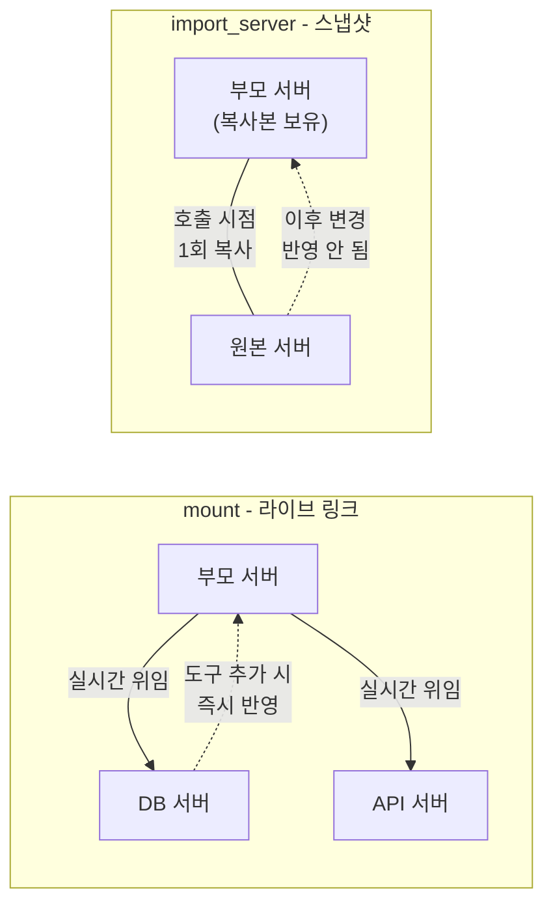
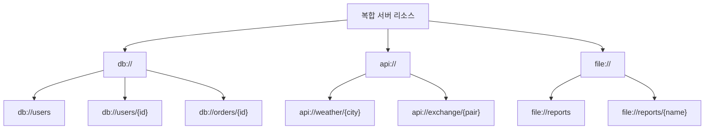
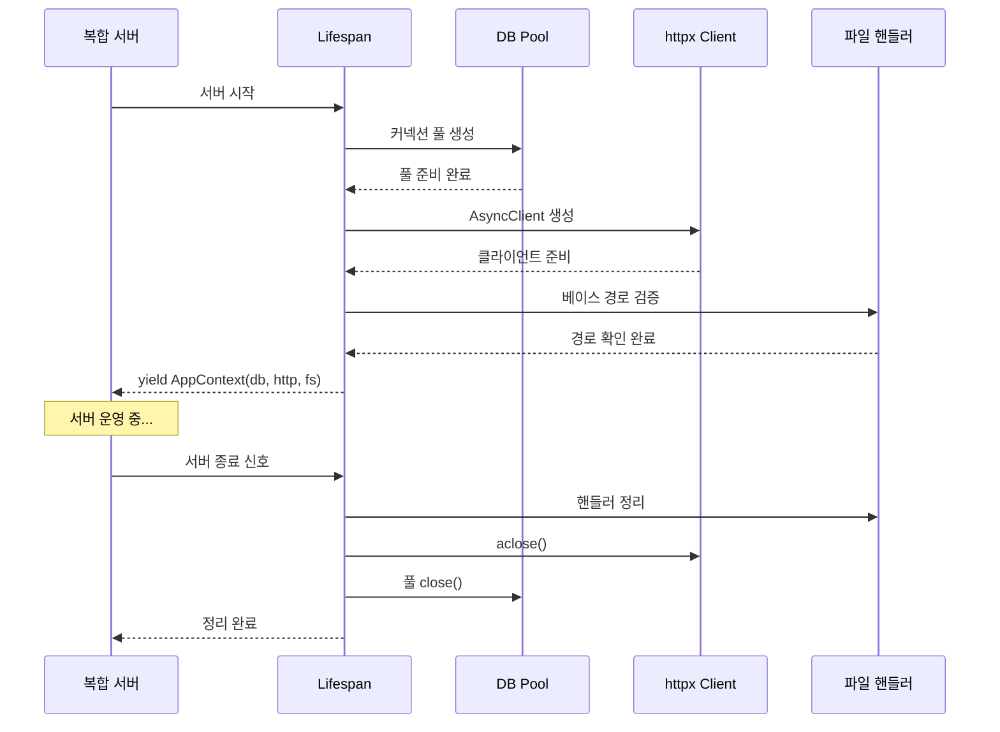
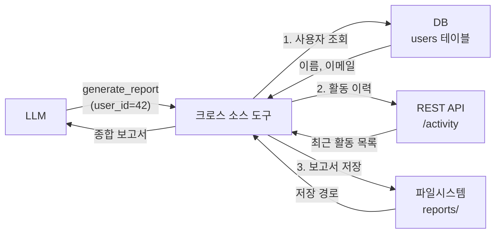
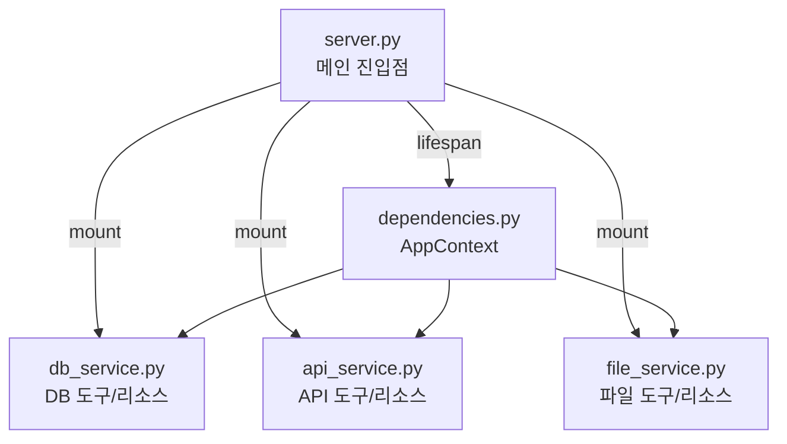

# 복합 서버 — 다중 소스 통합

> 데이터베이스, REST API, 파일시스템을 하나의 MCP 서버로 통합하는 아키텍처와 구현 패턴을 배웁니다.

## 개요

이 섹션에서는 지금까지 개별적으로 구축했던 세 가지 백엔드 — 데이터베이스(Ch7), REST API(8.1~8.3), 파일시스템(8.4) — 를 하나의 MCP 서버로 통합하는 방법을 배웁니다. LLM이 "사용자 정보 조회 → API 호출 → 결과 파일 저장"처럼 여러 소스를 넘나드는 작업을 자연스럽게 수행할 수 있는 복합 서버를 설계하고 구현합니다.

**선수 지식**: [DB 서버 설계 전략](07-ch7-실전-서버-데이터베이스-연동/01-01-db-서버-설계-전략.md)의 lifespan 패턴, [REST API→MCP 매핑 전략](08-ch8-실전-서버-rest-api-래핑과-파일시스템/01-01-rest-apimcp-매핑-전략.md)의 매핑 원칙, [파일시스템 MCP 서버](08-ch8-실전-서버-rest-api-래핑과-파일시스템/04-04-파일시스템-mcp-서버.md)의 샌드박스 패턴

**학습 목표**:
- FastMCP의 `mount()` 기반 서버 조합 아키텍처를 이해하고 적용할 수 있다
- 리소스 네임스페이스(`db://`, `api://`, `file://`)를 설계하여 다중 소스를 체계적으로 노출할 수 있다
- 단일 lifespan으로 여러 백엔드의 생명주기를 통합 관리할 수 있다
- 복합 서버의 통합 테스트 전략을 수립하고 실행할 수 있다

## 왜 알아야 할까?

실제 업무 환경을 떠올려 보세요. "고객 데이터는 PostgreSQL에, 주문 내역은 외부 ERP API에, 계약서는 공유 폴더에 있습니다." 이런 상황에서 LLM에게 "지난달 A 고객의 주문을 확인하고 관련 계약서를 찾아줘"라고 요청하려면 어떻게 해야 할까요?

데이터 소스마다 별도 MCP 서버를 만들면 되지만, Host가 3개의 서버를 각각 관리해야 합니다. 도구 이름이 충돌할 수도 있고(세 서버 모두 `search`라는 도구가 있다면?), 서버 간 데이터 조합은 전적으로 LLM의 멀티턴 추론에 의존하게 됩니다. 복합 서버는 이런 문제를 서버 측에서 해결합니다. 하나의 프로세스에서 모든 소스에 접근하므로 연결 비용이 줄고, 네임스페이스로 충돌을 방지하며, 크로스 소스 도구를 만들어 LLM의 부담을 덜어줄 수 있습니다.

## 핵심 개념

### 개념 1: 서버 조합 아키텍처 — mount()와 import_server()

> 💡 **비유**: 복합 서버는 **푸드코트**와 같습니다. 한식, 중식, 일식 매장이 각각 독립적으로 운영되지만, 고객은 하나의 푸드코트 입구로 들어와서 모든 음식을 주문할 수 있죠. FastMCP의 `mount()`는 이 푸드코트 건물 역할을 합니다.

FastMCP는 여러 서버를 하나로 합치는 두 가지 방법을 제공합니다.

**`mount()`** — 라이브 링크 방식입니다. 자식 서버에 나중에 도구를 추가해도 부모를 통해 바로 접근할 수 있습니다. 대부분의 경우 이 방식을 사용하세요.

**`import_server()`** — 스냅샷 방식입니다. 호출 시점의 도구/리소스를 복사해옵니다. 이후 원본을 변경해도 반영되지 않아요. 안정적인 프로덕션 구성에 적합합니다.

> 📊 **그림 1**: mount()와 import_server()의 동작 차이



네임스페이스를 지정하면 이름 충돌을 자동으로 방지합니다.

```python
from fastmcp import FastMCP

# 개별 서비스 서버 정의
db_server = FastMCP("DatabaseService")
api_server = FastMCP("APIService")
file_server = FastMCP("FileService")

# 복합 서버로 조합
app = FastMCP("CompositeServer")
app.mount(db_server, namespace="db")       # 도구: db_xxx, 리소스: scheme://db/xxx
app.mount(api_server, namespace="api")     # 도구: api_xxx
app.mount(file_server, namespace="files")  # 도구: files_xxx
```

네임스페이스가 적용되면 각 컴포넌트의 이름이 자동으로 접두사를 받습니다.

| 컴포넌트 | 원래 이름 | namespace="db" 적용 후 |
|----------|----------|----------------------|
| Tool `search` | `search` | `db_search` |
| Resource `data://users` | `data://users` | `data://db/users` |
| Prompt `analyze` | `analyze` | `db_analyze` |

이 규칙 덕분에 세 서버 모두 `search`라는 도구를 가지고 있어도 `db_search`, `api_search`, `files_search`로 자연스럽게 구분됩니다.

### 개념 2: 리소스 네임스페이스 설계

> 💡 **비유**: 리소스 URI는 **도서관의 청구기호** 같습니다. "005.133-파이썬"만 보고도 이 책이 어느 서가에 있는지 바로 알 수 있죠. `db://users/42`라는 URI를 보면, 데이터베이스에서 ID 42번 사용자를 가져온다는 의미가 즉시 전달됩니다.

복합 서버에서 리소스 URI를 설계할 때는 **커스텀 스킴(scheme)** 으로 소스를 구분하는 것이 핵심입니다. `http://`를 사용하면 LLM이 실제 웹 URL과 혼동할 수 있으므로, 데이터 소스의 성격을 드러내는 스킴을 사용하세요.

> 📊 **그림 2**: 리소스 네임스페이스 설계 체계



설계 원칙은 다음과 같습니다.

```python
from fastmcp import FastMCP

mcp = FastMCP("CompositeServer")

# 1. 커스텀 스킴으로 소스 구분
@mcp.resource("db://users")          # 데이터베이스 → db://
@mcp.resource("api://weather/{city}")  # 외부 API → api://
@mcp.resource("file://reports")       # 파일시스템 → file://

# 2. URI 템플릿으로 동적 리소스 표현 (RFC 6570)
@mcp.resource("db://users/{user_id}")
async def get_user(user_id: str) -> str:
    """사용자 ID로 데이터베이스에서 사용자 정보를 조회합니다."""
    row = await db.fetchrow("SELECT * FROM users WHERE id = $1", user_id)
    return json.dumps(dict(row))

# 3. 와일드카드로 계층 구조 표현
@mcp.resource("file://reports/{path*}")  # {path*}는 슬래시 포함 매칭
async def get_report(path: str) -> str:
    """reports 디렉토리 아래의 파일을 읽습니다."""
    return (base_path / "reports" / path).read_text()
```

URI 설계 시 꼭 기억해야 할 규칙들이 있습니다.

| 규칙 | 좋은 예 | 나쁜 예 |
|------|---------|---------|
| 소스를 스킴으로 구분 | `db://users/42` | `data://db-users-42` |
| 리소스 정체성을 경로에 | `api://weather/seoul` | `api://get?city=seoul` |
| 선택적 필터는 쿼리로 | `db://orders{?status,limit}` | `db://orders/status/pending` |
| 와일드카드는 계층 구조에 | `file://docs/{path*}` | `file://docs?path=a/b/c` |

### 개념 3: 통합 Lifespan — 여러 백엔드를 하나로

[DB 서버 설계 전략](07-ch7-실전-서버-데이터베이스-연동/01-01-db-서버-설계-전략.md)에서 배운 lifespan 패턴을 기억하시죠? `@asynccontextmanager`로 서버 시작 시 리소스를 초기화하고, 종료 시 정리하는 그 패턴입니다. 복합 서버에서는 이 동일한 패턴을 사용하되, **여러 백엔드를 하나의 lifespan에 모으는 것**이 핵심입니다.

> 💡 **비유**: 단일 서버의 lifespan이 **원룸의 전원 스위치**라면, 복합 서버의 통합 lifespan은 **빌딩 관리실의 통합 제어판**입니다. 전기, 수도, 가스를 한 곳에서 관리하고, 빌딩 문을 닫을 때 모든 시설을 안전하게 차단하죠.

왜 하나의 lifespan에 모아야 할까요? 세 가지 이유가 있습니다.

1. **초기화 순서 제어** — DB가 먼저 준비되어야 API 서비스가 캐시를 워밍업할 수 있는 경우처럼, 의존 관계에 따라 순서를 정할 수 있습니다.
2. **종료 시 역순 정리** — `try/finally` 블록에서 초기화의 역순으로 정리하면 리소스 누수를 방지합니다.
3. **단일 AppContext** — 모든 도구가 동일한 컨텍스트 객체를 통해 어떤 백엔드든 접근할 수 있습니다.

> 📊 **그림 3**: 통합 Lifespan의 초기화와 정리 흐름



복합 서버에서 달라지는 점은 `AppContext`에 **모든 백엔드 의존성을 한데 담는다**는 것입니다.

```python
from contextlib import asynccontextmanager
from dataclasses import dataclass
from collections.abc import AsyncIterator
from pathlib import Path

import httpx
import aiosqlite
from fastmcp import FastMCP

@dataclass
class AppContext:
    """모든 백엔드 의존성을 담는 컨테이너"""
    db: aiosqlite.Connection          # 데이터베이스
    http_client: httpx.AsyncClient    # 외부 API 클라이언트
    base_path: Path                   # 파일시스템 루트

@asynccontextmanager
async def app_lifespan(server: FastMCP) -> AsyncIterator[AppContext]:
    """복합 서버의 통합 생명주기 — 기본 lifespan 패턴과 동일하되 백엔드가 여럿"""
    # === 초기화 (의존성 없는 것부터 순서대로) ===
    db = await aiosqlite.connect("app.db")
    db.row_factory = aiosqlite.Row

    http_client = httpx.AsyncClient(
        base_url="https://api.example.com",
        timeout=30.0,
        headers={"User-Agent": "CompositeServer/1.0"},
    )

    base_path = Path("./data")
    base_path.mkdir(parents=True, exist_ok=True)

    try:
        yield AppContext(db=db, http_client=http_client, base_path=base_path)
    finally:
        # === 정리 (초기화의 역순) ===
        await http_client.aclose()
        await db.close()

mcp = FastMCP("CompositeServer", lifespan=app_lifespan)
```

도구에서 컨텍스트에 접근하는 방식은 단일 서버와 동일합니다. 차이점이라면, `AppContext` 하나로 DB든 API든 파일이든 어디에나 접근할 수 있다는 거죠.

```python
from mcp.server.fastmcp import Context

@mcp.tool()
async def search_users(query: str, ctx: Context) -> str:
    """데이터베이스에서 사용자를 검색합니다."""
    app: AppContext = ctx.request_context.lifespan_context
    cursor = await app.db.execute(
        "SELECT id, name, email FROM users WHERE name LIKE ?",
        (f"%{query}%",),
    )
    rows = await cursor.fetchall()
    return json.dumps([dict(r) for r in rows])
```

### 개념 4: 크로스 소스 도구 — 복합 서버만의 강점

> 💡 **비유**: 크로스 소스 도구는 **여행사 패키지 상품**과 같습니다. 항공권(API), 호텔(DB), 여행 일정표(파일)를 고객이 각각 예약할 수도 있지만, 패키지로 묶으면 한 번의 요청으로 전부 처리됩니다. 복합 서버에서만 가능한 이 패턴은 LLM의 멀티턴 호출을 줄여줍니다.

개별 서버로는 불가능하지만, 복합 서버에서는 여러 소스를 한 번에 조합하는 도구를 만들 수 있습니다.

> 📊 **그림 4**: 크로스 소스 도구의 데이터 흐름



```python
@mcp.tool()
async def generate_user_report(user_id: str, ctx: Context) -> str:
    """사용자의 DB 정보 + API 활동 이력을 조합하여 보고서를 생성하고 파일로 저장합니다."""
    app: AppContext = ctx.request_context.lifespan_context

    # 1단계: DB에서 사용자 기본 정보 조회
    cursor = await app.db.execute(
        "SELECT name, email, created_at FROM users WHERE id = ?", (user_id,)
    )
    user = await cursor.fetchone()
    if not user:
        return f"사용자 {user_id}를 찾을 수 없습니다."

    # 2단계: 외부 API에서 활동 이력 조회
    resp = await app.http_client.get(f"/users/{user_id}/activity")
    activities = resp.json() if resp.status_code == 200 else []

    # 3단계: 보고서 생성 후 파일시스템에 저장
    report = {
        "user": dict(user),
        "recent_activity": activities[:10],
        "generated_at": datetime.now().isoformat(),
    }

    report_path = app.base_path / "reports" / f"user_{user_id}.json"
    report_path.parent.mkdir(parents=True, exist_ok=True)
    report_path.write_text(json.dumps(report, ensure_ascii=False, indent=2))

    return f"보고서 생성 완료: {report_path.name} (활동 {len(activities)}건 포함)"
```

이 도구 하나로 LLM은 DB 조회 → API 호출 → 파일 저장이라는 3단계를 한 번의 도구 호출로 처리할 수 있습니다. 개별 서버였다면 LLM이 3개의 서버에 순차적으로 요청을 보내야 했을 거예요.

### 개념 5: mount() 기반 모듈 분리 패턴

> 💡 **비유**: 대형 프로젝트에서 모든 코드를 한 파일에 넣지 않듯이, 복합 서버도 **모듈별로 파일을 분리**하고 메인 서버에서 조립하는 것이 유지보수의 핵심입니다. 레고 블록처럼 각 모듈을 독립적으로 개발하고 테스트한 뒤, 최종 조립만 메인에서 하는 거죠.

프로덕션 수준의 복합 서버는 서비스별로 모듈을 분리합니다.

> 📊 **그림 5**: 모듈 분리 프로젝트 구조



프로젝트 구조는 이렇게 구성합니다.

```
composite-server/
├── server.py              # 메인 진입점: mount + lifespan
├── dependencies.py        # AppContext 정의 + lifespan 함수
├── services/
│   ├── __init__.py
│   ├── db_service.py      # DB 도구/리소스
│   ├── api_service.py     # API 도구/리소스
│   └── file_service.py    # 파일 도구/리소스
└── tests/
    ├── test_db.py
    ├── test_api.py
    ├── test_files.py
    └── test_integration.py
```

각 서비스 모듈은 독립적인 FastMCP 인스턴스로 정의합니다.

```python
# services/db_service.py
from fastmcp import FastMCP

db_server = FastMCP("DatabaseService")

@db_server.tool()
async def search_users(query: str, ctx) -> str:
    """사용자를 이름으로 검색합니다."""
    app = ctx.request_context.lifespan_context
    cursor = await app.db.execute(
        "SELECT id, name, email FROM users WHERE name LIKE ?",
        (f"%{query}%",),
    )
    return json.dumps([dict(r) for r in await cursor.fetchall()])

@db_server.resource("db://users/{user_id}")
async def get_user(user_id: str, ctx) -> str:
    """특정 사용자의 상세 정보를 반환합니다."""
    app = ctx.request_context.lifespan_context
    cursor = await app.db.execute(
        "SELECT * FROM users WHERE id = ?", (user_id,),
    )
    row = await cursor.fetchone()
    return json.dumps(dict(row)) if row else "{}"
```

```python
# server.py — 조립만 담당
from fastmcp import FastMCP
from dependencies import app_lifespan
from services.db_service import db_server
from services.api_service import api_server
from services.file_service import file_server

app = FastMCP("CompositeServer", lifespan=app_lifespan)

# 네임스페이스와 함께 마운트
app.mount(db_server, namespace="db")
app.mount(api_server, namespace="api")
app.mount(file_server, namespace="files")

# 크로스 소스 도구는 메인 서버에 직접 등록
@app.tool()
async def generate_user_report(user_id: str, ctx) -> str:
    """여러 소스를 조합하는 도구는 메인 서버에 정의합니다."""
    ...
```

이렇게 분리하면 `db_service.py`만 떼어내서 독립 MCP 서버로도 실행할 수 있고, 복합 서버의 한 모듈로도 동작합니다.

## 실습: 직접 해보기

프로젝트 관리 시나리오를 구현합니다. SQLite에 프로젝트/태스크 데이터를 저장하고, 외부 API(JSONPlaceholder)로 사용자 정보를 조회하며, 파일시스템에 보고서를 생성하는 복합 서버입니다.

```python
# composite_server.py — 완전한 복합 MCP 서버
import json
from datetime import datetime
from contextlib import asynccontextmanager
from dataclasses import dataclass
from collections.abc import AsyncIterator
from pathlib import Path

import httpx
import aiosqlite
from fastmcp import FastMCP
from mcp.server.fastmcp import Context


# ============================================================
# 1. 의존성 컨테이너 + 통합 lifespan
# (lifespan 패턴 자체는 Ch7.2와 동일 — 여기서는 다중 백엔드 통합에 집중)
# ============================================================
@dataclass
class AppContext:
    """모든 백엔드 연결을 하나로 묶는 컨테이너"""
    db: aiosqlite.Connection
    http_client: httpx.AsyncClient
    data_dir: Path


@asynccontextmanager
async def app_lifespan(server: FastMCP) -> AsyncIterator[AppContext]:
    """서버 시작/종료 시 모든 백엔드를 초기화/정리"""
    # DB 초기화
    db = await aiosqlite.connect("projects.db")
    db.row_factory = aiosqlite.Row
    await db.execute("""
        CREATE TABLE IF NOT EXISTS projects (
            id INTEGER PRIMARY KEY AUTOINCREMENT,
            name TEXT NOT NULL,
            status TEXT DEFAULT 'active',
            owner_id INTEGER,
            created_at TEXT DEFAULT (datetime('now'))
        )
    """)
    await db.execute("""
        CREATE TABLE IF NOT EXISTS tasks (
            id INTEGER PRIMARY KEY AUTOINCREMENT,
            project_id INTEGER REFERENCES projects(id),
            title TEXT NOT NULL,
            done INTEGER DEFAULT 0
        )
    """)
    await db.commit()

    # HTTP 클라이언트 (JSONPlaceholder — 무료 테스트 API)
    http_client = httpx.AsyncClient(
        base_url="https://jsonplaceholder.typicode.com",
        timeout=15.0,
    )

    # 파일시스템 베이스 경로
    data_dir = Path("./server_data")
    data_dir.mkdir(parents=True, exist_ok=True)
    (data_dir / "reports").mkdir(exist_ok=True)

    try:
        yield AppContext(db=db, http_client=http_client, data_dir=data_dir)
    finally:
        await http_client.aclose()
        await db.close()


# ============================================================
# 2. 서비스 모듈 정의
# ============================================================

# --- DB 서비스 ---
db_server = FastMCP("DatabaseService")

@db_server.tool()
async def create_project(name: str, owner_id: int, ctx: Context) -> str:
    """새 프로젝트를 생성합니다."""
    app: AppContext = ctx.request_context.lifespan_context
    cursor = await app.db.execute(
        "INSERT INTO projects (name, owner_id) VALUES (?, ?)",
        (name, owner_id),
    )
    await app.db.commit()
    return json.dumps({"id": cursor.lastrowid, "name": name, "status": "active"})

@db_server.tool()
async def list_projects(status: str = "active", ctx: Context = None) -> str:
    """프로젝트 목록을 조회합니다."""
    app: AppContext = ctx.request_context.lifespan_context
    cursor = await app.db.execute(
        "SELECT id, name, status, owner_id, created_at FROM projects WHERE status = ?",
        (status,),
    )
    rows = await cursor.fetchall()
    return json.dumps([dict(r) for r in rows], ensure_ascii=False)

@db_server.tool()
async def add_task(project_id: int, title: str, ctx: Context) -> str:
    """프로젝트에 태스크를 추가합니다."""
    app: AppContext = ctx.request_context.lifespan_context
    cursor = await app.db.execute(
        "INSERT INTO tasks (project_id, title) VALUES (?, ?)",
        (project_id, title),
    )
    await app.db.commit()
    return json.dumps({"task_id": cursor.lastrowid, "project_id": project_id, "title": title})

@db_server.resource("db://projects")
async def all_projects(ctx: Context) -> str:
    """전체 프로젝트 목록 리소스"""
    app: AppContext = ctx.request_context.lifespan_context
    cursor = await app.db.execute("SELECT * FROM projects")
    return json.dumps([dict(r) for r in await cursor.fetchall()], ensure_ascii=False)

@db_server.resource("db://projects/{project_id}/tasks")
async def project_tasks(project_id: str, ctx: Context) -> str:
    """특정 프로젝트의 태스크 목록 리소스"""
    app: AppContext = ctx.request_context.lifespan_context
    cursor = await app.db.execute(
        "SELECT * FROM tasks WHERE project_id = ?", (project_id,),
    )
    return json.dumps([dict(r) for r in await cursor.fetchall()], ensure_ascii=False)


# --- API 서비스 ---
api_server = FastMCP("APIService")

@api_server.tool()
async def get_user_info(user_id: int, ctx: Context) -> str:
    """외부 API에서 사용자 정보를 조회합니다."""
    app: AppContext = ctx.request_context.lifespan_context
    resp = await app.http_client.get(f"/users/{user_id}")
    if resp.status_code != 200:
        return json.dumps({"error": f"사용자 {user_id}를 찾을 수 없습니다."})
    user = resp.json()
    return json.dumps({
        "id": user["id"],
        "name": user["name"],
        "email": user["email"],
        "company": user["company"]["name"],
    })

@api_server.resource("api://users/{user_id}")
async def user_resource(user_id: str, ctx: Context) -> str:
    """외부 API 사용자 정보 리소스"""
    app: AppContext = ctx.request_context.lifespan_context
    resp = await app.http_client.get(f"/users/{user_id}")
    return resp.text


# --- 파일 서비스 ---
file_server = FastMCP("FileService")

@file_server.tool()
async def save_report(filename: str, content: str, ctx: Context) -> str:
    """보고서를 파일로 저장합니다."""
    app: AppContext = ctx.request_context.lifespan_context
    # 경로 순회 공격 방지
    safe_name = Path(filename).name
    report_path = app.data_dir / "reports" / safe_name
    report_path.write_text(content, encoding="utf-8")
    return json.dumps({"saved": safe_name, "size": report_path.stat().st_size})

@file_server.resource("file://reports")
async def list_reports(ctx: Context) -> str:
    """보고서 디렉토리의 파일 목록 리소스"""
    app: AppContext = ctx.request_context.lifespan_context
    reports_dir = app.data_dir / "reports"
    files = [
        {"name": f.name, "size": f.stat().st_size}
        for f in reports_dir.iterdir() if f.is_file()
    ]
    return json.dumps(files, ensure_ascii=False)

@file_server.resource("file://reports/{name}")
async def read_report(name: str, ctx: Context) -> str:
    """특정 보고서 파일의 내용을 반환합니다."""
    app: AppContext = ctx.request_context.lifespan_context
    safe_name = Path(name).name
    report_path = app.data_dir / "reports" / safe_name
    if not report_path.exists():
        return json.dumps({"error": f"{safe_name} 파일이 없습니다."})
    return report_path.read_text(encoding="utf-8")


# ============================================================
# 3. 복합 서버 조립
# ============================================================
app = FastMCP("ProjectManager", lifespan=app_lifespan)

# 네임스페이스로 마운트
app.mount(db_server, namespace="db")
app.mount(api_server, namespace="api")
app.mount(file_server, namespace="files")


# --- 크로스 소스 도구 (복합 서버만의 강점) ---
@app.tool()
async def project_summary(project_id: int, ctx: Context) -> str:
    """프로젝트의 DB 정보 + 소유자 API 정보 + 보고서를 종합합니다."""
    app_ctx: AppContext = ctx.request_context.lifespan_context

    # 1. DB: 프로젝트 정보
    cursor = await app_ctx.db.execute(
        "SELECT * FROM projects WHERE id = ?", (project_id,),
    )
    project = await cursor.fetchone()
    if not project:
        return f"프로젝트 {project_id}를 찾을 수 없습니다."

    # 2. DB: 태스크 목록
    cursor = await app_ctx.db.execute(
        "SELECT title, done FROM tasks WHERE project_id = ?", (project_id,),
    )
    tasks = [dict(r) for r in await cursor.fetchall()]

    # 3. API: 소유자 정보
    owner_info = {}
    if project["owner_id"]:
        resp = await app_ctx.http_client.get(f"/users/{project['owner_id']}")
        if resp.status_code == 200:
            user = resp.json()
            owner_info = {"name": user["name"], "email": user["email"]}

    # 4. 종합 보고서 생성 + 파일 저장
    summary = {
        "project": dict(project),
        "owner": owner_info,
        "tasks": tasks,
        "stats": {
            "total_tasks": len(tasks),
            "done": sum(1 for t in tasks if t["done"]),
        },
        "generated_at": datetime.now().isoformat(),
    }

    # 파일시스템에 보고서 저장
    report_path = app_ctx.data_dir / "reports" / f"project_{project_id}_summary.json"
    report_path.write_text(json.dumps(summary, ensure_ascii=False, indent=2))

    return json.dumps(summary, ensure_ascii=False, indent=2)


if __name__ == "__main__":
    app.run(transport="stdio")
```

서버를 실행하고 MCP Inspector로 테스트해 봅시다.

```run:python
# 등록된 도구와 리소스 확인 (네임스페이스 적용 결과)
tools = [
    "db_create_project",     # db 네임스페이스 + 원래 이름
    "db_list_projects",
    "db_add_task",
    "api_get_user_info",     # api 네임스페이스
    "files_save_report",     # files 네임스페이스
    "project_summary",       # 메인 서버 직접 등록 (네임스페이스 없음)
]

resources = [
    "db://db/projects",              # 스킴 유지 + 네임스페이스 경로 삽입
    "db://db/projects/{id}/tasks",
    "api://api/users/{user_id}",
    "file://files/reports",
    "file://files/reports/{name}",
]

print("=== 등록된 도구 ===")
for t in tools:
    print(f"  - {t}")
print(f"\n=== 등록된 리소스 ({len(resources)}개) ===")
for r in resources:
    print(f"  - {r}")
print(f"\n총 도구: {len(tools)}개, 리소스: {len(resources)}개")
```

```output
=== 등록된 도구 ===
  - db_create_project
  - db_list_projects
  - db_add_task
  - api_get_user_info
  - files_save_report
  - project_summary

=== 등록된 리소스 (5개) ===
  - db://db/projects
  - db://db/projects/{id}/tasks
  - api://api/users/{user_id}
  - file://files/reports
  - file://files/reports/{name}

총 도구: 6개, 리소스: 5개
```

Claude Desktop에서 이 서버를 연결하는 설정은 다음과 같습니다.

```json
{
  "mcpServers": {
    "project-manager": {
      "command": "uv",
      "args": ["run", "composite_server.py"]
    }
  }
}
```

통합 테스트는 MCP Python SDK의 `InMemoryTransport`를 활용합니다.

```python
# tests/test_integration.py
import pytest
from mcp import ClientSession
from mcp.client.transports import create_in_memory_transport

# composite_server.py에서 app을 임포트
from composite_server import app


@pytest.fixture
async def client_session():
    """테스트용 인메모리 클라이언트 세션"""
    server_params, client_params = create_in_memory_transport()
    
    async with ClientSession(*client_params) as client:
        # 서버를 백그라운드에서 시작
        async with app.run_in_memory(client_params=server_params):
            await client.initialize()
            yield client


@pytest.mark.asyncio
async def test_cross_source_workflow(client_session):
    """크로스 소스 도구가 DB + API + 파일을 모두 활용하는지 검증"""
    client = client_session

    # 1. 프로젝트 생성 (DB)
    result = await client.call_tool("db_create_project", {
        "name": "테스트 프로젝트",
        "owner_id": 1,
    })
    project = json.loads(result.content[0].text)
    assert project["id"] == 1

    # 2. 태스크 추가 (DB)
    await client.call_tool("db_add_task", {
        "project_id": 1,
        "title": "MVP 구현",
    })

    # 3. 크로스 소스 요약 (DB + API + File)
    result = await client.call_tool("project_summary", {"project_id": 1})
    summary = json.loads(result.content[0].text)

    assert summary["project"]["name"] == "테스트 프로젝트"
    assert summary["owner"]["name"]  # API에서 가져온 소유자 이름
    assert summary["stats"]["total_tasks"] == 1

    # 4. 보고서 파일 확인 (File)
    result = await client.read_resource("file://files/reports")
    files = json.loads(result.contents[0].text)
    assert any("project_1" in f["name"] for f in files)


@pytest.mark.asyncio
async def test_namespace_isolation(client_session):
    """네임스페이스가 도구 이름 충돌을 방지하는지 검증"""
    client = client_session
    tools = await client.list_tools()
    tool_names = [t.name for t in tools.tools]

    # 네임스페이스 접두사가 올바르게 적용되었는지 확인
    assert "db_create_project" in tool_names
    assert "api_get_user_info" in tool_names
    assert "files_save_report" in tool_names
    assert "project_summary" in tool_names  # 메인 서버 도구

    # 접두사 없는 원래 이름은 없어야 함
    assert "create_project" not in tool_names
    assert "get_user_info" not in tool_names
```

```run:python
# 통합 테스트 시나리오 시뮬레이션
test_scenarios = [
    ("DB 단독", "db_create_project → db_add_task → db_list_projects"),
    ("API 단독", "api_get_user_info(user_id=1)"),
    ("파일 단독", "files_save_report → file://files/reports"),
    ("크로스 소스", "project_summary → DB + API + 파일 통합"),
    ("네임스페이스", "도구/리소스 이름 충돌 없음 확인"),
]

print("=== 통합 테스트 시나리오 ===")
for i, (name, desc) in enumerate(test_scenarios, 1):
    print(f"  {i}. [{name}] {desc}")
print(f"\n총 {len(test_scenarios)}개 시나리오")
```

```output
=== 통합 테스트 시나리오 ===
  1. [DB 단독] db_create_project → db_add_task → db_list_projects
  2. [API 단독] api_get_user_info(user_id=1)
  3. [파일 단독] files_save_report → file://files/reports
  4. [크로스 소스] project_summary → DB + API + 파일 통합
  5. [네임스페이스] 도구/리소스 이름 충돌 없음 확인

총 5개 시나리오
```

## 더 깊이 알아보기

### 복합 서버의 탄생 배경 — "하나의 서버로 충분한가?"

MCP의 초기 설계에서는 "하나의 서버 = 하나의 데이터 소스"가 원칙이었습니다. 이 철학은 Unix의 "하나의 프로그램은 하나의 일만 잘 하라"에서 영감을 받은 것인데요. 하지만 현실에서 이 원칙을 엄격히 따르면 문제가 생겼습니다. Claude Desktop에 5개 서버를 연결하면 5개의 프로세스가 실행되고, LLM의 시스템 프롬프트에 5개 서버의 도구 설명이 모두 들어가면서 컨텍스트 윈도우를 잡아먹었죠.

FastMCP의 창시자 Jeremiah Lowin(Prefect 창업자이기도 합니다)은 이 문제를 해결하기 위해 **서버 조합(Server Composition)** 패턴을 설계했습니다. 2025년 초 FastMCP 2.0에서 `import_server()`를 도입하고, FastMCP 3.0에서 `mount()`와 Provider 아키텍처로 발전시켰습니다. 핵심 통찰은 "마이크로서비스처럼 개발하되, 모놀리스처럼 배포하라"는 것이었습니다. 각 서비스를 독립적인 FastMCP 인스턴스로 개발하고 테스트한 뒤, 프로덕션에서는 하나로 합쳐 단일 프로세스로 배포하는 거죠.

이 접근법은 쿠버네티스 생태계의 **사이드카 패턴**과도 닮았습니다. 메인 컨테이너 옆에 로깅, 프록시, 보안 등의 사이드카를 붙이듯, 복합 서버는 DB, API, 파일 서비스를 하나의 프로세스 안에 "마운트"합니다.

### mount()와 import_server()의 내부 구현

FastMCP 3.0은 **Provider** 추상화를 도입했는데, 이 아이디어는 Django의 Database Backend 패턴에서 영향을 받았습니다. `mount()`는 내부적으로 `FastMCPProvider`(자식 서버를 감싸는 래퍼)와 `Namespace` 트랜스폼(이름에 접두사를 붙이는 미들웨어)의 조합입니다. 덕분에 커스텀 Provider를 만들어 데이터베이스에서 도구 목록을 동적으로 로드하는 것도 가능합니다 — 도구 자체가 런타임에 변하는 "메타 프로그래밍" MCP 서버도 구현할 수 있는 거죠.

## 흔한 오해와 팁

> ⚠️ **흔한 오해**: "mount()하면 자식 서버의 lifespan도 자동으로 실행된다" — 아닙니다. `mount()`는 도구/리소스/프롬프트 **등록만** 위임합니다. lifespan은 반드시 최상위 복합 서버에서 관리해야 합니다. 자식 서버에 별도 lifespan을 정의해도, mount된 상태에서는 부모의 lifespan만 실행됩니다.

> 💡 **알고 계셨나요?**: FastMCP 3.0의 `create_proxy()`를 사용하면 **외부 MCP 서버**도 마운트할 수 있습니다. `app.mount(create_proxy("http://remote-server/mcp"), namespace="remote")`처럼 원격 HTTP MCP 서버나, `create_proxy({"mcpServers": {...}})` 형태로 npm 패키지 서버까지 하나의 복합 서버로 묶을 수 있습니다.

> 🔥 **실무 팁**: 크로스 소스 도구를 설계할 때 **한 도구에 너무 많은 소스를 묶지 마세요**. 도구의 실행 시간이 길어지면 LLM이 타임아웃으로 간주할 수 있고, 하나의 소스에서 실패하면 전체 도구가 실패합니다. 경험적으로 **2~3개 소스 조합이 적당**하고, 4개 이상이면 단계를 나누거나 Sampling으로 LLM에게 중간 판단을 위임하는 것이 좋습니다.

> 🔥 **실무 팁**: 네임스페이스를 사용할 때 **LLM이 읽는 도구 설명(docstring)에는 네임스페이스를 포함하지 마세요**. LLM은 이미 네임스페이스가 적용된 도구 이름(`db_search`)을 보므로, docstring에 "DB에서 검색"이라고 쓰면 자연스럽게 맥락을 이해합니다.

## 핵심 정리

| 개념 | 설명 |
|------|------|
| `mount()` | 자식 서버를 부모에 라이브 링크로 연결. 이후 변경 사항 실시간 반영 |
| `import_server()` | 자식 서버의 컴포넌트를 1회 복사. 안정적이지만 정적 |
| 네임스페이스 | `namespace="db"` → 도구는 `db_xxx`, 리소스 경로에 `/db/` 삽입 |
| 커스텀 URI 스킴 | `db://`, `api://`, `file://`로 데이터 소스를 직관적으로 구분 |
| 통합 Lifespan | 여러 백엔드를 하나의 `@asynccontextmanager`로 관리 ([기본 패턴 → Ch7.2](07-ch7-실전-서버-데이터베이스-연동/01-01-db-서버-설계-전략.md)) |
| AppContext | `@dataclass`로 모든 의존성을 담는 컨테이너. `ctx.request_context.lifespan_context`로 접근 |
| 크로스 소스 도구 | 여러 백엔드를 한 번에 조합하는 도구. 메인 서버에 직접 등록 |
| 모듈 분리 | 서비스별 `FastMCP()` 인스턴스 → 독립 개발/테스트 → 메인에서 `mount()` 조립 |
| 통합 테스트 | `create_in_memory_transport()`로 실제 Transport 없이 전체 흐름 검증 |

## 다음 섹션 미리보기

축하합니다! Chapter 8을 모두 마쳤습니다. 지금까지 서버 측 — DB 연동, REST API 래핑, 파일시스템 접근, 그리고 이들의 통합 — 을 깊이 있게 다뤘는데요. 다음 [Ch9. MCP 클라이언트 개발](09-ch9-mcp-클라이언트-개발/01-01-clientsession과-서버-연결.md)에서는 시선을 **반대편**으로 돌립니다. `ClientSession`으로 MCP 서버에 연결하고, 도구를 조회하고 호출하며, LLM과 통합하여 에이전트 루프를 구축하는 클라이언트 개발을 시작합니다.

## 참고 자료

- [Composing MCP Servers — FastMCP 공식 문서](https://gofastmcp.com/servers/composition) - mount()와 import_server()의 사용법과 네임스페이스 규칙을 다루는 공식 가이드
- [FastMCP 3.0: What's New — Jeremiah Lowin](https://www.jlowin.dev/blog/fastmcp-3-whats-new) - Provider 아키텍처, 프록시 마운팅 등 3.0의 핵심 변경사항 소개
- [MCP Python SDK — GitHub](https://github.com/modelcontextprotocol/python-sdk) - Python SDK의 Context, lifespan, Transport 패턴 공식 구현
- [Context Injection and Lifespan — MCP Python SDK](https://deepwiki.com/modelcontextprotocol/python-sdk/2.5-context-injection-and-lifespan) - lifespan 패턴과 Context 주입의 동작 원리 심층 분석
- [Resources — MCP 공식 문서](https://modelcontextprotocol.io/docs/concepts/resources) - URI 템플릿, MIME 타입, 리소스 구독 등 리소스 프리미티브 스펙

---
### 🔗 Related Sessions
- [mcp inspector](01-ch1-mcp의-탄생과-설계-철학/03-03-mcp-생태계-둘러보기.md) (prerequisite)
