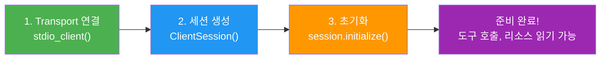
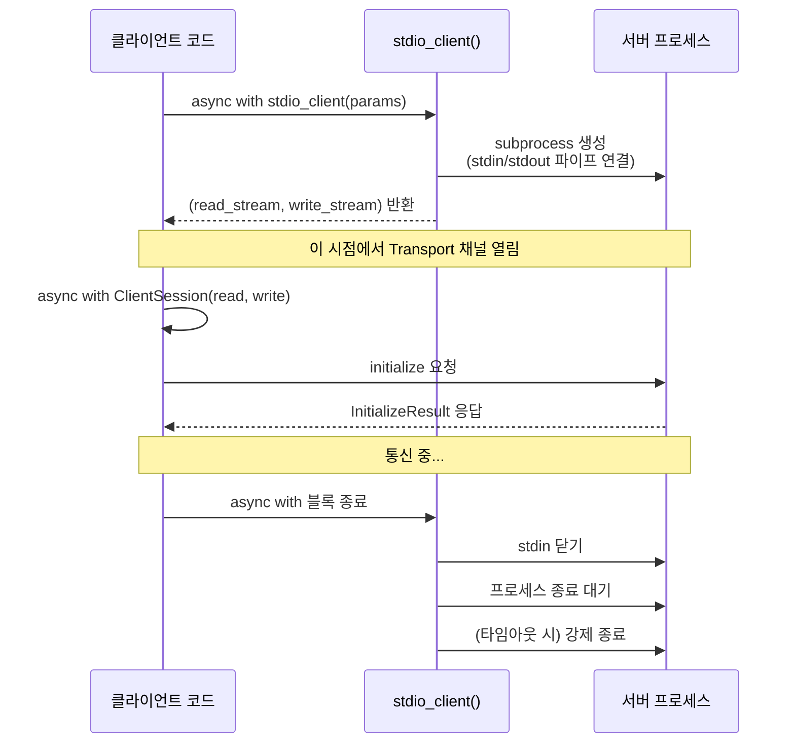
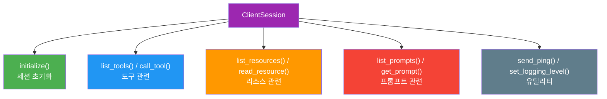
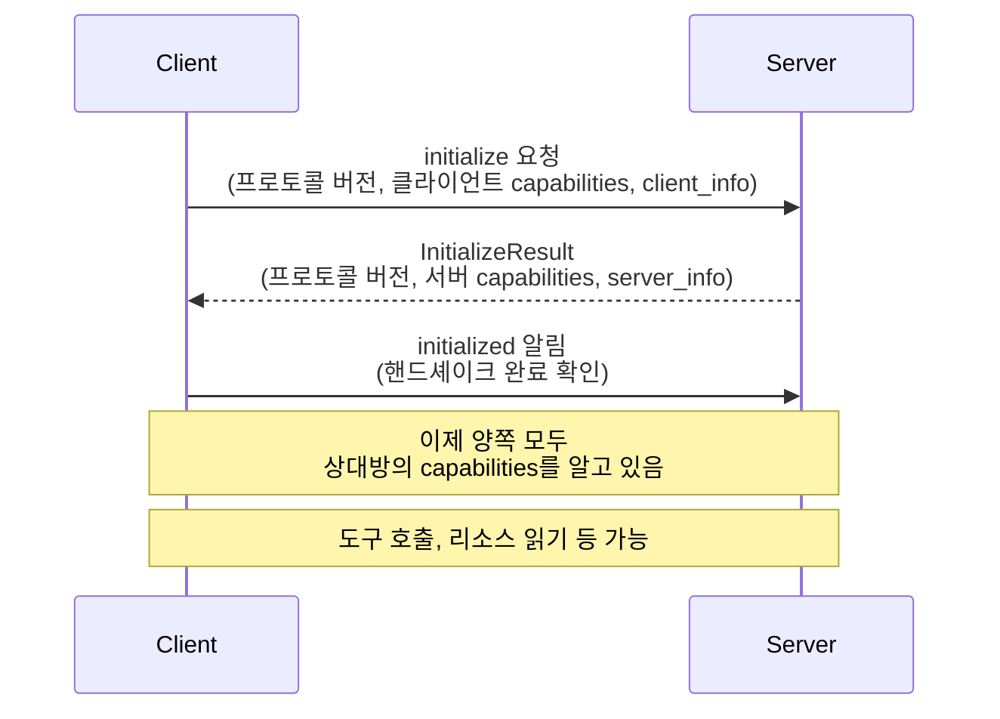
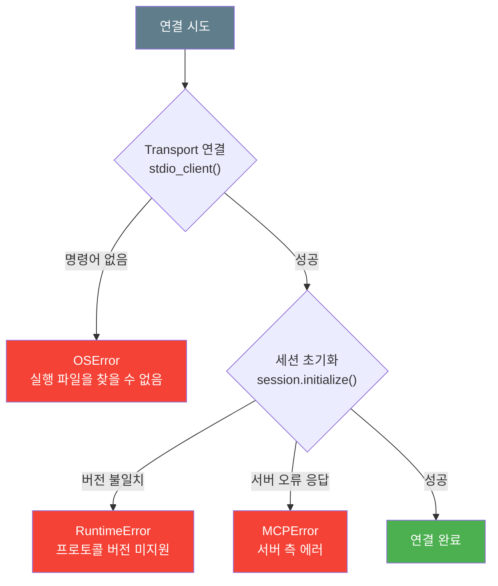
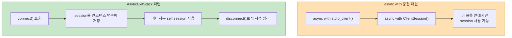

# 01. ClientSession과 서버 연결

> MCP 클라이언트의 출발점 — Python SDK로 서버에 연결하고, 세션을 초기화하고, 서버가 무엇을 할 수 있는지 파악하는 법을 배웁니다.

## 개요

지금까지 우리는 MCP 서버를 만드는 쪽에 집중했습니다. 도구를 정의하고, 리소스를 노출하고, 프롬프트를 설계했죠. 이번 챕터부터는 **반대편** — 서버에 연결하여 그 기능을 활용하는 **클라이언트**를 직접 만듭니다.

**선수 지식**:
- [Host/Client/Server 3계층](02-ch2-mcp-아키텍처와-프로토콜-구조/01-01-hostclientserver-3계층.md) 아키텍처 이해
- [stdio Transport](02-ch2-mcp-아키텍처와-프로토콜-구조/02-02-transport-계층-stdio.md)의 동작 원리
- [세션 라이프사이클과 Capability Negotiation](02-ch2-mcp-아키텍처와-프로토콜-구조/05-05-세션-라이프사이클과-capability-negotiation.md) 개념
- Python `asyncio`와 `async with` 컨텍스트 매니저 사용 경험

**학습 목표**:
- `ClientSession`과 `stdio_client()`의 역할과 관계를 설명할 수 있다
- stdio Transport로 로컬 MCP 서버에 연결하고 세션을 초기화할 수 있다
- 서버의 capabilities와 server_info를 조회하여 서버가 제공하는 기능을 파악할 수 있다
- `AsyncExitStack`을 활용한 클래스 기반 클라이언트 패턴을 구현할 수 있다
- 연결 실패와 프로토콜 오류를 적절히 처리할 수 있다

## 왜 알아야 할까?

Claude Desktop이나 VS Code 같은 호스트 애플리케이션은 이미 MCP 클라이언트를 내장하고 있습니다. 그런데 왜 직접 클라이언트를 만들어야 할까요?

**첫째, 자동화입니다.** CI/CD 파이프라인에서 MCP 서버의 도구를 자동으로 호출하거나, 배치 작업으로 리소스를 수집하려면 프로그래밍 가능한 클라이언트가 필요합니다.

**둘째, 커스텀 호스트입니다.** 웹 앱, 슬랙 봇, 사내 도구 등 여러분만의 AI 애플리케이션에 MCP 서버를 통합하려면 클라이언트 코드를 직접 작성해야 합니다.

**셋째, 디버깅입니다.** MCP Inspector가 훌륭한 도구이지만, 특정 시나리오를 재현하거나 스트레스 테스트를 하려면 프로그래밍 가능한 클라이언트가 훨씬 유연합니다.

이 세션에서 배우는 `ClientSession` 연결 패턴은 이후 [도구 조회와 호출](09-ch9-mcp-클라이언트-개발/02-02-도구-조회와-호출.md), [LLM 통합 에이전트 루프](09-ch9-mcp-클라이언트-개발/04-04-llm-통합-에이전트-루프.md) 등 모든 클라이언트 기능의 **기반**이 됩니다.

## 핵심 개념

### 개념 1: 클라이언트 연결의 전체 그림

> 💡 **비유**: 전화 통화를 생각해보세요. 전화기(Transport)로 상대방에게 전화를 걸고, 연결이 되면 통화 세션(ClientSession)이 시작됩니다. 통화가 시작되자마자 서로 "안녕하세요, 저는 누구입니다"라고 자기소개(Initialize)를 하죠. 그래야 대화(요청/응답)를 시작할 수 있습니다.

MCP 클라이언트가 서버에 연결하는 과정은 크게 세 단계입니다:

1. **Transport 연결** — `stdio_client()`가 서버 프로세스를 실행하고 통신 채널을 엽니다
2. **세션 생성** — `ClientSession`이 읽기/쓰기 스트림을 받아 프로토콜 핸들러를 시작합니다
3. **초기화 핸드셰이크** — `session.initialize()`가 클라이언트와 서버의 능력을 교환합니다

> 📊 **그림 1**: MCP 클라이언트 연결의 3단계



이 세 단계를 코드로 보면 매우 깔끔합니다:

```python
from mcp import ClientSession, StdioServerParameters
from mcp.client.stdio import stdio_client

server_params = StdioServerParameters(
    command="python",
    args=["my_server.py"]
)

# 1단계: Transport 연결
async with stdio_client(server_params) as (read, write):
    # 2단계: 세션 생성
    async with ClientSession(read, write) as session:
        # 3단계: 초기화
        result = await session.initialize()
        # 이제 서버와 대화할 준비 완료!
```

`async with`가 두 번 중첩된 구조가 핵심입니다. 바깥쪽은 프로세스 수명을, 안쪽은 세션 수명을 관리합니다. 블록을 빠져나가면 자동으로 정리됩니다.

### 개념 2: stdio_client()와 StdioServerParameters

> 💡 **비유**: `StdioServerParameters`는 전화번호부 같은 겁니다. "누구한테(command), 어떤 번호로(args), 어떤 환경에서(env) 전화할지"를 적어두는 거죠. `stdio_client()`는 이 정보로 실제 전화를 거는 행위입니다.

`StdioServerParameters`는 서버 프로세스를 어떻게 실행할지 정의하는 설정 객체입니다:

```python
from mcp import StdioServerParameters

# 기본 사용
server_params = StdioServerParameters(
    command="python",           # 실행할 명령어
    args=["server.py"],         # 명령어 인자
)

# 환경 변수와 작업 디렉토리 지정
server_params = StdioServerParameters(
    command="python",
    args=["-m", "my_mcp_server"],
    env={"DATABASE_URL": "sqlite:///data.db"},  # 환경 변수
    cwd="/path/to/project",                     # 작업 디렉토리
)

# uv로 관리되는 서버 실행
server_params = StdioServerParameters(
    command="uv",
    args=["run", "server.py"],
)
```

> 📊 **그림 2**: stdio_client()의 내부 동작



`stdio_client()`는 서버를 자식 프로세스로 실행한 뒤, **stdin/stdout 파이프를 통해 JSON-RPC 메시지를 교환**합니다. [stdio Transport](02-ch2-mcp-아키텍처와-프로토콜-구조/02-02-transport-계층-stdio.md)에서 배운 그대로죠. 서버의 stderr 출력은 클라이언트의 stderr로 전달되어 디버깅에 활용할 수 있습니다.

`env` 파라미터에 `None`을 전달하면(기본값) **현재 프로세스의 환경 변수를 그대로 상속**합니다. 특정 환경 변수만 설정하고 싶다면 딕셔너리를 전달하세요 — 이 경우 지정한 변수만 서버에 전달됩니다.

### 개념 3: ClientSession — 프로토콜 핸들러

> 💡 **비유**: Transport가 전화선이라면, `ClientSession`은 통화 중 대화를 관리하는 비서입니다. "이 질문 보내고 답변 기다려줘", "상대가 뭘 할 수 있는지 확인해줘" 같은 일을 대신 처리해주죠.

`ClientSession`은 MCP 프로토콜의 모든 클라이언트 측 로직을 캡슐화합니다. Transport 계층이 제공하는 raw 스트림 위에서 JSON-RPC 메시지를 주고받는 역할이에요.

```python
from mcp import ClientSession
from mcp.types import Implementation

async with ClientSession(
    read_stream=read,                    # Transport에서 받은 읽기 스트림
    write_stream=write,                  # Transport에서 받은 쓰기 스트림
    read_timeout_seconds=30.0,           # 응답 대기 타임아웃 (기본: None = 무제한)
    sampling_callback=None,              # Sampling 요청 핸들러
    logging_callback=None,              # 서버 로그 수신 핸들러
    client_info=Implementation(          # 클라이언트 식별 정보
        name="my-client",
        version="1.0.0"
    ),
) as session:
    # 세션 사용
    pass
```

> 📊 **그림 3**: ClientSession의 주요 메서드



`ClientSession`이 `async with`로 진입하면 내부에서 **수신 루프(receive loop)**를 시작합니다. 이 루프가 서버로부터 오는 모든 메시지를 받아서, 요청의 응답인지 서버의 알림(Notification)인지 분류하여 적절히 처리합니다. 블록을 빠져나가면 수신 루프가 취소되고 리소스가 정리됩니다.

### 개념 4: initialize()와 Capability Negotiation

> 💡 **비유**: 새로운 레스토랑에 가면 먼저 메뉴판을 받잖아요. `initialize()`는 서버에게 "메뉴판 주세요"라고 요청하는 것과 같습니다. 메뉴판(capabilities)을 보고 이 서버가 어떤 요리(도구, 리소스, 프롬프트)를 제공하는지 파악하는 거죠.

`session.initialize()`는 MCP 세션의 **첫 번째이자 반드시 필요한** 호출입니다. 이 메서드가 하는 일을 살펴볼까요?

```python
result = await session.initialize()

# result의 구조
print(result.protocol_version)     # "2025-03-26" — 합의된 프로토콜 버전
print(result.server_info.name)     # "my-server" — 서버 이름
print(result.server_info.version)  # "1.0.0" — 서버 버전
print(result.instructions)         # 서버가 제공하는 사용 지침 (선택)
print(result.capabilities)         # 서버의 능력 목록
```

`InitializeResult`에서 가장 중요한 것은 `capabilities`입니다. 이 객체를 통해 서버가 어떤 프리미티브를 지원하는지 알 수 있습니다:

```python
caps = result.capabilities

# 각 capability가 None이면 해당 기능을 지원하지 않는다는 뜻
if caps.tools:
    print("도구 지원 ✓")
    print(f"  목록 변경 알림: {caps.tools.listChanged}")

if caps.resources:
    print("리소스 지원 ✓")
    print(f"  구독 지원: {caps.resources.subscribe}")
    print(f"  목록 변경 알림: {caps.resources.listChanged}")

if caps.prompts:
    print("프롬프트 지원 ✓")
    print(f"  목록 변경 알림: {caps.prompts.listChanged}")

if caps.logging:
    print("로깅 지원 ✓")
```

> 📊 **그림 4**: Initialize 핸드셰이크 흐름



핸드셰이크 과정에서 중요한 점이 있습니다. 만약 서버가 반환한 `protocol_version`이 클라이언트가 지원하는 버전 목록에 없으면, `initialize()`는 **`RuntimeError`를 발생**시킵니다. 이것은 호환되지 않는 서버와의 연결을 초기에 차단하는 안전장치입니다.

### 개념 5: 연결 에러 처리

> 💡 **비유**: 전화를 걸었는데 상대방이 안 받을 수도 있고, 번호가 틀렸을 수도 있고, 전화선 자체가 끊어졌을 수도 있습니다. 각각 다른 종류의 문제이니 다르게 대응해야 하죠.

MCP 클라이언트에서 발생할 수 있는 주요 오류 유형은 세 가지입니다:

```python
from mcp import ClientSession, StdioServerParameters, MCPError
from mcp.client.stdio import stdio_client

server_params = StdioServerParameters(
    command="python",
    args=["server.py"]
)

try:
    async with stdio_client(server_params) as (read, write):
        async with ClientSession(read, write) as session:
            result = await session.initialize()
            # 정상 동작...

except OSError as e:
    # 1. 프로세스 실행 실패 — command를 찾을 수 없거나 권한 문제
    print(f"서버 프로세스 실행 실패: {e}")

except RuntimeError as e:
    # 2. 프로토콜 버전 불일치 — initialize() 단계에서 발생
    print(f"프로토콜 호환 오류: {e}")

except MCPError as e:
    # 3. MCP 프로토콜 수준 오류 — 서버가 에러 응답을 보낸 경우
    print(f"MCP 오류: {e}")

except Exception as e:
    # 4. 기타 — 네트워크 문제, 스트림 닫힘 등
    print(f"예상치 못한 오류: {e}")
```

> 📊 **그림 5**: 연결 단계별 에러 유형



실무에서는 `read_timeout_seconds`를 설정하여 응답 없는 서버에 무한정 기다리는 것을 방지하는 것이 좋습니다:

```python
async with ClientSession(
    read, write,
    read_timeout_seconds=30.0  # 30초 내 응답 없으면 타임아웃
) as session:
    result = await session.initialize()
```

## 실습: 직접 해보기

실습을 위해 먼저 간단한 MCP 서버를 만들고, 그 서버에 클라이언트로 연결해보겠습니다.

### 1단계: 테스트용 MCP 서버 만들기

```python
# test_server.py — 실습용 MCP 서버
from mcp.server.fastmcp import FastMCP

mcp = FastMCP(
    name="test-server",
    version="0.1.0",
    instructions="이것은 클라이언트 연결 테스트용 서버입니다."
)

@mcp.tool()
def add(a: int, b: int) -> int:
    """두 수를 더합니다."""
    return a + b

@mcp.tool()
def greet(name: str) -> str:
    """인사말을 생성합니다."""
    return f"안녕하세요, {name}님!"

@mcp.resource("info://server/status")
def server_status() -> str:
    """서버 상태를 반환합니다."""
    return "running"

if __name__ == "__main__":
    mcp.run(transport="stdio")
```

### 2단계: 클라이언트로 연결하기

```run:python
# connect_client.py — MCP 클라이언트 연결 실습
import asyncio
from mcp import ClientSession, StdioServerParameters
from mcp.client.stdio import stdio_client

async def main():
    # 서버 실행 파라미터 정의
    server_params = StdioServerParameters(
        command="python",
        args=["test_server.py"]
    )

    # Transport 연결 → 세션 생성 → 초기화
    async with stdio_client(server_params) as (read, write):
        async with ClientSession(read, write) as session:
            # 초기화 — 서버와 핸드셰이크
            result = await session.initialize()

            # 서버 정보 출력
            print(f"서버 이름: {result.server_info.name}")
            print(f"서버 버전: {result.server_info.version}")
            print(f"프로토콜: {result.protocol_version}")
            print(f"안내: {result.instructions}")
            print()

            # Capabilities 확인
            caps = result.capabilities
            print("=== 서버 Capabilities ===")
            print(f"도구(Tools): {'지원' if caps.tools else '미지원'}")
            print(f"리소스(Resources): {'지원' if caps.resources else '미지원'}")
            print(f"프롬프트(Prompts): {'지원' if caps.prompts else '미지원'}")
            print(f"로깅(Logging): {'지원' if caps.logging else '미지원'}")
            print()

            # 도구 목록 조회 (capabilities에서 tools 지원 확인 후)
            if caps.tools:
                tools_result = await session.list_tools()
                print("=== 사용 가능한 도구 ===")
                for tool in tools_result.tools:
                    print(f"  - {tool.name}: {tool.description}")

            # 리소스 목록 조회
            if caps.resources:
                resources_result = await session.list_resources()
                print("\n=== 사용 가능한 리소스 ===")
                for resource in resources_result.resources:
                    print(f"  - {resource.name}: {resource.uri}")

asyncio.run(main())
```

```output
서버 이름: test-server
서버 버전: 0.1.0
프로토콜: 2025-03-26
안내: 이것은 클라이언트 연결 테스트용 서버입니다.

=== 서버 Capabilities ===
도구(Tools): 지원
리소스(Resources): 지원
프롬프트(Prompts): 미지원
로깅(Logging): 지원

=== 사용 가능한 도구 ===
  - add: 두 수를 더합니다.
  - greet: 인사말을 생성합니다.

=== 사용 가능한 리소스 ===
  - server-status: info://server/status
```

### 3단계: AsyncExitStack으로 클래스 기반 클라이언트 만들기

실전에서는 연결을 클래스로 관리하는 패턴이 더 유용합니다. `async with` 중첩 대신 `AsyncExitStack`을 사용하면 연결의 생명주기를 유연하게 제어할 수 있거든요.

왜 이 패턴이 필요할까요? `async with` 중첩 구조에서는 블록 안에서만 세션을 사용할 수 있습니다. 하지만 실제 애플리케이션에서는 **연결을 한 번 맺고, 여러 메서드에서 세션을 공유하며, 적절한 시점에 정리**해야 하는 경우가 대부분이죠.

> 📊 **그림 6**: async with 중첩 vs AsyncExitStack 비교



```python
# mcp_client.py — 클래스 기반 MCP 클라이언트
import asyncio
from contextlib import AsyncExitStack
from mcp import ClientSession, StdioServerParameters
from mcp.client.stdio import stdio_client
from mcp.types import Implementation

class MCPClient:
    """재사용 가능한 MCP 클라이언트 클래스."""

    def __init__(self):
        self.session: ClientSession | None = None
        self._exit_stack = AsyncExitStack()

    async def connect(self, command: str, args: list[str]) -> dict:
        """서버에 연결하고 서버 정보를 반환합니다."""
        server_params = StdioServerParameters(
            command=command,
            args=args
        )

        # AsyncExitStack으로 컨텍스트 관리
        # enter_async_context()는 async with 진입과 동일한 효과
        read, write = await self._exit_stack.enter_async_context(
            stdio_client(server_params)
        )
        self.session = await self._exit_stack.enter_async_context(
            ClientSession(
                read, write,
                read_timeout_seconds=30.0,
                client_info=Implementation(
                    name="my-mcp-client",
                    version="1.0.0"
                )
            )
        )

        # 초기화 — 반드시 첫 번째 호출
        result = await self.session.initialize()

        return {
            "server_name": result.server_info.name,
            "server_version": result.server_info.version,
            "protocol_version": result.protocol_version,
            "has_tools": result.capabilities.tools is not None,
            "has_resources": result.capabilities.resources is not None,
            "has_prompts": result.capabilities.prompts is not None,
        }

    async def disconnect(self):
        """연결을 정리합니다. AsyncExitStack이 역순으로 컨텍스트를 종료합니다."""
        await self._exit_stack.aclose()
        self.session = None
```

`AsyncExitStack.enter_async_context()`는 `async with` 블록 진입과 동일한 효과를 가집니다. 차이점은 **블록이 끝나도 자동으로 나가지 않는다**는 것이에요. 대신 `aclose()`를 호출하면 등록된 컨텍스트를 **역순으로** 정리합니다. 즉, `ClientSession`이 먼저 종료되고, 그 다음 `stdio_client`(서버 프로세스)가 종료됩니다.

이 클래스를 사용하는 코드는 이렇게 됩니다:

```run:python
# 클래스 기반 클라이언트 사용 예
import asyncio

async def main():
    client = MCPClient()
    try:
        # 연결
        info = await client.connect("python", ["test_server.py"])
        print(f"연결 성공: {info['server_name']} v{info['server_version']}")
        print(f"도구: {'O' if info['has_tools'] else 'X'}")
        print(f"리소스: {'O' if info['has_resources'] else 'X'}")
        print(f"프롬프트: {'O' if info['has_prompts'] else 'X'}")

        # 연결된 상태에서 자유롭게 작업
        if client.session:
            tools = await client.session.list_tools()
            print(f"\n도구 {len(tools.tools)}개 발견")
            for tool in tools.tools:
                print(f"  - {tool.name}")

    finally:
        # 반드시 정리
        await client.disconnect()
        print("\n연결 종료")

asyncio.run(main())
```

```output
연결 성공: test-server v0.1.0
도구: O
리소스: O
프롬프트: X

도구 2개 발견
  - add
  - greet

연결 종료
```

이 패턴은 다음 세션에서 LLM과 통합할 때 더욱 빛을 발합니다. LLM의 응답을 파싱하고, MCP 도구를 호출하고, 결과를 다시 LLM에게 전달하는 **에이전트 루프**를 구현할 때, 세션을 클래스 속성으로 들고 있으면 코드가 훨씬 깔끔해지거든요.

### 4단계: 에러 처리가 포함된 견고한 연결

프로덕션에서는 다양한 실패 상황을 대비해야 합니다. 재시도 로직까지 포함한 견고한 연결 함수를 만들어봅시다:

```python
# robust_connect.py — 재시도가 포함된 연결 함수
import asyncio
from mcp import ClientSession, StdioServerParameters, MCPError
from mcp.client.stdio import stdio_client

async def connect_with_retry(
    server_params: StdioServerParameters,
    max_retries: int = 3,
    retry_delay: float = 2.0,
    timeout: float = 30.0,
) -> tuple:
    """재시도 로직이 포함된 MCP 서버 연결.

    Returns:
        (read_stream, write_stream, session, init_result) 튜플
    """
    last_error = None

    for attempt in range(1, max_retries + 1):
        try:
            # stdio_client와 ClientSession은 호출 측에서 관리
            read, write = await stdio_client(server_params).__aenter__()
            session = await ClientSession(
                read, write,
                read_timeout_seconds=timeout
            ).__aenter__()

            result = await session.initialize()
            print(f"[시도 {attempt}] 연결 성공: {result.server_info.name}")
            return read, write, session, result

        except OSError as e:
            # 서버 실행 파일을 찾을 수 없음 — 재시도 무의미
            print(f"[시도 {attempt}] 서버 실행 실패: {e}")
            raise  # 즉시 포기

        except (RuntimeError, MCPError) as e:
            last_error = e
            print(f"[시도 {attempt}] 연결 오류: {e}")
            if attempt < max_retries:
                print(f"  {retry_delay}초 후 재시도...")
                await asyncio.sleep(retry_delay)

    raise ConnectionError(
        f"{max_retries}회 시도 실패. 마지막 오류: {last_error}"
    )
```

> 🔥 **실무 팁**: `OSError`(실행 파일 없음)는 재시도해도 결과가 같으므로 즉시 포기하고, `RuntimeError`나 `MCPError`는 일시적 오류일 수 있으니 재시도하는 것이 좋은 패턴입니다.

## 더 깊이 알아보기

### ClientSession의 탄생 배경

MCP Python SDK의 `ClientSession`은 처음부터 지금의 모습은 아니었습니다. 초기 MCP 프로토콜(2024년 11월 공개)에서는 Transport로 **stdio**와 **SSE(Server-Sent Events)**만 지원했는데, SSE는 HTTP 기반이라 방화벽 뒤의 로컬 서버에는 과도했고, stdio는 로컬 전용이라 원격 서버에 쓸 수 없었죠.

2025년 3월, MCP 스펙 개정에서 SSE를 대체하는 **Streamable HTTP Transport**가 도입되었습니다. 이 변경은 `ClientSession`의 설계에도 영향을 미쳤는데, 핵심 아이디어는 **Transport와 세션을 완전히 분리**하는 것이었습니다. `stdio_client()`, `streamable_http_client()` 등 어떤 Transport를 쓰든 `(read_stream, write_stream)` 튜플만 받으면 동일한 `ClientSession`으로 동작합니다. 이 설계 덕분에 새로운 Transport가 추가되어도 클라이언트 코드를 거의 변경할 필요가 없습니다.

> 💡 **알고 계셨나요?**: MCP Python SDK는 내부적으로 **anyio** 라이브러리를 사용합니다. anyio는 asyncio와 trio 양쪽을 지원하는 비동기 호환 레이어인데, 덕분에 `ClientSession`은 asyncio뿐 아니라 trio 이벤트 루프에서도 동작합니다. 하지만 실무에서는 대부분 asyncio를 쓰므로, `asyncio.run(main())`이 표준 패턴입니다.

### SDK v2 이야기

2026년 현재, MCP Python SDK v2가 준비 중입니다. v2에서는 `ClientSessionGroup`이 더욱 강화되어, 멀티 서버 연결과 도구 라우팅이 한층 편리해질 예정입니다. 하지만 `ClientSession`의 기본 API — `initialize()`, `list_tools()`, `call_tool()` 등 — 는 v1에서 v2로 거의 그대로 이어집니다. 지금 배우는 패턴이 미래에도 유효한 셈이죠.

## 흔한 오해와 팁

> ⚠️ **흔한 오해**: "`initialize()`를 호출하지 않아도 `list_tools()`가 동작하겠지?" — 아닙니다. `initialize()`를 건너뛰면 서버는 모든 요청을 거부합니다. MCP 스펙에서 초기화 핸드셰이크는 **필수** 단계입니다. 서버는 `initialize`가 완료되기 전에 받은 요청을 에러로 응답합니다.

> 💡 **알고 계셨나요?**: `StdioServerParameters`의 `env`에 `None`을 전달하면 현재 프로세스의 전체 환경 변수가 상속됩니다. 하지만 빈 딕셔너리 `{}`를 전달하면 서버 프로세스에 **환경 변수가 하나도 전달되지 않습니다**. API 키 등을 서버에 전달해야 할 때 이 차이를 기억하세요.

> 🔥 **실무 팁**: 서버 연결이 자꾸 실패한다면 `stderr` 출력을 확인하세요. `stdio_client()`는 서버의 stderr를 클라이언트의 stderr로 전달합니다. 서버 측 import 오류, 설정 파일 누락 등의 문제를 빠르게 파악할 수 있습니다. 혹은 `errlog` 파라미터로 별도의 파일에 기록할 수도 있습니다:

```python
import io

err_buffer = io.StringIO()
async with stdio_client(server_params, errlog=err_buffer) as (read, write):
    # ...
    # 에러 확인
    print("서버 stderr:", err_buffer.getvalue())
```

> 🔥 **실무 팁**: `read_timeout_seconds`를 반드시 설정하세요. 기본값이 `None`(무제한)이라서, 서버가 응답하지 않으면 클라이언트가 영원히 멈춥니다. 프로덕션에서는 30~60초가 적당합니다.

> ⚠️ **흔한 오해**: "`AsyncExitStack`을 쓰면 `disconnect()`를 안 불러도 되나요?" — 아닙니다. `async with` 패턴과 달리, `AsyncExitStack`은 블록 종료 시 자동 정리가 되지 않습니다. 반드시 `aclose()`(또는 `disconnect()`)를 호출해야 서버 프로세스가 정상 종료됩니다. `try/finally`로 감싸는 것이 안전합니다.

## 핵심 정리

| 개념 | 설명 |
|------|------|
| `StdioServerParameters` | 서버 프로세스 실행 설정 (command, args, env, cwd) |
| `stdio_client()` | 서버를 subprocess로 실행하고 stdin/stdout 통신 채널을 여는 async context manager |
| `ClientSession` | MCP 프로토콜의 클라이언트 측 핸들러. Transport 스트림을 받아 JSON-RPC 메시지를 주고받음 |
| `session.initialize()` | 세션의 첫 호출. 프로토콜 버전과 capabilities를 교환하는 핸드셰이크 |
| `InitializeResult` | 초기화 결과. `server_info`, `capabilities`, `protocol_version`, `instructions` 포함 |
| `ServerCapabilities` | 서버가 지원하는 기능 목록 (tools, resources, prompts, logging 등) |
| `AsyncExitStack` | 클래스 기반 클라이언트에서 연결/해제를 분리하여 관리하는 패턴 |
| `MCPError` | MCP 프로토콜 수준의 에러. 서버가 에러 응답을 보낸 경우 |

## 다음 섹션 미리보기

서버에 연결하고 capabilities를 확인하는 방법을 배웠으니, 이제 실제로 서버의 기능을 **사용**할 차례입니다. 다음 세션 [도구 조회와 호출](09-ch9-mcp-클라이언트-개발/02-02-도구-조회와-호출.md)에서는 `list_tools()`로 도구 목록을 가져오고, `call_tool()`로 도구를 실행하며, 실행 결과를 파싱하는 방법을 다룹니다. 오늘 만든 `MCPClient` 클래스에 도구 호출 기능을 추가하게 됩니다.

## 참고 자료

- [MCP Python SDK GitHub 저장소](https://github.com/modelcontextprotocol/python-sdk) - `ClientSession`, `stdio_client()` 등의 소스 코드와 최신 API 확인
- [Build an MCP Client — 공식 문서](https://modelcontextprotocol.io/docs/develop/build-client) - MCP 공식 사이트의 클라이언트 구축 가이드
- [Build a Python MCP Client — Real Python](https://realpython.com/python-mcp-client/) - 단계별 클라이언트 구축 튜토리얼, AsyncExitStack 패턴 포함
- [MCP Specification — Session Lifecycle](https://modelcontextprotocol.io/specification/2025-11-25) - 초기화 핸드셰이크와 capability negotiation 스펙
- [MCP Python SDK API Reference](https://py.sdk.modelcontextprotocol.io/api/) - ClientSession, StdioServerParameters 등의 공식 API 레퍼런스

---

---
### 🔗 Related Sessions
- [stdio transport](02-ch2-mcp-아키텍처와-프로토콜-구조/02-02-transport-계층-stdio.md) (prerequisite)
