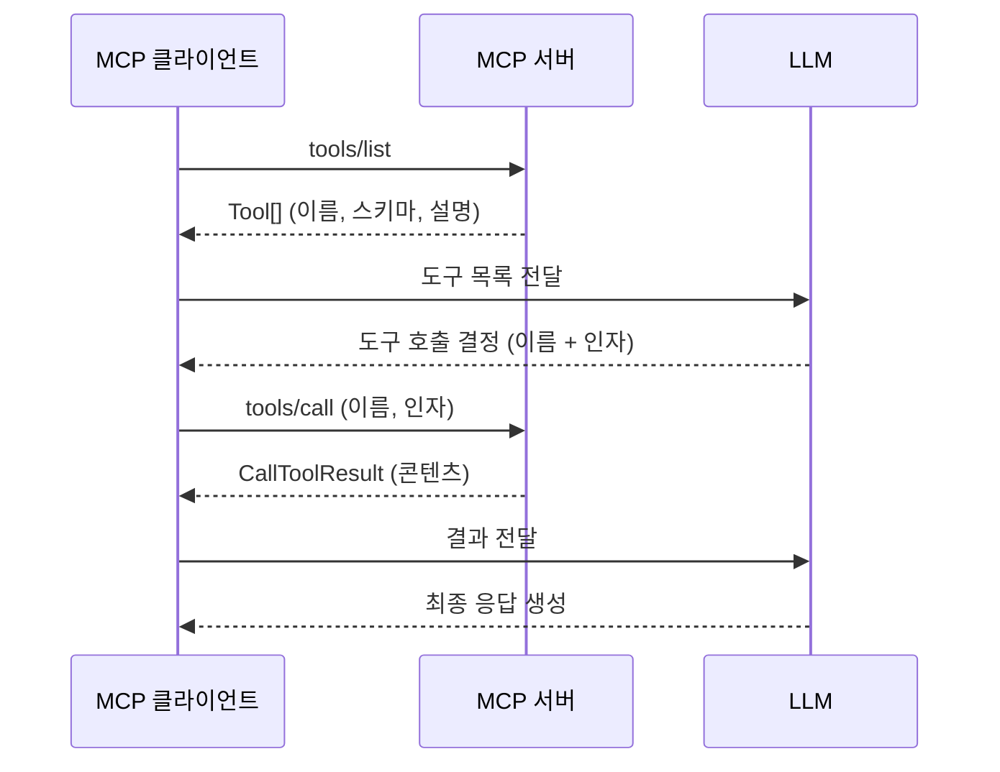
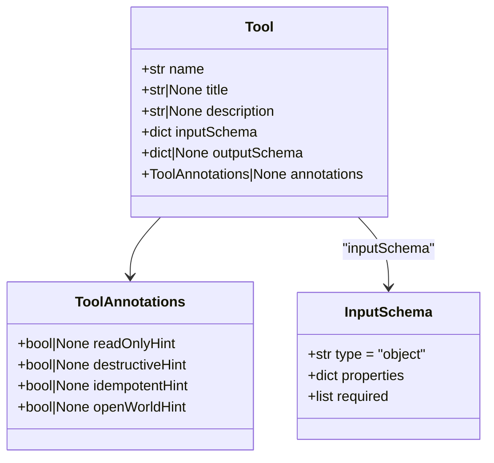
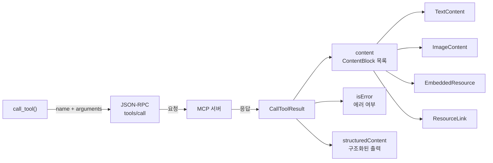
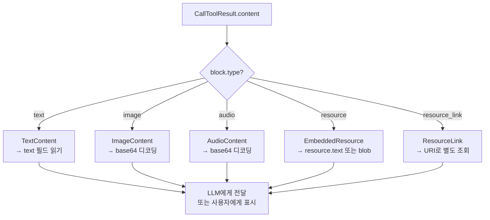
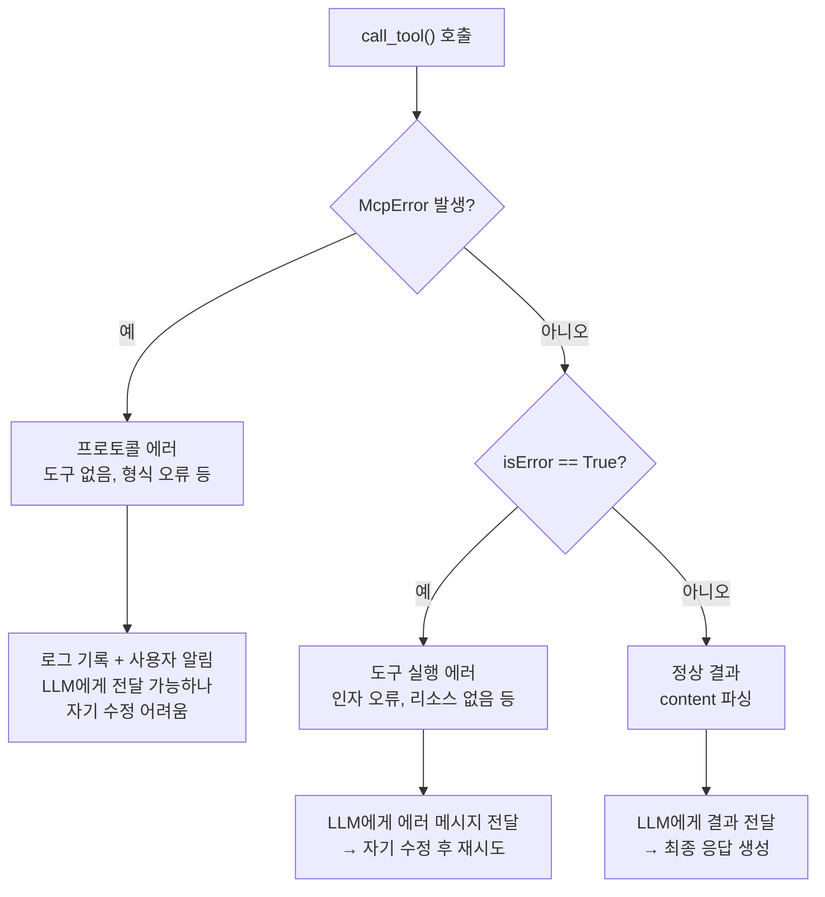

# 도구 조회와 호출

> MCP 클라이언트에서 서버의 도구 목록을 조회하고, 도구를 호출하여 결과를 처리하는 방법을 학습합니다.

## 개요

이 섹션에서는 MCP 클라이언트가 서버에 연결한 후 가장 먼저 하는 일 — **사용 가능한 도구를 발견하고 실행하는 방법**을 다룹니다. 이전 섹션에서 `ClientSession`으로 서버에 연결하는 방법을 배웠다면, 이제 그 세션을 통해 실제로 도구를 활용하는 단계입니다.

**선수 지식**: [ClientSession과 서버 연결](09-ch9-mcp-클라이언트-개발/01-01-clientsession과-서버-연결.md)에서 배운 `stdio_client()`, `ClientSession`, `initialize()` 패턴

**학습 목표**:
- `list_tools()`로 서버의 도구 목록을 조회하고 `Tool` 객체의 구조를 이해할 수 있다
- `call_tool()`로 도구를 실행하고 `CallToolResult`의 다양한 콘텐츠 타입을 파싱할 수 있다
- `isError` 플래그와 `McpError` 예외를 구분하여 적절한 에러 처리를 구현할 수 있다
- 도구의 `inputSchema`를 활용하여 LLM에게 도구 정보를 전달하는 패턴을 구현할 수 있다

## 왜 알아야 할까?

MCP 클라이언트의 핵심 역할은 **"서버가 뭘 할 수 있는지 파악하고, 그 능력을 LLM에게 알려주는 것"**입니다. Claude Desktop이나 VS Code 같은 호스트 애플리케이션이 MCP 서버에 연결했을 때, 내부적으로 가장 먼저 하는 일이 바로 `list_tools()` 호출이거든요.

이 과정이 없으면 LLM은 어떤 도구가 있는지조차 모르고, 있다 하더라도 올바른 인자를 전달할 수 없습니다. 반대로 이 과정을 잘 구현하면, 서버를 하나 추가하는 것만으로 LLM의 능력이 자동으로 확장됩니다 — 코드 변경 없이요.

> 📊 **그림 1**: MCP 도구 호출의 전체 흐름 — 발견부터 실행까지



## 핵심 개념

### 개념 1: list_tools() — 도구 발견

> 💡 **비유**: 레스토랑에 들어가면 먼저 메뉴판을 받죠? `list_tools()`는 MCP 서버의 메뉴판을 요청하는 것입니다. 메뉴판에는 요리 이름(name), 설명(description), 그리고 주문 방법(inputSchema)이 적혀 있습니다.

`list_tools()`는 JSON-RPC의 `tools/list` 메서드를 호출하여 서버가 노출하는 모든 도구의 목록을 가져옵니다. 반환 타입은 `ListToolsResult`이고, 그 안에 `Tool` 객체의 리스트가 들어 있습니다.

```python
from mcp import ClientSession, StdioServerParameters
from mcp.client.stdio import stdio_client

server_params = StdioServerParameters(
    command="python", args=["my_server.py"]
)

async with stdio_client(server_params) as (read, write):
    async with ClientSession(read, write) as session:
        await session.initialize()

        # 도구 목록 조회
        tools_result = await session.list_tools()

        for tool in tools_result.tools:
            print(f"도구 이름: {tool.name}")
            print(f"설명: {tool.description}")
            print(f"입력 스키마: {tool.inputSchema}")
            print(f"---")
```

`Tool` 객체의 핵심 필드를 살펴보겠습니다:

> 📊 **그림 2**: Tool 객체의 구조



각 필드의 역할을 정리하면:

| 필드 | 타입 | 설명 |
|------|------|------|
| `name` | `str` | 프로그래밍용 식별자. `call_tool()`에 전달하는 이름 |
| `title` | `str \| None` | 사람이 읽기 쉬운 표시 이름 (최근 스펙에 추가) |
| `description` | `str \| None` | 도구의 기능 설명. **LLM이 읽고 도구 선택을 결정**하므로 매우 중요 |
| `inputSchema` | `dict` | JSON Schema 형식의 입력 파라미터 정의. 항상 존재 |
| `outputSchema` | `dict \| None` | 구조화된 출력의 스키마 (선택) |
| `annotations` | `ToolAnnotations \| None` | 도구의 행동 힌트 (읽기 전용, 파괴적 등) |

`inputSchema`는 JSON Schema 표준을 따르는 딕셔너리인데요, 이것이 LLM에게 "이 도구를 쓰려면 어떤 인자가 필요한지"를 알려주는 핵심 정보입니다:

```run:python
# inputSchema 예시 — get_weather 도구
import json

input_schema = {
    "type": "object",
    "properties": {
        "location": {
            "type": "string",
            "description": "날씨를 조회할 도시 이름"
        },
        "unit": {
            "type": "string",
            "enum": ["celsius", "fahrenheit"],
            "description": "온도 단위",
            "default": "celsius"
        }
    },
    "required": ["location"]
}

print(json.dumps(input_schema, indent=2, ensure_ascii=False))
```

```output
{
  "type": "object",
  "properties": {
    "location": {
      "type": "string",
      "description": "날씨를 조회할 도시 이름"
    },
    "unit": {
      "type": "string",
      "enum": [
        "celsius",
        "fahrenheit"
      ],
      "description": "온도 단위",
      "default": "celsius"
    }
  },
  "required": [
    "location"
  ]
}
```

#### ToolAnnotations — 도구의 행동 힌트

`ToolAnnotations`는 MCP 2025-06-18 스펙에서 추가된 메타데이터로, 호스트 애플리케이션이 도구를 어떻게 다룰지 판단하는 **힌트**입니다. "힌트"라는 점이 중요한데, 보안을 보장하는 것이 아니라 UX 결정에 참고하는 정보거든요.

| 어노테이션 | 기본값 | 의미 |
|-----------|--------|------|
| `readOnlyHint` | `False` | `True`면 읽기 전용 — 상태를 변경하지 않음 |
| `destructiveHint` | `True` | `True`면 파괴적 — 삭제, 덮어쓰기 등 (readOnly가 False일 때만 의미) |
| `idempotentHint` | `False` | `True`면 같은 인자로 여러 번 호출해도 결과 동일 |
| `openWorldHint` | `True` | `True`면 외부 시스템과 상호작용 (네트워크 등) |

```python
# ToolAnnotations 활용 예시
for tool in tools_result.tools:
    if tool.annotations:
        if tool.annotations.destructiveHint:
            print(f"⚠️ {tool.name}: 파괴적 도구 — 사용자 확인 필요")
        if tool.annotations.readOnlyHint:
            print(f"✅ {tool.name}: 읽기 전용 — 자동 승인 가능")
```

### 개념 2: call_tool() — 도구 실행

> 💡 **비유**: 메뉴판에서 메뉴를 골랐으면 이제 주문을 해야죠. `call_tool()`은 주방(서버)에 주문서를 보내는 것입니다. 주문서에는 메뉴 이름(`name`)과 상세 요구사항(`arguments`)이 적혀 있고, 주방에서는 완성된 요리(`CallToolResult`)를 내보냅니다.

`call_tool()`의 시그니처는 생각보다 단순합니다:

```python
result = await session.call_tool(
    name="get_weather",           # 도구 이름 (Tool.name과 일치)
    arguments={"location": "서울"} # inputSchema에 맞는 인자 딕셔너리
)
```

> 📊 **그림 3**: call_tool() 호출과 CallToolResult 구조



반환되는 `CallToolResult`에는 세 가지 핵심 필드가 있습니다:

**`content: list[ContentBlock]`** — 도구 실행 결과의 본체입니다. 여러 개의 콘텐츠 블록이 리스트로 들어올 수 있어요.

**`isError: bool`** — 도구 실행 중 에러가 발생했는지 여부. 기본값은 `False`.

**`structuredContent: dict | None`** — `outputSchema`가 정의된 도구라면 구조화된 JSON 결과가 여기에 들어옵니다.

### 개념 3: 콘텐츠 타입 파싱 — match/case로 깔끔하게

> 💡 **비유**: 레스토랑에서 주문 결과가 항상 같은 형태는 아니죠. 어떤 건 텍스트(메뉴 설명), 어떤 건 사진(음식 이미지), 어떤 건 파일(영수증)로 올 수 있습니다. MCP도 마찬가지로, 도구 실행 결과가 텍스트일 수도 있고, 이미지일 수도 있고, 임베디드 리소스일 수도 있습니다.

MCP의 `ContentBlock`은 5가지 타입을 가집니다:

| 타입 | 클래스 | `type` 값 | 주요 필드 |
|------|--------|-----------|-----------|
| 텍스트 | `TextContent` | `"text"` | `text: str` |
| 이미지 | `ImageContent` | `"image"` | `data: str` (base64), `mimeType: str` |
| 오디오 | `AudioContent` | `"audio"` | `data: str` (base64), `mimeType: str` |
| 임베디드 리소스 | `EmbeddedResource` | `"resource"` | `resource: TextResourceContents \| BlobResourceContents` |
| 리소스 링크 | `ResourceLink` | `"resource_link"` | `uri: str`, `name: str` |

Python 3.10+의 구조적 패턴 매칭(`match/case`)을 사용하면 각 타입을 깔끔하게 처리할 수 있습니다. 이 문법은 Python 3.10에서 도입되었으므로, **Python 3.10 이상**이 필요합니다:

```python
from mcp.types import TextContent, ImageContent, EmbeddedResource, ResourceLink

result = await session.call_tool("analyze_image", {"path": "/data/chart.png"})

for block in result.content:
    match block:  # Python 3.10+ 구조적 패턴 매칭
        case TextContent(text=text):
            # 텍스트 결과 — 가장 흔한 타입
            print(f"텍스트: {text}")

        case ImageContent(data=data, mimeType=mime):
            # base64 인코딩된 이미지
            import base64
            image_bytes = base64.b64decode(data)
            print(f"이미지: {mime}, {len(image_bytes)} bytes")

        case EmbeddedResource(resource=resource):
            # 임베디드 리소스 (텍스트 또는 바이너리)
            print(f"리소스 URI: {resource.uri}")
            if hasattr(resource, "text"):
                print(f"내용: {resource.text[:100]}")

        case ResourceLink(uri=uri, name=name):
            # 리소스 링크 — 실제 데이터는 별도 조회 필요
            print(f"링크: {name} → {uri}")
```

> 📊 **그림 4**: ContentBlock 타입별 처리 흐름



실전에서는 대부분의 도구가 `TextContent`를 반환합니다. 하지만 이미지 생성 도구나 파일 관련 도구는 `ImageContent`나 `EmbeddedResource`를 반환할 수 있으니, 모든 타입을 처리할 준비를 해두는 것이 좋습니다.

> ⚠️ **흔한 오해**: "Python 3.10 미만에서는 ContentBlock을 처리할 수 없다"
>
> `match/case`가 없는 Python 3.9 이하에서도 `isinstance()` 체인으로 동일한 분기 처리가 가능합니다. 다만 MCP Python SDK 자체가 Python 3.10+을 권장하므로, 가능하면 3.10 이상을 사용하는 것이 좋습니다:
> ```python
> # Python 3.9 이하 호환 방식
> for block in result.content:
>     if isinstance(block, TextContent):
>         print(f"텍스트: {block.text}")
>     elif isinstance(block, ImageContent):
>         print(f"이미지: {block.mimeType}")
> ```

### 개념 4: 에러 처리 — 두 가지 에러 레벨

> 💡 **비유**: 레스토랑에서 주문이 실패하는 경우도 두 가지죠. 하나는 "그 메뉴 없어요"(프로토콜 에러) — 아예 주문 자체가 안 되는 것이고, 다른 하나는 "재료가 떨어졌어요"(실행 에러) — 주문은 접수됐는데 만들 수 없는 것입니다.

MCP에서 에러는 **두 가지 레벨**로 나뉩니다. 이 구분을 이해하는 것이 매우 중요합니다.

**레벨 1: 프로토콜 에러 (McpError)**

존재하지 않는 도구를 호출하거나, JSON-RPC 메시지 형식이 잘못된 경우 `McpError` 예외가 발생합니다:

```python
from mcp.shared.exceptions import McpError

try:
    result = await session.call_tool("없는_도구", {})
except McpError as e:
    print(f"에러 코드: {e.error.code}")
    print(f"메시지: {e.error.message}")
```

표준 에러 코드:

| 코드 | 이름 | 의미 |
|------|------|------|
| `-32700` | Parse Error | JSON 파싱 실패 |
| `-32600` | Invalid Request | 유효하지 않은 요청 |
| `-32601` | Method Not Found | 존재하지 않는 메서드 |
| `-32602` | Invalid Params | 잘못된 파라미터 |
| `-32603` | Internal Error | 서버 내부 에러 |

**레벨 2: 도구 실행 에러 (isError)**

도구는 찾았지만 실행 중에 문제가 생긴 경우, `CallToolResult.isError`가 `True`로 설정됩니다. 이때 `content`에 에러 메시지가 `TextContent`로 담겨 옵니다:

```python
result = await session.call_tool("query_db", {"sql": "SELECT * FROM 없는_테이블"})

if result.isError:
    # 도구 실행 에러 — LLM에게 전달하면 자기 수정 가능
    error_msg = result.content[0].text
    print(f"도구 에러: {error_msg}")
else:
    # 정상 결과
    print(result.content[0].text)
```

왜 이 구분이 중요할까요? MCP 스펙은 이렇게 권장합니다:

- **도구 실행 에러(`isError=True`)**: LLM에게 전달하세요. LLM이 에러 메시지를 읽고 인자를 수정하여 재시도할 수 있습니다.
- **프로토콜 에러(`McpError`)**: LLM에게 전달할 수도 있지만, 대개 LLM이 해결할 수 없는 문제입니다.

> 📊 **그림 5**: 두 가지 에러 레벨의 처리 흐름



## 실습: 직접 해보기

실습에서는 간단한 MCP 서버를 만들고, 클라이언트에서 도구를 조회하고 호출하는 전체 과정을 구현합니다.

**Step 1 — 테스트용 MCP 서버 (tool_server.py)**

```python
# tool_server.py — 실습용 MCP 서버
from mcp.server.fastmcp import FastMCP
import json
from datetime import datetime

mcp = FastMCP("실습 서버")


@mcp.tool()
def add(a: int, b: int) -> str:
    """두 정수를 더합니다."""
    return json.dumps({"result": a + b})


@mcp.tool()
def get_time(timezone: str = "Asia/Seoul") -> str:
    """현재 시각을 반환합니다.
    
    Args:
        timezone: 타임존 이름 (기본값: Asia/Seoul)
    """
    now = datetime.now()
    return json.dumps({
        "time": now.strftime("%Y-%m-%d %H:%M:%S"),
        "timezone": timezone
    })


@mcp.tool()
def search_items(
    query: str,
    category: str = "all",
    limit: int = 5
) -> str:
    """상품을 검색합니다.
    
    Args:
        query: 검색 키워드
        category: 카테고리 필터 (all, electronics, books)
        limit: 최대 결과 수
    """
    # 시뮬레이션 데이터
    items = [
        {"name": f"{query} 관련 상품 {i+1}", "price": (i+1) * 10000}
        for i in range(min(limit, 3))
    ]
    return json.dumps({"items": items, "total": len(items)}, ensure_ascii=False)


if __name__ == "__main__":
    mcp.run(transport="stdio")
```

**Step 2 — MCP 클라이언트 (tool_client.py)**

```python
# tool_client.py — 도구 조회와 호출 클라이언트
import asyncio
import json
from mcp import ClientSession, StdioServerParameters
from mcp.client.stdio import stdio_client
from mcp.types import TextContent, ImageContent, EmbeddedResource
from mcp.shared.exceptions import McpError


async def explore_tools(session: ClientSession):
    """서버의 도구 목록을 조회하고 상세 정보를 출력합니다."""
    tools_result = await session.list_tools()
    print(f"=== 발견된 도구: {len(tools_result.tools)}개 ===\n")

    for tool in tools_result.tools:
        print(f"📦 {tool.name}")
        print(f"   설명: {tool.description}")
        
        # inputSchema에서 파라미터 정보 추출
        schema = tool.inputSchema
        properties = schema.get("properties", {})
        required = schema.get("required", [])

        for param_name, param_info in properties.items():
            req_marker = "필수" if param_name in required else "선택"
            param_type = param_info.get("type", "any")
            param_desc = param_info.get("description", "")
            print(f"   - {param_name} ({param_type}, {req_marker}): {param_desc}")
        print()


async def call_and_parse(session: ClientSession, name: str, arguments: dict):
    """도구를 호출하고 결과를 파싱합니다."""
    print(f"--- {name}({arguments}) 호출 ---")
    
    try:
        result = await session.call_tool(name=name, arguments=arguments)
        
        if result.isError:
            # 도구 실행 에러
            error_text = result.content[0].text if result.content else "알 수 없는 에러"
            print(f"❌ 도구 에러: {error_text}")
            return None
        
        # 정상 결과 — 콘텐츠 블록 순회
        for block in result.content:
            match block:  # Python 3.10+ 구조적 패턴 매칭
                case TextContent(text=text):
                    # JSON 문자열이면 파싱하여 보기 좋게 출력
                    try:
                        parsed = json.loads(text)
                        print(f"✅ 결과: {json.dumps(parsed, indent=2, ensure_ascii=False)}")
                    except json.JSONDecodeError:
                        print(f"✅ 결과: {text}")
                        
                case ImageContent(data=data, mimeType=mime):
                    print(f"🖼️ 이미지: {mime}, {len(data)} chars (base64)")
                    
                case EmbeddedResource(resource=resource):
                    print(f"📎 리소스: {resource.uri}")
                    
                case _:
                    print(f"📦 기타: {block.type}")
        
        return result
        
    except McpError as e:
        # 프로토콜 에러
        print(f"🚫 프로토콜 에러 [{e.error.code}]: {e.error.message}")
        return None


async def main():
    server_params = StdioServerParameters(
        command="python", args=["tool_server.py"]
    )
    
    async with stdio_client(server_params) as (read, write):
        async with ClientSession(read, write) as session:
            await session.initialize()
            
            # 1. 도구 목록 조회
            await explore_tools(session)
            
            # 2. 도구 호출 — 정상 케이스
            await call_and_parse(session, "add", {"a": 42, "b": 58})
            print()
            
            await call_and_parse(session, "get_time", {})
            print()
            
            await call_and_parse(
                session, "search_items",
                {"query": "Python 책", "category": "books", "limit": 3}
            )
            print()
            
            # 3. 에러 케이스 — 존재하지 않는 도구
            await call_and_parse(session, "없는_도구", {})


if __name__ == "__main__":
    asyncio.run(main())
```

**Step 3 — LLM 통합을 위한 도구 스키마 변환**

[LLM 통합 에이전트 루프](09-ch9-mcp-클라이언트-개발/04-04-llm-통합-에이전트-루프.md)에서 본격적으로 다루겠지만, 조회한 도구 정보를 LLM API에 전달하기 위한 변환 패턴을 미리 살펴봅시다:

```python
async def tools_to_llm_format(session: ClientSession) -> list[dict]:
    """MCP 도구 목록을 Claude API의 tools 포맷으로 변환합니다."""
    tools_result = await session.list_tools()
    
    llm_tools = []
    for tool in tools_result.tools:
        llm_tools.append({
            "name": tool.name,
            "description": tool.description or "",
            "input_schema": tool.inputSchema  # JSON Schema 그대로 전달
        })
    
    return llm_tools
```

```run:python
# 변환 결과 예시
import json

# MCP Tool 객체에서 변환된 결과
llm_tools = [
    {
        "name": "add",
        "description": "두 정수를 더합니다.",
        "input_schema": {
            "type": "object",
            "properties": {
                "a": {"type": "integer", "description": "첫 번째 정수"},
                "b": {"type": "integer", "description": "두 번째 정수"}
            },
            "required": ["a", "b"]
        }
    }
]

print(json.dumps(llm_tools, indent=2, ensure_ascii=False))
```

```output
[
  {
    "name": "add",
    "description": "두 정수를 더합니다.",
    "input_schema": {
      "type": "object",
      "properties": {
        "a": {
          "type": "integer",
          "description": "첫 번째 정수"
        },
        "b": {
          "type": "integer",
          "description": "두 번째 정수"
        }
      },
      "required": [
        "a",
        "b"
      ]
    }
  }
]
```

MCP의 `inputSchema`와 Claude API의 `input_schema`가 둘 다 JSON Schema 형식이라서 **변환 없이 그대로 전달**할 수 있다는 점이 MCP의 큰 장점입니다. 이 설계는 우연이 아니라, MCP가 처음부터 LLM 도구 호출과의 호환성을 염두에 두고 만들어졌기 때문이거든요.

## 더 깊이 알아보기

### JSON Schema와 MCP의 도구 발견 — 왜 이 방식을 선택했을까?

MCP가 도구의 입력을 정의하는 데 JSON Schema를 채택한 것은 깊은 역사적 맥락이 있습니다. JSON Schema는 2009년 Kris Zyp이 처음 제안한 이래로, OpenAPI(구 Swagger), JSON-RPC, 그리고 2023년부터는 OpenAI의 Function Calling에서도 사용된 **사실상의 표준**이 되었습니다.

Anthropic이 2024년 11월 MCP를 발표했을 때, 도구 스키마 정의에 JSON Schema를 사용한 것은 전략적 선택이었습니다. 이미 Claude API와 OpenAI API 모두 도구 파라미터를 JSON Schema로 정의하고 있었기 때문에, MCP 서버가 제공하는 `inputSchema`를 LLM API에 **변환 없이** 전달할 수 있게 되었거든요. 이것이 MCP의 "AI의 USB-C"라는 비전 — 한 번 연결하면 어떤 LLM에서든 사용 가능 — 을 가능하게 하는 기술적 기반입니다.

흥미로운 점은 `tools/list` 메서드의 설계입니다. MCP 초기 스펙에서는 도구 목록이 고정되어 있다고 가정했지만, 실제로 서버가 런타임에 도구를 추가/제거하는 사례가 많아지면서 `notifications/tools/list_changed` 알림이 추가되었습니다. 클라이언트는 이 알림을 받으면 `list_tools()`를 다시 호출하여 도구 목록을 갱신합니다 — 마치 레스토랑이 메뉴판을 업데이트한 후 손님에게 알려주는 것처럼요.

### Pagination — 도구가 너무 많을 때

MCP 스펙은 `list_tools()`에 페이지네이션을 지원합니다. `ListToolsResult.nextCursor`가 `None`이 아니면 다음 페이지가 있다는 뜻이고, `PaginatedRequestParams(cursor=nextCursor)`를 전달하여 다음 페이지를 가져올 수 있습니다:

```python
from mcp.types import PaginatedRequestParams

# 모든 도구를 페이지네이션으로 수집
all_tools = []
params = None

while True:
    result = await session.list_tools(params=params)
    all_tools.extend(result.tools)
    
    if result.nextCursor is None:
        break  # 마지막 페이지
    params = PaginatedRequestParams(cursor=result.nextCursor)

print(f"총 {len(all_tools)}개 도구 발견")
```

> ⚠️ **참고**: 현재 대부분의 MCP 서버는 페이지네이션을 구현하지 않고 한 번에 모든 도구를 반환합니다. 하지만 도구가 수백 개인 엔터프라이즈 환경에서는 필요할 수 있으므로, 클라이언트는 페이지네이션을 처리할 수 있도록 구현하는 것이 좋습니다.

## 흔한 오해와 팁

> ⚠️ **흔한 오해**: "클라이언트가 `inputSchema`를 검증해서 잘못된 인자를 보내지 않아야 한다"
>
> 실은 MCP Python SDK는 클라이언트 측에서 인자를 `inputSchema`에 대해 검증하지 **않습니다**. 인자 검증은 **서버의 책임**이에요. 클라이언트가 잘못된 인자를 보내면, 서버가 에러를 반환하고 — LLM이 그 에러를 읽고 스스로 수정합니다. 이것이 MCP가 의도한 "LLM 자기 수정(self-correction)" 패턴입니다.

> 💡 **알고 계셨나요?**: `call_tool()`에는 `progress_callback` 파라미터가 있습니다. 장시간 실행되는 도구(대용량 데이터 처리, 파일 다운로드 등)에서 서버가 진행 상황 알림(`notifications/progress`)을 보내면, 이 콜백이 호출됩니다. 실시간 진행률 표시에 유용하죠:
> ```python
> async def on_progress(progress, total):
>     pct = (progress / total * 100) if total else 0
>     print(f"진행률: {pct:.0f}%")
>
> result = await session.call_tool(
>     "export_large_dataset",
>     {"table": "orders"},
>     progress_callback=on_progress
> )
> ```

> 🔥 **실무 팁**: 도구 결과가 JSON 문자열인 경우가 매우 많습니다. `TextContent.text`를 받았을 때 `json.loads()`로 파싱을 시도하는 패턴을 습관화하세요. 실패하면 평문 텍스트로 처리하면 됩니다. 이 패턴은 LLM에게 결과를 전달할 때도 유용한데, 구조화된 JSON은 LLM이 더 정확하게 해석하거든요.

## 핵심 정리

| 개념 | 설명 |
|------|------|
| `list_tools()` | 서버의 도구 목록을 `ListToolsResult`로 반환. 각 `Tool`에는 `name`, `description`, `inputSchema`가 포함 |
| `call_tool(name, arguments)` | 지정한 도구를 실행하고 `CallToolResult`를 반환 |
| `inputSchema` | JSON Schema 형식의 도구 파라미터 정의. LLM API의 `input_schema`와 호환 |
| `CallToolResult.content` | `TextContent`, `ImageContent`, `EmbeddedResource`, `ResourceLink` 등의 리스트 |
| `CallToolResult.isError` | `True`면 도구 실행 에러 — LLM에게 전달하여 자기 수정 유도 |
| `McpError` | JSON-RPC 레벨 프로토콜 에러. `error.code`와 `error.message`로 원인 파악 |
| `ToolAnnotations` | 읽기 전용, 파괴적, 멱등성 등 도구의 행동 힌트 |
| `match/case` | Python 3.10+ 구조적 패턴 매칭. `ContentBlock` 타입 분기에 활용 |

## 다음 섹션 미리보기

도구를 조회하고 호출하는 방법을 익혔으니, 다음 섹션 [리소스 읽기와 프롬프트 활용](09-ch9-mcp-클라이언트-개발/03-03-리소스-읽기와-프롬프트-활용.md)에서는 MCP의 나머지 두 프리미티브 — **Resource**(읽기 전용 데이터 접근)와 **Prompt**(재사용 가능한 프롬프트 템플릿) — 를 클라이언트에서 활용하는 방법을 다룹니다. 도구가 "실행"이라면, 리소스는 "읽기"이고, 프롬프트는 "질문 템플릿"입니다.

## 참고 자료

- [MCP Specification — Tools](https://modelcontextprotocol.io/specification/2025-11-25/server/tools) — 공식 스펙의 Tools 섹션. `list`, `call`, 에러 처리, 어노테이션 등 도구 관련 프로토콜의 정의
- [Build a Python MCP Client — Real Python](https://realpython.com/python-mcp-client/) — Python SDK를 사용한 MCP 클라이언트 구축 튜토리얼. `list_tools()`와 `call_tool()` 활용 예제 포함
- [MCP Client Development Guide — cyanheads](https://github.com/cyanheads/model-context-protocol-resources/blob/main/guides/mcp-client-development-guide.md) — 클라이언트 개발 가이드. 도구 발견, 호출, 에러 처리 패턴을 포괄적으로 다룸
- [MCP Python SDK — GitHub](https://github.com/modelcontextprotocol/python-sdk) — Python SDK 소스 코드. `ClientSession`의 `list_tools()`와 `call_tool()` 구현 확인
- [MCP Python SDK API Reference](https://py.sdk.modelcontextprotocol.io/api/) — SDK의 공식 API 레퍼런스 문서