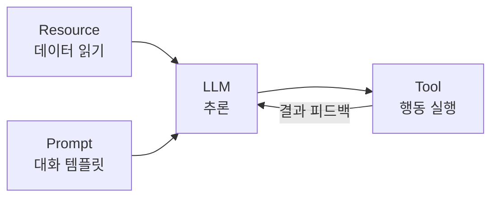
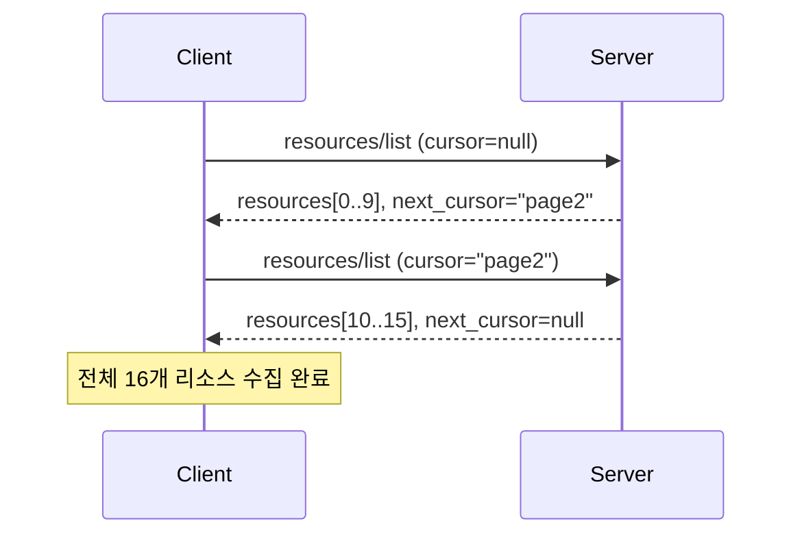
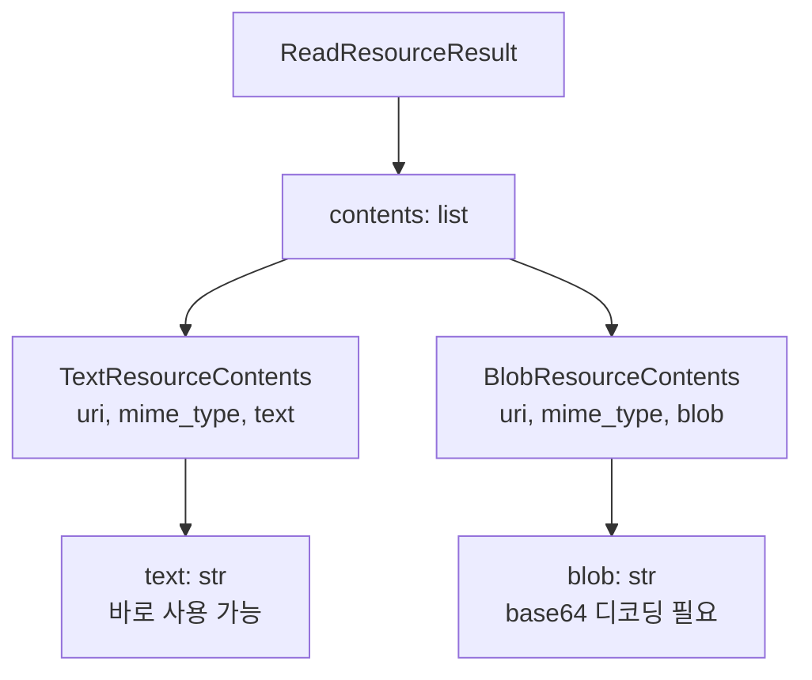
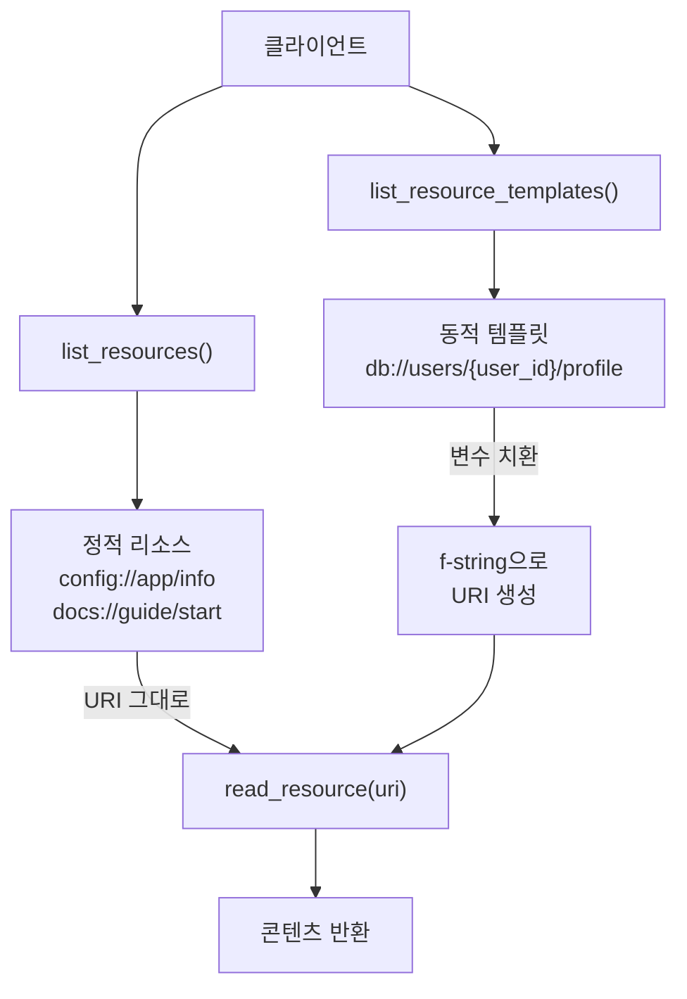
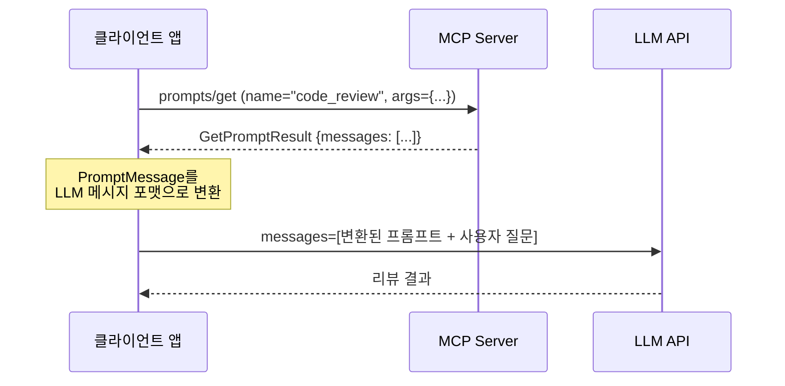
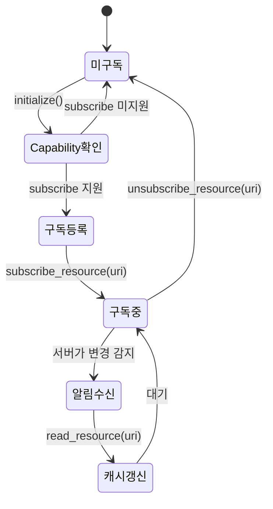
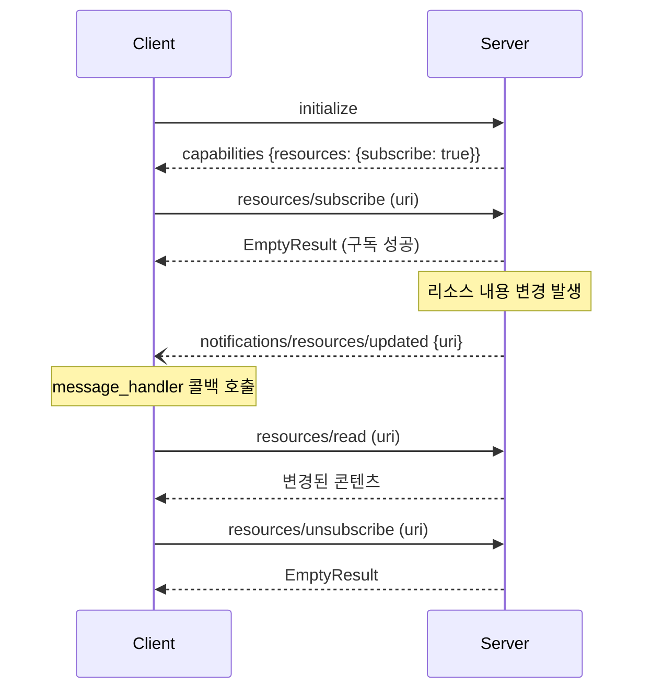
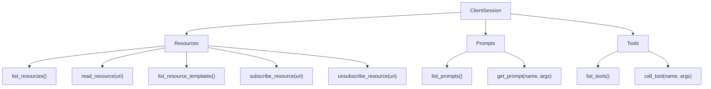

# 리소스 읽기와 프롬프트 활용

> MCP 클라이언트에서 서버의 데이터를 읽고, 재사용 가능한 프롬프트를 LLM 대화에 주입하는 방법을 배웁니다.

## 개요

이 섹션에서는 MCP의 나머지 두 프리미티브인 **Resources**와 **Prompts**를 클라이언트 관점에서 다룹니다. 앞서 [도구 조회와 호출](09-ch9-mcp-클라이언트-개발/02-02-도구-조회와-호출.md)에서 `call_tool()`로 서버의 **행동**을 실행했다면, 이번에는 서버의 **데이터**를 읽고 **대화 템플릿**을 가져오는 방법을 학습합니다.

**선수 지식**: [ClientSession과 서버 연결](09-ch9-mcp-클라이언트-개발/01-01-clientsession과-서버-연결.md)의 연결 패턴, [도구 조회와 호출](09-ch9-mcp-클라이언트-개발/02-02-도구-조회와-호출.md)의 ContentBlock 파싱 경험

**학습 목표**:
- `list_resources()` / `read_resource()`로 서버 데이터를 조회하고 읽을 수 있다
- 리소스 템플릿(URI Template)을 활용하여 동적 리소스에 접근할 수 있다
- `list_prompts()` / `get_prompt()`로 프롬프트를 가져와 LLM 대화에 삽입할 수 있다
- 리소스 구독과 변경 알림을 처리할 수 있다

## 왜 알아야 할까?

도구(Tool)만으로는 LLM 애플리케이션을 완성할 수 없습니다. LLM이 좋은 답변을 하려면 **맥락(Context)**이 필요하고, 그 맥락은 대부분 **데이터**에서 옵니다. MCP의 Resources는 서버가 보유한 데이터를 표준화된 방식으로 클라이언트에게 노출하고, Prompts는 검증된 대화 템플릿을 재사용할 수 있게 합니다.

예를 들어 코드 리뷰 에이전트를 만든다고 가정해 보겠습니다:
- **Resource**로 Git 리포지토리의 파일 내용을 읽고
- **Prompt**로 "코드 리뷰" 템플릿을 가져와 LLM에게 전달하고
- **Tool**로 리뷰 코멘트를 PR에 작성합니다

세 프리미티브가 각자의 역할을 맡아 **읽기 → 사고 → 행동**의 완전한 루프를 구성하는 거죠.

> 📊 **그림 1**: MCP 프리미티브별 역할 — 데이터 읽기, 대화 구성, 행동 실행



## 핵심 개념

### 개념 1: list_resources()로 서버 데이터 카탈로그 조회

> 💡 **비유**: 도서관에 들어서면 가장 먼저 하는 일이 뭔가요? 서가 목록을 확인하는 거죠. `list_resources()`는 MCP 서버라는 도서관의 서가 목록을 보여주는 API입니다. "여기에 어떤 데이터가 있어?"라고 묻는 셈이에요.

`list_resources()`는 서버가 노출하는 모든 정적 리소스의 목록을 반환합니다. 각 리소스는 URI로 식별되며, 이름·설명·MIME 타입 등의 메타데이터를 포함합니다.

```python
# 리소스 목록 조회
result = await session.list_resources()

for resource in result.resources:
    print(f"이름: {resource.name}")
    print(f"URI:  {resource.uri}")
    print(f"설명: {resource.description}")
    print(f"MIME: {resource.mime_type}")
    print()
```

반환되는 `Resource` 객체의 주요 필드를 살펴보면:

| 필드 | 타입 | 설명 |
|------|------|------|
| `uri` | `str` | 리소스 식별자 (예: `file:///config.json`) |
| `name` | `str` | 사람이 읽을 수 있는 이름 |
| `description` | `str \| None` | 리소스 설명 |
| `mime_type` | `str \| None` | MIME 타입 (예: `text/plain`) |
| `annotations` | `Annotations \| None` | 대상 청중, 우선순위 메타데이터 |

리소스 목록이 많을 때는 **페이지네이션**을 사용합니다. 이 패턴은 [도구 조회와 호출](09-ch9-mcp-클라이언트-개발/02-02-도구-조회와-호출.md)의 `list_tools()`와 동일합니다:

```python
from mcp import types

# 페이지네이션으로 전체 리소스 수집
all_resources: list[types.Resource] = []
cursor = None

while True:
    params = types.PaginatedRequestParams(cursor=cursor) if cursor else None
    result = await session.list_resources(params=params)
    all_resources.extend(result.resources)

    if not result.next_cursor:
        break
    cursor = result.next_cursor

print(f"총 {len(all_resources)}개 리소스 발견")
```

> 📊 **그림 2**: 리소스 목록 조회와 페이지네이션 흐름



### 개념 2: read_resource()로 실제 데이터 읽기

> 💡 **비유**: 서가 목록에서 원하는 책을 찾았으면 이제 꺼내서 읽어야 합니다. `read_resource()`는 특정 URI의 리소스를 실제로 꺼내 읽는 API입니다.

`read_resource()`는 URI 문자열 하나를 받아 리소스의 실제 콘텐츠를 반환합니다. 콘텐츠는 **텍스트**(TextResourceContents) 또는 **바이너리**(BlobResourceContents) 두 가지 형태입니다:

```python
import base64
from mcp import types

# 텍스트 리소스 읽기
result = await session.read_resource("config://app/settings")

for content in result.contents:
    if isinstance(content, types.TextResourceContents):
        print(f"[텍스트] URI: {content.uri}")
        print(f"MIME: {content.mime_type}")
        print(content.text)

    elif isinstance(content, types.BlobResourceContents):
        # 바이너리 리소스 — base64 디코딩 필요
        raw_bytes = base64.b64decode(content.blob)
        print(f"[바이너리] URI: {content.uri}")
        print(f"크기: {len(raw_bytes)} bytes")
```

왜 `contents`가 리스트일까요? 하나의 URI가 여러 콘텐츠 조각을 반환할 수 있기 때문입니다. 예를 들어 데이터베이스 테이블 리소스가 스키마 정보와 샘플 데이터를 함께 반환하는 경우가 있습니다. 하지만 대부분의 경우 `contents[0]`만 사용하게 됩니다.

> 📊 **그림 3**: read_resource 반환 타입 구조



### 개념 3: 리소스 템플릿 — 동적 리소스 접근

> 💡 **비유**: 도서관의 서가 목록이 모든 책을 일일이 나열하지 않듯이, MCP 서버도 가능한 모든 리소스를 미리 등록하지 않습니다. "users/{user_id}/profile" 같은 **패턴**을 제공하면, 클라이언트가 실제 값을 넣어서 리소스를 요청하는 방식이죠. 마치 URL의 쿼리 파라미터처럼요.

`list_resource_templates()`는 RFC 6570 URI 템플릿 형태로 정의된 동적 리소스 패턴을 반환합니다. [정적 리소스와 동적 리소스](05-ch5-resources-데이터-노출-프리미티브/02-02-정적-리소스와-동적-리소스.md)에서 서버 측 정의를 배웠다면, 이제 클라이언트에서 이를 활용하는 방법입니다:

```python
# 리소스 템플릿 조회
templates_result = await session.list_resource_templates()

for template in templates_result.resource_templates:
    print(f"이름: {template.name}")
    print(f"패턴: {template.uri_template}")
    print(f"설명: {template.description}")
    print()

# 출력 예시:
# 이름: user_profile
# 패턴: db://users/{user_id}/profile
# 설명: 특정 사용자의 프로필 정보
```

템플릿의 변수를 실제 값으로 치환한 후 `read_resource()`에 전달합니다:

```python
# URI 템플릿에서 변수 치환 후 읽기
user_id = "42"
uri = f"db://users/{user_id}/profile"  # 템플릿 변수 치환
result = await session.read_resource(uri)

for content in result.contents:
    if isinstance(content, types.TextResourceContents):
        print(content.text)
```

> 📊 **그림 4**: 정적 리소스 vs 동적 리소스 템플릿의 접근 방식 비교



> ⚠️ **흔한 오해**: "리소스 템플릿 변수를 SDK가 자동으로 치환해 준다"고 생각하기 쉽지만, 실제로는 클라이언트가 직접 URI 문자열을 만들어야 합니다. Python의 f-string이나 `urllib.parse`로 직접 치환하세요.

### 개념 4: list_prompts()와 get_prompt() — 대화 템플릿 가져오기

> 💡 **비유**: 맛집의 추천 메뉴판을 떠올려 보세요. "이 재료로 이런 요리를 만들어 드릴게요"라는 검증된 조합이 적혀 있죠. MCP의 Prompts도 마찬가지입니다. 서버가 "이 인자를 주면 이렇게 LLM에게 말해라"는 검증된 대화 템플릿을 제공하는 거예요. LLM의 성능은 프롬프트 품질에 크게 좌우되니까, 서버 개발자가 최적화한 프롬프트를 가져다 쓸 수 있다는 건 엄청난 이점입니다.

먼저 서버가 제공하는 프롬프트 목록을 조회합니다:

```python
# 프롬프트 목록 조회
result = await session.list_prompts()

for prompt in result.prompts:
    print(f"이름: {prompt.name}")
    print(f"설명: {prompt.description}")
    if prompt.arguments:
        for arg in prompt.arguments:
            required = "필수" if arg.required else "선택"
            print(f"  인자: {arg.name} ({required}) - {arg.description}")
    print()
```

```run:python
# 프롬프트 목록 출력 예시 (시뮬레이션)
prompts = [
    {"name": "code_review", "desc": "코드 리뷰 요청",
     "args": [("code", True, "리뷰할 코드"), ("language", False, "프로그래밍 언어")]},
    {"name": "summarize", "desc": "문서 요약",
     "args": [("content", True, "요약할 내용"), ("max_length", False, "최대 길이")]},
]
for p in prompts:
    print(f"[{p['name']}] {p['desc']}")
    for name, req, desc in p["args"]:
        tag = "필수" if req else "선택"
        print(f"  - {name} ({tag}): {desc}")
```

```output
[code_review] 코드 리뷰 요청
  - code (필수): 리뷰할 코드
  - language (선택): 프로그래밍 언어
[summarize] 문서 요약
  - content (필수): 요약할 내용
  - max_length (선택): 최대 길이
```

원하는 프롬프트를 찾았으면 `get_prompt()`로 실제 메시지를 가져옵니다:

```python
# 프롬프트 가져오기 — 인자를 딕셔너리로 전달
result = await session.get_prompt(
    name="code_review",
    arguments={
        "code": "def add(a, b):\n    return a + b",
        "language": "python"
    }
)

print(f"설명: {result.description}")
print(f"메시지 수: {len(result.messages)}")

for msg in result.messages:
    print(f"\n[{msg.role}]")
    if isinstance(msg.content, types.TextContent):
        print(msg.content.text)
```

> 📊 **그림 5**: get_prompt() 호출과 LLM 대화 삽입 흐름



핵심은 반환된 `PromptMessage` 목록을 LLM API가 이해하는 형태로 **변환**하는 것입니다:

```python
def prompt_messages_to_llm_format(
    messages: list[types.PromptMessage],
) -> list[dict]:
    """MCP PromptMessage를 Claude API 메시지 포맷으로 변환"""
    llm_messages = []

    for msg in messages:
        content = msg.content

        if isinstance(content, types.TextContent):
            llm_messages.append({
                "role": msg.role,  # "user" 또는 "assistant"
                "content": content.text,
            })

        elif isinstance(content, types.ImageContent):
            llm_messages.append({
                "role": msg.role,
                "content": [{
                    "type": "image",
                    "source": {
                        "type": "base64",
                        "media_type": content.mime_type,
                        "data": content.data,
                    }
                }],
            })

        elif isinstance(content, types.EmbeddedResource):
            resource = content.resource
            if isinstance(resource, types.TextResourceContents):
                llm_messages.append({
                    "role": msg.role,
                    "content": f"[리소스: {resource.uri}]\n{resource.text}",
                })

    return llm_messages
```

이렇게 변환한 메시지를 LLM API 호출 시 대화 시작 부분에 삽입하면 됩니다. 프롬프트가 제공하는 시스템 프롬프트급 지시사항을 LLM이 그대로 따르게 되는 거죠.

### 개념 5: 리소스 구독과 변경 알림

> 💡 **비유**: 좋아하는 유튜버의 채널을 구독하면 새 영상이 올라올 때 알림을 받죠? MCP의 리소스 구독도 같은 원리입니다. "이 리소스가 바뀌면 알려줘"라고 요청하면, 서버가 변경 시점에 알림을 보내줍니다.

리소스 구독은 세 단계로 이루어집니다:

1. **Capability 확인** — 서버가 구독을 지원하는지 먼저 확인
2. **구독 등록** — `subscribe_resource(uri)` 호출
3. **알림 수신** — `message_handler` 콜백에서 변경 알림 처리

> 📊 **그림 6**: 리소스 구독 생명주기 — 등록부터 해제까지



```python
from mcp import types
from mcp.client.session import ClientSession

class MCPClientWithSubscription:
    def __init__(self):
        self.session: ClientSession | None = None
        self.resource_cache: dict[str, str] = {}

    async def handle_notification(self, message):
        """서버에서 오는 알림을 처리하는 콜백"""
        if isinstance(message, types.ResourceUpdatedNotification):
            uri = message.params.uri
            print(f"리소스 변경 감지: {uri}")
            # 변경된 리소스를 다시 읽어서 캐시 갱신
            result = await self.session.read_resource(uri)
            for content in result.contents:
                if isinstance(content, types.TextResourceContents):
                    self.resource_cache[uri] = content.text
                    print(f"캐시 갱신 완료: {uri}")

        elif isinstance(message, types.ResourceListChangedNotification):
            print("리소스 목록이 변경됨 — 목록 새로고침")
            await self.refresh_resource_list()

        elif isinstance(message, types.PromptListChangedNotification):
            print("프롬프트 목록이 변경됨 — 목록 새로고침")
            await self.refresh_prompt_list()

    async def subscribe_if_supported(self, uri: str):
        """서버가 구독을 지원하면 구독 등록"""
        result = await self.session.initialize()

        if (result.capabilities.resources
                and result.capabilities.resources.subscribe):
            await self.session.subscribe_resource(uri)
            print(f"구독 등록: {uri}")
        else:
            print("이 서버는 리소스 구독을 지원하지 않습니다")
```

> 📊 **그림 7**: 리소스 구독과 변경 알림 시퀀스



`message_handler`는 `ClientSession` 생성 시 주입합니다:

```python
from mcp.client.stdio import stdio_client, StdioServerParameters

async def connect_with_subscription(self):
    server_params = StdioServerParameters(
        command="python",
        args=["-m", "my_mcp_server"],
    )

    async with stdio_client(server_params) as (read, write):
        async with ClientSession(
            read, write,
            message_handler=self.handle_notification,  # 알림 콜백 주입
        ) as session:
            self.session = session
            await session.initialize()
            # ... 작업 수행
```

### 개념 6: 클라이언트 API 전체 맵 — 한눈에 보기

지금까지 배운 리소스·프롬프트 관련 `ClientSession` 메서드를 정리해 보겠습니다. [도구 조회와 호출](09-ch9-mcp-클라이언트-개발/02-02-도구-조회와-호출.md)에서 배운 도구 API까지 포함하면, MCP 클라이언트의 핵심 API 전체 그림이 완성됩니다.

> 📊 **그림 8**: ClientSession의 프리미티브별 메서드 전체 맵



| 카테고리 | 메서드 | 역할 | 반환 타입 |
|----------|--------|------|-----------|
| Resources | `list_resources()` | 정적 리소스 목록 조회 | `ListResourcesResult` |
| Resources | `read_resource(uri)` | URI로 리소스 콘텐츠 읽기 | `ReadResourceResult` |
| Resources | `list_resource_templates()` | 동적 URI 템플릿 조회 | `ListResourceTemplatesResult` |
| Resources | `subscribe_resource(uri)` | 변경 알림 구독 | `EmptyResult` |
| Resources | `unsubscribe_resource(uri)` | 구독 해제 | `EmptyResult` |
| Prompts | `list_prompts()` | 프롬프트 목록 조회 | `ListPromptsResult` |
| Prompts | `get_prompt(name, args)` | 프롬프트 메시지 가져오기 | `GetPromptResult` |
| Tools | `list_tools()` | 도구 목록 조회 | `ListToolsResult` |
| Tools | `call_tool(name, args)` | 도구 실행 | `CallToolResult` |

## 실습: 직접 해보기

리소스와 프롬프트를 모두 활용하는 완전한 클라이언트를 구현해 봅시다. 먼저 테스트용 MCP 서버를 만들고, 그 서버에 연결하는 클라이언트를 작성합니다.

**Step 1: 테스트용 MCP 서버** (`demo_server.py`)

```python
"""리소스와 프롬프트를 제공하는 데모 MCP 서버"""
from mcp.server.fastmcp import FastMCP

mcp = FastMCP("demo-resources")

# ── 정적 리소스 ──
@mcp.resource("config://app/info")
def get_app_info() -> str:
    """애플리케이션 기본 정보"""
    return '{"name": "MyApp", "version": "2.1.0", "env": "production"}'

@mcp.resource("docs://guide/quickstart")
def get_quickstart_guide() -> str:
    """빠른 시작 가이드"""
    return """# 빠른 시작 가이드
1. 설치: pip install myapp
2. 초기화: myapp init
3. 실행: myapp run"""

# ── 동적 리소스 (URI 템플릿) ──
@mcp.resource("db://users/{user_id}/profile")
def get_user_profile(user_id: str) -> str:
    """특정 사용자의 프로필 정보"""
    profiles = {
        "1": '{"name": "김철수", "role": "admin"}',
        "2": '{"name": "이영희", "role": "developer"}',
    }
    return profiles.get(user_id, '{"error": "사용자를 찾을 수 없습니다"}')

# ── 프롬프트 ──
@mcp.prompt()
def code_review(code: str, language: str = "python") -> str:
    """코드 리뷰를 위한 프롬프트 템플릿"""
    return f"""당신은 시니어 {language} 개발자입니다.
아래 코드를 리뷰하고 개선점을 제안하세요.

## 리뷰 기준
- 코드 품질과 가독성
- 잠재적 버그
- 성능 최적화 가능성
- 보안 취약점

## 코드
```{language}
{code}
```"""

@mcp.prompt()
def summarize(content: str, max_length: str = "200") -> str:
    """문서 요약 프롬프트"""
    return f"""다음 내용을 {max_length}자 이내로 요약하세요.
핵심 포인트를 불릿 포인트로 정리하세요.

## 원문
{content}"""

if __name__ == "__main__":
    mcp.run()
```

**Step 2: 리소스 & 프롬프트 클라이언트** (`resource_prompt_client.py`)

```python
"""리소스 읽기와 프롬프트 활용 클라이언트"""
import asyncio
import json

from mcp import types
from mcp.client.session import ClientSession
from mcp.client.stdio import stdio_client, StdioServerParameters


async def explore_resources(session: ClientSession):
    """서버의 리소스를 탐색하고 읽기"""
    print("=" * 50)
    print("📚 리소스 탐색")
    print("=" * 50)

    # 1. 정적 리소스 목록 조회
    result = await session.list_resources()
    print(f"\n정적 리소스 {len(result.resources)}개:")
    for r in result.resources:
        print(f"  • {r.name} → {r.uri}")
        if r.description:
            print(f"    {r.description}")

    # 2. 리소스 템플릿 조회
    templates = await session.list_resource_templates()
    print(f"\n리소스 템플릿 {len(templates.resource_templates)}개:")
    for t in templates.resource_templates:
        print(f"  • {t.name} → {t.uri_template}")

    # 3. 정적 리소스 읽기
    print("\n--- 앱 정보 리소스 읽기 ---")
    read_result = await session.read_resource("config://app/info")
    for content in read_result.contents:
        if isinstance(content, types.TextResourceContents):
            data = json.loads(content.text)
            print(f"  앱 이름: {data['name']}")
            print(f"  버전: {data['version']}")

    # 4. 동적 리소스 읽기 (URI 템플릿 활용)
    print("\n--- 사용자 프로필 읽기 ---")
    for user_id in ["1", "2"]:
        read_result = await session.read_resource(
            f"db://users/{user_id}/profile"
        )
        for content in read_result.contents:
            if isinstance(content, types.TextResourceContents):
                profile = json.loads(content.text)
                print(f"  사용자 {user_id}: {profile}")


async def explore_prompts(session: ClientSession):
    """서버의 프롬프트를 탐색하고 사용"""
    print("\n" + "=" * 50)
    print("💬 프롬프트 탐색")
    print("=" * 50)

    # 1. 프롬프트 목록 조회
    result = await session.list_prompts()
    print(f"\n사용 가능한 프롬프트 {len(result.prompts)}개:")
    for p in result.prompts:
        print(f"  • {p.name}: {p.description}")
        if p.arguments:
            for arg in p.arguments:
                req = "필수" if arg.required else "선택"
                print(f"    - {arg.name} ({req})")

    # 2. 프롬프트 가져오기
    print("\n--- code_review 프롬프트 가져오기 ---")
    prompt_result = await session.get_prompt(
        name="code_review",
        arguments={
            "code": "def fibonacci(n):\n    if n <= 1: return n\n    return fibonacci(n-1) + fibonacci(n-2)",
            "language": "python",
        },
    )

    # 3. LLM API 포맷으로 변환
    llm_messages = []
    for msg in prompt_result.messages:
        if isinstance(msg.content, types.TextContent):
            llm_messages.append({
                "role": msg.role,
                "content": msg.content.text,
            })
            # 프롬프트 미리보기 (처음 100자)
            preview = msg.content.text[:100]
            print(f"  [{msg.role}] {preview}...")

    print(f"\n  → LLM에 전달할 메시지 {len(llm_messages)}개 생성 완료")
    return llm_messages


async def main():
    server_params = StdioServerParameters(
        command="python",
        args=["demo_server.py"],
    )

    async with stdio_client(server_params) as (read, write):
        async with ClientSession(read, write) as session:
            # 초기화
            init_result = await session.initialize()
            print(f"서버: {init_result.server_info.name}")

            caps = init_result.capabilities
            print(f"리소스 지원: {caps.resources is not None}")
            print(f"프롬프트 지원: {caps.prompts is not None}")

            # 리소스 탐색
            await explore_resources(session)

            # 프롬프트 탐색
            llm_messages = await explore_prompts(session)

            # llm_messages를 Claude API에 전달하여 응답 받기
            # (실제 LLM 호출은 다음 세션 9.4에서 다룹니다)
            print("\n✅ 리소스 읽기 + 프롬프트 활용 완료!")


if __name__ == "__main__":
    asyncio.run(main())
```

```run:python
# 실행 결과 시뮬레이션
print("서버: demo-resources")
print("리소스 지원: True")
print("프롬프트 지원: True")
print("=" * 50)
print("📚 리소스 탐색")
print("=" * 50)
print("\n정적 리소스 2개:")
print("  • app_info → config://app/info")
print("  • quickstart_guide → docs://guide/quickstart")
print("\n리소스 템플릿 1개:")
print("  • user_profile → db://users/{user_id}/profile")
print("\n--- 사용자 프로필 읽기 ---")
print('  사용자 1: {"name": "김철수", "role": "admin"}')
print('  사용자 2: {"name": "이영희", "role": "developer"}')
print("\n💬 프롬프트 탐색: code_review, summarize 사용 가능")
print("  → LLM에 전달할 메시지 1개 생성 완료")
print("\n✅ 리소스 읽기 + 프롬프트 활용 완료!")
```

```output
서버: demo-resources
리소스 지원: True
프롬프트 지원: True
==================================================
📚 리소스 탐색
==================================================

정적 리소스 2개:
  • app_info → config://app/info
  • quickstart_guide → docs://guide/quickstart

리소스 템플릿 1개:
  • user_profile → db://users/{user_id}/profile

--- 사용자 프로필 읽기 ---
  사용자 1: {"name": "김철수", "role": "admin"}
  사용자 2: {"name": "이영희", "role": "developer"}

💬 프롬프트 탐색: code_review, summarize 사용 가능
  → LLM에 전달할 메시지 1개 생성 완료

✅ 리소스 읽기 + 프롬프트 활용 완료!
```

## 더 깊이 알아보기

### Resources의 탄생 배경 — "데이터는 도구와 다르다"

MCP 초기 설계 단계에서 Anthropic 팀은 흥미로운 논쟁에 빠졌습니다. "데이터 읽기도 도구(Tool)로 하면 되지 않나?" 실제로 `read_file` 도구를 만들면 파일을 읽을 수 있으니까요.

하지만 두 가지 근본적인 차이가 있었습니다. 첫째, **제어 주체**가 다릅니다. Tool은 LLM이 언제 호출할지 결정하는 **Model-controlled**인 반면, Resource는 애플리케이션(호스트)이 어떤 데이터를 LLM 컨텍스트에 넣을지 결정하는 **Application-controlled**입니다. 둘째, **부작용(side effect)**이 다릅니다. Tool은 이메일 발송이나 DB 쓰기 같은 부작용이 있을 수 있지만, Resource는 순수한 읽기 전용입니다.

이 구분 덕분에 호스트 앱은 "사용자가 이 파일을 열었으니 LLM 컨텍스트에 넣자"는 판단을 LLM에게 맡기지 않고 직접 할 수 있게 되었고, 보안과 예측 가능성이 크게 높아졌습니다.

### Prompts — 서버 개발자의 지혜를 재사용

Prompts 프리미티브의 탄생도 흥미롭습니다. MCP 사양의 SEP(Specification Enhancement Proposal) 논의에서 "각 도구의 최적 사용법을 서버 개발자가 가장 잘 안다"는 인사이트가 있었습니다. 예를 들어 SQL 서버 개발자는 "이 도구에는 이런 식으로 쿼리를 요청해야 좋은 결과가 나온다"는 노하우가 있는데, 이를 프롬프트 템플릿으로 패키징할 수 있게 한 것이죠. Prompt는 **User-controlled** — 즉, 사용자가 명시적으로 선택해야 활성화되는 프리미티브입니다. 이는 Tool(Model-controlled)이나 Resource(Application-controlled)와 또 다른 제어 모델입니다.

### Annotations — 리소스의 용도를 힌트로 전달

MCP 사양은 `Annotations` 메타데이터를 정의하여 리소스나 콘텐츠의 **용도**를 힌트로 제공합니다:

```python
class Annotations(MCPModel):
    audience: list[Role] | None = None   # ["user"], ["assistant"], 또는 둘 다
    priority: float | None = None        # 0.0(선택적) ~ 1.0(필수)
```

`audience`가 `["assistant"]`이면 LLM 컨텍스트에 주입하기 적합한 데이터이고, `["user"]`이면 사용자에게 직접 보여줄 데이터입니다. `priority`는 컨텍스트 윈도우가 부족할 때 어떤 리소스를 우선 포함할지 결정하는 데 사용됩니다.

## 흔한 오해와 팁

> ⚠️ **흔한 오해**: "Resource로 뭐든 읽을 수 있다" — Resource는 서버가 **미리 정의한** URI 패턴만 읽을 수 있습니다. 임의 경로에 접근하는 건 서버가 허용한 범위 내에서만 가능합니다. 보안을 위해 서버는 허용 목록(allowlist) 방식으로 리소스를 노출합니다.

> 💡 **알고 계셨나요?**: MCP의 세 프리미티브는 의도적으로 **제어 주체가 다릅니다**. Tool은 Model-controlled(LLM이 결정), Resource는 Application-controlled(호스트가 결정), Prompt는 User-controlled(사용자가 결정). 이 삼중 제어 모델이 MCP의 보안 철학의 핵심입니다.

> 🔥 **실무 팁**: `get_prompt()`로 가져온 메시지를 LLM에 전달할 때, 프롬프트 메시지를 대화의 **맨 앞**에 배치하세요. 시스템 프롬프트 바로 다음에 오는 것이 가장 효과적입니다. 그리고 `EmbeddedResource` 타입이 섞여 있으면 텍스트로 풀어서 넣어야 합니다 — 대부분의 LLM API는 이 타입을 직접 처리하지 못합니다.

> 🔥 **실무 팁**: 리소스 구독은 **장시간 연결 시나리오**에서 특히 유용합니다. 설정 파일이 바뀌면 자동으로 리프레시하고, 데이터 소스가 업데이트되면 LLM 컨텍스트를 갱신하는 반응형 클라이언트를 만들 수 있습니다. 단, 서버가 `subscribe` capability를 지원하는지 반드시 먼저 확인하세요.

## 핵심 정리

| 개념 | 설명 |
|------|------|
| `list_resources()` | 서버가 노출하는 정적 리소스 목록 조회. 페이지네이션 지원 |
| `read_resource(uri)` | 특정 URI의 리소스를 읽어 `TextResourceContents` 또는 `BlobResourceContents` 반환 |
| `list_resource_templates()` | RFC 6570 URI 템플릿으로 정의된 동적 리소스 패턴 조회 |
| `list_prompts()` | 서버가 제공하는 재사용 가능 프롬프트 목록 조회 |
| `get_prompt(name, arguments)` | 인자를 전달하여 `PromptMessage` 목록 반환 → LLM 대화에 삽입 |
| `subscribe_resource(uri)` | 리소스 변경 알림 구독 (서버 capability 확인 필수) |
| `unsubscribe_resource(uri)` | 구독 해제. `subscribe`와 쌍으로 사용 |
| `message_handler` | `ClientSession`에 주입하는 콜백. 서버 알림(변경, 목록 갱신)을 수신 |
| `Annotations` | `audience`(대상)와 `priority`(우선순위)로 리소스 용도를 힌트로 전달 |
| 제어 모델 | Resource=Application-controlled, Prompt=User-controlled, Tool=Model-controlled |

## 다음 섹션 미리보기

리소스, 프롬프트, 도구 — MCP의 세 프리미티브를 클라이언트에서 모두 다룰 수 있게 되었습니다. 다음 [LLM 통합 에이전트 루프](09-ch9-mcp-클라이언트-개발/04-04-llm-통합-에이전트-루프.md)에서는 이 모든 것을 하나로 엮습니다. Claude API와 MCP 클라이언트를 통합하여, LLM이 스스로 도구를 선택하고 호출하는 **자동 에이전트 루프**를 구현합니다. 리소스로 컨텍스트를 채우고, 프롬프트로 대화를 구성하고, 도구로 행동하는 완전한 에이전트가 탄생하는 거죠.

## 참고 자료

- [MCP Specification — Resources](https://modelcontextprotocol.io/specification/2025-11-25/server/resources) - 리소스 프리미티브의 공식 사양. URI 템플릿, 구독, 알림의 정확한 프로토콜 정의
- [MCP Specification — Prompts](https://modelcontextprotocol.io/specification/2025-11-25/server/prompts) - 프롬프트 프리미티브의 공식 사양. 인자 처리와 메시지 구조의 정의
- [MCP Python SDK — GitHub](https://github.com/modelcontextprotocol/python-sdk) - `ClientSession`의 소스 코드. `list_resources`, `read_resource`, `get_prompt` 등의 실제 구현
- [Build a Python MCP Client — Real Python](https://realpython.com/python-mcp-client/) - Python MCP 클라이언트 구축 실습 튜토리얼. 리소스·프롬프트 활용 예제 포함
- [MCP Client Development Guide — cyanheads](https://github.com/cyanheads/model-context-protocol-resources/blob/main/guides/mcp-client-development-guide.md) - 클라이언트 개발의 전체 흐름을 다루는 커뮤니티 가이드

---
### 🔗 Related Sessions
- [textcontent](04-ch4-tools-함수-호출-프리미티브/04-04-도구-실행-결과와-에러-처리.md) (prerequisite)
- [imagecontent](04-ch4-tools-함수-호출-프리미티브/04-04-도구-실행-결과와-에러-처리.md) (prerequisite)
- [embeddedresource](04-ch4-tools-함수-호출-프리미티브/04-04-도구-실행-결과와-에러-처리.md) (prerequisite)
