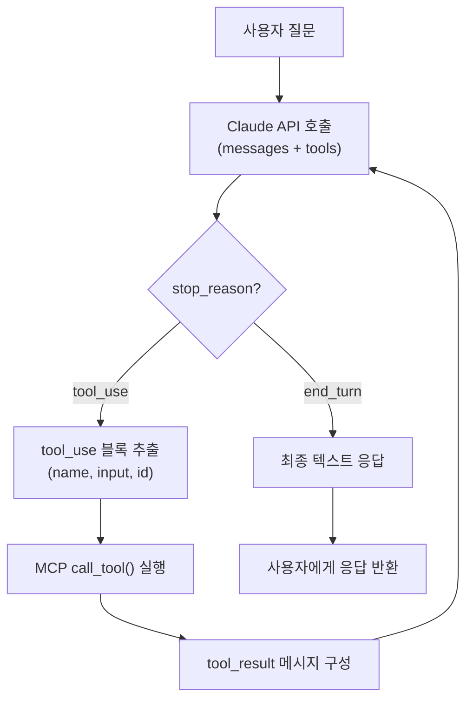
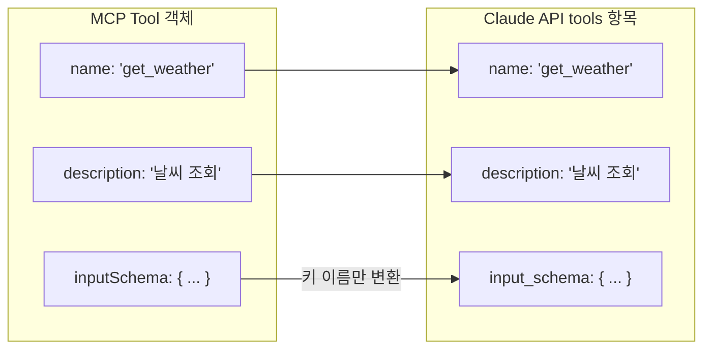
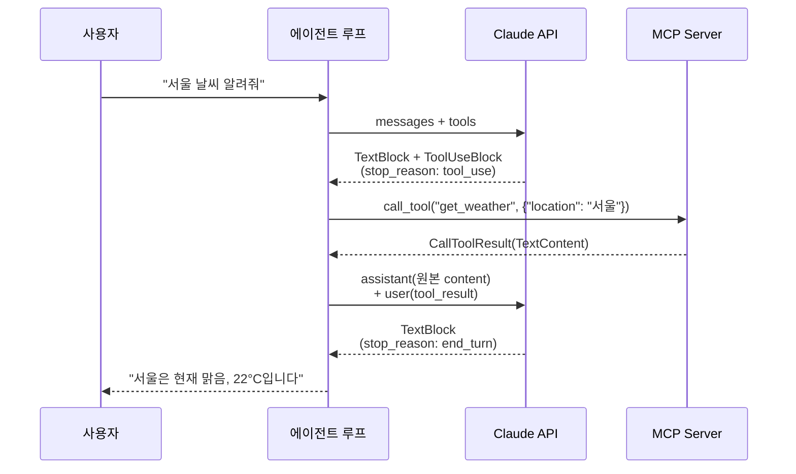
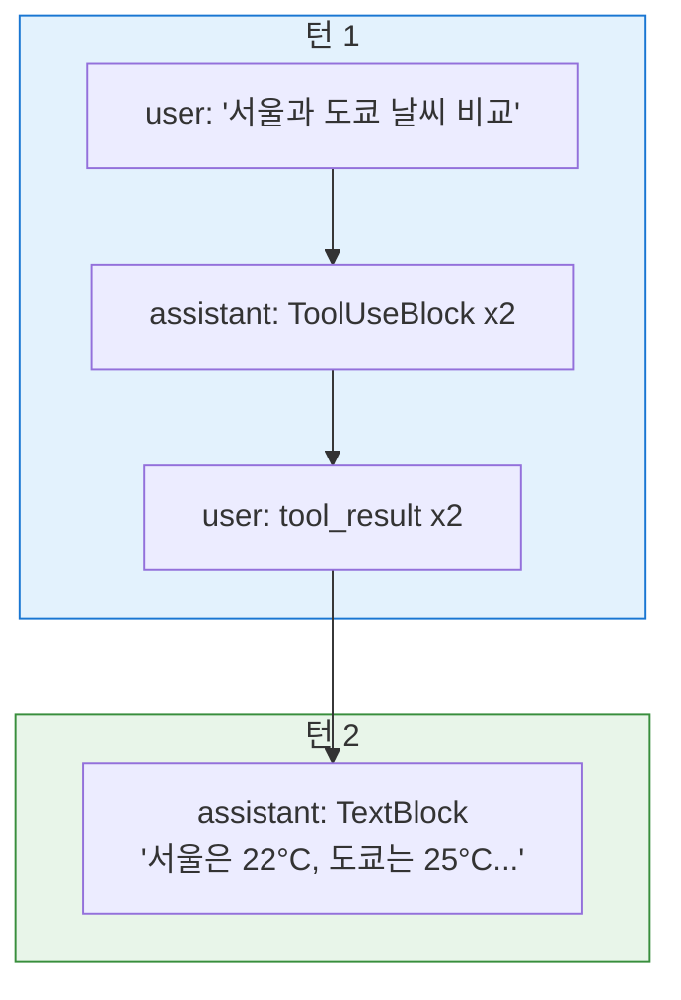
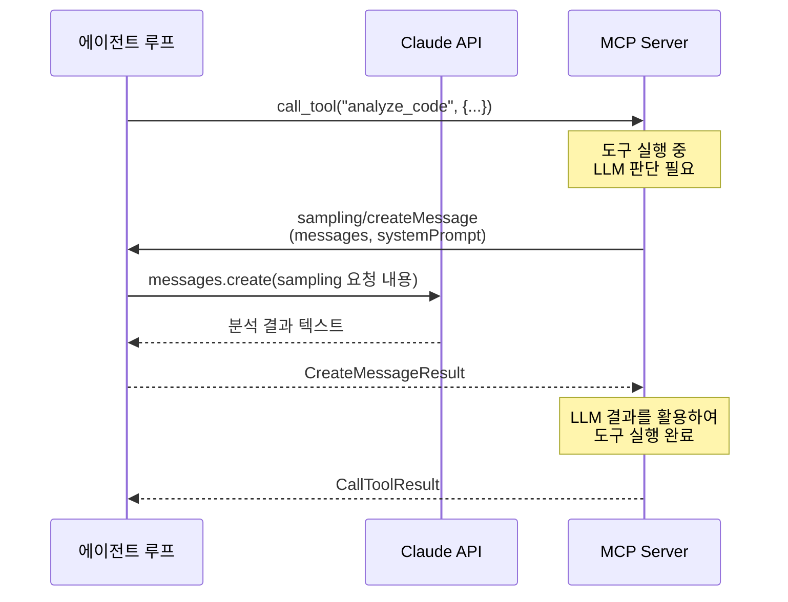
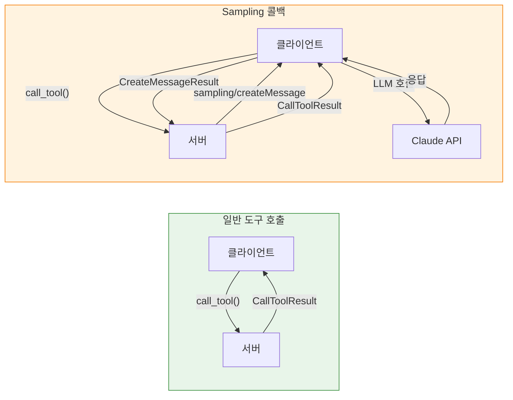
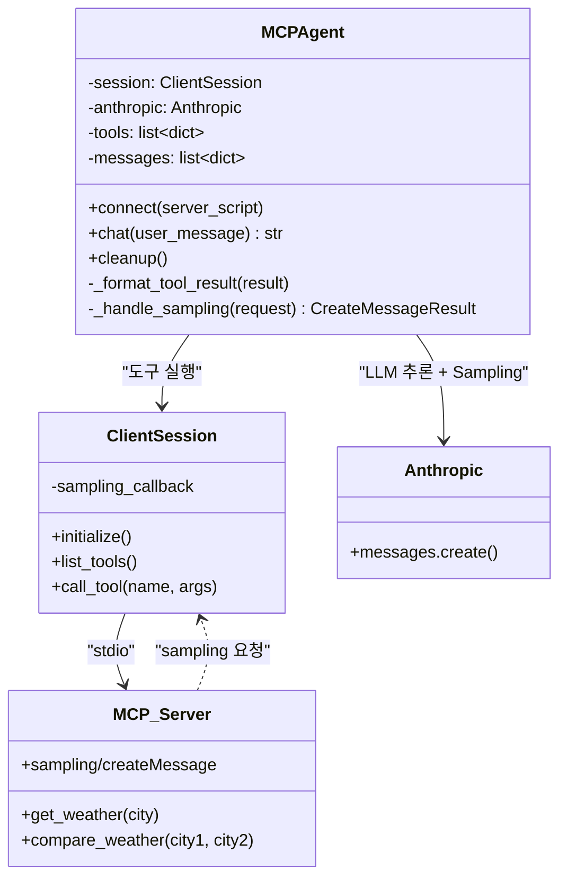

# LLM 통합 에이전트 루프

> Claude API와 MCP 클라이언트를 연결하여, LLM이 스스로 도구를 선택하고 실행하는 자율 에이전트를 구현합니다.

## 개요

이 섹션에서는 MCP 클라이언트와 Anthropic Claude API를 통합하여 **자동 도구 선택 에이전트 루프**를 구현합니다. 앞서 배운 `list_tools()`, `call_tool()`, `read_resource()`, `get_prompt()`를 Claude의 tool_use 기능과 연결하면, 사용자의 자연어 질문에 LLM이 스스로 필요한 도구를 골라 실행하고 결과를 종합하는 완전한 에이전트가 탄생합니다.

나아가 서버가 `sampling/createMessage`를 요청하는 경우 — 즉 서버 측에서 LLM 추론이 필요할 때 — 클라이언트가 이를 어떻게 수신하고 처리하는지도 함께 다룹니다.

**선수 지식**:
- [ClientSession과 서버 연결](09-ch9-mcp-클라이언트-개발/01-01-clientsession과-서버-연결.md)의 연결 패턴
- [도구 조회와 호출](09-ch9-mcp-클라이언트-개발/02-02-도구-조회와-호출.md)의 `list_tools()`, `call_tool()`, `inputSchema` 변환
- [리소스 읽기와 프롬프트 활용](09-ch9-mcp-클라이언트-개발/03-03-리소스-읽기와-프롬프트-활용.md)의 리소스/프롬프트 API
- [Sampling: 서버가 LLM을 빌려 쓰는 법](06-ch6-고급-서버-기능/03-03-sampling-서버가-llm을-빌려-쓰는-법.md)의 Sampling 개념

**학습 목표**:
- MCP 도구 스키마를 Claude API `tools` 파라미터 형식으로 변환할 수 있다
- Claude의 `tool_use` 응답을 파싱하여 MCP `call_tool()`로 실행하는 루프를 구현할 수 있다
- 멀티턴 대화에서 여러 도구를 연쇄 호출하는 에이전트를 완성할 수 있다
- `stop_reason` 기반 루프 제어와 에러 복구 패턴을 적용할 수 있다
- 서버의 Sampling 요청(`sampling/createMessage`)을 클라이언트에서 콜백으로 처리할 수 있다

## 왜 알아야 할까?

MCP 클라이언트만으로는 도구를 "수동으로" 호출하는 데 그칩니다. 사용자가 "서울 날씨 알려줘"라고 말하면, 개발자가 어떤 도구를 어떤 인자로 호출할지 직접 결정해야 하죠. 하지만 LLM을 연결하면 이야기가 달라집니다. Claude가 사용자의 의도를 이해하고, 사용 가능한 도구 중에서 적합한 것을 골라, 인자까지 채워서 호출 요청을 보냅니다. 개발자는 이 **"의도 → 도구 선택 → 실행 → 결과 종합"** 루프만 구현하면 됩니다.

여기에 한 가지 더 — MCP에서는 **서버도 LLM 추론을 요청할 수 있습니다.** [Sampling: 서버가 LLM을 빌려 쓰는 법](06-ch6-고급-서버-기능/03-03-sampling-서버가-llm을-빌려-쓰는-법.md)에서 배운 것처럼, 서버가 `sampling/createMessage`를 보내면 클라이언트가 자신의 LLM을 활용하여 응답을 돌려줘야 합니다. 완전한 에이전트라면 이 양방향 흐름까지 처리할 수 있어야 하죠.

이것이 바로 Claude Desktop, Cursor, Windsurf 같은 AI 애플리케이션의 핵심 동작 원리입니다. 이 에이전트 루프를 직접 구현하면, 어떤 MCP 서버든 연결해서 LLM 기반 자동화 에이전트를 만들 수 있게 됩니다.

## 핵심 개념

### 개념 1: 에이전트 루프의 구조

> 💡 **비유**: 에이전트 루프는 **통역사가 있는 국제 회의**와 같습니다. 참석자(사용자)가 질문하면, 통역사(LLM)가 질문을 이해하고 어떤 전문가(도구)에게 물어봐야 할지 판단합니다. 전문가의 답변을 다시 통역사가 받아 참석자에게 전달하죠. 한 번으로 안 되면 다른 전문가에게도 물어봅니다. 이 과정이 반복되다가, 통역사가 충분한 정보를 모았다고 판단하면 최종 답변을 정리해 줍니다.

에이전트 루프는 다음 네 단계가 반복되는 사이클입니다:

1. **사용자 메시지 전달**: 대화 히스토리와 함께 Claude API에 요청
2. **Claude 응답 분석**: `stop_reason`이 `"tool_use"`인지 `"end_turn"`인지 확인
3. **도구 실행**: `tool_use` 블록에서 도구명과 인자를 추출하여 MCP `call_tool()` 실행
4. **결과 반환**: 도구 실행 결과를 `tool_result`로 Claude에게 다시 전달

`stop_reason`이 `"end_turn"`이 될 때까지 2~4단계가 반복됩니다.

> 📊 **그림 1**: 에이전트 루프의 전체 흐름



### 개념 2: 도구 스키마 변환 — inputSchema에서 input_schema로

> 💡 **비유**: MCP와 Claude API는 같은 물건(도구 정의)을 서로 다른 이름표로 부릅니다. MCP는 JavaScript 관례인 camelCase(`inputSchema`)를, Claude API는 Python 관례인 snake_case(`input_schema`)를 씁니다. 우리가 할 일은 이 **이름표를 바꿔 붙이는 것** — 내용은 그대로이고, 키 이름만 변환하면 됩니다.

MCP `list_tools()`가 반환하는 `Tool` 객체에는 `name`, `description`, `inputSchema` 필드가 있습니다. Claude API의 `tools` 파라미터는 `name`, `description`, `input_schema`를 요구합니다. 변환 코드는 놀랍도록 간단합니다:

```python
async def convert_mcp_tools_to_claude(session: ClientSession) -> list[dict]:
    """MCP 도구 목록을 Claude API tools 형식으로 변환"""
    result = await session.list_tools()

    claude_tools = []
    for tool in result.tools:
        claude_tools.append({
            "name": tool.name,
            "description": tool.description or "",
            "input_schema": tool.inputSchema,  # camelCase → snake_case
        })
    return claude_tools
```

> 📊 **그림 2**: MCP Tool 스키마와 Claude API 포맷 간 매핑



`inputSchema`의 값은 JSON Schema 형식(타입, 프로퍼티, 필수 필드 정의)인데, 이 부분은 MCP와 Claude API가 동일한 포맷을 사용하므로 그대로 전달하면 됩니다. 이전 세션 [도구 조회와 호출](09-ch9-mcp-클라이언트-개발/02-02-도구-조회와-호출.md)에서 다룬 `inputSchema` 구조를 그대로 활용하는 것이죠.

### 개념 3: Claude 응답 파싱과 tool_use 처리

Claude API의 응답 `response.content`는 **리스트**입니다. 하나의 응답에 `TextBlock`과 `ToolUseBlock`이 함께 들어올 수 있습니다. 예를 들어 Claude가 "날씨를 확인해 볼게요"라는 텍스트와 함께 도구 호출을 요청하는 경우죠.

```python
from anthropic.types import TextBlock, ToolUseBlock

# Claude 응답 파싱
for block in response.content:
    if isinstance(block, TextBlock):
        # 텍스트 응답 — 사용자에게 보여줄 내용
        print(block.text)
    elif isinstance(block, ToolUseBlock):
        # 도구 호출 요청
        tool_name = block.name       # "get_weather"
        tool_input = block.input     # {"location": "서울"}
        tool_use_id = block.id       # "toolu_01abc..."
```

도구를 실행한 후, 결과를 Claude에게 돌려보낼 때는 **반드시 원본 `content` 리스트 전체**를 assistant 메시지로 보내야 합니다:

```python
# 1. assistant 메시지: Claude의 원본 응답 전체를 그대로 전달
messages.append({
    "role": "assistant",
    "content": response.content  # TextBlock + ToolUseBlock 모두 포함
})

# 2. tool_result 메시지: 도구 실행 결과
messages.append({
    "role": "user",
    "content": [{
        "type": "tool_result",
        "tool_use_id": tool_use_id,        # ToolUseBlock의 id와 매칭
        "content": "서울: 맑음, 22°C",      # 도구 실행 결과 문자열
    }]
})
```

> ⚠️ **흔한 오해**: `tool_result`의 `role`이 `"user"`인 것에 놀라는 분이 많습니다. Claude API에서 도구 결과는 형식상 사용자 메시지로 전달됩니다. 이는 대화 구조에서 "assistant가 요청 → user 측에서 결과 제공"이라는 턴 기반 패턴을 따르기 때문입니다.

> 📊 **그림 3**: Claude API 메시지 흐름 — tool_use와 tool_result의 턴 구조



### 개념 4: MCP 도구 결과를 tool_result로 변환

MCP의 `call_tool()`은 `CallToolResult`를 반환하고, 그 안의 `content`는 `TextContent`, `ImageContent`, `EmbeddedResource` 등 다양한 타입의 리스트입니다. Claude API의 `tool_result`에 넣으려면 이 콘텐츠를 적절히 변환해야 합니다.

```python
from mcp.types import TextContent, ImageContent, EmbeddedResource

def format_tool_result(call_result) -> str | list[dict]:
    """MCP CallToolResult를 Claude tool_result content로 변환"""
    # 단일 텍스트 결과 — 가장 흔한 경우
    if len(call_result.content) == 1 and isinstance(call_result.content[0], TextContent):
        return call_result.content[0].text

    # 복합 콘텐츠 — Claude의 content 배열 형식으로 변환
    result_content = []
    for block in call_result.content:
        if isinstance(block, TextContent):
            result_content.append({
                "type": "text",
                "text": block.text
            })
        elif isinstance(block, ImageContent):
            result_content.append({
                "type": "image",
                "source": {
                    "type": "base64",
                    "media_type": block.mimeType,
                    "data": block.data,
                }
            })
    return result_content
```

이 변환이 중요한 이유는, MCP 도구가 이미지를 반환할 수도 있기 때문입니다. 예를 들어 차트 생성 도구가 PNG 이미지를 돌려주면, Claude가 이 이미지를 "보고" 분석 결과를 텍스트로 설명할 수 있습니다.

### 개념 5: 멀티턴 에이전트 — 여러 도구 연쇄 호출

실제 에이전트는 한 번의 도구 호출로 끝나지 않는 경우가 많습니다. "서울과 도쿄의 날씨를 비교해줘"라는 요청에 Claude는 `get_weather`를 두 번 호출할 수 있고, "이 데이터를 분석해서 차트로 그려줘"라는 요청에는 데이터 조회 도구 → 차트 생성 도구를 순차적으로 호출할 수 있습니다.

핵심은 **`while` 루프와 `stop_reason` 체크**입니다:

```python
async def agent_loop(session, anthropic_client, tools, messages):
    """stop_reason이 end_turn이 될 때까지 반복"""
    while True:
        response = anthropic_client.messages.create(
            model="claude-sonnet-4-20250514",
            max_tokens=4096,
            tools=tools,
            messages=messages,
        )

        # 종료 조건: Claude가 더 이상 도구를 호출하지 않음
        if response.stop_reason == "end_turn":
            # 최종 텍스트 추출
            return extract_text(response)

        # 도구 호출 처리
        messages.append({"role": "assistant", "content": response.content})

        tool_results = []
        for block in response.content:
            if isinstance(block, ToolUseBlock):
                result = await session.call_tool(block.name, block.input)
                tool_results.append({
                    "type": "tool_result",
                    "tool_use_id": block.id,
                    "content": format_tool_result(result),
                })

        messages.append({"role": "user", "content": tool_results})
```

> 📊 **그림 4**: 멀티턴 도구 호출의 메시지 스택 변화



한 턴에서 Claude가 여러 `ToolUseBlock`을 보낼 수 있다는 점에 주목하세요. 이 경우 **모든 도구를 실행하고, 모든 `tool_result`를 하나의 user 메시지에 묶어서** 보내야 합니다. Claude API는 `tool_use_id`로 각 결과를 매칭합니다.

### 개념 6: 안전 장치 — 무한 루프 방지와 에러 처리

에이전트 루프에서 가장 중요한 안전 장치는 **최대 반복 횟수 제한**입니다. LLM이 도구를 계속 호출하는 무한 루프에 빠지면 API 비용이 급증할 수 있기 때문입니다.

```python
MAX_ITERATIONS = 10  # 최대 도구 호출 라운드

async def safe_agent_loop(session, client, tools, messages):
    iterations = 0

    while iterations < MAX_ITERATIONS:
        response = client.messages.create(
            model="claude-sonnet-4-20250514",
            max_tokens=4096,
            tools=tools,
            messages=messages,
        )

        if response.stop_reason == "end_turn":
            return extract_text(response)

        iterations += 1
        # ... 도구 실행 로직 ...

    # 최대 반복 초과 시 강제 종료
    return "최대 도구 호출 횟수를 초과했습니다. 질문을 더 구체적으로 해주세요."
```

도구 실행 중 에러가 발생한 경우에도, Claude에게 **에러 사실을 알려줘야** 합니다. 그래야 Claude가 다른 접근법을 시도하거나 사용자에게 상황을 설명할 수 있습니다:

```python
try:
    result = await session.call_tool(block.name, block.input)
    content = format_tool_result(result)
    is_error = result.isError  # MCP 도구 실행 에러 여부
except Exception as e:
    content = f"도구 실행 에러: {str(e)}"
    is_error = True

tool_results.append({
    "type": "tool_result",
    "tool_use_id": block.id,
    "content": content,
    "is_error": is_error,  # Claude에게 에러임을 알림
})
```

`is_error: true`를 설정하면 Claude가 이 결과를 에러로 인식하고, 재시도하거나 사용자에게 적절한 안내를 제공합니다.

### 개념 7: Sampling 콜백 — 서버가 LLM을 빌려 쓸 때

> 💡 **비유**: 지금까지의 흐름은 클라이언트(통역사)가 서버(전문가)에게 질문하는 **일방향**이었습니다. 그런데 때로는 전문가가 "잠깐, 이건 저도 AI 도움이 필요해요"라고 역으로 통역사에게 부탁할 수 있습니다. 이것이 바로 **Sampling** — 서버가 클라이언트의 LLM을 빌려 추론을 요청하는 역방향 흐름입니다.

[Sampling: 서버가 LLM을 빌려 쓰는 법](06-ch6-고급-서버-기능/03-03-sampling-서버가-llm을-빌려-쓰는-법.md)에서 서버 측 관점을 배웠다면, 이제 **클라이언트가 이 요청을 어떻게 수신하고 처리하는지** 알아볼 차례입니다.

MCP 서버가 도구 실행 중에 LLM 추론이 필요한 상황이 있습니다. 예를 들어:
- 코드 리뷰 서버가 diff를 분석한 뒤, "이 변경이 보안상 안전한지" LLM에게 판단을 요청
- 데이터 분석 서버가 쿼리 결과를 받은 후, "이 결과를 자연어로 요약해달라"고 요청
- 번역 서버가 번역 품질을 LLM으로 검증하고 싶을 때

이때 서버는 `sampling/createMessage`를 클라이언트에게 보내고, 클라이언트는 자신의 LLM(Claude)을 사용하여 응답을 생성해서 돌려줍니다.

> 📊 **그림 5**: Sampling 콜백의 양방향 흐름



클라이언트에서 Sampling 콜백을 등록하는 방법은 `ClientSession` 생성 시 `sampling_callback` 파라미터를 전달하는 것입니다:

```python
from mcp import ClientSession
from mcp.types import (
    CreateMessageRequest,
    CreateMessageResult,
    SamplingMessage,
    TextContent,
)


async def handle_sampling_request(
    request: CreateMessageRequest,
) -> CreateMessageResult:
    """서버의 sampling/createMessage 요청을 처리하는 콜백"""
    # 1. 서버가 보낸 메시지를 Claude API 형식으로 변환
    messages = []
    for msg in request.messages:
        content_text = ""
        if isinstance(msg.content, TextContent):
            content_text = msg.content.text
        elif isinstance(msg.content, list):
            # 복합 콘텐츠인 경우
            content_text = " ".join(
                c.text for c in msg.content if isinstance(c, TextContent)
            )
        messages.append({"role": msg.role, "content": content_text})

    # 2. Claude API 호출 (서버의 요청을 대신 처리)
    anthropic = Anthropic()
    response = anthropic.messages.create(
        model=request.modelPreferences.hints[0].name
        if request.modelPreferences and request.modelPreferences.hints
        else "claude-sonnet-4-20250514",
        max_tokens=request.maxTokens or 1024,
        system=request.systemPrompt or "",
        messages=messages,
    )

    # 3. Claude 응답을 MCP CreateMessageResult로 변환
    result_text = ""
    for block in response.content:
        if hasattr(block, "text"):
            result_text += block.text

    return CreateMessageResult(
        role="assistant",
        content=TextContent(type="text", text=result_text),
        model=response.model,
    )
```

이 콜백을 `ClientSession`에 등록하는 방법은 간단합니다:

```python
# ClientSession 생성 시 sampling_callback 등록
session = await exit_stack.enter_async_context(
    ClientSession(
        read_stream,
        write_stream,
        sampling_callback=handle_sampling_request,  # 콜백 등록
    )
)
await session.initialize()
```

> 📊 **그림 6**: 일반 도구 호출 vs Sampling 콜백 — 데이터 흐름 비교



핵심 포인트가 몇 가지 있습니다:

**보안: Human-in-the-Loop** — 프로덕션 환경에서는 서버의 Sampling 요청을 무조건 수락하면 안 됩니다. 서버가 악의적인 프롬프트를 보낼 수 있기 때문입니다. MCP 스펙은 클라이언트가 Sampling 요청을 사용자에게 보여주고 승인을 받을 것을 **강력히 권고**합니다:

```python
async def handle_sampling_with_approval(
    request: CreateMessageRequest,
) -> CreateMessageResult:
    """사용자 승인을 거치는 Sampling 콜백"""
    # 사용자에게 요청 내용 표시
    print(f"\n🔔 서버가 LLM 추론을 요청했습니다:")
    print(f"   시스템 프롬프트: {request.systemPrompt or '(없음)'}")
    for msg in request.messages:
        content = msg.content.text if isinstance(msg.content, TextContent) else str(msg.content)
        print(f"   {msg.role}: {content[:200]}...")

    # 승인 요청
    approval = input("   허용하시겠습니까? (y/n): ").strip().lower()
    if approval != "y":
        return CreateMessageResult(
            role="assistant",
            content=TextContent(type="text", text="사용자가 요청을 거부했습니다."),
            model="rejected",
        )

    # 승인된 경우 정상 처리
    return await handle_sampling_request(request)
```

**modelPreferences 존중** — 서버는 `modelPreferences`로 선호 모델을 힌트할 수 있지만, 최종 모델 선택은 클라이언트의 권한입니다. 서버가 "GPT-4를 써달라"고 요청해도 클라이언트가 Claude를 사용하는 것은 정상입니다.

**`includeContext` 필드** — 서버가 `includeContext: "thisServer"` 또는 `"allServers"`를 보내면, 클라이언트는 관련 MCP 대화 컨텍스트를 Sampling 메시지에 포함시킬 수 있습니다. 이를 통해 서버 측 LLM이 더 풍부한 맥락에서 추론할 수 있게 됩니다.

> ⚠️ **흔한 오해**: "Sampling이 없어도 에이전트가 잘 동작하는데 왜 필요한가?"라고 생각할 수 있습니다. Sampling은 **서버가 자체적으로 LLM 접근 권한이 없을 때** 빛을 발합니다. 서버는 가벼운 도구 실행 프로세스이고, LLM API 키는 클라이언트에만 있는 아키텍처에서, 서버가 중간 추론이 필요하면 클라이언트의 LLM을 빌려야 합니다. 이것이 MCP가 "서버는 도구 실행, 클라이언트는 LLM 관리"라는 관심사 분리를 유지하는 방법입니다.

## 실습: 직접 해보기

MCP 서버에 연결하여 Claude가 자동으로 도구를 선택하고 실행하는 완전한 에이전트를 구현해 봅시다. 먼저 테스트용 MCP 서버를 만들고, 이를 활용하는 에이전트 클라이언트를 구축합니다.

### 1단계: 테스트용 MCP 서버 (weather_server.py)

```python
# weather_server.py — 테스트용 날씨 MCP 서버
from mcp.server.fastmcp import FastMCP

mcp = FastMCP("Weather")

# 샘플 날씨 데이터
WEATHER_DATA = {
    "서울": {"temp": 22, "condition": "맑음", "humidity": 45},
    "도쿄": {"temp": 25, "condition": "흐림", "humidity": 60},
    "뉴욕": {"temp": 18, "condition": "비", "humidity": 80},
    "런던": {"temp": 15, "condition": "안개", "humidity": 90},
}

@mcp.tool()
def get_weather(city: str) -> str:
    """특정 도시의 현재 날씨를 조회합니다.

    Args:
        city: 도시 이름 (예: 서울, 도쿄, 뉴욕, 런던)
    """
    data = WEATHER_DATA.get(city)
    if not data:
        return f"'{city}'의 날씨 정보를 찾을 수 없습니다. 가능한 도시: {', '.join(WEATHER_DATA.keys())}"
    return f"{city}: {data['condition']}, {data['temp']}°C, 습도 {data['humidity']}%"

@mcp.tool()
def compare_weather(city1: str, city2: str) -> str:
    """두 도시의 날씨를 비교합니다.

    Args:
        city1: 첫 번째 도시
        city2: 두 번째 도시
    """
    d1 = WEATHER_DATA.get(city1)
    d2 = WEATHER_DATA.get(city2)
    if not d1 or not d2:
        return "하나 이상의 도시를 찾을 수 없습니다."
    diff = d1["temp"] - d2["temp"]
    warmer = city1 if diff > 0 else city2
    return (
        f"{city1}: {d1['temp']}°C ({d1['condition']}) vs "
        f"{city2}: {d2['temp']}°C ({d2['condition']}). "
        f"{warmer}이(가) {abs(diff)}°C 더 따뜻합니다."
    )

if __name__ == "__main__":
    mcp.run()
```

### 2단계: LLM 통합 에이전트 클라이언트 (agent_client.py)

```python
# agent_client.py — Claude + MCP 에이전트 루프 (Sampling 콜백 포함)
import asyncio
from contextlib import AsyncExitStack

from anthropic import Anthropic
from anthropic.types import TextBlock, ToolUseBlock
from mcp import ClientSession, StdioServerParameters
from mcp.client.stdio import stdio_client
from mcp.types import (
    TextContent,
    ImageContent,
    CreateMessageRequest,
    CreateMessageResult,
)


class MCPAgent:
    """MCP 서버와 Claude API를 통합하는 에이전트"""

    MAX_ITERATIONS = 10  # 무한 루프 방지

    def __init__(self):
        self.session: ClientSession | None = None
        self.exit_stack = AsyncExitStack()
        self.anthropic = Anthropic()  # ANTHROPIC_API_KEY 환경변수 사용
        self.tools: list[dict] = []
        self.messages: list[dict] = []

    async def _handle_sampling(
        self, request: CreateMessageRequest
    ) -> CreateMessageResult:
        """서버의 sampling/createMessage 요청을 처리하는 콜백

        서버가 도구 실행 중 LLM 추론이 필요할 때 호출됩니다.
        클라이언트의 Claude API를 사용하여 응답을 생성합니다.
        """
        # 서버가 보낸 메시지를 Claude API 형식으로 변환
        messages = []
        for msg in request.messages:
            if isinstance(msg.content, TextContent):
                content_text = msg.content.text
            elif isinstance(msg.content, list):
                content_text = " ".join(
                    c.text for c in msg.content if isinstance(c, TextContent)
                )
            else:
                content_text = str(msg.content)
            messages.append({"role": msg.role, "content": content_text})

        # 사용자에게 Sampling 요청 알림 (Human-in-the-Loop)
        print(f"\n  🔔 서버가 LLM 추론을 요청했습니다")
        if request.systemPrompt:
            print(f"     시스템: {request.systemPrompt[:100]}...")

        # Claude API로 Sampling 요청 처리
        response = self.anthropic.messages.create(
            model="claude-sonnet-4-20250514",
            max_tokens=request.maxTokens or 1024,
            system=request.systemPrompt or "",
            messages=messages,
        )

        # Claude 응답을 MCP CreateMessageResult로 변환
        result_text = ""
        for block in response.content:
            if hasattr(block, "text"):
                result_text += block.text

        print(f"  ✅ Sampling 응답 생성 완료 ({len(result_text)}자)")

        return CreateMessageResult(
            role="assistant",
            content=TextContent(type="text", text=result_text),
            model=response.model,
        )

    async def connect(self, server_script: str):
        """MCP 서버에 연결하고 도구 목록을 가져옴"""
        server_params = StdioServerParameters(
            command="python",
            args=[server_script],
        )

        # Transport 연결
        stdio_transport = await self.exit_stack.enter_async_context(
            stdio_client(server_params)
        )
        read_stream, write_stream = stdio_transport

        # 세션 초기화 — sampling_callback 등록
        self.session = await self.exit_stack.enter_async_context(
            ClientSession(
                read_stream,
                write_stream,
                sampling_callback=self._handle_sampling,  # Sampling 콜백
            )
        )
        await self.session.initialize()

        # MCP 도구 → Claude API 형식 변환
        result = await self.session.list_tools()
        self.tools = [
            {
                "name": tool.name,
                "description": tool.description or "",
                "input_schema": tool.inputSchema,  # camelCase → snake_case
            }
            for tool in result.tools
        ]

        tool_names = [t["name"] for t in self.tools]
        print(f"서버 연결 완료. 사용 가능한 도구: {tool_names}")

    def _format_tool_result(self, call_result) -> str | list[dict]:
        """MCP CallToolResult를 Claude tool_result content로 변환"""
        if (
            len(call_result.content) == 1
            and isinstance(call_result.content[0], TextContent)
        ):
            return call_result.content[0].text

        content_parts = []
        for block in call_result.content:
            if isinstance(block, TextContent):
                content_parts.append({"type": "text", "text": block.text})
            elif isinstance(block, ImageContent):
                content_parts.append({
                    "type": "image",
                    "source": {
                        "type": "base64",
                        "media_type": block.mimeType,
                        "data": block.data,
                    },
                })
        return content_parts

    async def chat(self, user_message: str) -> str:
        """사용자 메시지를 처리하고 에이전트 루프 실행"""
        self.messages.append({"role": "user", "content": user_message})

        iterations = 0
        while iterations < self.MAX_ITERATIONS:
            # Claude API 호출
            response = self.anthropic.messages.create(
                model="claude-sonnet-4-20250514",
                max_tokens=4096,
                tools=self.tools,
                messages=self.messages,
            )

            # 종료 조건: 도구 호출 없이 텍스트 응답
            if response.stop_reason == "end_turn":
                # assistant 메시지를 히스토리에 추가
                self.messages.append(
                    {"role": "assistant", "content": response.content}
                )
                # 텍스트 블록 추출
                texts = [
                    block.text
                    for block in response.content
                    if isinstance(block, TextBlock)
                ]
                return "\n".join(texts)

            # 도구 호출 처리
            self.messages.append(
                {"role": "assistant", "content": response.content}
            )

            tool_results = []
            for block in response.content:
                if not isinstance(block, ToolUseBlock):
                    continue

                print(f"  🔧 도구 호출: {block.name}({block.input})")

                # MCP 도구 실행 (서버가 Sampling을 요청하면 콜백이 자동 처리)
                try:
                    result = await self.session.call_tool(
                        block.name, block.input
                    )
                    content = self._format_tool_result(result)
                    is_error = bool(result.isError)
                except Exception as e:
                    content = f"도구 실행 에러: {e}"
                    is_error = True

                print(f"  📋 결과: {content}")

                tool_results.append({
                    "type": "tool_result",
                    "tool_use_id": block.id,
                    "content": content,
                    "is_error": is_error,
                })

            # tool_result를 user 메시지로 전달
            self.messages.append({"role": "user", "content": tool_results})
            iterations += 1

        return "⚠️ 최대 도구 호출 횟수를 초과했습니다."

    async def cleanup(self):
        """리소스 정리"""
        await self.exit_stack.aclose()


async def main():
    agent = MCPAgent()
    try:
        await agent.connect("weather_server.py")

        # 대화 루프
        print("\n💬 MCP 에이전트와 대화하세요 (종료: 'quit')\n")
        while True:
            query = input("You: ").strip()
            if query.lower() in ("quit", "exit", "q"):
                break

            response = await agent.chat(query)
            print(f"\nAssistant: {response}\n")
    finally:
        await agent.cleanup()


if __name__ == "__main__":
    asyncio.run(main())
```

### 3단계: 실행 결과

```run:python
# 에이전트 실행 흐름 시뮬레이션
steps = [
    ("You", "서울 날씨 어때?"),
    ("🔧 도구 호출", "get_weather({'city': '서울'})"),
    ("📋 결과", "서울: 맑음, 22°C, 습도 45%"),
    ("Assistant", "서울은 현재 맑은 날씨이며, 기온은 22°C, 습도는 45%입니다. 야외 활동하기 좋은 날씨네요!"),
    ("---", ""),
    ("You", "도쿄랑 비교해줘"),
    ("🔧 도구 호출", "compare_weather({'city1': '서울', 'city2': '도쿄'})"),
    ("📋 결과", "서울: 22°C (맑음) vs 도쿄: 25°C (흐림). 도쿄이(가) 3°C 더 따뜻합니다."),
    ("Assistant", "서울(22°C, 맑음)과 도쿄(25°C, 흐림)를 비교하면, 도쿄가 3°C 더 따뜻하지만 하늘이 흐립니다."),
]

for role, content in steps:
    if role == "---":
        print("-" * 50)
    else:
        print(f"{role}: {content}")
```

```output
You: 서울 날씨 어때?
🔧 도구 호출: get_weather({'city': '서울'})
📋 결과: 서울: 맑음, 22°C, 습도 45%
Assistant: 서울은 현재 맑은 날씨이며, 기온은 22°C, 습도는 45%입니다. 야외 활동하기 좋은 날씨네요!
--------------------------------------------------
You: 도쿄랑 비교해줘
🔧 도구 호출: compare_weather({'city1': '서울', 'city2': '도쿄'})
📋 결과: 서울: 22°C (맑음) vs 도쿄: 25°C (흐림). 도쿄이(가) 3°C 더 따뜻합니다.
Assistant: 서울(22°C, 맑음)과 도쿄(25°C, 흐림)를 비교하면, 도쿄가 3°C 더 따뜻하지만 하늘이 흐립니다.
```

주목할 점은 두 번째 질문 "도쿄랑 비교해줘"에서 Claude가 **이전 대화 맥락**을 이해하고 `compare_weather`를 `city1="서울"`, `city2="도쿄"`로 호출했다는 것입니다. `messages` 리스트에 대화 히스토리가 누적되기 때문에 가능합니다.

> 📊 **그림 7**: 완성된 에이전트의 컴포넌트 구조 (Sampling 콜백 포함)



## 더 깊이 알아보기

### ReAct 패턴의 기원

이 에이전트 루프의 학술적 기원은 2022년 Yao et al.의 **ReAct(Reasoning + Acting)** 논문입니다. 이전까지 LLM 연구는 "추론(Chain-of-Thought)"과 "행동(Action)"을 별개로 다뤘는데, ReAct는 이 둘을 하나의 루프로 결합했습니다. LLM이 "생각 → 행동 → 관찰 → 생각 → ..."을 반복하는 패턴이죠.

MCP + Claude의 에이전트 루프는 이 ReAct 패턴의 프로덕션 구현입니다. Claude가 `TextBlock`으로 추론(Reasoning)을 표현하고, `ToolUseBlock`으로 행동(Acting)을 요청하며, `tool_result`로 관찰(Observation)을 받습니다. 논문에서 제안한 개념이 프로토콜과 API 수준에서 표준화된 셈입니다.

### tool_use가 탄생한 배경

초기 LLM 도구 사용은 "프롬프트 엔지니어링"에 의존했습니다. 시스템 프롬프트에 "도구를 호출하려면 `<function_call>get_weather(city='서울')</function_call>` 형식으로 출력하세요"라고 지시하고, 출력 문자열을 정규표현식으로 파싱하는 방식이었죠. 당연히 깨지기 쉽고, 모델마다 포맷이 달랐습니다.

2023-2024년 OpenAI, Anthropic, Google이 각각 **네이티브 function/tool calling** 기능을 도입하면서 상황이 바뀌었습니다. 모델이 구조화된 JSON으로 도구 호출을 출력하고, API가 이를 별도의 콘텐츠 블록(`ToolUseBlock`)으로 파싱해주는 방식입니다. MCP는 이 표준화된 도구 호출 위에 **서버와의 통신 프로토콜**을 추가하여, 도구의 정의와 실행을 별도 프로세스로 분리한 것입니다.

## 흔한 오해와 팁

> ⚠️ **흔한 오해**: "Claude가 항상 가장 적합한 도구를 고른다"고 생각하기 쉽지만, 도구의 `description`이 모호하면 잘못된 도구를 선택할 수 있습니다. MCP 서버의 도구 docstring이 곧 Claude의 판단 근거입니다. "데이터를 가져온다"보다 "특정 도시의 현재 기온, 날씨 상태, 습도를 반환한다"처럼 **구체적으로** 작성하세요.

> 💡 **알고 계셨나요?**: Claude API의 `stop_reason`에는 `"end_turn"`, `"tool_use"` 외에 `"max_tokens"`도 있습니다. 응답이 `max_tokens`에 의해 잘린 경우인데, 에이전트 루프에서 이를 처리하지 않으면 불완전한 응답이 그대로 사용자에게 전달됩니다. `max_tokens` 발생 시 토큰 한도를 늘려 재시도하거나, 사용자에게 질문을 나눠달라고 안내하는 것이 좋습니다.

> 🔥 **실무 팁**: 에이전트 루프의 **비용 추적**을 반드시 구현하세요. `response.usage.input_tokens`와 `response.usage.output_tokens`를 매 호출마다 누적하면 됩니다. 도구 호출이 반복될수록 `messages` 리스트가 길어지고, input 토큰이 급증합니다. 프로덕션에서는 대화 히스토리 길이 제한이나 요약(summarization) 전략이 필수입니다.

> 🔥 **실무 팁**: 동일한 도구를 같은 인자로 반복 호출하는 패턴이 감지되면 루프를 중단하세요. LLM이 같은 결과에 만족하지 못하고 동일 호출을 반복하는 것은 무한 루프의 전조입니다.

> 🔥 **실무 팁**: Sampling 콜백에서 **토큰 제한과 모델 제한**을 두세요. 악의적인 서버가 `maxTokens: 100000`을 요청하거나 비용이 비싼 모델을 지정할 수 있습니다. 콜백 내부에서 `min(request.maxTokens, YOUR_LIMIT)`으로 상한을 걸고, 허용된 모델 목록을 화이트리스트로 관리하는 것이 안전합니다.

## 핵심 정리

| 개념 | 설명 |
|------|------|
| **에이전트 루프** | user → Claude → tool_use → call_tool → tool_result → Claude → ... → end_turn 반복 |
| **스키마 변환** | MCP `inputSchema`(camelCase) → Claude `input_schema`(snake_case), 값은 동일 |
| **stop_reason** | `"tool_use"`: 도구 호출 필요, `"end_turn"`: 최종 응답 완료 |
| **tool_result** | `role: "user"`로 전달, `tool_use_id`로 요청-응답 매칭 |
| **assistant content** | `response.content` 리스트 전체를 그대로 assistant 메시지에 포함 (TextBlock + ToolUseBlock 모두) |
| **병렬 도구** | 한 응답에 여러 ToolUseBlock → 모두 실행 후 tool_result를 하나의 user 메시지에 묶어 전달 |
| **무한 루프 방지** | `MAX_ITERATIONS` 제한, 동일 호출 감지, `is_error` 전달 |
| **에러 전달** | `is_error: true`로 Claude에게 알려 대안 시도 유도 |
| **Sampling 콜백** | `ClientSession(sampling_callback=fn)` — 서버의 `sampling/createMessage` 요청을 수신하여 클라이언트 LLM으로 처리 |
| **Human-in-the-Loop** | Sampling 요청은 사용자 승인 후 처리 권고. 토큰/모델 제한 필수 |

## 다음 섹션 미리보기

지금까지 `stdio_client()`를 사용하여 로컬 MCP 서버에 연결했습니다. 하지만 프로덕션 환경에서는 서버가 원격 클라우드에 배포되는 경우가 더 많죠. 다음 섹션 [Streamable HTTP 클라이언트](09-ch9-mcp-클라이언트-개발/05-05-streamable-http-클라이언트.md)에서는 HTTP 기반 Transport로 원격 MCP 서버에 연결하는 방법을 다룹니다. 오늘 만든 `MCPAgent` 클래스의 `connect()` 메서드만 교체하면 원격 서버와도 동일한 에이전트 루프를 사용할 수 있다는 점이 MCP 아키텍처의 강력함입니다.

## 참고 자료

- [Build an MCP Client — MCP 공식 문서](https://modelcontextprotocol.io/docs/develop/build-client) - MCP 공식 클라이언트 구축 가이드. 에이전트 루프의 레퍼런스 구현 포함
- [Build a Python MCP Client — Real Python](https://realpython.com/python-mcp-client/) - Python MCP 클라이언트 구현 튜토리얼. ClientSession + Claude API 통합 패턴 상세 설명
- [Tool Use with Claude — Anthropic 공식 문서](https://docs.anthropic.com/en/docs/build-with-claude/tool-use/overview) - Claude API의 tool_use 기능 공식 가이드. tools 파라미터 형식, ToolUseBlock, tool_result 스펙
- [MCP Sampling — MCP 공식 문서](https://modelcontextprotocol.io/docs/concepts/sampling) - 서버 → 클라이언트 방향의 LLM 추론 요청 스펙. CreateMessageRequest/Result 형식과 Human-in-the-Loop 가이드
- [MCP Python SDK — GitHub](https://github.com/modelcontextprotocol/python-sdk) - Python SDK 소스 코드. ClientSession, list_tools(), call_tool(), sampling_callback API 레퍼런스
- [MCP: Build Rich-Context AI Apps — DeepLearning.AI](https://learn.deeplearning.ai/courses/mcp-build-rich-context-ai-apps-with-anthropic/lesson/fkbhh/introduction) - Anthropic + DeepLearning.AI 공동 제작 MCP 실습 코스. 에이전트 루프 구현 포함
- [ReAct: Synergizing Reasoning and Acting in Language Models — Yao et al. (2022)](https://arxiv.org/abs/2210.03629) - 에이전트 루프의 학술적 기원. Reasoning + Acting 패턴의 원논문

---
### 🔗 Related Sessions
- [calltoolresult](04-ch4-tools-함수-호출-프리미티브/04-04-도구-실행-결과와-에러-처리.md) (prerequisite)
- [textcontent](04-ch4-tools-함수-호출-프리미티브/04-04-도구-실행-결과와-에러-처리.md) (prerequisite)
- [imagecontent](04-ch4-tools-함수-호출-프리미티브/04-04-도구-실행-결과와-에러-처리.md) (prerequisite)
