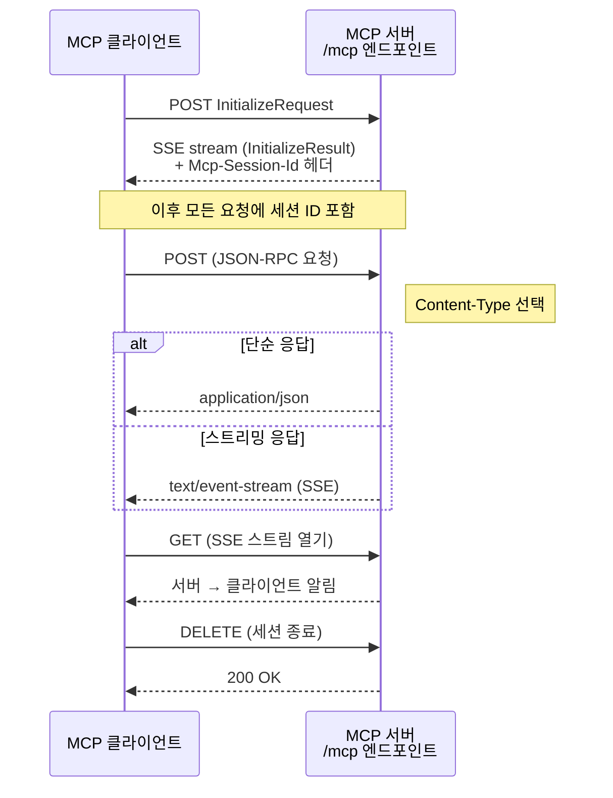
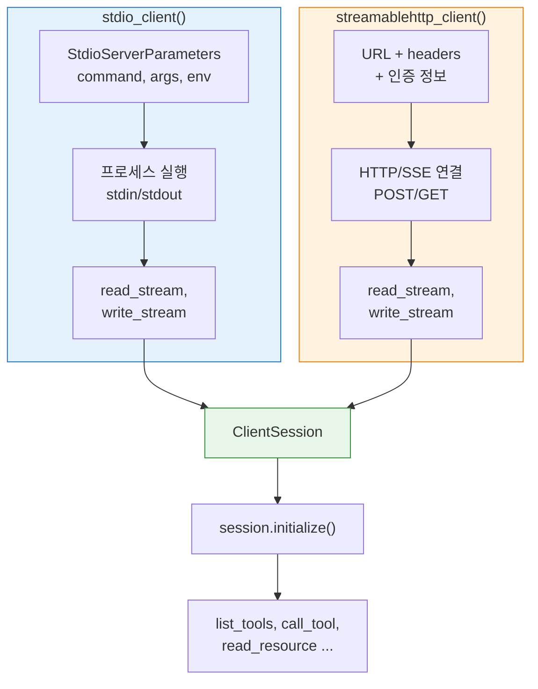
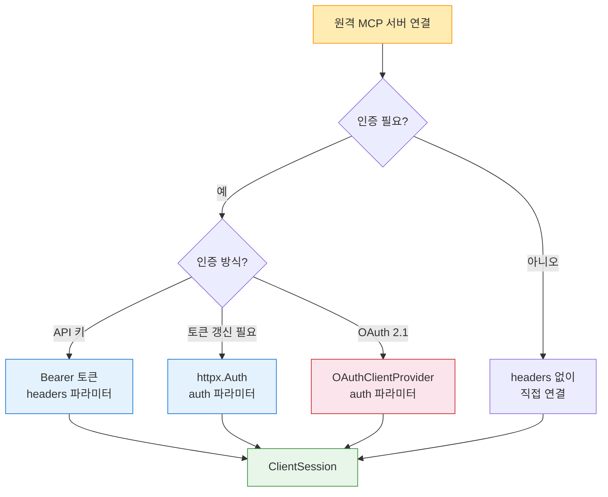
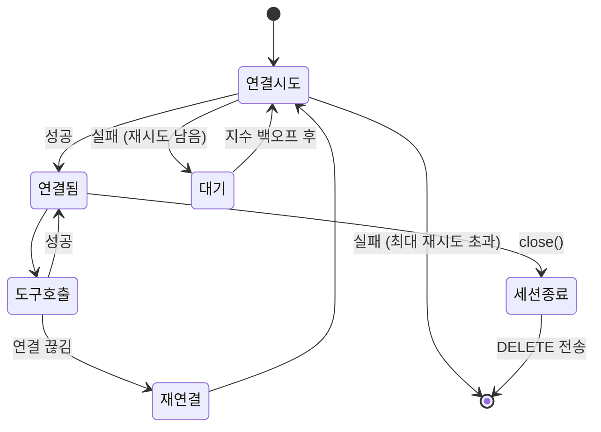

# Streamable HTTP 클라이언트

> `streamablehttp_client()`로 원격 MCP 서버에 연결하고, HTTP 헤더·인증·세션 ID를 관리하는 원격 클라이언트를 구축합니다.

## 개요

이 섹션에서는 MCP 클라이언트의 두 번째 Transport인 **Streamable HTTP**를 사용하여 원격 서버에 연결하는 방법을 다룹니다. [ClientSession과 서버 연결](09-ch9-mcp-클라이언트-개발/01-01-clientsession과-서버-연결.md)에서 배운 stdio 기반 로컬 연결을 넘어, 네트워크를 통한 원격 서버 통신을 구현합니다.

**선수 지식**:
- [ClientSession과 서버 연결](09-ch9-mcp-클라이언트-개발/01-01-clientsession과-서버-연결.md)의 `ClientSession` + `AsyncExitStack` 패턴
- [LLM 통합 에이전트 루프](09-ch9-mcp-클라이언트-개발/04-04-llm-통합-에이전트-루프.md)의 `MCPAgent` 클래스 구조
- [Transport 계층 — Streamable HTTP](02-ch2-mcp-아키텍처와-프로토콜-구조/03-03-transport-계층-streamable-http.md)의 프로토콜 이론

**학습 목표**:
- `streamablehttp_client()`로 원격 MCP 서버에 연결할 수 있다
- HTTP 헤더와 인증(Bearer 토큰, OAuth)을 설정할 수 있다
- 세션 ID 관리와 재연결 로직을 이해하고 구현할 수 있다
- stdio와 Streamable HTTP 클라이언트 코드의 차이를 정확히 설명할 수 있다

## 왜 알아야 할까?

지금까지 우리가 만든 MCP 클라이언트는 모두 **stdio Transport** — 즉, 같은 머신에서 프로세스를 띄우고 stdin/stdout으로 통신하는 방식이었습니다. 개발과 테스트에는 완벽하지만, 실제 프로덕션에서는 어떨까요?

MCP 서버가 **클라우드에 배포**되어 있다면? 여러 사용자가 **동시에 접속**해야 한다면? **방화벽 뒤의 사내 서버**에 접근해야 한다면? stdio로는 불가능합니다. 이때 필요한 것이 바로 **Streamable HTTP Transport**입니다.

Streamable HTTP는 표준 HTTP를 기반으로 하면서도 SSE(Server-Sent Events)를 결합하여, 단일 엔드포인트(`/mcp`)로 양방향 JSON-RPC 통신을 지원합니다. 놀라운 점은 — 클라이언트 코드에서 **`connect()` 부분만 교체하면 에이전트 루프는 그대로 동작한다**는 것이죠. MCP의 Transport 추상화가 빛을 발하는 순간입니다.

## 핵심 개념

### 개념 1: Streamable HTTP Transport 동작 원리

> 💡 **비유**: stdio가 같은 건물 안에서 내선 전화로 대화하는 거라면, Streamable HTTP는 인터넷을 통해 화상회의를 하는 것과 같습니다. 대화 방식(JSON-RPC)은 동일하지만, 연결 수단이 다른 거죠. 화상회의에는 회의 ID(세션 ID)가 필요하고, 끊겼다 다시 들어올 수도 있습니다(재연결).

Streamable HTTP는 하나의 URL 엔드포인트(보통 `/mcp`)에서 **POST와 GET 두 가지 HTTP 메서드**를 사용합니다.

> 📊 **그림 1**: Streamable HTTP Transport의 통신 구조



핵심 포인트를 정리하면:

- **POST**: 클라이언트가 JSON-RPC 요청/알림을 보냅니다. 서버는 `application/json`(단순 응답) 또는 `text/event-stream`(스트리밍)으로 응답합니다.
- **GET**: 클라이언트가 SSE 스트림을 열어 서버 발 알림(notifications)을 수신합니다.
- **DELETE**: 세션을 명시적으로 종료합니다.
- **세션 ID**: 서버가 `Mcp-Session-Id` 헤더로 발급하고, 클라이언트는 이후 모든 요청에 이를 포함합니다.

### 개념 2: streamablehttp_client() 함수

> 💡 **비유**: `stdio_client()`가 프로세스를 직접 실행하는 "직접 고용"이었다면, `streamablehttp_client()`는 원격 서비스에 HTTP로 "외주를 맡기는" 것과 같습니다. 계약서(URL)와 신분증(인증 정보)만 있으면 됩니다.

MCP Python SDK는 `streamablehttp_client()`를 비동기 컨텍스트 매니저로 제공합니다. stdio_client()와 동일한 패턴으로 `(read_stream, write_stream)`을 반환하므로, `ClientSession`에 그대로 전달할 수 있습니다.

> 📊 **그림 2**: stdio_client vs streamablehttp_client 비교



두 Transport 모두 같은 `(read_stream, write_stream)` 인터페이스를 반환하기 때문에, `ClientSession` 이후의 코드는 **완전히 동일**합니다. 이것이 MCP의 Transport 추상화가 주는 핵심 이점이죠.

**기본 사용법:**

```python
from mcp.client.streamable_http import streamablehttp_client
from mcp import ClientSession

async with streamablehttp_client("http://localhost:8000/mcp") as (
    read_stream,
    write_stream,
    get_session_id,  # 세션 ID 접근 함수
):
    async with ClientSession(read_stream, write_stream) as session:
        await session.initialize()

        # 이 아래부터는 stdio와 100% 동일!
        tools = await session.list_tools()
        result = await session.call_tool("greet", {"name": "MCP"})
```

`streamablehttp_client()`의 주요 파라미터:

| 파라미터 | 타입 | 설명 |
|---------|------|------|
| `url` | `str` | MCP 서버 엔드포인트 URL |
| `headers` | `dict[str, str]` | 추가 HTTP 헤더 (인증 등) |
| `timeout` | `timedelta` | 일반 요청 타임아웃 (기본 30초) |
| `sse_read_timeout` | `timedelta` | SSE 스트림 읽기 타임아웃 (기본 300초) |
| `auth` | `httpx.Auth` | httpx 인증 핸들러 |
| `terminate_on_close` | `bool` | 종료 시 DELETE 요청 전송 여부 (기본 True) |

> ⚠️ **흔한 오해**: "Streamable HTTP니까 WebSocket을 쓰는 거 아니야?" — 아닙니다! Streamable HTTP는 표준 HTTP POST + SSE(Server-Sent Events)를 사용합니다. WebSocket과 달리 HTTP 프록시, CDN, 로드밸런서와 완벽히 호환되는 것이 큰 장점이에요.

### 개념 3: HTTP 헤더와 인증 설정

> 💡 **비유**: 보안 건물에 들어가려면 출입증이 필요하듯, 원격 MCP 서버에는 인증 토큰이 필요합니다. `headers`에 출입증을 넣어주는 거죠.

원격 서버는 대부분 인증을 요구합니다. MCP 클라이언트에서 인증을 설정하는 세 가지 방법을 살펴보겠습니다.

**방법 1: Bearer 토큰 (가장 단순)**

```python
from datetime import timedelta
from mcp.client.streamable_http import streamablehttp_client
from mcp import ClientSession

async def connect_with_token(url: str, token: str):
    """Bearer 토큰으로 인증하여 MCP 서버에 연결"""
    async with streamablehttp_client(
        url=url,
        headers={
            "Authorization": f"Bearer {token}",
            "X-Client-Name": "my-mcp-client",  # 커스텀 헤더도 가능
        },
        timeout=timedelta(seconds=60),       # 일반 요청 60초
        sse_read_timeout=timedelta(seconds=600),  # SSE 스트림 10분
    ) as (read, write, get_session_id):
        async with ClientSession(read, write) as session:
            await session.initialize()
            print(f"세션 ID: {get_session_id()}")
            return session
```

**방법 2: httpx.Auth 핸들러 (토큰 갱신 자동화)**

```python
import httpx

class BearerAuth(httpx.Auth):
    """토큰 만료 시 자동 갱신하는 인증 핸들러"""

    def __init__(self, token: str, refresh_url: str):
        self.token = token
        self.refresh_url = refresh_url

    def auth_flow(self, request: httpx.Request):
        # 현재 토큰으로 요청
        request.headers["Authorization"] = f"Bearer {self.token}"
        yield request

auth = BearerAuth(token="my-api-key", refresh_url="https://auth.example.com/refresh")

async with streamablehttp_client(
    url="https://mcp.example.com/mcp",
    auth=auth,
) as (read, write, _):
    async with ClientSession(read, write) as session:
        await session.initialize()
```

**방법 3: OAuth 2.1 (엔터프라이즈)**

MCP 스펙은 OAuth 2.1 + PKCE를 표준 인증 메커니즘으로 지정합니다. Python SDK는 `OAuthClientProvider`를 제공하여 이를 간편하게 구현할 수 있습니다. 자세한 내용은 [OAuth 2.1 PKCE 구현](11-ch11-인증과-보안/02-02-oauth-21-pkce-구현.md)에서 다룹니다.

> 📊 **그림 3**: 인증 방식별 적용 시나리오



### 개념 4: 세션 ID 관리와 재연결

> 💡 **비유**: 카페에서 주문할 때 받는 번호표를 생각해보세요. 한번 번호표(세션 ID)를 받으면, 추가 주문이든 환불이든 그 번호를 보여주면 됩니다. 번호표를 잃어버리면? 새로 줄을 서야 합니다(재초기화).

Streamable HTTP에서 **세션 ID**는 서버가 클라이언트를 식별하는 핵심 수단입니다. 동작 과정을 따라가 보겠습니다:

1. 클라이언트가 `InitializeRequest`를 POST로 전송
2. 서버가 응답 헤더에 `Mcp-Session-Id: abc123`을 포함
3. 이후 클라이언트의 모든 요청에 `Mcp-Session-Id: abc123` 헤더 포함
4. 서버가 세션 ID와 매칭하여 상태를 관리

SDK에서는 이 과정이 자동으로 처리됩니다. `get_session_id()` 함수로 현재 세션 ID를 확인할 수 있습니다:

```python
async with streamablehttp_client("http://localhost:8000/mcp") as (
    read, write, get_session_id
):
    async with ClientSession(read, write) as session:
        await session.initialize()

        # 초기화 후 세션 ID 확인
        session_id = get_session_id()
        print(f"현재 세션 ID: {session_id}")
        # 출력: 현재 세션 ID: a3f8b2c1-...
```

**재연결 로직**은 SDK가 내부적으로 GET SSE 스트림에 대해 자동 재시도(최대 2회, 1초 간격)를 수행합니다. 하지만 세션 자체가 만료되면 클라이언트 레벨에서 재연결을 구현해야 합니다:

```python
import asyncio
from contextlib import AsyncExitStack
from mcp.client.streamable_http import streamablehttp_client
from mcp import ClientSession

class ResilientHTTPClient:
    """재연결 기능이 있는 Streamable HTTP MCP 클라이언트"""

    def __init__(self, url: str, headers: dict[str, str] | None = None):
        self.url = url
        self.headers = headers or {}
        self.session: ClientSession | None = None
        self._stack: AsyncExitStack | None = None
        self._max_retries = 3

    async def connect(self):
        """서버에 연결 (재시도 포함)"""
        for attempt in range(self._max_retries):
            try:
                self._stack = AsyncExitStack()
                await self._stack.__aenter__()

                transport = await self._stack.enter_async_context(
                    streamablehttp_client(
                        url=self.url,
                        headers=self.headers,
                    )
                )
                read, write, self._get_session_id = transport

                self.session = await self._stack.enter_async_context(
                    ClientSession(read, write)
                )
                await self.session.initialize()
                print(f"연결 성공 (세션: {self._get_session_id()})")
                return
            except Exception as e:
                print(f"연결 실패 (시도 {attempt + 1}/{self._max_retries}): {e}")
                await self._cleanup()
                if attempt < self._max_retries - 1:
                    await asyncio.sleep(2 ** attempt)  # 지수 백오프
                else:
                    raise

    async def call_tool_safe(self, name: str, arguments: dict) -> str:
        """도구 호출 — 연결 끊김 시 재연결 후 재시도"""
        try:
            result = await self.session.call_tool(name, arguments)
            return result.content[0].text
        except Exception as e:
            print(f"호출 실패, 재연결 시도: {e}")
            await self._cleanup()
            await self.connect()
            result = await self.session.call_tool(name, arguments)
            return result.content[0].text

    async def _cleanup(self):
        if self._stack:
            try:
                await self._stack.aclose()
            except Exception:
                pass
            self._stack = None
            self.session = None

    async def close(self):
        await self._cleanup()
```

> 📊 **그림 4**: 재연결 로직 상태 다이어그램



### 개념 5: stdio vs Streamable HTTP — 코드 비교

두 Transport의 클라이언트 코드를 나란히 비교하면 MCP의 추상화가 얼마나 깔끔한지 실감할 수 있습니다. **변경되는 부분은 `connect()` 메서드뿐**입니다.

```python
# ── stdio 클라이언트 ──────────────────────────────
from mcp.client.stdio import stdio_client, StdioServerParameters

async def connect_stdio():
    params = StdioServerParameters(
        command="python",
        args=["server.py"],
        env={"DB_PATH": "/data/app.db"},
    )
    transport = stdio_client(params)
    read, write = await stack.enter_async_context(transport)
    session = await stack.enter_async_context(ClientSession(read, write))
    await session.initialize()
    return session
```

```python
# ── Streamable HTTP 클라이언트 ─────────────────────
from mcp.client.streamable_http import streamablehttp_client

async def connect_http():
    transport = streamablehttp_client(
        url="https://mcp.example.com/mcp",
        headers={"Authorization": "Bearer my-token"},
    )
    read, write, get_session_id = await stack.enter_async_context(transport)
    session = await stack.enter_async_context(ClientSession(read, write))
    await session.initialize()
    return session
```

차이점을 정리하면:

| 항목 | stdio | Streamable HTTP |
|------|-------|----------------|
| 임포트 | `stdio_client` | `streamablehttp_client` |
| 연결 대상 | `command` + `args` (로컬 프로세스) | `url` (원격 엔드포인트) |
| 인증 | `env`로 환경변수 전달 | `headers`, `auth` 파라미터 |
| 반환값 | `(read, write)` 2-tuple | `(read, write, get_session_id)` 3-tuple |
| 세션 관리 | 프로세스 수명 = 세션 수명 | 세션 ID로 관리, 재연결 가능 |
| 적용 환경 | 로컬 개발, CLI 도구 | 클라우드 배포, 멀티 유저 |

> 🔥 **실무 팁**: 두 Transport를 모두 지원하는 클라이언트를 만들고 싶다면, 팩토리 패턴을 사용하세요. 설정 파일에서 `transport: "stdio"` 또는 `transport: "http"`를 읽어 `connect()` 메서드만 분기하면 됩니다. 나머지 에이전트 루프 코드는 100% 재사용할 수 있습니다.

## 실습: 직접 해보기

Ch9 전체에서 만든 MCPAgent를 확장하여, stdio와 Streamable HTTP 양쪽 Transport를 지원하는 **유니버설 MCP 클라이언트**를 구축해보겠습니다.

**Step 1: Streamable HTTP 서버 준비**

먼저 연결할 대상 서버를 만듭니다:

```python
# http_server.py — Streamable HTTP로 서비스하는 MCP 서버
from mcp.server.fastmcp import FastMCP
from datetime import datetime

mcp = FastMCP("DemoHTTPServer")

@mcp.tool()
def get_server_time() -> str:
    """현재 서버 시간을 반환합니다"""
    return datetime.now().isoformat()

@mcp.tool()
def calculate(expression: str) -> str:
    """수학 표현식을 계산합니다 (간단한 사칙연산만 지원)"""
    # 안전한 계산만 허용
    allowed = set("0123456789+-*/.() ")
    if not all(c in allowed for c in expression):
        return "오류: 허용되지 않는 문자가 포함되어 있습니다"
    try:
        result = eval(expression)  # 프로덕션에서는 ast.literal_eval 등 사용
        return str(result)
    except Exception as e:
        return f"계산 오류: {e}"

@mcp.resource("resource://server-info")
def server_info() -> str:
    """서버 정보를 제공합니다"""
    return "DemoHTTPServer v1.0 - MCP Streamable HTTP 실습 서버"

if __name__ == "__main__":
    # Streamable HTTP Transport로 실행 (기본 포트 8000, 엔드포인트 /mcp)
    mcp.run(transport="streamable-http")
```

터미널에서 서버를 실행합니다:

```terminal
$ python http_server.py
INFO:     Started server process
INFO:     Uvicorn running on http://0.0.0.0:8000
INFO:     MCP endpoint: /mcp
```

**Step 2: 유니버설 MCP 클라이언트**

```python
# universal_client.py — stdio + Streamable HTTP 양쪽 지원 클라이언트
import asyncio
from contextlib import AsyncExitStack
from dataclasses import dataclass

from mcp import ClientSession
from mcp.client.stdio import stdio_client, StdioServerParameters
from mcp.client.streamable_http import streamablehttp_client


@dataclass
class StdioConfig:
    """stdio Transport 설정"""
    command: str
    args: list[str]
    env: dict[str, str] | None = None


@dataclass
class HTTPConfig:
    """Streamable HTTP Transport 설정"""
    url: str
    headers: dict[str, str] | None = None


# 두 설정을 하나의 타입으로
TransportConfig = StdioConfig | HTTPConfig


class UniversalMCPClient:
    """stdio와 Streamable HTTP를 모두 지원하는 MCP 클라이언트"""

    def __init__(self, config: TransportConfig):
        self.config = config
        self.session: ClientSession | None = None
        self._stack = AsyncExitStack()
        self._session_id: str | None = None

    async def connect(self):
        """설정에 따라 적절한 Transport로 연결"""
        await self._stack.__aenter__()

        if isinstance(self.config, StdioConfig):
            read, write = await self._connect_stdio()
        elif isinstance(self.config, HTTPConfig):
            read, write = await self._connect_http()
        else:
            raise ValueError(f"지원하지 않는 Transport 설정: {type(self.config)}")

        # ClientSession은 Transport에 무관하게 동일
        self.session = await self._stack.enter_async_context(
            ClientSession(read, write)
        )
        result = await self.session.initialize()
        print(f"연결 완료: {result.serverInfo.name} v{result.serverInfo.version}")
        print(f"서버 capabilities: {list(vars(result.capabilities).keys())}")

    async def _connect_stdio(self):
        """stdio Transport 연결"""
        params = StdioServerParameters(
            command=self.config.command,
            args=self.config.args,
            env=self.config.env,
        )
        transport = await self._stack.enter_async_context(
            stdio_client(params)
        )
        print(f"[stdio] 프로세스 실행: {self.config.command} {' '.join(self.config.args)}")
        return transport  # (read, write)

    async def _connect_http(self):
        """Streamable HTTP Transport 연결"""
        transport = await self._stack.enter_async_context(
            streamablehttp_client(
                url=self.config.url,
                headers=self.config.headers or {},
            )
        )
        read, write, get_session_id = transport
        self._session_id = get_session_id()
        print(f"[HTTP] 서버 URL: {self.config.url}")
        if self._session_id:
            print(f"[HTTP] 세션 ID: {self._session_id}")
        return read, write

    async def list_and_call_tools(self):
        """서버의 도구를 조회하고 첫 번째 도구를 호출"""
        tools_result = await self.session.list_tools()
        print(f"\n사용 가능한 도구 ({len(tools_result.tools)}개):")
        for tool in tools_result.tools:
            print(f"  - {tool.name}: {tool.description}")

        # 첫 번째 도구 호출 테스트
        if tools_result.tools:
            first_tool = tools_result.tools[0]
            print(f"\n'{first_tool.name}' 호출 중...")
            result = await self.session.call_tool(first_tool.name, {})
            print(f"결과: {result.content[0].text}")

    async def close(self):
        """연결 종료"""
        if self._session_id:
            print(f"[HTTP] 세션 종료 (DELETE 전송): {self._session_id}")
        await self._stack.aclose()
        print("연결이 종료되었습니다.")


async def main():
    # ── 시나리오 1: stdio 연결 ──
    print("=" * 50)
    print("시나리오 1: stdio Transport")
    print("=" * 50)

    stdio_config = StdioConfig(
        command="python",
        args=["http_server.py"],  # stdio로도 실행 가능한 서버
    )
    client = UniversalMCPClient(stdio_config)
    await client.connect()
    await client.list_and_call_tools()
    await client.close()

    # ── 시나리오 2: Streamable HTTP 연결 ──
    print("\n" + "=" * 50)
    print("시나리오 2: Streamable HTTP Transport")
    print("=" * 50)

    http_config = HTTPConfig(
        url="http://localhost:8000/mcp",
        headers={"X-Client-Name": "universal-client"},
    )
    client = UniversalMCPClient(http_config)
    await client.connect()
    await client.list_and_call_tools()
    await client.close()


if __name__ == "__main__":
    asyncio.run(main())
```

```run:python
# 실행 결과 시뮬레이션 (Streamable HTTP 연결 부분)
print("=" * 50)
print("시나리오 2: Streamable HTTP Transport")
print("=" * 50)
print("[HTTP] 서버 URL: http://localhost:8000/mcp")
print("[HTTP] 세션 ID: a3f8b2c1-7d4e-4a9b-b5f6-8c2d1e0f3a4b")
print("연결 완료: DemoHTTPServer v1.0.0")
print("서버 capabilities: ['tools', 'resources']")
print()
print("사용 가능한 도구 (2개):")
print("  - get_server_time: 현재 서버 시간을 반환합니다")
print("  - calculate: 수학 표현식을 계산합니다")
print()
print("'get_server_time' 호출 중...")
print("결과: 2026-03-23T14:30:00.123456")
print("[HTTP] 세션 종료 (DELETE 전송): a3f8b2c1-7d4e-4a9b-b5f6-8c2d1e0f3a4b")
print("연결이 종료되었습니다.")
```

```output
==================================================
시나리오 2: Streamable HTTP Transport
==================================================
[HTTP] 서버 URL: http://localhost:8000/mcp
[HTTP] 세션 ID: a3f8b2c1-7d4e-4a9b-b5f6-8c2d1e0f3a4b
연결 완료: DemoHTTPServer v1.0.0
서버 capabilities: ['tools', 'resources']

사용 가능한 도구 (2개):
  - get_server_time: 현재 서버 시간을 반환합니다
  - calculate: 수학 표현식을 계산합니다

'get_server_time' 호출 중...
결과: 2026-03-23T14:30:00.123456
[HTTP] 세션 종료 (DELETE 전송): a3f8b2c1-7d4e-4a9b-b5f6-8c2d1e0f3a4b
연결이 종료되었습니다.
```

**Step 3: 에이전트 루프와 통합**

[LLM 통합 에이전트 루프](09-ch9-mcp-클라이언트-개발/04-04-llm-통합-에이전트-루프.md)에서 만든 `MCPAgent`를 Streamable HTTP로 전환하는 것은 `connect()` 메서드 하나만 바꾸면 됩니다:

```python
# 기존 MCPAgent의 connect() 변경 — 이것만 바꾸면 끝!
from mcp.client.streamable_http import streamablehttp_client

class MCPAgent:
    # ... (기존 코드 그대로) ...

    async def connect(self, config: TransportConfig):
        """Transport 설정에 따라 연결"""
        if isinstance(config, HTTPConfig):
            transport = await self._stack.enter_async_context(
                streamablehttp_client(
                    url=config.url,
                    headers=config.headers or {},
                )
            )
            read, write, _ = transport
        else:
            # stdio 연결 (기존 코드)
            transport = await self._stack.enter_async_context(
                stdio_client(StdioServerParameters(
                    command=config.command, args=config.args
                ))
            )
            read, write = transport

        self.session = await self._stack.enter_async_context(
            ClientSession(read, write)
        )
        await self.session.initialize()
        self.tools = await self._load_tools()

    # chat(), _agent_loop() 등은 변경 없음!
```

## 더 깊이 알아보기

### SSE에서 Streamable HTTP로 — Transport의 진화

MCP의 원격 Transport는 흥미로운 진화를 거쳤습니다.

MCP가 처음 공개된 2024년 11월(spec 2024-11-05), 원격 통신에는 **HTTP+SSE Transport**가 사용되었습니다. 이 방식은 두 개의 별도 엔드포인트를 필요로 했는데요 — `/sse`에서 GET으로 SSE 스트림을 열고, `/sse/messages`에 POST로 메시지를 보내는 구조였습니다.

이 접근법에는 심각한 문제들이 있었습니다. 두 엔드포인트 간의 세션 매칭이 필요했고, SSE 연결이 끊기면 전체 세션이 망가졌으며, HTTP/2·HTTP/3과의 호환성도 불완전했습니다. 무엇보다 로드밸런서 뒤에서 스케일링이 어려웠죠.

2025년 3월, MCP 팀은 **Streamable HTTP**라는 완전히 새로운 Transport를 설계했습니다(spec 2025-03-26에 도입). 핵심 아이디어는 "단일 엔드포인트에서 HTTP의 콘텐츠 협상(content negotiation)을 활용하자"였습니다. 같은 `/mcp` 엔드포인트에 POST하면, 서버가 상황에 따라 `application/json`(단순 응답) 또는 `text/event-stream`(스트리밍)으로 응답하는 거죠.

이 설계 덕분에 Streamable HTTP는 CDN, 리버스 프록시, 로드밸런서와 완벽히 호환되며, stateless 모드(세션 ID 없이)도 지원합니다. MCP 팀의 David Soria Parra는 이를 "HTTP의 기존 인프라를 있는 그대로 활용하는 Transport"라고 설명했습니다.

> 💡 **알고 계셨나요?**: Python SDK에서 구 SSE Transport(`sse_client()`)는 아직 사용 가능하지만 deprecated 상태입니다. SDK v2(2026년 예정)에서는 `streamable_http_client()`로 함수명이 snake_case로 변경되고, 반환값도 `(read, write)` 2-tuple로 단순화됩니다. `get_session_id` 함수는 httpx 이벤트 훅으로 대체되죠. 지금 v1의 `streamablehttp_client()`를 배워두면 v2 마이그레이션도 수월합니다.

### 왜 WebSocket이 아닌가?

"양방향 통신이면 WebSocket이 정석 아닌가?" 하는 의문이 들 수 있습니다. MCP 팀이 WebSocket 대신 HTTP+SSE를 선택한 데는 실용적인 이유가 있었습니다:

1. **인프라 호환성**: 많은 기업 환경의 프록시·방화벽이 WebSocket을 차단하거나 제한합니다. HTTP는 어디서나 통과합니다.
2. **Stateless 지원**: WebSocket은 본질적으로 stateful이지만, Streamable HTTP는 세션 ID를 생략하면 stateless로도 동작합니다. 서버리스(Lambda, Cloud Run) 배포에 안성맞춤이죠.
3. **기존 도구 활용**: HTTP 기반이므로 curl, Postman, 브라우저 DevTools 등 기존 디버깅 도구를 그대로 사용할 수 있습니다.

## 흔한 오해와 팁

> ⚠️ **흔한 오해**: "Streamable HTTP는 항상 SSE 스트림을 유지한다" — 아닙니다! 단순한 요청-응답은 일반 HTTP POST/JSON으로 처리됩니다. SSE 스트리밍은 서버가 여러 메시지를 보내야 할 때(예: 진행 알림 포함 도구 실행)만 사용됩니다. 이 "필요할 때만 업그레이드" 방식이 Streamable HTTP의 핵심 설계 철학입니다.

> 💡 **알고 계셨나요?**: `terminate_on_close=True`(기본값)로 설정하면, 클라이언트가 컨텍스트 매니저를 빠져나올 때 자동으로 HTTP DELETE 요청을 보내 서버 세션을 정리합니다. 갑작스런 네트워크 단절에는 작동하지 않으므로, 프로덕션 서버에서는 세션 타임아웃을 함께 설정해야 합니다.

> 🔥 **실무 팁**: Streamable HTTP 서버를 디버깅할 때는 `curl`이 친구입니다. 서버가 제대로 동작하는지 확인하려면:
> ```bash
> # InitializeRequest 전송
> curl -X POST http://localhost:8000/mcp \
>   -H "Content-Type: application/json" \
>   -H "Accept: application/json, text/event-stream" \
>   -d '{"jsonrpc":"2.0","id":1,"method":"initialize","params":{"protocolVersion":"2025-03-26","capabilities":{},"clientInfo":{"name":"curl","version":"1.0"}}}'
> ```
> 응답에 `Mcp-Session-Id` 헤더가 있으면 서버가 정상 동작하는 것입니다.

> 🔥 **실무 팁**: 타임아웃 설정을 주의하세요. LLM을 호출하는 도구는 실행에 수십 초가 걸릴 수 있습니다. `sse_read_timeout`을 너무 짧게 설정하면 도구 실행 중에 연결이 끊깁니다. 기본값(300초)을 유지하거나, 도구 특성에 맞게 늘려주세요.

## 핵심 정리

| 개념 | 설명 |
|------|------|
| `streamablehttp_client()` | 원격 MCP 서버에 Streamable HTTP로 연결하는 비동기 컨텍스트 매니저 |
| 반환값 | `(read_stream, write_stream, get_session_id)` 3-tuple |
| 엔드포인트 | 단일 URL (기본 `/mcp`)에서 POST, GET, DELETE 처리 |
| 인증 설정 | `headers` (Bearer 토큰), `auth` (httpx.Auth 핸들러), OAuth 2.1 |
| 세션 ID | 서버가 `Mcp-Session-Id` 헤더로 발급, SDK가 자동 관리 |
| 재연결 | GET SSE 스트림은 자동 재시도, 세션 만료 시 수동 재연결 필요 |
| Transport 추상화 | `connect()`만 교체하면 에이전트 루프 코드는 100% 재사용 가능 |
| vs stdio | 원격 배포, 멀티 유저, 스케일링이 필요할 때 Streamable HTTP 사용 |
| SDK v2 변경점 | `streamable_http_client()` (snake_case), 반환 2-tuple, httpx 설정 분리 |

## 다음 섹션 미리보기

이것으로 **Ch9. MCP 클라이언트 개발**이 완료됩니다! ClientSession 연결부터 도구 조회·호출, 리소스·프롬프트 활용, LLM 통합 에이전트 루프, 그리고 원격 Streamable HTTP 연결까지 — MCP 클라이언트의 모든 것을 다루었습니다.

다음 장 [Host 애플리케이션 설계](10-ch10-mcp-호스트와-멀티-서버-오케스트레이션/01-01-host-애플리케이션-설계.md)에서는 한 단계 위인 **Host 레벨**로 올라갑니다. 여러 MCP 서버를 동시에 관리하고, 도구를 동적으로 디스커버리하며, LLM이 여러 서버의 도구를 자유롭게 선택하는 **멀티 서버 오케스트레이션**을 구현합니다. Ch9에서 만든 클라이언트가 그 빌딩 블록이 됩니다.

## 참고 자료

- [MCP Python SDK — GitHub](https://github.com/modelcontextprotocol/python-sdk) - `streamablehttp_client` 소스코드와 공식 예제가 포함된 SDK 리포지토리
- [MCP Transports — 공식 문서](https://modelcontextprotocol.io/specification/2025-11-25/basic/transports) - Streamable HTTP Transport의 스펙 상세. POST/GET/DELETE 동작과 세션 관리 규칙 정의
- [Why MCP Deprecated SSE — FKA Blog](https://blog.fka.dev/blog/2025-06-06-why-mcp-deprecated-sse-and-go-with-streamable-http/) - SSE에서 Streamable HTTP로 전환한 기술적 배경과 설계 결정 과정
- [Cloudflare: Streamable HTTP MCP Servers](https://blog.cloudflare.com/streamable-http-mcp-servers-python/) - Cloudflare Workers에서 Python MCP 서버를 Streamable HTTP로 배포하는 실전 가이드
- [MCP Transport Scalability: Production Migration Guide](https://www.elegantsoftwaresolutions.com/blog/mcp-transport-scalability-production-migration-guide-2026) - SSE→Streamable HTTP 마이그레이션과 프로덕션 스케일링 패턴
- [Build a Python MCP Client — Real Python](https://realpython.com/python-mcp-client/) - Python MCP 클라이언트 구현 튜토리얼. stdio와 HTTP 양쪽 Transport 커버