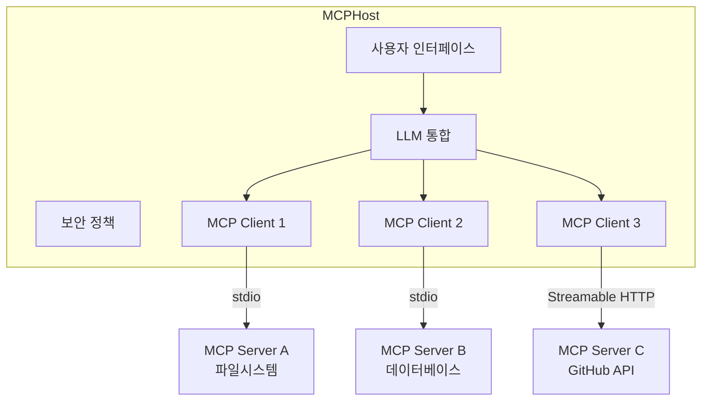
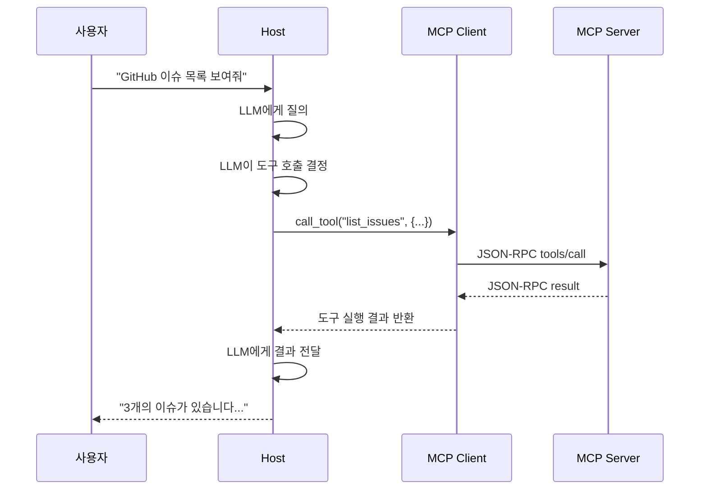
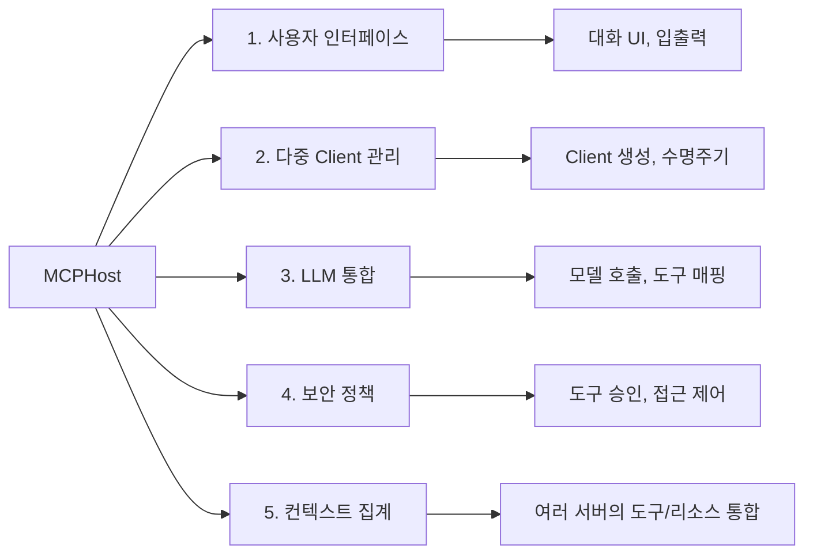
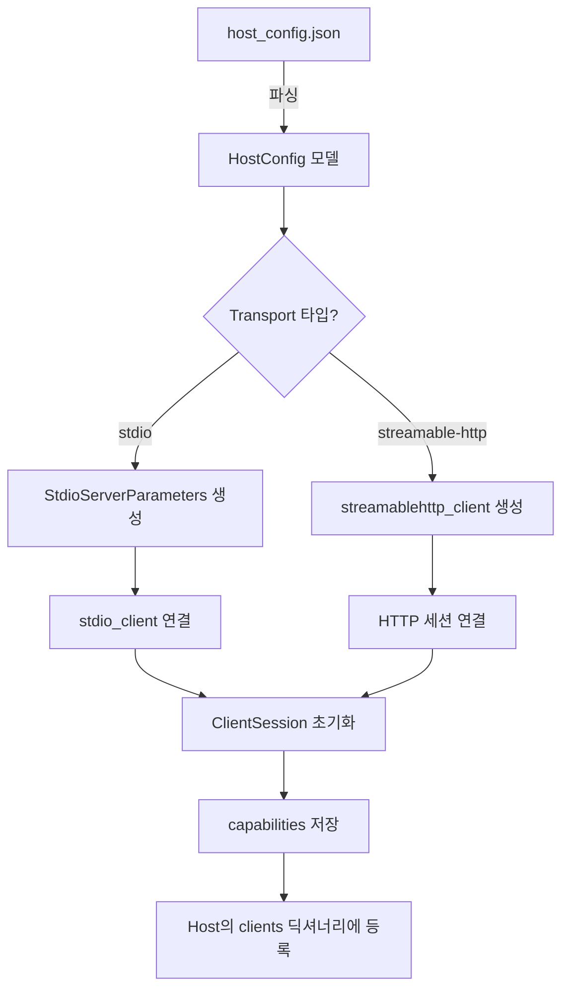
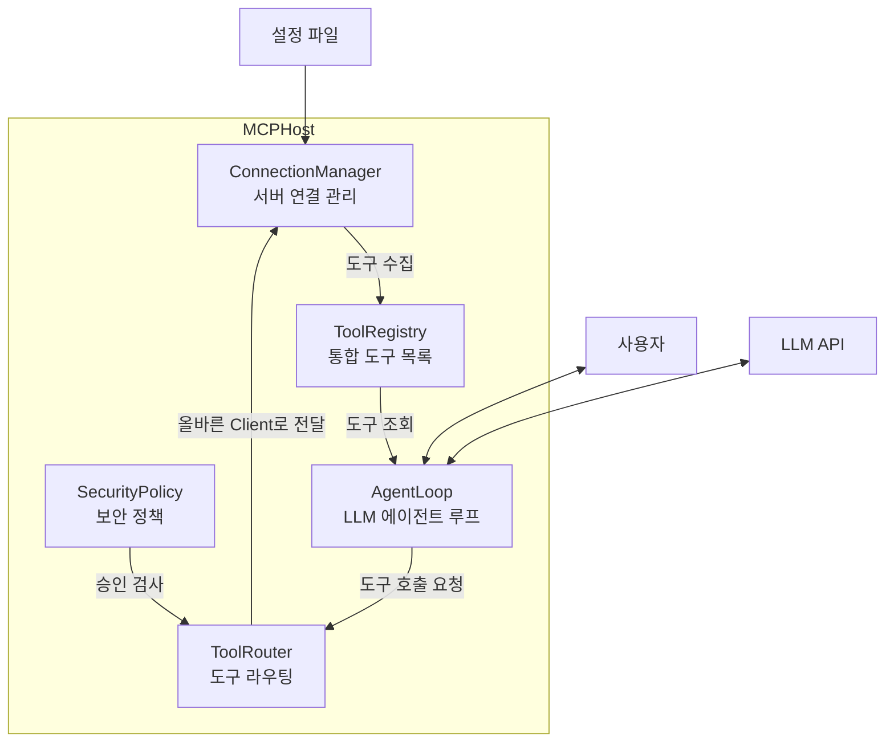

# Host 애플리케이션 설계

> MCP 아키텍처의 최상위 계층인 Host의 책임과 설계 패턴을 이해하고, 다중 서버를 관리하는 Host 애플리케이션의 기반을 구축합니다.

## 개요

이 섹션에서는 MCP 3계층 아키텍처의 최상위 계층인 **Host**가 무엇을 책임지고, 어떻게 설계해야 하는지를 다룹니다. 지금까지 우리는 Server와 Client를 각각 만들어 봤는데요, 이제는 이 모든 것을 **하나의 애플리케이션으로 통합**하는 Host를 설계할 차례입니다.

**선수 지식**: [ClientSession과 서버 연결](09-ch9-mcp-클라이언트-개발/01-01-clientsession과-서버-연결.md)에서 배운 클라이언트 연결 패턴, [LLM 통합 에이전트 루프](09-ch9-mcp-클라이언트-개발/04-04-llm-통합-에이전트-루프.md)에서 배운 도구 호출 루프

**학습 목표**:
- Host, Client, Server 3계층의 역할 분리를 명확히 이해한다
- Host가 담당하는 5가지 핵심 책임(사용자 UI, 다중 Client 관리, LLM 통합, 보안 정책, 컨텍스트 집계)을 설명할 수 있다
- 설정 파일 기반으로 여러 MCP 서버를 등록하는 구조를 설계한다
- 실제 Host 애플리케이션의 기본 골격을 Python으로 구현한다

## 왜 알아야 할까?

Ch9에서 우리는 하나의 MCP 서버에 연결하는 클라이언트를 만들었습니다. 하지만 실제 AI 애플리케이션을 떠올려 보세요. Claude Desktop은 파일시스템 서버, GitHub 서버, 데이터베이스 서버를 **동시에** 연결합니다. VS Code도 마찬가지죠.

이 모든 연결을 관리하고, 사용자 인터페이스를 제공하고, LLM과 통합하고, 보안 정책을 적용하는 것 — 이것이 바로 **Host**의 역할입니다. 서버를 아무리 잘 만들어도, Host 없이는 사용자에게 닿을 수 없습니다.

이 섹션을 마치면 "내가 만든 MCP 서버들을 하나의 AI 애플리케이션에서 통합 관리하는 방법"을 알게 됩니다.

## 핵심 개념

### 개념 1: Host — 오케스트라의 지휘자

> 💡 **비유**: MCP의 Host는 **오케스트라의 지휘자**와 같습니다. 바이올린(파일시스템 서버), 첼로(데이터베이스 서버), 플루트(API 서버)가 각각 연주하지만, 지휘자가 없으면 협주곡은 완성되지 않습니다. 지휘자는 직접 악기를 연주하지 않지만, 누가 언제 연주할지 결정하고, 전체 하모니를 만들어 냅니다.

MCP 공식 스펙에서 정의하는 **Host**는 "사용자와 직접 상호작용하는 AI 애플리케이션"입니다. Claude Desktop, VS Code, 또는 직접 만든 AI 챗봇이 모두 Host에 해당하죠.

Host의 핵심은 **직접 프로토콜을 말하지 않는다**는 것입니다. Host는 MCP Client 인스턴스를 생성하고, 각 Client가 특정 Server와 1:1 연결을 유지하도록 관리합니다.

> 📊 **그림 1**: MCP 3계층 아키텍처 — Host, Client, Server의 관계



여기서 중요한 포인트는 **Client와 Server는 1:1 관계**라는 것입니다. 하나의 Client는 하나의 Server만 담당합니다. Host가 3개의 서버를 사용하려면, 3개의 Client 인스턴스를 생성해야 하죠. 이 구조 덕분에 각 Client는 자신이 담당하는 Server의 프로토콜 상태만 관리하면 되고, Host는 전체를 조율하는 데 집중할 수 있습니다.

### 개념 2: Host vs Client — 역할 분리

> 💡 **비유**: Host와 Client의 관계는 **회사의 CEO와 부서장**의 관계와 비슷합니다. CEO(Host)는 전체 전략을 수립하고 고객(사용자)을 응대하지만, 실제 업무는 부서장(Client)이 외부 파트너(Server)와 직접 소통하며 처리합니다.

둘의 역할을 혼동하는 경우가 많은데, 명확하게 구분해 봅시다:

| 책임 영역 | Host | Client |
|-----------|------|--------|
| **사용자 상호작용** | 직접 담당 (UI, 대화) | 관여하지 않음 |
| **LLM 호출** | 직접 담당 | 관여하지 않음 (Sampling 시 중계만) |
| **프로토콜 통신** | 관여하지 않음 | 직접 담당 (JSON-RPC) |
| **서버 연결 관리** | Client 생성/소멸 관리 | 실제 연결 유지 |
| **보안 정책** | 정책 결정 | 정책 실행 (도구 승인 중계) |
| **도구 실행 결과** | LLM에 전달 | Host에 전달 |

> 📊 **그림 2**: Host와 Client의 책임 분리 흐름



코드로 보면 이 분리가 더 명확해집니다:

```python
# Host의 책임: LLM 통합, 사용자 응대, 도구 호출 결정
class MCPHost:
    def __init__(self):
        self.clients: dict[str, ClientSession] = {}  # Client 관리
        self.llm_client = anthropic.Anthropic()       # LLM 통합

    async def handle_user_message(self, message: str) -> str:
        # 1. 모든 Client에서 도구 목록 수집
        tools = await self._collect_all_tools()

        # 2. LLM에게 도구와 함께 질의
        response = self.llm_client.messages.create(
            model="claude-sonnet-4-20250514",
            messages=[{"role": "user", "content": message}],
            tools=tools,
        )

        # 3. LLM이 도구 호출을 결정하면, 해당 Client에 위임
        if response.stop_reason == "tool_use":
            tool_result = await self._route_tool_call(response)
            # ...후속 처리
```

```python
# Client의 책임: 프로토콜 통신, 서버와의 1:1 연결
# (Python SDK의 ClientSession이 이 역할을 수행)
from mcp import ClientSession, StdioServerParameters
from mcp.client.stdio import stdio_client

async def create_client(server_config):
    server_params = StdioServerParameters(
        command=server_config["command"],
        args=server_config.get("args", []),
    )
    transport = await stdio_client(server_params).__aenter__()
    read, write = transport
    session = ClientSession(read, write)
    await session.initialize()
    return session
```

### 개념 3: Host의 5가지 핵심 책임

Host는 단순한 "껍데기"가 아닙니다. 다섯 가지 핵심 책임을 수행해야 합니다. 이 **5대 책임**은 앞으로 Host 관련 설계를 논의할 때 반복적으로 참조되는 핵심 프레임워크이니 꼭 기억해 두세요.

> 📊 **그림 3**: Host의 5가지 핵심 책임



**1. 사용자 인터페이스(UI)**: 사용자의 메시지를 받고, AI의 응답을 표시합니다. CLI, 웹 UI, 데스크톱 앱 등 다양한 형태가 가능합니다. 사용자가 직접 만지는 유일한 계층이기도 하죠.

**2. 다중 Client 관리**: 설정에 따라 MCP Client를 생성하고, 연결 상태를 모니터링하고, 필요 시 재연결합니다. 서버가 5개면 Client도 5개 — 각각의 수명주기를 관리하는 것이 Host의 몫입니다.

**3. LLM 통합**: 사용자 메시지와 수집된 도구 목록을 LLM에 전달하고, LLM의 도구 호출 결정을 받아 적절한 Client로 라우팅합니다. 이것이 "AI 애플리케이션"을 단순 도구 모음과 구분 짓는 핵심입니다.

**4. 보안 정책**: 어떤 서버를 신뢰할지, 도구 실행 전 사용자 승인이 필요한지, 민감한 데이터 접근을 제한할지 등의 정책을 결정합니다. 정책의 **결정**은 Host가, **실행**은 Client가 담당합니다.

**5. 컨텍스트 집계**: 여러 서버에서 수집한 도구(Tools), 리소스(Resources), 프롬프트(Prompts)를 하나의 통합된 목록으로 만들어 LLM에 제공합니다. LLM 입장에서는 도구가 어느 서버에서 왔는지 알 필요 없이, 하나의 통합된 도구 목록만 보면 됩니다.

이 5가지를 요약하면: **UI → Client 관리 → LLM 연결 → 보안 → 통합**이라는 흐름입니다. 이후 섹션에서 각 책임을 하나씩 깊이 파고들게 됩니다.

### 개념 4: 설정 파일 기반 서버 등록

> 💡 **비유**: 설정 파일은 오케스트라의 **악보 배치도**와 같습니다. 어떤 악기(서버)가 어디에 앉고(어떤 Transport를 쓰고), 어떤 곡을 연주하는지(어떤 기능을 제공하는지) 미리 적어 둔 것이죠.

실제 Host 애플리케이션은 서버 목록을 코드에 하드코딩하지 않습니다. **설정 파일**에서 읽어 오죠. Claude Desktop의 설정 파일 형식이 사실상 표준이 되었는데, 우리도 이 패턴을 따르겠습니다:

```python
# host_config.json — 서버 등록 설정 파일
{
    "mcpServers": {
        "filesystem": {
            "command": "python",
            "args": ["-m", "mcp_server_filesystem", "/home/user/docs"],
            "env": {},
            "transport": "stdio"
        },
        "database": {
            "command": "python",
            "args": ["db_server.py"],
            "env": {"DB_URL": "sqlite:///app.db"},
            "transport": "stdio"
        },
        "github": {
            "url": "https://mcp.github.com/api",
            "transport": "streamable-http",
            "headers": {"Authorization": "Bearer ${GITHUB_TOKEN}"}
        }
    }
}
```

이 설정 파일을 파싱하는 Pydantic 모델을 정의합니다:

```python
from pydantic import BaseModel, Field


class StdioServerConfig(BaseModel):
    """stdio Transport 서버 설정"""
    command: str                          # 실행 명령어
    args: list[str] = Field(default_factory=list)  # 명령어 인자
    env: dict[str, str] = Field(default_factory=dict)  # 환경 변수
    transport: str = "stdio"


class HttpServerConfig(BaseModel):
    """Streamable HTTP Transport 서버 설정"""
    url: str                              # 원격 서버 URL
    transport: str = "streamable-http"
    headers: dict[str, str] = Field(default_factory=dict)  # 인증 헤더


class HostConfig(BaseModel):
    """Host 전체 설정"""
    mcpServers: dict[str, StdioServerConfig | HttpServerConfig]
```

> 📊 **그림 4**: 설정 파일에서 서버 연결까지의 흐름



설정 파일에서 환경 변수를 참조하는 패턴(`${GITHUB_TOKEN}`)도 지원하면 좋습니다:

```python
import os
import re


def resolve_env_vars(value: str) -> str:
    """설정 값에서 ${ENV_VAR} 패턴을 실제 환경 변수로 치환"""
    pattern = re.compile(r"\$\{(\w+)\}")
    def replacer(match: re.Match) -> str:
        env_name = match.group(1)
        env_value = os.environ.get(env_name, "")
        if not env_value:
            print(f"  경고: 환경 변수 {env_name}이 설정되지 않았습니다")
        return env_value
    return pattern.sub(replacer, value)
```

### 개념 5: Host 아키텍처 설계 패턴

실제 Host 애플리케이션을 설계할 때는 몇 가지 아키텍처 패턴을 고려해야 합니다.

> 📊 **그림 5**: Host 내부 아키텍처 — 컴포넌트 관계도



각 컴포넌트의 역할을 정리하면:

| 컴포넌트 | 역할 | 핵심 메서드 |
|----------|------|------------|
| `ConnectionManager` | 서버 연결/해제, 상태 관리 | `connect()`, `disconnect()`, `reconnect()` |
| `ToolRegistry` | 모든 서버의 도구를 통합 관리 | `collect_tools()`, `find_tool()` |
| `ToolRouter` | 도구 이름 → 올바른 Client로 라우팅 | `route_call()` |
| `SecurityPolicy` | 도구 실행 전 승인 검사 | `check_permission()` |
| `AgentLoop` | 사용자↔LLM↔도구 대화 루프 | `run()` |

## 실습: 직접 해보기

이제 실제로 동작하는 Host 애플리케이션의 기본 골격을 구현해 봅시다. 전체 구조를 한 파일에 담되, 각 컴포넌트의 역할이 명확히 드러나도록 설계합니다.

```python
"""
mcp_host.py — MCP Host 애플리케이션 기본 골격
여러 MCP 서버를 설정 파일로 등록하고, 통합 도구 목록을 관리하는 Host
"""
import asyncio
import json
import os
import re
from dataclasses import dataclass, field
from pathlib import Path

from mcp import ClientSession, StdioServerParameters
from mcp.client.stdio import stdio_client
from mcp.types import Tool


# ── 설정 모델 ──────────────────────────────────────────────

@dataclass
class ServerConfig:
    """개별 서버 설정"""
    name: str
    command: str
    args: list[str] = field(default_factory=list)
    env: dict[str, str] = field(default_factory=dict)


@dataclass
class RegisteredServer:
    """연결된 서버 정보"""
    name: str
    session: ClientSession
    tools: list[Tool] = field(default_factory=list)
    # transport 컨텍스트 매니저 참조 (정리용)
    _cleanup: list = field(default_factory=list)


# ── 설정 파일 로더 ─────────────────────────────────────────

def load_config(config_path: str) -> dict[str, ServerConfig]:
    """설정 파일에서 서버 목록을 로드"""
    path = Path(config_path)
    if not path.exists():
        raise FileNotFoundError(f"설정 파일을 찾을 수 없습니다: {config_path}")

    with open(path) as f:
        raw = json.load(f)

    servers: dict[str, ServerConfig] = {}
    for name, conf in raw.get("mcpServers", {}).items():
        # ${ENV_VAR} 패턴 치환
        resolved_env = {}
        for k, v in conf.get("env", {}).items():
            resolved_env[k] = _resolve_env(v)

        servers[name] = ServerConfig(
            name=name,
            command=conf["command"],
            args=conf.get("args", []),
            env=resolved_env,
        )
    return servers


def _resolve_env(value: str) -> str:
    """${ENV_VAR} → 실제 환경 변수 값으로 치환"""
    return re.sub(
        r"\$\{(\w+)\}",
        lambda m: os.environ.get(m.group(1), ""),
        value,
    )


# ── Host 본체 ──────────────────────────────────────────────

class MCPHost:
    """MCP Host 애플리케이션 — 다중 서버 관리자"""

    def __init__(self):
        self.servers: dict[str, RegisteredServer] = {}
        # 도구 이름 → 서버 이름 매핑 (라우팅용)
        self._tool_to_server: dict[str, str] = {}

    # ── 서버 연결 ──

    async def connect_server(self, config: ServerConfig) -> None:
        """단일 서버에 연결하고 도구를 수집"""
        print(f"  [{config.name}] 연결 중...")

        params = StdioServerParameters(
            command=config.command,
            args=config.args,
            env={**os.environ, **config.env},  # 기존 환경 변수 유지
        )

        # stdio transport 열기
        read, write = await stdio_client(params).__aenter__()

        # ClientSession 초기화
        session = ClientSession(read, write)
        init_result = await session.initialize()

        # 서버 정보 출력
        server_info = init_result.server_info
        print(f"  [{config.name}] 연결 완료: "
              f"{server_info.name} v{server_info.version}")

        # 도구 수집
        tools: list[Tool] = []
        if init_result.capabilities and init_result.capabilities.tools:
            tools_result = await session.list_tools()
            tools = tools_result.tools
            print(f"  [{config.name}] 도구 {len(tools)}개 발견")

        # 등록
        registered = RegisteredServer(
            name=config.name,
            session=session,
            tools=tools,
        )
        self.servers[config.name] = registered

        # 도구 라우팅 테이블 업데이트
        for tool in tools:
            self._tool_to_server[tool.name] = config.name

    async def connect_all(self, configs: dict[str, ServerConfig]) -> None:
        """모든 서버에 순차 연결"""
        print(f"\n총 {len(configs)}개 서버 연결 시작\n")
        for name, config in configs.items():
            try:
                await self.connect_server(config)
            except Exception as e:
                print(f"  [{name}] 연결 실패: {e}")
        print(f"\n연결 완료: {len(self.servers)}/{len(configs)} 서버\n")

    # ── 도구 관리 ──

    def get_all_tools(self) -> list[dict]:
        """모든 서버의 도구를 LLM API 형식으로 반환"""
        all_tools = []
        for server in self.servers.values():
            for tool in server.tools:
                all_tools.append({
                    "name": tool.name,
                    "description": tool.description or "",
                    "input_schema": tool.inputSchema,
                })
        return all_tools

    def find_server_for_tool(self, tool_name: str) -> str | None:
        """도구 이름으로 담당 서버를 찾기"""
        return self._tool_to_server.get(tool_name)

    async def call_tool(self, tool_name: str, arguments: dict) -> str:
        """도구를 호출하고 결과를 텍스트로 반환"""
        server_name = self.find_server_for_tool(tool_name)
        if not server_name:
            return f"오류: '{tool_name}' 도구를 찾을 수 없습니다"

        server = self.servers[server_name]
        result = await server.session.call_tool(tool_name, arguments)

        # 결과에서 텍스트 추출
        texts = [c.text for c in result.content if hasattr(c, "text")]
        return "\n".join(texts) if texts else "(결과 없음)"

    # ── 상태 조회 ──

    def print_status(self) -> None:
        """현재 연결 상태와 도구 목록 출력"""
        print("=" * 50)
        print("MCP Host 상태")
        print("=" * 50)
        for name, server in self.servers.items():
            tool_names = [t.name for t in server.tools]
            print(f"\n[{name}]")
            print(f"  도구: {', '.join(tool_names) if tool_names else '(없음)'}")
        print(f"\n총 도구 수: {len(self._tool_to_server)}")
        print("=" * 50)
```

이 Host를 실제로 실행하는 엔트리포인트는 다음과 같습니다:

```run:python
# Host 상태 출력 시뮬레이션 (실제 서버 없이 구조 확인)
from dataclasses import dataclass, field


@dataclass
class ToolInfo:
    name: str
    server: str


# 시뮬레이션: 3개 서버가 연결된 상태
connected_servers = {
    "filesystem": ["read_file", "write_file", "list_directory"],
    "database": ["query", "insert", "update"],
    "github": ["list_issues", "create_pr", "get_repo"],
}

print("=" * 50)
print("MCP Host 상태")
print("=" * 50)

total_tools = 0
for name, tools in connected_servers.items():
    print(f"\n[{name}]")
    print(f"  도구: {', '.join(tools)}")
    total_tools += len(tools)

print(f"\n총 도구 수: {total_tools}")
print("=" * 50)
```

```output
==================================================
MCP Host 상태
==================================================

[filesystem]
  도구: read_file, write_file, list_directory

[database]
  도구: query, insert, update

[github]
  도구: list_issues, create_pr, get_repo

총 도구 수: 9
==================================================
```

도구 라우팅이 어떻게 동작하는지도 확인해 봅시다:

```run:python
# 도구 라우팅 시뮬레이션
tool_to_server = {
    "read_file": "filesystem",
    "write_file": "filesystem",
    "list_directory": "filesystem",
    "query": "database",
    "insert": "database",
    "update": "database",
    "list_issues": "github",
    "create_pr": "github",
    "get_repo": "github",
}

# LLM이 호출을 결정한 도구들
tool_calls = ["list_issues", "query", "read_file"]

print("도구 라우팅 결과:")
print("-" * 40)
for tool_name in tool_calls:
    server = tool_to_server.get(tool_name, "알 수 없음")
    print(f"  {tool_name:20s} → [{server}] 서버로 전달")
```

```output
도구 라우팅 결과:
----------------------------------------
  list_issues          → [github] 서버로 전달
  query                → [database] 서버로 전달
  read_file            → [filesystem] 서버로 전달
```

설정 파일의 예시도 함께 제공합니다:

```python
# host_config.json 예시
config_example = {
    "mcpServers": {
        "filesystem": {
            "command": "python",
            "args": ["-m", "mcp_server_filesystem", "/home/user/docs"],
            "env": {}
        },
        "database": {
            "command": "python",
            "args": ["db_server.py"],
            "env": {"DB_URL": "sqlite:///app.db"}
        },
        "github": {
            "command": "npx",
            "args": ["-y", "@modelcontextprotocol/server-github"],
            "env": {"GITHUB_TOKEN": "${GITHUB_TOKEN}"}
        }
    }
}
```

## 더 깊이 알아보기

### MCP Host 개념의 탄생 배경

MCP의 Host-Client-Server 3계층 구조가 처음부터 이렇게 설계된 것은 아닙니다. 초기 MCP 논의에서는 단순히 Client-Server 2계층만 있었거든요. 하지만 Anthropic이 Claude Desktop에 MCP를 통합하면서, **하나의 애플리케이션이 여러 서버를 동시에 관리하는** 현실적인 요구가 생겼습니다.

"Host"라는 별도의 계층을 명시적으로 분리한 것은 2024년 말 MCP가 공개될 때였습니다. 이 결정의 배경에는 재미있는 논쟁이 있었죠. GitHub에서 "Host와 Client를 왜 구분하느냐"라는 질문이 올라왔고 (Discussion #135), MCP 팀은 이렇게 답했습니다: **"Client는 프로토콜 핸들러이고, Host는 사용자 경험을 책임지는 애플리케이션이다. 이 둘의 관심사를 분리해야 각각 독립적으로 진화할 수 있다."**

이 설계 철학은 네트워크 프로토콜의 역사에서 영감을 받았습니다. TCP/IP에서 소켓(Client)과 웹 브라우저(Host)를 분리한 것처럼, MCP도 프로토콜 통신과 애플리케이션 로직을 분리한 것입니다.

2025년 12월, Anthropic은 MCP를 Linux Foundation 산하 Agentic AI Foundation(AAIF)에 기부했습니다. OpenAI, Google, Microsoft가 모두 MCP를 지원하면서, Host-Client-Server 패턴은 AI 도구 통합의 **사실상 표준 아키텍처**가 되었습니다.

## 흔한 오해와 팁

> ⚠️ **흔한 오해**: "Host와 Client는 같은 것 아닌가요?" — 아닙니다! Client는 MCP 프로토콜을 말하는 **통신 핸들러**이고, Host는 사용자와 LLM을 연결하는 **애플리케이션**입니다. Python SDK에서 `ClientSession`이 Client, 여러분이 만드는 메인 애플리케이션이 Host입니다. 하나의 Host 안에 여러 Client가 존재합니다.

> 💡 **알고 계셨나요?**: Claude Desktop의 MCP 설정 파일 형식(`mcpServers` JSON)이 사실상 업계 표준이 되었습니다. VS Code, Cursor, Windsurf 등 대부분의 MCP 지원 도구가 같은 형식을 채택했죠. 그래서 우리 실습에서도 이 형식을 그대로 따릅니다.

> 🔥 **실무 팁**: 설정 파일에 API 키를 직접 쓰지 마세요! `${GITHUB_TOKEN}`처럼 환경 변수 참조 패턴을 사용하고, `.env` 파일이나 시스템 환경 변수로 관리하세요. 설정 파일은 Git에 커밋될 수 있지만, 환경 변수는 안전합니다.

> 🔥 **실무 팁**: Host가 모든 서버에 **순차적으로** 연결할 필요는 없습니다. 서버 간 의존성이 없다면 `asyncio.gather()`로 병렬 연결하세요. 서버가 5개일 때, 순차 연결은 각 서버당 2초씩 총 10초가 걸리지만, 병렬이면 약 2초면 됩니다. 다음 섹션에서 이 패턴을 구현합니다.

## 핵심 정리

| 개념 | 설명 |
|------|------|
| **Host** | 사용자와 LLM을 연결하는 AI 애플리케이션. MCP Client를 생성·관리 |
| **Client** | 특정 MCP Server와 1:1 프로토콜 통신을 담당하는 핸들러 |
| **Host의 5대 책임** | 사용자 UI, 다중 Client 관리, LLM 통합, 보안 정책, 컨텍스트 집계 |
| **설정 파일 패턴** | `mcpServers` JSON으로 서버 등록. `${ENV_VAR}` 패턴으로 비밀 관리 |
| **도구 라우팅** | `tool_name → server_name` 매핑으로 올바른 Client에 호출 전달 |
| **역할 분리 원칙** | Host = 전략(what), Client = 전술(how). 프로토콜 관심사를 격리 |

## 다음 섹션 미리보기

이번 섹션에서 Host의 설계 철학과 기본 골격을 이해했다면, 다음 [멀티 서버 연결과 관리](10-ch10-mcp-호스트와-멀티-서버-오케스트레이션/02-02-멀티-서버-연결과-관리.md)에서는 이 골격 위에 **병렬 연결, 연결 풀링, 서버 상태 모니터링**을 추가합니다. `asyncio.gather()`를 사용한 병렬 초기화, 서버 health check, 그리고 연결이 끊어졌을 때의 graceful degradation을 구현해 봅니다.

## 참고 자료

- [Architecture - Model Context Protocol 공식 문서](https://modelcontextprotocol.io/docs/learn/architecture) - Host/Client/Server 3계층 아키텍처의 공식 설명과 다이어그램. 이 섹션의 핵심 근거
- [Understanding MCP Clients - 공식 문서](https://modelcontextprotocol.io/docs/learn/client-concepts) - Client가 제공하는 기능(Elicitation, Roots, Sampling)과 Host와의 관계 설명
- [MCP Client Development Guide - cyanheads](https://github.com/cyanheads/model-context-protocol-resources/blob/main/guides/mcp-client-development-guide.md) - Host 내 Client 구현 패턴과 멀티 서버 관리 가이드
- [MCP Python SDK - GitHub](https://github.com/modelcontextprotocol/python-sdk) - `ClientSession`, `StdioServerParameters` 등 Python SDK의 공식 소스 코드
- [Build a Python MCP Client - Real Python](https://realpython.com/python-mcp-client/) - Python으로 MCP 클라이언트를 구축하는 실전 튜토리얼
- [Host, Client, Server 구분 논의 - GitHub Discussion #135](https://github.com/modelcontextprotocol/modelcontextprotocol/discussions/135) - Host와 Client 분리에 대한 커뮤니티 논의