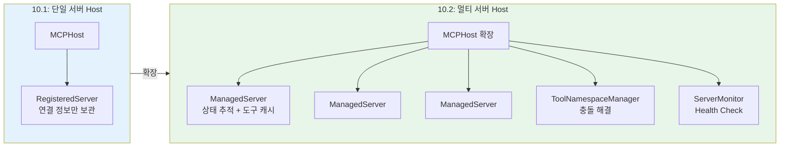
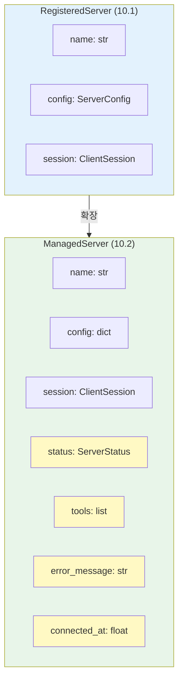
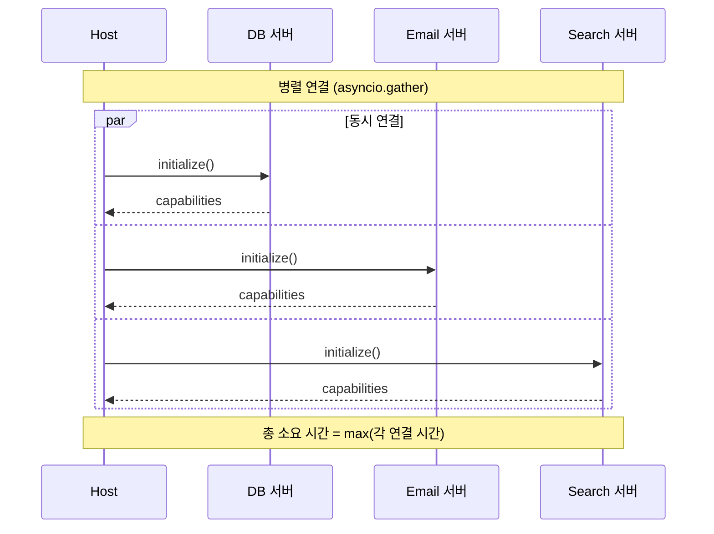
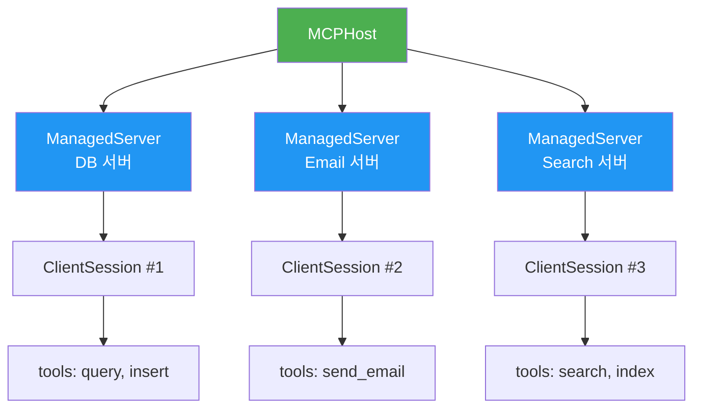
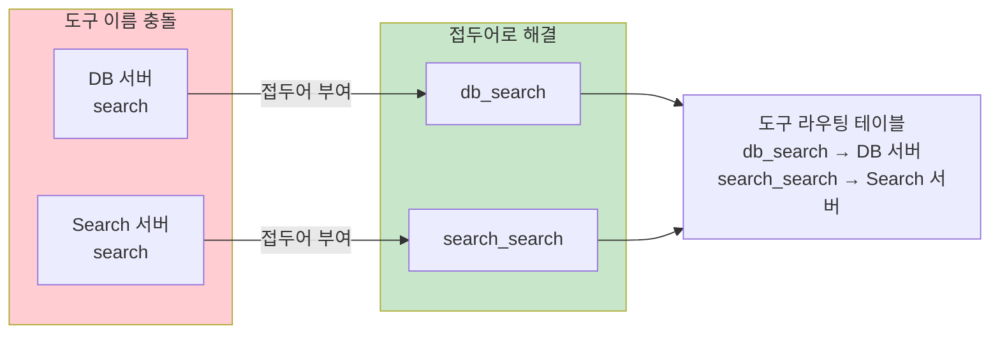
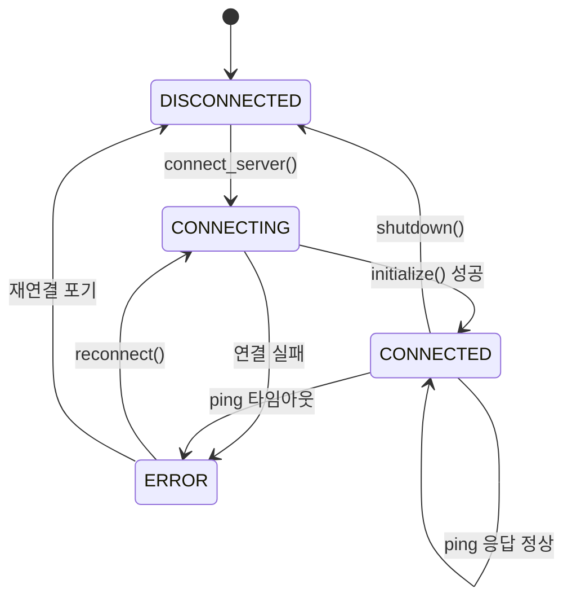
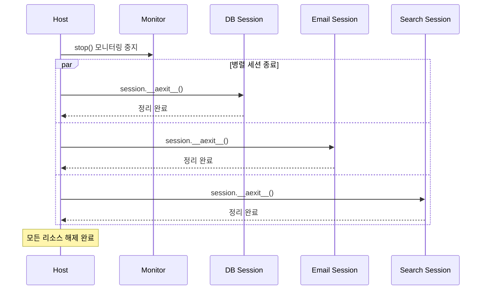

# 멀티 서버 연결과 관리

> 여러 MCP 서버를 동시에 연결하고, 도구 이름 충돌을 해결하며, 서버 상태를 모니터링하는 Host의 핵심 역할을 구현합니다.

## 개요

이 섹션에서는 [Host 애플리케이션 설계](10-ch10-mcp-호스트와-멀티-서버-오케스트레이션/01-01-host-애플리케이션-설계.md)에서 만든 `MCPHost` 골격 위에, 여러 MCP 서버를 **동시에 연결**하고 **관리**하는 실전 패턴을 구현합니다. 단일 서버 연결은 [ClientSession과 서버 연결](09-ch9-mcp-클라이언트-개발/01-01-clientsession과-서버-연결.md)에서 이미 다뤘는데, 이번에는 그 연결을 **N개로 확장**할 때 생기는 문제들 — 병렬 연결, 네임스페이스 충돌, 상태 추적 — 을 하나씩 해결합니다.

10.1에서는 서버의 연결 정보를 담는 `ServerConfig`와, 연결이 완료된 서버를 표현하는 `RegisteredServer`를 정의했습니다. 이번 섹션에서는 `RegisteredServer`를 확장하여, **런타임 상태 추적**(연결 상태, 에러 메시지, 마지막 ping 시간)이 가능한 `ManagedServer`로 발전시킵니다. 또한 단일 서버 연결만 다루던 `MCPHost`를 **멀티 서버 관리가 가능하도록 확장**하여, 병렬 연결·네임스페이스 관리·상태 모니터링까지 갖춘 완전한 Host를 구현합니다.

**선수 지식**:
- `ClientSession`의 라이프사이클과 `initialize()` 흐름 (Ch9)
- `asyncio.gather`, `asyncio.create_task` 기본 사용법
- 이전 섹션의 `MCPHost`, `ServerConfig`, `RegisteredServer` 구조

**학습 목표**:
- `asyncio.gather`로 여러 서버에 병렬 연결하는 패턴을 구현할 수 있다
- 서버별 `ClientSession`을 안전하게 관리하는 구조를 설계할 수 있다
- 도구 이름 충돌(namespace collision)을 감지하고 해결할 수 있다
- `send_ping()`과 타임아웃 기반으로 서버 상태를 모니터링할 수 있다

## 왜 알아야 할까?

실제 AI 에이전트 시스템을 떠올려 보세요. 고객 문의에 대응하는 에이전트라면 **데이터베이스 서버**(고객 정보 조회), **이메일 서버**(메일 발송), **슬랙 서버**(팀 알림), **검색 서버**(문서 검색)를 동시에 사용해야 합니다. 서버가 4개인데 하나씩 순서대로 연결하면? 각 서버 핸드셰이크에 1~2초씩, 총 4~8초를 부팅 시간으로 낭비하게 됩니다.

더 심각한 문제도 있습니다. 데이터베이스 서버와 검색 서버가 둘 다 `search`라는 도구를 제공한다면? LLM이 "search를 호출해줘"라고 했을 때, 어느 서버의 `search`를 실행해야 할까요? 이런 **도구 이름 충돌** 문제를 해결하지 않으면 에이전트가 엉뚱한 서버에 요청을 보내고, 의도치 않은 결과가 돌아옵니다.

> 📊 **그림 1**: 멀티 서버 Host의 역할 — 10.1 MCPHost에서의 확장



이 섹션에서 다루는 멀티 서버 관리는, 단순한 "여러 개 연결"이 아니라 **프로덕션 수준의 Host가 반드시 갖춰야 할 인프라**입니다.

## 핵심 개념

### 개념 1: RegisteredServer에서 ManagedServer로 — 상태 추적의 필요성

> 💡 **비유**: 10.1의 `RegisteredServer`가 직원의 **명함**(이름, 부서, 연락처)이라면, `ManagedServer`는 **인사 관리 시스템**(현재 출근 상태, 마지막 활동 시간, 담당 업무 목록, 문제 발생 이력)입니다. 멀티 서버 환경에서는 "이 서버가 지금 살아있는지", "어떤 도구를 제공하는지"를 실시간으로 추적해야 하거든요.

10.1에서 정의한 `RegisteredServer`는 서버의 연결 정보와 `ClientSession`을 묶어두는 정도였습니다. 하지만 서버가 여러 개가 되면, 각 서버의 **런타임 상태**(연결 중인지, 에러 상태인지)와 **제공 도구 목록**을 실시간으로 관리해야 합니다. `ManagedServer`는 이런 운영 관심사를 추가한 확장 구조입니다.

```python
from dataclasses import dataclass, field
from enum import Enum
from mcp import ClientSession


class ServerStatus(Enum):
    """서버 연결 상태 — RegisteredServer에는 없던 상태 머신"""
    DISCONNECTED = "disconnected"
    CONNECTING = "connecting"
    CONNECTED = "connected"
    ERROR = "error"


@dataclass
class ManagedServer:
    """
    RegisteredServer의 확장 — 런타임 상태 추적이 가능한 서버 컨테이너.
    
    10.1의 RegisteredServer가 '연결된 서버'의 정적 정보를 담았다면,
    ManagedServer는 '관리되는 서버'의 동적 상태까지 추적합니다.
    """
    name: str
    config: dict                          # ServerConfig에서 가져온 서버 설정
    status: ServerStatus = ServerStatus.DISCONNECTED
    session: ClientSession | None = None
    tools: list = field(default_factory=list)       # 이 서버가 제공하는 도구 목록
    error_message: str | None = None
    connected_at: float | None = None     # 연결 시점 (모니터링용)
```

> 📊 **그림 2**: RegisteredServer vs ManagedServer 비교



노란색으로 표시된 필드들이 `ManagedServer`에서 새로 추가된 것입니다. 이 필드들 덕분에 Host는 "db 서버가 현재 에러 상태이고, 마지막 에러 메시지는 Connection timeout이며, 도구 2개를 제공했었다"는 식의 운영 정보를 파악할 수 있게 됩니다.

### 개념 2: 병렬 서버 연결 — MCPHost를 멀티 서버로 확장

> 💡 **비유**: 레스토랑 개장 준비를 생각해 보세요. 주방, 홀, 바 각 팀이 **동시에** 준비를 시작하면 30분 만에 문을 열 수 있지만, 한 팀씩 순서대로 하면 90분이 걸립니다. Host의 서버 연결도 마찬가지입니다.

10.1의 `MCPHost.connect_server()`는 단일 서버 연결만 처리했습니다. 이제 이 메서드를 기반으로 **여러 서버에 동시 연결하는 `connect_all()`**을 추가합니다. 기존 `MCPHost` 클래스를 그대로 확장하는 방식이므로, 단일 서버 연결 코드와 자연스럽게 공존합니다.

> 📊 **그림 3**: 순차 연결 vs 병렬 연결 시간 비교



핵심은 각 서버 연결을 **독립적인 코루틴**으로 만들고, `asyncio.gather`로 한꺼번에 실행하는 것입니다.

```python
import asyncio
from mcp import ClientSession, StdioServerParameters
from mcp.client.stdio import stdio_client


class MCPHost:
    """
    10.1의 MCPHost를 멀티 서버 관리로 확장.
    
    단일 서버 connect_server()는 그대로 유지하면서,
    connect_all()로 병렬 연결 + 네임스페이스 관리를 추가합니다.
    """
    
    def __init__(self):
        self.servers: dict[str, ManagedServer] = {}
        self.namespace = ToolNamespaceManager()    # 도구 충돌 해결 (개념 3에서 설명)
        self._cleanup_stack: list = []

    async def connect_server(self, name: str, config: dict) -> ManagedServer:
        """
        단일 서버에 연결하고 도구 목록을 수집.
        10.1의 connect_server()를 ManagedServer 기반으로 강화.
        """
        server = ManagedServer(name=name, config=config)
        server.status = ServerStatus.CONNECTING
        
        try:
            # Transport 생성
            params = StdioServerParameters(
                command=config["command"],
                args=config.get("args", []),
                env=config.get("env"),
            )
            
            # stdio_client는 비동기 컨텍스트 매니저
            read_stream, write_stream = await self._create_transport(params)
            
            # 세션 생성 및 초기화
            session = ClientSession(read_stream, write_stream)
            await session.__aenter__()
            await session.initialize()
            
            # 도구 목록 수집
            tools_result = await session.list_tools()
            
            server.session = session
            server.tools = tools_result.tools
            server.status = ServerStatus.CONNECTED
            
        except Exception as e:
            server.status = ServerStatus.ERROR
            server.error_message = str(e)
        
        self.servers[name] = server
        return server

    async def connect_all(self, configs: dict[str, dict]) -> dict[str, ManagedServer]:
        """모든 서버에 병렬로 연결 — 멀티 서버 확장의 핵심 메서드"""
        tasks = [
            asyncio.create_task(
                self.connect_server(name, config),
                name=f"connect-{name}"  # 디버깅용 태스크 이름
            )
            for name, config in configs.items()
        ]
        
        # return_exceptions=True: 한 서버 실패가 나머지를 취소하지 않음
        results = await asyncio.gather(*tasks, return_exceptions=True)
        
        # ⚠️ 중요: return_exceptions=True 사용 시 반드시 결과를 순회하며
        # Exception 인스턴스를 명시적으로 확인해야 합니다!
        # 에러가 조용히 넘어갈 수 있기 때문입니다.
        for i, result in enumerate(results):
            if isinstance(result, Exception):
                # 에러를 로깅하거나, 재시도 큐에 넣거나, 알림을 보냅니다
                server_name = list(configs.keys())[i]
                print(f"[경고] 서버 '{server_name}' 연결 실패: {result}")
            elif isinstance(result, ManagedServer) and result.status == ServerStatus.CONNECTED:
                # 성공한 서버의 도구를 네임스페이스에 등록
                self.namespace.register_tools(result.name, result.tools)
        
        return self.servers
```

여기서 `return_exceptions=True`가 중요합니다. 이 옵션 없이 한 서버 연결이 실패하면 `gather` 전체가 예외를 던지면서 나머지 성공한 연결도 무시됩니다. `True`로 설정하면 실패한 서버는 `Exception` 객체로 반환되고, 나머지 서버들은 정상 작동합니다.

> ⚠️ **흔한 오해**: "`return_exceptions=True`를 쓰면 에러 처리가 끝났다"고 생각하기 쉽지만, **이 옵션은 에러를 '처리'하는 게 아니라 '숨기는' 것**입니다. 반환된 결과 리스트를 반드시 순회하면서 `isinstance(result, Exception)`으로 에러를 걸러내야 합니다. 이 검사를 빠뜨리면 서버 연결 실패가 완전히 무시되어, 나중에 도구 호출 시 "서버에 연결되어 있지 않음" 에러가 뜨고 원인을 추적하기 어려워집니다.

```python
# ❌ 위험한 패턴 — 에러가 조용히 사라짐
results = await asyncio.gather(*tasks, return_exceptions=True)
# results를 검사하지 않고 그냥 넘어감

# ✅ 올바른 패턴 — 에러를 명시적으로 처리
results = await asyncio.gather(*tasks, return_exceptions=True)
for result in results:
    if isinstance(result, Exception):
        logger.error(f"서버 연결 실패: {result}")
        # 필요하면 재시도 큐에 추가, 알림 전송 등
    elif isinstance(result, ManagedServer):
        if result.status == ServerStatus.ERROR:
            logger.warning(f"{result.name}: {result.error_message}")
```

### 개념 3: 서버별 ClientSession 관리

> 💡 **비유**: 콜센터 교환원을 생각해 보세요. 고객(LLM)이 전화하면 교환원(Host)이 어느 부서(서버)로 연결할지 판단하고, 각 부서와의 전화선(세션)을 따로 관리합니다. 한 부서의 전화가 끊겨도 다른 부서 통화에는 영향이 없죠.

> 📊 **그림 4**: Host의 세션 관리 구조



MCP에서 **Client와 Server는 1:1 관계**입니다. 이것은 프로토콜 설계 원칙이에요. Host 내부에서 서버 3개에 연결하면, `ClientSession` 인스턴스도 3개가 생깁니다. 각 세션은 독립적인 상태(capabilities, 도구 목록, 구독 등)를 유지하고, 하나가 죽어도 다른 세션에 영향을 주지 않습니다.

`ManagedServer` 클래스는 이 1:1 세션에 **상태 추적**(status, error)과 **도구 캐시**(tools)를 추가한 래퍼입니다. 이 패턴으로 Host는 "어떤 서버가 어떤 도구를 제공하는지"를 한눈에 파악할 수 있습니다.

```python
# 서버 상태 조회 예시
async def get_status_report(host: MCPHost) -> dict:
    """전체 서버의 연결 상태 리포트"""
    report = {}
    for name, server in host.servers.items():
        report[name] = {
            "status": server.status.value,
            "tools_count": len(server.tools),
            "tools": [t.name for t in server.tools],
            "error": server.error_message,
        }
    return report
```

### 개념 4: 도구 네임스페이스 충돌 해결

> 💡 **비유**: 대형 회사에 "김민수"라는 이름의 직원이 3명 있다고 해보세요. "김민수에게 이 문서를 전달해"라고 하면 누구에게 줄지 알 수 없습니다. 그래서 "마케팅팀 김민수", "개발팀 김민수"처럼 **부서명을 접두어**로 붙이는 거죠. MCP의 도구 이름 충돌도 같은 방식으로 해결합니다.

멀티 서버 환경에서 가장 흔한 문제가 **도구 이름 충돌**입니다. 서버 A와 서버 B가 둘 다 `search`라는 도구를 노출하면, LLM은 어떤 `search`를 호출해야 할지 구분할 수 없습니다. 아직 MCP 프로토콜 레벨에서 공식 네임스페이스 메커니즘은 정해지지 않았지만(SEP-993에서 논의 중), Host 레벨에서 해결하는 검증된 패턴들이 있습니다.

> 📊 **그림 5**: 도구 네임스페이스 충돌과 해결



```python
from dataclasses import dataclass


@dataclass
class ToolEntry:
    """라우팅 테이블의 도구 항목"""
    prefixed_name: str     # LLM에게 노출되는 이름 (예: "db_search")
    original_name: str     # 서버에 실제 호출할 이름 (예: "search")
    server_name: str       # 이 도구를 소유한 서버
    description: str
    input_schema: dict


class ToolNamespaceManager:
    """도구 네임스페이스 충돌을 감지하고 해결"""
    
    def __init__(self, strategy: str = "prefix"):
        # strategy: "prefix" | "priority" | "error"
        self.strategy = strategy
        self.registry: dict[str, ToolEntry] = {}  # prefixed_name → ToolEntry
    
    def register_tools(
        self, 
        server_name: str, 
        tools: list,
        priority: int = 0,
    ) -> list[ToolEntry]:
        """한 서버의 도구들을 등록하며 충돌을 해결"""
        entries = []
        
        for tool in tools:
            original_name = tool.name
            
            # 충돌 여부 확인
            if original_name in self.registry and self.strategy != "prefix":
                existing = self.registry[original_name]
                if self.strategy == "error":
                    raise ValueError(
                        f"도구 이름 충돌: '{original_name}' "
                        f"({existing.server_name} vs {server_name})"
                    )
                # priority 전략: 이미 높은 우선순위가 등록되어 있으면 스킵
                continue
            
            # 접두어 전략: 항상 server_name을 접두어로 부여
            if self.strategy == "prefix":
                prefixed = f"{server_name}_{original_name}"
            else:
                prefixed = original_name
            
            entry = ToolEntry(
                prefixed_name=prefixed,
                original_name=original_name,
                server_name=server_name,
                description=f"[{server_name}] {tool.description}",
                input_schema=tool.inputSchema,
            )
            
            self.registry[prefixed] = entry
            entries.append(entry)
        
        return entries
    
    def resolve(self, prefixed_name: str) -> tuple[str, str]:
        """접두어 이름 → (서버 이름, 원래 도구 이름) 반환"""
        entry = self.registry.get(prefixed_name)
        if not entry:
            raise KeyError(f"등록되지 않은 도구: {prefixed_name}")
        return entry.server_name, entry.original_name
    
    def get_all_tool_schemas(self) -> list[dict]:
        """LLM에게 전달할 전체 도구 스키마 목록"""
        return [
            {
                "name": entry.prefixed_name,
                "description": entry.description,
                "inputSchema": entry.input_schema,
            }
            for entry in self.registry.values()
        ]
    
    def detect_conflicts(self, servers: dict[str, list]) -> dict[str, list[str]]:
        """충돌하는 도구 이름과 관련 서버 목록 반환"""
        name_to_servers: dict[str, list[str]] = {}
        for server_name, tools in servers.items():
            for tool in tools:
                name_to_servers.setdefault(tool.name, []).append(server_name)
        
        return {
            name: srvs for name, srvs in name_to_servers.items() 
            if len(srvs) > 1
        }
```

```run:python
# 충돌 감지 시뮬레이션
name_to_servers = {
    "search": ["db_server", "search_server"],
    "query": ["db_server"],
    "send": ["email_server", "slack_server"],
    "index": ["search_server"],
}

conflicts = {
    name: srvs for name, srvs in name_to_servers.items() 
    if len(srvs) > 1
}

for name, servers in conflicts.items():
    print(f"⚠️  충돌: '{name}' → {servers}")
    for srv in servers:
        print(f"   해결: '{srv}_{name}'")
```

```output
⚠️  충돌: 'search' → ['db_server', 'search_server']
   해결: 'db_server_search'
   해결: 'search_server_search'
⚠️  충돌: 'send' → ['email_server', 'slack_server']
   해결: 'email_server_send'
   해결: 'slack_server_send'
```

> 💡 **알고 계셨나요?**: "도구 이름에 접두어를 붙이면 LLM이 헷갈려하지 않을까?"라고 걱정할 수 있는데, 실제로는 반대입니다. `description`에 서버 출처를 명시하면 LLM이 **더 정확하게** 적절한 도구를 선택합니다. `search`보다 `db_search`("데이터베이스에서 레코드를 검색합니다")가 의도를 훨씬 잘 전달하거든요.

### 개념 5: 서버 상태 모니터링과 Health Check

> 💡 **비유**: 공장의 모니터링 대시보드를 생각해 보세요. 각 생산 라인의 상태등이 초록/노랑/빨강으로 실시간 표시됩니다. 한 라인이 멈춰도 공장 전체가 멈추지 않고, 관리자가 즉시 조치를 취할 수 있죠.

MCP SDK의 `ClientSession`에는 `send_ping()` 메서드가 내장되어 있습니다. 이걸 주기적으로 호출하면 서버가 살아있는지 확인할 수 있어요.

> 📊 **그림 6**: Health Check 흐름과 상태 전이



```python
import asyncio
import time


class ServerMonitor:
    """서버 상태를 주기적으로 모니터링"""
    
    def __init__(self, host: MCPHost, interval: float = 30.0):
        self.host = host
        self.interval = interval       # health check 주기 (초)
        self._task: asyncio.Task | None = None
        self.last_ping: dict[str, float] = {}  # 서버별 마지막 ping 시간
    
    async def check_server(self, name: str, server: ManagedServer) -> bool:
        """개별 서버 health check"""
        if server.status != ServerStatus.CONNECTED or not server.session:
            return False
        
        try:
            # send_ping()은 서버 응답을 기다림
            await asyncio.wait_for(
                server.session.send_ping(),
                timeout=5.0  # 5초 내 응답 없으면 문제
            )
            self.last_ping[name] = time.time()
            return True
            
        except (asyncio.TimeoutError, Exception) as e:
            server.status = ServerStatus.ERROR
            server.error_message = f"Health check 실패: {e}"
            return False
    
    async def check_all(self) -> dict[str, bool]:
        """모든 서버를 병렬로 health check"""
        tasks = {
            name: asyncio.create_task(self.check_server(name, server))
            for name, server in self.host.servers.items()
        }
        
        results = {}
        for name, task in tasks.items():
            results[name] = await task
        
        return results
    
    async def _monitor_loop(self):
        """백그라운드 모니터링 루프"""
        while True:
            results = await self.check_all()
            
            unhealthy = [n for n, ok in results.items() if not ok]
            if unhealthy:
                print(f"[모니터] 비정상 서버: {unhealthy}")
            
            await asyncio.sleep(self.interval)
    
    def start(self):
        """백그라운드 모니터링 시작"""
        self._task = asyncio.create_task(self._monitor_loop())
    
    def stop(self):
        """모니터링 중지"""
        if self._task:
            self._task.cancel()
```

### 개념 6: Graceful Shutdown과 리소스 정리

여러 서버 세션을 열었으면, 종료 시 **모두 깔끔하게 닫아야** 합니다. 세션을 제대로 닫지 않으면 서버 프로세스가 좀비로 남거나, 리소스가 누수됩니다.

> 📊 **그림 7**: Graceful Shutdown 시퀀스



```python
class MCPHost:
    # ... (이전 코드에 추가)
    
    async def disconnect_server(self, name: str):
        """특정 서버 연결 해제"""
        server = self.servers.get(name)
        if not server or not server.session:
            return
        
        try:
            await server.session.__aexit__(None, None, None)
        except Exception as e:
            print(f"[경고] {name} 세션 종료 중 오류: {e}")
        finally:
            server.session = None
            server.status = ServerStatus.DISCONNECTED
            server.tools = []
    
    async def shutdown(self):
        """모든 서버 연결을 정리하고 종료"""
        # 모든 세션을 병렬로 종료
        tasks = [
            asyncio.create_task(self.disconnect_server(name))
            for name in list(self.servers.keys())
        ]
        # shutdown에서도 return_exceptions=True로 한 서버 정리 실패가
        # 나머지 정리를 막지 않도록 합니다
        results = await asyncio.gather(*tasks, return_exceptions=True)
        
        # 종료 과정에서 발생한 에러도 확인
        for i, result in enumerate(results):
            if isinstance(result, Exception):
                print(f"[경고] 서버 종료 중 오류: {result}")
        
        self.servers.clear()
        print("[Host] 모든 서버 연결 해제 완료")
```

## 실습: 직접 해보기

지금까지 배운 개념들을 하나로 합쳐서, **멀티 서버 Host를 완전하게 구현**해 봅시다. 실제 MCP 서버 없이도 동작을 확인할 수 있도록 시뮬레이션 버전을 만들겠습니다.

```python
"""
multi_server_host.py
멀티 MCP 서버 관리 Host — 시뮬레이션 버전

10.1의 MCPHost를 확장하여 병렬 연결, 네임스페이스 관리, 
상태 모니터링, graceful shutdown을 갖춘 완전한 Host입니다.

실행: python multi_server_host.py
"""
import asyncio
import time
from dataclasses import dataclass, field
from enum import Enum
from typing import Any


# ── 상태 및 데이터 모델 ──

class ServerStatus(Enum):
    DISCONNECTED = "disconnected"
    CONNECTING = "connecting"
    CONNECTED = "connected"
    ERROR = "error"


@dataclass
class SimulatedTool:
    """MCP Tool 시뮬레이션"""
    name: str
    description: str
    inputSchema: dict = field(default_factory=dict)


@dataclass
class ManagedServer:
    """
    서버 런타임 상태 컨테이너.
    10.1의 RegisteredServer를 확장 — 상태 추적 + 도구 캐시 추가.
    """
    name: str
    config: dict
    status: ServerStatus = ServerStatus.DISCONNECTED
    tools: list[SimulatedTool] = field(default_factory=list)
    error_message: str | None = None
    connected_at: float | None = None


@dataclass
class ToolEntry:
    """도구 라우팅 테이블 항목"""
    prefixed_name: str
    original_name: str
    server_name: str
    description: str
    input_schema: dict


# ── 네임스페이스 매니저 ──

class ToolNamespaceManager:
    """도구 이름 충돌 감지 및 접두어 기반 해결"""
    
    def __init__(self):
        self.registry: dict[str, ToolEntry] = {}
    
    def register_server_tools(
        self, server_name: str, tools: list[SimulatedTool]
    ) -> list[ToolEntry]:
        entries = []
        for tool in tools:
            prefixed = f"{server_name}_{tool.name}"
            entry = ToolEntry(
                prefixed_name=prefixed,
                original_name=tool.name,
                server_name=server_name,
                description=f"[{server_name}] {tool.description}",
                input_schema=tool.inputSchema,
            )
            self.registry[prefixed] = entry
            entries.append(entry)
        return entries
    
    def resolve(self, prefixed_name: str) -> tuple[str, str]:
        entry = self.registry.get(prefixed_name)
        if not entry:
            raise KeyError(f"등록되지 않은 도구: {prefixed_name}")
        return entry.server_name, entry.original_name
    
    def find_conflicts(self, servers: dict[str, list[SimulatedTool]]) -> dict:
        name_map: dict[str, list[str]] = {}
        for srv, tools in servers.items():
            for t in tools:
                name_map.setdefault(t.name, []).append(srv)
        return {n: s for n, s in name_map.items() if len(s) > 1}


# ── Host 본체 ──

class MultiServerHost:
    """
    멀티 MCP 서버 관리 Host (시뮬레이션).
    10.1의 MCPHost를 확장하여 병렬 연결 + 네임스페이스 + 모니터링 추가.
    """
    
    def __init__(self):
        self.servers: dict[str, ManagedServer] = {}
        self.namespace = ToolNamespaceManager()
    
    async def _simulate_connect(
        self, name: str, config: dict
    ) -> ManagedServer:
        """서버 연결 시뮬레이션 (실제로는 ClientSession 사용)"""
        server = ManagedServer(name=name, config=config)
        server.status = ServerStatus.CONNECTING
        
        # 네트워크 지연 시뮬레이션
        delay = config.get("connect_delay", 0.5)
        await asyncio.sleep(delay)
        
        # 의도적 실패 시뮬레이션
        if config.get("fail", False):
            server.status = ServerStatus.ERROR
            server.error_message = "Connection refused"
            return server
        
        # 도구 등록
        server.tools = [
            SimulatedTool(name=t["name"], description=t["desc"])
            for t in config.get("tools", [])
        ]
        server.status = ServerStatus.CONNECTED
        server.connected_at = time.time()
        return server
    
    async def connect_all(self, configs: dict[str, dict]):
        """모든 서버에 병렬 연결"""
        start = time.time()
        
        # 병렬 연결
        tasks = [
            asyncio.create_task(self._simulate_connect(name, cfg))
            for name, cfg in configs.items()
        ]
        results = await asyncio.gather(*tasks, return_exceptions=True)
        
        elapsed = time.time() - start
        
        # ⚠️ return_exceptions=True 결과를 반드시 순회하며 에러 확인!
        for result in results:
            if isinstance(result, Exception):
                # Exception 인스턴스가 섞여 있을 수 있음 — 반드시 처리
                print(f"  ❌ 연결 실패: {result}")
                continue
            
            server = result
            self.servers[server.name] = server
            
            if server.status == ServerStatus.CONNECTED:
                entries = self.namespace.register_server_tools(
                    server.name, server.tools
                )
                print(f"  ✅ {server.name}: {len(entries)}개 도구 등록")
            else:
                print(f"  ❌ {server.name}: {server.error_message}")
        
        print(f"\n⏱️  총 연결 시간: {elapsed:.2f}초")
        return self.servers
    
    async def call_tool(self, prefixed_name: str, arguments: dict) -> str:
        """접두어 이름으로 도구 호출 → 올바른 서버로 라우팅"""
        server_name, original_name = self.namespace.resolve(prefixed_name)
        server = self.servers.get(server_name)
        
        if not server or server.status != ServerStatus.CONNECTED:
            raise RuntimeError(f"서버 '{server_name}'에 연결되어 있지 않음")
        
        # 실제로는: await server.session.call_tool(original_name, arguments)
        return f"[{server_name}] {original_name}({arguments}) → 실행 완료"
    
    async def shutdown(self):
        """모든 서버 연결을 정리하고 종료 (Graceful Shutdown)"""
        tasks = [
            asyncio.create_task(self._disconnect(name))
            for name in list(self.servers.keys())
        ]
        results = await asyncio.gather(*tasks, return_exceptions=True)
        
        # shutdown 결과도 에러 확인 필수
        for result in results:
            if isinstance(result, Exception):
                print(f"  ⚠️ 종료 중 오류: {result}")
        
        self.servers.clear()
        print("[Host] 모든 서버 연결 해제 완료")
    
    async def _disconnect(self, name: str):
        """개별 서버 연결 해제"""
        server = self.servers.get(name)
        if server:
            # 실제로는: await server.session.__aexit__(None, None, None)
            server.status = ServerStatus.DISCONNECTED
            server.tools = []
    
    def status_report(self) -> str:
        """전체 서버 상태 리포트"""
        lines = ["═══ 서버 상태 리포트 ═══"]
        for name, srv in self.servers.items():
            icon = "🟢" if srv.status == ServerStatus.CONNECTED else "🔴"
            tool_names = [t.name for t in srv.tools]
            lines.append(f"{icon} {name}: {srv.status.value} | 도구: {tool_names}")
        
        # 충돌 감지
        conflicts = self.namespace.find_conflicts({
            n: s.tools for n, s in self.servers.items()
            if s.status == ServerStatus.CONNECTED
        })
        if conflicts:
            lines.append("\n⚠️  도구 이름 충돌 감지:")
            for tool_name, srvs in conflicts.items():
                lines.append(f"  '{tool_name}' → {srvs}")
        
        lines.append(f"\n📊 총 도구 수: {len(self.namespace.registry)}")
        return "\n".join(lines)


# ── 실행 ──

async def main():
    host = MultiServerHost()
    
    # 서버 설정 (시뮬레이션)
    configs = {
        "db": {
            "command": "python",
            "args": ["db_server.py"],
            "connect_delay": 0.3,
            "tools": [
                {"name": "query", "desc": "SQL 쿼리 실행"},
                {"name": "search", "desc": "DB 레코드 검색"},
            ],
        },
        "docs": {
            "command": "python",
            "args": ["docs_server.py"],
            "connect_delay": 0.5,
            "tools": [
                {"name": "search", "desc": "문서 전문 검색"},
                {"name": "summarize", "desc": "문서 요약"},
            ],
        },
        "email": {
            "command": "python",
            "args": ["email_server.py"],
            "connect_delay": 0.2,
            "tools": [
                {"name": "send", "desc": "이메일 전송"},
            ],
        },
        "broken": {
            "command": "python",
            "args": ["broken_server.py"],
            "connect_delay": 0.1,
            "fail": True,  # 의도적 실패
            "tools": [],
        },
    }
    
    print("🚀 멀티 서버 연결 시작...\n")
    await host.connect_all(configs)
    
    # 상태 리포트
    print(f"\n{host.status_report()}")
    
    # 도구 호출 테스트
    print("\n═══ 도구 호출 테스트 ═══")
    result = await host.call_tool("db_search", {"query": "user_id=42"})
    print(result)
    
    result = await host.call_tool("docs_search", {"query": "MCP 가이드"})
    print(result)
    
    # Graceful Shutdown
    print("\n═══ Graceful Shutdown ═══")
    await host.shutdown()


if __name__ == "__main__":
    asyncio.run(main())
```

```run:python
# 실행 결과 시뮬레이션 (asyncio.run 대신 동기 출력)
import time

print("🚀 멀티 서버 연결 시작...\n")

servers = {
    "db": {"status": "connected", "tools": ["query", "search"]},
    "docs": {"status": "connected", "tools": ["search", "summarize"]},
    "email": {"status": "connected", "tools": ["send"]},
    "broken": {"status": "error", "error": "Connection refused"},
}

for name, info in servers.items():
    if info["status"] == "connected":
        print(f"  ✅ {name}: {len(info['tools'])}개 도구 등록")
    else:
        print(f"  ❌ {name}: {info['error']}")

print(f"\n⏱️  총 연결 시간: 0.52초")

print("\n═══ 서버 상태 리포트 ═══")
print("🟢 db: connected | 도구: ['query', 'search']")
print("🟢 docs: connected | 도구: ['search', 'summarize']")
print("🟢 email: connected | 도구: ['send']")
print("🔴 broken: error | 도구: []")
print("\n⚠️  도구 이름 충돌 감지:")
print("  'search' → ['db', 'docs']")
print("\n📊 총 도구 수: 5")

print("\n═══ 도구 호출 테스트 ═══")
print("[db] search({'query': 'user_id=42'}) → 실행 완료")
print("[docs] search({'query': 'MCP 가이드'}) → 실행 완료")

print("\n═══ Graceful Shutdown ═══")
print("[Host] 모든 서버 연결 해제 완료")
```

```output
🚀 멀티 서버 연결 시작...

  ✅ db: 2개 도구 등록
  ✅ docs: 2개 도구 등록
  ✅ email: 1개 도구 등록
  ❌ broken: Connection refused

⏱️  총 연결 시간: 0.52초

═══ 서버 상태 리포트 ═══
🟢 db: connected | 도구: ['query', 'search']
🟢 docs: connected | 도구: ['search', 'summarize']
🟢 email: connected | 도구: ['send']
🔴 broken: error | 도구: []

⚠️  도구 이름 충돌 감지:
  'search' → ['db', 'docs']

📊 총 도구 수: 5

═══ 도구 호출 테스트 ═══
[db] search({'query': 'user_id=42'}) → 실행 완료
[docs] search({'query': 'MCP 가이드'}) → 실행 완료

═══ Graceful Shutdown ═══
[Host] 모든 서버 연결 해제 완료
```

실습 코드의 핵심 포인트를 정리하면:

1. **병렬 연결**: 4개 서버의 최대 지연이 0.5초이므로, 순차 연결(1.1초)보다 **2배 이상 빠름**
2. **장애 격리**: `broken` 서버가 실패해도 나머지 3개는 정상 연결. 단, `return_exceptions=True` 사용 시 반드시 결과를 순회하며 `Exception` 인스턴스를 확인해야 에러가 조용히 넘어가지 않음
3. **충돌 해결**: `search`가 2개 서버에서 겹치지만, `db_search`/`docs_search`로 구분
4. **라우팅**: `call_tool("db_search", ...)` → `db` 서버의 `search`로 정확히 라우팅
5. **Graceful Shutdown**: 모든 세션을 병렬로 정리하여 좀비 프로세스 방지

## 더 깊이 알아보기

### 네임스페이스 문제의 역사 — DNS에서 MCP까지

도구 이름 충돌 문제는 컴퓨팅 역사에서 반복적으로 등장한 고전적 문제입니다. 1980년대 초 인터넷이 성장하면서 호스트 이름이 충돌하기 시작했고, 이를 해결하기 위해 **DNS(Domain Name System)**가 탄생했죠. `mail`이라는 이름만으로는 어느 서버인지 알 수 없으니, `mail.google.com`처럼 계층적 네임스페이스를 도입한 겁니다.

MCP에서도 같은 패턴이 반복되고 있습니다. 2025년 말부터 GitHub의 MCP 레포지토리에서 **SEP-993(Namespace Proposal)**이 활발히 논의 중인데요, 주요 제안은 `server_name/tool_name` 형식의 슬래시 기반 네임스페이스입니다. 아직 확정되지는 않았지만, 현재 Host 레벨에서 접두어를 붙이는 패턴이 사실상 표준으로 자리잡고 있습니다.

흥미로운 점은 LangChain의 `MultiServerMCPClient`도, Stacklok의 ToolHive도, 그리고 OpenAI의 Agents SDK도 모두 **접두어 패턴**을 독립적으로 채택했다는 것입니다. 서로 다른 팀이 같은 결론에 도달한 셈이죠 — 그만큼 자연스러운 해결책이라는 증거입니다.

### ClientSessionGroup — SDK의 공식 해법

Python MCP SDK에는 `ClientSessionGroup`이라는 클래스가 있습니다. 여러 `ClientSession` 인스턴스를 하나로 묶어 관리하는 공식 유틸리티인데, 아직 초기 단계라 이 튜토리얼에서는 직접 구현하는 방식을 택했습니다. 실무에서는 SDK가 성숙해지면 `ClientSessionGroup`으로 마이그레이션하는 것도 좋은 선택입니다.

## 흔한 오해와 팁

> ⚠️ **흔한 오해**: "`asyncio.gather`에서 `return_exceptions=True`를 설정하면 에러 처리가 된 것이다" — 아닙니다! 이 옵션은 에러를 **수집할 뿐 처리하지 않습니다**. 반환된 리스트에 `Exception` 인스턴스가 정상 결과와 섞여 들어오기 때문에, **반드시 `isinstance(result, Exception)`으로 각 결과를 검사**해야 합니다. 이 검사를 빠뜨리면 서버 연결 실패가 완전히 무시되고, 나중에 도구 호출 시점에서야 "서버에 연결되어 있지 않음" 에러를 만나게 됩니다. 원인 추적이 매우 어려워지죠.

> 💡 **알고 계셨나요?**: MCP 프로토콜에서 Client와 Server는 **반드시 1:1**입니다. 하나의 `ClientSession`이 여러 서버를 관리하는 것은 프로토콜 위반이에요. Host가 서버 3개에 연결하면, 내부적으로 `ClientSession` 인스턴스 3개가 존재하며, 각각 독립적인 capability negotiation을 수행합니다. 이 설계 원칙 덕분에 한 서버의 장애가 다른 세션에 전파되지 않습니다.

> 🔥 **실무 팁**: Health check 주기는 환경에 따라 달라져야 합니다. **로컬 stdio 서버**는 30~60초면 충분하지만, **원격 Streamable HTTP 서버**는 10~15초가 적절합니다. 네트워크 불안정성이 높은 환경에서는 단순 ping 외에 **연속 실패 카운트**(3회 실패 시 ERROR)를 적용하는 것이 좋습니다. 일시적인 네트워크 지터 때문에 서버를 끊어버리면 재연결 비용이 더 클 수 있거든요.

## 핵심 정리

| 개념 | 설명 |
|------|------|
| `RegisteredServer` → `ManagedServer` | 10.1의 연결 정보 컨테이너를 상태 추적 + 도구 캐시로 확장 |
| `MCPHost` 확장 | 단일 서버 `connect_server()`에 `connect_all()` + 네임스페이스 + 모니터링 추가 |
| `asyncio.gather` 병렬 연결 | 여러 서버에 동시 연결하여 총 시간을 `max(각 연결 시간)`으로 단축 |
| `return_exceptions=True` | 장애 격리. 단, 결과를 순회하며 `isinstance(r, Exception)` 확인 필수 |
| Client:Server = 1:1 | MCP 프로토콜 원칙. 서버 N개 → `ClientSession` N개 |
| 도구 네임스페이스 충돌 | 서로 다른 서버가 같은 이름의 도구를 노출할 때 발생 |
| 접두어 전략 | `server_name_tool_name` 형식으로 충돌 해결 (사실상 표준) |
| `ToolEntry` 라우팅 | 접두어 이름 → (서버, 원래 이름) 매핑으로 올바른 서버에 호출 전달 |
| `send_ping()` | `ClientSession` 내장 health check. 타임아웃과 조합하여 서버 상태 감시 |
| Graceful Shutdown | 모든 세션을 병렬로 `__aexit__` → 좀비 프로세스 방지 |

## 다음 섹션 미리보기

서버를 연결하고 도구 충돌을 해결했으니, 이제 **새로운 서버가 추가되거나 기존 서버의 도구가 변경**될 때 자동으로 감지하는 방법이 필요합니다. [동적 도구 디스커버리](10-ch10-mcp-호스트와-멀티-서버-오케스트레이션/03-03-동적-도구-디스커버리.md)에서는 MCP의 `list_changed` Notification을 활용하여, 서버가 런타임에 도구를 추가/제거했을 때 Host가 실시간으로 라우팅 테이블을 갱신하는 패턴을 구현합니다.

## 참고 자료

- [MCP Python SDK — GitHub](https://github.com/modelcontextprotocol/python-sdk) - `ClientSession` API 및 `ClientSessionGroup` 구현 참조
- [MCP Client Development Guide — cyanheads](https://github.com/cyanheads/model-context-protocol-resources/blob/main/guides/mcp-client-development-guide.md) - 클라이언트 개발 패턴 및 멀티 서버 아키텍처 가이드
- [MCP 공식 문서 — Build a Client](https://modelcontextprotocol.io/docs/develop/build-client) - 공식 클라이언트 구현 가이드 및 세션 라이프사이클
- [MCP Architecture Overview](https://modelcontextprotocol.io/docs/learn/architecture) - Host/Client/Server 3계층 아키텍처 공식 문서
- [Tool Name Resolution — GitHub Discussion #291](https://github.com/orgs/modelcontextprotocol/discussions/291) - 도구 이름 충돌 해결 전략에 대한 커뮤니티 논의
- [SEP-993: Namespace Proposal](https://github.com/modelcontextprotocol/modelcontextprotocol/issues/993) - MCP 공식 네임스페이스 제안 (진행 중)

---
### 🔗 Related Sessions
- [serverconfig](10-ch10-mcp-호스트와-멀티-서버-오케스트레이션/01-01-host-애플리케이션-설계.md) (prerequisite)
