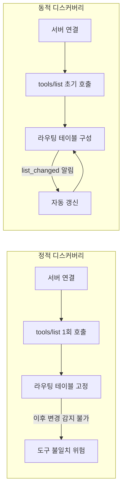
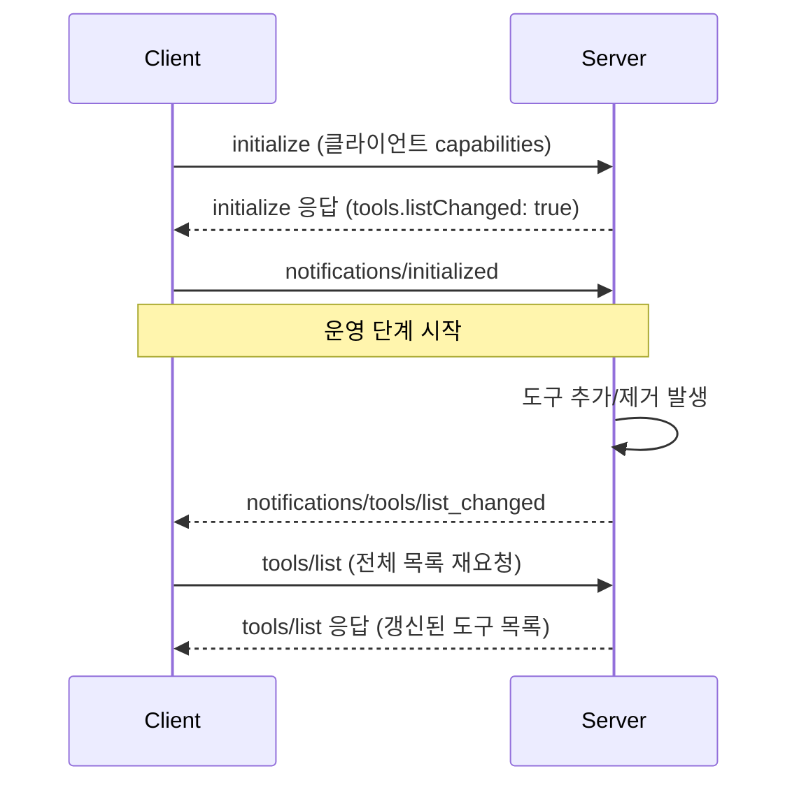
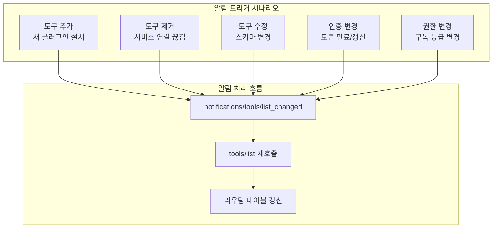
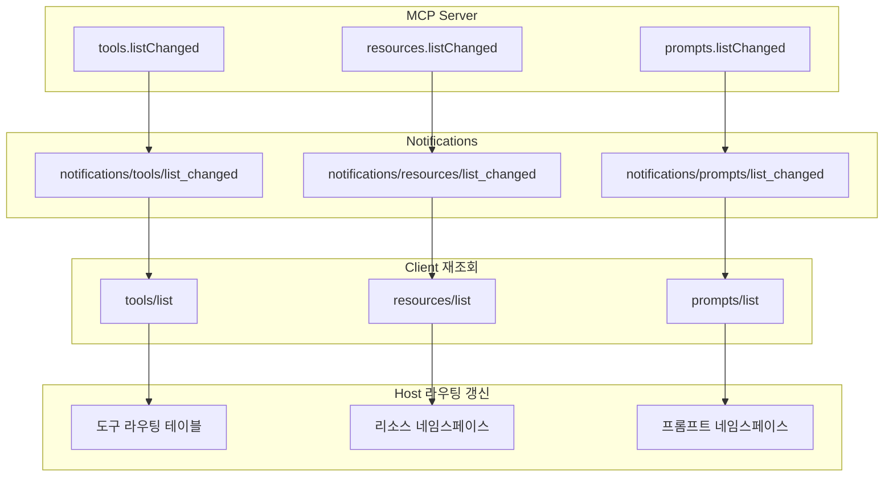
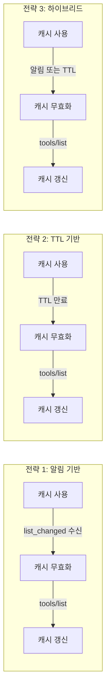
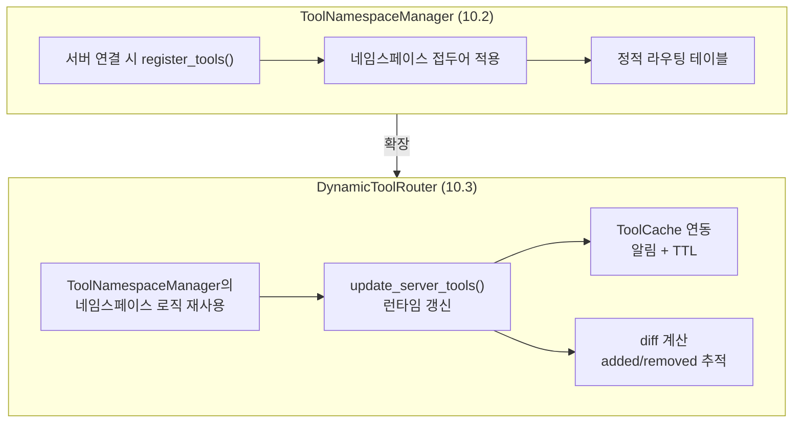
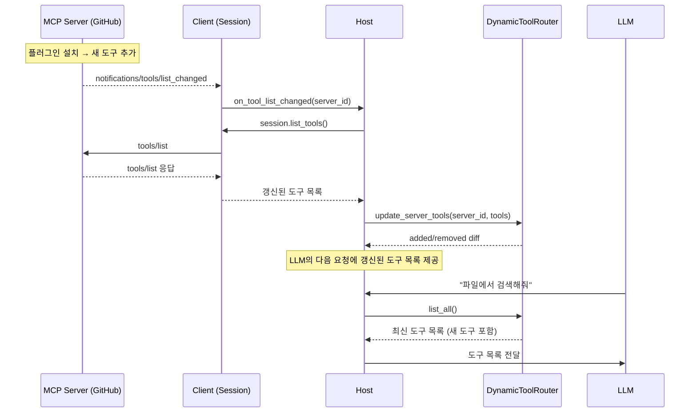
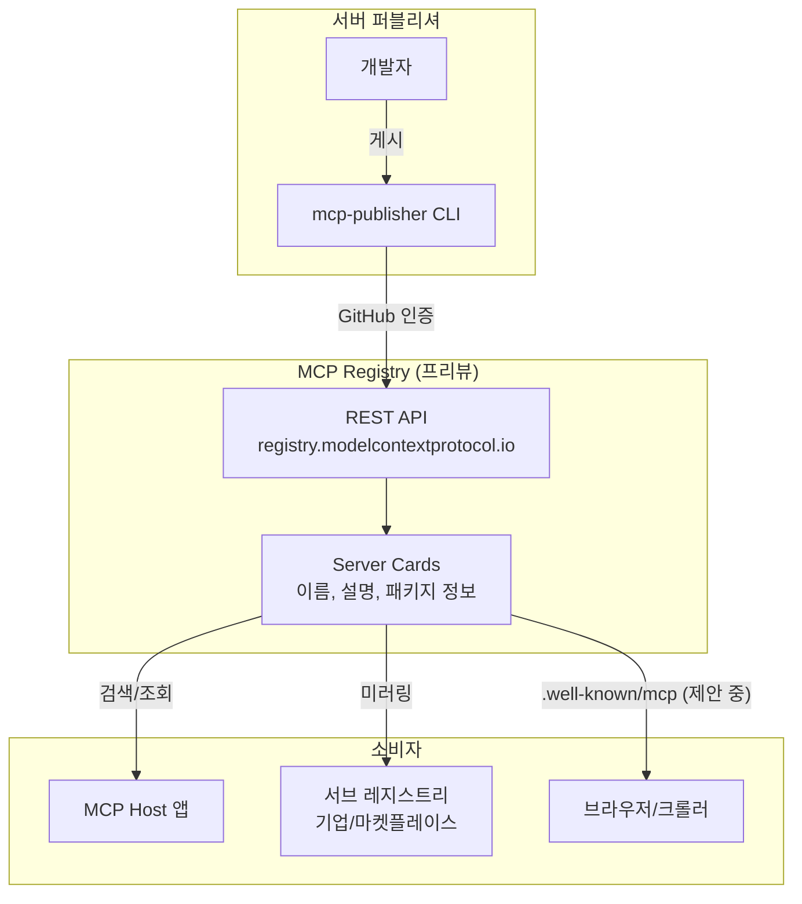

# 동적 도구 디스커버리

> MCP 서버가 런타임에 도구를 추가하거나 제거할 때, Host가 이를 자동으로 감지하고 라우팅 테이블을 갱신하는 동적 디스커버리 패턴을 배웁니다.

## 개요

이 섹션에서는 MCP의 `notifications/tools/list_changed` 알림 메커니즘을 중심으로, 서버가 런타임에 도구 목록을 변경할 때 클라이언트와 Host가 이를 감지하고 대응하는 전체 흐름을 다룹니다. 나아가, 동일한 알림 패턴이 리소스(`notifications/resources/list_changed`)와 프롬프트(`notifications/prompts/list_changed`)에도 적용되는 **통합 디스커버리 아키텍처**까지 살펴봅니다.

**선수 지식**: [Host 애플리케이션 설계](10-ch10-mcp-호스트와-멀티-서버-오케스트레이션/01-01-host-애플리케이션-설계.md)에서 다룬 MCPHost 구조와 도구 라우팅 테이블, [멀티 서버 연결과 관리](10-ch10-mcp-호스트와-멀티-서버-오케스트레이션/02-02-멀티-서버-연결과-관리.md)에서 배운 ToolNamespaceManager와 ManagedServer 패턴

**학습 목표**:
- `notifications/tools/list_changed` 알림의 동작 원리와 트리거 조건을 이해한다
- 서버의 `listChanged` Capability 선언과 클라이언트의 알림 구독 패턴을 구현할 수 있다
- 도구뿐 아니라 리소스·프롬프트의 `list_changed` 알림을 통합 처리하는 패턴을 이해한다
- 도구 메타데이터 캐싱과 알림 기반 무효화 전략을 설계할 수 있다
- DynamicToolRouter가 ToolNamespaceManager를 확장하는 구조를 이해한다
- MCP Registry의 개념과 현재 진행 상태를 파악한다

## 왜 알아야 할까?

지금까지 우리가 만든 Host는 시작할 때 한 번 `tools/list`를 호출하고, 그 결과를 라우팅 테이블에 등록한 뒤 끝이었습니다. 하지만 현실의 MCP 서버는 정적이지 않거든요.

생각해보세요. GitHub API 래핑 서버가 사용자의 OAuth 토큰이 만료되면 인증이 필요한 도구들을 숨겨야 할 수 있습니다. 데이터베이스 서버가 새 테이블이 추가되면 관련 쿼리 도구를 동적으로 생성할 수도 있죠. 플러그인 시스템이라면 사용자가 런타임에 플러그인을 설치하거나 제거할 때마다 도구 목록이 바뀝니다.

그리고 이건 도구만의 이야기가 아닙니다. 데이터베이스 서버가 새 테이블을 추가하면 **리소스**(테이블 스키마, 데이터 뷰)도 함께 바뀌고, 그 테이블에 맞는 **프롬프트 템플릿**(쿼리 생성 프롬프트)도 추가될 수 있습니다. MCP의 세 프리미티브 — 도구, 리소스, 프롬프트 — 는 서로 연동되어 변경되는 경우가 많거든요.

이런 상황에서 Host가 변경을 감지하지 못하면? LLM은 이미 사라진 도구를 호출하려다 에러를 만나거나, 새로 추가된 강력한 도구가 있는데도 그 존재를 모른 채 비효율적으로 동작하게 됩니다. 동적 디스커버리는 MCP 생태계가 **살아 있는 시스템**으로 동작하기 위한 핵심 메커니즘입니다.

> 📊 **그림 1**: 정적 디스커버리 vs 동적 디스커버리 — Host 관점 비교



## 핵심 개념

### 개념 1: `listChanged` Capability — "변경 알림 보내줄게"

> 💡 **비유**: 음식점의 메뉴판을 떠올려보세요. 어떤 식당은 메뉴가 고정되어 있고, 어떤 식당은 "오늘의 메뉴"가 수시로 바뀝니다. 바뀌는 식당이라면 입구에 "메뉴가 바뀌면 알려드립니다"라고 안내해야 손님이 매번 확인하지 않아도 되겠죠. MCP에서 `listChanged` Capability가 바로 이 안내문입니다.

MCP 세션이 시작되면 서버와 클라이언트는 `initialize` 핸드셰이크를 통해 서로의 Capability를 교환합니다. 이때 서버가 도구 목록 변경 알림을 보낼 수 있다면, `tools.listChanged: true`를 선언합니다.

> 📊 **그림 2**: Capability 협상과 도구 변경 알림 흐름



서버 측에서 `listChanged`를 선언하는 코드를 먼저 살펴보겠습니다.

```python
from mcp.server import Server
import mcp.types as types

server = Server("dynamic-tools-server")

# 동적 도구 저장소
_active_tools: list[types.Tool] = []

@server.list_tools()
async def list_tools() -> list[types.Tool]:
    """현재 활성화된 도구 목록을 반환"""
    return _active_tools  # 런타임에 변경 가능


async def add_tool_at_runtime(tool: types.Tool) -> None:
    """런타임에 도구를 추가하고 클라이언트에 알림"""
    _active_tools.append(tool)
    # 연결된 모든 클라이언트에 변경 알림 전송
    await server.request_context.session.send_notification(
        types.ServerNotification(
            method="notifications/tools/list_changed"
        )
    )
```

FastMCP를 사용하면 더 간단합니다. FastMCP는 도구를 동적으로 추가/제거할 때 `notifications/tools/list_changed`를 **자동으로** 전송합니다.

```python
from fastmcp import FastMCP

mcp = FastMCP("dynamic-server")

# 도구를 동적으로 추가하면 자동으로 알림 전송
mcp.add_tool(my_new_tool)

# 도구를 비활성화해도 자동으로 알림 전송
mcp.disable(keys={"tool:my_tool"})
```

> ⚠️ **흔한 오해**: "모든 MCP 서버가 도구 변경 알림을 보내줄 것이다"라고 가정하면 안 됩니다. `listChanged`를 선언하지 않은 서버는 알림을 **절대** 보내지 않습니다. 클라이언트는 반드시 서버의 Capability를 확인한 후에만 알림을 기대해야 합니다.

### 개념 2: `notifications/tools/list_changed` — 알림의 실체

> 💡 **비유**: 스마트폰의 앱 업데이트 알림과 비슷합니다. 앱스토어가 "업데이트가 있습니다"라고 알려주면, 여러분이 직접 스토어에 가서 무엇이 바뀌었는지 확인하죠. MCP의 도구 변경 알림도 마찬가지입니다 — "바뀌었으니 다시 물어봐"라는 신호만 보내고, 실제 변경 내용은 클라이언트가 `tools/list`를 호출해서 가져옵니다.

`notifications/tools/list_changed`는 JSON-RPC 2.0 Notification입니다. [JSON-RPC 메시지 포맷](02-ch2-mcp-아키텍처와-프로토콜-구조/04-04-json-rpc-20-메시지-포맷.md)에서 배운 것처럼, Notification은 `id`가 없고 응답을 기대하지 않는 단방향 메시지입니다.

```json
{
  "jsonrpc": "2.0",
  "method": "notifications/tools/list_changed"
}
```

놀랍도록 간단하죠? 파라미터도 없습니다. "뭐가 바뀌었는지"는 알려주지 않아요. 어떤 도구가 추가됐는지, 삭제됐는지, 수정됐는지 — 전부 클라이언트가 `tools/list`를 다시 호출해서 알아내야 합니다.

> 📊 **그림 3**: 도구 변경 알림이 발생하는 다양한 시나리오



왜 변경 내용(diff)을 보내지 않고 전체를 다시 가져오게 할까요? 이건 의도적인 설계 결정인데요, diff 기반은 순서 보장, 누락 처리, 상태 동기화 등 복잡성이 폭발적으로 늘어납니다. "전체 교체(full replace)" 방식은 단순하고, 도구 목록은 보통 수십~수백 개 수준이라 성능 부담도 적습니다.

클라이언트 측에서 알림을 처리하는 코드를 보겠습니다.

```python
import mcp.types as types
from mcp.client.session import ClientSession

class ToolChangeHandler:
    """도구 변경 알림을 처리하는 핸들러"""

    def __init__(self, session: ClientSession):
        self.session = session
        self.tools: dict[str, types.Tool] = {}

    async def on_tool_list_changed(self) -> dict[str, types.Tool]:
        """도구 목록 변경 시 호출되는 콜백"""
        # 1. 서버에 최신 도구 목록 요청
        result = await self.session.list_tools()

        # 2. 이전 목록과 비교 (로깅/디버깅용)
        old_names = set(self.tools.keys())
        new_names = {t.name for t in result.tools}

        added = new_names - old_names       # 새로 추가된 도구
        removed = old_names - new_names     # 제거된 도구
        unchanged = old_names & new_names   # 유지된 도구

        if added:
            print(f"[+] 추가된 도구: {added}")
        if removed:
            print(f"[-] 제거된 도구: {removed}")

        # 3. 캐시 교체 (전체 교체 전략)
        self.tools = {t.name: t for t in result.tools}
        return self.tools
```

```run:python
# 도구 변경 시나리오 시뮬레이션
old_tools = {"search", "create_issue", "list_repos"}
new_tools = {"search", "list_repos", "create_pr", "review_pr"}

added = new_tools - old_tools
removed = old_tools - new_tools

print(f"이전 도구: {sorted(old_tools)}")
print(f"현재 도구: {sorted(new_tools)}")
print(f"추가된 도구: {sorted(added)}")
print(f"제거된 도구: {sorted(removed)}")
```

```output
이전 도구: ['create_issue', 'list_repos', 'search']
현재 도구: ['create_pr', 'list_repos', 'review_pr', 'search']
추가된 도구: ['create_pr', 'review_pr']
제거된 도구: ['create_issue']
```

### 개념 3: 통합 디스커버리 — 도구·리소스·프롬프트의 `list_changed`

> 💡 **비유**: 도서관에는 책(리소스)만 있는 게 아닙니다. 도서관 사서에게 요청할 수 있는 서비스(도구)도 있고, 대출 신청서 양식(프롬프트)도 있죠. 새 분관이 개관하면 책 목록뿐 아니라 서비스와 양식도 바뀝니다. 도서관이 "목록이 바뀌었습니다"라는 안내를 보낼 때, 책·서비스·양식 **세 가지 각각에 대해** 별도로 알려주는 것이 MCP의 통합 디스커버리 패턴입니다.

앞서 `notifications/tools/list_changed`를 자세히 살펴봤는데, MCP 스펙은 이 동일한 패턴을 **세 프리미티브 모두에** 적용합니다. 멀티 서버 환경에서는 도구만 관리하면 되는 게 아니라, 각 서버가 노출하는 리소스와 프롬프트까지 통합 관리해야 하거든요.

> 📊 **그림 4**: MCP의 세 프리미티브별 `list_changed` 알림 패턴



세 알림의 구조와 처리 방식은 완전히 동일합니다. 차이는 **Capability 선언 위치**와 **재조회 메서드**뿐이에요.

| 프리미티브 | Capability | 알림 | 재조회 |
|-----------|-----------|------|--------|
| **도구** | `tools.listChanged: true` | `notifications/tools/list_changed` | `tools/list` |
| **리소스** | `resources.listChanged: true` | `notifications/resources/list_changed` | `resources/list` |
| **프롬프트** | `prompts.listChanged: true` | `notifications/prompts/list_changed` | `prompts/list` |

이 일관성이 왜 중요할까요? 멀티 서버 Host를 설계할 때, 하나의 알림 핸들링 패턴으로 세 프리미티브를 **모두** 커버할 수 있기 때문입니다. 데이터베이스 MCP 서버가 새 테이블을 추가하면 어떤 일이 벌어지는지 생각해보세요:

1. **도구 변경**: `query_new_table`, `insert_into_new_table` 도구가 추가됨
2. **리소스 변경**: `db://tables/new_table/schema` 리소스가 추가됨
3. **프롬프트 변경**: `generate_query_for_new_table` 프롬프트 템플릿이 추가됨

서버는 세 가지 `list_changed` 알림을 각각 전송하고, Host는 도구 라우팅 테이블뿐 아니라 리소스 네임스페이스와 프롬프트 네임스페이스까지 함께 갱신해야 합니다.

```python
# 통합 알림 핸들러 — 세 프리미티브를 일관된 패턴으로 처리
class UnifiedChangeHandler:
    """도구·리소스·프롬프트 변경 알림을 통합 처리

    각 프리미티브의 list_changed 알림이 동일한 패턴을 따르므로,
    하나의 핸들러로 세 가지를 모두 관리할 수 있습니다.
    """

    # 알림 method → (재조회 메서드, 네임스페이스 키)
    NOTIFICATION_MAP = {
        "notifications/tools/list_changed": ("list_tools", "tools"),
        "notifications/resources/list_changed": ("list_resources", "resources"),
        "notifications/prompts/list_changed": ("list_prompts", "prompts"),
    }

    def __init__(self):
        # 서버별, 프리미티브별 캐시
        self._cache: dict[str, dict[str, list]] = {}  # {server_id: {type: items}}

    async def handle_notification(
        self,
        server_id: str,
        method: str,
        session: "ClientSession",
    ) -> dict[str, list[str]] | None:
        """알림을 받으면 해당 프리미티브의 목록을 재조회

        Returns:
            {"added": [...], "removed": [...]} 또는 알 수 없는 알림이면 None
        """
        mapping = self.NOTIFICATION_MAP.get(method)
        if not mapping:
            return None

        list_method_name, primitive_type = mapping

        # 이전 캐시 가져오기
        server_cache = self._cache.setdefault(server_id, {})
        old_items = server_cache.get(primitive_type, [])
        old_names = {self._get_name(item) for item in old_items}

        # 재조회 — session의 해당 메서드 호출
        list_method = getattr(session, list_method_name)
        result = await list_method()

        # 결과에서 아이템 목록 추출
        new_items = self._extract_items(result, primitive_type)
        new_names = {self._get_name(item) for item in new_items}

        # 캐시 갱신
        server_cache[primitive_type] = new_items

        return {
            "added": sorted(new_names - old_names),
            "removed": sorted(old_names - new_names),
        }

    def _get_name(self, item) -> str:
        """프리미티브 아이템에서 이름/URI를 추출"""
        if hasattr(item, "uri"):    # Resource
            return str(item.uri)
        return item.name            # Tool, Prompt

    def _extract_items(self, result, primitive_type: str) -> list:
        """결과 객체에서 아이템 목록을 추출"""
        if primitive_type == "tools":
            return result.tools
        elif primitive_type == "resources":
            return result.resources
        elif primitive_type == "prompts":
            return result.prompts
        return []
```

> 🔥 **실무 팁**: 멀티 서버 환경에서 리소스의 네임스페이스 관리는 도구보다 까다롭습니다. 도구는 이름이 짧은 문자열이지만, 리소스는 URI(`db://tables/users`)를 사용하거든요. 서버 A와 서버 B가 같은 URI 스키마를 쓰면 충돌이 발생합니다. 서버 ID를 URI 접두어로 붙이거나(`serverA://db://tables/users`), 별도의 리소스 레지스트리를 운영하는 방식으로 해결해야 합니다.

### 개념 4: 도구 메타데이터 캐싱과 무효화

> 💡 **비유**: 도서관의 검색 카탈로그를 생각해보세요. 책이 입고/폐기될 때마다 전체 서가를 뒤지는 대신, 카탈로그를 갱신합니다. 하지만 카탈로그를 너무 자주 갱신하면 낭비이고, 너무 드물게 갱신하면 "이 책 없는데요?"라는 상황이 생깁니다. 핵심은 **"언제 카탈로그를 버리고 다시 만들 것인가"** — 즉 캐시 무효화 전략입니다.

도구 메타데이터(이름, 설명, 입력 스키마)는 한 번 가져오면 자주 바뀌지 않습니다. 매 요청마다 `tools/list`를 호출하는 건 비효율적이죠. 하지만 무한히 캐싱하면 변경을 놓칩니다. 이 균형을 맞추는 세 가지 전략이 있습니다.

> 📊 **그림 5**: 세 가지 캐시 무효화 전략 비교



| 전략 | 적용 상황 | 장점 | 단점 |
|------|-----------|------|------|
| **알림 기반** | `listChanged: true` 서버 | 실시간, 정확 | 서버 지원 필요 |
| **TTL 기반** | `listChanged` 미지원 서버 | 범용적 | 지연 발생, 불필요한 폴링 |
| **하이브리드** | 프로덕션 환경 | 모든 서버 대응 | 구현 복잡도 ↑ |

```python
import time
import asyncio
from dataclasses import dataclass, field
from mcp.client.session import ClientSession
import mcp.types as types


@dataclass
class ToolCache:
    """알림 + TTL 하이브리드 캐시

    listChanged를 지원하는 서버에는 알림 기반으로 동작하고,
    미지원 서버에는 TTL 만료 시 자동으로 재검증합니다.
    """

    tools: dict[str, types.Tool] = field(default_factory=dict)
    last_updated: float = 0.0
    ttl_seconds: float = 300.0  # 5분 기본 TTL
    _invalidated: bool = False

    @property
    def is_stale(self) -> bool:
        """TTL 만료 또는 알림에 의해 무효화되었는지 확인"""
        if self._invalidated:
            return True
        if not self.tools:
            return True
        return (time.time() - self.last_updated) > self.ttl_seconds

    def invalidate(self) -> None:
        """알림 수신 시 즉시 무효화 — 다음 조회에서 재로드 트리거"""
        self._invalidated = True

    async def refresh(self, session: ClientSession) -> dict[str, types.Tool]:
        """캐시가 stale이면 서버에서 다시 가져오기"""
        if not self.is_stale:
            return self.tools

        result = await session.list_tools()
        self.tools = {t.name: t for t in result.tools}
        self.last_updated = time.time()
        self._invalidated = False
        return self.tools

    def update(self, tools: list[types.Tool]) -> None:
        """외부에서 도구 목록을 직접 갱신 (refresh 없이)"""
        self.tools = {t.name: t for t in tools}
        self.last_updated = time.time()
        self._invalidated = False
```

핵심 원칙을 기억하세요: **도구 정의(스키마)는 적극 캐싱하되, 도구 호출(`tools/call`) 결과는 절대 캐싱하지 않습니다.** 도구 호출은 부수 효과(side effect)를 가질 수 있기 때문입니다 — 같은 입력이라도 매번 다른 결과를 낼 수 있거든요.

### 개념 5: DynamicToolRouter — ToolNamespaceManager의 동적 확장

> 💡 **비유**: 공항의 출발 안내 게시판을 생각해보세요. 항공사(서버)가 노선(도구)을 추가하거나 취소하면, 공항(Host)은 게시판(라우팅 테이블)을 즉시 갱신해야 합니다. 승객(LLM)이 취소된 노선 티켓을 사려고 하면 안 되니까요.

[멀티 서버 연결과 관리](10-ch10-mcp-호스트와-멀티-서버-오케스트레이션/02-02-멀티-서버-연결과-관리.md)에서 만든 `ToolNamespaceManager`를 기억하시나요? 도구 이름 충돌을 접두어로 해결하는 매니저였습니다. 그런데 `ToolNamespaceManager`는 서버 연결 시점에 한 번 도구를 등록하고 끝이었죠 — **정적 라우팅 테이블**이었습니다.

`DynamicToolRouter`는 이 `ToolNamespaceManager`에 **알림 기반 동적 갱신 기능을 추가한 확장판**입니다. 핵심 차이를 정리하면:

| 기능 | ToolNamespaceManager (10.2) | DynamicToolRouter (10.3) |
|------|---------------------------|-------------------------|
| 네임스페이스 접두어 | O | O (내부적으로 동일 로직 사용) |
| 충돌 감지/해결 | O | O |
| 런타임 도구 갱신 | X — 초기 등록 후 고정 | O — `update_server_tools()`로 언제든 갱신 |
| 캐시 무효화 | 해당 없음 | 알림 + TTL 하이브리드 |
| diff 추적 | X | O — 추가/제거된 도구 목록 반환 |
| 동시성 안전 | 단일 스레드 가정 | `asyncio.Lock`으로 보호 |

> 📊 **그림 6**: ToolNamespaceManager에서 DynamicToolRouter로의 진화



즉, `DynamicToolRouter`는 `ToolNamespaceManager`를 **대체하는 것이 아니라, 그 네임스페이스 관리 로직 위에 동적 갱신 레이어를 추가한 것**입니다. 기존의 접두어 기반 충돌 해결은 그대로 유지하면서, 서버의 `list_changed` 알림에 반응하여 특정 서버의 도구만 선택적으로 교체할 수 있습니다.

```python
import asyncio
import logging
from dataclasses import dataclass, field

logger = logging.getLogger(__name__)


@dataclass
class ToolEntry:
    """라우팅 테이블의 도구 항목"""
    name: str               # 네임스페이스 적용된 이름
    original_name: str       # 서버 원본 이름
    server_id: str           # 소속 서버 ID
    description: str = ""
    input_schema: dict = field(default_factory=dict)


class DynamicToolRouter:
    """동적 도구 라우팅 — ToolNamespaceManager + 알림 기반 자동 갱신

    ToolNamespaceManager(10.2)의 네임스페이스 접두어 로직을
    그대로 사용하면서, 런타임 도구 변경을 지원합니다.
    핵심 추가 기능:
    - update_server_tools(): 특정 서버의 도구만 선택적 교체
    - diff 추적: 추가/제거된 도구 목록 반환
    - asyncio.Lock: 동시 갱신 시 경합 방지
    """

    def __init__(self):
        self._tools: dict[str, ToolEntry] = {}     # name → ToolEntry
        self._server_tools: dict[str, set[str]] = {}  # server_id → {tool_names}
        self._lock = asyncio.Lock()

    def _apply_namespace(self, server_id: str, tool_name: str) -> str:
        """네임스페이스 접두어 적용 — ToolNamespaceManager와 동일한 로직

        다른 서버와 이름이 충돌하면 'server_id__tool_name' 형태로 변환.
        충돌이 없으면 원본 이름 그대로 사용.
        """
        # 다른 서버에 같은 이름의 도구가 있는지 확인
        existing = self._tools.get(tool_name)
        if existing and existing.server_id != server_id:
            return f"{server_id}__{tool_name}"
        return tool_name

    async def update_server_tools(
        self,
        server_id: str,
        tools: list,  # list[types.Tool]
    ) -> dict[str, list[str]]:
        """특정 서버의 도구 목록을 갱신하고 변경 사항을 반환

        ToolNamespaceManager의 register_tools()와 달리,
        이미 등록된 도구를 제거한 후 새 목록으로 교체합니다.
        """
        async with self._lock:
            # 이전 도구 제거
            old_names = self._server_tools.get(server_id, set())
            for name in old_names:
                self._tools.pop(name, None)

            # 새 도구 등록 (접두어 적용 — ToolNamespaceManager 로직 재사용)
            new_names: set[str] = set()
            for tool in tools:
                final_name = self._apply_namespace(server_id, tool.name)

                self._tools[final_name] = ToolEntry(
                    name=final_name,
                    original_name=tool.name,
                    server_id=server_id,
                    description=tool.description or "",
                    input_schema=tool.inputSchema if hasattr(tool, 'inputSchema') else {},
                )
                new_names.add(final_name)

            self._server_tools[server_id] = new_names

            # diff 계산 — 정적 매니저에는 없던 기능
            added = list(new_names - old_names)
            removed = list(old_names - new_names)
            return {"added": added, "removed": removed}

    def resolve(self, tool_name: str) -> ToolEntry | None:
        """도구 이름으로 라우팅 정보 조회"""
        return self._tools.get(tool_name)

    def list_all(self) -> list[ToolEntry]:
        """전체 도구 목록 반환 (LLM에 제공)"""
        return list(self._tools.values())

    def remove_server(self, server_id: str) -> list[str]:
        """서버 연결 해제 시 해당 서버의 모든 도구 제거"""
        removed = list(self._server_tools.get(server_id, set()))
        for name in removed:
            self._tools.pop(name, None)
        self._server_tools.pop(server_id, None)
        return removed
```

이 라우터를 Host에 통합하면, 알림이 올 때마다 해당 서버의 도구만 갱신하고 나머지는 그대로 유지합니다. 전체를 다시 빌드하는 것보다 훨씬 효율적이죠.

> 📊 **그림 7**: Host의 동적 라우팅 테이블 갱신 흐름



### 개념 6: MCP Registry — 서버 디스커버리의 미래 (제안 단계)

> 💡 **비유**: 도구 변경 알림이 "앱 업데이트 알림"이라면, MCP Registry는 "앱스토어" 그 자체입니다. 어떤 MCP 서버가 세상에 존재하는지, 무슨 기능을 제공하는지, 어떻게 설치하는지를 한곳에서 찾을 수 있는 중앙 카탈로그입니다.

> ⚠️ **중요**: MCP Registry와 Server Cards는 **아직 공식 MCP 스펙(2025-11-25)에 포함되지 않은 기능**입니다. 현재 MCP 커뮤니티에서 SEP(Specification Enhancement Proposal)로 논의 중이며, 프리뷰 단계의 별도 프로젝트로 운영되고 있습니다. 아래 내용은 이 제안의 방향성을 소개하는 것이지, 현재 확정된 스펙이 아닙니다.

MCP Registry는 2025년 9월에 **프리뷰로 공개된 실험적 프로젝트**로, 공개 MCP 서버 카탈로그를 목표로 합니다. Anthropic, GitHub, Block, Microsoft 등이 참여하는 커뮤니티 거버넌스로 운영되고 있으며, API v0.1이 2025년 10월에 동결(freeze)되었지만, 이는 핵심 MCP 프로토콜 스펙과는 **별개의 이니셔티브**입니다.

> 📊 **그림 8**: MCP Registry 생태계 구조 (제안 단계)



Registry API는 간단합니다. `GET /v0/servers`로 서버 목록을 조회하고, `search` 파라미터로 검색합니다. 다만 v0 접두어가 보여주듯, 아직 안정 API가 아니며 향후 변경될 수 있습니다.

```run:python
# MCP Registry API 응답 구조 시뮬레이션 (프리뷰 기준)
import json

server_card = {
    "server": {
        "name": "io.github.user/weather-server",
        "description": "실시간 날씨 데이터를 제공하는 MCP 서버",
        "repository": {
            "url": "https://github.com/user/weather-mcp",
            "source": "github"
        },
        "version": "1.2.0",
        "packages": [
            {"registry": "npm", "name": "weather-mcp-server"},
            {"registry": "pypi", "name": "weather-mcp"}
        ]
    },
    "_meta": {
        "status": "active",
        "publishedAt": "2025-10-15T09:00:00Z",
        "isLatest": True
    }
}

print(json.dumps(server_card, indent=2, ensure_ascii=False))
```

```output
{
  "server": {
    "name": "io.github.user/weather-server",
    "description": "실시간 날씨 데이터를 제공하는 MCP 서버",
    "repository": {
      "url": "https://github.com/user/weather-mcp",
      "source": "github"
    },
    "version": "1.2.0",
    "packages": [
      {"registry": "npm", "name": "weather-mcp-server"},
      {"registry": "pypi", "name": "weather-mcp"}
    ]
  },
  "_meta": {
    "status": "active",
    "publishedAt": "2025-10-15T09:00:00Z",
    "isLatest": true
  }
}
```

Registry의 핵심 개념 중 하나는 **Server Cards**입니다. 향후 서버들이 `/.well-known/mcp` 엔드포인트를 노출하면, Host가 URL만으로도 서버의 기능을 사전에 파악하고 연결 여부를 결정할 수 있다는 아이디어입니다. 하지만 이것은 **현재 SEP(Specification Enhancement Proposal)로 논의 중인 제안**이며, MCP 공식 스펙에 채택될지, 어떤 형태로 채택될지는 아직 확정되지 않았습니다. 만약 채택된다면, MCP 생태계의 디스커버리를 근본적으로 바꿀 수 있는 메커니즘이 될 것입니다.

현재 확정된 MCP 스펙(2025-11-25)에서 **공식적으로 지원하는 디스커버리 메커니즘**은 이 섹션의 앞부분에서 다룬 `notifications/tools/list_changed`와 `tools/list`뿐입니다. Registry와 Server Cards는 그 위에 구축될 **에코시스템 레이어**로 이해하는 것이 정확합니다.

## 실습: 직접 해보기

동적 도구 디스커버리가 동작하는 완전한 예제를 구현합니다. 서버는 런타임에 도구를 추가/제거하고, Host는 알림을 받아 라우팅 테이블을 자동 갱신합니다. 나아가, 리소스와 프롬프트 알림까지 통합 처리하는 패턴도 함께 구현합니다.

### 1단계: 동적 도구를 가진 MCP 서버

```python
# dynamic_tools_server.py
"""런타임에 도구가 변경되는 MCP 서버"""

from fastmcp import FastMCP, Context

mcp = FastMCP("dynamic-tools-demo")

# ── 기본 도구 (항상 활성) ────────────────────
@mcp.tool()
def ping() -> str:
    """서버 상태를 확인합니다"""
    return "pong"


@mcp.tool()
def list_plugins() -> list[str]:
    """현재 활성화된 플러그인 목록을 반환합니다"""
    # 동적으로 등록된 도구 중 'plugin_' 접두어를 가진 것 조회
    all_tools = [t.name for t in mcp._tool_manager.tools.values()]
    return [t for t in all_tools if t.startswith("plugin_")]


# ── 플러그인 관리 도구 ────────────────────────
@mcp.tool()
async def install_plugin(
    ctx: Context,
    plugin_name: str,
) -> str:
    """플러그인을 설치합니다. 새 도구가 동적으로 추가됩니다.

    Args:
        plugin_name: 설치할 플러그인 이름 (예: "translator", "summarizer")
    """
    # 플러그인별 도구 정의
    plugin_tools = {
        "translator": _create_translator_tool,
        "summarizer": _create_summarizer_tool,
        "calculator": _create_calculator_tool,
    }

    if plugin_name not in plugin_tools:
        return f"알 수 없는 플러그인: {plugin_name}. " \
               f"사용 가능: {list(plugin_tools.keys())}"

    # 도구를 동적으로 추가 → FastMCP가 자동으로 list_changed 알림 전송
    create_fn = plugin_tools[plugin_name]
    create_fn(mcp)

    return f"플러그인 '{plugin_name}' 설치 완료. 새 도구가 추가되었습니다."


@mcp.tool()
async def uninstall_plugin(
    ctx: Context,
    plugin_name: str,
) -> str:
    """플러그인을 제거합니다. 관련 도구가 제거됩니다.

    Args:
        plugin_name: 제거할 플러그인 이름
    """
    tool_name = f"plugin_{plugin_name}"
    try:
        # 도구 제거 → FastMCP가 자동으로 list_changed 알림 전송
        mcp._tool_manager.remove_tool(tool_name)
        return f"플러그인 '{plugin_name}' 제거 완료."
    except KeyError:
        return f"설치되지 않은 플러그인: {plugin_name}"


# ── 플러그인 도구 팩토리 ─────────────────────
def _create_translator_tool(server: FastMCP):
    @server.tool(name="plugin_translator")
    def plugin_translator(text: str, target_lang: str = "en") -> str:
        """텍스트를 번역합니다"""
        return f"[번역됨 → {target_lang}] {text}"


def _create_summarizer_tool(server: FastMCP):
    @server.tool(name="plugin_summarizer")
    def plugin_summarizer(text: str, max_length: int = 100) -> str:
        """텍스트를 요약합니다"""
        return f"[요약] {text[:max_length]}..."


def _create_calculator_tool(server: FastMCP):
    @server.tool(name="plugin_calculator")
    def plugin_calculator(expression: str) -> str:
        """수학 표현식을 계산합니다"""
        # 안전한 계산만 허용
        allowed = set("0123456789+-*/.(). ")
        if not all(c in allowed for c in expression):
            return "허용되지 않는 문자가 포함되어 있습니다"
        try:
            result = eval(expression, {"__builtins__": {}})
            return str(result)
        except Exception as e:
            return f"계산 오류: {e}"


if __name__ == "__main__":
    mcp.run(transport="stdio")
```

### 2단계: 통합 디스커버리를 지원하는 Host

```python
# dynamic_host.py
"""도구·리소스·프롬프트 변경 알림을 통합 처리하는 Host 애플리케이션"""

import asyncio
import logging
import time
from dataclasses import dataclass, field
from contextlib import AsyncExitStack

from mcp import ClientSession, StdioServerParameters
from mcp.client.stdio import stdio_client
import mcp.types as types

logging.basicConfig(level=logging.INFO)
logger = logging.getLogger("dynamic-host")


# ── 캐시 & 라우터 (앞서 정의한 ToolCache, DynamicToolRouter 사용) ──


@dataclass
class ServerCapabilities:
    """서버의 listChanged 지원 여부를 프리미티브별로 추적"""
    tools_list_changed: bool = False
    resources_list_changed: bool = False
    prompts_list_changed: bool = False


@dataclass
class ManagedServer:
    """관리 대상 서버"""
    server_id: str
    session: ClientSession
    cache: ToolCache = field(default_factory=ToolCache)
    capabilities: ServerCapabilities = field(
        default_factory=ServerCapabilities
    )
    # 리소스와 프롬프트 캐시도 함께 관리
    resources: list = field(default_factory=list)
    prompts: list = field(default_factory=list)


class DynamicDiscoveryHost:
    """도구·리소스·프롬프트의 동적 디스커버리를 통합 지원하는 MCP Host

    DynamicToolRouter를 통해 도구 라우팅을 관리하며,
    리소스와 프롬프트의 list_changed 알림도 함께 처리합니다.
    """

    # 알림 method → (처리 메서드 이름, 프리미티브 타입)
    _NOTIFICATION_HANDLERS = {
        "notifications/tools/list_changed": "_on_tools_changed",
        "notifications/resources/list_changed": "_on_resources_changed",
        "notifications/prompts/list_changed": "_on_prompts_changed",
    }

    def __init__(self):
        self._servers: dict[str, ManagedServer] = {}
        self._router = DynamicToolRouter()  # ToolNamespaceManager 확장판
        self._lock = asyncio.Lock()
        self._exit_stack = AsyncExitStack()

    async def connect_server(
        self,
        server_id: str,
        command: str,
        args: list[str] | None = None,
    ) -> ManagedServer:
        """서버에 연결하고 세 프리미티브의 Capability를 확인"""
        params = StdioServerParameters(
            command=command,
            args=args or [],
        )

        # stdio 연결 설정
        read_stream, write_stream = await self._exit_stack.enter_async_context(
            stdio_client(params)
        )
        session = await self._exit_stack.enter_async_context(
            ClientSession(read_stream, write_stream)
        )

        # 초기화 — Capability 교환
        init_result = await session.initialize()

        # 세 프리미티브의 listChanged 지원 여부를 각각 확인
        caps = ServerCapabilities()
        if init_result.capabilities:
            if init_result.capabilities.tools:
                caps.tools_list_changed = getattr(
                    init_result.capabilities.tools, "listChanged", False
                ) or False
            if init_result.capabilities.resources:
                caps.resources_list_changed = getattr(
                    init_result.capabilities.resources, "listChanged", False
                ) or False
            if init_result.capabilities.prompts:
                caps.prompts_list_changed = getattr(
                    init_result.capabilities.prompts, "listChanged", False
                ) or False

        managed = ManagedServer(
            server_id=server_id,
            session=session,
            capabilities=caps,
        )
        self._servers[server_id] = managed

        logger.info(
            f"[{server_id}] 연결 완료 — listChanged 지원: "
            f"tools={caps.tools_list_changed}, "
            f"resources={caps.resources_list_changed}, "
            f"prompts={caps.prompts_list_changed}"
        )

        # 초기 목록 로드 — 도구는 필수, 리소스/프롬프트는 지원 시
        await self._refresh_tools(managed)
        if init_result.capabilities and init_result.capabilities.resources:
            await self._refresh_resources(managed)
        if init_result.capabilities and init_result.capabilities.prompts:
            await self._refresh_prompts(managed)

        # listChanged 지원 프리미티브가 하나라도 있으면 알림 감시 시작
        if any([
            caps.tools_list_changed,
            caps.resources_list_changed,
            caps.prompts_list_changed,
        ]):
            asyncio.create_task(
                self._watch_notifications(managed),
                name=f"watch-{server_id}",
            )

        return managed

    async def _refresh_tools(self, managed: ManagedServer):
        """서버의 도구 목록을 가져와 캐시와 라우터를 갱신"""
        result = await managed.session.list_tools()

        # DynamicToolRouter가 네임스페이스 + diff 처리를 모두 담당
        diff = await self._router.update_server_tools(
            managed.server_id, result.tools
        )
        managed.cache.update(result.tools)

        logger.info(
            f"[{managed.server_id}] 도구 갱신: "
            f"{len(result.tools)}개 활성 "
            f"(+{len(diff['added'])} -{len(diff['removed'])})"
        )

    async def _refresh_resources(self, managed: ManagedServer):
        """서버의 리소스 목록을 갱신"""
        result = await managed.session.list_resources()
        old_uris = {str(r.uri) for r in managed.resources}
        new_uris = {str(r.uri) for r in result.resources}
        managed.resources = result.resources

        added = new_uris - old_uris
        removed = old_uris - new_uris
        logger.info(
            f"[{managed.server_id}] 리소스 갱신: "
            f"{len(result.resources)}개 활성 "
            f"(+{len(added)} -{len(removed)})"
        )

    async def _refresh_prompts(self, managed: ManagedServer):
        """서버의 프롬프트 목록을 갱신"""
        result = await managed.session.list_prompts()
        old_names = {p.name for p in managed.prompts}
        new_names = {p.name for p in result.prompts}
        managed.prompts = result.prompts

        added = new_names - old_names
        removed = old_names - new_names
        logger.info(
            f"[{managed.server_id}] 프롬프트 갱신: "
            f"{len(result.prompts)}개 활성 "
            f"(+{len(added)} -{len(removed)})"
        )

    async def _on_tools_changed(self, managed: ManagedServer):
        """도구 변경 알림 처리"""
        managed.cache.invalidate()
        await self._refresh_tools(managed)

    async def _on_resources_changed(self, managed: ManagedServer):
        """리소스 변경 알림 처리"""
        await self._refresh_resources(managed)

    async def _on_prompts_changed(self, managed: ManagedServer):
        """프롬프트 변경 알림 처리"""
        await self._refresh_prompts(managed)

    async def _watch_notifications(self, managed: ManagedServer):
        """서버의 알림을 감시 — 도구/리소스/프롬프트 통합 처리"""
        logger.info(
            f"[{managed.server_id}] 알림 감시 시작 (통합)"
        )
        try:
            async for message in managed.session.incoming_messages:
                if isinstance(message, Exception):
                    logger.error(f"알림 수신 오류: {message}")
                    continue

                notification = getattr(message, "root", message)
                if not hasattr(notification, "method"):
                    continue

                method = notification.method
                handler_name = self._NOTIFICATION_HANDLERS.get(method)
                if handler_name:
                    logger.info(
                        f"[{managed.server_id}] "
                        f"변경 알림 수신: {method}"
                    )
                    handler = getattr(self, handler_name)
                    await handler(managed)

        except asyncio.CancelledError:
            logger.info(
                f"[{managed.server_id}] 알림 감시 종료"
            )
        except Exception as e:
            logger.error(
                f"[{managed.server_id}] 알림 처리 오류: {e}"
            )

    async def call_tool(
        self,
        tool_name: str,
        arguments: dict,
    ) -> types.CallToolResult:
        """도구를 호출 — DynamicToolRouter에서 서버를 찾아 전달"""
        entry = self._router.resolve(tool_name)
        if not entry:
            available = [t.name for t in self._router.list_all()]
            raise ValueError(
                f"알 수 없는 도구: {tool_name}. "
                f"사용 가능: {available}"
            )

        managed = self._servers[entry.server_id]

        # 캐시가 stale이면 먼저 갱신
        if managed.cache.is_stale:
            await self._refresh_tools(managed)
            if not self._router.resolve(tool_name):
                raise ValueError(
                    f"도구 '{tool_name}'이(가) 더 이상 존재하지 않습니다"
                )

        return await managed.session.call_tool(
            entry.original_name,  # 서버에는 원본 이름으로 호출
            arguments,
        )

    def get_available_tools(self) -> list[dict]:
        """LLM에 제공할 도구 목록 — DynamicToolRouter에서 가져옴"""
        return [
            {
                "name": entry.name,
                "description": entry.description,
                "server": entry.server_id,
                "input_schema": entry.input_schema,
            }
            for entry in self._router.list_all()
        ]

    def get_available_resources(self) -> list[dict]:
        """LLM에 제공할 리소스 목록 — 전체 서버에서 수집"""
        resources = []
        for server_id, managed in self._servers.items():
            for r in managed.resources:
                resources.append({
                    "uri": str(r.uri),
                    "name": r.name,
                    "server": server_id,
                })
        return resources

    def get_available_prompts(self) -> list[dict]:
        """LLM에 제공할 프롬프트 목록 — 전체 서버에서 수집"""
        prompts = []
        for server_id, managed in self._servers.items():
            for p in managed.prompts:
                prompts.append({
                    "name": p.name,
                    "description": p.description or "",
                    "server": server_id,
                })
        return prompts


# ── 사용 예시 ────────────────────────────────
async def main():
    host = DynamicDiscoveryHost()

    async with host._exit_stack:
        # 동적 도구 서버 연결
        await host.connect_server(
            "plugins",
            "python",
            ["dynamic_tools_server.py"],
        )

        # 초기 도구 확인
        tools = host.get_available_tools()
        print(f"\n초기 도구 수: {len(tools)}")
        for t in tools:
            print(f"  - {t['name']}: {t['description']}")

        # 플러그인 설치 (도구 동적 추가 트리거)
        result = await host.call_tool(
            "install_plugin",
            {"plugin_name": "translator"},
        )
        print(f"\n설치 결과: {result.content[0].text}")

        # 알림 처리 대기
        await asyncio.sleep(1)

        # 갱신된 도구 확인
        tools = host.get_available_tools()
        print(f"\n갱신 후 도구 수: {len(tools)}")
        for t in tools:
            print(f"  - {t['name']}: {t['description']}")


if __name__ == "__main__":
    asyncio.run(main())
```

이 코드를 실행하면 `install_plugin("translator")`를 호출한 후, 서버가 `notifications/tools/list_changed`를 보내고, Host가 이를 감지하여 `plugin_translator` 도구가 자동으로 라우팅 테이블에 추가되는 것을 확인할 수 있습니다. 리소스나 프롬프트 변경이 발생하면 동일한 `_watch_notifications` 루프에서 해당 핸들러가 호출됩니다.

## 더 깊이 알아보기

### 디스커버리의 역사 — USB에서 MCP까지

동적 디스커버리는 새로운 개념이 아닙니다. USB의 "Plug and Play"가 바로 디스커버리의 원조인데요. 1996년 USB 1.0이 등장하기 전에는 프린터를 연결하려면 PC를 끄고, 병렬 포트에 케이블을 꽂고, 드라이버를 수동 설치하고, 재부팅해야 했습니다. USB는 이 과정을 "꽂으면 자동 인식"으로 바꿨죠.

MCP의 동적 도구 디스커버리도 같은 철학입니다. [MCP: AI의 USB-C](01-ch1-mcp의-탄생과-설계-철학/02-02-mcp-ai의-usb-c.md)에서 배운 비유가 여기서 완성됩니다. USB가 "장치를 꽂으면 OS가 드라이버를 자동 로드"하듯, MCP는 "서버에 도구가 추가되면 Host가 자동 인식"합니다.

MCP Registry의 탄생도 비슷한 흐름을 따릅니다. USB에 USB-IF(USB Implementers Forum)라는 표준 관리 조직이 있듯, MCP에도 Registry 워킹 그룹이 만들어졌습니다. 2025년 9월 첫 프리뷰가 공개되었고, 여러 기업이 참여하여 MCP 서버의 카탈로그를 만들고 있습니다. 다만 이는 아직 **핵심 MCP 스펙 외부의 커뮤니티 프로젝트**이며, 공식 스펙에 통합될지 여부는 향후 SEP 프로세스를 통해 결정됩니다.

### `list_changed` 알림과 멀티 서버 네임스페이스 충돌

세 프리미티브의 `list_changed`가 멀티 서버 환경에서 동시에 발생하면 흥미로운 문제가 생깁니다. 서버 A의 리소스 `db://users`와 서버 B의 리소스 `db://users`가 충돌할 수 있고, 서버 A의 프롬프트 `generate_report`와 서버 B의 프롬프트 `generate_report`도 충돌할 수 있거든요.

도구의 경우 `DynamicToolRouter`의 `_apply_namespace()`가 접두어로 충돌을 해결하지만, 리소스는 URI 기반이라 단순 접두어로는 부족합니다. 프로덕션 Host라면 리소스 URI에 서버 ID를 스키마로 추가하거나(`server-a+db://users`), 프롬프트에도 도구와 동일한 네임스페이스 접두어 전략을 적용하는 것이 안전합니다.

## 흔한 오해와 팁

> ⚠️ **흔한 오해**: "도구 변경 알림에 diff(변경 내역)가 포함된다"고 생각하기 쉬운데, 실제로는 **아무 파라미터도 없는 빈 알림**입니다. 클라이언트가 `tools/list`를 다시 호출해서 전체 목록을 가져와야 합니다. 이전 캐시와 비교하여 diff를 구하는 건 클라이언트의 몫입니다. 이는 `resources/list_changed`와 `prompts/list_changed`도 마찬가지입니다.

> ⚠️ **흔한 오해**: "MCP Registry가 이미 MCP 공식 스펙의 일부다"라고 오해하기 쉬운데, Registry와 Server Cards는 **MCP 프로토콜 스펙(2025-11-25)과는 별개의 커뮤니티 프로젝트**입니다. 현재 API v0.1 프리뷰 상태이며, 핵심 프로토콜에 포함되려면 SEP 프로세스를 거쳐야 합니다. 프로덕션 코드에서 Registry API에 의존할 때는 이 불확실성을 감안하세요.

> ⚠️ **흔한 오해**: "도구만 동적으로 바뀌고, 리소스와 프롬프트는 정적이다"라고 생각하기 쉬운데, MCP 스펙은 세 프리미티브 모두에 `listChanged` Capability를 정의하고 있습니다. 실제로 데이터베이스 MCP 서버가 테이블을 추가하면 도구·리소스·프롬프트가 **동시에** 변경될 수 있으며, Host는 세 가지 알림을 모두 처리할 준비가 되어 있어야 합니다.

> 💡 **알고 계셨나요?**: MCP Registry는 처음부터 "중앙 집중형"만을 목표로 하지 않습니다. **서브 레지스트리** 개념을 지원하여, 기업이 자체 프라이빗 레지스트리를 운영하거나 특정 플랫폼(VS Code Marketplace 등)이 MCP 서버를 큐레이션할 수 있도록 설계되었습니다.

> 🔥 **실무 팁**: `listChanged`를 지원하지 않는 레거시 서버와 함께 쓸 때는, TTL 기반 폴링을 폴백으로 두되 TTL을 너무 짧게 잡지 마세요. 30초 이하로 설정하면 서버에 불필요한 부하가 걸립니다. 도구 목록이 자주 바뀌지 않는 서버라면 5분(300초)이 적당하고, 필요할 때 수동 무효화(`cache.invalidate()`)를 호출하는 것이 더 효과적입니다.

## 핵심 정리

| 개념 | 설명 |
|------|------|
| `tools.listChanged` Capability | 서버가 초기화 시 선언. `true`면 도구 변경 알림을 보내겠다는 약속 |
| `notifications/tools/list_changed` | 파라미터 없는 JSON-RPC Notification. "목록이 바뀌었으니 다시 물어봐" 신호 |
| `notifications/resources/list_changed` | 리소스 목록 변경 알림. 도구와 동일한 패턴으로 `resources/list` 재호출 트리거 |
| `notifications/prompts/list_changed` | 프롬프트 목록 변경 알림. 도구와 동일한 패턴으로 `prompts/list` 재호출 트리거 |
| 통합 디스커버리 | 도구·리소스·프롬프트 세 프리미티브의 `list_changed`를 일관된 패턴으로 처리하는 아키텍처 |
| 전체 교체 전략 | diff 대신 `tools/list` 전체를 다시 가져오는 방식. 단순하고 안정적 |
| ToolCache | 알림 + TTL 하이브리드 캐시. 알림 수신 시 즉시 무효화, TTL 만료 시 자동 갱신 |
| DynamicToolRouter | ToolNamespaceManager의 네임스페이스 로직 + 런타임 갱신 + diff 추적을 결합한 확장판 |
| ToolNamespaceManager → DynamicToolRouter | 10.2의 정적 매니저에 동적 갱신 기능을 추가한 관계. 대체가 아닌 확장 |
| MCP Registry (프리뷰) | 공개 MCP 서버 카탈로그. **공식 스펙 외부** 커뮤니티 프로젝트, API v0.1 동결 |
| Server Cards (제안 중) | 서버 메타데이터 표준 포맷. `/.well-known/mcp` 디스커버리는 SEP로 논의 중 |

## 다음 섹션 미리보기

도구를 동적으로 발견하는 방법을 배웠으니, 다음은 발견한 도구를 **어떤 서버로 보내고, LLM과 어떻게 연결할 것인가**의 문제입니다. [도구 라우팅과 LLM 통합](10-ch10-mcp-호스트와-멀티-서버-오케스트레이션/04-04-도구-라우팅과-llm-통합.md)에서는 LLM의 function calling과 MCP 도구를 연결하는 에이전트 루프, 도구 선택 전략(이름 매칭, 의미 기반 라우팅), 그리고 여러 서버의 도구를 LLM에 효율적으로 제공하는 패턴을 다룹니다.

## 참고 자료

- [MCP Specification — Tools (listChanged)](https://modelcontextprotocol.io/specification/2025-11-25/server/tools) - MCP 공식 스펙의 도구 프리미티브 정의. `listChanged` Capability와 `notifications/tools/list_changed` 알림의 정확한 동작을 확인할 수 있습니다.
- [MCP Specification — Resources (listChanged)](https://modelcontextprotocol.io/specification/2025-11-25/server/resources) - 리소스 프리미티브의 `listChanged` Capability와 `notifications/resources/list_changed` 알림 스펙. 도구와 동일한 패턴이 리소스에 어떻게 적용되는지 확인하세요.
- [MCP Specification — Prompts (listChanged)](https://modelcontextprotocol.io/specification/2025-11-25/server/prompts) - 프롬프트 프리미티브의 `listChanged` 지원. 세 프리미티브의 일관된 디스커버리 패턴을 비교할 수 있습니다.
- [Introducing the MCP Registry](https://blog.modelcontextprotocol.io/posts/2025-09-08-mcp-registry-preview/) - MCP Registry 프리뷰 공식 발표. 거버넌스 구조, API 설계, Server Cards 개념을 소개합니다. 아직 프리뷰 단계임에 유의하세요.
- [Dynamic Tool Discovery — Azure AI Agent Service + MCP](https://techcommunity.microsoft.com/blog/azure-ai-foundry-blog/dynamic-tool-discovery-azure-ai-agent-service--mcp-server-integration/4412651) - Microsoft의 Azure AI Agent Service에서 MCP 도구를 동적으로 발견하고 등록하는 패턴을 설명합니다.
- [Spring AI — Dynamic Tool Updates with MCP](https://spring.io/blog/2025/05/04/spring-ai-dynamic-tool-updates-with-mcp/) - Spring AI 프레임워크의 이벤트 기반 도구 갱신 패턴. `McpToolsChangedEvent`와 캐시 무효화 구현을 참고할 수 있습니다.
- [MCP Session Lifecycle — Capability Negotiation](https://modelcontextprotocol.io/specification/2025-11-25/basic/lifecycle) - 세션 초기화 시 Capability 교환의 전체 흐름. `listChanged`가 어느 시점에 합의되는지 확인할 수 있습니다.
- [FastMCP — Tools Documentation](https://gofastmcp.com/servers/tools) - FastMCP에서 도구를 동적으로 추가/제거/비활성화하는 API와 자동 알림 메커니즘을 설명합니다.

---
### 🔗 Related Sessions
- [mcphost 클래스](10-ch10-mcp-호스트와-멀티-서버-오케스트레이션/01-01-host-애플리케이션-설계.md) (prerequisite)
- [toolnamespacemanager](10-ch10-mcp-호스트와-멀티-서버-오케스트레이션/02-02-멀티-서버-연결과-관리.md) (prerequisite)
- [managedserver](10-ch10-mcp-호스트와-멀티-서버-오케스트레이션/02-02-멀티-서버-연결과-관리.md) (prerequisite)
- [serverstatus](10-ch10-mcp-호스트와-멀티-서버-오케스트레이션/02-02-멀티-서버-연결과-관리.md) (prerequisite)
- [toolentry](10-ch10-mcp-호스트와-멀티-서버-오케스트레이션/02-02-멀티-서버-연결과-관리.md) (prerequisite)
- [도구 라우팅 테이블](10-ch10-mcp-호스트와-멀티-서버-오케스트레이션/02-02-멀티-서버-연결과-관리.md) (prerequisite)
- [capability negotiation](02-ch2-mcp-아키텍처와-프로토콜-구조/05-05-세션-라이프사이클과-capability-negotiation.md) (prerequisite)
