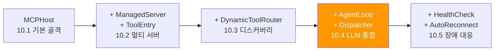
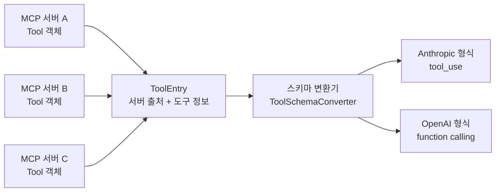
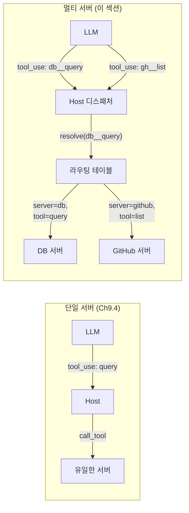
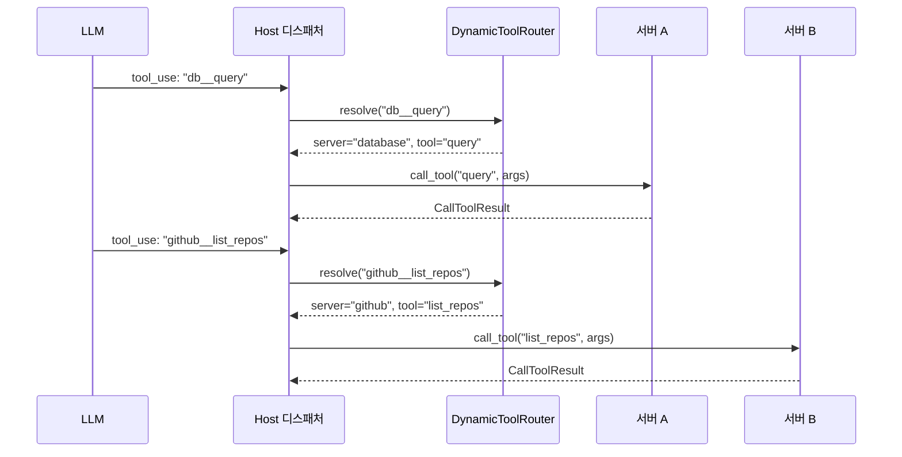
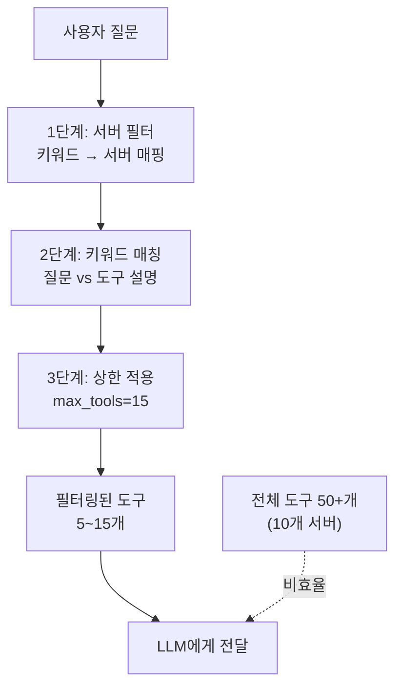
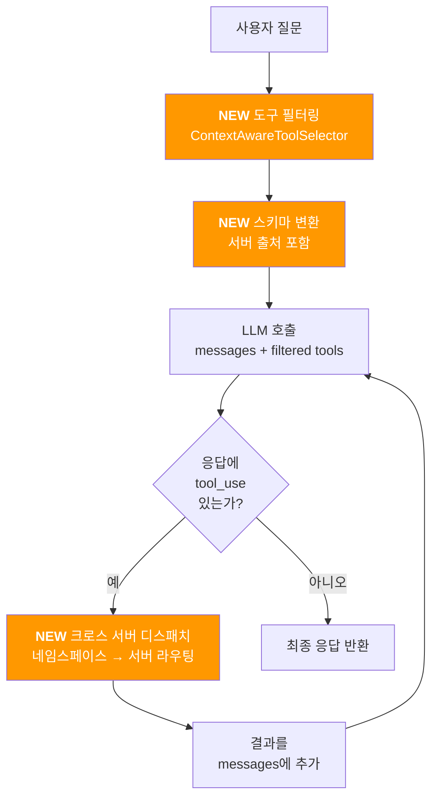
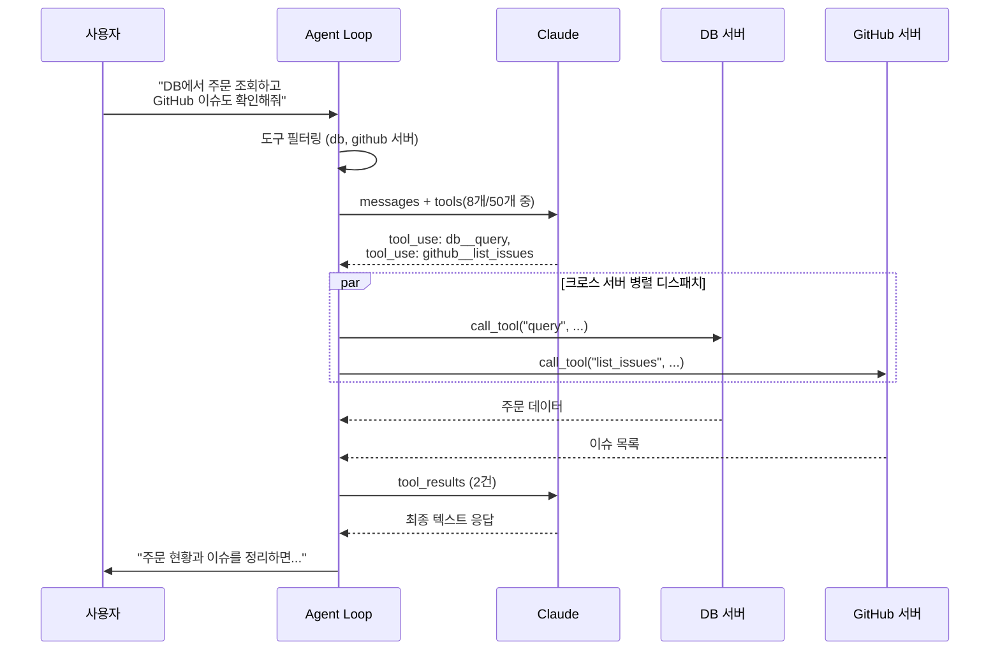

# 도구 라우팅과 LLM 통합

> 멀티 서버 환경에서 LLM이 올바른 도구를 선택하고, Host가 올바른 서버로 라우팅하는 전체 흐름을 구현합니다.

## 개요

이 섹션에서는 [Host 애플리케이션 설계](10-ch10-mcp-호스트와-멀티-서버-오케스트레이션/01-01-host-애플리케이션-설계.md)에서 만든 MCPHost, [멀티 서버 연결과 관리](10-ch10-mcp-호스트와-멀티-서버-오케스트레이션/02-02-멀티-서버-연결과-관리.md)의 ManagedServer와 ToolEntry, [동적 도구 디스커버리](10-ch10-mcp-호스트와-멀티-서버-오케스트레이션/03-03-동적-도구-디스커버리.md)의 DynamicToolRouter를 결합하여, LLM과 멀티 서버를 연결하는 **에이전트 루프**를 완성합니다.

> 💡 **챕터 내 클래스 진화 가이드**: Ch10 전체에서 Host 관련 클래스가 여러 번 등장하는데, 이들은 별개의 클래스가 아니라 **하나의 Host를 점진적으로 확장하는 과정**입니다. MCPHost(10.1, 기본 골격) → ManagedServer/ToolEntry 추가(10.2, 멀티 서버 관리) → DynamicToolRouter 추가(10.3, 동적 디스커버리) → **이 섹션에서 에이전트 루프 통합**(10.4) → 장애 대응 추가(10.5)로 이어지는 컴포지션 패턴입니다. 각 섹션에서 새로 만드는 컴포넌트(ToolDispatcher, ToolFilter 등)는 Host의 **내부 모듈**로 조립되며, 최종 `MultiServerHostAgent`는 이전 섹션들의 모든 컴포넌트를 조합한 완성형입니다.



**선수 지식**:
- [MCP 클라이언트 에이전트 루프](09-ch09-mcp-클라이언트-개발/04-04-에이전트-루프-구현.md)에서 배운 단일 서버 에이전트 루프 패턴
- 10.1~10.3에서 구현한 MCPHost, ManagedServer, ToolEntry, DynamicToolRouter
- LLM의 function calling / tool_use 메커니즘 기본 이해

**학습 목표**:
- 멀티 서버의 도구를 LLM이 이해하는 형식으로 변환할 수 있다
- 도구 호출 결과를 올바른 서버로 라우팅하는 디스패처를 구현할 수 있다
- 컨텍스트 기반 도구 필터링으로 LLM의 선택 정확도를 높일 수 있다
- 단일 서버 에이전트 루프를 멀티 서버로 확장할 수 있다

## 왜 알아야 할까?

[에이전트 루프 구현](09-ch09-mcp-클라이언트-개발/04-04-에이전트-루프-구현.md)에서 우리는 단일 MCP 서버와 LLM을 연결하는 에이전트 루프를 만들었습니다. 서버 1개에 도구 5개라면 그 패턴으로 충분하죠. 하지만 MCP 서버를 3개 연결하면 도구가 20개, 10개 연결하면 100개가 넘어갑니다. 이때 세 가지 새로운 문제가 생깁니다:

1. **라우팅 문제**: LLM이 `query`라는 도구를 호출했는데, 이게 DB 서버의 `query`인지 검색 서버의 `query`인지 어떻게 알죠?
2. **선택 폭발 문제**: 100개 도구를 LLM에게 한꺼번에 던져주면 토큰을 낭비하고, 엉뚱한 도구를 호출하고, 응답 속도는 느려집니다.
3. **병렬 디스패치 문제**: LLM이 한 턴에 DB 도구와 GitHub 도구를 동시에 호출하면, 각각 다른 서버로 동시에 전달해야 합니다.

실제로 2024년 발표된 연구(*"Less is More: Optimizing Function Calling for LLM Execution on Edge Devices"*, [arXiv:2411.15399](https://arxiv.org/abs/2411.15399))에 따르면, 도구 수가 늘어날수록 LLM의 도구 선택 정확도는 급격히 떨어집니다. 반대로, 관련 도구만 사전 필터링해주면 정확도가 93.8%까지 올라가면서 실행 시간은 80%까지 줄었습니다. "Less is More"인 거죠.

이 섹션에서는 단일 서버 에이전트 루프를 멀티 서버로 확장하면서, **스키마 변환**(도구 형식 통일), **도구 필터링**(관련 도구만 선택), **크로스 서버 디스패치**(올바른 서버로 라우팅)라는 멀티 서버 고유의 세 가지 과제를 해결합니다.

## 핵심 개념

### 개념 1: 도구 스키마 변환 — MCP에서 LLM으로

> 💡 **비유**: 해외 취업 박람회를 생각해보세요. 각 나라(MCP 서버)에서 온 구직자(도구)의 이력서는 모두 다른 형식이에요. 채용 담당자(LLM)가 효율적으로 검토하려면, 모든 이력서를 하나의 표준 양식으로 변환해야 합니다. Host는 바로 이 "이력서 변환 담당"입니다.

MCP의 도구 스키마(`Tool` 객체)와 LLM API가 기대하는 도구 스키마는 형식이 다릅니다. 단일 서버 환경에서는 이 변환이 단순했지만, 멀티 서버에서는 **서버 출처 정보를 보존**해야 한다는 점이 다릅니다. [멀티 서버 연결과 관리](10-ch10-mcp-호스트와-멀티-서버-오케스트레이션/02-02-멀티-서버-연결과-관리.md)에서 만든 ToolEntry에 이미 서버 출처가 포함되어 있으므로, 이를 활용합니다.

> 📊 **그림 1**: MCP 도구 스키마에서 LLM 도구 형식으로의 변환 흐름



```python
from dataclasses import dataclass
from typing import Any


@dataclass
class ToolEntry:
    """10.2에서 정의한 도구 엔트리 (서버 출처 포함)"""
    name: str                # 네임스페이스 적용된 이름 (예: "db__query")
    original_name: str       # 원래 도구 이름 (예: "query")
    server_name: str         # 출처 서버 (예: "database")
    description: str         # 도구 설명
    input_schema: dict       # JSON Schema


class ToolSchemaConverter:
    """MCP ToolEntry를 LLM 프로바이더별 형식으로 변환
    
    Host의 내부 모듈로, 10.2의 ToolEntry를 각 LLM API가 
    기대하는 도구 스키마로 변환합니다.
    """
    
    @staticmethod
    def to_anthropic(entries: list[ToolEntry]) -> list[dict]:
        """Anthropic Claude API 형식으로 변환
        
        Anthropic의 tool_use 형식:
        - name: 도구 이름 (네임스페이스 포함)
        - description: 설명 (서버 출처 접두어 포함)
        - input_schema: JSON Schema 그대로 전달
        """
        return [
            {
                "name": entry.name,
                "description": (
                    f"[{entry.server_name}] {entry.description}"
                ),
                "input_schema": entry.input_schema,
            }
            for entry in entries
        ]
    
    @staticmethod
    def to_openai(entries: list[ToolEntry]) -> list[dict]:
        """OpenAI API 형식으로 변환
        
        OpenAI의 function calling 형식:
        - type: "function" 고정
        - function.name: 도구 이름
        - function.description: 설명
        - function.parameters: JSON Schema
        """
        return [
            {
                "type": "function",
                "function": {
                    "name": entry.name,
                    "description": (
                        f"[{entry.server_name}] {entry.description}"
                    ),
                    "parameters": entry.input_schema,
                },
            }
            for entry in entries
        ]
    
    @staticmethod
    def to_generic(entries: list[ToolEntry]) -> list[dict]:
        """프로바이더 무관한 범용 형식 (커스텀 LLM용)
        
        자체 호스팅 모델이나 다른 프로바이더를 사용할 때
        이 형식을 기반으로 변환합니다.
        """
        return [
            {
                "name": entry.name,
                "description": (
                    f"[{entry.server_name}] {entry.description}"
                ),
                "parameters": entry.input_schema,
                "metadata": {
                    "server": entry.server_name,
                    "original_name": entry.original_name,
                },
            }
            for entry in entries
        ]
```

여기서 핵심 포인트가 있습니다. `description`에 `[서버명]`을 접두어로 붙인 것이 보이시나요? 단일 서버 에이전트에서는 불필요했지만, 멀티 서버에서는 LLM이 "이 도구가 어느 서버에서 온 건지" 파악하는 데 결정적 역할을 합니다. 같은 이름의 도구가 여러 서버에 존재할 수 있기 때문이죠.

> 🔥 **실무 팁**: description에 서버 출처를 표기할 때, 서버의 역할을 명시하세요. `[database]`보다 `[PostgreSQL 주문 DB]`처럼 구체적으로 쓰면 LLM의 도구 선택 정확도가 올라갑니다.

### 개념 2: 크로스 서버 도구 디스패처 — 라우팅의 핵심

> 💡 **비유**: 음식 배달 앱을 떠올려보세요. 고객(LLM)이 "짜장면 1개, 초밥 2개"를 주문하면, 앱(Host)은 짜장면은 중국집으로, 초밥은 일식집으로 각각 라우팅해야 합니다. 하나의 주문을 여러 식당으로 분배하는 거죠. 도구 디스패처가 바로 이 역할입니다.

[에이전트 루프 구현](09-ch09-mcp-클라이언트-개발/04-04-에이전트-루프-구현.md)에서는 도구 호출 결과를 보낼 서버가 하나뿐이었습니다. 하지만 멀티 서버 환경에서는 **도구 이름에서 서버를 역추적**하는 라우팅이 필요합니다. [동적 도구 디스커버리](10-ch10-mcp-호스트와-멀티-서버-오케스트레이션/03-03-동적-도구-디스커버리.md)에서 만든 DynamicToolRouter의 라우팅 테이블을 활용하면 됩니다.

> 📊 **그림 2**: 단일 서버 vs 멀티 서버 도구 디스패치 비교



> 📊 **그림 3**: 멀티 서버 디스패치의 상세 시퀀스



```python
import asyncio
from dataclasses import dataclass
from enum import Enum


class ServerStatus(Enum):
    """10.2에서 정의한 서버 상태"""
    CONNECTING = "connecting"
    CONNECTED = "connected"
    DISCONNECTED = "disconnected"
    ERROR = "error"


@dataclass
class DispatchResult:
    """도구 호출 결과"""
    tool_name: str          # 호출된 도구 (네임스페이스 포함)
    content: list[dict]     # 결과 콘텐츠
    is_error: bool = False  # 에러 여부


class ToolDispatcher:
    """LLM의 도구 호출을 올바른 서버로 라우팅
    
    단일 서버에서는 불필요했던 컴포넌트입니다.
    멀티 서버에서만 의미를 가지며, 10.3의 DynamicToolRouter를
    라우팅 테이블로 사용하고, 10.2의 ManagedServer를 통해
    실제 서버에 호출을 전달합니다.
    """
    
    def __init__(
        self,
        router: "DynamicToolRouter",   # 10.3에서 구현
        servers: dict[str, "ManagedServer"],  # 10.2에서 구현
    ):
        self.router = router      # 도구→서버 매핑 테이블
        self.servers = servers    # 서버명→ManagedServer
    
    async def dispatch(
        self, tool_name: str, arguments: dict
    ) -> DispatchResult:
        """단일 도구 호출을 올바른 서버로 디스패치"""
        # 1. 라우팅 테이블에서 서버 찾기
        entry = self.router.resolve(tool_name)
        if entry is None:
            return DispatchResult(
                tool_name=tool_name,
                content=[{"type": "text", "text": f"Unknown tool: {tool_name}"}],
                is_error=True,
            )
        
        # 2. 서버 상태 확인
        server = self.servers.get(entry.server_name)
        if server is None or server.status != ServerStatus.CONNECTED:
            return DispatchResult(
                tool_name=tool_name,
                content=[{"type": "text", "text": f"Server '{entry.server_name}' unavailable"}],
                is_error=True,
            )
        
        # 3. 원래 도구 이름으로 서버에 호출
        try:
            result = await asyncio.wait_for(
                server.session.call_tool(entry.original_name, arguments),
                timeout=30.0,  # 타임아웃 설정
            )
            return DispatchResult(
                tool_name=tool_name,
                content=[
                    {"type": c.type, "text": getattr(c, "text", str(c))}
                    for c in result.content
                ],
                is_error=result.isError or False,
            )
        except asyncio.TimeoutError:
            return DispatchResult(
                tool_name=tool_name,
                content=[{"type": "text", "text": "Tool call timed out (30s)"}],
                is_error=True,
            )
        except Exception as e:
            return DispatchResult(
                tool_name=tool_name,
                content=[{"type": "text", "text": f"Dispatch error: {e}"}],
                is_error=True,
            )
    
    async def dispatch_parallel(
        self, calls: list[tuple[str, dict]]
    ) -> list[DispatchResult]:
        """여러 도구 호출을 병렬로 디스패치 — 멀티 서버의 핵심 이점
        
        LLM이 한 턴에 서로 다른 서버의 도구를 동시에 호출할 때,
        각 서버에 동시에 요청을 보내 응답 시간을 최소화합니다.
        단일 서버에서는 의미가 없지만, 멀티 서버에서는 
        서버 간 독립성 덕분에 진정한 병렬 실행이 가능합니다.
        """
        tasks = [
            self.dispatch(name, args) for name, args in calls
        ]
        return await asyncio.gather(*tasks)
```

`dispatch_parallel`은 멀티 서버에서만 빛을 발하는 기능입니다. Anthropic Claude는 한 응답에서 여러 `tool_use` 블록을 반환할 수 있는데, 각각 **다른 서버**의 도구를 호출할 수 있거든요. 단일 서버에서는 같은 프로세스에 순차적으로 보내야 하지만, 멀티 서버에서는 각 서버가 독립 프로세스이므로 `asyncio.gather`로 진정한 병렬 실행이 가능합니다.

핵심은 `entry.original_name` 사용입니다. LLM은 네임스페이스가 적용된 이름(`db__query`)을 보지만, 실제 서버 호출 시에는 원래 이름(`query`)을 써야 합니다. 이 변환을 ToolEntry가 담당하죠.

### 개념 3: 컨텍스트 기반 도구 필터링 — "Less is More"

> 💡 **비유**: 뷔페 레스토랑에서 100가지 메뉴를 한꺼번에 보면 뭘 먹을지 결정하기 어렵죠. 하지만 웨이터가 "오늘 신선한 해산물은 이 3가지입니다"라고 추천해주면 선택이 쉬워집니다. 도구 필터링은 LLM에게 "지금 이 질문에 관련된 도구만 보여주는" 웨이터 역할을 합니다.

도구 필터링은 멀티 서버 환경에서만 의미 있는 문제입니다. 단일 서버에 도구가 5개라면 전부 넘겨도 문제없지만, 서버 10개에서 수집한 100개 도구는 이야기가 다릅니다. 앞서 언급한 *"Less is More"* 논문(UC Merced, 2024)의 핵심 실험 결과를 보면, 도구를 사전 필터링했을 때 정확도 93.8%, 실행 시간 80% 감소를 달성했습니다. 멀티 서버 환경에서는 이 전략이 선택이 아니라 필수입니다.

> 📊 **그림 4**: 도구 필터링 전략 3단계



```python
import re
from typing import Optional


class ToolFilter:
    """컨텍스트 기반 도구 필터링
    
    멀티 서버 환경의 핵심 컴포넌트입니다.
    10.3의 DynamicToolRouter가 '어떤 서버에 어떤 도구가 있는지'를
    관리한다면, ToolFilter는 '지금 이 질문에 어떤 도구가 관련 있는지'를
    판단합니다. 단일 서버에서는 도구 수가 적어 불필요하지만,
    서버 수가 늘어나면 LLM 정확도에 직접적 영향을 미칩니다.
    """
    
    def __init__(self, all_tools: list[ToolEntry]):
        self.all_tools = all_tools
        # 서버별 도구 인덱스 — 멀티 서버에서 서버 단위 필터링의 기반
        self._by_server: dict[str, list[ToolEntry]] = {}
        for tool in all_tools:
            self._by_server.setdefault(tool.server_name, []).append(tool)
    
    def filter_by_servers(
        self, server_names: list[str]
    ) -> list[ToolEntry]:
        """특정 서버의 도구만 선택 (가장 빠른 필터)
        
        멀티 서버 고유 기능: 질문이 특정 도메인에 속하면
        해당 서버의 도구만 골라내 검색 범위를 대폭 축소합니다.
        """
        result = []
        for name in server_names:
            result.extend(self._by_server.get(name, []))
        return result
    
    def filter_by_keywords(
        self,
        query: str,
        candidates: Optional[list[ToolEntry]] = None,
        min_score: int = 1,
    ) -> list[ToolEntry]:
        """키워드 매칭 기반 필터링"""
        targets = candidates or self.all_tools
        # 쿼리에서 키워드 추출 (간단한 토큰화)
        keywords = set(re.findall(r'\w+', query.lower()))
        
        scored: list[tuple[int, ToolEntry]] = []
        for tool in targets:
            searchable = f"{tool.name} {tool.description}".lower()
            score = sum(1 for kw in keywords if kw in searchable)
            if score >= min_score:
                scored.append((score, tool))
        
        # 점수 내림차순 정렬
        scored.sort(key=lambda x: x[0], reverse=True)
        return [entry for _, entry in scored]
    
    def filter_by_allowlist(
        self,
        allowed: list[str],
    ) -> list[ToolEntry]:
        """명시적 허용 목록 기반 필터 (보안용)"""
        allowed_set = set(allowed)
        return [t for t in self.all_tools if t.name in allowed_set]


class ContextAwareToolSelector:
    """질문 분석 → 관련 도구만 선택하는 지능형 셀렉터
    
    Host의 에이전트 루프에서 LLM 호출 직전에 사용됩니다.
    멀티 서버에서 핵심적인 역할로, 서버 힌트(카테고리) + 
    키워드 매칭의 2단계 필터링으로 관련 도구만 추려냅니다.
    """
    
    def __init__(
        self,
        tool_filter: ToolFilter,
        server_hints: Optional[dict[str, list[str]]] = None,
    ):
        self.tool_filter = tool_filter
        # 키워드 → 서버 매핑 힌트 (멀티 서버 라우팅의 1단계)
        # 예: {"데이터베이스": ["db"], "파일": ["filesystem"]}
        self.server_hints = server_hints or {}
    
    def select(
        self,
        query: str,
        max_tools: int = 15,
    ) -> list[ToolEntry]:
        """사용자 질문에 관련된 도구만 선택"""
        # 1단계: 서버 힌트로 후보 축소
        matched_servers: list[str] = []
        query_lower = query.lower()
        for keyword, servers in self.server_hints.items():
            if keyword in query_lower:
                matched_servers.extend(servers)
        
        if matched_servers:
            candidates = self.tool_filter.filter_by_servers(
                list(set(matched_servers))
            )
        else:
            candidates = self.tool_filter.all_tools
        
        # 2단계: 키워드 매칭으로 순위화
        filtered = self.tool_filter.filter_by_keywords(
            query, candidates, min_score=1
        )
        
        # 3단계: 상한 적용
        if filtered:
            return filtered[:max_tools]
        
        # 매칭되는 도구가 없으면 후보군 전체 반환
        return candidates[:max_tools]
```

> ⚠️ **흔한 오해**: "LLM은 똑똑하니까 도구를 많이 줘도 알아서 잘 고르겠지"라고 생각하기 쉽습니다. 하지만 실제로는 도구가 20개를 넘어가면 선택 정확도가 급격히 떨어집니다. 특히 비슷한 이름의 도구가 여러 서버에 있을 때(예: `db__search`와 `docs__search`) 혼동이 잦아지거든요.

### 개념 4: 멀티 서버 에이전트 루프 — 단일 서버에서의 확장

> 💡 **비유**: 단일 서버 에이전트가 **개인 비서**라면, 멀티 서버 에이전트는 **프로젝트 매니저**입니다. 개인 비서는 자기 책상의 도구만 쓰지만, 프로젝트 매니저는 각 부서(서버)의 전문가(도구)에게 일을 분배하고 결과를 취합하죠. 루프의 기본 구조는 같지만, "누구에게 시킬 것인가"를 결정하는 레이어가 추가됩니다.

[에이전트 루프 구현](09-ch09-mcp-클라이언트-개발/04-04-에이전트-루프-구현.md)에서 단일 서버 에이전트 루프의 기본 패턴(질문 → LLM 호출 → tool_use 확인 → 도구 실행 → 결과 피드백 → 반복)을 이미 배웠습니다. 이 패턴 자체는 동일한데요, 멀티 서버로 확장할 때 **세 곳**이 달라집니다:

> 📊 **그림 5**: 멀티 서버 에이전트 루프 — 단일 서버와의 차이점



| 단계 | 단일 서버 (Ch9.4) | 멀티 서버 (이 섹션) |
|------|-------------------|---------------------|
| **도구 준비** | 서버 1개의 도구 전부 전달 | ContextAwareToolSelector로 관련 도구만 필터링 |
| **스키마 변환** | 단순 변환 | 서버 출처(`[서버명]`) 포함한 변환 |
| **도구 디스패치** | 유일한 서버에 직접 `call_tool` | 네임스페이스로 서버 식별 → 해당 서버로 라우팅 |
| **병렬 실행** | 같은 서버라 제한적 | 서로 다른 서버의 도구를 `asyncio.gather`로 병렬 |

아래 `MultiServerAgentLoop`는 이 세 가지 확장을 적용한 것입니다. Ch9.4의 기본 루프 구조를 알고 있다면, **추가된 부분만 주목**하세요:

```python
import anthropic
from typing import AsyncIterator


class MultiServerAgentLoop:
    """멀티 서버 에이전트 루프 — Ch9.4 에이전트 루프의 멀티 서버 확장
    
    기본 루프 패턴(질문 → LLM → tool_use → 실행 → 피드백)은 
    Ch9.4와 동일합니다. 멀티 서버에서 추가되는 것은:
    1. 도구 필터링 (selector) — 관련 서버/도구만 선택
    2. 서버 출처 포함 스키마 변환 (converter)
    3. 크로스 서버 디스패치 (dispatcher) — 네임스페이스 → 서버 라우팅
    
    컴포지션 패턴: Host가 이 루프를 내부 모듈로 소유합니다.
    """
    
    def __init__(
        self,
        llm_client: anthropic.AsyncAnthropic,
        dispatcher: ToolDispatcher,
        tool_selector: ContextAwareToolSelector,
        converter: ToolSchemaConverter,
        model: str = "claude-sonnet-4-20250514",
        max_turns: int = 10,
    ):
        self.llm = llm_client
        self.dispatcher = dispatcher    # 멀티 서버 확장: 크로스 서버 라우팅
        self.selector = tool_selector   # 멀티 서버 확장: 도구 필터링
        self.converter = converter      # 멀티 서버 확장: 출처 포함 변환
        self.model = model
        self.max_turns = max_turns
    
    async def run(
        self,
        query: str,
        system_prompt: str = "You are a helpful assistant with access to multiple tools.",
    ) -> str:
        """에이전트 루프 실행 — 최종 텍스트 응답 반환"""
        
        # [멀티 서버 확장 1] 질문에 맞는 도구만 선택
        relevant_tools = self.selector.select(query, max_tools=15)
        llm_tools = self.converter.to_anthropic(relevant_tools)
        
        messages: list[dict] = [
            {"role": "user", "content": query}
        ]
        
        # 기본 루프 구조는 Ch9.4와 동일
        for turn in range(self.max_turns):
            response = await self.llm.messages.create(
                model=self.model,
                max_tokens=4096,
                system=system_prompt,
                tools=llm_tools,
                messages=messages,
            )
            
            if response.stop_reason != "tool_use":
                return self._extract_text(response)
            
            tool_calls = [
                block for block in response.content
                if block.type == "tool_use"
            ]
            
            messages.append({
                "role": "assistant",
                "content": [
                    self._block_to_dict(b) for b in response.content
                ],
            })
            
            # [멀티 서버 확장 2] 크로스 서버 병렬 디스패치
            # Ch9.4에서는 단일 서버에 순차 호출했지만,
            # 여기서는 각 도구를 해당 서버로 동시에 라우팅합니다
            dispatch_tasks = [
                (call.name, call.input) for call in tool_calls
            ]
            results = await self.dispatcher.dispatch_parallel(
                dispatch_tasks
            )
            
            tool_results = []
            for call, result in zip(tool_calls, results):
                tool_results.append({
                    "type": "tool_result",
                    "tool_use_id": call.id,
                    "content": result.content,
                    "is_error": result.is_error,
                })
            
            messages.append({
                "role": "user",
                "content": tool_results,
            })
        
        return "최대 턴 수에 도달했습니다."
    
    def _extract_text(self, response) -> str:
        """응답에서 텍스트 콘텐츠 추출"""
        texts = [
            block.text for block in response.content
            if hasattr(block, "text")
        ]
        return "\n".join(texts)
    
    def _block_to_dict(self, block) -> dict:
        """ContentBlock을 직렬화 가능한 dict로 변환"""
        if block.type == "text":
            return {"type": "text", "text": block.text}
        elif block.type == "tool_use":
            return {
                "type": "tool_use",
                "id": block.id,
                "name": block.name,
                "input": block.input,
            }
        return {"type": block.type}
```

> 📊 **그림 6**: 크로스 서버 병렬 디스패치 시나리오 — 멀티 서버의 진가



> 💡 **에이전트 루프 패턴 비교 가이드**: MCP에서 에이전트 루프는 세 가지 관점에서 등장합니다. 기본 패턴과 구현 세부사항은 [Ch9.4 에이전트 루프 구현](09-ch09-mcp-클라이언트-개발/04-04-에이전트-루프-구현.md)이 정규 레퍼런스입니다. [Ch6.4 Sampling과 서버 측 에이전트](06-ch06-mcp-sampling-서버가-llm을-호출할-때/04-04-sampling-기반-에이전트-패턴.md)에서는 **서버가 LLM을 요청하는** 역방향 패턴과 `createMessage` API의 차이를 다룹니다. 이 섹션(Ch10.4)은 기본 루프를 **멀티 서버로 확장**할 때 추가되는 필터링, 스키마 변환, 크로스 서버 디스패치에 집중합니다.

## 실습: 직접 해보기

이제 모든 컴포넌트를 조립하여 실제 동작하는 멀티 서버 에이전트를 만들어보겠습니다. 이 실습에서는 `weather`와 `calculator` 두 개의 MCP 서버를 연결하고, LLM이 상황에 맞는 도구를 선택하도록 합니다.

먼저 두 개의 간단한 MCP 서버를 정의합니다:

```python
# weather_server.py — 날씨 MCP 서버
from mcp.server.fastmcp import FastMCP

mcp = FastMCP("weather")

@mcp.tool()
async def get_weather(city: str) -> str:
    """지정한 도시의 현재 날씨를 조회합니다."""
    # 실습용 더미 데이터
    data = {
        "서울": "맑음, 22°C",
        "부산": "흐림, 19°C",
        "제주": "비, 17°C",
    }
    return data.get(city, f"{city}: 데이터 없음")

@mcp.tool()
async def get_forecast(city: str, days: int = 3) -> str:
    """지정한 도시의 N일간 날씨 예보를 조회합니다."""
    return f"{city} {days}일 예보: 맑음→흐림→비"

if __name__ == "__main__":
    mcp.run(transport="stdio")
```

```python
# calc_server.py — 계산기 MCP 서버
from mcp.server.fastmcp import FastMCP

mcp = FastMCP("calculator")

@mcp.tool()
async def calculate(expression: str) -> str:
    """수학 표현식을 계산합니다. 예: '2 + 3 * 4'"""
    try:
        # 안전한 수식 평가 (실무에서는 더 엄격한 파싱 필요)
        allowed = set("0123456789+-*/.() ")
        if not all(c in allowed for c in expression):
            return "허용되지 않는 문자가 포함되어 있습니다"
        result = eval(expression)  # 실습용 — 프로덕션에서는 ast.literal_eval 등 사용
        return f"{expression} = {result}"
    except Exception as e:
        return f"계산 오류: {e}"

@mcp.tool()
async def unit_convert(
    value: float, from_unit: str, to_unit: str
) -> str:
    """단위를 변환합니다. 예: 100 cm → m"""
    conversions = {
        ("cm", "m"): 0.01,
        ("m", "cm"): 100,
        ("kg", "lb"): 2.20462,
        ("lb", "kg"): 0.453592,
        ("celsius", "fahrenheit"): lambda v: v * 9/5 + 32,
        ("fahrenheit", "celsius"): lambda v: (v - 32) * 5/9,
    }
    key = (from_unit.lower(), to_unit.lower())
    conv = conversions.get(key)
    if conv is None:
        return f"변환 불가: {from_unit} → {to_unit}"
    result = conv(value) if callable(conv) else value * conv
    return f"{value} {from_unit} = {result:.2f} {to_unit}"

if __name__ == "__main__":
    mcp.run(transport="stdio")
```

다음은 이 두 서버를 관리하는 Host 에이전트 전체 코드입니다. 10.1~10.3에서 만든 컴포넌트들을 하나로 조립한 완성형인데요, 실제 프로덕션에서는 각 컴포넌트를 별도 모듈로 분리하고 여기서는 이해를 위해 한 파일에 담았습니다:

```python
# host_agent.py — 멀티 서버 Host 에이전트
# 10.1~10.4의 모든 컴포넌트를 조합한 완성형
import asyncio
from contextlib import AsyncExitStack
from enum import Enum

import anthropic
from mcp import ClientSession, StdioServerParameters
from mcp.client.stdio import stdio_client


# ── 서버 상태 (10.2 ManagedServer에서 정의) ──
class ServerStatus(Enum):
    CONNECTING = "connecting"
    CONNECTED = "connected"
    DISCONNECTED = "disconnected"
    ERROR = "error"


# ── ToolEntry (10.2에서 정의) ──
class ToolEntry:
    def __init__(
        self, name: str, original_name: str,
        server_name: str, description: str,
        input_schema: dict,
    ):
        self.name = name
        self.original_name = original_name
        self.server_name = server_name
        self.description = description
        self.input_schema = input_schema


# ── ManagedServer (10.2에서 정의, 간소화) ──
class ManagedServer:
    def __init__(self, name: str, session: ClientSession):
        self.name = name
        self.session = session
        self.status = ServerStatus.CONNECTED
        self.tools: list[ToolEntry] = []


class MultiServerHostAgent:
    """완전한 멀티 서버 에이전트
    
    이 클래스는 Ch10 전체의 컴포넌트를 하나로 조합합니다:
    - MCPHost 기본 골격 (10.1)
    - ManagedServer + ToolEntry (10.2)  
    - DynamicToolRouter의 라우팅 로직 (10.3)
    - 에이전트 루프 + 도구 필터링 (10.4, 이 섹션)
    
    Ch9.4의 단일 서버 에이전트와 비교하면, chat() 메서드에서
    도구 필터링(_select_tools)과 크로스 서버 디스패치(dispatch_tool)가
    추가된 것이 핵심 차이입니다.
    
    10.5에서는 여기에 HealthChecker와 AutoReconnect를
    추가하여 장애 대응 기능을 붙입니다.
    """
    
    def __init__(self, model: str = "claude-sonnet-4-20250514"):
        self.llm = anthropic.AsyncAnthropic()
        self.model = model
        self.servers: dict[str, ManagedServer] = {}
        self.all_tools: list[ToolEntry] = []
        self._exit_stack = AsyncExitStack()
        # 서버 힌트: 키워드 → 서버 이름 (멀티 서버 필터링용)
        self.server_hints = {
            "날씨": ["weather"], "기온": ["weather"],
            "예보": ["weather"], "비": ["weather"],
            "계산": ["calculator"], "변환": ["calculator"],
            "단위": ["calculator"], "수학": ["calculator"],
        }
    
    async def connect_server(
        self, name: str, command: str, args: list[str],
    ):
        """MCP 서버에 연결하고 도구를 수집"""
        params = StdioServerParameters(
            command=command, args=args,
        )
        transport = await self._exit_stack.enter_async_context(
            stdio_client(params)
        )
        session = await self._exit_stack.enter_async_context(
            ClientSession(*transport)
        )
        await session.initialize()
        
        # 도구 수집 (10.3 DynamicToolRouter.refresh()와 동일 로직)
        response = await session.list_tools()
        server = ManagedServer(name=name, session=session)
        for tool in response.tools:
            entry = ToolEntry(
                name=f"{name}__{tool.name}",  # 네임스페이스 적용
                original_name=tool.name,
                server_name=name,
                description=tool.description or "",
                input_schema=tool.inputSchema,
            )
            server.tools.append(entry)
            self.all_tools.append(entry)
        
        self.servers[name] = server
        print(f"[+] {name} 연결 완료: {len(server.tools)}개 도구")
    
    async def dispatch_tool(
        self, tool_name: str, arguments: dict,
    ) -> dict:
        """도구 호출을 올바른 서버로 라우팅 (ToolDispatcher 역할)
        
        Ch9.4에서는 서버가 하나여서 직접 call_tool()을 호출했지만,
        멀티 서버에서는 네임스페이스에서 서버를 역추적해야 합니다.
        """
        # 라우팅 테이블에서 도구 찾기
        entry = next(
            (t for t in self.all_tools if t.name == tool_name),
            None,
        )
        if entry is None:
            return {
                "content": [{"type": "text", "text": f"도구 없음: {tool_name}"}],
                "is_error": True,
            }
        
        server = self.servers.get(entry.server_name)
        if not server or server.status != ServerStatus.CONNECTED:
            return {
                "content": [{"type": "text", "text": f"서버 불가: {entry.server_name}"}],
                "is_error": True,
            }
        
        # 원래 이름으로 호출 (db__query → query)
        result = await server.session.call_tool(
            entry.original_name, arguments
        )
        return {
            "content": [
                {"type": "text", "text": c.text}
                for c in result.content
                if hasattr(c, "text")
            ],
            "is_error": result.isError or False,
        }
    
    def _select_tools(self, query: str) -> list[dict]:
        """질문에 관련된 도구만 선택 → Anthropic 형식 변환
        (ContextAwareToolSelector + ToolSchemaConverter 역할)
        
        멀티 서버 고유 로직: 서버 힌트로 관련 서버를 먼저 특정한 후,
        해당 서버의 도구만 LLM에게 전달합니다.
        """
        query_lower = query.lower()
        
        # 서버 힌트 매칭 — 멀티 서버 필터링의 핵심
        matched_servers: set[str] = set()
        for keyword, servers in self.server_hints.items():
            if keyword in query_lower:
                matched_servers.update(servers)
        
        # 매칭된 서버의 도구만, 없으면 전체
        if matched_servers:
            candidates = [
                t for t in self.all_tools
                if t.server_name in matched_servers
            ]
        else:
            candidates = self.all_tools
        
        return [
            {
                "name": t.name,
                "description": f"[{t.server_name}] {t.description}",
                "input_schema": t.input_schema,
            }
            for t in candidates
        ]
    
    async def chat(self, query: str) -> str:
        """멀티 서버 에이전트 루프 실행
        
        기본 루프 구조는 Ch9.4와 동일하지만, 세 곳이 다릅니다:
        1. _select_tools(): 관련 서버의 도구만 필터링
        2. description에 [서버명] 접두어 포함
        3. dispatch_tool(): 네임스페이스로 서버 식별 → 해당 서버로 라우팅
        """
        tools = self._select_tools(query)
        messages = [{"role": "user", "content": query}]
        
        print(f"\n[Agent] 선택된 도구: {len(tools)}개")
        for t in tools:
            print(f"  - {t['name']}")
        
        for turn in range(10):
            response = await self.llm.messages.create(
                model=self.model,
                max_tokens=2048,
                system="당신은 여러 도구를 활용할 수 있는 AI 어시스턴트입니다.",
                tools=tools,
                messages=messages,
            )
            
            # 도구 호출 없으면 종료
            if response.stop_reason != "tool_use":
                return "".join(
                    b.text for b in response.content
                    if hasattr(b, "text")
                )
            
            # assistant 메시지 기록
            messages.append({
                "role": "assistant",
                "content": [
                    {"type": "text", "text": b.text}
                    if b.type == "text" else
                    {"type": "tool_use", "id": b.id,
                     "name": b.name, "input": b.input}
                    for b in response.content
                ],
            })
            
            # 도구 실행 및 결과 수집 — 크로스 서버 디스패치
            tool_results = []
            for block in response.content:
                if block.type == "tool_use":
                    print(f"  [도구 호출] {block.name}({block.input})")
                    result = await self.dispatch_tool(
                        block.name, block.input
                    )
                    print(f"  [결과] {result['content']}")
                    tool_results.append({
                        "type": "tool_result",
                        "tool_use_id": block.id,
                        "content": result["content"],
                        "is_error": result["is_error"],
                    })
            
            messages.append({
                "role": "user",
                "content": tool_results,
            })
        
        return "최대 턴 수에 도달했습니다."
    
    async def close(self):
        """모든 서버 연결 종료"""
        await self._exit_stack.aclose()


# ── 실행 ──
async def main():
    agent = MultiServerHostAgent()
    
    try:
        # 두 서버에 연결
        await agent.connect_server(
            "weather", "python", ["weather_server.py"]
        )
        await agent.connect_server(
            "calculator", "python", ["calc_server.py"]
        )
        
        # 테스트 쿼리
        queries = [
            "서울 날씨가 어때?",
            "100 cm를 m로 변환해줘",
            "서울과 부산 날씨를 비교하고, 기온 차이를 계산해줘",
        ]
        
        for q in queries:
            print(f"\n{'='*50}")
            print(f"질문: {q}")
            answer = await agent.chat(q)
            print(f"\n답변: {answer}")
    
    finally:
        await agent.close()


if __name__ == "__main__":
    asyncio.run(main())
```

실행하면 다음과 같은 흐름을 확인할 수 있습니다:

```run:python
# 실행 시뮬레이션 (실제로는 asyncio.run(main())으로 실행)
print("=" * 50)
print("질문: 서울과 부산 날씨를 비교하고, 기온 차이를 계산해줘")
print()
print("[Agent] 선택된 도구: 4개")
print("  - weather__get_weather")
print("  - weather__get_forecast")
print("  - calculator__calculate")
print("  - calculator__unit_convert")
print()
print("  [도구 호출] weather__get_weather({'city': '서울'})")
print("  [결과] [{'type': 'text', 'text': '맑음, 22°C'}]")
print("  [도구 호출] weather__get_weather({'city': '부산'})")
print("  [결과] [{'type': 'text', 'text': '흐림, 19°C'}]")
print("  [도구 호출] calculator__calculate({'expression': '22 - 19'})")
print("  [결과] [{'type': 'text', 'text': '22 - 19 = 3'}]")
print()
print("답변: 서울은 맑음(22°C), 부산은 흐림(19°C)입니다.")
print("기온 차이는 3°C로 서울이 더 따뜻합니다.")
```

```output
==================================================
질문: 서울과 부산 날씨를 비교하고, 기온 차이를 계산해줘

[Agent] 선택된 도구: 4개
  - weather__get_weather
  - weather__get_forecast
  - calculator__calculate
  - calculator__unit_convert

  [도구 호출] weather__get_weather({'city': '서울'})
  [결과] [{'type': 'text', 'text': '맑음, 22°C'}]
  [도구 호출] weather__get_weather({'city': '부산'})
  [결과] [{'type': 'text', 'text': '흐림, 19°C'}]
  [도구 호출] calculator__calculate({'expression': '22 - 19'})
  [결과] [{'type': 'text', 'text': '22 - 19 = 3'}]

답변: 서울은 맑음(22°C), 부산은 흐림(19°C)입니다.
기온 차이는 3°C로 서울이 더 따뜻합니다.
```

세 번째 질문이 특히 흥미롭습니다. "날씨 비교"와 "기온 차이 계산"이 하나의 질문에 들어 있어서, `weather`와 `calculator` 두 서버의 도구가 모두 선택되고, LLM이 3번의 도구 호출(날씨 2번 + 계산 1번)을 연쇄적으로 수행합니다. 단일 서버에서는 불가능한, 멀티 서버 에이전트의 진가가 드러나는 순간이죠.

## 더 깊이 알아보기

### "Less is More" — 도구 필터링의 과학

2024년 11월, UC Merced 연구진이 발표한 논문 *"Less is More: Optimizing Function Calling for LLM Execution on Edge Devices"* ([arXiv:2411.15399](https://arxiv.org/abs/2411.15399))는 도구 필터링의 효과를 정량적으로 입증했습니다. NVIDIA Jetson 같은 엣지 디바이스에서 Llama3.1-8B 모델로 실험한 결과, 3단계 계층적 검색(개별 도구 → 도구 클러스터 → 전체 집합)으로 도구를 사전 필터링했을 때:

- 실행 시간: 최대 **80% 감소**
- 전력 소비: 최대 **45% 절감**
- 도구 선택 정확도: **93.8%** 달성

핵심 인사이트는 "LLM에게 모든 도구를 보여주는 것보다, 관련 도구만 보여주는 것이 정확도와 효율 모두에서 우월하다"는 것이었습니다. 이 원리는 MCP 멀티 서버 환경에 그대로 적용됩니다. 서버 10개에서 수집한 100개 도구를 전부 LLM에 넘기면 토큰 낭비에 정확도 하락이지만, 컨텍스트 기반으로 10~15개만 선택하면 모든 지표가 개선되거든요.

다만, 이 결과는 8B 파라미터 규모의 모델에서 측정된 것이라 GPT-4o나 Claude Sonnet 같은 대형 모델에서는 정확도 차이가 다소 줄어들 수 있습니다. 그럼에도 토큰 비용과 응답 시간 측면에서의 이점은 모델 크기와 무관하게 유효합니다.

### MCP Gateway — 2026년의 새로운 트렌드

2026년 들어 **MCP Gateway**라는 개념이 부상하고 있습니다. 개별 에이전트가 각각 MCP 서버를 직접 관리하는 대신, 중앙 게이트웨이가 서버 연결, 인증, 라우팅을 일괄 처리하는 구조입니다. LastMile AI의 **mcp-agent** 프레임워크, Kong의 AI Gateway 플러그인, AWS의 Bedrock AgentCore 등이 대표적이죠.

Gartner는 2026년 말까지 API 게이트웨이 벤더의 75%가 MCP 기능을 통합할 것으로 전망합니다. 하지만 게이트웨이에 의존하기 전에, 이 섹션에서 배운 것처럼 Host 수준의 라우팅 원리를 이해하는 것이 중요합니다. 게이트웨이도 결국 같은 원리 위에서 동작하니까요.

## 흔한 오해와 팁

> ⚠️ **흔한 오해**: "도구 이름만 겹치지 않으면 네임스페이스가 필요 없다"고 생각하기 쉽습니다. 하지만 MCP 서버는 독립적으로 개발되기 때문에, `search`, `query`, `list` 같은 범용적 이름이 여러 서버에서 사용될 확률이 매우 높습니다. 네임스페이스(`server__tool` 형식)는 선택이 아니라 필수입니다.

> 💡 **알고 계셨나요?**: OpenAI Agents SDK는 2025년부터 MCP를 네이티브로 지원합니다. `MCPServerStdio`, `MCPServerStreamableHttp` 클래스로 MCP 서버를 직접 에이전트에 연결할 수 있고, `tool_filter` 파라미터로 정적/동적 도구 필터링까지 지원합니다. "MCP는 Anthropic 전용"이라는 인식은 이미 과거 이야기입니다.

> 🔥 **실무 팁**: `max_turns`를 반드시 설정하세요. 에이전트 루프가 무한히 돌면 API 비용이 폭발합니다. 프로덕션에서는 보통 5~15턴이 적절하며, 턴마다 비용을 추적하는 콜백을 넣는 것이 좋습니다. 또한, 각 `dispatch` 호출에 `timeout`을 설정하여 느린 서버가 전체 루프를 블로킹하지 않도록 하세요.

> 🔥 **실무 팁**: 도구 description은 LLM의 도구 선택에 결정적인 영향을 미칩니다. 서버 개발 시 `@mcp.tool()`의 docstring을 "LLM이 읽는 문서"로 생각하고, 도구가 **무엇을 하는지**, **언제 사용해야 하는지**, **어떤 입력을 기대하는지**를 명확하게 작성하세요.

## 핵심 정리

| 개념 | 설명 |
|------|------|
| **스키마 변환** | MCP ToolEntry를 Anthropic/OpenAI API 형식으로 변환. description에 서버 출처 포함 |
| **크로스 서버 디스패처** | 네임스페이스(db__query)에서 서버를 역추적하여 원래 이름(query)으로 해당 서버에 호출 |
| **병렬 디스패치** | 서로 다른 서버의 도구를 `asyncio.gather`로 동시 실행 — 단일 서버 대비 핵심 이점 |
| **컨텍스트 필터링** | 서버 힌트 + 키워드 매칭으로 관련 도구만 LLM에게 제공 (Less is More) |
| **멀티 서버 루프 확장** | Ch9.4 기본 루프 + 필터링 + 출처 변환 + 크로스 서버 디스패치 = 멀티 서버 에이전트 |
| **컴포지션 패턴** | Host는 하나의 거대 클래스가 아니라, 독립 모듈(Dispatcher, Filter, Converter, Loop)의 조합 |
| **max_turns 보호** | 무한 루프 방지를 위한 최대 턴 수 제한 (프로덕션 필수) |

## 다음 섹션 미리보기

지금까지 정상 동작하는 멀티 서버 에이전트를 완성했습니다. 하지만 현실에서는 서버가 죽고, 네트워크가 끊기고, 프로세스가 크래시합니다. [세션 관리와 장애 대응](10-ch10-mcp-호스트와-멀티-서버-오케스트레이션/05-05-세션-관리와-장애-대응.md)에서는 이 `MultiServerHostAgent`에 자동 재연결, 서버 헬스체크, graceful degradation(장애 서버 제외 후 나머지 서버로 계속 동작), 세션 라이프사이클 관리를 추가합니다.

## 참고 자료

- [MCP Python SDK — GitHub (v1.26.0)](https://github.com/modelcontextprotocol/python-sdk) - 공식 Python SDK. ClientSession, call_tool 등 핵심 API 레퍼런스
- [MCP Build Rich-Context AI Apps — DeepLearning.AI](https://learn.deeplearning.ai/courses/mcp-build-rich-context-ai-apps-with-anthropic/lesson/fkbhh/introduction) - Anthropic과 공동 개발한 MCP 실전 강좌. 에이전트 루프 패턴 포함
- [Less is More: Optimizing Function Calling for LLM Execution on Edge Devices — arXiv:2411.15399](https://arxiv.org/abs/2411.15399) - UC Merced 연구진, 2024. 도구 필터링의 효과를 정량적으로 입증. 3단계 계층적 검색 전략으로 93.8% 정확도 달성
- [MCP Specification (2025-11-25)](https://modelcontextprotocol.io/specification/2025-11-25) - 공식 프로토콜 스펙. 도구 호출, 네임스페이스, Capability 정의
- [OpenAI Agents SDK — MCP 통합](https://openai.github.io/openai-agents-python/mcp/) - OpenAI의 MCP 네이티브 지원. MCPServerManager, tool_filter 등 참고

---

---
### 🔗 Related Sessions
- [managedserver](10-ch10-mcp-호스트와-멀티-서버-오케스트레이션/02-02-멀티-서버-연결과-관리.md) (prerequisite)
- [serverstatus](10-ch10-mcp-호스트와-멀티-서버-오케스트레이션/02-02-멀티-서버-연결과-관리.md) (prerequisite)
- [toolentry](10-ch10-mcp-호스트와-멀티-서버-오케스트레이션/02-02-멀티-서버-연결과-관리.md) (prerequisite)
- [dynamictoolrouter](10-ch10-mcp-호스트와-멀티-서버-오케스트레이션/03-03-동적-도구-디스커버리.md) (prerequisite)
- [접두어 전략](10-ch10-mcp-호스트와-멀티-서버-오케스트레이션/02-02-멀티-서버-연결과-관리.md) (prerequisite)
