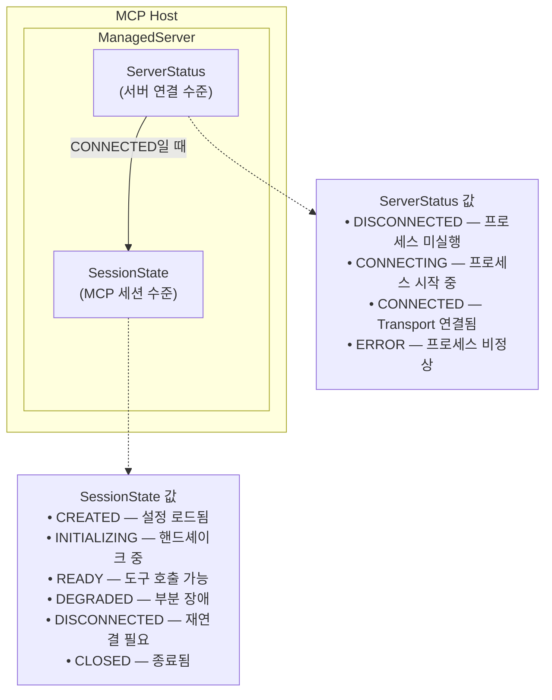
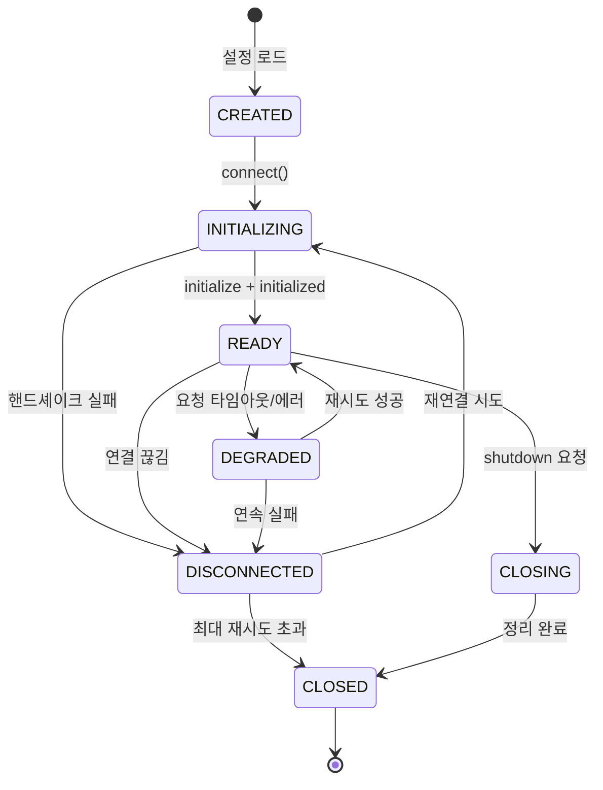
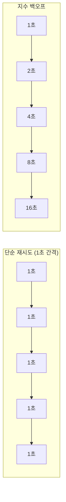
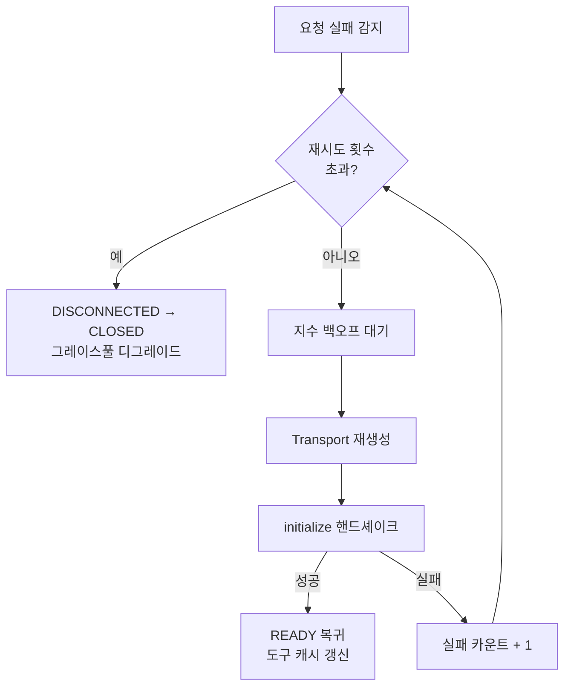
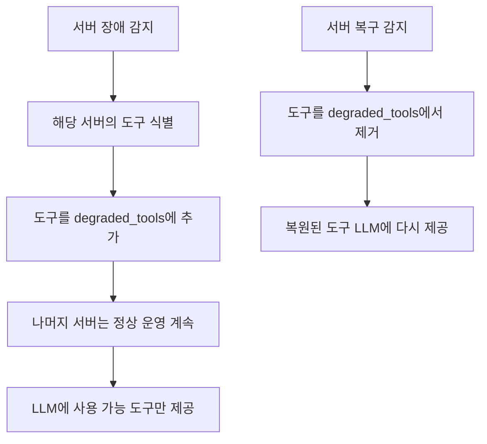
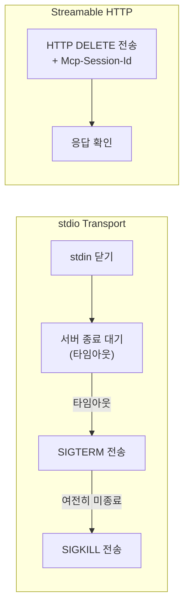
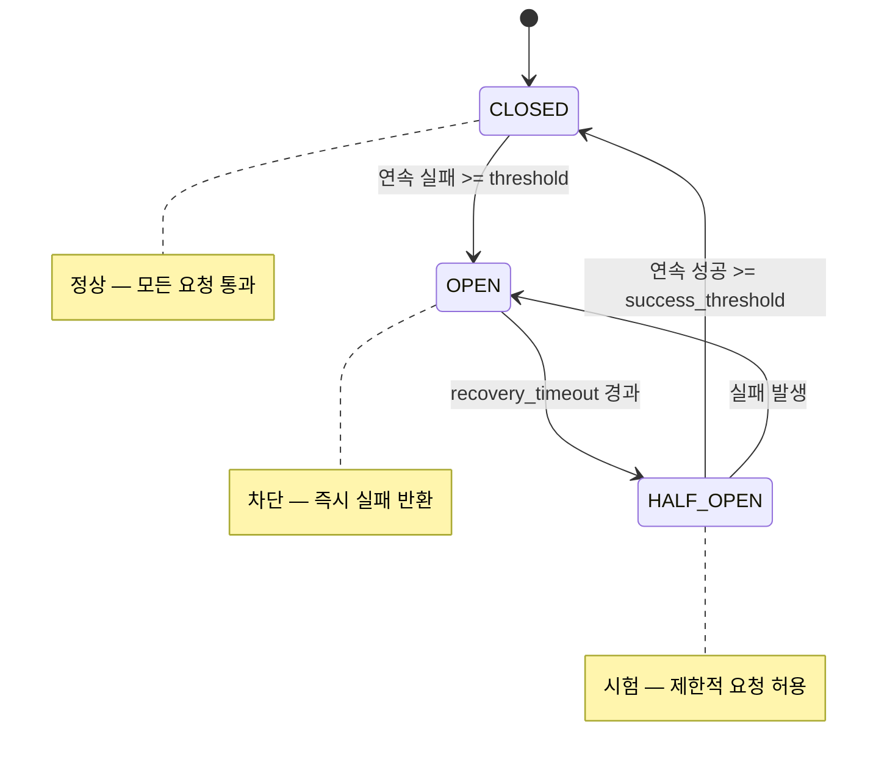

# 세션 관리와 장애 대응

> MCP 세션의 생명주기를 관리하고, 서버 장애에 자동으로 대응하는 프로덕션 수준의 Host를 완성합니다.

## 개요

이 섹션에서는 MCP 세션이 태어나서 죽기까지의 전체 생명주기를 체계적으로 관리하고, 서버가 예기치 않게 크래시했을 때 자동으로 감지하고 재연결하는 전략을 구현합니다. 또한 프로세스 종료 시 모든 리소스를 깨끗하게 정리하는 시그널 핸들링까지 다룹니다.

**선수 지식**: [Host 애플리케이션 설계](10-ch10-mcp-호스트와-멀티-서버-오케스트레이션/01-01-host-애플리케이션-설계.md)의 MCPHost 구조, [멀티 서버 연결과 관리](10-ch10-mcp-호스트와-멀티-서버-오케스트레이션/02-02-멀티-서버-연결과-관리.md)의 ManagedServer와 ServerStatus, [도구 라우팅과 LLM 통합](10-ch10-mcp-호스트와-멀티-서버-오케스트레이션/04-04-도구-라우팅과-llm-통합.md)의 에이전트 루프

**학습 목표**:
- MCP 세션의 6가지 상태와 전이 규칙을 이해하고 상태 머신으로 구현할 수 있다
- 지수 백오프를 활용한 자동 재연결 전략을 구현할 수 있다
- 서버 장애 시 그레이스풀 디그레이드 패턴을 적용할 수 있다
- SIGTERM/SIGINT 시그널을 처리하여 모든 MCP 세션을 안전하게 정리할 수 있다

## 왜 알아야 할까?

프로덕션 환경에서 MCP 서버는 **반드시 죽습니다**. 메모리 누수로 OOM이 나거나, 네트워크가 끊기거나, 배포 중 재시작되거나. 문제는 "서버가 죽을까?"가 아니라 "서버가 죽었을 때 사용자 경험이 어떻게 되는가?"입니다.

세션 관리 없이 MCP Host를 운영하면 이런 일이 벌어집니다:

- 파일시스템 서버가 크래시하면 **모든 도구**가 먹통이 됩니다 — DB 서버는 멀쩡한데도
- 프로세스를 Ctrl+C로 종료하면 자식 프로세스(stdio 서버)가 **좀비**로 남습니다
- 서버가 응답 없이 멈추면 에이전트 루프가 **영원히** 대기합니다

Ch10 전체를 관통하는 Host를 완성하는 마지막 퍼즐 조각이 바로 이 세션입니다. [Host 설계](10-ch10-mcp-호스트와-멀티-서버-오케스트레이션/01-01-host-애플리케이션-설계.md)에서 그린 청사진, [멀티 서버 관리](10-ch10-mcp-호스트와-멀티-서버-오케스트레이션/02-02-멀티-서버-연결과-관리.md)의 병렬 연결, [동적 디스커버리](10-ch10-mcp-호스트와-멀티-서버-오케스트레이션/03-03-동적-도구-디스커버리.md)의 도구 캐시, [LLM 통합](10-ch10-mcp-호스트와-멀티-서버-오케스트레이션/04-04-도구-라우팅과-llm-통합.md)의 에이전트 루프 — 이 모든 것이 장애에도 흔들리지 않으려면 견고한 세션 관리가 필요합니다.

> 📊 **그림 1**: 이 세션에서 다루는 장애 대응 체계의 전체 구조


## 핵심 개념

### 개념 1: 세션 라이프사이클 상태 머신

> 💡 **비유**: 세션의 생명주기는 병원 환자의 상태와 비슷합니다. 입원(CREATED) → 검진(INITIALIZING) → 퇴원 후 정상 생활(READY) → 감기(DEGRADED, 곧 회복) → 중환자실(DISCONNECTED, 집중 치료 필요) → 사망(CLOSED, 회복 불가). 의사(Host)는 각 상태에 맞는 조치를 취합니다.

MCP 스펙은 세션의 세 단계를 정의합니다: **Initialization**, **Operation**, **Shutdown**. 하지만 프로덕션 Host에서는 장애 상태까지 포함한 6가지 상태로 확장해야 합니다.

#### "왜 bool 하나가 아니라 6가지 상태가 필요할까?"

이 질문은 자연스러운 질문인데요, 간단한 예로 답해보겠습니다. `connected: bool` 하나로 관리한다고 해봅시다:

```python
# ❌ 이렇게 하면 어떤 일이 벌어질까?
class NaiveServer:
    def __init__(self):
        self.connected = False

    async def connect(self):
        self.connected = True   # 핸드셰이크 전에 "연결됨"으로 마킹
        await self.handshake()  # 여기서 실패하면?
        # connected는 True인데 실제로는 사용 불가!

    async def call_tool(self, name, args):
        if not self.connected:
            raise RuntimeError("Not connected")
        # connected=True이지만 핸드셰이크가 안 끝난 상태에서 호출...
```

문제가 보이시나요? `connected = True`를 설정한 뒤에 핸드셰이크가 실패하면, "연결되었다고 생각하지만 실제로는 사용 불가"인 상태가 됩니다. 또한 두 개의 코루틴이 동시에 `connect()`를 호출하면, 하나가 핸드셰이크 중인데 다른 하나도 핸드셰이크를 시작하는 **경쟁 조건**이 발생합니다.

6가지 상태는 이런 모호함을 없앱니다:

| 상태 | 의미 | 허용 동작 |
|------|------|----------|
| CREATED | 설정만 로드됨 | connect()만 가능 |
| INITIALIZING | 핸드셰이크 진행 중 | 대기만 (중복 connect 차단) |
| READY | 정상 운영 | 도구 호출 가능 |
| DEGRADED | 일부 요청 실패 중 | 제한적 호출 + 재시도 |
| DISCONNECTED | 완전 끊김 | 재연결만 가능 |
| CLOSED | 종료됨 | 아무것도 불가 |

#### ServerStatus vs SessionState — 두 레이어의 상태 구분

여기서 잠깐 짚고 넘어가야 할 것이 있습니다. [멀티 서버 연결과 관리](10-ch10-mcp-호스트와-멀티-서버-오케스트레이션/02-02-멀티-서버-연결과-관리.md)에서 정의한 `ServerStatus`와 이 세션의 `SessionState`는 **다른 레이어의 상태**입니다.

> 📊 **그림 2**: ServerStatus와 SessionState의 관계 — 서버 연결 수준 vs 세션 수준



| 구분 | ServerStatus | SessionState |
|------|-------------|--------------|
| **레이어** | 서버 프로세스/연결 수준 | MCP 프로토콜 세션 수준 |
| **관심사** | "프로세스가 살아있는가? Transport가 연결되었는가?" | "핸드셰이크가 완료되었는가? 도구 호출이 가능한가?" |
| **정의 위치** | `ManagedServer` (10.2) | `SessionStateMachine` (이 세션) |
| **관계** | ServerStatus가 CONNECTED여야 SessionState가 INITIALIZING 이상 가능 | SessionState가 DISCONNECTED면 ServerStatus도 재연결 필요 |

쉽게 말해, `ServerStatus`는 **"서버 프로세스가 돌고 있고 통신 채널이 열렸는가?"**에 대한 답이고, `SessionState`는 **"MCP 핸드셰이크가 끝나고 실제로 도구를 쓸 수 있는가?"**에 대한 답입니다. 서버가 CONNECTED 상태라도 초기화 핸드셰이크가 실패하면 SessionState는 DISCONNECTED일 수 있고, 반대로 SessionState가 DEGRADED(부분 장애)라도 ServerStatus는 여전히 CONNECTED(Transport 자체는 살아있음)일 수 있습니다.

이 세션의 `ResilientServer`에서는 두 레이어를 통합하여, `SessionState` 하나로 관리합니다. 실제 프로덕션에서는 Transport 수준과 프로토콜 수준을 분리하면 더 정밀한 장애 진단이 가능하지만, 복잡도 대비 효용을 고려해 통합 모델을 사용합니다.

> 📊 **그림 3**: MCP 세션 라이프사이클 상태 머신



각 상태에서 허용되는 동작이 다릅니다:

| 상태 | 도구 호출 | 재연결 | 정리 |
|------|----------|--------|------|
| CREATED | X | X | X |
| INITIALIZING | X | X | X |
| READY | O | X | O |
| DEGRADED | 제한적 | O | O |
| DISCONNECTED | X | O | O |
| CLOSED | X | X | X |

이를 Python Enum과 상태 전이 검증으로 구현합니다:

```python
from enum import Enum, auto
from dataclasses import dataclass, field
from datetime import datetime
import asyncio
import logging

logger = logging.getLogger(__name__)


class SessionState(Enum):
    """
    MCP 세션의 6가지 상태
    
    Note: ServerStatus(서버 프로세스/연결 수준)와 구분할 것.
    SessionState는 MCP 프로토콜 세션 수준의 상태를 나타냄.
    - ServerStatus.CONNECTED + SessionState.INITIALIZING = Transport는 열렸지만 핸드셰이크 진행 중
    - ServerStatus.CONNECTED + SessionState.DEGRADED = 연결은 있지만 요청 실패율 높음
    """
    CREATED = auto()        # 설정 로드, 아직 연결 전
    INITIALIZING = auto()   # 핸드셰이크 진행 중
    READY = auto()          # 정상 운영 — 도구 호출 가능
    DEGRADED = auto()       # 부분 장애 — 재시도 중
    DISCONNECTED = auto()   # 완전 끊김 — 재연결 필요
    CLOSING = auto()        # 정리 진행 중
    CLOSED = auto()         # 종료 — 복구 불가


# 상태 전이 규칙: {현재 상태: [허용되는 다음 상태들]}
VALID_TRANSITIONS: dict[SessionState, list[SessionState]] = {
    SessionState.CREATED:       [SessionState.INITIALIZING, SessionState.CLOSED],
    SessionState.INITIALIZING:  [SessionState.READY, SessionState.DISCONNECTED, SessionState.CLOSED],
    SessionState.READY:         [SessionState.DEGRADED, SessionState.DISCONNECTED, SessionState.CLOSING],
    SessionState.DEGRADED:      [SessionState.READY, SessionState.DISCONNECTED, SessionState.CLOSING],
    SessionState.DISCONNECTED:  [SessionState.INITIALIZING, SessionState.CLOSED],
    SessionState.CLOSING:       [SessionState.CLOSED],
    SessionState.CLOSED:        [],  # 터미널 상태 — 전이 없음
}


@dataclass
class SessionMetrics:
    """세션 상태 추적 메트릭"""
    created_at: datetime = field(default_factory=datetime.now)
    last_activity: datetime | None = None
    reconnect_count: int = 0
    total_requests: int = 0
    failed_requests: int = 0
    consecutive_failures: int = 0

    @property
    def failure_rate(self) -> float:
        if self.total_requests == 0:
            return 0.0
        return self.failed_requests / self.total_requests

    def record_success(self) -> None:
        self.total_requests += 1
        self.consecutive_failures = 0
        self.last_activity = datetime.now()

    def record_failure(self) -> None:
        self.total_requests += 1
        self.failed_requests += 1
        self.consecutive_failures += 1
        self.last_activity = datetime.now()


class SessionStateMachine:
    """상태 전이를 검증하는 세션 상태 머신"""

    def __init__(self, server_name: str):
        self._state = SessionState.CREATED
        self._server_name = server_name
        self._metrics = SessionMetrics()
        self._lock = asyncio.Lock()

    @property
    def state(self) -> SessionState:
        return self._state

    @property
    def metrics(self) -> SessionMetrics:
        return self._metrics

    @property
    def is_usable(self) -> bool:
        """도구 호출이 가능한 상태인가?"""
        return self._state in (SessionState.READY, SessionState.DEGRADED)

    async def transition(self, new_state: SessionState) -> None:
        """상태 전이 — 유효하지 않으면 예외 발생"""
        async with self._lock:
            valid = VALID_TRANSITIONS.get(self._state, [])
            if new_state not in valid:
                raise InvalidTransitionError(
                    f"[{self._server_name}] {self._state.name} → {new_state.name} 불가. "
                    f"허용: {[s.name for s in valid]}"
                )
            old = self._state
            self._state = new_state
            logger.info(
                f"[{self._server_name}] 세션 상태 전이: "
                f"{old.name} → {new_state.name}"
            )


class InvalidTransitionError(Exception):
    pass
```

핵심은 `VALID_TRANSITIONS` 딕셔너리입니다. READY에서 바로 CLOSED로 갈 수 없고 반드시 CLOSING을 거쳐야 하며, CLOSED에서는 어디로도 갈 수 없습니다. 이 제약이 "이미 닫힌 세션에 요청을 보내는" 버그를 컴파일 타임에 잡아줍니다.

> ⚠️ **흔한 오해**: "세션 상태는 단순히 `connected: bool` 플래그면 충분하다"고 생각하기 쉽지만, 연결 중(INITIALIZING)과 연결 끊김(DISCONNECTED)을 구분하지 않으면 핸드셰이크 중에 또 다른 연결을 시도하는 경쟁 조건이 발생합니다. 6가지 상태가 과하다 느낄 수 있지만, 각각이 **다른 동작을 요구**하기 때문에 필요합니다.

### 개념 2: 자동 재연결 — 지수 백오프

> 💡 **비유**: 지수 백오프는 문이 잠긴 사무실에 갈 때의 전략입니다. 처음엔 1분 후 다시 가보고, 안 되면 2분, 4분, 8분... 점점 간격을 늘립니다. 계속 1분마다 두드리면 경비원(서버)만 괴롭히거든요.

MCP Python SDK는 재연결 기능을 **제공하지 않습니다** (GitHub Issue #1022, "NOT_PLANNED"으로 종료). 따라서 Host가 직접 구현해야 합니다.

먼저 지수 백오프의 원리부터 짚어보겠습니다. 단순 재시도와 비교하면 왜 필요한지 명확해집니다:

> 📊 **그림 4**: 단순 재시도 vs 지수 백오프 비교



단순 재시도는 서버가 과부하로 죽었을 때 "불 난 집에 기름 붓기"가 됩니다. 지수 백오프는 서버에 회복할 시간을 점점 더 줍니다. 여기에 **지터(jitter)**를 추가하면, 여러 클라이언트가 동시에 재시도하는 **thundering herd(우르르 몰림)** 현상도 방지할 수 있습니다.

```python
import random
import time
from dataclasses import dataclass


@dataclass
class RetryConfig:
    """재연결 정책 설정"""
    max_attempts: int = 5          # 최대 재시도 횟수
    base_delay: float = 1.0        # 초기 대기 (초)
    max_delay: float = 60.0        # 최대 대기 (초)
    jitter_factor: float = 0.5     # 지터 비율 (0~1)


def calculate_backoff(attempt: int, config: RetryConfig) -> float:
    """지수 백오프 + 지터 계산"""
    # 2^attempt * base_delay — 시도할수록 대기 시간이 2배씩 증가
    delay = config.base_delay * (2 ** attempt)
    # 최대 대기 시간 제한 — 무한정 늘어나지 않도록
    delay = min(delay, config.max_delay)
    # 지터 추가 — 여러 클라이언트가 동시에 재시도하는 thundering herd 방지
    jitter = random.uniform(0, config.jitter_factor * delay)
    return delay + jitter
```

```run:python
# 지수 백오프 대기 시간 시뮬레이션
import random
random.seed(42)

base_delay = 1.0
max_delay = 60.0
jitter_factor = 0.5

print("재시도  |  기본 대기  |  지터 포함  |  누적 대기")
print("-" * 52)
total = 0
for attempt in range(6):
    delay = min(base_delay * (2 ** attempt), max_delay)
    jitter = random.uniform(0, jitter_factor * delay)
    actual = delay + jitter
    total += actual
    print(f"  {attempt + 1}회   |  {delay:5.1f}초   |  {actual:5.1f}초   |  {total:5.1f}초")
```

```output
재시도  |  기본 대기  |  지터 포함  |  누적 대기
----------------------------------------------------
  1회   |    1.0초   |    1.3초   |    1.3초
  2회   |    2.0초   |    2.7초   |    4.0초
  3회   |    4.0초   |    5.0초   |    9.0초
  4회   |    8.0초   |   10.6초   |   19.6초
  5회   |   16.0초   |   17.4초   |   37.0초
  6회   |   32.0초   |   48.1초   |   85.2초
```

5~6번 재시도하면 벌써 1분 이상이 흐릅니다. 이게 지수 백오프의 핵심이에요 — 서버가 과부하로 죽었다면 짧은 간격으로 재시도하면 불 난 집에 기름을 붓는 격입니다.

이제 이 지수 백오프를 활용한 자동 재연결 흐름을 봅시다.

> 📊 **그림 5**: 자동 재연결 플로우



여기서 중요한 점은 **Transport부터 다시 생성**해야 한다는 것입니다. MCP 세션은 단순히 `ClientSession` 객체만이 아닙니다. Transport 스트림(read/write), 자식 프로세스(stdio 서버), 핸드셰이크 상태까지 모두 하나의 세션을 구성합니다. `ClientSession`만 새로 만들면 이미 닫힌 스트림에 쓰려고 해서 에러가 발생하죠.

### 개념 3: 그레이스풀 디그레이드 — 부분 장애에 대응하기

> 💡 **비유**: 비행기의 엔진 4개 중 1개가 고장 나도 나머지 3개로 비행할 수 있습니다. 좋은 시스템은 부분 장애를 전체 장애로 확산시키지 않습니다.

멀티 서버 환경에서 하나의 서버가 죽었을 때 가장 실용적인 전략은 **그레이스풀 디그레이드(graceful degradation)**입니다. "죽은 서버의 도구를 빼고 나머지로 계속 운영"하는 것이죠. 구현도 간단하고 효과가 큽니다.

```run:python
# 그레이스풀 디그레이드 동작 예시
all_tools = {
    "filesystem": ["read_file", "write_file", "list_dir"],
    "database": ["query", "insert"],
    "search": ["web_search"],
}

# filesystem 서버 장애 시
failed_server = "filesystem"
degraded_tools = set(all_tools[failed_server])
available = {
    srv: tools for srv, tools in all_tools.items()
    if srv != failed_server
}

print(f"장애 서버: {failed_server}")
print(f"비활성화 도구: {degraded_tools}")
print(f"계속 사용 가능:")
for srv, tools in available.items():
    print(f"  {srv}: {tools}")
print(f"\nLLM에게 {sum(len(t) for t in available.values())}개 도구만 제공")
```

```output
장애 서버: filesystem
비활성화 도구: {'read_file', 'write_file', 'list_dir'}
계속 사용 가능:
  database: ['query', 'insert']
  search: ['web_search']

LLM에게 3개 도구만 제공
```

LLM에게 사용 가능한 도구만 제공하면, LLM은 자연스럽게 남은 도구만 활용해서 답변합니다. 파일 읽기가 안 되면 "파일시스템이 일시적으로 사용 불가합니다"라고 알려주면 되는 거죠.

```python
from typing import Any


class GracefulDegradeHost:
    """그레이스풀 디그레이드를 지원하는 Host"""

    def __init__(self):
        self._servers: dict[str, Any] = {}       # name → ManagedServer
        self._tool_routing: dict[str, str] = {}   # tool_name → server_name
        self._degraded_tools: set[str] = set()    # 현재 사용 불가 도구

    async def handle_server_failure(self, server_name: str) -> str:
        """서버 장애 시 해당 서버의 도구만 비활성화"""
        disabled = []
        for tool_name, srv in list(self._tool_routing.items()):
            if srv == server_name:
                self._degraded_tools.add(tool_name)
                disabled.append(tool_name)

        logger.warning(
            f"그레이스풀 디그레이드: {server_name} 도구 "
            f"{len(disabled)}개 비활성화"
        )
        return (
            f"'{server_name}' 서버를 일시적으로 사용할 수 없습니다. "
            f"비활성화된 도구: {', '.join(disabled)}. "
            f"나머지 서버는 정상 운영됩니다."
        )

    async def restore_server(self, server_name: str) -> None:
        """서버 복구 시 비활성화된 도구 복원"""
        restored = []
        for tool_name, srv in self._tool_routing.items():
            if srv == server_name and tool_name in self._degraded_tools:
                self._degraded_tools.discard(tool_name)
                restored.append(tool_name)
        logger.info(f"서버 복구: {server_name}, 도구 {len(restored)}개 복원")

    def get_available_tools(self) -> list[str]:
        """현재 사용 가능한 도구 목록 — LLM에게 이것만 제공"""
        return [
            name for name in self._tool_routing
            if name not in self._degraded_tools
        ]
```

> 📊 **그림 6**: 그레이스풀 디그레이드 의사결정 흐름



### 개념 4: 리소스 정리와 시그널 핸들링

> 💡 **비유**: 호텔을 체크아웃할 때를 떠올려보세요. 방 열쇠 반납, 미니바 정산, 짐 챙기기를 하나씩 해야 합니다. 화재 경보가 울려도(SIGTERM) "일단 열쇠만 반납"은 해야 하고, 건물이 무너지면(SIGKILL) 그때는 어쩔 수 없죠. MCP Host도 마찬가지 — 종료 시 각 서버와의 세션을 하나씩 닫아줘야 합니다.

MCP 스펙은 Transport별로 종료 방법을 명시합니다:

- **stdio**: 클라이언트가 stdin을 닫고 → 서버가 종료되길 기다리고 → 안 되면 SIGTERM → 그래도 안 되면 SIGKILL
- **Streamable HTTP**: HTTP DELETE + `Mcp-Session-Id` 헤더 전송

> 📊 **그림 7**: Transport별 종료 절차



Python에서는 `asyncio`의 시그널 핸들러와 `try/finally`를 조합합니다:

```python
import signal
import sys
from contextlib import asynccontextmanager
from collections.abc import AsyncIterator


class SessionCleaner:
    """MCP 세션 리소스 정리 관리자"""

    def __init__(self):
        self._sessions: list[Any] = []  # ManagedServer 목록
        self._cleanup_done = asyncio.Event()
        self._shutting_down = False

    def register(self, session: Any) -> None:
        """정리가 필요한 세션 등록"""
        self._sessions.append(session)

    async def cleanup_all(self, timeout: float = 10.0) -> None:
        """모든 세션을 안전하게 정리"""
        if self._shutting_down:
            return  # 중복 정리 방지
        self._shutting_down = True

        logger.info(f"세션 정리 시작: {len(self._sessions)}개 서버")

        # 모든 세션을 병렬로 정리 (타임아웃 적용)
        tasks = [
            self._cleanup_one(session, timeout)
            for session in self._sessions
        ]
        results = await asyncio.gather(*tasks, return_exceptions=True)

        # 결과 로깅
        for session, result in zip(self._sessions, results):
            if isinstance(result, Exception):
                logger.error(
                    f"[{session.name}] 정리 실패: {result}"
                )
            else:
                logger.info(f"[{session.name}] 정리 완료")

        self._cleanup_done.set()

    async def _cleanup_one(self, session: Any, timeout: float) -> None:
        """개별 세션 정리 — 타임아웃 적용"""
        try:
            await asyncio.wait_for(
                session.close(),
                timeout=timeout
            )
        except asyncio.TimeoutError:
            logger.warning(
                f"[{session.name}] 정리 타임아웃 ({timeout}초) — 강제 종료"
            )
            await session.force_kill()
        except Exception as e:
            # 정리 중 발생한 예외는 로그만 남기고 계속 진행
            # 하나의 실패가 다른 세션 정리를 막으면 안 됨
            logger.error(f"[{session.name}] 정리 중 예외: {e}")


def install_signal_handlers(
    cleaner: SessionCleaner,
    loop: asyncio.AbstractEventLoop
) -> None:
    """SIGTERM/SIGINT 시그널 핸들러 설치"""

    async def shutdown_handler(sig: signal.Signals) -> None:
        logger.info(f"시그널 수신: {sig.name} — 정리 시작")
        await cleaner.cleanup_all(timeout=10.0)
        loop.stop()

    for sig in (signal.SIGTERM, signal.SIGINT):
        loop.add_signal_handler(
            sig,
            # lambda 후기 바인딩 문제 방지: sig=sig로 즉시 바인딩
            lambda s=sig: asyncio.create_task(
                shutdown_handler(s)
            ),
        )
    logger.info("시그널 핸들러 설치 완료: SIGTERM, SIGINT")
```

> 🔥 **실무 팁**: `loop.add_signal_handler` 안에서 `lambda s=sig:`처럼 기본 인자로 바인딩하는 것이 중요합니다. Python의 클로저는 **늦은 바인딩(late binding)**이라서, 루프 안에서 `lambda: ... sig`로 쓰면 모든 핸들러가 마지막 `sig` 값만 참조합니다.

## 실습: 직접 해보기

Ch10 전체를 관통하는 `ResilientHost`를 구현합니다. 세션 상태 머신 + 자동 재연결 + 그레이스풀 디그레이드 + 시그널 핸들링을 통합한 Host입니다.

```python
"""
resilient_host.py — 장애 대응이 가능한 MCP Host
Ch10 완성판: 상태 머신 + 재연결 + 디그레이드 + 시그널 핸들링
"""
import asyncio
import logging
import signal
import random
from enum import Enum, auto
from dataclasses import dataclass, field
from typing import Any
from contextlib import asynccontextmanager
from collections.abc import AsyncIterator

from mcp import ClientSession
from mcp.client.stdio import stdio_client, StdioServerParameters

logger = logging.getLogger(__name__)


# ──────────────────────────────────────────────
# 1. 상태 머신
# ──────────────────────────────────────────────

class SessionState(Enum):
    """
    MCP 세션의 6가지 상태 (프로토콜 세션 수준)
    cf. ServerStatus는 서버 프로세스/연결 수준 — 10.2 참고
    """
    CREATED = auto()
    INITIALIZING = auto()
    READY = auto()
    DEGRADED = auto()
    DISCONNECTED = auto()
    CLOSING = auto()
    CLOSED = auto()


VALID_TRANSITIONS: dict[SessionState, list[SessionState]] = {
    SessionState.CREATED:       [SessionState.INITIALIZING, SessionState.CLOSED],
    SessionState.INITIALIZING:  [SessionState.READY, SessionState.DISCONNECTED, SessionState.CLOSED],
    SessionState.READY:         [SessionState.DEGRADED, SessionState.DISCONNECTED, SessionState.CLOSING],
    SessionState.DEGRADED:      [SessionState.READY, SessionState.DISCONNECTED, SessionState.CLOSING],
    SessionState.DISCONNECTED:  [SessionState.INITIALIZING, SessionState.CLOSED],
    SessionState.CLOSING:       [SessionState.CLOSED],
    SessionState.CLOSED:        [],
}


# ──────────────────────────────────────────────
# 2. 재연결 정책
# ──────────────────────────────────────────────

@dataclass
class RetryConfig:
    """지수 백오프 재연결 설정"""
    max_attempts: int = 5          # 최대 재시도 횟수
    base_delay: float = 1.0        # 초기 대기 (초)
    max_delay: float = 60.0        # 최대 대기 (초)
    jitter_factor: float = 0.5     # 지터 비율 (0~1)


# ──────────────────────────────────────────────
# 3. 관리 대상 서버
# ──────────────────────────────────────────────

@dataclass
class ResilientServer:
    """자동 재연결이 가능한 MCP 서버 래퍼"""
    name: str
    params: StdioServerParameters
    retry_config: RetryConfig = field(default_factory=RetryConfig)
    # 런타임 상태
    session: ClientSession | None = None
    state: SessionState = SessionState.CREATED
    tools: list[dict] = field(default_factory=list)
    _reconnect_count: int = 0
    _consecutive_failures: int = 0

    def _validate_transition(self, new_state: SessionState) -> None:
        valid = VALID_TRANSITIONS.get(self.state, [])
        if new_state not in valid:
            raise ValueError(
                f"[{self.name}] 잘못된 전이: {self.state.name} → {new_state.name}"
            )

    def transition(self, new_state: SessionState) -> None:
        self._validate_transition(new_state)
        old = self.state
        self.state = new_state
        logger.info(f"[{self.name}] {old.name} → {new_state.name}")

    @property
    def is_usable(self) -> bool:
        return self.state in (SessionState.READY, SessionState.DEGRADED)


# ──────────────────────────────────────────────
# 4. Resilient Host — 핵심 오케스트레이터
# ──────────────────────────────────────────────

class ResilientHost:
    """장애 대응이 가능한 MCP Host"""

    def __init__(self):
        self._servers: dict[str, ResilientServer] = {}
        self._tool_routing: dict[str, str] = {}  # tool → server_name
        self._degraded_tools: set[str] = set()
        self._shutting_down = False
        self._contexts: dict[str, Any] = {}  # 서버별 컨텍스트 매니저

    def add_server(
        self,
        name: str,
        params: StdioServerParameters,
        retry_config: RetryConfig | None = None,
    ) -> None:
        """서버 등록"""
        self._servers[name] = ResilientServer(
            name=name,
            params=params,
            retry_config=retry_config or RetryConfig(),
        )

    async def connect_all(self) -> dict[str, bool]:
        """모든 서버에 병렬 연결 — 실패해도 나머지는 계속"""
        tasks = {
            name: asyncio.create_task(
                self._connect_server(server),
                name=f"connect-{name}",
            )
            for name, server in self._servers.items()
        }
        results = await asyncio.gather(
            *tasks.values(), return_exceptions=True
        )
        status = {}
        for name, result in zip(tasks.keys(), results):
            if isinstance(result, Exception):
                logger.error(f"[{name}] 연결 실패: {result}")
                status[name] = False
            else:
                status[name] = result
        return status

    async def _connect_server(self, server: ResilientServer) -> bool:
        """개별 서버 연결 — initialize 핸드셰이크 포함"""
        server.transition(SessionState.INITIALIZING)
        try:
            # stdio Transport 생성
            ctx = stdio_client(server.params)
            read_stream, write_stream = await ctx.__aenter__()
            self._contexts[server.name] = ctx

            # ClientSession 생성 + 핸드셰이크
            session = ClientSession(read_stream, write_stream)
            await session.__aenter__()
            await session.initialize()

            server.session = session
            server.transition(SessionState.READY)

            # 도구 목록 캐싱 + 라우팅 등록
            tools_result = await session.list_tools()
            server.tools = [
                {"name": t.name, "schema": t.inputSchema}
                for t in tools_result.tools
            ]
            for tool in tools_result.tools:
                self._tool_routing[tool.name] = server.name

            logger.info(
                f"[{server.name}] 연결 완료 — "
                f"도구 {len(server.tools)}개 등록"
            )
            return True
        except Exception as e:
            server.transition(SessionState.DISCONNECTED)
            logger.error(f"[{server.name}] 초기 연결 실패: {e}")
            return False

    async def reconnect_server(self, server_name: str) -> bool:
        """서버 재연결 — 지수 백오프 적용"""
        server = self._servers.get(server_name)
        if not server:
            return False

        config = server.retry_config

        for attempt in range(config.max_attempts):
            # 기존 세션 정리
            await self._cleanup_server(server_name)

            # 재연결 시도
            logger.info(
                f"[{server_name}] 재연결 시도 "
                f"{attempt + 1}/{config.max_attempts}"
            )
            server.state = SessionState.CREATED  # 상태 리셋
            success = await self._connect_server(server)

            if success:
                server._reconnect_count += 1
                server._consecutive_failures = 0
                # 디그레이드된 도구 복원
                for tool in server.tools:
                    self._degraded_tools.discard(tool["name"])
                return True

            # 지수 백오프 대기
            delay = min(
                config.base_delay * (2 ** attempt),
                config.max_delay,
            )
            jitter = random.uniform(0, config.jitter_factor * delay)
            wait = delay + jitter
            logger.info(f"[{server_name}] {wait:.1f}초 후 재시도")
            await asyncio.sleep(wait)

        # 최대 재시도 초과 → CLOSED
        if server.state == SessionState.DISCONNECTED:
            server.transition(SessionState.CLOSED)
        logger.error(f"[{server_name}] 재연결 포기 ({config.max_attempts}회 실패)")

        # 그레이스풀 디그레이드 — 이 서버의 도구 비활성화
        for tool in server.tools:
            self._degraded_tools.add(tool["name"])
        return False

    async def call_tool(
        self, tool_name: str, arguments: dict
    ) -> dict[str, Any]:
        """도구 호출 — 장애 시 그레이스풀 디그레이드"""
        if tool_name in self._degraded_tools:
            return {
                "error": f"'{tool_name}' 도구는 현재 사용할 수 없습니다.",
                "degraded": True,
            }

        server_name = self._tool_routing.get(tool_name)
        if not server_name:
            return {"error": f"'{tool_name}' 도구를 찾을 수 없습니다."}

        server = self._servers[server_name]
        if not server.is_usable or not server.session:
            return {
                "error": f"'{server_name}' 서버가 연결되지 않았습니다.",
                "server_state": server.state.name,
            }

        try:
            result = await asyncio.wait_for(
                server.session.call_tool(tool_name, arguments),
                timeout=30.0,
            )
            server._consecutive_failures = 0
            return {"result": [c.text for c in result.content]}

        except asyncio.TimeoutError:
            server._consecutive_failures += 1
            logger.warning(f"[{server_name}] 도구 호출 타임아웃: {tool_name}")
            # 타임아웃 → DEGRADED 전이 + 백그라운드 재연결
            if server.state == SessionState.READY:
                server.transition(SessionState.DEGRADED)
                asyncio.create_task(self.reconnect_server(server_name))
            return {"error": "도구 호출 타임아웃", "timeout": True}

        except Exception as e:
            server._consecutive_failures += 1
            logger.error(f"[{server_name}] 도구 호출 실패: {e}")
            server.transition(SessionState.DISCONNECTED)
            # 도구 비활성화 + 백그라운드 재연결
            for tool in server.tools:
                self._degraded_tools.add(tool["name"])
            asyncio.create_task(self.reconnect_server(server_name))
            return {"error": str(e), "reconnecting": True}

    async def _cleanup_server(self, server_name: str) -> None:
        """개별 서버 세션 정리"""
        server = self._servers.get(server_name)
        if not server:
            return
        # 세션 닫기
        if server.session:
            try:
                await server.session.__aexit__(None, None, None)
            except Exception:
                pass
            server.session = None
        # Transport 컨텍스트 닫기
        ctx = self._contexts.pop(server_name, None)
        if ctx:
            try:
                await ctx.__aexit__(None, None, None)
            except Exception:
                pass

    async def shutdown(self) -> None:
        """모든 서버를 안전하게 종료"""
        if self._shutting_down:
            return
        self._shutting_down = True
        logger.info(f"Host 종료 시작 — {len(self._servers)}개 서버 정리")

        tasks = []
        for name, server in self._servers.items():
            if server.state not in (SessionState.CLOSED, SessionState.CREATED):
                try:
                    server.transition(SessionState.CLOSING)
                except ValueError:
                    pass
                tasks.append(self._cleanup_server(name))

        if tasks:
            await asyncio.gather(*tasks, return_exceptions=True)

        for server in self._servers.values():
            if server.state != SessionState.CLOSED:
                try:
                    server.transition(SessionState.CLOSED)
                except ValueError:
                    server.state = SessionState.CLOSED  # 강제 설정

        logger.info("Host 종료 완료")

    def status_report(self) -> dict[str, Any]:
        """전체 서버 상태 리포트"""
        return {
            name: {
                "state": server.state.name,
                "tools": len(server.tools),
                "reconnects": server._reconnect_count,
                "usable": server.is_usable,
            }
            for name, server in self._servers.items()
        }


# ──────────────────────────────────────────────
# 5. 시그널 핸들링 + 진입점
# ──────────────────────────────────────────────

@asynccontextmanager
async def managed_host() -> AsyncIterator[ResilientHost]:
    """시그널 핸들링이 포함된 Host 컨텍스트 매니저"""
    host = ResilientHost()
    loop = asyncio.get_running_loop()

    async def signal_handler(sig: signal.Signals) -> None:
        logger.info(f"시그널 수신: {sig.name}")
        await host.shutdown()
        # 남은 태스크 취소
        tasks = [
            t for t in asyncio.all_tasks()
            if t is not asyncio.current_task()
        ]
        for task in tasks:
            task.cancel()
        await asyncio.gather(*tasks, return_exceptions=True)

    # 시그널 핸들러 등록
    for sig in (signal.SIGTERM, signal.SIGINT):
        loop.add_signal_handler(
            sig,
            lambda s=sig: asyncio.create_task(signal_handler(s)),
        )

    try:
        yield host
    finally:
        await host.shutdown()


async def main():
    """사용 예시"""
    logging.basicConfig(
        level=logging.INFO,
        format="%(asctime)s [%(levelname)s] %(message)s",
    )

    async with managed_host() as host:
        # 서버 등록
        host.add_server(
            "filesystem",
            StdioServerParameters(
                command="python",
                args=["-m", "mcp_server_filesystem", "/tmp"],
            ),
            retry_config=RetryConfig(max_attempts=3, base_delay=2.0),
        )
        host.add_server(
            "database",
            StdioServerParameters(
                command="python",
                args=["-m", "mcp_server_sqlite", "app.db"],
            ),
        )

        # 병렬 연결
        status = await host.connect_all()
        print(f"연결 결과: {status}")
        print(f"상태 리포트: {host.status_report()}")

        # 도구 호출 (장애 시 자동 재연결 + 디그레이드)
        result = await host.call_tool(
            "read_file", {"path": "/tmp/test.txt"}
        )
        print(f"도구 호출 결과: {result}")


if __name__ == "__main__":
    asyncio.run(main())
```

## 더 깊이 알아보기

### MCP Python SDK의 재연결 미지원 — 의도적 설계 결정

MCP Python SDK의 GitHub에서 재연결 기능을 요청한 Issue #1022는 **"NOT_PLANNED"**으로 닫혔습니다. SDK 메인테이너들은 재연결 로직이 Transport 유형(stdio vs HTTP), 애플리케이션 요구사항, 장애 정책에 따라 크게 달라지므로 SDK에 내장하기보다 Host가 직접 구현하는 것이 낫다고 판단했습니다.

이는 MCP의 **계층 분리 철학**과 일맥상통합니다. SDK는 프로토콜 핸들링에 집중하고, 재연결·폴백·모니터링 같은 운영 관심사는 Host 레이어의 책임입니다. 이 세션에서 우리가 직접 구현한 `ResilientHost`가 바로 그 책임을 담당하는 것이죠.

### 고급 패턴: 서킷 브레이커

이 세션에서 다룬 지수 백오프만으로도 대부분의 재연결 시나리오를 처리할 수 있습니다. 하지만 더 정교한 장애 대응이 필요하다면 **서킷 브레이커(Circuit Breaker)** 패턴을 추가할 수 있습니다.

서킷 브레이커의 이름은 전기 회로의 차단기에서 왔습니다. **Michael Nygard**가 2007년 저서 **"Release It!"**에서 소프트웨어 분야에 소개한 패턴인데요, 핵심 아이디어는 "장애가 확인된 서버에는 일정 시간 동안 요청을 보내지 않는다"입니다.

> 📊 **그림 8**: 서킷 브레이커의 세 가지 상태



서킷 브레이커는 세 가지 상태를 가집니다:

| 상태 | 의미 | 동작 |
|------|------|------|
| CLOSED | 정상 | 모든 요청을 그대로 전달 |
| OPEN | 차단 | 요청을 즉시 실패로 반환 (서버에 보내지 않음) |
| HALF_OPEN | 시험 | 소수의 요청만 통과시켜 복구 여부 확인 |

지수 백오프와의 차이점을 비교하면:

- **지수 백오프**: 재연결 *시도* 간격을 점진적으로 늘리는 전략
- **서킷 브레이커**: 장애 서버로의 *요청 자체*를 차단하는 전략

두 패턴은 서로 보완적이어서, 프로덕션에서는 종종 함께 사용됩니다. 지수 백오프로 재연결을 시도하되, 연속 실패가 쌓이면 서킷 브레이커가 "이 서버는 당분간 안 된다"고 판단하고 요청 자체를 차단하는 것이죠. 서킷 브레이커의 구현 예시는 [Release It!](https://pragprog.com/titles/mnee2/release-it-second-edition/)이나 [resilience4j 문서](https://resilience4j.readme.io/docs/circuitbreaker)를 참고하세요.

### 고급 패턴: 대체 서버 폴백

그레이스풀 디그레이드보다 한 단계 더 발전된 전략으로 **대체 서버 폴백**이 있습니다. 동일한 기능을 제공하는 백업 서버를 미리 등록해두고, 주 서버 장애 시 자동으로 전환하는 방식이죠. 예를 들어 `filesystem-primary`가 죽으면 `filesystem-backup`으로 도구 라우팅을 재매핑하는 것입니다.

이 패턴은 가용성이 매우 중요한 서비스에서 유용하지만, 서버를 이중화해야 하므로 운영 비용이 높습니다. 대부분의 MCP Host에서는 그레이스풀 디그레이드만으로 충분하며, 대체 서버 폴백은 SLA 요구사항이 있을 때 도입을 검토하면 됩니다.

## 흔한 오해와 팁

> ⚠️ **흔한 오해**: "서버가 죽으면 `ClientSession`을 다시 만들면 된다"고 생각하기 쉽습니다. 하지만 MCP 세션은 단순히 Session 객체만이 아닙니다. Transport 스트림(read/write), 자식 프로세스(stdio 서버), 그리고 핸드셰이크 상태까지 모두 재생성해야 합니다. `ClientSession`만 새로 만들면 이미 닫힌 스트림에 쓰려고 해서 `ValueError: I/O operation on closed pipe`가 발생합니다. 반드시 **Transport부터 다시 생성**해야 합니다.

> 💡 **알고 계셨나요?**: Streamable HTTP Transport의 경우, MCP 스펙은 **SSE 재개(resumability)** 메커니즘을 정의하고 있습니다. 서버가 SSE 이벤트에 `id` 필드를 붙이면, 클라이언트는 재연결 시 `Last-Event-ID` 헤더로 마지막으로 받은 이벤트를 알려줄 수 있고, 서버는 그 이후의 메시지를 재전송합니다. 이를 통해 네트워크 순단 시에도 메시지 손실 없이 세션을 이어갈 수 있죠. 하지만 이 기능은 서버가 **이벤트 ID를 구현한 경우에만** 동작합니다.

> 🔥 **실무 팁**: `asyncio.gather(*tasks, return_exceptions=True)`에서 `return_exceptions=True`를 빼먹으면, 첫 번째 예외가 발생할 때 나머지 태스크의 정리가 중단됩니다. 특히 `shutdown()` 같은 정리 코드에서 이를 빠뜨리면, 서버 A의 정리가 실패했다고 서버 B, C의 정리가 안 되는 **연쇄 누수**가 발생합니다. 정리 코드에서는 **항상** `return_exceptions=True`를 쓰세요.

> 🔥 **실무 팁**: 시그널 핸들러는 **메인 스레드에서만** 등록할 수 있습니다. `asyncio.run()` 내부에서 `loop.add_signal_handler()`를 호출하면 메인 스레드이므로 문제없지만, 서브 스레드에서 이벤트 루프를 돌리면 `ValueError: set_wakeup_fd only works in main thread`가 발생합니다. 멀티 스레드 아키텍처라면 메인 스레드에서 시그널을 받아 이벤트 루프에 전달하는 브리지 패턴을 사용하세요.

## 핵심 정리

| 개념 | 설명 |
|------|------|
| ServerStatus vs SessionState | ServerStatus는 서버 프로세스/연결 수준, SessionState는 MCP 프로토콜 세션 수준의 상태 |
| 세션 상태 머신 | 6가지 상태(CREATED → INITIALIZING → READY → DEGRADED → DISCONNECTED → CLOSED)와 유효 전이 규칙 |
| 지수 백오프 | `base × 2^attempt + jitter`, 재시도 간격을 점진적으로 늘려 서버 과부하 방지 |
| 그레이스풀 디그레이드 | 장애 서버의 도구만 비활성화하고 나머지 서버는 정상 운영 계속 |
| stdio 종료 | stdin 닫기 → SIGTERM → SIGKILL 단계적 종료 (MCP 스펙 정의) |
| HTTP 세션 종료 | HTTP DELETE + `Mcp-Session-Id` 헤더 전송 |
| SSE 재개 | `Last-Event-ID` 헤더로 연결 복구 시 누락 메시지 재전송 (Streamable HTTP) |
| 시그널 핸들링 | `loop.add_signal_handler()`로 SIGTERM/SIGINT 수신 → 세션 정리 후 종료 |
| `return_exceptions=True` | `asyncio.gather` 정리 코드에서 필수 — 하나의 실패가 나머지 정리를 막지 않도록 |
| 서킷 브레이커 (고급) | CLOSED/OPEN/HALF_OPEN 3상태 — 연속 실패 시 요청 차단으로 장애 전파 방지 |
| 대체 서버 폴백 (고급) | 동일 기능의 백업 서버로 도구 라우팅을 재매핑 — SLA 요구 시 도입 |

## 다음 섹션 미리보기

Ch10에서 완성한 Host — 설계, 멀티 서버 연결, 동적 디스커버리, LLM 통합, 세션 관리와 장애 대응 — 가 프로덕션에서 안전하게 동작하려면 **인증과 보안**이 필수입니다. 다음 챕터 [Ch11. 인증과 보안](11-ch11-인증과-보안/01-01-mcp-인증-아키텍처.md)에서는 MCP의 OAuth 2.1 인증 아키텍처, PKCE 구현, 서버 측 인증 미들웨어를 다루며, "누가 이 도구를 호출할 수 있는가?"라는 질문에 답합니다.

## 참고 자료

- [MCP Specification — Lifecycle (2025-11-25)](https://modelcontextprotocol.io/specification/2025-11-25/basic/lifecycle) - 세션 초기화, 운영, 종료의 공식 스펙. 타임아웃, 취소, 프로토콜 버전 협상 규칙 수록
- [MCP Specification — Transports (2025-11-25)](https://modelcontextprotocol.io/specification/2025-11-25/basic/transports) - stdio/Streamable HTTP Transport별 종료 절차, SSE 재개(resumability) 메커니즘, 세션 ID 관리 규칙
- [MCP Client Development Guide — cyanheads](https://github.com/cyanheads/model-context-protocol-resources/blob/main/guides/mcp-client-development-guide.md) - 클라이언트 측 세션 관리, 에러 처리, health check 구현 패턴
- [MCP Python SDK — GitHub Issue #1022 (Reconnection)](https://github.com/modelcontextprotocol/python-sdk/issues/1022) - SDK가 재연결을 내장하지 않는 이유와 커뮤니티 논의
- [Graceful Shutdowns with asyncio — Lynn Root](https://roguelynn.com/words/asyncio-graceful-shutdowns/) - Python asyncio 시그널 핸들링, 태스크 취소, 정리 코드의 모범 사례
- [Release It! — Michael Nygard (Pragmatic Bookshelf)](https://pragprog.com/titles/mnee2/release-it-second-edition/) - 서킷 브레이커 패턴의 원전. 분산 시스템 안정성 패턴 전반을 다루는 필독서

---
### 🔗 Related Sessions
- [toolnamespacemanager](10-ch10-mcp-호스트와-멀티-서버-오케스트레이션/02-02-멀티-서버-연결과-관리.md) (prerequisite)
- [managedserver](10-ch10-mcp-호스트와-멀티-서버-오케스트레이션/02-02-멀티-서버-연결과-관리.md) (prerequisite)
- [serverstatus](10-ch10-mcp-호스트와-멀티-서버-오케스트레이션/02-02-멀티-서버-연결과-관리.md) (prerequisite)
- [toolentry](10-ch10-mcp-호스트와-멀티-서버-오케스트레이션/02-02-멀티-서버-연결과-관리.md) (prerequisite)
- [dynamictoolrouter](10-ch10-mcp-호스트와-멀티-서버-오케스트레이션/03-03-동적-도구-디스커버리.md) (prerequisite)
- [multiserveragentloop](10-ch10-mcp-호스트와-멀티-서버-오케스트레이션/04-04-도구-라우팅과-llm-통합.md) (prerequisite)
