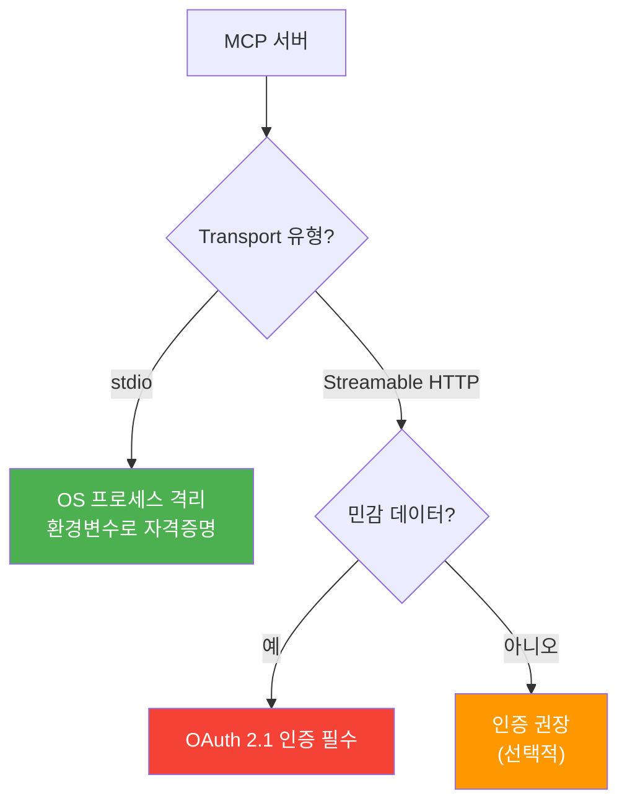
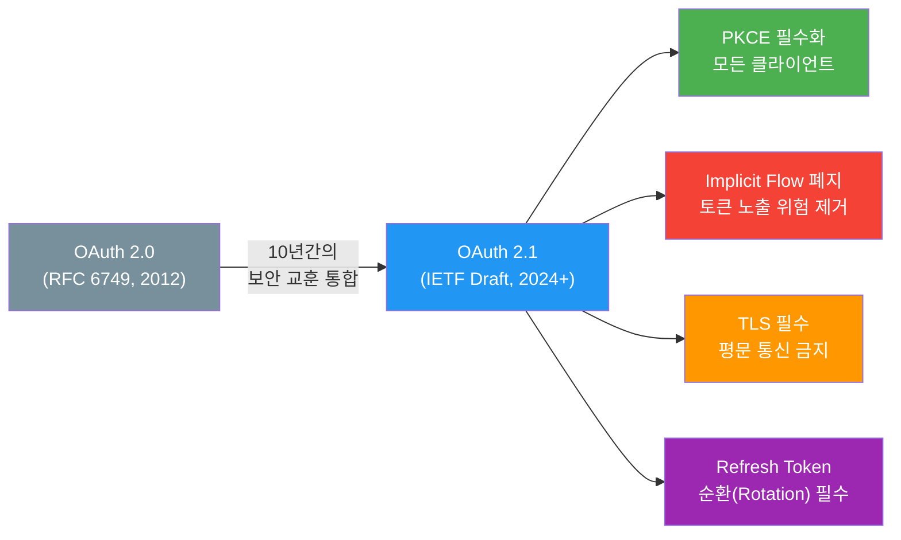
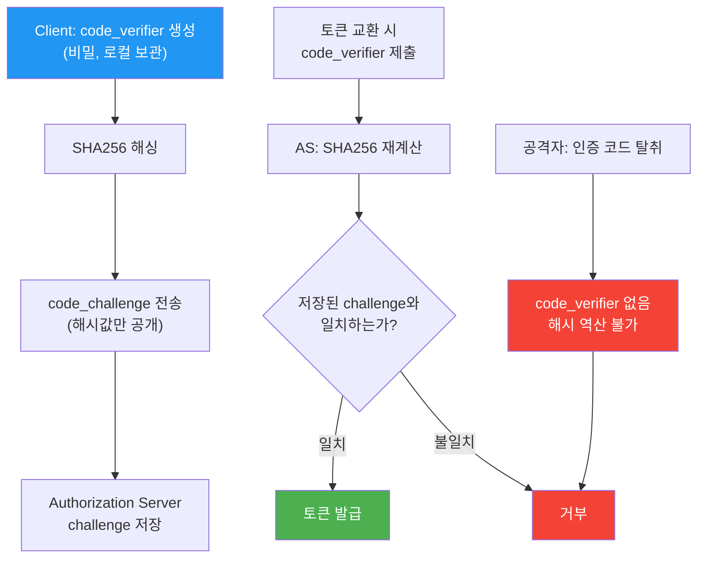
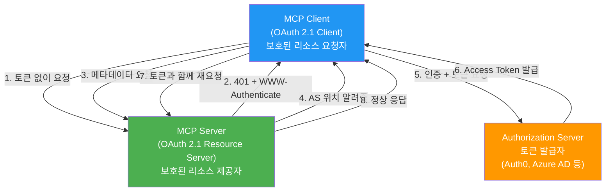
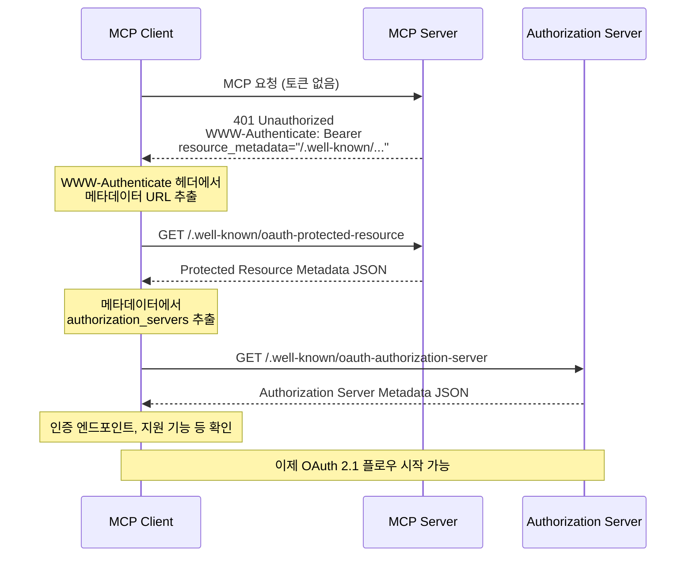
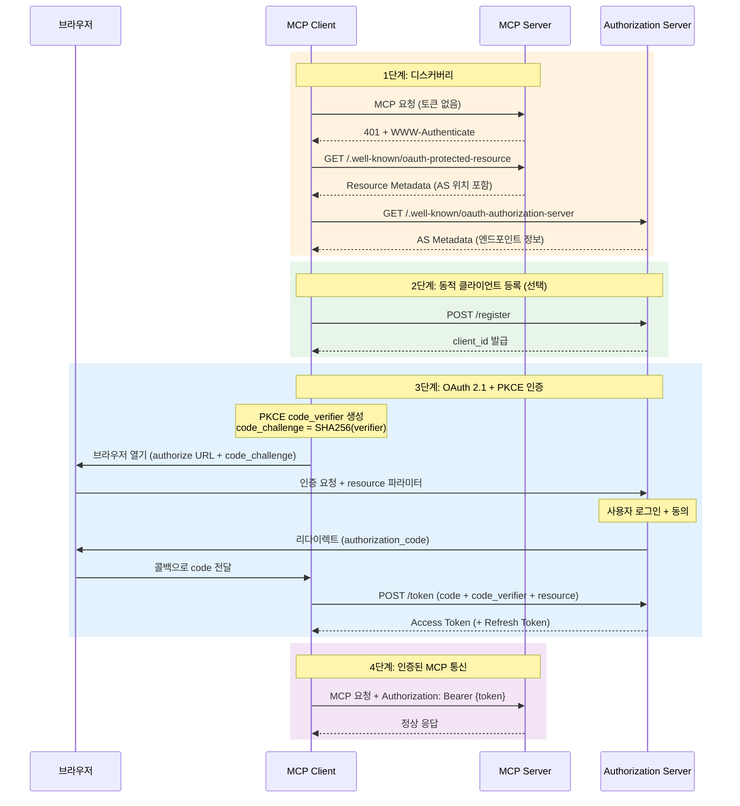

# MCP 인증 아키텍처

> MCP 서버에 인증이 필요한 이유와 OAuth 2.1 기반 인증 플로우의 전체 구조를 이해합니다

## 개요

이 섹션에서는 MCP의 인증 아키텍처를 처음부터 끝까지 살펴봅니다. 로컬에서 stdio로 돌리던 MCP 서버를 원격으로 배포하는 순간, "이 요청은 누가 보낸 거지?"라는 질문이 피할 수 없는 현실이 됩니다. MCP 스펙은 이 문제를 OAuth 2.1이라는 산업 표준으로 해결하는데요, 그 설계 배경과 인증 플로우 전체를 이해하는 것이 이번 섹션의 목표입니다.

**선수 지식**: [Streamable HTTP Transport](02-ch2-mcp-아키텍처와-프로토콜-구조/03-03-transport-계층-streamable-http.md)의 HTTP 기반 통신 이해, [세션 라이프사이클과 Capability Negotiation](02-ch2-mcp-아키텍처와-프로토콜-구조/05-05-세션-라이프사이클과-capability-negotiation.md)의 초기화 흐름

**학습 목표**:
- MCP에서 인증이 필요한 시나리오와 불필요한 시나리오를 구분할 수 있다
- OAuth 2.1이 선택된 배경과 OAuth 2.0 대비 강화된 보안 요소를 설명할 수 있다
- Protected Resource Metadata(RFC 9728) 기반 디스커버리 흐름을 이해한다
- MCP 인증 플로우의 전체 시퀀스(401 → 디스커버리 → 토큰 발급 → 요청)를 구조적으로 이해할 수 있다

## 왜 알아야 할까?

앞선 챕터들에서 우리는 stdio Transport로 로컬 MCP 서버를 만들고, Streamable HTTP로 원격 배포하는 법을 배웠습니다. 하지만 한 가지 빠진 퍼즐 조각이 있었죠 — **"아무나 접근해도 되나?"**라는 질문입니다.

회사 데이터베이스에 접근하는 MCP 서버, 고객 정보를 다루는 API 래핑 서버, 유료 서비스를 제공하는 서버... 이런 서버들이 인증 없이 인터넷에 노출된다면 어떻게 될까요? 데이터 유출, 무단 접근, 비용 폭탄 — 상상만으로도 아찔합니다.

MCP 스펙은 이 문제를 **OAuth 2.1**이라는 검증된 표준으로 해결합니다. 자체 인증을 만들지 않고 업계 표준을 채택한 덕분에, 기존 OAuth 인프라(Auth0, Azure AD, Keycloak 등)를 그대로 활용할 수 있거든요. 이번 챕터에서 인증을 제대로 이해하면, 여러분의 MCP 서버는 프로토타입에서 프로덕션 수준으로 도약합니다.

## 핵심 개념

### 개념 1: 인증이 필요한 순간과 불필요한 순간

> 💡 **비유**: 집 안에서 냉장고를 여는 건 자유롭지만, 회사 서버실에 들어가려면 출입 카드가 필요합니다. MCP도 마찬가지입니다 — **로컬(stdio)은 자유**, **원격(HTTP)은 인증**이 기본 원칙이에요.

MCP 스펙은 인증을 **선택적(OPTIONAL)**으로 정의합니다. 모든 서버가 인증을 구현할 필요는 없다는 거죠. 그렇다면 언제 필요하고, 언제 불필요할까요?

| 시나리오 | Transport | 인증 필요? | 이유 |
|----------|-----------|-----------|------|
| 개발용 로컬 서버 | stdio | 불필요 | OS 프로세스 격리가 보안 경계 |
| Claude Desktop 연결 | stdio | 불필요 | 로컬 프로세스 간 통신 |
| 사내 도구 서버 (VPN 내) | HTTP | 권장 | 내부 사용자 구분 필요 |
| 퍼블릭 API 래핑 서버 | HTTP | **필수** | 인터넷 노출, 무단 접근 위험 |
| 고객 데이터 접근 서버 | HTTP | **필수** | 민감 정보 보호 의무 |
| 유료 서비스 프록시 | HTTP | **필수** | 과금 및 사용량 추적 |

MCP 스펙의 명확한 가이드라인은 이렇습니다:

- **HTTP 기반 Transport** → 이 인증 스펙을 **따라야 합니다(SHOULD)**. 즉, HTTP로 노출되는 MCP 서버라면 OAuth 2.1 기반 인증을 구현하는 것이 강력히 권장됩니다.
- **stdio Transport** → 이 스펙을 **따르지 말아야 합니다(SHOULD NOT)**. stdio는 OS 프로세스 격리가 보안 경계 역할을 하므로, OAuth 같은 네트워크 기반 인증은 오히려 불필요한 복잡성을 추가합니다. 대신 환경 변수(`MCP_API_KEY` 등)에서 자격증명을 가져오는 방식이 적합합니다.
- **기타 Transport** → 해당 프로토콜의 보안 모범 사례를 따를 것. 예를 들어 WebSocket이라면 초기 핸드셰이크에서 토큰을 검증하는 식이죠.

> 📊 **그림 1**: Transport 유형에 따른 인증 전략



이 구분이 중요한 이유가 있습니다. stdio는 OS가 프로세스 간 격리를 보장하기 때문에, 별도 인증 없이도 "이 프로세스를 실행한 사용자 = 권한을 가진 사용자"라는 등식이 성립합니다. 반면 HTTP는 네트워크를 통해 누구든 요청을 보낼 수 있으므로, 요청자의 신원을 확인하는 과정이 반드시 필요합니다.

### 개념 2: 왜 OAuth 2.1인가 — 바퀴를 다시 발명하지 않는 지혜

> 💡 **비유**: 새 건물을 지을 때 전기 규격을 독자적으로 만드는 건축가는 없습니다. 검증된 국가 표준(KS)을 따르죠. MCP도 인증이라는 "전기 배선"에 OAuth 2.1이라는 국제 표준을 채택했습니다.

Anthropic이 MCP 인증에 자체 프로토콜 대신 OAuth 2.1을 선택한 데는 명확한 이유가 있습니다:

**1. 생태계 호환성**: Auth0, Azure AD, Keycloak, Okta 같은 기존 인증 서비스와 즉시 연동됩니다. 새로운 인증 시스템을 구축할 필요가 없어요.

**2. 검증된 보안**: OAuth는 2006년부터 18년 이상 진화하면서 수많은 보안 취약점을 발견하고 보완해왔습니다. 자체 프로토콜로는 이런 성숙도를 달성하기 어렵습니다.

**3. 개발자 친숙성**: 대부분의 백엔드 개발자가 이미 OAuth를 경험해봤기 때문에, 학습 곡선이 낮습니다.

그런데 OAuth 2.0이 아닌 **2.1**인 이유는 뭘까요? OAuth 2.1은 OAuth 2.0의 10년간의 보안 교훈을 통합한 강화 버전입니다:

> 📊 **그림 2**: OAuth 2.0 vs 2.1 — 보안 강화 포인트



| 항목 | OAuth 2.0 | OAuth 2.1 |
|------|-----------|-----------|
| PKCE | 선택 (모바일 앱 권장) | **모든 클라이언트 필수** |
| Implicit Flow | 허용 | **폐지** |
| Resource Owner Password | 허용 | **폐지** |
| TLS | 권장 | **필수** |
| Refresh Token Rotation | 선택 | **퍼블릭 클라이언트 필수** |

MCP가 특히 PKCE를 필수화한 것은 AI 에이전트의 특성 때문입니다. 에이전트는 컨테이너, 서버리스 함수, 또는 데스크톱 앱에서 실행되는데, 이들 중 상당수는 client secret을 안전하게 보관할 수 없는 **퍼블릭 클라이언트**입니다. PKCE는 client secret 없이도 인증 코드 가로채기 공격을 방어하는 메커니즘인데요, 그 작동 원리는 간단합니다:

1. 클라이언트가 랜덤한 비밀 값(`code_verifier`)을 생성합니다
2. 이 값의 SHA256 해시(`code_challenge`)만 Authorization Server에 전송합니다
3. 나중에 토큰을 교환할 때 원본 `code_verifier`를 제시해야 합니다
4. 인증 코드를 가로채더라도, `code_verifier` 없이는 토큰을 얻을 수 없습니다

> 📊 **그림 3**: PKCE의 보안 원리 — 왜 가로채기가 불가능한가



PKCE의 구체적인 코드 구현(파라미터 생성, challenge 계산, 토큰 교환 요청)은 다음 섹션 [OAuth 2.1 + PKCE 구현](11-ch11-인증과-보안/02-02-oauth-21-pkce-구현.md)에서 전체 흐름과 함께 다룹니다.

### 개념 3: MCP 인증 아키텍처 — 세 명의 배우

> 💡 **비유**: 호텔 체크인을 생각해보세요. **투숙객(Client)**이 **프론트 데스크(MCP Server)**에 가면, "신분증 확인은 **본사 시스템(Authorization Server)**에서 해드립니다"라고 안내합니다. 본사에서 투숙객 신원을 확인하고 **룸키(Access Token)**를 발급하면, 그 키로 객실(보호된 리소스)에 접근할 수 있게 됩니다.

MCP 인증에는 세 가지 역할(Role)이 등장합니다:

> 📊 **그림 4**: MCP 인증의 세 가지 역할



각 역할을 코드로 매핑하면:

```python
# MCP Client (OAuth Client 역할)
# - 사용자를 대신하여 MCP 서버에 요청
# - 토큰을 획득하고 요청 헤더에 포함
# - 예: Claude Desktop, 커스텀 에이전트 앱

# MCP Server (Resource Server 역할) 
# - 보호된 도구/리소스를 제공
# - 토큰을 검증하고 권한을 확인
# - 예: DB 서버, API 래핑 서버

# Authorization Server (토큰 발급자)
# - 사용자 인증 수행
# - Access Token / Refresh Token 발급
# - 예: Auth0, Azure AD, Keycloak, 자체 구현
```

핵심은 **MCP 서버 자체는 사용자 인증을 하지 않는다**는 점입니다. MCP 서버는 토큰을 **검증**만 합니다. 실제 로그인 화면, 비밀번호 확인, MFA 같은 인증 로직은 모두 Authorization Server의 몫이에요. 이 분리 덕분에 MCP 서버 개발자는 인증의 복잡성에서 벗어나 비즈니스 로직에 집중할 수 있습니다.

### 개념 4: Protected Resource Metadata — 자동 발견의 마법

> 💡 **비유**: 처음 방문한 병원에서 "접수는 어디서 하나요?"라고 물으면, 안내 데스크에서 "2층 원무과로 가세요"라고 알려주죠. Protected Resource Metadata는 MCP 서버의 "안내 데스크"입니다 — "인증은 이쪽 Authorization Server에서 하세요"라고 자동으로 안내합니다.

RFC 9728(2025년 4월 발행)은 OAuth 2.0 Protected Resource Metadata를 표준화했습니다. MCP 스펙은 이 표준을 **필수(MUST)**로 채택했는데요, 그 이유는 MCP의 특성에 있습니다:

- MCP 클라이언트는 **사전에 모든 MCP 서버를 알 수 없습니다**
- 서버마다 다른 Authorization Server를 사용할 수 있습니다
- 수동 설정은 사용자 경험을 해칩니다

RFC 9728은 이 문제를 **자동 디스커버리**로 해결합니다. MCP 서버가 `.well-known/oauth-protected-resource` 엔드포인트에 자신의 인증 요구사항을 공개하면, 클라이언트가 이를 자동으로 읽어서 적절한 Authorization Server를 찾아가는 거죠.

디스커버리 과정은 다음과 같습니다:

> 📊 **그림 5**: Protected Resource Metadata 디스커버리 시퀀스



Protected Resource Metadata의 핵심 필드를 살펴보면:

```python
# MCP 서버가 반환하는 Protected Resource Metadata 예시
protected_resource_metadata = {
    # 리소스 서버(MCP 서버) 식별자
    "resource": "https://mcp.example.com",
    
    # 이 서버의 인증을 담당하는 Authorization Server 목록
    "authorization_servers": [
        "https://auth.example.com"
    ],
    
    # 지원하는 토큰 타입
    "bearer_methods_supported": ["header"],
    
    # 필요한 OAuth 스코프
    "scopes_supported": ["mcp:tools", "mcp:resources", "mcp:read"]
}
```

```python
# Authorization Server가 반환하는 메타데이터 예시 (RFC 8414)
authorization_server_metadata = {
    "issuer": "https://auth.example.com",
    "authorization_endpoint": "https://auth.example.com/authorize",
    "token_endpoint": "https://auth.example.com/token",
    "registration_endpoint": "https://auth.example.com/register",
    
    # MCP 필수: PKCE 지원
    "code_challenge_methods_supported": ["S256"],
    
    # 지원하는 인증 방식
    "grant_types_supported": ["authorization_code"],
    "response_types_supported": ["code"],
    
    # 지원하는 스코프
    "scopes_supported": ["mcp:tools", "mcp:resources", "openid"]
}
```

> ⚠️ **흔한 오해**: "Protected Resource Metadata는 Authorization Server가 제공하는 것 아닌가요?" — 아닙니다! RFC 9728의 핵심은 **리소스 서버(MCP 서버)** 자신이 자기 인증 요구사항을 공개한다는 것입니다. 마치 "저한테 접근하려면 이 인증 서버에서 토큰을 받아오세요"라고 MCP 서버가 직접 안내하는 구조예요. 이 덕분에 클라이언트는 하드코딩 없이도 임의의 MCP 서버에 연결할 수 있습니다.

### 개념 5: 전체 인증 플로우 — 처음부터 끝까지

앞서 배운 개념들을 하나로 엮으면, MCP의 완전한 인증 플로우가 완성됩니다. 이 플로우는 크게 **디스커버리 단계**와 **인증 단계**로 나뉩니다.

> 📊 **그림 6**: MCP 인증 전체 플로우



각 단계에서 핵심 포인트를 짚어보겠습니다:

**1단계 — 디스커버리**: 클라이언트가 처음 서버에 접속하면 `401 Unauthorized`를 받습니다. 이 응답의 `WWW-Authenticate` 헤더에 Protected Resource Metadata 위치가 담겨 있고, 이를 통해 Authorization Server를 자동으로 찾아갑니다.

**2단계 — 동적 클라이언트 등록(선택)**: MCP 클라이언트가 해당 Authorization Server에 처음 연결하는 경우, RFC 7591에 따라 자동으로 `client_id`를 발급받을 수 있습니다. 이 덕분에 사용자가 수동으로 OAuth 앱을 등록할 필요가 없어요.

**3단계 — PKCE 인증**: 가장 핵심적인 단계입니다. 앞서 개념 2에서 살펴본 PKCE 원리가 여기서 실제로 적용됩니다. 클라이언트가 `code_verifier`를 생성하고, SHA256 해시인 `code_challenge`만 Authorization Server에 보냅니다. 나중에 토큰을 교환할 때 원본 `code_verifier`를 제시해야 하므로, 인증 코드를 가로채더라도 토큰을 얻을 수 없습니다. 이 단계의 전체 구현 코드는 [OAuth 2.1 + PKCE 구현](11-ch11-인증과-보안/02-02-oauth-21-pkce-구현.md)에서 단계별로 작성합니다.

**4단계 — 인증된 통신**: 발급받은 Access Token을 `Authorization: Bearer` 헤더에 담아 모든 MCP 요청에 포함합니다. 중요한 점은 **매 HTTP 요청마다** 토큰을 포함해야 한다는 것입니다 — 같은 논리적 세션이라도 예외 없이요.

## 실습: 직접 해보기

이번 실습에서는 MCP 인증 아키텍처의 두 가지 핵심을 코드로 체험합니다 — **디스커버리 메커니즘**과 **서버 측 토큰 검증 구조**입니다. PKCE 파라미터 생성과 OAuth 플로우 구현은 다음 섹션 [OAuth 2.1 + PKCE 구현](11-ch11-인증과-보안/02-02-oauth-21-pkce-구현.md)에서 완전한 형태로 다루므로, 여기서는 아키텍처 이해에 집중합니다.

### Protected Resource Metadata 디스커버리 시뮬레이션

```run:python
import json

# === MCP 서버가 제공하는 Protected Resource Metadata ===
protected_resource_metadata = {
    "resource": "https://mcp.example.com",
    "authorization_servers": ["https://auth.example.com"],
    "bearer_methods_supported": ["header"],
    "scopes_supported": ["mcp:tools", "mcp:resources"]
}

# === Authorization Server 메타데이터 (RFC 8414) ===
as_metadata = {
    "issuer": "https://auth.example.com",
    "authorization_endpoint": "https://auth.example.com/authorize",
    "token_endpoint": "https://auth.example.com/token",
    "registration_endpoint": "https://auth.example.com/register",
    "code_challenge_methods_supported": ["S256"],
    "grant_types_supported": ["authorization_code"],
    "response_types_supported": ["code"],
    "scopes_supported": ["mcp:tools", "mcp:resources", "openid"]
}

def discover_auth_config(server_url: str) -> dict:
    """MCP 서버의 인증 설정을 자동 디스커버리합니다."""
    # 1단계: Protected Resource Metadata 가져오기
    prm_url = f"{server_url}/.well-known/oauth-protected-resource"
    print(f"[1] GET {prm_url}")
    print(f"    -> authorization_servers: {protected_resource_metadata['authorization_servers']}")
    
    # 2단계: Authorization Server 메타데이터 가져오기
    as_url = protected_resource_metadata["authorization_servers"][0]
    as_meta_url = f"{as_url}/.well-known/oauth-authorization-server"
    print(f"[2] GET {as_meta_url}")
    print(f"    -> authorization_endpoint: {as_metadata['authorization_endpoint']}")
    print(f"    -> token_endpoint: {as_metadata['token_endpoint']}")
    print(f"    -> PKCE 지원: {'S256' in as_metadata['code_challenge_methods_supported']}")
    
    return {
        "resource_server": protected_resource_metadata["resource"],
        "auth_endpoint": as_metadata["authorization_endpoint"],
        "token_endpoint": as_metadata["token_endpoint"],
        "registration_endpoint": as_metadata.get("registration_endpoint"),
        "scopes": protected_resource_metadata["scopes_supported"],
    }

config = discover_auth_config("https://mcp.example.com")
print(f"\n디스커버리 완료!")
print(json.dumps(config, indent=2))
```

```output
[1] GET https://mcp.example.com/.well-known/oauth-protected-resource
    -> authorization_servers: ['https://auth.example.com']
[2] GET https://auth.example.com/.well-known/oauth-authorization-server
    -> authorization_endpoint: https://auth.example.com/authorize
    -> token_endpoint: https://auth.example.com/token
    -> PKCE 지원: True

디스커버리 완료!
{
  "resource_server": "https://mcp.example.com",
  "auth_endpoint": "https://auth.example.com/authorize",
  "token_endpoint": "https://auth.example.com/token",
  "registration_endpoint": "https://auth.example.com/register",
  "scopes": ["mcp:tools", "mcp:resources"]
}
```

### FastMCP 서버에 토큰 검증 적용

실제 MCP 서버에서 토큰을 검증하는 코드를 살펴봅시다. FastMCP는 `TokenVerifier` 프로토콜을 통해 토큰 검증을 추상화합니다. 여기서는 `TokenVerifier`의 **개념적 구조**를 이해하는 데 집중하겠습니다 — JWT 서명 검증, JWKS 키 로테이션 등 실제 구현 세부사항은 [토큰 검증과 권한 관리](11-ch11-인증과-보안/03-03-토큰-검증과-권한-관리.md)에서 `JWTTokenVerifier`를 완전한 형태로 구현합니다.

```python
from dataclasses import dataclass
from fastmcp import FastMCP
from fastmcp.server.auth import TokenVerifier, AccessToken

# 커스텀 토큰 검증기 — 개념적 구조
# (실제 JWT 검증 로직은 11.3 섹션에서 JWTTokenVerifier로 완전 구현합니다)
@dataclass
class MyTokenVerifier(TokenVerifier):
    """토큰을 검증하고 클레임을 추출하는 검증기의 뼈대입니다."""
    
    jwks_uri: str = "https://auth.example.com/.well-known/jwks.json"
    issuer: str = "https://auth.example.com"
    audience: str = "https://mcp.example.com"
    
    async def verify_token(self, token: str) -> AccessToken | None:
        """
        토큰을 검증하고 AccessToken을 반환합니다.
        검증 실패 시 None을 반환하면 다음 검증기로 넘어갑니다.
        
        이 메서드 안에서 수행해야 할 작업:
        1. JWKS에서 공개키 가져오기
        2. JWT 서명 검증
        3. issuer, audience, 만료시간 등 클레임 검증
        4. 검증 통과 시 AccessToken 객체 반환
        """
        try:
            # TODO: 실제 JWT 검증 로직 (11.3에서 구현)
            # import jwt
            # from jwt import PyJWKClient
            # jwks_client = PyJWKClient(self.jwks_uri)
            # signing_key = jwks_client.get_signing_key_from_jwt(token)
            # payload = jwt.decode(token, signing_key.key, 
            #     algorithms=["RS256"],
            #     audience=self.audience,
            #     issuer=self.issuer)
            
            # 검증 성공 시 AccessToken 반환
            return AccessToken(
                token=token,
                client_id="client_abc123",
                scopes=["mcp:tools", "mcp:resources"],
            )
        except Exception:
            return None  # 검증 실패 → None 반환

# FastMCP 서버에 인증 적용
mcp = FastMCP(
    name="SecureMCPServer",
    auth=MyTokenVerifier(
        jwks_uri="https://auth.example.com/.well-known/jwks.json",
        issuer="https://auth.example.com",
        audience="https://mcp.example.com",
    ),
)

@mcp.tool
def get_user_data(user_id: str) -> dict:
    """사용자 데이터를 조회합니다. 인증된 요청만 허용됩니다."""
    return {"user_id": user_id, "name": "김철수", "email": "kim@example.com"}

# 서버 실행 (Streamable HTTP)
if __name__ == "__main__":
    mcp.run(transport="streamablehttp", host="0.0.0.0", port=8000)
```

이 코드에서 주목할 점:

1. **`TokenVerifier` 프로토콜**: `verify_token` 메서드만 구현하면 됩니다. 검증 성공 시 `AccessToken`을, 실패 시 `None`을 반환합니다. 이 섹션에서는 인터페이스의 **구조와 역할**을 이해하는 것이 목표이며, JWT 서명 검증, JWKS 키 페치, 클레임 유효성 검사 등 프로덕션 수준의 구현은 [토큰 검증과 권한 관리](11-ch11-인증과-보안/03-03-토큰-검증과-권한-관리.md)에서 다룹니다.
2. **관심사 분리**: 서버 코드(`get_user_data`)는 인증 로직을 전혀 모릅니다. 인증은 프레임워크 레벨에서 처리됩니다.
3. **audience 검증**: 토큰이 이 서버를 대상으로 발급된 것인지 반드시 확인합니다. 다른 서버용 토큰을 수락하면 보안 취약점이 됩니다.

## 더 깊이 알아보기

### OAuth의 탄생 — 비밀번호를 공유하던 시대

2006년, Twitter에서 일하던 Blaine Cook은 난감한 상황에 처했습니다. 서드파티 앱이 Twitter API를 사용하려면 사용자의 **아이디와 비밀번호를 직접 받아야** 했거든요. 사용자가 자기 비밀번호를 낯선 앱에 입력하는 건 위험천만한 일이었죠.

Cook은 Chris Messina와 함께 이 문제를 논의했고, David Recordon, Larry Halff 등이 합류하면서 2007년 4월 "API 접근 위임을 위한 오픈 프로토콜" 프로젝트가 시작되었습니다. 그해 10월, OAuth Core 1.0 초안이 공개됩니다.

이후 Eran Hammer가 프로젝트에 합류하여 커뮤니티 의장이자 스펙 편집자 역할을 맡으면서, OAuth 2.0이 IETF 워킹 그룹에서 본격적으로 개발됩니다. 2012년 RFC 6749로 표준화된 OAuth 2.0은 웹의 인증 표준이 되었지만, Hammer 자신은 "기업 이해관계가 스펙을 복잡하게 만들었다"며 사임하기도 했습니다.

그로부터 10여 년이 흐르고, 그동안 발견된 수십 개의 보안 BCP(Best Current Practice)를 하나로 통합한 것이 바로 **OAuth 2.1**입니다. MCP가 이 최신 버전을 채택한 것은, 18년간의 교훈을 한 번에 흡수하겠다는 의미입니다.

### RFC 9728 — 9년 만에 빛을 본 아이디어

Protected Resource Metadata(RFC 9728)의 첫 초안이 작성된 것은 **2016년**입니다. 하지만 당시에는 OAuth 2.0 생태계가 이미 충분히 성숙해서 이런 디스커버리 메커니즘의 필요성이 크지 않았습니다. 초안은 IETF에서 수년간 잠들어 있었죠.

그런데 2024~2025년, AI 에이전트 시대가 열리면서 상황이 바뀌었습니다. 에이전트가 **사전에 알 수 없는** 수십, 수백 개의 API 서버에 동적으로 연결해야 하는 시나리오가 현실이 된 거예요. 바로 이때 RFC 9728이 빛을 발했고, 2025년 4월에 정식 RFC로 발행됩니다. 그리고 MCP 스펙은 이를 필수 요구사항으로 채택했습니다 — 9년 만에 자신의 존재 이유를 찾은 셈이죠.

## 흔한 오해와 팁

> ⚠️ **흔한 오해**: "MCP 서버가 OAuth Authorization Server를 내장해야 한다" — 아닙니다! MCP 서버는 **Resource Server**(토큰 검증자) 역할만 합니다. Authorization Server는 Auth0, Azure AD, Keycloak 같은 외부 서비스를 사용하는 것이 권장됩니다. 인증 시스템을 직접 구현하는 것은 보안 리스크가 큽니다.

> 💡 **알고 계셨나요?**: OAuth 2.1의 PKCE에서 `code_verifier`는 인증 요청 시에는 네트워크로 전송되지 않습니다. Authorization Server는 `code_challenge`(해시값)만 받고, 토큰 교환 단계에서야 비로소 `code_verifier`를 받아 해시를 비교합니다. 인증 코드가 가로채여도 원본 `code_verifier`가 없으면 토큰을 얻을 수 없는 구조입니다.

> 🔥 **실무 팁**: MCP 서버를 개발할 때는 처음부터 인증을 넣지 마세요. stdio Transport로 기능을 완성하고, Streamable HTTP로 배포할 때 `TokenVerifier`를 추가하는 것이 효율적입니다. FastMCP의 `auth` 파라미터 하나로 인증을 on/off할 수 있으니까요.

## 핵심 정리

| 개념 | 설명 |
|------|------|
| 인증 필요 시점 | HTTP Transport로 원격 배포 시, 특히 민감 데이터나 유료 서비스 |
| OAuth 2.1 선택 이유 | 생태계 호환성, 검증된 보안, 개발자 친숙성 |
| 세 가지 역할 | MCP Client(요청자), MCP Server(Resource Server), Authorization Server(토큰 발급) |
| Protected Resource Metadata | RFC 9728. MCP 서버가 자신의 인증 요구사항을 `.well-known` 엔드포인트로 공개 |
| 디스커버리 흐름 | 401 → PRM 조회 → AS 메타데이터 조회 → OAuth 플로우 시작 |
| PKCE 개념 | 인증 코드 가로채기 방지. `code_verifier`의 해시를 `code_challenge`로 전송. 구현은 11.2에서 |
| 동적 클라이언트 등록 | RFC 7591. 사전 등록 없이 `client_id` 자동 발급 |
| Resource Indicators | RFC 8707. 토큰의 대상 서버를 `resource` 파라미터로 명시 |
| 토큰 사용 | 매 HTTP 요청마다 `Authorization: Bearer` 헤더에 포함 필수 |
| TokenVerifier | 토큰 검증 인터페이스 (개념). 실제 JWT 구현은 11.3에서 다룸 |

## 다음 섹션 미리보기

이번 섹션에서 MCP 인증의 전체 그림을 그려보았으니, 다음 섹션 [OAuth 2.1 + PKCE 구현](11-ch11-인증과-보안/02-02-oauth-21-pkce-구현.md)에서는 이 플로우를 **실제 코드로 구현**합니다. PKCE 파라미터 생성부터 Authorization Code 교환, 토큰 갱신까지 — 동작하는 완전한 OAuth 클라이언트와 서버를 함께 만들어볼 거예요.

## 참고 자료

- [MCP Authorization Specification (2025-06-18)](https://modelcontextprotocol.io/specification/2025-06-18/basic/authorization) - MCP 인증 스펙 공식 문서. 이 섹션의 모든 MUST/SHOULD 요구사항의 원본
- [RFC 9728: OAuth 2.0 Protected Resource Metadata](https://datatracker.ietf.org/doc/rfc9728/) - Protected Resource Metadata 표준. 디스커버리 메커니즘의 기반
- [MCP, OAuth 2.1, PKCE, and the Future of AI Authorization — Aembit](https://aembit.io/blog/mcp-oauth-2-1-pkce-and-the-future-of-ai-authorization/) - PKCE의 보안 이점과 인프라 기반 인증의 한계를 분석한 글
- [MCP Python SDK — GitHub](https://github.com/modelcontextprotocol/python-sdk) - Python SDK의 OAuth 구현 코드. `src/mcp/server/auth/` 디렉토리 참조
- [FastMCP Authentication Documentation](https://gofastmcp.com/python-sdk/fastmcp-server-auth-auth) - FastMCP의 TokenVerifier, AuthProvider 등 인증 API 레퍼런스
- [Implementing Authentication in a Remote MCP Server with Python](https://gelembjuk.com/blog/post/authentication-remote-mcp-server-python/) - Middleware 기반 Bearer 토큰 인증 실전 가이드
- [OAuth 2.1 IETF Draft (draft-ietf-oauth-v2-1-13)](https://datatracker.ietf.org/doc/html/draft-ietf-oauth-v2-1-13) - OAuth 2.1 최신 드래프트 스펙

---
### 🔗 Related Sessions
- [streamable http transport](01-ch1-mcp의-탄생과-설계-철학/04-04-mcp-스펙-변천사와-2026-로드맵.md) (prerequisite)
