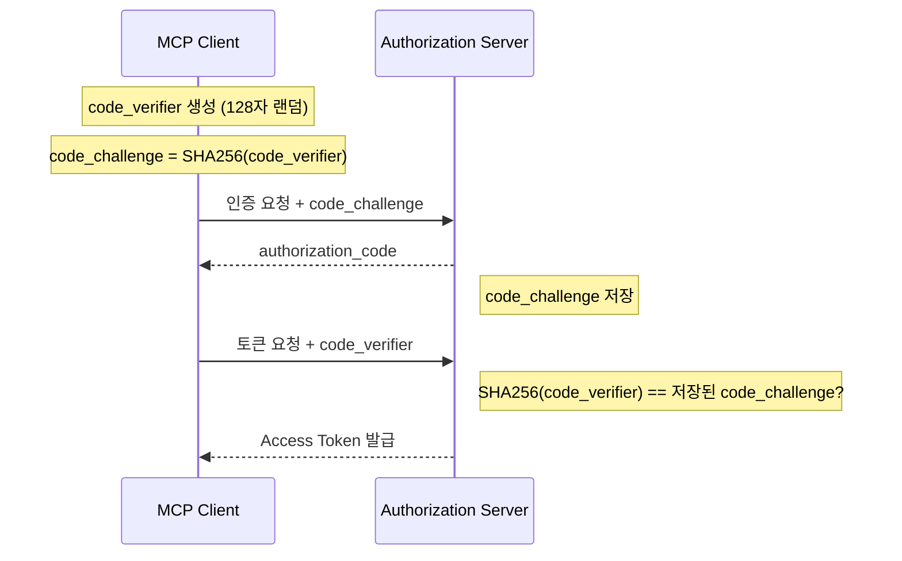
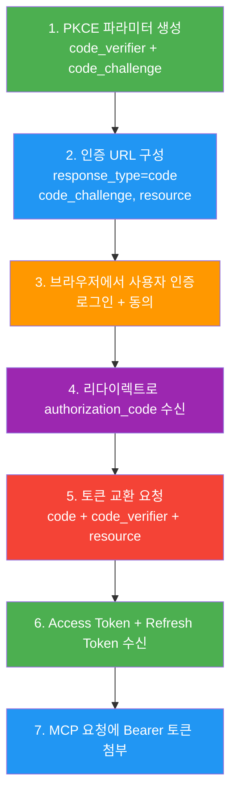
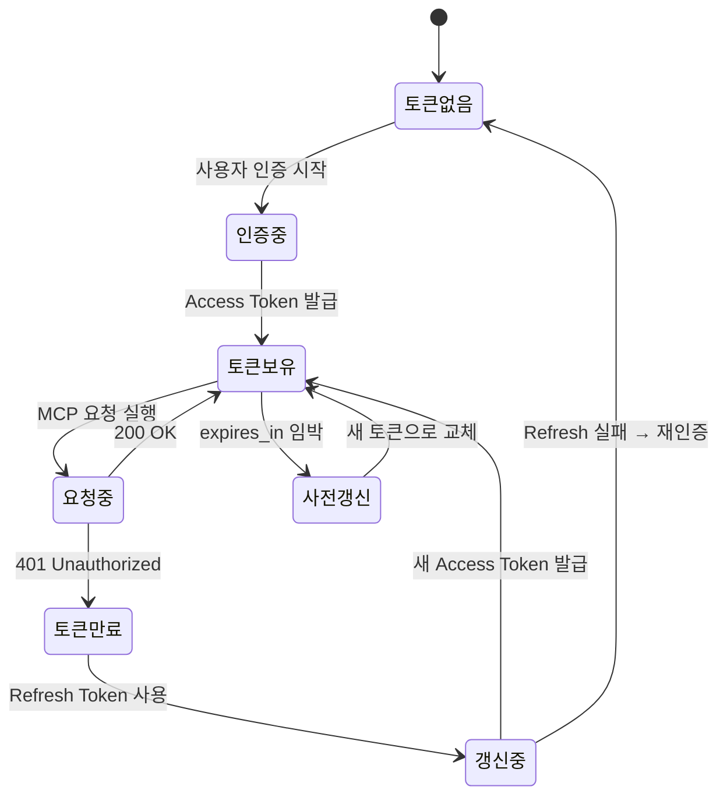
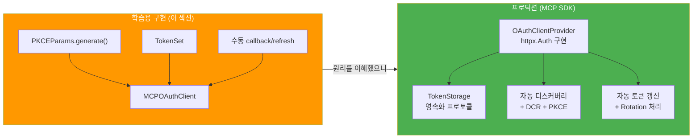
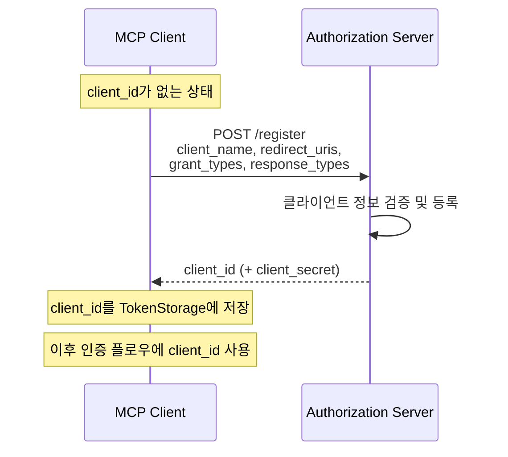

# OAuth 2.1 + PKCE 구현

> Authorization Code Flow with PKCE의 단계별 구현 — code_verifier 생성부터 토큰 갱신 자동화까지

## 개요

이 섹션에서는 [MCP 인증 아키텍처](11-ch11-인증과-보안/01-01-mcp-인증-아키텍처.md)에서 살펴본 전체 인증 플로우를 **실제 동작하는 코드**로 구현합니다. 이전 섹션에서 "401을 받으면 디스커버리 → PKCE → 토큰 교환"이라는 큰 그림을 그렸다면, 이번에는 그 각 단계를 한 줄 한 줄 코드로 채워넣는 시간입니다.

**선수 지식**: [MCP 인증 아키텍처](11-ch11-인증과-보안/01-01-mcp-인증-아키텍처.md)의 3역할 모델(Client/Server/AS)과 Protected Resource Metadata 디스커버리 흐름, [Streamable HTTP 클라이언트](09-ch9-mcp-클라이언트-개발/05-05-streamable-http-클라이언트.md)의 HTTP 기반 MCP 통신 이해

**학습 목표**:
- PKCE 파라미터(code_verifier, code_challenge)를 직접 생성하고 S256 해싱 원리를 이해한다
- Authorization Code Flow의 전체 단계를 코드로 구현할 수 있다
- Access Token / Refresh Token의 관리 및 자동 갱신 로직을 작성할 수 있다
- MCP Python SDK의 `OAuthClientProvider`와 `TokenStorage`를 활용할 수 있다

## 왜 알아야 할까?

이전 섹션에서 "인증이 왜 필요한지", "어떤 표준을 쓰는지"를 이해했습니다. 하지만 **이해하는 것**과 **구현할 수 있는 것**은 전혀 다른 이야기입니다.

실제 프로덕션에서 OAuth 인증을 구현할 때 마주치는 현실은 이렇거든요:

- `code_verifier`를 43자로 만들었는데 왜 인증 서버가 거부하는 거지?
- Token endpoint에 `resource` 파라미터를 빠뜨려서 1시간째 디버깅 중...
- Access Token이 만료됐는데 새 토큰은 어떻게 받지? 사용자에게 다시 로그인하라고?
- 토큰을 어디에 저장하지? 메모리? 파일? 데이터베이스?

이 섹션을 마치면 이런 질문들 모두에 자신 있게 답할 수 있습니다. 특히 MCP Python SDK가 제공하는 `OAuthClientProvider`는 이 모든 과정을 자동화해주는데, 내부 원리를 모르면 디버깅이 불가능합니다. "마법처럼 되는" 코드의 뚜껑을 열어보는 시간이에요.

이번 섹션에서는 먼저 각 단계를 **직접 구현하여 원리를 이해**한 뒤, 마지막에 MCP SDK의 `OAuthClientProvider`가 이 모든 것을 어떻게 자동화하는지 살펴봅니다. 직접 만든 코드(`MCPOAuthClient`)는 학습용이고, 프로덕션에서는 SDK 클래스를 사용한다는 점을 기억하세요.

## 핵심 개념

### 개념 1: PKCE — 비밀 없는 인증의 비밀 무기

> 💡 **비유**: 택배를 보낼 때 상자 안에 랜덤한 퍼즐 조각(code_verifier)을 넣고, 그 조각의 사진(code_challenge)만 택배 회사에 미리 보냅니다. 나중에 수취인이 상자를 열 때, 안에 든 퍼즐 조각이 사진과 일치하는지 대조하면 — 중간에 누가 바꿔치기를 했는지 아닌지 바로 알 수 있습니다.

PKCE(Proof Key for Code Exchange, "픽시"라고 읽습니다)는 Authorization Code가 중간에 가로채이는 공격을 방어하는 메커니즘입니다. 핵심 아이디어는 놀랍도록 간단합니다:

1. 클라이언트가 **랜덤 문자열**(code_verifier)을 만든다
2. 그 문자열의 **SHA-256 해시**(code_challenge)를 인증 요청에 보낸다
3. 인증 코드를 받은 뒤, 토큰 교환 시 **원본 문자열**(code_verifier)을 보낸다
4. 서버가 code_verifier를 해싱해서 처음 받은 code_challenge와 비교한다

> 📊 **그림 1**: PKCE의 핵심 원리 — 해시로 증명하기



공격자가 중간에 authorization_code를 가로챈다 해도, code_verifier를 모르기 때문에 토큰을 교환할 수 없습니다. SHA-256은 단방향 해시이므로 code_challenge에서 code_verifier를 역산하는 것도 불가능하죠.

**code_verifier 생성 규칙 (RFC 7636)**:

이전 섹션에서 `generate_pkce_params()` 함수를 독립 함수로 작성했는데, 프로덕션에서는 관련 데이터를 하나로 묶는 것이 관리하기 편합니다. 여기서는 `PKCEParams` 데이터클래스의 `generate()` 클래스 메서드로 캡슐화합니다. 동일한 로직이지만, verifier와 challenge가 항상 쌍으로 묶여 있어서 실수로 잘못된 조합을 사용할 위험이 사라지죠.

```python
import secrets
import string
import hashlib
import base64
from dataclasses import dataclass

@dataclass
class PKCEParams:
    """PKCE 파라미터를 하나의 단위로 관리합니다.
    
    이전 섹션의 generate_pkce_params() 독립 함수를
    데이터클래스 + 클래스 메서드로 캡슐화한 프로덕션 버전입니다.
    """
    code_verifier: str
    code_challenge: str
    
    @classmethod
    def generate(cls) -> "PKCEParams":
        """암호학적으로 안전한 PKCE 파라미터를 생성합니다."""
        # [A-Z] / [a-z] / [0-9] / "-" / "." / "_" / "~"
        unreserved = string.ascii_letters + string.digits + "-._~"
        code_verifier = "".join(
            secrets.choice(unreserved) for _ in range(128)
        )
        
        # SHA-256 → base64url (패딩 제거)
        digest = hashlib.sha256(
            code_verifier.encode("utf-8")
        ).digest()
        code_challenge = (
            base64.urlsafe_b64encode(digest)
            .decode("utf-8")
            .rstrip("=")
        )
        return cls(
            code_verifier=code_verifier,
            code_challenge=code_challenge,
        )
```

여기서 `secrets.choice`를 쓰는 이유가 중요합니다. `random.choice`는 예측 가능한 의사난수(PRNG)를 사용하지만, `secrets.choice`는 **암호학적으로 안전한 난수(CSPRNG)**를 생성합니다. 보안 토큰 생성에서 `random` 모듈은 절대 사용하면 안 됩니다.

```run:python
import secrets
import string
import hashlib
import base64

# PKCE 파라미터 생성
unreserved = string.ascii_letters + string.digits + "-._~"
code_verifier = "".join(secrets.choice(unreserved) for _ in range(128))

# SHA-256 해싱 → base64url 인코딩
digest = hashlib.sha256(code_verifier.encode("utf-8")).digest()
code_challenge = base64.urlsafe_b64encode(digest).decode("utf-8").rstrip("=")

print(f"code_verifier 길이: {len(code_verifier)}")
print(f"code_verifier (앞 40자): {code_verifier[:40]}...")
print(f"code_challenge: {code_challenge}")
print(f"code_challenge 길이: {len(code_challenge)}")
print(f"method: S256")
```

```output
code_verifier 길이: 128
code_verifier (앞 40자): kY7z~bR3Lm.vN9pX-wQ2dF6jT8sA0cE4gH1iK...
code_challenge: x2Gth4FbN9kJqW1mP5vR8yZ0aD3eH6iL-wT9uB2cF7o
code_challenge 길이: 43
method: S256
```

> ⚠️ **흔한 오해**: code_verifier의 길이를 43자로 맞추는 개발자가 많습니다. 동작은 하지만, **보안상 128자를 권장합니다**. RFC 7636에서 43~128자를 허용하는데, 짧을수록 브루트포스에 취약해집니다. MCP Python SDK도 128자를 사용합니다.

### 개념 2: Authorization Code Flow 전체 흐름

> 💡 **비유**: 해외여행에서 환전하는 과정과 비슷합니다. 여권(인증)을 제시하면 환전소에서 환전증(authorization code)을 줍니다. 그 환전증을 가지고 은행 창구(token endpoint)에 가면 실제 외화(access token)로 바꿔줍니다. 환전증은 일회용이고 짧은 시간만 유효해요 — authorization code도 마찬가지입니다.

이제 전체 Authorization Code Flow를 단계별로 코드와 함께 살펴보겠습니다. [MCP 인증 아키텍처](11-ch11-인증과-보안/01-01-mcp-인증-아키텍처.md)에서 배운 디스커버리로 `authorization_endpoint`와 `token_endpoint`를 확보한 뒤, 실제 인증이 시작되는 부분입니다.

> 📊 **그림 2**: Authorization Code Flow with PKCE — 전체 단계 (디스커버리 이후)



**Step 1-2: PKCE 생성 + 인증 URL 구성**

```python
from urllib.parse import urlencode
import secrets

def build_authorization_url(
    auth_endpoint: str,        # AS의 authorization_endpoint
    client_id: str,            # 등록된 클라이언트 ID
    redirect_uri: str,         # 콜백 URI
    code_challenge: str,       # PKCE challenge
    resource: str,             # MCP 서버의 canonical URL
    scopes: list[str] | None = None,
) -> tuple[str, str]:
    """인증 URL을 구성합니다.
    
    Returns:
        (authorization_url, state) 튜플
    """
    # state: CSRF 방지용 랜덤 문자열
    state = secrets.token_urlsafe(32)
    
    params = {
        "response_type": "code",          # 항상 "code" (OAuth 2.1)
        "client_id": client_id,
        "redirect_uri": redirect_uri,
        "code_challenge": code_challenge,
        "code_challenge_method": "S256",  # MCP: S256만 허용
        "state": state,
        "resource": resource,             # RFC 8707 — MCP 필수!
    }
    
    if scopes:
        params["scope"] = " ".join(scopes)
    
    url = f"{auth_endpoint}?{urlencode(params)}"
    return url, state
```

여기서 `resource` 파라미터에 주목하세요. 이건 일반 OAuth에서는 선택적이지만, **MCP에서는 필수**입니다. RFC 8707(Resource Indicators)에 따라, 이 토큰이 **어떤 MCP 서버를 위한 것인지** 명시적으로 지정합니다. 이 `resource` 값은 디스커버리 단계에서 Protected Resource Metadata의 `resource` 필드로 획득한 것입니다(자세한 내용은 [MCP 인증 아키텍처](11-ch11-인증과-보안/01-01-mcp-인증-아키텍처.md)의 디스커버리 섹션 참고). 이를 통해 토큰이 다른 서버에서 오용되는 것을 방지합니다.

**Step 3-4: 사용자 인증 + 콜백 수신**

```python
import webbrowser
from urllib.parse import urlparse, parse_qs

def start_authorization(auth_url: str) -> None:
    """브라우저를 열어 사용자 인증을 시작합니다."""
    print(f"브라우저에서 인증을 진행하세요:")
    print(f"  {auth_url[:80]}...")
    webbrowser.open(auth_url)

def handle_callback(callback_url: str, expected_state: str) -> str:
    """리다이렉트 콜백에서 authorization code를 추출합니다.
    
    Returns:
        authorization_code
    
    Raises:
        ValueError: state 불일치 또는 에러 응답 시
    """
    parsed = urlparse(callback_url)
    params = parse_qs(parsed.query)
    
    # 에러 응답 확인
    if "error" in params:
        error = params["error"][0]
        description = params.get("error_description", [""])[0]
        raise ValueError(f"인증 실패: {error} — {description}")
    
    # CSRF 방지: state 검증
    received_state = params.get("state", [None])[0]
    if received_state != expected_state:
        raise ValueError(
            "state 불일치 — CSRF 공격 가능성!"
        )
    
    # authorization_code 추출
    code = params.get("code", [None])[0]
    if not code:
        raise ValueError("authorization_code가 없습니다")
    
    return code
```

> 🔥 **실무 팁**: `state` 파라미터 검증을 건너뛰는 개발자가 많은데, 이건 **CSRF(Cross-Site Request Forgery) 공격**에 직접 노출되는 행위입니다. 공격자가 자신의 authorization_code를 피해자의 세션에 주입할 수 있어요. state 검증은 반드시 수행하세요.

**Step 5: 토큰 교환**

```python
import httpx

async def exchange_token(
    token_endpoint: str,
    code: str,
    code_verifier: str,
    client_id: str,
    redirect_uri: str,
    resource: str,
    client_secret: str | None = None,
) -> dict:
    """Authorization Code를 Access Token으로 교환합니다."""
    data = {
        "grant_type": "authorization_code",
        "code": code,
        "redirect_uri": redirect_uri,
        "client_id": client_id,
        "code_verifier": code_verifier,    # PKCE 원본
        "resource": resource,               # MCP 필수
    }
    
    headers = {"Content-Type": "application/x-www-form-urlencoded"}
    
    # Confidential Client인 경우 client_secret 추가
    if client_secret:
        # client_secret_post 방식
        data["client_secret"] = client_secret
    
    async with httpx.AsyncClient() as client:
        response = await client.post(
            token_endpoint,
            data=data,
            headers=headers,
        )
    
    if response.status_code != 200:
        raise ValueError(
            f"토큰 교환 실패 ({response.status_code}): "
            f"{response.text}"
        )
    
    token_data = response.json()
    # token_type 정규화 (RFC: 대소문자 구분 없음)
    token_data["token_type"] = token_data.get(
        "token_type", "Bearer"
    ).title()
    
    return token_data
```

토큰 교환 응답은 이런 형태입니다:

```python
# 성공 응답 예시
{
    "access_token": "eyJhbGciOiJSUzI1NiIs...",
    "token_type": "Bearer",
    "expires_in": 3600,          # 1시간
    "refresh_token": "dGhpcyBpcyBhIHJlZnJl...",
    "scope": "mcp:tools mcp:resources"
}
```

### 개념 3: 토큰 관리와 자동 갱신

> 💡 **비유**: Access Token은 영화관 입장권처럼 **유효 시간이 정해져** 있습니다. 만료되면 다시 사러 가야 하죠. 하지만 Refresh Token은 **시즌 패스** 같은 것입니다 — 입장권이 만료되면 매표소에서 패스만 보여주면 새 입장권을 받을 수 있어요. 매번 신분증(비밀번호)을 다시 제시할 필요가 없습니다.

Access Token은 의도적으로 수명이 짧습니다(보통 15분~1시간). 토큰이 유출되더라도 피해 기간을 최소화하기 위해서인데요, 그렇다고 매번 사용자에게 로그인을 요구할 수는 없습니다. 이 딜레마를 해결하는 것이 Refresh Token입니다.

> 📊 **그림 3**: 토큰 생명주기와 자동 갱신 흐름



**Refresh Token 교환 구현**:

```python
async def refresh_access_token(
    token_endpoint: str,
    refresh_token: str,
    client_id: str,
    resource: str,
    client_secret: str | None = None,
) -> dict:
    """Refresh Token으로 새 Access Token을 발급받습니다."""
    data = {
        "grant_type": "refresh_token",
        "refresh_token": refresh_token,
        "client_id": client_id,
        "resource": resource,              # MCP 필수
    }
    
    if client_secret:
        data["client_secret"] = client_secret
    
    async with httpx.AsyncClient() as client:
        response = await client.post(
            token_endpoint,
            data=data,
            headers={"Content-Type": "application/x-www-form-urlencoded"},
        )
    
    if response.status_code != 200:
        # Refresh 실패 → 전체 재인증 필요
        raise ValueError(
            f"토큰 갱신 실패: {response.status_code}"
        )
    
    token_data = response.json()
    
    # OAuth 2.1: Refresh Token Rotation
    # 응답에 새 refresh_token이 포함될 수 있음 — 반드시 교체!
    return token_data
```

**사전 갱신(Proactive Refresh)** 전략이 중요합니다. 토큰이 완전히 만료된 뒤에 갱신하면, 그 사이에 요청이 실패합니다. 실무에서는 만료 시점 **이전에** 미리 갱신합니다:

```python
import time

class TokenManager:
    """Access Token의 생명주기를 관리합니다."""
    
    # 만료 N초 전에 사전 갱신 (버퍼)
    EXPIRY_BUFFER_SECONDS = 300  # 5분
    
    def __init__(self):
        self.access_token: str | None = None
        self.refresh_token: str | None = None
        self.token_expiry: float = 0  # Unix timestamp
    
    def store_tokens(self, token_data: dict) -> None:
        """토큰 응답을 저장합니다."""
        self.access_token = token_data["access_token"]
        self.refresh_token = token_data.get("refresh_token")
        
        expires_in = token_data.get("expires_in", 3600)
        self.token_expiry = time.time() + expires_in
    
    def is_token_valid(self) -> bool:
        """토큰이 아직 유효한지 확인합니다."""
        if not self.access_token:
            return False
        # 버퍼를 포함하여 만료 여부 판단
        return time.time() < (
            self.token_expiry - self.EXPIRY_BUFFER_SECONDS
        )
    
    def needs_refresh(self) -> bool:
        """갱신이 필요한지 확인합니다."""
        return (
            not self.is_token_valid() 
            and self.refresh_token is not None
        )
```

> 💡 **알고 계셨나요?**: OAuth 2.1에서 퍼블릭 클라이언트의 **Refresh Token Rotation**이 필수인 이유가 있습니다. Refresh Token을 갱신할 때마다 기존 토큰은 폐기되고 새 토큰이 발급됩니다. 만약 공격자가 Refresh Token을 탈취해서 먼저 사용하면, 정상 사용자의 갱신이 실패하면서 **탈취 사실이 드러나게** 됩니다. 이런 "재사용 탐지(Reuse Detection)" 메커니즘은 2020년 [OAuth 2.0 Security BCP](https://datatracker.ietf.org/doc/html/draft-ietf-oauth-security-topics)에서 공식 권고로 채택되었습니다.

### 개념 4: MCP Python SDK의 OAuthClientProvider

> 💡 **비유**: 지금까지 자동차 엔진의 각 부품(피스톤, 크랭크축, 캠축)을 하나씩 만들어봤다면, 이제는 완성된 엔진 — MCP SDK의 `OAuthClientProvider`를 살펴볼 차례입니다. 부품의 동작 원리를 알기 때문에, 엔진이 고장 났을 때 어디를 살펴야 하는지 알 수 있습니다.

지금까지 `MCPOAuthClient`라는 이름으로 각 단계를 직접 구현했는데요, 이건 **원리 학습을 위한 교육용 구현**이었습니다. 실제 프로덕션에서는 MCP Python SDK가 제공하는 `OAuthClientProvider`를 사용합니다. 이 클래스는 우리가 만든 것과 동일한 로직(디스커버리 → PKCE → 토큰 교환 → 자동 갱신)을 모두 내장하고 있으며, httpx의 `Auth` 인터페이스를 구현하여 모든 HTTP 요청에 자동으로 인증을 적용합니다.

둘의 관계를 정리하면 이렇습니다:

> 📊 **그림 4**: 학습용 구현 vs SDK 프로덕션 클래스



| 항목 | MCPOAuthClient (학습용) | OAuthClientProvider (SDK) |
|------|------------------------|--------------------------|
| **목적** | PKCE/토큰 교환 원리 이해 | 프로덕션 사용 |
| **토큰 저장** | 메모리 내 `TokenSet` | `TokenStorage` 프로토콜 (영속화) |
| **자동 갱신** | `get_valid_token()` 수동 호출 | httpx.Auth로 완전 자동 |
| **DCR** | 미지원 | 자동 지원 |
| **에러 처리** | 기본 ValueError | 재시도, 폴백 내장 |

**TokenStorage 프로토콜 구현**:

SDK가 요구하는 `TokenStorage`는 토큰과 클라이언트 정보를 영속화하는 인터페이스입니다:

```python
from mcp.shared.auth import (
    OAuthToken,
    OAuthClientInformationFull,
    OAuthClientMetadata,
)

class FileTokenStorage:
    """파일 기반 토큰 스토리지 — 프로세스 재시작에도 유지됩니다."""
    
    def __init__(self, storage_dir: str = ".mcp-auth"):
        self.storage_dir = storage_dir
        import os
        os.makedirs(storage_dir, exist_ok=True)
    
    async def get_tokens(self) -> OAuthToken | None:
        """저장된 토큰을 로드합니다."""
        import json
        token_file = f"{self.storage_dir}/tokens.json"
        try:
            with open(token_file) as f:
                data = json.load(f)
            return OAuthToken(**data)
        except FileNotFoundError:
            return None
    
    async def set_tokens(self, tokens: OAuthToken) -> None:
        """토큰을 파일에 저장합니다."""
        import json
        token_file = f"{self.storage_dir}/tokens.json"
        with open(token_file, "w") as f:
            json.dump(tokens.model_dump(), f, indent=2)
    
    async def get_client_info(self) -> OAuthClientInformationFull | None:
        """등록된 클라이언트 정보를 로드합니다."""
        import json
        client_file = f"{self.storage_dir}/client_info.json"
        try:
            with open(client_file) as f:
                data = json.load(f)
            return OAuthClientInformationFull(**data)
        except FileNotFoundError:
            return None
    
    async def set_client_info(
        self, client_info: OAuthClientInformationFull
    ) -> None:
        """클라이언트 정보를 파일에 저장합니다."""
        import json
        client_file = f"{self.storage_dir}/client_info.json"
        with open(client_file, "w") as f:
            json.dump(client_info.model_dump(), f, indent=2)
```

**OAuthClientProvider 사용법**:

```python
from mcp.client.auth import OAuthClientProvider
from pydantic import AnyUrl

# 1. OAuth 클라이언트 메타데이터 정의
client_metadata = OAuthClientMetadata(
    client_name="My MCP Agent",
    redirect_uris=[AnyUrl("http://localhost:3000/callback")],
    grant_types=["authorization_code", "refresh_token"],
    response_types=["code"],
    scope="mcp:tools mcp:resources",
)

# 2. 콜백 핸들러 정의
async def redirect_handler(auth_url: str) -> None:
    """브라우저를 열어 인증 페이지로 이동합니다."""
    import webbrowser
    webbrowser.open(auth_url)

async def callback_handler() -> tuple[str, str | None]:
    """리다이렉트 콜백에서 code와 state를 반환합니다."""
    # 실제로는 로컬 HTTP 서버로 콜백을 수신
    callback_url = input("콜백 URL을 붙여넣으세요: ")
    from urllib.parse import urlparse, parse_qs
    params = parse_qs(urlparse(callback_url).query)
    code = params["code"][0]
    state = params.get("state", [None])[0]
    return code, state

# 3. OAuthClientProvider 생성
oauth_provider = OAuthClientProvider(
    server_url="https://mcp.example.com",
    client_metadata=client_metadata,
    storage=FileTokenStorage(),
    redirect_handler=redirect_handler,
    callback_handler=callback_handler,
    timeout=300.0,  # 사용자 인증 대기 최대 5분
)

# 4. httpx.AsyncClient에 Auth로 주입 — 이후 자동 인증!
import httpx
from mcp.client.streamable_http import streamable_http_client
from mcp import ClientSession

async with httpx.AsyncClient(
    auth=oauth_provider, follow_redirects=True
) as http_client:
    async with streamable_http_client(
        "https://mcp.example.com/mcp",
        http_client=http_client,
    ) as (read, write, _):
        async with ClientSession(read, write) as session:
            await session.initialize()
            # 이제 모든 요청에 자동으로 Bearer 토큰이 첨부됩니다
            tools = await session.list_tools()
```

`OAuthClientProvider`가 `httpx.Auth`를 구현했다는 점이 핵심입니다. httpx가 요청을 보낼 때마다 `auth_flow()` 메서드가 호출되어, 토큰 유효성 검사 → 갱신 → 첨부를 자동으로 수행합니다. 개발자가 토큰 생명주기를 직접 관리할 필요가 없어요. 앞서 우리가 `MCPOAuthClient`에서 수동으로 구현했던 `get_valid_token()` → `refresh()` → 헤더 첨부 과정이 모두 이 `auth_flow()` 안에 캡슐화되어 있는 셈이죠.

### 개념 5: Dynamic Client Registration

> 💡 **비유**: 새 직원이 입사하면 IT팀에서 사원증을 발급받듯이, MCP 클라이언트도 처음 연결할 때 자신을 Authorization Server에 "등록"합니다. 이 과정이 Dynamic Client Registration(DCR)입니다.

MCP 클라이언트가 처음 서버에 접근할 때는 `client_id`가 없습니다. DCR을 통해 자동으로 등록하고 `client_id`를 받아올 수 있습니다:

> 📊 **그림 5**: Dynamic Client Registration 흐름



```python
async def register_client(
    registration_endpoint: str,
    client_metadata: dict,
) -> dict:
    """Authorization Server에 클라이언트를 동적으로 등록합니다."""
    async with httpx.AsyncClient() as client:
        response = await client.post(
            registration_endpoint,
            json=client_metadata,
            headers={"Content-Type": "application/json"},
        )
    
    if response.status_code not in (200, 201):
        raise ValueError(
            f"클라이언트 등록 실패: {response.status_code} "
            f"{response.text}"
        )
    
    info = response.json()
    print(f"등록 완료: client_id={info['client_id']}")
    return info

# 등록 요청 예시
client_info = await register_client(
    "https://auth.example.com/register",
    {
        "client_name": "MCP Weather Agent",
        "redirect_uris": ["http://localhost:3000/callback"],
        "grant_types": ["authorization_code", "refresh_token"],
        "response_types": ["code"],
        "token_endpoint_auth_method": "none",  # 퍼블릭 클라이언트
    }
)
```

DCR의 대안으로 **URL-based Client ID(CIMD)**도 있습니다. Authorization Server가 `client_id_metadata_document_supported: true`를 선언하면, 클라이언트는 자신의 메타데이터를 호스팅하는 HTTPS URL을 `client_id`로 사용할 수 있습니다. DCR 엔드포인트 없이도 동작하므로, Authorization Server의 구현 부담이 줄어듭니다.

## 실습: 직접 해보기

전체 OAuth 2.1 + PKCE 플로우를 하나의 완전한 클래스로 구현해보겠습니다. 이 `MCPOAuthClient`는 **각 단계의 원리를 이해하기 위한 학습용 구현**입니다. 프로덕션에서는 개념 4에서 소개한 `OAuthClientProvider`가 동일한 로직을 자동화하므로, 여기서는 "내부에서 무슨 일이 벌어지는지" 파악하는 데 집중하세요.

```python
"""
MCP OAuth 2.1 + PKCE 인증 클라이언트 — 학습용 완전 구현

이 코드는 OAuthClientProvider의 내부 동작을 이해하기 위한 것입니다.
프로덕션에서는 MCP SDK의 OAuthClientProvider + TokenStorage를 사용하세요.

실행 환경: Python 3.10+, httpx, pydantic 필요
"""
import hashlib
import base64
import secrets
import string
import time
import json
from dataclasses import dataclass, field
from urllib.parse import urlencode, urlparse, parse_qs

import httpx


# === PKCE 파라미터 생성 ===
# 이전 섹션의 generate_pkce_params() 독립 함수를 데이터클래스로 
# 캡슐화했습니다. verifier와 challenge가 항상 쌍으로 관리되어
# 잘못된 조합을 사용할 위험이 사라집니다.
@dataclass
class PKCEParams:
    code_verifier: str
    code_challenge: str
    
    @classmethod
    def generate(cls) -> "PKCEParams":
        """암호학적으로 안전한 PKCE 파라미터를 생성합니다."""
        unreserved = string.ascii_letters + string.digits + "-._~"
        code_verifier = "".join(
            secrets.choice(unreserved) for _ in range(128)
        )
        digest = hashlib.sha256(
            code_verifier.encode("utf-8")
        ).digest()
        code_challenge = (
            base64.urlsafe_b64encode(digest)
            .decode("utf-8")
            .rstrip("=")
        )
        return cls(
            code_verifier=code_verifier,
            code_challenge=code_challenge,
        )


# === 토큰 저장 및 관리 ===
@dataclass
class TokenSet:
    access_token: str
    token_type: str = "Bearer"
    expires_in: int = 3600
    refresh_token: str | None = None
    scope: str | None = None
    obtained_at: float = field(default_factory=time.time)
    
    @property
    def expires_at(self) -> float:
        return self.obtained_at + self.expires_in
    
    def is_valid(self, buffer_seconds: int = 300) -> bool:
        """만료 버퍼를 포함하여 토큰 유효성을 검사합니다."""
        return time.time() < (self.expires_at - buffer_seconds)


# === MCP OAuth 클라이언트 (학습용) ===
class MCPOAuthClient:
    """MCP 서버에 대한 OAuth 2.1 + PKCE 인증을 관리합니다.
    
    주의: 이 클래스는 학습 목적의 구현입니다.
    프로덕션에서는 mcp.client.auth.OAuthClientProvider를 사용하세요.
    OAuthClientProvider는 이 클래스와 동일한 로직을 httpx.Auth 
    인터페이스로 자동화하며, TokenStorage를 통한 영속화,
    Dynamic Client Registration, 에러 복구를 내장하고 있습니다.
    """
    
    def __init__(
        self,
        server_url: str,
        client_id: str,
        redirect_uri: str = "http://localhost:3000/callback",
        scopes: list[str] | None = None,
    ):
        self.server_url = server_url
        self.client_id = client_id
        self.redirect_uri = redirect_uri
        self.scopes = scopes or []
        
        # 디스커버리 결과 캐시 (11.1에서 설명한 메타데이터 디스커버리로 획득)
        self.auth_endpoint: str | None = None
        self.token_endpoint: str | None = None
        self.resource_url: str | None = None
        
        # 토큰 상태
        self.tokens: TokenSet | None = None
        self._pkce: PKCEParams | None = None
        self._state: str | None = None
    
    # --- Step 1: 메타데이터 디스커버리 ---
    # 디스커버리 개념과 프로토콜 상세는 MCP 인증 아키텍처(11.1) 참고.
    # 여기서는 코드 구현만 다룹니다.
    async def discover(self) -> None:
        """Protected Resource Metadata → AS Metadata 순으로 
        인증 엔드포인트를 자동 발견합니다.
        
        디스커버리 프로토콜의 개념과 흐름은
        MCP 인증 아키텍처(11.1)를 참고하세요.
        """
        async with httpx.AsyncClient() as client:
            # Protected Resource Metadata (RFC 9728)
            prm_url = (
                f"{self.server_url}"
                f"/.well-known/oauth-protected-resource"
            )
            prm_resp = await client.get(prm_url)
            prm = prm_resp.json()
            
            self.resource_url = prm["resource"]
            as_url = prm["authorization_servers"][0]
            
            # Authorization Server Metadata (RFC 8414)
            asm_url = (
                f"{as_url}"
                f"/.well-known/oauth-authorization-server"
            )
            asm_resp = await client.get(asm_url)
            asm = asm_resp.json()
            
            self.auth_endpoint = asm["authorization_endpoint"]
            self.token_endpoint = asm["token_endpoint"]
    
    # --- Step 2: 인증 URL 생성 ---
    def get_authorization_url(self) -> str:
        """PKCE 파라미터를 생성하고 인증 URL을 반환합니다."""
        self._pkce = PKCEParams.generate()
        self._state = secrets.token_urlsafe(32)
        
        params = {
            "response_type": "code",
            "client_id": self.client_id,
            "redirect_uri": self.redirect_uri,
            "code_challenge": self._pkce.code_challenge,
            "code_challenge_method": "S256",
            "state": self._state,
            "resource": self.resource_url,
        }
        if self.scopes:
            params["scope"] = " ".join(self.scopes)
        
        return f"{self.auth_endpoint}?{urlencode(params)}"
    
    # --- Step 3: 콜백 처리 + 토큰 교환 ---
    async def handle_callback(self, callback_url: str) -> TokenSet:
        """리다이렉트 콜백을 처리하고 토큰을 교환합니다."""
        # 콜백에서 code 추출 + state 검증
        params = parse_qs(urlparse(callback_url).query)
        
        if "error" in params:
            raise ValueError(
                f"인증 에러: {params['error'][0]}"
            )
        
        if params.get("state", [None])[0] != self._state:
            raise ValueError("state 불일치 — CSRF 위험!")
        
        code = params["code"][0]
        
        # 토큰 교환
        async with httpx.AsyncClient() as client:
            response = await client.post(
                self.token_endpoint,
                data={
                    "grant_type": "authorization_code",
                    "code": code,
                    "redirect_uri": self.redirect_uri,
                    "client_id": self.client_id,
                    "code_verifier": self._pkce.code_verifier,
                    "resource": self.resource_url,
                },
                headers={
                    "Content-Type": 
                        "application/x-www-form-urlencoded"
                },
            )
        
        if response.status_code != 200:
            raise ValueError(
                f"토큰 교환 실패: {response.text}"
            )
        
        data = response.json()
        self.tokens = TokenSet(
            access_token=data["access_token"],
            token_type=data.get("token_type", "Bearer"),
            expires_in=data.get("expires_in", 3600),
            refresh_token=data.get("refresh_token"),
            scope=data.get("scope"),
        )
        
        # PKCE는 일회용 — 사용 후 삭제
        self._pkce = None
        self._state = None
        
        return self.tokens
    
    # --- Step 4: 토큰 갱신 ---
    async def refresh(self) -> TokenSet:
        """Refresh Token으로 새 Access Token을 발급받습니다."""
        if not self.tokens or not self.tokens.refresh_token:
            raise ValueError(
                "Refresh Token이 없습니다. 재인증이 필요합니다."
            )
        
        async with httpx.AsyncClient() as client:
            response = await client.post(
                self.token_endpoint,
                data={
                    "grant_type": "refresh_token",
                    "refresh_token": self.tokens.refresh_token,
                    "client_id": self.client_id,
                    "resource": self.resource_url,
                },
                headers={
                    "Content-Type":
                        "application/x-www-form-urlencoded"
                },
            )
        
        if response.status_code != 200:
            # Refresh 실패 → 토큰 폐기, 재인증 필요
            self.tokens = None
            raise ValueError("토큰 갱신 실패. 재인증이 필요합니다.")
        
        data = response.json()
        self.tokens = TokenSet(
            access_token=data["access_token"],
            token_type=data.get("token_type", "Bearer"),
            expires_in=data.get("expires_in", 3600),
            # Rotation: 새 refresh_token으로 교체
            refresh_token=data.get(
                "refresh_token", self.tokens.refresh_token
            ),
            scope=data.get("scope"),
        )
        return self.tokens
    
    # --- Step 5: 인증된 요청 ---
    async def get_valid_token(self) -> str:
        """유효한 Access Token을 반환합니다. 
        필요 시 자동 갱신합니다."""
        if self.tokens and self.tokens.is_valid():
            return self.tokens.access_token
        
        if self.tokens and self.tokens.refresh_token:
            await self.refresh()
            return self.tokens.access_token
        
        raise ValueError("인증이 필요합니다. 인증 플로우를 시작하세요.")
    
    def get_auth_header(self) -> dict[str, str]:
        """Authorization 헤더를 반환합니다."""
        if not self.tokens:
            raise ValueError("토큰이 없습니다.")
        return {
            "Authorization": f"Bearer {self.tokens.access_token}"
        }
```

이 클래스를 사용하는 전체 흐름은 이렇습니다:

```python
import asyncio

async def main():
    # 1. 클라이언트 생성 (학습용 — 프로덕션에서는 OAuthClientProvider)
    oauth = MCPOAuthClient(
        server_url="https://mcp.example.com",
        client_id="my-agent-client-id",
        scopes=["mcp:tools", "mcp:resources"],
    )
    
    # 2. 메타데이터 디스커버리 (개념은 11.1 참고)
    await oauth.discover()
    
    # 3. 인증 URL 생성 → 브라우저로 리다이렉트
    auth_url = oauth.get_authorization_url()
    print(f"이 URL에서 인증하세요:\n{auth_url}")
    
    # 4. 사용자가 인증 후 리다이렉트된 콜백 URL 입력
    callback_url = input("콜백 URL: ")
    tokens = await oauth.handle_callback(callback_url)
    print(f"인증 완료! Access Token: {tokens.access_token[:20]}...")
    
    # 5. MCP 요청에 토큰 첨부
    token = await oauth.get_valid_token()
    # → 만료 시 자동으로 refresh 실행
    
asyncio.run(main())
```

## 더 깊이 알아보기

### PKCE의 탄생 — 2015년, 모바일 앱의 보안 구멍

PKCE는 2015년에 RFC 7636으로 발표되었습니다. 당시 OAuth 2.0의 Authorization Code Flow에는 치명적인 취약점이 있었는데, **Authorization Code Interception Attack**이라 불리는 공격이었습니다.

모바일 앱에서는 커스텀 URL 스킴(`myapp://callback`)을 리다이렉트 URI로 사용하는데, 다른 앱이 같은 URL 스킴을 등록하면 OS가 authorization code를 잘못된 앱에 전달할 수 있었습니다. 공격자 앱이 코드를 가로채서 토큰으로 교환하면, 피해자의 계정에 접근할 수 있었죠.

이 문제를 해결한 사람들은 Nat Sakimura(NRI), John Bradley(Yubico) 등 OAuth 워킹그룹의 핵심 멤버들이었습니다. 그들의 아이디어는 우아할 정도로 간단했습니다: "인증 요청을 보낸 사람만이 알고 있는 비밀(code_verifier)을 나중에 증명하게 하자." SHA-256 해시를 이용해 **사전에 약속(code_challenge)만 공유**하고, 토큰 교환 시 **원본(code_verifier)으로 증명**하는 방식이죠.

처음에는 모바일 앱(퍼블릭 클라이언트)만을 위한 것이었지만, 2021년 OAuth 2.1 초안에서 **모든 클라이언트에 필수**로 격상되었습니다. Confidential Client(서버 앱)라도 client_secret 유출 가능성이 있으므로, PKCE라는 추가 방어층이 있으면 더 안전하다는 판단이었습니다. 이것이 "defense in depth(다층 방어)" 원칙의 실천입니다.

### OAuth 2.1의 뒷이야기 — "하나의 문서"를 향한 여정

OAuth 2.0은 2012년에 RFC 6749로 발표된 뒤, 보안 문제가 발견될 때마다 별도의 RFC와 BCP(Best Current Practice)가 추가되었습니다. PKCE(RFC 7636), Token Revocation(RFC 7009), Bearer Token Usage(RFC 6750)... 개발자가 "안전한 OAuth"를 구현하려면 최소 5개 이상의 문서를 읽어야 했죠.

Aaron Parecki(Okta)와 Dick Hardt(SignIn.org)는 2018년부터 이 파편화된 보안 권고를 하나의 문서로 통합하는 작업을 시작했고, 그것이 OAuth 2.1입니다. 새로운 기능을 추가한 게 아니라, **10년간의 보안 교훈을 하나의 명세로 통합한 것**이죠. MCP는 이 통합된 최신 표준을 채택함으로써, 개발자들이 산재된 보안 문서를 일일이 찾아볼 필요 없이 하나의 스펙만 따르면 되도록 한 겁니다.

## 흔한 오해와 팁

> ⚠️ **흔한 오해**: "PKCE가 있으면 client_secret은 필요 없다" — 정확히 말하면, **퍼블릭 클라이언트**에서는 맞습니다. 하지만 Confidential Client(서버 사이드 앱)는 여전히 client_secret을 사용해야 합니다. PKCE는 client_secret의 **대체**가 아니라 **보완**입니다. 서버 앱이라면 client_secret + PKCE를 함께 사용하세요.

> 💡 **알고 계셨나요?**: MCP 스펙은 `token_type`을 대소문자 구분 없이 비교하도록 합니다. 어떤 AS는 `"bearer"`, 어떤 AS는 `"Bearer"`를 반환하는데, MCP Python SDK는 이를 자동으로 `.title()`로 정규화합니다. 직접 구현할 때도 이 정규화를 잊지 마세요.

> 🔥 **실무 팁**: `expires_in`이 응답에 없을 수 있습니다(OAuth 스펙상 선택적). 이 경우 기본값을 하드코딩하지 말고, **짧은 기본값(1시간)**을 사용하되 매 요청 시 401을 감지하는 로직을 반드시 갖추세요. 또한, 시스템 클럭이 불일치할 수 있으므로 만료 체크에는 항상 5분 이상의 버퍼를 두세요.

> 🔥 **실무 팁**: 토큰 교환 요청의 Content-Type은 반드시 `application/x-www-form-urlencoded`여야 합니다. `application/json`으로 보내면 대부분의 Authorization Server가 400 에러를 반환합니다. 이건 OAuth 초보자가 가장 많이 하는 실수 중 하나입니다.

## 핵심 정리

| 개념 | 설명 |
|------|------|
| **code_verifier** | 43~128자의 암호학적 랜덤 문자열. 토큰 교환 시 전송. `secrets` 모듈 필수 |
| **code_challenge** | code_verifier의 SHA-256 해시를 base64url 인코딩한 값. 인증 요청 시 전송 |
| **S256** | code_challenge 생성 방법. MCP/OAuth 2.1에서 유일하게 허용되는 메서드 |
| **PKCEParams** | code_verifier + code_challenge를 하나로 묶은 데이터클래스. 11.1의 독립 함수를 캡슐화 |
| **resource 파라미터** | RFC 8707. 토큰의 대상 MCP 서버를 지정. MCP에서 필수 |
| **state 파라미터** | CSRF 방지용 랜덤 값. 콜백에서 반드시 검증해야 함 |
| **Refresh Token Rotation** | 갱신 시 새 Refresh Token 발급 + 기존 토큰 폐기. 탈취 탐지 가능 |
| **MCPOAuthClient** | 학습용 구현. OAuth 플로우의 각 단계를 직접 구현하여 원리 이해 |
| **OAuthClientProvider** | MCP SDK의 프로덕션 클래스. httpx.Auth 구현으로 토큰 관리 전 과정을 자동화 |
| **TokenStorage** | MCP SDK의 토큰 영속화 프로토콜. get/set_tokens, get/set_client_info |
| **Dynamic Client Registration** | RFC 7591. 클라이언트가 AS에 자동으로 등록하여 client_id를 받는 메커니즘 |

## 다음 섹션 미리보기

토큰을 **받는** 쪽(클라이언트)의 구현을 마쳤으니, 다음은 토큰을 **검증하는** 쪽 — 서버의 차례입니다. [서버 측 인증 미들웨어](11-ch11-인증과-보안/03-03-서버-측-인증-미들웨어.md)에서는 MCP 서버가 Bearer 토큰을 어떻게 검증하고, 스코프 기반 권한 제어를 어떻게 적용하는지, 그리고 MCP Python SDK의 `TokenVerifier`와 `RequireAuthMiddleware`를 활용한 서버 보안 구현을 다룹니다.

## 참고 자료

- [MCP Authorization Specification (2025-06-18)](https://modelcontextprotocol.io/specification/2025-06-18/basic/authorization) — MCP 공식 인증 스펙. OAuth 2.1 플로우, PKCE 요구사항, Resource Indicators, 메타데이터 디스커버리 등 모든 규칙의 원본
- [RFC 7636 — Proof Key for Code Exchange (PKCE)](https://datatracker.ietf.org/doc/html/rfc7636) — PKCE의 원본 RFC. code_verifier 문자셋, 길이 규격, S256/plain 메서드 정의
- [MCP Python SDK — GitHub](https://github.com/modelcontextprotocol/python-sdk) — `OAuthClientProvider`, `TokenStorage`, `PKCEParameters` 등 SDK 소스코드. `src/mcp/client/auth/` 디렉토리 참고
- [MCP Specs Update: All About Auth — Auth0 Blog](https://auth0.com/blog/mcp-specs-update-all-about-auth/) — 2025년 6월 스펙 업데이트의 인증 변경사항 해설. Protected Resource Metadata, Resource Indicators, CIMD 등 심층 분석
- [Implement OAuth for MCP Servers — ScaleKit](https://www.scalekit.com/blog/implement-oauth-for-mcp-servers) — 실전 관점의 MCP OAuth 구현 가이드. 단계별 코드 예제 포함
- [MCP, OAuth 2.1, PKCE, and the Future of AI Authorization — Aembit](https://aembit.io/blog/mcp-oauth-2-1-pkce-and-the-future-of-ai-authorization/) — MCP 인증의 OAuth 2.1 플로우 다이어그램과 보안 분석

---
### 🔗 Related Sessions
- [streamable http transport](01-ch1-mcp의-탄생과-설계-철학/04-04-mcp-스펙-변천사와-2026-로드맵.md) (prerequisite)
- [mcp 인증 아키텍처](11-ch11-인증과-보안/01-01-mcp-인증-아키텍처.md) (prerequisite)
- [protected resource metadata 디스커버리](11-ch11-인증과-보안/01-01-mcp-인증-아키텍처.md) (prerequisite)
- [oauth 2.1 선택 배경](11-ch11-인증과-보안/01-01-mcp-인증-아키텍처.md) (prerequisite)
- [mcp 인증 3역할 모델](11-ch11-인증과-보안/01-01-mcp-인증-아키텍처.md) (prerequisite)
- [pkce 파라미터 생성](11-ch11-인증과-보안/01-01-mcp-인증-아키텍처.md) (prerequisite)
