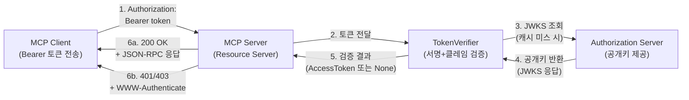
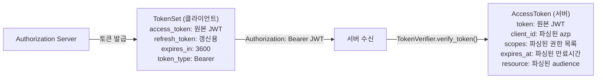
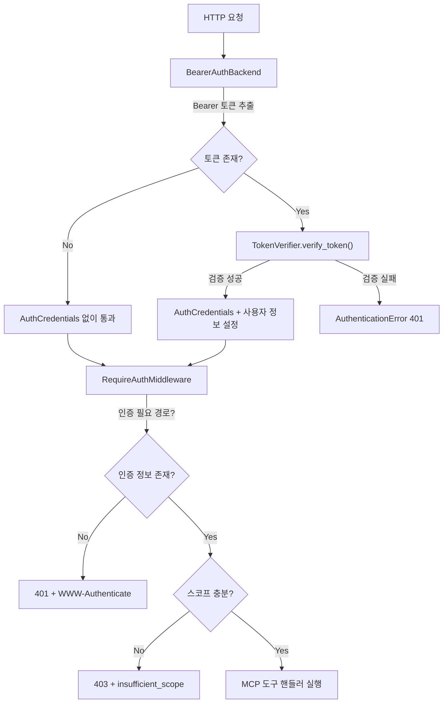
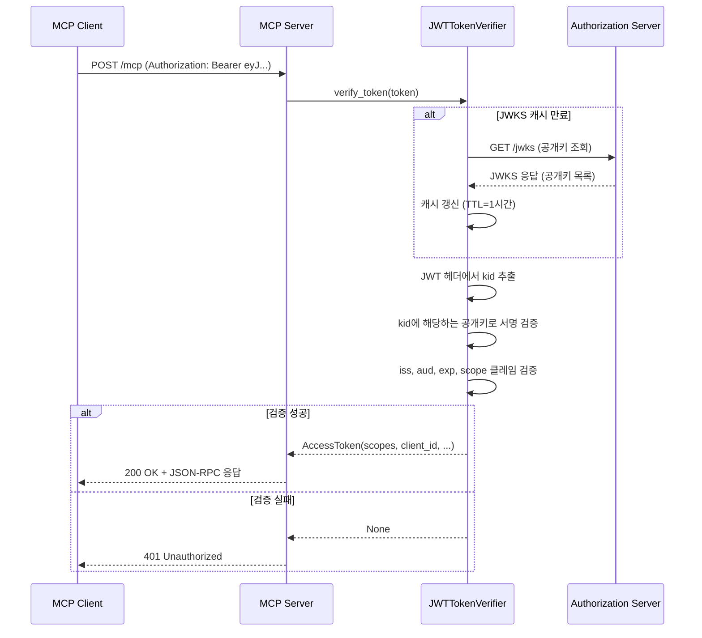
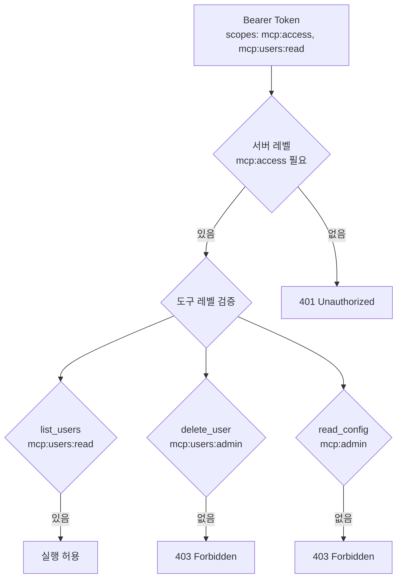
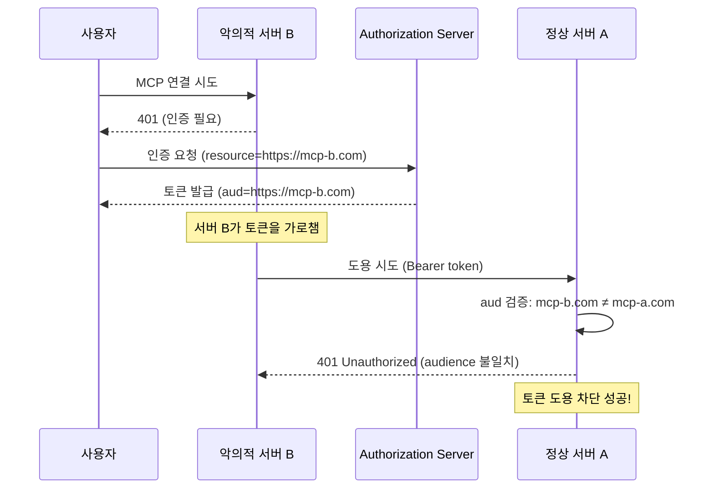

# 서버 측 인증 미들웨어

> Streamable HTTP 서버에 인증 미들웨어를 적용하여 Bearer 토큰 검증, 스코프 기반 권한 제어, Resource Indicators를 구현합니다.

## 개요

이 섹션에서는 MCP 서버가 **Resource Server(RS)** 로서 수행해야 할 인증·인가 책임을 다룹니다. 앞서 [01. MCP 인증 아키텍처](11-ch11-인증과-보안/01-01-mcp-인증-아키텍처.md)에서 전체 구조를 살펴보고, [02. OAuth 2.1 + PKCE 구현](11-ch11-인증과-보안/02-02-oauth-21-pkce-구현.md)에서 클라이언트 측 토큰 획득을 구현했습니다. 이제 **서버 측**으로 시선을 옮겨, 들어오는 요청의 토큰을 어떻게 검증하고 도구별 접근을 제어하는지 코드 수준에서 파고듭니다.

**선수 지식**:
- OAuth 2.1 + PKCE 인증 플로우 (11.2에서 학습)
- Protected Resource Metadata와 디스커버리 (11.1에서 학습)
- Streamable HTTP Transport 구조 ([Ch2.3](02-ch2-mcp-아키텍처와-프로토콜-구조/03-03-transport-계층-streamable-http.md))
- Python 비동기 프로그래밍 (async/await)

**학습 목표**:
- Bearer 토큰을 검증하는 `TokenVerifier`를 직접 구현할 수 있다
- Starlette 미들웨어 파이프라인(BearerAuthBackend → RequireAuthMiddleware)의 동작 원리를 이해한다
- 도구/리소스별 스코프 기반 권한 제어를 적용할 수 있다
- Resource Indicators(RFC 8707)로 토큰의 대상 서버를 검증할 수 있다

## 왜 알아야 할까?

[이전 섹션](11-ch11-인증과-보안/02-02-oauth-21-pkce-구현.md)에서 클라이언트가 토큰을 획득하는 과정을 구현했습니다. 하지만 **서버가 그 토큰을 검증하지 않으면** 인증은 무의미합니다. 마치 콘서트장에서 입장권을 발급하는 시스템은 완벽하지만, 정작 입구에서 검표를 하지 않는 것과 같죠.

실제 프로덕션 MCP 서버에서는 다음 질문에 답해야 합니다:

- 이 토큰이 **위조되지 않았는가**? (서명 검증)
- 이 토큰이 **우리 서버용인가**? (Audience/Resource 검증)
- 이 사용자가 **이 도구를 호출할 권한이 있는가**? (스코프 검증)
- 토큰이 **만료되지 않았는가**? (유효기간 검증)

MCP 스펙은 이 모든 검증을 **서버의 책임**으로 명시합니다. 그리고 Python SDK는 이를 위한 미들웨어 스택을 제공하죠. 이 섹션을 마치면, 여러분의 MCP 서버는 "검표원이 있는 콘서트장"이 됩니다.

## 핵심 개념

### 개념 1: MCP 서버의 인증 역할 — Resource Server

> 💡 **비유**: 회사 건물에 비유하면 이해가 쉽습니다. **Authorization Server**는 건물 관리소에서 사원증을 발급하는 곳이고, **MCP 서버(Resource Server)** 는 각 층의 출입문에서 사원증을 찍어 확인하는 카드 리더기입니다. 사원증 발급은 한 곳에서 하지만, 검증은 건물 곳곳에서 독립적으로 이루어지죠.

MCP 스펙(2025-06-18)에서 MCP 서버는 **Resource Server**로 동작합니다. 토큰을 직접 발급하지 않고, 외부 Authorization Server가 발급한 토큰을 **검증만** 합니다. 이 분리가 중요한 이유는:

1. **단일 책임**: 서버는 도구/리소스 제공에 집중, 인증 복잡성은 AS에 위임
2. **생태계 호환**: Google, Azure AD, Auth0 등 기존 인증 인프라를 그대로 활용
3. **보안 강화**: 토큰 발급과 검증이 분리되어 공격 표면이 줄어듦

> 📊 **그림 1**: MCP 서버의 Resource Server 역할 — 클라이언트 요청부터 응답까지의 전체 흐름



MCP 스펙이 요구하는 서버 측 검증 항목을 정리하면:

| 검증 항목 | 실패 시 | HTTP 코드 |
|-----------|---------|-----------|
| 토큰 없음 | `WWW-Authenticate` 헤더와 함께 거부 | 401 |
| 서명 위조 | 즉시 거부 | 401 |
| 토큰 만료 | 재인증 요구 | 401 |
| Audience 불일치 | 다른 서버용 토큰 거부 | 401 |
| 스코프 부족 | 권한 부족 응답 | 403 |

### 클라이언트 측 TokenSet vs 서버 측 AccessToken

여기서 한 가지 짚고 넘어갈 부분이 있습니다. [이전 섹션](11-ch11-인증과-보안/02-02-oauth-21-pkce-구현.md)에서 클라이언트가 토큰을 관리할 때 사용한 모델은 **`TokenSet`** 이었습니다. `TokenSet`은 `access_token`, `refresh_token`, `expires_in` 등을 묶어서 **클라이언트가 토큰을 저장하고 갱신하기 위한 모델**이죠.

반면 이 섹션에서 등장하는 **`AccessToken`** 은 **서버가 토큰을 검증한 결과**를 담는 모델입니다. 같은 토큰이지만 바라보는 관점이 완전히 다릅니다:

> 📊 **그림 2**: 클라이언트 측 TokenSet과 서버 측 AccessToken의 관계



| 구분 | TokenSet (클라이언트 측, 11.2) | AccessToken (서버 측, 11.3) |
|------|------|------|
| **역할** | 토큰 저장·갱신 관리 | 토큰 검증 결과 표현 |
| **포함 정보** | access_token, refresh_token, expires_in, token_type | client_id, scopes, expires_at, resource |
| **생성 주체** | AS의 토큰 응답을 파싱 | TokenVerifier가 JWT를 디코딩·검증 |
| **생명주기** | 발급 → 사용 → 만료 → 갱신 | 요청마다 생성 → 미들웨어에서 소비 |

즉, **같은 JWT 토큰**이 클라이언트에서는 `TokenSet.access_token` 필드에 원본 문자열로 저장되고, 서버에서는 `TokenVerifier`가 이를 디코딩하여 `AccessToken` 객체로 변환하는 것입니다. 이름이 다른 이유는 관점과 책임이 다르기 때문이에요.

### 개념 2: 미들웨어 파이프라인 — 3단계 검문소

> 💡 **비유**: 공항 보안 검색을 떠올려보세요. 1단계에서 탑승권을 확인하고(토큰 추출), 2단계에서 신원을 검증하고(토큰 검증), 3단계에서 해당 게이트로 갈 수 있는지 확인합니다(스코프 검증). MCP Python SDK의 미들웨어도 정확히 이 3단계로 동작합니다.

MCP Python SDK는 Starlette 기반의 ASGI 미들웨어 스택을 제공합니다. 요청이 도구 핸들러에 도달하기 전에 3개의 미들웨어를 통과해야 합니다:

> 📊 **그림 3**: 인증 미들웨어 파이프라인



**BearerAuthBackend** — 1단계: 토큰 추출 및 검증

```python
from starlette.authentication import AuthenticationBackend, AuthCredentials
from mcp.server.auth.provider import TokenVerifier, AccessToken

class BearerAuthBackend(AuthenticationBackend):
    """Authorization 헤더에서 Bearer 토큰을 추출하고 검증합니다."""
    
    def __init__(self, verifier: TokenVerifier):
        self.verifier = verifier
    
    async def authenticate(self, request):
        # Authorization 헤더에서 Bearer 토큰 추출
        auth_header = request.headers.get("Authorization")
        if not auth_header or not auth_header.startswith("Bearer "):
            return None  # 인증 정보 없이 다음 미들웨어로
        
        token = auth_header.removeprefix("Bearer ").strip()
        
        # TokenVerifier로 검증 → AccessToken 반환
        # (클라이언트의 TokenSet.access_token 문자열이 여기서 파싱됨)
        access_token = await self.verifier.verify_token(token)
        if access_token is None:
            raise AuthenticationError("Invalid token")
        
        # 스코프를 AuthCredentials에 포함
        return AuthCredentials(access_token.scopes), access_token
```

**RequireAuthMiddleware** — 2단계: 인증 필수 경로 강제

```python
class RequireAuthMiddleware:
    """인증이 필요한 경로에 대해 401/403을 반환합니다."""
    
    def __init__(self, app, required_scopes: list[str], 
                 resource_metadata_url: str):
        self.app = app
        self.required_scopes = set(required_scopes)
        self.resource_metadata_url = resource_metadata_url
    
    async def __call__(self, scope, receive, send):
        if scope["type"] != "http":
            return await self.app(scope, receive, send)
        
        request = Request(scope)
        
        # 인증 정보 확인
        if not request.auth.scopes:
            # 401 + WWW-Authenticate 헤더
            headers = {
                "WWW-Authenticate": (
                    f'Bearer scope="{" ".join(self.required_scopes)}" '
                    f'resource_metadata="{self.resource_metadata_url}"'
                )
            }
            response = JSONResponse(
                {"error": "unauthorized"}, 
                status_code=401, headers=headers
            )
            return await response(scope, receive, send)
        
        # 스코프 검증
        if not self.required_scopes.issubset(request.auth.scopes):
            headers = {
                "WWW-Authenticate": (
                    f'Bearer error="insufficient_scope" '
                    f'scope="{" ".join(self.required_scopes)}"'
                )
            }
            response = JSONResponse(
                {"error": "insufficient_scope"}, 
                status_code=403, headers=headers
            )
            return await response(scope, receive, send)
        
        return await self.app(scope, receive, send)
```

> ⚠️ **흔한 오해**: "토큰이 없으면 바로 401을 반환해야 한다"고 생각하기 쉽지만, `BearerAuthBackend`는 토큰이 없을 때 `None`을 반환합니다. 이는 의도된 설계인데, `/.well-known/oauth-protected-resource` 같은 **공개 엔드포인트**는 인증 없이 접근 가능해야 하기 때문입니다. 401 거부는 `RequireAuthMiddleware`가 **보호 대상 경로에서만** 수행합니다.

### 개념 3: TokenVerifier 구현 — JWT 서명 검증

> 💡 **비유**: TokenVerifier는 위조 지폐 감별기와 같습니다. 지폐(토큰)의 워터마크(서명)를 자외선(공개키)으로 비춰 진위를 판별하고, 발행일과 유효기간(exp/iat)을 확인하며, 이 지폐가 우리 은행(audience)에서 사용할 수 있는 것인지까지 검증합니다.

MCP Python SDK에서 `TokenVerifier`는 **프로토콜(인터페이스)** 입니다. `verify_token` 메서드 하나만 구현하면 됩니다. 이 메서드는 클라이언트가 보낸 JWT 문자열(즉, 클라이언트 측 `TokenSet`의 `access_token` 필드 값)을 받아서 **서버 측 `AccessToken` 객체**로 변환합니다. 검증에 실패하면 `None`을 반환하고요.

```python
from dataclasses import dataclass
from datetime import datetime, timezone
from typing import Optional
import httpx
import jwt  # PyJWT 라이브러리

from mcp.server.auth.provider import AccessToken, TokenVerifier


@dataclass
class JWKSCache:
    """JWKS(JSON Web Key Set) 캐시 — 매 요청마다 AS에 조회하지 않도록"""
    keys: dict
    expires_at: datetime


class JWTTokenVerifier(TokenVerifier):
    """JWT 토큰을 검증하는 범용 TokenVerifier 구현.
    
    JWKS 엔드포인트에서 공개키를 가져와 서명을 검증하고,
    audience(Resource Indicator)와 스코프를 확인합니다.
    
    입력: 클라이언트가 전송한 JWT 문자열 (TokenSet.access_token)
    출력: 서버 측 AccessToken 객체 (client_id, scopes, resource 등 파싱 완료)
    """
    
    def __init__(
        self,
        jwks_uri: str,           # AS의 JWKS 엔드포인트
        issuer: str,             # 토큰 발급자 (iss 클레임)
        audience: str,           # 이 서버의 Resource Indicator (aud 클레임)
        cache_ttl_seconds: int = 3600,  # JWKS 캐시 TTL (기본 1시간)
    ):
        self.jwks_uri = jwks_uri
        self.issuer = issuer
        self.audience = audience
        self.cache_ttl = cache_ttl_seconds
        self._cache: Optional[JWKSCache] = None
    
    async def _get_signing_keys(self) -> dict:
        """JWKS를 가져오거나 캐시에서 반환합니다."""
        now = datetime.now(timezone.utc)
        
        # 캐시가 유효하면 재사용
        if self._cache and now < self._cache.expires_at:
            return self._cache.keys
        
        # JWKS 엔드포인트에서 공개키 조회
        async with httpx.AsyncClient() as client:
            response = await client.get(self.jwks_uri)
            response.raise_for_status()
            jwks_data = response.json()
        
        # PyJWT가 사용할 수 있는 형태로 변환
        from jwt import PyJWKSet
        key_set = PyJWKSet.from_dict(jwks_data)
        
        # 캐시 갱신
        from datetime import timedelta
        self._cache = JWKSCache(
            keys=key_set,
            expires_at=now + timedelta(seconds=self.cache_ttl),
        )
        return self._cache.keys
    
    async def verify_token(self, token: str) -> Optional[AccessToken]:
        """Bearer 토큰(JWT 문자열)을 검증하고 AccessToken을 반환합니다.
        
        클라이언트가 TokenSet에서 꺼내 Authorization 헤더로 보낸
        access_token 문자열을 받아, 서명·클레임을 검증한 뒤
        서버 내부에서 사용할 AccessToken 객체로 변환합니다.
        
        검증 실패 시 None을 반환합니다.
        """
        try:
            # 1. JWKS에서 공개키 가져오기
            key_set = await self._get_signing_keys()
            
            # 2. 토큰 헤더에서 kid(Key ID) 추출
            header = jwt.get_unverified_header(token)
            kid = header.get("kid")
            
            # 3. 해당 kid의 공개키 찾기
            signing_key = None
            for key in key_set.keys:
                if key.key_id == kid:
                    signing_key = key
                    break
            
            if signing_key is None:
                return None  # 알 수 없는 키
            
            # 4. 서명 검증 + 클레임 검증
            payload = jwt.decode(
                token,
                signing_key.key,
                algorithms=["RS256", "ES256"],
                issuer=self.issuer,
                audience=self.audience,  # Resource Indicator 검증!
                options={
                    "verify_exp": True,   # 만료 시간
                    "verify_iat": True,   # 발급 시간
                    "verify_iss": True,   # 발급자
                    "verify_aud": True,   # 대상 (RFC 8707)
                },
            )
            
            # 5. AccessToken 객체로 변환
            #    JWT 클레임에서 필요한 정보를 추출하여
            #    서버 미들웨어가 사용할 수 있는 형태로 가공
            return AccessToken(
                token=token,
                client_id=payload.get("client_id", payload.get("azp", "")),
                scopes=payload.get("scope", "").split(),
                expires_at=payload.get("exp"),
                resource=payload.get("aud"),
            )
        
        except jwt.ExpiredSignatureError:
            return None  # 토큰 만료
        except jwt.InvalidAudienceError:
            return None  # 다른 서버용 토큰
        except jwt.InvalidIssuerError:
            return None  # 알 수 없는 발급자
        except jwt.PyJWTError:
            return None  # 기타 검증 실패
```

> 📊 **그림 4**: JWT 토큰 검증 흐름



JWKS 캐싱이 중요한 이유를 짚고 넘어가겠습니다. 매 요청마다 AS에 JWKS를 조회하면 **지연 시간이 수십 ms씩 추가**되고, AS에도 불필요한 부하가 걸립니다. 실무에서는 보통 1시간 TTL로 캐싱하며, 키 로테이션 시에만 갱신합니다. Microsoft Azure AD의 경우에도 동일한 패턴을 권장합니다.

### 개념 4: 스코프 기반 도구 접근 제어

> 💡 **비유**: 호텔 키카드를 생각해보세요. 기본 투숙객은 자기 방과 수영장에 접근할 수 있고, VIP 등급은 라운지까지, 최상위 등급은 루프탑까지 갈 수 있습니다. 스코프는 이런 **등급별 접근 권한**입니다. `mcp:tools:read`는 도구 목록만 볼 수 있고, `mcp:tools:execute`는 실행까지 가능하며, `mcp:admin`은 서버 설정까지 변경할 수 있죠.

MCP 서버에서 스코프 기반 권한 제어는 두 가지 수준에서 동작합니다:

**서버 레벨** — 전체 서버에 필요한 최소 스코프:

```python
from mcp.server.auth.settings import AuthSettings
from pydantic import AnyHttpUrl

auth_settings = AuthSettings(
    issuer_url=AnyHttpUrl("https://auth.example.com"),
    resource_server_url=AnyHttpUrl("https://mcp.example.com"),
    required_scopes=["mcp:access"],  # 모든 요청에 필요한 최소 스코프
)
```

**도구 레벨** — 개별 도구별 세밀한 접근 제어:

```python
from mcp.server.fastmcp import FastMCP
from mcp.server.fastmcp.server import Context

mcp = FastMCP("Secure MCP Server")


# 스코프 검증 헬퍼 함수
def require_scope(ctx: Context, required: str) -> bool:
    """현재 요청의 스코프에 필요한 권한이 있는지 확인합니다."""
    auth = getattr(ctx.request_context, "auth", None)
    if auth is None:
        return False
    return required in auth.scopes


@mcp.tool()
async def list_users(ctx: Context) -> str:
    """사용자 목록을 조회합니다. (mcp:users:read 스코프 필요)"""
    if not require_scope(ctx, "mcp:users:read"):
        return "Error: 'mcp:users:read' 스코프가 필요합니다."
    
    # 실제 사용자 조회 로직
    return "사용자 목록: [alice, bob, charlie]"


@mcp.tool()
async def delete_user(user_id: str, ctx: Context) -> str:
    """사용자를 삭제합니다. (mcp:users:admin 스코프 필요)"""
    if not require_scope(ctx, "mcp:users:admin"):
        return "Error: 'mcp:users:admin' 스코프가 필요합니다."
    
    # 위험한 작업 — 더 높은 권한 요구
    return f"사용자 {user_id}가 삭제되었습니다."
```

> 📊 **그림 5**: 스코프 기반 접근 제어 계층



스코프 네이밍 컨벤션은 `{namespace}:{resource}:{action}` 패턴을 추천합니다:

| 스코프 | 의미 |
|--------|------|
| `mcp:access` | 서버 접근 기본 권한 |
| `mcp:tools:list` | 도구 목록 조회 |
| `mcp:tools:execute` | 도구 실행 |
| `mcp:resources:read` | 리소스 읽기 |
| `mcp:users:read` | 사용자 조회 |
| `mcp:users:admin` | 사용자 관리 (생성/삭제) |
| `mcp:admin` | 서버 전체 관리 |

### 개념 5: Resource Indicators (RFC 8707) — 토큰 대상 서버 검증

> 💡 **비유**: 편지를 보낼 때 봉투에 수신자 주소를 쓰듯이, Resource Indicators는 토큰에 "이 토큰은 어느 서버에서 쓸 것인지"를 명시합니다. 만약 `https://mcp-a.com`용으로 발급된 토큰을 악의적인 `https://mcp-b.com`에서 사용하려 하면, 서버 B는 "이건 내게 온 편지가 아닙니다"라고 거부할 수 있습니다.

Resource Indicators는 **토큰 오남용 방지**의 핵심 메커니즘입니다. MCP 스펙에서 이를 필수로 요구하는 이유가 있습니다.

**문제 시나리오: 토큰 도용(Token Mis-Redemption)**

```
1. 사용자가 악의적 MCP 서버 B에 접속
2. 서버 B가 "인증이 필요하다"며 사용자를 AS로 리다이렉트
3. 사용자가 AS에서 인증 → 토큰 발급
4. 서버 B가 이 토큰을 가로채서 정상 서버 A에 사용!
5. 서버 A는 유효한 토큰이므로 요청을 승인 → 데이터 유출
```

Resource Indicators가 이를 방지합니다:

```
3. 클라이언트가 AS에 resource=https://mcp-b.com 파라미터 포함
4. AS가 토큰의 audience를 https://mcp-b.com으로 한정
5. 서버 A가 토큰의 audience를 검증 → https://mcp-a.com ≠ https://mcp-b.com → 거부!
```

서버 측에서 Resource Indicator를 검증하는 코드는 이미 `JWTTokenVerifier`에 포함되어 있습니다. 핵심은 `jwt.decode()`의 `audience` 파라미터입니다:

```python
# JWTTokenVerifier.verify_token() 내부
payload = jwt.decode(
    token,
    signing_key.key,
    algorithms=["RS256"],
    audience=self.audience,  # ← 이 서버의 canonical URI
    # ...
)
```

서버는 자신의 canonical URI를 `audience`로 설정하여, **이 서버를 대상으로 발급된 토큰만** 수락합니다. 이 URI는 [11.1에서 다룬 Protected Resource Metadata](11-ch11-인증과-보안/01-01-mcp-인증-아키텍처.md)의 `resource` 필드와 동일한 값이어야 합니다.

> 📊 **그림 6**: Resource Indicators로 토큰 도용 방지



## 실습: 직접 해보기

실제 동작하는 인증 미들웨어 기반 MCP 서버를 단계별로 구축해봅시다. 이 실습에서는 JWT 검증이 포함된 완전한 서버를 만듭니다.

### 1단계: 프로젝트 설정

```console
$ mkdir secure-mcp-server && cd secure-mcp-server
$ uv init
$ uv add "mcp[cli]" pyjwt cryptography httpx
```

### 2단계: TokenVerifier 구현

```python
# auth.py — 인증 모듈
"""MCP 서버의 JWT 토큰 검증 모듈.

JWKS 기반 서명 검증과 클레임 검증을 수행합니다.
프로덕션 환경에서는 실제 AS의 JWKS 엔드포인트를 사용하세요.
"""

from dataclasses import dataclass, field
from datetime import datetime, timedelta, timezone
from typing import Optional

import httpx
import jwt
from jwt import PyJWKSet
from mcp.server.auth.provider import AccessToken, TokenVerifier


@dataclass
class JWKSCache:
    keys: PyJWKSet
    expires_at: datetime


class JWTTokenVerifier(TokenVerifier):
    """JWKS 기반 JWT 토큰 검증기.
    
    실제 Authorization Server의 JWKS 엔드포인트에서
    공개키를 가져와 토큰 서명을 검증합니다.
    
    입력: JWT 문자열 (클라이언트의 TokenSet.access_token 값)
    출력: AccessToken 객체 (서버 내부에서 사용할 파싱된 토큰 정보)
    """
    
    def __init__(
        self,
        jwks_uri: str,
        issuer: str,
        audience: str,
        algorithms: list[str] = None,
        cache_ttl_seconds: int = 3600,
    ):
        self.jwks_uri = jwks_uri
        self.issuer = issuer
        self.audience = audience
        self.algorithms = algorithms or ["RS256"]
        self.cache_ttl = cache_ttl_seconds
        self._cache: Optional[JWKSCache] = None
    
    async def _get_jwks(self) -> PyJWKSet:
        """JWKS를 가져오거나 캐시에서 반환합니다."""
        now = datetime.now(timezone.utc)
        if self._cache and now < self._cache.expires_at:
            return self._cache.keys
        
        async with httpx.AsyncClient() as client:
            resp = await client.get(self.jwks_uri, timeout=10.0)
            resp.raise_for_status()
        
        key_set = PyJWKSet.from_dict(resp.json())
        self._cache = JWKSCache(
            keys=key_set,
            expires_at=now + timedelta(seconds=self.cache_ttl),
        )
        return key_set
    
    async def verify_token(self, token: str) -> Optional[AccessToken]:
        """토큰을 검증하고 AccessToken을 반환합니다."""
        try:
            key_set = await self._get_jwks()
            header = jwt.get_unverified_header(token)
            kid = header.get("kid")
            
            # kid에 해당하는 키 찾기
            signing_key = None
            for key in key_set.keys:
                if key.key_id == kid:
                    signing_key = key
                    break
            
            if not signing_key:
                return None
            
            # JWT 디코딩 + 검증 (서명, 만료, 발급자, audience)
            payload = jwt.decode(
                token,
                signing_key.key,
                algorithms=self.algorithms,
                issuer=self.issuer,
                audience=self.audience,
                options={
                    "verify_exp": True,
                    "verify_iat": True,
                    "verify_iss": True,
                    "verify_aud": True,
                },
            )
            
            return AccessToken(
                token=token,
                client_id=payload.get("client_id", payload.get("azp", "")),
                scopes=payload.get("scope", "").split(),
                expires_at=payload.get("exp"),
                resource=payload.get("aud"),
            )
        
        except jwt.PyJWTError:
            return None
```

### 3단계: 인증 적용 MCP 서버

```python
# server.py — 스코프 기반 인증이 적용된 MCP 서버
"""인증 미들웨어가 적용된 MCP 서버.

도구별 스코프 검증과 Protected Resource Metadata를 제공합니다.
"""

from mcp.server.fastmcp import FastMCP
from mcp.server.fastmcp.server import Context
from mcp.server.auth.settings import AuthSettings
from pydantic import AnyHttpUrl

from auth import JWTTokenVerifier

# ── 서버 설정 ──────────────────────────────────
SERVER_URL = "https://mcp.example.com"
AUTH_SERVER = "https://auth.example.com"

# TokenVerifier 생성
verifier = JWTTokenVerifier(
    jwks_uri=f"{AUTH_SERVER}/.well-known/jwks.json",
    issuer=AUTH_SERVER,
    audience=SERVER_URL,  # RFC 8707 Resource Indicator
)

# AuthSettings로 서버 레벨 인증 설정
auth_settings = AuthSettings(
    issuer_url=AnyHttpUrl(AUTH_SERVER),
    resource_server_url=AnyHttpUrl(SERVER_URL),
    required_scopes=["mcp:access"],  # 최소 필요 스코프
)

# FastMCP 서버 생성 (인증 활성화)
mcp = FastMCP(
    "Secure Data Server",
    token_verifier=verifier,
    auth=auth_settings,
)


# ── 스코프 검증 유틸리티 ──────────────────────
def check_scope(ctx: Context, scope: str) -> bool:
    """요청의 토큰에 특정 스코프가 있는지 확인합니다."""
    auth = getattr(ctx.request_context, "auth", None)
    if auth is None:
        return False
    token_scopes = auth.scopes if hasattr(auth, "scopes") else []
    return scope in token_scopes


def get_client_id(ctx: Context) -> str:
    """인증된 클라이언트의 ID를 반환합니다."""
    auth = getattr(ctx.request_context, "auth", None)
    if auth and hasattr(auth, "client_id"):
        return auth.client_id
    return "anonymous"


# ── 도구 정의 (스코프별 접근 제어) ──────────
@mcp.tool()
async def list_products(ctx: Context) -> str:
    """상품 목록을 조회합니다.
    
    필요 스코프: mcp:products:read
    """
    if not check_scope(ctx, "mcp:products:read"):
        return "Error: 'mcp:products:read' 스코프가 필요합니다."
    
    client = get_client_id(ctx)
    return f"[{client}] 상품: MacBook Pro, iPhone 16, AirPods Max"


@mcp.tool()
async def create_product(name: str, price: int, ctx: Context) -> str:
    """새 상품을 등록합니다.
    
    필요 스코프: mcp:products:write
    """
    if not check_scope(ctx, "mcp:products:write"):
        return "Error: 'mcp:products:write' 스코프가 필요합니다."
    
    client = get_client_id(ctx)
    return f"[{client}] 상품 '{name}' (₩{price:,})이 등록되었습니다."


@mcp.tool()
async def delete_product(product_id: str, ctx: Context) -> str:
    """상품을 삭제합니다.
    
    필요 스코프: mcp:products:admin
    """
    if not check_scope(ctx, "mcp:products:admin"):
        return "Error: 'mcp:products:admin' 스코프가 필요합니다. 관리자 권한이 필요합니다."
    
    client = get_client_id(ctx)
    return f"[{client}] 상품 {product_id}이(가) 삭제되었습니다."


@mcp.tool()
async def server_health(ctx: Context) -> str:
    """서버 상태를 확인합니다.
    
    필요 스코프: mcp:access (기본 스코프로 충분)
    """
    return "서버 상태: 정상 (모든 서비스 가동 중)"
```

### 4단계: 로컬 테스트용 간이 검증기

실제 AS 없이 로컬에서 테스트할 수 있는 자체 서명 JWT 검증기입니다:

```python
# test_auth.py — 로컬 테스트용 자체 서명 JWT 생성/검증
"""테스트 환경에서 사용할 자체 서명 JWT 유틸리티.

프로덕션에서는 절대 사용하지 마세요!
"""

from datetime import datetime, timedelta, timezone
from typing import Optional

import jwt
from cryptography.hazmat.primitives.asymmetric import rsa
from cryptography.hazmat.primitives import serialization
from mcp.server.auth.provider import AccessToken, TokenVerifier

# 테스트용 RSA 키페어 생성
_private_key = rsa.generate_private_key(
    public_exponent=65537,
    key_size=2048,
)
_public_key = _private_key.public_key()

TEST_ISSUER = "https://test-auth.local"
TEST_AUDIENCE = "https://test-mcp.local"


def create_test_token(
    client_id: str = "test-client",
    scopes: list[str] = None,
    expires_in: int = 3600,
) -> str:
    """테스트용 JWT 토큰을 생성합니다."""
    now = datetime.now(timezone.utc)
    payload = {
        "iss": TEST_ISSUER,
        "aud": TEST_AUDIENCE,
        "sub": client_id,
        "client_id": client_id,
        "scope": " ".join(scopes or ["mcp:access"]),
        "iat": now,
        "exp": now + timedelta(seconds=expires_in),
    }
    return jwt.encode(payload, _private_key, algorithm="RS256", headers={"kid": "test-key-1"})


class TestTokenVerifier(TokenVerifier):
    """테스트 환경용 TokenVerifier. 자체 서명 검증."""
    
    async def verify_token(self, token: str) -> Optional[AccessToken]:
        try:
            payload = jwt.decode(
                token,
                _public_key,
                algorithms=["RS256"],
                issuer=TEST_ISSUER,
                audience=TEST_AUDIENCE,
            )
            return AccessToken(
                token=token,
                client_id=payload.get("client_id", ""),
                scopes=payload.get("scope", "").split(),
                expires_at=payload.get("exp"),
                resource=payload.get("aud"),
            )
        except jwt.PyJWTError:
            return None
```

테스트를 실행해봅시다:

```run:python
# 검증 동작 시뮬레이션 (인메모리)
import jwt
from datetime import datetime, timedelta, timezone
from cryptography.hazmat.primitives.asymmetric import rsa

# 테스트용 키 생성
private_key = rsa.generate_private_key(public_exponent=65537, key_size=2048)
public_key = private_key.public_key()

ISSUER = "https://auth.example.com"
AUDIENCE = "https://mcp.example.com"

# 정상 토큰 생성
now = datetime.now(timezone.utc)
valid_token = jwt.encode(
    {
        "iss": ISSUER, "aud": AUDIENCE, "sub": "user-1",
        "client_id": "app-1", "scope": "mcp:access mcp:products:read",
        "iat": now, "exp": now + timedelta(hours=1),
    },
    private_key, algorithm="RS256"
)

# 다른 서버용 토큰 (audience 불일치)
wrong_audience_token = jwt.encode(
    {
        "iss": ISSUER, "aud": "https://other-server.com", "sub": "user-1",
        "scope": "mcp:access", "iat": now, "exp": now + timedelta(hours=1),
    },
    private_key, algorithm="RS256"
)

# 만료된 토큰
expired_token = jwt.encode(
    {
        "iss": ISSUER, "aud": AUDIENCE, "sub": "user-1",
        "scope": "mcp:access", "iat": now - timedelta(hours=2),
        "exp": now - timedelta(hours=1),  # 이미 만료
    },
    private_key, algorithm="RS256"
)

# 검증 테스트
print("=== Token Verification Tests ===\n")

# 1. 정상 토큰
try:
    payload = jwt.decode(valid_token, public_key, algorithms=["RS256"],
                         issuer=ISSUER, audience=AUDIENCE)
    print(f"[PASS] 정상 토큰: client_id={payload['client_id']}, scopes={payload['scope']}")
except jwt.PyJWTError as e:
    print(f"[FAIL] 정상 토큰: {e}")

# 2. Audience 불일치 (RFC 8707 보호)
try:
    jwt.decode(wrong_audience_token, public_key, algorithms=["RS256"],
               issuer=ISSUER, audience=AUDIENCE)
    print("[FAIL] Audience 불일치 토큰이 통과함!")
except jwt.InvalidAudienceError:
    print("[PASS] Audience 불일치 토큰 거부 (RFC 8707 동작 확인)")

# 3. 만료된 토큰
try:
    jwt.decode(expired_token, public_key, algorithms=["RS256"],
               issuer=ISSUER, audience=AUDIENCE)
    print("[FAIL] 만료된 토큰이 통과함!")
except jwt.ExpiredSignatureError:
    print("[PASS] 만료된 토큰 거부")

# 4. 스코프 확인
payload = jwt.decode(valid_token, public_key, algorithms=["RS256"],
                     issuer=ISSUER, audience=AUDIENCE)
scopes = payload["scope"].split()
print(f"\n=== Scope Check ===")
print(f"보유 스코프: {scopes}")
print(f"mcp:products:read 권한: {'mcp:products:read' in scopes}")
print(f"mcp:products:admin 권한: {'mcp:products:admin' in scopes}")
```

```output
=== Token Verification Tests ===

[PASS] 정상 토큰: client_id=app-1, scopes=mcp:access mcp:products:read
[PASS] Audience 불일치 토큰 거부 (RFC 8707 동작 확인)
[PASS] 만료된 토큰 거부

=== Scope Check ===
보유 스코프: ['mcp:access', 'mcp:products:read']
mcp:products:read 권한: True
mcp:products:admin 권한: False
```

### 5단계: Protected Resource Metadata 엔드포인트 구현

[11.1](11-ch11-인증과-보안/01-01-mcp-인증-아키텍처.md)에서 다룬 디스커버리 흐름의 서버 측 구현입니다. 개념 자체는 11.1을 참고하고, 여기서는 실제 Starlette 라우트 등록에 집중합니다.

```python
# metadata.py — Protected Resource Metadata 서버 측 구현
"""RFC 9728 엔드포인트의 서버 구현.

디스커버리 개념과 전체 흐름은 11.1을 참고하세요.
여기서는 서버가 메타데이터를 어떻게 제공하는지에 집중합니다.
"""

from starlette.requests import Request
from starlette.responses import JSONResponse
from starlette.routing import Route


async def oauth_protected_resource(request: Request) -> JSONResponse:
    """GET /.well-known/oauth-protected-resource
    
    서버의 인증 요구사항을 JSON으로 반환합니다.
    resource 필드는 TokenVerifier의 audience와 반드시 일치해야 합니다.
    """
    return JSONResponse({
        # 이 서버의 고유 식별자 — TokenVerifier의 audience와 동일!
        "resource": "https://mcp.example.com/mcp",
        
        # 토큰 전달 방식 (MCP는 header만 지원)
        "bearer_methods_supported": ["header"],
        
        # 토큰을 발급할 수 있는 Authorization Server 목록
        "authorization_servers": [
            "https://auth.example.com"
        ],
        
        # 이 서버가 지원하는 스코프 목록
        "scopes_supported": [
            "mcp:access",
            "mcp:tools:list",
            "mcp:tools:execute",
            "mcp:products:read",
            "mcp:products:write",
            "mcp:products:admin",
        ],
    })


# Starlette Route로 등록
metadata_routes = [
    Route(
        "/.well-known/oauth-protected-resource",
        oauth_protected_resource,
        methods=["GET"],
    ),
]
```

여기서 핵심은 **`resource` 필드와 `TokenVerifier`의 `audience`가 반드시 동일해야 한다**는 점입니다. 클라이언트는 이 메타데이터의 `resource` 값을 AS에 `resource` 파라미터로 전달하고, AS는 이를 토큰의 `aud` 클레임에 넣습니다. 서버의 `TokenVerifier`가 `aud`를 검증할 때 이 값을 비교하므로, 어느 한쪽이라도 다르면 토큰이 거부됩니다.

```run:python
# Protected Resource Metadata 응답 확인
import json

metadata = {
    "resource": "https://mcp.example.com/mcp",
    "bearer_methods_supported": ["header"],
    "authorization_servers": ["https://auth.example.com"],
    "scopes_supported": [
        "mcp:access", "mcp:tools:list", "mcp:tools:execute",
        "mcp:products:read", "mcp:products:write", "mcp:products:admin",
    ],
}

print("GET /.well-known/oauth-protected-resource")
print(f"Status: 200 OK\n")
print(json.dumps(metadata, indent=2))
print(f"\n지원 스코프: {len(metadata['scopes_supported'])}개")
```

```output
GET /.well-known/oauth-protected-resource
Status: 200 OK

{
  "resource": "https://mcp.example.com/mcp",
  "bearer_methods_supported": [
    "header"
  ],
  "authorization_servers": [
    "https://auth.example.com"
  ],
  "scopes_supported": [
    "mcp:access",
    "mcp:tools:list",
    "mcp:tools:execute",
    "mcp:products:read",
    "mcp:products:write",
    "mcp:products:admin"
  ]
}

지원 스코프: 6개
```

## 더 깊이 알아보기

### OAuth에서 Resource Server의 역사

OAuth 2.0이 처음 등장한 2012년(RFC 6749)에는 Resource Server의 토큰 검증 방식이 명확하지 않았습니다. 당시에는 Authorization Server에 토큰을 보내 유효성을 확인하는 **Token Introspection**(RFC 7662, 2015)이 표준이었죠. 매 요청마다 AS에 HTTP 호출을 해야 했기에 성능 병목이 심각했습니다.

이 문제를 해결한 것이 **JWT(JSON Web Token, RFC 7519)** 입니다. 토큰 자체에 서명과 클레임을 포함시켜 **오프라인 검증**을 가능하게 했죠. Resource Server는 AS의 공개키(JWKS)만 캐싱하면 AS와의 통신 없이도 토큰을 검증할 수 있게 되었습니다.

MCP가 2024년에 인증 스펙을 설계할 때 JWT 기반 검증을 채택한 것은 이러한 10년의 교훈이 반영된 결과입니다. 그리고 RFC 8707(Resource Indicators)은 2020년에 발표되었는데, OAuth 생태계에서 오랫동안 고민해온 "토큰이 어느 서버용인지 구분하는 문제"를 해결했습니다. MCP는 이 상대적으로 새로운 표준을 적극 채택하여 멀티 서버 환경의 보안을 강화했습니다.

### WWW-Authenticate 헤더의 진화

HTTP 인증에서 `WWW-Authenticate` 헤더는 1999년 HTTP/1.1(RFC 2616)부터 존재했습니다. 원래는 Basic/Digest 인증에만 쓰였지만, OAuth 2.0 Bearer Token(RFC 6750)에서 `Bearer` 스킴이 추가되었고, MCP 스펙은 여기에 `resource_metadata` 파라미터를 추가하여 **자기 설명적 인증 흐름**을 만들었습니다. 클라이언트는 401 응답의 `WWW-Authenticate` 헤더만 파싱하면 어디서 인증해야 하는지 자동으로 알 수 있죠.

## 흔한 오해와 팁

> ⚠️ **흔한 오해**: "MCP 서버가 직접 토큰을 발급해야 한다" — 아닙니다! MCP 서버는 **Resource Server**로 토큰을 **검증만** 합니다. 토큰 발급은 외부 Authorization Server(Auth0, Azure AD, Keycloak 등)의 역할입니다. MCP Python SDK에 `OAuthAuthorizationServerProvider`가 있지만, 이는 별도의 AS를 구현할 때만 사용합니다. 대부분의 프로덕션 환경에서는 기존 AS를 활용합니다.

> ⚠️ **흔한 오해**: "TokenSet과 AccessToken은 같은 것 아닌가요?" — 이름이 비슷해서 혼동하기 쉽지만, 완전히 다른 역할입니다. **TokenSet**([11.2](11-ch11-인증과-보안/02-02-oauth-21-pkce-구현.md)에서 등장)은 **클라이언트가 AS로부터 받은 토큰 묶음**(access_token + refresh_token + 메타데이터)이고, **AccessToken**(이 섹션)은 **서버가 JWT를 디코딩한 결과**(client_id, scopes, resource 등)입니다. 하나의 JWT 문자열이 클라이언트에서는 `TokenSet.access_token`으로 저장되고, 서버에서는 `AccessToken` 객체로 파싱되는 거죠.

> 💡 **알고 계셨나요?**: MCP 스펙은 토큰을 URI 쿼리 파라미터에 넣는 것을 **명시적으로 금지**합니다. 이는 OAuth 2.0 Bearer Token(RFC 6750)에서도 "SHOULD NOT"이었지만, OAuth 2.1에서 "MUST NOT"으로 강화되었습니다. URL 로그에 토큰이 기록되는 보안 사고를 원천 차단하기 위한 조치입니다.

> 🔥 **실무 팁**: JWKS 캐싱 TTL을 너무 짧게 설정하면 AS에 과도한 트래픽이 발생하고, 너무 길게 설정하면 키 로테이션 시 구형 키로 서명된 토큰이 통과할 수 있습니다. **권장 TTL은 1시간(3600초)** 이며, 키 로테이션 시에는 새 키로 발급을 시작한 후 이전 키 TTL이 만료될 때까지 구형 키를 유지하는 **겹침 기간(overlap period)** 을 두세요. Microsoft Azure AD가 이 패턴을 사용합니다.

> 🔥 **실무 팁**: 스코프 검증을 도구 핸들러 **내부**에서 하는 것은 간단하지만, 누락 위험이 있습니다. 프로덕션에서는 미들웨어나 데코레이터 패턴으로 **선언적** 스코프 검증을 구현하세요. "이 도구는 `mcp:products:admin` 필요"를 코드 한 줄로 선언하면, 검증 누락이 구조적으로 불가능해집니다.

## 핵심 정리

| 개념 | 설명 |
|------|------|
| Resource Server | MCP 서버의 인증 역할. 토큰을 발급하지 않고 검증만 수행 |
| TokenSet vs AccessToken | TokenSet은 클라이언트 측 토큰 저장 모델(11.2), AccessToken은 서버 측 토큰 검증 결과 모델 |
| TokenVerifier | Python SDK 프로토콜. `verify_token(token) -> AccessToken` 구현 |
| BearerAuthBackend | Starlette AuthenticationBackend. Authorization 헤더에서 토큰 추출 후 검증 |
| RequireAuthMiddleware | 보호 대상 경로에서 인증/스코프 부족 시 401/403 반환 |
| JWKS 캐싱 | AS의 공개키를 TTL 기반으로 캐싱하여 매 요청마다 조회 방지 (권장 1시간) |
| 스코프 기반 접근 제어 | `{namespace}:{resource}:{action}` 패턴으로 도구별 세밀한 권한 관리 |
| Resource Indicators (RFC 8707) | 토큰의 `audience` 클레임으로 대상 서버를 검증. 토큰 도용 방지 |
| WWW-Authenticate | 401/403 응답 시 인증 방법과 메타데이터 URL을 알려주는 표준 헤더 |

## 다음 섹션 미리보기

서버 측 인증 인프라가 완성되었으니, 다음 [04. 보안 위협과 방어 전략](11-ch11-인증과-보안/04-04-보안-위협과-방어-전략.md)에서는 인증이 완료된 사용자가 **악의적으로 행동하는 경우**를 다룹니다. 프롬프트 인젝션, 도구 인자 조작, 권한 상승(Privilege Escalation), Rug Pull 공격 등 MCP 특유의 보안 위협과 그 방어 전략을 코드 레벨에서 살펴봅니다.

## 참고 자료

- [MCP Authorization Specification (2025-06-18)](https://modelcontextprotocol.io/specification/2025-06-18/basic/authorization) - MCP 인증 스펙의 공식 명세. Bearer 토큰 검증, Resource Indicators, Protected Resource Metadata의 모든 요구사항이 정의되어 있습니다.
- [Building a Secure MCP Server with OAuth 2.1 and Azure AD — Microsoft ISE Blog](https://devblogs.microsoft.com/ise/aca-secure-mcp-server-oauth21-azure-ad/) - Microsoft가 Azure AD와 MCP를 통합한 실전 가이드. EntraIdTokenVerifier, JWKS 캐싱, OBO 플로우 등 엔터프라이즈 패턴을 다룹니다.
- [MCP Python SDK — GitHub](https://github.com/modelcontextprotocol/python-sdk) - `mcp.server.auth.provider` 모듈의 TokenVerifier, AccessToken 등 인증 클래스의 소스 코드. `examples/snippets/servers/oauth_server.py`에 공식 예제가 있습니다.
- [RFC 8707: Resource Indicators for OAuth 2.0](https://www.rfc-editor.org/rfc/rfc8707.html) - Resource Indicators의 공식 RFC. 토큰의 audience를 특정 리소스 서버로 한정하는 메커니즘을 정의합니다.
- [MCP Auth: Bearer Authentication](https://mcp-auth.dev/docs/configure-server/bearer-auth) - MCP 서버의 Bearer 인증 설정 가이드. TokenVerifier 구현 패턴과 미들웨어 통합 방법을 설명합니다.
- [MCP Spec Updates — Auth0 Blog (June 2025)](https://auth0.com/blog/mcp-specs-update-all-about-auth/) - MCP 인증 스펙의 주요 변경사항 해설. Protected Resource Metadata, Dynamic Client Registration, Resource Indicators 도입 배경을 다룹니다.