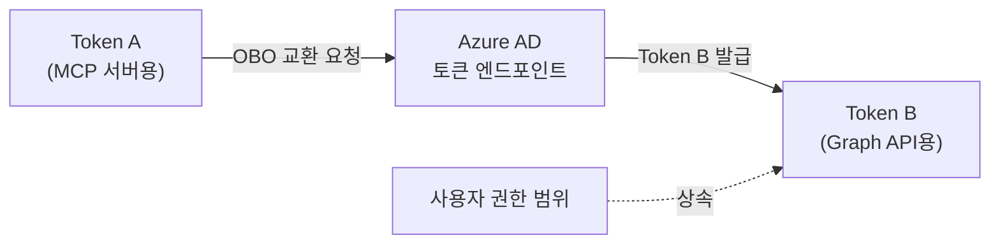
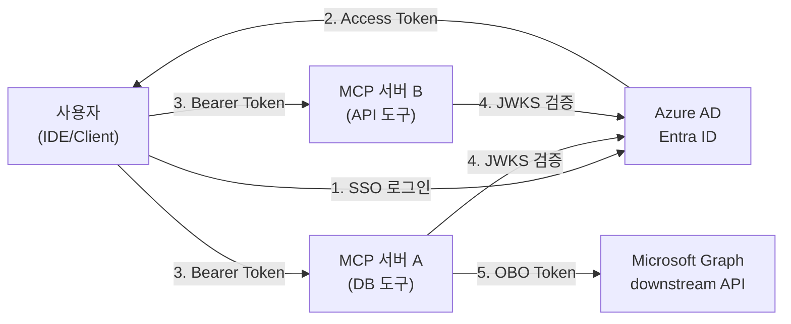
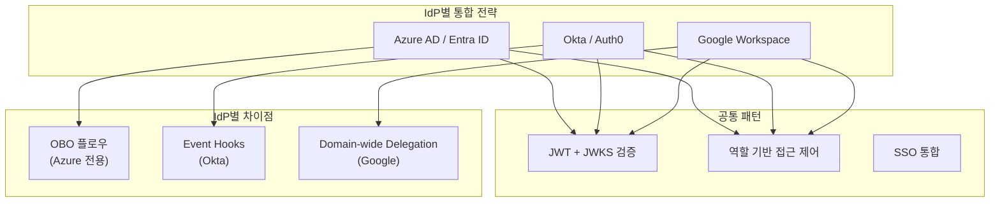
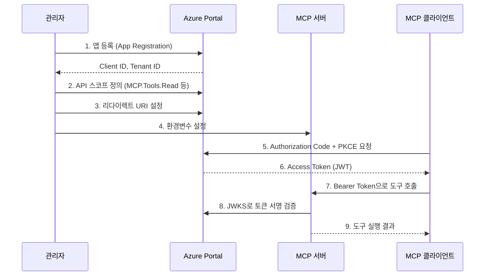
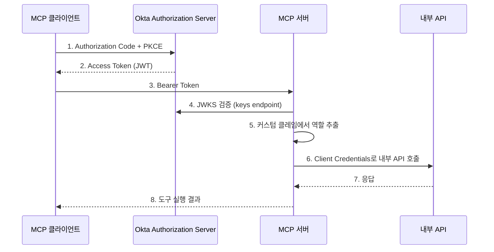
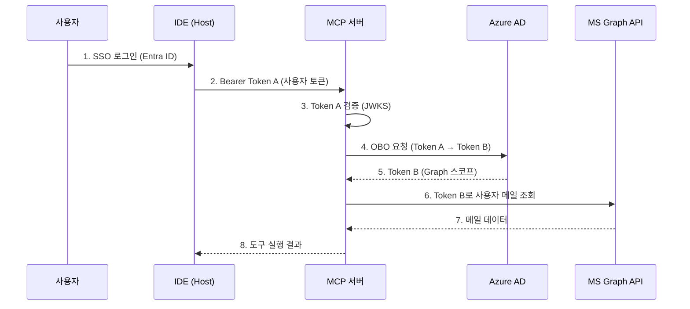
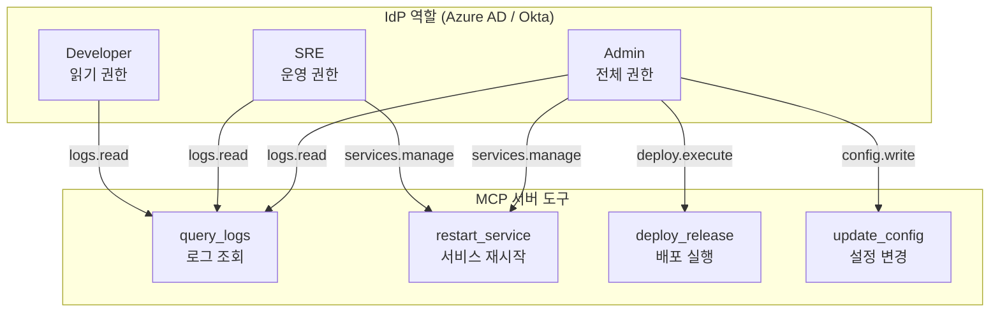
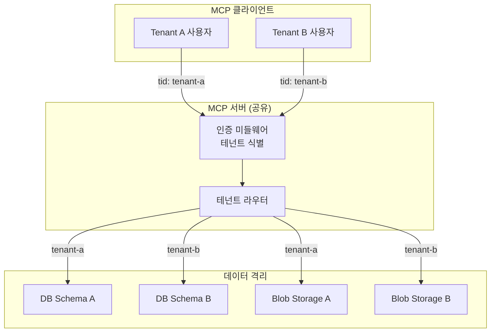

# 엔터프라이즈 인증 통합

> Azure AD/Entra ID, Okta, Auth0 연동부터 SSO, RBAC, 멀티테넌트까지 — 조직 수준의 MCP 인증 아키텍처를 설계하고 구현합니다.

## 개요

이 섹션에서는 MCP 서버를 엔터프라이즈 환경의 기존 인증 인프라와 통합하는 방법을 다룹니다. 지금까지 배운 OAuth 2.1 + PKCE 인증, 서버 측 미들웨어, 보안 위협 방어를 **실제 조직의 IdP(Identity Provider)**와 연결하는 실전 패턴으로 확장합니다.

**선수 지식**:
- [MCP 인증 아키텍처](11-ch11-인증과-보안/01-01-mcp-인증-아키텍처.md)의 3역할 모델과 Protected Resource Metadata
- [OAuth 2.1 + PKCE 구현](11-ch11-인증과-보안/02-02-oauth-21-pkce-구현.md)의 토큰 교환 및 갱신 패턴
- [서버 측 인증 미들웨어](11-ch11-인증과-보안/03-03-서버-측-인증-미들웨어.md)의 TokenVerifier와 스코프 기반 접근 제어

**핵심 사전 개념 — On-Behalf-Of(OBO) 플로우란?**

이 섹션에서는 **On-Behalf-Of(OBO)** 플로우가 핵심적으로 등장합니다. OBO는 OAuth 2.0의 확장 플로우(RFC 8693 Token Exchange 기반)로, 이전 섹션에서 다룬 Authorization Code + PKCE 플로우와는 다른 용도를 가집니다. 간단히 정리하면:

| 플로우 | 목적 | 누가 사용? |
|--------|------|-----------|
| Authorization Code + PKCE | 사용자가 클라이언트에 권한 부여 | MCP **클라이언트** |
| Client Credentials | 서비스 간 인증 (사용자 없음) | 백엔드 서비스 |
| **On-Behalf-Of (OBO)** | **사용자 대신** 다른 API를 호출 | MCP **서버** (중간 계층) |

OBO의 핵심 아이디어는 이렇습니다: MCP 서버가 사용자의 토큰(Token A)을 받았을 때, 그 토큰을 Azure AD에 제출하고 **다른 API용 토큰(Token B)**으로 교환합니다. 이렇게 하면 MCP 서버가 사용자의 비밀번호나 원본 자격증명 없이도, **사용자의 권한 범위 내에서** downstream API를 호출할 수 있습니다.

> 📊 **그림 0**: OBO 플로우의 핵심 — 토큰 교환을 통한 위임



이 개념을 이해하고 나면, 이후 코드에서 `OBOTokenExchanger`가 하는 일이 직관적으로 와닿을 것입니다.

**학습 목표**:
- Azure AD/Entra ID를 MCP 서버의 Authorization Server로 연동할 수 있다
- Okta/Auth0 등 비-Microsoft IdP와의 통합 패턴을 이해한다
- SSO 기반 MCP 인증 플로우를 설계하고 구현할 수 있다
- 역할 기반 접근 제어(RBAC)를 MCP 도구에 적용할 수 있다
- 멀티테넌트 환경의 토큰 관리와 격리 전략을 이해한다
- 2026 MCP 로드맵의 엔터프라이즈 보안 방향을 파악한다

## 왜 알아야 할까?

개인 프로젝트에서 MCP 서버를 만들 때는 API 키 하나로 충분합니다. 하지만 조직에 배포하는 순간, 현실은 완전히 달라지거든요.

"김 대리는 로그만 읽을 수 있고, 박 팀장은 배포도 할 수 있어야 해요." "기존 Azure AD SSO로 로그인해야 합니다." "감사팀에서 누가 언제 어떤 도구를 호출했는지 추적해야 합니다."

이런 요구사항은 MCP 스펙만으로는 해결할 수 없습니다. 조직의 기존 인증 인프라(Azure AD, Google Workspace, Okta 등)와 MCP를 **매끄럽게 연결**하는 통합 패턴이 필요합니다. 이 섹션에서는 Azure AD를 메인 예제로, Okta를 대안 예제로 다루면서 핵심 패턴을 코드 수준으로 살펴봅니다.

## 핵심 개념

### 개념 1: 엔터프라이즈 인증 아키텍처

> 💡 **비유**: 회사 사원증과 건물 출입을 생각해 보세요. 사원증 하나(SSO)로 회사 건물, 사내 식당, 주차장에 모두 들어갈 수 있습니다. 각 장소마다 별도 카드를 만들 필요가 없죠. MCP의 엔터프라이즈 인증도 같은 원리입니다 — 조직의 IdP가 발급한 토큰 하나로 여러 MCP 서버에 접근합니다.

개인 MCP 서버에서는 자체 Authorization Server를 운영했지만, 엔터프라이즈 환경에서는 **Azure AD/Entra ID, Okta, Google Workspace** 같은 기존 IdP가 Authorization Server 역할을 맡습니다. MCP 서버는 OAuth 2.0 Resource Server로서 토큰을 **검증만** 합니다.

> 📊 **그림 1**: 엔터프라이즈 MCP 인증 아키텍처 — IdP가 중앙 인증을 담당



핵심 차이점은 세 가지입니다:

| 구분 | 개인/소규모 | 엔터프라이즈 |
|------|-----------|------------|
| Authorization Server | 자체 운영 | Azure AD, Okta, Auth0 등 기존 IdP |
| 사용자 관리 | 자체 DB | Active Directory, LDAP, Okta Universal Directory |
| 접근 제어 | 단순 스코프 | RBAC + 조건부 액세스 + MFA |
| Dynamic Client Registration | 지원 가능 | 대부분 미지원 (수동 앱 등록 필요) |

이 구조의 최대 장점은 **기존 보안 정책이 MCP에 자동 적용**된다는 점입니다. 조직이 이미 설정한 MFA 정책, 조건부 액세스(특정 IP 대역만 허용), 디바이스 신뢰 정책이 MCP 인증에도 그대로 상속됩니다.

> 📊 **그림 1-1**: IdP별 MCP 통합 전략 비교



### 개념 2: Azure AD/Entra ID 연동

> 💡 **비유**: Azure AD 연동은 "외교 관계 수립"과 비슷합니다. 두 나라(MCP 서버와 Azure AD)가 서로를 인정하려면, 먼저 대사관(App Registration)을 설치하고, 외교 프로토콜(OAuth 2.1)에 합의하고, 비자 정책(스코프/역할)을 정해야 합니다.

Azure AD/Entra ID를 MCP의 Authorization Server로 사용하려면, **Azure Portal에서 앱 등록**을 먼저 해야 합니다. 여기서 중요한 점이 있는데요 — MCP 스펙은 Dynamic Client Registration(RFC 7591)을 지원하지만, Azure AD는 이를 지원하지 않습니다. 반드시 수동으로 앱을 등록해야 합니다.

> 📊 **그림 2**: Azure AD 앱 등록과 MCP 서버 연동 플로우



MCP 서버에서 Entra ID 토큰을 검증하는 `EntraIdTokenVerifier`를 구현해 봅시다:

```python
import jwt
import httpx
from dataclasses import dataclass, field
from datetime import datetime, timezone, timedelta
from typing import Any


@dataclass
class JWKSCache:
    """JWKS 키를 캐싱하여 매 요청마다 Azure AD에 접근하지 않도록 합니다."""
    keys: dict[str, Any] = field(default_factory=dict)
    expires_at: datetime = field(default_factory=lambda: datetime.min.replace(tzinfo=timezone.utc))
    ttl: timedelta = field(default=timedelta(hours=1))

    @property
    def is_valid(self) -> bool:
        return datetime.now(timezone.utc) < self.expires_at


class EntraIdTokenVerifier:
    """Azure AD/Entra ID의 JWT 토큰을 검증하는 TokenVerifier 구현."""

    def __init__(self, tenant_id: str, client_id: str):
        self.tenant_id = tenant_id
        self.client_id = client_id
        # v2.0 엔드포인트 사용 (토큰 버전 2)
        self.jwks_uri = (
            f"https://login.microsoftonline.com/{tenant_id}"
            f"/discovery/v2.0/keys"
        )
        self.issuer = (
            f"https://login.microsoftonline.com/{tenant_id}/v2.0"
        )
        self._cache = JWKSCache()

    async def _fetch_jwks(self) -> dict[str, Any]:
        """JWKS 키셋을 가져오고 캐싱합니다."""
        if self._cache.is_valid:
            return self._cache.keys

        async with httpx.AsyncClient() as client:
            response = await client.get(self.jwks_uri)
            response.raise_for_status()
            jwks_data = response.json()

        self._cache.keys = jwks_data
        self._cache.expires_at = (
            datetime.now(timezone.utc) + self._cache.ttl
        )
        return jwks_data

    async def verify_token(self, token: str) -> dict[str, Any]:
        """Bearer 토큰을 검증하고 클레임을 반환합니다."""
        jwks_data = await self._fetch_jwks()

        # JWT 헤더에서 kid(Key ID) 추출
        unverified_header = jwt.get_unverified_header(token)
        kid = unverified_header.get("kid")

        # JWKS에서 매칭되는 공개키 찾기
        signing_key = None
        for key in jwks_data.get("keys", []):
            if key["kid"] == kid:
                signing_key = jwt.algorithms.RSAAlgorithm.from_jwk(key)
                break

        if signing_key is None:
            # 키 로테이션 대응: 캐시 무효화 후 재시도
            self._cache.expires_at = datetime.min.replace(
                tzinfo=timezone.utc
            )
            jwks_data = await self._fetch_jwks()
            for key in jwks_data.get("keys", []):
                if key["kid"] == kid:
                    signing_key = jwt.algorithms.RSAAlgorithm.from_jwk(key)
                    break

        if signing_key is None:
            raise ValueError(f"토큰 서명 키를 찾을 수 없습니다: kid={kid}")

        # 토큰 검증: 서명 + issuer + audience + 만료
        claims = jwt.decode(
            token,
            key=signing_key,
            algorithms=["RS256"],
            issuer=self.issuer,
            audience=f"api://{self.client_id}",
            options={"require": ["exp", "iss", "aud", "sub"]},
        )
        return claims
```

> ⚠️ **흔한 오해**: "Azure AD 앱 등록의 Client ID와 Tenant ID만 있으면 된다"고 생각하기 쉬운데요, 실제로는 **Access Token 버전** 설정이 빠지면 토큰 검증이 실패합니다. Azure Portal의 앱 매니페스트에서 `requestedAccessTokenVersion`을 반드시 `2`로 설정해야 v2.0 엔드포인트와 호환됩니다.

### 개념 2-1: Okta 연동 — 비-Microsoft IdP 패턴

> 💡 **비유**: Azure AD 연동이 "외교 관계 수립"이었다면, Okta 연동은 같은 외교 프로토콜을 쓰는 **다른 나라와의 수교**입니다. 언어(토큰 형식)는 같지만 관청 주소(엔드포인트)와 관료 체계(클레임 구조)가 다릅니다.

Azure AD가 아닌 환경에서도 MCP 서버를 운영해야 하는 경우는 매우 흔합니다. Okta, Auth0, Google Workspace 등 다양한 IdP가 존재하고, 핵심 원리(JWKS 기반 JWT 검증)는 동일하지만 세부 구현이 달라지거든요. Okta를 대표 예제로 살펴봅시다.

> 📊 **그림 2-1**: Okta MCP 인증 플로우 — Azure AD와의 구조적 비교



Okta용 토큰 검증기는 Azure AD 버전과 구조는 유사하지만, 엔드포인트 패턴과 클레임 매핑이 달라집니다:

```python
class OktaTokenVerifier:
    """Okta Authorization Server의 JWT 토큰을 검증합니다."""

    def __init__(
        self, okta_domain: str, auth_server_id: str, client_id: str
    ):
        self.okta_domain = okta_domain       # e.g., "dev-12345.okta.com"
        self.auth_server_id = auth_server_id  # e.g., "default" 또는 커스텀 서버 ID
        self.client_id = client_id

        # Okta의 JWKS URI 패턴
        self.jwks_uri = (
            f"https://{okta_domain}/oauth2/{auth_server_id}"
            f"/v1/keys"
        )
        # Okta의 issuer 패턴
        self.issuer = (
            f"https://{okta_domain}/oauth2/{auth_server_id}"
        )
        self._cache = JWKSCache()

    async def _fetch_jwks(self) -> dict[str, Any]:
        """JWKS 키셋을 가져오고 캐싱합니다. (Azure AD 버전과 동일 구조)"""
        if self._cache.is_valid:
            return self._cache.keys

        async with httpx.AsyncClient() as client:
            response = await client.get(self.jwks_uri)
            response.raise_for_status()
            jwks_data = response.json()

        self._cache.keys = jwks_data
        self._cache.expires_at = (
            datetime.now(timezone.utc) + self._cache.ttl
        )
        return jwks_data

    async def verify_token(self, token: str) -> dict[str, Any]:
        """Okta 토큰을 검증하고 클레임을 반환합니다."""
        jwks_data = await self._fetch_jwks()
        unverified_header = jwt.get_unverified_header(token)
        kid = unverified_header.get("kid")

        # JWKS에서 공개키 매칭 (Azure AD와 동일 로직)
        signing_key = None
        for key in jwks_data.get("keys", []):
            if key["kid"] == kid:
                signing_key = jwt.algorithms.RSAAlgorithm.from_jwk(key)
                break

        if signing_key is None:
            self._cache.expires_at = datetime.min.replace(
                tzinfo=timezone.utc
            )
            jwks_data = await self._fetch_jwks()
            for key in jwks_data.get("keys", []):
                if key["kid"] == kid:
                    signing_key = jwt.algorithms.RSAAlgorithm.from_jwk(key)
                    break

        if signing_key is None:
            raise ValueError(f"토큰 서명 키를 찾을 수 없습니다: kid={kid}")

        # Okta는 audience가 client_id 자체 (Azure의 api:// 접두사 없음)
        claims = jwt.decode(
            token,
            key=signing_key,
            algorithms=["RS256"],
            issuer=self.issuer,
            audience=self.client_id,  # Azure: api://{client_id}, Okta: client_id 직접
            options={"require": ["exp", "iss", "aud", "sub"]},
        )
        return claims

    def extract_roles(self, claims: dict[str, Any]) -> list[str]:
        """Okta 커스텀 클레임에서 역할을 추출합니다.

        Okta는 Azure AD의 'roles' 클레임과 달리,
        커스텀 Authorization Server에서 정의한 클레임명을 사용합니다.
        일반적으로 'groups' 또는 커스텀 'mcp_roles' 클레임으로 설정합니다.
        """
        # Okta: groups 클레임 또는 커스텀 클레임 확인
        return (
            claims.get("mcp_roles", [])
            or claims.get("groups", [])
        )
```

Azure AD와 Okta의 핵심 차이를 정리하면:

| 항목 | Azure AD / Entra ID | Okta |
|------|---------------------|------|
| JWKS URI | `login.microsoftonline.com/{tid}/discovery/v2.0/keys` | `{domain}/oauth2/{server_id}/v1/keys` |
| Issuer | `login.microsoftonline.com/{tid}/v2.0` | `{domain}/oauth2/{server_id}` |
| Audience | `api://{client_id}` | `{client_id}` (접두사 없음) |
| 역할 클레임 | `roles` (App Roles) | `groups` 또는 커스텀 클레임 |
| OBO 플로우 | 네이티브 지원 | 미지원 — Token Exchange(RFC 8693) 또는 Client Credentials 사용 |
| Dynamic Client Registration | 미지원 | 미지원 (Okta API로 수동 생성) |
| downstream API 호출 | OBO 토큰 교환 | Client Credentials + 사용자 컨텍스트 전달 |

> 🔥 **실무 팁**: Okta에는 Azure AD의 OBO 플로우가 없습니다. MCP 서버가 사용자 대신 다른 API를 호출해야 할 때는 두 가지 대안이 있습니다: (1) **Client Credentials + 사용자 ID 전달** — 서버가 서비스 계정으로 API를 호출하되 사용자 식별자를 헤더로 전달, (2) **Token Exchange (RFC 8693)** — Okta의 커스텀 Authorization Server에서 Token Exchange 그랜트를 설정하여 Azure OBO와 유사한 효과 달성. 대부분의 프로젝트에서는 (1)번이 더 간단합니다.

IdP에 독립적인 팩토리 패턴으로 여러 IdP를 지원할 수도 있습니다:

```python
class TokenVerifierFactory:
    """IdP 종류에 따라 적절한 TokenVerifier를 생성합니다."""

    @staticmethod
    def create(provider: str, **kwargs: Any) -> Any:
        if provider == "azure":
            return EntraIdTokenVerifier(
                tenant_id=kwargs["tenant_id"],
                client_id=kwargs["client_id"],
            )
        elif provider == "okta":
            return OktaTokenVerifier(
                okta_domain=kwargs["okta_domain"],
                auth_server_id=kwargs.get("auth_server_id", "default"),
                client_id=kwargs["client_id"],
            )
        else:
            raise ValueError(f"지원하지 않는 IdP: {provider}")


# 환경 변수로 IdP 전환
# verifier = TokenVerifierFactory.create(
#     provider=os.environ["IDP_PROVIDER"],  # "azure" 또는 "okta"
#     **config_from_env(),
# )
```

### 개념 3: SSO 통합과 On-Behalf-Of 플로우

> 💡 **비유**: SSO는 "위임장"과 같습니다. CEO(사용자)가 비서(MCP 클라이언트)에게 위임장을 주면, 비서는 그 위임장으로 각 부서(MCP 서버)에서 업무를 처리할 수 있습니다. On-Behalf-Of(OBO) 플로우는 한 단계 더 나아가 — 비서가 받은 위임장으로 외부 기관(Microsoft Graph 등)에도 접근할 수 있게 해주는 "재위임" 메커니즘입니다.

개요에서 OBO의 기본 개념을 살펴봤는데요, 여기서는 실제 구현을 다룹니다. 엔터프라이즈 MCP에서 가장 흔한 시나리오는 "사용자의 SSO 토큰으로 MCP 서버에 접근하고, MCP 서버가 다시 사용자 대신 Microsoft Graph나 내부 API를 호출하는 것"입니다. OBO 플로우가 이 체인의 핵심입니다.

다시 한번 구체적으로 정리하면, OBO 플로우는 세 단계로 진행됩니다:
1. **MCP 서버가 사용자 토큰(Token A)을 수신** — 사용자가 MCP 클라이언트를 통해 전달
2. **Token A를 Azure AD에 제출하고 Token B를 요청** — `grant_type=urn:ietf:params:oauth:grant-type:jwt-bearer`
3. **Token B로 downstream API를 호출** — Token B는 사용자의 권한을 상속하지만, 대상 API(예: Graph)용 스코프를 가짐

> 📊 **그림 3**: SSO → MCP → downstream API의 OBO 토큰 체인



OBO 토큰 교환을 구현해 봅시다:

```python
@dataclass
class OBOTokenExchanger:
    """On-Behalf-Of 플로우로 downstream API 토큰을 교환합니다."""
    tenant_id: str
    client_id: str
    client_secret: str  # 프로덕션에서는 Managed Identity 사용 권장

    @property
    def token_endpoint(self) -> str:
        return (
            f"https://login.microsoftonline.com/{self.tenant_id}"
            f"/oauth2/v2.0/token"
        )

    async def exchange(
        self, assertion_token: str, scopes: list[str]
    ) -> str:
        """사용자 토큰을 downstream API 토큰으로 교환합니다."""
        # 원본 토큰의 유효성 사전 확인 (5분 버퍼)
        claims = jwt.decode(
            assertion_token,
            options={"verify_signature": False}
        )
        exp = datetime.fromtimestamp(claims["exp"], tz=timezone.utc)
        if exp - datetime.now(timezone.utc) < timedelta(minutes=5):
            raise ValueError("원본 토큰이 곧 만료됩니다. 갱신 후 재시도하세요.")

        data = {
            "client_id": self.client_id,
            "client_secret": self.client_secret,
            "grant_type": "urn:ietf:params:oauth:grant-type:jwt-bearer",
            "requested_token_use": "on_behalf_of",
            "scope": " ".join(scopes),
            "assertion": assertion_token,
        }

        async with httpx.AsyncClient() as client:
            response = await client.post(
                self.token_endpoint, data=data
            )
            response.raise_for_status()
            body = response.json()
            return body["access_token"]
```

> 🔥 **실무 팁**: 프로덕션에서는 `client_secret` 대신 **Managed Identity + Federated Identity Credentials**를 사용하세요. Azure Container Apps에 배포할 때 Managed Identity를 활용하면 시크릿 없이(secretless) OBO 토큰 교환이 가능합니다. 시크릿 유출 위험이 원천적으로 사라집니다.

### 개념 4: RBAC — 역할 기반 도구 접근 제어

> 💡 **비유**: RBAC는 호텔의 객실 카드 시스템과 같습니다. 투숙객 카드로는 자기 방과 수영장만 열리고, 직원 카드로는 모든 층에 접근할 수 있으며, 매니저 카드로는 금고까지 열 수 있습니다. MCP 서버의 각 도구가 "방"이고, IdP의 역할이 "카드 등급"입니다.

RBAC 구현은 IdP에 독립적입니다. Azure AD에서는 **App Roles**, Okta에서는 **Groups 또는 커스텀 클레임**으로 역할을 전달하지만, MCP 서버 내부의 역할→스코프 매핑 로직은 동일하게 작동합니다. 토큰에서 역할 클레임을 추출한 뒤 스코프로 확장하는 패턴이죠.

> 📊 **그림 4**: IdP 역할 → MCP 도구 접근 제어 매핑



역할 기반 접근 제어를 구현합니다:

```python
from dataclasses import dataclass
from enum import Enum
from functools import wraps
from typing import Callable, Any


class MCPRole(str, Enum):
    """MCP 서버의 표준 역할 정의."""
    VIEWER = "MCP.Viewer"       # 읽기 전용
    DEVELOPER = "MCP.Developer" # 읽기 + 제한된 실행
    SRE = "MCP.SRE"             # 운영 도구 포함
    ADMIN = "MCP.Admin"         # 전체 권한


# 역할 → 스코프 매핑 테이블
ROLE_SCOPES: dict[MCPRole, set[str]] = {
    MCPRole.VIEWER: {"logs.read", "metrics.read"},
    MCPRole.DEVELOPER: {
        "logs.read", "metrics.read", "analytics.query",
        "code.search",
    },
    MCPRole.SRE: {
        "logs.read", "logs.debug", "metrics.read",
        "analytics.query", "services.manage",
        "incidents.trigger",
    },
    MCPRole.ADMIN: {
        "logs.read", "logs.debug", "metrics.read",
        "analytics.query", "services.manage",
        "incidents.trigger", "deploy.execute",
        "config.write",
    },
}


@dataclass
class AuthenticatedUser:
    """인증된 사용자 정보 (토큰 클레임에서 추출)."""
    user_id: str
    tenant_id: str
    roles: list[str]
    scopes: set[str]
    idp_provider: str = "azure"  # "azure", "okta", "auth0" 등

    @classmethod
    def from_token_claims(
        cls, claims: dict[str, Any], provider: str = "azure"
    ) -> "AuthenticatedUser":
        """JWT 클레임에서 사용자 정보를 추출합니다.

        IdP에 따라 역할 클레임의 위치가 다릅니다:
        - Azure AD: 'roles' 클레임
        - Okta: 'groups' 또는 커스텀 'mcp_roles' 클레임
        - Auth0: 'permissions' 또는 네임스페이스 클레임
        """
        if provider == "azure":
            roles = claims.get("roles", [])
        elif provider == "okta":
            roles = claims.get("mcp_roles", []) or claims.get("groups", [])
        elif provider == "auth0":
            roles = claims.get("permissions", [])
        else:
            roles = claims.get("roles", [])

        # 역할에서 스코프를 자동 확장
        all_scopes: set[str] = set()
        for role_name in roles:
            try:
                role = MCPRole(role_name)
                all_scopes |= ROLE_SCOPES.get(role, set())
            except ValueError:
                pass  # 알 수 없는 역할은 무시
        return cls(
            user_id=claims.get("oid", claims.get("sub", "")),
            tenant_id=claims.get("tid", claims.get("org_id", "")),
            roles=roles,
            scopes=all_scopes,
            idp_provider=provider,
        )

    def has_scope(self, required: str) -> bool:
        return required in self.scopes


def require_scope(scope: str) -> Callable:
    """도구에 스코프 기반 접근 제어를 적용하는 데코레이터."""
    def decorator(func: Callable) -> Callable:
        func._required_scope = scope  # 메타데이터 저장

        @wraps(func)
        async def wrapper(*args: Any, **kwargs: Any) -> Any:
            # Context에서 인증 정보 추출 (MCP SDK 패턴)
            ctx = kwargs.get("ctx") or (args[0] if args else None)
            user: AuthenticatedUser | None = getattr(
                ctx, "authenticated_user", None
            )
            if user is None:
                raise PermissionError("인증이 필요합니다.")
            if not user.has_scope(scope):
                raise PermissionError(
                    f"권한 부족: '{scope}' 스코프가 필요합니다. "
                    f"현재 역할: {user.roles}"
                )
            return await func(*args, **kwargs)
        return wrapper
    return decorator
```

```run:python
# RBAC 동작 확인 — 역할별 스코프 확장
from enum import Enum

class MCPRole(str, Enum):
    VIEWER = "MCP.Viewer"
    DEVELOPER = "MCP.Developer"
    SRE = "MCP.SRE"
    ADMIN = "MCP.Admin"

ROLE_SCOPES = {
    MCPRole.VIEWER: {"logs.read", "metrics.read"},
    MCPRole.DEVELOPER: {"logs.read", "metrics.read", "analytics.query", "code.search"},
    MCPRole.SRE: {"logs.read", "logs.debug", "metrics.read", "services.manage"},
    MCPRole.ADMIN: {"logs.read", "logs.debug", "metrics.read", "services.manage",
                     "deploy.execute", "config.write"},
}

# 각 역할의 스코프 출력
for role in MCPRole:
    scopes = sorted(ROLE_SCOPES[role])
    print(f"{role.value}: {', '.join(scopes)}")
```

```output
MCP.Viewer: logs.read, metrics.read
MCP.Developer: analytics.query, code.search, logs.read, metrics.read
MCP.SRE: logs.debug, logs.read, metrics.read, services.manage
MCP.Admin: config.write, deploy.execute, logs.debug, logs.read, metrics.read, services.manage
```

### 개념 5: 멀티테넌트 토큰 관리

> 💡 **비유**: 멀티테넌트는 **쇼핑몰**과 같습니다. 여러 매장(테넌트)이 같은 건물(MCP 서버)을 공유하지만, 각 매장의 재고(데이터)는 철저히 분리되어 있어야 합니다. 한 매장 직원이 옆 매장의 금고에 접근할 수 없는 것처럼, 테넌트 간 데이터 격리는 최우선 보안 원칙입니다.

SaaS 형태로 MCP 서버를 제공하면 여러 조직(테넌트)이 하나의 서버를 공유합니다. 이때 핵심은 **테넌트 간 데이터 격리**입니다. 멀티테넌트 패턴은 IdP에 독립적입니다 — Azure AD의 `tid`, Okta의 `org_id`, Auth0의 `org_id` 클레임이 각각 테넌트를 식별하며, 서버 내부의 격리 로직은 동일합니다.

> 📊 **그림 5**: 멀티테넌트 MCP 서버의 데이터 격리 구조



멀티테넌트 컨텍스트 관리 코드입니다:

```python
from contextvars import ContextVar
from dataclasses import dataclass

# 요청별 테넌트 컨텍스트 (비동기 안전)
_current_tenant: ContextVar[str] = ContextVar("current_tenant")
_current_user: ContextVar["AuthenticatedUser"] = ContextVar("current_user")


@dataclass
class TenantConfig:
    """테넌트별 설정."""
    tenant_id: str
    db_schema: str            # 테넌트 전용 DB 스키마
    allowed_tools: set[str]   # 테넌트가 사용 가능한 도구
    rate_limit: int           # 분당 최대 요청 수
    data_region: str          # 데이터 저장 리전 (규정 준수)


class TenantRegistry:
    """테넌트 설정을 관리합니다."""

    def __init__(self) -> None:
        self._tenants: dict[str, TenantConfig] = {}

    def register(self, config: TenantConfig) -> None:
        self._tenants[config.tenant_id] = config

    def get(self, tenant_id: str) -> TenantConfig | None:
        return self._tenants.get(tenant_id)


class MultiTenantAuthMiddleware:
    """멀티테넌트 인증 미들웨어 — 요청마다 테넌트를 식별하고 격리합니다."""

    def __init__(
        self,
        verifier: "EntraIdTokenVerifier",
        registry: TenantRegistry,
    ) -> None:
        self.verifier = verifier
        self.registry = registry

    async def authenticate(self, token: str) -> AuthenticatedUser:
        """토큰에서 테넌트와 사용자를 식별합니다."""
        claims = await self.verifier.verify_token(token)
        user = AuthenticatedUser.from_token_claims(claims)

        # 테넌트 존재 여부 확인
        tenant_config = self.registry.get(user.tenant_id)
        if tenant_config is None:
            raise PermissionError(
                f"등록되지 않은 테넌트: {user.tenant_id}"
            )

        # 요청 컨텍스트에 테넌트/사용자 정보 바인딩
        _current_tenant.set(user.tenant_id)
        _current_user.set(user)
        return user

    @staticmethod
    def get_current_tenant() -> str:
        """현재 요청의 테넌트 ID를 반환합니다."""
        return _current_tenant.get()

    @staticmethod
    def get_current_user() -> "AuthenticatedUser":
        """현재 요청의 인증된 사용자를 반환합니다."""
        return _current_user.get()
```

## 실습: 직접 해보기

엔터프라이즈 IdP와 연동된 MCP 서버를 단계별로 구축합니다. Azure AD(FastMCP AzureProvider)와 Okta 두 가지 접근법을 모두 다룹니다.

### 방법 1: FastMCP AzureProvider (권장 — 간편 통합)

FastMCP v3.1+는 Azure AD 통합을 위한 전용 프로바이더를 제공합니다:

```python
"""FastMCP AzureProvider를 활용한 엔터프라이즈 MCP 서버."""
from fastmcp import FastMCP
from fastmcp.server.auth.providers.azure import (
    AzureProvider,
    EntraOBOToken,  # OBO 토큰 자동 교환
)

# Azure AD 인증 프로바이더 설정
auth_provider = AzureProvider(
    client_id="YOUR_CLIENT_ID",        # Azure Portal 앱 등록에서 확인
    client_secret="YOUR_CLIENT_SECRET", # 프로덕션: Managed Identity 권장
    tenant_id="YOUR_TENANT_ID",
    base_url="https://mcp.yourcompany.com",
    required_scopes=["mcp-access"],     # 기본 접근 스코프
    additional_authorize_scopes=[       # OBO로 교환할 downstream 스코프
        "https://graph.microsoft.com/User.Read",
        "https://graph.microsoft.com/Mail.Read",
        "offline_access",
    ],
)

# 인증이 적용된 MCP 서버 생성
mcp = FastMCP(name="Enterprise MCP Server", auth=auth_provider)


@mcp.tool
async def get_my_profile(
    # EntraOBOToken: 사용자 토큰을 Graph API 토큰으로 자동 교환
    graph_token: str = EntraOBOToken(
        ["https://graph.microsoft.com/User.Read"]
    ),
) -> dict:
    """현재 로그인한 사용자의 프로필을 조회합니다."""
    import httpx
    async with httpx.AsyncClient() as client:
        response = await client.get(
            "https://graph.microsoft.com/v1.0/me",
            headers={"Authorization": f"Bearer {graph_token}"},
        )
        data = response.json()
        return {
            "name": data.get("displayName"),
            "email": data.get("mail"),
            "department": data.get("department"),
        }


@mcp.tool
async def search_team_emails(
    query: str,
    count: int = 5,
    graph_token: str = EntraOBOToken(
        ["https://graph.microsoft.com/Mail.Read"]
    ),
) -> list[dict]:
    """사용자의 메일을 검색합니다."""
    import httpx
    async with httpx.AsyncClient() as client:
        response = await client.get(
            "https://graph.microsoft.com/v1.0/me/messages",
            params={
                "$search": f'"{query}"',
                "$top": count,
                "$select": "subject,from,receivedDateTime",
            },
            headers={"Authorization": f"Bearer {graph_token}"},
        )
        messages = response.json().get("value", [])
        return [
            {
                "subject": m["subject"],
                "from": m["from"]["emailAddress"]["address"],
                "date": m["receivedDateTime"],
            }
            for m in messages
        ]
```

### 방법 2: Okta 연동 MCP 서버

Okta를 IdP로 사용하는 MCP 서버 구현입니다. Azure AD 예제와 동등한 수준으로 RBAC과 감사 로깅을 포함합니다:

```python
"""Okta 연동 MCP 서버 — RBAC + 감사 로깅."""
import httpx
import structlog
from datetime import datetime, timezone
from mcp.server.fastmcp import FastMCP

logger = structlog.get_logger()

mcp = FastMCP("enterprise-ops-okta")

# Okta 설정 (환경변수에서 로드)
OKTA_DOMAIN = "dev-12345.okta.com"
AUTH_SERVER_ID = "default"
CLIENT_ID = "YOUR_OKTA_CLIENT_ID"

# Okta용 토큰 검증기 초기화
okta_verifier = OktaTokenVerifier(
    okta_domain=OKTA_DOMAIN,
    auth_server_id=AUTH_SERVER_ID,
    client_id=CLIENT_ID,
)


async def okta_auth_middleware(token: str) -> AuthenticatedUser:
    """Okta 토큰을 검증하고 사용자 정보를 추출합니다."""
    claims = await okta_verifier.verify_token(token)
    user = AuthenticatedUser.from_token_claims(claims, provider="okta")
    return user


@mcp.tool(description="서비스 로그를 조회합니다. logs.read 스코프 필요.")
@require_scope("logs.read")
async def query_logs(
    service: str,
    level: str = "ERROR",
    limit: int = 50,
) -> list[dict]:
    """지정된 서비스의 로그를 조회합니다."""
    return [
        {
            "timestamp": "2026-03-23T10:30:00Z",
            "service": service,
            "level": level,
            "message": f"[{service}] 샘플 {level} 로그",
        }
    ]


@mcp.tool(description="Okta 사용자 프로필을 조회합니다.")
@require_scope("logs.read")
async def get_okta_user_profile() -> dict:
    """Okta API를 통해 현재 사용자 프로필을 조회합니다.

    Okta에는 OBO가 없으므로, 서비스 토큰(Client Credentials)으로
    Okta Users API를 호출하고 사용자 ID로 필터링합니다.
    """
    user = MultiTenantAuthMiddleware.get_current_user()

    # Client Credentials로 Okta API 접근
    service_token = await _get_okta_service_token()

    async with httpx.AsyncClient() as client:
        response = await client.get(
            f"https://{OKTA_DOMAIN}/api/v1/users/{user.user_id}",
            headers={"Authorization": f"SSWS {service_token}"},
        )
        data = response.json()
        return {
            "name": data["profile"].get("displayName"),
            "email": data["profile"].get("email"),
            "department": data["profile"].get("department"),
        }


async def _get_okta_service_token() -> str:
    """Okta API용 서비스 토큰을 획득합니다."""
    # 실제 구현: Okta API Token 또는 Client Credentials Grant
    # 여기서는 간단히 API Token 사용 (프로덕션에서는 OAuth2 Client Credentials 권장)
    import os
    return os.environ.get("OKTA_API_TOKEN", "")
```

### 방법 3: 직접 구현 — RBAC + 감사 로그 통합

FastMCP 없이 직접 인증과 RBAC을 구현하는 전체 코드입니다:

```python
"""엔터프라이즈 MCP 서버 — Azure AD + RBAC + 감사 로깅."""
import json
import structlog
from datetime import datetime, timezone
from mcp.server.fastmcp import FastMCP

logger = structlog.get_logger()

# 앞서 정의한 클래스 import (실제 프로젝트에서는 모듈 분리)
# from auth import EntraIdTokenVerifier, AuthenticatedUser, require_scope
# from tenant import MultiTenantAuthMiddleware, TenantRegistry

mcp = FastMCP("enterprise-ops")


# --- 감사 로깅 ---
async def audit_log(
    user: "AuthenticatedUser",
    action: str,
    tool_name: str,
    params: dict,
    result_status: str,
) -> None:
    """도구 호출을 감사 로그에 기록합니다."""
    entry = {
        "timestamp": datetime.now(timezone.utc).isoformat(),
        "user_id": user.user_id,
        "tenant_id": user.tenant_id,
        "roles": user.roles,
        "action": action,
        "tool": tool_name,
        "parameters": _sanitize_params(params),
        "status": result_status,
    }
    # 구조화된 로깅 → SIEM/로그 파이프라인으로 전송
    logger.info("tool_invocation", **entry)


def _sanitize_params(params: dict) -> dict:
    """민감한 파라미터를 마스킹합니다."""
    sensitive_keys = {"password", "secret", "token", "api_key"}
    return {
        k: "***REDACTED***" if k.lower() in sensitive_keys else v
        for k, v in params.items()
    }


# --- RBAC이 적용된 도구 ---
@mcp.tool(description="서비스 로그를 조회합니다. logs.read 스코프 필요.")
@require_scope("logs.read")
async def query_logs(
    service: str,
    level: str = "ERROR",
    limit: int = 50,
) -> list[dict]:
    """지정된 서비스의 로그를 조회합니다."""
    # 실제 구현에서는 Elasticsearch, CloudWatch 등 연동
    return [
        {
            "timestamp": "2026-03-23T10:30:00Z",
            "service": service,
            "level": level,
            "message": f"[{service}] 샘플 {level} 로그",
        }
    ]


@mcp.tool(description="서비스를 재시작합니다. services.manage 스코프 필요.")
@require_scope("services.manage")
async def restart_service(service_name: str, reason: str) -> dict:
    """서비스를 안전하게 재시작합니다."""
    # 감사 로그 기록 (중요한 운영 작업)
    user = MultiTenantAuthMiddleware.get_current_user()
    await audit_log(
        user=user,
        action="restart",
        tool_name="restart_service",
        params={"service": service_name, "reason": reason},
        result_status="initiated",
    )
    return {
        "service": service_name,
        "status": "restart_initiated",
        "requested_by": user.user_id,
        "reason": reason,
    }


@mcp.tool(description="새 버전을 배포합니다. deploy.execute 스코프 필요.")
@require_scope("deploy.execute")
async def deploy_release(
    service: str,
    version: str,
    environment: str = "staging",
) -> dict:
    """지정된 환경에 새 버전을 배포합니다."""
    if environment == "production":
        # 프로덕션 배포는 Admin만 가능 (추가 검증)
        user = MultiTenantAuthMiddleware.get_current_user()
        if MCPRole.ADMIN.value not in user.roles:
            raise PermissionError(
                "프로덕션 배포는 Admin 역할이 필요합니다."
            )
    return {
        "service": service,
        "version": version,
        "environment": environment,
        "status": "deploying",
    }
```

### Protected Resource Metadata 엔드포인트

MCP 인증 스펙(RFC 9728)에 따라 서버가 자신의 인증 요구사항을 공개하는 엔드포인트입니다:

```python
from starlette.requests import Request
from starlette.responses import JSONResponse


async def oauth_protected_resource_metadata(
    request: Request,
) -> JSONResponse:
    """RFC 9728 — Protected Resource Metadata 엔드포인트.

    MCP 클라이언트가 이 엔드포인트를 조회하여
    어떤 Authorization Server에서 토큰을 받아야 하는지 자동 발견합니다.
    """
    tenant_id = "YOUR_TENANT_ID"
    client_id = "YOUR_CLIENT_ID"
    base_url = "https://mcp.yourcompany.com"

    return JSONResponse({
        "resource": base_url,
        "bearer_methods_supported": ["header"],
        "authorization_servers": [
            f"https://login.microsoftonline.com/{tenant_id}/v2.0"
        ],
        "scopes_supported": [
            f"api://{client_id}/MCP.Viewer",
            f"api://{client_id}/MCP.Developer",
            f"api://{client_id}/MCP.SRE",
            f"api://{client_id}/MCP.Admin",
        ],
    })

# Starlette 라우트 등록
# app.add_route(
#     "/.well-known/oauth-protected-resource",
#     oauth_protected_resource_metadata,
#     methods=["GET"],
# )
```

```run:python
# Protected Resource Metadata 응답 구조 확인
import json

metadata = {
    "resource": "https://mcp.yourcompany.com",
    "bearer_methods_supported": ["header"],
    "authorization_servers": [
        "https://login.microsoftonline.com/TENANT_ID/v2.0"
    ],
    "scopes_supported": [
        "api://CLIENT_ID/MCP.Viewer",
        "api://CLIENT_ID/MCP.Developer",
        "api://CLIENT_ID/MCP.SRE",
        "api://CLIENT_ID/MCP.Admin",
    ],
}

print("=== Protected Resource Metadata (RFC 9728) ===")
print(json.dumps(metadata, indent=2))
print(f"\n지원 스코프 수: {len(metadata['scopes_supported'])}")
print(f"인증 서버: {metadata['authorization_servers'][0]}")
```

```output
=== Protected Resource Metadata (RFC 9728) ===
{
  "resource": "https://mcp.yourcompany.com",
  "bearer_methods_supported": [
    "header"
  ],
  "authorization_servers": [
    "https://login.microsoftonline.com/TENANT_ID/v2.0"
  ],
  "scopes_supported": [
    "api://CLIENT_ID/MCP.Viewer",
    "api://CLIENT_ID/MCP.Developer",
    "api://CLIENT_ID/MCP.SRE",
    "api://CLIENT_ID/MCP.Admin"
  ]
}

지원 스코프 수: 4
인증 서버: https://login.microsoftonline.com/TENANT_ID/v2.0
```

## 더 깊이 알아보기

### Dynamic Client Registration의 빈 자리

MCP 스펙은 OAuth 2.0 Dynamic Client Registration(RFC 7591)을 지원합니다. 새로운 MCP 클라이언트가 서버에 접속할 때 자동으로 클라이언트를 등록하는 기능이죠. 이론적으로 완벽한 메커니즘이지만, 현실의 대형 IdP들은 이를 거의 지원하지 않습니다.

Azure AD/Entra ID는 보안상의 이유로 Dynamic Client Registration을 지원하지 않고, Azure Portal에서 수동 앱 등록을 요구합니다. Okta도 마찬가지로 관리 API를 통한 프로그래밍 방식 등록만 허용하고, 표준 RFC 7591 프로토콜은 지원하지 않습니다. Google Workspace도 마찬가지입니다. 이 "이론과 현실의 간극"을 메우기 위해 FastMCP는 **OAuth Proxy 패턴**을 도입했습니다 — FastMCP가 MCP 측에서 동적 등록을 처리하면서, Azure AD 측에는 사전 등록된 자격증명을 사용하는 이중 구조입니다.

이 문제는 2026 MCP 로드맵에서도 인식되어, 엔터프라이즈 환경을 위한 인증 패턴이 공식적으로 정의될 예정입니다.

### 2026 MCP 로드맵의 엔터프라이즈 보안 방향

MCP 로드맵은 엔터프라이즈 보안을 **네 가지 우선순위** 중 하나로 설정하면서도, 의도적으로 "가장 덜 정의된 영역"으로 남겨두었습니다. 이는 엔터프라이즈 실무자들의 참여로 실제 요구사항을 반영하기 위한 전략적 선택입니다.

계획된 주요 기능은:
- **감사 추적(Audit Trail)**: 클라이언트가 무엇을 요청하고 서버가 무엇을 했는지 end-to-end 추적. 기존 로깅/컴플라이언스 파이프라인과 호환
- **엔터프라이즈 관리형 인증**: 정적 시크릿에서 SSO 통합 플로우로 전환
- **게이트웨이/프록시 패턴**: 중개자의 동작 정의 — 인가 전파, 세션 시맨틱스, 가시성 범위
- **설정 이식성**: 환경 간 MCP 설정 이동

대부분의 엔터프라이즈 기능은 코어 스펙이 아닌 **확장(Extension)** 형태로 제공될 전망입니다. 이는 기본 프로토콜의 경량성을 유지하면서 엔터프라이즈 요구를 수용하려는 설계 철학입니다.

### upstream API 인증의 다섯 가지 패턴

MCP 서버가 사용자를 대신해 upstream API(GitHub, Slack, 내부 서비스 등)를 호출할 때, 자격증명을 어떻게 관리할지는 까다로운 문제입니다. 현재 논의되는 다섯 가지 패턴이 있는데요:

1. **Service Account**: 서버가 관리자 자격증명을 보유 (안티패턴 — 최소 권한 위반)
2. **Credential Passthrough**: 사용자 자격증명을 그대로 전달 (MCP 스펙에서 명시적으로 경고)
3. **SSO Federation**: IdP 간 연합 인증 (지원하는 서비스가 제한적)
4. **URL Elicitation**: 서버가 OAuth 플로우를 개시하여 콜백으로 자격증명 획득
5. **보안 인프라 위임** (권장): 전용 게이트웨이가 자격증명 획득/저장/주입을 전담

> 💡 **알고 계셨나요?**: MCP의 인증 스펙은 처음부터 완전히 새로 만든 것이 아닙니다. 2024년 11월 MCP가 처음 공개되었을 때는 인증 관련 스펙이 아예 없었습니다. 이후 커뮤니티의 강한 요구로, 2025년 3월에 OAuth 2.1 기반 인증 스펙이 추가되었고, 6월에 RFC 9728(Protected Resource Metadata) 통합이 이루어졌습니다. 불과 1년여 만에 "인증 없음"에서 "엔터프라이즈급 OAuth 2.1"까지 진화한 것입니다.

## 흔한 오해와 팁

> ⚠️ **흔한 오해**: "Azure AD에서 토큰을 발급받았으면 모든 MCP 서버에서 통용된다." 사실은 토큰의 `audience(aud)` 클레임이 각 MCP 서버의 Client ID와 일치해야 합니다. 서버 A용 토큰으로 서버 B를 호출하면 audience 불일치로 거부됩니다. 이것이 Resource Indicators(RFC 8707)가 필요한 이유입니다.

> ⚠️ **흔한 오해**: "MCP 스펙이 Dynamic Client Registration을 지원하니, Azure AD/Okta와도 자동 연동된다." Azure AD는 Dynamic Client Registration(RFC 7591)을 지원하지 않고, Okta도 마찬가지입니다. 대부분의 엔터프라이즈 IdP는 수동 앱 등록이나 관리 API를 통한 프로그래밍 방식 등록만 허용합니다. FastMCP의 OAuth Proxy 패턴으로 이 간극을 메울 수 있습니다.

> ⚠️ **흔한 오해**: "OBO 플로우는 모든 IdP에서 사용할 수 있다." OBO(On-Behalf-Of)는 Azure AD의 고유 기능입니다. Okta, Auth0, Google Workspace에서는 동일한 메커니즘이 없습니다. 대안으로는 Token Exchange(RFC 8693)나 Client Credentials + 사용자 컨텍스트 전달 패턴을 사용해야 합니다.

> 💡 **알고 계셨나요?**: Azure AD의 **조건부 액세스 정책**(Conditional Access)은 MCP 인증에도 자동 적용됩니다. "회사 네트워크 외부에서는 MFA 필수", "관리되지 않는 디바이스에서는 접근 차단" 같은 정책이 MCP 도구 호출에도 그대로 상속되기 때문에, 별도의 보안 로직 없이도 조직의 기존 보안 수준을 유지할 수 있습니다. Okta에서는 **Sign-On Policies**가 같은 역할을 합니다.

> 🔥 **실무 팁**: Azure Container Apps에 MCP 서버를 배포할 때는 **Managed Identity**를 사용하세요. `client_secret` 환경변수를 관리할 필요 없이, Azure가 자동으로 자격증명을 주입합니다. `az containerapp identity assign --system-assigned` 한 줄이면 됩니다. Federated Identity Credential과 결합하면 시크릿 제로(zero-secret) 배포가 가능합니다.

> 🔥 **실무 팁**: 멀티테넌트 MCP 서버에서 가장 흔한 보안 사고는 **cross-tenant data leak**입니다. 모든 DB 쿼리에 `WHERE tenant_id = :tid`를 강제하는 것만으로는 부족합니다. PostgreSQL의 Row Level Security(RLS)나 별도 스키마 격리를 사용하고, 테넌트 ID가 누락된 쿼리는 미들웨어 수준에서 차단하세요.

## 핵심 정리

| 개념 | 설명 |
|------|------|
| 엔터프라이즈 인증 아키텍처 | MCP 서버는 Resource Server, Azure AD/Okta 등 기존 IdP가 Authorization Server 역할 |
| Azure AD 연동 | 앱 등록 → 스코프 정의 → JWKS 기반 토큰 검증. `requestedAccessTokenVersion: 2` 필수 |
| Okta 연동 | Authorization Server 등록 → 커스텀 클레임 정의 → JWKS 검증. OBO 대신 Client Credentials 패턴 사용 |
| On-Behalf-Of (OBO) | 사용자 토큰을 downstream API 토큰으로 교환하는 메커니즘 (Azure AD 전용) |
| Token Exchange 대안 | OBO 미지원 IdP에서는 RFC 8693 Token Exchange 또는 Client Credentials + 사용자 컨텍스트 전달 |
| FastMCP AzureProvider | Azure AD 통합을 자동화하는 고수준 프로바이더. `EntraOBOToken` 의존성 주입 지원 |
| RBAC | IdP 역할(App Roles/Groups) → MCP 도구 스코프 매핑. `require_scope` 데코레이터로 적용 |
| 멀티테넌트 격리 | 토큰의 `tid`/`org_id` 클레임으로 테넌트 식별, ContextVar로 요청별 격리, DB 스키마 분리 |
| Protected Resource Metadata | RFC 9728 엔드포인트로 클라이언트가 인증 서버를 자동 발견 |
| 감사 로깅 | structlog 기반 도구 호출 추적 — SIEM/컴플라이언스 파이프라인과 통합 |
| 2026 로드맵 | 감사 추적, SSO 통합, 게이트웨이 패턴, 설정 이식성. 확장(Extension) 형태로 제공 예정 |

## 다음 섹션 미리보기

Ch11 인증과 보안 챕터가 마무리되었습니다. 다음 [Ch12. 에러 처리, 로깅, 테스트](12-ch12-에러-처리-로깅-테스트/01-01-mcp-에러-처리-체계.md)에서는 MCP 서버의 안정적인 운영을 위한 에러 처리 체계를 다룹니다. JSON-RPC 에러 코드의 의미, 도구 실행 실패의 우아한 처리, 재시도 전략까지 — 인증이 완료된 후 "실제 동작"에서 발생하는 문제를 체계적으로 관리하는 방법을 배웁니다. 이 섹션에서 구현한 감사 로깅 시스템은 Ch12의 구조화된 로깅과 자연스럽게 연결됩니다.

## 참고 자료

- [Building a Secure MCP Server with OAuth 2.1 and Azure AD — Microsoft ISE Blog](https://devblogs.microsoft.com/ise/aca-secure-mcp-server-oauth21-azure-ad/) - Azure AD + MCP 서버의 end-to-end 구축 가이드. OBO 플로우, Managed Identity, Container Apps 배포까지 포함
- [The 2026 MCP Roadmap — Official Blog](https://blog.modelcontextprotocol.io/posts/2026-mcp-roadmap/) - 엔터프라이즈 보안 기능의 공식 로드맵. 감사 추적, 게이트웨이 패턴, 설정 이식성 방향
- [Azure OAuth for FastMCP — GoFastMCP](https://gofastmcp.com/integrations/azure) - FastMCP의 AzureProvider 공식 문서. EntraOBOToken, AzureJWTVerifier 사용법
- [MCP Authorization Specification (2025-06-18)](https://modelcontextprotocol.io/specification/2025-06-18/basic/authorization) - MCP 공식 인증 스펙. OAuth 2.1, PKCE, Protected Resource Metadata 요구사항
- [Enterprise MCP: Identity, SSO, and Scoped Auth — ScaleKit](https://www.scalekit.com/blog/enterprise-mcp-how-identity-sso-and-scoped-auth-actually-work) - SSO 통합 패턴, RBAC 매핑, 멀티테넌트 전략에 대한 실무적 분석
- [MCP Authorization Patterns for Upstream API Calls — Solo.io](https://www.solo.io/blog/mcp-authorization-patterns-for-upstream-api-calls) - upstream API 인증의 5가지 패턴 비교. 게이트웨이 위임 패턴의 장점 분석
- [Host MCP Servers on Azure Container Apps — Microsoft Learn](https://learn.microsoft.com/en-us/azure/container-apps/mcp-overview) - Azure Container Apps에서 MCP 서버를 호스팅하는 공식 가이드
- [Okta OAuth 2.0 — Authorization Server Guide](https://developer.okta.com/docs/concepts/auth-servers/) - Okta의 Custom Authorization Server 설정 및 토큰 클레임 커스터마이징 공식 문서

---

---
### 🔗 Related Sessions
- [protected resource metadata](01-ch1-mcp의-탄생과-설계-철학/04-04-mcp-스펙-변천사와-2026-로드맵.md) (prerequisite)
