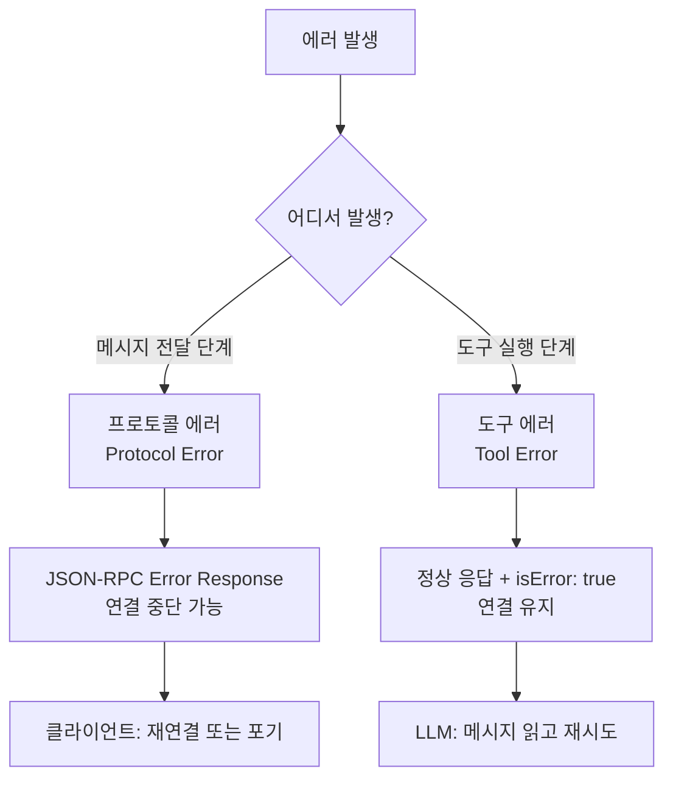
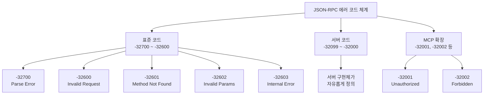
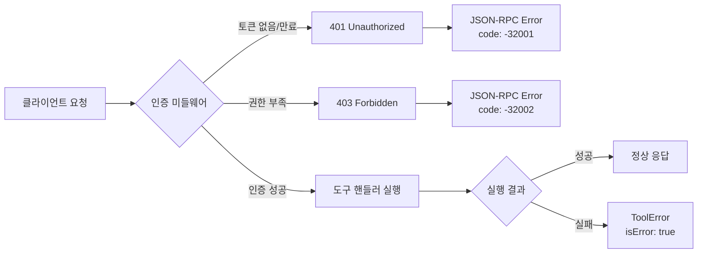
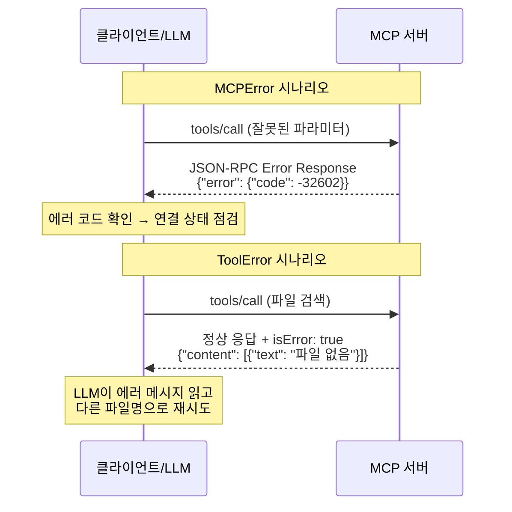
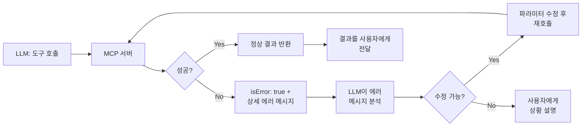
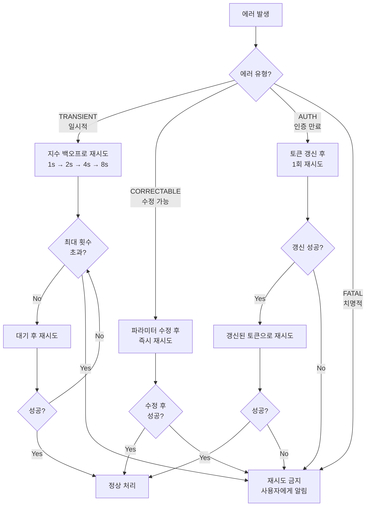

# MCP 에러 처리 체계

> MCP 서버에서 발생하는 에러를 체계적으로 분류하고, 클라이언트가 올바르게 대응할 수 있는 에러 처리 패턴을 학습합니다.

## 개요

MCP 서버를 만들었는데 "왜 자꾸 에러가 나지?"라고 당황하신 적 있으신가요? 사실 에러는 피할 수 없는 것이 아니라 **설계해야 하는 것**입니다. 잘 설계된 에러 처리는 "무엇이 잘못되었고, 어떻게 고칠 수 있는지"를 정확히 알려주는 내비게이션 같은 역할을 하거든요.

앞선 Ch11에서 우리는 보안과 인증이라는 "방어벽"을 세웠습니다. OAuth 2.0, API 키 관리, 엔터프라이즈 인증까지 — 꽤 고난도의 주제를 다뤘죠. 이번 Ch12부터는 새로운 축으로 넘어갑니다. 바로 **운영 안정성(Operational Reliability)**입니다. 아무리 완벽한 인증 시스템을 갖춰도, 에러가 제대로 처리되지 않으면 서비스는 무너지거든요. 난이도 면에서는 Ch11의 엔터프라이즈 인증보다 진입 장벽이 낮지만, 에러 코드 체계와 재시도 전략 같은 중급 수준의 설계 판단이 요구됩니다.

**선수 지식**: MCP 서버 기본 구조, `@mcp.tool()` 핸들러 작성법, JSON-RPC 프로토콜 기초, Ch11의 인증 미들웨어 개념(권장)
**학습 목표**:
- 프로토콜 에러와 도구 에러의 차이를 명확히 구분할 수 있다
- JSON-RPC 표준 에러 코드와 MCP 커스텀 코드를 적절히 활용할 수 있다
- MCPError와 ToolError를 상황에 맞게 사용할 수 있다
- 인증/인가 에러가 JSON-RPC 에러 코드로 매핑되는 원리를 이해한다
- isError 소프트 에러로 LLM의 자기 수정을 유도할 수 있다
- 재시도 전략을 에러 유형별로 설계할 수 있다

## 왜 알아야 할까?

"에러 처리? 그냥 try-except 하면 되는 거 아니야?"라고 생각하실 수도 있는데요. MCP에서는 상황이 좀 다릅니다.

일반 웹 서버는 사람이 에러 메시지를 읽지만, MCP 서버의 주 소비자는 **LLM**입니다. LLM이 에러 메시지를 받아서 "아, 이 파라미터를 고쳐서 다시 시도해야겠구나"라고 판단할 수 있어야 하거든요. 그래서 MCP는 에러를 두 갈래로 나눕니다 — **프로토콜이 터지는 에러**와 **도구가 실패하는 에러**. 이 구분을 모르면 LLM이 재시도해야 할 에러에서 대화가 끊기거나, 반대로 복구 불가능한 에러에서 무한 재시도에 빠질 수 있습니다.

> 📊 **그림 1**: Ch11 보안 → Ch12 운영 안정성으로의 관심사 전환


Ch11에서 세운 인증 미들웨어가 "허가받지 않은 접근을 차단"하는 문이라면, 이번 챕터에서 다루는 에러 처리는 "차단된 후 어떤 메시지를 돌려줄 것인가"를 설계하는 것입니다. 인증 실패(401/403)도 결국 에러 코드로 클라이언트에게 전달되어야 하니까요.

실제로 MCP 서버 운영에서 겪는 문제의 60% 이상이 "에러는 발생했는데 클라이언트가 뭘 해야 할지 모르는" 상황이라는 점을 생각하면, 에러 처리 체계를 제대로 이해하는 것이 안정적인 MCP 서비스의 첫걸음입니다.

## 핵심 개념

### 개념 1: 프로토콜 에러 vs 도구 에러 — 두 갈래의 세계

> 💡 **비유**: 택배 시스템을 생각해보세요. "주소가 잘못돼서 배달 자체가 불가능한 경우"와 "배달은 갔는데 물건이 파손된 경우"는 완전히 다른 문제죠? MCP 에러도 마찬가지입니다. **프로토콜 에러**는 메시지 전달 자체가 실패한 것이고, **도구 에러**는 메시지는 잘 도착했지만 작업 수행 중 문제가 생긴 것입니다.

MCP 에러 체계의 핵심은 이 두 갈래를 정확히 구분하는 것입니다.

> 📊 **그림 2**: MCP 에러 체계의 두 갈래 구조



**프로토콜 에러 (Protocol Error)**는 JSON-RPC 계층에서 발생합니다:
- 잘못된 JSON 형식
- 존재하지 않는 메서드 호출
- 필수 파라미터 누락
- 서버 내부 오류
- **인증/인가 실패** (401/403 — 뒤에서 자세히 다룹니다)

이 에러가 발생하면 클라이언트는 JSON-RPC error response를 받고, 심한 경우 연결이 끊어질 수 있습니다.

**도구 에러 (Tool Error)**는 도구 핸들러 내부에서 발생합니다:
- 파일을 찾을 수 없음
- API 호출 실패
- 잘못된 입력값

이 에러는 정상적인 응답으로 감싸져서 돌아오되, `isError: true` 플래그가 설정됩니다. 연결은 유지되고, LLM이 에러 메시지를 읽어서 다음 행동을 결정할 수 있습니다.

```python
# 프로토콜 에러 — JSON-RPC 에러 응답으로 반환
from mcp.server.fastmcp import FastMCP
from mcp.types import McpError, ErrorCode

mcp = FastMCP("demo")

@mcp.tool()
def search_book(isbn: str) -> str:
    """ISBN으로 도서를 검색합니다"""
    # MCPError를 raise하면 → 프로토콜 에러 (JSON-RPC error)
    if not isbn:
        raise McpError(
            ErrorCode.InvalidParams,
            "ISBN은 필수 파라미터입니다"
        )
    return f"도서 정보: {isbn}"
```

```python
# 도구 에러 — 정상 응답 + isError: true로 반환
from mcp.server.fastmcp import Context

@mcp.tool()
def search_book_safe(isbn: str, ctx: Context) -> str:
    """ISBN으로 도서를 검색합니다 (소프트 에러 버전)"""
    # ToolError를 raise하면 → 도구 에러 (isError: true)
    if not isbn.startswith("978"):
        raise ctx.error("유효한 ISBN은 '978'로 시작해야 합니다. 입력값: " + isbn)
    return f"도서 정보: {isbn}"
```

> ⚠️ **흔한 오해**: "MCPError랑 ToolError 아무거나 써도 되는 거 아니야?"
> 아닙니다! MCPError는 연결을 위협하는 심각한 에러에, ToolError는 "이번 호출은 실패했지만 다시 시도해봐"라는 의미로 사용합니다. 잘못 선택하면 LLM이 재시도 가능한 에러에서 대화를 포기하거나, 복구 불가능한 상황에서 무한 루프에 빠질 수 있어요.

### 개념 2: JSON-RPC 표준 에러 코드

> 💡 **비유**: HTTP 상태 코드(200, 404, 500)를 아시죠? JSON-RPC에도 비슷한 표준 코드 체계가 있습니다. "이 숫자만 보면 무슨 문제인지 바로 알 수 있다"는 컨셉이에요.

JSON-RPC 2.0 스펙은 -32000번대의 에러 코드를 예약해 두었습니다. 왜 하필 -32000번대일까요?

> 💡 **알고 계셨나요?**: JSON-RPC 에러 코드가 음수인 이유는 XML-RPC에서 이어진 전통입니다. 양수 에러 코드는 애플리케이션이 자유롭게 쓸 수 있도록 남겨두고, 프로토콜 자체의 에러는 음수로 구분하자는 설계였죠. -32000번대를 선택한 것은 "충분히 큰 음수여서 일반 에러와 충돌할 가능성이 없다"는 실용적인 이유였습니다. 재미있게도 이 규칙은 2005년 JSON-RPC 1.0 시절부터 20년 넘게 유지되고 있어요.

> 📊 **그림 3**: JSON-RPC 에러 코드 체계와 MCP 확장



| 코드 | 이름 | 의미 | MCP에서의 예시 |
|------|------|------|----------------|
| -32700 | Parse Error | JSON 파싱 실패 | 깨진 JSON 메시지 수신 |
| -32600 | Invalid Request | 유효하지 않은 요청 | jsonrpc 필드 누락 |
| -32601 | Method Not Found | 없는 메서드 호출 | 존재하지 않는 도구 호출 |
| -32602 | Invalid Params | 파라미터 오류 | 필수 인자 누락, 타입 불일치 |
| -32603 | Internal Error | 서버 내부 오류 | 핸들러에서 예기치 않은 예외 |

```python
# MCP SDK에서 ErrorCode 사용하기
from mcp.types import ErrorCode

# ErrorCode 열거형의 주요 값들
print(f"ParseError: {ErrorCode.ParseError}")        # -32700
print(f"InvalidRequest: {ErrorCode.InvalidRequest}") # -32600  
print(f"MethodNotFound: {ErrorCode.MethodNotFound}") # -32601
print(f"InvalidParams: {ErrorCode.InvalidParams}")   # -32602
print(f"InternalError: {ErrorCode.InternalError}")   # -32603
```

### 개념 3: 인증/인가 에러와 JSON-RPC 매핑

> 💡 **비유**: 호텔에 들어가려면 먼저 프런트에서 체크인(인증)을 하고, 카드키로 방문을 열어야(인가) 합니다. 체크인이 안 되면 "고객님을 확인할 수 없습니다"(401), 체크인은 됐지만 VIP 라운지에 입장하려 하면 "이 구역은 접근 권한이 없습니다"(403)라고 안내하죠. MCP에서도 같은 구분이 필요합니다.

Ch11에서 우리는 OAuth 2.0, API 키, JWT 기반 인증 미들웨어를 구축했습니다. 그런데 인증이 실패하면 클라이언트에게 **어떤 형태로** 에러를 전달해야 할까요? HTTP API라면 401/403 상태 코드를 쓰겠지만, MCP는 JSON-RPC 기반이라 HTTP 상태 코드를 직접 쓸 수 없습니다.

> 📊 **그림 4**: HTTP 인증 에러 → JSON-RPC 에러 매핑



MCP에서 인증/인가 에러는 **프로토콜 에러**로 분류됩니다. 도구 실행 이전에 요청 자체가 거부되는 것이니까요. JSON-RPC의 서버 정의 코드 범위(-32099 ~ -32000)를 활용하여 매핑합니다:

| HTTP 상태 | JSON-RPC 코드 | 의미 | 클라이언트 대응 |
|-----------|--------------|------|----------------|
| 401 Unauthorized | -32001 | 인증 실패 (토큰 없음/만료/유효하지 않음) | 토큰 재발급 후 재시도 |
| 403 Forbidden | -32002 | 인가 실패 (권한 부족) | 관리자에게 권한 요청, 다른 도구 사용 |

```python
from mcp.types import McpError

# 인증/인가 에러 코드를 커스텀 정의
AUTH_ERROR_UNAUTHORIZED = -32001  # 401에 해당
AUTH_ERROR_FORBIDDEN = -32002     # 403에 해당

class AuthError(McpError):
    """인증/인가 에러를 MCP 프로토콜 에러로 변환합니다"""
    
    @classmethod
    def unauthorized(cls, reason: str = "인증이 필요합니다") -> "AuthError":
        """401 Unauthorized → JSON-RPC -32001"""
        return cls(
            AUTH_ERROR_UNAUTHORIZED,
            f"Unauthorized: {reason}"
        )
    
    @classmethod
    def forbidden(cls, resource: str, required_scope: str = "") -> "AuthError":
        """403 Forbidden → JSON-RPC -32002"""
        msg = f"Forbidden: '{resource}'에 대한 접근 권한이 없습니다"
        if required_scope:
            msg += f". 필요한 권한: {required_scope}"
        return cls(AUTH_ERROR_FORBIDDEN, msg)
```

실제 인증 미들웨어와 연결하면 이런 패턴이 됩니다:

```python
from mcp.server.fastmcp import FastMCP
from functools import wraps

mcp = FastMCP("secure-server")

def require_auth(scope: str = None):
    """Ch11에서 만든 인증 미들웨어와 에러 체계를 연결하는 데코레이터"""
    def decorator(func):
        @wraps(func)
        def wrapper(*args, **kwargs):
            # ctx에서 인증 정보 추출 (Ch11 인증 미들웨어가 주입)
            ctx = kwargs.get("ctx") or (args[0] if args else None)
            
            # 토큰 검증 실패 → 401
            token = getattr(ctx, "_auth_token", None)
            if not token:
                raise AuthError.unauthorized("유효한 Bearer 토큰이 필요합니다")
            
            # 권한 검증 실패 → 403
            if scope:
                user_scopes = getattr(ctx, "_auth_scopes", [])
                if scope not in user_scopes:
                    raise AuthError.forbidden(
                        func.__name__, 
                        required_scope=scope
                    )
            
            return func(*args, **kwargs)
        return wrapper
    return decorator

@mcp.tool()
@require_auth(scope="admin:read")
def list_users(ctx) -> str:
    """관리자 전용: 사용자 목록 조회"""
    return "사용자 목록..."
```

클라이언트 측에서 인증/인가 에러를 받았을 때의 대응 전략도 중요합니다:

```python
async def handle_auth_errors(response: dict) -> dict:
    """인증/인가 에러에 대한 클라이언트 측 처리"""
    if "error" not in response:
        return response
    
    error_code = response["error"]["code"]
    error_msg = response["error"]["message"]
    
    if error_code == -32001:  # Unauthorized
        # 토큰 갱신 시도
        new_token = await refresh_access_token()
        if new_token:
            # 갱신된 토큰으로 재시도 (최대 1회)
            return await retry_with_new_token(response["id"], new_token)
        else:
            # 재로그인 필요
            raise Exception(f"인증 만료. 재로그인이 필요합니다: {error_msg}")
    
    elif error_code == -32002:  # Forbidden
        # 권한 부족은 재시도 의미 없음 → 사용자에게 안내
        raise PermissionError(
            f"권한 부족: {error_msg}. "
            f"관리자에게 필요한 권한을 요청하세요."
        )
    
    return response
```

> 🔥 **실무 팁**: 인증 에러(401)와 인가 에러(403)를 구분하는 것이 클라이언트 경험에 큰 차이를 만듭니다. 401은 "토큰을 갱신하면 해결 가능"하므로 자동 재시도 로직을 넣을 수 있지만, 403은 "이 사용자는 영원히 이 작업을 할 수 없으므로" 즉시 실패해야 합니다. 이 구분 없이 모두 -32602(Invalid Params)로 처리하면 클라이언트가 올바른 복구 전략을 세울 수 없어요.

### 개념 4: MCPError vs ToolError — 언제 무엇을 쓸까?

> 💡 **비유**: 레스토랑에서 주문할 때를 생각해보세요. **MCPError**는 "죄송합니다, 저희 식당은 오늘 문을 닫았습니다"처럼 서비스 자체가 불가능한 상황이고, **ToolError**는 "주문하신 스테이크가 품절이에요. 파스타는 어떠세요?"처럼 이번 요청은 실패했지만 대안을 제시할 수 있는 상황입니다.

> 📊 **그림 5**: MCPError와 ToolError의 처리 흐름 비교



두 에러 클래스의 핵심 차이를 정리하면 이렇습니다:

| 구분 | MCPError | ToolError |
|------|----------|-----------|
| **반환 방식** | JSON-RPC error response | 정상 response + `isError: true` |
| **연결 영향** | 연결 끊길 수 있음 | 연결 유지 |
| **LLM 가시성** | 에러 메시지를 못 볼 수도 있음 | 에러 메시지를 반드시 읽음 |
| **재시도** | 클라이언트 레벨에서 판단 | LLM이 스스로 재시도 가능 |
| **사용 시점** | 프로토콜 위반, 인증 실패, 심각한 서버 오류 | 비즈니스 로직 실패, 입력값 문제 |

그렇다면 인증/인가 에러는 어느 쪽일까요? **MCPError** 쪽입니다. 인증이 안 된 상태에서는 도구 핸들러에 진입조차 하면 안 되니까요. 반면, "이 도구는 쓸 수 있지만 요청한 리소스에 대한 접근이 제한된" 경우는 ToolError로 처리하는 것이 더 적절할 수 있습니다.

```python
from mcp.server.fastmcp import FastMCP, Context
from mcp.types import McpError, ErrorCode
import json

mcp = FastMCP("bookstore")

# 가상의 도서 데이터베이스
BOOKS_DB = {
    "978-89-01-26435-0": {"title": "클린 코드", "author": "로버트 마틴", "stock": 3},
    "978-89-6626-320-1": {"title": "리팩터링", "author": "마틴 파울러", "stock": 0},
}

@mcp.tool()
def search_book(isbn: str, ctx: Context) -> str:
    """ISBN으로 도서를 검색합니다.
    
    Args:
        isbn: 국제표준도서번호 (978로 시작)
    """
    # 1. 프로토콜 레벨 검증 — MCPError 사용
    if not isbn or not isinstance(isbn, str):
        raise McpError(
            ErrorCode.InvalidParams,
            "isbn 파라미터는 비어있지 않은 문자열이어야 합니다"
        )
    
    # 2. 비즈니스 로직 검증 — ToolError 사용
    if not isbn.startswith("978"):
        raise ctx.error(
            f"유효한 ISBN-13은 '978' 또는 '979'로 시작합니다. "
            f"입력값 '{isbn}'을 확인해주세요."
        )
    
    # 3. 데이터 조회 — ToolError 사용
    book = BOOKS_DB.get(isbn)
    if not book:
        raise ctx.error(
            f"ISBN '{isbn}'에 해당하는 도서를 찾을 수 없습니다. "
            f"등록된 ISBN 목록: {list(BOOKS_DB.keys())}"
        )
    
    # 4. 재고 확인 — 정상 응답이지만 상태 안내
    if book["stock"] == 0:
        raise ctx.error(
            f"'{book['title']}'은(는) 현재 품절입니다. "
            f"다른 도서를 검색해보세요."
        )
    
    return json.dumps(book, ensure_ascii=False, indent=2)
```

> 🔥 **실무 팁**: ToolError 메시지에는 항상 **"무엇이 잘못되었고, 어떻게 고칠 수 있는지"**를 함께 적으세요. LLM은 이 메시지를 읽고 다음 행동을 결정합니다. `"에러 발생"`보다 `"ISBN '123'은 유효하지 않습니다. ISBN은 '978'로 시작하는 13자리입니다"`가 훨씬 효과적이에요.

### 개념 5: isError 소프트 에러 — LLM과의 대화

> 💡 **비유**: isError는 시험지의 **빨간 펜 메모** 같은 겁니다. 시험 자체가 무효(프로토콜 에러)가 되는 게 아니라, "여기 틀렸으니 다시 풀어봐"라고 힌트를 주는 거죠. 학생(LLM)은 빨간 펜 메모를 읽고 스스로 답을 수정할 수 있습니다.

MCP 스펙에서 `isError: true`는 **소프트 에러(soft error)**라고 불립니다. 이 설계가 특별한 이유가 있는데요.

> 📊 **그림 6**: isError 소프트 에러의 LLM 자기 수정 사이클



isError의 설계 철학은 "**LLM이 에러로부터 배우게 하자**"입니다. 기존 API에서는 에러가 나면 개발자가 코드를 고쳐야 했지만, MCP에서는 LLM이 에러 메시지를 읽고 스스로 행동을 수정합니다.

```python
# isError가 실제로 어떤 JSON으로 변환되는지 살펴봅시다

# ToolError를 raise하면 내부적으로 이렇게 변환됩니다:
tool_error_response = {
    "jsonrpc": "2.0",
    "id": "req-123",
    "result": {
        "content": [
            {
                "type": "text",
                "text": "ISBN '123'은 유효하지 않습니다. ISBN은 '978'로 시작하는 13자리입니다"
            }
        ],
        "isError": True  # 이 플래그가 핵심!
    }
}

# 반면 MCPError는 이렇게 됩니다:
protocol_error_response = {
    "jsonrpc": "2.0",
    "id": "req-123",
    "error": {
        "code": -32602,
        "message": "isbn 파라미터는 비어있지 않은 문자열이어야 합니다"
    }
}
```

```run:python
# 두 응답의 구조적 차이를 확인해봅시다
import json

# 도구 에러 (ToolError) — result 필드에 담김
tool_error = {
    "jsonrpc": "2.0", "id": "req-1",
    "result": {
        "content": [{"type": "text", "text": "파일을 찾을 수 없습니다"}],
        "isError": True
    }
}

# 프로토콜 에러 (MCPError) — error 필드에 담김
protocol_error = {
    "jsonrpc": "2.0", "id": "req-1",
    "error": {"code": -32602, "message": "잘못된 파라미터"}
}

# 인증 에러 (AuthError) — error 필드 + 커스텀 코드
auth_error = {
    "jsonrpc": "2.0", "id": "req-1",
    "error": {"code": -32001, "message": "Unauthorized: 토큰이 만료되었습니다"}
}

print("=== 도구 에러 (ToolError) ===")
print(f"result 필드 있음: {'result' in tool_error}")
print(f"isError 플래그: {tool_error['result']['isError']}")
print(f"LLM이 읽는 메시지: {tool_error['result']['content'][0]['text']}")

print("\n=== 프로토콜 에러 (MCPError) ===")
print(f"error 필드 있음: {'error' in protocol_error}")
print(f"에러 코드: {protocol_error['error']['code']}")
print(f"에러 메시지: {protocol_error['error']['message']}")

print("\n=== 인증 에러 (AuthError) ===")
print(f"error 필드 있음: {'error' in auth_error}")
print(f"에러 코드: {auth_error['error']['code']}")
print(f"에러 메시지: {auth_error['error']['message']}")
print(f"재시도 전략: 토큰 갱신 후 1회 재시도")
```

```output
=== 도구 에러 (ToolError) ===
result 필드 있음: True
isError 플래그: True
LLM이 읽는 메시지: 파일을 찾을 수 없습니다

=== 프로토콜 에러 (MCPError) ===
error 필드 있음: True
에러 코드: -32602
에러 메시지: 잘못된 파라미터

=== 인증 에러 (AuthError) ===
error 필드 있음: True
에러 코드: -32001
에러 메시지: Unauthorized: 토큰이 만료되었습니다
재시도 전략: 토큰 갱신 후 1회 재시도
```

### 개념 6: 재시도 전략 — 에러를 분류하고 대응하기

> 💡 **비유**: 자동차가 고장 났을 때를 생각해보세요. 타이어 펑크(TRANSIENT)는 스페어로 교체하고 다시 출발할 수 있고, 내비게이션 오류(CORRECTABLE)는 목적지를 다시 입력하면 되고, 엔진 고장(FATAL)은 견인차를 불러야 합니다. 모든 고장에 같은 대응을 하면 안 되겠죠?

에러를 만나면 무조건 재시도하는 것은 위험합니다. 에러 유형에 따라 전략이 달라져야 합니다.

> 📊 **그림 7**: 에러 유형별 재시도 전략 결정 트리



```python
from enum import Enum
from dataclasses import dataclass
import time
import random

class ErrorCategory(Enum):
    """에러를 네 가지로 분류합니다"""
    TRANSIENT = "transient"      # 일시적 — 재시도하면 될 수도 있음
    CORRECTABLE = "correctable"  # 수정 가능 — 입력을 고치면 됨
    AUTH = "auth"                # 인증 만료 — 토큰 갱신 후 재시도
    FATAL = "fatal"              # 치명적 — 재시도 의미 없음

@dataclass
class RetryPolicy:
    """에러 유형별 재시도 정책"""
    max_retries: int
    base_delay: float  # 초 단위
    backoff_factor: float
    jitter: bool  # 무작위 지연 추가 여부

# 에러 유형별 재시도 정책
RETRY_POLICIES = {
    ErrorCategory.TRANSIENT: RetryPolicy(
        max_retries=3, base_delay=1.0, backoff_factor=2.0, jitter=True
    ),
    ErrorCategory.CORRECTABLE: RetryPolicy(
        max_retries=1, base_delay=0, backoff_factor=1.0, jitter=False
    ),
    ErrorCategory.AUTH: RetryPolicy(
        max_retries=1, base_delay=0, backoff_factor=1.0, jitter=False
    ),
    ErrorCategory.FATAL: RetryPolicy(
        max_retries=0, base_delay=0, backoff_factor=1.0, jitter=False
    ),
}

def classify_error(error_code: int, message: str) -> ErrorCategory:
    """에러 코드와 메시지로 에러를 분류합니다"""
    # 인증 에러 → 토큰 갱신 후 재시도
    if error_code == -32001:  # Unauthorized
        return ErrorCategory.AUTH
    
    # 인가 에러 → 재시도 무의미 (권한이 없으면 계속 없음)
    if error_code == -32002:  # Forbidden
        return ErrorCategory.FATAL
    
    # 네트워크/타임아웃 관련 → 일시적
    if error_code == -32603 and "timeout" in message.lower():
        return ErrorCategory.TRANSIENT
    
    # 파라미터 오류 → 수정 가능
    if error_code == -32602:
        return ErrorCategory.CORRECTABLE
    
    # 파싱 에러, 메서드 없음 → 치명적
    if error_code in (-32700, -32601):
        return ErrorCategory.FATAL
    
    # 기본: 일시적으로 분류 (보수적 접근)
    return ErrorCategory.TRANSIENT

def retry_with_backoff(func, error_category: ErrorCategory, *args, **kwargs):
    """에러 유형에 맞는 재시도 전략을 적용합니다"""
    policy = RETRY_POLICIES[error_category]
    
    for attempt in range(policy.max_retries + 1):
        try:
            return func(*args, **kwargs)
        except Exception as e:
            if attempt >= policy.max_retries:
                raise  # 최대 횟수 초과 → 예외 전파
            
            # AUTH 에러의 경우 토큰 갱신 시도
            if error_category == ErrorCategory.AUTH:
                print("  토큰 갱신 시도 중...")
                # refresh_token() 호출 (실제 구현에서)
            
            delay = policy.base_delay * (policy.backoff_factor ** attempt)
            if policy.jitter:
                delay += random.uniform(0, delay * 0.1)  # 10% 지터
            
            if delay > 0:
                print(f"  재시도 {attempt + 1}/{policy.max_retries} "
                      f"({delay:.1f}초 후)")
                time.sleep(delay)
            else:
                print(f"  재시도 {attempt + 1}/{policy.max_retries} (즉시)")
```

## 실습: 도서 검색 MCP 서버 — 에러 처리 완전체

앞서 배운 개념들을 모두 합쳐서, 인증 에러를 포함한 에러 처리가 완벽한 도서 검색 MCP 서버를 만들어봅시다.

```python
from mcp.server.fastmcp import FastMCP, Context
from mcp.types import McpError, ErrorCode
import json

mcp = FastMCP("bookstore-v2")

# 커스텀 인증 에러 코드
AUTH_UNAUTHORIZED = -32001
AUTH_FORBIDDEN = -32002

# 가상 도서 데이터베이스
BOOKS = {
    "978-89-01-26435-0": {
        "title": "클린 코드", 
        "author": "로버트 마틴",
        "price": 33000, 
        "stock": 3,
        "restricted": False  # 일반 도서
    },
    "978-89-6626-320-1": {
        "title": "리팩터링", 
        "author": "마틴 파울러",
        "price": 35000, 
        "stock": 0,
        "restricted": False
    },
    "978-89-6077-914-0": {
        "title": "테스트 주도 개발", 
        "author": "켄트 벡",
        "price": 25000, 
        "stock": 5,
        "restricted": True  # 관리자만 조회 가능
    },
}

# 가상 인증 저장소
VALID_TOKENS = {
    "token-user-001": {"user": "alice", "role": "user", "scopes": ["book:read"]},
    "token-admin-001": {"user": "bob", "role": "admin", "scopes": ["book:read", "book:admin"]},
}

def verify_auth(ctx: Context, required_scope: str = None) -> dict:
    """인증/인가를 검증하고 사용자 정보를 반환합니다"""
    # 실제로는 ctx의 메타데이터에서 토큰을 추출
    token = getattr(ctx, "_auth_token", None)
    
    if not token:
        raise McpError(
            AUTH_UNAUTHORIZED,
            "Bearer 토큰이 필요합니다. Authorization 헤더를 확인하세요."
        )
    
    user_info = VALID_TOKENS.get(token)
    if not user_info:
        raise McpError(
            AUTH_UNAUTHORIZED,
            "유효하지 않거나 만료된 토큰입니다. 새 토큰을 발급받으세요."
        )
    
    if required_scope and required_scope not in user_info["scopes"]:
        raise McpError(
            AUTH_FORBIDDEN,
            f"'{required_scope}' 권한이 필요합니다. "
            f"현재 권한: {user_info['scopes']}. 관리자에게 문의하세요."
        )
    
    return user_info

@mcp.tool()
def search_book(isbn: str, ctx: Context) -> str:
    """ISBN으로 도서를 검색합니다.
    
    Args:
        isbn: 국제표준도서번호 (978로 시작하는 13자리)
    """
    # 0단계: 인증 검증 — MCPError (프로토콜 에러)
    user = verify_auth(ctx, required_scope="book:read")
    
    # 1단계: 프로토콜 검증 — MCPError
    if not isbn or not isinstance(isbn, str):
        raise McpError(
            ErrorCode.InvalidParams,
            "isbn은 비어있지 않은 문자열이어야 합니다"
        )
    
    # 2단계: 형식 검증 — ToolError (수정 가능한 에러)
    isbn = isbn.replace("-", "").replace(" ", "")  # 하이픈/공백 허용
    if not isbn.startswith("978") and not isbn.startswith("979"):
        raise ctx.error(
            f"유효한 ISBN-13은 '978' 또는 '979'로 시작합니다.\n"
            f"입력값: '{isbn}'\n"
            f"예시: '978-89-01-26435-0'"
        )
    
    if len(isbn) != 13 or not isbn.isdigit():
        raise ctx.error(
            f"ISBN-13은 13자리 숫자여야 합니다.\n"
            f"입력값: '{isbn}' ({len(isbn)}자리)\n"
            f"하이픈을 포함해도 됩니다: '978-89-01-26435-0'"
        )
    
    # 3단계: 데이터 조회 — ToolError (LLM이 대안 검색 가능)
    formatted_isbn = f"{isbn[:3]}-{isbn[3:5]}-{isbn[5:7]}-{isbn[7:12]}-{isbn[12]}"
    book = BOOKS.get(formatted_isbn)
    
    if not book:
        available = [f"  - {k}: {v['title']}" for k, v in BOOKS.items()]
        raise ctx.error(
            f"ISBN '{formatted_isbn}'에 해당하는 도서를 찾을 수 없습니다.\n"
            f"등록된 도서 목록:\n" + "\n".join(available)
        )
    
    # 4단계: 권한별 접근 제어 — 제한 도서는 admin만
    if book.get("restricted") and user["role"] != "admin":
        raise McpError(
            AUTH_FORBIDDEN,
            f"'{book['title']}'은(는) 관리자 전용 도서입니다. "
            f"'book:admin' 권한이 필요합니다."
        )
    
    # 5단계: 재고 확인 — ToolError (재고 없음은 비즈니스 에러)
    result = {**book, "isbn": formatted_isbn}
    if book["stock"] == 0:
        raise ctx.error(
            f"'{book['title']}'은(는) 현재 품절입니다.\n"
            f"다른 도서를 검색하거나, 입고 알림을 등록할 수 있습니다."
        )
    
    del result["restricted"]  # 내부 필드 제거
    return json.dumps(result, ensure_ascii=False, indent=2)

@mcp.tool()
def bulk_search(isbns: list[str], ctx: Context) -> str:
    """여러 ISBN을 한 번에 검색합니다.
    
    Args:
        isbns: ISBN 목록 (최대 10개)
    """
    # 인증 검증
    verify_auth(ctx, required_scope="book:read")
    
    # 프로토콜 레벨: 배열 크기 제한
    if len(isbns) > 10:
        raise McpError(
            ErrorCode.InvalidParams,
            f"한 번에 최대 10개까지 검색 가능합니다 (입력: {len(isbns)}개)"
        )
    
    results = []
    errors = []
    
    for isbn in isbns:
        isbn_clean = isbn.replace("-", "").replace(" ", "")
        formatted = f"{isbn_clean[:3]}-{isbn_clean[3:5]}-{isbn_clean[5:7]}-{isbn_clean[7:12]}-{isbn_clean[12]}" if len(isbn_clean) == 13 else isbn
        book = BOOKS.get(formatted)
        
        if book:
            results.append({"isbn": formatted, **book})
        else:
            errors.append(isbn)
    
    # 부분 성공 시: 결과 + 실패 목록을 함께 반환
    if errors:
        response = {
            "found": results,
            "not_found": errors,
            "message": f"{len(results)}건 조회 성공, {len(errors)}건 미발견"
        }
    else:
        response = {"found": results, "message": f"전체 {len(results)}건 조회 성공"}
    
    return json.dumps(response, ensure_ascii=False, indent=2)
```

이 서버에서 핵심 포인트는:
- **0단계**(인증 검증)에서 걸리면 → -32001/-32002 코드의 프로토콜 에러, 토큰 갱신 또는 권한 요청 필요
- **1단계**(프로토콜 검증)에서 걸리면 → JSON-RPC 에러, 연결에 영향
- **2~5단계**(비즈니스 로직)에서 걸리면 → isError, LLM이 읽고 수정 가능
- **4단계**는 인증은 통과했지만 특정 리소스에 대한 인가가 부족한 "세밀한 접근 제어" 예시
- **bulk_search**는 부분 성공 패턴 — 일부만 실패해도 성공한 결과는 반환

## 더 깊이 알아보기

### isError 설계의 철학적 배경

MCP의 isError 설계는 사실 **계약에 의한 설계(Design by Contract)**에서 영감을 받았습니다. Bertrand Meyer가 1986년에 제안한 이 개념은 "함수는 사전 조건(precondition)과 사후 조건(postcondition)의 계약을 맺는다"는 것인데요.

MCP에서는 이 계약이 확장됩니다:
- **사전 조건 위반** → MCPError (파라미터가 계약을 어김, 인증 실패)
- **사후 조건 실패** → ToolError/isError (작업은 시도했지만 결과를 보장 못함)

기존 시스템에서는 에러가 "개발자에게 보내는 신호"였지만, MCP에서는 에러가 "LLM에게 보내는 학습 데이터"가 됩니다. isError의 메시지가 구체적이고 행동 지향적이어야 하는 이유가 바로 이것입니다.

### 인증 에러 코드의 표준화 동향

JSON-RPC 2.0 스펙 자체에는 인증 관련 에러 코드가 정의되어 있지 않습니다. -32099 ~ -32000 범위를 "서버 정의(Server error)" 영역으로 남겨두었을 뿐이죠. MCP 생태계에서는 이 영역을 활용하여 -32001(Unauthorized), -32002(Forbidden) 등을 관례적으로 사용하고 있지만, 아직 공식 스펙에 포함되지는 않았습니다. 서버 간 호환성을 위해 에러 메시지에 HTTP 상태 코드를 함께 명시하는 것이 좋은 관행입니다.

## 흔한 오해와 팁

> ⚠️ **흔한 오해**: "에러가 나면 무조건 MCPError를 raise해야 한다"
> MCPError를 남용하면 LLM이 에러 메시지를 읽지 못하는 경우가 생깁니다. 도구 실행 중의 비즈니스 로직 에러는 ToolError(isError: true)를 사용해야 LLM이 메시지를 읽고 스스로 수정할 수 있어요. MCPError는 "프로토콜 자체가 깨진" 경우(파라미터 타입 오류, 인증 실패 등)에만 쓰세요.

> ⚠️ **흔한 오해**: "인증 실패는 ToolError로 처리해도 된다"
> 인증이 안 된 클라이언트의 요청을 ToolError로 처리하면, LLM이 "입력을 고쳐서 다시 시도해볼게"라며 같은 요청을 반복할 수 있습니다. 인증 에러(401/403)는 반드시 MCPError(프로토콜 에러)로 처리하여 클라이언트가 토큰 갱신이나 권한 요청 같은 **인증 수준의 복구 작업**을 수행하도록 유도해야 합니다.

> 💡 **알고 계셨나요?**: MCP 스펙 초기 버전에는 isError 필드가 없었습니다. 모든 에러를 JSON-RPC error로 반환했는데, LLM이 에러를 인식하지 못하고 같은 요청을 반복하는 문제가 발생했습니다. Anthropic 팀이 Claude와의 통합 테스트에서 이 문제를 발견하고, "정상 응답이지만 에러임을 알리는" isError 플래그를 도입했어요.

> 🔥 **실무 팁**: ToolError 메시지를 작성할 때는 이 세 가지를 포함하세요:
> 1. **무엇이** 잘못되었는지 (What went wrong)
> 2. **왜** 잘못되었는지 (Why it failed)  
> 3. **어떻게** 고칠 수 있는지 (How to fix it)
> 
> 예: `"ISBN '123'은 유효하지 않습니다(what). ISBN-13 형식은 '978'로 시작하는 13자리여야 합니다(why). '978-89-01-26435-0' 형태로 다시 시도해주세요(how)."`

## 핵심 정리

| 개념 | 설명 |
|------|------|
| **프로토콜 에러** | JSON-RPC 계층 에러. 메시지 전달 자체가 실패. 연결 끊길 수 있음 |
| **도구 에러** | 도구 핸들러 내부 에러. 정상 응답 + isError: true. 연결 유지 |
| **MCPError** | 프로토콜 에러를 발생시키는 예외 클래스. 심각한 위반, 인증 실패에 사용 |
| **ToolError** | 도구 에러를 발생시키는 예외 클래스. LLM이 읽고 수정 가능 |
| **isError** | 소프트 에러 플래그. LLM의 자기 수정(self-correction) 유도 |
| **에러 코드** | -32700~-32603: 표준, -32001/-32002: 인증/인가, -32099~-32000: 서버 정의 |
| **인증 에러 매핑** | 401 → -32001 (토큰 갱신 후 재시도), 403 → -32002 (재시도 불가) |
| **재시도 전략** | TRANSIENT(백오프), CORRECTABLE(수정 후 즉시), AUTH(토큰 갱신), FATAL(포기) |

## 다음 섹션 미리보기

에러를 제대로 분류하고 처리할 수 있게 되었으니, 다음으로는 이 에러들이 **언제, 어디서, 왜** 발생하는지를 추적할 차례입니다. [02. 구조화된 로깅과 모니터링](12-ch12-에러-처리-로깅-테스트/02-02-구조화된-로깅과-모니터링.md)에서는 Python의 structlog를 활용한 구조화 로깅, 요청 추적(request tracing), 그리고 프로덕션 모니터링 전략을 다룹니다.

## 참고 자료

- [JSON-RPC 2.0 Specification](https://www.jsonrpc.org/specification) - JSON-RPC 에러 코드의 공식 스펙
- [MCP Specification — Error Handling](https://spec.modelcontextprotocol.io/) - MCP 공식 에러 처리 가이드
- [Python MCP SDK — Error Types](https://github.com/modelcontextprotocol/python-sdk) - MCPError, ToolError 구현 코드
- [Design by Contract (Bertrand Meyer)](https://en.wikipedia.org/wiki/Design_by_contract) - isError 설계의 철학적 배경
- [OAuth 2.0 Error Response (RFC 6749 Section 5.2)](https://datatracker.ietf.org/doc/html/rfc6749#section-5.2) - OAuth 에러와 JSON-RPC 매핑 참고