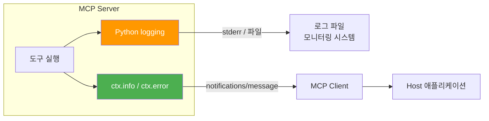
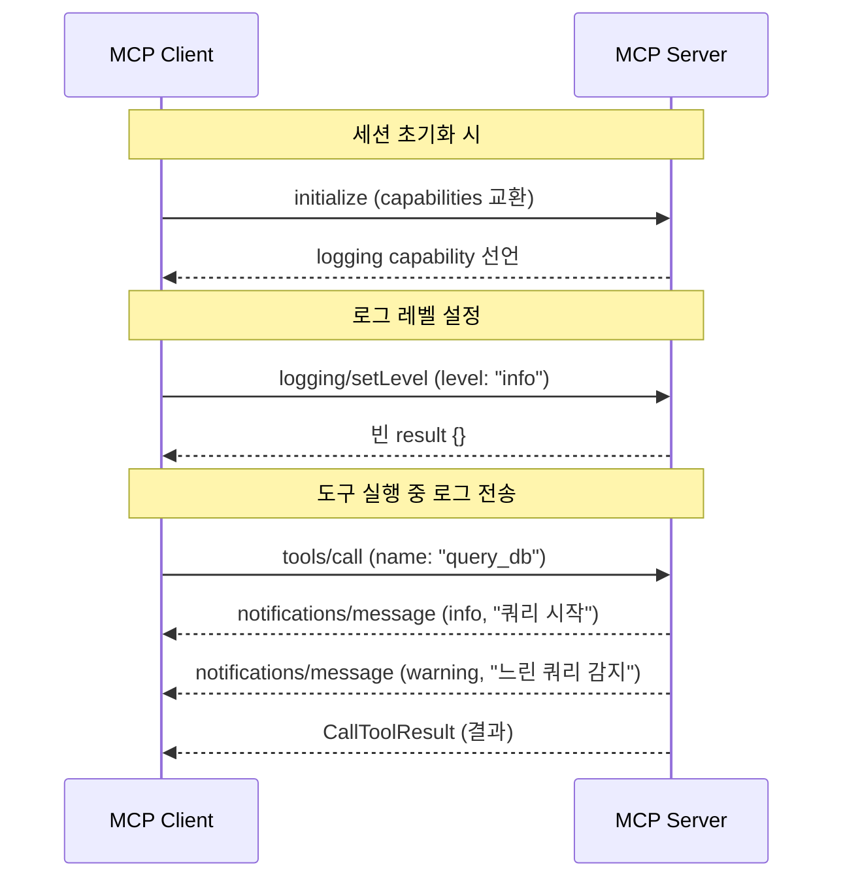
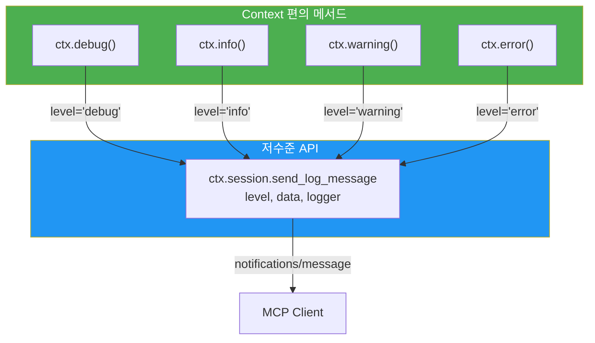
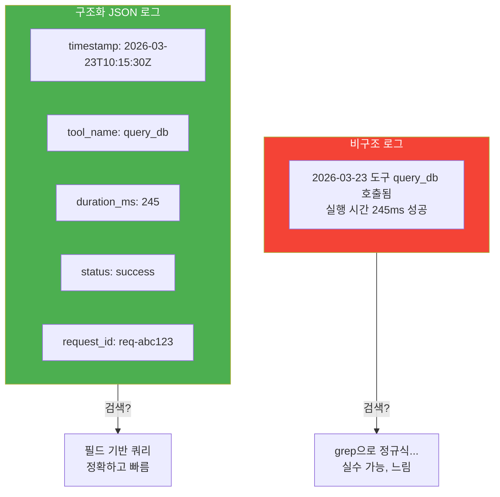
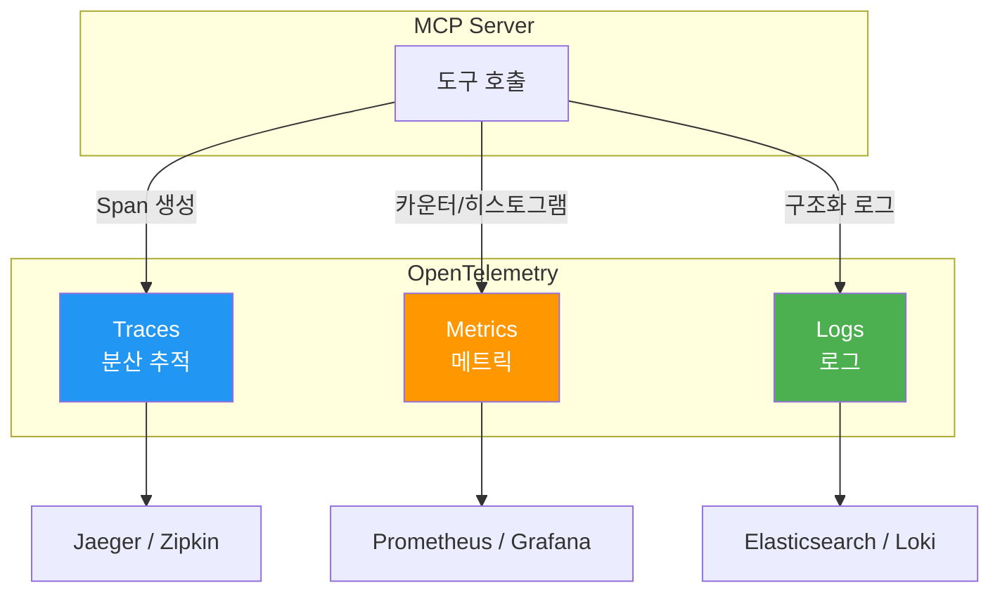
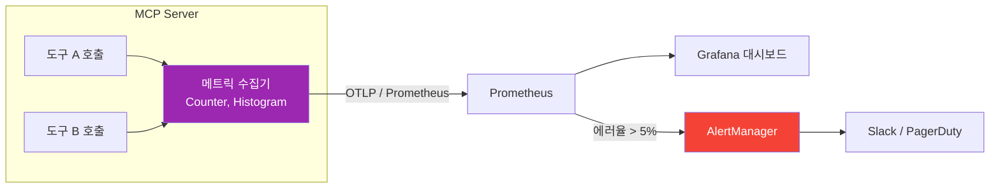

# 구조화된 로깅과 모니터링

> Python logging부터 MCP `notifications/message`, 구조화된 JSON 로그, OpenTelemetry 연동, 메트릭 수집까지 — MCP 서버의 관찰 가능성(Observability)을 완성합니다.

## 개요

이 섹션에서는 MCP 서버에서 **서버 사이드 로깅**과 **클라이언트 전송 로깅**이라는 두 가지 로깅 채널을 이해하고, 프로덕션 환경에서 필요한 구조화된 로깅, 분산 추적, 메트릭 수집 전략을 학습합니다.

**선수 지식**: [MCP 에러 처리 체계](12-ch12-에러-처리-로깅-테스트/01-01-mcp-에러-처리-체계.md)에서 배운 프로토콜 에러 vs 도구 에러 구분, [비동기 도구와 Context 활용](04-ch4-tools-함수-호출-프리미티브/05-05-비동기-도구와-context-활용.md)에서 배운 `Context` 객체 사용법

**학습 목표**:
- Python logging 모듈과 MCP 서버의 특수한 관계를 이해할 수 있다
- MCP `notifications/message`를 통해 클라이언트에 구조화된 로그를 전송할 수 있다
- JSON 포맷의 구조화된 로그를 설계하고 구현할 수 있다
- OpenTelemetry를 연동하여 분산 추적과 메트릭을 수집할 수 있다
- 도구 호출 횟수, 지연 시간, 에러율 등 핵심 메트릭을 정의할 수 있다

## 왜 알아야 할까?

비행기 블랙박스를 떠올려 보세요. 사고가 났을 때 "무슨 일이 있었는지"를 알 수 있는 유일한 방법이 블랙박스입니다. 블랙박스가 없으면? "비행기가 추락했다"는 사실만 알 뿐, 왜 추락했는지는 영원히 미스터리로 남죠.

MCP 서버도 마찬가지입니다. 프로덕션에서 도구 호출이 느려지거나, 특정 시간대에만 에러가 급증하거나, 메모리가 누수되는 상황을 **사후에 디버깅**하려면 체계적인 로깅이 필수입니다. 하지만 MCP 서버의 로깅에는 일반 웹 서버와 다른 **치명적인 함정**이 하나 있습니다:

> **stdio Transport에서 `print()`나 `logging` 출력을 stdout에 쓰면, JSON-RPC 메시지 스트림이 오염되어 서버가 즉시 죽습니다.**

이 함정 때문에 MCP는 **별도의 로깅 프리미티브**(`notifications/message`)를 프로토콜 수준에서 제공합니다. 이전 섹션에서 [에러 처리 체계](12-ch12-에러-처리-로깅-테스트/01-01-mcp-에러-처리-체계.md)를 세웠으니, 이제 그 에러를 **기록하고 추적하는** 관찰 가능성 시스템을 세울 차례입니다.

## 핵심 개념

### 개념 1: MCP 서버 로깅의 두 채널

> 💡 **비유**: 식당 주방을 생각해 보세요. 셰프가 요리하면서 중얼거리는 혼잣말(서버 사이드 로그)과, 홀 직원에게 "3번 테이블 음식 나갑니다!"라고 외치는 알림(클라이언트 전송 로그)은 완전히 다른 채널입니다. 혼잣말은 주방 CCTV(로그 파일)에 기록되고, 알림은 홀 직원(MCP Client)이 듣고 행동합니다.

MCP 서버에서 로그가 흐르는 경로는 두 가지입니다:

**채널 1 — 서버 사이드 로깅**: Python `logging` 모듈 → stderr 또는 파일
- 운영팀이 보는 로그 (디버깅, 모니터링, 감사)
- `stdout`에 절대 쓰면 안 됨 (stdio Transport 오염)
- `stderr`로 출력하거나, 파일/외부 시스템으로 전송

**채널 2 — 클라이언트 전송 로깅**: MCP `notifications/message` → Client → Host
- MCP Client(또는 LLM)가 보는 로그
- 서버가 현재 무엇을 하고 있는지 실시간 상태 전달
- `Context.info()`, `Context.warning()` 등 사용

> 📊 **그림 1**: MCP 서버의 두 가지 로깅 채널



여기서 결정적으로 중요한 규칙이 있습니다:

```python
import sys
import logging

# ❌ 절대 금지 — stdio Transport에서 stdout 출력은 서버를 죽입니다
print("디버그 메시지")  # stdout → JSON-RPC 스트림 오염!
logging.basicConfig()    # 기본 핸들러가 stdout 사용

# ✅ 안전한 방법 — stderr로 출력
logging.basicConfig(
    stream=sys.stderr,           # stderr로 리다이렉트
    level=logging.DEBUG,
    format="%(asctime)s [%(levelname)s] %(name)s: %(message)s"
)
logger = logging.getLogger("my-mcp-server")
logger.info("이 로그는 안전합니다")  # stderr로 출력

# ✅ 파일로 출력
file_handler = logging.FileHandler("mcp_server.log")
logger.addHandler(file_handler)
```

> ⚠️ **흔한 오해**: "FastMCP가 알아서 처리해 주겠지"라고 생각하기 쉽지만, FastMCP의 기본 로거도 내부적으로 stderr를 사용합니다. 하지만 여러분이 직접 추가하는 `print()` 문이나 서드파티 라이브러리의 stdout 출력까지 관리해 주지는 않습니다. **모든 stdout 출력을 직접 차단**해야 합니다.

### 개념 2: MCP 로깅 프로토콜 — `notifications/message`

> 💡 **비유**: 택배 기사가 배송하면서 고객에게 "집하 완료 → 허브 도착 → 배송 출발 → 배송 완료" 알림을 보내는 것과 같습니다. 고객(Client)은 이 알림으로 현재 상태를 파악하고, 택배 회사(Server)의 내부 물류 시스템 로그는 별도로 관리됩니다.

MCP 스펙은 서버가 클라이언트에게 로그 메시지를 전송하는 표준 메커니즘을 정의합니다.

**1단계: 서버가 `logging` Capability를 선언합니다**

```json
{
  "capabilities": {
    "logging": {}
  }
}
```

**2단계: 클라이언트가 로그 레벨을 설정합니다**

클라이언트는 `logging/setLevel` 요청으로 수신할 최소 로그 레벨을 지정합니다:

```json
{
  "jsonrpc": "2.0",
  "id": 1,
  "method": "logging/setLevel",
  "params": {
    "level": "warning"
  }
}
```

**3단계: 서버가 `notifications/message`로 로그를 전송합니다**

```json
{
  "jsonrpc": "2.0",
  "method": "notifications/message",
  "params": {
    "level": "error",
    "logger": "database",
    "data": {
      "error": "Connection timeout",
      "host": "db.example.com",
      "retry_count": 3
    }
  }
}
```

> 📊 **그림 2**: MCP 로깅 프로토콜 시퀀스



MCP는 **RFC 5424 syslog 심각도 레벨**을 따라 8단계 로그 레벨을 지원합니다:

| 레벨 | 심각도 | 용도 |
|------|--------|------|
| `emergency` | 0 (최고) | 시스템 전체 불능 |
| `alert` | 1 | 즉각 조치 필요 |
| `critical` | 2 | 핵심 컴포넌트 장애 |
| `error` | 3 | 작업 실패 |
| `warning` | 4 | 경고 상황 |
| `notice` | 5 | 정상이지만 주목할 만한 이벤트 |
| `info` | 6 | 일반 정보 |
| `debug` | 7 (최저) | 상세 디버깅 정보 |

Python SDK의 `Context` 객체는 4가지 편의 메서드를 제공합니다. 이 메서드들은 내부적으로 `ServerSession.send_log_message(level=..., data=..., logger=...)`를 호출하는 **편의 래퍼(convenience wrapper)**입니다. 즉 `ctx.info("메시지")`는 `ctx.session.send_log_message(level="info", data="메시지")`와 동일한 동작을 합니다:

```python
from mcp.server.fastmcp import FastMCP, Context

mcp = FastMCP("logging-demo")

@mcp.tool()
async def analyze_data(query: str, ctx: Context) -> str:
    """데이터를 분석합니다."""
    # 편의 메서드 4종 — 각각 send_log_message()의 래퍼
    # ctx.debug(msg) → send_log_message(level="debug", data=msg)
    # ctx.info(msg)  → send_log_message(level="info", data=msg)
    # ctx.warning(msg) → send_log_message(level="warning", data=msg)
    # ctx.error(msg) → send_log_message(level="error", data=msg)
    await ctx.debug(f"쿼리 파싱 시작: {query}")
    await ctx.info("데이터베이스 연결 완료")
    await ctx.warning("결과가 10,000건을 초과합니다")
    await ctx.error("타임아웃 발생, 부분 결과 반환")

    # 8단계 전체를 사용하려면 저수준 API 직접 호출
    # emergency, alert, critical, notice 등 편의 메서드가 없는 레벨
    await ctx.session.send_log_message(
        level="critical",
        data="디스크 공간 부족 — 5% 미만",
        logger="storage"
    )

    return "분석 결과..."
```

> 📊 **그림 2.5**: ctx 편의 메서드와 send_log_message() 관계



### 개념 3: 구조화된 JSON 로그 포맷

> 💡 **비유**: 도서관의 카드 목록을 생각해 보세요. "어떤 책이 어딘가에 있다"라고 적힌 메모(비구조 로그)와, 제목·저자·ISBN·위치가 정해진 칸에 깔끔히 기록된 카드(구조화 로그)의 차이입니다. 카드 목록이 있어야 원하는 책을 **검색**할 수 있죠.

프로덕션 MCP 서버에서는 로그를 **JSON 포맷**으로 구조화해야 합니다. 왜냐하면:

1. **파싱 가능**: Elasticsearch, Loki, CloudWatch 같은 로그 시스템이 자동으로 인덱싱
2. **필터링 용이**: `tool_name`, `request_id`, `duration_ms` 등 필드로 정확한 검색
3. **상관관계 추적**: `request_id`로 하나의 요청이 거치는 모든 로그를 연결

> 📊 **그림 3**: 비구조 로그 vs 구조화 로그 비교



Python `logging` 모듈에 JSON 포맷터를 적용하는 방법입니다:

```python
import json
import logging
import sys
from datetime import datetime, timezone


class JSONFormatter(logging.Formatter):
    """MCP 서버용 구조화 JSON 로그 포맷터."""

    def format(self, record: logging.LogRecord) -> str:
        log_entry = {
            "timestamp": datetime.now(timezone.utc).isoformat(),
            "level": record.levelname.lower(),
            "logger": record.name,
            "message": record.getMessage(),
        }
        # extra 필드 병합 (tool_name, request_id 등)
        if hasattr(record, "tool_name"):
            log_entry["tool_name"] = record.tool_name
        if hasattr(record, "request_id"):
            log_entry["request_id"] = record.request_id
        if hasattr(record, "duration_ms"):
            log_entry["duration_ms"] = record.duration_ms
        # 예외 정보 포함
        if record.exc_info and record.exc_info[0] is not None:
            log_entry["exception"] = self.formatException(record.exc_info)
        return json.dumps(log_entry, ensure_ascii=False)


def setup_mcp_logger(name: str, level: int = logging.INFO) -> logging.Logger:
    """MCP 서버용 안전한 로거를 설정합니다."""
    logger = logging.getLogger(name)
    logger.setLevel(level)

    # ✅ 핵심: stderr 핸들러 사용 (stdout 오염 방지)
    handler = logging.StreamHandler(sys.stderr)
    handler.setFormatter(JSONFormatter())
    logger.addHandler(handler)

    # stdout으로 전파 차단
    logger.propagate = False
    return logger
```

```run:python
import json
from datetime import datetime, timezone

# JSON 로그 엔트리 예시
log_entry = {
    "timestamp": datetime.now(timezone.utc).isoformat(),
    "level": "info",
    "logger": "mcp.tools",
    "message": "도구 호출 완료",
    "tool_name": "query_db",
    "request_id": "req-abc123",
    "duration_ms": 245,
    "status": "success"
}
print(json.dumps(log_entry, ensure_ascii=False, indent=2))
```

```output
{
  "timestamp": "2026-03-23T01:15:30.123456+00:00",
  "level": "info",
  "logger": "mcp.tools",
  "message": "도구 호출 완료",
  "tool_name": "query_db",
  "request_id": "req-abc123",
  "duration_ms": 245,
  "status": "success"
}
```

### 개념 4: OpenTelemetry 통합 — 분산 추적

> 💡 **비유**: 택배가 "발송지 → 지역 허브 → 중앙 허브 → 지역 허브 → 수신지"를 거치면서 각 지점마다 스캔되는 것과 같습니다. 이 스캔 기록(Span)을 모아 보면 택배가 어디서 얼마나 머물렀는지 한눈에 보이죠. OpenTelemetry의 **분산 추적**이 바로 이 원리입니다.

OpenTelemetry(OTel)는 **관찰 가능성의 세 기둥(Three Pillars of Observability)** 을 통합하는 오픈 표준입니다. 세 기둥이란:

- **로그(Logs)**: "무슨 일이 있었는가?" — 이벤트의 텍스트 기록
- **메트릭(Metrics)**: "얼마나 자주, 얼마나 오래?" — 수치로 측정하는 시스템 상태
- **추적(Traces)**: "요청이 어떤 경로로 흘렀는가?" — 분산 시스템에서 하나의 요청이 거치는 전체 여정

이 세 가지를 조합해야 비로소 시스템 내부 상태를 완전히 **관찰**할 수 있습니다. 로그만으로는 "무슨 일이 있었는지"는 알지만 "얼마나 심각한지"(메트릭)나 "어디서 병목이 생겼는지"(추적)는 알 수 없거든요. MCP 서버에 OTel을 연동하면 도구 호출의 전체 생명주기를 이 세 기둥으로 관찰할 수 있습니다.

> 📊 **그림 4**: OpenTelemetry 3대 기둥과 MCP 서버



MCP 서버에 OpenTelemetry 추적을 연동하는 코드입니다:

```python
# 필요 패키지: pip install opentelemetry-api opentelemetry-sdk
#              pip install opentelemetry-exporter-otlp-proto-grpc

from opentelemetry import trace
from opentelemetry.sdk.trace import TracerProvider
from opentelemetry.sdk.trace.export import (
    BatchSpanProcessor,
    ConsoleSpanExporter,
)
from opentelemetry.sdk.resources import Resource
from mcp.server.fastmcp import FastMCP, Context
import time

# ── OTel 초기화 ──
resource = Resource.create({"service.name": "my-mcp-server"})
provider = TracerProvider(resource=resource)

# 개발 환경: 콘솔 출력 (프로덕션에서는 OTLP Exporter 사용)
provider.add_span_processor(BatchSpanProcessor(ConsoleSpanExporter()))
trace.set_tracer_provider(provider)
tracer = trace.get_tracer("mcp.tools")

mcp = FastMCP("otel-mcp-server")


@mcp.tool()
async def search_documents(query: str, ctx: Context) -> str:
    """문서를 검색합니다."""
    # Span으로 도구 실행 전체를 감싸기
    with tracer.start_as_current_span(
        "tool.search_documents",
        attributes={
            "mcp.tool.name": "search_documents",
            "mcp.tool.query": query,
        }
    ) as span:
        await ctx.info(f"검색 시작: {query}")
        start = time.monotonic()

        # 자식 Span: DB 쿼리 단계
        with tracer.start_as_current_span("db.query") as db_span:
            # 실제 DB 쿼리 로직...
            results = [f"문서_{i}" for i in range(5)]
            db_span.set_attribute("db.result_count", len(results))

        duration_ms = (time.monotonic() - start) * 1000
        span.set_attribute("mcp.tool.duration_ms", duration_ms)
        span.set_attribute("mcp.tool.status", "success")

        await ctx.info(f"검색 완료: {len(results)}건, {duration_ms:.1f}ms")
        return f"{len(results)}건의 문서를 찾았습니다."
```

프로덕션 환경에서는 `ConsoleSpanExporter` 대신 OTLP Exporter로 Jaeger나 Tempo 같은 백엔드에 전송합니다:

```python
from opentelemetry.exporter.otlp.proto.grpc.trace_exporter import (
    OTLPSpanExporter,
)

# Jaeger/Tempo 등 OTLP 수집기로 전송
otlp_exporter = OTLPSpanExporter(
    endpoint="http://localhost:4317",
    insecure=True  # 개발 환경용. 프로덕션에서는 TLS 사용
)
provider.add_span_processor(BatchSpanProcessor(otlp_exporter))
```

### 개념 5: 메트릭 수집 — 도구 호출 횟수, 지연 시간, 에러율

> 💡 **비유**: 카페 사장이 "오늘 커피 몇 잔 팔았지? 평균 제조 시간은? 주문 실패율은?" 같은 숫자를 매일 체크하는 것과 같습니다. 이 숫자들이 없으면 "뭔가 잘 안 되는 것 같은데..."라는 감에 의존할 수밖에 없죠.

MCP 서버에서 반드시 추적해야 하는 핵심 메트릭 4가지입니다:

| 메트릭 | 타입 | 라벨 | 용도 |
|--------|------|------|------|
| `mcp_tool_calls_total` | Counter | `tool_name`, `status` | 도구별 호출 횟수·성공률 |
| `mcp_tool_duration_seconds` | Histogram | `tool_name` | p50/p95/p99 지연 시간 |
| `mcp_active_sessions` | Gauge | — | 현재 활성 세션 수 |
| `mcp_errors_total` | Counter | `tool_name`, `error_type` | 에러 유형별 발생 빈도 |

OpenTelemetry Metrics API로 이 메트릭들을 구현합니다:

```python
# 필요 패키지: pip install opentelemetry-api opentelemetry-sdk

from opentelemetry.metrics import get_meter_provider, set_meter_provider
from opentelemetry.sdk.metrics import MeterProvider
from opentelemetry.sdk.metrics.export import (
    ConsoleMetricExporter,
    PeriodicExportingMetricReader,
)

# ── 메트릭 초기화 ──
reader = PeriodicExportingMetricReader(
    ConsoleMetricExporter(),
    export_interval_millis=30000  # 30초마다 내보내기
)
set_meter_provider(MeterProvider(metric_readers=[reader]))
meter = get_meter_provider().get_meter("mcp-server-metrics")

# ── 핵심 메트릭 4종 정의 ──
tool_calls_counter = meter.create_counter(
    name="mcp_tool_calls_total",
    description="MCP 도구 호출 총 횟수",
    unit="calls",
)

tool_duration_histogram = meter.create_histogram(
    name="mcp_tool_duration_seconds",
    description="MCP 도구 실행 시간",
    unit="seconds",
)

active_sessions_gauge = meter.create_up_down_counter(
    name="mcp_active_sessions",
    description="현재 활성 MCP 세션 수",
    unit="sessions",
)

error_counter = meter.create_counter(
    name="mcp_errors_total",
    description="MCP 에러 발생 총 횟수",
    unit="errors",
)
```

이 메트릭들을 도구 실행에 연결하는 데코레이터 패턴입니다:

```python
import time
import functools
from mcp.server.fastmcp import FastMCP, Context

mcp = FastMCP("metrics-demo")


def with_metrics(func):
    """도구 실행 메트릭을 자동 수집하는 데코레이터."""
    @functools.wraps(func)
    async def wrapper(*args, **kwargs):
        tool_name = func.__name__
        start = time.monotonic()
        status = "success"

        try:
            result = await func(*args, **kwargs)
            return result
        except Exception as e:
            status = "error"
            error_counter.add(1, {
                "tool_name": tool_name,
                "error_type": type(e).__name__
            })
            raise
        finally:
            duration = time.monotonic() - start
            tool_calls_counter.add(1, {
                "tool_name": tool_name,
                "status": status
            })
            tool_duration_histogram.record(duration, {
                "tool_name": tool_name
            })

    return wrapper


@mcp.tool()
@with_metrics
async def query_database(sql: str, ctx: Context) -> str:
    """SQL 쿼리를 실행합니다."""
    await ctx.info(f"쿼리 실행: {sql[:50]}...")
    # 실제 쿼리 로직...
    return "쿼리 결과"
```

> 📊 **그림 5**: 메트릭 수집과 알림 파이프라인



프로덕션 환경에서 권장하는 알림 임계값입니다:

| 조건 | 기간 | 심각도 |
|------|------|--------|
| 도구 에러율 > 5% | 5분 | Warning |
| p95 지연 시간 > 10초 | 5분 | Warning |
| 활성 세션 > 용량의 80% | — | Critical |
| 도구 에러율 > 20% | 1분 | Critical |

## 실습: 직접 해보기

관찰 가능성이 완비된 MCP 서버를 처음부터 만들어 보겠습니다. 서버 사이드 JSON 로그, 클라이언트 전송 로그, 그리고 OpenTelemetry 추적을 모두 통합합니다.

```python
"""
observable_server.py
관찰 가능성이 완비된 MCP 서버 실습.
서버 사이드 JSON 로그 + 클라이언트 로그 + OTel 추적 통합.
"""

import json
import logging
import sys
import time
from datetime import datetime, timezone
from typing import Any

from mcp.server.fastmcp import FastMCP, Context
from opentelemetry import trace
from opentelemetry.sdk.trace import TracerProvider
from opentelemetry.sdk.trace.export import (
    BatchSpanProcessor,
    ConsoleSpanExporter,
)
from opentelemetry.sdk.resources import Resource


# ── 1. JSON 로그 포맷터 ──
class JSONFormatter(logging.Formatter):
    """구조화된 JSON 로그를 생성합니다."""

    def format(self, record: logging.LogRecord) -> str:
        entry: dict[str, Any] = {
            "timestamp": datetime.now(timezone.utc).isoformat(),
            "level": record.levelname.lower(),
            "logger": record.name,
            "message": record.getMessage(),
        }
        # extra 필드 자동 병합
        for key in ("tool_name", "request_id", "duration_ms", "status"):
            if hasattr(record, key):
                entry[key] = getattr(record, key)
        if record.exc_info and record.exc_info[0] is not None:
            entry["exception"] = self.formatException(record.exc_info)
        return json.dumps(entry, ensure_ascii=False)


# ── 2. 로거 설정 (stderr로 출력) ──
logger = logging.getLogger("observable-mcp")
logger.setLevel(logging.DEBUG)
handler = logging.StreamHandler(sys.stderr)  # ✅ stdout 아닌 stderr!
handler.setFormatter(JSONFormatter())
logger.addHandler(handler)
logger.propagate = False


# ── 3. OpenTelemetry 초기화 ──
resource = Resource.create({"service.name": "observable-mcp-server"})
provider = TracerProvider(resource=resource)
provider.add_span_processor(BatchSpanProcessor(ConsoleSpanExporter()))
trace.set_tracer_provider(provider)
tracer = trace.get_tracer("mcp.tools")


# ── 4. MCP 서버 생성 ──
mcp = FastMCP("observable-server")


# ── 5. 메트릭 수집 유틸리티 ──
class MetricsCollector:
    """도구 실행 메트릭을 수집합니다."""

    def __init__(self):
        self.call_counts: dict[str, int] = {}
        self.error_counts: dict[str, int] = {}
        self.durations: dict[str, list[float]] = {}

    def record(self, tool_name: str, duration: float, success: bool):
        # 호출 횟수
        self.call_counts[tool_name] = (
            self.call_counts.get(tool_name, 0) + 1
        )
        # 에러 횟수
        if not success:
            self.error_counts[tool_name] = (
                self.error_counts.get(tool_name, 0) + 1
            )
        # 지연 시간
        if tool_name not in self.durations:
            self.durations[tool_name] = []
        self.durations[tool_name].append(duration)

    def get_stats(self, tool_name: str) -> dict:
        calls = self.call_counts.get(tool_name, 0)
        errors = self.error_counts.get(tool_name, 0)
        durations = self.durations.get(tool_name, [])
        avg_ms = (sum(durations) / len(durations) * 1000) if durations else 0
        return {
            "calls": calls,
            "errors": errors,
            "error_rate": f"{errors / calls * 100:.1f}%" if calls > 0 else "0%",
            "avg_duration_ms": round(avg_ms, 2),
        }


metrics = MetricsCollector()


# ── 6. 관찰 가능한 도구 정의 ──

@mcp.tool()
async def search_products(
    keyword: str, max_results: int = 10, ctx: Context = None
) -> str:
    """상품을 검색합니다. 키워드와 최대 결과 수를 지정하세요."""
    with tracer.start_as_current_span(
        "tool.search_products",
        attributes={"keyword": keyword, "max_results": max_results},
    ) as span:
        start = time.monotonic()
        success = True

        try:
            # 서버 로그: 운영팀용
            logger.info(
                "상품 검색 시작",
                extra={"tool_name": "search_products", "request_id": "demo"},
            )

            # 클라이언트 로그: LLM/사용자용
            if ctx:
                await ctx.info(f"'{keyword}' 검색 중...")

            # 시뮬레이션: 검색 로직
            if not keyword.strip():
                success = False
                if ctx:
                    await ctx.warning("빈 키워드는 검색할 수 없습니다")
                return "키워드를 입력해 주세요."

            results = [
                {"name": f"{keyword} 상품 {i+1}", "price": (i + 1) * 10000}
                for i in range(min(max_results, 5))
            ]

            if ctx:
                await ctx.info(f"검색 완료: {len(results)}건")

            span.set_attribute("result_count", len(results))
            return json.dumps(results, ensure_ascii=False)

        except Exception as e:
            success = False
            span.record_exception(e)
            logger.error(
                f"검색 실패: {e}",
                extra={"tool_name": "search_products"},
                exc_info=True,
            )
            raise
        finally:
            duration = time.monotonic() - start
            metrics.record("search_products", duration, success)
            logger.info(
                "검색 완료",
                extra={
                    "tool_name": "search_products",
                    "duration_ms": round(duration * 1000, 2),
                    "status": "success" if success else "error",
                },
            )


@mcp.tool()
async def get_server_metrics(ctx: Context = None) -> str:
    """서버 메트릭을 조회합니다. 운영 상태를 확인할 때 사용하세요."""
    if ctx:
        await ctx.info("메트릭 수집 중...")

    all_stats = {}
    for tool_name in metrics.call_counts:
        all_stats[tool_name] = metrics.get_stats(tool_name)

    return json.dumps(all_stats, ensure_ascii=False, indent=2)


if __name__ == "__main__":
    mcp.run()
```

이 서버를 실행하면 세 가지 관찰 채널이 동시에 작동합니다:

1. **stderr** → JSON 구조화 로그 (운영팀)
2. **MCP `notifications/message`** → 클라이언트/LLM 실시간 상태
3. **OpenTelemetry Spans** → 분산 추적 백엔드 (Jaeger/Tempo)

```run:python
# 메트릭 수집기 동작 시뮬레이션
import json

class MetricsCollector:
    def __init__(self):
        self.call_counts = {}
        self.error_counts = {}
        self.durations = {}

    def record(self, tool_name, duration, success):
        self.call_counts[tool_name] = self.call_counts.get(tool_name, 0) + 1
        if not success:
            self.error_counts[tool_name] = self.error_counts.get(tool_name, 0) + 1
        self.durations.setdefault(tool_name, []).append(duration)

    def get_stats(self, tool_name):
        calls = self.call_counts.get(tool_name, 0)
        errors = self.error_counts.get(tool_name, 0)
        durations = self.durations.get(tool_name, [])
        avg_ms = (sum(durations) / len(durations) * 1000) if durations else 0
        return {
            "calls": calls,
            "errors": errors,
            "error_rate": f"{errors / calls * 100:.1f}%" if calls else "0%",
            "avg_duration_ms": round(avg_ms, 2),
        }

# 시뮬레이션: 10번 호출, 2번 에러
metrics = MetricsCollector()
for i in range(10):
    metrics.record("search_products", 0.12 + i * 0.01, success=(i != 3 and i != 7))

stats = metrics.get_stats("search_products")
print(json.dumps(stats, ensure_ascii=False, indent=2))
```

```output
{
  "calls": 10,
  "errors": 2,
  "error_rate": "20.0%",
  "avg_duration_ms": 165.0
}
```

## 더 깊이 알아보기

### 관찰 가능성(Observability)이라는 개념의 탄생

"관찰 가능성"이라는 용어는 1960년대 **루돌프 칼만**(Rudolf Kálmán)이 제어 이론에서 처음 사용했습니다. 그의 정의는 "시스템의 외부 출력만으로 내부 상태를 유추할 수 있는가?"였습니다. 즉, 블랙박스의 출력만 보고 내부에서 무슨 일이 벌어지는지 알 수 있으면 "관찰 가능한" 시스템이라는 뜻이죠.

이 개념이 소프트웨어 세계로 넘어온 것은 2010년대 후반, Twitter의 엔지니어들이 **관찰 가능성의 세 기둥(Three Pillars of Observability)** 을 정의하면서부터입니다:

1. **로그(Logs)** — 개별 이벤트의 텍스트 기록. "언제 무슨 일이 있었는가?"
2. **메트릭(Metrics)** — 시간에 따른 수치 측정. "얼마나 자주, 얼마나 오래, 얼마나 많이?"
3. **추적(Traces)** — 분산 시스템에서 하나의 요청이 거치는 경로. "요청이 어디서 느려졌는가?"

이 세 기둥을 하나라도 빠뜨리면 시스템의 "관찰 가능성"에 사각지대가 생깁니다. 그리고 이 세 기둥을 통합하는 오픈 표준이 바로 **OpenTelemetry**입니다.

OpenTelemetry는 2019년 OpenTracing과 OpenCensus 두 프로젝트가 합병하면서 탄생했습니다. 두 프로젝트 모두 분산 추적을 표준화하려 했지만, 서로 호환되지 않아 개발자들이 혼란을 겪었죠. 합병 후 CNCF(Cloud Native Computing Foundation) 산하에서 Kubernetes 다음으로 활발한 프로젝트가 되었습니다.

### 왜 MCP는 syslog 레벨을 선택했을까?

MCP가 8단계 로그 레벨로 RFC 5424 syslog를 채택한 것은 흥미로운 설계 결정입니다. Python의 `logging` 모듈은 5단계(DEBUG~CRITICAL), JavaScript의 `console`은 4단계(log, warn, error, debug)를 사용하는데, MCP는 왜 40년 된 유닉스 표준을 선택했을까요?

답은 **프로토콜의 언어 중립성**에 있습니다. MCP는 Python, TypeScript, Rust, Go 등 어떤 언어에서든 구현될 수 있어야 합니다. 각 언어의 로그 레벨 체계가 다르기 때문에, 모든 언어가 이미 매핑을 가지고 있는 **가장 보편적인 표준** — UNIX syslog — 을 기준으로 삼은 것입니다.

## 흔한 오해와 팁

> ⚠️ **흔한 오해**: "`notifications/message`로 보낸 로그가 서버 로그 파일에도 저장된다"고 생각하기 쉽습니다. 아닙니다! `ctx.info()`는 MCP Client에게 JSON-RPC Notification을 전송할 뿐, 서버 로컬에는 아무것도 저장하지 않습니다. 프로덕션에서는 반드시 **양쪽 모두** 설정해야 합니다: `ctx.info()`로 클라이언트에 알리고, `logger.info()`로 서버에 기록하세요.

> 💡 **알고 계셨나요?**: FastMCP의 `ctx.info()`, `ctx.warning()`, `ctx.error()`, `ctx.debug()`는 모두 내부적으로 `ServerSession.send_log_message(level=..., data=..., logger=...)`를 호출하는 편의 래퍼입니다. 이때 `related_request_id`가 자동으로 설정되어, 클라이언트가 어떤 요청에 대한 로그인지 상관관계를 추적할 수 있습니다. 직접 `ctx.session.send_log_message()`를 호출할 때는 이 값을 수동으로 전달해야 합니다. 편의 메서드에 없는 `emergency`, `alert`, `critical`, `notice` 레벨을 사용할 때만 저수준 API를 쓰면 됩니다.

> 🔥 **실무 팁**: MCP 서버 로그에는 반드시 **상관 ID(correlation ID)**를 포함하세요. 하나의 LLM 대화에서 여러 도구가 연쇄 호출될 때, 상관 ID가 없으면 "이 에러가 어떤 대화에서 발생한 것인지" 추적이 불가능합니다. OpenTelemetry의 `trace_id`를 상관 ID로 활용하면 별도 구현 없이 자동으로 처리됩니다.

> 🔥 **실무 팁**: 메트릭 이름은 **Prometheus 네이밍 컨벤션**을 따르세요: `{네임스페이스}_{이름}_{단위}` 형식으로. 예: `mcp_tool_call_duration_seconds`. 단위를 이름에 포함하면 대시보드에서 "이 숫자가 밀리초인지 초인지" 헷갈리는 사고를 방지합니다.

## 핵심 정리

| 개념 | 설명 |
|------|------|
| 서버 사이드 로그 | Python `logging` → **stderr**/파일. stdout 출력 금지 |
| 클라이언트 전송 로그 | `ctx.info()` 등 → `notifications/message`로 Client에 전송 |
| ctx 편의 메서드 | `ctx.info()` 등은 `send_log_message()`의 편의 래퍼. 4종(debug/info/warning/error) 제공 |
| MCP 로그 레벨 | RFC 5424 syslog 8단계 (emergency ~ debug) |
| 관찰 가능성 세 기둥 | 로그(Logs), 메트릭(Metrics), 추적(Traces) — 셋을 조합해야 완전한 관찰 가능 |
| 구조화 로그 | JSON 포맷 + 필드(tool_name, request_id, duration_ms) |
| OpenTelemetry 추적 | Span으로 도구 실행 생명주기를 분산 추적 |
| 핵심 메트릭 | 호출 횟수(Counter), 지연 시간(Histogram), 에러율(Counter), 활성 세션(Gauge) |
| with_metrics 패턴 | 데코레이터로 모든 도구에 메트릭 수집을 일괄 적용 |
| 상관 ID | trace_id 또는 request_id로 요청 흐름 전체를 연결 |

## 다음 섹션 미리보기

로깅과 모니터링으로 서버가 "무엇을 하고 있는지" 볼 수 있게 되었습니다. 하지만 이건 **사후 관찰**이죠. 다음 섹션 [단위 테스트와 통합 테스트](12-ch12-에러-처리-로깅-테스트/03-03-단위-테스트와-통합-테스트.md)에서는 **사전 검증** — 코드가 프로덕션에 나가기 전에 올바르게 동작하는지 확인하는 방법을 다룹니다. Python의 pytest와 MCP SDK의 테스트 유틸리티를 활용하여 도구, 리소스, 프롬프트를 체계적으로 테스트하는 전략을 배웁니다.

## 참고 자료

- [MCP Specification — Logging](https://modelcontextprotocol.io/specification/2025-11-25/server/utilities/logging) - MCP 로깅 프리미티브 공식 스펙. `notifications/message`, 로그 레벨, `logging/setLevel` 정의
- [FastMCP — Server Logging](https://gofastmcp.com/servers/logging) - FastMCP의 `Context.info()`, `Context.error()` 등 클라이언트 로깅 API 가이드
- [OpenTelemetry Python SDK](https://opentelemetry.io/docs/languages/python/) - Python에서 OTel Traces, Metrics, Logs를 설정하는 공식 가이드
- [MCP Server Development Guide — cyanheads](https://github.com/cyanheads/model-context-protocol-resources/blob/main/guides/mcp-server-development-guide.md) - MCP 서버 개발의 로깅·에러 처리 베스트 프랙티스
- [MCP Observability with OpenTelemetry — SigNoz](https://signoz.io/blog/mcp-observability-with-otel/) - MCP 서버에 OpenTelemetry를 연동하는 실전 가이드